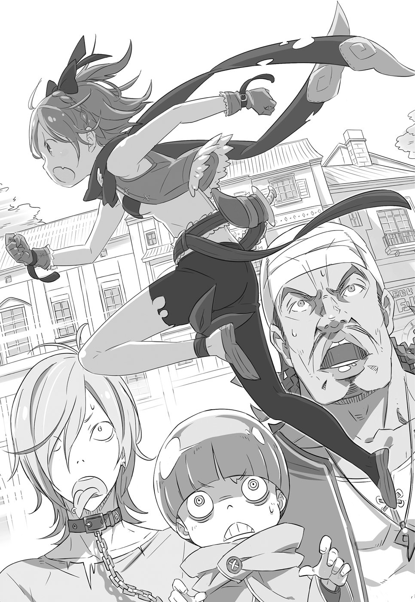
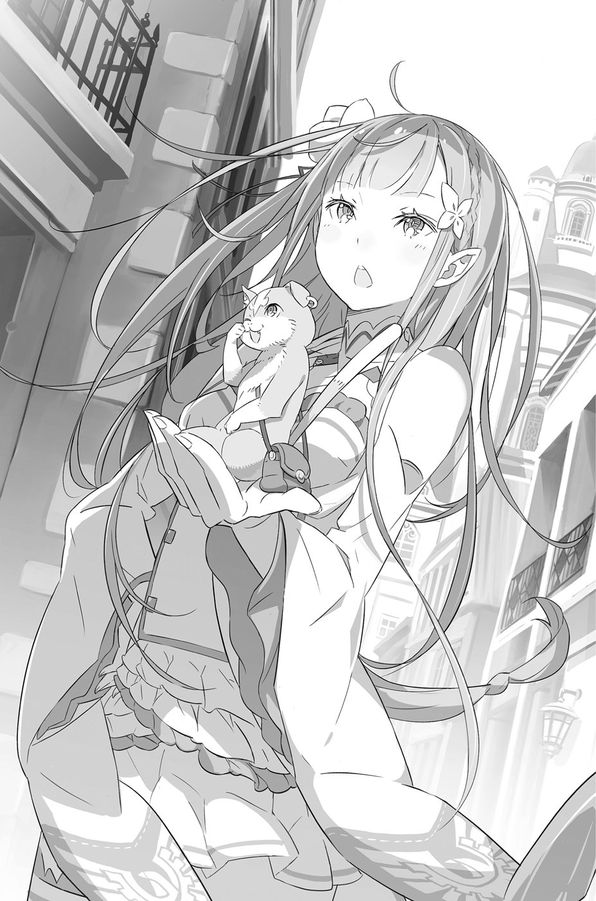
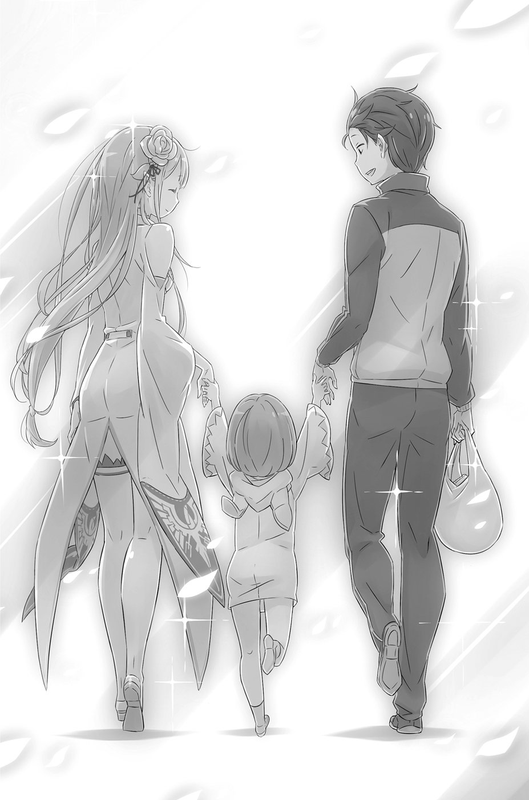
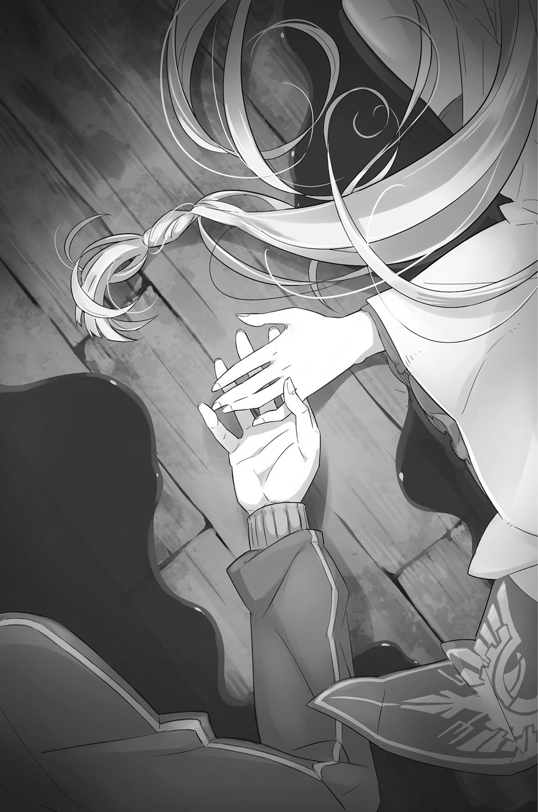

— Плохи мои дела… — пробормотал он в полнейшей растерянности.

Остаться без гроша в кармане — эта мысль совсем не поднимала настроение. Не то чтобы он был совсем нищим в кошельке ещё звенела кое-какая мелочь, — но с такими деньгами даже один раз в магазин не сходишь. Так что слова «ни гроша за душой» как нельзя лучше описывали положение, в котором он оказался. Да и деньги здесь явно другие…

Подкинув щелчком монетку в десять иен (редкую, с рифлёным ребром), юноша тяжело вздохнул.

Внешностью он ничем особенно не выделялся: среднего роста, с короткими тёмными волосами. Сложен был крепко — даже недорогой спортивный костюм сидел как влитой на мускулистом тренированном теле. Привлечь внимание мог разве что тяжёлый пристальный взгляд, да и тот сейчас не выражал ничего, кроме уныния.

В общем, самый обыкновенный парень, каких тысячи, хотя сейчас прохожие поглядывали на него, словно на какую-то диковинку. Впрочем, ничего удивительного. В конце концов, ни на одном из тех, кто разглядывал незнакомца, не было спортивного костюма, да и волосы у окружающих встречались какого угодно цвета — русые, рыжие, каштановые; попадались даже зелёные и голубые шевелюры — любые, но только не чёрные. К этому следовало добавить совершенно невероятные наряды: одни аборигены были экипированы в тяжёлые доспехи, другие щеголяли в лёгких платьях танцовщиц, третьи кутались в чёрные балахоны… Выглядело всё это совершенно не по-земному.

— Похоже, меня… м-м-м-м… — произнёс юноша, выдерживая натиск любопытных взглядов. — Точно!..

Щёлкнув пальцами, он, словно в подтверждение своей догадки, повёл рукой вокруг:

— …забросило в альтернативный мир!

Перед самым его носом прогрохотала повозка, запряжённая гигантским существом наподобие ящерицы.

Нацуки Субару родился на планете Земля, третьей по счёту от Солнца, в самой обычной японской семье. Так вкратце можно описать семнадцать лет его жизни. Уж если что-то и стоило добавить к его биографии, то только такую характеристику: «Ученик третьего класса старшей школы, склонный к прогулам».

В отличие от других, Субару не слишком задумывался о будущем и о выборе пути. Ломать голову над тем, нужно ли продолжить учёбу в университете или сразу устроиться на работу — вся эта житейская проза его не интересовала. В итоге количество пропусков росло как снежный ком, и вот он уже числился злостным прогульщиком, разрушая надежды родителей.

— И какой был смысл в этой школе, если в конечном счёте меня зашвырнуло в иной мир? — спросил он себя. — До конца я уже не доучусь, это факт.

Происходящее вокруг казалось Субару дурным сном, но, сколько он ни щипал себя, сколько ни мотал головой, проснуться так и не удалось. Стараясь скрыться от любопытных глаз, Субару свернул с широкого проспекта, миновал одну улицу и остановился в вымощенном булыжником переулке. Присев и переведя дух, он попытался обдумать свое положение.

— Похоже, это какой-то фэнтезийный параллельный мир, а цивилизация здесь на уровне средневековья. Машин, судя по всему, нет, но дороги неплохие. От моих денег, конечно, здесь никакого толку…

Для начала Субару решил выяснить, получится ли общаться с местными жителями и какая валюта у них в ходу. Он живо принялся за расследование и вскоре установил, что местный язык, к счастью, ему понятен, а в качестве денег используются золотые, серебряные и медные монеты. Правда, торговец фруктами, выбранный Субару для первого контакта, одарил его весьма недружелюбной гримасой.

Субару радовался уже тому, что для него, современного японского парня, помешанного на аниме и компьютерных играх, этот фэнтезийный сеттинг был довольно привычным. Приспособиться к нему не составляло труда. Наверняка любой подросток отдал бы всё на свете, лишь бы попасть в другую реальность, хотя…

— …вот только снарядить меня могли бы и получше. С таким набором особо не разгуляешься, — пожаловался он, оценив своё более чем скромное имущество.

Из снаряжения у Субару было вот что: мобильник (батарея скоро сядет), кошелёк (внутри куча дисконтных карт из видеопрокатов), лапша быстрого приготовления (со свининой на соевом бульоне, купил в дежурном магазине), пакетик с кукурузными палочками (куплен там же), любимый спортивный костюм (не стиранный), изрядно поношенные кеды (служат третий год).

Хоть бы Экскалибур[^1] какой-нибудь дали, да ведь и того нет. Вот же чёрт! И что мне, спрашивается, с этим всем делать?

Что-либо сделать было невозможно. Переход произошёл как раз в тот момент, когда Субару выходил из магазина. Он и глазом моргнуть не успел.

Предаваясь грустным размышлениям, юноша не заметил, как наполовину опустошил пакетик с чипсами единственный предмет его экипировки, полезный и в этом мире. Спохватившись, он выругал себя за потворство желудку, но бесценный запас провизии было уже не вернуть.

В душе Субару ещё теплилась надежда, что он находится внутри огромного павильона со скрытыми камерами, однако снующие туда-сюда повозки, запряжённые звероящерами, и внешний вид прохожих намекали на то, что иллюзий питать не стоит.

— Все ведут себя как ни в чём не бывало. — Субару нахмурился. — И эти ящерицы, и полулюди… Как будто так и надо.

Перед его глазами то и дело мелькали странно одетые личности с волосами всех цветов радуги. И всё же, самым убедительным аргументом в пользу сверхъестественности происходящего было присутствие полулюдей. Больше всего бросались в глаза собачьи и кошачьи уши, но попадались даже гибриды человека и рептилии. В то же время встречались и обычные люди, такие же, как Субару.

— Мир с фантастическим антуражем, значит, здесь наверняка должны быть и войны, и всякие приключения. Водятся ли тут привычные мне звери, сразу и не поймёшь, но, судя по тому, как ящерицы таскают повозки, люди используют животных так же, как и у нас…

«Хоть что-то стало проясняться», — подумал Субару и с шумом выдохнул. Если события будут разворачиваться по законам фэнтезийного мира, то, вооружённый современными знаниями, он далеко пойдёт!

— И всё-таки не могу понять, как же меня угораздило так влипнуть? — продолжал он беседу с самим собой. — Сквозь зеркало вроде не проходил, в пруд тоже не падал… И вообще, если уж на то пошло, где же та красотка, которая по канону и должна была меня сюда призвать?

«Что же это за альтернативный мир, если в нём нет главной героини? — продолжал он свои рассуждения. — В двухмерном анимешном мире такое разгильдяйство просто немыслимо. Призвать человека и оставить его болтаться без цели… Надувательство какое-то».

Теперь, когда удалось составить первое представление о новой реальности, Субару погрузился в привычное отстранённое состояние.

— Если подумать — какая же тут разница с моим прежним комнатным затворничеством? — хмыкнул он.

В голове вдруг всплыли образы родителей. Однако тосковать по дому было некогда: так или иначе, требовалось что-то предпринять. Поднявшись, Субару собрался было выйти на боковую улицу, но дорогу ему неожиданно преградили. Торопливо извинившись, Субару обошёл незнакомца сбоку, но тот схватил его за плечо и швырнул обратно в переулок.

Незнакомцем оказался подозрительного вида здоровяк, за спиной которого Субару заметил ещё двоих местных обитателей. Сообщники заняли позиции, полностью перекрывающие путь к бегству. От их слаженных действий юношу охватило неприятное предчувствие.

— Э-э-э… Позвольте поинтересоваться, что добрым горожанам от меня нужно? — Он постарался быть любезным.

— Гляди-ка, знает своё место! — ухмыльнулся здоровяк. — Давай, выворачивай карманы, не то будет больно!

— Чуяло моё сердце, — прошептал Субару. — Чёрт бы вас побрал…

Шайка презрительно скалила зубы. Выглядели они лет на пять-десять старше Субару, одеты были как оборванцы, а физиономии имели типично бандитские. На полулюдей не похожи, но и к положительным героям явно не относились. Скорее, уличные разбойники — стандартная опасность, присущая подобным фэнтезийным сюжетам.

— Чёрт! Похоже, я обязан пройти этот квест[^2]…

Заискивающе улыбаясь, чтобы потянуть время, Субару прикидывал, как выпутаться из этой передряги. Ему вспомнилось, что люди, призванные в альтернативный мир, зачастую приобретали сверхъестественные способности. Если в его случае действовали те же правила, значит, и он наделён какой-то особенной силой.

Одна лишь мысль об этом вызвала в теле приятную лёгкость. Субару прислушался к своим ощущениям.

— Кажется, сила тяжести здесь раз в десять меньше, чем в нормальном мире. Я смогу!.. Прикончу эту кучку мобов[^3] и передо мной откроется светлое будущее!

— Чего это он там бормочет?

— Чёрт его разберёт. Видно, решил над нами поиздеваться. Да я ему башку откручу!

— Это я вам откручу! Вы ещё ответите за свои слова! — выпалил Субару и, повернувшись к здоровяку, зарядил ему в физиономию сокрушающий прямой удар правой. С ободранных от столкновения с челюстью костяшек закапала кровь.

«Первый раз ударил человека! — пронеслось в голове Субару. Файтинги[^4] были его излюбленным игровым жанром, однако в настоящих драках ему участвовать не доводилось. — А это, оказывается, больнее, чем я думал».

От удара здоровяк рухнул на землю. Ощущая прилив энергии, Субару подскочил к следующему противнику, разинувшему рот от удивления. Удар ногой с разворота в висок впечатал того в стену; разбойник задёргался в конвульсиях и вскоре затих.

Начало было многообещающим, и Субару почти уверился в том, что в альтернативной реальности ему не будет равных.

— В этом мире силы мне не занимать! Вот это драйв!.. Ну, сейчас я тебе покажу!..

Повернувшись, он бросился к последнему головорезу, но в руке у того внезапно сверкнул нож. Не сбавляя хода, Субару бухнулся на колени и, униженно согнувшись пополам затормозил лбом о мостовую.

— Прошу прощения, я был не прав, полностью признаю свою вину, тысяча извинений!.. — торопливо затараторил он, приняв позу, выражающую безоговорочную капитуляцию. Ниже японцу падать просто некуда. Ещё недавно переполнявший его боевой дух исчез без следа. Сжавшись в комок и побелев от страха, Субару отчаянно просил пощады в надежде на снисхождение.

А что было делать? Сколько ни тягай гантели, а против ножа не попрёшь: проткнут живот — поминай как звали. Все люди смертны, увы…

Тем временем пришли в себя два других разбойника, которые, казалось, должны были валяться без памяти. Субару ошарашено наблюдал, как они утирают разбитые носы и трясут головами. Оба снова поднялись на ноги как ни в чём не бывало.

— Как же так?.. Это всё, на что способен мой смертельный удар? А как же мои суперспособности?!

Суперспособности явно подкачали, никакой особенной силы у Субару не появилось.

— Что за чушь ты там опять несёшь? — послышался голос одного из головорезов. — Ну, пеняй теперь на себя!

Удар ногой пришёлся Субару по голове. Со лба, разбитого о мостовую, заструилась кровь. Разбойники принялись по очереди пинать скрюченную жертву. В драку первым полез именно он, поэтому пощады ждать не стоило.

«Чёрт, как же больно! Они меня убьют, это точно…» — мысленно простонал Субару. В отличие от родного мира, здесь никто не даст гарантии, что шпана не забьёт его до смерти. Может, попробовать умереть смертью храбрых? Субару попытался приподняться, чтобы достойно ответить обидчикам, но его тут же снова прижали к земле.

— Ай-ай-ай, больно же! Что ж вы делаете?!..

— Куда рыпаешься, щенок! — наступив Субару на руку, головорез поигрывал ножом. — Лежи и не дёргайся, пока мы тебя не выпотрошим! Будешь знать, как корчить из себя героя!

— З-зря стараетесь, денег у меня всё равно нет!..

— Зато тряпьё годное, да и башмаки твои нам пригодятся. А сам пойдёшь на корм местным крысам.

«В этом мире тоже есть крысы? — мельком подумал Субару. — Надеюсь, не такие огромные, как те чудовища с повозками»…

Привычно отстраняясь от реальности, Субару равнодушно смотрел на клинок, готовый вонзиться в него в любую секунду. «Странно, — задумался он. — Перед глазами не мелькают картины из прошлого, даже время не замедляется. Неужели всё оборвётся в один миг, как тонкая нить…» Внезапно в ушах зазвенел чей-то отчаянный крик:

— Эй вы, там!.. А ну-ка, с дороги!!! Посторонись!

Оторопев от неожиданности, бандиты подняли головы. Субару, не в силах пошевелиться, лишь скосил глаза в сторону, откуда донёсся шум.

По переулку мчалась светловолосая девчонка небольшого роста. Развевающиеся прядки до плеч, дерзкий огонёк в глазах, торчащий изо рта заострённый клычок — всё это придавало ей задорный хулиганский вид. И хотя с первого взгляда она производила впечатление дерзкой разбойницы, казалось, улыбка сделала бы её личико весьма миловидным.

В глазах Субару вновь забрезжил едва не угасший лучик надежды. Именно такого развития сюжета и следовало ждать, это выглядело вполне логично. Одетая в грязные обноски девчонка случайно натыкается на сцену разбоя с убийством. Наверняка теперь, из чувства справедливости, она спасёт Субару от неминуемой гибели!..

— Ничего себе картина! — маленькая разбойница на секунду притормозила. — Извини, рада бы помочь, но у меня дела. Давай, не кисни!

— Не понял?.. — последняя надежда разбилась вдребезги.

Махнув Субару на прощание рукой, словно извиняясь, девчонка с прежней прытью промчалась вглубь переулка, туда, где был тупик… Мелькнув за спинами головорезов, она запрыгнула на какую-то доску, приткнутую к стене, ловко вскарабкалась на крышу и исчезла.

В переулке снова воцарилась тишина. Девчонка пронеслась, как ураган, оставив всех четверых ошеломлёнными. Впрочем, положение Субару от этого нисколько не изменилось.

— Надеюсь, это отбило у вас желание меня калечить?..

— Скорее, наоборот, только раззадорило! На быструю смерть не рассчитывай!

По-прежнему прижатый к земле, Субару не мог пошевелить ни рукой, ни ногой. В блеске отточенного клинка ясно ощущалось неумолимое приближение смерти.

«Нет, не может быть!.. Неужели я умру вот так, бесславно

Губы Субару скривились в истерической усмешке. Не помня себя, он взмолился, чтобы всё это оказалось розыгрышем. Однако нависший клинок не сулил ничего хорошего.

Юношей овладело отчаяние, он чувствовал, что вот-вот расплачется. При мысли о столь нелепом конце его переполнял не просто ужас, а чувство глубокого опустошения.

Субару уже окончательно простился с жизнью, как вдруг…

— Ни с места, злодеи!

Казалось, этот возглас заполнил собой всё пространство, заглушив и шум толпы на улице, и глумливое хихиканье разбойников, и тяжёлое дыхание Субару, и заставил содрогнуться весь мир.

В таких случаях говорят: время замерло.

У входа в переулок стояла девушка. Настоящая красавица. Серебристые волосы, украшенные лентами, спускались до пояса. В глазах цвета фиалки светился ум, строгий взгляд направлен на разбойников. В нежных чертах лица — сочетание женской привлекательности и детской наивности. Во всём её аристократическом облике ощущалось роковое очарование.

Незнакомка была на голову ниже Субару и носила светлую, без чрезмерных украшений одежду, которая только подчёркивала её внутреннюю силу. В глаза бросалась лежащая на плечах белая накидка с вышивкой в форме ястреба, она придавала девушке величественный вид. И всё же, весь этот наряд служил не более чем обрамлением к великолепному образу строгой красавицы.

— Я не могу смотреть сквозь пальцы на произвол, который вы учинили. Всему есть предел!

Голос, ласкающий слух, подобно серебряному колокольчику, сразил Субару наповал. Он даже позабыл о своём бедственном положении. Головорезы тоже пришли в полное смятение.

— Что?.. Чего тебе надо?..

— Если вы немедленно прекратите, на этот раз я вас прощу, — заявила девушка. — Сама виновата, нельзя быть такой рассеянной. Ведите себя как добропорядочные граждане и верните то, что взяли.

— Костюмчик у тебя не из дешёвых, — заметил один из шайки. — Видать, знатная мадемуазель!.. Не понял, чего мы там у тебя взяли?

— Пожалуйста, он мне очень дорог. В ином случае я бы не стала беспокоиться, но вы взяли то, что не следовало. Прошу вас, будьте хорошими мальчиками, отдайте его.

В её голосе слышались нотки мольбы. Однако в атмосфере уже начало сгущаться необъяснимо гнетущее чувство опасности. Нечто такое, что было трудно передать словами.

— Погоди, погоди! Совсем с толку сбила…

— Что вы хотите этим сказать? — немного помедлив, спросила девушка.

Головорезы указали на Субару:

— Ты разве не его спасать явилась?..

Кажется, она впервые обратила внимание на человека, распростёртого у их ног.

— Хм, выглядит он довольно странно. Похоже, я помешала вам выяснять отношения. Нехорошо, когда трое на одного… Но какое мне до всего этого дело? Боюсь, что никакого.

Её голос выдавал лёгкое раздражение. Видимо, девушка решила, что собеседники пытаются уклониться от темы. Заметив эту перемену в её интонации, члены шайки принялись оправдываться, перебивая друг друга и размахивая руками:

— Постой! Если ты не за ним, то мы тогда ни при чём! Это всё та соплячка!..

— А-а, так тебя обокрали?.. Видишь ту стену? Она по стене вскарабкалась и ускакала дальше по крышам!..

— Вон туда, в тупик побежала! Такая прыткая, уже, небось, в трёх кварталах отсюда!..

Слушая этот галдёж, сереброволосая незнакомка опустила глаза на Субару. Заметив её вопросительный взгляд, юноша машинально кивнул.

— Гм… Похоже, они не лгут. Значит, воровка побежала туда? Пожалуй, мне следует поторопиться…

Развернувшись к Субару спиной, девушка направилась прочь. Головорезы выдохнули. Субару ошарашенно глядел ей вслед. Казалось, от него отвернулся весь мир…

Внезапно красавица остановилась.

— И всё же, я не могу равнодушно смотреть на то, что здесь происходит.

С этими словами девушка повернулась к шайке, выставив перед собой раскрытую ладонь. В воздухе бешено завихрились яркие вспышки, послышалось несколько глухих ударов, как от бильярдных шаров, врезающихся в чью-то плоть. По переулку разнеслись истошные крики. Головорезов снесло, словно порывом ветра.

В следующий миг на мостовую рядом с Субару со свистом приземлилось несколько кусков льда размером с кулак. Взявшись из ниоткуда, вопреки всем законам физики, град тут же растаял, не оставив и следа.

— Магия!.. — сорвалось с губ Субару. Самое подходящее слово, чтобы объяснить увиденное. Он не слышал заклинаний, но, несомненно, эти льдинки вылетели из ладони девушки.

Магия… Впервые столкнувшись с ней, Субару был немало удивлён.

— Я думал, будет выглядеть более волшебно… — с сожалением признал он. — А в реале довольно унылое зрелище.

Ни тебе лучей во все стороны, ни фонтанов энергии… Вместо этого бесформенные куски льда вдруг появляются из воздуха, врезаются в людей, сбивая их с ног, и так же неожиданно исчезают. Ни атмосферности, ни черта вообще…

— И ты нарываешься?! — Разбойникам, получившим чувствительные удары самым настоящим градом, было не до атмосферности. Двое из них с трудом поднялись и теперь стояли на трясущихся ногах, третьему же волшебный снаряд угодил в уязвимое место, и тот лежал без чувств. Вид оглушённого приятеля не на шутку разозлил головорезов. Один из них выхватил свой нож, в руках второго возникла дубинка. Банда приготовилась к атаке.

— Теперь нам до фонаря, кто ты там, волшебница или аристократка! — прошипел первый, прижав ладонь к носу, чтобы остановить кровь. — Мы это так не оставим! Сотрём тебя в порошок! Двое на одного — как тебе такой расклад, а?

Девушка прищурилась:

— Хм, пожалуй, одной против двоих мне не справиться.

— Как насчёт двое на двое? — вдруг прозвучал новый топкий голосок, словно подражая её интонации.

Глаза Субару испуганно метнулись из стороны в сторону. Разбойники тоже растерялись и удивлённо оглядывались по сторонам, но никого, кто мог бы говорить этим голосом, рядом не обнаружилось.

Словно для того, чтобы рассеять замешательство, девушка вытянула вперёд левую руку. На её бледной, как мрамор, ладони возникло нечто.

— Не смотрите на меня так, я смущаюсь.

Сидя на задних лапках и застенчиво потирая мордочку, перед зрителями предстал небольшой котик. Размером он был как раз с ладонь. Шёрстка дымчатая, одно ушко повисло. Насколько мог судить Субару, породой он больше всего походил на американских короткошёрстных. Отличался он разве что розовым носом и длинным, почти как его собственное тело, хвостом.

Увидев это, головорез с ножом в ужасе воскликнул:

— Так ты призываешь духов?!

— В точку, — ответила девушка. — Если уберётесь сию же секунду, я не стану вас преследовать. Решайте живее, мне некогда.

Разбойники торопливо подхватили тело своего дружка и Устремились к выходу из переулка. Минуя девушку, один из них оскалился и тихо, но угрожающе произнёс:

— Ну всё, дрянь, я тебя запомнил. Теперь ходи да оглядывайся…

— Если с ней что-нибудь случится, я навечно прокляну тебя и всех твоих потомков. Хотя вряд ли они у тебя будут, — сообщил кот. Несмотря на его лёгкий, не слишком серьёзный тон, угроза прозвучала весьма убедительно.

Головорезы ещё больше побледнели и молча растворились в уличной толчее. Оставшись наедине с волшебницей и её пушистым спутником, Субару решил, что ему стоит поблагодарить своих спасителей. Превозмогая боль, он хотел уже приподняться, как вдруг ледяной повелевающий голос снова пригвоздил его к земле…

— Не двигайся!

В голосе сереброволосой красавицы не было и намёка на сострадание, на лице читалось недоверие. Она, конечно, понимала, что Субару не являлся сообщником тех бандитов, однако, судя по настороженному взгляду, явно не считала это поводом терять бдительность. Но этот взгляд, направленный на Субару, вызвал в нём совсем не ту реакцию, которую от него ждали.

Колдовские фиалковые глаза заворожили юношу. Неизбалованный вниманием таких красавиц, Субару немедленно покраснел и отвёл взгляд. Девушка усмехнулась:

— Ага! Если ты прячешь глаза, твоя совесть нечиста. Меня не проведёшь!

— Ну, не знаю… Обычная реакция подростка, ничего злодейского в нём я не чувствую, — заметил кот.

— Помолчи, Пак, — бросила незнакомка и снова обратилась к Субару: — Слушай, ты ведь знаешь её? Ту девочку, что украла у меня значок?

Решительность, с которой говорила девушка, была ей очень к лицу.

Не хочу расстраивать… — начал Субару. — Но я совершенно ничего о ней не знаю. Не имею ни малейшего представления…

— Правда?.. Не может быть!..

Деланная самоуверенность на лице девушки исчезла. Перестав изображать суровую волшебницу, она обратила встревоженный взгляд на своего компаньона, по-прежнем восседавшего на её ладони.

— Как же… как теперь быть?.. Кажется, я потратила время даром…

— И продолжаешь тратить, — сказал кот. — Полагаю, тебе стоит поспешить. Преступница очень быстро бегает, не иначе как пользуется неким таинственным покровительством.

— Пак, ты говоришь так, будто тебя это не касается.

— Сама же сказала, чтобы я не совал свой нос в твои дела. Кстати, а с ним что будешь делать?

— Ой, точно!.. — незнакомка вдруг вспомнила о существовании странного юноши.

Субару мрачно ухмыльнулся: надо же, про него снова заговорили. Делая вид, что с ним всё в порядке, он предпринял вторую попытку подняться на ноги.

— Спасли меня, и на том спасибо. У Вас ведь свои дела? Тогда лучше поторопитесь…

Пригладив растрёпанные волосы и старательно улыбаясь, Субару приготовился добавить: «Хотя я мог бы вам помочь. Что скажете, леди?», но мир перед глазами вдруг куда-то поплыл…

— Парень, лучше тебе не…

Субару попытался опереться о стену, но рука соскользнула, и он грохнулся на землю ничком.

— «…вставать» — хотел я сказать, но, видимо, опоздал, — закончил свою фразу кот.

Боль от удара о мостовую была так сильна, что Субару почувствовал дурноту. Сознание начало гаснуть.

— И что теперь делать? — спросил кот.

— Не моя забота. Умереть он не умрёт. Оставим его здесь

Субару слышал их диалог будто издалека. «Вот он каков, альтернативный фэнтезийный мир, — пронеслось в голове. — Здесь даже милосердие выглядит сурово. Неужели бросят?.. Хотя, учитывая, что я чуть не умер, можно считать, что мне повезло».

— Ты уверена?

— Уверена!

На короткое мгновение, как раз перед тем, как окончательно впасть в забытьё, он поймал взгляд немного покрасневшей сереброволосой красавицы.

— Ещё чего!.. Никого спасать я не собираюсь!

«Но её личико такое хорошенькое, даже когда она злится…»

Сознания Субару погрузилась во мрак.

«Когда просыпаешься, такое чувство, будто выныриваешь из воды», — подумал Субару.

В щели приоткрытых век ворвалось яркое солнце. Он зажмурился и потёр глаза. Просыпался Субару всегда легко: стоило открыть глаза, как голова сразу же начинала работать.

— А, очнулся?

Голос звучал откуда-то сверху, прямо над головой Субару. Юноша хотел было повернуться в ту сторону, когда вдруг понял, что лежит на земле, а голова его покоится на чём-то мягком, как на подушке.

— Лучше пока не двигайся, — ласково предупредил голос. — Вон как тебе досталось, надо поберечься.

Субару вспомнил то, что произошло за миг до потери сознания, и тут, подобно откровению свыше, его осенила мысль: сейчас ему позавидовал бы любой парень на свете!

Девичьи колени…

Прикинувшись, что ещё не полностью пришёл в себя, Субару заворочал головой, стараясь сполна насладиться моментом. На пике высшего блаженства его щека коснулась на удивление мягкой пружинящей шёрстки.

— Я и не знал, что у красавиц такие волосатые ноги… — до Субару вдруг дошло, что он сморозил что-то не то. — Стоп! Откуда шерсть?! — он распахнул глаза.

Теперь Субару смог ясно увидеть картину мира, хоть и перевёрнутую. Его взору предстала кошачья морда чудовищных размеров.

— Небольшая добрая услуга, чтобы сделать тебе приятно — хотя бы пока ты в обмороке.

— Для начала перестань говорить этим жутким фальцетом! Не думай, я не такой дурак, чтобы спутать кота с главной героиней.

Голова Субару лежала на коленях у кота, выросшего до человеческих размеров. Сказать кому — не поверят! Несмотря на это, он не смог отказать себе в удовольствии снова зарыться лицом в пушистый мех.

— С ума сойти, вот это кайф… Теперь я понимаю людей, которые тискают кошек до посинения.

— Надо же. Значит, не зря я старался, делая себя покрупнее, да? — Кот-гигант смущённо почесал у себя за ухом и, глядя в сторону, кому-то подмигнул. Знак был адресован сереброволосой девушке, она стояла на углу, скрестив руки на груди, и строго глядела на Субару.

Да, это была она. Та самая, чей образ навечно впечатался в память и в сердце Субару, перед тем как он потерял сознание. В ответ на слова своего компаньона девушка тихонько вздохнула и подошла ближе.

— Э-э-э… Извини, что так вышло, — пробормотал Субару. — Из-за меня тебе пришлось задержаться…

— Не обольщайся, — резко ответила девушка. — у меня просто есть к тебе кое-какие вопросы, поэтому я и осталась. В противном случае я бы бросила тебя не раздумывая. Так что не сочиняй ничего лишнего.

Не обладая иммунитетом к женской красоте, Субару даже и не пытался противиться её напору. Пропустив мимо ушей смысл сказанного, он лишь послушно кивнул.

— Да, я залечила твои раны и попросила Пака, чтобы он побыл с тобой, пока не очнёшься, но всё это я сделала ради себя самой. Так что теперь ты передо мной в долгу.

«Сделанное добро вернётся сторицей». Судя по всему, красавица решила проверить это выражение на практике.

— Звучит так, будто я тебе по гроб жизни обязан, — сказал Субару, — Ну, если хочешь меня о чём-то попросить — пожалуйста.

Девушка нахмурилась и отрицательно покачала головой.

— Ничего подобного, Это не просьба, а приказ. Она секунду помедлила и, понизив голос, спросила: Скажи, тебе известно что-нибудь о моём украденном значке?

Вспомнив, что уже слышал подобный вопрос, Субару озадаченно наклонил голову.

«Точно такой же разговор здесь уже был, как раз перед тем, как я выключился, — размышлял Субару. — Значок… Наверно, что-то вроде нагрудного знака, который носят полицейские. В любом случае я без понятия…»

— А ты сама, пока я был без сознания, головой не ударялась? — спросил он девушку.

— Ничего такого не было, да и прошло всего минут десять. Не уходи от ответа!

— При всем желании, я вряд ли помогу… Чего не знаю, того не знаю.

Девушка удовлетворённо кивнула. Судя по её виду, она совсем не расстроилась.

— Что ж, ничего не поделаешь. Но ты рассказал мне, что ничего не знаешь, поэтому мы в расчёте.

Её логика смутила бы даже матёрого афериста, так как ставила девушку в заведомо невыгодное положение. Пока сбитый с толку Субару таращился на неё, красавица с облегчением хлопнула в ладошки и вдруг заторопилась:

— Ну, ладно. Я пойду. Твои раны почти зажили, а этих разбойников я так здорово припугнула, что их наверняка можно не опасаться. Но всё же не стоит бродить по безлюдным переулкам в одиночестве. Нет, не подумай, что я за тебя волнуюсь, это просто совет. Учти: если снова влипнешь в историю, мне не будет никакого смысла тебя выручать. Так что надейся сам на себя.

Приняв молчание Субару за согласие, она кивнула на прощание и резко повернулась на каблуках. Длинные волосы цвета серебра взметнулись вслед её движению, загадочно блеснув во мраке переулка. Заворожённый этим зрелищем, Субару не заметил, как меховая подушка под его головой исчезла. Еле удержав равновесие, он поспешно приподнялся, опёршись на руки.

— Ты уж извини, она у меня такая притворщица, — сказал кот шутливым тоном, словно пытаясь сгладить ситуацию. — Не подумай ничего плохого… — в следующее мгновение он вернулся к своему прежнему размеру и оказался сидящим у девушки на плече. Красавица провела рукой по кошачьей спинке, как бы убеждаясь, что компаньон на месте, и его дымчато-серая фигурка словно растворилась, нырнув в серебристый водопад волос.

Девушка не оборачиваясь стремительно зашагала прочь. Глядя ей вслед, Субару задумался, чего же на самом деле добивалась эта, как назвал её кот, «притворщица».

С одной стороны, ей определённо не терпелось вернуть украденную вещицу. Тем не менее она спасла его от банды, излечила раны и, вдобавок ко всему, выдумала дурацкую отговорку, чтобы он не чувствовал себя обязанным. На обычное притворство это не тянуло. Похоже, она помогла в ущерб себе самой.

А ведь она имела полное право обвинить его в том, что надолго застряла в этом переулке. Однако же не стала ни в чём упрекать, даже не потребовала извинений или благодарности. Потому что, по её же собственным словам, выручила Субару чисто из эгоистических соображений.

— С такой философией далеко не уедешь, — сказал Субару, поднялся с земли, отряхнулся от пыли и бросился вслед за ней.

На спортивном костюме темнели кровавые пятна, но боль почти не чувствовалась — и это несмотря на все побои. Юношу вновь охватило благоговение перед силой магии, и он почувствовал, что по-настоящему благодарен этой волшебнице за её бескорыстную помощь.

— Эй, подожди! — окликнул он девушку, которая уже вышла на боковую улицу и раздумывала, в какую сторону двигаться дальше. Она обернулась и несколько озадаченно поправила свои длинные серебристые волосы.

— Что ещё? Учти, у меня нет времени на долгие беседы.

— Да ладно, не кокетничай. Послушай, ты, кажется, говорила о какой-то очень ценной для тебя вещи. Позволь мне помочь!

Предложение Субару её удивило. Она растерянно заморгала.

— Но ты же сказал, что ничего не знаешь…

— Да, я не в курсе, как зовут воровку, где она, скажем родилась и в какую школу ходила, но я её видел, по крайней мере! Белобрысый такой бесёнок, и остренькие клыки торчат! Ростом пониже тебя будет, и грудь едва заметна. Короче, года на два-три моложе тебя. Ну как? Это уже кое-что, а?..

Субару имел дурную привычку: в любой волнующей ситуации он начинал тараторить и временами сам себя не понимал. Вот и сейчас, горя от нетерпения и желая поделиться тем, что знает, он выпалил свою тираду так неловко, что сам немедленно смутился и покраснел.

Красавица молчала. Пауза длилась и длилась, и это было столь мучительно, что юношу пробил холодный пот. Подмышки и ладони предательски взмокли, а сердце колотилось так, что перехватило дыхание. От напряжения в глазах у Субару стало темнеть, даже нос заложило, как при аллергии, — кажется, на него навалились все беды разом…

— Странный ты какой-то, — задумчиво приложив палец к губам и склонив голову, девушка смерила его оценивающим взглядом. Под её пристальным взором юноша почувствовал себя диковинным зверьком. — Учти, я никак не смогу тебя отблагодарить. Может, кажется иначе, но денег у меня нет.

— Не беспокойся, у меня тоже ни гроша, — сказал Субару.

— Кстати, и я гол как сокол. Ну и компания подобралась!.. — донёсся голос кота, который так и прятался в гуще серебристых волос своей хозяйки.

Субару ударил себя кулаком в грудь:

— Да и вообще, ничего мне не нужно! Наоборот, это я хочу тебя отблагодарить, поэтому и предлагаю помощь!

— Меня не за что благодарить. Если ты о ранах, то мы уже в расчёте, — продолжала настаивать красавица.

«Вот же упрямая», — подумал Субару.

— Тогда… я тоже помогу тебе ради себя самого. Пусть моей целью будет… м-м… скажем, каждый день — по доброму делу!

— Доброму делу?..

— Да. Делать каждый день что-нибудь хорошее. Тогда после смерти попадёшь в рай. Говорят, там не жизнь, а сказка, потому я и хочу тебе помочь. Как видишь, я преследую исключительно свои личные интересы.

Понимая, что несёт полную околесицу, Субару всё же сумел выразить то, что хотел. Кажется, его решимость заставила девушку о чём-то глубоко задуматься. Сидевший у неё плече кот мягко коснулся лапкой её щеки.

— В его словах нет злого умысла. Почему бы нам не принять его предложение? Отправляться на поиски в огромном городе без какой-либо зацепки попросту бессмысленно.

— Не хотелось бы втягивать его во всё это…

— Конечно, очень мило, когда девочки упрямятся, но упорствовать в ущерб себе неразумно, правда? Я не хочу, чтобы о моей девочке думали, будто она глупышка…

Кажется, Субару обрёл поддержку в лице кота, однако девушка по-прежнему колебалась. Кот вдруг посерьёзнел и уже безо всяких шуток добавил:

— К тому же смеркается. Когда наступит вечер, я не смогу тебе помогать. Конечно, с парочкой разбойников ты и сама справишься, но всё-таки… ещё один щит нам не помешает.

— Щит?.. Моя роль начинает меня пугать! Хотя подожди-ка! — Субару наклонился к коту. — То есть получается, что в ночные смены ты не выходишь?

— Можно сказать, просто не могу выходить, — ответил кот, поглаживая усы. — Я всё-таки дух, несмотря на мой внешний вид. Материализация требует много маны[^5], поэтому вечером я возвращаюсь в свой кристалл и восстанавливаю силы до восхода солнца. В идеале мой рабочий день должен длиться примерно с девяти до пяти.

— С девяти до пяти… Говоришь словно какой-нибудь канцелярский служащий. Не ожидал, что у духов такой строгий график!..

Нужно сказать, даже теперь, запросто болтая с духом Субару не чувствовал особенного удивления. Наверное, дело было в том, что современные отаку[^6], отравленные ядом манги и аниме, ещё и не на такое способны — хоть какая-то польза государству.

Пока Субару беседовал с котом, девушку явно одолевали сомнения. Однако в итоге чаша весов всё же склонилась в сторону юноши, и красавица наконец неуверенно проговорила:

— Я ведь и правда не смогу ничем тебя отблагодарить…

Как бы то ни было, эти слова означали, что предложение Субару оказалось принято.

С момента первого дружественного для Субару контакта, то есть со времени душевной беседы в переулке, прошёл целый час, а расследование так и не сдвинулось с мёртвой точки.

— Ну, и как это понимать? — красавица бросила на него холодный взгляд. Субару поскрёб в затылке в надежде скрыть неловкость.

— Откуда ж я мог знать, что нам попадётся такое трудное дело?..

— Кажется, ты слишком высокого о себе мнения. Только вот результата никакого: куда ни кинь — всюду клин.

— Кто ж так в наше время выражается?..

По взгляду девушки Субару понял, что замечание ей не понравилось, и втянул голову в плечи. Они снова стояли в том же самом переулке.

Конечно, имелось несколько обстоятельств, серьёзно осложняющих поиски. Во-первых, незнание местности. Хотя Субару как новичку это было простительно. Однако девушка тоже, по-видимому, оказалась слабо знакома с топографией города, и оба, понадеявшись друг на друга, потеряли кучу времени. Смех да и только! Вот только его спасительница, как заметил Субару, ничуть не веселилась…

Во-вторых, иероглифы, которыми было исписано всё вокруг. Несмотря на отсутствие проблем при устном общении, местная письменность — если только это были не какие-нибудь магические формулы для отпугивания злых духов оставалась абсолютно нечитаемой. Субару не мог разобрать даже дорожные указатели.

Иными словами, то, что подразумевалось само собой — способность призванного попаданца понимать живую речь и письменность нового мира, — сработало лишь наполовину. Хотя, не понимай он речи, уже валялся бы где-нибудь под забором… Учитывая этот факт, нельзя было сказать, что ему действительно сильно не повезло.

— Нет, всё-таки уровень сложности можно было бы и пониже сделать… — пробурчал Субару.

Этот мир был явно недоработан: куда ни плюнь — сплошные недоделки. Юноша вспомнил, какие невзгоды ему пришлось здесь вынести, и тяжкий вздох вырвался из его груди. Затем он снова обратил внимание на свою спутницу, она отстранённо стояла у стены и что-то шептала, опустив ресницы.

— Что это она делает?..

— А, с низшими духами разговаривает.

Субару в испуге вскинул брови, заметив прямо перед собой дымчатого компаньона красавицы.

— Я думал, ты уже дома, а ты, оказывается, тут как тут!

— Время ещё есть. В отличие от низших, я работаю на совесть.

— Здорово, когда работа по душе, — сказал Субару. — А что это за низшие духи такие?

«Наверное, как обычные духи, только пониже рангом», предположил юноша. Будто услышав мысли, кот, всё так же паря в воздухе и помахивая своим длиннющим хвостом, пояснил:

— Низшие духи — это такие сущности, которые пока не обладают достаточным разумом, чтобы быть полноценными духами. Они ещё немного наберутся сил и осознанности и станут такими, как я.

Слушая объяснения и кивая в ответ, Субару краем глаза заметил какое-то слабое свечение. Словно стайка светлячков, сереброволосую красавицу начали окружать тусклые огоньки.

Картина выглядела совершенно завораживающей. Нельзя было даже помыслить о том, чтобы нарушить это хрупкое очарование. Казалось, священнодействие дозволено видеть лишь избранным.

— Ничего себе разлетались! Это чё, всё духи?

Фамильярная реплика Субару явно нарушила её сосредоточенность.

— Ой! — испуганно вскрикнула красавица, в глазах сверкнули слезинки. Будто ощутив её тревогу, огоньки затрепетали и стали хаотично перемещаться.

— Ох ты, забегали, забегали!.. — наблюдая за роем мечущихся то вправо, то влево светлячков, Субару пришёл в восторг. Ещё несколько мгновений — и огоньки растаяли в воздухе, словно туман.

Спутники принялись озираться кругом в поисках исчезнувших светлячков. Девушка торопливо провела свой обряд ещё раз, но теперь уже безрезультатно.

— Ну вот! Пропали! Что же ты наделал?!

— Ух, извини! — сконфузился Субару. — Просто я раньше никогда не видел духов, вот и перевозбудился чуток. Тем более выглядели они совсем не опасно…

— Скажи спасибо моему опыту! Будь вместо меня какой-нибудь недоучка, всё кончилось бы очень плохо! Духи могли выйти из-под контроля! Горе ты луковое!..

— Луковое?.. — Субару понимал, что его стоит сурово отчитать за глупость, но чтобы такими словами… — Ну ладно тебе делать из мухи слона. Что, эти светлячки опасные, что ли?

— Конечно, — вступил в разговор кот. — Например, видишь, какой я весь из себя милый? А ведь могу стереть тебя в порошок за две секунды.

Кот говорил об этом так спокойно, что Субару стало не по себе.

— Ну ты и зверь!.. — произнёс юноша дрогнувшим голосом и посмотрел на девушку. — Неужели ты и правда натравишь на меня этого котика, если изволишь рассердиться?..

— Пак у меня не для этого, — ответила она. — Грубую силу я и сама могу применить… Нет, бесполезно. Больше не ответят… — попытавшись снова вызвать низших духов и потерпев неудачу, девушка удручённо покачала головой.

— Я понимаю, спрашивать уже бессмысленно, но всё-таки: что ты собиралась с ними делать?

— Хотела спросить, не знают ли они что-нибудь о моей пропаже. Но не успела, они исчезли.

У Субару ком встал в горле, когда он понял, что натворил. Увидев его реакцию, девушка встрепенулась.

— Ну-у, с другой стороны, уже столько времени прошло, да и вряд ли бы они меня поняли. Всё-таки они ещё совсем крошки, так что надежда была слабая… Хотя кого я обманываю?..

Неумение скрывать истинные чувства вошло в противоречие с желанием сгладить неловкость. Видя её терзания, Субару ещё сильнее осознал всю глупость собственного поступка. Если так будет продолжаться, он только и сможет, что путаться у неё под ногами.

«Нет, так дело не пойдёт. Учитывая, что я её должник, а она — мой единственный друг в этом мире… Я должен сделать всё, чтобы удержать её рядом с собой!»

— У тебя такой вид, будто ты что-то недоброе задумал, — произнесла девушка, заметив в глазах Субару новую, несколько подозрительную решимость. — Может, поделишься?

Субару заколебался, не зная, что сказать, но тут на выручку им обоим пришёл кот.

— Кстати, мы ведь ещё даже не знаем, как друг друга зовут. Может, представимся?

— Точно! — оживился Субару. — Тогда я начну с себя.

Он принял эффектную позу, поднял кверху указательный палец и объявил с нарочито театральной интонацией:

— Моё имя — Субару Нацуки! Лоботряс, невежда и вечный нищеброд! Прошу любить и жаловать!

— Звучит необнадёживающе. В таком случае меня зовут Пак. Будем знакомы! — с этими словами кот подлетел к протянутой руке Субару и всем своим телом лёг ему в ладонь Получилось не обычное рукопожатие, а какое-то гротескное «котопожатие». Со стороны могло показаться, что юноша вот-вот раздавит бедное животное.

— Мне ещё не доводилось видеть, чтобы человек так непринуждённо общался с духом… — сказала девушка, наблюдая за этой сценой. — Имя у тебя необычное. И волосы чёрные, и цвет глаз… Откуда ты родом?

— Ха, я ждал этого вопроса! Ну, как обычно в таких случаях сообщают, я из небольшого государства на востоке.

Так всегда говорят попаданцы, угодившие в другие миры. Туманно намекают на некую восточную страну вроде загадочной Золотой Страны Дзипангу[^7]. В фэнтезийных мирах о каких бы то ни было серьёзных дипломатических отношениях и думать не приходится, поэтому никто не станет разбираться, откуда на самом деле прибыл странник. Всегда действует безотказно.

— Лугуника и есть самая восточная страна, если смотреть на карту… Дальше к востоку ничего нет, — девушка с сомнением взглянула на застывшего в изумлении Субару.

— Не может быть!.. Ты серьёзно? — пробормотал он. Такое развитие сюжета явно не вписывалось в его сценарий. Ничего восточнее нет? Выходит, это и есть заветная земля Дзипангу?

— Значит, где ты сейчас находишься, тебе неизвестно, денег нет, читать не умеешь, обратиться за помощью не к кому. Похоже, твоё положение не в пример хуже моего…

Сереброволосая красавица, видимо, была из тех, кто не может спокойно наблюдать чужую беду. Такая уж оказалась у неё натура. Вот и сейчас, глядя на совершенно сбитого с толку и беспомощного юношу, она явно начала сочувствовать Субару. Снова смерив его пристальным взглядом с головы до ног, она продолжила:

— Я вижу, ты в хорошей физической форме, Су… Субару.

— А?.. А, да, так меня зовут… — его отчего-то настолько тронула её застенчивость, мешающая назвать его по имени, что он тоже запнулся на полуслове. Прокашлявшись, чтобы скрыть замешательство, Субару с энтузиазмом продемонстрировал свои бицепсы.

— Тренируюсь регулярно. Я, бывает, целыми днями из комнаты не выхожу, поэтому приходится поддерживать форму…

— Я не совсем понимаю, что ты имеешь в виду, когда говоришь: «Целыми днями из комнаты не выхожу»… Но мне кажется, ты из благородной семьи. Тебя случайно не обучали военным искусствам?

— Нет, я из самой обычной семьи среднего класса… А с чего ты взяла, что я из благородных? Произвожу впечатление утончённого аристократа голубых кровей?

— Что-то есть в тебе чудное.

Субару всплеснул руками, шутливо отмахиваясь от лести в свой адрес, но не успел и глазом моргнуть, как его ладони оказались в руках девушки.

— И пальцы у тебя не такие, как у всех, — она принялась вертеть его кисть в своих руках. — Кожа, волосы, руки — всё говорит о том, что твоя жизнь далека от жизни простолюдина. Мышцы тоже, судя по всему, натренированы вовсе не тяжким трудом.

Субару покраснел от смущения, но руки не отдёрнул. Он был восхищён наблюдательностью своей спутницы, так быстро подметившей, что на простого чужеземца он явно не тянет. Между тем девушка продолжала:

— Чёрные волосы, чёрные глаза — такие черты характерны для переселенцев с юга, однако то, что ты находишься здесь, в Лугунике, и в таком виде, доказывает, что ты не из бедняков. И твоя одежда — я никогда такой не встречала, у неё идеальный покрой… Что скажешь? Я права?

На её лице вспыхнула победоносная улыбка. Заворожённый волшебной аурой её красоты, он всё же постарался переварить услышанное и очень нехотя опроверг её догадку.

— Ты хочешь, чтобы я сказал, угадала ты или нет? Нет, не угадала. Но как мне сказать это, чтобы ты не обиделась?

— Если не угадала, так и скажи. Мне и без того неловко… — её лицо, ещё мгновение назад излучавшее уверенность, вдруг покраснело от смущения. Субару заметил внезапную смену настроения и принялся ломать голову, какие бы нужные слова подобрать.

«Сказать ей прямо, мол, так и так, я бездельник, которого призвали в другой мир? В таких сюжетах это равносильно публичному признанию: у меня не все дома».

Он вспомнил всё, что уже успел ей рассказать, и мысленно прикинул, чем рискует, если выложит всю правду.

— Не стоит так терзаться, — сказала девушка, видя его сомнения. — Если не можешь рассказать, то и не надо, я не стану тебя допрашивать.

Субару понял, что над ним снова сжалились, и густо покраснел от сознания собственной никчёмности.

— И всё же, — еле слышным шёпотом добавила она, — это просто ужасно…

Кажется, девушка была настолько расстроена, что с трудом сдерживала слёзы. Сердце Субару словно обожгло огнём, и он пробормотал:

— Какой же я идиот!.. Нет, я просто полный идиот! Ну, чем я думаю вообще?..

«Передо мной стоит девушка, которой я обязан жизнью! Разве я не предложил ей помощь в ответ на сделанное добро? Предложил! Тогда что за ерундой я всё это время занимался?»

— Субару?..

Глядя на переменившегося в лице юношу, красавица удивлённо склонила голову, серебристые волосы рассыпались по плечам. В мозгу Субару шла бешеная работа мысли. Он судорожно пытался вспомнить воровку. Найти хоть какую-то зацепку, характерную деталь, которая поможет в поисках.

— Я хочу кое-что проверить, — произнёс он наконец. — Поможешь мне?

— Э-эм… Да, хорошо…

— Благодарю. Кажется, ты несколько раз упоминала о том, что этот город — вроде как столица. В столицах находятся замки королей, и вообще это суперогромные города, так?

Субару понимал, что его вопросы могут показаться странными, но девушка спокойно слушала, временами кивая в знак согласия. Он продолжил:

— Так вот, в этом огромном городе живёт девочка, промышляющая мелким воровством. Судя по её одежде, в роскоши она не купается, это точно. Естественно предположить, что должно быть какое-то место, где обитают ей подобные. Есть в этом городе какие-нибудь неспокойные места? Трущобы или нечто вроде того?.. Без связей краденые вещи просто так не продашь, поэтому есть неплохие шансы напасть на её след.

Субару пришёл к такому заключению, восстановив в памяти образ девочки-воровки до мельчайших подробностей и мобилизовав все имеющиеся у него знания по фэнтезийным мирам. Он немного помолчал и добавил:

— В любом случае это лучше, чем бродить где попало, надеясь на удачу… Э-э-э, что-то не так?

— Просто немного удивлена. Не думала, что ты настолько сообразительный.

— Да нет, просто вывод сам собой напрашивается. Вижу, ты начинаешь менять своё мнение. Хотя до полного восстановления репутации мне ещё далеко… — пускай Субару и не подал виду, но похвала из уст красавицы была ему приятна. Он начал смущённо скрести затылок, однако девушка, не обращая на него внимания, решительно кивнула.

— Мне нравится ход твоих мыслей, — сказала она. — Поспрашиваем у людей, может, удастся что-нибудь узнать.

— Да, хватит топтаться на месте. Пора браться за дело! — согласился Субару, и они направились к проспекту, туда, где сновали толпы прохожих. Внезапно Субару осенило:

— Постой-ка… Как зовут твоего питомца, я знаю, но, мне кажется, своё имя ты так и не назвала…

Неожиданный вопрос, казалось, застал её врасплох. В глазах девушки читалась растерянность. Субару уже начал проклинать себя, что опять ляпнул что-то не то, как вдруг девушка еле слышно произнесла:

— Сателла.

Затем, отвернувшись, холодно добавила:

— У меня нет фамилии. Можешь звать меня просто Сателлой, — странно, голос девушки звучал так, словно ей самой неприятно произносить это имя.

«Сателла»… Субару вдруг почувствовал, что, назвавшись этим именем, она словно отгородила себя невидимой стеной. Он предпочёл бы услышать фамилию, по которой мог бы обращаться к спутнице более формально, без лишней фамильярности, потому что называть её этим именем у него отчего-то язык не поворачивался. Субару решил, что пока обойдётся местоимениями.

— Ну ты и выбрала! — тихонько произнёс наблюдавший эту сцену Пак и через секунду снова нырнул в серебристый водопад волос.

Но ни Субару, ни Сателла не слышали его слов.

Спустя десять минут Субару и Сателла, направляясь навстречу гомону пешеходов и шуму от повозок, вышли на проспект. Юноша принялся шарить глазами по толпе в поисках того, к кому можно было бы обратиться, но подойти к кому-либо не решался. Вдруг Сателла потянула его за рукав:

— Субару, взгляни-ка.

Её взгляд был направлен на другую сторону улицы. Присмотревшись, юноша понял, что имела в виду его спутница.

«Этого ещё не хватало», — подумал он.

— Тебе не кажется, что она потерялась? — спросила Сателла с озабоченным видом, полностью подтверждая опасения юноши. Субару был готов ко всему, но только не к такому повороту событий.

За время знакомства с красавицей, которая сейчас стояла рядом, Субару успел понять, что имеет дело с человеком необыкновенной доброты. Вот только сама она, судя по всему, стеснялась признать этот факт.

Субару тяжело вздохнул.

— Подожди, давай не будем лезть не в своё дело.

— А вдруг она куда-нибудь уйдёт, пока мы тут рассуждаем? Нужно скорее позвать её…

— Постой, я согласен, помогать другим надо, это замечательно. Ты ведь и меня здорово выручила, поэтому не хотелось бы говорить… Но, тем не менее, ты понимаешь, в каком положении мы сейчас находимся?

Сателла не отрывала глаз от девочки, стоящей у стены какого-то здания на противоположной стороне улицы. На вид той было лет пять — с прямыми блестящими каштановыми волосами, постриженными чуть выше плеч. Очаровательная девчушка, чья улыбка непременно заставила бы окружающих улыбнуться в ответ. Только сейчас она совсем не улыбалась, девочка была напугана и чуть не плакала. В том, что предположение Сателлы оказалось верным, сомнений почти не было. И всё же…

— Ты и так из-за меня кучу времени потеряла, — сказал Субару. — А ведь воровка убегает от нас всё дальше. Пока мы здесь будем возиться, она продаст твой значок, и тогда мы вряд ли сможем его вернуть.

— Да, это так, но…

— Но что? — Конечно, Субару было жаль девочку, но ведь кругом столько людей — ей непременно кто-нибудь поможет. К тому же время поджимает, нужно немедля продолжать поиски. Как ни крути, дело — прежде всего.

— Но ведь она уже плачет, Субару, посмотри.

Юноша молчал.

— Ты можешь меня оставить, если тебе хочется, ничего страшного. Спасибо тебе за всё, Субару. Дальше я как-нибудь сама справлюсь… Когда закончу с этой девочкой, — спутница посмотрела на него так, будто твёрдо решила — им не по пути.

В словах Сателлы не было и намёка на то, что она разочаровалась в этом бестолковом парне. Скорее, в них чувствовалась забота о нём, нежелание вовлекать в свои проблемы.

Взметнув волну серебристых волос, она поспешила на другую сторону улицы. Заметив, что кто-то подошёл и остановился рядом, девочка подняла голову: во взгляде светилась надежда, словно она подумала, что её наконец-то нашли.

— Кажется, я не та, кого ты ожидала увидеть, да?

Сателла склонилась над девочкой и посмотрела в её широко раскрытые глаза. В них теперь читалось отнюдь не облегчение, но испуг. Даже издалека было заметно, как та вздрогнула и сжалась, когда поняла, что к ней обратился совершенно незнакомый человек.

— Может быть, я вмешиваюсь не в своё дело, но где твои родители? Куда-то ушли? — как можно ласковее спросила Сателла. Однако даже мягкая интонация в её голосе не смогла унять дрожь малышки, разлучившейся с мамой п папой. — Эм-м-м… Только не плачь, ладно? Я не сделаю тебе ничего плохого.

Сателла попыталась хоть как-то расшевелить девочку, но та в ответ только замотала головой. Слёзы снова наполнили её глаза, грозя хлынуть ручьём…

— А что это у нас здесь такое? Замечательная рифлёная десятииеновая монета!

От неожиданности Сателла подскочила на месте. Рядом с ней стоял юноша в сером спортивном костюме.

Кривовато усмехнувшись в ответ на реакцию красавицы, Субару повернулся к ребёнку и сверкнул зубами в широкой улыбке. Внезапное появление ещё одного незнакомца заставило её снова замереть, разинув рот от удивления. Субару выбросил вперёд правую руку:

— Опля! Видишь эту монетку? Смотри внимательно! Сейчас я раздавлю её в своей руке! Вот так: хоп-хоп-хоп!

— Субару, что ты?.. — не успела Сателла договорить, как юноша, провозгласив: «Та-да-а-ам!», разжал кулак, в котором ещё секунду назад держал монету. Однако ладонь была пуста.

— Вот тебе раз! Монетка исчезла. Куда же она подевалась?

Девочка удивлённо заморгала и принялась пристально разглядывать правую руку Субару, но заветную монетку так и не обнаружила. Субару удовлетворённо кивнул, мягким движением вытянул вперёд левую руку и осторожно запустил пальцы в каштановые волосы девочки.

— Вот где наша монетка спряталась!

Увидев зажатую между его пальцами монету, девочка пришла в восторг. Сателла же, всё ещё не сообразив, в чём дело, в изумлении таращила глаза. Субару артистично поклонился и вложил монету в детскую ладошку.

— Можешь взять себе. Монетка очень ценная, береги её, хорошо?

Девочка прижала монету к груди и часто-часто закивала. Субару, с улыбкой наблюдая за сменой её настроения, вдруг почувствовал, как его ткнули в бок.

— Эй, Субару…

— О нет, только не сердись на меня. Согласен, мои слова прозвучали тогда грубовато…

— …можешь объяснить? — Сателла просто сгорала от любопытства.

— Э-эм… Что? Ты имеешь в виду, как я это сделал?

Пообещав, что раскроет тайну фокуса позднее, Субару вновь повернулся к девочке. Та пытливо разглядывала необычный кругляшок: кажется, магия Субару подействовала на ребёнка успокаивающе, и девочка с готовностью ответила на все его вопросы.

— Значит, ты отстала от своей мамы. Ну, ничего, ничего. Можешь на нас положиться, мы твою маму вмиг отыщем! — заявил Субару, погладив девочку по голове, и затем протянул ей руку. Та робко вложила в неё свою ладошку. У Сателлы при виде этой сцены округлились глаза.

— Здорово у тебя получилось! Ты и в жизни занимаешься тем, что приручаешь детей?

— Звучит круто, хотя и немного по-злодейски. На самом деле я безработный.

Конечно, Субару мог бы прямо сказать, что он школьник, с большим удобством объяснив этим всё. Однако, учитывая, что в школе он давным-давно не появлялся, Субару решил, что не имеет морального права так себя называть. Тем более сейчас, когда его призвали в этот мир, где все прошлые дела уже ничего не значили.

— Ну что, юная леди, — Субару подмигнул Сателле, — может, вы тоже возьмёте эту бедную малышку за руку?

Девчушка протянула свободную ручку Сателле. Та, секунду поколебавшись, взяла маленькую ладошку в свою руку и с облегчением выдохнула.

— Вот так, — сказала Сателла. — Не беспокойся, мы… Мы обязательно найдём твою маму.

Девочка молча кивнула. Улыбнувшись в ответ, Субару и Сателла, держа её за руки, зашагали по улице. Троица влилась в людской поток.

— Люди сейчас, наверное, думают, что мы с тобой молодая супружеская пара с ребёнком, — сказал Субару. — Как-то даже неловко!..

— Ты тянешь только на старшего брата, и то в лучшем случае, — усмехнулась Сателла.

— А что? По-твоему, я был бы плохим отцом?..

На губах девочки, слушавшей их разговор, блуждала лёгкая улыбка.

К счастью — возможно, благодаря незаурядному внешнему виду троицы — маму ребёнка долго искать не пришлось. На этот раз посторонние взгляды привлекал не только Субару: красавица Сателла, выделявшаяся из толпы своими серебристыми волосами, тоже не была обделена вниманием.

Мать несказанно обрадовалась благополучному воссоединению с дочкой и рассыпалась в благодарностях. Юноша и девушка лишь скромно улыбались. Расставшись со своими спасителями, девочка ещё долго махала им на прощание рукой. Когда она вместе с мамой скрылась из виду, Субару повернулся к своей спутнице. Лицо Сателлы светилось радостью.

— Итак, что дальше? Кажется, мы потеряли уйму времени. Юная леди наверняка не откажется рассказать, какая во всём этом была для нас польза? — шутливо спросил он девушку, намекая на её слишком мягкосердечный характер.

Конечно, язвительности в его словах не было. Скорее, он просто хотел немного поддразнить Сателлу. В конце концов, она же пустилась в несусветные отговорки, чтобы объяснить, зачем спасла его от головорезов, и Субару было интересно, что она выдаст на этот раз.

— Всё просто, — сказала Сателла в ответ на его ехидные слова и, слегка улыбнувшись, добавила: — Теперь мы можем со спокойной совестью продолжать наши поиски, правда?

Субару явно не ждал такого ответа.

— Если бы мы оставили эту малышку, я бы переживала, даже разыскав значок. Мы помогли девочке, теперь найдём мой значок. Разве так не лучше?

Субару не нашёлся что ответить. Не похоже, чтобы она просто утешала себя подобным самообманом. Спасение девочки явно воодушевило её. Юноше открылась новая, ещё незнакомая черта характера его спутницы. Отныне она была для него не только мягкосердечной простофилей — она была из тех простофиль, которые хотят всё и сразу.

— Да, ты права, — сказал Субару. — Благодаря твоей находчивости нам не придётся говорить что-нибудь вроде: «Мы бросили маленькую девочку, оставили её одну в опасности, зато вернули значок и живём припеваючи!»

— Как ты можешь так говорить? — девушка поморщилась в ответ на его насмешливую реплику, а затем, будто что-то вспомнив, посмотрела сердито: — Ты лучше вот что скажи… Почему ты мне помог? Ты же был против.

— Хотел прихвастнуть ловкостью рук. Ладно, шучу. Ну, я же говорил: помогая тебе отыскать пропажу, я делаю в день по доброму делу, чтобы потом попасть в рай.

— Значит, теперь, когда ты помог девочке, одно доброе дело на сегодня ты уже сделал?

— Просто чудеса сообразительности! Нет, смотри. В день ведь можно делать не одно доброе дело. Я просто заранее сделал завтрашнее дело. И вообще, моя цель — выполнить наперёд недельную норму!

Поскольку произошедшее не вписывалось в его первоначальный замысел творить по одному доброму делу в день, Субару был вынужден придумать хоть что-то. Сателла посмотрела на него так, как будто увидала впервые.

— Субару… Нельзя быть таким простофилей.

— Кто бы говорил!.. —, запротестовал Субару, но Сателла продолжала изучать его пристальным взглядом, слегка наклонив голову. Очевидно, смысл его слов до неё не дошёл.

— А ведь ты славный мальчик…

— Прекрати обращаться со мной, как с маленьким, мне от этого не по себе. Я понимаю, что азиаты зачастую выглядят молодо, но между нами наверняка не такая уж большая разница в возрасте!

Субару прикинул, что девушке лет семнадцать-восемнадцать. Учитывая, что самому ему исполнилось семнадцать, вполне возможно, что Сателла была немного старше.

— Сколько бы лет ты мне ни давал, твоим догадкам грош цена, — Сателла взглянула на Субару, чуть прищурив свои фиалковые глаза. — Я всё-таки полуэльф.

От этого заявления он на некоторое время потерял дар речи. Сателла смотрела на него с каким-то странным беспокойством в глазах, а на её лице отразилась смесь смирения и безнадёжности.

— Так вот оно что. Теперь ясно, почему ты такая хорошенькая. Ведь эльфы по определению очень красивы.

— Что?.. — Сателла непонимающе моргала, глядя на своего спутника.

— А в чём дело? — спросил Субару.

— Д-да ни в чём… Просто я… э-э-э… полуэльф…

— Я слышал, — Субару так и не понял, что же её так взволновало. Однако реакция Сателлы оказалась совершенно неожиданной. Из её горла вырвался какой-то невнятный звук. Она резко отвернулась, опёршись о ближайшую стену, затем присела и обхватила голову руками. Субару стоял, не зная, как реагировать на странное поведение спутницы.

Внезапно — впрочем, как и всегда перед юношей материализовался их дымчатый приятель.

— Тык! — вытянув вперёд лапку, кот, словно в шутливом боксёрском поединке, нанёс ему прямой удар в нос.

— Эй!.. Ты что творишь? — Субару оторопел от неожиданности.

— Кхм, — произнёс кот, поглаживая усы. — Прости, не смог сдержать накатившие чувства.

— Нашёл повод драться! Ладно, прощаю, всё равно удар был хилый.

— Да я это сделал не из злости, а совсем наоборот.

— Наоборот?.. — сдвинув брови, переспросил Субару Кот кивнул. Впрочем, что именно он хотел этим сказать, Субару выяснить не успел, так как в разговор вмешалась Сателла.

— Субару, какой же ты недотёпа, — сказал она, глядя снизу вверх и теребя волосы пальцами.

— Кто же в наше время так выражается?.. И вообще, в чём я провинился?

Сателла хмыкнула.

— Тебе лучше знать. Давай уже продолжим наш поиск.

Резкая смена темы сбила Субару с толку. Однако девушка, кажется, снова была настроена дружелюбно, и это остудило его негодование. Правда, чем был вызван этот недавний всплеск эмоций, для Субару так и осталось загадкой.

— Кстати, пока мы занимались той девочкой, меня всё мучила одна мысль… — сказал юноша. — Этот город такой огромный. Искать здесь твой значок всё равно что иголку в стоге сена, ты так не думаешь?

— Это столица королевства Лугуника, — многозначительно заявила Сателла. — Самый большой город с самым большим населением. Триста тысяч, кажется… И ещё огромное количество приезжих.

— Значит, триста тысяч… Действительно, немаленький.

Субару мысленно представил себе столицу Лугуники. Для средневекового фэнтезийного города триста тысяч — это очень даже много. И ведь это только число постоянных жителей. Если прибавить к ним заезжих искателей приключений, торговцев и прочих, то получится гораздо больше.

У Субару захватило дух: по обеим сторонам улицы двигалась плотная разношёрстная толпа. Здесь были и люди, и какие-то полулюди-полузвери — межрасовый винегрет в самом прямом смысле слова.

Спутники битый час бродили по лабиринтам улочек и переулков, совсем заплутали и уже потеряли надежду снова выйти на проспект.

— Так дело не пойдёт, — устало сказал Субару. — Счёт и без того не в нашу пользу. Нужно определиться с тактикой поиска.

— Тактикой?..

— Составить план действий, иначе не будет никакого толка. Например, если мы вернёмся на то место, где у тебя украли значок, может быть, получится что-нибудь разузнать. Там ведь были люди, кроме тебя?

— Кажется, были… — Сателла прижала палец к губам, словно припоминая что-то. Затем она рассказала, как всё случилось.

По её словам, кража произошла средь бела дня прямо на улице. На первый взгляд, это выглядело весьма дерзко, однако в действиях воровки была своя логика: чем больше людей вокруг, тем легче затеряться в общей массе.

— Можешь вспомнить место, где это случилось? — спросил Субару.

— Дай-ка подумать… Кажется, где-то неподалёку.

Субару последовал за девушкой. Тут, на узких улочках, жизнь кипела так же бурно, как и на проспекте. Субару совсем перестал понимать, где он находится. Однако то место, куда они наконец-таки пришли, отчего-то показалось юноше знакомым.

— У меня такое чувство, будто здесь я уже бывал, — задумчиво произнёс Субару, почесав щёку.

И тут до него дошло. Значок был украден на том же самом углу, где он очутился, когда его призвали в этот мир.

— Я стоял вот на этом самом месте, а потом забрёл в безлюдный переулок, где и наткнулся на разбойников, — объяснил он Сателле.

Вспомнив то, что произошло несколько часов назад, Субару невольно подивился невероятному совпадению. Такой поворот событий здорово облегчал их задачу. Уж теперь-то он знал, к кому можно обратиться за помощью.

— Предоставь это мне! — уверенно заявил он и направился к фруктовой лавке.

Через минуту они уже стояли у входа. На прилавке были выложены фрукты самых разных цветов. От одного вида этого изобилия у Субару потекли слюнки.

Тут пан пороге возник хозяин лавки. Судя по его взгляду, он был совсем не рад гостям.

— Я думал, это посетители, а это снова ты, попрошайка! — пробасил он с порога.

Мужчина был поистине богатырского телосложения. На голове повязана бандана, резкие черты лица, а в голосе неприкрытая угроза, Картину довершал белёсый вертикальный шрам на левой щеке. В общем, внешность далеко не самого добропорядочного человека. Видеть такого субъекта за прилавком с фруктами было, мягко говоря, удивительно.

— Остыньте, дядя, — непринуждённо начал Субару. — Ещё пару часов назад вы были гораздо любезнее.

— Да, я ведь принял тебя за покупателя. Знал бы, что ты нищий, в ту же секунду дал бы от ворот поворот! Как раз это я и собираюсь сейчас сделать. Кыш! — хозяин лавки замахал на юношу руками, будто отгоняя надоедливое насекомое. Миндальничать с Субару он явно не собирался.

— Ну-ну, не стоит так нервничать. Разве вы не видите, на этот раз я не один?

— Да неужели? — хозяин лавки немного растерялся, глядя на торжествующего юнца. Вместо ответа Субару указал ему на Сателлу, стоящую в сторонке.

— Ну как? Убедились? Можете прогнать меня, но тогда вы, скорее всего, лишитесь возможности получить постоянного покупателя в лице этой прелестной леди. Ну, что скажете?

— Кхм, Субару… Не хочу тебя огорчать, но у меня ведь тоже нет денег.

— Что?! Ты шутишь? Это что ж выходит?.. Весь день гуляем по городу, а у самих ни гроша в кармане?

Глядя на эту парочку голодранцев, хозяин лавки тяжело вздохнул.

— Так… Был один попрошайка, теперь двое. Ну и что вам нужно?

— Вообще-то, мы кое-кого разыскиваем, поэтому подумали, вдруг вы нам поможете.

— Не о чем мне с побирушками разговаривать! Тебе что, два раза объяснять надо?! — заорал хозяин лавки так, что у Субару чуть не лопнули барабанные перепонки.

— С-субару, лучше не стоит… — опасаясь, как бы их не покалечили, Сателла потянула своего спутника за рукав.

Конечно, задавать вопросы без намерения что-либо купить выглядело в глазах торговца чудовищной наглостью. Но что они могли поделать, если заплатить действительно нечем? Субару и Сателла были готовы сдаться, но вдруг их кто-то окликнул:

— Ребята! Неужели это вы?

Они посмотрели в сторону, откуда раздался голос, и увидели женщину с длинными каштановыми волосами. Её лицо показалось им знакомым, и спутники тут же поняли почему: женщина вела за руку маленькую девочку, которая невероятно обрадовалась, встретив своих спасителей.

— Что вы здесь делаете? — недоумённо спросил Субару, — Неужели пришли за покупками к этому мелочному агрессивному типу?

Женщина рассмеялась:

— Это лавка моего мужа, мы просто решили зайти его проведать.

— Мужа?! — Субару и Сателла недоумённо переглянулись. Затем они медленно повернули головы в сторону фруктового гангстера. Сложив руки на груди, тот всем своим видом выражал надменное презрение.

— Дядя, ты что, убил мужа этой женщины и захватил его лавку?..

— Ты белены объелся? Это моя лавка и моя жена!

Субару снова повернулся к женщине, которая улыбалась, глядя на вытянутую от удивления физиономию юноши. Красивая женщина с тонкими мягкими чертами лица. И при всём этом — жена мордоворота?.. Такого просто не могло быть.

«Неужели он заставил её выйти за себя, угрожая расправой?..» — пронеслось в голове у Субару. Он похолодел от ужаса. Между тем девчушка оторвалась от мамы и бросилась к мордовороту, то есть к отцу, который подхватил её на руки.

— Ты моя хорошая! — растроганно произнёс он. — Кстати, откуда ты знаешь этих голодранцев? — обратился он к жене.

— Дорогой, пожалуйста, будь вежливей!

После того как хозяин лавки выслушал замечание на тему хороших манер, жена объяснила ему, в чём дело. Опустив дочку на землю, он обратился к молодым людям:

— Вы уж простите. Наговорил вам тут всякого, а на самом деле благодарить должен. Не держите обиды.

— Нет-нет, что вы, — смутилась Сателла. — у нас ведь действительно нет денег, поэтому…

— Вот так вот, дядя! — перебил её Субару — В следующий раз следи за словами, не то снова дашь маху!.. Ой! — он вдруг поймал неодобрительный взгляд Сателлы. — Подруга не делай такое странное лицо, тебе не идёт, — сказал он, но всё-таки замолчал.

В этот момент девочка подбежала к Сателле и протянула ей свою ручку: на ладони лежала брошка в виде алого цветка. Красавица застыла, не зная, как поступить, и лишь переводила взгляд с брошки на девочку и обратно.

— Пожалуйста, возьмите, — сказала её мать, положив руку на плечо Сателлы. — Кажется, она так хочет вас отблагодарить.

Сателла чуть кивнула и приняла подарок. Приколов брошку слева на груди, прямо поверх своего белоснежного плаща, она присела так, чтобы девочка убедилась, что подарок нашёл своё место, и, улыбнувшись, сказала:

— Спасибо, мне очень-очень приятно!

Улыбка Сателлы в этот момент была столь прекрасна, что Субару невольно залюбовался волшебным зрелищем. Девочка покраснела и смущённо отвернулась, а владелец лавки прокашлялся и сказал:

— Вы помогли моей дочери, и я ваш должник. Спрашивайте всё, что хотите.

Он кивнул, демонстрируя готовность ответить на все вопросы, и улыбнулся, изо всех сил стараясь выглядеть дружелюбно.

Сателла повернулась к Субару. Её лицо просияло.

— Ну вот, видишь! Я же говорила, что мы сможем сделать и то и другое! — гордо заявила она, как будто случайная встреча была её личной заслугой.

Мрачная атмосфера этого места навевала уныние, несмотря на то, что находилось оно неподалёку от фруктовой лавки. Путники шли по совершенно безлюдной узкой улочке, где не было ни намёка на жизнь. Разноголосый гомон толпы на проспекте, от которого они ушли всего на несколько десятков шагов, казался здесь далёким сновидением.

— Владелец лавки сказал, что грабители сбывают свои трофеи в бедняцких кварталах… — прошептал Субару, заглядывая в проулок, ведущий к лачугам. — Не нравится мне здесь что-то. Вряд ли нас встретят с распростёртыми объятиями. Ты уверена, что нам стоит туда идти?

— Ты же сам говорил, что значок нужно искать именно в таком месте. И тот торговец сказал то же самое…

— Лучше вспомни, что он добавил после этого. «Я бы на вашем месте, ребята, не стал испытывать судьбу…» — от воспоминаний о беседе в лавке у Субару побежали мурашки по коже.

С тех пор, как они покинули фруктовую лавку, прошло примерно полчаса, и теперь Субару и Сателла нерешительно топтались у прохода, ведущего в столичные трущобы. В них, как ходила молва, приторговывали крадеными вещами.

— Об этом надо было подумать заранее, но всё же не лучше ли нам позвать кого-нибудь? Полицейских, например?.. Или как их тут у вас называют? Стражники?.. Доверим это дело им, пускай розыск организуют или облаву, и дело с концом! А?

— Нет, — тон Сателлы не допускал возражений. — Прости, но я вынуждена сказать нет. Из-за такой мелочи они и пальцем не пошевелят. К тому же есть причины, из-за которых я не могу доверить это дело посторонним.

Сжав губы в тонкую ниточку, она смотрела на Субару таким взглядом, словно умоляла: «Только не спрашивай почему». Эта просьба так отчётливо светилась в её глазах, что Субару лишь развёл руками.

— Как знаешь. Что тогда будем делать? Устроим облаву вдвоём?

— Не вдвоём, а втроём! — из-за плеча Сателлы внезапно возник её летающий компаньон и, бросив короткий взгляд на молодых людей, принялся умываться лапкой, как заправский кот. — Пока вы здесь занимаетесь пустыми разговорами, время утекает. Имейте в виду, у меня в запасе всего час, поэтому если вы рассчитываете на мою помощь, лучше поспешить.

Кот поднял мордочку к небу, большая часть которого уже играла огненными красками заката. Солнце совсем скоро должно было зайти за горизонт, а наползающие сумерки ещё больше усложняли задачу спутников. Время, отведенное Паку на сегодня, неуклонно подходило к концу.

— Ну так что? Идёте дальше или возвращаетесь? Решайте скорее.

— Что такое эта твоя «облава», я не знаю, — сказала Сателла. — Но, быть может, это наш единственный шанс вернуть значок. Как бы там ни было, мы обязаны его использовать! — Она повернулась к Субару. — Это место очень опасное. Наверняка жестокость и насилие тут обычное дело… Если ты боишься, можешь подождать меня здесь.

— Подождать тебя здесь?! — воскликнул Субару. — Ты что, думаешь, я струхнул? Конечно я иду! Я буду следовать за тобой, как ангел-хранитель!

— То есть ты хочешь сказать, что я должна идти первой? Что ж, спасибо, мне это здорово поможет.

Субару сконфузился, осознав, что снова сморозил какую-то ерунду. Ему пришло в голову, что с момента их встречи он только и делал, что говорил всякие глупости, а те редкие случаи, когда на её лице появлялась улыбка, не имели к нему ни малейшего отношения.

Впрочем, даже в минуты гнева или печали Сателла выглядела такой милой, что Субару невольно начал мечтать, чтобы она хоть раз подарила свою улыбку именно ему.

— Ладно, пора двигаться вперёд! Сейчас ты увидишь, на что я способен!

— Что это ты вдруг так распалился? Смотри, пар из ушей пойдёт, — кинула Сателла через плечо, направляясь к трущобам.

— Ну вот, испортила такую пафосную сцену!

Хотя замечание Сателлы несколько сбило его боевой настрой, Субару быстро зашагал за своей спутницей, усиленно размахивая руками, чтобы не отстать.

Итак, расследование, затеянное героями, привело их в бедняцкие кварталы, что само по себе сулило немалые трудности. Однако местные обитатели оказались неожиданно отзывчивыми.

— А всё благодаря кому?.. Конечно мне! — похвалялся Субару. — Жители трущоб проявляют неслыханную доброту. Прямо аномалия какая-то… Неужели кто-то влез в настройки и прибавил мне навыка обаяния? Последний раз со мной так любезничали в детском саду.

В детстве Субару и вправду обладал весьма симпатичной внешностью. Из-за длинных волос его часто принимали за девочку. С тех пор прошло больше десяти лет, и он, конечно же, изменился до неузнаваемости. — Во мне всё по-прежнему? В лице перемен не заметно?..

— Заметно, что глаза у тебя близорукие, уши слишком маленькие и нос плоский.

— А можно без комментариев по поводу носа?!

— Хм… — Сателла задумалась. — Скорее всего, дело в твоей одежде: вся в пыли, даже пятна крови кое-где видны. Местным жителям, наверное, тоже приходится несладко, поэтому им стало жалко бедного Субару…

— А тебе не жалко бедного Субару — говорить ему такое? Ладно, ответ принят, чёрт возьми!

Как известно, друзья по несчастью жалеют друг друга, это Субару испытал на себе. Сателле же повезло меньше: местные относились к ней враждебно, причиной этому, как и в случае с Субару, был её внешний вид.

— Те головорезы тоже отметили твой наряд, — сказал юноша. — Эта одежда слишком шикарная, чтобы расхаживать в ней по таким районам.

— Да уж, пожалуй… — сказала Сателла, виновато пряча ладони в рукава белой накидки. Однако дело было не только в одежде. Безупречная красота Сателлы вызывала в окружающих подозрение, о чём, похоже, девушка и не догадывалась.

— Простите, вы не подскажете…

— Чего? Ишь ты, вырядилась!.. Нашла место!

Попытка Сателлы задать вопрос очередному встречному потерпела фиаско. Привлекательность девушки, помноженная на изысканный наряд, не оставляли шансов завести разговор, Но не предлагать же ей из-за этого поваляться в грязи…

— Может, хоть накидку снимешь? Вдруг сработает?

— Да, возможно, но… — Сателла обхватила себя за плечи, но снимать накидку явно не собиралась. Поведение спутницы показалось Субару странным, однако он решил не приставать к ней с расспросами.

Сателла же, понурив голову, принялась нервно теребить алую брошку, приколотую к накидке. Очевидно, прикосновения к цветку её немного успокаивали, и, наблюдая эту трогательную картину, Субару понял, что настал момент действовать. Теперь, благодаря своему потрёпанному виду, он мог делать то, что не удавалось Сателле. Это именно то, что нужно. Хоть какой-то прок от побоев, которыми его наградили в том переулке.

— Что ж, в таком случае предоставь это дело мне. Пора уже припереть к стенке маленькую бандитку, что, благодаря моей ловкости и незаурядному уму, мы сделаем совсем скоро. Да! — он принял героическую позу. — Благодаря моей ловкости и незаурядному уму!

— Конечно, понимаю твою радость от того, что ты сумел принести пользу, но в бахвальстве нет ничего достойного.

«Я была о тебе лучшего мнения», — читалось во взгляде Сателлы. Обладатель незаурядного ума и ловкости почувствовал, как стремительно сдувается до размеров мелкого хвастунишки. Подобные пикировки успели приесться обеим сторонам, однако на этот раз в диалог вмешалось третье действующее лицо.

— Прошу меня извинить, но я уже на пределе, — произнёс Пак, сидя на плече Сателлы. Он устало привалился к шее своей хозяйки. Вокруг дымчатой шёрстки мерцало тусклое сияние; фигурка духа стала какой-то расплывчатой, словно он мог исчезнуть в любую секунду.

— У тебя такой вид, будто ты покидаешь нас навсегда, — заметил Субару.

— Пришлось взять сверхурочные, чтобы присмотреть за одной девочкой: как бы один тип сомнительного вида ничего с ней не сотворил. Да видно, я перестарался. Довёл себя до того, что теперь вот рассеиваюсь, как туман.

— Ну ты даёшь! Ладно, можешь спокойно удаляться. А за девочку не переживай. Ни один подозрительный тип к ней и близко не подойдёт, ручаюсь.

— То есть, прежде чем я удалюсь, ты разрешаешь мне ударить тебя?

— Это ещё зачем?.. — воскликнул юноша и на всякий случай отодвинулся от Пака подальше. Кот фыркнул со смеху и подмигнул Сателле. Та достала спрятанный на груди кристалл, отсвечивающий зелёным.

— Прости, что задержала, Пак. Можешь спокойно набираться сил. За меня не переживай.

Кристалл на ладони Сателлы продолжал испускать слабый зелёный свет. По виду он напоминал драгоценный камень, однако некоторые отличия мешали назвать его таковым. Поэтому, насколько мог судить Субару, вернее всего подходил термин «кристалл».

Пак спустился на ладонь Сателлы и, вытянувшись во всю длину своего маленького тельца, обвился вокруг кристалла.

— Не хочу показаться занудой, — сказал он напоследок Сателле, — но, пожалуйста, не делай глупостей. В крайнем случае используй од[^8], чтобы вызвать меня.

— Хорошо, Пак. Я уже не маленькая, могу сама о себе позаботиться.

— А вот на этот счёт, моя девочка, у меня есть сомнения, — сказал Пак, мягко, по-отечески глядя на Сателлу. — Субару, вся надежда на тебя.

Сателла недовольно надула губки. Субару же обрадовался комплименту в свой адрес.

— Я тебя не подведу! — клятвенно заверил он. — Положись на мои скилы! Обещаю: если запахнет жареным, мигом дам задний ход!

— Боюсь, я не понял и половины из того, что ты сказал… Но в любом случае я на тебя рассчитываю. Ну что ж, удачи вам. Будьте осторожны.

В следующее мгновение фигурка Пака рассыпалась на яркие частички, растаявшие в воздухе. Если не брать в расчёт тот факт, что Пак представлял собой говорящего кота, Субару впервые стал свидетелем чуда, совершаемого сверхъестественным существом, и это волшебное зрелище тронуло юношу до глубины души. Пока Субару переживал увиденное, Сателла нежно коснулась кристалла, лежащего у неё на ладони, и снова надёжно спрятала его у себя на груди.

Насколько Субару понял из предыдущих разговоров, Пак — точнее, некая мыслящая сущность — находился теперь внутри этого кристалла.

— Ну вот мы и остались вдвоём, — сказала Сателла. — Смотри, только без глупостей. Помни: я владею магией, — строго предупредила она, видимо восприняв слова Пака о сомнительном типе всерьёз.

— Ой, да ладно тебе! Последний раз я был наедине с девочкой, когда учился в начальных классах. Что я могу тебе сделать? Ты что, не видела, какой из меня силач?

— Видела, печальное зрелище. Но что касается силы убеждения, тебе её не занимать, — видимо, Сателла была удивлена тем, как откровенно Субару заявил о своей слабости. — Ладно, идём дальше. Только теперь, когда мы без Пака, надо вести себя ещё осторожнее.

Девушка потуже затянула на шее завязки своей накидки и двинулась дальше.

— Я буду идти впереди, а ты прикрывай меня сзади. Если что, сразу кричи. И не вздумай как-нибудь обойтись без меня. Не хочу тебя обидеть, но… ты ведь такой слабый…

— И как мне после этих слов на тебя обижаться? — ответил Субару и добавил про себя: «Если бы ты в самом деле хотела от меня избавиться, то могла бы просто сказать: “Ты такой слабак — проваливай!” — и больше бы ничего не потребовалось. Не умеешь ты скрывать свои истинные чувства, и сердце у тебя доброе. Пожалуй, даже слишком доброе».

Сателла бросила на юношу вопросительный взгляд, но он жестом предложил ей смотреть вперёд и не отвлекаться от дела, суть которого, впрочем, осталась неизменна: остановить случайного прохожего, объяснить ему приметы воровки и спросить, не знает ли тот что-нибудь о ней. Так как Субару теперь брал все расспросы на себя, спустя некоторое время он приобрёл в этом деле определённую сноровку и почувствовал, что наконец вошёл в колею.

— Говорите, белобрысая, проворная такая?.. Возможно, это девчонка по имени Фельт.

С тех пор как исчез Пак, миновал почти час, и вот наконец-то им сообщили хоть какую-то полезную информацию. Осведомителем оказался мужчина, которого Субару остановил, бросив фамильярное: «Эй, друг, как дела?»

— Если та, кого вы ищете, и есть Фельт, то, скорее всего, ваша вещь на воровском складе — это нечто вроде притона. Она таскает свои трофеи туда и оставляет хозяину, старику, который сбывает их на рынке в другом городе.

— Странная система… И никто не боится, что этот хозяин сбежит со всем добром, что хранится у него на складе?

— Ему доверяют, потому он и хозяин. Но если вы пойдёте к нему и скажете, что у вас что-то украли, то, скорее всего, он ответит: «Неужели?» Так что придётся хорошенько поторговаться, — сказав это, осведомитель хихикнул, что, вероятно, означало: раз у тебя что-то украли, сам виноват.

Однако где находится притон, мужчина рассказал, поэтому спутники надеялись добраться до него довольно скоро. Но тут стало очевидным другое обстоятельство: Субару и Сателла были без гроша в кармане.

— Легко сказать — поторговаться. А чем? Чую, этот старик просто спустит нас с лестницы…

— И почему я должна платить за то, что у меня же и украли?.. — пробормотала Сателла. Как только речь зашла о деньгах, она вдруг сразу расстроилась. В её словах имелся свой резон, однако было бы глупо надеяться, что старик пойдёт им навстречу. Самым верным способом мирно всё уладить был выкуп.

— Стоило спросить тебя об этом раньше, но всё-таки: этот твой значок — с виду дорогая вещица? Конечно, нам наверняка заломят высокую цену, но всё равно надо заранее прикинуть, сколько он может стоить.

Подумав, Сателла ответила:

— У него в середине есть небольшой драгоценный камень Насколько он дорогой, я не знаю, но по виду точно не из самых дешёвых.

— Драгоценный, говоришь… Это осложняет дело.

Такая штука, как драгоценный камень, удобна тем, что любому дилетанту сразу ясно: перед ним явно не копеечная безделушка. Вряд ли технологии этого мира позволяют создавать фальшивые камни и металлы, поэтому любая вещь, которая выглядит как драгоценность, скорее всего, таковой и является. «Короче, — мысленно подытожил Субару, — этот значок наверняка обойдётся нам дорого».

Поводов для радости по-прежнему не было, к тому же в словах Сателлы что-то явно не сходилось… Как можно не знать, насколько ценна вещь, если она твоя собственность? «Возможно, это был подарок», — размышлял Субару, но всё-таки здесь чувствовалась какая-то неувязочка.

— Давай сначала найдём этот склад, — сказал он вслух. — Может, договоримся с хозяином и заберём твой значок по сходной цене.

У Субару имелся в запасе козырь на случай, если хозяин склада окажется несговорчивым, хотя использовать его юноше очень не хотелось. Сателле об этом козыре он решил пока ничего не говорить.

Следующие десять минут спутники обсуждали варианты выкупа значка, но, ничего так и не решив, добрались до места назначения. Стоя перед зданием, которое и было, судя по всему, воровским складом, Субару и Сателла переглянулись.

— Вот так громадина, — вымолвил юноша. — Эти воры совсем бесстыжие.

— Теперь ясно, почему они называют это место складом, а не просто притоном. Если он доверху набит крадеными вещами… вряд ли у этих людей и правда есть совесть.

Конечно, не факт, что склад был забит под завязку, товар в нём, скорее всего, не залёживался. Вопреки своему неприглядному названию, здание имело величественный вид и довольно внушительные размеры, хотя и было не слишком высоким. По занимаемой площади оно ничуть не уступило бы какому-нибудь многоквартирному дому. Располагался склад в самом удалённом уголке бедняцких кварталов. Позади здания возвышалась огромная стена.

— А что это за стена? — спросил Субару.

— Похоже на одну из стен, которыми окружена столица, — ответила Сателла. — Видно, мы с тобой дошли до самой окраины.

Субару попытался воскресить в памяти карту. Похоже такие стены окружали столицу со всех сторон, отчего город имел форму правильного квадрата. Внутри квадрата — либо в центре, либо в самой северной его части — находилась цитадель. От трущоб её должно отделять приличное расстояние.

Учитывая, что с начала поисков прошло часа четыре, Субару понял, город имеет несколько большие размеры, чем казалось поначалу.

— Ну, хорошо. Если верить тому, что нам говорили, хозяин этого заведения должен находиться внутри. Что ты собираешься ему сказать?

— Скажу всё как есть. Что у меня кое-что украли, что эта вещь, возможно, находится здесь, и попрошу её вернуть.

Убеждать её в абсурдности такого плана было бессмысленно, Сателла и слышать ничего не хотела. Её прямолинейность выходила за все рамки разумного. Она относилась к тем людям, которые просто не могут терпеть несправедливость. Хотя, можно сказать, именно благодаря этой черте её характера Субару сейчас был жив.

— Всё с тобой ясно. Давай-ка тогда я сам попробую, — Субару ничего не оставалось, кроме как вызваться самому. Иначе дело грозило обернуться немалыми трудностями.

В том, что придётся использовать козырь, он уже не сомневался. Конечно, не стоило бы сбрасывать козырные карты слишком рано, однако если упустить момент, то и они не помогут.

Услышав предложение спутника, Сателла подняла брови. Любуясь удивлением, которое на её лице казалось столь же милым, как и прочие её непосредственные эмоции, Субару начал продумывать контраргументы и совершенно пропустил мимо ушей негромкие слова Сателлы:

— Хорошо, я полагаюсь на тебя.

— Ты, конечно, будешь протестовать. Я не настолько глуп, чтобы думать, будто за это время смог завоевать твоё доверие, и всё же у меня есть кое-какие мысли, поэтому, прошу тебя, доверься… Не понял, что ты сказала?!

— Что такое? Чему ты так удивлён?

— Да потому что это полная неожиданность! Ты должна была произнести что-нибудь вроде: «Как? Довериться ему? Он ведь умеет только углекислый газ вырабатывать! Сейчас живот надорву от смеха! У собаки и то мозгов больше!» Эти слова ранили бы меня в самое сердце, и я бы передумал. Ну?.. Разве не такой сценарий входил в твои планы?!

— Я бы до такой гадости никогда не додумалась! — в ответ на параноидальные фантазии своего спутника Сателла явно рассердилась и строго посмотрела ему прямо в глаза. — Конечно, не могу сказать, что я от тебя в восторге. Стоит мне решить, что ты говоришь серьёзно, как ты тут же что-нибудь этакое выдашь, что хоть стой, хоть падай…

— Кто же в наше время так выражается?.. — Субару был огорчён столь нелестной оценкой, но парировать было нечем.

— От твоих выходок меня иногда просто мороз по коже пробирает, — продолжала Сателла. — И всё-таки я хочу отметить, что именно ты смог найти общий язык с той девочкой. Ты очень сообразительный и, думаю, честный, — сделав паузу, она перевела дух, вспоминая путь, который они преодолели сегодня, — Поэтому я рискну и положусь на тебя. Если всё получится, буду считать, что мне повезло.

— Надо было посмотреть на меня умоляющими глазами и сказать: «Удачи тебе, Субару! Сделай это ради меня!» Вот тогда я бы из кожи вон вылез!

— Говорить такое выше моих сил. И всё-таки… удачи тебе.

Её слова прозвучали очень искренне.

— Ага, спасибо, — лицо Субару расплылось в улыбке, и он решительно направился к двери склада.

Козырем, о котором он умолчал, была одна вещь, прибывшая с ним из прежнего мира. Его единственное сокровище. Вещь, не имеющая аналогов в этом мире. Предмет, с помощью которого можно совершить обмен. Ему было больно расставаться с ним, но другого случая использовать мобильный телефон в качестве козыря в переговорах могло и не представиться. Едва ли значок Сателлы в этом мире стоил дороже, чем его мобильник.

Субару приблизился ко входу на склад. Из-за деревянной двери тянуло какой-то дрянью.

— Кхм, есть кто-нибудь дома?

Субару хотел постучать, но вдруг заметил, что дверь приоткрыта.

— О, не заперто, — пробормотал он и заглянул внутрь. За дверью царил пугающий мрак. — Мало того, что на улице ни одного фонаря, так ещё и внутри такие же потёмки. Хотя и неудивительно, если учесть характер этой конторы.

Просунув голову в дверной проём, он попытался хоть что-то рассмотреть, но не было видно ни зги. Внутри царила такая кромешная тьма, что даже лунный свет был перед ней бессилен. Набираясь храбрости, перед тем как войти, Субару обернулся к Сателле.

— Никто не отвечает, — сообщил он. — Я войду внутрь, а ты, если что, кричи, ладно?

— Ты уверен? Может, лучше мне войти первой?..

— А если на нас внезапно нападут? Если из нас двоих ты первая подвернёшься им под руку, то всё — пиши пропало. А если я, то ты и меня подлечишь, и достойно ответишь противнику. От каждого по способностям. Идёт? Ну, пожалуйста-пожалуйста!..

Сателла задумалась, а затем вытащила из-за пазухи белый кристалл и стукнула им о стену. В то же мгновение во тьме замерцал тусклый свет.

— Возьми хотя бы фонарь, — сказала она. — Даже если внутри никого не будет, позовёшь меня.

— Ладно. А ты помни, что говорил Пак: будь осторожна. Хм, а ведь удобная штука, — сказал Субару, взяв у Сателлы светящийся кристалл.

— Это лагмит, минерал, который встречается на каждом шагу. Ну ты и невежда, Субару! — произнесла она с нескрываемым удивлением.

На ощупь кристалл оказался тёплым. Испускаемый им неяркий свет позволял использовать его вместо свечи.

— Окей! Ну, пойду, разведаю обстановку. Обещаю не задерживаться, но, если что, ужинать можешь без меня.

— Хватит дурака валять, иди уже.

— Да-да, иду. А ты, Сателла, смотри не заходи, пока я не сообщу, что всё в порядке!

Субару так расхрабрился, что нашёл в себе силы назвать свою спутницу по имени. Прежде, испытывая неловкость, он так ни разу и не смог выдавить из себя это имя. Теперь оно слетело с его губ необычайно легко, и Субару победно сжал кулак. Однако Сателла, вопреки его ожиданиям, испуганно округлила глаза и словно окаменела.

— Что с тобой? — спросил Субару.

Через несколько мгновений девушка пришла в себя и покачала головой:

— Нет, ничего. Когда вернём значок, я обязательно попрошу прощения.

— Не знаю, за что ты собралась просить прощения, но мне будет намного приятнее услышать не «извини», а «спасибо». А если ты ещё и улыбнёшься, это будет просто супер.

— Дурак, — сказала Сателла и улыбнулась. Наконец-то Субару удалось рассмешить её своими глупыми шутками. «Если переговоры пройдут успешно, — подумал юноша, — хотелось бы увидеть эту улыбку ещё раз, только в каком-нибудь более светлом месте».

— Что ж, никогда не знаешь, что ждёт тебя за поворотом, а уж в этом фэнтези-мире ловить ворон точно не стоит, — подбодрив себя шуткой, Субару с лагмитом в руке осторожно ступил на порог мрачного дома.

Освещаемая тусклым светом кристалла, из тьмы вынырнула барная стойка. «Похоже, раньше это был постоялый двор или вроде того», — решил Субару. На первом этаже располагалась таверна. Теперь её нет, но мебель осталась.

Всё пространство позади и над стойкой, которая, вероятно, использовалась теперь для приёмки краденого, было загромождено разнообразными предметами. То были всевозможные ящики, шкатулки, горшки, разнокалиберные клинки, инструменты и прочие железяки. Судя по деревянным биркам, которые на них висели, все они были крадеными.

«С такой системой достаточно собрать все эти ярлычки и сдать стражникам, чтобы они тут всех поголовно арестовали, — подумал про себя Субару. — Впрочем, если подобные точки действуют под прикрытием местных властей, то неудивительно, что скупщики ничего не боятся. Интересно было бы узнать, куда в конечном счёте попадает всё это добро».

Субару шагнул вглубь, но тут же остановился, ощутив под ногами какую-то непонятную субстанцию. Его кеды словно прилипли к полу, соприкоснувшись с чем-то вязким. Он приподнял ногу и провёл пальцем по подошве. Она оказалась покрыта какой-то липкой жижей, которая легко растягивалась между пальцами. Юношу инстинктивно передёрнуло. Он поднёс руку к носу, но затхлый воздух, которым было наполнено помещение, не дал разобрать, что же это такое. Попробовать на язык Субару, само собой, не решился.

С отвращением вытерев пальцы о стену, юноша, желая поскорее развеять страх от неопределённости, вытянул вперёд руку с лагмитом. Не успел он сделать и шага, как из тьмы вынырнуло «это».

Субару ахнул. Слабый свет кристалла выхватил из мрака чью-то руку, безвольно лежащую на полу.

Рука эта, ладонь которой была раскрыта, словно в надежде что-то схватить, к великому изумлению юноши, оканчивалась у локтя. Туловища, которое должно за ней последовать, не было.

Субару повел фонарём туда-сюда, выискивая недостающие части, и обнаружил в некотором отдалении ногу. Нога, в отличие от руки, была соединена с туловищем. Все остальные части тела тоже оставались на месте.

На полу лежал труп могучего старика с перерезанным от уха до уха горлом.

Из груди Субару вырвался сдавленный хрип. Конечности одеревенели, сознание помутилось, все мысли разом улетучились, оставив после себя лишь мёртвый вакуум.

Внезапно в темноте прозвучал чей-то голос:

— Ах, без свидетелей не обошлось. Ну что ж, ничего не поделаешь. Да, ничего не поделаешь.

Кажется, женский голос. Низкий и равнодушный. Субару показалось, что обладательница голоса находит в этой ситуации какое-то удовольствие. Он собрался было повернуть голову в сторону, откуда раздался голос, однако не успел…

— А-а-а!

Мощным ударом его отбросило к стене. Кристалл лагмита выпал из рук, глаза затопил мрак.

Но Субару в этот момент было вовсе не до кристалла.

— Ч-чёрт, как жжётся!..

Казалось, всё тело было охвачено адским пламенем. Жар испепелял Нацуки Субару дотла.

«Теперь мне точно крышка…»

Он осознал, что лежит, распростёршись ничком на голом полу. Силы оставили его, пальцы онемели. Был лишь огонь, сжигающий внутренности.

«Жжёт! Как сильно жжёт!..»

Вслед за жестоким приступом кашля из горла хлынула кровь. На губах выступила кровавая пена. Словно сквозь туман он видел обагрённые половицы.

«Вся эта кровь… моя?!»

Ошеломлённый её обилием, он протянул трясущуюся руку к животу в поисках источника испепеляющего жара и нащупал огромную рану. До него дошло, что это был за огонь: невыносимо жгучую боль причинял распоротый живот.

Другими словами, в этой партии ему поставили шах и мат. Мысли начали путаться и уплывать куда-то вдаль.

Вслед за ними исчез адский жар, ещё секунду назад заставлявший его корчиться в муках, исчезло отвратительное ощущение от прикосновения к собственным внутренностям. Осталось лишь тело, неспособное следовать за душой на тот свет.

Чёрные туфли нарушили кровавую гладь.

Рядом кто-то стоял. Судя по всему, убийца. Но он даже не подумал поднять голову и посмотреть в его лицо. Какая теперь разница.

«Лишь бы с ней всё было хорошо…»

— …бару?

Кажется, до его ушей донёсся чей-то звонкий, как колокольчик, голос. Да, он не ослышался. Узнав этот голос, он испытал облегчение.

«Ещё не всё пропало! Значит, она…»

Внезапно раздался крик, и в лужу крови рухнуло ещё одно тело. Совсем рядом с ним, едва не задев безвольно лежащую руку. Окровавленные пальцы с трудом дотянулись до бледной ладони, и он почувствовал слабое пожатие в ответ.

— Подожди… — прохрипел он, словно задавленный в схватке пёс, мечущийся в агонии. Ни жара, ни боли уже не было. Из последних сил пытаясь удержать ускользающее сознание, он выдавил: — Я… обязательно…

«…спасу тебя», — пронеслось в голове, и в следующий миг жизнь Нацуки Субару покинула его.

[^1]: Легендарный меч короля Артура, которому часто приписываются мистические и волшебные свойства.

[^2]: Задание в ролевых играх, которое требуется выполнить персонажу для достижения игрвой цели. После выполнения персонаж получает опыт, деньги, репутацию, вещи, одежду, оружие и т. д.

[^3]: Любой нестатичный объект в компьютерной игре: игровой персонаж, неигровой персонаж (NPC), Монстр.

[^4]: Жанр компьютерных игр, имитирующих рукопашный бой малого числа персонажей в пределах онграниченного пространства, называемого ареной.

[^5]: Мана — в современных фэнтези-играх это некая «волшебная энергия», которая тратится на применение волшебства и заклинания.

[^6]: Отаку (яп.) — человек, который увлекается чем-либо. За пределами Японии, в том числе и России, обычно употребляется по отношению к фанатам японской анимации (аниме) и комиксов (манга).

[^7]: Японизированное «Сипанго», средневековое название легендарного острова на востоке Азии, описанного Марко Поло. Предполагается, что речь шла о Японии.

[^8]: Энергия, изначально имеющаяся в живом существе; противоположность маны, извлекаемой из окружающей среды. Используя од, волшебник расходует собственные силы, поэтому так поступать не рекомендуется.
