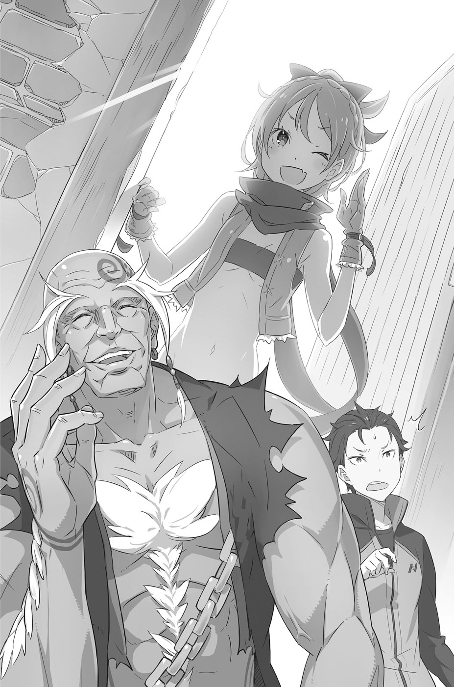
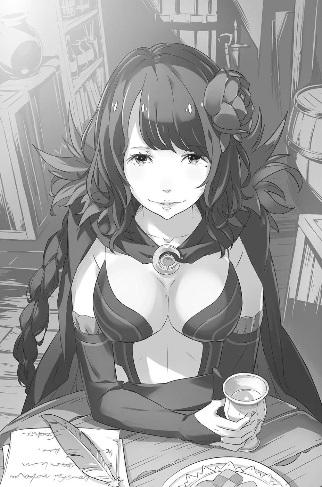
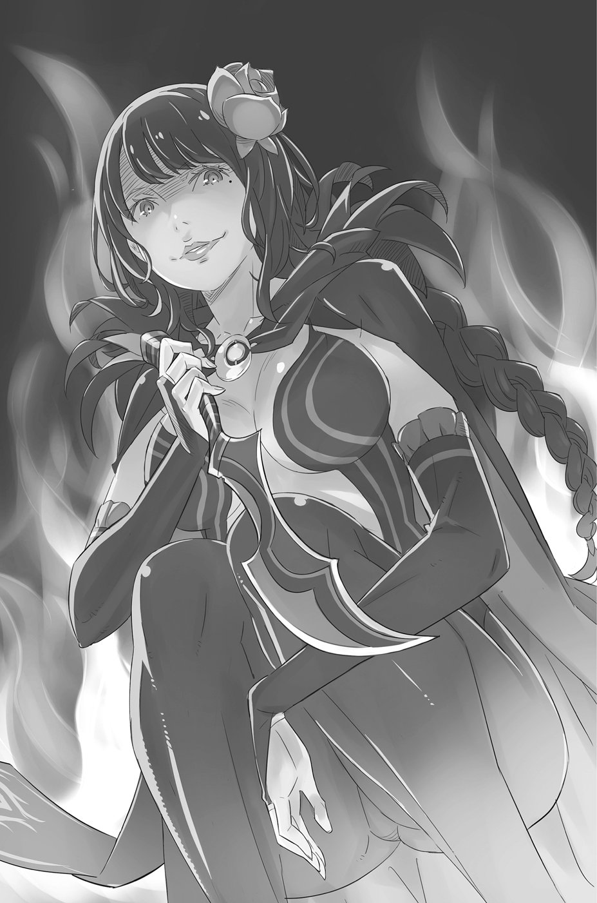

— Парень, ты чего? Уснул, что ли?

— А-а?..

Покупатель издал невнятный звук и посмотрел на хозяина лавки отсутствующим взглядом. Белёсый рубец на физиономии мужчины изогнулся дугой.

— Я говорю: чего рот разинул? Берёшь аблоко или нет?

— А-а?

— Аблоко! Сам же подошёл, сказал, есть охота. А у самого вдруг глаза остекленели, я аж перепугался! Ну так что, берёшь?

Здоровяк достал с прилавка аппетитный плод и, подкинув в руках, сунул посетителю под нос. Тот сфокусировал взгляд на фрукте — на вид обычное яблоко. Потом поглядел на торговца.

— Нет, я же говорил: у меня в кошельке пусто, как на Луне.

— Так ты просто прицениваешься? Тогда иди отсюда, иди, не мешай торговле. Болтаются тут, понимаешь!..

Торговец привычно замахал руками, прогоняя незадачливого клиента, и Нацуки Субару, пошатываясь, отошёл в сторонку. Отойдя от лавки, он в полнейшем замешательстве огляделся кругом.

— Что со мной?.. Что происходит?..

Ответа, разумеется, не последовало.

На улице царила всё та же сутолока. Время от времени проезжали повозки, запряжёнными ящерицами; всё остальное пространство занимали толпы пешеходов.

Солнце ещё стояло высоко. Жара не ощущалась, но густая шерсть звероподобных людей, снующих туда-сюда перед самым носом, вызывала желание всплеснуть руками:

«Ужас, как же им, наверное, жарко!»

— Так, хватит в облаках витать! Надо собраться!

Голова шла кругом, тело сотрясала дрожь. Вокруг странного юноши, который явно был не в себе, уже собралась толпа зевак, но Субару не замечал их.

— Ведь… только что была ночь, разве нет?!

Или, по крайней мере, сгущались сумерки. Однако в небе ярко светило полуденное солнце.

Мгновенный скачок из ночи в светлое время суток напомнил Субару момент призвания в этот мир. Только теперь переход произошёл при совершенно других обстоятельствах.

— Рана на животе!..

Субару приподнял куртку и осмотрел себя. Он точно помнил: его вспороли каким-то здоровенным клинком, хлынуло море крови, выжить после такого ранения просто нереально! Однако не то что шрама, ни единой царапины Субару не обнаружил. Более того, на его любимом тренировочном костюме не было даже намёка на пятнышко.

Содержимое пакета, с которым он прибыл в новый мир, оказалось нетронутым. Мобильник и кошелёк по-прежнему лежали на месте. Юноша вернулся в самое что ни на есть исходное состояние.

От осознания этого факта можно было тронуться умом! Субару силился вспомнить события, случившиеся до того, как он отключился.

Воровской склад, расчленённый труп на полу, голос какой-то женщины, невыносимая боль в животе… Наверное, нападавший был тем же убийцей, что оставил после себя мертвеца с отрубленной рукой. А потом, уже на грани смерти…

— Точно! Сателла!!!

Беспокоясь за Субару, она вошла в здание и тоже была убита!

При этой мысли у Субару похолодела кровь. Чувство вины причиняло куда более страшные муки, чем полученный им смертельный удар.

— Сателла… Оберегать её — вот что я должен был делать! Субару вспомнил Пака, когда тот попросил его присмотреть за девушкой, перед тем как раствориться в воздухе. И он твёрдо пообещал исполнить эту просьбу. Сколько раз Пак предупреждал, нужно быть начеку, но Субару пропустил всё мимо ушей и в результате не оправдал надежд.

А указание Сателлы — «в случае чего дай знать»? Даже к этому он отнёсся совершенно легкомысленно.

— Какой же я дурак!.. Нет, я просто полный идиот! Так, некогда стоять тут и нюни распускать! Надо найти Сателлу и Пака!..

Может быть, они уже мертвы… Субару замотал головой, прогоняя от себя эту мысль.

Ему, абсолютно никчёмному персонажу, который ведёт себя словно тупоголовый моб[^9] или в лучшем случае шут, удалось избежать смерти. Неужели Сателла, добросердечная застенчивая волшебница, принципиальная и сказочно красивая, и Пак, чудаковатый неуловимый дух, погибли?! Нет, быть такого не может!

— В любом случае нужно добраться до воровского притона… — подумал он вслух.

Воспоминания обрывались именно на складе; значит, там можно найти какую-нибудь зацепку.

Решил действовать — действуй. Субару ощутил твёрдость духа, неведомую раньше. В прежнем мире его решительность не приводила ни к чему, кроме прогуливания уроков. Теперь же пришло время для настоящих поступков.

Но не успел он сделать и шага…

— Эй, дружок, куда намылился?

Путь преградила троица каких-то парней. Субару уставился на них с ошарашенным видом — встреча была совсем некстати.

— Чего рот разинул?

— Видать, не понял, с кем имеет дело. Может, ему надо объяснить?

Послышались злобные смешки. Субару рассмотрел преграду, происходящее все больше напоминало фарс.

Одета троица была, мягко говоря, непрезентабельно. На типично бандитских физиономиях отражалось плохое воспитание и недостаток ума. Субару охватило чувство дежавю.

— Вы, ребята, случайно головами не ударялись, пока меня не было? — осведомился юноша, когда понял, что перед ним та же самая шпана, которая всего несколько часов назад свела его с Сателлой.

Выглядели они как самые обычные мобы, однако представить, что нашлась ещё одна троица, как две капли воды похожая на предыдущих головорезов, было просто нереально.

— Или вы решили отомстить, когда увидели, что я один? Понимаю, проще приставать к слабым, но сейчас вы жутко не вовремя.

— Ты чё несёшь? Не все дома, что ли?..

Субару надеялся разойтись с шайкой мирно, но поведение троицы начинало раздражать. В обычных условиях он заводился с пол-оборота, однако сейчас нельзя было терять ни минуты.

— Ладно, дружок. Отдай нам всё, что у тебя есть, и, считай, мы тебя простили.

— Ага, понял, — ответил Субару. — Всё, что у меня есть. Ну, что делать, согласен. Спешу, знаете ли…

— А затем покажи нам собачку! Встань на четвереньки и скули: «Пожалуйста, пощадите!» Вот так, понял?

— А собачий вальс вам не станцевать?! — терпение Субару лопнуло и разлетелось на тысячу кусочков. Бандиты зашли слишком далеко. Внезапный всплеск ярости не на шутку испугал хулиганов.

В качестве первой жертвы Субару выбрал самого тощего, того, что в первой стычке был с ножом.

— Начну с тебя, подонок! Не знаешь, чего стоит жизнь человека — сам сдохни!

Подскочив к тощему, Субару что было мочи врезал ему открытой ладонью в челюсть, а затем нанёс сокрушительный удар кулаком в незащищённый корпус. Головорез отлетел к стене и неловко обмяк. Субару, не мешкая, бросился на следующего противника, который даже не успел сообразить, что произошло. Получив свою порцию, он закувыркался по мостовой. В тот же миг Субару устремился к последнему члену банды и, схватив пониже талии, с разбегу впечатал спиной в стену. Головорез пронзительно взвыл от боли. Субару добил его завершающим ударом. Повернувшись ко второму бандиту, валявшемуся в пыли, Субару поманил его рукой, приглашая продолжить схватку.

— Ну вот мы и остались один на один! Всё по-честному! Давай, покажи, на что способен! — вызывающе заорал он, купаясь в волнах адреналина.

— По-твоему, паршивец, это честно — без предупреждения на людей бросаться?! — взревел головорез. Его физиономия пылала гневом. Ухватив Субару за воротник, он попытался прижать дерзкого юнца к стене, но не тут-то было.

С криком «Что-то слабовато!» Субару сдавил запястья противника и, сделав рывок, освободился. На физиономии бандита отчётливо выразился страх, губы Субару расползлись в торжествующей усмешке.

— Не стоит недооценивать прогульщика с избытком свободного времени! — прошипел он. — Я днями напролёт от нечего делать деревянным мечом руки набиваю, так что сила захвата у меня больше семидесяти кило! А в жиме лёжа до восьмидесяти потяну, понял?!

Субару с силой сдавил запястья головореза, тот, завопив от боли, согнулся и сразу же получил коленом по челюсти. Тело бандита стало безвольным. Субару быстрым движением ухватил его сзади за пояс.

— Если отдашь концы, давай без обид. Просто я всегда хотел попробовать бросок через голову без татами!

Рывком приподняв обездвиженную тушу, Субару бросил её через голову. Врезавшись в стену, здоровяк рухнул наземь и больше не шевелился.

Убедившись, что двое членов шайки в отключке, Субару направился к головорезу, которого вырубил первым. Тот уже пришёл в себя и при виде приближающегося юнца попытался было выхватить из кармана нож, но не успел — Субару немилосердно двинул ему ногой по лицу.

— Есть!.. Победа! В этом мире зло не остаётся безнаказанным! — празднуя свой триумф, Нацуки Субару поднял кулаки в небо. — Однако надо поторапливаться! Эти мерзавцы и так отняли у меня кучу времени.

Мельком удостоверившись, что поверженные враги дышат, он выбежал из опасного переулка.

В толпе, наблюдавшей за схваткой с боковой улицы, при виде целого и невредимого юноши раздались негромкие одобрительные возгласы. Субару захотелось отчитать зевак за бездействие — могли бы сообщить куда следует, но времени было в обрез, и юноша понёсся что было духу к воровскому складу.

Солнце уже клонилось к закату, когда Субару, взяв реванш в поединке, наконец-то пробрался в чрево бедняцких кварталов, где находилась его цель.

— Ф-фух, еле нашёл… — выпалил он, вытирая со лба пот, и тяжело опустился на землю. — Чёрт, сколько времени потратил!.. Только что был тут, казалось, быстро найду, не заплутаю…

Пока он бегал по округе в поисках склада, прошло почти два часа. Задачу осложняло и то, что Субару не понимал дорожные указатели. Полагаться можно было только на свою память. Останавливать встречных прохожих и заговаривать с ними о притоне юноша не рискнул.

— Надо было в прошлый раз не Сателлой любоваться, а по сторонам смотреть, — отругал он себя, продолжая обливаться потом.

Однако данное прегрешение было мелочью по сравнению с той чудовищной ошибкой, которую он совершил прямо на этом самом месте.

Пустой монолог не помог успокоить нервы. Сердце Субару выпрыгивало из груди, руки словно налились свинцом. Во рту пересохло, а шум в ушах стоял такой, будто кто-то бьёт молотом по наковальне. Там, внутри этого здания, похожего на амбар, он найдёт ответы на все свои вопросы.

Субару прикрыл веки, и за мгновение перед глазами пронеслись жуткие картины: труп старика, вспоротый живот, тело несчастной Сателлы, которая по его милости оказалась втянута в эту мясорубку…

— Не трусь, не трусь, только не трусь!.. — твердил он сам себе. — Какой я дурак! Нет, я просто полный идиот!.. Стоять в шаге от цели и, развернувшись, уйти ни с чем?

В конце концов, возвращаться всё равно было некуда.

Оставалось лишь одно место, куда стоило пойти.

Собравшись с духом, он направился было ко входу, но ноги тряслись так, что он не смог сделать и шага. Обхватив колени ладонями, он кое-как унял трясучку, сделал глубокий вдох и двинулся наконец вперёд.

Окрашенная закатным багрянцем, дверь выглядела пугающе и неприступно. Поборов малодушие, Субару робко постучал по наструганным доскам.

— Есть кто-нибудь дома?..

Ответа не последовало. Устрашающее безмолвие становилось невыносимым, и Субару постучал снова, на этот раз уверенней.

— Кто-нибудь!.. Вы же слышите меня! Прошу, ответьте! Пожалуйста!.. — ему отчаянно хотелось, чтобы всё, чему он стал здесь свидетелем, оказалось кошмарным сном. Да, сейчас ему откроют, и он сам во всём убедится!

Навалившись всем весом на дверь, он принялся неистово колотить кулаками. Не выдержав натиска, петли заскрипели и начали прогибаться, и в тот же миг за дверью раздался зычный голос:

— Кто там разорался? Если не знаешь пароля, что ж теперь, двери ломать, что ли?!

Створки резко распахнулась, и Субару, отлетев на несколько шагов, неловко растянулся на земле в несуразной позе. Юноша поднял ошалевшие глаза: на пороге дома стоял старик с заветренным лицом. Его могучее тело было скрыто под каким-то замусоленным рубищем, отполированная до идеальной гладкости лысина сияла в лучах закатного солнца.

— Ты кто такой? Что-то рожа мне твоя незнакома. Зачем пожаловал? Как прознал?.. Кто растрепал?..

В мгновение ока преодолев расстояние между собой и Субару, старикан схватил его за шиворот и, словно пушинку, приподнял над землёй. Болтая ногами в воздухе, Субару в полной мере осознал своё истинное место. До этого момента он полагал, что одолеть его сможет лишь противник с незаурядными способностями. И вот старикан как раз и оказался таковым. Всякая охота сопротивляться двухметровому великану улетучилась моментально.

— Моё имя — Нацуки Субару, — выдавил он. — Я бродяга, который не любит пустой болтовни… Может, опустите?..

Он хотел добавить: «…меня на землю, тогда и поговорим», но на большее его не хватило.

Первое впечатление от знакомства было ужасным, но, тем не менее, Субару получил приглашение войти. А всё благодаря тому, что описал внешность того парня, который рассказал про склад.

Усевшись на один из стульев, стоявших у барной стойки, Субару заёрзал, устраиваясь поудобнее. Сиденье рассохлось, из-за чего в тело постоянно впивались то ли гвозди, то ли щепки. Субару начал опасаться, как бы из-за этого неудобства не испортить воздух в помещении.

— Чего ты всё елозишь? — спросил старикан. — Яйца жмут, что ли?

— Вовсе нет, с этой частью тела у меня всё в порядке! — запротестовал юноша. — И вообще, шутки ниже пояса в начале разговора неуместны!

Старик, для описания которого больше всего подошло бы слово «гигант», протиснулся за стойку, достал откуда-то снизу бутылку с выпивкой, наполнил стакан и поднёс его ко рту.

— Не дают спокойно перед сном пару стаканчиков пропустить, — пробурчал он. — Учти, если ты заявился с какой-нибудь ерундой, пеняй на себя.

— Солнце сесть не успело, а ты уже за бутылку. Так и спиться недолго, — язвительно заметил Субару. Подперев щёку рукой, он окинул взглядом недра склада, освещённые тусклым светом.

Ничто не напоминало о той трагедии, которую он пережил здесь совсем недавно. Углы были завалены разнообразным скарбом, судя по всему, ворованным; имелась ли во всём этом бардаке хоть какая-нибудь система, понять было невозможно.

Будто заметив любопытный взгляд юноши, старик многозначительно прищурился.

— Чего, малец? Интересуешься краденым товаром? — хозяин склада уловил самую суть дела.

Переговоры с могучим стариком, который назвался дедом Ромом, начались на удивление гладко, — возможно, помогло то, что Субару представился первым. Сидя по ту сторону стойки, дед Ром подлил в свой немытый стакан немного спиртного и ощерил зубы.

— Если у меня посетитель, то одно из двух: он пришёл либо сдать товар, либо выкупить.

— Признаться, это и есть одна из моих целей, — помедлив, ответил Субару.

— Одна из целей, говоришь, — дед Ром с подозрением приподнял бровь. — Значит, ещё какое-то дело есть?

Субару кивнул и, приготовившись, что его примут за идиота, робко спросил:

— Я понимаю, вопрос глупый, но… совсем недавно… вам не приходилось умирать? — про горло и оторванную руку он решил не упоминать.

Дед Ром некоторое время смотрел на странного гостя своими мутными глазами, а затем вдруг разразился хохотом.

— Я-то всё думал, что он сейчас выдаст! Спору нет, старый хрыч уже одной ногой в могиле, но помирать мне, к сожалению, пока не доводилось. Хотя в моём возрасте пора подыскивать местечко на кладбище.

Видимо, приняв слова юноши за удачную шутку, старик придвинул к Субару стакан.

— Выпьешь?

— Нет-нет, я пас, — пробормотал Субару извиняющимся тоном, отодвигая стакан от себя. Его всё больше переполняла смутная тревога.

Тот труп, на который он здесь наткнулся… принадлежал старику, сидящему сейчас напротив, никаких сомнений. Конечно, было темно, к тому же Субару впервые в жизни увидел мертвеца, поэтому нельзя сказать, что он мог объективно воспринимать реальность. Тем не менее старик обладал настолько незаурядной внешностью, что его не спутаешь ни с кем.

Однако вот он сидит, живой и здоровый.

С другой стороны, то же самое можно было сказать и про Субару. Он ведь и сам совсем недавно получил смертельное ранение. Впору начать сомневаться в собственном рассудке: уж не привиделось ли ему всё это?

«Неужели сон?.. И если да, то где он начался и где закончился? И зачем вообще я здесь?»

Пускай, адский огонь в животе, и едва ощутимое касание девичьих пальцев, и даже невыносимые муки совести — лишь обрывки сновидений, что же тогда привело его сюда?

Если уж на то пошло, не лучше ли считать сном всё, что случилось с ним с момента появления в этом мире?

— Дед Ром, — обратился Субару к старику, — вы случайно не видели здесь поблизости девушку с серебристыми волосами?

— Серебристыми?.. Нет, не было такой. Сереброволосые сразу в глаза бросаются. Память у меня уже не та, что раньше, но такую я бы точно не забыл, — сказал дед Ром и снова загоготал.

Однако Субару было не до смеха. Тут до старика, видимо, дошло, что для юноши этот вопрос крайне важен. Он вдруг осёкся и — дзынь! — вновь придвинул гостю стакан. Наполнив его до краёв, дед потребовал:

— Пей!

Субару молча уставился на янтарную жидкость.

— Пей, — повторил старик.

— Вы извините, но я сейчас не в настроении. К тому же не в том возрасте, чтобы пить на слабо.

— Что за чушь? А как ещё таким соплякам пить, если не на слабо? Давай одним махом, чтоб внутри загорелось. Зажжёт так, что сразу выложишь всё, что у тебя там накипело. Так что пей, — сказал дед Ром и в третий раз придвинул стакан.

Чувствуя, что сопротивляться бесполезно, Субару взял его и поднёс к носу. В ноздри ударил запах крепкого алкоголя. Юноша поперхнулся и, скривившись, отставил руку со стаканом в сторону.

Субару всё же решил последовать совету старика Рома, хотя и считал, что заливать горе вином — удел неудачников.

— Эх, была не была!

Он выдохнул и залпом осушил стакан. В тот же миг в горле будто вспыхнул пожар. Субару грохнул стаканом об стойку.

— А-а-а!!! Ну и мерзость! Всё горит! Какая гадость!.. — ему показалось, что он сжёг себе пищевод.

— Ну-ну, заладил, чёрт тебя возьми!.. Кто не понимает вкуса спиртного, полжизни теряет! — пробасил дед Ром и опрокинул в глотку ещё одну порцию. Затем схватил бутылку и припал прямо к горлышку.

Выхлебав раза в три больше, чем Субару, он улыбнулся и громко рыгнул.

— Но ты всё равно молодец! Наш человек! — похвалил он гостя. — Ну что, есть теперь желание излить всё наружу?

— А-а-а, — выдохнул Субару. — Есть немного… Дед Ром, теперь насчёт второй цели моего визита.

Глядя на довольного старикана, Субару хитро осклабился и, утерев рукавом подбородок, ткнул пальцем в глубину склада, где, похоже, хранились ценные вещи.

Лицо деда Рома посерьёзнело, и юноша произнёс:

— Мне нужен значок, украшенный драгоценным камнем.

Я хочу его выкупить.

Помимо желания узнать, что произошло с Сателлой, это и была изначальная цель — разыскать её значок. Подробностей Субару не знал, но одно помнил точно: ради этой вещицы Сателла шла на огромный риск.

Что с ней стало, он так и не выяснил. И всё же, если удастся разузнать что-нибудь о значке, это, вероятно, поможет напасть на её след.

Услышав просьбу гостя, дед Ром принял озадаченный вид.

— Значок с драгоценным камнем, говоришь… Боюсь, что такой штуки мне не приносили.

— Точно? Вспомни-ка хорошенько. Может, у тебя склероз? — Субару снова перешёл на «ты».

— После бутылки голова у меня работает как часы. Если сейчас не могу вспомнить, значит, точно не видел такого. Хотя… — Субару уже было распрощался с последней надеждой, но дед Ром вдруг загадочно хихикнул. — Сегодня мне должны кое-что принести. Причём, как сказано, вещица стоящая. Быть может, это как раз то, что ты ищешь.

— А принесёт её случайно не девочка по имени Фельт?..

— Совершенно верно, — ответил дед Ром. — Ты гляди-ка, даже имя уже где-то разнюхал.

Субару победно вскинул сжатый кулак. Ещё секунду назад ему казалось, что оборвалась последняя ниточка, и вдруг такая удача.

Фельт! Та самая Фельт, которая, судя по всему, и украла значок. Если это окажется правдой, то послужит доказательством существования и самой Сателлы. Что ж, по крайней мере, Субару сможет убедиться, что сереброволосая красавица не является плодом его больного воображения.

— Сереброволосые героини — моя слабость, — признался Субару. — Я уж начал думать, что у меня глюки на этой почве.

— Боюсь, что победу, мальчик, ты рано празднуешь, — произнёс старик. — Кто тебе сказал, что ты сможешь выкупить эту вещицу? Раз она с драгоценным камнем, то и цена будет соответствующая.

— Бьёшь в самое больное место, старик? Можешь не стараться, ибо пред тобой редчайший экземпляр нищеброда!

— Тогда и разговора никакого! — рявкнул дед Ром, поражённый дерзостью нежданного гостя.

— Тс-с! — Субару покачал указательным пальцем перед носом старика. — Да, денег у меня нет. Но!.. — Он поднял палец кверху — Чтобы получить то, что тебе нужно, са-а-авсем не обязательно иметь деньги. В мире существует и другой способ, куда как более примитивный, — обмен!

В ответ дед Ром лишь молча кивнул, ожидая продолжения. Субару полез в карман своих штанов, и, когда он вынул руку, старик увидел…

— Эт что такое? Впервые вижу.

— То, что я держу в руке, есть волшебный предмет, способный останавливать во времени всё, что ты видишь. Мобильник!

Пока дед Ром удивлённо таращил глаза на диковинную штуку (компактный тонкий корпус, цвет белый), Субару быстренько активировал нужную функцию, и в следующее мгновение складской полумрак рассеяла яркая вспышка и раздался щелчок.

От испуга дед Ром чуть не завалился под стойку. Столь бурная реакция привела Субару в восторг, но старику было не до смеха.

— Ты что творишь?! — загорланил он в приступе гнева. — Убить меня хочешь?.. Не думай, что одурачишь меня своими подозрительными штучками!

— Тише, тише, успокойся, дед. Вдох, выдох, вот так. А теперь взгляни-ка.

Субару ткнул экраном мобильника в раскрасневшуюся на сей раз уже не от выпивки — физиономию старика. Тот с сомнением посмотрел на экран, и глаза его поползли на лоб.

— Это же… моё лицо!.. Как ты это сделал?

— Я же сказал, это волшебная штука, которая останавливает время. Я захватил момент, в котором ты только что находился, и теперь он хранится внутри этого устройства.

Субару направил камеру на себя и нажал кнопку Затем снова показал старику: на экране застыло довольное лицо Субару, сложившего пальцы в победную букву «V».

— Вот так это работает. Ну что? Впечатляет?

— Выпендрёж твой меня совсем не впечатляет, но что касается этой штуки…

Несмотря на язвительное замечание по поводу нахальной позы, в душе Субару ликовал — сотовый пробудил в старике нешуточный интерес.

— Ни разу такой штуки не держал в руках, — сказал дед Ром. — Насколько я слыхал, их вроде называют «митии».

— «Митии»?.. — повторил Субару, борясь с желанием поправить: «Да это же обычный мобильник!», но старик кивнул и продолжил:

— Так называют инструменты, позволяющие использовать магию тем, кто не умеет открывать врата, как это делают маги. Правда, сейчас их больше применяют как подарки, нежели инструменты.

«Значит, магические предметы здесь называют митиями», — подумал Субару. Это слово показалось ему до боли знакомым. Дед Ром продолжал пристально разглядывать телефон. Затем, положив его на стойку, произнёс:

— На сколько эта штука потянет, точно не скажу. За всё то долгое время, что я здесь работаю, ни разу не имел дело с митиями, — помолчав, он добавил: — Но в том, что она дорогая, сомневаться не приходится.

Неважно, какой у тебя бизнес, легальный или подпольный, — у любого дельца руки так и чешутся заполучить редкий товар. Дед Ром явно заинтересовался и даже говорить стал внятнее. Он провёл рукой по подбородку и посмотрел на Субару сверху вниз.

— Поэтому, — продолжил он, — менять её на безделушку, пусть и с драгоценным камнем, мне кажется, тебе будет малость не с руки. Здесь что-нибудь подороже можно получить… Совсем не обязательно зацикливаться на моём товаре.

Странно было встретить такую честность в жулике, занимающемся скупкой и продажей краденого. Впрочем, со стороны действия Субару тоже выглядели весьма необычно, однако его самого это совсем не заботило.

— А, ничего, — отмахнулся он. — Поменяю эту митию на значок, который принесёт Фельт.

— Да сдался тебе этот значок!.. Неужели он стоит дороже, чем мития? Или ты хочешь сказать, что его ценность нельзя измерить деньгами?

Субару мысленно признал, что будь он незаинтересованным лицом, то недоумевал бы точно так же, как и дед Ром.

— Ну, по правде сказать, я и сам пока не видел этот значок вживую. Вряд ли он будет стоить дороже, чем этот мобильник, и я не сомневаюсь, что обмен принесёт мне большие убытки.

— Так если не сомневаешься, тогда почему идёшь на такую сделку?

— Потому что я так решил!.. Убыток — значит убыток.

Дед Ром, совсем сбитый с толку, непонимающе уставился на гостя. Тот не без удовольствия наблюдал за реакцией старика. «Да, старик, ты не ослышался. Это и есть мой ответ».

— Я хочу кое-кого отблагодарить, — сказал Субару. — Я привык возвращать долги. У нас, современных подростков, нервы не в порядке. Я спать спокойно не смогу, поэтому выкуплю значок даже в ущерб себе.

— Хм… То есть, выходит, этот значок вовсе и не твой, так?

— Он принадлежит девушке с серебристыми волосами, которая спасла мне жизнь. Я не знаю по какой причине, но он ей очень дорог.

— А почему твоя спасительница не с тобой?

— Я как раз сейчас занимаюсь её поисками! Хотя не исключено, что и моё спасение, и само существование этой красотки — просто плод воспалённого воображения.

Усмехнувшись мысли, которую ещё недавно не мог допустить, Субару крепко сжал кулаки. Он решил: когда вернёт значок, непременно встретится с Сателлой. Ему очень хотелось ещё раз увидеть волшебную улыбку девушки.

— Ты, парень, и впрямь дурачок, — только и сказал дед Ром, глядя на исполненного решимости гостя, и весело рассмеялся.

Первый этап переговоров оказался позади, и Субару продолжил приятную беседу с дедом Ромом. Видя, как живо старик интересуется темой митий, Субару к мысли, что любовь к высокотехнологичным железкам свойственна всем мужчинам, в каком бы мире они ни находились.

— Экое всё у тебя чудное: что одежда, что эти вот лакомства.

— Ага, вкуснотень!.. Эй, ты сейчас все мои кукурузные палочки слопаешь! У меня ведь больше ничего нет!

— Не жадничай. Кто такой вкуснотищей не делится, тот в тартарары провалится!

— А ты, значит, не провалишься за то, что без спроса чужую еду уничтожаешь? Сначала на себя посмотри! Все вы, старичьё, такие!.. Хватит жевать, говорю!

Субару не ожидал, что хозяин склада так быстро расправится с его провиантом, которым он по доброте душевной хотел лишь немножко угостить старика. Он с сожалением сунул опустевшую пачку обратно в пакет.

На дворе был уже довольно поздний час, когда в дверь постучали.

Сидя за стойкой, Субару начал задрёмывать, но, услышав стук, поднял голову — гигантская фигура деда Рома вскочила и бойко направилась к двери.

Настороженно прислушиваясь, старик произнёс:

— Крысе?

— Яду, — немедленно последовал ответ.

— Белому киту?

— Багром по хребту.

— Великому Дракону?

— Дерьма из фургону.

«Наверное, какой-то условный воровской язык», — подумал Субару. Пароль и отзыв.

Удовлетворившись ответами, дед Ром отодвинул засов. Сидя на стуле за его спиной, Субару почувствовал, как в горле пересохло. Вот он, тот самый момент истины! Субару нервно сглотнул.

— Прости, дед, что заставила ждать! Настырный объект попался, еле оторвалась.

Рассказывая о своих подвигах старику, словно лучшему другу, новая гостья вошла внутрь.

Это была девочка с белокурыми взъерошенными волосами, которые чуть-чуть не доставали до плеч, с красными, как у кролика альбиноса, глазами и озорными клычками. Хрупкое тельце было облачено в удобную, хоть и поношенную, одежду.

Субару невольно привстал, с грохотом отодвинув стул. Девочка повернулась на шум и наконец заметила уставившегося в упор незнакомца. Улыбка с её лица исчезла.

— Ой, а это кто?.. Дед Ром, я же просила, чтоб ты закончил с посетителями пораньше. У меня сегодня крупняк, говорила же.

— Я всё понимаю, но у этого паренька есть к тебе дело, Фельт. И, скорее всего, как раз насчёт крупняка.

Личико Фельт недоверчиво скривилось. Она машинально прижала руку к груди, словно прятала там свой драгоценный товар. Бросив на парня недоверчивый взгляд, она сказала:

— Что ещё за дело у него может быть? Ты ведь не сдал меня, дед?

— Как можно! Мы с тобой не чужие. Просто мне подумалось, что его предложение покажется тебе довольно заманчивым, — сказал старик и подмигнул гостю.

Напряжение нарастало, и, чтобы снять его, Субару нарочито громко откашлялся и повернулся к девчонке:

— Будь добра, не хмурься так. Тебе как опоздавшей положена штрафная. Как насчёт стакана молочка?

— Послушай, ты, с глупой мордой, — огрызнулась Фельт, — мне всё равно, что ты там задумал. Лишь бы с тебя была какая-то выгода, так что давай к делу!

Понимая, что при первом знакомстве производит не лучшее впечатление, Субару пожал плечами.

— Пришлось злоупотребить гостеприимством деда Рома, чтобы пообщаться с тобой. В общем, моё дело касается значка с драгоценным камнем, который ты сейчас, похоже, прячешь за пазухой.

Её брови взметнулись вверх. Всё выглядело так, словно незнакомцу было известно не только о факте кражи — он даже знал, что конкретно она украла. Взгляд девчонки мгновенно стал ещё более подозрительным, и Субару поднял руки, призывая её успокоиться.

— Не собираюсь лезть в твои дела. Я пришёл просто поговорить. Давай всё спокойно обсудим. Уверяю, в обиде никто из нас не останется. Присядем? — он показал пальцем на небольшой столик сбоку от барной стойки.

Видя, что парень действительно желает спокойно всё обсудить, Фельт кивнула, и они расположились за столом. Дед Ром услужливо разлил молоко по стаканам и предложил переговорщикам.

— Место и выпивку я вам предоставил, дальше уже сами, я не при делах, — сказал старик.

— Обдерут меня сейчас как липку, — посетовал Субару, напустив показную самоуверенность. — Таких бредовых переговоров ты ещё не видел, поэтому что смотри! — он ударил кулаком в ладонь.

Дед Ром не понял, чем он так гордится, и только фыркнул. Сидящая же напротив Фельт пригубила молоко и скривилась:

— Дед Ром, ты что, молоко водой разбавил? Ну и гадость!

— Ещё одна! Кого б ни угостил по доброте душевной, в ответ только и слышу: гадость, гадость!.. — сказал старик с обидой в голосе и потрепал неблагодарную Фельт по голове своей огромной ручищей.

Со стороны казалось, он сейчас оторвёт девчонке голову, однако, стоило поглядеть на отупевшую пьяную физиономию деда, становилось ясно — он просто так шутит. К тому же, судя по реакции Фельт, она к этому давно привыкла.

— Не ожидал, что вы настолько дружны, — сказал Субару. — Такое чувство, будто про меня все забыли…

— Да у тебя самого рожа такая, что деду Рому фору дашь, а говоришь как баба! — засмеялась Фельт.

— Про моё лицо много чего говорили, но чтобы дать фору этому!.. — Субару взглянул на лысого старика, и его передёрнуло от ужаса. Конечно, Субару не считал себя красавчиком, и его внешность легко могла ввести в заблуждение окружающих, но сравнение с престарелым двухметровым верзилой было уже ни в какие ворота.

— Ладно, прости, братишка, — примирительно сказала Фельт. — Перегнула палку.

— Думаешь, назвала меня братишкой — и всё? Помирились? Ладно, на первый раз прощаю. Впредь советую следить за языком, чтоб случайно людей не обидеть… Дед Ром, ты чего?..

— Вы ведь здесь собрались не для того, чтоб на пару позлить старика, да?.. — прорычал он, и в ухмылке уже читалось раздражение.

Субару и Фельт переглянулись и пожали плечами.

— Эхе-хе… — дед Ром тяжело вздохнул. — Думал, наконец-то у Фельт будет хоть какой-то ровесник-подельник, а он, поди, ещё тот пройдоха…

— Дед Ром, ну хватит вгонять людей в краску, — сказала Фельт.

— Кстати, не такой уж я и ровесник… — неуверенно произнёс Субару. — Хотя… с высоты вашего возраста все мы салаги.

Он ещё раз смерил взглядом девчонку. На вид той можно было дать лет двенадцать-тринадцать, даже с учётом её тщедушного телосложения. Ну, если уж совсем расщедриться, то максимум четырнадцать. Для дружбы разница в возрасте слишком большая.

Пока Субару анализировал внешность Фельт, девочка и старик, не обращая на него внимания, продолжали болтать.

— Не, ну а что?.. — наседал старик. — Долго ты ещё собираешься строить из себя гордую одиночку? Когда-нибудь я совсем одряхлею, и кто тогда поможет тебе? Думаешь, одна со всем справишься?

— Сколько лет ты мне это твердишь! Ты уже и вправду в маразм впал, дед, одно и то же талдычишь: одряхлею, одряхлею… Пока это случится, меня уже… — Фельт вдруг осеклась.

— Тебя уже что?.. — спросил Субару, ожидая продолжения, но девочка лишь бросила на него сердитый взгляд. Субару смущённо откашлялся. Разговор пошёл явно не в то русло, и все поняли, пора переходить к сути дела.

— Хм, — произнёс юноша. — Давай уже начнём наши переговоры. Значит, Фельт, значок у тебя?

— Да, у меня.

Она сунула руку в нагрудный кармашек и, вытащив оттуда свой трофей, положила на стол. Это был тот самый заветный значок, украшенный эмблемой в виде дракона. Значок легко умещался на ладони. Определить материал было трудно, и всё же, замысловатый рисунок крылатого дракона с драгоценным камнем в открытой пасти намекал на уникальность предмета. Субару невольно залюбовался его красноватым блеском.

— Итак… — подала голос Фельт, и Субару пришёл в себя. Девчонка демонстративно отодвинула трофей к краю стола. — Теперь твой черёд. Как видишь, товар непростой. К тому же мне пришлось здорово постараться, чтобы добыть его. Если предложишь что-то равноценное, ударим по рукам.

— Судя по злорадной ухмылочке, ты решила проверить меня на вшивость, — сказал Субару. — Извини, денег ты не дождёшься, ибо во всех трущобах не сыщется более нищий голодранец, чем я! — как и всегда в таких случаях, он гордо выпятил грудь.

Фельт состроила постную мину.

«Каждый раз, когда я говорю, что у меня нет денег, все почему-то корчат гримасы», — подумал Субару.

Отмахнувшись от неприятных мыслей, он выложил перед Фельт свой самый сильный козырь. Как и следовало ожидать, девчонка уставилась на сотовый телефон непонимающим взглядом. С нескрываемым удовольствием понаблюдав за её реакцией, Субару схватил аппарат и защёлкал кнопками.

— Съёмка со скоростью девять кадров в секунду! Получай!..

Засверкали белые вспышки, раздалась пулемётная очередь щелчков, имитирующих звук затвора.

— Ой-ой-ой!.. А-а-а, мои глаза!!! Что это за звук?!

Фельт явно готовилась сказать пару ласковых в ответ на неожиданное поведения наглеца, но не успела — Субару ткнул ей экраном в лицо.

— Это же…

— Да! Твоё отражение! Эта мития способна захватывать моменты времени и сохранять их внутри себя. Я предлагаю сделку: мития в обмен на значок.

Разыграв свой главный козырь с первого же хода, Субару, не мешкая, направил беседу в нужное русло. В этом заключается одно из главных правил любых переговоров, в зависимости от ситуации оно может здорово повлиять на их результат.

Правда, применение этого правила говорит о том, что козырь был последним. И Субару, по сути, сам себя выдал.

Однако Фельт отреагировала на удивление спокойно. Глядя на экран, она чуть заметно кивнула и сказала:

— Вещица действительно классная. Дед Ром, сколько можно выручить за эту митию?

Ни блеска в глазах, ни даже желания потрогать телефон у неё не возникло. Фельт не заинтересовали ни функции устройства, ни его ценность с точки зрения уникальности. Единственное, что её волновало, — цена вопроса.

— Неужели даже в другом мире любовь ко всяким гаджетам — чисто мужская черта? Эх, печаль!.. — с сожалением сказал Субару.

— Чего расхныкался? Если я смогу загнать эту штуку дороже, чем значок, меня это устроит. Послушаем, что скажет дед Ром.

— Ну, точную сумму я не назову, — отозвался старик. — Полагаю, эти две вещицы нельзя ставить в один ряд. За значок ты выручишь приличные деньги, но не настолько большие, как за митию. Другими словами, для тебя, Фельт, это крайне выгодная сделка. Таков мой вердикт.

— Вот как!.. — заручившись мнением деда Рома, Фельт оживилась. — В таком случае, почему бы и нет…

Пусть первая реакция девчонки и была несколько неожиданной, но цель, судя по всему, оказалась достигнута, и Субару мысленно потирал руки. Торопясь завершить сделку, он потянулся было за значком, но тут же был остановлен внезапным «Стоять!».

— Свои карты мы с тобой раскрыли, — сказал Фельт, — но это не значит, что я закончила набивать цену!

Субару на мгновение потерял дар речи.

— Не скажу, что я в восторге от твоей алчности, — произнёс он. — Повышать цену нет никакого смысла. Я же сказал, что нищ, как последний бродяга.

— Я не такая скряга! — возразила Фельт. — Тем более дед Ром сам сказал, эта мития дороже, чем значок, и я согласилась… Хотя сдаётся, у тебя в рукаве запрятана ещё парочка хороших карт.

Она поднялась со стула и поглядела на Субару сверху вниз. Взгляд Фельт заискрился красными огоньками, и Субару стало не по себе.

Самую сильную карту, то есть мобильник, он уже разыграл в ходе переговоров. Однако в запасе имелось ещё несколько вещей, которые могли бы заинтересовать ушлую девчонку. В крайнем случае он мог бы их тоже пустить в дело…

— Эй, я же сказала: расслабься. Не собираюсь я из тебя больше ничего тянуть. Мне будет достаточно того, что я обменяю эту штуку на деньги.

Видя, как партнёр по переговорам задёргался, Фельт весело хлопнула в ладоши. Субару судорожно сглотнул, сделал несколько глубоких вдохов и отвёл глаза, чтобы скрыть переживания.

— Тогда как понять твои слова «я не закончила набивать цену»? — поинтересовался Субару.

— М?.. А, да всё просто. Дело в том, что ты не единственный, с кем я веду переговоры, — заметив вопросительный взгляд, она подняла кверху указательный палец. — Я свистнула значок, потому что меня об этом попросили. За него мне пообещали десять священных золотых монет.

— Так тебе поручили его украсть! — воскликнул Субару — Хм, десять золотых монет… Я и не знаю, сколько это по курсу…

Он взглянул на деда Рома. Старик кивнул, словно уловив намёк, и сказал:

— Продавай я этот значок, в лучшем случае получил за него четыре, может, пять золотых. Хотя, не исключено, уступил бы даже за три.

— То есть, выходит, за него готовы заплатить в два раза больше?

— Нет, тебе же сказали: десять священных золотых! — возразил ему старик. — Это не просто золотые монеты, которыми расплачиваются на базаре. Их делают из священного золота — весьма редкого металла, поэтому десять священных золотых монет стоят примерно столько же, сколько двадцать обычных.

— В четыре раза, что ли?!

— Чего удивляешься? За свою митию ты выручишь как минимум двадцать священных золотых. А может, найдутся любители редкостей, которые выложат и больше. Тут даже и говорить не о чем.

И всё же, здесь было чему удивляться. Субару с трудом представлял себе денежную ценность товаров в этом мире, к тому же золотые монеты являлись самой дорогой валютой, что он знал. Однако оказалось, что есть монеты и подороже и его телефон стоит целых двадцать таких монет!

— В таком случае, — сказал Субару, — если мития стоит так дорого, что ты скажешь своему клиенту?

— Говорю же, буду набивать цену, — ответила Фельт, и на её и без того нахальной мордочке появилась ещё более дерзкая гримаса. — Я скажу: «Видите, какую штуку принёс этот парень? Она стоит бешеных денег!» Так что, если им так ну жен этот значок, пускай повышают мне вознаграждение.

— То есть, ты хочешь сказать, если они дадут тебе больше двадцати священных монет…

— Тебе придётся выложить оставшиеся карты, иначе ты вне игры, — мгновенно отрезала Фельт, и лицо её растянулось в хищной… нет, в самой что ни на есть злодейской ухмылочке.

Почувствовав, что дело принимает опасный оборот, Субару заметно помрачнел.

— И где этот твой клиент? — спросил он. — Когда у вас назначена встреча? Надеюсь, ты позволишь мне присутствовать за столом переговоров?

— Разумеется. Без тебя нам не обойтись, иначе я могу прогадать с наваром. А насчёт места не беспокойся, мы встречаемся прямо здесь.

Она постучала пальцем по краю стола и, откинувшись на спинку стула, посмотрела на старика.

— Дед Ром не даст меня в обиду! Никому и в голову не придёт бузить, когда рядом такой дедуля, верно? — она вопросительно посмотрела на Субару, ожидая согласия. Тот, ещё раз мельком взглянул на деда Рома и с готовностью подтвердил это обстоятельство кивком.

Сам дед Ром, похоже, был не против такой оценки со стороны гостей.

— Что, без меня совсем никуда? — спросил он девчонку. — Прямо даже боюсь за тебя, Фельт. Может, ещё по стаканчику? У меня где-то сладости завалялись… — он вдруг стал похож на сентиментального дедулю, пестующего любимую внучку.

Дед Ром был в прекрасном расположении духа. Субару ошарашенно наблюдал, как Фельт подливает старику молока.

— То есть, — удивился Субару, — ты с самого начала планировала торговаться со своим клиентом, раз позвала его сюда? Даже не окажись я тут?

— А как же! Думаешь, так легко добыть эту штуку? К тому же, если клиент встретится со мной наедине, с такой хрупкой и беззащитной, и станет сбивать цену, как мне тогда быть? Так дела не делаются!..

— Ну да, хрупкой и беззащитной, — хмыкнул Субару.

На вид Фельт действительно выглядела тщедушно, и, казалось бы, ничего странного в её словах не было. И всё же у того, кто в полной мере испытал на себе её нагловатый характер и привычку действовать нахрапом, слова «хрупкая и беззащитная», вызывали внутренний протест.

Субару вспомнил, как совсем недавно, добывая значок, Фельт бросила его на произвол судьбы, и, преодолевая накатившую злобу, решил прояснить ситуацию.

— Кстати, ты меня совсем не помнишь? — спросил он.

— А мы встречались?.. Я не могу запоминать всех, с кем я пересекалась. Если, конечно, эта встреча не из ряда вон. И вообще, внешность у тебя такая, что глазу зацепиться не за что. Ну, разве что цвет волос и одежда, — сказала Фельт и прыснула со смеху.

Субару даже не знал, что на это ответить. Было не похоже, что она врёт. Да и не привык он к тому, чтобы о его внешнем виде отзывались с таким откровенным пренебрежением.

Вероятно, в этом мире само понятие человеческой порядочности безнадёжно устарело: люди, живущие здесь, запросто забывали о том, что стали свидетелями разбоя с убийством (ну или покушением на него).

Хотя, с другой стороны, была Сателла, бескорыстно спасшая ему жизнь, был дед Ром, к которому, несмотря на грязные воровские делишки, Субару всё же испытывал симпатию. Даже в альтернативном мире все люди разные, и не стоит судить по скверным поступкам отдельных личностей.

— Однако с памятью у тебя большие проблемы, — сказал Субару. — Ну да ладно. Когда должен явиться клиент?

— Что-то мне твой тон не нравится… Я сказала, что закончу работу засветло, и назначила встречу здесь после захода солнца… Так что ждём с минуты на минуту.

Видимо, последняя фраза послужила спусковым крючком для развития сюжета.

Внезапно раздался решительный стук в дверь. Все трое переглянулись.

— Пароль знает? — спросил старик.

— Не-а, я не говорила, — сконфузилась Фельт. Скорее всего, это мой клиент. Пойду посмотрю, — сказала она и чуть ли не вприпрыжку побежала к двери. Похоже, Фельт знала склад деда Рома как свои пять пальцев.

— Мне кажется, или она тебя использует? — спросил Субару старика.

— Ну, мы с ней не чужие. И вообще, далеко не первый день знакомы… Так что мне не в тягость, — сказал добрый дедушка Ром и вытащил откуда-то снизу здоровенную деревянную дубину длиной с бамбуковый меч. Навершие было утыкано шипами: судя по её виду, выжить после удара таким оружием было затруднительно.

Похоже, во всех мирах бейсбольные биты с гвоздями и подобные им орудия весьма популярны. Субару подумал, что такое снаряжение отлично подходит двухметровому амбалу. Если бы к тряпью, которое оставляло открытой волосатую грудь старика, добавить набедренную повязку, образ был бы завершённым.

— От такого питекантропа, как ты, кого угодно в дрожь бросит, — сказал Субару.

— Я смотрю, у тебя что на уме, то и на языке, — ответил дед, печально покачав головой. — Забыл, благодаря кому до сих пор сидишь здесь?

Субару пристыженно опустил глаза:

— Ну, на самом деле я очень благодарен. Конечно, ещё рано говорить о том, что всё позади, но без тебя я бы не справился, это точно, поэтому спасибо.

— Такая болтовня всегда смущала меня до чёртиков, — дед Ром поскрёб свою лысину и глубоко вздохнул. — Благодари себя, потому что сам разыскал это место и решил расстаться со своей вещью. Меня благодарить не за что.

— А вот и нет! Ведь ты с самого начала знал, что у Фельт здесь намечена сделка по поводу значка, верно? Значит, имел все основания прогнать меня взашей, даже не выслушав.

— Гм… — отозвался дед Ром.

— Именно ты дал мне шанс поговорить с Фельт! Ну а то, что я ловко воспользовался шансом, — это уже, конечно, моя заслуга! Только моя! — провозгласил Субару, тыча себе в грудь большим пальцем. Он даже дважды повторил эти слова, чтобы непременно донести до собеседника.

Дед Ром нахмурился и промолчал. Решив, что его заявление сразило старика наповал, Субару даже пожалел, что не повёл себя скромнее.

— Не то чтобы я называл это благодарностью… — вдруг вымолвил дед Ром, пока Субару боролся с неловкостью. — Но уж если кто-то и должен кого-то благодарить, только я тебя, — сказав это, он расплылся в такой улыбке, что лицо его, и так испещрённое морщинами, стало и вовсе похоже на печёное яблоко.

— Твоя мития, — продолжил старик, — одежда, опрятненький вид… Сдаётся мне, ты не из простых. Это так?

— Да нет, что вы…

— Можешь не скрывать. Наверное, нельзя предавать дело огласке, поэтому ты решил всё тихо-мирно уладить. Что ж, достойно уважения.

Похоже, насчёт этого парня с неясным прошлым у деда Рома уже имелись собственные соображения, согласно которым Субару являлся вполне порядочным, благовоспитанным джентльменом.

— Что касается нас с Фельт, — сказал старик, — эта девочка выросла у меня на глазах.

— Да, что-то подобное ты уже говорил… И всё это время вы тут жили? — спросил Субару и махнул головой куда-то в сторону, имея в виду трущобы. Ром кивнул.

— Такое уж место. Каждый отчаянно пытается выжить. Обычно малолетки объединяются в шайки с себе подобными… Но только не Фельт.

— Неудивительно, если она со всеми ведёт себя так нахально, — заметил Субару.

По характеру Фельт была решительна и непреклонна, но пользовалась этими замечательными качествами лишь в корыстных целях.

«С такой эгоисткой держи ухо востро!», — подумал Субару — А тебе не кажется, дед Ром, что ты её немного разбаловал? Не хочу показаться грубым, но, может, она привыкла задирать нос именно потому, что ты ей во всём потакаешь?

— Даже не знаю, что и сказать, — тихо произнёс старик, поглаживая себя по лысине. — Спору нет, я ей ни в чём не отказываю…

Дед Ром замолчал и потупился. Субару взглянул на его могучий профиль: было очевидно — старик любит Фельт как свою родную внучку.

— Надеюсь, это не безответное чувство, — тихо пробормотал Субару, но дед Ром его услышал.

— Мне всё равно, вздохнул он. — И так было бы даже лучше.

Едва Субару подумал, что допустил бестактность, их беседа оказалась бесцеремонно прервана вернувшейся Фельт:

— Терпеть не могу, когда мужики о чём-то шепчутся! Прекращайте!

За её спиной Субару и дед Ром заметили чью-то фигуру.

— Как я и думала, пришёл мой клиент, — сказала Фельт, неумело натянув на лицо приветливую улыбку. — Проходи сюда. Присядешь?

Жестом Фельт велела, чтобы Субару освободил место. Всё её радушие было направлено на клиента. Субару не имел никакого представления, с кем придётся вести переговоры, и поэтому немного нервничал. Когда клиент вышел из тени и приблизился к столу, юноша от неожиданности приоткрыл рот.

Клиентом Фельт оказалась женщина весьма привлекательной наружности. На вид ей было не больше двадцати пяти. Высокого роста, примерно как Субару. Из-за опущенных уголков глаз лицо красавицы казалось грустным, тем не менее от неё исходила какая-то спокойная аура. Кожа выглядела настолько бледной, что, казалось, светилась в полутьме воровского склада. Чёрный распахнутый плащ открывал взорам облегающее тёмное платье. К тому же прекрасная незнакомка могла похвастаться соблазнительными округлостями.

Волосы гостьи оказались чёрными, как у Субару, что в этом мире считалось редкостью. Длинные, до самых бёдер, они были заплетены в косу, кончик которой посетительница теребила в руках.

Иными словами, это была совершенно обворожительная леди. Субару, не имевшему за плечами опыта отношений со взрослыми женщинами, видеть перед собой такую Красотку было настолько непривычно, что он не мог скрыть волнения.

Не пытаясь перечить Фельт, он послушно освободил своё место. Девчонка уселась на его стул, слева от неё занял позицию дед Ром с дубинкой наизготове; Субару же, который никак не мог взять себя в руки, остался стоять с правой стороны.

Судя по всему, гостья осталась довольна столь радушным приёмом, однако было заметно, что она несколько озадачена.

— Мне кажется, здесь много посторонних, — произнесла она.

— Я хочу быть уверенной, что получу свои деньги, — заявила Фельт. — Нам, маленьким людям, так спокойней. Братишка, принеси-ка попить.

Она сделала повелевающий жест в сторону Субару.

Не в состоянии прекословить, он отыскал на полке более-менее чистые стаканы, наполнил их молоком и поставил на стол.

Поблагодарив услужливого молодого человека и бросив на него оценивающий взгляд, гостья осведомилась:

— Пожилого господина я знаю, но кто этот юноша?

Видимо, внешность Субару и то, как неуверенно он держался, натолкнуло даму на мысль, что он нездешний. В её интонации не слышалось подозрительности, лишь обычный интерес.

Фельт недовольно нахмурилась.

— Это твой конкурент. Ещё одна сторона в наших переговорах, — сказала она и приступила к набиванию цены.

— Да, ситуация предельно ясна.

Отпив из стакана, женщина провела языком по своим тонким губам, слизывая остатки молока.

Каждое движение Эльзы (так представилась гостья) было исполнено соблазна. Слушая объяснения Фельт, она то и дело бросала на Субару косые взгляды, приводя его в неимоверное смущение.

— Короче, суть переговоров всем понятна, — сказала Фельт. — Мне как-то безразлично, кто уйдёт отсюда со значком. Я продам его тому, кто даст больше.

— Мне нравится твой подход. Очень разумно. В таком случае сколько готов дать молодой человек?

Десять священных золотых монет — такую сумму Эльза первоначально обещала за значок. Если юноша собирался составить ей конкуренцию, то, вполне естественно, она ожидала, что тот предложит больше.

Решив, что брать быка за рога нужно не мешкая, Субару в третий раз активировал функцию фотосъёмки. Сверкнула вспышка, помещение на миг озарилось ярким светом, и на дисплее появился портрет Эльзы. Субару развернул мобильник экраном к нахмурившейся от неожиданности гостье.

— Я готов дать эту митию, — сказал он. — Очень редкая, единственный экземпляр в мире! Дед Ром подтвердит, она стоит не меньше двадцати священных золотых монет.

— Мития… — увидев себя на экране, Эльза понимающе кивнула, видимо осознав, что пареньку действительно есть что предложить.

Гостья запустила руку под плащ, достала оттуда кожаный мешочек, в котором, похоже, находилось вознаграждение Фельт, и с тяжёлым звоном бросила его на стол.

Фельт с жадностью уставилась на мешок, её зрачки сузились, как у кошки. В глазах деда Рома читалось неодобрение. Эльза положила руки на стол и сцепила свои белые пальцы.

— По правде сказать, мой заказчик выдал мне деньги с небольшим запасом. На тот случай, если исполнитель начнёт жадничать и потребует за свои услуги ещё несколько монет.

— Заказчик?.. — переспросил Субару. — То есть вы тоже всего лишь посредник, которому поручили добыть значок?

— Совершенно верно. Лично мне он не нужен, ответила Эльза и, помолчав, добавила: — Полагаю, мы с тобой коллеги. Я права?

— Окажись вы моей коллегой, были бы безработной!

— Значит, так, — вмешалась Фельт. — Этот парень предлагает митию, которую я смогу продать по бешеной цене. А сколько готов выложить твой хозяин? — спросила она с вызовом.

Эльза молча развязала шнурок на мешочке и высыпала на стол кучку священных золотых монет, замерцавших в полумраке склада.

При виде вожделенной горки у Фельт заблестели глаза. Даже дед Ром не смог удержаться и издал какой-то непонятный горловой звук. Субару же больше интересовал не блеск монет, а количество. Если он не ошибся, их было…

— Ровно двадцать, — сказал он, закончив подсчёт.

— Это всё, что я получила от своего заказчика, который посчитал, что такой суммы будет достаточно. Или он ошибся?

Её вопрос был обращён к деду Рому.

Старик пересчитал монеты и посмотрел сверху вниз на Субару. Тот был на грани истерики.

— Негоже взрослому мужику так трепыхаться, — засмеялся дед Ром. — Тебе должно быть стыдно. Ясное дело, двадцать священных золотых — это чертовски много, но ведь я говорил: мития потянет на двадцать священных золотых как минимум! — сказал он и грубо потрепал юношу по волосам своей могучей шершавой ладонью.

— Я думаю так, — продолжил старик, — в этих переговорах перевес на стороне мальца. Боюсь, вам придётся забрать деньги и вернуться к своему заказчику несолоно хлебавши, — сказал он и подвинул монеты в сторону гостьи.

Фельт взмахнула рукой — дескать, «возражений не имею», — а Эльза лишь пожала плечами: судя по всему, исход переговоров её не слишком расстроил. Субару же, из дав радостный клич, машинально вскинул кулак в победном жесте, однако окружающие встретили его реакцию непонимающими взглядами.

— Чего вы?.. Порадоваться нельзя, что ли? Я, может быть, впервые чего-то достиг! Так что имею право!

— Да я вообще молчу, — сказала Фельт. — Радуйся сколько влезет. Я буду радоваться, когда заработаю.

— По большому счёту, моему заказчику тоже не очень нужен этот значок, так что я уступаю молодому человеку.

Фельт и Эльза выглядели так, будто им абсолютно всё равно. Не то чтобы Субару был таким наивным, чтобы надеяться, будто Эльза упадёт перед ним на колени и станет умолять, но всё же он не мог взять в голову, почему она безразлична, несмотря на проваленное поручение.

— Мне так неловко, госпожа Эльза. Ваш заказчик, наверное, будет зол.

— Ничего не поделаешь. Если бы это была моя вина другое дело. Однако в данном случае виноват заказчик, который решил сэкономить.

— И всё-таки, когда рассчитываешь на двадцать священных золотых, а в итоге оказывается, что этого мало, тут есть повод расстроиться, — сказал Субару.

Он, как и дед Ром, сочувствовал Эльзе. Фельт же, напротив, заметно оживилась. Ей явно не хватало манер.

— Похоже, мне начинает не по-детски везти! Неужели настал мой звёздный час?..

Так или иначе, одной цели Субару удалось достичь теперь появилась надежда, что он сможет отдать долг Сателле. По-хорошему, ему бы следовало рассказать ей и про Фельт, и про Эльзу, но цели упечь их за решётку у Субару не было.

— Что ж, раз переговоры не увенчались для меня успехом, вынуждена откланяться.

Эльза поднялась, допила остатки молока и, вновь облизав губы манящим движением языка, вдруг задержала взгляд на Субару.

Юноша почувствовал себя так, будто его скрутили по рукам и ногам.

— Кстати, а что ты собираешься делать со значком?

Вопрос прозвучал сухо, без тени эмоции. И вместе с тем казалось, что мягкий тембр её голоса скрывал грозный намёк: «Лжи я не потерплю».

— Я-то? Хочу вернуть владельцу, — ответил Субару и только тут понял, что делать такие заявления в присутствии воровки и её клиента очень неосмотрительно… Хладнокровное намерение Эльзы убрать конкурента могло воплотиться в жизнь.

— Так ты с ними заодно!

— Что?..

Кто-то с силой толкнул Субару в бок и повалил на пол. Перед глазами всё завертелось. Приподняв ушибленную голову, он обнаружил Фельт, которая лежала, обхватив его за талию.

— Ты что дела…

— Идиот! — гневно закричала она, перебив его на полуслове. — Не видишь, что ли?! Она же собиралась убить тебя!!!

Глаза Субару округлились. По-прежнему лёжа на полу, он сосредоточил взгляд на возвышающейся в двух шагах фигуре Эльзы.

— О! — произнесла она с удивлением. — Увернулся!

В её руке грозно сверкнул клинок. Холодное оружие никак не вязалось с внешним обликом владелицы.

«Нож кукри», — всплыло из недр памяти Субару, —изогнутый клинок тридцати сантиметров, заточен по вогнутой грани. Благодаря тому, что центр тяжести смещён к острию, нож с лёгкостью заменил бы топор при разделке мяса. Нетрудно представить, на что была способна эта смертоносная штуковина.

Эльза продолжала невозмутимо улыбаться. Рука с ножом, только что нанёсшая удар, была отведена в сторону. Своим спасением Субару, стоявший в радиусе поражения, был обязан вовремя подоспевшей Фельт.

Субару обуял запоздавший страх, к горлу подкатила тошнота. Но времени на всё это уже не оставалось.

— А-а-а-а-а-а-а!!! — взревел дед Ром и, замахнувшись своей шипастой дубиной, которую не выпускал из рук с самого начала переговоров, набросился на Эльзу, пытаясь раздробить ей череп. Оружие старика весило не меньше десяти килограммов, но дед Ром орудовал им, словно невесомой палочкой.

Дубина со свистом обрушилась на складской пол. Доски брызнули щепками. Казалось, от мощного удара содрогнулось всё здание. С полок посыпалось ворованное добро. Нешуточный бой завязывался прямо на глазах у Субару.

— С великанами биться мне ещё не доводилось!

— Что ещё скажешь, девчонка?.. Так и знай, я сделаю из тебя фарш и скормлю гигантским крысам!

Сказав это, дед Ром ещё шустрее замахал своей дубиной. Отражать такие удары клинком было не проще, чем закрываться от них листом бумаги. В тесноте воровского склада маневрировать было ещё сложнее, и любое неловкое движение могло стоить жизни. Тем не менее ловкость, проявленная Эльзой, была просто на грани фантастики.

Гостья ускользала от шквала убийственных атак с лёгкостью тени. Она будто бы потешалась над стариком.

«Дело дрянь», — инстинктивно подумал Субару. Его охватило очень тревожное предчувствие.

— Хреново!.. — проговорил он вслух. Губы его дрожали.

— Не бойся! Дед Ром не может проиграть! — крикнула Фельт, словно пыталась приободрить саму себя. — Он ещё никогда не проигрывал в драках!

За годы, проведённые вместе со стариком, Фельт явно приобрела непоколебимую веру в его силу. Несмотря на некоторые грубоватые вольности, которые они позволяли в общении друг с другом, Субару без слов понял, эту парочку водой не разольёшь.

И всё же, в отличие от Фельт, уверенной в победе деда, Субару был настроен не так радужно. Хотя и сам не знал почему.

— Получай!..

Не успел юноша разобраться в причинах своего пессимизма, как в ходе схватки произошли перемены.

Раздался воинственный клич деда Рома, и дубина обрушилась на стол. Тот самый стол, за которым несколько минут назад шли переговоры. Эльза отпрыгнула к стене, взлетевшие в воздух щепки заслонили ей поле зрения.

Размахнувшись дубиной, дед Ром со всей силой опустил её на Эльзу. От такого удара её ждала неминуемая смерть…

— Дед Ром!.. — душераздирающий вопль Фельт огласил склад. В следующий миг Субару увидел то, что она пыталась предотвратить.

В воздухе закружился, разбрызгивая кровь, какой-то предмет. Это была рука деда Рома, по-прежнему сжимающая дубину.

Рука, отсечённая у самого плеча, пролетела несколько метров и ударилась о стену. Ошеломлённых очевидцев трагедии окатил фонтан крови. Фельт снова закричала.

Кровь хлестала из обрубка, как из шланга.

— Ты уйдёшь со мной!!! — заревел старик и, даже не пытаясь остановить кровавый поток, бросился на Эльзу.

Та стояла, держа клинок в вытянутой в сторону руке. Казалось, дед Ром успеет налететь и раздавить её весом своего огромного тела до того, как последует новый удар.

Однако в последний момент в другой руке Эльзы сверкнул обломок разбитого стакана.

— Чуть не забыла: спасибо за молоко!

Боевой клич старика оборвался. Острая грань вонзилась деду Рому в горло. Стекло окропили алые капли, изо рта великана хлынула кровь. Свет в серых глазах погас, и старик, лишённый руки, с перерезанным горлом рухнул на пол. Могучее тело бессильно задёргалось в конвульсиях, из груди вырвался последний хрип.

Эльза изящно поклонилась в сторону бездыханного гиганта, словно выражая своё почтение. Обломок стакана, превращённый в смертоносное оружие, она аккуратно положила возле вздрагивающих ног умирающего.

— Возвращаю. Больше не нужен, — холодно произнесла Эльза и, перехватив рукоятку ножа, направила его окровавленное остриё в сторону свидетелей поединка.

От пережитого потрясения Субару потерял дар речи. Кровавая резня, разыгравшаяся перед глазами, лишила его способности адекватно воспринимать действительность.

Человек, с которым ещё несколько минут назад он вёл непринуждённую беседу, был мёртв. И причиной этому стала не катастрофа и не болезнь, а убийство, совершённое с холодным расчётом.

— О, а ты у нас, оказывается, храбрая! — с издёвкой произнесла Эльза.

Юноша, по-прежнему не в силах пошевелиться, поднял глаза и увидел фигурку Фельт. Встав на ноги, она изо всех сил старалась унять дрожь в коленках. Кое-как справившись с собой, девочка провела рукой по окровавленным волосам и гневно бросила:

— Да как ты смеешь, тварь?!

Субару не мог видеть лица Фельт, так как находился позади. Однако по голосу было ясно, что лить слёзы она не собирается.

— Боюсь, чем больше ты станешь сопротивляться, тем больнее будет, — последовал бесстрастный ответ Эльзы.

— Ты в любом случае намеревалась убить нас, разве не так?! Ты, проклятая психопатка!!!

— Я не смогу нанести точный удар, если будешь дёргаться. Я не очень искусна в обращении с холодным — оружием, Эльза ловко завертела ножом в тонких пальцах, будто шинкуя воздух перед собой. Противостоять ей голыми руками было равносильно самоубийству.

Субару пришло в голову, что он может закричать. Хоть на несколько секунд, но это отвлечёт внимание Эльзы, и тогда Фельт удастся улучить момент и сбежать.

Она могла бы успеть позвать кого-нибудь или, на худой конец, хотя бы спаслась сама…

При мысли об этом его бросило в дрожь.

— Извини, что втянула тебя в это, — еле слышно прошептала Фельт.

— А-а… я… услышав её слова, Субару наконец обрёл дар речи. Забыв, что ещё секунду назад хотел, отвлечь убийцу криком, он смог выдавить лишь какой-то жалобный стон, словно моля о прощении.

Но у Фельт не было времени на сантименты. Оттолкнувшись от пола, она ринулась вперёд.

Раздался свист, и за спиной девчонки взметнулся бешеный вихрь. В тот самый миг, когда Фельт, исчезла из поля зрения Субару, Эльза развернулась.

Пронзительно крича, Фельт оказалась совсем рядом с Эльзой. Откуда ни возьмись в руке отчаянной девчонки возник нож, но Эльза молниеносно уклонилась от удара.

Фельт отскочила. Её тело словно подхватил ветер. Кружа в замкнутом пространстве склада, Фельт отталкивалась от стен, как от земли. Такие акробатические трюки удивили даже Эльзу.

— Тебе покровительствует Ветер? Замечательно, — восхищение во взгляде Эльзы мгновенно сменила чёрная ненависть. — Я даже завидую тебе! — прорычала она, занеся над головой нож.

— А!..

Удар с плеча застал Фельт прямо в воздухе, и она кубарем полетела на пол.

Нож прошёл от левого плеча до правого бока, распоров грудную клетку и внутренние органы. Девочка упала навзничь, из раны забил пульсирующий фонтан крови.

Фельт была уже без сознания. Её тело неподвижно замерло на полу.

Несколько секунд, и кровавый фонтан ослабел, что означало наступление смерти.

Субару словно парализовало.

Он хотел подойти к Фельт и попытаться остановить кровь… Или, если будет поздно, хотя бы прикрыть её широко распахнутые глаза. Но руки и ноги отказывались подчиняться.

Не в силах сделать хоть что-нибудь, он по-прежнему лежал на полу, застыв в жалкой позе и дрожа всем телом.

— Старик и девочка мертвы, а ты даже пальцем не пошевелил, — сказала Эльза с пренебрежением. — Уже сдался?

В её взгляде читалась скука. Ей оставалось лишь подойти поближе и взмахнуть ножом. Судя по всему, она и собиралась так сделать. Эльза выглядела абсолютно спокойной. Субару на миг даже показалось, что она еле сдерживается, чтобы не зевнуть.

Глядя на её невозмутимое поведение, юноша вдруг почувствовал нестерпимую злость.

Убитые не были его закадычными друзьями. С момента знакомства не прошло и часа, но за это время они не просто успели побеседовать. В каком-то смысле они открыли друг другу свои души. И вот так запросто убить этих людей, не испытывая ни малейших мук совести, такое нельзя было простить.

Но в первую очередь он не мог простить самого себя — за то, что позволил этой кровожадной твари совершить задуманное.

— О, зашевелился! Уже неплохо, хоть и глупо.

Запоздавший гнев вывел Субару из оцепенения. Он привстал на четвереньки, затем кое-как поднялся во весь рост. Руки и ноги лихорадочно тряслись, то ли от злости, то ли от страха, а может, сразу от того и от другого. Ему было плевать.

Напротив стояла Эльза с ножом наизготовку. Собрав все оставшиеся силы, Субару яростно сжал зубы и с отчаянным криком кинулся вперёд.

— Говорю же, бесполезно, — произнесла Эльза, встретив его мощным ударом локтя в лицо. Затем она резко повернулась вокруг своей оси, описав ногой изящную дугу, и Субару отбросило к стене. Он врезался в полку с какими-то горшками и рухнул на пол.

Первая атака закончилась окровавленным носом и выбитыми передними зубами. Нещадно болело в боку — в том месте, на которое пришёлся удар. «Должно быть, сломаны рёбра», — пронеслось у него в голове.

Но не прошло и пары секунд, как он снова был на ногах. Наверное, организм начал бешено вырабатывать эндорфины, позволив Субару забыть о неимоверной боли.

Задыхаясь от возбуждения, он бросился в безрассудную атаку и снова был отброшен. Эльза оказалась недосягаема. Она ловко перехватила рукоятку ножа и, рубанув Субару тупой стороной клинка по плечу, раздробила ему кости.

Субару испустил вопль боли. Видимо, крики жертв раздражали Эльзу, и она заставила его замолчать ударом в челюсть снизу вверх.

Субару сплюнул обломки передних зубов. Эльза бросила на поверженного противника презрительный взгляд:

— Полный ноль. Как я и думала, ты дилетант. Движения совершенно беспорядочны, у тебя нет ни природных способностей, ни какой бы то ни было техники. Я всё надеялась, что ты хотя бы проявишь смекалку, но и этого не случилось. На что ты вообще надеялся?

— Затгнись!.. Упёртость — слыхала про тагое? — из-за сломанного носа Субару говорил гнусаво. — После всего, что ты натворила…

Левая рука, повреждённая в ходе последней атаки, бессильно повисла. Боли он не чувствовал, но в ушах стоял неимоверный шум. Субару переполнял гнев, к горлу подкатывала неодолимая тошнота, и всё это вместе было готово вырваться из него в любую секунду.

На теле юноши не осталось живого места. Ни о каком возмездии не могло быть и речи — шансы на успех равнялись нулю.

— По крайней мере, надо отдать должное: у тебя твёрдая воля. Если бы ты проявил себя пораньше, кто знает, может, у той парочки был бы иной конец, — она указала ножом на два изувеченных трупа.

Субару перевёл взгляд туда, куда указывала Эльза, и его вдруг охватило странное чувство. Он сам не мог понять почему, но это печальное зрелище пробудило в нём череду страшных воспоминаний.

Огромная лужа крови на полу воровского склада. Труп однорукого гиганта. Медный отблеск клинка…

То, что он осознал, прошло через мозг, словно электрический ток.

— Ну что, будем закругляться? Сейчас я отправлю тебя на свидание с ангелами…

Эльза провела языком по алым губам, и её обольстительную улыбку поглотил мрак. Фигура гостьи внезапно исчезла, будто провалилась сквозь землю. Субару огляделся кругом:

— Куда… ты подевалась?..

Нервы были на пределе, в панике он замотал головой по сторонам, прислушиваясь к малейшему шуму. Теперь он больше всего походил на загнанного в западню зверька, которого вот-вот порвёт кровожадный хищник.

С точки зрения Эльзы, такое недостойное поведение могло испортить всю красоту её работы. Ведь линия разреза должна быть идеально ровной…

— А?! — Сообразив, куда метит убийца, Субару отскочил назад и, уклоняясь от удара, втянул живот так, что лезвие только царапнуло кожу. Стиснув зубы от острой боли, он с оглушающим рёвом ударил Эльзу по лицу наотмашь.

Теперь Субару знал: по крайней мере один ответный удар достиг цели.

— А вот теперь очень даже ничего! — сказала Эльза как ни в чём не бывало и выхватила из-за пояса второй кукри.

Клинок рассёк юношу почти пополам. Из страшной раны хлынула кровь и начали вываливаться внутренности…

Пошатываясь, Субару сделал несколько шагов назад, упёрся в стену и медленно сполз на пол. Он с недоумением глядел на собственный живот, из которого безостановочно струился алый поток, заливая всё кругом.

Субару прижал дрожащую руку к разрезу, чтобы остановить кровь, но эта жалкая попытка была заранее обречена на провал.

— Удивлён? Когда противник близко, я вспарываю ему живот. У меня это хорошо получается, — сказала Эльза с улыбкой. Субару уже не мог ничего ей ответить, ему оставалось только кричать от боли.

Шагая по луже крови, она приблизилась к своей жертве и устремила нежный взгляд на кишки, выпавшие из тела:

— Да, я так и думала. У твоих внутренностей изумительный цвет.

Эта женщина была сумасшедшей. Настоящим маньяком.

Против такой боли эндорфины были уже бессильны. Сознание Субару начало угасать. Он не заметил, как завалился на бок. Дрожащие пальцы коснулись ноги Эльзы, и Субару издал какие-то нечленораздельные звуки.

— Больно? Страшно? Обидно? Грустно? Хочешь поскорее умереть?

Не обращая внимания на его судорожные попытки ухватить её за лодыжку, Эльза наклонилась и посмотрела юноше в лицо.

В её глазах сиял восторг. Не было сомнений, она убивала людей без колебаний и тени сочувствия.

— Медленно-медленно тепло покидает тебя. Скоро ты станешь совсем холодным, — издевался её голос, ласкал, скорбел, жалел, и любил умирающего Субару…

Он не успел понять, когда его глаза залил мрак. Потеряв огромное количество крови, юноша медленно угасал.

Теперь он уже ничего не слышал. Не осталось ни вкусов, ни запахов, ни красок. Лишь ощущение холодеющего тела и страха смерти.

Когда я умру? Когда я умру? Я ещё жив? Я ещё не умер?..

Что есть жизнь? Можно ли назвать жизнью состояние, когда ты слабее последней букашки? Что такое смерть? Почему так страшно умирать? Так ли это важно — жить? Или нет?..

Как страшно, страшно, страшно, страшно, страшно…

Инстинкты Субару отрицали саму мысль о безусловной, неуклонно приближающейся смерти.

Это отрицание наполнило всё его существо, и в то мгновенце, когда он увидел белый слепящий свет…

— Я… умер.

С этим последним проблеском сознания жизнь Нацуки Субару оборвалась.

[^9]: Моб (англ. mob, сокращение от англ. mobile object, подвижный объект) — игровой сленг, означающий любой нестатичный компьютерный объект в игре.
