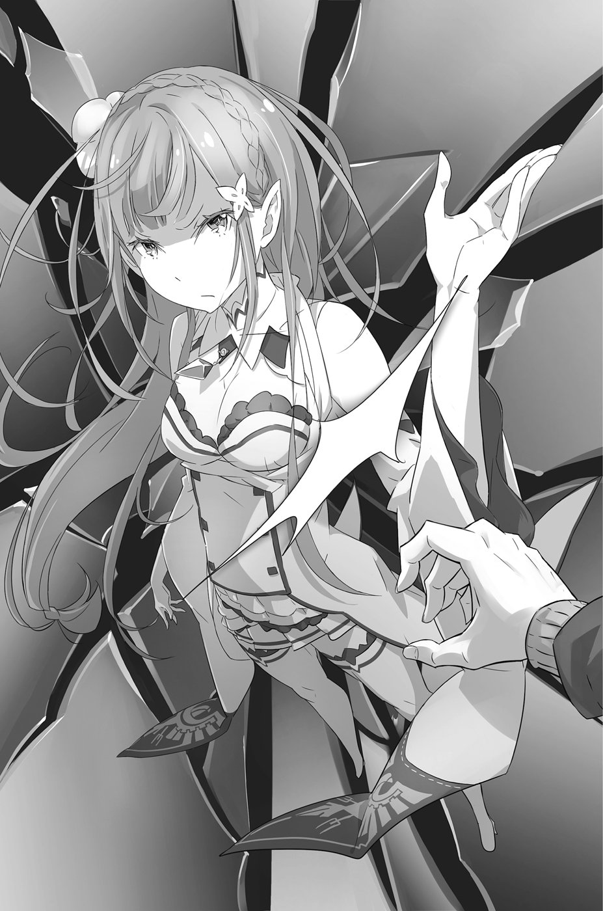

— Парень, очнись! Берёшь аблоко?

Когда Субару пришёл в себя, прямо перед его носом оказался спелый красный фрукт.

Фрукт был неотличим от обычного яблока. При взгляде на него Субару вдруг пришла в голову ассоциация с плодом древа познания. Тем самым запретным плодом, за съедение которого изгоняют из рая.

«Интересно, — подумал он, — избавит ли плод от этой чертовщины, если его надкусить?..»

— Эй, парень! — видя, что на его слова никак не реагируют, мужчина средних лет нахмурил брови.

Блуждая по самым отдалённым уголкам сознания, Субару медленно вернулся к действительности и вдруг, встрепенувшись, поднял голову. Посмотрел по сторонам, чувствуя биение собственного сердца и шум дыхания.

Был полдень. Юноша стоял напротив фруктовой лавки. Разноцветные фрукты и овощи разложены аккуратными рядами, подле них — недружелюбный хозяин с белёсым шрамом на лице.

На улице царила привычная душная сутолока.

Субару обхватил руками голову.

— Ничего не понимаю… — пробормотал он. Головокружение и тошнота наконец взяли своё, и Субару рухнул на месте без чувств.

Холодная вода, которой его щедро окатили, привела Субару в себя. Он тряхнул головой, разгоняя туман в мыслях.

Хозяин фруктовой лавки, позаботившийся о посетителе, упавшем в обморок прямо у него перед входом, держал в руках пустой кувшин. Субару был благодарен ему за проявленное милосердие, однако тот факт, что добрый торговец ничего не спросил о Сателле, которая, по идее, должна была находиться где-то рядом, резанул по сердцу как ножом.

Сидя на голой земле и вытирая капающую с волос воду, он с силой стиснул дрожащие челюсти. Блеск клинка и магнетическая улыбка посреди кровавого ужаса всё ещё стояли перед его глазами.

Горло Субару сдавил спазм. Он обхватил руками колени в бесплодной попытке унять сотрясавшую всё тело мелкую дрожь. До сих пор он жил самой обыкновенной, зауряднейшей жизнью, и ему никогда не приходилось испытывать такого страха и такого отчаяния.

К чёрту все мысли, к чёрту воспоминания! Только бы снова закрыться в своей скорлупе и забыть обо всём…

Забыть эти отблески на клинке… отрубленную мускулистую руку… забыть эти дикие вопли… эти серебристые волосы, утопающие в море крови…

Но чем сильнее хотелось забыться, тем ярче были картины, что подсовывала ему память. Субару в исступлении запрокинул голову, готовясь излить душу яростным криком, как вдруг…

— Что?! — не успев вырваться из груди, чтобы отразиться эхом по всей округе, крик угас сам собой, и на лице Субару возникло неописуемое удивление.

Среди толпы каких-то великанов с лоснящейся, как у рептилий, кожей, зверолюдей ростом в два раза меньше, чем сам Субару, молодых танцовщиц со светло-розовыми волосами, фехтовальщиков с шестью саблями на поясе среди всей этой разношёрстной публики по улице шла девушка в белой накидке, покачивая серебристыми волосами в такт своим шагам.

Мельком взглянув на Субару, она тут же равнодушно отвернулась. Фиалковые глаза, излучающие твёрдую волю, вновь обратились вперёд. Её фигура была по-прежнему исполнена достоинства и ослепительной красоты. Эта была та самая Сателла, встречи с которой Субару так жаждал.

— Подож… — он хотел её окликнуть, но голос не слушался, и тогда Субару, издав хриплый вздох, поспешил на заплетающихся ногах вслед за ней.

Девушка стремительно шагала сквозь толпу. Её серебристые волосы грозили вот-вот затеряться в потоке. Субару охватила паника.

— Подож… подожди!.. Прошу, остановись!.. — позвал он ,чуть ли не плача.

В ответ на зов её глаза на миг остановились на Субару. Они смотрели равнодушно, словно тот был совершенно чужим человеком. Холод этих строгих глаз проник в самое сердце юноши. Он ослушался её и сделал ей больно. И даже не извинился. Ему нет прощения.

И всё же он продолжал идти за девушкой. Ему было неведомо, что у неё на душе. Так пусть хотя бы скажет всё, что она о нём думает. Если обида действительно так велика, как он предполагает, лучше встретить гнев лицом к лицу, каким бы ужасным он ни оказался.

А что он собирается сказать ей?

Когда в голове Субару возник ясный и точный ответ на этот вопрос, он встрепенулся и прокричал:

— Подожди! Сателла!

Заглушив шум уличной толчеи, крик, похоже, достиг её ушей. Почти исчезнувшая из виду фигурка резко остановилась.

Расталкивая прохожих, он приблизился к замершей на месте девушке и коснулся её изящного плеча:

— Не игнорируй меня. Да, я виноват, что не послушал тебя, но мне самому пришлось несладко. Я потом опять ходил к воровскому складу, но тебя там не было…

Сателла посмотрела на него, на лице отразилось Удивление.

То, что слетело с его губ, воспринималось не иначе как жалкая попытка оправдаться и вымолить прощение. Субару понял это по выражению ясных глаз, которые смотрели на него безо всяких эмоций. И всё же ему стало легче: во всяком случае, Сателла, насколько он мог судить, осталась невредима. Это было настоящим счастьем.

— Прости, я всё о себе, да о себе… Я рад, что ты жива и здорова.

Больше всего он обрадовался тому, что смог снова встретиться с ней и что теперь они снова вдвоём. Ему столько всего нужно рассказать ей! Все его страдания были вознаграждены. По крайней мере, теперь он может вздохнуть спокойно… Однако на лице Сателлы вдруг вспыхнуло глубочайшее негодование.

— Ты… Да как ты смеешь?

Белоснежные щёки залились краской. Дёрнув плечом, она стряхнула с себя его руку и отскочила на шаг назад. В её глазах вспыхнула враждебность.

Субару никак не ожидал столь бурной реакции, и у него невольно перехватило дыхание. И всё же реакция была хоть и бурной, но вполне естественной. С точки зрения Сателлы, появиться здесь после всего, что он натворил, было непростительной дерзостью. Так что следовало быть готовым к любым колкостям в свой адрес…

— Я не знаю, кто ты, но как ты смеешь называть людей именем Ведьмы Зависти?! — бросила она в сердцах.

Её слова оказались настолько далеки от того, что он ожидал услышать, что от его самообладания не осталось и следа. Субару почудилось, будто само время остановило свой ход.

Умолк шум толпы. Лишь бешеный стук его собственного сердца и дыхание сереброволосой девушки нарушали эту тишину. Все остальные звуки как будто исчезли… Хотя нет, ему это не почудилось.

— В чём дело?.. — Субару лихорадочно завертел головой по сторонам.

На них смотрела вся улица, со всеми её лавочниками и пешеходами. Все замерли в молчании и с тревогой на лицах, словно боясь упустить хоть слово из разговора этой странной пары.

Сателла, не сводя с Субару сердитого взгляда, ждала ответа, но что он мог сказать, не понимая причин происходящего? Похоже, то, в чём Субару считал себя виноватым, не имело ничего общего с тем, что так возмутило девушку.

— Спрашиваю тебя ещё раз: зачем ты назвал меня этим ведьминским именем?

— Но ведь… ты же сама…

— Не знаю, кто тебя надоумил, но у него ужасный вкус, а ты бездумно повторяешь!.. Всем известно, что имя Ведьмы Зависти — табу. Не всякий рискнёт даже произнести его вслух, не говоря уже о том, чтобы назвать им кого-нибудь!

Неприкрытое отвращение, с которым Сателла… то есть сереброволосая девушка говорила об этом имени, совершенно сбило Субару с толку. Собравшаяся вокруг толпа согласно закивала, что само по себе подтверждало правдивость её слов. Это погрузило юношу в ещё большее смятение.

Он совершенно не понимал, о чём она говорит. Он ведь просто назвал её по имени…

— Если у тебя всё, то мне пора. У меня нет лишнего времени, — резко бросила она и, взмахнув серебристыми волосами, гордо зашагала прочь.

Субару хотел было окликнуть её вновь, но крик застрял в горле: снова назвать её по имени будет ошибкой. Тогда как же к ней обращаться?

Субару застыл в нерешительности, не зная, что делать.

Внезапно на уровне чуть выше его головы, над одним из навесов, под которыми расположились лотки уличных Торговцев, раздался сдавленный возглас, чья-то хрупкая Фигурка ловко спрыгнула на землю и в тот же миг, подхваченная ветром, устремилась вперёд. В неистовом вихре промелькнули грязные обноски и белокурые волосы. С фантастической ловкостью проскользнув сквозь толпу, вихрь выбросил вперёд руку, которая молниеносно проникла под накидку с вышивкой в форме ястреба.

Контакт длился долю секунды, но и этой мимолётной встречи оказалось достаточно. Девушка резко повернулась, и вихрь, отпрянув, унёсся прочь.

— Не может быть!.. — ошеломлённо воскликнула сереброволосая красавица и запустила руку под свою накидку. Нащупав пустоту, она обратила изумлённый взгляд в сторону удаляющегося на бешеной скорости вихря.

— Фельт?! — воскликнул Субару, заметив, как в потоке воздуха мелькнула тощая фигурка, сжимавшая в руке значок с изображением дракона.

На долю секунды вихрь сбавил ход, но, вновь ускорившись, в один миг нырнул с улицы в узкий переулок. Умопомрачительная скорость! Всё произошло за какое-то мгновение, и всё же Субару не сомневался, что это была…

— Украли!.. — вскричала девушка. — Ты за этим меня остановил? Вы в сговоре?! — она гневно сверкнула глазами и направила на Субару открытую ладонь, но тут же, будто бы передумав, помчалась в переулок, в котором скрылась воровка.

— Подожди! Ты не так поняла! Я… — Субару кинулся за ней следом. Всё это было слишком нелепо, его душу раздирал миллион вопросов, обуреваемый паникой разум отказывался работать. Достаточно было того, что он и так уже два раза за этот день встретился лицом к лицу со смертью. — Да есть тут хоть один нормальный человек?! Зачем меня вообще сюда призвали?..

Посылая проклятия в адрес всей несправедливости, Субару, пошатываясь и спотыкаясь, побежал по полутёмному переулку. Он не был уверен в своей выносливости, но не сомневался, что не уступит двум девчонкам в том, что касается взрывной силы мышц, необходимой для бега на короткие дистанции. Оставалось только догнать их и всё объяснить, но его намерение натолкнулось на непреодолимую преграду.

— Чёрт! Тупик! — воскликнул он с досадой, когда перед глазами выросла стена.

Девчонок здесь не было. Шустрая Фельт, скорее всего, удрала, вскарабкавшись по стене. Для Сателлы с её магическими способностями стена тоже не была помехой.

— Можно попробовать перемахнуть… — подумал он вслух. — Но догнать уже вряд ли удастся!..

Нельзя было тратить ни минуты. Надеяться на то, что он, не зная города, сможет их отыскать, было нелепо.

— Куда же тогда идти? Опять на склад? Если Сателла и Фельт живы, значит, и дед Ром…

Слишком многого он не мог понять, и все эти нестыковки сводили Субару с ума. Искалеченная Фельт, дед Ром с перерезанным горлом, тонущая в море крови Сателла… Вдобавок ему самому уже дважды вспороли живот. Как все они могли оставаться в живых?..

— Нет. Сейчас не время. Хватит размышлять. Сейчас я должен…

«Нужно опередить Фельт и поскорее встретиться с дедом Ромом, — решил он про себя. — Думать буду после».

Субару бросился прочь из тупика, намереваясь добраться до городских трущоб, но тут его взгляд упёрся в чьи-то тени.

— Не может быть… Вы, должно быть, шутите?

Выход из переулка преградили трое оборванцев. От нихиразило невежеством и отсутствием малейших признаков культуры. Это место они, судя по всему, использовали для своей охоты. Для Субару это была уже третья по счёту встреча с местной шпаной.

— Да сколько можно! Видать, жизнь вас ничему не учит! — Субару в ярости топнул ногой. Эти три рыла ему уже вконец осточертели. Третий раз за день и каждый раз — трое против одного.

Несмотря на то, что и первая, и вторая встречи не закончились для них ничем хорошим, хулиганы с завидным упорством продолжали свою охоту. — У меня нет ни времени, ни желания связываться с вами! А ну, дайте пройти!

Дело принимало опасный оборот, но Субару, хоть и растерял своё хладнокровие, всё же рассчитывал, что его крик напомнит злодеям о прошлой стычке и охладит их пыл.

— Слыхали? «Дайте пройти!» Что-то ты слишком дерзкий. Ты кто такой, чтобы приказы раздавать?

— Вы ещё смеете рот раскрывать! Забыли, как в прошлый раз я один вас троих отметелил? Да вам, безнадёжным неудачникам, впору просить у меня пощады!

Однако на бандитов его угрозы не подействовали, и они продолжали бросаться издевательскими репликами. «Наверное, даже у таких негодяев есть какое-то собственное негодяйское чувство гордости», — подумал Субару, закусив губу. Ему не хотелось упускать время, а дело могло кончиться потасовкой, и он решил уладить всё мирным путём.

— Хорошо, — сказал он, сдерживая раздражение. — Я сдаюсь. Забирайте всё, что есть, и расходимся, идёт? — он поднял руки вверх, демонстрируя мирные намерения. Видя, что субару идёт на уступки, бандиты переглянулись и дружно разразились хохотом:

— Во даёт! С этого и надо было начинать, дурень!

— Кретин. Сначала хорохорится, а потом в кусты.

— Да ладно! Нам же легче. Этот трус сделает всё, что мы скажем.

Едкость издёвок Субару погасил сдержанным смехом. Про себя он эту бестолковую троицу прозвал Без, Моз и Гов. Стараясь больше не раздражать оппонентов, он полез в пакет, чтобы выложить перед ними свой провиант.

— Если мне удастся снова встретиться с Сателлой, — пробормотал он, утешая самого себя, — возьму у неё напрокат Пака и отом… щу?.. — Субару вдруг замер. — Не понял?..

Настолько странных сюрпризов этот мир ему ещё не преподносил. Курьёз в чистом виде. Пальцы нащупали пакетик с его любимыми кукурузными палочками, по привычке купленными в дежурном магазине на ужин. Теми, которые он оплакивал на месте попойки с дедом Ромом, когда угостил ими старика во время вечерней трапезы. Палочки лежали в пакете из дежурного магазина.

— Но ведь их не было… Их сожрал дед Ром, и я ещё жаловался…, что он абсолютно ничего не оставил…

Однако пакетик почему-то снова был на своём месте, целый и невредимый. Мистика какая-то!

Субару почувствовал, что логика его мышления окончательно увязла в трясине абсурда. Тем не менее даже в этой трясине он сумел отыскать какое-то объяснение данному феномену. Но объяснение это не сулило ничего хорошего, так как было настолько нелепым и диким, что разум юноши отказывался его принять.

— Эй, ты чего делаешь? — послышалось вдруг совсем рядом.

Субару встрепенулся.

— А?

Это был один из бандитов, самый низкорослый, — Гов. Незаметно подойдя к Субару, он тронул его за плечо, но юноша крутанулся и сбросил с себя мерзкую лапу.

— Валите отсюда!..

— Чего?

— Нет у меня времени возиться с вами! Мне нужно кое-что… проверить, — сказал Субару и направился к выходу.

— Ты это серьёзно? — путь преградили двое других, злобно ухмыляясь.

— С дороги! У меня срочное дело! — грозно произнёс Субару. Его теория была настолько абсурдна, что ему не терпелось поскорее убедиться в её ошибочности.

Бандиты не ожидали такого поворота и слегка растерялись. Воспользовавшись моментом, юноша решительным шагом направился на улицу. Ещё немного, и он бы выбрался из этой передряги, но вдруг… ноги его подкосились, колени согнулись сами по себе, и Субару, еле успев подставить руки, рухнул ниц.

«Нашёл время спотыкаться», мысленно выругал он себя и попытался приподняться, но у него не вышло, так как руки била крупная дрожь. — «Как странно…»

Он вдруг осознал, что не в силах вновь подняться на ноги. Не получилось даже слегка привстать.

— Вот тебе раз… Зачем ты это сделал? — послышался раздражённый голос. Субару повернул голову и увидел: из его спины торчал нож.

Тотчас же тело пронзила нестерпимая жгучая, самая что ни на есть настоящая боль. Похоже, у того, кого он обозвал Мозом, сдали нервы, и, незаметно выхватив свой нож, бандит ударил

Проходящего мимо Субару в спину.

Боль была сродни той, что ему уже не раз довелось испытать за последние несколько часов. Однако привыкнуть к ней было невозможно и за тысячу лет.

— Ты зачем его пырнул?

— А что мне было делать?! А если бы он сбежал? Потом хлопот не оберёшься!

— Заткнись, дурак! Э-эх, поздно. Ты ему кишки повредил. Помрёт, как пить дать!

Самый здоровенный из троицы — Без, как прозвал его Субару, — перевернул тело юноши на спину, и в ту же секунду нож, торчащий из спины, вошёл в плоть ещё глубже. К прежней боли добавилась новая, да такая, что даже не было мочи кричать. Ни от ярости, ни чтобы позвать на помощь. Сил не оставалось ни на что. Субару лежал на земле, слушая своё хриплое прерывистое дыхание и чувствуя, что начинает захлёбываться от крови, подступавшей к горлу. Руки и ноги стали ватными, а слабо мерцающее сознание готово было угаснуть в любой миг.

И снова — погружение во мрак. Всё закончится так же, как и в прошлый раз.

В смысле «в прошлый раз»?..

Как печально, что теперь он цепляется за мысль, которую сам же отбросил как совершеннейшую чепуху! В таком случае не лучше ли идти до конца? Перестать думать о смерти и, перед тем как умереть, попытаться охватить своими чувствами весь мир?

«Мои глаза мертвы. Конечности онемели. Всё, что у меня есть, — это мой нос и уши. А раз так, следует использовать их на полную катушку. Неважно, какие запахи я чувствую. Неважно, какие издевательства я слышу. Это всё не имеет значения. Я чувствую запах грязной дороги, железистый привкус крови… Нет, теперь уже ничего не чувствую. Запахи пропали. Пропали. Ещё немного, и я окажусь в полной тишине…»

—…добро… сматываемся!..

—…стража… быстрей!..

—…бежим… схватят… не до шуток!..

«Какие-то обрывки разговора… больше ничего не слышу. Хотя бы это… Но что они означают? Этого я не узнаю. Мозг уже почти мёртв. Я умираю, поэтому могу только слышать. Но запомню ли я то, что услышал? А что такое “запомнить”? И почему мне хочется запоминать? Что такое “хочется”?.. Что такое?..»

Первым отключился мозг, за ним последовали все остальные органы. Наконец, будто из груди что-то вырвали, раздался хриплый стон, дыхание остановилось, и жизнь Нацуки Субару покинула его в третий раз.

Когда он очнулся, была тьма.

Поняв, что эта тьма создана им самим, он приоткрыл сомкнутые веки. В глаза ударили яркие лучи солнца. Субару тихонько охнул и прикрыл лицо ладонью.

— Парень, ну так что, берёшь? — раздался знакомый голос, обращённый к Субару уже в который раз с тем же самым вопросом.

Слух был в полном порядке. На улице царил всё тот же шум и гам, несравнимо далёкий от ужасающего безмолвия, которое окутало его перед смертью. Хотя, если говорить о расстоянии, случилось это совсем близко в соседнем переулке.

— Недалеко же мне удалось уйти. Стыд и позор…

Хозяин лавки, не получив ответа на свой вопрос, недовольно скривился. Белёсый шрам, изогнувшийся на его щеке, придал лицу совершенно злодейское выражение. Тем не менее Субару знал, что на самом деле, как бы странно это ни звучало, мужчина был не только милосердным человеком, но и горячо любящим отцом. Впрочем, тот, скорее всего, не помнил прошлых событий.

Размышляя об этом, Субару вновь повернулся к торговцу:

— В который раз вы уже меня видите?

— Что значит «в который раз»? Впервые тебя вижу. Внешность у тебя запоминающаяся, да и глаза такие, что… Я бы точно не забыл.

— Про глаза можно было и не упоминать. Кстати, какое сегодня число?

— Четырнадцатое танмуза. Середина года, если поглядеть на календарь.

— Хм, спасибо… Да, танмуз, точно же.

«Ясности всё равно не прибавилось, — подумал он. — Интересно, а по какому календарю они живут? Глупо полагать, что по солнечному, хотя кто его знает…»

— Ну, так как насчёт аблока?

Хотя торговец и был приветлив в общении с молчаливым Субару, его терпению потихоньку приходил конец. Судя по тому, как нервно задёргалась его щека, тратить столько времени из-за одного-единственного аблока он явно не собирался.

С такой физиономией, как у него, улыбаться было вообще противопоказано. Сделав приветливую мину, он мог запросто отпугнуть любого клиента. Не очень-то милосердным был тот бог, который уготовил хозяину фруктовой лавки такую судьбу.

Глядя бедолаге прямо в лицо, Субару по традиции упёр руки в боки и выпятил грудь.

— Извини, но небо и земля ещё не видали таких нищих, как я!

— А ну, пошёл вон!!!

Рёв торговца чуть не сбил его с ног, и Субару опрометью кинулся бежать. «Теперь я долго здесь не появлюсь, — подумал он. — И не только из-за этого…»
