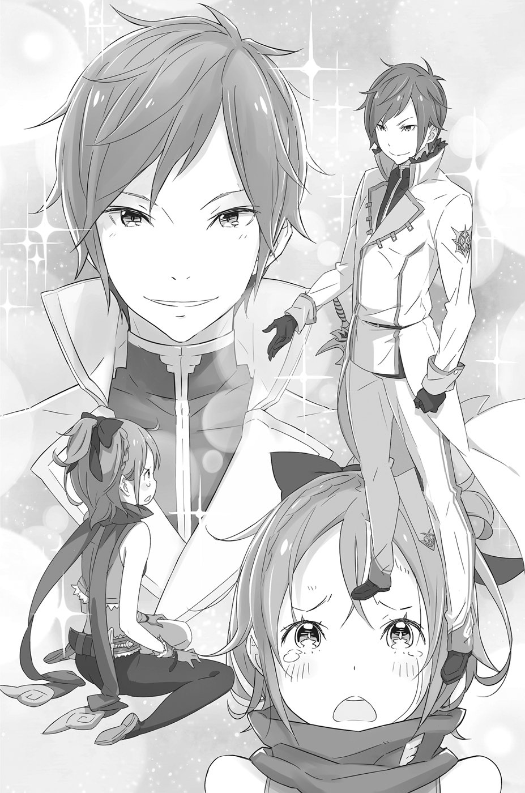
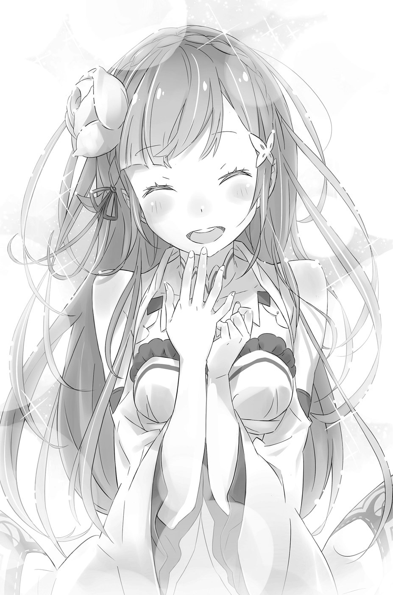

— Рада, что ты здесь. На этот раз я не дам тебе убежать.

Завидев на пороге «Сателлу», Фельт беззвучно попятилась назад. Лицо девочки сморщилось от досады.

— Какая ты всё-таки назойливая. Почему бы тебе не отстать от меня?!

— К сожалению, это не тот случай, — сказала «Сателла» ледяным голосом. — Делай, как я скажу, и никто не пострадает.

Чувствуя, что события принимают опасный оборот, Субару невольно содрогнулся всем телом.

«Почему она здесь?..»

Время ещё раннее, солнце только начало садиться. Тогда, в первой его жизни, они в это время ещё даже не добрались до трущоб, а к самому складу прибыли уже после заката.

«Значит, без меня она добралась сюда в разы быстрее?..»

Получается, даже если бы «Сателла» не встретила в том переулке Субару и не излечила его раны, ничто не помешало бы ей найти воровской склад самостоятельно. Субару даже не знал, как назвать охватившее его сейчас чувство абсолютной бессмысленности своего существования.

Пока юноша переживал собственную никчёмность, события вокруг него стремительно развивались. Отступая назад, Фельт переместилась в дальний угол склада, «Сателла» же, по-прежнему стоя у порога и перекрывая путь к бегству, вдруг вытянула вперёд руку. Послышалось слабое потрескивание: в пространстве перед её ладонью материализовались ледяные кристаллы. Повеяло холодом.

— Верни значок. Это единственное требование. Он очень важен для меня.

Кристаллов было шесть штук, с тупыми кончиками. Судя по этому, их поражающая сила заключалась прежде всего в массе. Однако, попади такая сосулька в цель, ущерба от удара было бы намного больше, чем от брошенного камня. В этом Субару не сомневался. И такой целью на этот раз мог стать он сам. Боясь сделать какую-нибудь глупость, он лишь молча наблюдал за происходящим, обливаясь холодным потом.

— Дед Ром…

— Не могу, Фельт. Схватка с противником, которого ты привела сюда, грозит слишком большими потерями, — мускулы старика напряглись, но он лишь отрицательно покачал головой.

Субару не успел заметить, как в руках деда Рома появилась дубина. Однако судя по всему, старик был растерян. Пальцы на рукояти сжимались и разжимались, выдавая его нерешительность.

— Решил сдаться без боя?

— Будь она обычным волшебником, я бы не отступил, — ответил старик на вызов Фельт. — Но боюсь, сражаться с таким противником нам будет хлопотно.

Старик сощурился и посмотрел на «Сателлу». В его глазах читалась крайняя степень настороженности, смешанной с благоговейным страхом.

— Скажи мне, юная леди, — обратился дед Ром к незнакомке. Его губы дрожали. — Ведь ты эльф?

Услышав это слово, Субару встрепенулся. Предположение старика было верным лишь наполовину. Юноша вспомнил, как назвала себя «Сателла» в их первую встречу.

Сереброволосая красавица прикрыла веки и, тихонько вздохнув, сказала:

— Не совсем. Я полуэльф.

Её ответ прозвучал так, словно ей было тяжело признаться в этом. Субару нахмурился. Однако на остальных это признание произвело гораздо большее впечатление. Особенно на Фельт: та в ужасе отпрянула назад.

— Полуэльф?! С серебристыми волосами?.. Значит, ты…

— Нет, я просто на неё похожа! Мне самой это жутко мешает…

Смысл этих слов для Субару остался загадкой, однако, судя по реакции «Сателлы», ей было не очень приятно говорить на эту тему. Тем не менее отрицательный ответ гостьи не успокоил Фельт, а скорее наоборот. Она повернулась к Субару, хранившему до сих пор молчание, и бросила на него свирепый взгляд:

— Ты подставил меня?!

— С чего ты взяла?..

— Когда ты сказал, что хочешь вернуть значок владельцу, мне это показалось подозрительным. То, что ты не позволил нанять местных ребят, тоже входило в твой план? Ты с ней в сговоре?! Признавайся!

В душе Фельт кипели обида и негодование. Конечно, всё было совсем не так, как ей представлялось, но Субару сейчас больше мучил другой вопрос: как «Сателла» смогла добраться до воровского склада за такое короткое время? Без вмешательства Субару это было просто невозможно. Если бы Фельт всё-таки преградила ей путь местной шпаной, «Сателла» непременно бы опоздала. Значит, благодаря тому, что Субару поторопил Фельт, «Сателла» очутилась на складе намного раньше.

Из этого следовало, что подозрения Фельт были отчасти верны. Правдой было и то, что обстоятельства складывались в пользу Субару. Откровенно говоря, он хотел вернуть значок собственноручно в надежде услышать из уст «Сателлы» похвалу. Но как бы то ни было, если значок в итоге окажется у владелицы, этого будет вполне достаточно. Такая перспектива его устраивала.

— Что здесь происходит?.. Разве вы не вместе? — удивилась «Сателла», когда стала свидетелем разборок между Фельт и Субару.

— Не надо ломать комедию, — хмыкнула Фельт. — Мне отступать некуда, так что давай, подойди и забери у меня значок! Можешь даже посмеяться над моей глупостью!

— Думаю, не стоит так унижаться, — подал голос Субару. — Ситуация повернулась не в твою пользу, но это не повод сгущать краски.

— А ты вообще молчал бы! Привёл её сюда и ещё указывает! — Фельт со злостью дёрнула себя за волосы. — Чёрт бы тебя побрал! Провели как последнюю дурочку!..

«Сателла» сдвинула брови: с её точки зрения, Фельт вела себя совсем не так, как подобает воспитанной девушке. Чувствуя, что атмосфера накалена до предела, Субару лишь нервно сглатывал и водил глазами из стороны в сторону.

И тут он заметил приколотую на груди «Сателлы» брошку в виде красного цветка.

Юноша выдохнул. Он вдруг понял, как нелепы были все его сомнения и колебания, и усмехнулся сам себе. Глядя на суровое выражение лица «Сателлы», Субару вспомнил их вторую встречу, когда она отказалась узнать его. И всё же, сколько бы жизней он ни сменил, «Сателла» оставалась такой же доброй и отзывчивой. То, что она выручила заблудившуюся девочку, было тому свидетельством.

— Так, давайте не будем всё усложнять, — сказал Субару. — Фельт, верни значок. А ты, Сате… В общем, ты поскорее уходи отсюда. И впредь следи за своими вещами.

— С чего это ты вдруг стал ко мне так добр? — поинтересовалась «Сателла». — Я что-то совсем перестала понимать, что происходит…

— И я тоже ничего уже не понимаю! — подхватила Фельт. — Чего тебе нужно?

Попытка снизить градус напряжённости наткнулась на мощный шквал непонимания с обеих сторон. Субару бросил умоляющий взгляд на деда Рома.

— Когда противник использует магию, лучше лишний раз не дёргаться. Не спеши, малец, предупредил старик, неверно истолковав намерения юноши.

«От старикана сейчас никакого толку», — сердито подумал Субару. Лихорадочно соображая, как выпутаться из этой передряги, он вдруг заметил, как за спиной сереброволосой девушки скользнула чёрная тень.

— Пак, защити её!!!

Чёрный силуэт, сверкнув обольстительной улыбкой, устремился вперёд. Позади «Сателлы» блеснул кривой клинок, готовый вонзиться в её мраморную шею. Одно мгновение — и голова сереброволосой красавицы слетела бы с плеч…

Раздался оглушительный треск. Этот звук не был похож на хруст ломающихся костей, скорее, на звук разбивающегося стекла. Вовремя возникший за спиной «Сателлы» магический щит, испускающий мертвенно-бледное сияние, принял удар клинка на себя, едва успев спасти ей жизнь.

Девушка отскочила в сторону и оглянулась. В гуще её серебристых волос показалась маленькая дымчатая фигурка. Пак бросил на Субару торжествующий взгляд:

— Ещё чуть-чуть, и я бы опоздал. Ты спас нас!

— Молодец, Пак! Скорее, это ты нас выручил. Спасибо! — Субару поднял большой палец, хотя его тело продолжала бить дрожь.

Солнце не успело сесть, а это значит, рабочее время верного спутника девушки ещё не подошло к концу. Крик Субару раздался как нельзя вовремя, однако «Сателлу» спасла именно молниеносная реакция Пака.

— Дух, — послышался голос того, кто так внезапно атаковал их. — Ты же дух, верно? Чудесно. Мне ещё не приходилось вспарывать живот духу.

Это была Эльза. Маньячка держала своё оружие перед глазами, в которых застыло выражение восторга. Услышав её голос, Субару и «Сателла» разом встали наизготовку, но предпринять что-либо против Эльзы не решились.

— Эй, ты что такое говоришь?! — гневно выкрикнула Фельт и шагнула вперёд. Вытащив из-за пазухи значок, она ткнула пальцем в Эльзу. — Твоё дело — выкупить у меня эту штуковину! Ты что, собираешься устроить здесь бойню? Мы так не договаривались!

— Действительно, я пришла, чтобы купить украденный тобой значок. Но я не собираюсь вести переговоры в присутствии его владелицы, поэтому изменила свои планы.

Фельт внутри кипела от гнева, но пристальный взгляд кровожадных глаз Эльзы словно лишил девочку дара речи. Её тоже охватил испуг.

— Я убью всех, кто здесь находится, — сказала Эльза, глядя на Фельт ласковыми глазами. — Устрою, как ты сказала, бойню, а потом заберу значок.

Произнеся эти страшные слова с нежной улыбкой на устах, Эльза склонила голову набок и добавила:

— Ты провалила задание. А от бесполезных людей избавляются.

Лицо Фельт исказила страдальческая гримаса. Но виной тому был не страх, а иное чувство. Возможно, слова Эльзы задели в ней некую слабую струну. У Субару не было времени разбираться. Его терпение находилось на исходе.

— Кончай с этим, стерва!!! — заорал он что было мочи, позабыв о том, насколько противница превосходила его по силе.

Удивлённая столь резким выпадом, Эльза повернулась к юноше. Фельт, дед Ром и «Сателла» тоже не стали исключением, однако больше всех удивился сам Субару. Он не мог понять, что его так взбесило, но сдержать ярость, вскипавшую внутри, было невозможно.

— Нравится издеваться над детьми?! Ты, садистка, помешанная на кишках!.. Подумаешь, планы у неё изменились! Больше уважения к чужой жизни, идиотка!!! Тебе известно, каково это, когда вспарывают брюхо?! Так вот, мне — известно!..

— О чём это ты говоришь?

— В данный момент я изобличаю несправедливость этого мира, полагаясь на неизвестно откуда взявшееся во мне чувство рыцарской чести и достоинства! А несправедливостью я считаю тебя, сложившуюся ситуацию и… — Субару повернулся к зрителям. — Оставайтесь на нашем канале, впереди много интересного! Вот так, немного выиграл время… Пак!!! — заорал он, брызжа слюной. — Надери ей задницу!!!

— Такая превосходная бессмыслица достойна быть сохранённой в веках, не правда ли? — раздался голос духа. — Постараюсь не подвести тебя!

Эльза вздрогнула и подняла голову. В воздухе парили штук двадцать ледяных стрел, окружившие её со всех сторон.

— Кажется, леди, мы друг другу не представились. Меня зовут Пак. Запомни это имя перед смертью!

И ледяной град обрушился на Эльзу.

В воздухе заклубился белый туман, и тёмную фигуру Эльзы поглотил ледяной шквал. Скорость ледяных снарядов значительно превосходила скорость тех кусков льда, которые Субару видел в переулке, и сейчас он едва успевал следить за их полётом. Таким стрелам ничего не стоило прошить жертву насквозь, окрасив тонкие прозрачные острия человеческой кровью. А поскольку их было штук двадцать, никто не смог бы выжить, попав под обстрел. Однако…

— Мы её сделали?.. — послышался голос старика.

— Уж лучше бы помалкивал! — бросил ему Субару. Он не выносил глупых реплик в самый ответственный момент.

— Полезно всегда быть наготове, — вдруг раздалось из тумана. — Не люблю его из-за большого веса, но рада, что надела его.

Разорвав белую завесу, Эльза выпрыгнула на свет. Её волосы цвета воронова крыла взметнулись в воздух. Занеся над головой кукри, она сделала несколько лёгких шагов вперёд. Судя по виду, ледяные снаряды не причинили ей никакого вреда. Не считая того, что Эльза сбросила свой чёрный плащ и теперь осталась в одном тёмном платье, плотно облегающем тело, выглядела она так же, как раньше.

— Только не говори, что, сняв с себя тяжёлый плащ, ты увеличиваешь свою ловкость!.. — воскликнул Субару.

— Интересная версия. Но на самом деле плащ просто отражает направленную на меня магию. Он спас мне жизнь.

С этими словами Эльза, выставив перед собой нож, кинулась вперёд, направляя остриё в грудь «Сателле». К горлу Субару подступил отчаянный крик…

— Не стоит недооценивать повелителя духов, — произнесла «Сателла», сложив перед собой руки, словно в молитве. — К врагам мы беспощадны.

Внезапно прямо перед ней вырос ледяной щит, с лёгкостью отразивший удар клинка. Эльза отскочила назад и, завертевшись в серии обратных сальто, понеслась прочь, оставляя за собой ряд вонзающихся в пол ледяных стрел. Контратаку провёл Пак, который парил в воздухе рядом с «Сателлой», размахивая лапками.

— Один атакует, другой прикрывает!.. — восхитился Субару. — Получается, двое против одного.

— Это трюк, который используют повелители духов, — объяснил дед Ром, сжимая в руке дубину. — Пока один ведёт наступление, другой держит оборону. Бывает, один просто тянет время с помощью несложной магии, тогда как второй пускает в ход всё своё мастерство… На полях сражений так и говорят: «Встретишь повелителя духов „— бросай всё к чертям и делай ноги».

Судя по его тону, старик знал, о чём рассказывал. Пожалуй, победить духа, работающего в паре с его хозяином, — задача действительно не из простых.

— Кстати, что делать-то будешь? — осведомился Субару.

— Выжду момент и помогу этой эльфийке. Кажется, с ней ещё можно договориться.

— Стоп, стоп, стоп!.. Погоди! Ты только хуже сделаешь! Всё кончится тем, что тебе отрубят правую руку и перережут глотку. Лучше стой, где стоишь!

— А ну, брось молоть чепуху! Звучит так, будто меня и впрямь уже всего порезали.

На самом деле в словах Субару была доля истины. Уже два раза он становился свидетелем убийства старика. Дед Ром потрогал шею и провёл ладонью по плечу, словно проверяя, все ли части тела на месте.

А битва в это время продолжалась. «Сателла» и Эльза дрались так яростно и стремительно, что вклиниться в их схватку было просто невозможно. Ледяные стрелы, возникающие одна за другой прямо из воздуха, сеяли хаос вокруг, однако оказавшаяся в этом ледяном безумии Эльза проявила просто нечеловеческую гибкость.

Уклоняясь от ударов, она изворачивалась, припадала к земле, иногда даже бегала по стенам презрев силу притяжения, а когда увернуться не получалось, разбивала летящие в неё снаряды ножом, обращая те в пыль. Компенсируя магическое преимущество противника своей ловкостью, Эльза демонстрировала просто фантастическое мастерство.

— Для девушки ты достаточно опытна в бою, — даже Пак, взявший на себя роль атакующего, отдал должное способностям врага, которые были за гранью сверхчеловеческих.

— Ах, как давно меня не называли девушкой!

— Для меня все противники младенцы. И всё-таки ты настолько сильна, что мне даже хочется тебя пощадить.

— Я страшно польщена похвалой от духа, — ответила Эльза, продолжая отбиваться от ледяного града.

Количество снарядов, которые Пак выпустил в Эльзу, приближалось уже к сотне, однако, если не считать самого первого, упреждающего удара, ни один из них так и не достиг цели.

— Думаю, если продолжать в том же духе, она скоро выдохнется, — предположил Субару. — Хотя, может, и нет…

— Двигается эта девица в чёрном на редкость ловко, — сказал старик. — И всё же я не думаю, что она выстоит против двоих… Исход битвы зависит от духа. Как только его время истечёт, расклад сил полностью изменится.

— Чёрт! Это плохо… Уже почти пять!

Субару вспомнил, что в прошлый раз рабочая смена Пака закончилась сразу с заходом солнца. С начала битвы прошло не так много времени, но на сколько у Пака хватит запасов маны или как там она называется?..

— Веселье только началось, а ты всё меньше уделяешь мне внимания. Как жестоко! — сказала Эльза, уворачиваясь от очередного удара.

Худшие опасения Субару подтвердились.

— Нелёгкое это дело — быть дамским угодником, — парировал Пак с иронией, однако отрицать слова Эльзы не стал. — Девушки никогда не дадут тебе уснуть. Но, видишь ли, поздно ложиться спать вредно для кожи.

«Всё, Пак уже на пределе!» — в отчаянии подумал Субару, и в тот же момент Эльза встала как вкопанная.

— Не пора ли нам закругляться? — произнёс Пак и подмигнул своей противнице. — Сколько можно играть один и тот же спектакль?

— Моя нога… — Эльза попыталась сделать шаг, но покачнулась и взмахнула руками, чтобы удержать равновесие. Её правая нога оказалась закована в капкан из ледяных обломков.

— А ты думала, я просто так разбрасывал вокруг тебя эти штуки?

— Получается, я в ловушке?

— Можешь списать это на разницу в нашем опыте и поздравить меня с победой. Спокойной ночи!

Фигурка Пака задрожала, он вытянул вперёд лапки, словно готовясь нанести свой самый мощный удар. Сосредоточив перед собой огромное количество энергии, он выпустил её, словно стрелу, сияющую фосфорическим светом.

На этот раз вместо ледяных стрел на оппонента был направлен поток чистой энергии разрушения. Световой луч обратил в лёд всё, что встретилось ему на пути: склад моментально покрылся инеем. Миновав Эльзу, луч ударился в дверь, снёс её с петель и вырвался наружу.

Когда свет померк, всё оказалось покрыто коркой льда: барная стойка, украденные трофеи, домашняя утварь и даже пол, на котором валялось всё это барахло. Попади такой луч в человека, он наверняка превратил бы его в ледяную статую.

Если бы он только попал…

— Не может… быть…

— Ещё как может. Это было чудесно. Я уже думала, мне конец.

— Девушке так поступать не пристало…

Хотя последний удар Пака не достиг цели, в его голосе не было слышно раздражения, он просто не одобрял то, что сделала противница.

Эльза истекала кровью — с обледеневшего пола поднималась тонкая струйка пара. Садистка стояла в одном шаге от траектории полёта энергетического луча, и из её босой правой ноги обильно лилась кровь.

Наблюдавший эту картину Субару сразу же сообразил, в чём дело: чтобы высвободиться из ледяного капкана, Эльза рубанула по своей ступне.

— Едва успела. Чуть не отрезала себе всю ногу.

— И без того, наверное, очень больно.

— Да, ты прав. Больно. Но сейчас я чувствую, что живу по-настоящему, и это превосходно. К тому же…

В её глазах блеснул нехороший огонёк. Она подняла правую ногу и приложила искалеченную стопу к валявшемуся рядом ледяному осколку. В воздухе послышался треск, и из горла Эльзы вырвался стон наслаждения. Затем она ножом отсекла лишнее от куска льда, и тот словно прирос к окровавленной ступне. На этом жестокая операция по остановке кровотечения была завершена.

— Теперь я немного неуклюжая, но ничего не поделаешь. — Эльза звонко постучала об пол своей ледяной туфлей, и её лицо расплылось в довольной улыбке.

Настолько нездоровое стремление продолжить схватку — вплоть до готовности наносить себе страшные увечья — лишило Субару дара речи. Однако намного больше его сейчас беспокоила судьба «Сателлы», которой теперь предстояло вести бой без напарника.

— Пак, ещё можешь драться?

— Извини, но мне жутко хочется спать. Я чуточку недооценил её. Мана на исходе…

Впервые в голосе духа чувствовалась усталость. Сидящая на плече «Сателлы» фигурка испускала тусклое сияние. Пак таял буквально на глазах, его время подходило к концу.

— Я позабочусь обо всём сама, а ты отдыхай. Спасибо тебе.

— В случае чего я буду действовать согласно нашему договору. Будешь в опасности — зови меня, даже если придётся использовать твой од, — предупредил Пак за секунду до того, как превратиться в туман, который тут же рассеялся в воздухе.

Субару в смятении закусил губу, но Эльза, по-видимому, расстроилась больше всех:

— О, твой дружок уже ушёл? Как жаль!

Держа нож наизготовку и звеня ледяной подошвой, Эльза устремилась к «Сателле». В пространстве вокруг сереброволосой девушки одна за другой возникли ледяные стрелы, но их было несравнимо меньше, чем создавал Пак. Однако, учитывая, что Эльза отныне не отличалась особой манёвренностью, обе стороны, вероятно, имели равные шансы на победу.

— Вы как хотите, а я не могу молча смотреть на всё это, — подал наконец голос дед Ром, сжимая дубину. — Кто из них победит, я не знаю, но, если сидеть сложа руки, мы упустим свой шанс. Понимаешь меня, Фельт?

— Да понимаю я, — отозвалась девочка. — Если бежать, то сейчас самое время, — она встала рядом со стариком и вдруг оглянулась на Субару. — Насчёт того раза… Ты меня вроде как спас.

— А?..

— Ну, так, немножко. А ещё — не называй меня ребёнком!.. Мне уже пятнадцать! Сомневаюсь, что ты прям настолько старше меня!

— Ну, мне в этом году исполнится восемнадцать, — парировал юноша. — Можно будет водить машину и жениться.

— По тебе не скажешь! Выглядишь как мальчишка. Поработал бы над собой!

А что он мог поделать?.. Будничная жизнь в уютненькой Японии не требовала громких подвигов. Фельт явно потешалась над его робостью, и Субару вновь ощутил себя никчёмным. Среди них он был самым слабым звеном. И если бы дело ограничивалось лишь неумением драться…

«Никак не могу унять эту дрожь… Вот что бывает, когда теряешь самообладание…»

Субару не только не хватало боевой квалификации — он просто физически не мог принять участие в схватке. Старик обладал крепкой мускулатурой, Фельт чертовски быстро бегала, «Сателла» умела использовать магию, и каждый из них был бы полезен в бою. И всё же эти таланты вряд ли могли превзойти аномальные способности Эльзы.

— Похоже, эльфийка сдаёт позиции, — сказал дед Ром, наблюдая за боем. Чтобы описать ситуацию, этих слов было вполне достаточно.

Град из ледяных стрел не прекращался ни на секунду, но Эльза так ловко отражала удары ножом, что ни один снаряд не достигал цели. Защищаясь от атак соперницы ледяными щитами, «Сателла» время от времени посылала ледяные стрелы себе под ноги, покрывая поверхность пола льдом, что давало ей возможность скользить назад, едва успевая уклоняться от смертоносного клинка. Сохраняя дистанцию, она продолжала стрелять, но всякому было ясно: её положение оставляло желать лучшего.

Другими словами, поддержка была необходима как воздух. Видимо, как раз эта мысль и пришла в голову деду Рому: издав боевой клич, старик ринулся в бой. Со свистом рассекая воздух, шипастая дубина обрушилась на Эльзу, но та пригнулась, и лишь порыв ветра взметнул её волосы.

— Ах, как некрасиво с твоей стороны прерывать наш танец!

— Хочешь потанцевать? Так я устрою лучший танец в твоей жизни! Закружу до смерти!..

Великан выбросил вперёд руку с дубиной, перейдя от махового удара к колющему. Резкая смена тактики имела целью пронзить шипами горло Эльзы, но в результате… дубина прошила пустоту.

— Что за?..

— Ты такой силач! Теперь я могу сделать вот так.

Эльза стояла на самом конце дубины, балансируя на кончиках пальцев. Такой акробатический трюк можно было исполнить, только обладая невероятным чувством равновесия, и перед тем, как это равновесие нарушить, Эльза взмахнула клинком. Ещё секунда, и нож раскроил бы череп деда Рома надвое…

— Только посмей!!!

Ножик Фельт просвистел в воздухе и со звоном ударил в плоскость лезвия. Кукри дрогнул, немного провернулся и врезался в голову старика плашмя. Послышался глухой звук от удара стали о кость, и гигантское тело повалилось набок.

— Плохая девочка, — сказала Эльза, мягко спрыгнув на пол. Её глаза метнули острый взгляд в сторону Фельт.

Атака Эльзы мог бы стать для старика фатальной, но Фельт спасла тому жизнь. Судя по всему, девочка метила в руку убийцы, но, не успев как следует прицелиться, немного промахнулась. Тем не менее, если бы не этот бросок, дед Ром был бы мёртв.

— У тебя нет ни решительности, ни силы сражаться, — продолжала Эльза. — Сидела бы себе тихонько в углу и не высовывалась.

Громко цокая по полу, чёрная тень молниеносно оказалась перед Фельт. Помочь девчонке было некому. Дед Ром лежал без сознания, а «Сателла» оказалась слишком далеко. Сама же Фельт стояла как вкопанная — точно лягушка, заворожённая пристальным змеиным взглядом…

— Хайдара-а-а-а!..[^11]

Оставался только дрожавший от страха трус. И этот трус сорвался с места и стремглав бросился к Фельт.

Субару на лету схватил лёгкое тельце за талию, прижал к себе и повалил на землю. В какой-то миг он почувствовал, как ему по затылку чиркнула сталь. От этого прикосновения волосы на голове встали дыбом.

Обернувшись, Субару поймал на себе удивлённый взгляд Эльзы. «Один — ноль в мою пользу», — с наслаждением подумал он про себя.

— Ты не ранена? — обратился он к Фельт. — Если я случайно прикоснулся не к тем местам, не сердись, ладно?

— А я уже собиралась сказать тебе спасибо!.. Но… зачем ты?..

— Не знаю! Тело само рванулось вперёд!.. Хотя ты всё равно не поймёшь, но имей в виду: теперь мы в расчёте, ясно? Запомни: мы в расчёте! — Субару выпустил Фельт из своих объятий и сжал кулаки.

Однажды Фельт защитила его от клинка Эльзы. И пускай это произошло в другой его жизни, данный факт не имел никакого значения: вернуть долг Субару считал делом чести. Долги должны быть погашены, поэтому он сделал то, что посчитал нужным.

— Слушай меня внимательно, Фельт. Сейчас я попробую выиграть нам немного времени. Постараюсь отвлечь её, а ты беги отсюда во весь опор, поняла?

— Не поняла! По-твоему, я могу взять и сбежать, поджав хвост? — Фельт сверлила его сердитым взглядом, но Субару не отвёл глаза. Он придвинул своё лицо ближе к лицу девочки, стараясь поймать тот момент, когда она спасует перед его мужественным напором.

— Именно так! Ноги в руки — и бегом отсюда. По правде говоря, я бы и сам отсюда смылся. Засиделся я на этом проклятом складе. Но дело в том, что… — он потрепал белобрысые вихры и продолжил: — Тебе только пятнадцать, а мне почти восемнадцать! Ты здесь самая младшая, поэтому у тебя больше шансов остаться в живых. Так всегда бывает. Будет и в этот раз!

— Что ты несёшь?.. Сам же ещё минуту назад дрожал от страха!

— То было раньше, а сейчас — совсем другое дело! Теперь не дрожу!.. И пока меня не начали снова одолевать всякие жуткие воспоминания, пока есть силы, я должен сделать это. Поэтому не спорь и жди моего сигнала.

Фельт хотела было возразить, но Субару упреждающе поднял руку и поднялся во весь рост. В нескольких шагах лежала дубина деда Рома. На вид она была неподъёмной, но юноша решил, что всё-таки попробует.

В это время Эльза продолжала мастерски уворачиваться от ледяного града «Сателлы». В её движениях не чувствовалось ни капли усталости. Субару понятия не имел, каким образом он, совершенно не обладая боевым опытом, сможет отвлечь внимание искусной воительницы. Единственное, что он мог сделать, — улучить момент и нанести внезапный удар.

Сбив на лету очередной ледяной снаряд, Эльза повернулась спиной к Субару, и в тот же миг юноша бросился в атаку. Быть может, виной тому был бешеный всплеск адреналина, но скорость, с которой он обрушил свой удар на голову Эльзы, превзошла все его ожидания. Дубина просвистела в воздухе и…

— Превосходная атака, но, к сожалению, ты не умеешь скрывать свои намерения.

— Скрывать намерения?! И как я, по-твоему, должен это делать?!

Эльза резко парировала удар тыльной стороной клинка, и дубина пролетела мимо цели. В ту же секунду Субару закричал:

— Давай, Фельт! Беги!!!

Фигурка девочки взлетела в воздух, словно распрямившаяся пружинка, и стремительно пронеслась по направлению к двери.

— Думаешь, я позволю?.. — Эльза выхватила второй нож и, будто в отместку за недавний поступок Фельт, бросила его в спину уносящемуся прочь вихрю.

— Придётся позволить, потому что я так решил!!!

Субару изо всех сил пнул ногой по оказавшемуся рядом столу, тот подпрыгнул в воздух, и пущенный Эльзой нож с треском отлетел в сторону.

— Да я крут!.. — видимо, адреналин всё ещё бурлил в его крови. — Вот только ноге больнее, чем я думал…

Не успел Субару как следует похвалить себя, как удар ногой по голове отбросил его к стене. Из глаз посыпались искры, во рту появился привкус крови. Субару сплюнул.

— Должна признать, я немного раздражена, — послышался голос Эльзы.

— Рад это слышать! — Субару вскочил на ноги, старательно делая вид, что ему всё нипочём. — Так тебе и надо. Ха-ха, всё-таки ты её упустила!

Дразня Эльзу, он пытался отвлечь её внимание от Фельт. Словно разгадав его намерения, Эльза улыбнулась. Сбежавшая девчонка её уже совершенно не интересовала.

— Хорошо, я принимаю твоё приглашение на танец, — сказала она. — Только постарайся сделать так, чтобы мне не было скучно.

— Тогда будь осторожна! Танцор я никудышный, поэтому могу отдавить тебе все ноги! — Субару сплюнул кровь и покрепче сжал дубину.

Он понимал, что его шансы стремятся к нулю, но выбора не было… Собрав волю в кулак, он приготовился нанести встречный удар.

— А про меня забыла?! — раздался звонкий голосок, и в спину Эльзе полетел ледяной снаряд. Маньячка не глядя взмахнула клинком, и кусок льда разлетелся на осколки.

— Эти забавы мне уже порядком надоели. Чем ещё развлечёте? — её губы растянулись в кровожадной ухмылке.

От этого зрелища по спине Субару пробежал холодок, и он бросил взгляд на «Сателлу».

— Если у тебя есть какая-нибудь скрытая суперсила, думаю, сейчас самое время воспользоваться ею! — бросил он шутливым тоном, скорее пытаясь приободрить самого себя.

— Есть у меня один козырь в рукаве… — ответила «Сателла», восприняв его слова на полном серьёзе. — Но если я его использую, никто, кроме меня, не выживет.

— Чёрт, плохи наши дела… Только давай без самоподрывов! С козырем пока повременим, хорошо?

Глядя на Субару, исполненного решимости биться до последнего, сереброволосая красавица, едва заметно улыбнувшись, ответила:

— И не собиралась. Я же вижу, как ты стараешься, чтобы противостоять ей. Я верю, у тебя получится… Воспользоваться помощью родителей — самое последнее средство.

«Сателла» произнесла эти слова так, словно уже потеряла всякую надежду. Словно она уже признала своё поражение. Глядя на неё, Субару ощутил, как внутри разгорается пламя.

Для него она была той, кто никогда не опускает руки, какие бы невзгоды ни обрушивались. Он был готов на всё, лишь бы снова увидеть улыбку этой волевой, несгибаемой девушки. Пройдя через несколько смертей, он явился сюда, чтобы спасти «Сателлу», Он проделал весь этот путь вовсе не для того, чтобы увидеть, как она сдаётся.

— Я ничего не видел, — произнёс Субару.

«Сателла» бросила на него удивлённый взгляд.

— И ничего не слышал. Ничего! Я наконец-то вспомнил, зачем я здесь. И я это сделаю, чёрт возьми! Никаких козырей не понадобится!!! — заорал он, переводя взгляд с Эльзы на «Сателлу» и обратно, а затем указал пальцем на Эльзу. — Я размозжу тебе череп, тварь, и всё закончится хеппи-эндом.

Потом громко топнул ногой, сплюнул и добавил:

— Тебя никто сюда не звал, так что проваливай!

— Я смотрю, ты всё ещё полон сил, — пропела Эльза и немного подалась вперёд.

— Я зол как никогда! И сейчас ты почувствуешь это на собственной шкуре! — Субару взмахнул дубиной, демонстрируя мощь будущего удара.

Чарующая улыбка Эльзы растаяла во мраке. В следующий миг Субару заметил скользящую по полу чёрную тень, в руке которой тускло блестел клинок. Тень надвигалась, и Субару размахнулся, вкладывая в свой удар все силы, что в нём ещё оставались. В движении не было ни капли жалости. Осталось лишь желание вышибить этой твари мозги.

Шипастое орудие деда Рома просвистело над самой её головой. Распластавшись по полу, как клякса, Эльза ловко ушла от удара.

— Ах ты, паучиха!

— Тогда ты тот, кто попал в мою паутину, — парировала Эльза и выбросила руку с ножом вверх, но Субару в одно мгновение повалился на спину.

Понимая, что он всё ещё находится в пределах досягаемости клинка, Субару в панике двинул коленом вслепую и попал в возникшую перед ним фигуру Эльзы. Рука с ножом кукри слегка дрогнула, и в это мгновение между противниками вспыхнул мертвенно-бледный свет. Послышался громкий лязг.

— Ледяной щит! — воскликнул Субару. — Отличный заслон!

— Я не мастер создавать их на расстоянии! Могла случайно кого-нибудь заморозить!

— Меня бы ты не стала замораживать, верно? — с этими словами Субару отскочил назад, и «Сателла» возобновила ледяной обстрел Эльзы.

— Какие же вы букашки надоедливые, — произнесла Эльза, отбиваясь от ударов. — Не пора ли вас прихлопнуть?..

— Сначала разберись со своими тараканами! — прокричал в ответ Субару, пытаясь хоть как-то отвлечь её внимание.

— Строишь из себя героя, пока я занята другими делами?

Субару с радостью приложил бы дубину к спине Эльзы, но делать это нужно было с величайшей осторожностью, чтобы не попасть под обстрел союзника. Такая проблема неизбежно возникает, когда приходится драться в импровизированной команде.

В общем, Субару ничего не оставалось, кроме как следить за схваткой соперниц, провожая глазами ледяные стрелы «Сателлы», и, улучив момент, быстро наносить удар и так же быстро отступать, пока не получил в ответ. И всё же было ясно как день, что стоит Эльзе только захотеть — она вмиг бы расправилась с ним, как она сделала это с хозяином склада. Субару оставался жив лишь потому, что Эльзе в данный момент было просто не до него. Гораздо больше её беспокоило то, что «Сателла» могла вновь пробудить отправившегося на отдых духа, и, судя по всему, в этом случае любительнице кишок действительно пришлось бы туго.

Нужно сказать, что выживанию юноши также помогла трусость, державшая его на расстоянии от зоны, где оружие Эльзы представляло смертельную опасность. Окажись Субару слишком бесстрашным, баланс сил был бы нарушен одним ударом клинка. Тем не менее малодушие Субару не могло служить ему вечно.

С каждой секундой Эльза билась всё яростнее, и Субару, не успевая вовремя отступать, начал получать новые раны. Руки, ноги, подмышки и даже шея были испещрены порезами, а серый спортивный костюм побагровел от кровавых пятен. От боли на глаза наворачивались слёзы.

— Чёрт, больно!.. А как тебе такое?! — Субару резко сменил тактику боя и ударил ногой с разворота, но нога тут же оказалась в цепких лапах Эльзы.

— Попался!

— Чёрт!..

Эльза занесла над головой нож. Субару приготовился к худшему. Острый клинок молниеносным движением отсечёт ему ногу, и он умрёт от болевого шока и потери крови. Перед глазами всплыла зловещая надпись: «BAD END 4».

«Зря я это сделал!» — пронеслось в голове.

Субару замахнулся дубиной, чтобы хоть как-то защититься, но бить из такой невыгодной позиции, стоя на одной ноге, было бесполезно. Раздался пронзительный крик «Сателлы». Клинок начал опускаться. Субару показалось, что он уже чувствует невыносимую боль и видит ручьи крови, и ему захотелось кричать — дико, во всё горло…

— Довольно!

Проломив потолок, в полумрак склада снизошло слепящее пламя. Повеяло леденящим душу ужасом, и клинок замер в воздухе.

Эльза разжала пальцы, и Субару, не удержав равновесие, грохнулся на пол. Перед его глазами возникли клубы дыма, в которых горел ярко-красный огонь.

— Кажется, ты был на волосок от смерти. Рад, что успел вовремя. Ну-ка…

— Ты…

Пламя дрогнуло и вынырнуло из клубов дыма наружу. Все присутствующие, включая Эльзу, застыли, не в силах вымолвить ни слова. Их взгляды были устремлены на того, кто воплощал в себе непоколебимую волю и беззаветную решимость.

Рыцарь без страха и упрёка, в небесно-голубом взоре которого светилась сама справедливость, слегка улыбнулся, резким движением головы откинул со лба огненно-красные волосы и произнёс:

— Пора заканчивать этот спектакль!

Его голос прогремел, точно раскат грома.

Оказавшись на улице, Фельт испытала огромное облегчение. За спиной раздавался треск морозного воздуха, слышался металлический лязг, свист от взмахов какого-то тупого орудия, и всё это под аккомпанемент беспорядочных выкриков и топота ног.

Битва была в самом разгаре. Убегая прочь от склада, Фельт почувствовала, что у неё дрожат ноги. Она тряхнула головой, отгоняя от себя вереницу бессвязных мыслей.

Фельт не сомневалась, что, останься она там, её бы уже не было в живых. Соперница, уложившая с одного удара такого гиганта, как дед Ром, не оставляла Фельт никаких шансов. То же самое относилось и к сереброволосой полуэльфийке: разве по силам той тягаться с Эльзой без поддержки духа?..

Про этого Субару и говорить нечего. По всему видно, что он абсолютный дилетант без малейшего боевого опыта. Стоит только взглянуть на его чистенькие руки, ухоженные чёрные волосы и нежную кожу, и сразу ясно, что он не то что оружия никогда не держал, но и вообще с трудом представляет, что такое настоящее сражение. Другими словами, изнеженный и избалованный юноша с высоким социальным статусом, которому вряд ли приходилось принимать участие в битвах. И его баснословно дорогая мития только подтверждала это.

Ну что ж, так ему и надо. Наивный простачок, возомнивший себя благородным рыцарем. Судя по его поступкам, он совершенно забыл своё место. Оставалось только посмеяться над такой неразумностью…

— Кто-нибудь!.. Ну неужели никто не поможет?!

Разум подсказывал Фельт, что нужно держаться переулков, однако ноги несли её вдоль центральной улицы бедняцких кварталов, которая выходила на главную улицу города. Она бежала, задыхаясь и бросая отчаянные взгляды по сторонам, когда её вдруг охватило странное чувство. К глазам подступили слёзы, и она яростно потёрла их ладонями.

«И почему мне его жаль?.. Ладно, дедушка Ром — он мне как родной, но этого парня я совсем не знаю! Какое мне дело, если его убьют?.. Но ведь он заступился за меня перед Эльзой, а потом принёс себя в жертву ради спасения моей жизни!..»

Фельт была не в силах разобраться в своих чувствах, но внутренний голос твердил: не останавливайся.

Этот парень пробудил в ней нечто такое, чему она не могла найти объяснения. Фельт изменилась, и новая реальность требовала действий. Она бежала, едва сдерживаясь, чтобы не закричать от переполнявших её чувств.

— Пожалуйста, помогите!..

Фельт была уже в нескольких кварталах от склада, как вдруг…

— Хорошо. Я помогу, — перед ней вырос молодой человек с огненно-красными волосами.

Отныне миру была уготована иная судьба.

— Райнхард?..

— Да, Субару, это я, — огневолосый красавец слегка повернул голову в сторону мертвенно-бледного юноши, и на его лице промелькнула виноватая улыбка. — Вот мы и встретились снова. Извини, что опоздал.

Каждое его движение — даже то, как он смахнул с себя пыль, — было безупречно точным, и Субару показалось, что в Райнхарде что-то изменилось: он казался не тем Райнхардом, что спас его в переулке от головорезов. Сейчас он был настоящим. Голубые глаза рыцаря безотрывно следили за красавицей в чёрном, которая была явно не рада его появлению. Потом они вдруг прищурились, словно Райнхард пытался что-то припомнить.

— Тёмные волосы, тёмная одежда… — вымолвил он, — изогнутый клинок, характерный для северной провинции. Всё это говорит о том, что передо мной Охотница за потрохами. Я прав?

— Что за чудовищное прозвище?.. — послышался голос Субару.

— Это из-за её уникального стиля убийств, — объяснил Райнхард, не отрывая от Эльзы пристального взгляда своих голубых глаз. — Даже в столице у неё слава опасного человека. Хотя я слышал, что на самом деле она обычная наёмница.

— Райнхард… Ну конечно. Рыцарь среди рыцарей из рода Великих Мечников. Как чудесно, что мне выпал шанс сразиться с таким достойным врагом. Уже за одно это я должна сказать спасибо своему нанимателю.

— У меня есть к тебе немало вопросов, — сказал рыцарь. — Поэтому настоятельно рекомендую сдаться.

— Ты надеешься, что голодный хищник устоит перед такой заманчивой, уже истекающей кровью добычей? — вперив в Райнхарда демонический взгляд, Эльза игриво скользнула языком по губам.

Рыцарь задумчиво почесал щёку:

— Субару, ты мне очень поможешь, если встанешь немного подальше, рядом с той девушкой. И позаботься о старике, чтобы он тоже был в безопасности.

— Не вопрос, — сказал Субару. — Эта женщина просто чудовище, так что не расслабляйся.

— К счастью, охота на чудовищ — моя работа, — заверил его Райнхард и с абсолютным спокойствием на лице шагнул навстречу Эльзе.

Меч по-прежнему висел у него на поясе. Рыцарь приближался к противнице с пустыми руками.

В руке Эльзы мелькнул серебром нож-кукри. Она резко выдохнула и бросилась на Райнхарда, намереваясь снести ему голову. Рыцарь был совершенно беззащитен, да и обороняться он явно не собирался. Более того, он даже не попытался уклониться от атаки. Субару казалось, он уже видит, как голова рыцаря слетает с широких плеч…

— Я бы предпочёл не применять грубые приёмы по отношению к женщине… — предупредил Райнхард, как истинный джентльмен, — но, похоже, придётся.

Он с силой ударил одной ногой об пол, поднимая в воздух щепки, а другой встретил атакующую Эльзу. Нога врезалась в тело противницы с такой силой, что в воздухе образовалась ударная волна.

Фронт волны докатился даже до Субару. Юноша опешил. С виду это был обычный прямой удар ногой, однако такой силы, что всё здание вздрогнуло. Эльзу отбросило назад, словно пушинку, но та отскочила от стены, как мяч, погасив силу удара. Судя по её виду, Эльза не ожидала подобного поворота событий.

— Нет-нет-нет, не может быть!.. Что такое?..

Такое называется «из ряда вон». Субару не раз прибегал к этому выражению, когда становился свидетелем необычных явлений, однако только сейчас понял, что всё время трактовал его совершенно неправильно. Оно было создано специально для таких героев, как Райнхард. Всё виденное им в этом мире раньше меркло в сравнении с отважным рыцарем.

— Ты именно такой, как о тебе говорят… Нет, ты даже лучше.

— Не уверен, что оправдаю твои ожидания…

— Ты не собираешься использовать свой меч? Я бы хотела прочувствовать его легендарную остроту.

Эльза указала рукой на меч Райнхарда, желая, чтобы рыцарь показал себя во всей красе, но тот лишь отрицательно покачал головой:

— Этот меч нельзя обнажать без крайней необходимости. А раз он до сих пор в ножнах, значит, здесь не тот случай.

— Кажется, ты меня недооцениваешь.

— Меня это тоже огорчает, — сказал Райнхард. — Поэтому…

Он вдруг отвёл взгляд от Эльзы и посмотрел в глубину склада, где у стены стоял старый, видавший виды двуручный меч. Подойдя к мечу, он подцепил его ногой за эфес и подкинул в воздух. Ухватив клинок, Райнхард слегка взмахнул им, словно удостоверяясь в надёжности.

— …с твоего позволения, я воспользуюсь вот этим. Не возражаешь?

— Вовсе нет! Это чудесно! Чудесно! Развлеки меня, пожалуйста! — воскликнула Эльза и первой бросилась в атаку, вкладывая в силу удара всю свою скорость.

Райнхард стоял, приготовив оружие к бою. Субару подумал, что он запомнит этот момент на всю жизнь.

Рыцарь выглядел божественно. Удар, который он нанёс, был чётко выверенным и рассчитанным. Старый, никудышный меч, доживавший свой век в глубинах воровского склада на окраине города, заблестел, словно святыня, о которой слагают легенды. Райнхард выжал из него всё, что было возможно.

Меч ударил чуть выше рукояти кукри и прошёл сквозь клинок Эльзы, как сквозь масло.

Эльза изумлённо посмотрела на обрубок своего Ножа. От того, что ещё недавно было смертельным оружием, осталась одна рукоятка. Что касается самого клинка…

— Поскольку ты лишилась оружия, я снова советую тебе сдаться, — произнёс Райнхард, поймав клинок Эльзы свободной рукой. Лёгким движением кисти он метнул обломок в противоположную стену, и тот с резким металлическим звуком вонзился в рассохшуюся древесину. Субару услышал, как Эльза нервно сглотнула.

— Он точно не от мира сего. У меня даже нет сил шутить на эту тему… — выдавил из себя юноша и поспешил подальше от места схватки.

Приблизившись к распластавшемуся на полу деду Рому, он кое-как подтащил огромное тело к стене.

— Дед Ром! Эй, старик! Ты жив? — Субару похлопал его по щекам.

Из груди великана вырвался стон:

— У-у-у… Это кто тут… старик?..

— Ты, конечно, кто ж ещё? — Субару вздохнул с облегчением. — У меня две цели в жизни: не облысеть и не растолстеть до старости. И глядя на тебя, я понимаю, что таким точно не хотел бы оказаться.

Дед Ром здорово ударился головой, но в остальном, судя по всему, был в порядке. Конечно, от случившегося у него могла повредиться память, но это мелочи, главное — он не погиб.

— Он жив? — послышался голос «Сателлы». Она подбежала к раненому и осмотрела его ушибы. — Его нужно срочно излечить, — пробормотала девушка, и её ладони начали излучать бледно-голубое свечение.

— Конечно, не моё дело, но ничего, что этот старик в сговоре с воровкой, которая украла твой значок? — поинтересовался Субару.

— Именно поэтому я и хочу его вылечить, — ответила «Сателла». — За это он даст мне кое-какую информацию. Он не будет лгать тому, кто спас его жизнь. Как видишь, я делаю это только ради себя.

Такое объяснение было совершенно в духе «Сателлы». Похоже, чтобы оправдать свои поступки, ей непременно требовалось сделать акцент на эгоистических побуждениях. В ответ Субару лишь улыбнулся и обратил всё своё внимание на поле сражения.

Эльза стояла на коленях, и Субару не мог видеть её лица. Наверное, Райнхард решил, что она потеряла всякое желание продолжать схватку. Он опустил меч и приблизился к сопернице. Судя по поведению рыцаря, он был уверен в своём превосходстве, однако излишняя самоуверенность ещё никогда не доводила до добра. Субару охватила тревога.

— У неё есть второй!!!

Выхватив запасной нож, Эльза подскочила к рыцарю, но тот успел уклониться от удара, и клинок только срезал кончики его огненно-красных волос. Атака Эльзы провалилась, и она обратила взгляд своих чёрных глаз на Субару.

— Знаешь, я впечатлена, — сказала она.

— Убедился на личном опыте! — отозвался юноша и показал ей средний палец. Видимо, решив, что парень бредит, Эльза не обратила внимания на его реплику.

— Не думай, что у меня всего два клыка. Давай начнём сначала?

— Ты не успокоишься, пока я не вырву их все? — спросил Райнхард.

— Кончатся клыки — стану рвать тебя когтями. Кончатся когти — воспользуюсь костями, а если лишусь костей — отдам свою жизнь. Таков путь Охотницы за потрохами, — Эльза выхватила ещё один клинок и атаковала, пробежав по стене склада, совершенно оправдывая прозвище «паучихи», которым её наградил Субару. Казалось, тяготения для неё вообще не существовало.

— В таком случае тебе придётся позабыть свои идеалы, — произнёс Райнхард, отразив выпад изогнутого лезвия.

От столкновения стали со сталью сыпались искры. Отталкиваясь то от стен, то от потолка, Эльза стремительно бросалась на соперника и так же стремительно отпрыгивала назад, когда Райнхард отбивал её атаки. Субару, затаив дыхание, наблюдал за этой свистопляской.

— Неужели даже у Райнхарда не хватит сил справиться с ней?..

Способности Эльзы были за гранью возможного, и Субару с трудом удавалось следить за её движениями. Однако мастерство Райнхарда оказалось не менее фантастическим.

Их схватка представляла собой столкновение двух мифических небожителей, и всё же Субару видел, что Райнхард превосходит свою соперницу. Тем более удивительно, что битва продолжалась до сих пор…

— Это из-за меня… — «Сателла» словно прочитала мысли Субару. Она всё ещё колдовала над дедом Ромом. Глянув на юношу краем глаза, девушка с досадой закусила губу. — Он не может сражаться в полную силу, так как я использую магию. Сначала он даст мне закончить лечение…

— А при чём тут это?

— Если Райнхард решит сражаться в полную мощь, я лишусь всей маны в атмосфере, — пояснила «Сателла». — Лечение почти закончено. Как только я справлюсь, дай ему знать.

— Ага, — поколебавшись, согласился Субару, хотя он не был уверен, что хоть что-то понимает.

Голубое свечение продолжало исцелять деда Рома. Субару с восхищением наблюдал, как с головы старика постепенно исчезают следы крови, а рана сама собой затягивается. Наконец «Сателла» сделала глубокий вдох.

— Я закончила.

— Райнхард! — крикнул Субару рыцарю, который продолжал обороняться от ударов Эльзы. — Я не совсем понял, но делай что должен!

Райнхард лишь мельком бросил взгляд в сторону юноши и легонько кивнул.

— Что ты покажешь? — Эльза приготовилась к прыжку.

— Искусство меча семьи Астрея, — величественно произнёс Райнхард, и Субару почувствовал, как пространство вокруг начало закручиваться в спираль.

В воздухе заиграла рябь, и Субару показалось, что в помещении стало как будто меньше света, а температура, которая и без того была довольно низкой из-за магии льда «Сателлы», опустилась ещё ниже. Он обхватил себя за плечи, чтобы унять дрожь, как вдруг почувствовал, что «Сателла» наваливается на него всем своим телом.

— Эй, ты чего? — растерявшись, юноша торопливо подставил руки, не дав ей упасть.

Стройное тело девушки пылало огнём. Сердце Субару готово было выпрыгнуть из груди, но теперь уже по совсем другой причине, чем раньше. Однако стоило ему приглядеться внимательней, и от романтических переживаний не осталось и следа. Девушка дышала часто и неглубоко и имела крайне измождённый вид, словно подхватила лихорадку.

— Что это ты вдруг? Заболела?..

— Нет, это мана… Ну, ты понимаешь…

«Вообще без понятия», — подумал Субару. Ему захотелось сложить руки на груди и объявить это вслух, но в данной обстановке шутки выглядели неуместными. Дело было даже не в тяжести навалившегося на него тела. Что-то новое и опасное витало теперь в атмосфере склада, так что Субару счёл за лучшее промолчать.

Райнхард стоял в самом центре, держа двуручный меч низко, на уровне бёдер. Нет, сама поза рыцаря была ни при чём. Он не менял её с самого начала сражения. И всё-таки каким-то шестым чувством Субару понимал, что именно сейчас Райнхард впервые изготовил меч для настоящего удара.

— Эльза Гранхирт, Охотница за потрохами, — Эльза облизала губы.

— Райнхард ван Астрея, из рода Великих Мечников, — представился в ответ рыцарь.

Чудовищная сила, исходившая от меча Райнхарда, сотрясала воздух. Воинственный дух противников заполнил собою всё помещение. Полуразрушенный воровской склад стал местом, где безжалостной убийце в чёрном платье и бесстрашному герою, облачённому в лёгкие одежды, предстояло сойтись в смертельной схватке, скрестив обагрённый кровью нож и проржавевший двуручный меч.

Субару затаил дыхание. Ему казалось, что сейчас он станет Свидетелем грандиозного сражения из героического эпоса.

Раздался пронзительный крик — то ли Эльзы, то ли Райнхарда, а может быть, и самого Субару. Безумный поток энергии разорвал пространство и, пробив крышу, вырвался наружу, мгновенно заполнив всё вокруг ослепительно-белым свечением. Как только свет рассеялся, куски пространства снова начали собираться воедино, в то время как остаточные волны, свирепствуя неистовым ураганом, закручивали воздух спиралями, приводя поле боя в абсолютный хаос. Краденые вещи вперемешку со всевозможным хламом закружились бешеной воронкой.

— Что творится?.. А-а-а-а!!! — Субару кинулся к «Сателле» и деду Рому в отчаянной попытке защитить их от случайного удара. Происхождение этого хаоса был за гранью понимания Субару, но он прекрасно осознавал, кто явился его причиной.

Виной всему был взмах меча Великого Мечника. Одинединственный мощный взмах меча.

Субару продолжал кричать, превозмогая боль и ветер. Наконец жестокий смерч начал постепенно утихать, а спустя несколько секунд стук падающего на пол добра и приглушённый скрип развалин склада возвестили о том, что его силы окончательно иссякли.

Субару, отряхнувшись от мусора, проверил, в порядке ли девушка и старик, которых он накрыл собой во время бури. Судя по всему, его защиты оказалось недостаточно, так как дед Ром был изрядно испачкан молоком и засыпан каким-то сором. Однако Субару рассчитывал на снисхождение со стороны старика.

— И ты говоришь, что охота на чудовищ — твоя профессия?! — закричал он на Райнхарда. — Да ты сам чудовище каких поискать!

— Субару, твои слова меня огорчают, — ответил рыцарь, мрачно усмехнувшись.

Огненно-красные волосы на его голове были растрёпаны порывами ветра, а на невозмутимом лице даже выступили капли пота. Рыцарь посмотрел на свой меч.

— Похоже, я переусердствовал. Можешь отдыхать, — сказал он, глядя, как клинок рассыпается на мелкие частички. Меч был слишком простым, чтобы выдержать силу Райнхарда. Хватило одного удара, и его стальной клинок истлел и рассыпался прахом. Что касается Эльзы…

— Похоже, от неё даже мокрого места не осталось… — сказал Субару. — И всё это от одного взмаха мечом?

Удар, который, казалось, разорвал в клочья само пространство, не оставил камня на камне. Ударная волна, сметая всё на своём пути, распространилась далеко за пределы склада, а свирепый ураган разрушил здание практически до основания.

Очевидно, Эльза тоже попала под удар, но высокой и стройной фигуры садистки нигде не было видно.

— Но это же значит… — Субару потянулся, разминая затёкшие от перенапряжения мышцы, и с облегчением вздохнул. Не веря, что всё наконец закончилось, он подумал о девушке, голова которой по-прежнему лежала у него на плече. Дыхание «Сателлы» всё ещё было слабым, но, почувствовав на себе взгляд юноши, она нашла силы обратить на него фиалковые глаза.

— Всё… позади?.. — спросила она еле слышно.

— Да, думаю, можно сказать и так… — ответил Субару, помогая ей подняться.

«Сателла» провела пальцами по волосам и, высвободившись из его рук, отошла на нетвёрдых ногах в сторону. Вдруг она обернулась в ответ на пристальный взгляд юноши:

— Почему ты так на меня смотришь? Это очень невежливо…

— Твои руки и ноги целы и невредимы, — произнёс Субару, продолжая её разглядывать. — И даже голова на месте.

— А разве должно быть иначе?.. Не говори так, ты меня пугаешь. — «Сателла» смотрела на него непонимающим взглядом.

В ответ Субару поднял большой палец и просиял:

— Ну конечно! Так и должно быть! Мои руки и ноги тоже на месте, из спины не торчит нож, и даже в животе нет дыры!

— Ты говоришь так, будто переживал подобное…

«Было дело», — подумал Субару, вспомнив, как однажды из-за его бестолковости лишилась жизни «Сателла», потерял руку и был смертельно ранен дед Ром и зверски убита Фельт.

— Ах да, Райнхард! Я до сих пор не поблагодарил тебя. Ты мой спаситель. Как и тогда в переулке. Не иначе, как ты услышал крик моей души, дружище!

— Если б я только умел слышать такое, я бы гордился собой, друг мой! — с сожалением признал рыцарь и указал куда-то в сторону.

Когда Субару повернул голову и увидел, на кого показывал Райнхард, его рот растянулся в широкой улыбке. Там, где раньше находился вход на склад, стояла светловолосая девочка с хулигански торчащим клычком. Прячась в тени чудом уцелевшей опоры, она робко поглядывала на присутствующих.

— Я встретил её на улице. Она была в отчаянии и попросила меня помочь. Это она привела меня сюда, а я всего лишь исполнил свой рыцарский долг.

— Рыцарский долг для тебя — сравнять с землёй старый, обветшалый дом?

— Субару, тебе не кажется, что ты слишком много ворчишь? — Райнхард прижал руку к груди, словно юноша задел его больное место.

Непосредственность, с которой Райнхард общался с Субару, вызвала у последнего чувство смутной тревоги. Ведь совсем недавно этот человек творил совершенно ужасные вещи.

— Это же… — «Сателла» заметила силуэт девочки.

— Постой, постой! — вмешался Субару. — Эта девчонка позвала на помощь Райнхарда. Если бы не она, нас бы перебили, как тараканов! Пожалуйста, ради меня, не превращай её в ледяную статую!

— Я не настолько жестока! И вообще, почему ты говоришь «ради меня»?..

Глядя на то, как «Сателла» устало растирает лоб пальцами, Субару почувствовал, что на душе стало светлее. Теперь, когда все живы и здоровы, можно было и пошутить.

— Полагаю, дальше всё зависит от моего искусства ведения переговоров, — сказал он, — которое, впрочем, оставляет желать лучшего.

— Что с тобой случилось? Тебе должно быть стыдно так себя вести…

Делая вид, что слова «Сателлы» задели его за живое, Субару повторил жест Райнхарда, прижав руку к груди. Правда, у него он выглядел комично: в нём не было той величественности, какой мог похвастаться рыцарь.

Райнхард наблюдал за этим разговором с довольной улыбкой. Затем он, не говоря ни слова, приветственно поднял руку и зашагал навстречу Фельт.

Глядя на Райнхарда, Субару теперь не испытывал зависти. Он пожал плечами: в конце концов, все люди разные. Кто-то обладает такими замечательными качествами, кто-то — нет. При виде приближающегося рыцаря Фельт насторожилась, но, видимо, желание сбежать было пересилено чувством благодарности.

Вдруг Райнхард резко обернулся:

— Субару!!!

За спиной юноши возникла истекающая кровью чёрная тень. Покачивая всклокоченными чёрными волосами, она поднялась из-под обломков и молча бросилась вперёд, сжимая в руке погнутый кукри. Это была садистка Эльза.

В глазах убийцы, сумевшей выжить после страшного удара, чернела кромешная тьма, и в ней ощущалась невиданная до сих пор жажда крови. Субару похолодел. Ещё несколько мгновений, и она нанесёт удар. Мысли пронеслись в его голове с бешеной скоростью.

— Чтоб тебя!!!

«Через пару мгновений будет уже поздно. Она поставила на этот бросок всё, что у неё было. Райнхарду не успеть. Если б я мог задержать её, он взял бы на себя всё остальное. “Сателла” не успеет даже оглянуться. Кто её цель?.. Не хочу испытывать это в третий раз. Этот страх, эту боль. На сей раз я… спасу её!»

Спасти девушку!

— Она целится в живот! — Субару бросился к «Сателле» и оттолкнул её в сторону, прикрыв свой собственный живот дубиной, которую он всё ещё держал в руке.

Нож рассёк воздух по горизонтали, но его прикосновение больше походило на удар тяжёлым и тупым предметом. Субару отбросило в сторону, мир перед его глазами перевернулся вверх тормашками. Пролетев через весь склад, парень врезался в стену.

— Опять этот сопляк у меня на пути, — прошипела убийца.

— Довольно, Эльза!

Перед ней возникла фигура Райнхарда. Осознав, что продолжать битву бессмысленно, она метнула в него нож, клинок которого уже совсем погнулся после атаки на Субару. Нож пролетел мимо, однако этого броска было достаточно, чтобы отвлечь внимание рыцаря. Эльза молниеносно вскочила на гору обломков.

— Когда-нибудь я выпотрошу вас всех до единого. А пока берегите свои кишки!.. — ловко вспрыгнув на крышу, она скрылась из виду. Бросаться в погоню было бессмысленно. Райнхард не собирался продолжать схватку, поэтому не стал преследовать Эльзу.

Проводив её взглядом, он поспешил к сереброволосой девушке.

— С вами всё в порядке? — спросил он.

— Какая разница, что со мной! — воскликнула в сердцах «Сателла». — Гораздо важнее, что с ним… — И она, шатаясь, поспешила к пострадавшему юноше. — Ты жив? Как безрассудно с твоей стороны!..

— Ох-ох, ерунда, — прокряхтел Субару, успокаивая её жестом. — А что мне оставалось делать? Я был ближе всех, к тому же сразу понял, в кого она метила.

Он провёл рукой по тому месту, куда пришёлся удар. Затем задрал одежду и увидел, что весь бок превратился в один сплошной кровоподтёк. При виде этой картины Субару сморщился, а затем напряг мышцы и поднялся на ноги.

— Надеюсь, мы наконец-то от неё избавились.

— Извини, Субару, — сказал Райнхард. — Я потерял бдительность. Если бы не ты, нам всем пришлось бы туго. Могло получиться, что эта девушка оказалась бы ранена, и тогда…

— Постой-постой!.. Ни слова больше! Я запрещаю тебе говорить! Иначе ты лишишь меня всей славы.

Райнхард замолчал, а Субару, улыбаясь, медленно повернулся к сереброволосой девушке и посмотрел ей прямо в глаза. Между ними было не более двух шагов: вытянув руку, он смог бы дотронуться до неё. Субару закрыл глаза и с содроганием сердца вспомнил, через что ему пришлось пройти, чтобы этот момент наконец настал. «Сателла» хотела было что-то сказать, но не успела, так как юноша поднял палец к небу и, не обращая внимания на удивлённые взгляды окружающих, сказал:

— Меня зовут Нацуки Субару! Я знаю, что тебе не терпится задать мне кучу вопросов, но для начала позволь мне спросить кое о чём!

— Что… Что ты хочешь спросить?..

— Я только что спас твою жизнь от гнусной злодейки! Окей?

— О… кей?..

— Имеется в виду, согласна ли ты со мной. Итак, окей?! — вновь настойчиво спросил Субару, изобразив руками сначала букву О, а за ней и К.

— О… кей, — чуть поколебавшись, ответила девушка.

— Итак, я спас тебе жизнь. Значит, я твой спаситель! а ты — спасённая героиня! А раз так, мне положена награда, не так ли? Не слышу?!

— Хорошо, я поняла… Правда, я смогу сделать только то, что в моих силах.

— В таком случае у меня есть одно-единственное желание, — и он выставил указательный палец, подчёркивая свою решимость.

Глаза «Сателлы» выдавали волнение, но она взяла себя в руки и кивнула:

— Я готова.

— Я хочу…

Зубы Субару блеснули в усмешке. Он щёлкнул пальцами и, сделав серьёзное лицо, сказал:

— …чтобы ты назвала своё имя!

Девушка застыла в недоумении с широко раскрытыми глазами. Повисла тишина. Взгляд Субару не дрогнул ни на секунду. Он продолжал неотрывно смотреть сереброволосой красавице прямо в глаза.

Вдруг щёки девушки залились румянцем, и она, прикрыв рот ладонью, тихонько рассмеялась. В этом смехе не было отчаяния, не было ни горечи, ни печали. Смех был искренним и радостным.

— Эмилия, — сказала она, улыбаясь.

В ответ Субару лишь испустил короткий вздох. Видя его реакцию, девушка расправила плечи и, приложив палец к губам, снова озорно рассмеялась:

— Меня зовут Эмилия. Просто Эмилия. Спасибо, Субару. Благодарю тебя за спасение.

Она протянула ему руку, и юноша несмело коснулся её тонких пальцев. Белоснежная хрупкая девичья ладошка подарила ему живое человеческое тепло.

«Благодарю тебя за спасение».

Субару хотел сказать ей то же. На самом деле именно он был обязан ей своим спасением. Наконец-то он смог вернуть долг. И чтобы дойти до конца, ему пришлось три раза погибнуть от беспощадных клинков.

«Все эти увечья, слёзы, боль, все эти сражения, в которых на кону оказалась моя жизнь, — всё это было ради того, чтобы услышать имя и увидеть эту улыбку. Эх… Всё-таки…»

— Всё-таки оно того не стоило, — сказал Субару и, улыбнувшись в ответ, крепко сжал в своей руке ладонь Эмилии.

На этом историю можно было бы закончить, но…

— И всё-таки, Субару, ты легко отделался, — послышался голос Райнхарда. Прерванный на полуслове, кажется, он только и ждал того, когда молодые люди закончат диалог, чтобы выразить своё удивление. Похоже, любая атака Эльзы несла в себе немалую угрозу на взгляд такого искусного воина, как он.

Субару легонько прижал руку к саднящей ране, а затем указал на дубину, валявшуюся на полу.

— Я вовремя прикрылся этой штукой, — сказал он. Шипастое оружие послужило прекрасным щитом, хотя создавалось совсем для других целей. — Если бы не она, меня бы разрубило надвое.

— Верно, — сказал Райнхард и подобрал дубину. — Если бы не она…

…«меня ждала бы плохая концовка №4», — закончил его мысль Субару, как вдруг верхушка дубины отвалилась и с глухим звуком ударилась об пол.

Грозное оружие буквально разломилось пополам. Райнхард медленно повернул голову и испуганно посмотрел на Субару. Проследив за взглядом рыцаря и предчувствуя недоброе, юноша приподнял куртку. Как и раньше, живот был испещрён кровоподтёками, однако внезапно по коже пробежала красная линия.

— Чёрт… Я знаю, что сейчас будет, — пробормотал Субару, и тут пришла жгучая боль. В следующую секунду тонкая линия разверзлась в зияющую рану, и из живота юноши брызнул кровавый фонтан.

— Субару!!!

Сдавленный крик Эмилии раздался совсем рядом.

«Неужели теперь, когда я после стольких трудов узнал её настоящее имя, мне снова пришёл конец?..»

Перед глазами всё завертелось, и он рухнул на пол.

«Пусть даже и так, я всё равно сюда вернусь…»

Он смутно различил, как Райнхард и Эмилия в панике бросились к нему. Девушка склонилась, и в её глазах застыло выражение острой боли.

«Но её личико такое хорошенькое, даже когда она паникует…» — подумал Субару. Он вдруг вспомнил, что подобные мысли уже приходили ему в голову. В тот же миг его пронзила острая боль, и сознание юноши смыло, словно бурной волной.

[^11]: Ставший в Японии мемом боевой клич Кена Маринариса героя видеоигры Zone of the Enders.
