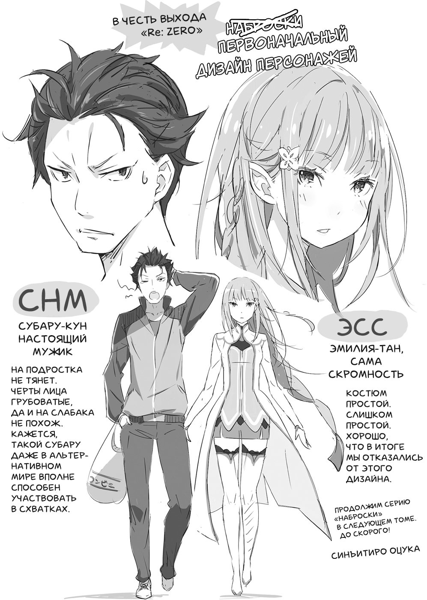
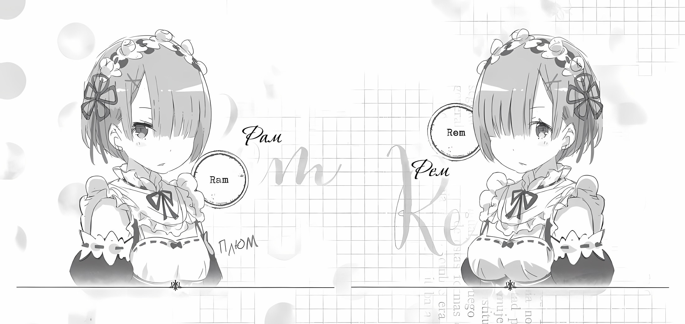

Приветствую вас, уважаемые читатели, чьё знакомство с моей историей началось с этой книги. Меня зовут Таппэй Нагацуки.

Здравствуйте и те, кто следил за ходом повествования по веб-версии романа. Вам я известен под псевдонимом Мышиный Кот[^12].

К какой бы категории читателей вы ни относились, прежде всего, я хочу поблагодарить вас за то, что заинтересовались этой книгой. Для тех же из вас, кто не совсем понимает, о чём речь, я поясню.

Первоначально роман «Re: Zero. Жизнь с нуля в альтернативном мире» публиковался по частям на сайте «Стань писателем». Позже для выпуска в печать текст подвергли небольшой правке. В своей основе книга следует интернетверсии романа, с той лишь разницей, что текст стал более удобочитаемым, сюжет — более насыщенным событиями, героиня — ещё прелестнее, а на главного героя навалилось ещё больше бед.

Думаю, не ошибусь, если предположу, что при виде многочисленных великолепных иллюстраций, которыми снабжена эта книга, вы непременно ахнули от восторга. А уж я, признаться, как был изумлён! Сереброволосые героини рулят!

Образы нашего многострадального героя и прелестной сереброволосой героини вышли из-под кисти господина Синъитиро Оцуки. Господин Оцука, проявив свой блистательный художественный талант, воплотил в жизнь героев книги, о точном облике которых автор не имел ни малейшего представления. Именно тогда они и родились окончательно. Можно сказать, что я — их мать, а господин Оцука — отец. Персонажи на иллюстрациях — плод наших совместных усилий.

И чтобы наши начинания получили должное продолжение, я прошу вас помочь этому. Кстати, если сейчас вы читаете эти строки, стоя в книжном магазине, купите эту книгу, пожалуйста. Тогда следующий том не заставит себя долго ждать!

А теперь позвольте мне кратко коснуться содержания. Книга написана в жанре фэнтези и рассказывает о путешествиях в альтернативные миры. Этот очень обширный и популярный жанр породил множество литературных шедевров. Думаю, все мальчишки, а может быть, и некоторые девчонки, мечтают о том, чтобы попасть в такой фэнтезийный мир, с мечами и магией.

Главный герой этой книги тоже самый обычный японский подросток. Мечом орудовать он не умеет, магию использовать не может, боевыми искусствами не владеет, и вообще, звёзд с неба не хватает. Однако в безвыходных ситуациях нежелание сдаваться становится его единственным оружием. Поэтому наша история о том, как не сдаваться. О твёрдости духа.

Каким же образом твёрдость духа может стать оружием? Роман расскажет об этом. Что получит главный герой, пройдя сквозь огонь, воду и медные трубы? Мне бы хотелось, чтобы вы сами получили ответ на этот вопрос. А заодно восхитились красотой и очарованием сереброволосой героини.

Кажется, я слишком навязчиво выражаю свои личные пристрастия, поэтому пора переходить к благодарностям.

Прежде всего, я хочу сказать огромное спасибо господину Икэмото — человеку, который дал этой книге шанс выйти за пределы виртуального мира. Господин Икэмото, я бесконечно благодарен вам за это! Я помню напит шумные споры, когда мы, сидя в ресторане за отбивными тонкацу, препирались по поводу того, стоит ли прибавлять к имени героини суффикс «тан». Сейчас, когда книга вышла в свет, я вспоминаю эти моменты с ностальгией. Большое вам спасибо!

Хочется также поблагодарить господина Оцуку, который сумел найти время в своём плотном графике и сделал иллюстрации в рекордно короткие сроки. С каждым новым рисунком у меня захватывало дыхание так сильно, что в конце я чуть не задыхался от восторга! Теперь количество персонажей будет только увеличиваться, и я с огромным нетерпением жду новых иллюстраций. Большое спасибо!

Также выражаю признательность всему редакторскому отделу, корректору, всем работникам издательства, благодаря которым электронный текст обрёл наконец свою печатную форму. Без ваших стараний эта книга никогда бы не увидела свет. Со своей стороны я приложу все усилия, чтобы наше сотрудничество было долгим и плодотворным.

И в заключение я хочу сказать большое спасибо всем, кто сейчас читает эти строки, и всем, кто поддерживал это про изведение на сайте «Стань писателем». Огромная вам благодарность.

До встречи на страницах второго тома «Re: Zero. Жизнь с нуля в альтернативном мире»!

*ноябрь 2013 г.*

*Таппэй Нагацуки*

— Сестра, сестра! Дело чрезвычайной важности. Нам поручили сделать анонс следующего тома Re: Zero».

— Верно. Скоро настанет тот незабываемый день, когда на сцену выйдет главная героиня этой истории.

— Да, все читатели буду рады появлению главного действующего лица, то есть моей сестры. Следующие два тома ранобэ выйдут уже в течение ближайших двух месяцев, и Рем восхищена блестящим решением редакции поскорее представить читателям её сестру.

— Насколько мне известно, выход следующего тома намечен на 25 февраля. Как было бы здорово, если бы все три тома вышли одновременно!

— Сестра, я слышала, что ежемесячный журнал «Comic Alive» готовит какие-то специальные номера.

— Вот как? Рам не в курсе. Это как-то связано с выходом томов ранобэ?

— Да. Начиная с январского выпуска, «Comic Alive» опубликует три специальных номера с приложениями «Re: Zero», обложки для которых нарисует господин Синъитиро Оцука. Номера будут выходить одновременно с томами ранобэ.

— Хм, тогда понятно, почему выпуск первых трёх томов растянули на три месяца. Ты сказала, журналы будут с приложениями?

— Да, это будут сборники рисунков «Re: Zero. Visual Complete», которые познакомят читателей с персонажами истории. А ещё там будут небольшие рассказы про госпожу Эмилию, сестру и Рем.

— И не строчки про главного героя, так? Редакция и тут не ошиблась. Если кто-то из мужских персонажей и сможет заинтересовать читателей, то только господин Розвааль.

— Да сестра, раз ты так думаешь, старания редакции не были напрасными, чему я очень рада.

— Поведение протагониста настолько ужасно, что если он и может чем-то заинтриговать читателя, то только своими попытками выпутаться из очередной переделки, в которой Барусу не раз будет попадать в поместье господина Розвааля.

— Если Субару не возьмётся за ум, я больше чем уверена, что и в следующих томах его страдания не прекратятся.

— Второй том «Re: Zero. Жизнь с нуля в другом мире» увидит свет 25 февраля. Успейте купить!

— Сестра никогда не забывает о своих обязанностях. Сестра, ты великолепна!

[^12]: В оригинале «Нэдзуми-иро Нэко», «кот мышиного цвета».
