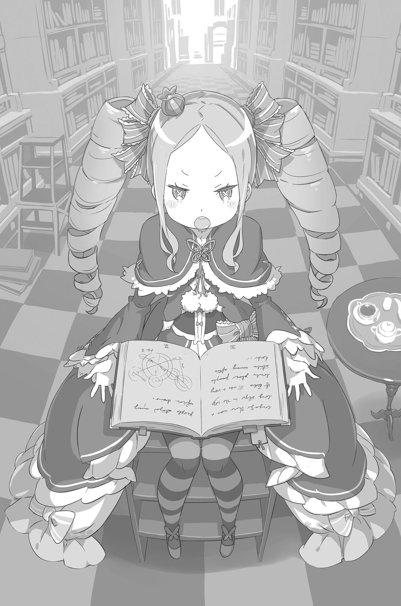
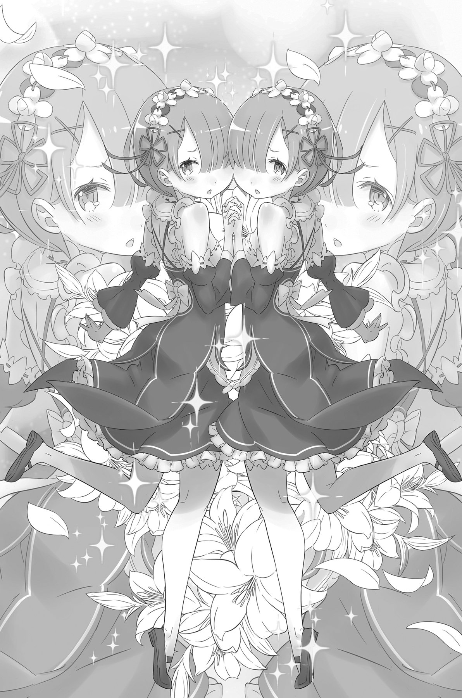

## 1

Первым, что он увидел, когда приоткрыл веки, было белое свечение, казавшееся искусственным. Спустя некоторое время привыкшие глаза разглядели широкий потолок с подвешенными к нему кристаллами, которые освещали комнату мягким приглушённым светом. Мысли обрели ясность, и Субару окончательно проснулся. Вставал он всегда легко.

«На такой подушке мне ещё не приходилось лежать… Мягкая и пахнет приятно. Явно не из дешёвых».

Насладившись мягкостью и тонким благоуханием ложа, Субару сел на постели и осмотрелся. Покои были и впрямь царские: не меньше двадцати татами[^1]. Правда, единственным предметом мебели оказалась огромная кровать, на которой запросто могли бы уместиться пять человек.

«Картины на стенах, похоже, чисто для проформы. Какой-то нежилой здесь дух. Тоже мне, отвели гостю комнату…»

Субару уселся, спустив ноги с кровати, сжал и разжал пальцы, проверяя их подвижность. Затем осмотрел свои руки и босые стопы, приподнял майку и потрогал живот.

«Рана… исчезла! Даже шрама не осталось, не говоря уже о синяках. Надо же, какая замечательная хирургия в этом мире — ни одного шва не видно. Если, конечно, все эти приключения — не плод моего больного воображения…»

В памяти всплыла вереница событий, которые всякий раз заканчивались тем, что ему выпускали кишки. То, что Субару, самый обычный японский школьник, внезапно призванный в альтернативный мир и встретившийся лицом к лицу со смертью, и притом не один раз, до сих пор оставался жив, выглядело совершеннейшим чудом.

«И всё-таки, сколько же времени прошло?»

Он покрутил головой туда-сюда, но не обнаружил ничего похожего на календарь или часы. На глаза попался лишь кристалл над дверью, испускающий желтоватое свечение, а темнота за окном говорила, что на улице ночь.

Субару пожал плечами и глубоко вздохнул:

— Как бы там ни было, но в этот раз, похоже, у меня получилось выжить без Посмертного возвращения.

В это было нелегко поверить, но факты говорили сами за себя.

## 2

Вновь растянувшись на кровати, Субару принялся загибать пальцы:

— Смерть по неосторожности — это раз, геройская смерть — это два, глупая смерть — это три. На четвёртый раз меня смертельно ранили в жестокой схватке, и я умер… то есть почти умер. Похоже, события пошли по другому сценарию. Если б я действительно отдал концы, то стоять мне тогда в одном строю с мобами.

Четыре раза — это уж слишком! И неизменно орудием убийства становилось холодное оружие. Уж чем-чем, а ножами он был сыт по горло. Однако теперь, когда Посмертного возвращения с ним не случилось, время наконец-то пошло так, как ему и положено идти. Что же касается бесследно пропавшей смертельной раны…

«Судя по всему, это её рук дело. Исцеляющая магия Эмилии…»

Перед внутренним взором Субару возник образ сереброволосой красавицы с глазами цвета фиалки — Эмилии, целительную магию которой ему уже пришлось однажды испытать на себе. А значит, рассудил Субару, хозяйкой этого особняка тоже наверняка была Эмилия.

— Хотя с той же вероятностью хозяином может оказаться и Райнхард. Но всё-таки… — Субару бросил взгляд на дверь комнаты. Информации было явно недостаточно, и он с досадой вздохнул. — По правилам, за мной должна приглядывать какая-нибудь красотка, чтобы, как только открою глаза, спросить: «Ты проснулся?». И в тот момент, когда меня призвали, тоже ни одной красавицы рядом не оказалось. Всё здесь не как у людей… Ну, раз никто до сих пор не появился, придётся разбираться самому.

Субару спрыгнул на пол, подошёл к двери и отворил её. В комнату ворвался холодный воздух. За дверью оказался широкий коридор, стены и пол которого были окрашены в тёплые тона. Коридор уходил влево и вправо, насколько хватало глаз, и эта бесконечность выглядела пугающе.

— Да тут настоящий дворец, чёрт возьми! Он не просто большой, он громадный… И ведь ни души!

Поджимая озябшие пальцы, Субару зашлёпал босыми ногами по полу, вслушиваясь в тишину. Дом не подавал никаких признаков жизни. Юноша нахмурился:

— Слишком здесь тихо, даже для ночи… Так тихо, что страшно повысить голос.

Хотелось закричать что-нибудь вроде: «Есть тут кто-ни-бу-у-удь?!» — однако в данной ситуации поступать так было бы слишком опрометчиво. Субару пока не знал, насколько это место безопасно. Предположив, что хозяин особняка настроен к нему доброжелательно, Субару всё же не исключал и другой вариант развития событий, не столь радужный. Что, если любительница кишок вернулась на место битвы и похитила его, пока он был без сознания? Правда, в таком случае он наверняка не смог бы и пальцем пошевелить.

— Как говорил Кэнъити, «Позволь жизни идти своим чередом». Думаю, он прав на все сто.

Кстати, Кэнъити был отцом Субару, и эти слова звучали сейчас для него особенно символично.

Он продолжал уверенно шагать по коридору, но беспокойство усиливалось.

— Сколько иду, а коридору ни конца ни края. Как такое возможно?

Он уже задумался, не повернуть ли обратно, но вдруг остановился как вкопанный.

— Эта картина… Я же видел её, когда только вышел из комнаты…

Скрестив руки на груди, Субару принялся разглядывать висящую на стене картину. Полотно с ночным лесом было точь-в-точь таким же, как то, что украшало стену напротив спальни, из которой он вышел. Неужели Субару шёл на месте и не удалился от двери ни на метр?!

— Наверное, здесь какой-то хитрый пол, который движется сам по себе… Не может ведь коридор быть замкнут в кольцо?

Вероятно, как только Субару прошёл определённое расстояние, его перебросило по карте в противоположную сторону. Такие ловушки попадались ему в RPG-играх.

— Уж не из-за Посмертного ли возвращения это всё? И как же мне отсюда выбраться? — задумчиво произнёс он, открыв первую попавшуюся дверь.

За дверью оказалась совершенно пустая комната, в которой глазу не за что было зацепиться. Внутри, само собой, ни души.

— Зацикленный коридор с неким количеством комнат… Получается, будешь плутать, пока не найдёшь нужную дверь?

Субару всё ещё не смирился с тем, что его призвали в другой мир, и от столкновения с новым фантастическим элементом было впору хвататься за голову.

— Если события будут разворачиваться по канону, может пройти уйма времени, прежде чем отыщу правильную дверь. Я проголодаюсь, вымотаю все нервы и в конце концов выбьюсь из сил. Что ж, раз так…

Он нервно сглотнул, вытер со лба пот и решительно шагнул к двери, напротив которой висела картина, то есть к той самой двери, из которой вышел.

— Посплю в своей комнате, пока кто-нибудь не придёт. Может, как раз эта дверь мне и нужна…

С такими словами Субару со свойственной ему бесцеремонностью повернул ручку двери и… оказался внутри необычной библиотеки. Среди книжных полок устроилась девочка, волосы её были уложены в спиральные букли.

— Возымел наглость врываться без стука, мнится мне? — произнесла она, с упрёком глядя на вошедшего.

## 3

«Библиотека» — иначе назвать это помещение было трудно. По размеру оно оказалось раза в два больше, чем та комната, в которой Субару очнулся. Всё пространство занимали возвышавшиеся до самого потолка стеллажи, забитые бессчётным количеством книг.

— Столько книг, а я ни одной не могу прочесть… Вот досада!

Субару поводил глазами вдоль полок, но не заметил ни одного японского названия. Стройные ряды корешков были испещрены символами, похожими на те, что он видел на улицах столицы. Принятая в этом мире система письменности была ему абсолютно незнакома, и Субару тяжело вздохнул.

— Пялишься на чужие книги да ещё и вздыхаешь, — вновь подала голос девочка. — Нарываешься на грубость, мнится мне? Я стесняться не стану!

— Такое холодное выражение только портит твою красоту, — ответил ей Субару. — Давай улыбнись-ка!

— Бетти в любом настроении хорошенькая, мнится мне. А с тебя хватит и пренебрежительной ухмылки, — она прижала пальчики к щекам, изобразив жуткую гримасу, отдалённо напоминающую улыбку.

Бетти выглядела прелестно. На вид ей было лет одиннадцать-двенадцать — немногим моложе Фельт. Роскошное платье с оборками делало её ещё милее. Длинные волосы цвета заварного крема были завиты в букли, удивительно напоминающие вертикальные пружинки. Не оставалось сомнений — улыбка этой очаровательной девочки тронула бы даже самое чёрствое сердце. Восседая на невысокой деревянной стремянке и держа в руках какой-то фолиант, Бетти смотрела на Субару снизу вверх.

— «Пренебрежительной»? Удивительно, что ты знаешь такие сложные слова, — сказал Субару. — Злишься, потому что я сразу же угадал дверь? Ну извини! Интуиция меня никогда не подводила.

Умение выбирать из множества вариантов правильный с первой же попытки и безо всяких подсказок было у Субару в крови. В прошлом этот талант не раз помогал ему в прохождении различных квестов, и теперешний коридор пополнил список побед.

— Вложено столько труда, и всё насмарку. Это ужасно!

— Да, понимаю, по задумке гейм-мастера, мне полагалось пройти всю цепочку квестов. Ну прости, виноват, — Субару развёл руками и смущённо улыбнулся.

Судя по словам Бетти, зацикленный коридор был делом её рук.

— Ладно, что было, то прошло, — продолжил Субару. — Ты мне лучше вот что скажи: что это за место?

— Хм… Это библиотека Бетти, она же спальня Бетти, она же личная комната Бетти.

— Как всё запущено! Бедненькая, ты хочешь сказать, что у тебя нет своей спальни? И тебе приходится ютиться в библиотеке? Даже не знаю, смеяться или плакать.

— Решил подразнить, мнится мне?! — воскликнула Бетти в ответ на столь бесцеремонный сарказм и, надув щёки, спрыгнула на пол и направилась к обидчику. — С Бетти довольно! Пора преподать тебе урок, мнится мне.

— Эй, что ты собираешься делать? Может, не надо?

Но Бетти только ускорила шаг.

— Стой, где стоишь! приказала она.

По спине юноши пробежал холодок. Девочка приблизилась к Субару на расстояние вытянутой руки и замерла. Её макушка едва доставала ему до груди, но взгляд светло-голубых глаз будто сковал его по рукам и ногам. Кожа покрылась мурашками, в ушах одуряюще зазвенело.

— Хочешь что-то сказать? — спросила она, и на какое-то мгновение Субару почувствовал, будто оковы спали. Бегая глазами по сторонам, он принялся судорожно подыскивать нужные слова.

— Т-только не бей, ладно?

— Твоя склонность к клоунаде достойна восхищения, мнится мне, — сказала Бетти безо всякой иронии и вытянула вперёд руку.

Коснувшись ладонью его груди, она пальцами провела по коже так, что стало щекотно.

— Ва-а-а-а!.. — заорал вдруг Субару.

В следующий миг его словно охватило пламя. Внутри взорвалась и забушевала некая дикая и страшная сила, будто поджаривая его от макушки до пяток и пронзая каждую клетку тела невыносимой болью. В глазах потемнело, затем зрение вернулось, но ручьём потекли слёзы. Субару рухнул на колени.

— Ещё в сознании, мнится мне. Слышала, что ты крепкий парень, и это оказалось правдой.

— Что ты со мной сделала, кучерявая лолька?

— Всего лишь внедрилась в твою ману, мнится мне. Забавная циркуляция, — сказала Бетти совершенно спокойным голосом и, присев на корточки, вдавила свой пальчик в дрожащее тело юноши.

— Бетти убедилась в том, что у тебя не было злого умысла. Но за твою вопиющую невоспитанность Бетти возьмёт у тебя немного мамы.

Терпеть её прикосновение было невозможно, и Субару мешком повалился па пол. Из последних сил он медленно повернул голову и увидел перед собой садистскую ухмылку.

— Ты ведь… не человек? Я имею в виду, по своей сути ты…

— Для того, кто уже повстречался с Пакки, ты слишком долго соображаешь.

Девочка с наслаждением наблюдала за распростёртым у её ног юношей. Она производила впечатление жестокого ребёнка, который забавы ради отрывает лапки кузнечику.

— Нет… В тебе нет абсолютно ничего человеческого… — с трудом выговорил Субару.

— Не меряй благородное и гордое создание своими жалкими стандартами, человечишка, — ответила Бетти ледяным тоном.

В груди Субару пылало негодование, но выразить его словами уже не было сил. Он почувствовал, что его вот-вот снова накроет обморок.

«Что же это такое?.. Не успел очнуться, опять теряю сознание!»

— Если ты тут сдохнешь, мне не будет никакой радости перешагивать через труп, мнится мне.

«Обращается со мной как с собакой какой-то… Вот стерва!» — подумал Субару и вновь провалился в темноту.

## 4

— Сестрица, смотри, он проснулся.

— Ты права, Рем. Он проснулся.

Девичьи голоса, сопровождавшие повторное пробуждение Субару, звучали абсолютно одинаково.

Постель была мягкой и удобной — похоже, он лежал в той же самой кровати. Сквозь приоткрытые шторы в комнату проникали яркие лучи, возвещая о наступлении утра.

— Чтобы я, типичная сова, и вдруг проснулся спозаранку? Давненько со мной такого не бывало, — произнёс Субару, вспомнив, что с тех пор, как он стал прогуливать школу, день и ночь поменялись для него местами. Он повертел головой, повёл плечами, поёрзал на спине и посмотрел в окно.

— Дорогой гость, уже семь часов по Солнцу, — любезно известили голоса.

«Семь часов по Солнцу, — повторил про себя Субару. — Семь утра, надо полагать?»

— Если не считать недавнее пробуждение, выходит, я проспал почти целый день? Мой прежний рекорд — два с половиной дня беспробудного сна, так что не так уж это и много.

— Сестрица, ты слышала? Так может говорить лишь очень ленивый человек.

— Слышала, Рем. Так может говорить только истинный бездельник.

— Так, что это за сестрицы такие здесь критикуют меня в режиме стерео?! — Субару откинул одеяло и резко сел в постели.

По разные стороны кровати стояли две девушки. Испугавшись, они быстрыми шажками отступили к середине комнаты и, взявшись за руки и прижавшись друг к дружке щёчками, уставились на гостя.

Похожие как две капли воды, ростом близняшки были около ста пятидесяти пяти сантиметров. Большие глаза, розовые губки и нежные юные черты делали их совершенно очаровательными. Обе носили короткое каре, которое закрывало один глаз, правый — у одной девушки, левый — у другой. Лишь благодаря этому нюансу и цвету волос — розовому у первой, небесно-голубому — у второй, сестёр можно было отличить друг от друга.

Субару внимательно оглядел их с ног до головы.

— Не может быть! — воскликнул он, и голос его дрогнул. — В этом мире есть костюмы горничных!!!

Девушки были одеты в элегантные чёрные платья с передниками, головы украшали белоснежные кружевные наколки. Особый покрой обнажал хрупкие плечи и в сочетании с короткими юбками подчёркивал каждый изгиб соблазнительных фигурок.

Субару не очень-то разбирался в одежде горничных, но в отменном вкусе модельера сомневаться не приходилось. Правда, близняшки и сами по себе были весьма симпатичными.

— Я всегда считал горничных воплощением элегантной скромности… Но ваш фривольный стиль мне тоже нравится!

— Какой кошмар! Он только что надругался над тобой в своих фантазиях, сестрица!

— Да, просто ужас! Он только что обесчестил тебя в своих мыслях, Рем!

— Не стоит недооценивать меня, сестрички! В моих фантазиях найдётся местечко для вас обеих, — сказал Субару, хищно шевеля пальцами в воздухе.

На лицах девушек отразилось беспокойство. Они расцепили руки и указали пальчиками друг на друга:

— Дорогой гость, простите. Нельзя ли вместо Рем обесчестить её сестрицу?

— Дорогой гость, перестаньте. Оставьте Рам в покое и надругайтесь лучше над Рем.

— Девочки, где же ваша сестринская любовь? — осведомился Субару, глядя, как они сваливают роль жертвы друг на дружку. — Не такой уж я и злодей!

Тук-тук! — раздалось совсем рядом.

— Не успел проснуться, а уже дурачишься?!

В комнате возникла вчерашняя знакомая Субару. Её длинные серебристые волосы свободно ниспадали до самой поясницы. Вместо костюма, который девушка носила в городе, на ней была лёгкая туника выше колен, подчёркивающая изящный стан и белизну кожи.

— Прекрасный выбор! — провозгласил Субару, с восхищением любуясь её стройными ножками. — Отлично понимаю того, кто тебя так нарядил!

Эмилия посмотрела на него непонимающим взглядом:

— Не знаю, о чём ты, но догадываюсь, что это очередная глупость, и потому полна разочарования.

Внезапное появление Эмилии вмиг подняло настроение Субару до небес. После череды совершенно незнакомых персонажей (встреча с той мелкой девчонкой оставила особенно неприятные воспоминания) увидеть знакомое лицо Эмилии, которую он знал практически с момента появления в этом мире, было удивительно приятно.

— Я забеспокоилась, когда узнала о твоей стычке с Беатрис. Теперь понимаю, что переживала зря.

— Чувствую себя просто супер, потому что вижу тебя! Кстати, боюсь спросить… — сложив перед собой ладони, Субару робко, исподлобья посмотрел на Эмилию. — Хм… Ты хорошо меня помнишь?

— Этот жест… мне он почему-то не нравится, — произнесла девушка. — И вопрос ты странный задаёшь. Разве можно забыть такого, как ты, Субару? — она снова улыбнулась. — Ты оставил неизгладимое впечатление!

Услышав из её уст своё имя, Субару вздохнул с облегчением. Правда, на щеках немедленно вспыхнул румянец — всё-таки нечасто ему приходилось слышать своё имя из уст девушек.

Служанки тем временем бросились к Эмилии и начали сыпать необоснованными обвинениями в адрес смущённого гостя:

— Послушайте, госпожа Эмилия. Этот юноша надругался над моей сестрицей.

— Послушайте, госпожа Эмилия. Этот парень изнасиловал Рем.

Эмилия искоса посмотрела на Субару

— Я не настолько хорошо знаю Субару, чтобы утверждать обратное. Но всё же хочется верить, что он не способен на такое. Так что прекратите над ним издеваться.

— Да, госпожа Эмилия. Моя сестрица сожалеет.

— Да, госпожа Эмилия. Рем очень жаль, — произнесли служанки бесцветными голосами, хотя, судя по их виду, им было вовсе не жаль.

Впрочем, Эмилию это не слишком волновало, похоже, она давным-давно привыкла к подобному поведению.

— Субару, как ты себя чувствуешь? Ничего не болит?

— Эм-м-м… Ну, перед тем, как я отрубился, было такое чувство, словно меня в огонь бросили. Думал уже, что помру. Но сейчас ничего такого нет. Наоборот, даже какая-то вялость. Наверно, переспал.

— Что ж, я рада, что ты в порядке. Не хочешь пойти погулять? — спросила Эмилия с улыбкой.

— Погулять? — Субару недоверчиво склонил голову

— Да, погулять. Прогулка во дворе — мой ежедневный ритуал. Кажется, сейчас самое время для этого, как думаешь?

— Ежедневный ритуал?.. Что ты имеешь в виду? Грядки поливаешь, что ли?

— Не совсем так. Я разговариваю с духами, Мне нужно входить с ними в контакт каждое утро — это одно из условий нашего контракта.

При слове «духи» Субару вспомнил бессменного спутника Эмилии — Пака. Погулять на свежем воздухе и пообщаться с духами предложение казалось заманчивым.

Субару уже начало распирать любопытство, кроме того, ему не терпелось кое-что проверить.

— Пожалуй, это пойдёт мне на пользу, Эмилия-тан[^2], — сказал он. — Пока ты будешь вести беседы с духами, я прогуляюсь по округе и немного разомнусь, идёт?

— Идёт, при условии, что ты будешь вести себя потише… Постой-ка! Как ты меня назвал?

— Отлично, договорились! Пойдем скорее на улицу!

— Подожди, объясни мне, что ты сказал! Что такое «тан»? Откуда это?..

Уменьшительно-ласкательный суффикс явно сбил Эмилию с толку, но Субару отчего-то было трудно называть её просто по имени, и он, стараясь скрыть смущение, обратился к стоявшим в стороне служанкам:

— Эй, сестрички, а куда подевалась моя одежда? Когда я проснулся, на мне уже была эта больничная пижама. Видать, меня в неё переодели, пока я был в отключке.

— Ты понимаешь, о чём он говорит, сестрица? Случайно, не о той грязной серой тряпке?

— Я поняла, Рем. Он говорит о том рубище мышиного цвета, заляпанном кровью.

— Вы только посмотрите, какие мы острые на язык! Грязное рубище мышиного цвета! Если мой костюм цел, попрошу принести его сюда.

Близняшки вопросительно посмотрели на Эмилию и, когда та кивнула, поклонились и вышли из комнаты.

— Возможно, излишне напоминать, но тебе не следует перенапрягаться. Ты потерял много крови.

— Но от раны не осталось и следа! Да, кстати… — словно вспомнив что-то, Субару выпрямился и медленно склонил перед Эмилией голову. — Спасибо, Эмилия-тан, за то, что залечила мою рану. Ты спасла мне жизнь. Умирать, знаешь ли, страшновато. Одного раза мне будет вполне достаточно.

— Так ведь это и случается только один раз… М-м, не важно, — в фиалковых глазах Эмилии блеснули слезинки. — Это я должна благодарить тебя. Ты рисковал собой, спасая меня на том складе. Исцелить раны — меньшее, что я могла для тебя сделать.

Слова благодарности прозвучали так искренне, что у Субару невольно перехватило дыхание. Он не мог ответить ей так же честно и прямо и ненавидел себя за это. Ему хотелось возразить: «Нет, это я должен благодарить тебя». Ведь именно она спасла его первой. Но о тех событиях сейчас помнил только он сам.

Субару улыбнулся, подавляя желание сказать ей то, упоминать о чём нельзя было ни в коем случае.

— Что ж, раз мы спасли друг друга, значит, в расчёте?

— В «расчёте»?..

— Ничего друг другу не должны! Так что будем дружить, сестрёнка!

Если бы Субару разговаривал со случайным прохожим из бедняцких кварталов, он непременно похлопал бы того по плечу. Однако сейчас ему только и оставалось, что попытаться скрыть алый румянец.

На губах Эмилии возникла едва заметная улыбка:

— А нужен ли мне такой странный братец?

— Довольно язвительное замечание! — сказал Субару, и они рассмеялись.

Тут открылась дверь, и в комнату вошли служанки. Одна несла в руках штаны Субару, а другая — куртку.

— Кажется, пора начинать новый день! — провозгласил Субару.

Теперь, когда время вернулось к своему нормальному ходу, новый день в альтернативном мире начался в полном смысле этого слова.

## 5

Отказавшись от предложенной служанками помощи с переодеванием, Субару натянул спортивный костюм и вместе с Эмилией вышел из дома.

Двор перед особняком был такой огромный, что у Субару вырвался возглас восхищения:

— Вот это да! Под стать таким хоромам! Не двор, а целое поле…

Подобные виды часто попадались в аниме и манге: обширная территория перед особняком какого-нибудь богача, где вечером устраивают приёмы. Не теряя времени, Субару принялся за утреннюю зарядку.

— Какие необычные движения! — заметила наблюдавшая за ним Эмилия. — Что ты делаешь?

— Небольшая утренняя гимнастика. Перед тем как перейти к серьёзным физическим нагрузкам, нужно обязательно разогреть мышцы.

— Хм, не припомню, чтобы кто-то занимался такими вещами. Но мне известно, что совершать резкие движения опасно для здоровья.

— Значит, зарядку у вас тут никто не делает? А хочешь, научу? В моих краях секреты утренней гимнастики передаются из поколения в поколение!

— Хорошо… Я попробую…

Бодрый настрой юноши оказался столь заразителен, что Эмилия, хотя и с опаской, но всё же принялась повторять за ним упражнения.

— Начинаем утреннюю разминку! — продекламировал Субару. — Вытягиваем руки вперёд и тянемся вверх на носочках!

— Что? Ты шутишь?

— Просто повторяй за мной! — скомандовал юноша. — Сейчас я поделюсь с тобой духом настоящей гимнастики!

Робкие движения Эмилии постепенно становились уверенней, и наконец девушка вошла во вкус. Выполнив последнее упражнение, они подняли руки к небу и сделали глубокий вдох.

— А теперь кричим «виктори»[^3]!

— В-виктори…

— Для первого раза просто супер. Эмилия-тан, теперь ты посвящена в тайны утренней гимнастики!

Кажется, похвала Субару произвела на Эмилию впечатление: на её лице сияла гордость. Переведя дух, девушка вдруг вспомнила о своём первоочередном деле.

— Ох и заговорились мы с тобой. Совсем забыла, а ведь они могут на меня обидеться!

Эмилия достала спрятанный на груди зелёный кристалл и показала его Субару.

— А, это же…

— Кристалл, в котором отдыхает дух. Ты ведь помнишь Пака?

— Того котика, который проспал всё самое интересное? Держу пари, он даже не в курсе моего героического поступка!

Кристалл блеснул, словно предупреждая юношу, чтобы тот не болтал лишнего.

— Должен тебя огорчить, Субару, — из кристалла послышался знакомый голос. — Когда закончился весь сыр-бор, Лия мне всё рассказала.

Из кристалла ударил луч света, и на ладони Эмилии возникли неясные очертания маленькой кошачьей фигурки. Стоя на задних лапках, материализовавшийся Пак взмахнул своим длиннющим хвостом.

— Привет, Субару! Прекрасное утро, правда?

— Сплошной кавардак с ночи и до самого утра. Бесконечные коридоры и злые маленькие девочки, готовые душу из тебя вынуть. А теперь вот вместе с Эмилией обливаемся потом, страстно занимаясь гимнастикой.

— Не болтай, Субару, иначе о нас могут подумать что-то не то! — Эмилия бросила на него сердитый взгляд, а затем повернулась к Паку. — Доброе утро, Пак. Прости за вчерашнее, я тебя совсем замучила.

— Доброе утро, Лия. Это я должен извиняться, ведь вчера едва не потерял тебя! Спасибо Субару, я перед ним в вечном долгу.

Чёрные глазки Пака, похожие на две бусинки, обратились к Субару. Кот потёр лапкой розовый носик.

— Как мне отблагодарить тебя? Проси всё, что пожелаешь.

Субару не мешкал ни секунды:

— Позволь мне вволю тискать тебя в любое время!

Эмилия и Пак раскрыли от удивления рты, не ожидая столь скорого и странного ответа.

— Может быть, ещё немножко подумаешь? — спросила Эмилия. — Ты не смотри, что Пак такой маленький, в нём скрыта огромная сила.

— Она права, — подтвердил Пак. — Для своих размеров я весьма способный дух.

— Эй, такой любитель пушистиков, как я, не променяет возможность потискать объект обожания ни на какие деньги! Нет, я серьёзно!

С этими словами Субару запустил пальцы в мягкую шёрстку Пака.

— Боже, какие ушки! Я уже без ума от тебя!

— Знаю, Субару, ведь я читаю твои мысли, но мне чрезвычайно приятно это слышать! — промурлыкал котик, пока Субару гладил и тискал его.

Глядя на эту идиллию, Эмилия махнула рукой:

— В таком случае я пойду пообщаюсь с духами… Вы можете продолжать свои забавы, но только, чур, не мешать мне!

— Она что, собирается бросить нас?

— Она уже бросила, Субару.

Не обращая внимания на их шуточки, Эмилия отошла в сторону, расчистила себе место от опавших листьев, села прямо на траву и закрыла глаза. Вокруг девушки закружились неяркие огоньки.

— Низшие духи? — Субару было знакомо это зрелище.

— Верно, — ответил Пак. — А ты неплохо разбираешься. Большинство людей не отличают квазидухов от низших духов.

— Не то чтобы я разбирался… Честно говоря, я тоже не особо смыслю в таких тонкостях, — признался Субару.

Он знал, что эти огоньки представляют собой низших духов, потому что однажды, во время поисков значка, Эмилия уже называла их этим именем.

Девушка сидела на траве и, улыбаясь, что-то шептала. Парящие вокруг неё светлячки тускло мерцали в ответ.

— Она говорила про какой-то контракт… — вспомнил Субару. — В чём же он заключается?

— Когда заключаешь контракт с духами, ты принимаешь на себя некоторые обязательства, — сказал Пак. — Иными словами, даёшь обет.

Услыхав незнакомое слово, Субару поднял брови, и Пак пояснил:

— Ну, понимаешь, во-первых, если вызывающий не заключит контракт с духом, он не сможет использовать магию духов. Условия контракта отличаются в зависимости от того, с каким духом он заключён. Я понятно излагаю?

— Окей, давай дальше.

— Не знаю, что ты подразумеваешь под этим «окей», тем не менее продолжим. Итак, требования у каждого духа индивидуальные, но низшие из них, как правило, выдвигают довольно простые условия — вроде того, чтобы почаще общаться с магом.

— Это потому что они новички, да? А те духи, что уже вполне сформировались, выходит, отдельная история?

— Ты схватываешь на лету. И всё-таки не перебивай, а то мы далеко не уйдём.

Пак провёл лапкой по усам и продолжил:

— Совершенно верно. Духи, обладающие сознанием, предъявляют более жёсткие требования. Но и работают они на совесть. Что касается меня и Лии, условия нашего контракта тоже довольно строги.

— Ты называешь её «Лия», это так мило!

— Твоя «Эмилия-тан» ещё милее! Может, мне тоже стоит называть её так?..

— Только не это, пожалуйста! — вмешалась в беседу Эмилия.

Аура из светлячков вокруг девушки уже исчезла, что свидетельствовало об окончании ток-шоу с духами.

— Уже закончила? — спросил Субару, поднимаясь с земли и отряхивая травинки со штанин. — Так быстро?

— Я беспокоилась из-за вас, поэтому попросила их закончить побыстрее. Завтра нужно будет поговорить с ними подольше, — сказала Эмилия и вытянула вперёд руку.

Пак соскочил с плеча Субару и приземлился на ладонь хозяйки.

— Всё хорошо, — сказал он, обратив на Эмилию глаза-бусинки. — Проверка показала, что у Субару нет ни злого умысла, ни враждебности. Парень он хороший, хоть и со своими тараканами, — хихикнул Пак.

— Разве мож… — Эмилия запнулась на полуслове и возмущённо уставилась на кота. — Разве можно так говорить? Он же тебя слышит! Пусть это и правда, но Субару вправе обидеться.

— Ничего-ничего, всё нормально, — поспешил сгладить неловкость юноша. — Вы меня совсем не знаете, поэтому можете проверять, как только захочется. И не надо меня защищать, Эмилия-тан, а то я и вправду обижусь!

Он знал, что, пока будет тискать Пака, тот устроит ему проверку. Эмилия не настолько беспечна, чтобы доверять совершенно незнакомому человеку. Рам и Рем, вероятно, в своём поведении руководствовались теми же соображениями.

Здесь Субару был чужаком. Скажи он правду — что призван из другого мира — его бы приняли за сумасшедшего. Поэтому Субару решил, что будет намного лучше предоставить это дело Паку, который разбирался в людях. Эмилия доверяла своему помощнику, поэтому слово духа значило для неё куда больше, нежели любые объяснения Субару

— Я знаю, о чём ты сейчас думаешь, Субару. Ловко ты воспользовался моими способностями, хитрец! — шутливо сказал Пак.

— Для меня большая честь, что ты мне доверяешь, Пак, — ответил юноша. — Спасибо за содействие, дружище!

Столь фамильярное обращение заставило Пака на мгновение растеряться, но затем его мордочка расплылась в широкой улыбке:

— Давненько меня так не называли. Хм, а мне нравится!

— Хотелось бы мне сказать то же самое Эмилии… Но, как известно, «дочку сватать — за матушкой волочиться». То есть в данном случае за котом, но тогда смысл пословицы теряется… А? В чём дело?

Субару вдруг заметил озадаченный взгляд Эмилии и вопросительно поднял брови. Она вздохнула:

— Ты и впрямь странный, Субару.

— Почему это?

— Ты запросто разговариваешь с духом. К тому же строишь глазки такой… полуэльфийке, как я… Твои шутки меня пугают.

«Чтоб ты знала, это вовсе не шутки!» — хотел было ответить Субару, но, взглянув на Эмилию, тут же позабыл обо всём на свете. На губах девушки расцвела настоящая искренняя улыбка — совсем как в тот раз, когда они, бродя по городу, назвали друг другу свои имена.

Прекрасные серебристые волосы, отливающие таинственным лунным светом, полупрозрачная белоснежная кожа и очаровательные фиалковые глаза заворожили юношу настолько, что он не мог отвести от Эмилии взора. Он знал: перед ним стоит девушка с благородной чистой душой и несгибаемым характером. Да, чувство, которое он питал, было чем-то большим, нежели простая благодарность, но выразить его Субару не посмел.

— Что это они? — произнесла вдруг Эмилия, глядя в сторону особняка.

Субару проследил за её взглядом и увидел служанок-близнецов. Приблизившись, девушки отвесили глубокий поклон.

— Вернулся хозяин, господин Розвааль, — сообщили они в унисон. — Хозяин просит всех в дом.

Субару удивила не столько идеальная слаженность их действий, сколько перемены в поведении. От недавней фамильярности не осталось и следа — теперь в них ощущалось достоинство, приличествующее прислуге знатного дома.

— Розвааль вернулся, — повторила Эмилия. — Думаю, нам стоит принять его приглашение.

— Да, и ещё он просил позвать дорогого гостя, если тот уже проснулся.

Пак тут же скрылся в волосах своей хозяйки, а сама Эмилия, пригладив их рукой, о чём-то глубоко задумалась.

— А кто такой этот Розвааль? — спросил Субару, глядя на застывший профиль Эмилии.

— Хозяин этого поместья… Ах да, я же не объяснила тебе! — спохватилась Эмилия. — Розвааль, он… Ну, в общем, сам увидишь!

— Это не объяснение! Неужели он настолько неприметный, что о нём и сказать нечего?

— Как раз наоборот! — хором ответили Эмилия, Пак, Рам и Рем.

От удивления Субару даже разинул рот. Служанка с голубыми волосами мягким движением вернула на место его отвисшую челюсть и снова почтительно поклонилась. Её розоволосая сестра указала на особняк:

— Личность господина Розвааля невозможно описать словами. Дорогой гость сам всё поймёт, когда встретится с ним. Не волнуйтесь, наш хозяин очень добр.

Близняшки переглянулись и кивнули, однако заверения розоволосой вызвали у Субару ещё больше сомнений. Эмилия, которая выглядела так, словно неохотно согласилась с близнецами, потянулась к нему и ласково похлопала по плечу:

— Не волнуйся. Ты с ним непременно поладишь, — проговорила она и невесело закончила: — Хотя он наверняка тебя утомит.

[^1]: Тростниковые маты размером 176 на 88 сантиметров, которыми в Японии застилают полы домов; площадь комнат традиционно измеряется в татами.

[^2]: Вариация суффикса «тян» в японском языке, которая используется в речи маленькими детьми. В среде любителей аниме и манги суффикс «тан» также часто применяется по отношению ко всяческим маскотам как более «тёплая» версия суффикса «тян».

[^3]: Victory победа (англ.).
