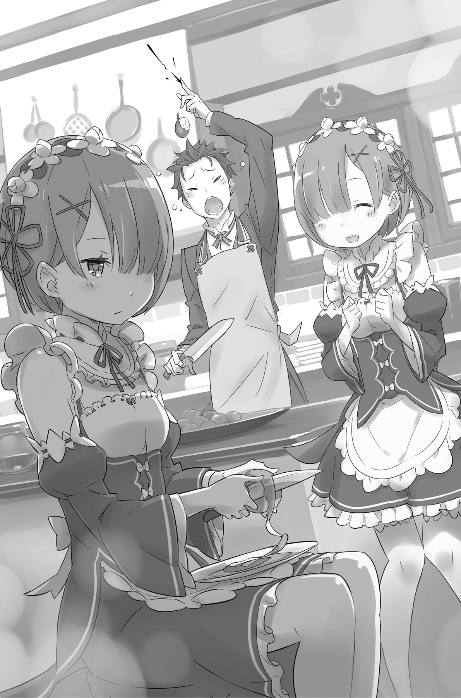
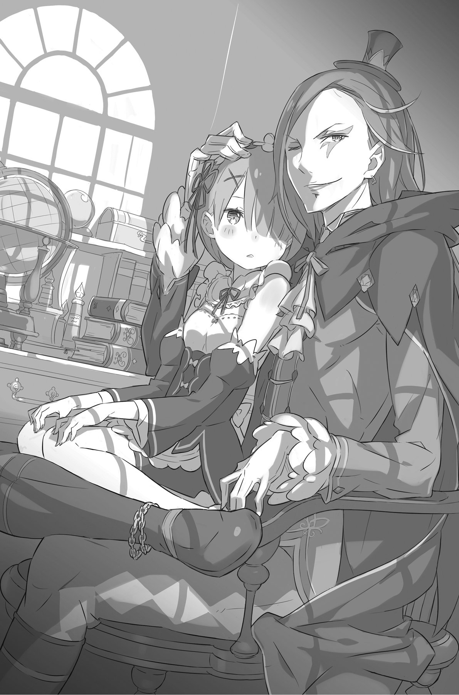

## 1

— Я наблюдала за тобой сверху… У тебя не все дома, мнится мне, — сказала Бетти вместо приветствия, когда близняшки привели Субару в обеденный зал, где должны были подавать завтрак.

Эмилия отлучилась в свою комнату, чтобы переодеться, поэтому в столовой они оказались одни. В ответ на колкость Субару состроил страшную гримасу.

— Отчего это наша лолька разворчалась в такое прекрасное утро?

— Что ещё за «лолька»? Никогда не слышала это слово, и мне оно явно не по душе.

— Я хочу сказать, ты слишком мелкая, чтобы быть в моём вкусе. Малолетками не интересуюсь.

— Хоть ты и грубиян, но Бетти всё же стоит пожалеть тебя, мнится мне.

Пропустив насмешку мимо ушей, Субару окинул взглядом просторное помещение.

В центре зала находился стол, покрытый белой скатертью. На столе были расставлены тарелки, а вдоль него стояли стулья. Место для Субару, если таковое имелось, располагалось, скорее всего, на самом дальнем конце.

— Я не слишком-то знаком с обеденным этикетом, — признался Субару, — поэтому позволю тебе прочитать Лекцию на эту тему.

— Ты слишком заносчив, мнится мне, — на щеках Бетти выступил гневный румянец. — Если чего-то не знаешь, смири гордыню и поклонись!

— Да я, скорее, сяду на самое почётное место, чтобы позлить тебя как следует! — с этими словами Субару уселся на самый высокий стул, который с равной вероятностью мог быть предназначен как для Эмилии, так и для хозяина поместья.

Глядя, как Субару и в самом деле пристраивает свой зад на стул во главе стола, Бетти возмущённо тряхнула головой.

— Что ж, как пожелаешь. Даже не скажешь Бетти спасибо, мнится мне?

— А за что я должен благодарить? Ты только что отказалась помочь мне, разве нет? Да и требовать — благодарность признак плохого воспитания! Хотел бы я посмотреть в глаза твоим родителям!

— А ты-то чем недоволен? Если кто и должен обижаться, так это Бетти, мнится мне! После всего, что я сделала!.. — разгоревшаяся словесная перепалка внезапно оборвалась.

Субару уже открыл было рот, но распахнулась дверь, и в столовой появились служанки. Девушки катили перед собой сервировочные столики.

— Прошу прощения, дорогой гость. С вашего позволения, я накрою стол.

— Извините, дорогой гость, я расставлю столовые приборы и налью чай.

Служанка с голубыми волосами проворно расставила тарелки с салатом и свежей выпечкой — вполне традиционное меню для завтрака. Та, что с розовыми волосами, быстро разлила чай по чашкам. Зал наполнился аппетитным ароматом, и в животе у Субару заурчало.

— Неплохо, неплохо! Завтрак настоящего аристократа. Выглядит вполне съедобно, хотя я думал, будет что-то невероятное, — сказал он с облегчением, когда понял, что поданные блюда не несут никакой угрозы для его здоровья.

Удовлетворившись меню, Субару откинулся на спинку стула. По залу прокатился пронзительный скрип, и на чопорном лице девчонки промелькнула тень раздражения. Субару не мог отказать себе в удовольствии подразнить кудрявую Бетти. Желая проверить, насколько хватит её терпения, он принялся ёрзать туда-сюда, но внезапно в зале раздался чей-то весёлый голос:

— 0-0-0! Я вижу, ты в полном здра-а-авии! Прекра-а-асно, прекра-а-асно!

На пороге стоял человек ростом на полголовы выше Субару. Длинные тёмно-синие волосы падали назад, закрывая почти всю спину. Кожа незнакомца отличалась болезненно-бледным оттенком, но вместе с тем он был изящен и строен, а правильные черты лица делали его довольно симпатичным. Впечатление усиливали глаза, один из которых был жёлтого, а другой голубого цвета. Впрочем, из-за весьма оригинальной расцветки наряда и странноватого макияжа мужчина больше походил на шута.

— Вы что, наняли клоуна, чтобы он развлекал вас перед едой? — воскликнул Субару. — Да уж, у богатых свои причуды…

— Догадываюсь, о чём ты, — сказала Бетти, — однако позволю себе не вмешиваться.

— Бетти, ты ко мне слишком жестока. Мы же друзья, разве нет?

— С каких это пор мы с тобой друзья, хотелось бы знать? И не смей обращаться ко мне, как к подружке!

Девочка повела плечом и демонстративно отвернулась. Субару нахмурился, а клоун между тем вошёл в зал и смерил взглядом сидящих за столом.

— Ка-а-ак?! И Беатрис тоже здесь? — воскликнул он удивлённо. — Вот уж не ожида-а-ал! Как же я ра-а-ад, что ты в кои-то веки решила разделить со мной тра-а-апезу!

— Очередной весельчак, мало мне было одного! Единственный, ради кого я здесь, — это Пакки! — отрезала Беатрис и вдруг перевела взгляд на двери. — Пакки! — воскликнула она, вскочила со стула и, шелестя своей длинной юбкой, помчалась навстречу стоявшей на пороге сереброволосой девушке. На её личике засияла широкая улыбка, а во всём облике не осталось и следа той заносчивости, какую она демонстрировала ещё мгновение назад.

— Привет, Бетти! — раздался беззаботный голос, и из серебристых волос Эмилии показалась дымчатая фигурка кота. — Мы не виделись четыре дня. Ты вела себя, как подобает маленькой леди?

Бетти закивала:

— Пакки, я так ждала твоего возвращения! Ты ведь побудешь со мной сегодня, мнится мне?

— Конечно! Этот день полностью в нашем распоряжении.

— Ой, как здорово!

Взлетев с плеча Эмилии, Пак опустился на протянутую ладонь Беатрис. Девочка крепко прижала к себе пушистое тельце и закружилась по залу, сияя от счастья. Столь внезапная идиллия поразила Субару до глубины души.

— Похоже, тебя эта сцена огорошила не на шутку, — послышался голос Эмилии. На её губах играла весёлая улыбка. — Как видишь, они очень близки друг другу.

— «Огорошила»? Кто ж так в наше время выражается? — привычно упрекнул её Субару за использование устаревших слов.

Внезапно Эмилия ткнула в него пальцем:

— Хм-м… Субару… Этот стул…

— Ах да!.. Не подумай ничего плохого, я вовсе не собирался оставаться там, где обычно сидишь ты! Это… Просто я решил, что на холодном сиденье располагаться неудобно, и подогрел его для тебя.

— Извини, но я не совсем понимаю, о чём ты, — произнесла Эмилия, несколько удивившись. — И кстати, это место Розвааля.

Поняв, что его хитрый план раскрыт, Субару вмиг соскочил с насиженного места.

— Ну что-о-о ты, что-о-о ты, не сто-о-оило так беспокоиться! — замахал руками клоун и, легонько похлопав Субару по плечу, с усмешкой добавил: — Действительно, госпожа Эмилия не сможет насладиться теплом, но я о-о-очень ценю твою заботу!

Субару бросил взгляд на руку, лежащую на его плече, затем перевёл глаза на вежливо улыбающуюся клоунскую физиономию и скривился:

— Не слишком ли развязно ведёт себя этот шут? Разве он не в курсе, что так вот дотрагиваться до людей — дурной тон?

— Нет, Субару, ты не понимаешь…

— Ничего, ничего, госпожа Эмилия! — вмешался клоун. — Всё в порядке! Учитывая, что ещё совсем недавно наш гость был на грани жизни и смерти, нам стоит быть к нему снисходи-и-ительнее.

То, как незнакомец растягивал гласные, действовало Субару на нервы, однако с его словами трудно было не согласиться. Под любопытными взглядами окружающих клоун выдвинул стул — тот самый стул, на котором только что восседал Субару, — и вальяжно опустился на сиденье.

— Эй, послушай-ка! — воскликнул юноша. — Я тут, конечно, не хозяин, но вряд ли ему понравится, если кто-то займёт его место!

— Субару, угомонись… — пробормотала Эмилия, озадаченно поглядывая на клоуна. — Может быть, вы тоже представитесь?

— Я чего-то не понимаю? — спросил Субару.

— Госпожа Эмилия хочет сказа-а-ать, что… — сидя во главе стола, чудаковатый богач в клоунском наряде широко развёл руки в стороны и безо всякой тени смущения провозгласил: — Перед тобой Розвааль L. Мейзерс, хозяин этого особняка! Похоже, ты уже вполне уверенно чувствуешь себя в стенах моего дома, и мне безу-у-умно радостно это видеть, Субару Нацуки.

## 2

После того как граф Розвааль расположился во главе стола, все расселись по своим местам и приступили к трапезе.

— М-м-м! Намного вкуснее, чем обычная еда! — заметил Субару, отведав местного салата и супа.

— Да, да! — довольно закивал граф. — Хоть по ней и не скажешь, но кулинарные способности Рем очень неплохи!

Субару посмотрел на служанку, которая, судя по всему, отвечала в этом доме за готовку. Поймав на себе взгляд гостя, Рем сделала ему «козу». Субару не знал, что она хотела этим сказать, и, решив, что девчонка хвастается, Показывая здешний аналог победного жеста в виде буквы V, в ответ хитро сцепил пальцы, изображая «жабу».

— Значит, еду приготовила та, что с голубыми волосами… могу я звать тебя Рем?

— Да, уважаемый гость. В этом доме готовкой занимаюсь я. Сестрица не очень сильна в этом деле.

— Ага! — сказал Субару. — Выходит, вы, близняшки, наделены разными талантами. Значит, твоя сестра хороша в уборке?

— Верно. В обязанности сестрицы входят уборка и стирка.

— Получается, она справляется с этим лучше, чем ты, Ремчи? — не унимался Субару.

— Нет, — спокойно отвечала Рем. — Я прекрасно справляюсь со всеми делами по дому, в том числе с уборкой и стиркой. Даже лучше, чем сестрица.

— Какой же тогда от твоей сестры толк?!

Чтобы старшая сестра практически во всём уступала младшей? Для Субару это было в новинку. Однако Рам выглядела так, будто её нисколько не задели слова младшей сестры — несмотря на то, что Рем наверняка не стала бы здесь обманывать. В таком случае почему же Рам ведёт себя так, словно ей совершенно безразлично, что о ней говорят?

— Или вы специализируетесь в разных областях? Скажем, Рамчи разбирается в военном деле, а ты отвечаешь за домашнее хозяйство?

— Неплоха-а-ая гипотеза! — вмешался Розвааль. — Должен сказать, что характер у сестриц не из лёгких, и на первый взгляд они производят не самое лучшее впечатление, не находишь?

— Что касается первого впечатления, то куда уж им тягаться с таким хозяином-оригиналом, как Розчи!

Столь бесцеремонное обращение граф Розвааль великодушно пропустил мимо ушей. У Субару была привычка выводить людей из себя, но, судя по всему, сейчас его подшучивания не попали в цель.

Тем временем тарелки, стоящие перед юношей, одна за другой опустели.

— Еда просто отменная, так что вопросов больше не имею, — сказал Субару и повернулся к Эмилии: — Согласна со мной, Эмилия-тан?

Девушка вытерла губы салфеткой и бросила на Субару укоряющий взгляд. Юноша непонимающе склонил голову набок. Эмилия вздохнула и сказала:

— Понимаешь, Субару… У нас не принято разговаривать за столом. Это невежливо по отношению к Рам и Рем, которые всё приготовили. Если ты не изучишь правила этикета, то на каком-нибудь важном приёме непременно попадёшь впросак.

— Сейчас уже никто не говорит «впросак»… Да и вообще, не слишком ли поздно мне браться за изучение манер?

Субару уже сидел бок о бок с Эмилией, хотя изначально его место за огромным столом находилось достаточно далеко.

— Мне просто захотелось быть поближе к тебе, Эмилия-тан. По-моему, Розчи не против. И если ты не ешь эти овощи, можешь отдать их мне.

— Пожалуй, этот перенц… Тьфу ты, совсем меня заболтал!

Эмилия так забавно надула губки, что Субару расплылся в улыбке.

— Кстати, Розчи, — сказал он, — насколько я понял из слов Эмилии-тан, в этом доме лишь два работника. Это так?

— Да-а-а, — протянул хозяин особняка. — В настоящее время именно так. Кроме Рам и Рем, здесь больше никого не осталось.

— Такой громадный дом — и всего две служанки? Так и от переутомления помереть недолго! Не похоже, чтобы у вас в планах было нанять ещё кого-нибудь. Или я ошибаюсь?

Розвааль ничего не ответил и, сложив руки на столе, молча глядел на Субару. На губах хозяина блуждала лёгкая улыбка, однако во взгляде его что-то определённо изменилось.

— Ты, юноша, и вправду очень стра-а-анный. Добраться до поместья графа Мейзерса в отдалённом уголке королевства Лугуника, не зна-а-ая при этом, что здесь творится! Удивительно, как тебе удалось пройти через пограничные кордоны.

— Ну, я тут вроде как нелегально… — брякнул Субару.

— Ты меня удивляешь, — вымолвила ошарашенно Эмилия. В её взгляде читался упрёк, словно она хотела отругать его, как мальчишку. — Вот так запросто говоришь подобные вещи! У нас за это могут так поколотить, что мокрого места не останется!

— Кто ж так в наше время выражается?

— Сейчас не время шутить! Субару, с тобой точно всё в порядке? Там, откуда ты пришёл, все такие? Или ты один такой невежда?

Эмилия была так взволнована, что Субару стало неловко за своё поведение.

— У меня просто с памятью плоховато, — объяснил он. — Поэтому буду премного благодарен, если соизволите ввести меня в курс дела.

— Когда ты так говоришь, то производишь впечатление вполне образованного человека, и всё же…

— Ну, знаешь, я не часто бываю в высшем свете. Или ты хочешь сказать, что и тебя смущают вежливые обороты речи? Вот уж не ожидал!

— Эм-м… — стушевалась Эмилия. — Совсем немного.

Девушка потупилась, но тут ей на помощь пришёл Розвааль, до этого молча наблюдавший за беседой:

— Кажется, я понима-а-аю, о чём ты, — сказал он. — Госпожа Эмилия как раз сейчас обучается всем этим премудростям. Вижу, голова у тебя хорошо работает, хотя за языком ты следить совсем не умеешь.

Явная похвала Розвааля заставила Субару гордо выпрямиться и стукнуть себя кулаком в грудь:

— Без головы в наше время не проживёшь! Чуть не додумал где-нибудь, глядь — а твои кишки уже на полу.

— Утверждаешь с таким знанием дела, словно твои кишки уже… Та-а-ак, на чём мы остановились? Ах да, на тех делах, что творятся сейчас в Лугунике. Что тебе об этом известно?

— Абсолютно ничегошеньки!

— Ты так легко в этом признаёшься, что остаётся лишь изумляться, как тебе до сих пор удавалось оставаться в живых.

«А вот это на похвалу не похоже», — подумал Субару и бросил на Эмилию тревожный взгляд. Не то чтобы он пытался найти у неё защиты, однако ощущения, которые он сейчас испытывал, были сродни тем, что переживает младенец, оторванный от матери.

— Вы хотите сказать, в этой стране происходит что-то неладное?

— Да, обстановка довольно неспокойная, — сказал Розвааль. — В Лугунике сейчас нет короля.

Хорошенько переварив услышанное, Субару напрягся, нервно сглотнул и устремил на эксцентричного мужчину настороженный взгляд.

— Не сто-о-оит так волноваться, — поспешил успокоить его Розвааль. — Вся страна уже в курсе этого печа-а-ального факта.

— Отлично, а то я уж подумал, что мне поведали страшную тайну, из-за которой не выпустят отсюда живым.

— Жаль, что ты узнаёшь об этом только сейчас. Так или иначе, но в стране теперь крайне неспокойно.

«Всё ясно, — мысленно подвёл итог Субару. — Положение королевства с пустым престолом очень шаткое. Если король внезапно склеил ласты, сам или с чьей-то помощью, это и впрямь может повергнуть страну в хаос».

— А разве такие вопросы не решаются вступлением на престол наследника?

— Обычно так и происхо-о-одит. Одна-а-ако дело в том, что полгода назад в стенах королевского замка вспыхнула страшная эпидемия…

Хозяин особняка поведал, что болезнь, как было объявлено, скосила только кровных родственников. Почивший вместе с наследниками монарх стал последним в пресёкшейся династии.

— Вот беда! Хотя они не виноваты в том, что заболели и умерли, — задумчиво произнёс Субару — И что вы собираетесь делать? Если нет наследников, тогда нужно ввести демократию, избрать на всеобщих выборах премьер-министра.

— Соверше-е-енно не понимаю, о чём ты говоришь. Сейчас страной управляет Совет мудрецов. Все они представители известнейших родов, которые оставили свой след в истории королевства, так что на этот счёт можно не беспокоиться. И всё-таки… — Розвааль выдержал паузу, его лицо вдруг стало строгим: — Королевству нельзя без короля!

— Полагаю, вы правы, — ответил юноша.

«Никакой организации не обойтись без руководителя, а уж государству — и подавно», — подумал он про себя и продолжил вслух:

— Значит, картина постепенно проясняется. Получается следующее: у вас нет короля, того и гляди начнутся беспорядки. Связи с другими государствами слабеют, страна закрывается от внешнего мира. И тут неизвестно откуда появляется иностранец, то есть я, и вам это кажется крайне подозрительным.

— Бо-о-олее того, войдя в контакт с госпожой Эмилией, ты оказался в поместье Мейзерса. Улики, конечно, косвенные, однако некоторым хватило бы и этого, чтобы…

Розвааль зажмурил глаза и провёл ребром ладони по горлу. От этого шутливого жеста Субару пробил холодный пот. Им завладело дурное предчувствие. То самое предчувствие, столь часто посещавшее его в последнее время.

— А почему хозяин особняка называет Эмилию-тан госпожой?

Всякому известно, в любом поместье принято выказывать наибольшее почтение человеку, находящемуся на самой высокой ступени социальной лестницы, и от этого несоответствия Субару всё больше становилось не по себе.

— Что же здесь необычного? — улыбнулся Розвааль. — Вежливое обращение к тому, кто выше меня по статусу, вполне естественно.

Субару так и застыл с открытым от неожиданности ртом. Затем он медленно повернул голову в сторону Эмилии — казалось, от напряжения заскрипели шейные позвонки. Эмилия искоса посмотрела на юношу и смиренно вздохнула.

— Только не думай, что я хотела обмануть тебя.

— То есть выходит, что ты, Эмилия-тан…

— В данный момент я — претендентка на звание сорок второго правителя королевства Лугуника, а граф Розвааль — мой покровитель.

Эти слова будто бы окатили Субару океаном холодной воды.

## 3

«Вот так дела… Первая же попавшаяся мне красавица оказалась королевой! Одно это уже доказывает, что я нахожусь в самом что ни на есть настоящем фэнтезийном мире!»

И хотя официально Эмилия была пока только претенденткой на трон…

«Да за такое и трёх жизней не жалко!» — мелькнула мысль, когда юноша вспомнил, через что ему пришлось пройти, чтобы встретиться с ней вновь.

— Прости, что не сказала тебе об этом раньше. Я не хотела скрывать, но…

— Да я и не обижаюсь вовсе! Эмилия-тан, твоя доброта не знает границ! Ты настоящий ангел!

— Что ты говоришь? — Эмилия, не привыкшая к таким откровенным признаниям, покраснела и замолкла на полуслове.

— Ну, я хочу сказать, что именно благодаря тебе всё случилось как случилось. В этом смысле тебя можно назвать Э-Н-А — «Эмилия — Настоящий Ангел»!

— Мне кажется, я никогда не привыкну к твоей манере общения, — вздохнула Эмилия. — Субару, оставь эти свои шуточки, давай лучше вернёмся к делу.

На её щеках всё ещё цвёл румянец, когда она слегка мотнула головой, чтобы вернуть серьёзный настрой. Субару почувствовал, что дистанция между ними снова увеличилась.

— Извини-и-ите, что вмешиваюсь, но не лучше ли нам и пра-а-авда вернуться к теме нашего разговора? Ты готов, Субару?

— Раз моя голова по-прежнему у меня на плечах, буду надеяться, что этот разговор меня порадует.

Розвааль присвистнул. Эмилия выглядела столь же удивлённой. Судя по всему, они оба приняли слова Субару как знак того, что он прекрасно понимает их намерения. Конечно, они сильно преувеличивали его проницательность, но сам Субару этого не замечал.

— Ну вы же не зря заговорили обо всём этом: что Эмилия-тан — претендентка на престол, и всё это очень важно?

Розвааль и Эмилия недоумённо переглянулись.

— Субару, я никак не пойму… То ли ты очень умный, то ли наоборот…

— А других вариантов у тебя нет?! — обиделся Субару, но Эмилия подарила ему столь милую улыбку, что обида тут же была забыта.

— Твои предположения верны, — сказал Розвааль. — Всё это имеет прямое отношение к тому, как мы поступим с тобой. Госпожа Эмилия, прошу вас, — обратился он к девушке.

— Сейчас, — кивнула Эмилия, затем извлекла из-за пазухи какой-то предмет, положила его на стол и мягко придвинула к Субару. Брови гостя поползли вверх.

— Это же твой значок…

На белой скатерти поблёскивал драгоценным камнем значок с изображением дракона — тот самый жизненно важный предмет, украденный пронырливой Фельт и вернувшийся к владелице благодаря Субару. Лучезарное сияние, исходившее от камня, вновь наполнило юношу благоговейным трепетом.

— Дракон является символом Лугуники, — объяснил Розвааль. — Наверняка ты слышал, что нашу страну ещё называют Драконьим королевством Лугуника. Символ дракона часто изображают на стенах крепостей и на оружии, но этот значок имеет чрезвычайно высокую ценность.

Последовала многозначительная пауза. Субару посмотрел на Розвааля, ожидая продолжения. Хозяин поместья бросил взгляд на Эмилию, словно приглашая её продолжить прерванный рассказ. Девушка опустила ресницы, губы её задрожали.

— Этот значок — инсигния — один из атрибутов претендента, — произнесла она сдавленным голосом. — Он помогает определить, подходит ли претендент на роль правителя Лугуники.

Слова Эмилии ввели Субару в ступор. Однако покоящийся на столе значок с драконом, раскинувшим крылья, подтверждал правдивость её слов.

— То есть… ты потеряла инсигнию, которая даёт право участвовать в королевских выборах?!

— Что значит «потеряла»? У меня её украла та девчонка!

— Да какая разница?! — вскричал Субару и, ударив кулаком по столу, вскочил на ноги. Столовые приборы подпрыгнули и чуть не попадали на пол, но Рем вовремя подхватила посуду. Субару не обратил на это никакого внимания:

— И что было бы, не сумей ты её вернуть? Такие вещи ни в коем случае нельзя терять! Тебе что, выдали бы новую?

— Ну-у-у, — протянул Розвааль, поправляя несуразно крупный лацкан своего камзола, — если претендент потеряет инсигнию, его никто и слушать не станет. На плечах короля лежит ответственность за целое государство. Если человек не смог уследить за ма-а-аленьким значком, никто не доверит ему управлять страной.

— Звучит логично, — сказал Субару. — Если бы такое всплыло на поверхность, разразился бы жуткий скандал! А это значит, что…

С одной стороны — тот переполох, что случился на улицах столицы из-за украденной инсигнии. С другой -- невероятно тёплый приём, который ему здесь оказали. Из этого следовал только один вывод.

— Если бы публике стало известно, что инсигния украдена, тебе бы туго пришлось, — сказал он Эмилии. — Теперь понятно, почему ты не хотела вовлекать в поиски посторонних.

— Да… именно поэтому, — согласилась девушка.

— Исполнителем преступления была Фельт, но заказчиком выступила Эльза, которая в свою очередь сообщила, что она тоже всего лишь посредник… Отсюда следует, что кому-то очень невыгодно, чтобы Эмилия-тан взошла на престол.

— Возможно, — сказал Розвааль. — Лишить претендента инсигнии — самый простой способ исключить его из числа борющихся за трон.

Постепенно пазл в голове Субару начал складываться в осмысленную картину. Он вспомнил, как Эмилия отказала, когда он предложил ей помощь, вспомнил Фельт, Эльзу, которая говорила о некоем заказчике. Вспомнил обстоятельства своей смерти. Получается, причиной всему была огромная ценность, которую таила в себе эта инсигния.

— Если подумать, я проделал чертовски важную работу! Поэтому имею полное право рассчитывать на высокую награду!

Осознав весь масштаб собственных заслуг, Субару почувствовал себя настоящим героем. Недвусмысленно поигрывая пальцами в воздухе, он бросил на Эмилию лукавый взгляд.

— Да, верно, — неожиданно согласилась Эмилия. — Я обязана тебе жизнью. Для меня ты настоящий спаситель, Субару, поэтому проси всё что угодно.

— Ты серьёзно?

— Абсолютно серьёзно. Я сделаю всё, что в моих силах, — сказала девушка, положив руку на грудь. По всему было видно, что она не шутит.

«Вот чёрт! Я так и не научился понимать настроение окружающих…» — подумал Субару с досадой. Маска шута в данной обстановке была совсем не к месту. Он вдруг вытянул руку, и его пальцы мягко скользнули по волосам Эмилии.

— Что ты делаешь?

— Не знаю, рука как-то сама потянулась, — ответил Субару и запустил пальцы в волосы девушки, наслаждаясь их шёлковой мягкостью. — Пожалуй, мне в качестве награды большего и не надо.

— Ты и Пака гладил… Субару, тебя что, возбуждают прикосновения к шерсти?

— Нашла с чем сравнивать! Твои волосы — совсем другое дело!

Обворожительные волосы Эмилии оставляли совсем иное впечатление, нежели шёрстка Пака. Однако реакция девушки на похвалу оказалась неожиданной: она вдруг стала грустной и потупилась. Субару в недоумении склонил голову на бок, но тут спиной почувствовал чей-то взгляд.

— Кхм, мы вам не меша-а-ем? Мы могли бы оставить вас наедине, если будет угодно.

— Не торопитесь. У меня ещё остались к вам кое-какие вопросы, — продолжая наслаждаться прикосновениями к шёлковым волосам, Субару указал свободной рукой на Розвааля. — То, что Эмилия-тан претендует на трон, мне понятно. Любопытно другое: какую цель преследуете вы, помогая ей в этом.

— А ты наблюда-а-ательный! Люди, родившиеся и выросшие в городе, как правило, могут похвастаться сообразительностью.

— Для меня большая честь услышать похвалу из ваших уст. Просто я воспитан на аниме и ранобэ, поэтому знаю ваши фэнтезийные миры как свои пять пальцев.

— Что ж, никакого секре-е-ета здесь нет. Формально я ношу титул графа, но мою должность лучше определить как… наверное, придворный маг.

— Придворный маг? То есть вы работаете волшебником в королевском замке?

— Верно, — немного раздражённо ответила Эмилия. — Только господин Розвааль не просто волшебник при дворе. Он главный маг в королевстве!

Алые губы Розвааля растянулись в улыбке, как будто слова девушки доставили ему удовольствие.

— Итак, если вернуться к теме нашей беседы, можно сказать, что я оказываю поддержку кандидатуре госпожи Эмилии в борьбе за трон. Как уже было сказано ранее, я её покровитель.

— Покровитель, значит, — повторил Субару. Он внимательно оглядел сидящего во главе стола шута, а затем перевёл взгляд на Эмилию. — Это, конечно, не моё дело… но неужели не было других вариантов, Эмилия-тан?

— Других не нашлось. Мне больше не на кого положиться. И вообще, какой ещё чудак, кроме Розвааля, станет мне помогать?..

— Понятно, — сказал Субару. — Покровителя выбрали методом исключений, да?

— Не слишком ли вы двое самоуверенны, что говорите тако-о-ое в моём присутствии?! — весело подал голос Розвааль.

Несмотря на нелицеприятные высказывания в свой адрес, он нисколько не рассердился, что, вероятно, являлось следствием широты его души. А может быть, графу просто нравилось слушать критические отзывы о собственной персоне.

— Так, — снова заговорил Субару. — По-моему, мы отвлеклись. Значит, Розчи покровительствует Эмилии-тан. Должен сказать, что Эмилия-тан — девушка достаточно наивная и беспечная. Иначе как объяснить тот факт, что вчера она разгуливала по городу в одиночку?

— Насколько помню, такое с ней впервые, — произнёс Розвааль. — Правда, вчера её должна была сопровождать Рам…

Заговорив о Рам, Розвааль изобразил несколько натянутую улыбку Субару посмотрел в сторону служанок. Рам, причёска которой внезапно изменилась и стала точь-в-точь как у сестры, стояла с совершенно невинным видом. Правда, цвета волос было вполне достаточно, чтобы понять, кто есть кто.

— Эй, не изображай, будто ты не при делах, я этого терпеть не могу! — возмутился Субару.

Однако Эмилия встала на защиту служанки.

— Рам здесь ни при чём. Сама не знаю, как так вышло, но… я отстала и заблудилась.

— Брось, это её ничуть не оправдывает! Конечно, твоё поведение нельзя назвать разумным, но это ни в коей мере не отменяет того факта, что Рам ослушалась хозяина. Как прикажете это понимать?

— В твоих словах есть доля истины, — произнёс граф. — Отчасти я тоже ответственен за то, что Рам проявила невнима-а-ательность, но всё же я не пойму, что-о-о ты всем этим хочешь сказать?

— Да всё просто, — ответил Субару. — Упускать из виду такую важную персону, как Эмилия-тан, с вашей стороны было большой ошибкой. И как раз в этот момент появляюсь я! Что бы вы без меня делали?

Розвааль понимающе кивнул:

— Я вижу, к чему ты клонишь. Конечно, если говорить о деньгах, то я бо-о-ольше подхожу на роль человека, у которого следует требовать награ-а-аду.

— Именно. И вы не имеете права мне отказать! В конце концов, я спас жизнь Эмилии-тан — претендентки на роль королевы! Я самый настоящий спаситель! — Субару вскочил со стула, устремив палец к потолку.

— Должен призна-а-ать, что это истинная правда. В таком случае, не соизволишь ли уточнить, чего именно ты хочешь? — Розвааль тоже поднялся со своего места и глядел на юношу сверху вниз.

Эмилия с трепетом наблюдала за этой сценой.

— Что ты хочешь, чтобы я сделал для тебя? — повторил Розвааль. — Моё положение таково, что я действительно не могу тебе отказать. Я готов дать тебе всё что угодно, хотя бы только для того, чтобы ты не предал огласке факт утери инсигнии. Ита-а-ак, твоё желание?

— Хе-хе, вы поистине благородный человек, Розчи, — сказал Субару. — Я вправе пожелать всё, что захочу! А вы должны это исполнить! Мужчина обязан держать своё слово!

— Прекра-а-асные слова. Настоящие мужчины не ищут оправданий. Они выполняют свои обещания.

Субару понимал, что окружающие вряд ли оценят столь фамильярное поведение, однако именно этих слов Розвааля он и ждал. Внутренне он уже удовлетворённо потирал руки.

— У меня только одно желание. Наймите меня на работу в свой особняк!

Просьба Субару повергла всех в шок. После столь долгой прелюдии присутствующие ждали чего-то куда более серьёзного. Даже малоподвижные лица служанок отразили замешательство, а Беатрис скривилась так, словно проглотила дольку лимона.

— К-конечно, не мне судить, но это как-то…

Эмилия так широко раскрыла глаза, что растеряла добрую половину той возвышенной неприступности, которой наделила её природа.

— Ты, конечно, очень мила, когда удивляешься, но неужели тебе настолько не по душе моя просьба?

— Дело в другом: ты просишь так мало! — Эмилия с досадой всплеснула руками. — Что твоя просьба потискать Пака, что теперь вот это… Хотя нет, это больше похоже на твоё желание тогда, в столице, когда ты захотел, чтобы я назвала своё имя.

Припомнив все моменты, когда Субару требовал награду, Эмилия в недоумении покачала головой. Она знала, через что ему пришлось пройти, чтобы получить вознаграждение, и это не укладывалось у неё в голове.

— Ты не понимаешь, насколько я благодарна тебе. Мне никогда не расплатиться за всё, что ты сделал для меня, но ты так мало требуешь… — на последнем слове её голос сорвался, и девушка, опустив голову, прижала свою ладонь к груди юноши.

Слушая её всхлипы, Субару понял, что поступил опрометчиво. Эмилия сознавала, насколько ему обязана, и теперь просто не знала, как отблагодарить его. Однако он и сам был в огромном долгу перед ней, хотя у Эмилии об этом не осталось никаких воспоминаний.

Девушка подняла на Субару влажные от слёз фиалковые глаза. В её серьёзном взгляде читалась мольба, и Субару понял, что сейчас определённо не самое лучшее время для шуток. Он решил, что будет с ней искренним и поделится всем, что накопилось у него на душе:

— Эмилия-тан, ты просто не понимаешь. Ведь тогда я и вправду хотел именно этого, честно-пречестно!

— Что?

— В тот раз я действительно хотел узнать твоё имя. Когда оказываешься в новом месте, не знаешь, что ждёт тебя завтра, ты совершенно сбит с толку… Возможно, стоило бы успокоиться и хорошенько подумать — наверняка нашлось бы много всяких вещей, которые стоит пожелать… Но я из тех людей, что не умеют врать себе.

Это была награда, ради которой Субару погибал целых три раза. Только ради того, чтобы вновь увидеть улыбку сереброволосой красавицы и узнать её имя. В то мгновение о большем он не смел даже мечтать.

— То же самое касается и просьбы к Розчи. Да, сейчас я самый что ни на есть нищеброд. Я мог бы попросить кучу денег и хорошенько покутить, но зачем, если можно получить постоянный источник дохода?

— В таком случае, почему ты просто не попросил, чтобы тебе разрешили жить здесь как гостю, а не в качестве слуги? — спросила Эмилия.

— А что, можно было?! Господин Розвааль, знаете, я тут подумал… — Субару с надеждой посмотрел на хозяина особняка.

— Первое слово дороже второго, — ответил Розвааль, скрестив руки над головой в виде буквы Х. — Мужчина не отказывается от своих слов, так?

— Конечно! — подхватил Субару. — Вы правы как никогда! Мужчина выполняет обещания! — он мысленно выругал себя за поспешность, но, увы, было уже поздно.

— А я уже на секунду подумал, что ты серьёзно… — произнёс Розвааль. — Хорошо, что мне просто показалось.

— И кто меня за язык тянул? — Субару окончательно распрощался с мыслью зажить беззаботно. Впрочем, ему не хотелось упасть в глазах этой прекрасной девушки, и протестовать он не стал. — Ну хорошо. Раз такое дело… Рамчи и Ремчи наверняка тяжело справляться с делами в таком огромном доме. Поэтому прошу назначить меня к ним в помощники.

— По правде сказа-а-ать, девушкам действи-и-ительно нелегко. Но я согласен с госпожой Эмилией в том, что ты просишь слишком мало, — сказав это, Розвааль впервые за время разговора изобразил кривую усмешку. В ответ Субару покачал указательным пальцем:

— На самом деле, я тот ещё жадина! Но жить под одной крышей с такой суперкрасоткой, причём на вполне законных основаниях — что ещё нужно? Чем меньше между нами расстояние, тем больше у меня шансов, понимаете?

— Поня-а-атно, — протянул Розвааль. — Это действительно так. Довольно редко выпадает шанс работать под боком у девушки, которая тебе нравится. Это ты здо-о-орово придумал!

— К тому же… — Субару перестал качать пальцем и, поднеся его к голове, поскрёб макушку: — Вместо того чтобы отпустить такого непонятного субъекта, как я, на все четыре стороны, вам лучше держать меня при себе. Может, я ещё пригожусь Эмилии-тан, а вдруг?

Субару знал слишком много, поэтому догадывался: если покинет особняк, не приняв никаких мер предосторожности, это может плохо кончиться. Если Розвааль ни о чём таком не задумывался, то слова юноши наверняка были бы восприняты как оскорбление. Однако тот не подтвердил, но и не опроверг смутные подозрения Субару.

— Что ж, будь по-твоему, — недолго думая, вымолвил Розвааль, зажмурив правый глаз и глядя на гостя одним жёлтым. — О-о-очень надеюсь, что мы пола-а-адим.

Что именно скрывалось за этим таинственным желтоватым блеском, для Субару осталось загадкой. Он вспомнил свои откровенные слова об Эмилии, отчаянно смутился и боязливо взглянул на девушку.

— Субару, ты и вправду безнадёжен, — сказала она невозмутимо. — Что-то случилось?

Юноша совсем растерялся, не зная, что сказать. «Может быть, я всё преувеличиваю? — подумал он. — Может, у меня просто не хватает опыта общения с такими красавицами?»

— Просто как подумаю, что теперь буду жить в шаге от девушки, которая нравится, меня прямо трясёт от волнения.

Эмилия вздохнула, словно мысленно сетуя на то, что Субару тревожат подобные пустяки, наклонилась к нему и прошептала:

— И всё-таки… какая из них в твоём вкусе? Рам или Рем?

## 4

Когда затянувшийся завтрак подошёл к концу, судьба Субару оказалась практически определена.

— Обсуждение, по всей видимости, закончено? — подала голос Беатрис. — Бетти и Пакки могут быть свободны, мнится мне?

Прикончив свою порцию быстрее всех и даже не удосужившись аккуратно сложить столовые приборы, Беатрис поднялась из-за стола, но Субару остановил её:

— Постой-ка! К чему такая спешка? Может, расскажешь о себе? Кто такая, чем здесь занимаешься… Ты младшая сестра Розчи?

— Назвать меня родственницей вот этого чудака? Я смотрю, у тебя здорово получается меня злить.

Беатрис даже не пыталась скрыть свою неприязнь, однако Розвааль лишь довольно улыбнулся. Субару пожал плечами. Назревала новая словесная перепалка, но тут в разговор вступил дымчатый любимец Беатрис:

— Бетти служит хранителем архива с запрещёнными книгами.

— Пакки!

— Вкуснотища… вкусняу… вкусмяу, — промурлыкал Пак, лакомясь кусочком жареного хлеба, посыпанного сахаром.

— Не хочется отвлекать тебя от такого удовольствия, но нельзя ли поподробнее? — обратился Субару к духу и, воспользовавшись моментом, потрогал его за ушки. Наконец Пак оторвал мордочку от тарелки:

— Понимаешь, Розвааль — очень сильный маг. К тому же он происходит из весьма древнего рода. В этом особняке множество книг, которые не должны попасть на глаза посторонним. Поэтому он заключил контракт с Бетти, чтобы она охраняла фолианты. Так?

— Да, всё верно, — подтвердила Бетти. — Пакки никогда не ошибается, мнится мне.

Сказав это, она нежно, почти трепетно погладила Пака по голове. Как только девочка погрузила пальцы в мягкую шёрстку, на её милом личике снова засияла улыбка. Глядя на неё, Субару невольно затаил дыхание.

— Кажется, любовь к котикам вас о-очень сильно сблизила, — сказала Эмилия, искоса наблюдавшая за этой сценой.

— Чтобы я сблизился с этой злюкой? Ну, знаешь ли…

— Чтобы я сблизилась с этим нахалом? Ну уж нет, увольте! — Бетти была сама серьёзность.

— Хи-хи-хи, посмотрите, как я пленил эту вздорную парочку! Мяу-мяу!

Не успел Пак насладиться своей популярностью, как оказался в руках Эмилии. Ухватив своего напарника так, что Пак с трудом мог пошевелиться, она устало вздохнула.

— Значит, ты охраняешь запрещённые книжки? — обратился Субару к Беатрис.

— Пакки всё уже объяснил, — сказала Бетти, рассеянно теребя буклю-пружинку на своей голове. — Я работаю в той комнате, в которую ты столь бесцеремонно тогда ворвался.

— А-а, так это и есть твой архив!

Вспомнив горы книг, которые, казалось, готовы были проломить пол, Субару понял, что имел в виду Пак под словом «архив». Правда, мысль о том, что все эти книги были под запретом, заставляла предположить, что тут творится нечто противозаконное.

— Лолька, неужели ты, сама того не зная, стала чьей-то сообщницей в грязных делишках?

— Перестань меня называть этим словом, оно бесит! И одна мысль о том, чтобы оказаться невинной жертвой, может вывести меня из себя, мнится мне!

— Ладно, ладно, не кипятись так, а то большой не вырастешь. Лучше бери пример с Эмилии-тан! — Субару бросил томный взгляд на Эмилию, но та, не обращая на него внимания, обратилась к Беатрис:

— Минутку, Беатрис! Не может быть! Ты пустила Субару в запретную библиотеку?

— Конечно же нет, мнится мне! — от возмущения на висках девочки даже вздулись вены. — С чего бы это я стала пускать в библиотеку такого подозрительного субъекта? Он сам нашёл туда путь, разгадав загадку Блуждающей двери! — Беатрис вскочила с места и, подойдя к выходу из обеденного зала, толкнула дверь.

— Не понял! А где же коридор?!

Субару был ошеломлён: прямо за дверью, которая должна была вести в коридор, показалась до боли знакомая комната, уставленная книжными стеллажами.

— Это дверь в запретную библиотеку, — пояснила Бетти. — Забудь сюда дорогу! Пакки, иди ко мне.

Беатрис перешагнула через порог и, бросив на Субару высокомерный взгляд, вытянула руку. Пак приземлился на раскрытую ладонь девочки, и Бетти вместе с духом скрылась за дверью.

Следом к двери подошла Рам и, не говоря ни слова, распахнула её.

— Ничего себе! — вырвалось у Субару, когда он увидел, что на сей раз за дверью находится знакомый коридор.

Библиотека, открывшаяся его взору всего пару мгновений назад, теперь казалась причудливым миражом.

— Всё ясно, — сказал он. — Получается, с помощью магии двери особняка можно связать с любой комнатой. Очень удобно, когда какому-нибудь хикикомори срочно нужно в туалет.

— Похоже, ты не слишком удивлён, — заметила Эмилия. — А кто такие эти хикикомори?

— Это такие духи, хранители домашнего очага. Бедняги жертвуют собой, сидя всё время дома и оберегая его для членов семьи, возвращающихся с работы.

— Какие они замечательные! А ты тоже из их числа? — кажется, Эмилии стало любопытно.

— Кхм! — Субару сделал вид, что не расслышал, и повернулся к служанкам. — Ну что ж, продолжим наше знакомство? Рам? Рем?

Услыхав свои имена, близняшки сделали небольшой шаг вперёд и, приподняв подолы юбок, поклонились.

— Позвольте снова представиться, — произнесла голубоволосая. — Меня зовут Рем, и я работаю в этом доме в качестве старшей прислуги.

— Позвольте напомнить, — вторила ей та, что с розовыми волосами, — я — Рам, обычная прислуга в поместье господина Розвааля.

— Вы вдруг стали такими милыми и вежливыми, сестрички, — заметил Субару, скрестив на груди руки. — Конечно, не мне вам говорить, но…

Сёстры взялись за руки:

— Но, дорогой гость… вернее, Субару, теперь вы будете нашим коллегой?

— Но, дорогой гость… вернее, Барусу, теперь ты будешь у нас на подхвате?

— Эй, сестричка, зачем ты коверкаешь моё имя? — обиженно сказал он Рам. Впрочем, служанки наверняка не знали, что в Японии это считается верхом невежливости при знакомстве. Поэтому Субару решил стерпеть и повернулся к Розваалю: — Значит, вот на какую должность вы меня назначили? В подмастерье к служанкам? А почему не дворецким?

— На данный момент это самый лу-у-учший вариант, — ответил Розвааль. — Ты недоволен?

— Даже если и был бы недоволен, я же сам попросился к вам в работники. Ничего не поделаешь, так что прошу любить и жаловать, наставницы. Трудиться буду не щадя живота своего! Как там говорится?.. Что-то про кости…

— Костьми лягу, — подсказали близняшки.

— Вот. Точно! — Субару поднял руку, и девушки звонко шлёпнули по ней ладонями.

— Дружба — это прекра-а-асно! — довольно пропел Розвааль. — Надеюсь, вы пола-а-адите друг с другом.

— Не знаю почему, но, по-моему, мы с девчонками на одной волне. Уж они мне точно ближе по духу, чем та злобная лолька! Намного ближе!

— Я смотрю, тебе действительно очень не хочется, чтобы тебя считали другом Беатрис… — пробормотала Эмилия с сожалением.

На этом утреннее собрание обитателей особняка завершилось.

## 5

— Ну что, Барусу, пойдём? — сказала Рам, назначенная Розваалем персональным наставником Субару.

Не утруждая себя помощью младшей сестре, которая суетилась у стола, собирая посуду, Рам уже стояла у двери.

— Ты теперь всегда будешь меня так называть?

— Всегда, Барусу. Господин Розвааль велел, чтобы я первым делом показала тебе дом. Следуй за мной и не отставай. Надеюсь, тебе это по силам?

— Ну, я же не Эмилия-тан, чтобы любопытство завело меня, куда не следует!

— Субару! — прикрикнула на него Эмилия, недовольно надув щёки.

Девушку ожидала учёба — ей требовалось ознакомиться с различными церемониальными процедурами, которые должен знать каждый претендент на престол. Пожирая её глазами, Субару с грустью вздохнул:

— Жалко расставаться с такой красотой, ну да ладно. Пойдём, наставница?

— Пойдём, Барусу. До встречи, госпожа Эмилия.

Сделав книксен, Рам вышла. Подмастерье последовал за ней.

— Субару, — вдруг окликнула его Эмилия. — Удачи тебе. И мне тоже…

— Как же я рад это слышать! Теперь мне просто не терпится ринуться в бой! — заявил юноша и, подражая Рам, приподнял полы куртки своего спортивного костюма, поклонился и вышел в коридор. Ожидавшая там наставница бросила на него неодобрительный взгляд.

— Сестричка, сделай-ка лицо попроще. Я же просто пошутил. Не настолько уж я далёк от культуры горничных, чтобы равнять их с простыми слугами. Кстати, что насчёт форменной одежды?

Субару не очень улыбалось начинать карьеру слуги в спортивном костюме. Рам задумчиво приложила палец к губам:

— Да, одежда — это очень важно. Только есть ли у нас твой размер?.. Определённо, должен быть!

— Отлично! Тогда давай-ка сперва меня переоденем. Чувствую, ливрея будет мне очень даже к лицу! Преврати меня в изысканного, высококлассного лакея! — выставив большой палец, Субару сверкнул белоснежной улыбкой.

— Комната для прислуги на втором этаже, — сказала Рам, показывая на лестницу. — Переодеваться будешь там. Возможно, тебе подойдёт форма Фредерики. Она покинула особняк в позапрошлом месяце.

— О, эта Фредерика уволилась очень вовремя… Постой, ты собираешься нарядить меня в женскую одежду?!

— У вас почти одинаковое телосложение.

— Но я же мужчина!

Рам остановилась и бросила на Субару холодный взгляд. Затем устало потёрла лоб и сказала:

— Высококлассная форменная одежда превосходного качества. Чем ты недоволен?

— Да всем! Был бы это наряд Эмилии-тан, я бы даже приплатил, чтобы посмотреть на него, но наряжаться в костюм горничной?! Я что, по-твоему, извращенец? Нет уж, обойдусь!

Мало того что его не снабдили никакими полезными способностями, так ещё и вынуждают переодеваться в женские наряды! Субару скорее предпочёл бы умереть, чем пойти на такое. Правда, и это не помогло бы теперь, когда после смерти он возвращался на исходную позицию.

Особняк Розвааля состоял из центральной части и двух крыльев — западного и восточного, соединённых коридором. В центральной части располагался обеденный зал и кабинет Розвааля. Рам вела юношу в западное крыло особняка, туда, где находились комнаты для прислуги.

— Думаю, подойдёт любая комната без таблички на двери. Да, выбирай любую, и я принесу туда твою сменную одежду.

— Понятно. Любую так любую…

Субару принялся заглядывать во все комнаты подряд, но они ничем не отличались друг от друга, поэтому он предпочёл ту, что находилась ближе к лестнице.

— Вот эта подойдёт, пожалуй, — Субару распахнул дверь и…

— Пакки, я тебя обожаю! Какая у тебя гладкая шёрстка!..

…обнаружил за ней библиотеку, посреди которой сидела Бетти, тиская своего любимчика. Заметив присутствие постороннего, она медленно перевела взгляд на Субару. Юноша обернулся и посмотрел на Рам, которая осталась стоять в коридоре. Служанка лишь покачала головой.

— Успокойся, я никому не скажу, — заверил Субару. — Такая шёрстка действительно кого хочешь сведёт с ума.

— Ты сейчас же прекратишь нести чепуху и немедленно закроешь дверь, мнится мне!

В тот же миг из груди юноши вырвался невнятный звук. Невидимая магическая сила отбросила его к противоположной стене. От удара затылком из глаз Субару посыпались искры. Вслед за тем дверь библиотеки с грохотом захлопнулась.

Субару потряс головой, подскочил к той же двери и снова потянул за ручку, намереваясь потребовать сатисфакции, однако внутри оказалась совершенно пустая комната. Его снова надули — сработала магия Блуждающей двери.

— Никогда не знаешь, за какой дверью окажется госпожа Беатрис. Если госпожа Беатрис захочет исчезнуть, её не найти, пока не заглянешь за каждую из дверей особняка, — сказала Рам, намекая, что лучше сразу смириться с поражением. Встав позади Субару, она утешительно похлопала его по плечу, но юноша не собирался сдаваться:

— Как же она меня достала! И чего плохого я ей сделал?!

Стряхнув с плеча руку Рам, он опрометью бросился в другой конец коридора и, прокричав: «Вот она, здесь!» — распахнул дверь самой дальней комнаты.

— Да как ты? — раздался возмущённый вопль Бетти. Лицо девчонки исказилось гримасой.

— Молодец, Субару! — похвалил юношу кот.

Сам же Субару, не дожидаясь, пока его снова отшвырнут к стенке, ввалился в комнату. Бетти явно посчитала такое поведение в библиотеке непозволительным.

— Ты сейчас всю пыль столбом поднимешь! — закричала она, возмущённо вскинув брови.

— Уборку надо чаще делать! И вообще, никто не ходит в библиотеку с кошками! Они же все книги исцарапают!

— Не волнуйся, — вмешался кот, — Лия следит за тем, чтобы мои когти были не слишком длинными.

Но робкое замечание Пака никто не услышал. Субару и Бетти продолжали словесную перепалку на таких повышенных тонах, что, казалось, их было слышно во всём доме.

В дверном проёме появилась Рам.

— Друзьями вас, конечно, не назовёшь, — тихо произнесла она, наблюдая за перебранкой, — но то, что вы одного поля ягоды, — это точно.

— Ещё чего!!! — прозвучали в унисон возмущённые голоса, сотрясая стены особняка графа Розвааля.

## 6

Так, со скандала начались трудовые будни Субару.

После перепалки с Беатрис юноша отправился в гардеробную, где Рам вручила ему униформу слуги. Белая рубашка, чёрный фрак и брюки полностью отвечали образу дворецкого, который представлял себе Субару. Проблема была в другом.

— Эй, Рамчи! По-моему, с моим костюмом что-то не так…

— Не могу сказать, что я в восторге от того, как ты меня называешь… Что там такое?

В гардеробной показалась Рам и, увидев Субару, застыла на несколько секунд в немом удивлении.

— Всё ясно. Кажется, у кого-то слишком короткие ноги.

— Ты на что намекаешь? Рубашка вроде впору, а вот фрак жмёт в плечах. Просто со своим довольно-таки атлетическим телосложением в таком наряде я выгляжу, как какой-нибудь мачо.

Субару был прав. В груди фрак оказался слишком узок — юноша с трудом мог шевелить плечами, а штанины оказались настолько длинными, что собрались гармошкой. Впрочем, этого следовало ожидать, так как вещи были с чужого плеча.

— Штанины, конечно, я могу и сам подшить, а вот с фраком будут проблемы…

— Я и не сомневалась в твоих талантах, Барусу. Однако ты не можешь работать в таком убогом виде, иначе пострадает престиж всего особняка, а вслед за тем и репутация господина Розвааля.

— И этот человек в клоунском наряде ещё волнуется о своей репутации?

Хотя Рам и не подала виду, было заметно, что слова ученика не пришлись ей по душе. Субару жестом показал, что закрыл рот на замок. В ответ на это Рам вздохнула:

— Поскольку перевоспитывать тебя уже поздно, следует, по крайней мере, привести в порядок внешний вид. Брюки оставим на потом, в первую очередь займёмся фраком.

— Легко сказать! У меня в этом никакого опыта.

«А может быть, у меня и получится?..» — подумал Субару, решив, что стоит прокачать свой навык кройки и шитья, но его размышления были прерваны Рам.

— Не переживай, — сказала она и тут же добавила: — Рем, подойди-ка сюда.

— «Подойди-ка сюда»?.. — в недоумении повторил Субару. — И что, она вот так прямо сейчас и появится?

— Ты меня звала, сестрица?

— У-а-а!!!

Рем появилась так внезапно, что у Субару чуть сердце не выпрыгнуло из груди. Всё это было похоже на заранее подготовленный розыгрыш, однако близняшки, удивлённые столь бурной реакцией, одновременно склонили головы набок.

— Что с тобой? — поинтересовалась Рем.

— Чего ты так испугался? — спросила Рам.

— Ни-ни-ничего я не испугался! Просто это было так неожиданно! Так вот что такое «феномен близнецов»!

Феномен, о котором вспомнил Субару и который часто обсуждали во всяких передачах, посвящённых паранормальным явлениям, подразумевал, что близнецы способны чувствовать друг друга, даже если их разделяет большое расстояние.

— Никакой это не феномен, — хмыкнула Рам. — Сестра проходила мимо, я заметила и позвала её. Очень кстати, правда?

— Да уж, кстати. Меня чуть инфаркт не хватил!

— Так в чём дело, сестрица? — вступила в разговор Рем. — У меня не так много времени, чтобы тратить его на Субару.

— А можно повежливее? Я всё-таки новичок!..

Как бы там ни было, но Рем действительно ждало множество дел по дому, которыми она не могла пренебречь.

— Рем, — обратилась к сестре Рам, указывая на Субару, — не наводит ли тебя на какие-нибудь мысли неказистый вид Барусу?

— Ты имеешь в виду плечи забавной формы, короткие ноги и недобрый взгляд?

— С последними пунктами я уже ничего не могу поделать! — возмутился Субару. — Есть вещи, которые человек не в силах изменить, и к этому относится его нестандартная внешность!

Однако протест остался без ответа. Сёстры не обратили на него никакого внимания, и Субару, чувствуя себя третьим лишним, несмотря на то, что разговор касался его лично, принялся закатывать штанины.

— Барусу, — обратилась к нему Рам. — Сними фрак и отдай его Рем. К завтрашнему утру она всё исправит.

— Большое спасибо, конечно, но… это не отвлечёт её от работы? Она ведь очень занята.

— Конечно, работы очень много. Поэтому будет значительно лучше, если ты отдашь фрак без лишних разговоров.

— Хорошо. Прошу! — Субару стащил с себя фрак и передал его Рем.

— Нужно снять мерки, — сообщила Рем, указав на дверь гардеробной движением подбородка. — Справишься сам?

— Боюсь, что и здесь мне придётся попросить тебя об одолжении, — ответил Субару.

— Ничего страшного, — сказала Рам. — Когда-нибудь расплатишься. С процентами.

— Вообще-то я с ней разговариваю. И не надо меня пугать!

Оставив склонную к ядовитым замечаниям Рам в коридоре, Субару и Рем отправились снимать мерки. Помимо одежды для прислуги, в комнате хранились вещи Розвааля. Гардероб графа отличался столь невероятными расцветками, что Субару показалось, будто он очутился в раздевалке какого-нибудь цирка.

Когда юноша миновал отделение с причудливыми нарядами хозяина особняка, на глаза вдруг попались костюмы довольно сдержанных тонов, украшенные цветочными узорами. Субару вспомнил, что один из таких костюмов ему уже приходилось видеть на улицах столицы. Это была одежда Эмилии.

— Вот бы посмотреть, как она дефилирует по подиуму в этих нарядах…

— Что ты там мешкаешь? Проходи сюда, — донёсся строгий голос, и юноша поспешил повиноваться приказу.

В глубине комнаты обнаружилось пространство, отгороженное ширмой. Рем держала в руке тонкий размеченный шнурок, используемый в качестве сантиметра.

— Встань прямо и вытяни руки в стороны, — скомандовала она.

— Как скажешь!

Повернувшись к девушке спиной, Субару сделал, как было велено, и Рем приступила к снятию мерок, обхватив шнурком сначала грудь юноши, затем плечи и руки. Почувствовав мягкие прикосновения и едва уловимое дыхание, Субару вздрогнул:

— Ой!

— Пожалуйста, не надо издавать такие странные звуки, — попросила Рем без тени эмоций. — Мне неприятно.

— Сейчас это не в моей власти! Для мужчины это тоже довольно неловкое положение!

Чтобы хоть как-то отвлечься, Субару попытался сменить тему:

— Кстати, я заметил здесь костюмы Розчи и Эмилии-тан. А где храните одежду вы с сестрой и та злобная лолька? В другой комнате?

— Гардеробная госпожи Беатрис находится в её личных апартаментах. Нам с сестрицей не положено иметь никакой другой одежды, кроме костюмов служанок, которые мы храним в своих комнатах.

Объяснение Рем прозвучало как нечто само собой разумеющееся. Глядя, как девушка, закончив снимать мерки, делает какие-то пометки на листке бумаги, Субару задумчиво сдвинул брови:

Значит, у вас нет никакой другой одежды, кроме костюмов горничных? Что же вы надеваете, когда выходите в город?

— Это не проблема. Работаем ли мы по дому или сопровождаем господина Розвааля в его служебных делах одежда ясно говорит о нашем статусе, и я считаю, это довольно разумно.

— Чего же тут разумного? Лично я убеждён, что красивые девушки должны носить красивые платья и радовать глаз.

— Если дело касается сестрицы, может быть, и так. Но никто не обрадуется, увидев красивое платье на мне.

— Почему же никто? Я обрадуюсь!

— Какой мне прок радовать тебя, Субару?

— Возможно, это повысит мою мотивацию, и я стану лучше работать. Логично звучит, правда?

На бесстрастном лице девушки вдруг отразилось лёгкое недоумение. Уголки губ юноши приподнялись в ухмылке: наконец-то ему удалось хоть немного нарушить её невозмутимость.

— Я не понимаю, к чему ты клонишь, — наконец вымолвила Рем.

— Просто вы похожи, как две капли воды, начиная с причёсок и заканчивая формой. Но характерами отличаетесь, так почему бы вам хотя бы не носить разную одежду? Конечно, вы и в костюмах горничных прекрасно смотритесь, и они эффектно подчёркивают тот факт, что вы близнецы, но…

Конечно, Рем и так была чрезвычайно хорошенькой, но, с его точки зрения, её внешняя схожесть с сестрой несколько смазывала впечатление. Ему хотелось видеть больше индивидуальности.

— …дело.

— А?.. Что? — встрепенулся Субару.

— Это не твоё дело, — повторила Рем так холодно и спокойно, что юношу пробрал мороз по коже. — Что плохого в нашем сходстве?

Непринуждённая атмосфера светской беседы, которую пытался поддерживать Субару, улетучилась в один миг. Теперь он даже не знал, что ответить.

— Давай прекратим эти неуместные разговоры и вернёмся к нашим делам. Сестрица уже заждалась нас. К тому же тебе предстоит ещё многому научиться.

Тон Рем не подразумевал возражений. Повернувшись к Субару спиной, девушка направилась к выходу, и ему не оставалось ничего, кроме как последовать за ней.

— Ты прямо без ума от своей старшей сестрёнки, — вздохнул он, перебирая в голове мрачные мысли о своём будущем в стенах особняка.

## 7

Когда Рем и Субару вышли из гардеробной, Рам дожидалась их в коридоре.

— Фраком я займусь сегодня ночью, — сообщила Рем, несмотря на то, что ей явно предстояло множество других хлопот по дому. — К завтрашнему утру будет готов.

Бросив на сестру многозначительный взгляд, Рем удалилась.

— Эй! — Субару легонько тронул Рам за плечо. — Что ещё за переглядывания? Что она хотела этим сказать?

— Чтобы я была осторожна, так как, оставшись с ней наедине, ты бросал непристойные взгляды, извращенец! — сказала Рам и, демонстративно обхватив себя за плечи, пошла по коридору.

— И всё это ты поняла по её глазам? Эй, не уходи от разговора, а то я обижусь!

В западном крыле огромного особняка Розвааля находились комнаты для прислуги, кладовки с инвентарём и библиотека — самая обычная, не имеющая никакого отношения к архиву с запретными книгами. В восточном крыле располагались залы для приёма почётных гостей и спальни. Смотреть здесь особенно было не на что, так как все основные функциональные помещения особняка находились в центральной части.

— Я показала тебе почти весь дом, — сказала Рам по окончании экскурсии. — Остались лишь сад и парадный двор, которые ты посмотришь позднее, Вопросы есть?

— А разве по правилам не Эмилия-тан должна была проводить экскурсию?

— Вовсе нет. Теперь перейдём к практике.

За время экскурсии по особняку Рам привыкла к глупым вопросам своего подопечного и научилась ловко игнорировать их, поэтому Субару никак не мог понять, стали они за эти несколько часов ближе друг к другу или, наоборот, пропасть между ними сделалась ещё шире.

— Сегодня я должна позаботиться о саде и парадном дворе, проверить, всё ли в порядке снаружи за воротами, помочь в приготовлении обеда, а после одиннадцати часов по Солнцу начистить серебряную посуду. Ты будешь мне помогать.

— Не вопрос. Вот только позволь поинтересоваться, что означает «по Солнцу»?

Это выражение он впервые услышал сегодня утром сразу после пробуждения. Для себя Субару решил, что оно, скорее всего, указывает на светлое время суток.

— Понятно, что речь идёт о времени, но… У вас есть часы или что-нибудь в этом роде?

— Часы? — переспросила Рам. — Если ты говоришь о кристаллах времени, они здесь повсюду. И вон там тоже.

Субару посмотрел в сторону, куда показывала Рам, и увидел на стене коридора кристалл, испускающий бледноватое свечение. Кристалл находился как раз в том месте, где могли бы висеть часы, будь это обычный, а не фэнтезийный мир.

Глядя на тусклый зеленоватый свет, Субару прищурился:

— Странная штуковина. И как вы определяете, который час?

— Начиная с нуля до шести часов по Солнцу — время Ветра. Следующие шесть часов — время Огня. С нуля по Луне наступает время Воды, а после — Земли. Не знаешь таких элементарных вещей! Барусу, ты что, родился в семье дикарей?

— Думаешь, реальный дикарь признался бы в том, что он дикарь? — обиженно сказал Субару, хотя, учитывая его скудные знания об этом мире, Рам была недалека от истины.

Он вспомнил, что на стене комнаты, в которой проснулся, тоже висела подобная штуковина. Правда, зелёный цвет этого кристалла был куда более насыщенным.

— Эти кристаллы, они что, по ходу времени становятся ярче?

— Когда на дворе время Ветра, они светятся зелёным. Время Огня — красным, Воды — синим, Земли — жёлтым. Ещё вопросы будут?

— Про время всё более-менее ясно, — кивнул Субару и сложил руки на груди. — По Солнцу и по Луне — это как до полудня и после полудня.

Рам устало приложила ладонь ко лбу:

— Натаскивать кого-либо с нуля — и так довольно непростая задача, — проговорила она, — но ведь ты не знаешь даже элементарных вещей! Интересно, с каких это пор меня перевели из прислуг в дрессировщики?

— Сэмпай[^4], давай-ка будем аккуратнее с выражениями! Меня от одних твоих слов уже в дрожь бросает…

При слове «сэмпай» брови Рам взметнулись вверх, однако Субару показалось, что она не против такого обращения.

— Кстати, — продолжил он, сейчас в особняке вы с сестрой работаете вдвоём. Но ведь так было не всегда, верно? Была ещё одна служанка, та, которая уволилась?..

— Поместье господина Розвааля посещают его родственники из отдалённых владений. Они привозят с собой своих слуг, потому что мы с Рем работаем только в главном поместье и обслуживаем исключительно господина Розвааля.

— Ага, то есть это, получается, — главное поместье?

— Господин Розвааль возглавляет род Мейзерсов, поэтому живёт в главном поместье. Правда, с родственниками у него не очень тесные связи, — пояснила Рам.

Вероятно, причиной сложных внутрисемейных отношений являлось аристократическое происхождение Розвааля. Субару решил, что раз уж его взяли на службу, он должен быть в курсе всего, что происходит в особняке. Тем более теперь, когда он стал настолько близок к Эмилии — претендентке на королевский трон.

— Значит, Розчи — единственный человек, кому вы здесь прислуживаете. И всё-таки этот дом настолько огромный, что поддерживать в нём порядок вдвоём совсем не просто… Почему бы не нанять кого-нибудь ещё?

— Сейчас это невозможно, и на то есть свои причины. И вообще, время, отведённое на болтовню, истекло.

Рам хлопнула в ладоши, ставя тем самым точку в разговоре, и молча зашагала прочь. И хотя вопросов у Субару было ещё предостаточно, он решил, что сможет задать их позднее. Первым делом следовало приступить к работе, чтобы не впасть в немилость у начальства.

— Никогда не работал, но отчего-то прямо горю энтузиазмом! Не иначе как дело в том, что меня окружают местные красотки!

— Даже не пытайся подхалимничать, — отрезала Рам. — Бесполезно. Никаких поблажек не получишь.

— А можно повежливей? Поучилась бы у сестрёнки, как надо разговаривать! — обиделся Субару, вспоминая о беседе с Рем в гардеробной.

## 8

— Ай-ай-ай! — истошно завопил Субару, еле сдерживая слёзы и размахивая левой рукой.

— Это следствие твоей безалаберности, — Рам оторвалась от чистки картофеля и, прищурившись, поглядела на сочащуюся из пальца юноши алую кровь. — Барусу, тебе знакомо такое понятие, как «прогресс»?

— Сэмпай, да я, кроме палочек, в жизни никакой кухонной утвари в руках не держал!

Близился полдень. Закончив дела в саду и вернувшись в дом, Рам и Субару помогали Рем с приготовлением обеда.

— Интересно, почему это старшая сестра чистит картошку за младшую? — спросил Субару, посасывая порезанный палец. — Где же твоё достоинство?

— Каждая из нас занимается своим делом, — ответила Рам. — Кулинария — не мой конёк.

— Насколько я помню, ты отстаёшь от младшей сестры по всем пунктам!

Действительно, Рам уступала Рем, когда дело касалось почти любой работы по дому, будь то уборка, стирка, готовка или шитьё. Правда, очищать овощи от кожуры у Рам получалось довольно неплохо.

— Сестрица, Субару, вы ещё не закончили? — спросила Рем, вгоняя Субару и Рам в краску. Кулинарное мастерство голубоволосой служанки было настолько безупречно, что её работа походила на захватывающее представление.

Рем сложила ингредиенты в кастрюлю и, перемешивая содержимое, обернулась к своим помощникам. Глядя на сестру, продолжающую молча срезать кожуру, и Субару, истекающего кровью, она кивнула, словно ничего не произошло, и сказала:

— Ты как всегда прекрасно чистишь овощи, сестрица.

— Ну конечно! Все похвалы родственникам! — проворчал Субару. — Хоть бы пару слов обо мне сказала!

— Как жаль, что труд фермеров пошёл насмарку, — сказала Рем, глядя на груду бесформенных кусков картофеля — результаты работы Субару.

— Прекрати! Твои слова ранят моё сердце!

Однако картина действительно была печальной. Вместе с кожурой Субару срезал чуть ли не половину клубня, и всё-таки картофелины пестрели множеством не вырезанных глазков. Вдобавок вся разделочная доска была заляпана кровью, сочившейся из глубокого пореза.

— Барусу, ты неправильно обращаешься с ножом. Когда счищаешь кожуру, аккуратно поворачивай клубень, а нож держи неподвижно, — посоветовала Рам и показала, как надо. Из-под её ножа вышла идеально ровная, непрерывная полоска кожуры. — Не стану скрывать, что варёный картофель — моё коронное блюдо, — с гордостью добавила она.

— Рано празднуешь победу! — воскликнул Субару. — Ну, смотри! Мой любимый клинок «Падающая звезда» покажет тебе, как надо управляться с картошкой!

Воспрянув духом, он схватил нож — самый обыкновенный кухонный нож для чистки овощей, который отныне являлся могучим оружием по имени «Падающая звезда». Издав боевой клич, юноша покрепче сжал деревянную рукоятку и, следуя совету Рам, начал поворачивать клубень. Первый надрез получился слишком глубоким, но вскоре дело пошло как по маслу, чему Субару немало удивился. Он мельком посмотрел на Рам: судя по всему, девушка была довольна, что ученик последовал её наставлениям.

Испытывая смешанное чувство благодарности и досады, он вновь сосредоточился на работе, как вдруг заметил пристальный взгляд Рем.

— В чём дело? Не нужно на меня так смотреть, я стесняюсь… — попросил Субару и поднял голову.

Рем стояла, вытянувшись по струнке, и молча наблюдала за работой Субару. Слова юноши застали её врасплох. Она попыталась что-то сказать, но сестра перебила:

— Твой нелепый вид, Барусу, привлекает внимание. Особенно то, что творится на голове.

— Я думал, у меня вполне неплохо получалось стричь самого себя…

— Учитывая то, что теперь ты работаешь слугой, причёска определённо заслуживает только двойки. Что скажешь, Рем?

— Да, — согласилась Рем, чуть помедлив. — Верно. Она и в самом деле совсем не подходит для этой должности.

— Что же вас всех мои волосы так волнуют?!

Откровенно низкая оценка стрижки, которой он так гордился, немного расстроила юношу.

— Кстати, причёсками в поместье занимается Рем, — сказала Рам. — Каждое утро Рем причёсывает меня и помогает одеться. Понятно тебе?

— Поэтому вы и похожи друг на друга, как две капли воды… Постой, ты хочешь сказать, что…

Рам говорила так, будто практически вся работа по дому лежала на плечах Рем.

— Совершенно верно, Барусу, — надменно произнесла Рам, скрестив руки на груди.

— Ну ты хоть немного помогай своей сестрице!

Рам провела рукой по волосам, укладывать которые ей видимо, помогала сестра, и обратилась к Рем:

— Рем, ты не могла бы привести в порядок голову Барусу, если тебе не трудно?

— Эй, подождите-ка! Чтобы мои волосы стригла девчонка? Я тогда за себя не отвечаю.

— Сестрица?..

Судя по всему, просьба Рам привела в замешательство не только Субару, но и Рем. Розоволосая обратила взгляд своих красных глаз на младшую сестру и спросила, понизив голос:

— Ты ведь так смотрела на Барусу из-за его странной причёски, верно?

— Да, верно, — чуть поколебавшись, ответила Рем. — Немного причесать и подровнять — будет гораздо лучше.

— Ну вот, видишь? Нужно сделать так, как говорит Рем. Уверяю тебя, у моей сестры просто волшебные руки!

— Звучит как-то не очень прилично… — заметил Субару.

Судя по виду Рем, девушка не горела желанием стричь Субару и лишь подчинялась воле старшей сестры. Возможно, дело было в её характере: в отличие от Рам, которая не испытывала ни малейшего стеснения в присутствии юноши, Рем ещё не определилась, как следует относиться к новоявленному ученику. Сам же Субару был не против сократить дистанцию с девушками, и всё же…

— Если тебе не хочется меня стричь, то просто скажи. Хотя я всё-таки надеюсь, что это не так!

— Нет, это не так, — тихо сказала Рем. — Меня действительно немного, совсем чуть-чуть, самую малость… тревожит твой внешний вид.

Видя, что Рем всерьёз обеспокоена его внешностью, Субару начал терять былую уверенность в себе. Отвлёкшись на посторонние мысли, юноша не заметил, как клинок «Падающая звезда» соскочил с клубня и снова резанул по пальцу.

— Ой-ой-ой!!! Вот чёрт! Опять чуть палец себе не отрезал!

— Твой любимый клинок подвёл тебя? — съехидничала Рам. — Видимо, ваши чувства не были взаимны.

— Сестрица, вода закипает. Пора класть овощи.

— Я смотрю, вам вообще плевать на своего ученика!

Субару понимал, что работа всегда должна быть на первом месте, но на то, чтобы похвалить сестёр за столь трепетное отношение к своему делу, у него уже не осталось ни сил, ни желания.

## 9

Незаметно пролетело ещё полдня.

— Ох, как же я устал! — простонал Субару, распластавшись на постели в комнате для прислуги, которая отныне служила ему жильём.

Мебель здесь была даже скромнее, чем в какой-нибудь больничной палате: кровать, простенький стол и стул.

— Ну хоть что-то. Чем проще обстановка, тем легче дышится.

Он зарылся лицом в подушку и вновь подумал, что она и запахом, и мягкостью превосходит ту, на которой он спал дома. Первый рабочий день был позади, и Субару скинул с себя униформу слуги и переоделся в привычный спортивный костюм, который отныне намеревался использовать в качестве пижамы.

— Весь день не покладая рук! — выдохнул он, прокручивая в памяти события минувшего дня. — Вот что значит хорошо потрудиться. Теперь я понимаю, почему отец всегда приходил домой такой уставший. Это тебе не в компьютерные игрушки рубиться целый день…

Он с хрустом потянулся, разминая больные мышцы. Ему ещё предстояло многому научиться, и всё-таки Субару чувствовал досаду оттого, что результаты работы были далеки от идеала. Радовало лишь одно: Рам, кажется, проявляла к своему ученику некоторое снисхождение.

— Она хоть и строгая, но объясняет на удивление доходчиво и… — не успел он договорить, как раздался стук.

— Кто там? — спросил Субару, оторвав лицо от подушки.

— Это Рем, — послышалось из-за двери. — Я не помешаю?

— Нет-нет, всё в порядке. Я одет и ничего такого не делаю, так что заходи.

— Такое уточнение совсем не добавляет уверенности. Прошу прощения, — дверь отворилась, и в комнату вошла Рем, по-прежнему облачённая в униформу горничной.

Сначала Субару показалось странным, что Рем решила нанести ему визит в столь поздний час, однако увидев в её руках свой фрак, он сразу всё понял.

— Уже готово? Вот это я понимаю — оперативная работа!

— Нет ничего сложного в том, чтобы немного подогнать одежду. Будь это костюм господина Розвааля, качество стояло бы во главе угла. Но это всего лишь одежда для Субару.

— Хочешь сказать, ты всё делала спустя рукава?

Рем ничего не ответила, и Субару, взяв у неё фрак, натянул его на себя.

— Не хочется это признавать, но сидит идеально! Ну, как я тебе?

— Более странное сочетание, чем фрак и твой серый костюм, и не придумаешь.

— На комплимент не похоже! Ежу понятно, что сочетание не из лучших…

Хотя вряд ли стоило винить Рем в том, что спортивная куртка под фраком дворецкого действительно смотрелась дико. Скорее, стоило сказать ей спасибо за то, что сдержалась и не подняла своего ученика на смех.

— Что будем делать с брюками? — осведомилась служанка.

— Брюками? Чёрт, совсем забыл. Есть иголка и нитки?

— Всегда с собой. Можешь начинать прямо сейчас.

— Отлично! Тогда давай их сюда. Уж брючки-то я подшиваю мастерски!

— Хочешь сказать, можно положиться на мастерство человека, который ещё недавно не мог справиться с картофельной кожурой?

— Смейся-смейся, пока разрешаю. И придержи челюсть, чтобы не упала, когда увидишь результат!

Самоуверенность ученика явно не произвела впечатления на Рем. Девушка вытащила из кармана небольшую коробочку и с безразличным видом вручила Субару Удостоверившись, что иголки и нитки в фэнтезийном мире практически не отличаются от обычных, Субару, словно опытная швея, продел нить в игольное ушко, ловко пристроил брюки на коленях и, мурлыкая под нос незатейливую мелодию, приступил к работе.

— Я удивлена, — восхищённо вздохнула Рем, глядя, как умело Субару орудует иглой. — Подшивать ты действительно умеешь.

Иголка в руках юноши так и мелькала, и уже через пару минут он с гордостью продемонстрировал свою работу:

— Вот! Одна штанина готова. Ну-ка посмотри, всё ли сделано как надо.

Рем молча кивнула, и Субару, довольный её реакцией, занялся второй штаниной.

— Хм… Субару, — сказала вдруг Рем. — Насчёт нашего разговора днём…

— М-м? Днём? А о чём мы говорили днём?

— Эм-м… Не важно. Забудь, — Рем мотнула головой.

Слова девушки показалась Субару странными, и тут он вспомнил, что во время приготовления обеда заходил разговор о стрижке.

— Так ты о моих волосах? Я уж подумал, что это шутка. Значит, ты правда займёшься ими?

— Нет, но я подумала, что с нашей стороны было неуместно говорить такие слова. Ты не просто коллега. Ты спас жизнь госпоже Эмилии, поэтому у нас с тобой разное положение.

— Мне всегда становится неловко, когда передо мной так расшаркиваются… То есть ты правда не можешь относиться ко мне, как к равному?

Рем лишь нахмурилась и ничего не ответила. Субару принялся яростно чесать затылок:

— Честно говоря, не думал, что тебя это настолько беспокоит. Извини, что заставил переживать.

— Ничего, — ответила Рем. — Мне не следовало начинать этот разговор. Прошу, забудь.

— Человеческая натура такова, что не позволит вот так просто взять и обо всём забыть. Итак…

Приложив руку к подбородку, он посмотрел на Рем, которая стояла перед ним, потупив взгляд. Судя по всему, девушка уже жалела о том, что вновь подняла эту тему, а ехидное замечание Субару только усугубило неловкость.

— Ну что ж, я готов забыть всё, что ты сейчас говорила, — сказал наконец Субару и поднял вверх указательный палец: — Но с одним условием!

— Условием?.. Хорошо. Что бы это ни было, я выслушаю тебя, — вымолвила Рем, прикрыв глаза и, видимо, приготовившись к худшему.

Поскольку Субару не собирался требовать от неё чего-либо грандиозного, он лишь довольно ухмыльнулся и сказал:

— Если ты приведёшь в порядок мои волосы: укоротишь, подровняешь, причешешь как положено, я обо всём забуду!

Предложение Субару осталось без ответа. Молчание Рем становилось невыносимым. Наконец он не выдержал:

— Слушай, хватит меня томить, скажи уже что-нибудь!

Рем подняла на него свои голубые глаза и вздохнула:

— Госпожа Эмилия уже говорила об этом… Субару, ты просишь очень мало.

— Вот вы странные! Что же мне попросить, чтобы вы остались довольны?

— Сестрица сказала, что ты бросал на неё похотливые взгляды, когда вы оставались наедине. Честно говоря, я готовилась к тому, что ты предложишь что-то непристойное.

— Ты её слушай больше!!!

«Ох уж эта клеветница! — возмутился про себя Субару. — Как бы такие слухи не дошли до Эмилии! Надо позаботиться об этом заранее».

Рем вдруг подобрала подол юбки и учтиво поклонилась:

— Я принимаю условие и согласна выполнить твою просьбу.

Непринуждённые жесты Рем содержали в себе столь очевидный намёк на примирение, что Субару не смог сдержать улыбки.

— О, гляди-ка! Пока мы тут беседовали о том о сём, я закончил подшивать вторую штанину. Ну-ка, оцени!

— Сделано на отлично, — сказала Рем. — И всё же я сомневаюсь, что от тебя будет какой-нибудь прок.

— Чего?! Я думал, ты на меня больше не дуешься! — возмутился Субару, хотя шутливое замечание Рем развеяло неловкую — царившую в комнате.

Возвратив ей коробку с иголками и нитками, Субару провёл рукой по волосам.

— Так как насчёт стрижки? Когда ты думаешь ей заняться? Наверное, сегодня уже поздновато…

— Ты прав. Мне бы хотелось постричь тебя как можно скорее, но, к сожалению, следующие несколько дней я буду занята с утра до вечера.

— Значит, подождём, когда у тебя будет время, — сказал Субару. — Эх, как же давно я не был в парикмахерской!

Он припомнил, что его последний поход в парикмахерскую состоялся в седьмом классе, после чего Субару лет пять стригся самостоятельно. За это время он приноровился настолько, что обходился даже без зеркала.

— Что ж, время уже позднее, поэтому я вынуждена откланяться. Тебе тоже завтра с утра на работу. Не проспишь?

— Честно говоря, не знаю… С будильником встаю как штык, но здесь, как я понимаю, ими не пользуются. Может быть, у вас есть петухи или ещё кто-нибудь, кто кричал бы по утрам?

— В таком случае, — вздохнула Рем, — я или сестрица разбудим тебя.

— Ты это серьёзно? А это ничего, что мои сэмпаи будут играть роль будильника?

— Нам не будет с тебя никакого прока, если ты проспишь до вечера.

— Эй, за кого ты меня принимаешь?!

— За того, кто ещё недавно хвастался, что однажды проспал целый день, — ответила Рем, поклонилась вышла из комнаты.

— Сразу видно — сёстры, — пробормотал Субару, когда Рем скрылась за дверью. — Что одна, что другая — за словом в карман не лезут,

Рем скрывала своё настоящее лицо под маской вежливости, Рам же была куда более дерзкой. И в то же время обе могли проявить удивительную тактичность и терпение, поэтому Субару решил, что с наставницами ему всё-таки повезло.

## 10

— Ну, что ты можешь сказа-а-ать по поводу Субару?

На дворе была ночь. Солнце уже опустилось за горизонт на западе, и в ночном небе висела ущербная луна.

Секретный разговор проходил в просторном кабинете. В самом центре стояли небольшие столики и диваны для приёма посетителей. У стены находились кресло и письменный стол, за которым работал хозяин кабинета. Столешница, выполненная из чёрного дерева, была завалена бумагами и гусиными перьями. Тут же рядом стояла чаша, от которой исходил пар, наполняя комнату мягким и нежным ароматом.

Это был рабочий кабинет Розвааля L. Мейзерса, расположенный на верхнем этаже центральной части особняка. В кресле восседал сам хозяин. Его голос звучал не громче шёпота, но заданный вопрос, несомненно, был услышан. Иначе и быть не могло, ведь та, к кому обращался Розвааль, сидела прямо на коленях графа.

— Прошло уже четыре дня с тех пор, как этот парень с острым языком появился в моём поместье, — Розвааль погладил собеседницу по розовым волосам и добавил: — Достаточное время для того, чтобы сделать выводы, не та-а-ак ли?

— Думаю, да. Он совершенно ни на что не годен.

На коленях у графа сидела Рам. Кроме неё и Розвааля в комнате никого не было. Даже младшей сестры, с которой Рам, казалось, была неразлучна.

Услышав столь нелестный отзыв наставницы о своём ученике, Розвааль немного помолчал, а затем прыснул со смеху:

— А-ха-ха! Вот как? Так уж ни на что?

— Да. Барусу ничего не умеет. Повар из него никудышный, уборку и стирку ему доверить нельзя. Единственное, что у него получилось, это подшить брюки. В остальном он полный ноль,

— Когда вокруг столько девушек, совсем не просто сосредоточиться на работе, не та-а-ак ли? — сказал Розвааль и бледно улыбнулся.

Рам подняла взгляд на хозяина, по всей видимости, прокручивая в памяти последние четыре дня. Воспоминания об этом коротком, но насыщенном событиями отрезке времени вызвали на лице Рам, обычно скрытом маской невозмутимости, брезгливую гримасу.

— Неужели всё так плохо? — спросил Розвааль, глядя на девушку.

— Отвратительно! Мало того что он неумелый работник, к тому же абсолютно невежественен. Не могу сказать, что он не воспитан, но и образованным его тоже не назовёшь.

— Как ты строга, — сказал граф, сдерживая смех.

Рам устало вздохнула и покрепче прижалась к хозяину

— Какой же отсюда следует вывод? — широкая ладонь Розвааля вновь скользнула по розовым волосам девушки. — Может ли он быть шпионом?

В его голосе по-прежнему слышалась улыбка. Рам закрыла глаза и, немного помолчав, ответила:

— Этого нельзя исключать, но вероятность крайне мала.

— Хм… Откуда такая уверенность?

— Он слишком простодушен для этого. Не знаю, хорошо это или плохо… Для него, скорее, плохо. Прежде всего, Барусу сам… — Рам запнулась на полуслове.

Несмотря на отрицательный ответ, губы графа растянулось в улыбке, которая говорила о том, что слова Рам его вполне устраивают и совпадают с его собственными представлениями. Рам ощутила, как её щёки наливаются румянцем.

— Да, теперь мне всё ясно. Значит, он и вправду обычный парнишка со стороны, который не желает нам никакого зла.

Развернувшись вместе с креслом спиной к столу, Розвааль устремил взор в огромное окно, за которым сияло ночное светило. Глядя сквозь полуприкрытые веки на сумрачный пейзаж, граф слегка улыбнулся:

— И всё же он не из тех, кто легко сдаётся, да-а-а?

Окно кабинета выходило в сад, в одном из уголков которого разноцветные глаза различили темноволосого юноши и девушки с серебристой шевелюрой. Молодой человек о чём-то оживлённо рассказывал, полностью захватив инициативу в беседе, но девушка, кажется, была не против.

— До чего очаровательное зрелище! Мне такая страсть недоступна уже давно.

— Женщины любят, когда их добиваются.

Розвааль повернулся к Рам, и они посмотрели друг на друга в упор. Граф сощурился, и его лукавый взгляд отразился в холодном блеске глаз Рам.

— Кажется, ты о нём лучшего мнения, чем я полагал.

— Хоть Барусу и никчёмный, но я считаю, на нём всё-таки рано ставить крест. Да, с работой у него пока не ладится, но всему можно научиться.

Во взгляде Рам мелькнуло раздражение, а в голосе прозвучали металлические нотки. Розвааль вновь провёл рукой по розовым волосам, а затем погладил девушку по щеке, размышляя над её словами.

Рам редко отзывалась о посторонних подобным образом. Она словно предлагала подождать ещё, пока они не узнают Субару получше. Кажется, служанкам этот чернявый юнец понравился.

«Верно говорят: красив тот, в чьём сердце горит огонь», — подумал Розвааль.

— Исходя из моего положения, я должен вмеша-а-аться, не та-а-ак ли? — протянул Розвааль, поглядывая жёлтым глазом на рандеву молодых людей за окном.

— Они всего лишь дети. Даже если оставить их в покое, ничего не случится.

— Может, ты и права.

Граф тихонько хихикнул, и штора закрыла окно рабочего кабинета, через которое можно было наблюдать свидание в саду.

Права видеть то, что происходило в кабинете дальше, не удостоилась и луна.

## 11

Луна висела в самом центре ночного небосвода и, судя по всему, даже не собиралась покидать насиженное место.

Предвкушая долгожданную встречу, Субару стоял у входа в сад и рассматривал себя в оконном отражении. Разгладив последние морщинки на фраке, юноша ещё раз удостоверился, что его вид безупречен.

Четыре дня минуло с тех нор, как он впервые примерил рабочую одежду. «Самос время наконец привыкнуть к своему новому образу», — подумал он.

— Неплохо, очень даже неплохо! — сказал он вслух. — У меня получится! После ванны обаяния прибавилось процентов на пятьдесят, если судить по отражению. Чувствую, должно сработать!

Каким именно образом Субару проводил свои вычисления, оставалось загадкой, однако позитивное самовнушение ещё никому не повредило. Стараясь распространять вокруг себя ауру настоящего мачо, он сделал несколько глубоких вдохов и уверенной походкой зашагал по коротко стриженному газону к дальнему, окружённому высокими деревьями уголку сада, особенно очаровательному в сиянии луны.

Там, на залитой бледным светом траве, сидела девушка с серебристыми волосами. Она что-то шептала, а вокруг неё порхала стая светлячков, испускающих тусклое свечение. Теперь Субару знал, что эти светлячки — не что иное, как духи. Картина, представшая перед его глазами, была исполнена столь притягательного, волшебного очарования, что Субару невольно затаил дыхание.

Почувствовав чьё-то присутствие, девушка вдруг распахнула свои фиалковые глаза.

— Ой! — воскликнул Субару. — Вот так совпадение! Как нам повезло встретиться!

— Каждый раз, когда я провожу ритуалы, ты тут как тут, разве нет? К тому же о каком совпадении может идти речь, если мы живём под одной крышей?

Как и следовало ожидать, Эмилия раскусила его ещё до того, как Субару открыл рот. Однако очередной промах его ничуть не огорчил.

— Знаешь, когда я слышу фразу «живём под одной крышей», — ухмыльнулся Субару, — меня до печёнок пробирает.

— Мне не нравится, когда ты так говоришь, — сказала Эмилия, строго глядя на него снизу вверх. — У меня от этого мурашки по спине…

Субару виновато поскрёб щёку и уселся рядом, словно это было для него в порядке вещей. Друг от друга их отделяло не более тридцати сантиметров, однако Эмилия уже привыкла к тому, что Субару всё время норовил оказаться к ней поближе, и не выказывала по этому поводу недовольства.

Было ли это проявлением её молчаливого согласия, или же девушка просто устала делать замечания, Субару не интересовало. Он радовался тому, что может находиться рядом со своей спасительницей.

— А что ты делаешь? — спросил он.

— М-м? Это дополнение к утреннему ритуалу, — пояснила Эмилия. — С большинством малышей я могу поговорить утром, но есть и те, которые являются только при Луне.

Субару понимающе кивнул в ответ. Он уже привык к местному обычаю говорить о времени с использованием слов «Солнце» и «Луна». Кстати, повседневная жизнь здесь шла в русле всё того же двадцатичетырёхчасового распорядка, как и следовало ожидать. Ему не пришлось перенастраивать свои биологические часы, и это приносило ощущение спокойствия, как ничто другое.

За прошедшие четыре дня Субару удалось кое-что выяснить о мире, в котором он оказался. Правда, не так много, как хотелось бы, в приоритете всё же было получение профессиональных навыков слуги.

— Чувствую себя, словно в школе, только без выходных…

В течение этих четырёх дней Субару часто ругался со своими наставницами, слишком приверженными спартанским методам воспитания. Впрочем, такие его комментарии, пусть даже и односторонние, всё же помогали вести дружеские разговоры с Эмилией по вечерам.

Теперь юноша молча продолжал смотреть на Эмилию, словно заворожённый мистическим зрелищем.

— Наверное, не интересно наблюдать за мной? — спросила она, будто извинялась. Судя по всему, молчание Субару было для неё в диковинку.

— Когда мы вместе, Эмилия-тан, мне всё интересно.

— Что ты такое говоришь… — смущённая столь откровенным ответом, Эмилия зарделась румянцем.

Глядя на неё, Субару почувствовал, что и у него загораются уши. Ведь сказанное им только что было чистой правдой.

— Эм-м-м… Я просто имел в виду, — затараторил он, — что мы уже несколько дней не можем спокойно поболтать, поэтому…

— Ну конечно же, — сочувственно закивала Эмилия. — Наверное, тебе было совсем не легко привыкать к новой работе. Хотя ты очень старался. Да, я видела, ты старался изо всех сил.

— Твои слова — бальзам на моё израненное сердце!

Все четыре дня наставницы не очень-то жаловали своего ученика, и никакие ухищрения не могли изменить их вердикт, который сводился к определению «совершенно бесполезный». Готовка, стирка, уборка — Субару не владел ни одним из умений, поэтому прежде всего ему предстояло освоить именно эти виды домашней работы. На данном этапе по всем перечисленным предметам у Субару стояли «тройки».

— «Отлично» мне поставили только за подшивку брюк и пришивание пуговицы к переднику…

— Ты и правда хорош только в одном деле.

— Но лучше быть мастером хоть в чём-то, чем вообще ничего не уметь, правда?

Своим умением работать иголкой Субару был обязан родителям, хотя и сам не знал, зачем они обучили его этому делу.

— Да, я согласна. Здорово, что ты силён хоть в чём-то.

Искренняя похвала Эмилии вызвала у Субару смешанные чувства, и он натянуто улыбнулся.

— К тому же это не означает, что ты вовсе не годен для другой работы. Ты просто не знаешь, но Рам и Рем отзывались о тебе одобрительно.

— Серьёзно? Значит, я всё-таки делаю успехи! Получается, порезанный палец, опрокинутое на пол ведро и запоротая стирка добавили мне обаяния?! Вот уж не ожидал!

— Мне кажется, не стоит делать поспешных выводов, — на губах Эмилии появилась горькая усмешка. Затем она прищурилась и, наклонившись поближе к Субару, посмотрела ему прямо в глаза. — Несладко тебе приходится здесь, да?

— Ох как несладко, они меня просто замучили! — запричитал Субару. — Как же мне хотелось утонуть в твоих сладких объятиях, прижаться к твоей груди!

— Ну да, ну да. Раз опять дурачишься, значит, не так уж замучили, — засмеялась Эмилия и легонько щёлкнула его по лбу. Удар был очень слабый, однако юноша театрально свалился на прохладный газон.

Взглянув на звёздное небо, Субару восхищённо выдохнул. В мире, где искусственное освещение отсутствовало напрочь, ночной небосвод со звёздами и луной выглядел совершенно иначе, непривычно для Субару.

— Луна такая красивая!

— Жаль, что до неё нельзя дотронуться рукой, — вздохнула Эмилия.

— Пусть я и не совсем то имел в виду, но ты хоть понимаешь, как романтично прозвучал твой ответ?!

— А?.. Я сказала что-нибудь не то?..

К сожалению, в этом мире никто не читал Нацумэ Сосэки[^5], поэтому попытка перевести диалог в русло романтики потерпела неудачу. Субару махнул рукой, чтобы собеседница не переживала, и вдруг увидел широко распахнутые глаза Эмилии.

— Ой, — испуганно сказала она.

— Вот чёрт!.. Не хотел показывать… — Субару смутился и спрятал левую руку за спину. Пальцы на многострадальной руке были заклеены бесчисленными кусочками пластыря.

Лицо Эмилии стало серьёзным, и девушка, потупив взгляд, тихо произнесла:

— Да, здесь всем приходится несладко.

Субару догадывался, что она имеет в виду. Он не был единственным, кто в настоящее время проходил обучение в поместье Розвааля. Эмилии предстояло постичь множество премудростей и умений, которыми должен обладать претендент на престол, и груз, давивший на её плечи, был несравнимо тяжелее того, что испытывал на себе Субару.

Должно быть, нести столь тяжкое бремя было задачей не из лёгких, однако Эмилия не могла ни с кем поделиться своими заботами и переживаниями.

— Хочешь, я залечу твои раны? — тихо спросила девушка.

— Да ну! Не стоит. Пусть будут.

— Почему?

— Ну, как бы тебе объяснить… Это доказательства моего усердия.

«Вот уж не думал, что когда-нибудь скажу нечто подобное», — пронеслось у него в голове, и он крепко сжал израненную руку в кулак.

— Я вовсе не против тяжёлой работы. Это даже здорово — учиться чему-то новому. Да, трудно и даже больно, но мне нравится. Правда, я не думал, что Рам и Рем будут так строги ко мне. И эта лолька, знаешь, — та ещё злюка. Про вашего клоуна Розчи я вообще молчу…

— Если Розвааль услышит, как ты о нём отзываешься, он может разгневаться.

— «Разгневаться»? Кто ж так в наше время выражается? Ладно, будем решать проблемы по мере их поступления. Иначе мне здесь просто не выжить…

Субару вдруг упруго вскочил на ноги, словно в него была встроена пружина, и решительно произнёс:

— В каком бы мире ты ни оказался, нужно радоваться каждому дню и наслаждаться каждым мгновением, верно?

Несколько секунд Эмилия, хлопая ресницами, смотрела на него в немом изумлении.

— Да, верно, — выдохнула она. — Думаю, ты прав. Ох, Субару, какой же ты дурачок!

— Эй, постой-ка! Что за странная реакция? Может, ты влюбилась в меня?

— Ничего я не влюбилась! — запротестовала Эмилия и, слегка помедлив, чуть слышно добавила: — Ты и вправду дурачок… и я тоже…

Но Субару был слишком занят своими мыслями, чтобы услышать этот шёпот. Любуясь улыбкой Эмилии, он почувствовал удивительную лёгкость, словно с его плеч свалился тяжёлый груз.

В эту минуту красоту Эмилии нельзя было описать обычными словами — даже «прекрасная» или «милая» казались недостаточными.

— «Э-Н-А»! — произнёс Субару. — Сокращение от «Эмилия — Настоящий Ангел».

— Я к тебе со всей душой, а ты опять за свои шуточки! — Эмилия недовольно надула губки. — И всё же… я знаю, как ты стараешься. Но почему твои пальцы настолько изранены?

— А, да это мы с Рем сегодня вечером ходили в ближайшую деревню за покупками, и там меня цапнул какой-то зверёк, похожий на собаку.

— То есть ты не на работе поранился?

— Нет, просто эта рана получилась настолько большой, что остальные по сравнению с ней — просто царапины… Кстати, даже не думал, что я из тех людей, которых не любят зверюшки.

Обычно дети и животные любили Субару. Или, точнее сказать, просто относились к нему, как к терпеливой жертве, с которой можно делать всё, что заблагорассудится. Именно поэтому сегодняшнее происшествие выглядело весьма странным. Впрочем, на детей Субару по-прежнему производил должный эффект.

— Ох уж эти деревенские ребятишки… Они и били меня, и пинали, и сморкались на меня, мелкие дьяволята!

— Кажется, ты неплохо ладишь с маленькими детьми, Субару

— Нет, Эмилия-тан, у меня иная стратегия. Расположить детей к себе, пока они ещё мелкие, а затем, когда вырастут, пожинать плоды. Как видишь, я рассчитываю на долгосрочную перспективу!

— Ладно, ладно! Соглашусь с тобой, иначе ты снова начнёшь спорить, — сказала Эмилия и подняла взгляд в небо. — Надо возвращаться в дом. Ты идёшь?

— Конечно, иду! Как же я смогу спать, если со мной рядом не будет Эмилии-тан?

— Только после того, как научишься управляться со своей работой.

— Ну смотри, ты сама это сказала! — откликнулся Субару, кажется, приняв слова Эмилии за чистую монету. — Вот увидишь, обо мне ещё легенды будут слагать!

Эмилия горько усмехнулась, глядя на энтузиазм, которым воспылал новоиспечённый работник. Внезапно Субару, будто что-то вспомнив, поднял вверх палец:

— Кстати! Не хочешь завтра пойти со мной в ту деревню, чтобы отомстить этим… хм, то есть пойти со мной на свида… ну, то есть я хотел сказать, посмотреть на этих мелких зверьков. А?

— Почему ты постоянно поправляешь себя? И я… — Эмилия колебалась, не зная, что ответить. Наконец, опустив голову, она тихо произнесла: — Я не то чтобы против пойти вместе с тобой… И на ту зверюшку мне тоже хочется посмотреть…

— Ну тогда замётано!

— Но, возможно, если соглашусь, тебе это принесёт только лишние неприятности…

— Отлично! Завтра же идём!

— Ты вообще меня слушаешь?

— Ещё как слушаю! Ни одно твоё слово не проскочит мимо моих ушей!

— Субару, ты невыносим! — гневно фыркнула Эмилия.

— А?.. Чего? Что ты сказала? Ничего не слы-ы-шу-у! — шутовски прокричал Субару, прикрыв уши ладонями, и Эмилия, моментально позабыв о гневе, весело рассмеялась.

Затем девушка смахнула выступившие на глазах слезинки и вновь обратилась к Субару:

— Хорошо, пойдём. Но только после того, как я закончу занятия, а ты — работу.

— Вас понял! Работа будет сделана точно в срок! — отрапортовал Субару и, широко расставив ноги и вскинув в воздух кулаки, принял шутовскую позу победителя.

— Когда я смотрю на тебя, Субару, — тихо вздохнув, сказала Эмилия, — мои проблемы кажутся такими мелкими.

— Неужели? Ты ведь, возможно, будущая королева! На твоём месте у меня был бы такой стресс, что живот бы винтом скрутило!

Не в силах больше сдерживаться, Эмилия снова прыснула. Вслед за ней рассмеялся и Субару.

— Кстати, а почему ты так одет? Ты ведь уже закончил работу.

— Ну, я просто хотел произвести на тебя хорошее впечатление… Ну как? Мне идёт, не находишь?

— Да, идёт. Ты выглядишь как первоклассный слуга.

— О нет, все надежды пошли прахом!

На этой весёлой ноте тайное свидание в саду закончилось.

## 12

— Эй, лолька, ты почему до сих пор не в кроватке? — спросил Субару, заглянув в приоткрывшуюся дверь. — Тебе известно, если дети засиживаются допоздна, то остаются мелкими и во взрослом возрасте?

— От тебя даже Блуждающая дверь не спасает, мнится мне, — ответила Беатрис с досадой в голосе. Она сидела на деревянной стремянке в окружении стеллажей с книгами и сверлила незваного гостя недовольным взглядом. — У тебя ко мне какое-то дело, мнится мне?

— В общем-то, особых дел нет. Просто захотелось навестить тебя перед сном. Решил, если не угадаю дверь с трёх раз, то пойду спать. Как видишь, у меня получилось с первого.

— Я и не сомневалась в твоей прекрасной интуиции, — устало проговорила Беатрис, теребя свои упругие локоны-пружинки. Зрелище подействовало на Субару, как желанная игрушка на ребёнка:

— Можно мне потрогать?

— Это позволено только Пакки, мнится мне. Да и вообще, с меня довольно, исчезни!

— Так нечестно! Ну ладно, у меня сейчас хорошее настроение, так что я тебя прощаю.

Пребывая в прекрасном расположении духа в предвкушении свидания, Субару покинул библиотеку, предоставив надувшуюся Беатрис самой себе. За мгновение до того, как дверь захлопнулась, до его ушей вдруг донёсся грустный голосок:

— Бетти это не касается, мнится мне.

Намереваясь спросить, что она имела в виду, Субару вновь открыл дверь, однако на этот раз вместо секретной библиотеки за ней оказалась обычная комната для Гостей. Юноша принялся открывать и закрывать дверь в надежде, что она снова окажется входом в тайную обитель Беатрис, но тут…

— Чем это ты занимаешься? Проверяешь исправность замка?

— А? Да, просто я прошлой ночью слышал в коридоре какой-то скрип, и мне показалось, что… Рем?!

Отвлёкшись от своего занятия, Субару наконец заметил Рем, которая с опаской наблюдала за происходящим. В руках девушка держала пустой серебристый поднос.

— Что-то не так? — осведомилась Рем.

— Да нет, просто здесь только что была запретная библиотека злобной лольки. А теперь её нет.

— У тебя какое-то дело к госпоже Беатрис? Может, я смогу помочь?

— Просто хотел пожелать ей спокойной ночи… Ничего особенного.

В памяти Субару снова всплыла фраза, которую Беатрис обронила за мгновение до того, как дверь закрылась. «Нет, Рем об этом спрашивать нет смысла», — подумал он, тряхнул головой и смерил взглядом служанку.

— А ты что, до сих пор вся в делах? Уже спать пора, завтра рано вставать.

— Скоро лягу. Я только что относила чай господину Розваалю и сестрице.

— Чем это, интересно, они занимаются в такое время? А, ладно, не важно.

«Какое мне дело, о чём там эти двое секретничают?» — подумал он, как вдруг заметил на себе пристальный взгляд Рем. Голубые глаза служанки неотрывно смотрели прямо на его волосы.

— Да, что-то мы никак не выкроим время, чтобы постричься, — сказал Субару. — Мне кажется или ты действительно так сильно из-за меня переживаешь?

— Нет, я нисколько не беспокоюсь из-за тебя. Мне совершенно всё равно.

— Тогда почему ты так уставилась, будто у меня на голове гнездо свито?

За прошедшие четыре дня Рем так не удалось привести голову ученика в порядок: к тому моменту, когда Субару управлялся со всеми делами, оказывалось уже слишком поздно. Да и у самой Рем работы было хоть отбавляй.

— Если ты не против, мы можем сделать это сейчас, — предложила Рем.

— Сейчас… То есть прямо сейчас? Не поздновато ли?

— Это не займёт много времени. Если не заняться стрижкой немедленно, твоё заветное желание так и останется неосуществлённым.

— Ну, скажешь тоже — заветное!..

Лицо Рем не выражало совершенно никаких эмоций, и лишь блеск в голубых глазах выдавал горячее нетерпение — ей почему-то хотелось поскорее приступить к делу.

Субару задумчиво почесал щёку, предположив, что Рем просто раздражает поставленная, но так и не выполненная задача. Он был не против помочь ей справиться с этим раздражением, но…

— Извини, Рем, но у меня завтра встреча с Эмилией. Мне нужно проснуться пораньше и поскорее разделаться со всеми делами, поэтому я не могу засиживаться допоздна…

— Вот как. Ну ничего. Это ты меня извини за несвоевременное предложение.

Отвергнув идею Рем, Субару почувствовал укол совести: ведь он сам ещё недавно просил её позаботиться о причёске. Однако Рем вошла в его положение и не настаивала.

Юношу охватило чувство вины.

— Как насчёт завтрашнего вечера? — вдруг спросил он.

— Вечера?..

— Чтобы встреча с Эмилией состоялась, я постараюсь разделаться со всеми накопившимися делами. А на послезавтра ничего особенного у меня пока не запланировано, так что всё зависит от тебя.

Сказав это, Субару удивился своей предприимчивости: назначить свидание сразу двум девушкам на один и тот же день — для него это было что-то из ряда вон. Правда, к Рем он испытывал совсем другие чувства, нежели к Эмилии.

Рем была для него коллегой по работе, с которой приятно проводить время. Что касается Эмилии, то в своих чувствах к ней он ещё не успел толком разобраться.

Выслушав Субару, Рем опустила ресницы, а затем робко кивнула.

— Хорошо. Значит, завтра вечером. Теперь уже точно, да?

— Не знаю, почему тебя это так сильно волнует, но я обещаю: да, завтра вечером.

Субару подумал предложить Рем сцепить мизинцы в знак скрепления договора, но вспомнил, что в этом мире о таком обычае могли и не знать. В это время Рем вежливо поклонилась, повернулась, взмахнув подолом юбки, и тихими скользящими шагами удалилась.

Субару проводил взглядом её хрупкую фигурку и, еле-еле сдерживая зевоту, направился в свою комнату, размышляя о завтрашней насыщенной программе.

— Спасибо деревенской малышне за то, что подкинули идею свидания. Когда дойдём до деревни, надо их поблагодарить… Но сперва хорошо бы узнать, где у них тут места с красивыми видами, с цветочками и всё такое…

Предвкушая завтрашний день, Субару вошёл к себе в комнату, скинул рабочую форму, нацепил спортивный костюм и запрыгнул в кровать.

Натянув на себя одеяло, он закрыл глаза. Однако мысли о предстоящей встрече никак не давали заснуть, и Субару немедленно прибегнул к проверенному методу борьбы с бессонницей. А именно…

— Один Пак, два Пака…

Он представил себе идиллический пейзаж с резвящимися серыми котиками, количество которых увеличивалось с каждым новым числом.

— Сто один Пак…

Постепенно воображаемые духи начали уводить юношу из реальности, пока наконец его сознание медленно не погрузилось в сон.

## 13

Открыв глаза, Субару вновь сравнил момент пробуждения с выныриванием из воды. Прошло несколько секунд, прежде чем он понял, что окончательно проснулся.

В глаза ударил солнечный свет. Тело казалось вялым и тяжёлым. Субару медленно приподнялся на постели и тряхнул ватной головой.

«Наверно, накопилась усталость с непривычки. Как-никак, у меня теперь совершенно другая жизнь…»

Он прогнал унылые мысли подальше и вдруг вспомнил о вчерашней договорённости с Эмилией.

— Точно! Субару Нацуки, сегодня тебя ждут великие дела!

Перед его глазами замаячило счастливое будущее. Этот день знаменует собой начало новых достижений и побед!

Внезапно его взгляд упёрся в знакомые фигуры: сёстры-близняшки стояли у кровати и удивлённо смотрели на исполненную решимости физиономию гостя.

— Эй, что вы тут делаете?! Засмущать меня решили?! Предупреждать же надо!

Привыкнув к тому, что последние два дня его пробуждение происходило без участия служанок, Субару утратил бдительность. Он и подумать не мог, что они вновь явятся в его комнату…

Пока служанки выслушивали стенания Субару, на юных лицах не дрогнул ни один мускул. Впрочем, уже зная их, Субару предположил, что девушки изо всех сил сдерживают желание ткнуть в него пальцами и расхохотаться.

— Послушайте, вы двое! Что за каменные лица? Хотите ранить мою деликатную натуру? Хоть немного бы разнообразили эмоции! — Субару был согласен услышать в ответ хотя бы привычный холодный сарказм, но спустя пару мгновений понял, что холодный сарказм был бы неплохим вариантом развития событий.

— Сестрица, сестрица! Он обращается к нам так, словно мы с ним знакомы.

— Рем, Рем! Он обратился к нам так, будто знает сто лет.

Здесь явно было что-то не то. Сёстры всегда относились к нему с прохладцей, и всё-таки эта ситуация казалась Субару крайне подозрительной.

— Не понял? В чём дело, наставницы? Похоже, вы снова решили взять на себя роль будильника? Ох уж эти ваши шуточки!

Лишь тут он начал понимать, в чём была причина его беспокойства.

Взгляды.

Теперь сёстры смотрели на него совсем иначе. Так, словно он действительно был им совершенно незнаком.

В следующее мгновение страшная догадка подтвердилась:

— Сестрица, сестрица. Кажется, наш гость в панике!

— Рем, Рем. Похоже, у нашего гостя не все дома.

Услышав, что его называют гостем, Субару потерял дар речи. Слова служанок, несмотря на вежливый тон, резанули ножом по сердцу. Юноша прижал руку к груди, точно стараясь зажать несуществующую рану.

«Что всё это значит? Они ведут себя так, будто…»

— Слушайте… Это уже не смешно…

Девушки по-прежнему смотрели на него так, словно видели в первый раз. Субару вскинул левую руку, чтобы заслониться от их ледяных взглядов, но тут же пожалел об этом.

На руках не было ни кусочка пластыря. Сами же пальцы, ещё вчера разбухшие и сморщенные, покрытые мозолями от кухонной работы, выглядели ухоженными и изнеженными. Ни порезов от ножа, ни раны от укуса той зверюшки, с которой резвились деревенские дети, — всё исчезло.

Субару почудилось, будто где-то вдали ударили в колокол. Звон нарастал, и каждый новый удар отзывался в голове тяжёлым гулом. Мучительно заломило в висках, что-то жгучее защипало в носу. Но разум его был сфокусирован на боли иного рода, о которой напомнил вкус крови, выступившей из прикушенной губы.

Теперь Субару не оставалось ничего иного, кроме как принять неизбежную реальность. В глазах вспыхнула нестерпимая резь, и он уткнулся лицом в подушку.

Меньше всего на свете он хотел, чтобы сейчас кто-то его увидел. Меньше всего на свете ему хотелось лить слёзы в присутствии людей.

Тех, к которым он уже успел привязаться.

Тех, которые, кажется, уже начали хорошо относиться к нему.

Он просто не мог вынести, что плачет на их глазах, снова глядящих на него, как на чужака.

— Неужели я… снова вернулся? — простонал он, понимая, что его опять затягивает в петлю закольцованного времени, уже принёсшую столько страданий.

Первый день в особняке Розвааля начинался во второй раз.

[^4]: Сэмпай — слово, которым в Японии обозначают более опытного, сведущего в какой-либо области человека.

[^5]: Нацумэ Кинноскэ (1867—1916), более известен под псевдонимом Сосэки, — японский писатель, один из основоположников современной японской литературы.
