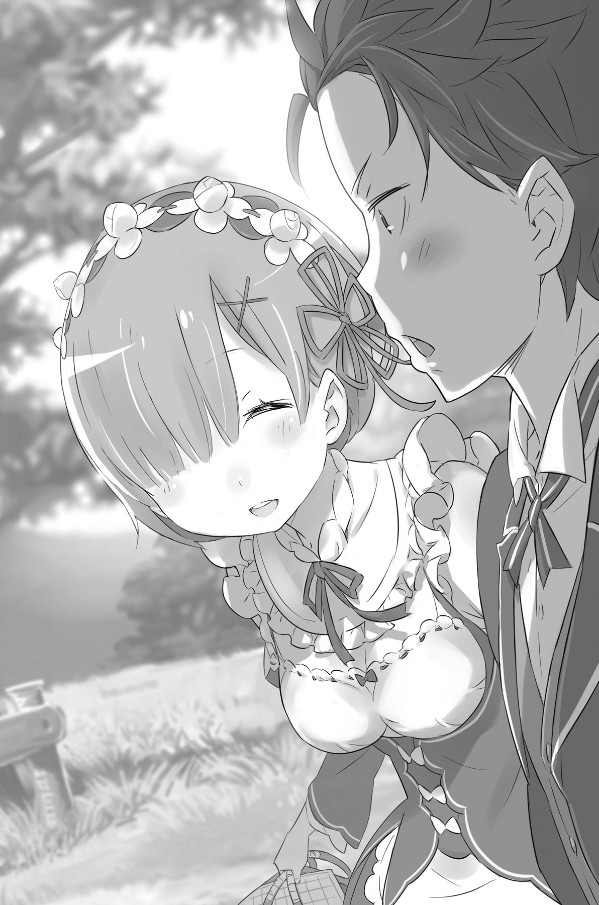

## 1

— Дорогой гость, вы неважно выглядите. С вами всё хорошо?

— Дорогой гость, кажется, у вас болит живот. С вами всё в порядке?

Служанки склонились над вздрагивающим телом Субару. За то недолгое время, что он провёл в особняке Розвааля, Субару успел привыкнуть к их голосам. Порой эти голоса раздражали, но по прошествии некоторого времени вселяли спокойствие и уверенность.

Однако сейчас они звучали совершенно иначе, и слышать их было нестерпимо больно и страшно.

— Извините, что напугал вас, — проговорил Субару, чувствуя на себе пристальные взгляды. — Иногда по утрам на меня что-то находит…

Немного наконец успокоившись, он оторвал лицо от подушки. Волна гнева и обиды отхлынула, и теперь, когда первый шок остался позади, Субару чувствовал лишь щемящую тоску. Если бы только всё это оказалось розыгрышем, который устроили коварные Рам и Рем! Мысль о том, с каким негодованием он бы набросился на них, неожиданно принесла облегчение.

Субару открыл глаза и посмотрел прямо перед собой. Сначала мир предстал размытым, словно в тумане, но спустя мгновение реальность обрела привычные очертания. По обе стороны кровати стояли, опершись руками о постель, близнецы-служанки с неизменно бесстрастными лицами. Их взоры не выражали никаких эмоций, будто события последних четырёх дней совершенно выветрились из их памяти.

— Дорогой гость?.. — озадаченные голоса прозвучали практически синхронно, и губы тоже двигались в унисон. Взгляды девушек скрестились на Субару, но он, вздрогнув, точно от холода, торопливо отшатнулся от них.

— Дорогой гость, резко вставать опасно. Вам требуется покой.

— Дорогой гость, нельзя так резко вскакивать. Вам нужен отдых.

Субару рефлекторно отстранился ещё дальше от фигурок в костюмах горничных. Девушки удивлённо переглянулись, но Субару было не до них. Его снова не узнавали. Как тогда, на многолюдной улице, в тёмном переулке и на складе деда Рома — люди, которых он знал, смотрели на него, как на незнакомца. Осознавать это было просто невыносимо. Но теперь всё складывалось совсем по-другому. Другие обстоятельства. Другое время. Другой опыт…

Субару охватил страх.

Всё было совсем иначе, не так, как в тот раз, когда он исправлял свои ошибки при новых встречах с Эмилией и Фельт, едва зная их. Тогда ему тоже было нелегко заново знакомиться с теми, кому он уже когда-то доверился, но теперь, лицом к лицу столкнувшись с хорошо знакомыми людьми, превратившимися в чужаков, Субару почувствовал, как сердце сковывает безликий непреодолимый страх.

Девушки обеспокоенно смотрели в его наполненные ужасом глаза: с гостем явно творилось что-то неладное. В комнате воцарилось молчание,

Внезапно Субару соскочил с постели и, прежде чем служанки успели вымолвить хоть слово, сломя голову бросился к двери и вылетел в коридор.

Шлёпая босыми ногами по холодному полу и задыхаясь, он мчался мимо одинаковых дверей, не соображая, от чего и куда убегает. Но оставаться на месте было нельзя. Совершенно невозможно. Бежать, бежать! И неважно куда.

Внезапно Субару, словно по чьей-то указке, остановился перед одной из многочисленных дверей. Толкнув её, юноша ввалился в огромное помещение, всё пространство которого было заставлено книжными стеллажами.

## 2

Дверь за спиной с шумом захлопнулась, и Субару оказался изолирован от внешнего мира. Если бы кто-то и задумал проникнуть в эту комнату, ему пришлось бы проверить каждую дверь в особняке.

Ощущение погони исчезло. Прислонившись к двери, Субару медленно сполз на пол. Несмотря на то, что теперь он сидел на корточках, ноги продолжали трястись, как в лихорадке. Он обхватил колени руками, однако пальцы тоже плясали от нервной дрожи.

— Трясёт, как бумажного сумоиста[^6]…

Но самоирония не помогла, и вымученная улыбка Субару не выражала сейчас ничего, кроме безысходности.

В библиотеке царила тишина. Запах старой бумаги, которым был пропитан воздух, немного успокоил юношу, хотя он понимал, что это всего лишь временное затишье.

Глубокий вдох. И ещё, и ещё один… Пока Субару, точно выброшенная на берег рыба, ловил воздух ртом, где-то в глубине полутёмного помещения раздался тонкий насмешливый голосок:

— Как грубо с твоей стороны врываться без стука!

Взгляд Субару упал на низкую стремянку, стоящую в самом центре комнаты, прямо напротив входа в библиотеку. На одной из её ступенек сидела девочка.

Это была Беатрис, хранительница запретной библиотеки, которая, как всегда, старалась держаться от Субару на почтительном расстоянии. На коленках девочки лежал огромный фолиант, в сравнении с которым она казалась ещё крохотной. Хранительница с треском захлопнула книгу, неодобрительно глядя на незваного гостя.

— Ты снова разгадал тайну Блуждающей двери, мнится мне. Как тебе это удаётся?

— Извини, — выдавил Субару, — Прошу, позволь мне побыть здесь немного.

Умоляюще сложив ладони перед собой, он опустил голову закрыл глаза, не дожидаясь ответа.

«Здесь тихо и спокойно. Меня здесь никто не тронет. И теперь я должен сопоставить все факты. Как меня зовут? Где я нахожусь? Что это были за близнецы? Что это за девчонка, что сидит передо мной, и как её имя? Что это за таинственная комната? Где я провёл последние четыре дня? С кем я договорился встретиться завтра?.. И где?..»

— Точно! Эмилия…

Он вспомнил её серебристые волосы в лунном свете, застенчивую улыбку и звёздное небо, под которым прошло их первое тайное свидание.

— Беатрис…

— Мы не так близки, чтобы ты называл меня по имени, мнится мне?

— Кажется, ты сказала, что я попал в твою комнату «снова». То есть я уже бывал здесь?

Судя по недовольному лицу, Беатрис была не в восторге от столь фамильярного обращения. Скорчив надменную гримасу, она всё же не стала возмущаться и спокойно сказала:

— Ты имел наглость вломиться сюда не далее как пару-тройку часов назад.

— Значит, я просыпался в этом особняке уже дважды…

Субару напрягся, пытаясь вспомнить каждую деталь событий первой ночи, проведённой в доме Розвааля.

«Проснувшись в первый раз, я бродил по зацикленному коридору, пока наконец не угодил в запретную библиотеку. Там я впервые встретился с Беатрис, которая прикосновением руки чуть не отправила меня на тот свет. А когда я снова открыл глаза, у кровати стояли Рам и Рем…»

Это было единственное утро, когда его будили обе девушки. В последующие дни служанки приходили поочерёдно. Более того, лишь в то утро Субару воспользовался привилегией спать в комнате для гостей.

Напрашивался только один вывод.

— Что же это получается? Выходит, меня отбросило на четыре дня назад?

Осмыслить логически своё нынешнее положение оказалось для Субару проще, чем смириться с ним. Обхватив голову руками, он попытался вспомнить, что же могло явиться причиной его возврата в прошлое.

Во время событий в столице такой причиной становилась его смерть. До сих пор Субару полагал, что после череды трёх смертей и последующего спасения Эмилии ему удалось выскользнуть из временной петли. Фактически в поместье графа Розвааля он пробыл четверо суток, и за это время не случилось ни одного серьёзного происшествия. И вдруг его безо всякого предупреждения снова забросило в прошлое.

— Может быть, теперь действуют совершенно другие правила? Скажем, отныне переброс происходит раз в неделю? Тогда непонятно, почему я вернулся именно в своё первое утро в поместье Розвааля.

Принцип перемещения во времени оставался для Субару загадкой. И всё же механизм временной петли, который действовал в столице, обладал некоторыми закономерностями. Одна из них — место, в котором перемещаемый во времени объект оказывался после очередной смерти. Если бы Субару до сих пор находился во власти первой временной петли, он непременно воскрес бы у фруктовой лавки, принадлежавшей мрачному торговцу со шрамом на лице.

— Однако вместо лавки того мордоворота теперь я оказываюсь в спальне с двумя милашками. Ну, это не такой уж плохой поворот!..

Разница в условиях пробуждения действительно была огромной — как между небом землёй.

Охлопав своё тело, Субару удостоверился, что цел п невредим. Но если предположить, что условия возврата в прошлое не изменилось, то можно было не сомневаться — он умер!

— Но как я мог умереть? Ведь вчера вечером всё было прекрасно!

Возможна ли внезапная смерть, если ничто её не предвещает? Субару пришло на ум, что он мог умереть от какого-нибудь яда или газа. Неужели его отравили?! Но зачем? И кто?

— Даже предположить не могу, кому это могло понадобиться. А вдруг меня забросили в прошлое, потому что я не выполнил какое-то задание?

В компьютерных играх так и происходит: стоит провалить миссию, и ты получаешь Game 0ver с возвращением в исходную точку. Однако в чём заключалась его миссия здесь, Субару оставалось совершенно не ясно. К тому же он был из тех геймеров, которые чуть что — сразу всё бросают и бегут искать секреты в файле-подсказке с прохождением игры.

— Твоё бессвязное бормотание начинает надоедать, мнится мне, — устало проговорила Беатрис. — О чём бы вы, скучные людишки, ни рассуждали — о жизни или о смерти — в конечном счёте всё заканчивается самообманом и тщеславием. Вот почему с вами совершенно бесполезно разговаривать.

Её слова прозвучали цинично, даже жестоко. И всё же Субару был рад тому, что Беатрис нисколько не изменилась. Он поднялся на ноги и, отряхнув штаны от пыли, повернулся лицом к двери.

— Уходишь, полагаю?

— Мне нужно кое-что проверить. Рано впадать в отчаяние. Спасибо за всё.

— Я ничего особенного не сделала. Ну так что, ты уходишь или нет? Мне нужно поскорее переставить дверь.

В её голосе не было ни капли сочувствия, однако ему отчего-то было приятно его слышать. Возможно, Беатрис и не имела такого намерения, но её слова будто подтолкнули Субару вперёд. Он повернул дверную ручку — снаружи вдруг потянуло прохладным свежим воздухом.

Субару шагнул за порог. Лёгкий ветерок ласково растрепал его волосы. В глаза ударил яркий свет, и юноша прикрыл лицо рукой. Когда ветер стих, Субару ощутил под ногами мягкую шелковистую траву.

И тут увидел её.

При встрече с Эмилией сердце радостно затрепетало.

— Ты сияешь, словно солнце!

— Субару! — раздался взволнованный голос, похожий на звон серебряного колокольчика.

Широко открыв фиалковые глаза, девушка бросилась к Субару. Юноша инстинктивно шагнул навстречу. Когда они сблизились, Эмилия осмотрела его с ног до головы и с облегчением вздохнула, однако тут же приняла серьёзный вид:

— Зачем ты заставляешь нас так волноваться? Рам и Рем с ног сбились, разыскивая тебя по всему дому!

— Неужели? На них не похоже. Прости, я немного задержался у Беатрис.

— Опять? Я слышала, тебе уже досталось от неё сегодня утром.

Следы пережитого ещё были видны на её красивом лице. Забота и облегчение, смешанное с беззащитностью, заставили руки Субару непроизвольно потянуться к Эмилии, но он тут же одёрнул сам себя. Сейчас был явно не лучший момент для объятий, и ему оставалось лишь слабо улыбнуться в ответ. Эмилия тоже держалась чуть скованно — как с человеком, которого знала не так уж хорошо.

В этом не было ничего удивительного, ведь она не провела с ним и пары часов с момента их самой первой встречи в городе, а счастливые дни, проведённые в поместье, куда-то пропали. Отныне между ними зияла пропасть в четыре дня, и об этой пропасти было известно лишь одному Субару.

— Всё в порядке? У меня что-то на лице?

— Да, твои прекрасные глаза, и чудесный носик, прелестная улыбка! То есть… Я хотел сказать: рад, что ты невредима.

Эмилия смутилась, и сё лицо залил жаркий румянец.

— Да, со мной всё хорошо, — кивнула девушка. — Ведь ты спас меня. А как ты себя чувствуешь?

— Я в полном порядке! Правда, потерял немного крови, из меня выкачали всю ману, и ещё такое чувство, будто по мозгам проехался асфальтовый каток… Но в остальном всё замечательно!

— Ну, что ж, тогда… Что?! Выходит, у тебя всё не так уж хорошо, как ты говоришь?

— Спокойно! — поспешил сказать Субару и, подняв руки вверх, повернулся кругом, демонстрируя, что цел и невредим. — Ну вот! Видишь?

— В таком случае я рада. Так ты идёшь обратно в дом? У меня есть ещё кое-какие дела.

— Встреча с духами? А можно я останусь? Обещаю, что не буду мешать! И ещё: одолжи мне Пака!

— Ну хорошо… Но я очень прошу не отвлекать меня! Это тебе не игрушки! — сказала Эмилия так, будто обращалась к несмышлёному ребёнку. Выглядело это столь мило, что у Субару перехватило дыхание.

— Тогда не будем медлить, Эмилия-тан! Времени так мало, а мир настолько большой! Наша с тобой история только начинается!

— Хм… Что ты сказал? Что за «тан»?

— Не бери в голову. Давай, вперёд, вперёд! — скомандовал Субару, не обращая внимания на удивление Эмилии, снова впервые услышавшей своё уменьшительное имя, и легонько подтолкнул её в направлении того уголка в саду, где она проводила утренние ритуалы.

Он вспомнил, как Эмилия устала поправлять его и неохотно приняла новое прозвище, — это была одна из связей, возникших между ними в течение тех четырёх потерянных дней. По лицу Эмилии было видно, что она не согласна, и Субару, идя позади, очень тихо пробормотал:

— Мы вернём их назад.

Проводив её взглядом, Субару взглянул на небо. Над горизонтом на востоке медленно поднималось ненавистное солнце. Ещё четыре таких же рассвета — и наступит день его свидания с Эмилией. Оставалось лишь ждать и считать часы до заветной встречи. Ответ Эмилии он знал заранее.

Субару погрозил небу кулаком:

— Хоть я и не в курсе, кто это всё придумал, но так и знай: я возьму своё! Ты у меня ещё поплачешь! Не стоит недооценивать по уши влюблённого парня, в глазах которого ещё стоит её счастливая улыбка!

Впервые с момента появления в этом мире Субару открыто объявлял войну загадочной силе, призвавшей его сюда заставившей вращаться в петле смерти.

Его битва начнётся со второго раунда. Он сделает всё, чтобы вырваться из этих зацикленных в поместье Розвааля дней.

«Я должен знать, что будет дальше! Я сделаю так, чтобы наше свидание состоялось! Чего бы мне это ни стоило!»

## 3

Итак, жизнь Субару в поместье графа Розвааля пошла по второму кругу. Всё, что оставалось, — дождаться пятого по счёту восхода солнца. А пока следовало действовать в точности так же, как в прошлый раз, и по прошествии четырёх дней снова встретиться с Эмилией и договориться о прогулке в деревню.

Он предположил, что события, происходящие в рамках временной петли, являются в некоторой степени предопределёнными: делай, что делал раньше, и получишь аналогичный результат. Иными словами, чтобы достигнуть своей цели, Субару должен был в точности следовать сценарию предыдущего круга жизни и скорректировать лишь то, что привело к фатальному исходу в прошлый раз. Это был лучший план, который пришёл ему в голову.

Выходит, необходимо самым внимательным образом изучить текущую петлю, проживая её заново. Мысль о том, что теперь ради цели придётся «сохраняться» и «загружаться» заново, вызвала у Субару невесёлую усмешку.

— Так что же это было? Где я облажался?

Погрузившись в горячую ванну и выпуская ртом пузырьки воздуха, Субару перебирал в памяти события прошедшего дня. Сначала всё было без особых изменений. Закончив с Эмилией утреннюю разминку, Субару дождался возвращения Розвааля и был приглашён на завтрак, во время которого постарался в общих чертах повторить прошлую беседу. Конечно, он мог ошибиться в деталях, но самые важные пункты Субару не упустил: получил в качестве награды возможность тискать Пака, обращался к Эмилии, добавляя суффикс «тан», обсудил её статус претендентки на королевский престол, а также выяснил своё положение в поместье Розвааля.

Так же, как и в прошлый раз, он выпросил себе должность слуги-стажёра. Затем под чутким руководством Рам отправился осматривать особняк, после чего приступил к выполнению служебных обязанностей. Тут-то и начались странности.

— Отчего-то всё пошло не по сценарию, — приподняв подбородок над водой, Субару устало вздохнул. — Такое ощущение, будто явился на экзамен с кучей шпаргалок, а вопросы в билетах на совершенно иную тему. И зачем они всё поменяли?

Субару не предполагал, что Рам даст ему абсолютно другую работу, причём в куда большем количестве, чем в прошлый раз. Хотя, быть может, нагружая новоиспечённого ученика множеством тяжёлых заданий, Рам оказывала ему доверие?

— В прошлый раз я умаялся так, что к вечеру еле на ногах стоял… Но сегодня вообще что-то! Вот чёрт! Я-то, наивный, думал, что всё окажется проще пареной репы!

Дело было не только в усталости от тяжёлой работы. Субару сделал вывод, что дела его плохи. Если первый день пошёл по совершенно иному сценарию, вряд ли стоило надеяться, что дальше всё будет складываться так, как нужно ему

— А ведь я так до сих пор и не понял, почему меня вновь забросило обратно.

На этот раз всё произошло по совершенно иному шаблону. Если раньше непременным условием возвращения в прошлое являлась смерть, то теперь, когда он просто спокойно заснул в своей кровати и очнулся в начале нового витка, сложно было даже представить, что именно запустило механизм временной петли.

— На память теперь полагаться бессмысленно.

Субару вспомнил невероятно насыщенный день в столице — тот самый день, когда он встретил Эмилию. Несмотря на множество различий в деталях, в целом события того дня каждый раз повторялись, и он видел свои ошибки, которые приводили к печальному исходу. А теперь он не знал ни в чём причина возврата, ни как его избежать. Единственное, что с точки зрения Субару было важно, — это обещание встретиться с Эмилией. Скорее всего, если он снова доберётся до этого момента, то сможет изменить ход событий и вырваться из петли.

Набрав воздуха, Субару снова погрузился под воду, где собрал свои мысли воедино. Когда же он вынырнул, то прямо перед ним, на краю купальни стоял, уперев руки в боки, совершенно голый хозяин поместья.

— Мо-о-ожно присоедини-и-иться? — игриво протянул Розвааль, выпрямившись перед Субару на расстоянии вы тянутой руки и глядя на него сверху вниз.

Субару тут же пожалел, что вынырнул из воды.

— Уже занято. Нельзя.

— Эта ва-а-анна в моём особняке, поэтому она принадлежит мне. Так что я могу делать всё-о-о, что захочу.

— Тогда зачем спрашиваете? Мойтесь, если хотите.

— О, какие мы нервные! Нет, ты не понимаешь. Конечно, эта ванна принадлежит мне, но… — Розвааль опустился на одно колено и нежно приподнял в ладони подбородок Субару. — Разве ты, работая у меня прислугой, точно так же не являешься моей собственностью?

Цап.

— Какая реши-и-ительность!

Укусив цепкие пальцы графа, державшие его подбородок, Субару быстро отплыл на спине к противоположному краю ванны.

Ванна в доме Розвааля была огромной до неприличия. Походя на бассейны в старых добрых общественных банях, она ярко свидетельствовала о присущей аристократии любви к роскоши. И всё же Субару был вынужден признать, что купаться в такой огромной ванне в одиночестве было крайне приятно. Именно поэтому отдых в горячей воде после тяжёлой работы стал для него привычным ритуалом уже с первых дней пребывания в этом доме.

— Ещё одно расхождение со сценарием, которого я не ожидал… — пробормотал он, искоса поглядывая на Розвааля.

Чтобы Субару оказался в купальне одновременно с графом — такого раньше не случалось. В первом круге жизни в особняке хозяин дома был настолько занят различными делами, что, кроме как за обедом, Субару нигде с ним не пересекался. Видимо, служанки-близняшки полностью брали на себя обслуживание хозяина.

— Всё, абсолютно всё идёт не так, как я ожидал!

— Не знаю, что тебя беспоко-о-оит, но в жизни далеко не всё происходит так, как нам того хочется.

Розвааль придвинулся ближе и, опершись спиной о стенку ванны, издал протяжный вздох. Сейчас он более всего напоминал самого обычного человека, который наслаждается отдыхом после тяжёлого дня.

— Я только сейчас заметил: вы всё же снимаете макияж перед тем, как принять ванну?

— Что? А-а-а, верно. Бог мой, Субару, неужели ты ещё ни разу не видел моей реа-а-альной внешности?

— Наверное, да. А что, вы и без косметики выглядите прекрасно. Мне кажется, вам не следует прятаться за слоем штукатурки.

— Я и не собира-а-ался. Это просто моё хобби. Другое дело, если у тебя рот кривой или, скажем, слишком большой нос. Тогда…

— Вот только не надо на меня смотреть. Сам знаю, что не красавчик.

Субару прекрасно понимал, что природа обделила его красотой. Внешностью он пошёл в свою мать, и тут уже ничего не попишешь. Родителей не выбирают.

При воспоминании о родителях лицо Субару вдруг сделалось мрачным, так что даже Розвааль поспешил сменить тему:

— Тебе удаётся ла-а-адить с Рем и Рам? Девушки работают здесь уже довольно давно, поэтому им есть что передать новичку.

— С Рем я пока не общался, но с Рам мы поладили. Кажется, она даже слишком дружелюбна ко мне. Сейчас, когда я работник, она обращается со мной не хуже, чем когда я был гостем.

— Неужели? В таком случае, Рем компенсирует это упущение. Они же сёстры и должны помогать друг другу. И должен заметить, они прекра-а-асно с этим справляются.

— По моим наблюдениям, — заметил Субару, — Рам представляет собой испорченную версию Рем. Младшая только делает, что покрывает старшую.

Кто из близнецов лучше справляется с домашними делами, было видно невооружённым глазом. В то время как младшая сестра всё делала на отлично, старшей нужно было здорово постараться, чтобы выполнить работу хотя бы на четвёрку. По идее, такой расклад должен был привести к появлению у Рам комплекса неполноценности.

— И всё-таки Рем считает Рам круче только потому, что та старше. У девчонки просто стальные нервы!

— Если о нервах, у тебя они то-о-оже довольно крепкие. Ты не слишком-то с ними церемонишься, как я погляжу. По правде говоря, это даже хорошо-о-о!

— На похвалу всё равно не похоже, — проворчал Субару.

Розвааль зажмурил правый глаз, поднял голову и уставился в высокий потолок.

— На полном серьёзе, — сказал он. — Я действительно считаю, что это хорошо. Наши девочки слишком уж идеально дополняют друг друга, не находишь? А для того чтобы начались изменения, порой бывает необходим внешний толчок.

— Вы правда так думаете?

— Я правда так думаю! — ответил Розвааль погрузился в воду по самую шею.

Вдруг Субару вспомнил, что хотел задать ему один вопрос.

— Кстати, Розчи, можно кое о чём спросить?

— Ну-у-у, если твой вопрос входить в широчайшую сферу моей компетенции, то я не против.

— Впервые вижу, чтобы кто-то таким извилистым путём сказал: «Я жутко умный!» Ну да ладно, я просто хотел спросить, чем вы подогреваете воду в ванне? — Субару постучал по дну резервуара.

Ванна была сделана из приятного на ощупь камня, напоминающего мрамор. Сама купальня занимала угловое помещение на цокольном этаже особняка и предназначалась как для мужчин, так и для женщин. Впрочем, после каждого посещения воду из ванны сливали и наполняли её заново, поэтому, даже принимая ванну после Эмилии, Субару не приходилось рассчитывать на какие-то особенные ощущения.

— Всё-таки ты меня удивля-а-аешь! Видимо, дело в том, что ты ещё молод… Интересно, мне в твоём возрасте пришло бы в голову задать такой вопрос? — Розвааль задумался, очевидно, восхищаясь безрассудной юностью Субару, а затем кивнул: — Ответ про-о-ост. Под ванной рассыпаны специальные кристаллы, которые подогревают воду, используя ману того, кто принимает ванну. Ты должен был видеть, как это происходит на кухне.

— А я всё думал, как вы здесь готовите без газа! То есть выходит, этим могут пользоваться только маги?

— Во-о-овсе нет. «Врата» есть у всех форм жизни без исключения: даже у растений и животных. В противном случае мы бы никогда не создали цивилизацию, основанную на использовании магических минералов.

Заметив непонимающий взгляд юноши, Розвааль откашлялся и сказал:

— Ну что ж, придётся прочитать лекцию. Поведать тебе, невежде, об основах использования ма-а-агии.

— Насчёт невежды я бы, конечно, поспорил, ну да ладно. Охотно послушаю вашу лекцию, — Субару повернулся к Розваалю и приготовился слушать. Не забывая, впрочем, о том, что оба они оставались совершенно голыми.

— Начнём с са-а-амых азов, — сказал Розвааль. — Тебе, без сомнения, известно, что такое «врата», не так ли?

— Вы говорите о них как о вещи общеизвестной, но, должен признаться, я совершенно не понимаю, о чём речь…

— Стало быть, о вратах ты ничего не знаешь… То есть ты в этом «абсолютный ноль», так? Я правильно употребил это выражение?

Это был один из оборотов речи, привнесённых Субару в этот мир.

— Отлично, Розчи! Дайте пять!

Они ударили по рукам, после чего вернулись к обсуждаемому вопросу.

— Так что же такое эти ваши «врата»?

— Попросту говоря, «врата» — это двери, которые ведут внутрь те-е-ела. Через «врата» поступает мана, сквозь них же она и выходит. Это основа всей жизни.

— Вот оно что… — Субару кивнул. Примерно так он и думал. — Значит, у меня тоже есть свои «врата»?

— Хм… Скорее всего. Если ты уверен в том, что являешься человеком. Ты же человек?

— Более настоящего человека этот мир ещё не видел! Я самый что ни на есть простой смертный! Проще меня только мобы[^7].

Что правда, то правда. Субару не обладал ни выдающейся физической подготовкой, ни особой находчивостью и смекалкой, помогающими находить выход из любой ситуации. Образованным его тоже нельзя было назвать, и даже несмотря на развитую мускулатуру и неплохую координацию, с выносливостью у него имелись большие проблемы. Всё, что он умел делать на отлично, это подшивать брюки и заправлять постель. Действительно, проще только мобы.

Тем не менее рассказ Розвааля привёл Субару в восторг. Ах, это чарующее слово «магия»! От одной мысли, что он тоже может пользоваться магией, сердце Субару чуть не выпрыгнуло из груди. В глазах юноши заиграли огоньки радостного предвкушения.

— Нет, конечно, больше всего я рад тому, что встретил Эмилию, но магия — тоже круто! Наконец-то исполнится моя мечта, и я стану магом! Всю жизнь хотел этого!

— Тебя так возбуждают разговоры о ма-а-агии? Имей в виду, что твои магические способности во многом зависят от удачи. К тому же необходимо иметь соответствующие позна-а-ания. Не подумай, что я хвастаюсь, но сомневаюсь, что природа наградила тебя столь же выдающимися тала-а-антами, как меня.

Выслушав эту тираду, Субару хитро улыбнулся. Граф был слишком самоуверен. Он и не догадывался, что юноша, нежащийся прямо перед ним в ванне, является попаданцем из другого мира. А как известно, у попаданцев обязательно проявляются скрытые способности.

Исходя из его приключений до настоящего момента, на боевые навыки, интеллект или хотя бы повышенную удачливость Субару рассчитывать не приходилось. Но что, если у него появились магические умения?

— Ну, давайте же, Розчи! Вы моя последняя надежда! Расскажите мне ещё про магию! Я уже вижу, как надвигается магическая волна, на гребне которой сияет моё светлое будущее!

— Даже та-а-ак? Что ж, продолжим. Тебе должно быть изве-е-естно, что в магии существуют четыре основные стихии.

— Не-а!

— Неужели? Ты настолько невежественен и простодушен, что вызываешь восхищение. Что же, я объясню. Существует четыре вида стихий маны, они относятся к огню, воде, воздуху и земле. Поня-а-атно излагаю?

— Ага, основные стихии. Всё, я врубился. Давайте дальше, дальше!

Граф добродушно кивнул и продолжил:

— Огненная стихия относится ко всему, что связано с теплом. Стихия воды управляет исцелением и жизнью. Стихия воздуха воздействует на тела живых существ снаружи, а стихия земли — воздействуют на тела изнутри. Все стихии делятся на эти четыре категории, но обычный человек может взаимодействовать лишь с одной из них! Кстати, я взаимодействую со всеми четырьмя.

— Ох и любите же вы бахвалиться! — не удержался Субару. — Ладно, признаю, вы весьма круты. Но как узнать, с какой категорией могу взаимодействовать я?

— Чтобы выяснить, какой стихией способен управлять тот или иной человек, такому опытному магу, как мне, достаточно всего лишь одного-о-о прикоснове-е-ения.

— Реально?! Я знал, что вы так скажете! Давайте же, скорее раскройте мою стихию!

Розвааль приблизился к юноше и положил ладонь на его влажный лоб.

— Прошу прощения, — произнёс граф и вдруг принялся издавать звуки, напоминающие писк сломанного радиоприёмника.

— Ух ты! Магические звуковые эффекты! Полное погружение в магию!

Субару настолько увлёкся ритуалом, что разом позабыл обо всех опасениях.

Магия… Наконец-то он узнает своё истинное предназначение в этом мире! Субару не просто надеялся — он уже не сомневался в собственных магических способностях и с горящими глазами ожидал результатов осмотра.

— Ага, — вымолвил наконец граф. — Мне всё ясно.

— Наконец-то! Что же это? Что?! — Субару вскочил на ноги, горя от нетерпения. — Может, огонь, который пылает в моём страстном характере? Или вода, ведь другая сторона моей натуры — спокойствие и собранность? Что, если это колышущий полевые травы воздух, который дарит людям бодрость и ясность ума, столь свойственные мне? Нет, нет, это точно должна быть земля — прочная и надёжная, как мои знания и опыт, на которые всегда можно положиться! Ну?

— Да, — сказал Розвааль. — Это «тьма».

— А как же четыре стихии?! — воскликнул Субару, не веря своим ушам.

Сейчас он выглядел так, словно ему сообщили о неизлечимой болезни.

— Да, соверше-е-енно бесспорно, это «тьма», — судя по его тону, и не думал шутить. — Твоя связь с другими стихиями кра-а-айне слаба. Скажу честно, это о-о-очень редкое явление.

— То есть, я не понял — что это за «тьма» вообще? Какая-то пятая стихия, что ли?

На са-а-амом деле, помимо четырёх стихий, о которых я тебе рассказал, есть ещё две: «тьма» и «свет». Однако количество людей, которые управляют ими, стремится к нулю, поэтому я и не стал их упоминать.

Иными словами, Субару представлял собой редчайший случай.

Выслушав пояснения Розвааля, юноша немного успокоился. Столь редкая стихия наверняка могла подарить ему заветные суперспособности.

— Должно быть, это очень мощная стихия?! Подобно какой-нибудь специальной сверхсиле, которая возникает раз в пять тысяч лет!

— Ты прав, — отозвался граф. — Магия тьмы широко известна тем, что может наносить различный урон противнику: лишать его зрения, слуха, замедлять движения и всё в таком духе.

— Выходит, я просто дебаффер?!

В игровой терминологии дебаффом называют способность ослаблять противника. Никакой тебе суперсилы, о которой будут слагать легенды, никаких уникальных магических умений, позволяющих творить невероятные вещи. Всё, что получится сделать, это накинуть на неприятеля пару дебаффов, чтобы снизить эффективность его защиты или атаки.

Как ни прискорбно, но такова реальность.

— Вот тебе и призвали в другой мир… — расстроился Субару. — Силы не дали, интеллекта не прибавили. Один жалкий дебаффинг.

— Кста-а-ати говоря, у тебя практически нет таланта к магии. Если мой уровень — десять, то твой едва дотягивает до тройки,

— А вот об этом можно было бы и не говорить! Какое-то тут у вас проклятое место, ничего святого! — издав гневный стон, Субару снова плюхнулся в воду.

Ещё несколько секунд назад была хотя бы надежда на то, что ему даруют магические способности, но теперь она растаяла без следа. К сожалению, расставание с иллюзиями всегда болезненно.

— Ну хорошо, — сказал Субару, успокоившись. — Если от дебаффинга будет хоть какая-нибудь польза, может, не так уж всё и плохо. Вдруг я ещё стану крутым профи.

— Крутым или нет, не так уж важно, — ответил Розвааль. — Образование ещё никому не повредило. Хочешь научиться использовать магию — вперёд! К счастью, прямо в этом особняке живёт специалист по магии тьмы.

— Неужели?! А что, было бы здорово, если б меня обучили! В таком случае сразу после ванны и начнём!

Субару так вдохновился идеей научиться у Эмилии азам магии и тем самым установить с ней более близкие отношения, что совсем позабыл о своём первоначальном намерении следовать сценарию из прошлой жизни.

— Кажется, ты снова тешишь себя иллюзиями, юноша. Специалистом по магии тьмы является вовсе не госпожа Эмилия.

— Чёрт подери! Вам что, в удовольствие над людьми издеваться? Ну и кто же тогда этот ваш специалист? Отвечайте, вы, представитель элиты магов со всеми стихиями!

— Беатрис.

— Только не это!!!

Над ванной взметнулся огромный столб брызг, вслед за которым по всему дому прокатился душераздирающий крик отчаяния, вернувшийся дребезжащим эхом.

## 4

— Тьфу! Похоже, перегрелся… — проворчал Субару, напяливая на себя сменную одежду. Его лицо было красным, как мак. — Этот чёртов Розвааль совсем меня заболтал.

Когда проверка на магическую профпригодность закончилась, Субару первым покинул купальню. Беседа с Розваалем взбудоражила его впечатлительную натуру, а от долгого пребывания в горячей воде голова сделалась тяжёлой и сильно болела. Впрочем, не прошло и суток с того момента, как Эмилия залечила раны на его животе, поэтому не было ничего удивительного в том, что Субару ощущал себя несколько вялым.

— Вдобавок ко всему завтра ещё мышцы будут болеть! Рам, чтоб тебя!.. — Субару схватил корзину с грязным бельём и направился к двери. — Запомни раз и навсегда: если я стал работать лучше, чем в прошлый раз, это ещё не повод гонять меня и в хвост и в гриву.

— Хорошо, я запомню.

— Ой, кто здесь?!

От неожиданности Субару подпрыгнул на месте так, что нижнее бельё посыпалось из корзины и приземлилось у ног Рам, она стояла рядом с выходом из раздевалки.

— Ну и напугала ты меня!

Присев на корточки, Рам двумя пальцами брезгливо взяла его трусы и засунула в мусорное ведро, стоящее рядом.

— Ты чего это делаешь? — возмутился Субару. — Не видишь, перед тобой мужчина, который собирается заняться стиркой?

— Прошу прощения. Вид твоего белья вызвал у меня отвращение на физиологическом уровне. Я должна была избавиться от него сию же секунду.

— От своего лучше избавься, — проворчал Субару.

Тяжело вздохнув, он вытащил трусы из ведра и положил обратно в корзину, после чего выжидательно посмотрел на Рам, однако та, по всей видимости, уходить не собиралась.

«Интересно, что у неё на уме?» — подумал Субару.

— К сожалению, — сказала вдруг девушка, — я уже приняла ванну, поэтому, сколько бы ты ни ждал, я не стану раздеваться.

— Ничего я такого и не ждал! И вообще, не слишком ли смелое заявление для служанки?

— Я пошутила. Просто дожидаюсь господина Розвааля, чтобы помочь ему одеться.

— Кажется, вы его слишком разбаловали. Самому одеться слабо, что ли?

Похоже, в этом мире были люди, которые без помощи слуг не могли натянуть даже пару носков. Видимо, Розвааль входил в их компанию.

— Только не говори, что вы ему ещё и краситься помогаете.

— Не смей в моём присутствии проявлять неуважение к господину Розваалю. В следующий раз мне придётся применить грубую силу.

Хотя в её угрозе чувствовалась мягкость, Субару знал, что Рам говорит серьёзно, поэтому воспринял эти слова соответственно. Несмотря на терпение, с которым девушка разъясняла Субару его задачи, взгляд у неё всегда был такой, будто она отправит его работать в свинарник, если он спросит об одном и том же дважды.

— Вас понял, сэмпай. Не буди лихо, пока оно тихо, — Субару махнул рукой: Ну тогда до завтра.

— Барусу, — вдруг окликнула его Рам. — Какие планы на вечер?

— Спать, конечно. А что ещё остаётся делать? Ведь завтра чуть свет снова на работу, чёрт её подери.

Рам чуть заметно кивнула и опустила ресницы, но прежде чем Субару успел сказать хоть слово, она вдруг снова подняла глаза и произнесла:

— Тогда жди меня в своей комнате. Я зайду к тебе позже.

Несколько секунд Субару тупо смотрел в пустоту.

— Чего?

## 5

Субару Нацуки не раз заявлял, что всецело предан Эмилии. Многих красавиц он повстречал на своём пути с момента появления в альтернативном мире, и всё-таки Эмилия разительно отличалась от всех прочих. И причиной тому была не только её чистая непорочная красота. Субару был без ума от каждого её движения, слова, взгляда. Поэтому невозможно даже представить, чтобы он променял её на другую, какой бы прекрасной та ни оказалась. Субару служил лишь одной богине — Эмилии.

— Как и эта идеально застеленная кровать! — он энергичным жестом ткнул указательным пальцем в кровать и, ни к кому особенно не обращаясь, заявил: — Она тоже служит лишь одной единственной цели — дать мне хорошенько выспаться!

Возвратившись из купальни и совершенно позабыв про стирку, он долго и тщательно застилал кровать теперь, изрядно вспотев, любовался результатом своих усилий.

— Это всё неважно, это всё неважно! — твердил он себе под нос. — Очисти разум, очисти разум! Успокойся, успокойся! Одна Эмилия-тан, две Эмилпи-тан, три Эмилии-тан… Я уже в раю?

Внезапно раздался голос:

— Барусу, не шуми. Уже ночь. Веди себя тише.

Подпрыгнув чуть ли не до потолка, Субару испуганно прижался к стене.

На пороге комнаты стояла Рам. Он даже не слышал, как она открыла дверь.

— Я же сказала — не шуми, а ты опять за своё!

— Легко сказать «не шуми»! Да у меня чуть душа в пятки не ушла! Чего тебе надо?

В ответ на его крики Рам лишь презрительно хмыкнула. Переступив через порог, она направилась к письменному столу.

Вообще письменные столы имелись в каждой комнате, однако ввиду того, что Субару не умел ни читать, ни писать на местном языке, к этому предмету мебели он никогда и близко не подходил.

— Чего ты там расселся? Барусу, ко мне, — скомандовала Рам.

«Что я тебе, домашний пудель, что ли?» — обиделся Субару, однако твёрдо решил не поддаваться на уловки. Собрав всё мужество в кулак, он направился к столу.

— Ну, какое жуткое испытание ты на этот раз мне приду мала? — спросил он с вызывающим видом.

— О чём ты? Я говорю, скорей садись за стол — буду учить тебя грамоте.

— Вот это поворот!

На столе лежали раскрытая чистая тетрадь, гусиное перо и книга в коричневом переплёте. Очевидно, Рам не шутила. Она действительно собиралась преподать ему урок письма и чтения.

— С чего это вдруг?

— Сегодня я заметила, что ты не умеешь ни читать, ни писать, поэтому решила заполнить этот пробел. В противном случае ты не сможешь ходить за покупками и вести список дел. Начнём с простых детских сказок, — она взяла в руки коричневую книгу. — С этого вечера либо я, либо Рем будем с тобой заниматься.

Новость была столь неожиданной, что Субару, растерявшись, позабыл даже сказать спасибо, хотя поблагодарить Рам, несомненно, стоило. Как и случай в купальне, данное событие никак не вписывалось в сценарий из прошлой жизни в особняке.

— С чего это ты вдруг стала такой доброй?

— Разве непонятно? Просто я… нет, просто потому, что так будет легче.

— Кому легче? Можно поконкретнее?

— Ясное дело, кому. Чем больше работы делаешь ты, тем меньше делаю я. Чем меньше делаю я, тем меньше работы у Рем. Все в выигрыше.

— Получается, я должен делать за вас всю работу?!

Рам склонила голову набок, словно не понимала, что он хотел этим сказать. Возмущению Субару не было предела… и всё-таки забота Рам тронула его сердце.

— Окей, вас понял. Тогда приступим к уроку?

— Поскольку с устной речью у тебя проблем нет, будем считать, что эту часть ты уже освоил. Правда, тебе бы стоило научиться подбирать правильные слова, но этого уже не добиться.

— Что ж я, по-твоему, совсем безнадёжен?

Субару уселся за стол, взял перо и, окунув его в чернильницу, принялся аккуратно выводить на белом листе обязательную при посещении альтернативных миров надпись:

«Здесь был Субару Нацуки».

— Готово!

— Не изводи бумагу на свои каракули, — сказала Рам. — У нас мало времени.

— Вообще-то, это мой родной язык, если что… Держу пари, тебе это ни о чём не говорит.

Субару надеялся, что Рам сможет перевести надпись, но его надежды оказались тщетны. Иероглифы были чужды Рам точно так же, как местные символы ему.

— Начнём с базовых символов ряда «и», — сказала Рам. — Когда освоишь, перейдём к рядам «ро» «ха».

— Целых три ряда за один вечер? У меня уже мозг закипает!

Обидно, когда урок ещё не начался, а энтузиазм уже сходит на нет. Субару представил, каково приходится иностранцам, пытающимся преодолеть высоченные барьеры в виде хираганы, катаканы и кандзи[^8] в процессе изучения японского языка.

— Освоив символы ряда «и», ты сможешь начать читать сказки. Урок закончим в час по Луне. Завтра рано вставать, и я очень хочу спать.

— Мне нравится твоя откровенность, сэмпай.

— Честность — одно из моих главных достоинств, — мгновенно парировала Рам.

Субару так и не понял, шутила она или нет. Склоняясь к тому, что всё же не шутила, Субару приступил к уроку.

В основе изучения любого языка лежит запоминание алфавита путём многократного записывания символов. Субару старательно заполнял лист простейшими знаками, которые выписала для него Рам. Процесс оказался весьма монотонным и рутинным, однако Субару понимал, что без этого не обойтись.

Веки юноши слипались от усталости, однако Субару не позволял себе клевать носом: он не мог подвести Рам, которая жертвовала ради него своим временем. В конце концов, это была ценная возможность установить с ней более тесные дружеские отношения, и шанс следовало использовать по максимуму.

— Ты сказала, это для того, чтобы тебе стало легче, — пробормотал Субару, слегка покраснев от смущения. — Но, знаешь, мне всё равно приятно.

Перо с лёгким шорохом скользило по бумаге. Выводя раз за разом одни и те же символы, Субару вспоминал свои самые первые дни в особняке. Хотя он и стремился каждую свободную минуту быть рядом с Эмилией, больше всего времени за эти дни провёл с Рам. В домашнем хозяйстве Субару оказался абсолютным дилетантом, и обучать его было нелёгким занятием. К тому же, помимо наставничества, Рам выполняла свои основные обязанности.

Само собой, доля её нагрузки ложилась на плечи младшей сестры, поэтому за прошедшие четыре дня он практически не виделся с Рем. И так как часть работы Рам младшая сестра брала на себя, Субару чувствовал, что находится в долгу и перед Рем.

— Честно говоря, мне казалось, что я тебе не нравлюсь, — сказал Субару, старательно выводя значки местного алфавита.

Субару прекрасно понимал, что столь бестолковый ученик, как он, является обузой, поэтому был благодарен Рам за то, что она хотя бы не высказывала эту истину вслух.

— У вас со мной ещё много хлопот будет. Но я очень хочу научиться всему как можно скорее! Поэтому спасибо тебе!

Субару оторвался от тетради и повернулся к Рам. Однако та уже мирно посапывала, свернувшись калачиком на его превосходно застеленной кровати.

Хруп! — перо в руке Субару разломилось пополам.

## 6

Не в силах бороться с навалившейся усталостью, Субару широко зевнул и сладко потянулся, смахнув рукавом выступившие в уголках глаз слёзы. Солнце уже скрылось за горизонтом и, окрасив небо в огненно-оранжевый цвет, оставило мирно плывущим облакам воздать последние почести уходящему дню.

Любуясь небосводом, Субару размял руки и ноги, покрутил туда-сюда головой. После рабочего дня мышцы слегка побаливали, но уже не так сильно, как в прошлый вечер, чему он был только рад — тело постепенно привыкало к тяжёлой физической нагрузке.

— Субару, извини, что заставила ждать. У тебя всё хорошо?

Перед юношей возникла голубоволосая Рем. На руке у неё висела корзина с покупками. Девушка по-прежнему была одела в костюм горничной, который очень ей шёл.

— А, всё нормально! Уже закончила с покупками, Ремчи?

— Да, всё прошло гладко, — ответила она, поправив растрёпанные ветром волосы. — Мне кажется, ты здесь очень популярен, — добавила девушка, глядя на Субару, и выражение её лица вдруг стало чуточку мягче. Костюм её помощника был в пыли и грязи.

— Почему-то я всегда нравлюсь детям, — пожал плечами Субару. — Наверно, есть во мне что-то притягательное, что располагает их ко мне.

— У детей, как у животных, есть особое чувство иерархии. Они инстинктивно понимают, кого можно не воспринимать всерьёз.

— Я совсем не это имел в виду!!!

Рам и Рем объединяла одна общая черта — стремление по каждому поводу давать едкие комментарии с той лишь разницей, что первая делала это прямо и без обиняков, а вторая — с помощью иносказаний и намёков. Для работы с сёстрами, помимо крепкой мускулатуры, требовалось иметь поистине стальные нервы.

Деревня Аурам, в которую Рем обычно ходила за покупками, была частью владений графа Розвааля. Местные жители оказались чрезвычайно доброжелательными и приветствовали Субару так, будто знали его всю жизнь. Юноша был чрезвычайно удивлён тому, насколько быстро распространилась весть о его существовании, и, не смотря на некоторую неловкость, остался рад столь тёплому приёму.

— Кстати, а почему эти сорванцы так себя ведут? Они что, не знают, подходить к незнакомым людям — опасно? Надо было мне пойти с тобой за покупками.

Так как читать Субару пока не умел, Рем решила, что на деревенском рынке от него не будет никакого проку, и оставила на растерзание местным ребятишкам.

— Вот черти! Никакого уважения! Потому-то я очень сомневаюсь, что когда-нибудь полюблю детей.

— Назови хоть одну причину, по которой они должны тебя уважать.

— Твоя правда. Но всё же когда тебя с самого начала ни во что не ставят — это тоже как-то неправильно, я считаю. Впрочем, твоя Рам от этой шпаны недалеко ушла.

— У меня замечательная сестрица, — невозмутимо отозвалась Рем.

Рем была неисправима. Глядя, как она нахваливает свою старшую сестру, причём в её отсутствие, Субару решил, что Рем ни капли не кривит душой.

— Если честно, мне показалось, что Рам очень конфликтная. Характер у неё не сахар, — заметил он.

— Сестрица уверена в себе, и это её главное достоинство. Я совсем на неё не похожа, — с грустью сказала Рем.

Перемена в интонации слегка удивила Субару, но развивать, тему он не стал. Заметив молчание своего спутника, Рем решила сменить направление беседы:

— Кстати, как продвигается твоё обучение?

— Ну, как тебе сказать… Есть некоторый прогресс, — Субару вздохнул. — В учёбе, как в любви, спешка ни к чему.

— Остаётся надеяться, что ты не охладеешь к ней на полпути.

— Я-то не охладею, а вот от твоего замечания холодом так и веет!

Рем промолчала, лишь слегка улыбнувшись.

Прошло уже четыре дня с тех пор, как Рам стала давать Субару уроки. Что касается Рем, она так ни разу и не выступила в роли преподавателя, и это говорило только об одном: младшая сестра была настолько занята делами по дому, что на это у неё просто не оставалось времени.

— Ладно, не волнуйся, — поспешил успокоить её Субару. — Я не могу подвести Рам, так что учёбу не заброшу. Если бы она ещё не засыпала на моей кровати во время занятий… Вся мотивация коту под хвост!

— Наоборот, сестрица хочет таким образом приободрить тебя.

— Почему ты так фанатично предана своей сестре? Выглядит ненормально. Ты случайно не одержима демонами?

— Демонами? — повторила Рем, точно впервые услышала это слово.

— Ну, есть боги, а есть демоны — как бы противоположность богов, — пояснил Субару.

— Тебе нравятся демоны?

— Ну, боги почти ничего не делают, а вот с демонами можно вдоволь посмеяться над планами, которые строят самоуверенные люди. Особенно здорово выходит насчёт своих собственных планов на будущий год.

В голове Субару всплыла картинка с изображением синего и красного демонов[^9], которые хохотали, обняв друг друга за плечи. Не успел он припомнить все детали, как вдруг заметил на лице Рем самую настоящую улыбку.

Рем вообще не баловала его улыбками, и даже если на её лице появлялось такое выражение, то очень робкое, едва заметное.

— Улыбка на миллион! — воскликнул он, щёлкнув пальцами.

— Я всё расскажу госпоже Эмилии.

— Ты не так меня поняла! — Субару вытянулся по струнке и умоляюще сложил ладони: — Я вовсе не пытался приударить за тобой!

Взглянув на него, Рем в удивлении слегка приподняла брови.

— Что с твоей рукой? — спросила она, заметив на левой ладони Субару след от укуса, из которого всё ещё сочилась кровь.

— А? Да это меня цапнул один зверёныш, которого притащили ребятишки…

— Хочешь, залечу?

— Что, неужели и ты владеешь исцеляющей магией?

— Могу оказать простую первую помощь. Или ты предпочитаешь, чтобы это сделала госпожа Эмилия?

— Хм, признаться, заманчивое предложение. Но я, пожалуй, воздержусь, — сказал Субару, решив, что избавляться от ран не стоит. Ведь именно неожиданное исчезновение шрамов может однажды утром стать свидетельством того, что время вновь отмоталось назад. И если бы не собака, оставившая на его руке след от укуса, Субару пришлось бы самому порезать себя каким-нибудь ножом или острым пером для письма. — Жизнь вообще — штука сложная, без шрамов в ней не обойтись.

— Говорят, шрамы украшают мужчину лучше, чем медали за победу, — заметила Рем. — Вот только в твоём послужном списке пока сплошные поражения.

— Справедливое замечание, но зачем же так прямолинейно?!

Рем наклонила голову, глядя на Субару, словно ей было невдомёк, как колюче прозвучала её последняя фраза. Реакция девушки и пугала больше всего.

— К тому же ты сто раз видела, как я ранился, но залечить порезы не пыталась. Почему же ты не предлагала мне этого раньше?

— Раны должны служить тебе уроком, причиняя боль.

— Прямо как в Спарте! Тогда как прикажешь понимать твоё сегодняшнее предложение?

Рем оставила вопрос без ответа. Некоторое время они шли молча, пока Субару не посетила новая идея:

— Кукушка кукушонку купила капюшон. Как в капюшоне он смешон! Классная скороговорка?

— С ума, что ли, сошёл?

— Не спеши с выводами! Просто хотел немного развеселить тебя и проверить, улыбнёшься ли ты снова. Кто знает, может, ты стала бы со мной поласковее.

— Учти, это был первый и последний раз, когда я предложила залечить твои раны.

— Чем же я тебя так рассердил?

— Тем, что говорил всякие гадости о сестрице у неё за спиной.

— Это было давно и неправда!

Последняя фраза явно была излишней. Рем посмотрела на него, как на заклятого врага, и Субару, решив, что оправдываться бесполезно, промолчал.

Сумерки тем временем сгущались, медленно, но верно превращаясь в ночь. Субару почувствовал, что его начинает пробирать нервная дрожь. С тех пор как он снова очнулся в доме графа Розвааля, прошило четыре дня.

«Теперь главное — благополучно дожить до утра. Но прежде всего…»

Прежде всего следовало позаботиться об очень важном деле — назначить свидание Эмилии.

## 7

Четвёртый день второго круга жизни Субару Нацуки в особняке графа Розвааля подходил к концу. Приближался момент истины. Нельзя сказать, что второй круг дался Субару безо всякого труда: события развивались по совершенно иному сценарию, нежели в первый раз. И всё-таки он не сомневался, что его судьба решится совсем скоро.

— Рам и Рем сказали, что не смогут сегодня навестить тебя, поэтому я решила помочь тебе с учёбой, — Эмилия присела на кровать Субару. — Правда, боюсь, от меня будет мало толку.

Субару сидел за письменным столом спиной к Эмилии и, чувствуя её взгляд, изо всех сил старался держать себя в руках.

Ещё бы! На дворе ночь, а в его комнате красивая девушка, от которой он без ума! Сейчас Субару было не до учёбы, и вряд ли стоило упрекать его за это. В данную минуту он мужественно сражался со своими природными инстинктами.

— О! — воскликнула Эмилия, подойдя к нему сзади и заглянув через плечо. — Я и не думала, что ты так ответственно отнесёшься к учёбе!

«Я спокоен, я спокоен…» — отчаянно повторял про себя Субару, однако спокойствием в его душе и не пахло. Эмилия наверняка только что приняла ванну, и витавший вокруг неё тонкий аромат просто сводил с ума.

— С-сейчас я заучиваю п-простые символы ряда «и», — пояснил он, заикаясь от волнения. — Т-такими символами записаны вот эти детские сказки. В данный м-момент моя цель — научиться их ч-читать.

— Хм… Детские сказки?.. А! — взяв книгу, Эмилия пролистала несколько страниц, и её рука вдруг замерла.

— Ну да. А тебе нравится читать сказки?

Девушка покачала головой:

— Не то чтобы очень… Немного. Когда ты сможешь их прочесть… нет, ничего, — Эмилия захлопнула книгу поудобнее уселась на кровати. — По правде говоря, сегодня я собиралась пообщаться с духами — с теми, которые появляются только ночью. Но в итоге отдала предпочтение тебе Субару, поэтому ты должен постараться на славу. Для меня это будет лучшая благодарность.

— Что ты! Ради Эмилии-тан я готов и на большие подвиги! Как насчёт расслабляющего массажа, кхе-кхе?

— Звучит не очень прилично, поэтому нет. И перестань отвлекаться от дела! — повысила голос Эмилия, и Субару ничего не оставалось, как вернуться к занятиям.

«Я спокоен, я спокоен…» твердил он про себя, пытаясь сосредоточиться на учёбе и старательно выводя в тетради строчку за строчкой.

— Вот видишь! — сказала Эмилия. — Можешь ведь, когда захочешь.

— Когда я чем-то увлечён, всё окружающее перестаёт для меня существовать. И когда мне кто-то нравится, происходит то же самое.

— Вот как… Хорошо, если этот человек, который тебе нравится, поскорее узнает о твоих чувствах.

Как и ожидалось, Эмилия и не думала воспринимать фривольные заявления Субару на свой счёт. Очевидно, ей и в голову не могло прийти, что она является объектом его воздыханий.

— Послушай, Субару. Почему в своей работе ты не так старателен и прилежен, как в учёбе?

— Потому что живу по принципу «работа не волк». Хм, наверно, сейчас не время для таких шуток, да?

— Я серьёзно! Мне уже и Рам жаловалась… Ей кажется, ты временами отлыниваешь, — смущённо пробормотала Эмилия, будто выдавая чужую тайну.

Однако возразить на её слова Субару было нечего, ведь Эмилия попала в самое яблочко. Рам была права: он действительно делал всё спустя рукава.

Точнее, в своей работе он нарочно пытался воспроизвести те же результаты, что и в прошлом круге жизни в особняке, хотя опыта в этот раз у Субару было всё-таки больше. Зоркий глаз Рам не мог упустить намеренную небрежность.

— Кажется, тебе совестно из-за этого. Субару, ты всё же до странности честен, когда дело касается твоих недостатков. И от учёбы не бегаешь.

— Просто были кое-какие причины, которые… нет, это не оправдание. Ваше высочество, прошу простить меня! Обещаю, с завтрашнего дня буду очень стараться!

— Что ж, посмотрим! — строго сказала Эмилия и тут же улыбнулась. — Не слишком сурово прозвучало?

Видя, что Эмилия на него вовсе не сердится, Субару незаметно вздохнул. Он твёрдо решил, что непременно сдержит данное ей слово. По крайней мере, с завтрашнего дня ему уже не придётся повторять то, что он делал в предыдущем круге жизни.

— Учти, я настроен серьёзно! Рам и Рем оценят мои старания по достоинству!

— Ты не слишком отвлёкся от занятий?

— Уже закончил, на сегодня хватит, — сказал Субару и, повернувшись к Эмилии, добавил: — У меня есть к тебе одна просьба, Эмилия-тан. По поводу награды за мой самоотверженный труд, который начнётся с завтрашнего дня.

— Награды? Учти, у меня не так много денег, как может показаться.

— Подожди, просто выслушай меня. Да, завтра я берусь за дело основательно, поэтому… давай устроим свидание! — Субару поднял большой палец и сверкнул широкой улыбкой.

— А что такое… «свидание»? — удивилась Эмилия.

— Ха! Свидание — это когда парень и девушка идут гулять вместе! И только богиня любви знает, что может произойти…

— Выходит, сегодня у тебя было свидание с Рем?

— Это не считается! Прошу тебя, забудь об этом!

Конечно, поход за покупками с красивой девушкой тоже можно считать свиданием, однако Субару надеялся на более романтичное времяпрепровождение.

— Значит, ты хочешь пойти со мной погулять, — сказала Эмилия. — А куда мы отправимся?

— Здесь недалеко от особняка находится деревня, в которой живёт очень милый пёсик! А ещё есть цветочное поле. Я так хочу увидеть тебя на этом прекрасном поле! И навечно запечатлеть этот момент на свою митию!

Субару кинулся в угол комнаты, где лежал пакет из круглосуточного магазина. В нём находились чудом пережившие битву на воровском складе сотовый телефон и лапша быстрого приготовления.

— Забью всю карту памяти твоими фотками, Эмилия-тан! Если, конечно, батарея не сядет.

— Хм… В деревню… — Эмилия задумалась.

Не каждый день ей делали столь необычные предложения, полностью нарушающие её строгий распорядок.

Субару вспомнил, что в прошлый раз, когда он позвал её на свидание, она тоже колебалась. Хотя в конце концов предложение было принято.

— Этот пёсик такой милый! Эмилия-тан, пойдём же!

— Но я могу доставить тебе неприятности… понимаешь, деревенские…

— А детки там — сама невинность! Просто ангелы! Ну, соглашайся!

— Что с тобой делать, Субару… Хорошо, я согласна.

— А какие цветы там на поле! Ты бы видела!.. Что?! Ты не шутишь?! — Субару ошарашенно уставился на Эмилию.

Кажется, сейчас она сопротивлялась даже меньше, чем в первый раз.

— Если с завтрашнего дня ты будешь работать усерднее, я пойду. Только не вздумай лентяйничать!

— Что ты, что ты!!! Моя душа горит от желания довести все дела до полного совершенства!

— Душа горит? — изумлённо спросила Эмилия, и они рассмеялись.

Затем она поднялась с кровати и подошла к окну.

— Какие красивые сегодня звёзды, — проговорила она, глядя в ночное небо, — Я уверена, завтра будет прекрасная погода.

— Да… Этот день я никогда не забуду, — мечтательно проговорил Субару.

— Опять ты со своими… — начала Эмилия, но, взглянув на Субару, тут же умолкла.

Юноша и не думал шутить: его лицо было преисполнено несвойственной серьёзности. Эмилия повернулась спиной к окну, опершись локтями о широкий подоконник.

— Эмилия-тан, я так сильно хочу спать, что, боюсь, могу перепутать тебя с подушкой-обнимашкой…

— Субару, ты сейчас… а, нет, ничего.

— Знаешь, когда девушки прерывают фразу на полуслове, парней это очень интригует!

— Забудь, — сказала Эмилия и, оттолкнувшись от подоконника, направилась к двери.

Взявшись за ручку, она вдруг обернулась:

— Ну что ж, дворецкий Субару, — она улыбнулась и шутливым жестом приложила руку к виску, — работай как следует! Награды достаются лишь тем, кто усердно трудится!

Затем Эмилия резко повернулась, взметнув волну серебристых волос, и, не дожидаясь ответа, исчезла за дверью, оставив после себя лишь лёгкий аромат.

— Так, так, подожди-ка! — сказал сам себе Субару. — То есть сработало, что ли?! Чёрт, это же круто!!!

Свидание назначено. Осталось лишь пережить эту ночь. Ещё каких-то шесть часов, и наступит долгожданное утро пятого дня.

— Ну что, госпожа Судьба, посмотрим, кто кого?

## 8

Субару сидел на холодном полу, опершись спиной о кровать, и вот уже третий час с нетерпением и тревогой дожидался рассвета. На холод он не обращал никакого внимания. Все его ощущения были сосредоточены на бешеном стуке собственного сердца.

«Разве тут уснёшь, когда сердце колотится, как сумасшедшее…»

Нервная пульсация отдавалась в ушах, а чувства обострились настолько, что Субару казалось, будто он ощущает, как стремительно бежит по жилам кровь.

«Этой ночью я не сомкну глаз! Не лягу, пока не настанет долгожданное утро! Утро того дня, когда состоится моё свидание с Эмилией… — он так сильно сжал кулаки, что кончики пальцев онемел. — Чёрт, я как школьник, который не может уснуть перед экскурсией! А ведь свою школьную поездку я как раз таки проспал…»

Пытаясь отвлечься воспоминаниями из детства, Субару продолжал неотрывно смотреть в черноту за окном.

«Как же долго ещё ждать…»

До рассвета почти четыре часа. Спать не хотелось совершенно, однако долгое ожидание подступающей опасности выматывало нервы. Не оставалось ничего иного, кроме как предаться размышлениям.

Он вспомнил последние четыре дня своей жизни в особняке. События, случившиеся за это время, сильно отличались от событий первого круга, но Субару был уверен, что ему удалось воспроизвести по памяти большую часть действий. Однако мысль о том, что он до сих пор не знает, как избежать возврата в прошлое, очень тяготила его.

Отношения с Эмилией были прекрасными. Кажется, с Рем и Рам тоже всё налаживалось. А вот с Беатрис…

«Кажется, я забыл наведаться к Беатрис…»

Он вспомнил, что в прошлый раз зашёл пожелать ей спокойной ночи, а сегодня упустил этот момент из виду. Вообще, в последнее время они пересекались не так уж и часто, успевая обменяться лишь парой фраз.

«И каждый раз она отпускала какие-нибудь ядовитые замечания в мой адрес».

Субару не припоминал ни одной серьёзной беседы с ней. Однако именно Беатрис спасла его от безумия, когда он оказался отброшенным на четыре дня назад.

«Наверно, нужно было сказать ей спасибо…»

Хотя едва ли она оценит благодарность по достоинству. Наверняка состроит недовольную физиономию и что-нибудь съязвит по этому поводу. И всё же мысли о Беатрис губы Субару расплылись в улыбке.

Когда наступит завтрашний день, он наконец откроет ей всё, что чувствует. И не только Беатрис. Ему есть что сказать и Рам, и Рем, и даже Розваалю. Но, конечно, сначала он изольёт душу перед Эмилией.

В общей сложности Субару гостил в особняке Розвааля уже восемь дней, и воспоминание о них снова вызвало улыбку на его губах. На юношу вдруг нахлынуло сентиментальное настроение, и, быть может, именно из-за этого его веки вдруг отяжелели, хотя до утра ещё оставалось целых три часа.

— Никак нельзя сейчас засыпать… — пробормотал Субару, изо всех сил стараясь раскрыть глаза пошире. — Это тебе не ММО[^10] какая-нибудь…

Он потёр глаза, прогоняя дремоту. Однако вместе с сонливостью его охватил озноб, и он непроизвольно поёжился. Обхватив плечи руками, Субару энергично растёр их, стараясь согреться, но озноб не проходил.

Он почувствовал, что вокруг что-то изменилось. По спине побежали мурашки, его начала бить крупная дрожь. Это было странно. На улице стояла тёплая весенняя погода — впору ходить в летней одежде… Отчего же тогда этот неприятный озноб?

— Чёрт! Неужели…

Субару вдруг понял, что дрожит не от холода, а от страха.

Упёршись руками в пол, он неимоверными усилиями поднялся на ноги, с трудом разогнув трясущиеся колени. Ощущение вялости и тошноты не отпускало его. Стук сердца, ещё недавно оглушающий, теперь был едва различим.

С трудом добравшись до двери, Субару отворил её и почти вывалился из комнаты.

— Кто… кто-нибудь… — позвал он, но вместо крика получился еле слышный хрип.

С трудом передвигая непослушные ноги, он побрёл по тёмному коридору. Лёгкие горели, надрываясь от нехватки воздуха.

«Плохо дело! — пронеслось в мозгу. — Не пойму, что со мной!..»

Одно было очевидно — его жизни угрожала серьёзная опасность.

Издавая тихие стоны и пошатываясь, Субару тащился вперёд, к лестнице, ведущий наверх. Каждый шаг отдавался острой болью, точно он ступал по раскалённым углям.

Добравшись до лестницы, он встал на четвереньки и медленно, ступенька за ступенькой, вскарабкался наверх. Ему показалось, этот путь занял целую вечность. Отдышавшись, Субару стал ползком пробираться по коридору дальше, как вдруг его охватило ужасное ощущение, будто все внутренности сжались в комок. Сдерживать тошноту больше не было сил, и его вырвало. Из глаз побежали слёзы.

«Эмилия, Эмилия, Эмилия… Я должен добраться до комнаты Эмилии!» — мысленно твердил он и продолжал ползти, подгоняемый неким чувством, название которому не мог подобрать. Наверное, это был его долг. Его миссия. Присущий всем живым существам инстинкт самосохранения в эту минуту оказался позабыт.

Сил оставалось всё меньше, руки ослабли настолько, что не могли удерживать вес тела, и Субару, едва дыша, привалился к стене. Сейчас он представлял собой жалкое зрелище и мог вызвать скорее отвращение, нежели сочувствие.

Тело обмякло, грудь вздымалась от тяжёлого прерывистого дыхания, а в ушах раздавался оглушительный звон. Можно было считать настоящим чудом, что ему удалось расслышать этот странный звук.

Звук, похожий на лязг цепей.

Внезапно чудовищный удар отбросил Субару на десяток метров. Перевернувшись несколько раз, он ничком распластался на полу.

Боли не было. Но сильнейшее потрясение заполняло его от макушки до пяток.

— Что это… было?..

Субару попробовал приподняться на дрожащих руках, но не смог удержать равновесия и ткнулся лицом в пол.

«Как странно…»

Правая рука изо всех сил старалась разогнуться и поднять тело, а вот левая…

«Стоп. А что с левой?..»

Субару с трудом повернул голову и обомлел: вместо руки он увидел жуткий обрубок, брызжущий алой кровью. Мгновение спустя всё тело пронзила страшная боль, заставив Субару извиваться, корчиться и биться об пол, словно рыба, выброшенная на берег. Перед глазами замелькали разноцветные пятна, и сознание юноши стремительно унеслось далеко за пределы дома Розвааля.

Убей меня! Убей меня! Убей меня! Убей, убей, убей, убей, убей!.. Я не хочу жить! Я хочу умереть! Я скоро умру… Уже умираю… Ничего не понимаю… Всё где-то очень далеко… Ничего не могу вспомнить… Наплевать на всё… Просто убей меня…

Снова послышался лязг, и спустя секунду, словно в ответ на это безумное, горячечное желание, раздался жуткий треск, и размозжённый череп Субару разлетелся на куски.

## 9

Просыпаться с громким воплем вредно для сердца.

Субару очнулся и рывком сел, откинув одеяло. Часто и тяжело дыша, он вытянул перед собой левую руку, словно хотел ухватить что-то в пустом пространстве.

— Ру… рука на месте… На месте! — он ощупал её правой рукой, желая удостовериться, что это действительно так.

Щемящее чувство потери, овладевшее им в первый миг после пробуждения, было настолько огромным, что Субару затрясло, а желудок скрутило жестокими спазмами. Глядя на целую и невредимую руку, он чувствовал, как заходится сердце.

На руке не было ни порезов, ни ссадин. Исчез даже след от укуса деревенской дворняги.

— Я снова вернулся назад… Точнее, меня вернули…

Схватка с судьбой проиграна. Он вновь отброшен в прошлое. Впрочем, можно было сказать, Субару даровали ещё один шанс взять реванш.

— О, прошу прощения, — сказал он, когда наконец поднял голову, осмотрелся и увидел служанок-близнецов. — Доброе утро.

Девушки стояли в углу комнаты, тесно прижавшись друг к другу, точно приклеенные: видимо, пробуждение Субару, сопровождавшееся громким криком, произвело на них неизгладимое впечатление. В ответ на неуместное приветствие служанки не проронили ни слова. Юноша растерянно почесал затылок, соображая, что делать дальше.

Без сомнения, его просто не помнили. От этой догадки у Субару снова защемило в груди. Не обращая внимания на боль, он улыбнулся — как можно дружелюбнее, вложив в улыбку всю искренность, на которую был способен.

Может быть, Рам и Рем его и забыли. Но он-то прекрасно их помнил.

— Извините за причинённые неудобства, — Субару спрыгнул на пол и, приняв свою любимую позу героя, сообщил: — Меня зовут Субару Нацуки, и я снова готов ринуться в бой!

Служанки ошарашенно наблюдали за его странными действиями.

— Кстати, — продолжил он как ни в чём не бывало, — а сколько сейчас времени и какой сегодня день?

Жизнь с нуля в поместье графа Розвааля началась в третий раз.

[^6]: Подразумевается японская игра «Бумажное сумо», в которой игроки мастерят из бумаги игрушечных борцов-сумоистов, ставят их в центр нарисованного на картоне круга, садятся друг против друга и стучат по столу так, чтобы борец противника упал или заступил за пределы круга.

[^7]: Любой не статичный объект в компьютерной игре: игровой персонаж, неигровой персонаж (NPC), монстр.

[^8]: Три составляющие японской письменности: слоговые азбуки «хирагана» и «катакана» и китайские иероглифы «кандзи».

[^9]: Имеются в виду демоны-близнецы красный и синий (Ака-они и Ао-они), персонажи японского фольклора.

[^10]: Массовая многопользовательская онлайн-игра.
