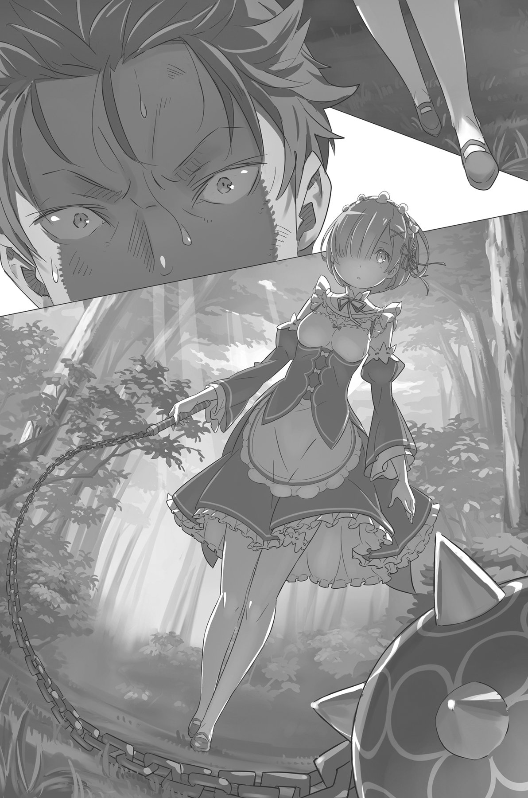

## 1

«Выходит, в первый раз я умер из-за неизвестно откуда взявшегося физического истощения», — сделал вывод Субару, перебирая в памяти события четвёртого дня.

Невыносимая сонливость и озноб, атаковавшие его, пока он ожидал рассвет, напрочь лишили его физических сил, причём за считанные минуты. Если подобный приступ случится во время сна, вряд ли беззащитной жертве удастся пробудиться.

«Но кто же тогда гремел цепями?»

Он вспомнил громкое бряцанье, словно издаваемое длинной металлической цепью. Возможно, она была частью оружия, с помощью которого некто лишил Субару руки? От одного воспоминания об этом плечо заныло тягучей, саднящей болью. Несмотря на то, что сейчас рука была невредима, организм отреагировал необычайно остро.

«Значит, на меня кто-то напал. И этот кто-то, скорее всего, имеет отношение и к моей слабости, и к бряцанью цепей».

Всё указывало на то, что в ночь на пятые сутки некто проник в особняк Розвааля, и Субару оказался в числе несчастных жертв злоумышленника. Пострадал ли ещё кто-то, оставалось неизвестным.

«Если он убил меня, то жертвой мог стать и любой другой. Скорее всего, это как-то связано с Эмилией как претенденткой на престол. Как тогда на воровском складе… Но я не в силах ни доказать это, ни предотвратить».

Беда была в том, что никаких улик Субару предоставить не мог. Даже если он и добьётся от Розвааля, чтобы тот принял необходимые меры предосторожности, убийца может изменить планы, и вся подготовка ничего не даст.

Как вариант, Субару мог попытаться сам отразить нападение убийцы, но из-за отсутствия у него какой-либо боевой сноровки, вряд ли подобная затея могла увенчаться успехом. Всё закончится так же, как в прошлый раз: он снова отдаст богу душу, предварительно вывалявшись в собственной рвоте.

«Нечего и мечтать. Я даже не видел его в лицо и не знаю, каким оружием он пользуется. Меня прикончат, как пить дать…»

Безрассудно планировать контратаку, не зная о противнике ровным счётом ничего. Скрестив руки на груди и склонив в раздумьях голову, Субару продолжал ходить кругами вокруг Беатрис.

— Прекрати сейчас же! — не выдержала наконец Бетти и пронзила его грозным взглядом. — Ты мне до смерти надоел. Или остановишься, или вылетишь отсюда вон. Выбор за тобой.

— Ах, прости, прости, — проговорил Субару с невинным видом. — Просто когда я нарезаю круги, шестерёнки в моей голове лучше вращаются. Так что будь со мной помягче, ведь мы одной верёвочкой повязаны.

— Я что-то пропустила, мнится мне? Вижу тебя всего лишь во второй раз.

— Сказать можно всё что угодно, да вот только сердце не обманешь! Как ни крути, но ты впустила меня к себе.

— Ты сам сода вторгся, разгадав тайну Блуждающей двери, мнится мне! Просто поверить не могу!

Беатрис даже не пыталась скрыть свою неприязнь к Субару. Иными словами, вела себя так, словно и не было никакого перемещения во времени — в отличие от Рам и Рем, напрочь позабывших о своём ученике. Именно поэтому сразу после пробуждения Субару направился на поиски запретной библиотеки. Иного места, где можно спокойно разобраться в происходящем, просто не было.

— Успокойся, я не доставлю тебе хлопот. Просто угости меня чаем и смотри на вещи попроще.

— И не подумаю! — грозно проговорила Бетти, теребя свои букли-пружинки. — Наверное, хватит действовать на нервы, мнится мне?!

Она действительно была готова взорваться от гнева.

— Кстати, хоть по тебе и не скажешь, но думаю, ты маг. Я прав?

— Выбирай выражения. Не стоит ставить меня в один ряд с этими второсортными существами, мнится мне.

— Наверно, у тебя и друзей-то нет…

— Как можно перескакивать с одной темы на другую?!

— Просто у меня тоже нет друзей, поэтому я это сразу понял, — сообщил Субару, поглядывая на зардевшееся лицо Беатрис. — Учти, в твоём возрасте нельзя быть такой высокомерной, иначе это может плохо кончиться. Перевоспитывайся, пока не поздно.

Бетти сидела, надувшись, и молчаливо выражала свой протест. Сделав небольшую паузу, Субару откашлялся и спросил:

— Скажи, существует ли такая магия, которая способна убить человека во сне?

Как бы там ни было, вряд ли на свете есть болезнь, которая может за считанные минуты истощить человека вплоть до летального исхода, даже учитывая, что это альтернативный мир.

У Субару была и другая версия событий, согласно которой его отравили. Но в таком случае, зачем убийце понадобилось ещё и калечить его? Очевидно, эта гипотеза выглядела не слишком неправдоподобно.

Беатрис сдвинула брови и равнодушно пожала плечами:

— Существует, если хочешь знать. Колдуны — настоящие мастера накладывать такие проклятия. И это прекрасно характеризует их коварную сущность, мнится мне.

Беатрис сделала паузу, позволив Субару переварить полученную информацию, а затем, подняв вверх указательный палец, продолжила:

— Колдуны обитают на севере, в стране Густеко, и специализируются на магии проклятий. Впрочем, они слывут самыми бесполезными из тех, кто работает с маной, так как не способны найти своим талантам иного применения.

— Как же можно называть их бесполезными, если они в состоянии убивать с помощью проклятий?

— Так они ничего больше и не умеют. Проклятия накладываются лишь с одной целью — навредить другим. То, как они используют ману, заслуживает лишь презрение, мнится мне.

Судя по тому, с каким отвращением Беатрис отзывалась о колдунах, магия проклятий в этом мире не была в почёте. Впрочем, Субару и не думал за них заступаться. Ему просто нужно было разузнать как можно больше.

— Получается, чтобы убить человека во сне, можно использовать проклятие?

— Думаю, можно. Но есть методы и полегче, мнится мне.

— Полегче?

— Один из них тебе уже пришлось испытать на себе, — с ехидцей в голосе ответила Беатрис и, подняв руку, прижала ладонь к груди Субару. Её губы растянулись в зловещей ухмылке, и юноша понял, что она имеет в виду.

— То есть… ты хочешь сказать, что, высосав из человека всю ману, его можно убить?

— По сути, мана — это жизненная сила, мнится мне. Если бы я в тот раз не остановилась, ты бы умер от истощения. Как видишь, этот способ проще и гораздо надёжнее.

— Получается, тогда, в самый первый… то есть сегодня ночью ты могла меня убить?

— Как я уже говорила, перешагивать через твой труп не доставит мне никакой радости. Поэтому я не стала доводить дело до конца.

— Перестань говорить обо мне, как о каком-то животном!.. Кстати, а это правда не ты меня убила?

— Если бы убила, тогда не вела бы сейчас с тобой этот бессмысленный разговор. К сожалению, я очень занята и было бы жалко тратить на тебя своё время, мнится мне.

Шурша подолом роскошного платья, Бетти подошла к стеллажу потянулась за книгой, стоявшей немногим выше того уровня, куда могла дотянуться её рука.

— Тебе эта нужна? — спросил Субару, подойдя к книжным полкам.

— Та, что рядом!.. Ну, подай же мне её, в конце концов!

— Да ладно, держи! — Субару взял с полки довольно увесистый том и передал Беатрис.

Получив желаемую книгу, Бетти даже не сказала спасибо и с надутым видом удалилась в дальний угол комнаты, где уселась на свою стремянку.

— А о чём эта книга? — поинтересовался Субару.

— О том, как избавить дом от вредных насекомых.

— У тебя в библиотеке завёлся жучок? Вот беда! И как он выглядит?

— У него огромные чёрные глаза и язык без костей. И ещё он слишком высокого о себе мнения, мнится мне.

— Довольно примечательный жучок… — Субару поглядел кругом в надежде заметить непрошеного гостя, чтобы помочь Бетти избавиться от него.

— У тебя что-то ещё? — спросила Бетти, не отрывая глаз от книги. — Если нет, я бы предпочла побыть в одиночестве.

— Гм… — Субару почесал затылок. — А, вот! Насчёт высасывания маны. Скажи, на это способен кто угодно?

— В высшей степени глупый вопрос, мнится мне. Из всех, кто живёт в особняке, только я и Пакки способны на такое. Даже Розваалю это не под силу, мнится мне.

— Даже так?! А он называл себя всесильным…

Неужели Розвааль просто бахвалился? Или высасывание маны — очень редкое умение, несмотря на кажущуюся простоту?

— Ну, ты только не больно-то увлекайся этим, хорошо? Особенно со мной. У меня сейчас жуткая нехватка крови — враз могу помереть!

— Ах да, потроха-то все восстановлены, а вот кровь к тебе не вернулась, мнится мне, — Бетти пожала плечами и добавила: — Ну, я не была обязана её возвращать.

Субару нахмурился: в словах Бетти всплыл довольно подозрительный факт.

— Говоришь так, будто это ты залечила мои раны. Тебе не кажется, что присваивать заслуги Эмилии нехорошо?

— Эта молоденькая глупышка пока не умеет исцелять смертельные раны. Они с Пакки просто остановили кровотечение, а лечением занималась я. Тебе что-то не нравится, мнится мне?

— Чёрт, как всё запутано!

Подробности исцеления теперь предстали перед Субару в неожиданном свете. До сих пор он был твёрдо уверен, что его раны залечила Эмилия — так же, как она сделала это в том злосчастном переулке. Раздираемый сомнениями, он с подозрением посмотрел на Беатрис, однако на её желчном личике не дрогнул ни один мускул. Похоже, девчонка говорила правду. Или же искусно лгала.

— Врёшь и даже не краснеешь, — пожурил её Субару. — Ведь врёшь же! А врать нехорошо!

— Так же нехорошо, как и быть неблагодарным тому, кто тебя спас! — гневно воскликнула Беатрис.

Диалог угрожал закончиться крупной ссорой. Впрочем, до потасовки дело не дошло: применив свою волшебную силу, Беатрис в мгновение ока отшвырнула обидчика назад. Врезавшись в стену, Субару грохнулся на пол вверх тормашками.

— Тебе пора уходить, мнится мне, — Бетти уже стояла напротив поверженного противника и поглаживала свои букли. — Твои руки уже не дрожат, так что хотя бы от страха ты избавился.

— Как ты узнала?

— Ты же пытался его скрыть, мнится мне? Надеяться, что со мной пройдёт такой трюк, — совершенно возмутительно! — скучающе-раздражённо проговорила Бетти помахала рукой, точно прогоняя надоедливую муху.

Субару поднёс ладонь к лицу — пальцы больше не дрожали. Он прошёл уже пять смертей, и всё же привыкнуть к такому было невозможно. Как раз наоборот: чем больше он умирал, тем сильнее тряслись его руки при одной лишь мысли о том ужасе, которой придётся испытать снова. И вряд ли кто-нибудь посмел бы осудить его за это.

— Похоже, оправдываться уже поздно. И всё-таки могла бы отнестись ко мне поласковей! — вздохнул напоследок Субару и, поднявшись на ноги, взялся за ручку двери. — Извини, если что. Я твой должник.

— В следующий раз я заберу у тебя всю ману до последней капли. Так что лучше забудь дорогу сюда, мнится мне, — холодно отозвалась Беатрис, не поднимая глаз от книги.

Субару повернул ручку и отворил Блуждающую дверь.

— Кстати, когда ты говорила о вредных насекомых, это ты меня имела в виду?

— Да когда же ты уберёшься?! Хочешь, чтобы я тебя вышвырнула, мнится мне?! — в сердцах закричала Бетти, и в следующий миг невидимая сила выкинула надоедливого гостя из комнаты и захлопнула за ним дверь.

## 2

— Кхм, могу я узнать, всё ли у тебя хорошо? — спросила Эмилия, склонившись над Субару.

— Эмилия-тан, твоя доброта исцеляет любые раны! Это чистая правда! — вылетев из окна террасы второго этажа, юноша приземлился прямо посреди цветочной клумбы. — Я всё больше склоняюсь к мысли, что меня убила именно эта злобная лолька.

— Кстати, только вчера Рем удобряла клумбу навозом, так что…

— Что-о-о?! Правило трёх секунд!!! — заверещал Субару и, вскочив с клумбы, на которой, к слову сказать, пролежал не менее тридцати секунд, принялся яростно отряхиваться от грязи и других пахучих субстанций. — Так не считается! Ты же сама сказала, это было вчера, так что никакого навоза там уже нет, правда ведь?!

— Не волнуйся! — засмеялась Эмилия. — Говорят, что это к счастью!

— Даже Эмилия переключилась в режим утешения! — жалобно простонал Субару, чем вызвал у девушки новый приступ смеха.

Затем Эмилия дотронулась до висящего у неё на шее зелёного кристалла.

— Пак, пора вставать! — позвала она, и кристалл начал слабо светиться. Спустя несколько секунд на ладони девушки материализовалась фигурка кота.

Пак зевнул и всласть потянулся, выгибая спину дугой:

— Доброе утро, Лия. О, Субару уже проснулся.

— Доброе утро, Пак! Извини, что вот так сразу прошу, не поможешь ли ты Субару умыться?

Взглянув на Субару, перепачканного грязью с ног до головы, Пак кивнул:

— Нет проблем! Устроим для него небольшой душ!

Из лапок Пака ударил голубоватый луч света. В следующее мгновение луч превратился в мощную струю и закружил Субару в сумасшедшем водяном вихре.

— У тебя там что, водяная пушка?!

— Ой, кажется, надо подрегулировать поток, — с этими словами Пак направил струю под другим углом, заставляя беспомощное тело Субару вращаться то в одну, то в другую сторону.

— Ну вот, теперь ты чистенький! Здорово же! — весело произнёс Пак, когда банные процедуры закончились.

Субару лежал на траве, пытаясь прийти в себя.

— Я думал, ты решил меня утопить… — утерев лицо мокрым рукавом, Субару кое-как поднялся на ноги и, шатаясь, взялся за голову. — Ох… и разве вы не преступники после всего этого?

— Уж не знаю, в каком преступлении ты меня подозреваешь, но мне грустно слышать подобное… — печально проговорил Пак, паря в воздухе.

В ответ на это Субару вытянул руку и дал пушистому лёгкий щелбан.

— Рмяу! — недовольно фыркнул кот, но Субару уже погрузился в собственные мысли: на сей раз его возвращение выглядело не очень-то удачно. По идее, Эмилия должна была устроить драматическую слёзную сцену при виде воскресшего Субару, а вместо этого… Он вдруг заметил, что Эмилия еле сдерживает рвущийся наружу смех.

— А-ха-ха-ха! Простите! Ха-ха-ха-ха! Не могу больше!.. Что вы делаете? Сейчас живот надорву со смеху!..

Беспокойство Субару моментально улетучилось. Показывая пальцем на мокрого, как мышь, Субару, Эмилия самозабвенно смеялась. Юноша и кот переглянулись.

— Кажется, я реабилитировался в её глазах. Благодарю вас за помощь, папаша!

— Ты кого это папашей называешь? Я так просто не отдам тебе свою дочь! — шутливо ответил Пак, выпятив грудь.

Звонкий смех Эмилии разлился по всему саду.

## 3

— Кажется, Рам и Рем собирались зайти в сад, но что-то до сих пор их нет… — заметила Эмилия.

Вдоволь насмеявшись, она сидела на садовом газоне и утирала платком слёзы. Субару играл с Паком, расположившись напротив.

— А ты, значит, специально меня дожидалась?

— Вовсе нет… Конечно, я должна была поблагодарить тебя, и мне не хотелось с тобой разминуться, но то, что я осталась в саду, — чистая случайность.

— Да, Субару, чистая случайность, — подразнил хозяйку Пак. — Она отвлекает меня от дел по самым разным причинам, ведёт эти бесконечные утомительные беседы с низшими духами… Это тоже всё чистая случайность.

— Пак, ну хватит!

— Эх, Лия, ты такая кокетка! Хотя иногда именно это мне в тебе и нравится. А тебе, Субару?

— Ещё бы! — подхватил юноша. — В Эмилии-тан мне нравится абсолютно всё! Она для меня как путеводная звезда на ночном небе!

— Субару, не подыгрывай ему! К тому же что это ещё за «тан»? Что оно означает?

Субару ждал этого вопроса.

— Это что-то вроде прозвища, — сказал он, потирая подбородок. —Когда хочешь выразить симпатию к близким тебе людям.

— Что-то я не помню, чтобы мы с тобой стали близкими людьми.

— Твои слова ранят меня в самое сердце. Но я не сдамся! Считай это началом наших будущих близких отношений! Я хочу сказать, мне хотелось бы стать более близким, чтобы называть тебя Эмилия-тан. Окей?

Эмилия слегка растерялась от столь энергичного напора, и на её щеках выступил нежный румянец.

— Ну хорошо… Я согласна. Нет, не смотри на меня так!

— Что? Я думал, мне дадут от ворот поворот, но, кажется, сработало!.. Комментатор Пак, что вы думаете по этому поводу?

— Просто у моей девочки не так много друзей, — ответил кот, сидя на плече у Эмилии и поглаживая свои усы, — поэтому подобные прозвища ей в диковинку. Её легко вогнать в краску…

— Не может быть! Моей прекрасной даме так легко угодить?! — Субару готовился к тому, что завоевание Эмилии будет подобно восхождению на крутую гору. — Вот только по своему статусу она находится несравнимо выше… Я должен разобраться во всей этой аристократической иерархии.

— Хм… А можно мы не будем затрагивать эту не очень приятную для меня тему? — попросила Эмилия.

— Как скажешь. Но тогда я буду называть тебя Э-Н-Б — «Эмилия Настоящая Богиня»! О? — Субару повернулся к дому и прищурился. Проследив за его взглядом, Эмилия заметила служанок-близнецов, выходящих из дверей особняка.

— Это Рам и Рем, — сообщила она. — Кажется, для завтрака рановато…

Любуясь тем, как солнце играет в её серебристых волосах, Субару мысленно отметил, что события развиваются по привычному сценарию. Как раз в это время Розвааль должен был вернуться домой.

Подойдя ближе, служанки синхронно поклонились и сообщили:

— Вернулся хозяин, господин Розвааль. Хозяин просит всех в дом.

Затем они оглядели Субару с ног до головы и переглянулись:

— Сестрица, сестрица. Прошло всего ничего, а наш гость уже мокрый как мышь.

— Рем, Рем. Прошло всего ничего, а наш гость уже успел превратиться в грязного оборванца.

— Я и без вас знаю, что выгляжу чёрт-те как! — огрызнулся Субару. — Куда подевали мою куртку и штаны, а?

Предстояло переодеться, привести себя в порядок и снова встретиться с Розваалем. Только на этот раз Субару решил пойти иным путём.

## 4

Так начался третий круг жизни Субару в доме Розвааля.

На этот раз юноша решил уделить особое внимание сбору информации.

— Ключевые слова — магия и цепи — пока ни о чём мне не говорят…

Единственное, что не вызывало сомнений, — в ночь на пятые сутки кто-то вторгнется в дом Розвааля. И даже если он поведает об этом обитателям особняка, никто не воспримет его слова всерьёз, потому что доказательства отсутствуют. Более того, в связях с убийцей могут заподозрить его самого. Если бы Субару знал хотя бы приметы нападавшего, всё было бы проще.

— Именно поэтому я должен сосредоточиться на сборе разведданных. Если условия Посмертного возвращения не изменились…

Тогда у него в запасе имелась ещё одна жизнь. Требовалось лишь собрать информацию сделать из неё правильные выводы.

— Честно говоря, снова умирать мне совсем не хочется.

Однако если ты ограничен в средствах, придётся идти на жертвы. Субару решил, что выберется из этого порочного круга во что бы то ни стало.

— Поэтому я намекнул Паку, чтобы он присмотрел за Эмилией. Раз пушистик умеет читать чужие мысли, он наверняка понял, что я не шучу, и отнесётся к моей просьбе со всей серьёзностью.

По крайней мере, теперь Эмилия находилась в относительной безопасности. Целиком проблему это не решало, но принесло некоторое облегчение.

— Остаются Розвааль и Беатрис… Как же мне поступить с ними?

Субару устало потянулся и бросил гусиное перо на письменный стол. От множества вопросов голова шла кругом. Тем не менее следовало сделать всё возможное. Конечно, Субару хотелось, чтобы Рам, Рем и, разумеется, Розвааль с Беатрис благополучно пережили четвёртую ночь. У него были причины на то, чтобы не отступать, сколь бы трудной ни выглядела задача.

— Простите за вторжение, дорогой гость, — послышалось вдруг за дверью, и прежде чем Субару успел ответить, она отворилась, на пороге возникла розоволосая служанка — Рам.

В руках у неё был поднос с чайником и чашками. Увидев, что Субару сидит за столом, она удивлённо подняла брови:

— Смотрю, вы и правда учитесь.

— А постучать нельзя было? — отозвался юноша. — Я как-никак гость в этом доме.

— Вы лишь нахлебник, который зовёт себя гостем. Вот как я это вижу, — сказала Рам и уверенным шагом направилась к столу.

Наблюдая краем глаза, как она наливает в чашку чай, Субару не мог скрыть горькой усмешки.

«Надо же — нахлебник! А что, очень подходящее определение».

— Прошу, дорогой гость.

— О, спасибо! — Субару взял чашку и взглянул на её содержимое. Это была жидкость янтарного цвета, от которой поднималась струйка пара. Чай в этом мире оказался похож на обычный чёрный чай: как по цвету и вкусу, так и по насыщенному аромату.

Субару показалось странным, что Рам, выказывая столь холодное отношение, всё-таки угощает его чаем. Следя за отточенными движениями девушки, он отпил немного из чашки кивнул:

— Да уж, гадость и есть гадость!

— Здесь, в особняке, подают чай самых лучших сортов, так что советую вам высказываться поаккуратней.

— Если чай невкусный, я так и говорю. На вкус — трава.

Бросив на Субару неодобрительный взгляд, Рам взяла свою чашку, безо всякого стеснения уселась на кровать и принялась болтать ногами.

— Бездельничаешь на глазах у гостя? Храбрости тебе не занимать!

— Кажется, именно вы просили обходиться без лишних церемоний. Я просто стараюсь удовлетворить эти пожелания. Вам следовало бы сказать спасибо.

— Наглости, кстати, тоже, — съязвил Субару и откинулся на спинку стула, стараясь извлечь из него как можно более громкий скрип.

Продолжая прихлёбывать чай, Рам искоса поглядела на Субару:

— Итак, вы через два дня покидаете нас. Как идёт подготовка к отъезду?

Прямолинейность, с которой был задан этот вопрос, вызвала у Субару усмешку. С начала третьего круга прошло уже два дня, но на этот раз его положение в особняке резко отличалось от прежнего: теперь он был полноправным гостем, так как именно такое желание озвучил во время первого завтрака. В распоряжение Субару отвели комнату для гостей, и пока Рам и Рем ему прислуживали, он продолжал изучать местную письменность.

Всё это было придумано для того, чтобы иметь возможность временно покидать поместье, не привлекая к себе внимания.

Пока Субару раздумывал, как следует действовать дальше, пальцы машинально выводили строчку за строчкой простейшие символы местного. Однако в голову не приходило ничего толкового.

— У вас всегда такой глупый вид или только во время занятий?

— Тебя разве не вдохновляет то, с каким рвением я грызу гранит вашей языковой науки?

— Судя по каракулям, это не очень-то вам удаётся.

— Ни разу не встречал служанок, которые разговаривали бы с гостями в таком тоне.

Пропустив колкость мимо ушей, Рам взяла рабочую тетрадь Субару и со скучающим видом стала листать исписанные страницы. Служанка вела себя так, словно была не прочь сократить дистанцию. Наблюдая её неподвижный профиль, Субару не мог отделаться от ощущения, что за поведением девушки скрывается какая-то тайна.

В этой жизни Субару и Рам практически не виделись. За исключением тех случаев, когда он искал встречи с Эмилией, Субару, как правило, сидел в комнате, зубря алфавит и лишь иногда отвлекаясь на то, чтобы как следует поддразнить Беатрис. Поэтому дистанция между ним и близнецами на этот раз была куда больше, чем в его бытность слугой.

Несмотря на это, Рам заходила к нему на досуге и вела непринуждённые беседы, что не могло не удивлять.

— Дорогой гость, перестаньте бросать на меня похотливые взгляды. Не то ударю.

— Подобные фантазии я посвящаю лишь одной даме, и это не ты, а Эмилия! Вот так.

Пытаясь скрыть чувство неловкости, Субару отвёл глаза. Взгляд его упал на книгу в коричневом переплёте. Это был сборник сказок, по которому он учился читать на местном языке.

— Думаю, скоро я буду читать довольно бегло.

— В этой книге собраны сказки, не знать которые просто стыдно. Чтобы начать бегло читать, вам следует овладеть простейшими символами ряда «и»,

— А я сейчас чем, по-твоему, занимаюсь?

Оставив реплику Субару без ответа, Рам подошла к столу, взяла чашку Субару и выпила остатки чая.

— Эй, а почему без разрешения?

— Вы же сами говорили, что он невкусный. Чаем должен наслаждаться тот, кто знает в нём толк.

— Я просто сказал, что по вкусу он напоминает траву! А, ладно, не важно. Мне нужно учиться, так что можешь идти по своим делам, но если хочешь, оставайся.

Субару небрежно махнул рукой и, откинувшись на спинку стула, открыл книгу. На первых страницах значилось имя автора и содержание. Далее текст следовал знакомому шаблону.

— Так, значит… Давным-давно…

«В каком бы мире ты ни оказался, у сказок везде одинаковое начало», — со странным чувством подумал Субару и продолжил чтение. Тексты выглядели крайне лаконично, а сюжет был построен по известным правилам: завязка, развитие действия, кульминация и развязка. Поскольку сказки предназначались детям, в них было много простора для фантазии.

— Здесь масса поучительных историй! Есть даже сказка, напоминающая предание о красном демоне.

Сказка о плачущем красном демоне была у Субару самой любимой. Впрочем, если бы его спросили, какая нелюбимая, он бы назвал её же.

— Ненавижу истории с плохим концом! Вот бы все приключения заканчивались хэппи-эндом…

— Извините, что прерываю глубокомысленные рассуждения, вы уже закончили чтение?

— Закончил. Мораль немного отличается от той, что в сказках, которые знаю я, но мне понравилось! Вот это я называю культурным обменом. Может быть, я тоже когда-нибудь издам здесь сборник сказок моей родины. Например, «Плач красного демона». Только как быть с авторскими правами?

— «Плач красного демона»? — повторила Рам. Её ресницы вдруг задрожали.

— На моей родине есть сказка с та ким названием, — пояснил Субару. — Если хочешь, расскажу.

Рам промолчала. По-прежнему сидя на кровати и положив руки на колено, она лишь выразительно посмотрела на Субару, ожидая продолжения.

— Тогда попрошу внимания! — объявил Субару. — «Плач красного демона». Давным-давно жили-были…

Вкратце история звучала так. Жили-были высоко в горах два друга — красный и синий демоны. Красный хотел подружиться с людьми из деревни, но те и приблизиться к нему боялись. И тогда синий демон предложил другу хитроумный план: синий демон устраивает в деревне погром, а красный приходит на выручку местным жителям.

План сработал, и красный демон подружился с людьми. Спустя некоторое время синий демон исчез, оставив другу записку, в которой написал, что вынужден уйти, так как теперь нельзя, чтобы их видели вместе.

— Красный демон снова и снова перечитывал записку друга, и по его щекам текли слёзы… Конец.

Когда Субару закончил свой рассказ, Рам сидела неподвижно, опустив глаза. Юноша молча ждал, когда она хоть что-нибудь скажет. Наконец девушка вздохнула и тихо произнесла:

— Какая грустная история…

— Да, грустная, — согласился Субару. — Но в то же время очень добрая.

— А по-моему, — возразила Рам, — все герои этой истории глупцы. И красный демон, и синий демон, и жители деревни.

— Ты прямо суровый критик. Нет, не то чтобы я с тобой спорил…

Действующие лица этой истории и правда выглядели не очень разумными. Жителей деревни ещё можно понять — их-то просто обвели вокруг пальца. Однако друзья-демоны всё же должны были поговорить друг с другом и найти какой-то компромисс. По крайней мере, тогда бы им не пришлось разлучаться навсегда.

— Поэтому мне одновременно нравится и не нравится эта история, — сказал Субару. — Самопожертвование синего демона выглядит очень трогательно, по вместе с тем и глупо: ведь он ничего не получил взамен. Лично я за то, чтобы всякий труд вознаграждался.

— Так вот что вы думаете о синем демоне, — проговорила Рам. — А я считаю, что красный демон поступил неправильно.

Услышав её слова, Субару поднял голову. По-прежнему глядя в одну точку и слегка прикусив губу, Рам проговорила:

— Красный демон получил то, что хотел, ничего при этом не потеряв. А синий потерял всё. Думаю, что это просто ужасно.

— Тогда как же они, по-твоему, должны были поступить?

Немного помолчав, Рам ответила:

— Если красный демон действительно так хотел подружиться с людьми, он должен был сам пойти в деревню, даже если для этого ему пришлось бы отломать свои рога. Но он не должен был дожидаться, пока синему демону станет жалко своего друга.

— Довольно жёсткая точка зрения, знаешь ли.

— Разве? — невозмутимо сказала Рам и, теребя пальцами ленту в своих волосах, продолжила: — То, что красный демон получил, что хотел, за счёт синего демона, непростительно. За свои желания нужно платить самому, даже если это принесёт боль. И синий демон здесь тоже не прав: он лишил красного возможности разобраться с проблемами самостоятельно.

— Ты к ним слишком строга. Может быть, ты питаешь неприязнь к демонам?

— А вы бы с каким из демонов захотели подружиться? — последовал неожиданный встречный вопрос.

— Подружиться?.. — Субару растерянно заморгал. Он никогда не думал об этом.

Рам кивнула и вытянула перед собой руки, выставив вверх указательные пальцы.

— Выбирайте, — промолвила она. — Либо красный демон, который только и делает, что полагается на других, не желая отвечать за последствия, либо синий демон — глупец, доходящий до крайности в своём самопожертвовании.

— Да уж, варианты не самые удачные… — пробормотал Субару. — Ну, если предположить, что я житель деревни, который недавно в неё приехал…

Он раньше не задумывался над этой историей так глубоко, и смотреть с точки зрения жителя деревни было необычно.

Нерешительно глядя на вытянутые руки, Субару наконец обхватил ладонями оба пальца.

— Неинтересный ответ, — вздохнула Рам.

— Брось! Я же знаю эту историю, читал её не один раз. Так что, по-моему, вполне по-человечески выбрать обоих! Разве плохо, что красный демон захотел подружиться с людьми? И что предосудительного в том, что синий решил помочь ему? На мой взгляд, оба демона — не такие уж плохие ребята, — сказал Субару и улыбнулся.

В ответ Рам печально вздохнула, глядя на свои руки, и высвободила пальцы. Субару пожал плечами и снова уселся на стул.

— Кажется, Рам, история тебе всё-таки понравилась.

— Дорогой гость, если вы хотите всего и сразу, это говорит о нерешительности и непостоянстве. Когда-нибудь вы пожалеете об этом.

— Подожди-ка, давай без поспешных выводов! — запротестовал Субару. — Насколько я помню, речь шла о демонах, а не обо мне!

Однако Рам не обратила на его протест никакого внимания.

— Давайте отложим сказки вашей родины, — сказала она как ни в чём не бывало и кивнула в сторону книги, лежащей на столе: — Какая-нибудь из этих сказок вам понравилась?

— Ну, пара историй мне точно запали в душу, — проговорил Субару, перелистывая страницы. — Одна в середине книжки, про дракона, и вторая в конце — про ведьму. Почему-то они здорово отличаются от остальных. Рассказ про ведьму мне показался очень странным. Такое ощущение, что его внесли в сборник только для галочки, по необходимости. Никакого сюжета, больше напоминает краткий скомканный пересказ.

— С историями о ведьмах всегда так. Что касается рассказа о драконе, неудивительно, что он выделяется среди прочих. Как-никак мы находимся в королевстве Лугуника.

— «Драконье королевство Лугуника», верно? Теперь ясно, откуда такое название.

Страна, занимавшая на картах восточную часть этого мира, действительно, официально называлась Драконье королевство Лугуника. И на то была причина.

Впрочем, объяснялось всё довольно просто: Лугуника издавна находилась под защитой дракона, с которым было заключено соответствующее соглашение.

— И если в стране случалось какое-то бедствие, будь то голод, эпидемия или война с соседями, Дракон помогал гражданам справиться с напастью, — объяснила Рам.

— Тогда ваше уважение к нему вполне понятно. Кстати, в книге написано, что соглашение с драконом заключила королевская семья. Выходит, это совсем не сказка, а, скорее, былина.

— Да, это действительно так. Наша страна до сих пор находится под защитой благородного Дракона, который следит за ней из-за Великих Каскадов. И будет следить, пока соглашение в силе.

Субару показалось, что Рам говорила об этом с неподдельным благоговением.

«Значит, соглашение с драконом заключили в глубокой древности, — рассуждал про себя Субару. — О содержании договора история умалчивает, но, судя по всему, он спас Лугунику от многих напастей».

И тут Субару осенило. Если соглашение с драконом заключила королевская семья, тогда выходит…

— Постой! А разве династия, заключившая соглашение, как раз не прервалась?

— Верно. Причём скоропостижно.

— Разве это не ужасно? То есть, я не знаю, может, вы и не считаете, что это так уж плохо…

Скорее всего, за ревностную защиту страны дракону была обещана соответствующая награда. Но если королевская династия прекратила существование, на ком же повисло долговое бремя?

— В книге ничего не говорится о том, что Дракон потребовал взамен. И одному богу известно, — Рам запнулась на мгновение. — То есть одному лишь Дракону известно, как он поступит в нынешнем положении.

Несмотря на то, что в комнате было совсем не жарко, на лбу Субару выступили капельки пота. Хорошенько прожевав, проглотив и, наконец, усвоив сказанное Рам, юноша судорожно выдохнул. Проводить переговоры с таким могущественным существом, как дракон, должен будет глава государства. То есть…

— Представляю, какой груз ляжет на плечи Эмилии… — сказал он задумчиво.

— Да, на монархе будет большая ответственность, ведь Дракон может не только защитить, но и разрушить страну до основания.

Субару вспомнил, как изменилась в лице Эмилия, увидев на его столе книгу сказок. Теперь он понял, почему она, листая страницы, вдруг резко остановилась и захлопнула книгу.

Ноша, которую Эмилии предстояло взвалить на свои хрупкие плечи, была столь огромной, что одна мысль об этом повергла Субару в ужас.

— Ничего не поделаешь, — проговорила вдруг Рам.

— Что? — не понял Субару.

— Каждый с рождения наделён неповторимыми качествами, которые подразумевают особую ответственность. Таланты госпожи Эмилии уникальны. Поэтому она должна следовать своему пути, каким бы трудным он ни оказался.

— Не слишком ли тяжкое бремя для такой хрупкой девушки? — голос Субару задрожал от неизвестно откуда взявшегося гнева.

— Конечно, было бы легче, если бы ответственность она разделила с кем-то ещё. Однако рано или поздно госпоже Эмилии придётся взбираться на эту вершину самостоятельно.

Голос Рам звучал спокойно, без тени эмоций, и Субару осталось лишь пожать плечами, хотя его раздирало желание высказать всё, что он думает. Но это было бы неправильно, ведь Рам никак не влияла на ситуацию. Кроме того, уж он-то и вовсе не имел никакого права сердиться, и этот факт чрезвычайно раздражал Субару.

— Кстати, Рамчи, по поводу другой сказки…

История, о которой вспомнил Субару, называлась «Ведьма Зависти». В отличие от рассказа про дракона, занимавшего центральное место во всём сборнике, эта сказка была напечатана в самом конце книги и умещалась на паре страниц.

— Я имею в виду историю о ведьме…

— Мне не хочется о ней говорить, — отрезала Рам.

Это было так неожиданно, что Субару непроизвольно вздрогнул. Тем временем Рам собрала чашки на поднос и поднялась:

— Мне пора. Надо помочь Рем. Дорогой гость, я позову вас на ужин.

Не дав Субару и рта раскрыть, Рам резко повернулась на каблуках и поспешно зашагала к выходу. Дойдя до двери, она вдруг обернулась и сказала:

— По поводу той сказки про демонов… Не рассказывайте её Рем. Ей не понравится.

Субару молча кивнул. Рам закрыла за собой дверь, и юноша, чувствуя себя как выжатый лимон, повалился на кровать.

Просьба Рам прозвучала весьма странно, за ней определённо что-то скрывалось.

— Что же, чёрт возьми, всё это значит? — задумчиво произнёс он, глядя в потолок.

Субару снова взял книгу и перелистал все страницы от начала до конца, пока не дошёл до последней сказки.

— «Страшная ведьма, жуткая ведьма, — зачитал Субару вслух. — Одно лишь её имя вселяет ужас. Все зовут её Ведьмой Зависти…»

Какой-либо сюжет отсутствовал. Строчка за строчкой автор рассказывал, сколь устрашающей была героиня повествования. Читать этот текст было откровенно скучно.

— И зачем кому-то понадобилось включать это в сборник? — пробурчал Субару. Научившись читать местный алфавит, он испытывал радость и чувство удовлетворения, однако рассказ о ведьме свёл его восторг на нет.

Юноша перевернулся па другой бок и задумался о том, что до конца этого круга жизни в особняке оставалось всего два дня. Завтрашний день он планировал потратить на подготовку, а на следующее утро приступать к решительным действиям.

Перебирая в голове беспокойные мысли, Субару не заметил, как наконец заснул.

## 5

— Ну, мне пора идти. Спасибо вам за всё! — сказал Субару, когда обитатели дома собрались в вестибюле, чтобы проводить гостя. Отсутствовала только Беатрис.

Трёхдневный срок пребывания в особняке подошёл к концу, и с восходом солнца нужно было отправляться в путь. Субару был одет в спортивный костюм, а в руках держал всё тот же пакет из круглосуточного магазина, в котором лежали остатки стартового инвентаря. Сзади висела любезно предложенная Розваалем заплечная сумка — довольно тяжёлая из-за приличной денежной суммы, которую граф вручил гостю «в благодарность за помощь госпоже Эмилии».

— Субару, может быть, всё-таки вызвать королевский экипаж? — на лице Эмилии было написано крайнее беспокойство. — Они бы довезли тебя до города.

— Да всё будет хорошо! — заверил её Субару, весьма польщённый заботой Эмилии. — Однажды, когда я стану достойным тебя — сильным, умным и богатым, я вернусь за тобой, Эмилия-тан, на белом коне! — и Субару стукнул себя кулаком в грудь.

— А платок не забыл? — не унималась Эмилия. — А воду? Лагмит тоже взял? Так, что же ещё? Тебе не страшно будет спать одному?

— Эмилия, перестань вести себя, как моя мама! — не выдержал Субару, хотя её тревога была понятна: похоже, девушка на уровне инстинкта чувствовала то беспокойство, которое Субару пытался скрыть глубоко в душе.

— Ну что-о-ож, Субару, счастливого пути! — сказал Розвааль, протягивая руку для пожатия. — Было приятно с тобой познакомиться. И не потеряй мой подарок! Это тебе за три незабываемых дня в моём доме.

Розвааль хитро подмигнул, Субару, догадываясь, что тот имеет в виду, встряхнул заплечную сумку, и монеты звонко брякнули.

— Награда за молчание? — улыбнулся юноша. — Попятно! Не волнуйтесь, буду держать рот на замке, Клянусь Драконом!

— Это обезопасит тебя от коварных личностей, которые попытаются выудить из тебя государственные тайны, — ответил Розвааль. — К тому же клятва именем Дракона является в нашей стране наивысшей клятвой, какую только можно принести. Ни в коем случае не забывай о том.

— Есть! — выкрикнул Субару и, встав по стойке смирно, отдал честь. Затем он повернулся к неподвижно стоящим служанкам и мягко похлопал их по плечам. — Вам я тоже очень обязан. Особенно тебе, Ремчи. Спасибо за отменную еду! Ну, а ты, Рамчи… А, вспомнил! Ты отлично драишь туалеты, верно?

— Сестрица, сестрица! Наш гость совершенно не умеет делать комплименты.

— Рем, Рем! Наш гость безнадёжен, когда пытается похвалить кого-то.

— Да хватит вам! Мне просто ничего лучше в голову не пришло! И всё равно спасибо.

Распрощавшись со всеми, Субару открыл дверь и покинул гостеприимный дом графа Розвааля. Миновав сад, он вышел через железные ворота и продолжил свой путь по прямой, как стрела, лесной тропе, ведущей в деревню Аурам. Согласно озвученному им плану, он намеревался дойти до ближайшей дороги и поймать попутный экипаж, чтобы добраться до столицы. Однако план этот был фальшивым.

«Спасибо тебе за всё, Субару. Когда угодно можешь рассчитывать на нашу помощь», — звучали в его голове прощальные слова Эмилии. Сереброволосая красавица махала ему вслед рукой до тех пор, пока он не скрылся из виду. Это было так трогательно, что все его сомнения и тревоги улетучились в один миг, а чувство долга вновь запылало в груди ярким пламенем.

Некоторое время Субару шёл по тропе, затем остановился, настороженно огляделся и, убедившись, что поблизости никого нет, свернул с тропинки в лес, хотя Рам и другие не раз говорили, что в чаще водятся опасные звери. Несмотря на предупреждение, Субару, продираясь сквозь деревья и кустарники, шёл всё дальше вглубь горного леса, карабкался по крутым склонам, царапая о ветки руки и ноги, но не замедляя шага.

— Отлично, — выдохнул он спустя четверть часа, когда ветви деревьев над головой поредели, открывая взору голубое небо. — Я на месте.

Он стоял на невысоком холме, с которого открывался прекрасный вид на особняк Розвааля.

— Отсюда хорошо видны окна Эмилии. Если случится что-то странное, я сразу засеку.

Что происходит внутри комнаты, разглядеть было невозможно, и всё-таки, если случится переполох, с выбранной точки обзора это сразу будет заметно. А переполох случится непременно, ведь впереди четвёртая ночь.

— Остаётся только ждать и наблюдать.

В запасе было около шестнадцати часов. Хорошенько отдохнув от прежнего круга жизни, в котором он работал слугой, Субару был полон энергии и сил. Он предполагал заранее вычислить время нападения и немедленно броситься к дому графа. Таким образом, в этот раз эффект неожиданности сыграет на руку Субару.

Останься он в особняке, его снова настигла бы смертельная магия неизвестного колдуна. Субару не имел ничего, чтобы противостоять убийце, поэтому сейчас было крайне важно получить хоть малую толику информации. Вопрос оставался лишь в том, как это сделать, и ответ на него звучал крайне просто.

— Сейчас я должен выяснить, как выглядит убийца и чем он вооружён. Даже если мне придётся ради этого умереть…

Субару был убеждён, что вторжение в особняк Розвааля связано с предстоящими королевскими выборами. Вероятно, главной целью убийцы являлась Эмилия, а Субару стал случайной жертвой. Если так, погибнуть могли все, кто был хоть как-то с ней связан.

— Не знаю, сработают ли меры предосторожности, но, кажется, Розвааль начеку.

«Этот клоун не такой уж дурак, чтобы оставлять Эмилию, претендентку на престол, совершенно без защиты», — думал Субару. И то, что в особняке присутствовали только две служанки, Рам и Рем, только подтверждало данный факт.

— Честно говоря, сначала я подумал, что он просто ненормальный, если для работы в огромном доме держит всего двух человек.

Но здесь имелась определённая логика. Рам и Рем были преданы графу. Отношения между близнецами и Розваалем строились на доверии, сложившемся за долгие годы их службы. Это было видно по тому, как беззаветно предана своему господину Рам и какое уважение испытывает к нему Рем.

Розвааль окружил Эмилию людьми, которые никогда не обманут. Тот факт, что некая служанка уволилась несколько месяцев назад и замены ей не предвиделось, говорил о том, что Эмилия находится под защитой.

— Вопрос в том, насколько надёжна эта защита, ведь меня каждый раз убивали. Ну, если только меня, ещё ладно. Хотя нет, тоже не так уж и ладно.

Если план Розвааля просто не предполагал охрану Субару, случайного человека, всё было в порядке. В противном случае Эмилия также могла пострадать.

Три смерти в столице и две в особняке Розвааля приучили Субару к тому, что реальность может разрушить любые планы. Нужно быть готовым к наихудшему развитию событий.

— А худшее, что может случиться: меры предосторожности Розвааля не сработают, и Эмилия окажется убита. Естественно, погибнет и сам Розвааль, и Рам с Рем, и Беатрис… Чёрт!

От одной мысли об этом у Субару похолодело в груди. Конечно, он был готов примчаться в особняк при первых же признаках опасности, чтобы известить его обитателей о вражеской атаке.

— Хорошо, если убийца будет осторожен и при первом же моём крике бросится бежать, — пробормотал Субару с надеждой в голосе и вытащил из сумки длинную верёвку, которую позаимствовал подсобном чулане.

Одним концом верёвки он обмотал ствол ближайшего дерева, а другим крепко обвязал себя вокруг талии. Субару сделал самые сложные узлы, как если бы от них зависела его жизнь, что, собственно, полностью соответствовало действительности.

— И нож, чтобы разрезать верёвку… Если бы она знала, как я его использую, пришла бы в ярость.

Субару держал в руке тот самый нож «Падающая звезда». В этом круге жизни он оказался в его руках впервые.

— А ведь в прошлых кругах я орудовал им тысячу раз!

На кухне в обязанности Субару входило мытьё посуды и чистка овощей. «Падающая звезда» была любимым клинком Субару, которым он чистил овощи, напоминающие с виду картошку, резал аблоки и время от времени собственные пальцы. И вот сейчас, когда понадобился нож, он не задумываясь взял именно этот.

— Надеюсь, только ради того, чтобы разрезать верёвку. В худшем же случае…

Нож мог пригодиться и в другом случае. Субару решил: если на него снова навалится неодолимая слабость и сонливость, он нанесёт себе рану, острая боль от которой поможет оставаться в сознании.

Наконец, можно попытаться использовать нож против врага. Если же дела будут обстоять ещё хуже…

— Убить себя? Ха… — хмыкнул Субару. От одной мысли о самоубийстве его начала бить нервная дрожь. — А смогу ли? Как-то это страшновато…

К горлу подступил комок. Он посмотрел на своё отражение в лезвии ножа, и его губы искривила презрительная ухмылка. В памяти всплыли Рам и Рем. Первая вечно бранила его за неумелое обращение с ножом, а вторая награждала удивлёнными неодобрительными взглядами, когда он в очередной раз ранился.

— Чувствую, Рам придёт в бешенство, если узнает, как я воспользовался ножом… — он ясно представил себе гневную реакцию Рам и недоумённый взгляд Рем. — Да, старшая будет просто вне себя, это точно… Нет, не хочу я умирать… и не могу позволить умереть им.

Перед глазами юноши возникли лица тех, с кем он совсем недавно попрощался. Оставил их, бросил тех, с кем уже успел сродниться, всё ради того, чтобы подготовиться к новому кругу.

Субару прижал руку к груди. Сердце защемило так, что стало трудно дышать. Это будет ему уроком. Заслуженной расплатой за содеянное. За то, что он осмелился принести в жертву дорогих людей. Отныне он будет нести этот крест.

— Я же говорил тебе, Нацуки Субару, — обратился он сам к себе. — Даже если никто не помнит, что было в прошлой жизни, это помнишь ты!

«Вот почему на этот раз нельзя и помыслить, что всё забудется. Ни в коем случае не сдаваться! До последнего верить в победу! Ни у кого нет права думать об Эмилии и остальных обитателях особняка, как о недолговечных пузырьках в реке времени!»

Субару по-прежнему наблюдал за домом Розвааля, прячась в густой листве. Преисполнившись холодной решимости пойти на всё, даже на смерть, он сумел совладать с тревогой: дыхание стало спокойным и ровным, а тело больше не содрогалось от нервных судорог. Организм полностью подчинился его воле, и Субару, доверившись этому редкому ощущению, терпеливо ждал, когда придёт время.

## 6

Приближался вечер, и предзакатное солнце окрасило холм, на котором затаился Субару, в оранжевые тона. Зажмурившись от ярких лучей, юноша слегка потянулся, разминая затёкшие от долгого напряжения мышцы.

С тех пор как он начал наблюдение за особняком, минуло почти восемь часов, однако пока ничего не обычного не произошло. Похоже, в доме всё было спокойно.

— Кстати, я не заметил, Рем ходила в деревню, — задумчиво произнёс Субару.

Возможно, Рем не пошла за продуктами из-за ухода Субару, ведь на один рот стало меньше.

Приятные воспоминания вызвали на его губах улыбку. Он вдруг заметил, что ослабил внимание, и тут же ущипнул себя за щёку. Сейчас не время терять бдительность.

— Ждать ещё больше восьми часов, а я уже всякой ерундой занимаюсь, — пожурил он себя. — Сосредоточься, сосредоточь…

Не успел он договорить, как до его ушей донёсся слабый, едва различимый звук. Субару тотчас стремительно откатился в сторону. В следующую секунду раздался оглушительный треск ломающихся стволов. Деревья, окружавшие юношу, с грохотом рухнули на землю, подняв невообразимую какофонию.

Субару вскочил на ноги и, подбежав к краю обрыва, бросился вниз. Внутри него всё перевернулось, но спустя две секунды свободный полёт резко прервался, и юноша повис на верёвке, больно врезавшейся в тело.

— Экстренная эвакуация! — выкрикнул он и проворным движением перерезал верёвку.

Внизу обрыв оказался менее крутым, и, проскользив подошвами по склону, Субару неловко приземлился на ноги и тут же кинулся бежать.

— Видел! Я видел! — бормотал он, скидывая заплечную сумку, чтобы увеличить скорость. — Да, я видел!

Это был утыканный шипами металлический шар величиной с человеческую голову, к которому крепилась необычайно длинная цепь.

«Моргенштерн» — всплыло в голове название этого страшного орудия убийства. Звук, который он услышал, лёжа в засаде, произвело именно это оружие, немалый вес которого в сочетании с острыми шипами не оставлял сомнений — попади оно в цель, жертву просто порвёт на куски.

Теперь Субару прекрасно понимал, почему в прошлой жизни с такой лёгкостью лишился руки.

— И всё-таки… как враг узнал, что я здесь?

Субару продолжал бежать, хрустя сухими сучьями и перепрыгивая через канавы и ямы. Он понимал, что на него могут напасть. Если целью убийцы было уничтожение всех причастных, то Субару по-прежнему находился в его списке.

— Тогда убийца должен был заранее знать, что я гощу у Розвааля! Выходит, он несколько дней наблюдал за особняком и тщательно продумал план нападения.

Субару продолжал бежать как ошпаренный. Лёгкие разрывались, а ноги словно стали ватными. «Лишь бы не упасть!» — в отчаянии думал он, следуя поворотам узкой извилистой тропинки. Наконец он остановился.

— Это что же получается? — простонал Субару. — Я загнан в угол?!

Прямо перед ним возвышался утёс. Ощерившаяся острыми обломками горной породы, каменная преграда была похожа на неприступную крепость. О том, чтобы преодолеть эту стену, нечего было даже и мечтать.

Субару развернулся лицом к лесу, сделал несколько глубоких вдохов и встал наизготовку.

Начинало темнеть, и закатные лучи едва пробивались сквозь ветви деревьев. В этом оторванном от всего мира диком месте Субару вдруг почувствовал себя безнадёжно одиноким.

— Если ты здесь, выходи! — проговорил он уже более твёрдым и решительным голосом.

Сняв куртку и развернув её перед собой, Субару стал молча ждать появления противника.

Отступать некуда. Загнан в угол! Сейчас он не более чем беспомощная добыча, преследуемая по пятам хищным зверем. Но сдаваться без боя юноша не собирался. Он сделает всё, чтобы его смерть не была напрасна!

— Ну, где же ты, чёрт тебя возьми?!

Внезапно прозвучал лязг цепи, из лесного мрака стремительно вылетело нечто тяжёлое и смертельно опасное. Реакция Субару была молниеносной. Держа куртку в вытянутых руках, он поймал ею летящий металлический шар и отвёл от себя за мгновение до прямого удара в живот.

Шипастый шар вырвал куртку из рук и, увлекая за собой Субару, врезался в стену утёса. Юноша поднял глаза и, убедившись, что моргенштерн ударил мимо цели, вскочил на ноги, крепко ухватился за цепь и бросил взгляд на другой её конец, уходящий в лесную тьму.

— Ну же, покажись, ублюдок! — прокричал он, покрепче сжав нож в другой руке. — Я через многое прошёл, чтобы увидеть твою морду!

В эту минуту он не сомневался: если будет нужно, он вонзит нож противнику в горло.

Субару напряжённо вглядывался в темноту. Положение казалось безвыходным, однако он всё ещё был жив. Быть может, не стоит кончать этот круг смертью? Вдруг получится дать отпор противнику?

Субару был готов ухватиться за малейший луч надежды. Наверное, этим лучиком была Эмилия, но кроме того и сёстры-служанки, и дерзкая Бетти, и сам Розвааль. Субару, невольно позабыв о своём бедственном положении, вдруг принялся перебирать воспоминания, которые ещё недавно отложил в сторону.

Он дал обещание. Обещание, которое должен был сдержать. Поэтому…

— Ты не оставил мне выбора.

Цепь загремела, и Субару почувствовал, как ослабло её натяжение. Противник приближался. Губы задрожали, а из горла вырвался приглушённый стон. Субару слабо потряс головой, словно бы отрицая реальность.

Ступая по траве и перешагивая обломанные сучья, из темноты вышла девушка в коротком чёрном платье с передником. Её голову украшала белоснежная наколка. В руке она сжимала железную рукоять, к которой крепилась цепь с металлическим шаром. Грозное оружие никак не вязалось с её хрупкой внешностью.

— В идеале всё должно было кончиться так, чтобы никто не заметил.

Качнув голубыми волосами, она слегка наклонила голову и посмотрела на Субару отсутствующим взглядом.

— Не может быть… Рем?!

Убийцей со смертоносным шипастым шаром оказалась девушка, которую Субару только что собирался защищать.

## 7

В голове звенел абсолютный вакуум. Субару не верил своим глазам, но в то же время понимал, что это была беспощадная действительность. К горлу подкатил комок, стало трудно дышать. Сердце замерло, словно позабыв о своём назначении. Лишь холодная капля пота, скатившаяся по лбу, неожиданно помогла Субару вновь обрести связь с реальностью.

Однако картина, стоявшая перед глазами, казалась ему совершенно дикой. Царившая в голове пустота заполнилась вереницей беспорядочных, бессвязных мыслей, и Субару принялся как заведённый повторять одно и то же:

— Это плохо! Плохо! Плохо-плохо-плохо-плохо-плохо-плохо!..

Неужели перед ним стояла Рем? Та самая Рем, умело прятавшая сарказм за вежливыми словами? Рем, души не чаявшая в своей вечно недовольной, заносчивой старшей сестре и при этом ни в чём ей не уступавшая? Неужели это была та самая Рем, которую он знал?

Видя, что у Субару пропало всякое желание драться, Рем провела рукой по своим голубым волосам и тихим голосом сказала:

— Если не станете сопротивляться, я постараюсь сделать вашу смерть безболезненной.

— Ты думаешь, я упаду на колени и буду просить пощады? Да чёрта с два!

— Как грубо. И всё же я полагаю, что дорогой гость именно так и сделает, — холодно ответила Рем, отвесив лёгкий поклон.

В словах и движениях чувствовалась всё та же учтивость, вступающая в вопиющее противоречие с ролью, которую она сейчас исполняла. Однако это не могло заставить Субару позабыть о том грозном оружии, которое по-прежнему находилось в её руках.

— Мне, конечно, нравятся девушки с оружием… — сказал он, глядя на растянувшуюся по земле цепь с шипастым металлическим шаром на конце — орудие, способное превратить любого в кровавое месиво.

Подобный выбор явно говорил о садистских наклонностях Рем. Однажды Субару уже пришлось испытать на себе мощь моргенштерна, так что сомневаться не приходилось — Рем владела им мастерски.

— Прости, что задаю банальный вопрос, — произнёс Субару, постепенно свыкаясь с невозможной реальностью, — но почему ты хочешь убить меня?

— Всё очень просто: ты вызываешь слишком много подозрений, поэтому я решила избавиться от тебя. Это входит в обязанности служанки.

— А как же «возлюби ближнего своего»?

— Я просто выполняю свою работу, — последовал незамедлительный ответ.

Рем неотрывно смотрела на Субару, будто догадываясь, что тот намеренно затягивает беседу. Юноша понимал: одно лишнее движение, и от него останется только мокрое место. В попытке выиграть время мысли в голове крутились с бешеной скоростью.

— А Рам… — сорвалось вдруг с его губ. — Она знает об этом?

Рам… Неприветливая, острая на язык и властолюбивая старшая сестра. Как служанка, она уступала ей практически по всем показателям, однако именно Рам была тем человеком, с которым Субару провёл большую часть своего времени в особняке Розвааля. Если и она стала его врагом, что же говорить об остальных?

— Я собираюсь покончить с тобой прежде, чем сестрица узнает, — сказала Рем.

Это было именно то, что он надеялся услышать.

Субару сделал глубокий вдох, облизнул губы и устремил на Рем пристальный взгляд. Девушка слегка сдвинула брови: похоже, заметила, что к противнику начала возвращаться энергия.

— Значит, ты сама так решила? Это не было приказом графа?

— Я устраню любого, кто стоит на пути господина Розвааля. В том числе тебя.

— Твой Розвааль неправильно воспитывает своих собачек! — крикнул Субару, желая увидеть, как отреагирует Рем. — Разве это дело — бросаться на всех без разбора? Ай!

Рем взмахнула цепью, точно хлыстом, и левую щёку Субару пронзила острая боль. Шипастый шар засел в камнях за его спиной.

— Я не потерплю оскорблений в адрес господина Розвааля.

В глазах Субару потемнело, по щеке потекли алые капли крови. Однако жертва была не напрасна. По крайне мере, теперь он был уверен, что Рем действительно хранила преданность Розваалю. Граф поддерживал кандидатуру Эмилии на королевских выборах, и Рем, посчитав, что уход Субару из поместья представляет опасность, сочла, что его уничтожение пойдёт Розваалю на пользу.

— Значит, вот ты как… По-твоему, я не заслуживал доверия?

— Да, — кивнула Рем.

Короткий ответ пронзил его сердце, словно острый нож. В груди зашевелилось нехорошее предчувствие. Дни, проведённые в особняке, предстали в совершенно ином свете. Поэтому он не стал говорить об ужасном предчувствии вслух, спрятав его глубоко в сердце.

— Чёрт, вот ведь угораздило! А я, дурак, думал, что мы неплохо ладили…

— Моя сестрица…

— Ничего не хочу слышать! — перебил Субару и выхватил из кармана мобильник. — Получай!!! — заорал он и направил его в лицо Рем.

Лесной полумрак разрезала яркая вспышка, и Рем на мгновение замешкалась. Не теряя ни секунды, Субару с яростным криком кинулся к замершей на месте служанке, ударом плеча сбил хрупкую фигурку с ног и бросился бежать.

Тело Субару неслось так же стремительно, как и мысли в его голове.

Если идея убить его принадлежит исключительно Рем, рассуждал он, тогда у него есть хоть слабая, но всё-таки надежда остаться в живых. Можно вернуться в особняк и поговорить с Розваалем с глазу на глаз. А если Розвааль с ней заодно? Тогда бежать к нему всё равно что прыгнуть из огня в полымя,

— Но ведь там же ещё… Эмилия!

При мысли об Эмилии Субару ощутил прилив радости. Он не сомневался: только она сможет понять и поверит его словам.

Но станет ли она, без пяти минут королева, слушать человека, которого знает всего несколько дней?

Неожиданно на задворках сознания прогремел его собственный голос — точно гром средь ясного неба.

Стоп! Он действительно сомневается в этой открытой и честной девушке, прекрасно зная, что она готова без малейших колебаний пожертвовать чем угодно ради других людей?

Осознание того, что он посмел усомниться в душевной чистоте Эмилии, пронзило его насквозь.

— Как я мог?!

Да, его мир только что полностью перевернулся с ног на голову, но почему он сомневается в Эмилии? Если он не способен довериться человеку, которого поклялся защищать, кому же тогда в этом мире вообще доверять? Сейчас он в панике несётся по горам, куда завёл его план спасения Эмилии, которой, как вдруг выяснилось, он на самом деле не верит?! Насколько безумным надо быть, чтобы творить подобное?

В этом круге жизни он намеревался просто собрать побольше информации? Ах да, конечно.

Но как тогда вышло, что сейчас над ним нависла угроза и ему остаётся лишь спасаться бегством, цепляясь за жизнь? Почему же так случилось? Субару знал ответ. Он поддался гордыне, оказался слишком наивен, не продумал свои действия на шаг вперёд. И сейчас он спасался бегством, пробираясь по склону сквозь густой лес, спотыкаясь и чуть не падая, и всё, что ему осталось, — проклинать свою глупость.

Воздух со всхлипами вырывался из груди, глаза не видели от слёз, ноги заплетались. Наконец он выбрался на открытое пространство и невольно поднял взгляд в ночное небо.

Позади внезапно раздался зловещий свист. Клинок из сверхплотного концентрированного воздуха рассёк пространство.

— Ах! — вскрикнул Субару и рухнул на землю.

Ему отсекло правую ногу ниже колена. От удара о землю рана на щеке раскрылась, а где-то в плече послышался глухой треск ломающейся кости.

— А-а-а-а-а-а! Моя нога-а-а!

Боли не было, и от этого становилось ещё страшнее.

Отделившись от тела, конечность улетела в сторону и скрылась среди кустов. И только когда из раны хлынула кровь, окрасив землю в алый цвет, по нервам выстрелила жгучая боль.

Прижав левую ладонь к ране, Субару извивался и катался по окровавленной траве, яростно скрёб землю пальцами правой руки, сдирая ногти и чувствуя, как всё тело охватывает разрушительный жар.

Боль резала его, словно докрасна раскалённый нож. Теряя с каждой секундой огромное количество крови, Субару осознал, что конец близок.

Внезапно чья-то ладонь мягко прижала бьющееся в агонии тело к земле.

— Мана Воды, исцели эти раны!

Не в силах пошевелиться, Субару повернул налитые кровью глаза на голос и увидел над собой девушку в униформе горничной.

Это была голубоволосая Рем, только что пытавшаяся его убить. Из её ладони, которую она держала над обрубком правой ноги, изливался мертвенно-бледный свет. Юноша ощутил щекочущее прикосновение исцеляющей магии. Он не понимал, зачем Рем спасает его.

Рем поймала ошеломлённый взгляд, и на её лице мелькнул слабый намёк на улыбку. В сердце юноши затеплился неуверенный огонёк надежды, но в тот же момент Рем произнесла:

— Если ты умрёшь быстро, я не успею узнать то, что мне нужно.

Слова Рем беспощадно обнажили наивность его надежд.

Завершив лечение, Рем поднялась на ноги и, гремя массивной цепью, подтащила к себе шипастый шар. Смертоносное оружие, созданное для того, чтобы убивать, проволочилось рядом с лежащим навзничь телом Субару, оставляя в земле глубокие борозды, и замерло перед его лицом.

Намерения Рем были очевидны. «Твоя жизнь в моих руках», — вот что подразумевалось.

— Это я забираю, — произнесла она и, наклонившись, разжала кулак Субару, в котором тот до сих пор сжимал кухонный нож.

Завладев клинком, Рем повертела его в руках и сказала:

— Если бы ты ударил меня, смог бы убежать немного дальше.

Её брови сдвинулись к переносице, словно от недоумения: как он упустил такую возможность?!

Но Субару лишь молча покачал головой: он не мог даже в мыслях ударить этим ножом Рем. После стольких часов, проведённых на кухне в компании Рам, которая учила его чистить овощи и фрукты, и Рем, стоявшей у плиты, просто взять и вонзить его в тело девушки было просто невообразимо.

У него определённо не хватило бы решимости так поступить.

Рем тяжело вздохнула и забросила нож далеко в кусты. Затем, звякнув цепью, посмотрела на Субару ледяным безразличным взглядом.

— Я хочу знать, поддерживаешь ли ты соперников госпожи Эмилии на королевских выборах?

— Моё сердце… всегда будет принадлежать Эмилии! — сказал Субару, в ту же секунду цепь всколыхнулась тяжёлой волной и ударила его в грудь.

Изодранная футболка лопнула, открыв рваную рану.

Юноша отчаянно закричал, и эхо раскатилось по всему лесу.

— Кто тебя нанял, и сколько обещали заплатить? — тем же бесстрастным голосом спросила Рем.

— У-улыбка Эмилии… — прохрипел Субару. — И она бесценна!

Рем сделала лёгкое движение кистью, и звенья цепи снова хлестнули по беспомощному телу юноши. Новый удар пришёлся ровно в то же место, что и первый, словно Рем демонстрировала мастерство, расценивая крик нестерпимой боли как похвалу своему боевому искусству.

Вопрос прозвучал снова, и снова последовал тот же ответ. Вновь и вновь лесную тишину нарушали грохот железной цепи и пронзительные вопли боли и отчаяния. Всякий раз, когда Субару впадал в беспамятство, целительная магия Рем приводила его в чувства. Так продолжалось, пока бесконечная адская карусель окончательно не истощила его моральные силы.

И всё же Рем не удалось сломить его дух.

Словно устав бороться с его упрямством, Рем вдруг остановилась, вытерла со лба капли крови и посмотрела на небо.

— Мне нужно возвращаться, — сказала она. — Иначе я не смогу вовремя подать ужин.

— Интересно, — еле слышно просипел Субару, — какое сегодня меню?

— Пироги с мясом, — сказала Рем. — Устраивает?

— Извини, но этот званый ужин я пропущу…

Рем некоторое время молчала. Затем она обратила на Субару ледяной взгляд и продолжила допрос:

— Ты последователь Культа Ведьмы? Отвечай! Ты из Одержимых Ведьмой?

— Какой ведьмой?

— Не валяй дурака! — воскликнула Рем, и её бледно-голубые глаза вспыхнули гневом.

С самой первой их встречи Субару ещё ни разу не видел, чтобы Рем так откровенно выражала свои чувства. Её бледные щёки налились краской, а глаза горели желанием убивать.

— Не знаю я… никакой ведьмы… И вообще, я вырос в неверующей семье…

— Опять издеваешься! От тебя так и несёт этой ведьмой! И ты ещё будешь утверждать, что никак с ней не связан?!

Ненависть. В глазах Рем горела жгучая ненависть. Субару с ужасом наблюдал, как в этом водовороте чувств, поставившем с ног на голову все его прошлые представления о Рем, проявляется её истинная сущность.

— Пусть никто и не заметил, но я сразу почуяла этот запах! Меня от него просто выворачивает! — Рем даже заскрежетала зубами. — Я видела, как ты разговаривал с сестрицей, и думала, что сойду с ума от злости! Она принесла Рам столько горя, а ты с ней заодно! Мне просто невыносимо смотреть, как ты хозяйничаешь в нашем доме! Я наблюдала за тобой с тех пор, как господин Розвааль пригласил тебя к себе, и это причиняло мне нестерпимую боль! Я больше так не могу…

Рем замолчала на секунду, но только лишь затем, чтобы добить его последней фразой:

— Пусть даже я знала, что сестрица лишь притворялась дружелюбной и делала вид, что заботится о тебе! — выпалила она так, словно яростный крик был призван компенсировать прежний недостаток эмоций.

Рем умолкла, её плечи подрагивали, а направленный на Субару взгляд был полон гнева. Но внезапно гнев сменился замешательством — она увидела, что поверженный враг тихо плачет.

— Я… я так и знал, — дрогнувшим голосом проговорил Субару. — Я знал, что она лишь притворяется.

Из горла юноши вырвался всхлип, по щекам потекли слёзы.

— Так вот как оно всё было… — продолжил он сквозь рыдания. — Я знал, что за её добротой что-то стоит… но боялся спросить…

Рам и Рем… Появившись в доме Розвааля, он был ни на что не годен, но они обучили Субару тонкостям работы. Рам смеялась над ним, когда выяснилось, что он не знает, как носить костюм дворецкого, а Рем подшила фрак и даже показала, как нужно его надевать. Рам терпеливо поддерживала Субару, когда он с трудом пытался запомнить местный алфавит. С тех пор как Рем обещала его постричь, она часто бросала выразительные взгляды, и Субару было очень приятно, что девушка уделяет ему внимание и даже поторапливает.

Всё это были дорогие, тёплые воспоминания, с которыми он никогда не расстанется.

— Теперь я не режу свои пальцы, когда чищу овощи. Знаю, как правильно стирать вещи из разных тканей. Правда, ещё не до конца разобрался, как надо делать уборку в доме…

За эти несколько дней Субару овладел таким количеством полезных навыков, что о больших успехах нельзя было даже мечтать. И всё же он надеялся, что пережив злосчастную четвёртую ночь, узнает ещё очень много нового.

— Я научился читать и писать… И пускай это лишь азы, я сдержал слово и прилежно занимался. Даже те сказки смог прочитать. Благодаря вам…

— О чём ты… говоришь? — спросила Рем упавшим голосом, точно ей было неприятно слышать эти похожие на бред слова.

— О том, что вы дали мне!

— Я ничего не помню.

— Почему же вы ничего не помните?! — закричал вдруг Субару так, что Рем от неожиданности вздрогнула и отступила на шаг назад.

Превозмогая боль, юноша приподнялся и, опершись руками о землю, вперил в Рем мутный взгляд.

— Почему вы всё время поворачиваетесь ко мне спинои?! — закричал он, уже не в силах сдерживаться. — Что я вам сделал? Скажи мне, что я вам сделал?

Субару понимал, что всё равно ничего не добьётся, однако не мог остановить крик, рвущийся из самого сердца.

Оказавшись один в незнакомом мире, он прошёл через множество испытаний, но, стиснув зубы, продолжал свою битву.

Однако всё на свете имеет предел.

— Что я сделал не так?! Что во мне не так? За что вы меня настолько ненавидите? Ведь вы мне всегда…

— Я… — начала Рем, но Субару перебил её:

— Вы всегда мне нрав…

Внезапный удар не дал ему закончить фразу. Тело юноши обмякло и распласталось на земле.

Где-то совсем рядом послышалось хриплое дыхание и какой-то неясный клёкот, и Субару принялся ошалело водить туда-сюда глазами.

Пока наконец не понял, что является источником этих звуков.

Его горло! В горле Субару зияла огромная дыра, и в ней бурлила кровавая пена. Субару в ужасе посмотрел на Рем, а затем глаза его закатились, и взгляд в один миг погас, словно кто-то дёрнул рубильник,

Он находился уже далеко отсюда. Боли не было. Не было ни ярости, ни страданий — все эмоции и чувства остались позади, лишь чей-то печальный голос тихо произнёс:

— Сестрица слишком добра.
