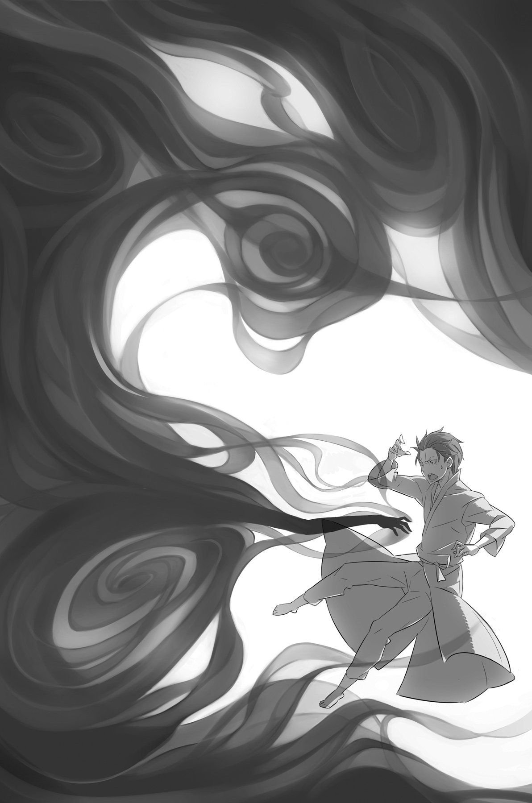
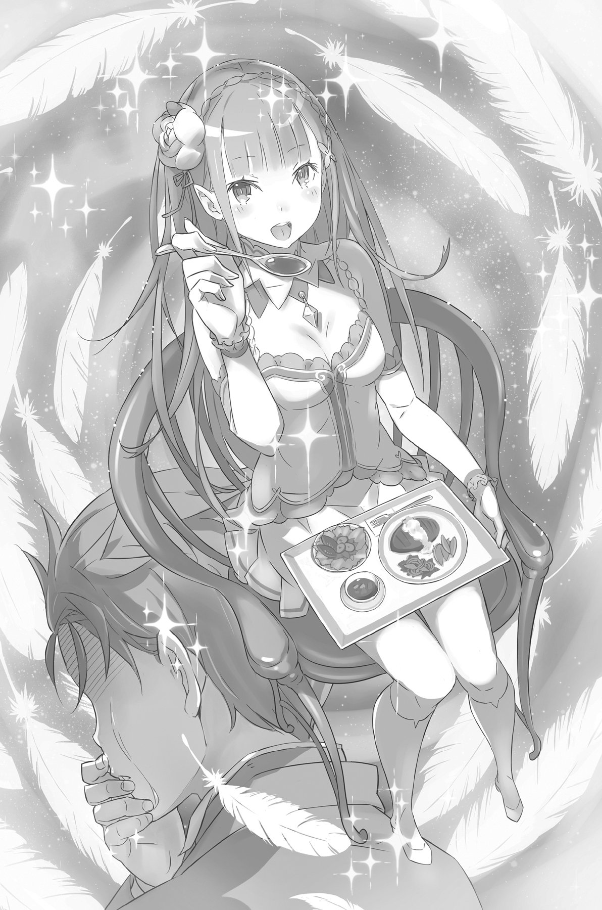
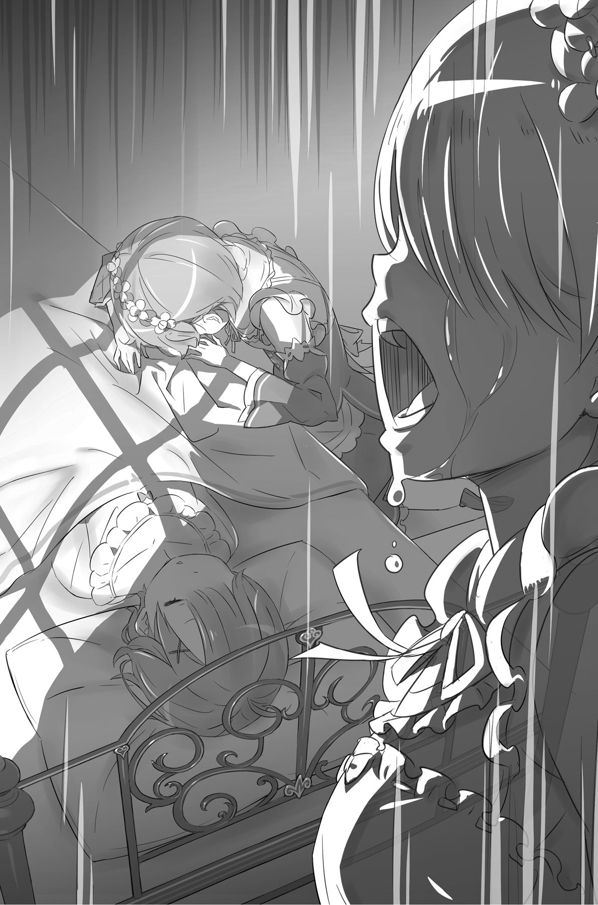
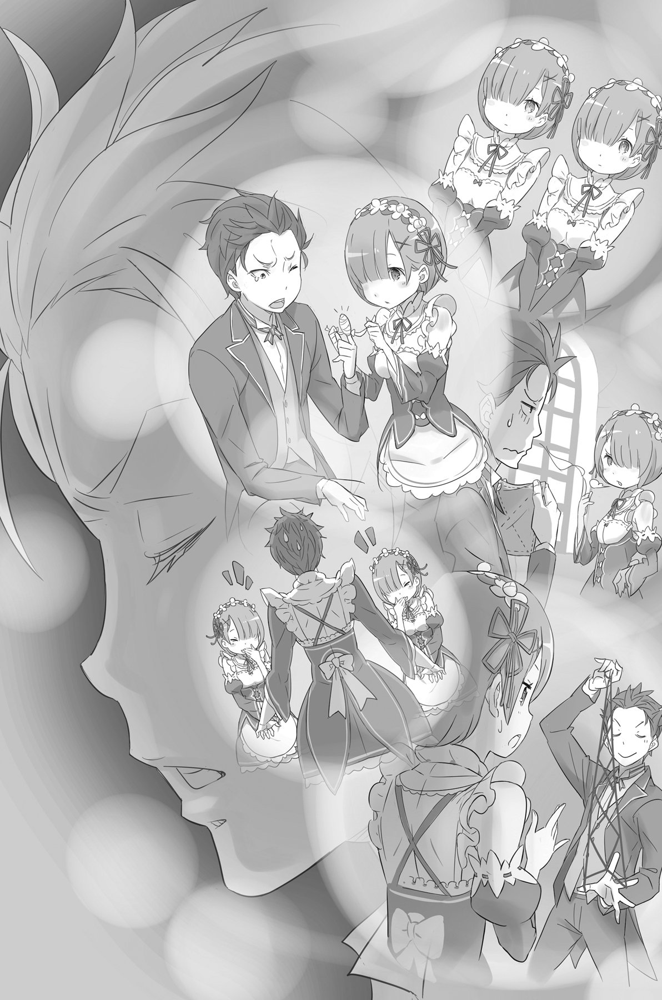

## 1

Субару не заметил, когда именно сознание вернулось к нему. В ушах звучал шум проливного дождя. Перед глазами мелькали красные и белые пятна. В этот момент мир казался ему отражением в кривом зеркале.

Не чувствуя рук и ног, он истошно закричал, словно кто-то раскалёнными щипцами вытягивал его внутренности, а затем яростно забился, дёргая конечностями, будто в попытке сбросить охватившее его оцепенение.

«Да что же это происходит?..

Адская боль в ноге, раны по всему телу от тяжёлой цепи… исчезли.

Я потерял море крови. Я потерял жизнь. Меня не должно уже быть на этом свете.

Но я не хотел умирать. Мне осточертела боль, осточертели все эти мучения, страдания, тоска, страх… Я хочу всё забыть. Забыть всё, что видел, всё, что слышал, всё, что чувствовал…

Что это? Какой-то звук. Чей-то голос. Будто кто-то отчаянно пытается усмирить дикого зверя.

Что он говорит, не понять. Да мне и неинтересно. Какая разница? Потому что будет ещё больнее. Потому что это ничего не изменит…»

Тем не менее мир вокруг него потихоньку приобретал прежние очертания, возвращая свои цвета и звуки. Субару почувствовал, как по венам и артериям вновь побежала кровь, оживляя измождённый организм.

Рука вдруг ударилась обо что-то твёрдое, и на тыльной стороне ладони образовался кровоточащая ссадина. Точно игла, мозг пронзила острая боль, и крик в его ушах стал немного тише.

И тут до него дошло. Кто-то держал его за руку, крепко обхватив за запястье, а другой навалился на ноги, не давая им пошевелиться.

Когда зрение наконец вернулось, прямо над ним нависал всё тот же знакомый белый потолок. Он обнаружил, что лежит на мягкой кровати.

Субару шумно выдохнул. Казалось, что в закостеневшем теле не осталось ни капли сил.

— Дорогой гость, вы уже успокоились?

— Дорогой гость, вы уже закончили буянить?

Когда знакомые голоса достигли ушей Субару, комнату снова огласил истошный крик.

## 2

Так безобразно первый день в особняке Розвааля Субару не начинал ещё никогда.

В этом мире он умирал уже шесть раз, и ему было стыдно. Каждый раз смерть была отнюдь не безболезненной и неизменно сопровождалась невероятным чувством потери и страданиями, к которым невозможно привыкнуть. Но никто в этом мире не смог бы понять, какое одиночество и отчаяние охватывают тебя, когда ты раз за разом начинаешь жизнь с нуля.

И всё же Субару стискивал зубы и продолжал бороться за свою жизнь. Он твёрдо решил идти вперёд, несмотря ни на что. Однако последнее Посмертное возвращение серьёзно поколебало его волю. Он чувствовал, что на этот раз ему уже не оправиться. На то, чтобы встать на ноги, не осталось ни сил, ни желания. Именно такова была реальность.

— Всё уже позади. Твоя рука вне опасности, но впредь всё-таки веди себя осторожней, хорошо?

Эмилия сидела рядом с кроватью Субару, поглаживая исцелённую кисть его руки. Кроме них, в комнате больше никого не было. Сёстры оставили его сразу же после того, как на переполох, устроенный Субару сразу после пробуждения, примчалась Эмилия.

— Рам и Рем очень сильно беспокоятся за тебя.

Услыхав ненавистные имена, Субару машинально поднял голову и посмотрел на Эмилию. На лице девушки отразилось замешательство, но она сразу отбросила его, мотнув головой, и продолжала:

— Они очень расстроены. Думают, что чем-то обидели тебя. В следующий раз, когда их увидишь, скажи им что-нибудь, хорошо?

— Обидели? Нет, ничего страшного. Ничего такого между нами не произошло, — проговорил Субару безразличным тоном.

Красивые брови Эмилии слегка дрогнули. Тревога девушки не осталась не замеченной им, однако ни извинений, ни объяснений от Субару не последовало. Вместо этого он задал вопрос, который совсем сбил её с толку.

— Скажи, Эмилия, — прошептал Субару. — Я для тебя обуза?

— Как ты мог подумать?! — заговорила она так быстро, что он едва успевал улавливать смысл её слов. — Ты ведь спас мне жизнь! Неужели я оставлю человека, которому обязана жизнью? Мне было бы очень неловко!..

Слушая Эмилию, Субару вдруг осознал, что внимательно наблюдает за каждым её движением, и пробормотал:

— Подождите, это я что, серьёзно?

Субару стало стыдно, ведь он усомнился в Эмилии! Разве она не права? Нет ничего более подлого, чем забыть о доброте, которую к тебе проявили. В этом мире, в котором Субару было совершенно не на кого опереться, Эмилия являлась для него спасительным оазисом. Сейчас, когда у него не осталось никого и ничего, она — единственный человек, которому можно доверить своё сердце.

В голове внезапно мелькнула мысль: не рассказать ли Эмилии всю правду о Посмертном возвращении?

— А ведь точно… — пробормотал Субару, когда наконец понял, что должен делать.

Всё это время, когда действительность загоняла его в тупик, из которого, казалось, не было выхода, он пытался справиться в одиночку. В результате судьба неизменно поворачивалась к нему спиной. Чтобы выбраться из этой трясины, требовались принципиальные перемены. Быть может, ему следовало положиться на человека, которому он доверял?

— Эмилия, я хочу кое-что тебе сказать, — произнёс Субару, и его голос теперь звучал по-другому.

Ни сомнений, ни тревог не осталось, всё рассеялось, словно туман.

Эмилия выпрямилась и обеспокоенно посмотрела на него. Субару глядел на своё отражение в её фиалковых глазах и думал, с чего начать. Как рассказать ей о Посмертном возвращении? Может, начать с того, что он прибыл сюда из другого мира?

Скорее всего, она просто посмеётся. Решит, что он шутит. И тем не менее Эмилия выслушает его. Всё равно больше надеяться было не на что.

«Я расскажу тебе о Посмертном возвращении, — мысленно произнёс Субару. — И я надеюсь, ты поделишься со мной своей силой».

Он отдавал себе отчёт в том, что и так в долгу перед Эмилией и не вправе требовать от неё большего. Однако он делал это ради того, чтобы выбраться из поминутно нарастающего хаоса, который окружал их, грозя и Эмилии тоже. Субару верил, что вместе они одержат победу над судьбой.

По крайней мере, он надеялся на это.

— Эмилия, я уже несколько раз… — заговорил наконец Субару, но в ту же секунду испытал странное чувство.

Что-то было не так. В атмосфере витало некое неуловимое ощущение неправильности. И тут Субару понял, в чём дело.

Звук. Звук исчез. Мир стал абсолютно немым.

Биение собственного сердца. Дыхание Эмилии. Шум ветерка, развевающего оконные занавески. Всё пропало без следа.

И это было только начало.

Вслед за звуками мир покинуло время. Оно замерло на месте, мгновение превратилось в бесконечность, и уже не верилось, что следующая секунда когда-нибудь наступит.

Перед ним сидела Эмилия, застывшая, словно ледяная статуя, и казалось, пройдёт целая вечность, прежде чем она пошевелится.

Застыл и сам Субару. Тело словно окоченело. Его губы, глаза, пальцы — всё превратилось в камень. Лишь глубоко внутри рвался отчаянный крик.

А затем возникло это.

Взявшись неизвестно откуда, перед немигающим взором Субару предстало чёрное облако. В мире, где всё утратило способность перемещаться, оно медленно двигалось, клубилось, изменяя очертания, пока наконец не приняло форму руки.

На руке было пять пальцев, она выдавалась из облака примерно по плечо. Пальцы зловещей руки подрагивали. Она плавно плыла сквозь пространство, и вдруг Субару понял, что является её целью. Юноша мысленно сглотнул.

Чёрные пальцы приблизились к его груди. Он уже чувствовал, как они пробираются сквозь внутренние органы, касаются рёбер. Субару охватила паника. Движение руки не прекращалось ни на секунду, словно она что-то искала, но никак не могла найти и проникала всё глубже и глубже,

«Эй, погоди-ка! — беззвучно прошептал Субару. Но тело было бессильно, лишь где-то в самой глубине сознания звучал истошный вопль.

«Это совсем не… смешно!»

Тотчас же будто молния прошла сквозь всё его существо. В груди Субару защемило, будто кто-то безжалостно сдавил огромными щипцами сердце, пытаясь вырвать его из груди.

Он не мог закричать, даже дрожь была недоступна его телу. Осталась лишь адская боль. Она раздирала на куски, заволакивала туманом разум, разъедала остатки сознания…

— …бару?

«Что это за голос?..»

— Субару, что с тобой? Ты меня пугаешь! Скажи хоть что-нибудь!

Чьи-то руки осторожно тронули его плечи, Субару очнулся и сразу встретил испуганный взгляд сереброволосой красавицы.

Воздух с шумом вырвался из лёгких. Убедившись, что пальцы вновь обрели былую подвижность, Субару боязливо коснулся своей груди и почувствовал тихое биение сердца.

«Моё тело движется. Голос вернулся. Боль исчезла».

Но оставался страх.

Субару охватило отчаяние. Последняя надежда разбилась вдребезги. Стоило только подумать о том, чтобы повторить попытку признания, как чёрное облако снова начинало маячить перед его глазами.

Оставалось лишь смириться с реальностью.

— Что-то случилось? — взволнованным голосом спросила Эмилия и приложила ладонь к его лбу. — Ты ведёшь себя очень странно. Если тебе нехорошо, я…

— Эмилия, сделай одолжение… — оборвал её Субару и отвернулся, угрюмо глядя перед собой.

Он не хотел, чтобы девушка видела его лицо. Наверняка сейчас он выглядел просто ужасно. В таком состоянии Субару мог наговорить ей много лишнего. Он изо всех сил старался оградить свой разум от бурлящих в душе переживаний. Всё, что ему хотелось сказать, все чувства, которые желал излить… Всё это он отбросил и произнёс лишь одну-единственную фразу:

— Держись от меня подальше.

Потом он упал на подушку, даже не взглянув на Эмилию.

Реальность предстала без прикрас, чётко и ясно: ему не позволят раскрыть мрачную тайну. Чтобы бы ни случилось, он должен продолжать борьбу в полном одиночестве.

## 3

Огорчённая жестокими словами, Эмилия покинула гостевую комнату, но вскоре пожаловал Розвааль. Правда, Субару не запомнил, о чём тот говорил. Ему лишь показалось, что граф отнёсся к нему, как к некоему очень ценному предмету, вроде старинной вазы, и юноша никак не мог понять, впервые ли это, возможно, Розвааль и раньше смотрел именно так, просто Субару не замечал.

Кажется, Розвааль произнёс нечто вроде:

«Живи в моём доме столько, сколько захо-о-очешь, в качестве дорогого гостя!»

В конечном счёте, Субару было безразлично, что именно сказал Розвааль. Юноша был уверен: если покинет особняк, не сможет уйти далеко. С другой стороны, перспектива остаться тоже не сулила ничего хорошего. Что ни выбирай, впереди плохая концовка. И с этим ничего нельзя поделать.

Субару сидел на кровати, практически не двигаясь, однако дыхание его оставалось тяжёлым и сбивчивым. В страхе, что сон овладеет им, Субару держал наготове перо, которым колол себя в ладонь всякий раз, когда веки грозили сомкнуться. Он не знал, что случится, если уснёт.

В этом особняке он умирал уже трижды.

В столице смерть тоже настигала его три раза. Четвёртая смерть оставалась для Субару неизведанной территорией, быть может, она станет последней.

Он не мог найти ни единого способа остаться в живых. Тем не менее умирать не хотел. Позабыв о течении времени, позабыв о пустом желудке, Субару бездумно сидел, снедаемый примитивным желанием просто существовать, и лишь боль в ладони свидетельствовала о том, что он пока ещё жив.

Он снова и снова вонзал острый кончик пера в руку, и вскоре вся ладонь была усеяна кровавыми точками. Боль сменялась радостью… Боль. Радость. Боль, боль, боль…

— Ты выглядишь, как жалкий трус!

Внезапно раздавшийся голос заставил его вздрогнуть, и Субару поднял глаза. У входа в комнату, облокотившись о дверной косяк, стояла Бетти. В нынешнем круге жизни это была их первая встреча. Субару не мог поверить, что она пожаловала сама.

— Как? Это ты?..

Голос прозвучал так хрипло, что Субару сам не узнал его.

— Не прошло и суток, а ты уже раскис, как старый гриб, мнится мне. Ужасно глупо!

— Оставь своё мнение при себе. Зачем ты пришла?

— Пакки и та девчонка попросили навестить тебя.

— Пак и… Эмилия?

— Поскольку ты с самого утра ведёшь себя странно, они решили, это я что-то с тобой сделала, когда ты проснулся. Абсолютный вздор, мнится мне!

Конечно, Бетти была ни при чём, но для Субару вопрос заключался совсем в другом. Он обидел Эмилию, и всё же её душа болела за него. До такой степени, что девушка даже попросила Беатрис проведать его.

Видимо, именно потому Беатрис, не в силах отказать ей — или, скорее, Паку — явилась в комнату Субару. Забота Эмилии немного согрела его израненное сердце, хотя было совершенно очевидно: она нисколько не облегчит его участь.

— Я понял. Со мной уже всё хорошо. Ты пришла извиниться, и этого достаточно.

— У меня нет никаких причин извиняться перед тобой, мнится мне. И я не уйду, пока ты этого не поймёшь.

Уходить Бетти действительно не собиралась. Вместо этого она молча приблизилась к его постели и скривила свою хорошенькую мордашку в недовольной гримасе:

— Ты не только выглядишь, как старый гриб! От тебя ещё и пахнет отвратительно!

— Чего?

— Я говорю о запахе, который просто ударяет в нос, мнится мне, — пояснила Бетти. — Будет благоразумно, если ты пока не станешь встречаться с сестричками.

Зажав нос, она демонстративно помахала другой рукой, словно отгоняя неприятный запах.

Запах. Субару никак не мог выбросить из головы это слово. Кто-то уже говорил ему о некоем запахе, причём совсем недавно…

— А что это за запах?..

— Запах ведьмы, мнится мне! От него просто в носу свербит!

И тут Субару осенило. Это был запах…

— Ведьмы Зависти?

— А кого ещё в этом мире могут называть ведьмой? — Бетти поглядела на Субару, как на несмышлёного ребёнка.

Однако её ответ вызвал у него ещё больше вопросов.

— Почему же от меня пахнет Ведьмой Зависти?

— А мне почём знать? — развела руками Бетти, — Может, ты ей понравился. А может, наоборот, она невзлюбила тебя. В любом случае, если ведьма положила на тебя глаз, жди неприятностей.

— Странно слышать, что я на особом счету у той, кого в глаза ни разу не видел.

Беатрис пожала плечами, всем своим видом показывая, что дальнейший разговор на эту тему ей не интересен.

«Ведьма Зависти»… Существо, настолько опасное, что люди даже боятся произносить её имя вслух.

«Но при чём здесь я? — думал Субару. — Я всего лишь прочёл о ней сказку, которую и сказкой-то трудно назвать. Откуда мог взяться этот запах, если я даже ни разу не встречался с ней? Рем тоже говорила, что от меня пахнет ведьмой. Думаю, её жгучая жажда крови отчасти объясняется именно этим. Но дело в том, что я совершенно не понимаю, в чём виноват!»

Положение казалось безвыходным, из груди Субару вырвался тяжкий вздох.

— Если тебе больше нечего сказать, я ухожу, — сказала Бетти, положив ладонь на ручку своей Блуждающей двери. — Передам Пакки, что мы обо всём поговорили, мнится мне,

— Подожди! — окликнул её Субару. Беатрис недовольно оглянулась. — Ты ведь сожалеешь о том, что нехорошо со мной поступила?

Он не был уверен, что план сработает, но всё же рискнул.

Барабаня пальцами по постели, он повторил вопрос:

— Ведь сожалеешь? Отвечай: да или нет?

— Не сожалею, — отрезала Бетти.

— Тогда я нажалуюсь Паку.

— Ну… Разве что самую малость, мнится мне.

Бетти развернулась к Субару и демонстративно сложила руки на груди. Он окинул взглядом субтильную фигурку. Ему вдруг стало стыдно упрашивать девчонку, которая выглядела гораздо младше его, но Субару всё же решился.

— Если ты сожалеешь, — сказал он, — и хочешь, чтобы я простил тебя, выслушай мою просьбу.

— Выслушаю, мнится мне.

— Можешь ли ты ближайшие несколько дней… вплоть до пятого по счёту рассвета защищать меня?

На несколько секунд Беатрис погрузилась в размышления.

— Ты что-то недоговариваешь, — сказала она наконец. — Если тебе угрожает опасность, на это есть какая-то причина, мнится мне.

Её подозрительность была объяснима. Не спуская с Субару недоверчивого взгляда, Беатрис принялась ходить кругами по комнате:

— Прежде всего, мне бы не хотелось, чтобы ты внёс разлад в этот дом. Я не желаю терять его, мнится мне.

— Я ни о чём таком и не думал… Просто пытаюсь избежать беды.

— Благородное стремление, ничего не скажешь! Спихнуть всё на плечи других.

— На этот раз мне действительно нечего возразить… — проговорил Субару, потупившись.

Беатрис тяжело вздохнула, и в комнате на какое-то время повисла тишина.

Субару по-прежнему сидел на кровати, опустив голову, поэтому не заметил, как Беатрис подошла к нему и протянула свою маленькую ладошку.

— Дай мне руку! — потребовала она.

Не дожидаясь, когда он сообразит, Бетти сама взяла его израненную ладонь и, взглянув на неё, скривила личико.

— Какой ужас, Ты извращенец, находящий удовольствие в самоистязании, мнится мне?

— По вопросам всяких извращений — это к Розваалю, — отшутился Субару. — А я просто хотел набить татушку, да вот неудачно.

— У тебя большие проблемы с чувством юмора, и лжец абсолютно никудышный, Никакого толку из тебя не выйдет.

Бетти устало вздохнула, сунула руку в ладонь Субару, сцепила с ним пальцы и, крепко сжав, торжественно объявила:

— Так и быть, удовлетворю твоё желание. Я, Беатрис, отныне связана с тобой контрактом.

Глядя на Беатрис, Субару с удивлением обнаружил, что девочка перед его глазами в это мгновение выглядит совершенно по-другому. От её пальцев исходило приятное тепло, и Субару даже казалось, что фигурка Беатрис окутана некой таинственной аурой.

— Временно или нет, но контракт есть контракт, — сказала Бетти. — Я исполню твою нелепую просьбу.

Когда она высвободила пальцы и вновь скрестила руки на груди, юноша опустил глаза, чтобы скрыть захлестнувшую его волну эмоций.

Эти чувства нельзя было выразить словами, они переполняли всё его существо, бурлили в груди и рвались наружу.

Помощь пришла оттуда, откуда он ждал её меньше всего, и Субару понятия не имел, как к этому относиться.

— Ты не шутишь? Вот же чёрт, меня заставила расплакаться девчонка!

— Не называй меня девчонкой! — вспыхнула Бетти. — И только попробуй разболтать о контракте Пакки!

— Для тебя это так важно? Я смотрю, ты им просто одержима!

Субару слабо улыбнулся. Впервые за это невероятно мрачное утро.

## 4

Заключив с Беатрис временный контракт, Субару испытал хоть небольшое, но всё-таки облегчение. Однако его положение от этого нисколько не улучшилось.

Он по-прежнему сидел, запершись в отведённой ему гостевой комнате, поскольку Беатрис не собиралась постоянно маячить рядом с ним. Главная опасность грозила Субару с ночи четвёртого дня до утра пятого, и она сказала, что появится именно тогда, а до тех пор Субару решил оставаться затворником. Лишь Эмилия навещала его время от времени и, усевшись на краешке кровати, мило улыбалась и говорила:

— Я рада, что Беатрис извинилась перед тобой. Это просто замечательно!

Не будет преувеличением сказать, что для Субару, мучимого угрызениями совести за допущенную грубость, Эмилия представлялась богиней, рассеивающей тьму этого жестокого мира.

— Ты просто был очень взволнован, — сказала она, когда Субару попытался извиниться. — Это со всяким может случиться, ничего не поделаешь. Но если ты скажешь то же самое Рам и Рем, я думаю, они не оценят.

Субару ничего не ответил на эту мягкую просьбу. Пока он не заслужил доверия, служанки готовы убить его на основании одних лишь подозрений. Субару уже на собственной шкуре испытал их гипертрофированную преданность Эмилии и графу, и всё же не осуждал сестёр.

Он закрыл глаза, представляя последние дни, проведённые в особняке, но ни одного положительного момента, связанного с сёстрами, в этих воспоминаниях не нашлось. Впрочем, возможно, Субару просто хотелось так думать.

— Опять ничего не ешь, — огорчённо вздохнула Эмилия, глядя на стоящий у кровати поднос, на котором остывала нетронутая еда.

— Извини, — тихо ответил он.

Субару всё больше погружался в себя, отгораживаясь от окружающего мира. Тем не менее Рам и Рем добросовестно исполняли свои обязанности и по-прежнему приносили ему еду, хотя прекрасно понимали, что он не притронется к ней и даже не скажет спасибо.

Субару знал, какие мысли и чувства скрываются за бесстрастным выражением их лиц. Именно поэтому он отказывался принимать предложенную пищу.

А вдруг она отравлена?

Эта тревожная мысль закрадывалась в голову всякий раз, когда он смотрел на стоящий рядом поднос. Он ненавидел себя за это. И вместе с тем знал, что пройдёт ещё немного времени, и одна из служанок размахнётся варварским смертоносным орудием, чтобы убить его.

Да, сёстры обладали множеством достоинств. И всё-таки желали его смерти. После того как Субару принял это как неопровержимый факт, им овладела глухая, беспросветная тоска.

— Не хочу надоедать, но тебе нужно хоть немного поесть, — уговаривала Эмилия. — Иначе ты можешь серьёзно заболеть.

— Мой желудок не переварит эту еду. Хотя, если Эмилия-тан попросит меня сказать «ам»…

Определённо, это был не самый подходящий момент для столь легкомысленных высказываний в адрес человека, который искренне переживал за него, и Субару проклял себя за глупую шутку.

Однако Эмилия восприняла его предложение на полном серьёзе.

— Ну-ка, открываем ротик и говорим «а-ам!» — приказала девушка, поставив поднос себе на колени и держа в руке ложку с остывшим супом. Ложка медленно приблизилась к губам Субару.

— Нет, нет, нет, Эмилия-тан! Постой-ка! Что ты делаешь?

— Как это что? — удивилась Эмилия. — Ты же сам захотел, чтобы я так поступила. Так что не отвлекайся и открывай рот.

— Хм… На самом деле, я вовсе не это имел в виду. Я просто пошутил…

— Ну уж нет! Если тебе нравится вести себя, как ребёнок, не удивляйся, что тебя кормят с ложечки! — сказала Эмилия и снова поднесла ложку к самым губам Субару.

В конце концов он сдался и, сгорая от стыда, всё-таки открыл рот,

— Вот так. Ещё ложечку. И ещё одну. И ещё.

— Не так быстро! Ты что, хочешь, чтобы я подавился?!

Ложка летала между тарелкой и ртом Субару так стремительно, что можно было подумать, будто Эмилия участвует в турнире на скоростное кормление младенцев.

— Перерыв, перерыв! — в отчаянии замахал руками Субару. — Остановись же ты! У меня не в то горло попало…

— А мне казалось, у нас хорошо получается. Субару?

— Ах-кха! Нет, правда, не туда пошло! Кха-а-а-а!..

Отвернувшись от Эмилии, Субару старательно закашлялся, пытаясь выглядеть как можно более естественно. Он не хотел, чтобы Эмилия видела его в такой момент. В глазах нестерпимо жгло, и он широко открыл их, отчаянно пытаясь сдержать слёзы, рвущиеся наружу.

В мире, где, казалось бы, у него не осталось никакой надежды, Эмилия продолжала заботиться о нём. Неужели он это заслужил?

— Субару…

— А? — встрепенулся он и повернул покрасневшее от слёз лицо к Эмилии. — Нет, всё хорошо. Я в порядке. Кажется… Да, со мной всё хорошо.

— Продолжим? — спросила она, ласково глядя в его глаза.

— Ты говоришь так, что это звучит ужасно эротично…

— М-м? — Эмилия склонила голову набок, по-видимому, не уловив смысла его пошлой остроты. Затем она вновь зачерпнула ложкой и поднесла её ко рту Субару. — Сделай «ам»!..

Вскоре с супом было покончено, и Эмилия довольно хлопнула в ладоши.

— Отлично! А что мы говорим, когда съели весь суп?

— Спасибочки.

— Субару, где твои манеры? Скажи ещё раз, только правильно.

— Большое спасибо, — сказал Субару и изобразил глубокий поклон.

— Вот так. На здоровье! — Эмилия широко улыбнулась.

Субару с удивлением отметил, что, несмотря на голодание, после супа в желудке не ощущалось никакой тяжести.

— Рам предупредила Рем, что ты долго ничего не ел, — сказала Эмилия, — поэтому она приготовила суп по специальному рецепту, чтобы не навредить желудку. Очень мило с их стороны, правда?

Слова Эмилии прозвучали как гром среди ясного неба. Субару был готов разрыдаться от столь тёплой заботы о своей персоне. Если бы только не знал, что на самом деле стояло за добротой и отзывчивостью служанок.

— Ты наверняка устал, — сочувственно произнесла Эмилия. — Я, пожалуй, пойду, а ты отдыхай.

— Если хочешь, можешь остаться здесь и тоже поспать на моей кровати.

— Вот теперь я вижу, что ты в полном порядке. У меня очень много дел, нужно идти. Никому не говори, что я отлынивала, ладно? — Эмилия заговорщицки подмигнула и приложила палец к губам.

Субару вдруг стало стыдно. На плечах Эмилии лежала забота о будущем целой страны. Ей не следовало тратить на Субару ни секунды своего драгоценного времени.

— Эмилия-тан, сегодня ночью хорошенько запри дверь своей комнаты и никого не пускай.

Возможно, эти слова сорвались с губ Субару потому, что доброта Эмилии вновь зажгла в нём искорку надежды на что, что они смогут одолеть судьбу.

Эмилия слегка наклонила голову набок:

— Иначе ты залезешь ко мне?

— Обязательно… То есть нет, конечно!!! Ведь это же ты сказал, Пак, а не Эмилия, да?

— Прямо в яблочко!

Из копны серебристых волос высунулась довольная мордочка Пака, который, судя по всему, подслушивал разговор с самого начала. Встретив сердитый взгляд Субару, Пак весело помахал ему хвостом.

— Сначала я не хотел вмешиваться в вашу идиллию, но потом твоё лицо стало вдруг таким серьёзным, что я не выдержал.

— Просто у меня нехорошее предчувствие. Поэтому я и прошу тебя присмотреть за Эмилией.

Субару избегал говорить о будущем напрямую, и всё же Пак, умеющий читать мысли, понял его без всяких вопросов.

— Может быть, объясните мне, в чём дело? — озадаченно спросила девушка.

— Дело в том, что таким прелестным девочкам, как Эмилия-тан, по ночам нужно быть особенно осторожными. Да, папаша?

— Он прав, Лия, — сказал Пак. — Папа не разрешает тебе пускать к себе мальчиков, особенно всяких брюнетов в странной одежде.

— И ты, Брут! — воскликнул Субару, вызвав у Пака взрыв смеха.

Эмилия взяла Пака за шкирку и сунула обратно в свои волосы.

Когда она вышла из комнаты, Субару повалился на постель. Ему удалось обратить их внимание на подстерегающую опасность. Впрочем, теперь он был практически уверен — им эта опасность ничем не угрожает.

Субару вдруг овладело спокойствие, а вместе с ним навалилась дремота. Сонливость, томившаяся до сих пор в клетке, вырвалась на свободу, и Субару, повинуясь её колдовским чарам, провалился в объятия Морфея.

## 5

Сознание Субару дрейфовало между сном и явью, словно корабль, потерявший якорь. В голове проносились вереницы необычайно ярких, мучительных воспоминаний о смерти. Он стонал, обливался потом, из глаз бежали слёзы. Субару страдал, почти физически ощущая, как от его души отрывается кусочек за кусочком, грозя в конце концов не оставить от неё и следа.

Но внезапно страх и холод отступили, и напряжение исчезло.

Кто-то держал его за руки. Прикосновение было необычайно приятным, мягким и тёплым. От него веяло состраданием.

Субару понял, что спасён. Его измученный разум словно овеял успокаивающий нежный ветерок. Дыхание выровнялось, скованные судорогой мышцы расслабились.

Кто это был? Или что это было? Являлось ли это реальностью? Или просто шуткой, которую сыграл с ним сон?

Нежные руки отпустили его ладони, оставив после себя сладкое тепло, и Субару заснул спокойным сном.

## 6

— Ну и долго ты ещё храпеть собираешься? — раздался сердитый голос, и немилосердный пинок отправил его на твёрдый холодный пол.

Тряся головой, Субару приподнялся на локтях и осмотрелся. Беатрис стояла рядом, ещё держа ногу на весу. Она, как всегда, выглядела раздражённой и надменной.

— Сначала время назначает, а потом дрыхнет, как сурок.

— Можно было бы и без пинков обойтись… — проворчал Субару, но когда понял, что чуть не проспал час икс, его прошиб холодный пот. — Неужели я вырубился до четвёртого дня? Как можно быть таким беспечным идиотом?!

— Хватит бурчать, мнится мне. И сядь уже где-нибудь, — сказала Бетти скучающим голосом и устроилась на стремянке.

Субару огляделся. Вокруг возвышались стеллажи, заставленные книгами.

— Ты что, перенесла меня сюда, пока я спал?

— Долго оставаться в комнате, пропитанной твоим запахом, просто невыносимо. Моё место — в библиотеке, а ты будешь вести себя здесь как положено, мнится мне.

Возражать Субару не стал, решив, что так будет даже лучше: замечательно, если он сможет скрыть от налётчика своё местонахождение. Насколько он знал, Рем было не под силу разгадать тайну Блуждающей двери.

— А ты неплохо всё продумала!

— Сиди тихо. Похоже, ты хочешь, чтобы я приняла тебя за жука и раздавила, мнится мне?

Субару поднялся с пола и вдруг поглядел на свои ладони. Странное ощущение, будто кто-то во сне держал его за руки, не уходило.

— Беатрис, я, конечно, понимаю, что это звучит, как бред… Но ты не держала меня за руки, пока я спал?

— Вот уж действительно бред! Даже если бы меня попросил Пакки, я бы всё равно отказалась, мнится мне.

— Как категорично! — сказал Субару, осматриваясь кругом. В зале библиотеки присесть было ровным счётом не на что. — И что прикажешь теперь делать?

С приближением ночи тревога нарастала, и Субару уже не был уверен, что его самообладания хватит надолго. Тем более в книжном архиве Беатрис было совершенно нечем заняться.

— Кстати, у тебя не найдётся какой-нибудь книжки, написанной простым языком?

— Подумать только, ты и читать толком до сих пор не научился! Мнится мне, ты не представляешь, сколько людей рыдали бы от восторга при одной лишь мысли о запретной библиотеке семьи Мейзерс!

— Что ж, мне жаль этих людей… А ты всегда здесь сидишь?

Субару не видел, чтобы Беатрис отлучалась из библиотеки. За исключением случаев, когда она приходила в столовую, и недавнего визита в его комнату, Бетти неизменно сидела на своей стремянке в окружении книг.

— Таково условие контракта, — ответила Беатрис, слегка потупившись.

— Ещё один контракт? Конечно, не моё дело, но тебе не кажется, что это слишком суровое условие?

— Все контракты я заключала по собственному желанию, мнится мне, — отрезала Бетти, и её тон не допускал дальнейших расспросов.

Субару уже не первый раз с момента прибытия в этот мир слышал о контрактах, и всякий раз это слово произносилось с особым пиететом. Глядя на хрупкую, фактически детскую фигурку Беатрис, Субару почувствовал, что у него отчего-то нестерпимо закололо в груди.

— Слушай, а ты…

— Замучил уже своими вопросами! — воскликнула Беатрис и запустила в него увесистым томом. — На, читай! Хоть немного помолчишь, мнится мне.

Поймав брошенную в него книгу, Субару обнаружил, что написана она была самыми простыми, уже знакомыми ему базовыми символами. Когда он поднял глаза и посмотрел на Беатрис, та уже не проявляла к нему никакого интереса. Она была поглощена чтением книги, лежавшей на коленях, и всем своим видом демонстрировала нежелание продолжать разговор.

Судя по всему, благодарности Бетти не ждала, поэтому Субару с облегчением открыл книгу и принялся читать.

## 7

В стенах запретной библиотеки время текло неспешно. Лишь шорох переворачиваемых страниц изредка нарушал глухую тишину. И всё-таки Субару сейчас было не до чтения. Уже несколько минут он бездумно, словно ради пустой забавы, перелистывал туда-сюда одну и ту же страницу.

Запертый в огромном зале библиотеки, в котором не было ни одного окна, Субару чувствовал себя изолированным от всего остального мира. Сколько прошло времени с тех пор, как он здесь оказался? Об этом можно было лишь догадываться. Впрочем, как и о том, что происходит снаружи.

Доверять собственным чувствам он уже не мог. Задать вопрос Беатрис — не решался. И дело было не в том, что ему не хотелось отвлекать её от чтения. Он боялся, что любое его действие может обернуться непредсказуемыми последствиями.

Пальцы, листавшие страницы, занемели, в горле пересохло, а сердце стучало всё чаще и чаще. Стало трудно дышать. Не зная, долго ли ещё сможет это выносить, он с ужасом думал, насколько затянется напряжённое ожидание.

Внезапно безмолвие библиотеки нарушил тихий шёпот:

— Зовут.

Субару вздрогнул и увидел, как Беатрис захлопнула книгу и соскочила со стремянки на пол.

— Меня зовут, мнится мне, — снова пробормотала Беатрис, словно бы обращаясь к себе самой,

Затем она сделала движение рукой, и в тот же миг пространство библиотеки искривилось, подёрнувшись зыбкой рябью. Оказавшись на мгновение словно в состоянии невесомости, Субару издал невнятный звук и принялся испуганно озираться по сторонам.

— А, я уже забыла, что ты здесь, мнится мне, — сказала Беатрис, внезапно вспомнив о его существовании.

— Неудачная шутка! Как можно забыть о человеке, который сидит прямо у тебя под носом?

— Некогда мне с тобой спорить. Меня зовёт Пакки.

С этими словами Беатрис уверенно зашагала к двери.

— Э-эй, подожди! — голос Субару дрогнул. — Если ты сейчас уйдёшь…

— Можешь оставаться. Здесь тебе ничто не угрожает, мнится мне.

Когда Беатрис вышла, Субару вскочил на ноги и бросился к двери. Схватившись за ручку, он несколько секунд колебался.

— Что же там творится? А-а-а, к чёрту всё!!! — выругался он и рванул дверь на себя.

В его глаза сейчас же ударил яркий свет. Субару прикрыл лицо рукой и шагнул вперёд, к окну, выходящему в сад. За окном виднелось высокое небо, в котором сиял диск восходящего солнца.

Это было то самое утро, дожить до которого он столь страстно желал — утро пятого дня.

— Неужели… оно наступило? — прошептал Субару.

Не веря глазам, он подошёл к окну и распахнул створки. Свежий ветерок коснулся волос, в нос ударил пьянящий запах росистой травы.

Ноги подкосились, качнувшись к стене, он, потрясённый, медленно сполз на пол. Субару уже и не надеялся, он отчаялся, был совершенно измотан.

И вот он встречает пятое утро в особняке Розвааля!

У Субару вырвался нервный смешок:

— Ха-ха! Это что же получается? Хе-хе! Это же… Нет, это же… Ха-ха-ха…

Он сидел в коридоре, обхватив колени, и смеялся, как полоумный. Он уже распрощался с мыслью, что когда-нибудь доживёт до этого дня, однако вот же оно солнце долгожданного утра, сияющее прямо в лицо.

— Субару?

Эйфорию прервал раздавшийся рядом голос, похожий на звон серебряного колокольчика. Он повернул голову на зов и увидел Эмилию. Она стояла в нескольких шагах от него, живая и невредимая.

Они пережили эту ночь! От осознания данного факта его пронзила радостная дрожь.

Вот он — шанс осуществить заветное желание! Он познакомит её с деревенскими ребятишками, потом они вместе отправятся на цветочное поле, а потом…

— Эмилия?..

Она стояла, не шелохнувшись, и молча смотрела на Субару. Затем, будто опомнившись, бросилась к нему и с волнением в голосе спросила:

— Субару, где ты был?

— Ну, я просто…

— Я уже… Ладно, не важно. Пойдём со мной, — она схватила его за руку и, не дожидаясь ответа, потянула за собой.

— Куда мы идём? — растерянно пробормотал Субару. — Послушай, Эмилия-тан! Ты не представляешь, через что мне пришлось пройти, чтобы дожить до этого дня…

Он вгляделся в её озабоченное лицо, пытаясь подобрать правильные слова.

— Ты чем-то недовольна? Но ведь всё хорошо, разве нет? Ты же видишь — я жив и здоров, и ты тоже… Слушай, давай сходим в деревню?

Эмилия, ничего не говоря, молча шагала по коридору.

— Мне столько нужно рассказать тебе, столько сделать! Так много всего произошло, и я хочу, чтобы ты тоже знала об этом…

— Субару! — оборвала его девушка, и только сейчас он заметил, как дрожат её длинные ресницы.

Прямо как тогда, во время жестокой схватки на воровском складе.

— Да что случи…

Субару не успел задать вопрос. Утреннюю тишину особняка разорвал истошный вопль. Или, скорее, отчаянный плач. Надрывный, протяжный, наполненный горем, душераздирающий крик.

Они дошли до конца коридора и поднялись по лестнице на второй этаж западного крыла, туда, где располагались комнаты прислуги. Пройдя ещё с десяток шагов, Субару увидел…

— Розвааль…

У порога одной из комнат стоял эксцентричный хозяин особняка. Завидев Эмилию и Субару, он сощурил свои разноцветные глаза. Рядом с ним, опершись о стену, стояла Беатрис, на плече которой свернулся калачиком дымчатый кот.

— Внутри, — коротко сообщил Розвааль, предвосхитив вопросы Субару, и указал на открытую дверь.

Юноша обернулся к Эмилии. В фиалковых глазах девушки застыли слёзы. Она молча кивнула, и Субару, сделав глубокий вдох, переступил порог.

Его встретили исступлённые рыдания. Глаза Субару были широко открыты, словно в ожидании чего-то ужасного. И тут он увидел.

Это была комната, где царили безукоризненный порядок и чистота. Каждая деталь строгого минималистского интерьера занимала своё место, говоря об аккуратности и педантичности жильца. В центре комнаты стояла идеально застеленная кровать, на которой…

— А-а-а-а-а-а-а-а-а-а-а-а-а!.. — вновь раздался душераздирающий крик.

У кровати сидела Рам, из её глаз непрерывными ручьями текли слёзы.

На постели лежало бездыханное тело младшей сестры.

## 8

Голову заполнила звенящая пустота. Его словно ударили под дых. Уже в который раз перед глазами Субару разворачивалась ужасная трагедия. Глядя в мертвенно-бледное лицо Рем, на её закрытые глаза, которые уже никогда не откроются, он повторял про себя один и тот же вопрос: неужели этому не будет конца?

На Рем была голубая ночная сорочка, ещё больше подчёркивающая смертельную бледность кожи, Субару вдруг пришло на ум, что он никогда не видел Рем не в униформе служанки.

— Почему Рем…— пробормотал он, вцепившись в свои волосы, и упал на колени.

Мозг отказывался верить в происходящее, словно считая это игрою разгорячённого воображения или последствиями многодневной усталости. Для Субару шла уже четвёртая по счёту жизнь в особняке. Три из них закончились тем, что его убивали, поэтому больше всего он опасался именно Рем.

— Но почему Рем… мертва?!

«А что если она не мертва?.. Вдруг этот кошмар — всего лишь обман, неудачная шутка? Попытка притупить мою бдительность?»

Он приблизился к постели и потянулся к Рем.

— Не трогай её!!! — вскрикнула Рам и хлёстким ударом отбросила его руку прочь.

Субару охнул и уставился на Рам. Служанка сверлила его ненавидящим взглядом.

— Не смей трогать мою сестру… — негромко повторила она сквозь слёзы и вновь прильнула к телу Рем.

Глядя, как убивается Рам, Субару понял, что здесь нет места сомнениям: девушка действительно была мертва.

— Её убили во сне, — сказал Розвааль, когда Субару, пошатываясь, вышел из комнаты. — Лишили жизненной энергии. Рем спала, а в это время биение её сердца становилось всё тише, всё реже, пока огонь жизни не угас окончательно. Больше походит на проклятие, чем на обычную магию.

При слове «проклятие» Субару вздрогнул и широко открыл глаза. Точно такое же проклятие стало причиной первых двух его смертей в особняке. Иными словами, Рем была убита тем же способом, что и Субару.

— Но я-то думал, проклятие исходило от самой Рем…

Субару вспомнил злополучную ночь. Он полагал, что Рем была виновна не только в зверском убийстве посредством моргенштерна. Он искренне считал, что именно она наложила на него проклятие. Однако новые обстоятельства переворачивали его теорию с ног на голову.

— Значит, Рем — вовсе не колдунья?

Тут мысли Субару пришли в смятение. Выходит, в этой истории замешан ещё один персонаж?

Если верить Рем, она убила Субару вследствие гипертрофированной преданности своему господину. Может быть, Рем и всплывший колдун как-то связаны между собой? В таком случае зачем ему понадобилось убивать подельницу? С точки зрения колдуна, в этом не было особого смысла.

«Итак, — пытался рассуждать Субару, — разберём всё по порядку. В первый раз меня убивает колдун, наложив проклятие. Во второй раз меня, совершенно истощённого вследствие того же проклятия, по неизвестной причине убивает Рем. В третий же раз меня убивает она же, но уже без помощи со стороны колдуна…»

— А в четвёртый раз жертвой колдуна становится сама Рем…

Как ни крути, все факты указывали именно на это. Если колдун преследовал Субару из-за предстоящих королевских выборов, тогда убийство могло стать своего рода отвлекающим манёвром, направленным против лагеря Эмилии. В этом случае сам объект — Субару или Рем — для убийцы не имел принципиального значения.

— Кажется, ты о чём-то о-очень глубоко задумался, не так ли?

Разноцветные зрачки хозяина особняка отразили испуганный взгляд юноши. Субару показалось, что Розвааль прямо сейчас читает его мысли.

— Мой дорогой гость, мне очень неудобно спрашивать тебя об этом, — продолжал между тем Розвааль, — но, может быть, ты что-нибудь знаешь о случившемся?

— С ч-чего вы взяли… что я…

— Ах, извини мою прямоту. Просто я тоже немного расстроен… Сам понимаешь: когда убивают одну из твоих любимых служанок… — Розвааль вдруг оторвал глаза от Субару и устремил горестный взгляд в глубину комнаты.

Только сейчас Субару осознал, насколько шатко его нынешнее положение. Доказать свою невиновность он не мог. В этом круге жизни он ещё не сделал ровным счётом ничего, чтобы завоевать доверие окружающих.

— Субару… — послышался взволнованный голос Эмилии, и он почувствовал, как кто-то тянет его за рукав.

Он повернулся и взглянул во влажные от слёз фиалковые глаза, в которых читалась мольба. Эти глаза словно говорили ему: если ты знаешь что-нибудь, скажи!

Как бы ему хотелось рассказать всё прямо сейчас! Желание раскрыть правду распирало его изнутри. Но он молчал, чувствуя, как дрожат пальцы Эмилии, вцепившиеся в его рукав.

Всякий раз, начиная жизнь с нуля, Субару лез из кожи вон, стараясь исправить своё будущее, но старания были тщетны, и всё складывалось совсем не так, как хотелось.

— Субару!..

Голова шла кругом — сейчас он выложит всё, что знает, и ему станет легче…

Но стоило лишь подумать об этом, как мир вокруг замер, а перед глазами заклубилось чёрное облако.

У Субару перехватило дыхание. Он чувствовал, что Эмилия всё ещё держит его за руку, и это ощущение отдалось острой болью в животе.

Эмилия не сводила с Субару умоляющего взгляда. Ещё несколько секунд — и он сдастся. А если и удержится, его разоблачит Пак. Дух, способный читать мысли, сразу поймёт, что Субару что-то скрывает. Как бы там ни было, Субару понимал, что любые объяснения окажутся бессмысленны, если умолчать о Посмертном возвращении. А это значит, что мучениям не будет конца.

Во рту мгновенно пересохло. Нестерпимо хотелось убежать, и Субару сделал неуверенный шаг назад.

— Если ты что-то знаешь, я не дам тебе уйти!

В воспалённых от долгих рыданий глазах Рам маленький шажок Субару наверняка выглядел попыткой сбежать, чтобы скрыть ото всех неудобную правду. Внезапно резкий порыв ветра качнул створку двери. Субару зажмурился, чувствуя, как что-то острое царапнуло его щёку.

— Ой! — он машинально дотронулся до лица. По щеке текла струйка крови.

Ветер? Его ранил порыв ветра?

— Если ты что-то знаешь, выкладывай! — рука Рам была вытянута вперёд, а во взгляде застыла ненависть.

— Подожди, Рам! Это уже…

Он не успел договорить: из ладони Рам снова вырвался стремительный воздушный вихрь.

В более спокойной обстановке Субару непременно дал бы этому феномену какое-нибудь банальное название вроде «лезвие ветра». Магия воздуха, которую использовала Рам, вовсе не ограничивалась лёгкими порезами. Сила удара была такова, что могла бы запросто пробить насквозь дверь.

Субару в ужасе наблюдал, как воздушный поток несётся прямо на него. Если он попадёт в цель…

— Я держу свор слово!

Всё произошло в какие-то доли секунды. За мгновение до неминуемой смерти Субару на пути «лезвия ветра» возникла Беатрис и отразила удар вытянутой вперёд ладонью.

— Пока он в этом доме, я отвечаю за его безопасность, — заявила Беатрис. — Таково условие нашего контракта, мнится мне.

— Госпожа Беатрис! — на лице Рам отразилось негодование. Беатрис подняла глаза на хозяина особняка:

— Розвааль, тебе не кажется, что твоя служанка невежлива с гостями?

— К сожалению, это та-а-ак, — сказал Розвааль. — Поверь, мне самому о-о-очень неприятно это слышать, но пока он не выложит всё, что знает, вряд ли наше отношение к нему изменится.

— Всю прошлую ночь он провёл в запретной библиотеке, — сказала Беатрис, — Он никак не связан с этим делом, мнится мне.

— Это уже не столь важно, — Розвааль пожал плечами. Ты ведь тоже это понимаешь, пра-а-авда?

Хозяин дома поднял руки ладонями вверх, и тотчас же над ними вспыхнуло множество разноцветных огней. Красные, голубые, жёлтые и зелёные — даже будучи далёким от магии, Субару сразу понял: в этих мерцающих огненных шарах сконцентрирована мощная магическая энергия.

— Опять поигрываешь мускулами, — сказала Беатрис. — Мало-мальски известная родословная и горстка незаурядных способностей не дают тебе права смотреть на других свысока. Это так по-детски…

— Как ты строга ко мне! — ответил Розвааль. — Кажется, между нами не такая уж большая разница. Проверим?

Атмосфера в комнате накалялась. Субару чувствовал, как между Беатрис и Розваалем нарастает напряжение.

— Ты защищаешь его, рискуя собой. Должно быть, он тебе о-о-очень понравился!

— Твои шутки так же отвратительны, как и твой клоунский наряд, мнится мне. Моим идеалом всегда был и останется Пакки!

Беатрис казалась абсолютно беззащитной перед парящими над ладонями Розвааля магическими шарами. Однако воздух вокруг её хрупкой фигурки становился всё плотнее, и каждой клеточкой своего тела Субару ощущал, как на него давит что-то невидимое и пугающее.

Два могущественных мага сверлили друг друга неприязненными взглядами. Внезапно раздался пронзительный голос Рам:

— Да какая разница! О чём вы вообще говорите!!!

Все повернулись на крик. Рам выпрямилась у кровати, её кулаки яростно сжимали края юбки.

— Не стойте у меня на пути! Прочь с дороги! Я должна отомстить за Рем… Если ты что-то знаешь, скажи! Помоги мне… Помоги Рем!

Сердце Субару болезненно сжалось. Если бы он мог что-то сделать… но ему нечего было сказать.

— Прости, Рам, — вмешалась Эмилия. Она встала рядом с Беатрис, будто прикрывая Субару от яростного натиска служанки. — Всё-таки я верю Субару. Субару, — обратилась она, — если ты можешь спасти Рам и Рем, то… Пожалуйста… Прошу тебя…

Сколько неподдельного участия и заботы звучало в её голосе! Эмилия оставалась на стороне Субару, защищала его, несмотря на грубости, которые он наговорил в начале этого круга; несмотря на то, что он до сих пор не сказал самого главного.

Субару сделал шаг назад.

— Прости…

В глазах Эмилии горечь. Это была горечь отчаяния, горечь обиды — нестерпимой обиды за обманутое доверие.

То, что Субару увидел в глазах Эмилии, было его собственным отчаянием. Он вдруг осознал, что своими руками открыл ящик Пандоры, и теперь ничего не исправить.

Смотреть ей в глаза было невыносимо, и когда Субару повернулся к Эмилии спиной, чтобы выбежать из комнаты, она вдруг сделала стремительное движение рукой.

Летящее прямиком в спину Субару «лезвие ветра» с громким лязгом отлетело в сторону. И в тот же миг Субару бросился бежать.

— Субару!..

Не обращая внимания на крик, он, не помня себя, мчался по коридору, боясь обернуться. Субару был слаб и совершенно беспомощен. Он бежал от Эмилии, поверившей в него, бежал от Беатрис, которая защищала его. Отныне его беспокоила лишь собственная судьба, и единственное, что он мог предпринять, — спасаться бегством.

А за спиной продолжал звучать душераздирающий крик Рам:

— Я убью тебя, так и знай!!!

Субару зажал уши ладонями и, мотая головой, бежал, бежал, бежал прочь…

## 9

Субару потерял счёт времени. Ноги подкашивались, дыхание срывалось, по лицу струился пот, но он продолжал мчаться что было мочи, словно пытаясь скрыться от безумной ярости, гнавшейся за ним по пятам и готовой в любую секунду настичь и уничтожить,

Леденящий в жилах кровь крик Рам и её стоны отчаяния всё ещё звучали в ушах Субару. Назад дороги не было. От Рам и Розвааля пощады ждать не стоило. Он также по терял доверие Эмилии и Пака. Но самое страшное — он бросил Беатрис, несмотря на то, что они были связаны контрактом. Теперь у него не осталось союзников.

«Но разве я в этом виноват?! Что я мог сделать? Что?! Почему всё сложилось именно так? В чём моя ошибка? Что я должен исправить, чтобы этот мир простил меня?..»

— И всё-таки мне было так хорошо… с ними…

В этом чужом и жестоком мире особняк Розвааля стал для Субару убежищем, местом, где он мог наконец вздохнуть спокойно. И теперь от этих блаженных дней, которых не наберётся и недели, остались лишь тёплые воспоминания. Злая судьба снова бросила ему вызов.

«Всё. С меня хватит. Больше не могу. В чём смысл продолжать глупую борьбу?..»

Этот голос, его внутренний голос, предлагавший всё бросить и сдаться, звучал так убедительно, что Субару захотелось поддаться искушению. Стоит лишь перейти черту — и, несомненно, наступит облегчение. Впрочем, Субару всегда старался плыть по течению. Да и не только он. Это стремление свойственно человеческой природе, поэтому стоит ли упрекать его?

Внезапно кровь отхлынула от его головы Субару, яростные удары сердца стали какими-то далёкими, еле слышными, а ноги — невероятно тяжёлыми, будто к ним приковали свинцовые гири.

С трудом передвигаясь, Субару обнаружил, что находится в дремучем лесу. Вокруг царил полумрак. Густые кроны деревьев закрывали небо, и юноша подумал, что именно на этом самом месте он нашёл свою третью смерть.

Стоило вспомнить о смерти, как в нём вновь заговорил внутренний голос.

— Если я умру, — прошептал Субару, — станет ли это избавлением? Да, конечно. Как только я умру, всё изменится.

Губы Субару расплылись в улыбке, словно это была лучшая из когда-либо высказанных им идей. Всё, что мог, он уже потерял. Единственное, что осталось, — это его жизнь. К чему были все страдания? К чему вся эта борьба, если в конечном итоге ему нечего терять, кроме своей жизни?

— Если хочется, сделай это, — процедил он сквозь зубы. — Мне уже наплевать, что со мной будет…

Он ненавидел себя за то, что дошёл до такого состояния. Переполненный кипящей злостью, он продолжал пробираться сквозь лес, когда вдруг перед его глазами открылась небесная синева, а впереди…

— Обрыв…

Несомненно, это был подарок свыше. Кто бы ни находился там, наверху, он услышал молитвы, и Субару был чрезвычайно благодарен за это. Наконец-то жалкий глупец по имени Субару Нацуки обретёт покой.

Словно притягиваемый неведомой силой, он побрёл к обрыву. Резкий ветер трепал полы пижамы. Субару остановился и посмотрел вниз, на дно, усеянное острыми выступами. Обрыв высотой с пятиэтажный дом не оставлял шансов выжить после падения.

У Субару захватило дыхание. Глядя вниз, он вдруг ясно представил свою смерть. Сердце вновь напомнило о себе глухими толчками. Воздух с шумом вырвался из лёгких, а всё тело стало липким от пота. Субару поёжился и закрыл глаза.

Один шаг вперёд — и всё кончено!

«Что со мной будет, если я прыгну? Снова окажусь в особняке и начну жизнь с нуля? Я был бы не против. Если бы мне правда удалось вернуться в самый первый день в особняке, там была бы Эмилия, и Рам, и Рем, и все остальные. Я бы работал слугой, болтал как ни в чём не бывало, а на четвёртую ночь умер во сне. Быть может, так продолжалось бы и дальше. По крайней мере, это были бы дни, полные мира и покоя…»

Идея показалась ему неплохой. Когда надеяться больше не на что, даже смерть выглядит не такой уж страшной.

И всё же Субару не сдвинулся с места. Колени сотрясала ужасная дрожь, и когда он протянул руки, чтобы унять её, ноги вдруг подогнулись, и он повалился на землю, точно признавая перед небом своё поражение. От осознания собственной ничтожности Субару яростно заскрипел зубами.

— Всего один шаг… — простонал он сквозь слёзы. — Я не могу сделать даже один шаг… Неужели я такой трус?

Он не видел смысла жить дальше, но сейчас, когда можно было разом покончить со всем, его обуял страх. От былой решимости не осталось и следа. Сидя на голой земле, Субару плакал из жалости к самому себе, пока силы окончательно не оставили его.

## 10

Когда Субару впал в беспамятство, ему приснился сон.

Залитая светом комната. Он и Эмилия сидят за столом. Во главе — Розвааль, по соседству пьёт чай Беатрис. Рядом с ней уткнулся носом в тарелку Пак.

Эмилия просит Пака вести себя приличнее, в то время как Рем суетится вокруг стола, меняя блюда и разливая чай. Рам прислуживает исключительно Розваалю, не обращая внимания ни на кого другого. Субару смотрит на присутствующих и улыбается. Все улыбаются ему в ответ.

Счастливый светлый сон. Но в то же время он был исполнен горечи, печали и чувства невосполнимой потери. Сердце сдавила тяжесть воспоминаний и гнетущая тоска.

Его лицо вдруг расплылось в улыбке. Кто-то держал его за руку, и тепло этой ладони унесло прочь все тревоги и волнения.

А затем он увидел свет, яркий белый свет, и пошёл ему навстречу…

## 11

— Наконец-то очнулся!

Когда Субару открыл глаза, небо озаряли золотисто-оранжевые лучи заходящего солнца. Он лежал на земле навзничь. Постепенно память начала возвращаться. Субару вспомнил, как горько рыдал, не найдя в себе смелости совершить самоубийство, и в конце концов заснул. На душе было гадко. Он повёл себя словно маленький ребёнок. Хотя нет: он не имел права сравнивать себя с безгрешными детьми…

— Скажи уже хоть что-нибудь, — вновь прозвучал знакомый голос.

— Что-нибудь… — проговорил Субару,

— Ничего пооригинальнее не мог придумать? У тебя такой кислый вид, будто ты безнадёжен, мнится мне.

Сказав это, Беатрис резко отпихнула его руку, которую только что держала в своей ладони. Девочка стояла на краю обрыва. На ней было всё то же платье, которое смотрелось чрезвычайно нелепо в диком лесу.

— Ни один нормальный человек не выйдет на улицу в таком прикиде, — сказал Субару.

— Начнём с того, что я вообще не горела желанием тащиться в эти дебри, — заметила Беатрис. — Если бы не ты, сидела бы себе спокойно дома, мнится мне.

И только сейчас Субару понял, зачем Беатрис проделала весь этот путь от особняка до края крутого обрыва.

— Почему…

— Что почему?

— Почему ты пришла сюда? Ведь я…

Субару прервался на полуслове. Он не мог ничего рассказать даже ей — своему союзнику, защищавшему его согласно условиям контракта.

— Я обязалась беречь тебя. Если ты бросишься вниз, это повредит моей репутации, мнится мне.

— Я думал, наш контракт закончился сегодня утром…

— Не припоминаю, чтобы мы говорили о временных рамках, — заметила Беатрис, отведя взгляд от Субару. — Ты что-то напутал, мнится мне.

Похоже, Беатрис решила продлить контракт. Кто бы мог подумать, что сварливая девчонка вдруг проявит благородство и сострадание! Бетти не бросила его! А раз так, быть может, ещё не всё потеряно?..

— Не стоит питать иллюзий, — вдруг сказала она.

Субару словно окатили ледяной водой. Он ошеломлённо уставился на Беатрис, а она между тем продолжала:

— Потерянного не вернёшь. Я для тебя уже почти ничего не могу сделать, мнится мне. Шансов объясниться перед старшей сестрой больше нет, ты их потерял.

— Но я…

«…всё рассказал бы, если б только мог!» — хотелось ему закричать. Рассказал бы всё, что знал, и попросил прощения, если бы не чёрная сила, только и ждущая момента вырвать его сердце из груди. Рассказал бы не потому, что это как-то поможет Рам. Он понимал, любые слова тут бессильны. Но хотя бы ради успокоения собственной души.

— Я знаю, мне нельзя возвращаться… Что ты собираешься со мной делать?

— По крайней мере, я постараюсь, чтобы ты умер где-ни будь подальше от моих глаз, иначе мне будут сниться кошмары. Так что если захочешь бежать из владений графа, я помогу.

Её слова резанули Субару по сердцу. Беатрис смотрела на него, как на порядком надоевшее насекомое, взгляд источал холод.

Конечно же, она не лгала. Если Субару захочет сбежать, она обязательно сделает для него всё, что сможет. Но что с ним станется, если он убежит? В любом случае хуже, чем сейчас, не будет.

Субару дотронулся до щеки. Из раны, нанесённой «лезвием ветра», всё ещё сочилась липкая кровь. Он вспомнил, что уже имел дело с этой магией. Его тело всё ещё помнило жгучую боль того момента, когда он в попытке убежать от Рем потерял правую ногу. Дотронувшись до раны, он инстинктивно осознал, что это была та же самая магия ветра.

«Дыра в моём горле… тоже её рук дело? Значит, они обе тогда преследовали меня?»

Сердце Субару наполнилось отчаянием. В голове снова зазвучал жалобный крик Рам, потерявшей младшую сестру.

Да, то мгновение, то место стали для Субару точкой невозврата.

Ему не следовало покидать особняк Розвааля. Даже если не хватало смелости вынести боль, он должен был поговорить с Рам лицом к лицу. Субару упустил эту возможность, шанс вернуть её доверие упущен безвозвратно.

По крайней мере, в этом мире второго шанса уже не будет.

Воцарившееся безмолвие прервал мрачный голос Беатрис:

— Старшая сестра держалась ради младшей. Младшая жила ради старшей. Одна без другой просто не сможет существовать.

Она провела рукой по своим пышным волосам и, не глядя на Субару, продолжила:

— Теперь, когда одна из них мертва, другая никогда не будет прежней. И вряд ли Розвааль закроет на это глаза, мнится мне.

Субару показалось, что Беатрис что-то недоговаривает. Что-то очень и очень важное.

— В каком смысле? Тебе что-то известно? — спросил он, потянувшись к ней, но Беатрис ловко ухватила его за рукав и, подставив ногу, повалила на землю.

Субару шокировало то, как проворно девчонка уложила его на лопатки. Бетти же невозмутимо отбросила волосы назад.

— Это совсем не твоё дело, мнится мне. Ты их совсем не знаешь. Ты провёл у нас всего четыре дня, ни разу не высунув носа из комнаты. Старшая сестра не станет тебя слушать, мнится мне. Отныне ты — обычный человечишка, не имеющий к делу никакого отношения.

— Я знал их намного дольше…

«…чем ты думаешь», — хотел он сказать, но слова застряли в горле.

Прошло не четыре дня, а целая дюжина, о чём Беатрис даже не догадывалась. Субару мог бы ответить, что они навечно впечатались в его память, но не успел — внезапная мысль пронзила его сознание. А удалось ли ему узнать сестёр по-настоящему? Истинные лица, чувства, их связь друг с другом?

Откуда же тогда взялось ощущение утраты и отчаяния, если на самом деле он ничего не узнал за первые три жизни? Было ли это просто страшным сном? Мог ли Субару найти какие-то доводы, чтобы опровергнуть слова Беатрис, не сводящей сейчас с него презрительного взгляда? Или он в самом деле не имел даже ничтожного представления о том, кем были эти две служанки?

Несмотря на то, что считал их близкими людьми и хотел защитить…

— Неужели я так ничего и не осознал и, находясь в неведении, повёл себя как полное ничтожество?..

Отныне ты — обычный человечишка, не имеющий к делу никакого отношения.

Субару ничего не знал о них. Он упустил все шансы и остался ни с чем.

Тьма затопила его глаза, и воспоминания о днях в особняке одно за другим исчезали, трескались, рассыпались осколками — и сердце Субару вместе с ними.

Он лежал на холодной земле и, прикрыв глаза ладонями, стонал от невероятной беспомощности. Или всё это с самого начала было лишь сном? Неужели всё — лишь бессмысленная иллюзия?

— Ну и долго ты тут собираешься валяться? Пока она не найдёт тебя?

Беатрис нетерпеливо схватила его за запястья и потянула изо всех сил, пытаясь поставить на ноги.

Прикосновение её рук неожиданно заставило Субару отбросить мучительные мысли. Не обращая никакого внимания на потуги Беатрис, он торопливо ощупал и даже взвесил её ладошки в своих руках.

— Эй, чего это ты вдруг? Чем тебя так заинтересовали мои ладони?

— Эти руки… Я чувствовал подобные прикосновения раньше. Не ты ли это была?

— Ещё чего! Я бы жалела об этом до конца жизни, мнится мне, — сказала Беатрис и, отпустив его руки, отвернулась.

Субару несколько раз сжал кулаки, припоминая до боли знакомое ощущение тепла.

Это случилось в прошлую ночь, когда ему снился кошмарный сон.

— Кто-то держал меня за руки…

Беатрис с подозрением сдвинула брови. Субару поднял кисти на уровень лица.

Одному человеку было бы затруднительно держать спящего за обе руки, даже если бы он улёгся рядом с ним на постели.

Значит, это были…

— Рам и Рем.

Это были сёстры! Видя, как он страдает, они проявили милосердие и попытались хоть немного унять его боль.

Я убью тебя!.. Полный ненависти крик звенел в его ушах, словно проклятие. Жестокие слова, безжалостно пронзающие душу. Но вместе с ними… звучали и безутешные рыдания старшей сестры. Рам убивалась, кровавыми слезами оплакивая свою отрезанную по живому половину.

И какой-то уголок разбитого сердца Субару плакал вместе с ней.

Он был из тех людей, что всегда выбирают путь наименьшего сопротивления. Он не хотел испытывать боль, страдания, отчаяние. Одна лишь мысль о них вызывала желание сбежать подальше.

«Но какие же глупости… приходят в голову…»

Ему больше не хотелось никуда бежать. Он желал что-то сделать.

— А ведь мне с таким трудом удалось сохранить собственную жизнь…

Субару вспомнил, как, сгорая от стыда, просил Беатрис защитить его, благодаря чему и пережил эту ночь. И мысль о событиях первого дня нового круга наконец-то помогла Субару принять решение.

— Да, — сказал он сам себе. — Моя жизнь — это моя жизнь.

В самом деле… что плохого в том, чтобы искать лёгкие пути?

— Я сам выбираю, как мне жить…

Этими словами он отрезал последние пути отступления. Не понимая, что он имеет в виду, Беатрис сдвинула брови. Но прежде чем он успел сказать ей хоть слово, девочка вдруг обратила настороженный взгляд в сторону леса.

— А ты не очень-то спешила, — произнесла Беатрис с явным сожалением.

Сквозь шелест встревоженной ветром листвы до ушей Субару донеслись чьи-то шаги. Он обернулся. Прямо перед ним стояла девушка с розовыми волосами.

## 12

— Наконец-то я нашла тебя. Теперь не уйдёшь, — тихо проговорила Рам, сверля Субару немигающим взглядом.

В глазах горела лютая ненависть. От её обычной опрятности не осталось и следа: платье было изорвано о ветки деревьев, наколки на голове не было, и растрёпанные волосы свисали беспорядочными прядями.

Субару знал, что сёстры помогали друг другу одеваться и причёсываться. Они сами как-то обмолвились об этом. Ему были также известны и некоторые другие их секреты.

— Не приближайся, — послышался голос Беатрис. — Пока наш с ним контракт в силе, я не постесняюсь поднять руку даже на тебя.

— Госпожа Беатрис, прошу, уйдите с дороги. Я не буду применять силу против вас.

— Забавная шутка, мнится мне. Ты что-то сказала про силу, которую ты применишь против меня?

— Госпожа Беатрис, вы, кажется, забыли, что мы не в особняке. Уверены, что хотите защищать его здесь, вдали от запретной библиотеки?

Субару молчал. Он понимал, что в лесу сила Беатрис была ограничена. Тем не менее она упрямо продолжала исполнять условия контракта и не собиралась отступать.

Стоя позади Беатрис, Субару вдруг протянул руки к её голове и…

— Пю-у-ум-м-м!!!

Ухватив её за роскошные букли, он изо всех сил оттянул их в разные стороны и отпустил. Букли, словно пружинки, запрыгали вверх-вниз, и Беатрис замерла на месте от неожиданности.

— Ого! — довольно произнёс Субару. — Потрясающе!

— Ты… ты… ты… — повернувшись к обидчику, Беатрис уставилась на Субару широко распахнутыми глазами. Её губы дрожали от негодования.

— А что я? — спросил Субару с невинным видом,

— Ты что творишь?! — выговорила наконец Бетти. — Нашёл время для шуток! Умереть, что ли, хочешь?

— Не говори ерунды. Уж чего-чего, а умирать я точно не хочу. Если уж и умирать, то только в самом конце долгой и счастливой жизни и только один раз. Вот так! — Субару похлопал её по плечу и сделал шаг навстречу Рам.

Рам приняла боевую стойку и выдохнула сквозь крепко стиснутые зубы:

— А ты не трус! Смирился с неизбежным?

— Я бы так не сказал. Скорее, принял для себя окончательное решение.

— И?.. — нетерпеливо сказала Рам, не понимая, к чему он клонит.

В ответ Субару сложил руки перед собой и низко поклонился:

— Я виноват перед вами. Из-за своей глупости я доставил вам немало проблем.

— Ты… так значит, это ты что-то сделал с Рем?!

— Нет. К сожалению, мне ничего об этом не известно. Если честно, что я вообще могу знать? Но… — Субару сделал глубокий вдох и продолжил: — Я решил, что пора бы уже во всём разобраться!

— Только сейчас?! — бешено закричала Рам. Наверное, решимость Субару представлялась ей не чем иным, как детским лепетом. — Рем уже мертва!!! Ничего не вернёшь! Пусть ты что-то и знаешь, но что ты теперь можешь сделать?!

— Я и не говорю, что могу что-то сделать. Я и раньше ничего не мог: именно поэтому всё так и закончилось. И мне прекрасно известно, что мои слова ничего не стоят.

В его речи не было дерзости. В ней звучало одно лишь сожаление. Он ненавидел себя за глупость и малодушие. Если бы человек мог умереть от стыда, Субару был бы уже мёртв.

— Что ты вообще знаешь о нас с Рем?

— Да, ты права. Ничего существенного я о вас не знаю. Но…

Он прожил с ними бок о бок полторы недели, о чём служанки и не догадывались. Рассказывать сейчас об этом Рам было бессмысленно. Однако Субару помнил эти полторы недели, как они вместе проводили время, над чем смеялись…

Неправда, что Субару ничего не знал. Рам и Рем — он знал их, он точно знал, что они существовали в этом мире.

Именно такие Рам и Рем ему…

— Уж вы-то точно этого не знали, — сказал наконец Субару.

— О чём ты?

— Да о том, что вы!.. Мне!.. Очень нравились!!!

Несдержанная на язык, вечно всем недовольная старшая сестра и младшая с её циничной иронией и подчёркнутой вежливостью. Именно они оказались виновны в его смерти, но Субару был благодарен им за те замечательные дни, которые они провели вместе. Больше того, если бы ему выпал шанс вновь прожить с ними это время, он бы, не задумываясь, согласился.

Рам застыла с раскрытым ртом. И неудивительно — с её точки зрения, сказанное было каким-то бредом. Поэтому действовать нужно было немедля.

Стряхнув с себя секундное наваждение, Рам шагнула вперёд.

Но было уже поздно.

За мгновение до того, как ярость Рам бросила её в атаку, Субару развернулся спиной и ринулся мимо Беатрис к самому краю обрыва…

Раздался пронзительный крик:

— Подожди!!!

Чей это крик, Субару не успел сообразить. Его решение было непоколебимо, но мысли в этот миг смешались в бессвязную кашу. Сердце бешено стучало в ушах, ноги словно налились свинцом.

Субару мчался навстречу пропасти во весь дух, и всё же ему казалось, что он движется как в замедленной съёмке, словно мир давал ему ещё один шанс обдумать и пересмотреть своё решение.

Как глупо. Он колеблется даже в этот миг…

Субару знал, в чём дело. Обычный инстинкт самосохранения. Совсем недавно он так и не смог сделать шаг в пропасть. Однако теперь с малодушием было покончено.

«Забыл поблагодарить Беатрис…» — пронеслось у него в голове.

До края обрыва оставалось совсем немного, всего несколько шагов. К горлу Субару подступил истерический смех, но он так и не засмеялся. Он не мог смеяться. Внутри он уже был мёртв. Будущего не существовало.

Жить дальше, словно мертвец, не имея выбора? Нет, уж лучше попытаться сделать хоть что-нибудь! Смерть — единственное, что ещё осталось в его власти.

— Только я могу это сделать!

Субару оттолкнулся от края обрыва и взмыл над пропастью.

Несколько мгновений абсолютной свободы. Ветер ударил в лицо, хлыстнул по глазам. Стук сердца оборвался, а в голове зазвенел зловещий колокол.

«Если с моей смертью всё закончится, то пусть так и будет.

Но если… если бы я только смог вернуться…»

—Я убью тебя, так и знай! — кричала она.

«Если я вернусь…»

— Я спасу вас, обещаю!!! — заорал он за секунду до того, как его тело с громким хрустом ударилось о земную твердь.

Крики, полные ненависти, больше не могли его потревожить.

Субару окутала тишина…

## 13

И было лишь ничто.

Сознание повело отсутствующим взором по сторонам. Хотя слово «повело» было не совсем уместно. Сознание не обладает зрением. У него нет рук, нет ног, нет ничего, что можно было бы считать частью тела. Это нечто неопределённое, бестелесное, парящее в абсолютном вакууме.

Ничего не понимая, в полном неведении сознание оглянулось кругом.

Темно. Пустая комната. Представить размеры этой комнаты было невозможно, у неё не было ни стен, ни пола или потолка. Это был мир, погружённый в кромешную тьму, отрицающую любые попытки проникнуть сквозь неё.

Внезапно в этом мире вечного мрака появился некий смысл.

В комнате, прямо перед сознанием возникла тень. Очертания этой тонкой, едва заметной во мраке тени были раз мыты. Её верхнюю часть окутывало облако, скрывая от посторонних глаз.

Появление тени в человеческом облике заставило сознание испытать первое, но уже вполне ощутимое желание. Холод немного отступил, когда тень мягко двинулась, словно хотела что-то передать. Что-то зыбкое и неопределённое. Тень будто притягивала и не отпускала. Но ничего не изменилось. Всё осталось как прежде.

— Ещё не готов, — прошептала она, и чёрный мир внезапно исчез, а вместе с ним исчезла и тень, и сознание.

*Конец*
