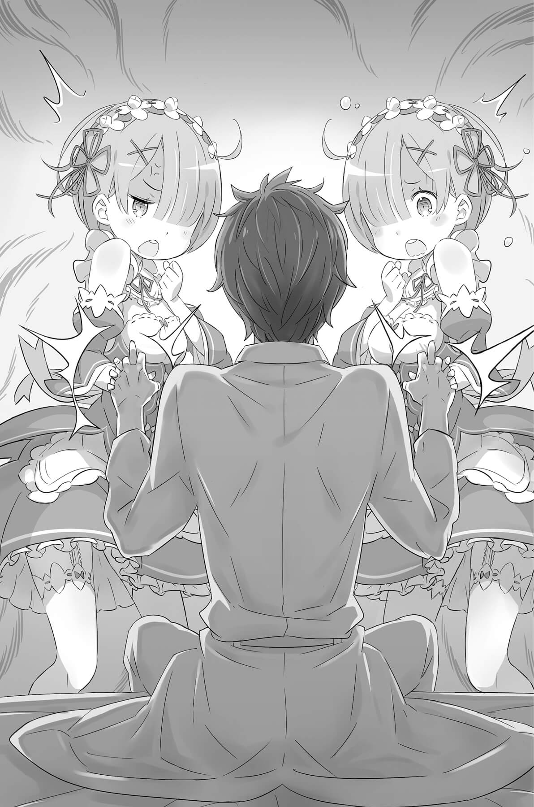

## 1

Для Субару Нацуки от потери сознания до возрождения прошёл один миг.

Всего за мгновение до этого его голова раскололась от удара о твёрдую землю, и мир окрасился алым. Но сразу же после того, как все ощущения исчезли, он почувствовал, что лежит в мягкой постели.

— Ох…

Юноша выдохнул, и тело, из которого смертельным ударом напрочь выбило дух, обмякло. Сердце мучительно сжалось, лёгкие сковал спазм, не позволяя сделать очередной вдох. Ещё бы! Такое с ним случилось впервые — броситься со скалы и покончить с собой!

Четвёртая смерть — самоубийство. Если учесть, что условия, при которых срабатывало Посмертное возвращение, не были до конца ясны, то жизнь Субару вполне могла бесповоротно закончиться прямо сейчас.

И тем не менее…

— Я всё-таки вернулся!

Стиснув дрожащие кулаки, Субару криво усмехнулся, глядя в белый потолок. Мягкая постель, источающая приятный аромат подушка, гладкие простыни… Те же самые предметы обихода гостевой комнаты, что встретили его в поместье Розвааля в самый первый день.

Но главное…

— Сестрица, сестрица! Наш дорогой гость, кажется, всё ещё изволит почивать!

— Рем, Рем! Наш дорогой гость такой молоденький, а совсем мозги отшиб!

Сёстры-близнецы стояли перед кроватью, держась за руки и разглядывая Субару двумя парами глаз.

Чёрные платьица и белые фартучки. На головах — ослепительно-белые наколки и одинаково остриженные короткие волосы, у одной голубого, а у другой розового цвета. Миловидные лица, сохранившие выражение детской непосредственности… Однако сёстры, вдвоём обслуживавшие всё поместье, и были той самой причиной, по которой Субару совершил очередное Посмертное возвращение.

Слушая до боли знакомые голоса и наблюдая виденные много раз жесты, Субару чувствовал, как его душа содрогается перед уже пятой по счёту «первой» встречей. Ему так много надо было им сказать, но в горле словно стоял ком, не позволяя словам выйти наружу.

Он смотрел на живую и здоровую Рем, на всё такую же нахальную Рам, чувствуя, что они воспринимают эту встречу как некое обыденное явление, и ощущая, как в груди теснятся невыразимые чувства.

— Дорогой гость, дорогой гость! Что с вами случилось? Вам плохо?

— Дорогой гость, дорогой гость! Вам нехорошо? У вас припадок хронической болезни?

Положив руку на грудь, Субару потупился, и сёстры растерялись. Встав у кровати справа и слева, они с двух сторон протянули свои маленькие ручки к юноше, пытаясь поддержать его. И эти ручки…

— Позвольте-ка.

— Эй!

— Что?

Не дожидаясь их согласия, он поймал руки обеих девушек, переплетясь с ними пальцами. Не обращая внимания на удивлённо застывших сестёр, он наслаждался теплом их тонких пальчиков.

— Да, всё точно! Я не ошибся!

Субару помнил это ощущение, тепло их рук, что спасало его самой страшной ночью. Его решение прыгнуть со скалы не было случайным…

— Нет-нет, дорогой гость. Вы явно ошибаетесь.

— Нет-нет, дорогой гость. Наверняка ошибкой было само ваше рождение.

В ответ на бесцеремонное поведение Субару сёстры отдёрнули руки и закидали его упрёками. Но Субару лишь кивал в ответ на их слова, звучащие сейчас волшебной музыкой.

— Если подумать о том, что случится позже, не стоит радоваться… но сейчас мне так хорошо.

— Сестрица, сестрица! Наш гость, похоже, весьма странный человек — он наслаждается, когда его ругают!

— Рем, Рем, наш гость какой-то извращенец, он возбуждается от оскорблений!

Судя по этим словам, гостя слишком уж быстро перестали считать гостем, но он, смеясь, пропустил издёвки мимо ушей. Раз уж приходится вот так, в буквальном смысле исправлять первое впечатление от встречи с девушками…

Настороженность, если не отвращение на физиологическом уровне, которую и не думали скрывать сёстры, не остановила Субару. Он слез с кровати, наклонился и затем выпрямился, проверяя, как работают мышцы, и с улыбкой обратился к девушкам, которые подозрительно смотрели на него:

— Простите, болтаю неизвестно что и даже не представился. Но теперь, когда я извинился, должен вам кое-что сказать.

Рам и Рем напряглись, глядя на Субару, который с преувеличенно важным видом скрестил руки на груди. Появившаяся во взглядах сестёр внимательность говорила о том, что девушки уже начали его оценивать. Если Субару Нацуки не сумеет завоевать доверие сестёр и всех прочих обитателей поместья, он снова лишится покоя и станет свидетелем крушения всех своих надежд. Значит, в этом круге нужно действовать очень аккуратно, чтобы не внушить окружающим необоснованных опасений.

— Эх, научился бы нормально с людьми общаться, и школу бы не пришлось прогуливать…

Слушая его бормотание, сёстры одновременно слегка наклонили головки с вопросительным выражением на лицах. Двигаясь в унисон, они выглядели так забавно, что Субару даже в этот напряжённый момент немного успокоился и расслабился. Он уже знал, что нужно говорить и как именно действовать.

— Я доверяю вам, так что давайте жить дружно!

Как и в первом круге, он изо всех сил пытался завоевать расположение девушек. Конечно, теперь у Субару были некоторые знания о будущем, и он смутно надеялся всё исправить, однако внутренняя сущность юноши никак не изменилась. Он просто изо всех сил пытался приспособиться к ситуации, в которую попал.

В ответ на заявление гостя сёстры переглянулись, словно что-то обсуждая без слов. Наблюдая за их безмолвным общением, Субару вдруг перевёл взгляд на двери — в комнату как раз вошла девушка. Серебристые волосы до талии, белая, словно прозрачная, кожа. Неземное создание с фиалковыми глазами, в которых можно было утонуть, словно в колдовских озёрах… Эмилия!

Заметив взгляд Субару, она обвела взором присутствующих и легко улыбнулась.

— Пришла посмотреть, что за шум. Субару, я рада, что с тобой всё в порядке.

— На душе лежал камень, но он исчез словно по волшебству, как только я увидел тебя. Для моего сердца нет более целительного лекарства, чем пилюлька любви по имени Эмилия-тан[^1].

— Прости, не пойму, что ты такое говоришь.

Как и всегда, стоило ему сболтнуть лишнее — и на красивом лице Эмилии сразу возникло удивлённо-подозрительное выражение.

— Ах, какое у тебя милое лицо, даже когда ты огорчаешься… Оно просто дышит свежестью, Эмилия-тан!

— Эти слова почему-то звучат неприятно. Но с добрым утром. Рада, что ты в порядке.

Кислая гримаска сменилась нежной улыбкой, обращённой к Субару.

На временной оси Эмилии это была первая их встреча после совместных приключений в столице. Юноша покорно воспринял её слова: видимо, Эмилия успокоилась, узнав, что передряга завершилась благополучно и Субару жив.

— И тебе доброе утро. Ну что, начнём, пожалуй? — улыбнулся Субару, но девушки, конечно, не поняли, что он имел в виду, и удивлённо глядели на гостя. Увидев их схожую реакцию — словно у трёх сестёр, — Субару не выдержал и громко рассмеялся.

— Итак, новая неделя в поместье Розвааля, — сказал он сам себе, ни к кому конкретно не обращаясь.

«Что ж, начнём историю заново!»

Ради того, чтобы встало солнце долгожданного счастливого утра, ради всех обитателей этого особняка, ради себя самого…

Первое утро в поместье Розвааля начиналось в пятый раз.

## 2

Чтобы пережить первую неделю, Субару требовалось решить две непростые задачи.

Во-первых, нужно было завоевать доверие здешних обитателей. Это относилось не только к Рам и Рем: необходимо было как-то договориться и с их хозяином, Розваалем. Если девушки заподозрят Субару в недобрых намерениях, то его, скорее всего, просто убьют, чтобы навсегда заткнуть рот.

Во-вторых, требовалось как-то победить колдуна, который напал на поместье. Однако у Субару пока что не было ни малейшего представления о том, как справиться с этой проблемой.

Враг уже несколько раз убивал Субару и Рем, никак не проявляя своей истинной сущности. Если, заручившись доверием сестёр, одолеть неизвестного злодея, можно будет вырваться из нынешнего круга! Вот главное условие победы, которое Субару выявил после того, как четырежды умер.

Но сейчас оставалось слишком много неясных условий в решении главной задачи, и Субару никак не мог определиться, с чего же начать. Однако, понимая, что угодил в тупик, он всё же отринул гнетущие предчувствия и с надеждой взглянул в будущее.

Как бы высока ни была стена, преграждающая путь, он должен бросить ей вызов! Субару вернулся и сделал это, не имея никаких гарантий успеха. Он встал на этот путь, пройдя через самоубийство, и теперь отступать некуда… даже если впереди его снова ждёт смерть…

## 3

— Ита-а-ак, Рам, ка-а-ак ты его находишь?

Взошедшая на ночное небо луна осветила секретное совещание в кабинете на верхнем этаже главного здания поместья. Сидящий за столом чёрного дерева мужчина задал вопрос с необычной интонацией, растягивая звуки.

Это был красавец с длинными волосами цвета индиго и болезненно-бледной кожей; его вид словно говорил о бренности всего сущего. Нанесённый на лицо шутовской грим и нарочитая небрежность интонаций дополняли необычный образ.

За столом сидел не кто иной, как хозяин особняка, Розвааль L. Мейзерс. В секретном совещании участвовали двое: сам Розвааль, который сидел, сложив руки на столе и растянув губы в улыбке, и служанка Рам, устроившаяся напротив. Услышав вопрос, девушка наклонила голову и задумалась. Наблюдая её колебания, Розвааль поднял одну бровь, будто увидел что-то необычное.

— Хмм, На-а-адо же! Рам, ты всегда такая быстрая в своих суждениях, а тут заду-у-умалась. Ре-е-едкое явление. Неуже-е-ели за целый день не успела его оценить?

— Нет, дело не в том, господин…

Словам девушки явно не хватало уверенности, и, коснувшись пальцами губ, Рам, всё так же колеблясь, добавила:

— У него — у этого Барусу определённо нет каких-либо способностей. В качестве работника он ничем не лучше любого новичка. Проблема не в оценке.

— Вот как… А ведь он сам попросил нанять его. О-о-очень уж странно всё это.

Вспомнив утреннюю сцену в столовой, Розвааль хихикнул. Тогда, пригласив проснувшегося гостя к столу, хозяин заговорил о награде за его заслуги. Впечатление, которое произвёл Субару, можно было сформулировать так: имеет кое-какое образование и достаточную сообразительность, в целом может за себя постоять.

Гостю дали неплохую оценку, но эта оценка говорила о том, что с ним нужно быть настороже. Поэтому Рам, назначенная ответственной за обучение юноши, получила указание следить за ним и теперь явилась к хозяину, чтобы доложить о результатах наблюдений. Розвааль, конечно, не надеялся, что служанке удастся разобраться во всём за один день или что противник раскроет свои истинные замыслы, но замешательство Рам не могло не настораживать.

Девушка ещё помолчала, а потом ответила, взглянув на Розвааля, который сидел, подперев щёку и прикрыв один глаз:

— Дело в том, что у Барусу есть кое-какие странности.

— Так-так, выкла-а-адывай. Расскажи обо всём, что тебя беспокоит!

— Похоже, что у него вообще нет никаких талантов, но Барусу… как бы это сказать… в общем, временами он слишком сообразительный.

— Что значит «сли-и-ишком сообразительный»?

— Это, конечно, ерунда… Но когда Барусу выполняет поручения, кажется, будто он прекрасно знает особняк! Например, где лежат инструменты, хотя ему не показывали. Или, когда убирает посуду, в правильном порядке расставляет её на полках. Ещё… ему известно, какой именно чай любим мы с Рем…

— Хм…

Розвааль ничего не сказал на слова Рам и молча потере бил пальцами подбородок. Покосившись на хозяина, девушка продолжила:

— Конечно, это мелочи… После завтрака я устроила ему короткую экскурсию по поместью и всё показала. Сама же тем временем подмечала, куда он бросает взгляды… Это мелкие детали, но…

— М-да, многовато для простого совпадения… Стра-а-анно.

Подозрения начинаются с мелочей! И, судя по всему, Субару заранее изучил поместье, ещё до того, как попасть в него.

Впрочем, тогда становилось непонятным другое.

— А как же его столичные подвиги в защиту госпожи Эмилии?!

— Для уловки это слишком сложно. Да и вообще, если бы не госпожа Беатрис, он действительно мог бы расстаться с жизнью.

Недавние события были свежи в памяти Розвааля. Он не лечил Субару сам, но и предположить, что Беатрис замешана в этом деле и покрывает юношу, никак не мог. Да и Рам, возвращаясь из столицы, сопровождала раненого. Сложно поверить, что Субару удалось провести их обеих.

— Но в таком случае, выхо-о-одит, мы сли-и-ишком глубоко копаем.

— А та, напавшая на госпожу Эмилию в столице? Как её… Охотница за потрохами? Вдруг он вступил с ней в сговор, намереваясь проникнуть в поместье?..

Рам и сама понимала, что это маловероятно, и её голос звучал неуверенно, Розвааль покачал головой:

— Не-е-ет, это невозможно. По кра-а-айней мере, в совместных действиях Субару и Охотницу за потрохами можно не подозревать.

— Вы… вы полагаете?

— Ещё что-то тебя беспокоит? — спросил Розвааль, явно желая услышать продолжение, и Рам задумчиво опустила глаза.

— Если не считать его излишней сметливости… Барусу ужасный оптимист, прямо тошнит.

— В смысле?

Розвааль нахмурился, глядя, как Рам подыскивает слова. Понимая, что не сумела как следует объяснить, и явно нервничая оттого, девушка продолжила:

— Он всё время болтает без умолку, а если у него что-то не получается, всё равно не перестаёт улыбаться. Да и вообще, как-то невероятно предупредителен по отношению к нам…

— И что-о-о ты думаешь?

— Это совсем не то, что я слышала от госпожи Эмилии. Она сказала, Барусу словно ребёнок, всегда искренне говорит о своих желаниях и настолько простодушен, что его невозможно не любить… Вот я о чём, — ответила Рам на вкрадчивый вопрос.

Розвааль, который общался с Субару совсем недолго, не до конца уяснил, что именно мучило Рам, но не мог игнорировать слова преданной служанки, которая была при нём долгое время. Выслушав её, он задумчиво поднял голову:

— Ита-а-ак, ясно, что за этим способным молодым человеком надо некоторое время понаблюдать. Сегодня лишь первый день, коне-е-ечно, ты ещё не успела раскусить его. Что же касается любезности, которую он оказал нам, выручив госпожу Эмилию, то его непременно надо как сле-е-едует отблагодарить.

— Но всё же… если…

Рам говорила уклончиво, словно не желая слышать того, что последует дальше. Выражение лица девушки не изменилось, но Розвааль знал, что она имеет в виду, — наверное, это тоже было результатом их давнего знакомства. Наблюдая за её колебаниями своим жёлтым глазом и чуть склонив голову набок, он проговорил:

— Этот случай нужно расследовать со всей осмотрительностью. Ты, как старшая сестра, должна проследи-и-ить, чтобы Рем не бросалась вперёд очертя голову.

Рам с готовностью кивнула в ответ на указания хозяина. Действительно, Рем, служанка, отсутствовавшая на этом секретном совещании, нередко принимала необдуманные решения и кидалась их исполнять. Обычно её можно было урезонить с помощью мягкого выговора, но в такой деликатной ситуации, что сложилась сейчас, поспешность грозила обернуться нежелательными последствиями. Кроме того, Рем могла попытаться заблаговременно устранить потенциальную опасность и при этом полностью испортить отношения с Эмилией.

Подобный исход явно не устраивал Розвааля, поэтому Рам пообещала:

— Конечно… я сделаю всё, чтобы Рем не перестаралась из-за недоверия к Барусу.

— Будь так добра. Сейчас очень важный момент… Да, скоро настанет час икс, — каким-то усталым голосом пробормотал Розвааль и откинулся на спинку кресла, заставив её заскрипеть. Рам хотела было ещё что-то спросить, но закрыла рот, так ничего и не сказав. В комнате, наполненной холодным ночным воздухом, воцарилось молчание.

— Ну что, Рам, у тебя всё-о-о?

— Да… Извините, что не смогла сообщить ничего существенного.

— Я не виню тебя за это. Давай-ка лучше перейдём к нашему главному делу. Уже две ночи прошло. Наве-е-ерное, саднит?

— А… да.

Рам подчинилась мановению пальца Розвааля, словно сомнамбула. Двинувшись на дрожащих ногах к сидящему за столом хозяину, она робко примостилась у него на коленях.

— Простите…

— Это всего лишь осуществление естественного права. Мы ведь постоянно так делаем, и стыдиться тут не-е-ечего. Это драгоценное тело принадлежит не то-о-олько тебе, не правда ли?

Проведя рукой по щеке девушки, он заставил Рам, слегка прикрывшую глаза, взглянуть вверх. Перебирая пальцами розовые волосы, Розвааль зажмурил один глаз и поглядел сверху вниз другим, жёлтым.

— Ну, если вспомнить, кто он для нас, мы должны быть друзьями, верно? — пробормотав эти слова больше самому себе. Розвааль переключил рассудок в иной режим. Теперь он смотрел только на Рам, концентрируя своё внимание лишь на ней.

Ночь первых суток в поместье Розвааля была уже на исходе, когда тайное совещание хозяина и его служанки завершилось.

## 4

— Гуд морнинг! Сегодня снова ясный день, идеальная погода для стирки! Пусть целый день будет хэппинес!

Поприветствовав громким троекратным ура восходящее солнце, Субару зааплодировал сам себе.

Это был пятый цикл в поместье, утро второго дня.

Субару стоял в самой середине двора и делал круговые движения корпусом, подставляя тело под лучи солнца. Утренняя «радиозарядка» помогала разогнать кровь по телу и превратить накопившуюся во время сна энергию в жизненную силу.

— А теперь виктори! — В завершение зарядки Субару вытянул обе руки к небу и с победным криком встретил начало нового дня. Вытирая слегка вспотевший лоб, он с улыбкой обернулся на голос, раздавшийся со стороны.

— Ты и сегодня такой бодрый с утра…

— Ну-ну, кто бы говорил, Эмилия-тан, Тебе тоже надо привести себя в хорошее настроение!

Эмилия, как всегда с утра общавшаяся с низшими духами в тени дерева, что росло на краю двора, натянуто улыбнулась. Рядом с ней, старательно умывая лапкой мордочку, плавал в воздухе Пак — дух в обличье кота.

— Вот гляжу, как он умывается, — ну настоящий кот! Вообще, интересно, духов клонит в сон? А проспать и опоздать они могут?

— Вы ведь тоже становитесь сонными, когда накапливается усталость? — поинтересовался Пак. — Вот и у духов, когда маны — источника жизненной энергии — остаётся мало, происходит нечто похожее. Если её не поднакопить… Уа-ха-ха-мяу.

Заразившись от Пака, Эмилия тоже слегка зевнула, прикрыв рот рукой.

Субару, глядя на их сонные движения, пожал плечами.

— Что, так за разговорами и просидели вдвоём всю ночь напролёт? Или, может, выясняли до утра, кто кому нравится? Я тоже хочу поучаствовать! Хм, кто же моя любимая? Моя любимая… ой, право, даже неловко…

Скрестив на груди руки, Субару потупился, искоса поглядывая на Эмилию.

Та лишь замахала рукой на разыгранное им представление:

— Ладно, ладно. Я люблю Пака, Пак любит меня, Конец разговора.

— Взаимная любовь?! А где же место для меня?

— Обойдёшься, мяу! Лия просто млеет от моего обаяния. Ты, Субару, может, и неплохой парень, но куда тебе до меня. Так что забудь про Лию… Мяу-мяу!

Субару набычился и двинулся на вызывающе прищурившегося Пака, но только они начали шуточную потасовку, как рядом возникла Эмилия и схватила каждого за ухо.

— А ну, не увлекайтесь! Будете себя так вести, я ведь и разозлиться могу!

— Ой-ой, да она уже сердится! — в унисон заверещали Субару и Пак в ответ на заслуженную кару.

Эмилия отпустила их уши и, уперев руки в боки, смотрела, как они потирают больные места.

— Я рада, что вы подружились, но нечего потешаться над людьми! Понятно? А ну-ка, отвечайте!

— Д-а-а-а! — подняв руки, энергично закивали озорники.

Даже строгое обращение — как с шалящим ребёнком — не мешало Субару любоваться улыбающейся «воспитательницей». Не замечая, как он тает от её улыбки, Эмилия внезапно хлопнула в ладоши.

— О, как раз вовремя! Субару, пойди-ка сюда.

Усевшись на газоне, она похлопала по траве рядом с собой.

Поняв, что это означает «садись», Субару отреагировал в ту же секунду и мигом оказался рядом с ней:

— Ты позвала — я прилетел. И вот он я! А что, что такое?.. Для чего «вовремя»? Я, Субару Нацуки, — верный слуга, который может выполнить любую просьбу! Эмилия-тан, почесать тебе спинку там, куда ты не можешь сама дотянуться?

— Я просто велела подойти, а ты устроил такой концерт. Ну что же с тобой делать?.. — как обычно, устало усмехнулась Эмилия в ответ на чрезмерно энергичную реакцию Субару. — Я о другом. Вчера ведь был первый день твоей работы, верно? Ну и как, справился?

— Процентов на восемьдесят провалился!

— Смотрю, ты так уверен в себе… Что?! Провалился?! На целых восемьдесят процентов?

— Ну, восемьдесят — это, конечно, преувеличение… Процентов на шестьдесят… или нет, на семьдесят пять примерно.

— Но ведь всё равно получается, что ты гораздо больше ошибался, чем делал правильно! — Эмилия заметно расстроилась, то ли видя, как низко Субару оценил свои труды, то ли оттого, что чувствовала ответственность за нового работника. Правда, она тут же заботливо глянула на него, словно желая подбодрить.

— Хм, но, получается, двадцать процентов работы, которую ты делал в первый раз, удались? Значит, всё будет в порядке, ты научишься. Ну же, поверь в себя!

— Точно! Делал в первый раз, а двадцать процентов получилось! Это же отличный результат! Начну с двадцати и буду расти всё выше и выше!

— Перестань бахвалиться! Лучше подумай про свои ошибки!

— Если взялась меня баловать, так не останавливайся на полдороге! Ой, не то сказал, не обращай внимания, виноват!

Под пристальным взглядом Эмилии Субару мгновенно съёжился.

Как бы там ни было…

— Вообще-то я повторял за Рем и Рам, но до них мне как до луны. Выложился по полной программе, но двадцать процентов — это мой максимум сейчас, ничего не поделаешь… Хотя я обязательно научусь, чтобы в дальнейшем на меня можно было положиться!

— Что ж, раз ты сам так оптимистично настроен, я тоже не буду тебя критиковать…

В ответ на бодрое высказывание Субару Эмилия немного надулась и закусила губу. Иногда она вела себя совершенно по-детски, и сейчас это было так мило, что у Субару сердце ёкнуло в груди. Но он взял себя в руки и, подавив порыв нежности, шутливым жестом наставил на Эмилию указательные пальцы обеих рук:

— Так-так, стало быть, сегодня я продолжу учиться под руководством сестрёнок-служанок и вести жизнь прилежного слуги. Но когда устану, непременно прилечу на коленки к Эмилии-тан, так что смотрите, пусть их никто не занимает!

— Если слушать половину того, что ты болтаешь, будет в самый раз!

— Такое милое личико — откуда же столько язвительности?! Но раз половина, то одно колено меня вполне устроит. Итак, на сегодняшний вечер я зарезервировал ваше колено, Эмилия-тан! Пак, чур, не занимать!

Пак, на которого Субару указал пальцем, принял вызов и демонстративно встопорщил усы:

— Пфф! Ты появился позже, и, что бы ни говорил, Лиа уже по договору отдала мне и тело, и душу. И наша связь… Мяв-мяв-мяв!..

— И без моего ведома этот договор изменять нельзя!

Эмилия, схватив за уши Пака, который не извлёк урока из прошлого наказания, затрясла его в воздухе, заставляя признать неправоту. Впрочем, Пак, судя по всему, привык к такому обращению и всё с тем же безмятежным выражением мордочки радостно болтался в руках Эмилии. Такой непосредственности в отношениях можно было только позавидовать…

— Что ж, подзарядился утренней энергией — можно и за работу!

— «Подзарядился»? Это что же ты такое делал?

— Ну разве плохо немножко позаигрывать с Эмилией-тан?

— Ты опять расшалился! Будешь так людей дразнить, тебе никто потом не поверит, если вдруг захочешь сказать что-то серьёзно!

— О, я знаю похожую сказочку и всегда думал, что тот мальчишка сам виноват…

— И это ты мне говоришь?

Смущённо засмеявшись в ответ на изумлённый взгляд Эмилии, Субару встал, отряхивая одежду.

— Пожалуй, мне пора, а то и вправду заругают. Сегодня я должен заниматься завтраком. Эмилия-тан, ты ведь, кажется, перенц не любишь? Если попадётся, я вытащу.

— Хоть и не люблю, надо есть… А я разве тебе говорила, что не люблю? — Эмилия удивлённо наклонила голову, но Субару лишь улыбнулся и помахал рукой.

Она действительно говорила, к тому же он видел это своими глазами.

Чувствуя на себе взгляд Эмилии, Субару принялся дурачиться, специально раскачиваясь из стороны в сторону.

Сконцентрироваться, не расслабляться! Главное — сделать всё, чтобы улыбка не исчезла с её лица…

Провожая взглядом удаляющегося шутовским парадным шагом Субару, Эмилия тихонько вздохнула.

Вздох колыхнул шёрстку Пака, который сидел на её ладони. Кот поднял голову:

— Что с тобой? Ты чем-то расстроена?

— Как-то неспокойно на душе. Это… не объяснить.

Эмилия запнулась, пытаясь выразить свои сомнения, но слова застряли в горле и, превратившись в очередной вздох, исчезли.

Наблюдая за внутренней борьбой Эмилии, Пак облизал свой розовый носик.

— Тебя беспокоит Субару? Не припомню, чтобы ты так о ком-то волновалась.

— Не думай, будто я неспособна общаться с людьми! Я прекрасно умею, мне просто не выпадал случай…

Эмилия надула щёки, скорчив Паку гримаску, которую вряд ли хоть раз видел кто-то другой. С Паком она не стеснялась и порой капризничала, словно ребёнок, но такое поведение на самом деле было знаком высшего расположения. Чувствуя это доверие, дух улыбнулся девушке, словно родной дочери. Уловив чувства, которые Эмилия не могла выразить словами, Пак кивнул.

— Неудивительно, что это тебя мучает. Не очень-то удобная получается ситуация.

— Неудобная ситуация?

Эмилия говорила спокойно, но выражение её лица стало напряжённым, так как она не упустила вложенный в эти слова смысл.

Вообще, Пак всегда вёл себя одинаково, в каком бы переплёте ни оказывался. Неизвестно, присуще ли это всем духам, или таков был конкретно его характер, но Пак начинал говорить столь серьёзно лишь в те моменты, когда требовалось принять очень важное решение, причём сделать это предстояло самой Эмилии.

Девушка замерла, а Пак, играя усами, сказал невозмутимым тоном:

— Я чуток к нему притронулся — у Субару душа не на месте. Конечно, он не показывает, что творится внутри, но, если так и дальше пойдёт, надолго его не хватит.

## 5

Рем удивлённо подняла голову, услышав громкий звук бьющейся посуды.

— Донт майнд, донт майнд! Всё в порядке!

С этими словами молодой человек в униформе слуги — Субару — принёс метлу, выполнив по дороге парочку танцевальных па. Он споро убрал валяющиеся под ногами осколки и изобразил, будто вытирает пот со лба. Затем, заметив Рем, которая пристально наблюдала за происходящим, он сверкнул зубами в лукавой усмешке:

— Не бойся! Если быстро навести порядок, пострадавших не будет, отвечаю!

— Такое рвение, конечно, похвально, но ведь вазу уронил ты сам, Субару. Я принесу другую, вытри пол и займись цветами…

— Нет-нет, не беспокойся! Я и вазу принесу, и цветы расставлю! У тебя ведь своя работа есть!

Опередив Рем, Субару ринулся в кладовую и через несколько минут действительно вернулся с вазой. Мигом водрузив её на старое место, он налил воды и поставил цветы, благодаря чему комната обрела прежний вид.

— Фф-у-у! Выполнишь работу — и так приятно на душе, правда, Ремрин?

— Вообще-то ты сам себе эту работу создал, сам её и вы полнил! Субару, а когда ты успел узнать, где вазы? У сестрицы спросил?

— Я… э-э… ну да, у сестрицы. Она сказала: «Ты же непременно какую-нибудь вазу разобьёшь, давай-ка я сразу покажу, где тут у нас вазы стоять!»

Слушая дурацкие отговорки, Рем не спешила хвалить сестру за предусмотрительность. На самом деле Рем сейчас волновало другое. Субару слишком хорошо знал поместье! Он моментально нашёл метлу, чтобы убрать осколки, а затем не задумываясь направился к мусорному баку… Не верилось, что это делает человек, всего пару дней назад нанятый на работу! Но едва Рем собралась выразить своё недоверие словами, как…

— Ну что? Наверное, у тебя полно дел? Можешь смело доверить их мне! Я выполню всё, что надо, — заявил Субару, вернувшись к ней.

Это было трудно понять! Злодеи и враги подобным образом себя не ведут, но и люди без задних мыслей тоже так не поступают. Никак не сходится! Если у него есть что-то на уме, откуда искренние слова и открытый взгляд? Похоже, он действительно изо всех сил старается преуспеть в работе по дому и наладить отношения…

Рем нахмурилась, отгоняя симпатию, вызванную неподдельным старанием юноши. Но от вида Субару, который безропотно трудился изо всех сил, у неё слегка заныло в груди.

— Субару…

— Ой, совсем забыл, меня же Рамчи попросила кое-что сделать! Извини, я сейчас, быстренько, Закончу — и сразу к тебе!

И не успела Рем его окликнуть, как Субару помчался по коридору и скрылся вдали. Рем опустила протянутую вслед руку и уже было повернулась, чтобы пойти к сестре посоветоваться и разобраться в ситуации, но…

— Нет, он не стоит того, чтобы отвлекать сестрицу!

И Рем вернулась к работе, словно пытаясь загасить не утихающую в сердце тревогу.

## 6

*Мне плохо.*

— Эй, Рамчи! Ты это видела?! Смотри, как я за один день научился управляться с кухонным ножом! Не иначе, во мне раскрылся талант!

*Плохо-плохо-плохо-плохо-плохо.*

— Ремрин, смотри, смотри! Как ловко получается — мои пальцы просто творят чудеса! Теперь я словно иллюзионист!

*Плохо-плохо-плохо-плохо-плохо-плохо-плохо-плохо.*

— Эмилия-тан, хватит так волновать моё сердце при каждой встрече! Я умру от сердечного приступа, и ты будешь виновата!

*Плохо-плохо-плохо-плохо-плохо-плохо-плохо-плохо-плохо-плохо-плохо-плохо-плохо-плохо-плохо-плохо-плохо-плохо.*

Он болтал что-то и паясничал с улыбкой на лице, усердно выполнял поручения, не боялся неудач, решительно бросал вызов сложностям, а закончив, тут же искал новое занятие. Субару мобилизовал свою память, перебирая события этих четырежды повторённых дней, чтобы намертво выжечь в мозгу все детали, даже самые незначительные.

По-другому никак. Он должен был это сделать.

Даже секунду нельзя потратить впустую! Нужно оценивать всё, что происходит, и прогнозировать результат. Как в игре — внимательно следить за поднятыми флагами[^2], ведущими к разным вариантам развития событий. Вроде бы раньше это у него неплохо получалось. Чем больше раз проходишь одну арку, тем выше вероятность успеха.

«Я должен научиться вызывать у них естественные улыбки. Надо сделать так, чтобы они смеялись над моими шутками».

Субару нарочно преувеличивал все свои действия. Пусть думают, что он глупец, которого не стоит остерегаться. Но в то же время нельзя, чтобы его сочли ни на что не годным дурачком. Он должен работать мозгами, не переставая оценивать свои поступки и планировать.

Он постоянно следил за всем странным, выбивающимся из привычной картины. Не расслабляться ни на мгновение, не то что на минуту!

«Нельзя проиграть. Нельзя! Нельзя!!!»

В голове непрерывно, без устали звучал набат. Сигнал тревоги, возвещающий об опасности. Попав в этот круг, Субару ещё не продвинулся ни на шаг, и лишь ощущение опасности обострилось до предела.

— Видишь, Рамчи? Я не филоню! Скоро всё доделаю в лучшем виде! А ты, как старшая, сможешь остаться в комнате и устроить себе сиесту!

Он подобострастно изворачивался, сверкая чарующей улыбкой.

Но удалось ли? Получился ли правильный Субару Нацуки? Не вызвал ли он подозрений? Вести себя осмотрительно требовалось не только с Рам — с Рем нужно быть в десять, в сто раз более осторожным! Он изо всех сил притворялся беззаботным Субару Нацуки, пряча неестественность за нарочито бодрым поведением.

Это было проще простого, ведь он играл самого себя. Требовалось лишь выглядеть толстокожим и бесцеремонным, игнорируя то, что думают о нём обитатели поместья, быть ленивой ограниченной свиньёй, хрюкающей в своём корыте и не обращающей внимания на то, что творится за его пределами. Ничего не знать, не уметь, не замечать. Не делать ничего, что могло бы привлечь к нему излишнее внимание. Болтаться вокруг и молоть языком, не снимая улыбающейся маски.

Всё поместье превратилось во вражескую территорию. Где на кого наткнёшься — неизвестно. Даже в свободное время нельзя расслабиться, ведь нужно проверить воспоминания о прошлом и обдумать план действий на будущее.

Внезапно к горлу подступила тошнота, а с губ сорвался стон, однако Субару удержал улыбку на лице. Всё тем же беззаботным танцующим шагом он дошёл до ближайшей гостевой комнаты, нырнул за дверь, бросился к умывальнику в углу и…

— У-э-э-э… бу-э-э-э… у-о-о-о…

…избавился от содержимого и так пустого желудка, выплеснув всё в раковину. Ещё раньше Субару стошнило всем, что он съел и выпил, и теперь выходил только желтоватый желудочный сок, но и он скоро кончился, и сухие позывы отдавались во внутренностях болью. Тошнота не проходила. Он наглотался воды из-под крана и сразу же избавился от неё. Словно выворачиваясь наизнанку, Субару повторил это несколько раз.

— У-э-э… у-э-э… а-а-а…

Иссиня-бледный, неровно дыша, он вытер рот рукавом.

Моральный груз просто убивал его. Если и дальше нельзя будет перевести дух, он просто умрёт от нервного истощения.

Субару хотел посмеяться над жалким положением, в которое сам себя загнал, однако ему не удалось выдавить даже слабой улыбки. В груди царили тревога и отчаяние, изо всех сил пытаясь вырваться наружу.

«Получается ли у меня?»

Если задуматься, самые лучшие отношения с обитателями поместья были в первый раз, когда он ещё ничего не знал. А начиная со второго раза и в общении с людьми, и в работе возникли проблемы. Именно из-за того, что он слишком много думал о событиях первого круга. Потому-то Субару и не удалось добиться доверия сестёр.

И теперь он непрестанно анализировал свои действия. Впрочем, во втором круге он провалился как раз потому, что пытался повторить первый… Требовалось найти лучшее решение!

А значит, все силы следовало бросить на ту работу, которую Субару делал сейчас, и добиться хорошего результата.

Тогда и Рам с Рем ничего не заподозрят, и одна из угроз, нависших над юношей, исчезнет.

— Да, но это пятьдесят баллов… Чтобы набрать все сто, надо выяснить, кто же такой этот колдун.

Даже если сёстры не убьют Субару, опасность, исходящая от колдуна, не исчезнет. Или Субару, или Рем — кто-то из них не встретит утро пятого дня, и по коридорам прокатится эхо отчаянного крика…

Ему очень хотелось немедленно сообщить всем причастным об опасности и вместе продумать план действий. Но это не представлялось возможным, ведь отношения не были достаточно доверительными, и главное — Субару не мог раскрыть источник информации.

Любая попытка рассказать о Посмертном возвращении привела бы к адским мукам. Конечно, юноша страшился боли, но ещё больше он боялся снова столкнуться с теми чёрными пальцами…

Надо было добиться доверия всех заинтересованных лиц и выяснить, кто такой этот колдун. Но времени катастрофически не хватало, и это сводило Субару с ума.

Он постоянно ломал голову над тем, что нужно сделать, но всякий раз обнаруживал себя в тупике. Вот и вчера вечером, попав в спираль бесконечных терзаний и не найдя ответа, юноша не смог сомкнуть глаз. Изнывая от бессилия, Субару пытался нащупать путь, но не видел выхода, хоть и понимал причины своих неудач. Он заплатил жизнью за возможность вернуться и всё равно остался бессильным глупцом…

— Вот дерьмо! Смотреть противно.

Его загнали в угол — отступать было некуда.

Жизнь, от которой он сам отказался… Но потерять её вновь было по-прежнему страшно!

Пятый круг в альтернативном мире… Субару не был таким оптимистом, чтобы полностью отринуть сомнения. Да, в этот раз он смог вернуться. А в следующий?.. Как знать…

Постоянно балансируя на краю пропасти, любые нервы истреплешь в лохмотья. Но если растерять решимость, необходимую для отчаянного рывка вперёд, как же тогда сражаться, рискуя собственной жизнью?

Субару не хватало мужества. Он был абсолютно заурядным, обыкновенным человеком и чем больше узнавал себя, тем больше убеждался в своей ничтожности. Аж самому противно!

— Значит, хныкать и блевать у тебя время есть, болван…

Чем тратить драгоценные минуты на нытьё, уж лучше лишний раз пошутить, чтобы создать о себе хорошее впечатление! Будет больше пользы! Справившись с тошнотой, юноша отхлестал себя по щекам, ещё раз обругал трусом и вышел из гостевой комнаты.

У него сейчас было свободное время, но потратить его на отдых Субару не мог себе позволить.

Так или иначе, нужно отыскать Рам или Рем…

— Наконец-то я нашла тебя!

Пока Субару пытался привести мысли в порядок, сзади его кто-то окликнул. Он обернулся и увидел запыхавшуюся Эмилию. В ту же секунду он заставил своё сознание резко переключиться в иной режим. Забыв резь в желудке, боль в груди и чувство одиночества, он собрал все силы, чтобы встретить Эмилию, и растянул рот в улыбке.

— Надо же! В кои-то веки Эмилия-тан зовёт меня! Какая радость, какая неловкость, какая редкость! Ради тебя я готов и в огонь, и в воду, и на воровской склад!

Загнав поглубже обуревающие его душу чувства, Субару приветствовал девушку с преувеличенной радостью.

Скоростью, с которой он перестроился, можно было бы гордиться, однако же Эмилия отреагировала неожиданно. Субару думал, что она состроит привычную осуждающую гримаску или устало вздохнёт, но вместо этого…

— Субару…

— Эй-эй, настоящая Эмилия-тан сейчас должна бы… Ай! Неужели подделка?! Но разве может кто-то натурально изобразить такую милую красавицу, которую так и хочется обнять?

Чушь, которую он нёс, годилась разве на то, чтобы вызвать новую отповедь, но и здесь реакция Эмилии оказалась слишком сдержанной. Не оправдывая ожиданий, она смотрела на Субару глазами, полными жалости.

«Здесь что-то не так!» — взывала к осторожности его интуиция.

— Что?! Эмилия-тан молчит?! Наверное, это какая-то ловушка для хитрецов вроде меня, подкатывающих к девушкам исподтишка? — без умолку трещал он, а внутренний голос кричал всё громче: «Что-то не так, что-то не так!»

Не возмущаясь и не сердясь, Эмилия, как и прежде, смотрела на Субару глазами, в которых чувствовалась боль.

«Неужели она видит насквозь через мою маску неумелого шута?!»

Субару охватило ещё большее беспокойство, когда он вспомнил серого котёнка, всегда находящегося рядом с Эмилией. Этот котик-дух умел считывать чужие эмоции и со стояние души. Значит, он давно раскусил Субару, который только создавал видимость…

Теперь, когда всё стало понятно, Субару сразу растерял своё бахвальство. Натянутая улыбка исчезла, на лице появилось выражение, какое бывает у детей, боящихся наказания.

Какая дурацкая комедия: продолжать вытанцовывать перед видящим тебя насквозь собеседником в надежде что-то спрятать! Последние остатки самоуважения Субару разлетелись в осколки — ведь именно Эмилии он больше всего на свете не хотел бы это показать.

Воцарилось молчание.

Юноша не знал, что сказать. Эмилия тоже молчала, словно в поисках нужных слов, и лишь её длинные ресницы чуть вздрагивали.

«Эмилия совсем разочаруется во мне. А-а-а, только не это!»

И как назло, в голову Субару не приходило ровным счётом ничего, что помогло бы объясниться. Он даже несколько раз открывал рот, но беспомощно останавливался, не найдя достаточно смелости. Глядя, как он борется с собой, Эмилия внезапно негромко проговорила:

— Ладно. Субару, иди за мной.

— Что?

— Пойдём.

Эмилия решительно схватила Субару за руку и потащила в ближайшую гостевую. Вернувшись в комнату, из которой только что вышел, он состроил вопросительную мину, но девушка, не обращая на это внимания, осмотрелась, уперев руки в боки.

— Так, Субару, садись, — приказала она голосом, подобным звонкому колокольчику, и указала на пол.

Он посмотрел по направлению пальца. На полу лежал ковёр, и, хотя комнатой не пользовались, уборку здесь делали тщательно. Густой ворс ковра намекал, что на нём вполне можно поваляться.

— Но если сидеть, то можно и на кровати, и на стуле? Почему вдруг на пол?..

— Не спорь и садись.

— Так точно!

Повинуясь внезапно прорезавшейся строгости, Субару сам удивился той скорости, с которой сел на пятки и скромно сложил руки на коленях. Проследив, как юноша выполнил приказ, Эмилия довольно кивнула и шагнула ближе. Само собой, теперь ему пришлось смотреть на неё снизу вверх, но никаких неуместных мыслей не возникло. Он лишь изо всех сил пытался понять её намерения.

— Хорошо, — тихонько выдохнула Эмилия, словно обращаясь к самой себе. И опустилась на колени рядом с Субару.

В смятении от того, что Эмилия находится так близко, что её можно коснуться, Субару косился на девушку, пытаясь распознать эмоции на бледном лице, и вдруг заметил, как щёчку залил алый румянец и маленькое ушко тоже стало красным.

— Это особенный случай, понятно?

— Чего?!

Но ещё раньше, чем вопрос сорвался с губ, Субару по чувствовал какое-то давление на затылок. Тело, сидящее в ритуальной позе, не могло сопротивляться, и, подчиняясь давлению, его голова, описав дугу, улеглась на что-то мягкое.

— Немного… смущает. Да к тому же щекотно.

Под головой что-то завозилось, а сконфуженный голос Эмилии донёсся откуда-то сверху. Повернувшись, Субару широко раскрыл глаза, ещё больше поразившись неожиданному виду. Прямо над ним, почти прикасаясь, близко-близко нависло лицо Эмилии. Перевёрнутая вверх ногами прекрасная картина заставила его ошеломлённо осознать: «Я смотрю на неё снизу!»

Внезапная близость, головокружительная смена верха и низа, что-то мягкое под головой…

Ключевые слова собрались воедино, и в голове у Субару возник ответ.

— Я лежу у тебя на коленях?!

— Не надо вслух, я стесняюсь. И смотреть нельзя. Закрой глаза!

Его легонько щёлкнули по лбу, а потом на лицо опустилась ладонь, ограничивая обзор. Однако Субару отвёл маленькую руку, преодолевая сопротивление Эмилии, и выдавил из себя:

— Эмилия-тан, когда ты смущена, ты особенно прекрасна… А вообще, что это вдруг? Я совершил подвиг, за который мне положена награда?..

— Не нужно так храбриться.

Он снова получил по лбу. Однако в этот раз Эмилия не убрала руку, а мягко расчесала пальцами чёлку Субару. Щекотка заставила его сощуриться.

— Ты же сам говорил, Субару, что, если устанешь, хотел бы отдохнуть, положив голову мне на колени. Вот они, пожалуйста. Не думай, что я разрешаю это делать, когда только захочется, но сейчас — особый момент.

— А почему особый? Всего только второй день. Разве я выгляжу смертельно усталым или на ходу валюсь с ног?..

— Ты совершенно вымотался, это сразу заметно. Не хочешь рассказать, как в действительности обстоят дела? Не знаю, поможет ли… но единственное, что я сейчас в состоянии для тебя сделать, — выслушать.

Сочувствие, светившееся в её взгляде, не позволяло прибегнуть к очередным уловкам. Потеребив чёлку, тонкие пальцы как-то незаметно пробрались в его растрёпанные чёрные волосы и начали гладить по голове, словно утешая маленького ребёнка.

Субару хохотнул, попытавшись оттолкнуть руку Эмилии. Он хотел и дальше играть свою прежнюю роль, которую поклялся исполнять перед ней; хотел сказать, что Эмилия ошиблась и он вовсе не нуждается в сочувствии…

— Ха-ха, Эмилия-тан, зачем же ты… для меня… для меня…

Однако его голос задребезжал, дыхание перехватило, и слова застряли в горле. Ощущение мягких пальцев, гладящих его по голове, заслонило собою всё остальное.

— Ты же устал, правда?

— Да нет… нет, я справляюсь. Всё нормально…

— Тебе плохо?

— Если будешь так нежно со мной обращаться, я ведь влюблюсь. Если будешь так… так…

Слова, которые Субару произнёс в ответ на краткий вопрос, растворились в воздухе. Вереница пустых слов. Он и сам чувствовал, что они пусты…

И тогда Эмилия мягко наклонилась, приблизив к Субару своё лицо.

— Тебе пришлось так тяжело…

В её голосе звучала жалость. Звучало утешение. Звучала забота.

И от всего этого у Субару внутри словно прорвало плотину. Ветхая запруда сломалась, разлетелась на куски, и всё, что копилось за ней, разом выплеснулось наружу. То, что он желал запереть в глубине своего сердца, вырвалось яростной лавиной, которую уже невозможно было остановить.

— Мне было… очень плохо… Очень тяжело. Очень страшно и ужасно грустно! Так больно, что я чуть не умер…

— Понимаю.

— Я так старался!.. Правда старался! Я бился изо всех сил, жилы рвал, пытаясь всё исправить!.. Честно! Честно-честно! Я, наверное, ещё никогда в жизни так не старался.

— Да, я знаю.

— Потому что мне здесь нравилось. Потому что я почувствовал, как оно для меня важно, это место. Вот я и пытался всё вернуть, как только мог. Это было страшно. Ужасно страшно. Я так боялся снова увидеть этот день… Я умирал от страха и ненавидел себя за это…

Слова невозможно было сдержать. Они рвались на свободу, обнажая залитое слезами лицо труса, что было спрятано под улыбающейся маской. Слёзы не прекращались. Из носа текло. Изо рта Субару вместе с брызгами рвались сдавленные рыдания.

На это было противно смотреть. Он выглядел так ничтожно и жалко, что лучше было бы умереть! Здоровый парень рыдает на коленях у девушки, а та гладит его по головке! И от наполняющего сердце приятного тепла становилось ещё больнее…

Слушая рыдания Субару, Эмилия нежно кивала. Совершенно очевидно, что смысл слов, вырывающихся изо рта Субару, до неё не доходил. Однако её голос врачевал израненное сердце юноши. Он не знал почему; может быть, ему просто хотелось так думать. Однако факт оставался фактом: тепло Эмилии оказалось для него настоящим спасением!

Юноша продолжал рыдать на коленях у девушки, и слёзы текли ручьём.

Он плакал и плакал, и его жалкие всхлипывания постепенно замирали где-то вдали. И скоро в комнате было слышно только тихое сонное дыхание…

## 7

Погружаясь в сон, Субару ощущал в сердце мягкий тёплый трепет. Сейчас он уже понимал, что это за чувство.

Каждый раз, когда он видел Эмилию, каждый раз, когда говорил с ней, каждый раз, когда соприкасались их пальцы, биение в груди юноши усиливалось. Но раньше он и понятия не имел, как же назвать его, это незнакомое безымянное ощущение…

Стоило ему подумать об Эмилии, как лихорадка распространялась жаром по всему телу. И называлась эта болезнь — «любовь». Едва осознав, что заразился, человек теряет волю к сопротивлению. И Субару не был исключением. А значит…

Бесчисленные раны, страдания, удушающие рыдания, крушение надежд — всё это было ради того, чтобы спасти её. Спасти Эмилию.

Чтобы получить возможность день за днём идти рядом с ней.

Даже если Субару Нацуки придётся умирать снова и снова, его любовь будет жить.

## 8

Когда в комнату заглянула Рем, Эмилия продолжала ласково гладить чёрные вихры спящего Субару.

Беззвучно открыв дверь, Рем увидела эту картину и открыла было рот, но Эмилия приложила палец к губам: «Тсс». Подчиняясь жесту, Рем промолчала. Глядя с прищуром на тесно прижавшиеся друг к другу фигуры, она подошла ближе.

— Субару просто спит?

— Да. Ха-ха, смотри, он как ребёнок! Лицо так безмятежно, когда я глажу по голове, — сказала Эмилия, с удовольствием проводя рукой по волосам Субару, словно требуя от Рем согласия, Служанка кивнула.

— Вряд ли Субару сможет ещё работать сегодня.

— Да, пусть отдохнёт. Надо же, какой гадкий мальчишка! Всего второй день, как начал трудиться, и уже отлынивает. Когда наберётся сил, отругай его;

Эмилия тихонько засмеялась и снова принялась ерошить волосы спящего. Судя по всему, она и не собиралась отодвигать Субару, чтобы освободить ноги. Оценив ситуацию, Рем молча смерила взглядом юношу. Во сне его лицо выглядело совершенно невинным, словно у ребёнка, — ни следа напряжения или фальши. Совсем не та искусственная улыбающаяся маска, за которой Субару прятался, когда они в последний раз говорили во время работы. Теперь даже мысль о том, что он имеет тайный умысел, казалась абсурдной.

— Когда смотришь на него спящего, ничего такого не подумаешь, — пробормотала Рем скорее для себя, чем для Эмилии, и коснулась кончиком пальца чёлки Субару. Застывшее на его лице выражение, словно у безгрешного младенца, который ничего не знает об этом мире, заставило Рем слегка расслабить сжатые губы.

— Передам сестрице, что Субару сегодня ни на что не годен. Придётся по-другому распределить дела, — сказала Рем, вежливо поклонилась и повернулась, чтобы уйти.

Девушка должна была оповестить сестру (в это время Рам занималась уборкой в столовой), чтобы заново выстроить планы на ближайшее время.

— Рем, — услышала она и остановилась, а потом медленно, всем телом обернулась. Их с Эмилией глаза находились на разном уровне, поскольку та сидела на полу, но служанка невероятным образом почувствовала, будто на неё смотрят сверху вниз.

Эмилия, словно не замечая лёгкого удивления Рем, тихонько сказала:

— Субару — хороший мальчик.

Рем ответила глубоким поклоном и, больше не глядя на Субару и Эмилию, направилась к двери, оставив их наедине.

Она шла по коридору, не в силах выкинуть из головы последние слова Эмилии, сама не замечая, как затуманилось её бесстрастное лицо. И только где-то в дальнем уголке сознания Рем не давали покоя неусыпные подозрения…

[^1]: Вариация японского суффикса «тян», как правило, используется маленькими детьми. В среде любителей аниме и манги суффикс «тан» часто применяется по отношению к идолам и маскотам как более «тёплая» версия суффикса «тян».

[^2]: Речь идёт об игровом интерфейсе, свойственном, в частности, популярным в Японии визуальным новеллам, где выбор одного из вариантов, определяющего дальнейшее развитие событий, называется «поднятие флага».
