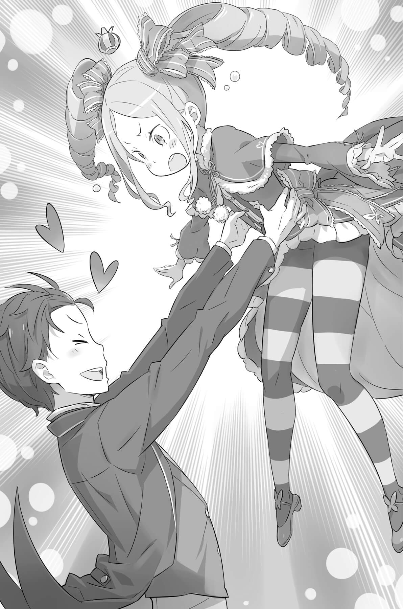

## 1

— Прикорнуть на коленях у девушки и сладко дрыхнуть, пока она гладит тебя по голове!.. Само по себе это, конечно, первоклассное приключение, но как же я посмел?! — красный до ушей, Субару в который раз повторял эти слова, стенал и буквально рвал на себе волосы.

Он вспоминал, как несколько часов назад полностью раскрыл перед Эмилией свою душу.

— Разрыдаться на глазах любимой и отключиться в слезах и соплях! К тому же на несколько часов полностью оккупировать её колени… ну ни стыда ни совести!

Он вспомнил чудесные ощущения от колен Эмилии и тот ужасный вид, который они в результате приобрели. Субару извозил её тунику соплями, и на это никак нельзя было закрыть глаза ни с точки зрения гигиены, ни с точки зрения его мужской самооценки. Однако Эмилия не будила Субару и даже, как ему показалось, когда он, проснувшись, униженно извинялся за испачканную одежду, вовсе не сердилась.

— Я рада, что тебе удалось немного отдохнуть. Только ты так и не понял главного.

— Чего не понял?

— Того, что человеку приятнее один раз услышать благодарность, чем сто раз — извинения. Зачем просить прощения, если я сделала это для тебя по доброй воле?

Не родился ещё мужчина, который при таких словах — особенно если к его бормочущим извинения губам приложить тонкий пальчик да ещё и подмигнуть — устоял бы на ногах. Субару вот, например, так и брякнулся на пол. Более того, теперь, когда он и сам понял, что по уши влюблён в Эмилию, вся эта сцена, то, что девушка сказала и сделала, было окутано ярким радужным сиянием.

Расставшись с Эмилией, которая ушла в комнату, чтобы переодеться, он некоторое время бродил по поместью как во сне, а теперь, придя в себя, сидел, неловко обхватив голову руками.

— Конец!.. Мне конец! Уж кому-кому, а Эмилии я совершенно точно не собирался показывать свои слабости. Ничего более постыдного я и сделать не мог! Как же теперь смотреть ей в глаза?!

— И это всё, что ты можешь сказать, вломившись посреди ночи в чужую комнату, мнится мне?! — укорила его сидящая на ступеньках невысокой стремянки девочка, одетая в платье со множеством оборок. Самобичевание Субару вызвало на миленьком личике искоса поглядывающей Беатрис лишь досадливую гримаску.

Расставшись с Эмилией, Субару решил, что в таком виде не может никому показаться на глаза, и притащился сюда, в хранилище запрещённых книг, где не встретишь кого-нибудь постороннего. Разумеется, хозяйка хранилища была недовольна. Однако он пришёл сюда не только по этой причине.

— Не говори так, малышка Беа. Мы же с тобой друзья!

— Бетти не имеет к тебе никакого отношения, мнится мне! Погоди-ка! Как ты сейчас меня назвал?! — лицо Беатрис вытянулось, а брови недоуменно поднялись вверх, но Субару уверенно хлопнул в ладоши.

— Малышка Беа! Знаешь, я уверен: чтобы показать, как мы близки, нет ничего лучше дружеских прозвищ. Из всех, кто живёт здесь, в поместье, только тебе пока не понравилась такая милая кличка!

Субару вспомнил предыдущий круг. В какой-то момент он испытал крушение надежд, и его настигло ощущение беспросветного одиночества. Тогда он практически принудил Беатрис помочь ему, используя угрозы, подмену понятий и лесть. Как ни странно, несмотря на такое начало, они действительно заключили крепкий договор.

В итоге юноша сам разорвал его в одностороннем порядке. Однако Беатрис, сославшись на неясные и двусмысленные условия соглашения, продолжала изо всех сил защищать Субару. И даже если нынешняя Беатрис ничего не помнит об этом, сам он никогда не забудет, что ощутил в тот момент…

— В общем, что бы ты там про меня ни думала, я буду называть тебя «малышка Беа». Это знак самой что ни на есть искренней любви, которую я только могу к тебе проявить.

— Не надо мне ничего! И не лезь со своими фамильярностями, меня от такой пошлости с души воротит! Это не просто противно — это настоящая гадость, мнится мне!..

— Вот те раз! Да что ты такое говоришь?! Я от чистого сердца пытаюсь высказать благодарность, а ты отбрыкиваешься!

— И что, ты можешь, положа руку на сердце, признаться, что сейчас не глумишься? Если да, то разговор между тобой и Бетти только выглядит как разговор, а на самом деле это что-то другое, мнится мне!

Почувствовав, что болтовня из ленивого перекидывания мячом превратилась в матч по регби, Субару примолк. Он действительно по-своему выражал дружеские чувства, однако у Беатрис, похоже, они не нашли отклика.

— Ладно, как скажешь. Но для меня ты малышка Беа!

— До чего же упрямый! Бетти не будет отзываться на такое прозвище, мнится мне!

— Ах, это звучит так холодно, малышка Беа.

Не отвечая, Беатрис уткнулась в книгу. Похоже, она решила сразу реализовать свою угрозу на практике.

Подойдя поближе к упрямице, Субару принялся нарезать круги вокруг стремянки.

— Ну что с тобой, малышка Беа? Всё в порядке, малышка Беа? Как ты поживаешь, малышка Беа? Может, случилось что? Расскажи мне всё, малышка Беа! Да что ты, малышка Беа? Неужели сердишься, малышка Беа? Ну же, малышка Беа!

— Беспримерная наглость, мнится мне! Ну, чего тебе надо?!

Беатрис, не привыкшая сдерживать свои порывы, была лёгкой добычей для Субару, достигшего изрядных высот в искусстве игры на чужих нервах. Глядя на сжавшую кулаки сердитую девочку, он улыбнулся уголком рта.

— Если честно, меня загнали в угол и окружили со всех сторон, хмурая моя, и мне нужна твоя помощь.

И он рассказал девчонке с локонами-пружинками о том, как опозорил себя постыдными рыданиями перед лицом той, что так нравилась ему.

## 2

Уткнувшись Эмилии в колени, Субару раскрыл свою душу, выплеснув вместе со слезами всю накопившуюся в сердце тяжесть и боль.

Он влюбился в Эмилию сразу же, но лишь теперь до конца понял, что значит любить…

Это чувство возникло с первого взгляда. Сердце дрожало при звуках её голоса. Разговаривая с ней, он словно пребывал во сне. Субару решил, что никогда не оставит эту девушку, которая так легко жертвовала собой ради других.

Тогда он считал, что любит её за это качество, но лишь теперь до конца понял, почему любовь к Эмилии переполнила его сердце.

В самом начале она спасла Субару, попавшего в незнакомый чужой мир. Она спасла его сердце, которое уже готово было разорваться, не выдержав безнадёжного отчаяния. Она спасла его жизнь и его душу. И теперь он не мог представить себе мира, в котором нет Эмилии.

Ему нравилось проводить свои дни в поместье с Эмилией, в которую он был ужасно влюблён. Ему нравилось узнавать всё новые и новые вещи об этом мире. Ему нравилась Рам, которая заботилась о нём, несмотря на её колкие замечания. Ему нравилась Рем, которая часто стыдила его, используя вежливые, но едкие обороты, однако не забывала учить всему, что требовалось. То же делала и Эмилия-тан, демонстрируя свою ангельскую сущность. Он был благодарен Розваалю, который предоставил ему пропуск в этот рай. И перед Беатрис он тоже был в неоплатном долгу. Он испытывал дружеские чувства ко всем обитателям поместья. Ему очень хотелось навсегда остаться здесь.

И эти чувства переполняли сердце Субару так, что оно готово было разорваться от счастья.

Но он помнил не только радостные минуты…

Он любил Эмилию и был в отчаянии от своей беспомощности, зная, что ему не хватит сил защитить её. Он жил в поместье, постоянно балансируя на грани провала. Он боялся Рам, которая владела «лезвием ветра», способным запросто перерезать горло. Он был в ужасе от Рем и её дробящего черепа стального моргенштерна. Его пугало скрытое сумасшествие Розвааля, который мог в любой момент приказать служанкам-близнецам безжалостно расправиться с Субару. Просыпаясь, он задавался вопросом, не лишился ли ещё жизни, и постоянное напряжение в ожидании беды было мучительно болезненным.

Все эти чувства также были реальны. Однако Эмилия спасла Субару до того, как эти противоречия разорвали его изнутри, она утешила и излечила его несчастное сердце, готовое остановиться в любой момент.

Когда Субару думал об Эмилии, его переполняла энергия. Мысли о ней не позволяли ему сдаться и сбежать.

— В общем, Э-Н-А, то есть Эмилия — Настоящий Ангел.

— Мне показалось, или ты сейчас пробормотал какую-то несусветную чушь?

— Ну что ты! Просто ещё раз вспомнил о том, что для меня важнее всего, — заявил он, выпятив грудь колесом в подтверждение полнейшей уверенности в своих словах.

Махнув рукой, Беатрис сделала утомлённое лицо.

— Давай вернёмся к делу. Ты сказал, что Бетти нужна тебе, мнится мне. Для чего?

— Да, я говорил совершенно серьёзно! Мне уже впору молить богов о помощи. Понимаешь, больше не на кого опереться.

В нынешней ситуации единственным человеком в поместье, которому Субару мог полностью довериться, являлась, конечно, Эмилия, но она была слишком дорога для юноши. Он не мог допустить даже мысли о том, чтобы подвергнуть её опасности. Для Субару всегда главным приоритетом была собственная жизнь, но теперь благополучие любимой значило намного больше. Поэтому он не собирался обращаться за поддержкой к ней или — чтобы было, по сути, одно и то же — к Паку.

А значит, выбора не оставалось…

— То есть ты, малышка Беа, как ни погляди, на самом деле очень добрая и намного милее, чем кажешься с виду.

— Хоть я и не понимаю ни слова, но прекрасно чувствую, что ты опять надо мной смеёшься!

— Даже не думал! Сейчас всё так обернулось, что я и правда могу положиться только на тебя…

Ясно, что ни Рам, ни Рем, ни тем более Розваалю открыться нельзя. Получается, кроме Эмилии Субару мог обратиться только к Беатрис.

— Прошу тебя! Правда, очень-очень прошу!

Субару опустился перед Беатрис на колени и покорно склонил голову. Ему был отчаянно нужен путеводный маяк, способный осветить дорогу и разорвать замкнутый круг отчаяния.

— Мне нужна твоя сила. Если коротко, я хочу защитить место, где могу быть счастлив, и всех его обитателей.

Ответа не последовало.

— Беатрис?

Юноша согнулся, уткнувшись лбом в пол, но почувствовал, что молчание затянулось, и всё же взглянул на Беатрис. Субару задохнулся от неожиданности — уж слишком сложные чувства смешались в этих глазах, пристально смотрящих на него. Беатрис нахмурила брови и закусила губу. Но, несмотря на то что она пыталась выглядеть сердито, Субару показалось, что девочка вот-вот расплачется.

Приоткрыв рот, чтобы заговорить, она отвела взгляд, словно никак не могла подобрать слова. Субару понял, что она колеблется. Ему совсем не хотелось её принуждать, но…

— Беатрис! Я понимаю, что ты не обязана выслушивать мою просьбу. Для тебя я всего лишь незнакомый тип, свалившийся на голову буквально вчера.

— Раз ты всё понимаешь, то поймёшь и ответ, который даст Бетти.

— Ты залечила мою рану, и я очень благодарен. Вряд ли ты помнишь, но на самом деле я должен поблагодарить тебя за целую кучу вещей. И всё же я снова вынужден обратиться к тебе за помощью, иначе не справлюсь. Стыдно, согласен. Просто позор. Но мне некого просить, кроме тебя.

Субару наседал, используя все доводы, приходившие в голову. Это было подло — подталкивать Бетти к невыгодному для неё решению, однако ничего другого Субару не оставалось. Видя, как искренне юноша склонил голову, Беатрис лишь фыркнула, по своему обыкновению.

— Пресмыкаешься, как червяк, и ноешь, какой ты беспомощный! Совсем нет гордости, мнится мне!

— Просто я наконец-то понял, что для меня важнее всего. Если хочешь, поклонюсь десять раз или даже сто. Да я и пол могу пробить лбом, если пожелаешь!

Он был слишком слаб, чтобы цепляться за остатки гордости. Субару продолжал умолять, не поднимая головы, хотя и понимал, как это подло. В каждом из пяти повторяющихся кругов Субару встречался с Беатрис, снова и снова устраивая с ней перебранки. Поэтому он знал: Бетти выглядела вредной и готовой выгнать его взашей, но на самом деле…

— Ладно. Подними голову.

Услышав этот негромкий голос, Субару решил, что его слёзные мольбы возымели действие. Он презирал себя, сознавая собственную ничтожность и то, как несправедливо поступает по отношению к ней. Но Субару был готов на всё, лишь бы девочка по имени Беатрис приняла нужное ему решение.

Так думал простодушный Субару Нацуки, пробормотав:

— Беа…

— И слушать не желаю!

— Беабубэ-э-э…

На лицо, выражавшее глубочайшее подобострастие, безо всякого предупреждения опустилась подошва девичьей туфельки. Субару всё ещё оставался в коленопреклоненной позиции, поэтому его голова отлетела назад, и по библиотеке запретных книг прокатилось эхо от нечленораздельного вопля. Сжавшись в комок от сыплющихся на него пинков, Субару с трудом прохрипел:

— Ты… чего… эй?!.

— Даже если ты прокрутишь эту мысль в своей башке сотню раз, тебе не понять, сколько по-настоящему стоит работа Бетти! Собери хоть целую гору медных монет, им никогда не сравниться с сиянием священных золотых, мнится мне! Способен ты это понять?!

— Но если медяков несколько тысяч, они стоят столько же, сколько священная монета! Ты с арифметикой-то знакома?

— Хватит смотреть на меня как на несчастного ребёнка, мнится мне! Разве это глаза человека, который собрался просить Бетти о помощи?

Библиотека наполнилась криками и шумом — началась очередная перепалка. Скандалы вносили некоторое разнообразие в повторяющиеся круги — для ссор всякий раз находился новый повод. В разгар привычной свары с Беатрис Субару пришло в голову, что его недавняя трагическая решимость выглядит просто глупо.

— Ладно. Выкладываю козырь. Если ты обещаешь мне помочь, я предлагаю равноценный обмен.

— Мнится мне, ты веришь, что Бетти клюнет на дешёвую наживку?

— А ты послушай — сама удивишься. Когда я спас Эмилию в столице, Пак оказался у меня в долгу. И в благодарность за это он согласился выполнить любую мою просьбу. Понимаешь, что это значит?

Субару гадко ухмыльнулся, а Беатрис изменилась в лице, обезоруженная неожиданным поворотом. Сам Субару считал, что предлагать Пака на блюдечке — совершенно дурацкий ход, но девочка всё же клюнула на приманку и неохотно согласилась помочь ему.

Впрочем, он и так был практически уверен, что маленькая волшебница не устоит.

## 3

Несмотря на холодный приём со стороны Беатрис, Субару удалось заручиться её поддержкой. Раскаиваться в том, что из-за собственного постыдного бессилия взвалил сложную и опасную задачу на девочку, можно будет потом, когда все проблемы разрешатся…

— Я хочу подробнее узнать о колдуне, — перешёл он к делу, и в ответ на его слова Беатрис нахмурила свои симпатичные бровки, не скрывая недовольства.

С угрозой, которую представлял неизвестный колдун, нападающий на обитателей поместья, требовалось разобраться прежде всего. Собственно, Субару и обратился за помощью к Беатрис, потому что очень надеялся противостоять смертельным проклятиям убийцы с помощью магии. Теперь перед Субару стояла сложная и опасная задача — доходчиво обрисовать ситуацию, не касаясь истинной подоплёки этот дела.

Юноша помнил, какое наказание его ждёт, посмей он сболтнуть лишнее.

Попытавшись рассказать Эмилии о Посмертном возвращении, Субару вдруг оказался в страшном мире, где остановилось время, и возникшая из чёрного тумана рука причинила ему невыносимые страдания. Жестокая боль, стиснувшая сердце и заставившая беззвучно надрываться от крика, мгновенно лишила Субару воли к сопротивлению. И теперь он тщательно выбирал слова, чтобы снова не вызвать жуткий чёрный туман.

— Я знаю, есть категория таких волшебников, которых называют колдунами, но никак не могу уяснить, чем они отличаются от магов или повелителей духов. Хочу узнать об этом поподробнее.

— Ну и вопросы ты задаёшь! На что тебе сдались эти колдуны? Не стоит обращать на них внимания, всё равно ничего хорошего не выйдет, мнится мне!

Так же, как и раньше, едва зашла речь о колдунах, на лице Беатрис возникло отвращение. Тогда он не стал ворошить это змеиное гнездо, но сейчас было не до церемоний.

— Если не ошибаюсь, они напускают проклятия, то есть магию, которая придумана, чтобы причинять людям зло, верно? Я слышал, она родилась в северных странах.

— Этих знаний, мнится мне, вполне достаточно. Они могут проклятием наслать на кого-то болезнь, паралич или запросто лишить жизненной силы… Чрезвычайно дурной вкус!

— Про магию я бы сказал, что всё зависит от того, как её использовать, но, получается, такие заклинания способны только вредить людям?

Неспроста их называют проклятиями.

Проклятия можно было сравнить с существующими в мире Субару ритуалами, вроде втыкания иголок в кукол вуду. Впрочем, раньше он бы ни за что не поверил, что подобные оккультные приёмы на самом деле работают.

Размышляя об этом, Субару попытался разговорить скупую на слова Беатрис.

— А ещё я хотел спросить: эти проклятия… от них как-то можно защититься?

Организовать встречную атаку на колдуна, притаившегося в засаде, практически невозможно, пока не узнаешь, кто он такой на самом деле. В данный момент у Субару было только одно преимущество: он знал, что нападение рано или поздно произойдёт. Следовательно, нужно было отыскать способ защиты. Однако…

— Нельзя!

Надежда Субару мгновенно разбилась о равнодушные слова Беатрис.

— Что?!

— Нет способа защититься от проклятия, которое начало действовать. Если оно уже запущено, то всё. В этом и есть смысл проклятия, мнится мне.

— Неужели нет какой-нибудь «Защиты от мгновенной смерти»[^3]?!

В видеоиграх на каждое атакующее заклинание «Смерти на месте» обычно находилось защитное заклинание, которое можно было наложить на себя заранее, чтобы защититься.

Поняв, что забрезживший в конце тоннеля свет слишком далёк и недосягаем, Субару взъерошил волосы пятернёй, пытаясь расшевелить мозги и заставить их сгенерировать другой план. Судя по всему, он недооценил серьёзность ситуации, и в реальности всё оказалось куда хуже.

— Но речь только об уже запущенном проклятии.

— Что?! — Субару выпучил глаза.

Беатрис усмехнулась, сполна насладившись реакцией попавшего в ловушку простачка. Потеряв дар речи от удивления и злости, Субару мог только безмолвно открывать и закрывать рот. Беатрис с довольным видом наставила на него палец:

— Как я и сказала, способа остановить запущенное колдовство нет. Но если проклятие ещё не начало действовать, то можно его предотвратить. Для этого требуется провести ритуал очищения, так что, если владеешь техникой, снять проклятие довольно просто.

— Ладно, злиться на тебя я буду потом… И кто же в состоянии это сделать?

— Здесь, в поместье, — прежде всего Бетти. Естественно, братик Пак, и после него Розвааль. Эти три девицы… у них нет опыта, так что вряд ли. Тебе тоже не удастся.

— Это я и сам отлично знаю…

Не в силах противостоять проклятию, он уже дважды — в первом и во втором круге — прошёл через настоящий ад. Отбросив неприятные воспоминания, Субару поднял руку и задал Беатрис очередной вопрос:

— Ты сказала про ритуал, нейтрализующий проклятие до того, как оно вступило в силу, но как узнать, что пора защищаться?

— Сильное заклятие, естественно, накладывает на тело соответствующую нагрузку. Пожалуй, в этом магия и колдовство схожи. Причём у колдовства этот эффект даже более выражен. Мнится мне, в этом и есть его недостаток. Теперь-то ты понимаешь, что к чему?

— Значит, проклятие можно заметить заранее, до его активации, и защититься? Но как это сделать?

Прежде чем ответить на вопрос хватающегося за соломинку Субару, Беатрис на некоторое время прикрыла глаза, а потом облизнула губы.

— Хотя это зависит от заклинания… в колдовстве есть нерушимое правило, мнится мне.

— Нерушимое правило? — Субару затаил дыхание. В ответ на его умоляющий взгляд Беатрис вздёрнула подбородок и заявила:

— Контакт с объектом, на который накладывают проклятие. Это непременное условие.

Как только смысл этих слов дошёл до Субару, его мозги заработали с головокружительной быстротой. Оказывается, для колдовства необходим физический контакт колдуна с тем, на кого он хочет наложить проклятие! То есть Субару, как в первый, так и во второй раз проклятый неизвестным колдуном, в какой-то момент контактировал с ним! А это возможно только в том случае, если…

— Если исключить поместье… стало быть, это деревня неподалёку!

В прошлых кругах, когда колдовство отправляло его в очередное Посмертное возвращение, Субару каждый раз бывал в той деревне. Он припомнил, что ходил туда как раз в решающий четвёртый день. Получается, колдун накладывал на него проклятие в деревне, в тот же вечер колдовство начинало действовать в поместье, и заканчивалось всё смертью.

Вырисовывалась чёткая система!

Если колдун находится в деревне, тогда понятно, почему в прошлом круге пострадала Рем. Поскольку Субару тогда не пошёл в деревню, девушка стала целью вместо него. Наверняка если бы в иных обстоятельствах пошла Рам, то прокляли бы её, а если бы колдун заприметил Субару, то юноша снова стал бы мишенью.

Сошлось! Пазл сложился!

Колдун затаился в деревне Эрлхэм. Интересно, это кто-то из жителей или приезжий? Если это чужак, то найти его будет просто. Народу в деревне немного. Как и в случае с Субару, незнакомое лицо сразу привлечёт внимание. Но если он местный, тогда это тщательно спланированное преступление…

— Нет, вряд ли…

Если нынешний случай — попытка помешать Эмилии участвовать в королевских выборах, то надо учесть, что королевский род прервался всего полгода назад, что, собственно, и стало причиной проведения выборов. К тому же имя Эмилии появилось в списке кандидатов не сразу, а значит, у противников на подготовку оставалось месяца три-четыре, не больше. Но ведь для того, чтобы считаться своим среди деревенских жителей, колдуну пришлось бы пробраться сюда задолго до того, — для этого потребовались бы долгие годы.

— Значит, колдун — пришлый. И найти его несложно, — проговорил Субару, пытаясь проверить, нет ли слабых мест в его версии. Вероятно, что-то придётся подправить, но в целом теория была правдоподобной.

Колдун пока ещё не начал действовать. И если только Субару не имел дела с богами или демонами, то вряд ли противник на этой стадии уже узнал о его существовании. Был только вечер второго дня в очередном круге, и до четвёртого дня, когда события достигнут кульминации, оставалось время. А это означало, что Субару мог нанести колдуну упреждающий удар!

— Я ухвачу тебя за хвост, паршивец! Не зря же я дважды помирал от твоих рук! — завопил во всё горло Субару, сжав кулаки при мысли о том, что у него есть шанс изменить ситуацию.

Впрочем, Беатрис, которую он совершенно игнорировал последние минуты, явно не разделяла его радости. Её миленькие щёчки покраснели от гнева, а взгляд красноречиво говорил об испорченном настроении.

— Только что просил о помощи, а теперь?.. Если мой рассказ пригодился, ты должен что-то сказать Бетти, мнится мне!

— Ой, точно! Ты меня выручила, благодаря тебе забрезжил свет, Малышка Беа, я тебя обожаю!

— Чего?!

Субару подскочил к Беатрис, заключил хрупкую девочку в объятия и закружился вместе с ней по комнате. Несмотря на роскошное платье, Беатрис была легче пёрышка. Душа Субару воспарила, словно на крыльях, и скорость вращения росла пропорционально его восторгу.

— Отпу… поставь же меня!

— Ха-ха-ха! Да я готов взлететь в небеса! Нет, давай лучше взлетим вместе, малышка Беа!

— Сам лети!

— Абуба…

Сверху на Субару обрушился магический удар, и он с размаху грохнулся на пол. Удар, нацеленный прямо в темя, пронизал всё тело и вышел наружу. Неуправляемая волна маны прокатилась до кончиков пальцев, и Субару только и мог, что сидеть на полу, вращая глазами. Беатрис же мягко приземлилась, элегантно взмахнув подолом платья, сморщила носик и фыркнула, глядя на трясущего головой обидчика.

— Вот что бывает, когда даёшь волю фривольным порывам, мнится мне!

— Я не только это видел. Что-то белое мелькнуло.

— Думаешь, я стерплю?!

— Так я действительно видел?!

Второй удар, попавший между бровей Субару, с лёгкостью отбросил его в глубь библиотеки. Он покатился кубарем, ударился о книжные полки и оказался погребён под горой толстенных томов. Весь в синяках и шишках, юноша выбрался из-под кучи книг и пополз, ничего не видя из-за навернувшихся на глаза слёз.

— Вот так, значит, ты отвечаешь на любовь и дружбу?! Ты-то чем недовольна, скажи хоть?

— Всем, мнится мне! Схватил, поднял, словно ребёнка, закружил, таращился на мои трусы, да ещё для видимости говорил сладкие слова! Сам факт твоего существования меня бесит!

— Ой, давай полегче, а то расплачусь! Я не хочу превратиться в мазохиста!

Субару надеялся, что найдёт способ стать лучше, подобно тому как отыскал шанс выбраться из замкнутого круга. Пусть сил у него и немного, но это не значит, что он беспомощен. Субару решительно кивнул.

— В общем, ситуация здорово улучшилась. Сегодня вечером вряд ли успею, а вот завтра пойду в деревню…

«…и попробую узнать, что там за колдун», — мысленно добавил он.

Скорее всего, его отпустят из поместья лишь в сопровождении Рам или Рем. Подумав, что в деревне придётся напрямую столкнуться с колдуном, Субару решил, что присутствие обладающих серьёзной боевой силой служанок пойдёт только на пользу. Если повезёт избавиться от врага и заслужить доверие девушек, то можно рассчитывать на счастливый финал! Поместье Розвааля будет пройдено за неделю.

— Да уж, натерпелся я тут…

Субару понимал, что радоваться ещё рано, но в тупике, из которого не было выхода, действительно вдруг забрезжил свет. Кто бы сейчас упрекнул юношу за его приподнятое настроение?..

Может, следует подумать о чём-то ещё? Нельзя перестать глядеть под ноги только потому, что наконец сумел поднять глаза к небу. Субару, в котором осторожности было больше, чем храбрости, вдруг вспомнил:

— Запах Ведьмы…

— Ты что-то сказал, мнится мне?

— Точно, Ведьма! Об этом говорила Рем, и малышка Беа тоже.

Стоило ему произнести пришедшее в голову слово, как в памяти начали всплывать знания, собранные в предыдущих кругах.

Ведьмы временами появлялись в этом мире, и его обитатели относились к ним с отвращением. Почему их так не любили? Субару не знал, он мог судить об этом лишь поверхностно, по сказке «Ведьма Зависти». Но сейчас это внезапно вызвало у него сильное беспокойство. В конце концов, слово «ведьма» уже несколько раз попалось Субару Нацуки на его пути.

Подняв голову, юноша смерил нахмурившую брови Беатрис пристальным взглядом. Он не был уверен, что она расскажет. Рам отказалась отвечать на этот вопрос, а Рем упоминала ведьму так, словно та была одной из причин, по которым служанка набросилась на Субару. Даже Эмилия, похоже, не имела никакого желания говорить на эту тему.

— Малышка Беа, ты знаешь про Ведьму?

Немедленного ответа не последовало. Услышав это слово, Беатрис прикрыла глаза, словно не веря своим ушам. Видя такую реакцию, Субару унял любопытство и терпеливо ждал, что она скажет.

— Та, кто высосала полмира досуха. Королева Замка теней. Величайшее из посетивших этот мир бедствий… Ведьма Зависти!

От мрачного тона, которым Беатрис произнесла эти слова, у Субару перехватило дыхание, Бетти взглянула на него, и с её губ сорвался тяжкий вздох.

— В нашем мире слово «ведьма» обозначает только одно существо. И оно таково, что даже его имя запрещено произносить, мнится мне.

— Значит, все боятся, и никто не осмеливается ей противостоять?

— Да, именно так. Вообще, весьма странно спрашивать человека, известно ли ему о Ведьме, мнится мне. У нас её имя дети узнают сразу же после того, как запомнят имена своих родителей и родственников.

— Да ты сочиняешь, навер…

Субару попытался пошутить, но, увидев лицо Беатрис, проглотил остроту на полуслове. Судя по всему, она ни капли не преувеличивала, говоря о воплощённой тьме, перед которой трепетал весь этот мир.

— Ведьма Зависти Сателла… Она сожрала шесть ведьм, носивших имена смертных грехов, и высосала полмира. Она — худшая из всех напастей.

Слушая бесстрастный голос Беатрис, Субару нервно сглотнул. Оказывается, имя, которое он слышал раньше, несло в себе мрачнейший смысл.

— Говорят, она жаждала любви. Говорят, она не понимала человеческих слов. Говорят, она завидовала всему нашему миру. Говорят, нет человека, который остался бы в живых, увидев её лицо. Говорят, её тело вечно, не подвластно старению и смерти. Говорят, даже когда её запечатали своей силой Дракон, Герой и Мудрец, она осталась невредима.

Слова Беатрис обрушивались на Субару, словно камни. Наконец она сделала паузу и будто подытожила предание:

— Говорят… она выглядела как полуэльфийка с серебряными волосами.

## 4

Ведьма Зависти Сателла…

Шесть страшных ведьм некогда заставляли мир содрогаться от ужаса, но она уничтожила их одним махом, вызвав при этом катастрофу, разрушившую половину мироздания. Рукой Героя Сателла была заточена в кристалл и до сих пор дремлет в одном из уголков света…

«Абсолютная ерунда!» — так считал Субару, ребёнок двадцать первого века. Много сотен лет рассказывать предания — это ещё ладно, но верить, что и сейчас злодейка заперта в каком-то кристалле, — полный бред!

«Впрочем, и в наше время есть люди, которые не помнят имени премьер-министра, зато знают всех популярных артистов. Что с них взять?» — сидя по-турецки и подперев щёку рукой, Субару смотрел во двор, одновременно размышляя над этой сомнительной аналогией.

Во дворе, залитом солнечными лучами, на газоне устроилась Эмилия, окружённая неяркими огоньками. Эта картина, сколько бы раз она ни повторялась, всегда выглядела таинственно и загадочно. Одно из прекраснейших чудес этого мира — ежеутренние занятия Эмилии.

Субару, всё в той же одежде дворецкого, любовался девушкой издалека, чтобы не мешать ей. Временами он пытался подавить рвущийся наружу зевок, потом испускал долгий вздох и вновь погружался в глубокие раздумья.

После разговора с Беатрис в библиотеке запретных книг прошла ночь, и теперь начиналось утро третьего дня.

— Сидеть ночами вредно для кожи, я ложусь. Надо же, целую ночь заставил меня здесь проторчать, — сердито сказала Беатрис, которая до самого утра проговорила с Субару. Наконец она выгнала юношу из хранилища, и он, приняв ванну, встретился во дворе с Эмилией. Наблюдая, как девушка со всей серьёзностью выполняет утренний ритуал, Субару снова сжал кулаки, готовый к следующему бою.

— А ты неплохо выглядишь!

Субару поднял голову и увидел прямо перед собой серый комочек шерсти размером с ладонь. Конечно же, это был Пак. Он висел в воздухе, но, как самый обычный кот, умывал мордочку короткой лапкой.

— Честно говоря, вчера ты выглядел удручающе, но теперь я за тебя спокоен.

— Да? Прости, что заставил волноваться. Но вот моё ранимое сердце ещё не исцелилось полностью, и мне надо как следует утешиться твоей шёрсткой. Мя-а-агонькая!

— Ну, раз ты опять резвишься, значит, всё в порядке. Не зря Лия пустила тебя на коленки!

Схватив котика, Субару в поисках новых ощущений потёрся лицом о нежную шёрстку на его ушах, а затем переключился на хвост Пака — у основания и на кончике шерсть отличалась на ощупь. С наслаждением щекоча свой нос самой мягкой шёрсткой, Субару встретился глазами с Паком, который сидел у него на руках.

— Ты что, тоже видел, как я лежал у неё на коленях?!

— Ну ещё бы! Ты ведь так долго там пробыл. Тяжело несколько часов сидеть в одной позе, я несколько раз предлагал свою помощь… Да не бойся, Лия до самого конца не уступила вахту.

Услышав это, Субару, совсем недавно осознавший, насколько он влюблён, застенчиво покраснел. Наблюдая наивную реакцию юноши, Пак закивал. И вдруг…

— Вот тебе!

— Больно! Ты зачем меня царапнул?!

— Из-за любви к доченьке во мне вдруг вспыхнули очень сложные чувства. Не боишься обжечься?

— Ещё чего! Беда с этой отцовской ревностью!

Вспышка родительской заботы грозила отдалить Эмилию от Субару, и тот упал ниц перед Паком, умоляя пощадить и не разлучать их. Добившись успеха, Субару краем глаза глянул на Эмилию, которая, казалось, была с головой погружена в общение с духами и не обратила внимания на комическую кошачье-человечью сценку, нарушившую утреннюю тишину.

— Значит, полуэльфийка с серебряными волосами… — пробормотал Субару, любуясь профилем и нежной улыбкой, в которую невозможно было не влюбиться. По словам Беатрис, именно таков был один из обликов Ведьмы Зависти.

Ведьмы, которая заставила мир трястись от страха, чьим именем до сих пор пугали детей. Наверное, очень тяжело жить, так походя на неё. Самому Субару не пришлось испытать ничего подобного, но даже он понимал, что лёгким этот путь не назовёшь. И тем не менее Эмилия выросла искренней и доброжелательной, превратившись в прекрасный цветок. Но вот как это стало возможным…

— Наверное, она росла в очень хорошей атмосфере. А может…

— Может, у неё были хорошие, заботливые родители. Хо-хо…— подбоченившись и встопорщив усы, засмеялся Пак.

Этот кот умел считывать эмоции. Он почувствовал мысли Субару и, видимо, догадался, о чём тот бормочет.

— Впрочем, тут ещё и врождённые качества. Я не буду рассказывать всего, но ей пришлось пережить гораздо больше, чем можно представить. Замечательно, что она стала такой несмотря ни на что, — прищурился Пак, и у юноши не возникло даже мысли ему возразить.

Субару почти ничего не знал об Эмилии, в то время как Пак провёл с ней очень много времени. Конечно же, Субару видел только то, что лежало на поверхности, и не мог даже догадываться, что скрывается в глубине. Собственно, кот и напомнил ему об этом.

Человек — беспомощная игрушка в руках судьбы. И уж эта беспомощность была знакома Субару даже слишком хорошо.

— Пак, а ты знаешь о Ведьме Зависти?

— На свете мало вещей, о которых я не знаю.

— Тогда я вот что хочу спросить… Почему человеку вдруг приходит в голову мысль взять себе имя Ведьма Зависти? Нет, «взять себе» — неверная формулировка… Как вообще кто-то может назваться этим именем?!

Перед глазами Субару пронеслись события, случившиеся в самый первый день, когда он попал в столицу королевства. В начале первого круга Эмилия представилась тогда ещё незнакомому ей Субару, назвавшись Сателлой. Юноша смутно подозревал о причинах, но хотел получить подтверждение своей догадки от кого-нибудь ещё. Лучше всего — от того, кто ближе всех знаком с Эмилией. Не зная истинной подоплёки вопроса, Пак задумчиво склонил голову, покачивая длинным хвостом.

— Пожалуй, это было бы очень безрассудно. До сих пор есть люди, которые продолжают люто ненавидеть Ведьму, потому что страх и отчаяние глубоко врезались в их души. Назваться именем Ведьмы в этом мире… единственное, что я могу сказать: этот человек совсем сошёл с ума!

— Ну спасибо.

— Няу?

Субару ткнул Пака пальцем, а тот состроил удивлённую мордочку. Не обращая на него внимания, Субару щёлкнул пальцами: его догадка подтвердилась. Назовись человек именем Ведьмы, в этом мире к нему отнеслись бы как к сумасшедшему. И лишь один Субару, не имеющий ни малейшего представления о местных реалиях, этого не знал и счёл такое имя совершенно нормальным. Но почему же Эмилия, которая, естественно, была в курсе, так поступила?!

«Похоже, она пыталась отогнать от себя незнакомца, разыграв сумасшествие! Думала, я испугаюсь, и меня не коснутся интриги королевской предвыборной борьбы!»

Видимо, Эмилия хотела оградить случайно встретившегося на её пути юношу от серьёзной опасности…

Однако намерения той Эмилии, назвавшейся запретным, презираемым именем, канули в другом измерении, и теперь об этом знал один лишь Субару. Но и он сам никогда доподлинно не выяснит, что она имела в виду…

— Что это ты такое задумчивое лицо состроил?

Погружённый в воспоминания о благородной девушке из иного измерения, Субару вздрогнул, когда рядом с ним с озадаченной улыбкой присела нынешняя Эмилия. Похоже, она закончила приятную беседу с духами — рядом с ней больше не кружились бледные огоньки. Вместо этого на худенькое плечо приземлился Пак, до сих пор кувыркавшийся в воздухе рядом с Субару.

— Моё место, моё место! Как ни крути, здесь спокойнее всего. Родной дом ничто не заменит!

— Ты прям как папаша, вернувшийся с работы. Перетрудился, наверное, устал.

— Я был настороже и защищал дочку от ядовитых волчьих клыков. А значит, клыки прощёлкали впустую!

— Зачем же повторять про клыки, уставившись на меня? Что люди подумают?

Субару выдавил улыбку, глядя на своё отражение в круглых чёрных глазках Пака. Всё выглядело так, будто, играя с котом, он пытался как можно дальше оттянуть разговор с Эмилией. Не то чтобы ему не хотелось с ней общаться, но сейчас он просто не мог заставить себя посмотреть ей в лицо. Это ведь у неё на коленях он рыдал, а потом сонно сопел несколько часов подряд, пока она гладила его по голове. После этого прошла всего-то одна ночь, и как он мог теперь предстать перед Эмилией?

То, что Субару всё же осмелился показаться ей на глаза, подтверждало, что любовная болезнь уже переросла в серьёзное отравление чарами этой красавицы.

Оказавшись лицом к лицу с растерянным Субару, Эмилия тоже заколебалась и стала молча перебирать пальцами длинные серебристые пряди. Впрочем, после недолгой паузы она набрала побольше воздуха, улыбнулась и заговорила:

— Мне как-то неловко… Ты хорошо себя чувствуешь?

— Пока не услышал голос Эмилии-тан, моё состояние было угрожающим. Ну… и это… как там… прости — начав было извиняться, он остановил себя, проглотил чуть было не произнесённые слова и продолжил: — Спасибо тебе за всё! Думаю, теперь я смогу держать голову прямо.

— Пожалуй, ты ещё не до конца воспрянул, но хорошо, что облегчил душу. Я рада, что смогла хоть чуть-чуть помочь. Если ты снова так вымотаешься — приходи в любой момент. Сестричка тебя утешит!

Эмилия приложила руку к груди и шутливо подмигнула. Судя по всему, она вела себя так, желая избавить Субару от чувства вины. Однако когда он поглядел на её довольное лицо, выражающее сестринскую заботу, сердце юноши затрепетало.

— Главное, что ты снова бодр и здоров. Сегодня тебе надо как следует поработать. Ты ведь хорошо выспался? Нельзя так часто засиживаться допоздна.

— Не волнуйся. Такие хикикомори, как я, спят днём, а бодрствуют ночью. В последнее время я вёл даже слишком здоровый образ жизни.

— Ты уже не первый раз так говоришь. А кто такие эти хикикомори?

— Защитники цивилизации, которые постоянно погружены в океан информации и накапливают знания о политической ситуации и мировой экономике, чтобы денно и нощно охранять свой дом… Самые крутые вообще не выходят из комнаты, даже любимых людей поздравляют с днём рождения через экран. Наверное, души тех, кто так себя ведёт, уже перешли на иной уровень бытия…

Услышав причудливое объяснение, Эмилия чуть принуждённо, но тепло рассмеялась, и Субару неожиданно кое-что вспомнил.

— Кстати, насчёт волшебства! Эмилия-тан, а вот ты — какая волшебница? Что за магию используешь?

— Я вообще не волшебница, строго говоря. Это называется «повелитель духов», помнишь про мой контракт с Паком? Я использую не магию, а силу духов. Правда, принципы её работы практически те же.

— То есть волшебники и повелители духов — не одно и то же?

Субару повернул голову и посмотрел на Пака, который сидел у Эмилии на плече. Поняв, что разговор коснулся его, котик, продолжая вылизывать мех на животе, объяснил:

— Волшебники применяют магию, задействуя собственную ману. А повелители духов используют ману, находящуюся в атмосфере. Даже если результаты схожие, процессы разные.

— И чем же они отличаются, сэнсэй?

Субару поднял руку и задал вопрос Паку, который изображал лектора, а кот, похоже весьма довольный игрой, расплылся в улыбке:

— Суть в том, используют они врата напрямую или нет. Сила волшебника зависит от величины и количества его собственных врат, а к повелителям духов это не имеет отношения, поскольку они используют ману, что находится вне тела.

— Ясно. Значит, те, кто получают ману через врата, накапливают её внутри тела, а потом творят магию, выпуская тем же образом, — это волшебники. А повелители духов, выходит, могут опустить этот промежуточный процесс.

Субару переварил информацию, и ему в голову пришла новая мысль:

— Нет, но тогда получается, что повелители духов гораздо сильней! Если у волшебников топливо накапливается внутри, то повелители духов расходуют энергию извне и могут это делать сколько пожелают… Никакого сравнения!

— А ты быстро схватываешь. Но всё не так просто. Во-первых, запасы маны в атмосфере не безграничны…

Пак замолчал и посмотрел на Эмилию, Девушка кивнула в ответ и продолжила:

— Техника, которой пользуется повелитель духов, зависит от силы того духа, с которым у него контракт. Умение заключать контракт с духом довольно редкое, да и сильных духов совсем не много. Так что сложно сказать, кто в более выигрышном положении.

— Хм… Но если уж заключил контракт с сильным духом, тогда вроде бы всё на мази? Эмилия-тан, ты ведь и сама достаточно крута? Да и Пак, по-моему, не из слабаков!

— Что ж, не буду отрицать, я ближе к началу списка.

— На вид такой скромняга, а на похвалы себе не скупишься!

Субару считал, что в состоянии затмить самоуверенностью многих, но тягаться с Паком он никак не мог. Видимо, дело в опыте. Зелёный юнец и Великий Дух! Пак, похоже, был в несколько раз старше Субару. Впрочем, слегка смущённая улыбка Великого Духа явно намекала на то, что он не привык к подобным похвалам — котик так и лучился счастьем!

— А ты, Пак, что за дух? На воровском складе ты швырялся льдом… Но погодите, насколько я помню, стихии «лёд» не существует?

Однажды, во время лекции в купальне, Розвааль объяснил Субару, что основных магических стихий четыре: огонь, вода, воздух и земля. Их также дополняли «тьма» и «свет».

На заданный вопрос ответил не смущённо хихикающий Пак, а Эмилия:

— Я тоже лучше всего обращаюсь со льдом, но это мана огня. Огонь непосредственно связан с количеством тепла, поэтому и горячее, и холодное относят к мане огня.

— Хм, вон оно как! Значит, такова магическая логика?..

Слушая Эмилию, Субару почувствовал, как у него внутри разгорается интерес к магии. Пак, подёргивая ушками, кивнул: мол, попробуешь разок — и уже оторваться не сможешь.

— Ага. Видно, поколдовать хочешь?

— А можно?! Тогда, знаете… знаете что?! Хочу обладать суперсилой! Например, напускать метеоритный дождь или…

— Не-а, невозможно. И в магии, и в искусстве общения с духами главное — основы. За один день не выучиться!

Слова Пака резко остудили бурлящий энтузиазм Субару. Он, конечно, расстроился и пал духом, но Пак разгладил лапкой усы и предложил:

— Впрочем… можно дать тебе что-нибудь простенькое…

— В смысле?!

— В смысле, раз уж ты хочешь попробовать магию, я или Лия в состоянии помочь. Мы возьмём ману, что у тебя внутри, и запустим магию через тебя. Мана, которую мы получаем из воздуха, отличается от человеческой, но магия, выходящая из твоих врат, такая же. Ну как?

— Погоди, Пак. Не слишком-то его обнадёживай. Это может быть небезопасно! — укоризненно заметила Эмилия.

— Прости, Эмилия-тан. Я, конечно, рад, что ты за меня волнуешься… но попробую! — подвёл итог Субару и подарил Эмилии широченную улыбку, сверкнув зубами и одновременно выставив оба больших пальца. Этот жест, призванный успокоить её и отбросить опасения, заставил Эмилию распахнуть глаза.

— Но почему… почему ты…

— Ясно же! Я родился мужчиной, а значит, должен жить, как мужчина, — решительно сжав кулаки, заявил Субару самым мужественным тоном, который только мог изобразить.

Отказаться от своей мечты, перестать быть романтиком — для настоящего мужчины это смерти подобно! Потому Субару хотел продемонстрировать отвагу, какой ещё ни разу не выказывал, попав в этот мир.

Кроме того, если за счёт магии его силы увеличатся, значит, расширятся и возможности. И не исключено, что уже в нынешнем круге возрастут шансы защитить Эмилию и всех остальных!

Видя несгибаемую решимость Субару, Эмилия покачала головой, словно отказываясь от мысли его остановить.

— Но если почувствуешь опасность, обязательно — слышишь, обязательно — прекрати, хорошо? — велела она, намереваясь лично наблюдать за экспериментом.

Субару с благодарной улыбкой выслушал наказ Эмилии и нетерпеливо повернулся к Паку.

— Что делать сначала? Может, начертить волшебный круг и принести жертву? В таком случае малышка Беа наверняка вызовется добровольцем!

— Очень рад, что вы с Бетти подружились. Так, давай-ка сначала выясним, к какой стихии ты принадлежишь. Это делается перво-наперво, чтобы определить, какую магию ты сможешь использовать. Иначе — никак.

Предложение Пака мгновенно стёрло с лица Субару радостное выражение. Заметив, что Пак и Эмилия удивлённо заморгали, Субару неловким механическим движением наклонил голову и ненатурально проговорил:

— Так ведь моя стихия… наверняка огонь?

— Что это ты вдруг залепетал? — Вопрос Эмилии заставил его быстро отвести глаза. Юноша явно не хотел раскрывать все карты, но Пак соскочил с плеча девушки и завис перед лицом Субару, вытянув хвост.

— Ну, сейчас узнаем. Мён-мён-мён-мён-мён!

— О, то же самое, что делал один странный аристократ! Это что, стандартная процедура?

Кончик длинного хвоста коснулся лба Субару, пока сам Пак в сопровождении звуковых эффектов покачивался перед его лицом. Подопытный с опаской ожидал окончания диагностики.

«Нет, давайте смотреть на дело с оптимизмом. Насколько я помню, Розвааль тогда вёл себя как-то подозрительно… Точно! Он просто позавидовал моему магическому потенциалу. Да, это была банальная зависть! Вот почему он меня забалтывал! Мол, то ли есть во мне силы, то ли нет… наверняка хотел отговорить!»

— Надо же, какая редкость! У него сразу выявилась «тьма»!

— Что?! Прощай, жизнь волшебника!.. — простонал Субару.

Стоило преодолевать барьеры между измерениями, чтобы получить от другого мага точно такое же клеймо! Сияющее будущее захлопнуло перед Субару двери, и начался спектакль, в котором он изо дня в день будет играть роль примитивного дебаффера[^4].

— Пора, значит, потренироваться: «Я превращу вашу защиту в бумажку! Бва-ха-ха-ха!»

— М-да… И способностей совсем нет. Врата маленькие, вот разве что количество приемлемое. Однако почти все врата нераскрыты, даже воздух плохо проходит.

— Сам знаю, умолкни! А если способности выразить в цифрах, сколько будет?

— Если лет двадцать ежедневно тренироваться, то, пожалуй, пробьёшься в первые ряды второсортных магов…

— Потратить полжизни и даже не достичь первой обоймы?! Нет, этот путь не для меня.

Услышав слова Субару, который, глотая слёзы, прощался с мечтой, Эмилия тоже приуныла. Понятие «усилие» было вымарано из его словаря. Впрочем, из этого ещё не следовало, что юноша отказался от мечты.

— Я хочу попробовать магию. Пожалуйста. Что нужно сделать?

— Поскольку у тебя «тьма», Лия не справится. Если самое простое… может, Шамак?

— Магия пелены на глаза? Я, кажется, такой и не видела.

Похоже, это было столь незначительное колдовство, что даже профи не сразу понимали, о чём речь. Пак и Эмилия продолжали магическую беседу, не обращая внимания на Субару, который всё больше разочаровывался в своём скромном дереве навыков.

— Это нечестно, что вы вдвоём всё обсуждаете. Вы же про мою магию говорите? Так что это за Шамак, и смогу ли я его скастовать? Вот что для меня важно!

— Верно говоришь. Неизвестную магию пробовать страшновато, сначала стоит на неё посмотреть. Ладно, вот он, Шамак. — Пак кивнул, признавая правоту Субару, и, пропев что-то коротенькое, махнул лапкой.

— Чего?!

Глаза юноши мгновенно застлала тьма, Непроглядная чернота поглотила пейзаж, и от неожиданности он вскрикнул. Но даже собственный голос не достиг его ушей. Тьма лишила его зрения и отрезала Субару от внешнего мира. От нахлынувшего чувства одиночества по спине юноши побежали мурашки.

— Ну, и хватит.

Субару услышал новый хлопок и вернулся в реальность.

— Надо же, совсем чуть-чуть, а ты весь в поту! Субару, ты как? Ну-ка, сожми мою руку, — велела Эмилия.

— Н-нормально. Просто на мгновение лишился всех ощущений. Эх, упустил я шанс пожать твою ручку…

Зрение вернулось, Субару увидел перед собой Эмилию и немного успокоился. Болтая всякую ерунду, он прикоснулся рукой к глазам и, удостоверившись, что с ними всё в порядке, спросил:

— Значит, это и был Шамак? Штука простая, но работает здорово, да?

— Не совсем. Если противник сильнее тебя, заклинание от него отскочит, да и действует оно недолго. Конечно, если я на тебя его наложу, ты всю жизнь проведёшь во тьме…

— Эй-эй, не пугай! Всю жизнь… да у меня коленки трясутся, если подумать даже про один день! Лучше уж не надо! — смеясь, Субару украдкой спрятал за спину трясущиеся руки.

Ему не хотелось вспоминать, как на миг всё тело застыло от ужаса, пронизанное ощущением оторванности от мира. Субару почувствовал себя так, словно остался последним человеком на планете, и абсолютное одиночество заставило его сердце трепетать. Сжав зубы от стыда, он попытался улыбкой замаскировать своё замешательство.

— Ладно, неважно, мощное оно или нет… Я могу использовать это заклинание? Хочу попробовать! Очень хочу!

— Хорошо. Помогать буду я. Лия, а ты отойди: если вдруг мана вырвется на свободу и Субару взорвётся, может одежду запачкать.

— Ты это серьёзно?! Скажи, что подобное бывает только в исключительных случаях, если вдруг что-то пойдёт не так!

Пак молча улыбнулся, а Эмилия с несколько расстроенным выражением лица ещё раз посоветовала Субару быть осторожным и действительно отошла подальше. Это выглядело угрожающе.

Вокруг росло напряжение, и Субару уже было собрался пойти на попятный, но дальше события стали развиваться без его участия. Пак уселся Субару на макушку, туда, где волосы были покороче, и, ёрзая, пожаловался:

— Колючая голова, сидеть неудобно!

— Я, знаешь ли, никогда не думал, что придётся кого-то туда усаживать. Извини, не могу предложить подушечку, но ты не смущайся, устраивайся.

— Нет уж, мне у Лии в волосах больше нравится, так что я ненадолго. Ну что, готов?

Услышав вопрос, Субару на мгновение заколебался, но всё же кивнул, и на его лицо вернулась улыбка. Конечно, здесь было отчего беспокоиться, но любопытство пересилило. Пак, расценив поведение Субару как согласие, кивнул в ответ. И в следующий же миг юноше показалось, что всё его тело стало горячим. Он почувствовал, будто по жилам заструилась некая субстанция — что-то иное в дополнение к крови. Неужели этот непонятный поток, бегущий в его теле, и есть мана?

Вскоре Субару понял, что энергия устремляется в определённом направлении, которое задаёт лапка Пака.

— Субару, ну-ка, подключи своё сознание. Направь поток маны, который я сейчас создал, заставь его подчиниться твоей воле! Выбрось часть маны наружу через врата. Можешь представить себе, например, чёрное облако.

— Представить… представить… Не беспокойся, уж фантазиито мне не занимать!

Слегка сымпровизировав, Субару представил место, куда стремилась бурлящая в нём энергия, то есть врата, поместив их в центр тела. Он вообразил, как тяжеленные створки раскрываются и выпускают рвущуюся изнутри ману. Выйдя наружу, энергия, подчиняясь воле Субару, должна была принять определённую форму, но…

— Хм, надо же. Врата вдруг… — в самый ответственный момент внезапно пробормотал Пак.

«Что „вдруг“?» — хотел спросить Субару, но времени уже не осталось.

— Эй, что вы делаете?! — раздался крик Эмилии, и через несколько мгновений один из уголков сада накрыло стремительно расширяющееся, словно при взрыве, чёрное облако.

Сам юноша, может быть, и не взорвался, но конец эксперимента был бесславным…

## 5

— Вывод такой: Субару очень плохо управляется со своими вратами, так что лучше не усердствовать!

— И это всё, что ты можешь сказать, глядя на моё состояние?!

— Хе-хе-хе, — высунув язык, Пак виновато почесал в затылке.

— Не строй из себя невинность! — обругал его Субару, который распластался на траве и еле дышал.

Во всём теле чувствовалась страшная слабость, словно при высокой температуре. Субару был не в силах пошевелить ни рукой, ни ногой. Что-то похожее он уже испытывал раньше. Та же апатия, как в первый — по-настоящему первый — день в поместье, когда Беатрис вытянула из него ману. В общем, в данный момент юноша ощущал себя машиной с пустым бензобаком.

— Плохо это или хорошо, но Субару никогда не использовал врата. Поэтому они не послушались хозяина, и всё содержимое вырвалось наружу.

— Крышку, стало быть, не закрыл. Я вам что, бутылочка с соевым соусом?! — простонал Субару, пытаясь выразить своё возмущение, но силы, похоже, были израсходованы полностью. Он попытался встать, но руки и ноги не слушались. Эмилия, опустившись на колени, посмотрела ему в глаза.

— Не двигайся! Ты выпустил всю свою ману, так что лежи тихо. Скорее всего, ты и сегодня не сможешь работать.

— Вот это очень плохо! — невольно вырвалось у Субару в ответ на слова Эмилии, звучавшие так, словно она отчитывала расшалившегося ребёнка. Пока она удивлённо хлопала глазами, Субару лежал и клял себя за неосторожность. Если день пройдёт впустую, тогда преимущество, полученное в этом круге, будет потеряно, и ошибка, совершённая по глупости, станет роковой. Но тело Субару словно заржавело и не желало двигаться.

— И-эхх…

— Тихо! Я же сказала: не дёргайся!

— А когда же мне дёргаться, как не теперь? Лучше сделать и жалеть, чем…

Ему, конечно, и раньше приходилось пожинать плоды собственного безрассудства, но сейчас это было крайне не вовремя. Наблюдая, как Субару корчится на земле, весь покрытый потом, Эмилия вздохнула и пожала плечами.

— Что ж, раз ничего другого не остаётся…

Поджав губы в недовольной гримаске, она снова присела на корточки рядом с ним. Не понимая, что девушка имеет в виду Субару мог лишь следить за ней глазами, глядя снизу вверх.

— А? Эмилия-тан, ты о ч…

Внезапно Эмилия что-то просунула между его раскрытых губ и зажала ладонью рот юноши. Ощутив на языке нечто круглое и мягкое, он удивился, но Эмилия велела:

— Кусай!

— А?

— Кусай и глотай. Ну-ка!

Видя, что возражать бессмысленно, Субару решительно раскусил то, что было во рту. Язык ощутил кисло-сладкий вкус, и юноша прищурился, пытаясь понять, что это такое. Похоже на какой-то фрукт… и вдруг это произошло.

— А-о-о-о!!!

По всему телу разлился жар, и Субару будто подбросило вверх. Кровь словно закипела и стремительно побежала по жилам, распространяя тепло до самых кончиков пальцев на ногах и руках. Лишний жар вырвался изо рта горячим дыханием, позвоночник выпрямился… Только тут Субару наконец понял, что стоит на собственных ногах. Тело ещё слушалось не полностью, но вялость, сковывающая движения, исчезла.

— Что это было?!

— Особый фрукт — плод дерева бокко. Если его съесть, мана внутри тела активизируется, а врата, хоть и ненадолго, вернут свою силу.

Похоже, неведомый фрукт восполнял ману, как в компьютерной игре. Субару помахал руками, разминая плечи и проверяя, нет ли других последствий, кроме вялости, а потом вздохнул с облегчением.

— Ффух, вот и славно. Если бы опять получилась плохая концовка, я бы никогда себя не простил. Спасибо, Эмилия-тан!

— Плодов у меня мало, и они не очень-то полезны, так что не хотелось к ним прибегать… Ты ведь сейчас не слишком хорохоришься?

Судя по всему, Субару было совсем плохо, раз Эмилия решилась использовать ценное лекарство. Выпятив грудь, юноша решительно опроверг опасения:

— Разумеется! Раскаиваться тебе не придётся!

А потом сразу же вытер лоб:

— Ну и лопухнулся же я, честно говоря… Если бы на этом всё и закончилось, пришлось бы мне лопнуть от злости на самого себя! Ещё хуже, чем в прошлый раз.

Субару уже испытал разные виды смерти, и мало кто мог похвастаться таким опытом, но помереть от унижения ему очень бы не хотелось. Да и вообще, хорошо бы, чтобы прошлая смерть, когда он совершил самоубийство, спрыгнув со скалы, оказалась последней. Решение покончить с собой оставило глубокий шрам в душе юноши, и он совершенно не желал, чтобы нечто подобное повторилось.

Вполне достаточно и одной смерти. Причём свой последний миг в идеале надо встретить в постели, прожив положенный срок. Или вот ещё лучше: умереть на руках у Эмилии, совершив какой-нибудь героический поступок…

— Тьфу ты! Пора бы перерасти эти ребяческие мечтания!

Каким бы Субару ни был балагуром, но с лёгкостью говорить о смерти он больше никогда не сможет. И смеяться над его трусостью имел право лишь тот, кто в буквальном смысле много раз умирал…

— Нормально себя чувствуешь? Думаешь, сумеешь работать? — спросила Эмилия, с беспокойством наблюдавшая за сменой выражений на лице юноши.

— И работать смогу, и всё остальное сделаю! Эмилия-тан, считай, что ты оказалась на борту непотопляемого броненосца по имени «Субару»! Держись крепче — отправляемся!

— «Непотопляемого броне… носца»? Что это? Я не поняла…

— Ой, как мило это у тебя получается! Эмилия-тан, скажи-ка ещё разок!

— Мне не нравится блеск в твоих глазах, поэтому не буду.

Улыбаясь после привычной перепалки, Субару сделал пару наклонов и выпрямился. Потянувшись, он заявил:

— Ну что ж, отправлюсь на встречу с наставницами полностью обновлённым!

— И правда. Ты ведь им со вчерашнего дня не помогал.

— Ой!

Спина Субару, который в этот самый момент потягивался, отчётливо хрустнула.

## 6

— Сестрица, сестрица! Тут пришёл некий лентяй, которого зовут Субару.

— Рем, Рем, явился бесполезный нахлебник по имени Барусу!

— Простите меня за вчерашнее, пожалуйста! Мне очень жаль!

Уткнувшись лбом в пол, Субару смиренно вымаливал прощение.

Такое ощущение, что эти полдня он ничем больше не занимался, только кланялся. Перед всеми в поместье, кроме Розвааля, и это, кстати, означало, что он повалялся в ногах у всего местного женского населения!

— А-а-а, опять я попал на вариант прохождения, где все женщины смотрят на меня свысока! Ох и поганая же у меня карма!

— Сестрица, сестрица, Субару — извращенец!

— Рем, Рем, Барусу — мазохист и любит, когда его презирают.

— Эй, вы меня совсем размазали! Особенно старшая! — возопил коленопреклонённый Субару в ответ на унизительные обвинения. Отжавшись на руках из этой позы, он энергично подпрыгнул и принял вертикальное положение.

— В общем, простите за вчерашний неприглядный вид… да и за позавчерашнее поведение тоже. Много чего произошло, но я переродился и отныне буду новым человеком!

— Это из-за колен.

— Точно, из-за колен!

— Что такое, все уже знают?! Стыд-то какой! — спрятав покрасневшее лицо в ладони, Субару снова рухнул на пол, а служанки переглянулись.

— Займёмся утренними делами, сестрица.

— Нас ждут утренние обязанности, Рем.

— И даже комментариев не будет? Меня полностью игнорируют?!

Махнув на юношу и его страдания рукой, Рам и Рем уже почти перешли к делам, как и намеревались, но Субару их остановил:

— Тайм-аут, тайм-аут! У меня есть ещё одна маленькая просьба.

Сёстры остановились, обернулись и в унисон наклонили головки.

— Просьба?

— Новые хлопоты?

— Странно, старшая сестрица снова меня чихвостит, отчего же я радуюсь? — с кривой усмешкой пробормотал он.

Хотя старшая из близняшек постоянно отпускала в его адрес колкости, разговаривать с ней было почему-то намного проще, чем с младшей. Вздохнув, Субару отмахнулся от этой странности и продолжил:

— Вообще-то я хотел сходить в деревню. Она ведь недалеко? Вы не собирались за покупками?

Он должен был наведаться в деревню, чтобы проверить догадку, возникшую вчера ночью. Предложение Субару заставило Рем задуматься, и, сложив руки на груди, девушка сказала:

— У нас и правда почти закончились приправы, я предполагала сходить за ними завтра.

— А давай поменяем планы и сходим сегодня? Раз почти кончились, лучше запастись, к соседу за солью у нас тут не сбегаешь, верно?

Рядом с поместьем Розвааля действительно не было никакого другого жилья, поэтому такое начинание закончилось бы провалом. Рем, похоже, задумалась над его предложением, но в этот момент прозвучало:

— Почему бы и нет?!

— Сестрица?..

Вместо младшей сестры, которая, похоже, колебалась, Субару рассеянно ответила Рам, поглаживая свои розовые волосы.

— Всё равно за покупками нужно идти, и срочных дел нет. Опять же, у нас имеется носильщик тяжестей — Барусу, вот пусть и поработает!

— Эй, вы только не забудьте, что я всего три дня как встал на ноги после тяжёлого ранения в живот!

Надо сказать, Субару весьма удивился этой неожиданной поддержке. Получается, сёстры не во всех вопросах единодушны? Он вспомнил, что в позапрошлый раз, когда его убила Рем, причиной послужили её слишком поспешные единоличные выводы. Кто знает, может быть, мнения девушек расходятся сильнее, чем он предполагал. А впрочем…

— Если ты так считаешь, сестрица… — подумав немного, Рем тоже согласилась.

За время общения со служанками Субару заметил, что большую часть работы в поместье выполняла Рем, но право принятия решений она, как правило, уступала Рам. Может, это было совпадением, но исход переговоров, похоже, решился в тот самый момент, когда заговорила Рам.

Выражение лица Рем из задумчивого снова стало невозмутимым, и она добавила:

— Только пойдём в деревню после обеда, после двух часов по Солнцу. А до того давайте закончим важные домашние дела.

— Не волнуйся. Раз Барусу это сам предложил, он теперь в лепёшку разобьётся, чтобы всё сделать. Верно?

— Ого! Гляди, сколько у меня силы после перерождения! Обещаю, костьми лягу! — Субару победно вскинул кулак.

— Все силы отдашь.

— Именно так.

Получив своё изречение обратно в исправленном виде, да ещё и со стереоэффектом, Субару почесал в затылке и отправился претворять в жизнь данные обещания. Теперь, когда он добился желаемого, настало время как следует потрудиться в качестве слуги.

Он проводил глазами Рем, которая деловито зашагала куда-то, видимо мысленно повторяя список дел, и посмотрел на Рам, стоявшую рядом. Ей и в этот раз доверили быть наставницей, так что им предстояло работать вместе.

Конечно, Субару хотелось избежать того выматывающего, отчаянного напряжения, которое владело им вчера, а точнее, позавчера. Более того, дорога к душевному равновесию оказалась столь болезненной, что он зарёкся повторять прошлые ошибки.

— Удивительно, за такое короткое время я столь глубоко познал собственные недостатки… Словно младенец, который за три дня вырос во взрослого!

— Перед тем как ты займёшься делом…

Сложив руки на груди, Рам смерила занимающегося самокопанием Субару холодным взглядом, и ему почему-то сразу захотелось встать по стойке смирно.

— Насчет магии там, в саду.

— А, извини за беспорядок. Правильно использовать эту штуку у меня не вышло, поэтому пока я больше экспериментировать не буду. Говорят, нужно лет двадцать потратить, чтобы толком научиться колдовать…

— Не вышло — это полбеды. Главное, постарайся не провоцировать Рем.

Субару не понял, о чём речь, и на его лице появилось вопросительное выражение. Рам же, глядя на его изумление, фыркнула, как обычно.

— Рем очень разволновалась, когда участок сада, где находилась госпожа Эмилия, внезапно накрыло магией. Барусу, тебе стоило бы сплясать передо мной благодарственный танец за то, что я вовремя остановила её!

— А… А-а-а… А, так это… так вот оно что…

Из-за провала с магией он был в таком расстройстве, что ничего не замечал, а ведь эту ситуацию, если посмотреть со стороны, вполне могли расценить как что-то нехорошее, чуть ли не как покушение. Ему действительно следовало сказать спасибо Рам, которая не стала торопиться. Когда Субару вспомнил о склонности Рем к поспешным суждениям, его передёрнуло.

— А, чёрт! Я опять был неосторожен! Уж на четвёртый-то раз можно научиться думать наперёд?!

— Что ты там бормочешь? Скорее за работу, а то ни к завтраку, ни к обеду не поспеем!

— Да нет, я задумался о послеобеденном походе за покупками. Кто же из вас отправится в деревню?

В нынешних обстоятельствах он побаивался оставаться наедине с Рем, несмотря на то что она могла пригодиться при выполнении его главной задачи. Однако и в первый, и во второй раз с ним была именно Рем, поэтому Субару решил, что и теперь пойдёт она. Однако…

— Что за глупости ты болтаешь?

— Что?!

Рам покосилась на удивлённого Субару, и на её обычно бесстрастном лице внезапно возникла улыбка. Многообещающая демоническая улыбочка, от которой по коже пробежал мороз.

— Мы пойдём все вместе: и я, и сестрёнка. Ох и повезло тебе, Барусу! В каждой руке будет по прекрасному цветочку!

«Если бы только эти цветочки не были ядовитыми», пробормотал про себя Субару, закрыв руками лицо и качая головой. О том, что дело может обернуться таким вот образом, он даже не подумал…

[^3]: Субару имеет в виду заклинание Instant Death Resist, популярное в РПГ-играх.

[^4]: Дебаффер — игрок или персонаж, специализирующийся на усилении каких-то характеристик игровых персонажей или, наоборот, их ослаблении.
