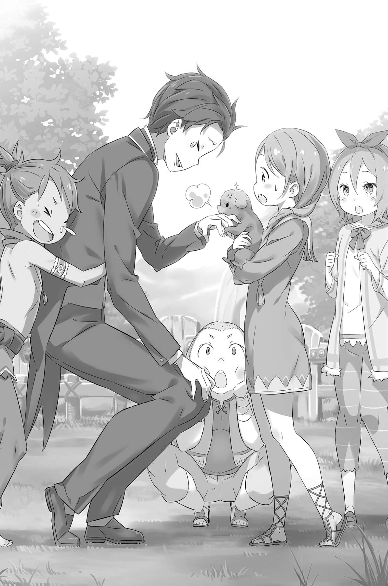
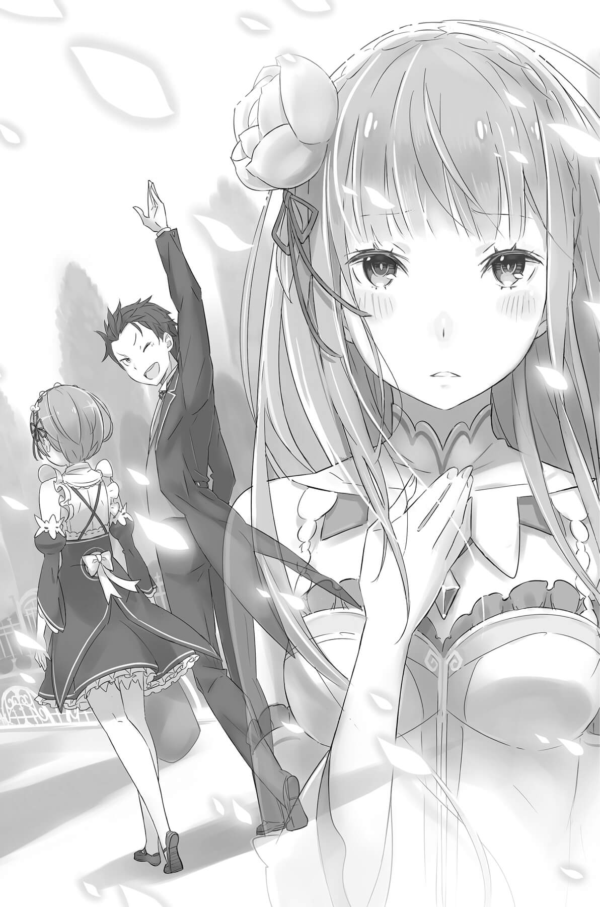
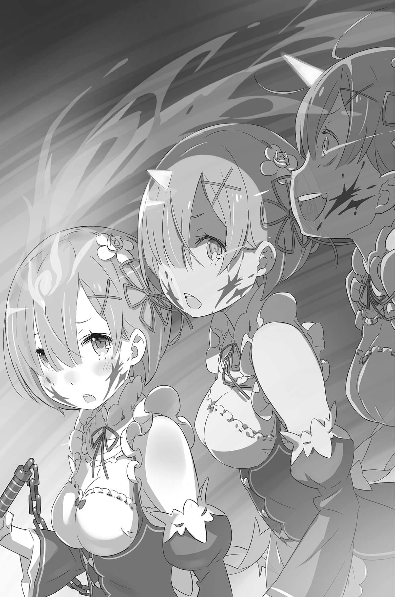

## 1

Для Субару этот визит в деревню был уже третьим.

Деревня под названием Эрлхэм находилась совсем рядом с поместьем, во владениях графа Розвааля. Она была небольшой, пожалуй, всего пара сотен жителей, — даже меньше, чем учеников в начальной школе Субару в прежнем мире. В эту маленькую деревеньку, обойти которую можно было минут за двадцать, он и направился вместе со своими «цветочками».

— Должна сказать, ты быстро закончил работу.

— Барусу носился как угорелый, даже противно было смотреть! Интересно, что с ним случилось?

— Хвалите меня, хвалите! Видали, как расцвели мои скрытые таланты?

Работу, которую Субару выполнил за утро, оценили высоко, и он был на седьмом небе. Ему удалось осуществить задуманное — быстро закончить все задания и после обеда выбраться в деревню. Видимо, до сих пор он слишком уж напрягался, из-за чего постоянно допускал ошибки. Решив трудиться в нормальном ритме, он, похоже, поступил верно, и, несомненно, за его нынешние успехи стоило поблагодарить колени Эмилии.

«Это ведь она устроила мне такой замечательный релакс…»

Возможно, именно благодаря чудесным коленям сейчас ему удавалось вести разговор с близняшками довольно легко — совсем не как раньше, когда его чуть не расплющил беспрерывный невыносимый стресс. Но отголоски того напряжения теперь даже помогали Субару, поддерживали в нём решимость и не давали утратить бдительность.

Благодаря всему этому юноша чувствовал себя довольно уверенно, что, конечно, помогало делу: нельзя было позволить тому, кого он собирался вывести на чистую воду, почувствовать угрозу.

Прошлым вечером из разговора с Беатрис Субару узнал, что колдуну необходим предварительный контакт с жертвой, чтобы наложить проклятие. Рискованное условие! В мире Субару убийство можно было совершить дистанционно, при помощи выстрела, однако колдовство имело свои преимущества: оно работало незаметно и неотвратимо.

«Зато удалось сузить круг подозреваемых. В нём только те, кто до меня дотрагивался, когда я был в деревне в прошлый раз».

Значит, если кто-то из них появился в деревне за последние несколько дней, то считай, что преступник почти в руках.

Однако Субару не мог полагаться на то, что события станут развиваться точно так же, как в прошлых кругах. Он уже понял это на своём горьком опыте. Да и прокрутить в памяти все без исключения события, которые происходили в деревне, было довольно сложно, если не считать отдельных ярких эпизодов.

— Пожалуй, больше всего запомнились староста, молодящаяся бабка, хватающая всех за задницы, и коротко стриженный предводитель деревенских парней, глава отряда самозваных защитников Рам и Рем.

Субару принялся размышлять.

Мужик, напоминавший старосту, откликался на обращение «деревенский глава». Бабка похлопала Субару по попе и со смехом убежала, бормоча что-то вроде; «Омолодилась, омолодилась!» Предводитель молодёжной группировки и глава охраны — если не обращать внимания на маску, это было одно и то же лицо — постоянно задевал Субару плечом, видимо завидуя его близкому знакомству с сёстрами.

— Староста, кстати, всё время хватал меня за руку, даже когда показывал, где у них сортир. Может, в маразм начал впадать?.. Если подумать, они все до меня дотрагивались. Подозрительно…

Но эти люди были обычными деревенскими жителями и не отвечали первому условию.

— А значит, остаётся просто бродить по тем же самым местам…

Не успел Субару печально вздохнуть, сожалея о недостатке смекалки и отсутствии более хитрого плана, как со всех сторон посыпалось:

— Что случилось, Субару?

— Проголодался?

— Живот болит?

Звонкие голоса, доносящиеся сверху и снизу, наперебой забрасывали его вопросами. Глянув через плечо, он увидел несколько маленьких фигурок, взобравшихся ему на спину. Это были деревенские дети. Компания не успела ещё дойти до околицы, а они уже всей кучей накинулись на Субару. Семеро сорванцов повисли у него на спине, цеплялись и за ноги, и за пояс.

Субару подкинул нетяжёлый для тренированного тела груз и покрутил шеей так, что хрустнули позвонки.

— Значит, достанете меня даже через пространство и время?!

— Ты чего?

— Ушибленный на голову?

— Съел что-то не то?

— Чего вы пристали к моему животу? Хотите из меня дристуна сделать?!

Ребятишки закатились от хохота. Вряд ли они оценили остроумие Субару, наверное, просто отреагировали на слово «дристун». Видимо, в юном возрасте шутки ниже пояса вызывают взрывы смеха абсолютно в любом из миров.

— Да, моя способность привлекать к себе всех сопляков подряд осталась неизменной…

Мальчишка, сидевший у Субару на спине, принялся растягивать его щёки, и юноше не осталось ничего другого, как вздохнуть, смирившись со своей загадочной особенностью, превращавшей его в магнит для детворы.

— И почему ко мне тянутся только малолетки и старички?! А ведь мне хватило бы тёплого приёма от одного единственного человека в этом мире…

Он извернулся и стал щекотать малыша, сидевшего у него на закорках. Вокруг раздавались вопли: «Я, я следующий!» — и под эти крики Субару с детьми шествовал по деревне. Сейчас он остался один и был свободен в своих передвижениях. Вообще, конечно, не один, да и свобода относительная, так как в него вцепились со всех сторон, но Рем и Рам рядом уже не было.

Едва войдя в деревню, сёстры заявили нечто устрашающее:

— Сестрица, сестрица, давай разделимся и соберём сначала что полегче.

— Рем, Рем, давай оставим всё тяжёлое Барусу, — после чего порознь убежали за покупками.

Возможно, они учли желание Субару побродить по деревне, но, честно говоря, он бы не отказался, чтобы одна из сестёр осталась с ним. Тогда часть детей переключилась бы на неё…

«…А я смог бы обходить подозреваемых, не испытывая такого жуткого напряжения».

Субару, обливаясь нервным потом и тяжело дыша, продолжал играть роль приманки. В поисках колдуна он выбрал рискованную тактику, граничащую с самоубийством. Юноша чувствовал себя, словно рыба под разделочным ножом, однако если не лечь под этот нож, не увидишь лица повара…

— По крайней мере, неактивированное проклятие малышка Беа сумеет снять.

Если только из-за какой-то ошибки проклятие не сработает сразу же, Субару сможет некоторое время носить его на себе, а затем очистится при помощи ритуала. Иными словами, опасности для жизни быть не должно. Он просто бросится в ноги Беатрис, станет умолять, и она спасёт его!

— Субару, у тебя рожа злобная!

— И страшная!

— А ещё и дурацкая!

— Ну-ка, не порти мою репутацию! А вот на третий комментарий я сейчас даже разозлюсь!

Подкалывая ребятишек, Субару продолжал тащить их на себе, обходя деревню. Всё равно от них не отвяжешься — разве только стряхнуть, а вот для того, чтобы ориентироваться в здешних улочках, они даже могли оказаться полезны. Что ещё важнее, колдун, не желая привлекать внимания местных, побоится открыто напасть на Субару, вокруг которого вьётся такое количество детей. Получается, он рассчитывал на малышей ещё и как на прикрытие.

— Ох и гад же я! Прямо перешёл на новый уровень зла!..

— Субару, ты чего?

— Что с тобой?

— Умом повредился?

— Да так, ничего… — Юноша криво усмехнулся и взъерошил вихры уцепившихся за обе его ноги ребят. В этот момент он действительно презирал себя. — Ладно, всё это ради счастливого будущего. Вы ведь немножко мне поможете, верно?

Неожиданно ему в голову пришло, что на самом деле он никогда особенно и не любил детей. Они шумные, навязчивые, капризные…

«Возможно, я так отношусь к детям, потому что они напоминают меня самого».

## 2

— Я решила, что твоё свободное время закончено, и пришла посмотреть, а тут… — Рам, проведя рукой по розовым волосам, устало вздохнула.

Поймав её взгляд, Субару тут же воздел руки к небу и про кричал:

— Виктори!!!

Клич Субару поддержало множество радостных голосов, и все собравшиеся принялись хлопать друг друга по ладоням. Он перевёл дух и направился к Рам, по дороге шлёпая по подставленным ладоням людей, которые утирали разгорячённые лица и оживлённо переговаривались. Рам холодно смотрела на слишком бодрого Субару.

— И что это за аттракцион?

— Откуда такое выражение — «аттракцион»?! Просто решил развлечь детишек, чтобы убить время, а тут и взрослые зрители присоединились…

Лучшее средство, чтобы разом справиться с кучей расшалившихся не на шутку детей, — физические упражнения, например радиозарядка. В какой-то момент к отпрысками присоединились и взрослые, которые сначала только наблюдали. И постепенно возникла куча мала, в которой оказалось чуть ли не полдеревни.

— Да я сам удивился, насколько это пришлось людям по душе! И старые, и малые — все веселятся вместе. Наверное, в зарядке кроется секрет долголетия!

— Сомневаюсь.

— Вот как?! Ранила в самое сердце!

Увидев, как Субару театрально попятился, дети закричали наперебой:

— Рамчи, ты вредная!

— Рамчи злюка!

— Рамчи, я тебя боюсь!

— Это ты их подучил?!

— Не то чтоб подучил… просто хотел, чтобы они тебя не боялись. Учти, если никого к себе не подпускать, то ни с кем и не подружишься. Это же грустно! Вот я и подумал…

— Ох и болтун же ты! Мне-то всё равно, а вот Рем это вряд ли понравится.

— Ремрин?

— Ремрин!

— Ремрин-рин!

Слушая детские вопли и понимая, что уже поздно, Рам пожала плечами, словно отказываясь от борьбы.

— Ну что, налюбовался деревней, о которой так мечтал?

— На все сто, ничего не упустил! — ответил Субару, растянув губы в улыбке.

Результаты так называемой прогулки по деревне — а на самом деле операции по установлению контактов с подозреваемыми — были великолепны. Кроме как с теми, кто вызывал подозрение изначально, Субару удалось соприкоснуться ещё кое с кем. Правда, чтобы сузить круг подозреваемых, он очень внимательно следил за последующими контактами.

«Последним был хлопок по ладони стриженого паренька во время зарядки. На этом всё».

Пообщавшись с главными подозреваемыми, он решил, что дело сделано. Осталось встретиться с Рем, и можно было возвращаться, поэтому пришло время прощаться с детьми.

— Ладно, меня ждёт работа, так что будьте здоровы! Нет-нет, мне страшно жалко. Было бы время — ещё и ещё играл бы с вами! А-ха-ха, какая жалость!

— Ишь хохочет!

— Сам-то смеётся!

— То-то рад, наверное!

Стряхнув с себя расстроенных детей, Субару показал им язык, когда те начали что-то обиженно бубнить. Он даже и не подозревал, что столь скромная месть способна принести огромное удовольствие! Довольный собой, Субару собрался было отправиться с Рам туда, где их ждала Рем, как вдруг маленькая девочка с длинной каштановой косой потянула его за руку.

— Ты чего? — удивился Субару. До сих пор малышка держалась в стороне от прочих ребят, изо всех сил наседавших на него, не участвовала в забаве и только поглядывала издали.

— Что случилось? Ты что-то хотела сказать? Я слушаю, — Субару присел, чтобы оказаться с ней на одном уровне.

— Э-э-э… пойдём.

Покраснев, девочка потащила его за собой, увлекая куда-то в сторону. Подчиняясь тонкой ручонке, Субару оглянулся на Рам.

— Ладно, можешь ещё немного погулять.

— Сэмпай, с меня причитается! Ну, что там у тебя? — получив разрешение, Субару послушно двинулся вслед за девочкой вглубь деревни в сопровождении всей ребячьей толпы.

— Она сказала, ты удивишься!

— И обрадуешься!

— И даже затанцуешь!

— И удивлюсь, и обрадуюсь, и затанцую? Это сколько ж вы от меня всего ждёте?! Мне разорваться, что ли?

Окружённый хихикающими детьми, которые, кажется, уже предвкушали его реакцию, Субару прошествовал мимо деревенских домов в укромный закуток и увидел то, на что указывали детские пальчики.

— А, точно! Совсем из головы вылетел этот эпизод! — воскликнул он, коря себя за беспамятство, и досадливо хлопнув в ладоши.

Девочка с косой убежала вперёд и, пыхтя, притащила это» к нему.

Зверюшку, очень напоминающую щенка, покрытого коричневой шёрсткой. Малыш, похоже, родился совсем недавно, и его круглые глазки и мягкий мех заставили Субару — страстного любителя пушистиков — застонать от умиления.

Увы, судя по всему, щенок вовсе не разделял человеческого восторга.

— Гав!

— Так я и думал!

В тот момент, когда Субару протянул к нему руки, пёсик вздыбил шерсть и угрожающе зарычал. Увидев, как ощетинился их питомец, дети удивлённо остановились и загалдели:

—Он всегда такой смирный!

— Только на тебя разозлился!

— Что ты ему сделал, Субару?!

— Я бы и сам хотел знать. Уже ведь третий раз так. Наверное, просто характерами не сошлись.

Дети за спиной Субару громко выражали неодобрение, а юноша умильно улыбался щенку, с которым никак не удавалось подружиться. В прошлом он уже дважды встречался с этим пёсиком. И всякий раз зверёк яростно выражал свою неприязнь, чем ранил любителя животных в самое сердце.

— Каждый круг одна и та же реакция! В каком-то смысле даже приятно видеть что-то неизменное… Но вообще, мог бы и поласковее меня встретить, не убудет же от него, в самом деле!

Несмотря на Посмертное возвращение, в разных кругах Субару не попадал дважды в одну и ту же колею, и тем удивительнее была реакция щенка, напоминающая заевшую пластинку.

Впрочем, ласковая улыбка, похоже, возымела действие: щенок, кажется успокоившись, опустил голову и свернулся клубочком в руках девочки с косой. Субару не мог упустить этот шанс.

— Извини-ка!

Сейчас он применит к этому щенку всё своё мастерство любителя пушистиков, отточенное на Паке. Блаженно ухмыляясь, Субару протянул руки и принялся ощупывать темечко, шейку и хвостик пёсика, чуть ли не пытаясь зарыться в шерсть носом…

— Ух ты, какое приятное ощущение! Как я и ждал! Эх, какой же ты славный, хоть и беспородный. А если тебя ещё и как следует расчесать, будешь вообще загляденье! Только что это за лысинка у тебя на голове? Смотри-ка, с монетку Ранка? Обо что это ты…

То ли пёсик оберегал белый шрамик, то ли ещё что, но, как только Субару прикоснулся к этому месту, зубки щенка впились в его руку. Он в панике отдёрнул её, но на коже уже отчётливо отпечатались следы зубов.

На тыльной стороне ладони проступила кровь, а острая боль заставила юношу ойкнуть, потирая укушенное место.

— Эпизод со стопроцентной вероятностью? Даже цапнул точно так же! Может, ты тоже путешествуешь во времени?

Щенок, к которому вернулась прежняя настороженность, продолжал угрожающе рычать на Субару, заискивающе ухмыляющегося в попытках успокоить животное. Наблюдая со стороны, как между человеком и собакой вновь разверзлась пропасть, ребятишки понимающе закивали друг другу.

— Конечно, переборщил!

— Кто ж будет терпеть, когда его так тискают!

— Наверное, это самочка…

— Мне кажется, вы не там видите проблему… и что, никто за меня не переживает?! Я сейчас расплачусь!

Субару ополоснул руку у бочки с водой и помахал ею, прощаясь с детьми, которые всё ещё возились со щенком. Девочка с косой выглядела виноватой, но он весело махнул и ей, выдавил слабую улыбку и пошёл обратно.

— Извини, что заставил ждать.

Служанка стояла, прислонившись к ограде и скрестив руки на груди. Рам смерила вернувшегося Субару угрожающим взглядом:

— Что это такое?! Стоило ненадолго отпустить ученика, и вот он возвращается — растрёпанный, одежда в беспорядке, с руки капает кровь…

— За это тоже прошу простить. Тут такое было! Да и сама видишь, наверное.

— Вот именно! Стоит на тебя взглянуть, и всё становится ясно.

На лицо Рам наползла тень печали, а с губ сорвался тихий вздох. Субару удивлённо поднял брови: такая реакция была ей не свойственна, да и в словах крылся какой-то подвох. Но Рам не позволила ему задать вопрос, по обыкновению фыркнув:

— И твоя рана, и твоя одежда неприглядны! Пойдём скорее, надо встретиться с Рем. Она приведёт в порядок и то, и другое.

— А ты, Рамчи, разве не владеешь исцеляющим колдовством?

— Я владею жёсткими методами лечения: например, могу что-нибудь ампутировать. Устроит?

— Нет, столь экстремальная первая помощь мне не подходит! — Субару даже передёрнуло. А Рам внезапно шагнула к нему и потянула за рукав. Она так редко дотрагивалась до Субару, что тот удивлённо захлопал глазами и уставился на неё — только для того, чтобы услышать:

— Барусу, ты идёшь?

— С тобой — куда угодно! — ответил он.

Губы Рам дрогнули, едва не сложившись в улыбку…

Покорно следуя за девушкой, указывающей дорогу, Субару подумал, что она была бы очень милой, если бы не угрожала ампутацией. Впрочем, не исключено, что Рам стала обращаться с ним по-свойски, потому что и сам Субару держался непринуждённо. Похоже, она тоже ведёт себя по-разному в зависимости от обстоятельств…

Так размышлял Субару, пока они с Рам шли туда, где их ждала Рем, и ему казалось, — чувство возникло при взгляде на спину девушки, — будто идут они гораздо спокойнее и медленнее, чем обычно…

## 3

Когда троица вернулась в поместье Розвааля, наступил вечер, и закатное солнце косыми лучами освещало землю. Перед воротами на земле бессильно лежал юноша. Это был не кто иной, как Субару Нацуки. Он раскинулся на траве рядом с огромной бочкой и с трудом переводил дыхание.

— Дошли. Дошли ведь! Ай да я! Ай да молодец! Как же я крут!

— Да-да, хорошо потрудился.

— Да-да, отлично поработал.

Служанки-близнецы, усевшись по обе стороны от лежащего Субару, оценили его усилия подчёркнуто шаблонными фразами. Слова Рам звучали привычно холодно, да и Рем говорила слишком сухо. Ещё в деревне при виде Рам, тянущей Субару за руку, Рем не на шутку рассердилась.

«Сестрица, вы с Субару в таких близких отношениях?!»

Услышав, какими словами встречает их Рем, Субару по жалел о своём поведении, но было поздно. Теперь ему требовалось хоть как-то наладить отношения, и когда Рем — явно из вредности — велела отнести в поместье огромную бочку, он безропотно потащил её на своём горбу.

— Ладно, мы пойдём, а ты не спеши, отдыхай. — С этими словами Рем легко подняла бочку себе на плечо!

Субару мог похвастаться, что выжимает восемьдесят килограммов лёжа, но не был уверен, что поднял бы эту махину выше плеч, даже выложившись на сто процентов. А Рем подхватила тяжёлый груз одной рукой, словно бочка была наполнена перьями! Субару даже не сдержал сдавленный смешок — настолько странно выглядела эта картина.

— А я-то вам зачем был нужен?!

— Низачем, как сам видишь.

Рам тоже не собиралась потакать мальчишке, который сидел внутри Субару. Провожая взглядом Рем, которая невозмутимо шагала, неся поклажу, он с болью осознал бессмысленность своих «героических» усилий.

— Тогда зачем вы заставили меня её нести? Просто чтобы поиздеваться? Эй, сэмпай, прекратите травить младших товарищей!

— Неужели ты не понимаешь, Барусу? Конечно, из со страдания.

— Ни черта не понимаю! Где же тут сострадание?!

— Барусу, ты ведь наверняка не хотел бы, чтобы госпожа Эмилия увидела, как ты возвращаешься вприпрыжку с мешочком специй в руке вслед за Рем, которая тащит на себе страшную тяжесть?

— Даже не знаю, как отблагодарить вас за проявленный такт, сэмпай! — юноша мигом пал на колени, выражая искреннюю благодарность предусмотрительной Рам.

Представить только: Субару беззаботно помахивает невесомым мешочком, в то время как крохотная — меньше его ростом — девушка сгибается под тяжёлой бочкой… и всё это видит Эмилия!!! От одной мысли об этом Субару захотелось умереть.

— Сестрица, господин Розвааль зовёт! — крикнула от ворот Рем, которая успела занести бочку в особняк, пока они переговаривались. Рам мгновенно отреагировала на слова сестры. Отбросив при первом же звуке имени хозяина привычную вялость, она вскочила, привела в порядок одежду и сердито взглянула на Субару сверху вниз:

— Что ты там возишься, Барусу? Хочешь, чтобы господин Розвааль ждал тебя?!

— Это вы там, может, что-то и понимаете, а я совершенно не в курсе. У нас что, планёрка?

Чувствуя себя ребёнком, которому никто не удосужился объяснить происходящее, Субару подорвался и побежал за девушками. По пути, следуя примеру Рам, он более-менее отряхнул ливрею — как раз к тому моменту, когда открылась дверь в прихожую и они увидели хозяина поместья Розвааля, ожидавшего их с распростёртыми объятьями.

— На-а-адо же, так вы все вместе куда-то ходили? Это хорошо-о-о, избавили меня от необходимости разыскивать вас!

Обычно стройного красавца с длинными синими волосами и странными глазами — синим и жёлтым — портил нанесённый на лицо клоунский грим, но сегодня он выглядел совсем по-другому.

— Ваша одежда… собираетесь куда-то?

— Какая проницательность! О-о-о, мне и самому не нравится этот формальный вид. Но если идти в обычной одежде, непреме-е-енно кто-нибудь привяжется, так что прихо-о-одится надевать парадный костю-у-ум.

Розвааль предпочитал довольно странную одежду, и сегодня Субару впервые увидел на нём обычный сюртук, а не эксцентричный наряд «вырви глаз» с геометрическими узорами.

— Ждёте гостей?

— Отправляетесь в гости?

Рам и Рем одновременно высказали те же предположения, что пришли в голову Субару. Услышав вопросы сразу от всех слуг, Розвааль ухмыльнулся и ткнул пальцем в одну из сестёр.

— Права Рам, я отправляюсь в гости. Получи-и-ил тут не очень прия-а-атное известие. Моя цель — Гарфиэль, а потом поброжу по округе. Задерживаться не собира-а-аюсь, но…

Услышав новое слово, Субару не смог определить, «Гарфиэль» — это имя человека или название местности. Но поскольку служанки-близнецы, похоже, всё поняли, он решил не переспрашивать и просто кивнул.

— Так что сего-о-одня я вряд ли вернусь… Рам, Рем, оставляю всё на вас.

— Как прикажете, мы сделаем всё, что нужно!

— Клянёмся жизнью!

Опустив ресницы, Розвааль показал тем самым, что услышал служанок, а потом перевёл свои разноцветные глаза на Субару. Под этим странным взглядом юноша почувствовал себя неуютно и даже поёжился.

— Извините, я пока не настолько вам предан, чтобы жизнью клясться.

— Ну, ничего-о-о. Если бы ты вдруг принёс такую клятву — я бы даже удивился. Всё-о-о же я и на тебя надеюсь, Субару.

Похлопав его по плечу, граф закрыл один глаз и глянул на юношу вторым, жёлтым:

— Чувствую, попахивает чем-то подозри-и-ительным. Могу я рассчитывать, что ты присмо-о-отришь за госпожой Эмилией?

— Вот в этом можете на меня положиться!

Субару не знал, известно ли Розваалю истинное положение вещей. Однако юноша заметил…

«Дела приняли новый оборот».

Возможно, поступки Субару и впрямь вызвали изменения в этом мире…

Розвааль кивнул, одарив Субару довольной улыбкой, и отдал верным служанкам-близнецам несколько поручений.

— Что-о-о ж, мне пора. Будем надеяться, что ничего-о-о не случится, — сказал Розвааль и вышел во двор. Трое слуг проводили его взглядами. Субару показалось странным, что хозяина не ждёт снаружи экипаж или нечто подобное. Неужели он отправится пешком?..

— Итак, полагаюсь на вас!

Сказав это, Розвааль слегка подпрыгнул, взмахнув полами сюртука; его тело зависло в воздухе и, подхваченное вихрем, устремилось ввысь. Прямо на глазах Субару, раскрывшего от удивления рот, фигура Розвааля взмыла к облакам и полетела в сторону гор. Постепенно уменьшаясь, она исчезла из виду.

— Так он что, умеет летать?! Вот это магия! — выдохнул наконец совершенно ошеломлённый Субару. Близнецы же, явно привыкшие к волшебным полётам графа, без задержки переключились на домашние дела, быстренько распределив между собой рутинные обязанности.

— Даже если господина Розвааля нет дома, наша с Рем работа не меняется. Наоборот, именно потому, что хозяин отсутствует, её надо выполнять особенно тщательно!

— Вот он — настоящий профессионализм! Ну ничего, я тоже готов потрудиться! — энергично засучил рукава Субару.

Разумеется, энтузиазм вызвала не только работа как таковая, но и внезапная перемена ситуации. Судя по всему, близняшки предполагали, что поместью угрожает некая опасность, и намеревались усилить защиту. Впрочем, они не могли сравниться в бдительности с Субару, ведь он точно знал о готовящемся нападении.

Теперь требовалось как можно быстрее выяснить, кто же такой этот колдун. Судя по всему, жернова завращались, и этому явно поспособствовал сегодняшний визит в деревню. То есть тактика приманки, которую использовал Субару, сработала!

Теперь для выполнения плана осталось только выкурить колдуна…

— Твой выход, малышка Беа! Ты, наверное, дождаться не могла! — распахнув дверь, с порога выпалил Субару и влетел в запретную библиотеку.

Беатрис, примостившаяся с книгой на ступеньке своей любимой стремянки, лишь пожала плечами в ответ на такое бесцеремонное вторжение:

— Опять, мнится мне?! Как ты умудряешься так легко проникать через Блуждающую дверь Бетти?..

— Это интуиция, понимаешь? Мне подсказывает шестое чувство!

С явным неудовольствием взглянув на приближающегося Субару, Беатрис тем не менее заметила серьёзное выражение его лица и прищурилась.

— Полдня не прошло, а у тебя совсем другое лицо! Похоже, ты не сидел без дела.

— Я бы и сам не прочь спокойненько отдохнуть. Да ведь мир-то как устроен: суетливый, хлопотливый… ни секунды покоя!

До сих пор Субару — самый обычный человек — чувствовал себя беспомощным перед невзгодами, что обрушивались на него одна за другой. Но сейчас у него наконец-то возникло ощущение, что бразды правления находятся в его собственных руках.

— Я хотел, чтобы ты кое-что проверила, и поставил настоящий рекорд при уборке ванной!

— Ну, раз уборка для тебя в приоритете, значит, ничего важного нет, мнится мне.

— Да тут разве поймёшь, что важнее: то ли ванна, то ли дружба с Рем… Поди разберись!

В этом мире, где развлечений и так было немного, ванна и для Субару, и для всех остальных служила местом блаженного отдохновения. Страшно даже подумать, как отреагирует Рем, если он поленится сделать уборку в таком священном месте! К тому же, заметив неожиданно дружеские отношения между Субару и Рам, младшая сестра затаила на юношу злобу.

Пусть даже Субару удастся обнаружить колдуна, но, если не наладить контакт с Рем, его снова ждёт плохая концовка. Одновременно обдумывая два варианта прохождения, Субару чувствовал себя так, будто балансирует на канате.

— Если вопрос был только в том, с какой из девиц закрутить интрижку, я бы прыгал от счастья, но…

— Мнится мне, ты отклонился от темы. Так что тебе нужно от Бетти?

— Дело вот в чём…

Стоя перед Беатрис, которая в кои-то веки готова была его выслушать, Субару задумался, в каком же виде всё преподнести. Поколебавшись немного, он решился:

— Похоже, на меня наложили заклятие. Ты можешь это проверить?

— Ты болтаешь вздор, мнится мне!

— Похоже, на меня наложили заклятие. Ты можешь это проверить?

— Я не просила повторять, как попугай!.. Ещё и полдня не прошло, как я подробно рассказала тебе о колдунах. Даже моему терпению есть предел!.. — закричала Беатрис, сердито топая. Наверное, она подумала, что у Субару развилась мания преследования, и решила как следует его проучить, однако секунду спустя выражение лица Бетти стало другим. Удивление сменилось вопросительной гримасой, вслед за которой возникла уверенность.

— Я чувствую колдовство! На тебя и правда наложили проклятие!

— Серьёзно?! Я это предполагал, но услышать подтверждение — настоящий шок.

Он разработал свою тактику и выступил в роли приманки, не исключая, что будет проклят, но осознание реальности этого события заставило юношу вздрогнуть. Лицо Субару застыло — и не только из-за страха: тот факт, что среди добродушных деревенских жителей скрывался настоящий убийца, не укладывался в голове!

— А ты можешь узнать, что это за проклятие?

— Пока я только вижу, что был проведён ритуал, больше ничего сказать не могу. Но, как ты помнишь, если заклятие начнёт действовать, скорее всего, оно лишит тебя жизни. Но… ты выглядишь так, будто и не боишься умереть!

Заметив, как спокойно Субару воспринял её слова, Беатрис от удивления захлопала огромными глазами. Юноша лишь пожал плечами:

— Ты что, глупая? Конечно боюсь! В этом мире нет ничего страшнее смерти. Посмотрел бы я на тех, кто говорит «лучше умереть», после того как они сами узнают, каково это!

Если и была в этом мире какая-то истина, которую Субару проверил на собственной шкуре, то звучала она так: «Смерть абсолютна!» Относиться к ней легкомысленно совершенно недопустимо! И сравнивать её с чем-то или упоминать всуе может лишь тот, кто ничего не знает о смерти!

В конце концов, много раз пройдя через смерть, Субару вернулся и начал всё сначала именно потому, что познал от чаяние, которое ещё хуже смерти.

— Так и знай, судьба, на этот раз я найду выход!

И если на свете существовал бог или кто-то, вершащий судьбы, Субару Нацуки объявил ему войну. Он твёрдо решил, что вырвет свой счастливый финал — хотя бы как компенсацию за те чудовищные муки, что претерпел.

Бросив вызов неведомым силам, Субару снова обратился к Беатрис:

— Ну как, снимешь по-быстрому это заклятие? Времени мало.

— И ты решил, что Бетти будет спасать тебе жизнь, мнится мне?

Увы, в тот самый миг, когда Субару уже с восторгом представлял, как устроит врагу контратаку, девчонка, которая должна была стать союзником, поставила ему подножку. Почесав в затылке, Субару ответил:

— Так и знал, что ты начнёшь вредничать. Но ничего, я заготовил кое-какой аргумент. Если я умру, то Пак наверняка будет очень расстроен.

— Думаешь, братик так уж взволнуется из-за твоей смерти?!

— Может быть, и нет, но вот Эмилия наверняка будет потрясена. А уж тогда и Паку придётся несладко. И не хотел бы я оказаться на твоём месте, когда они узнают, что ты могла предотвратить такой исход, но не захотела…

— Да ты совершенно обнаглел! Это уже не просьба о помощи, а возмутительный шантаж!? — снова затопала ногами Беатрис, но, похоже, возразить ей было нечего. Раздражённо вздохнув, она с явной неохотой подозвала Субару к себе.

— Ладно, уговорил. Но больше Бетти в жизни не будет иметь с тобой дела!

— Вот этого, честно говоря, не могу гарантировать. Если что-то пойдёт не так, обязательно прибегу к тебе за помощью. Снова сяду тебе на шею, ножки свешу да ещё и песенку спою.

— Мнится мне, ты не осознаёшь, что тебе сейчас спасают жизнь!

— Я осознаю, что выгляжу как попрошайка, слабак и навязчивый тип. Прости.

Глядя на согнувшегося в виноватом поклоне Субару, Беатрис устало покачала головой, зажгла на ладони белый шарик света и поднесла к телу юноши.

— Сейчас я буду разрушать проклятие. Помни, оно запечатлено в том самом месте, где колдун к тебе прикоснулся.

— Нет проблем, я готов.

Ощущая тепло, исходящее от ладони, на которой был шарик света, Субару ощупал своё тело. В деревне он всё подстроил так, чтобы подозреваемые прикоснулись к разным местам. Вспомнив, как молодящаяся бабка схватила его за задницу, Субару подумал: если рука Беатрис направится туда, то есть старуха окажется колдуньей, он обзовёт свою спасительницу извращенкой! Впрочем, не успел Субару задуматься над этим…

— Что?!

Беатрис прикоснулась совсем к другому месту, и он понял, что не угадал. Белый свет с ладошки девочки проник к нему под кожу, и Субару почувствовал вспыхнувший внутри жар. Мурашки, щекоча, пробежали от места контакта, словно пытаясь просочиться наружу.

— Чёрная дымка?!

Светящаяся рука Беатрис поймала проклятье, превратившееся в струйку чёрного тумана. Необычное ощущение исчезло, и Субару вздрогнул, осознав, что эта живая дымка сидела у него внутри.

— Отвратительно, мнится мне!

И дымка исчезла в ладони Беатрис, раздавленная в лепёшку. Девочка вытерла руку, словно коснулась чего-то грязного, и, заметив, что Субару потерял дар речи, хмыкнула:

— Готово! Теперь тебе ничто не грозит.

Услышав, что всё закончилось, Субару осознал, что некоторое время даже не дышал. Но презирать себя за трусость было некогда, ведь в голове Субару назрел вопрос.

— Слушай, малышка Беа…

— Ну хватит уже меня так называть!

— Я верно понял, ты коснулась меня ладонью в том месте, через которое колдун передал проклятье?

Угрожающая тяжесть, заключённая в вопросе, заставила Беатрис оставить жалобы и неохотно кивнуть. Теперь Субару уже не сомневался в личности преступника, который наложил заклятие.

— Мне немедленно… надо в деревню…

Колдун был найден, и Субару почувствовал, что должен действовать без промедления. Изначально он планировал дождаться следующего дня и вместе с Розваалем и Рам выкурить из деревни укрывавшегося там колдуна и уничтожить его. Но теперь ситуация изменилась. Чувствуя, как сердце колотится всё быстрее и быстрее, Субару распахнул двери и вылетел наружу. Он бежал, глотая воздух и даже не слыша окрика Беатрис, которая пыталась его остановить.

Злобная шутка судьбы, дёргающей за ниточки Субару и его друзей, привела юношу в настоящее неистовство. Он бежал не останавливаясь, вложив всю ярость в бешеный вопль:

— Сколько же ты будешь издеваться?!

## 4

Субару промчался по коридору, слетел вниз по лестнице, развернулся в танцевальной зале и, проскользив на каблуках по прихожей, закричал, подняв лицо кверху:

— Рам! Рем! Надо поговорить!

На его крик, разнёсшийся по всему поместью, появилась Рам. Видимо, она работала где-то рядом и, увидев запыхавшегося, раскрасневшегося Субару, недовольно сощурилась, явно порицая его поведение.

— Что с тобой, Барусу? Куда-то мчишься, весь растрёпанный…

— Извини, мне срочно нужно в деревню. Не пытайся меня остановить, я всё равно пойду. Просто подумал, что должен предупредить, а то вы будете волноваться.

— В деревню? Зачем? Да как ты смеешь ослушаться господина Розвааля?! Он доверил нам поместье на сегодняшнюю ночь. Ты что, не понимаешь, что это значит?

Взгляд Рам, направленный на Субару, становился всё пронзительнее.

Воля хозяина всегда была для неё законом, и поведение юноши неизбежно навлекало на него гнев служанки. Но Субару не собирался сдаваться.

— Нет времени на споры, поэтому скажу прямо! В деревне Эрлхэм прячется злой колдун. Я узнал, кто это, и потому должен бежать!

— Думаешь, я поверю детским сказкам?!

— Не знаю, как сказать по-другому, так что придётся поверить. Можешь спросить у малышки Беа, она подтвердит. Да, и…

— Сестрица…

Пока Субару препирался с Рам, подозрения которой всё больше усугублялись, сзади открылась дверь, и появилась Рем. Взглянув на происходящее, она привычным движением встала рядом с сестрой.

— Сестрица, что здесь происходит?..

— Требует отпустить его в деревню, чтобы усмирить злого колдуна, который там прячется.

Рам повторила слова Субару, и он поморщился, чувствуя, что они действительно звучат как дурацкая выдумка. Похоже, и Рем пришла к тому же выводу.

— Сестрица, сестрица. У Субару очень глупые шутки!

— Рем, Рем, мне кажется, из Барусу вышел бы прекрасный клоун!

— Рам, Рем! Конечно, я часто шучу, но бывает же, что и серьёзно говорю!

Получив ответ в своём же стиле, служанки-близнецы удивлённо замолчали. Словно наступая на сестёр, Субару шагнул вперёд:

— Знаю, что это звучит сомнительно, и не надеюсь, что вы мне поверите. Поэтому не прошу отпустить меня без всяких условий.

Чувствуя, что он на правильном пути, Субару нервно облизал губы и предложил, подняв палец:

— Я иду в деревню. Если сомневаетесь, ступайте со мной — и всё увидите. Вот только Эмилию одну оставлять нельзя, поэтому кто-то из вас должен находиться в поместье.

— Ишь что придумал! Если уж соблюдать указания господина Розвааля, то ни я, ни сестра не можем сопровождать тебя.

— Верно, если соблюдать указания, которые Розвааль дал сегодня вечером. Но разве это единственный его приказ в отношении меня?

Рем не нашлась что сказать — Субару попал точно в цель. Розвааль велел девушкам присматривать за юношей, о чём тот догадался по обрывкам информации из предыдущих кругов. Отведя глаза, Рем явно искала путь к отступлению, но Рам опередила её, со вздохом проронив:

— Ладно, Барусу, делай как знаешь.

— Сестрица?! — Рем изумилась, что сестра с такой лёгкостью выкинула белый флаг, но один взгляд Рам заставил её замолчать.

— Однако, Барусу, как ты сам понимаешь, мы не можем отпустить тебя одного. Поступив так, мы нарушим приказ господина Розвааля.

— Да, конечно. И каков компромисс?

— Мне это не нравится, но ничего не остаётся, как принять твоё предложение. Пойдёт Рем.

— Лучшего и желать нельзя! — Субару победно вскинул сжатый кулак.

Рам тихонько вздохнула и, проигнорировав юношу, обернулась к сестре:

— Рем, ты же видишь… прошу тебя. Я всё уточню у госпожи Беатрис и возьму на себя охрану госпожи Эмилии. И буду наблюдать за вами.

— Сестрица, но твои глаза…

— Сейчас не стоит об этом. Я воспользуюсь ими, если будет необходимо. То же относится и к тебе.

Рем больше ничего не смогла возразить на холодные слова сестры. Она лишь недружелюбно взглянула на Субару, Который со стороны наблюдал за беседой девушек, понятной лишь им двоим.

— Субару, сейчас самое время посвятить меня в подробности.

— По дороге. Я и сам не знаю истинного положения вещей.

Если верны самые мрачные гипотезы, то ущерб окажется таким, что будет не до смеха. И не только Субару…

Юноша благодарно похлопал Рам по плечу и потащил всё ещё ничего не понимающую Рем в переднюю. Но едва он хотел сказать, что времени в обрез и до деревни им придётся бежать, как вдруг…

— Субару, ты куда-то собрался?

С верхней ступени лестницы, что вела в переднюю, раздался голосок, подобный звону серебряного колокольчика. Субару моментально обернулся и увидел Эмилию, замершую в облаке серебристых волос. Похоже, она прибежала на его крики и теперь стояла здесь, переводя дыхание и разглядывая всех троих.

— Я услышала громкий голос и спустилась… что-то произошло?

— Правильнее сказать: «что-то может произойти»! Но тебе не стоит волноваться. Хотя, конечно, я буду рад, если ты немного обо мне побеспокоишься.

Субару не хотел тревожить Эмилию, поэтому нарочно заговорил обычным шутливым тоном, но девушка всё равно что-то почувствовала.

— У тебя такой вид, будто ты снова задумал что-то опасное!

Эмилия мигом догадалась, в чём дело, и выразительно посмотрела на юношу. Субару понял, что его раскусили, и, проклиная свою неумелую игру, закрыл лицо ладонями.

— Мы только-только закончили препираться по этому поводу и договорились!

— Значит, удерживать тебя бессмысленно, так?

— Ну, пожалуй, что да. Более того, если меня остановить, то всё обернётся только к худшему…

— Ладно, ладно, я поняла. Не стану даже пытаться.

Эмилия спустилась по лестнице и встала перед Субару, преградив ему путь и уперев руки в боки. Субару не мог от вести взгляда от сияния фиалковых глаз, которые смотрели прямо на него. А девушка легонько коснулась пальцами его груди.

— И просить, чтобы ты ничего там не устраивал и был осторожен, наверное, тоже бессмысленно?

— Зависит от обстоятельств. Да и не то чтобы я сам мечтал всё это делать…

Конечно, лучше идти прямой дорогой, не собирая проблемы на свою голову. Но раз уж это невозможно и ситуацию исправить способен только Субару, придётся действовать. И откуда у него такой дурацкий характер?!

«Возможно, всё дело в девушке, что стоит напротив», — подумал Субару с неловкой улыбкой.

— Да пребудет с тобой благословение духов.

— Чего?!

Услышав бормотание Эмилии, которая держала руку на его груди, Субару удивлённо наклонил голову, и она широко улыбнулась в ответ.

— Просто присказка на прощание. Это значит «возвращайся целым и невредимым».

— А-а, понятно. Вот в чём дело! Тогда, Эмилия-тан, если я вернусь невредимым, ты прижмёшь меня к своей груди, нежно, словно маленькую птаху?

— Ладно, ладно.

Отпихнув Субару, который полез обниматься, Эмилия взглянула на Рем. Служанка молча наблюдала за их разговором и сразу подобралась под этим взглядом.

— Рем, ты тоже будь осторожна! И присмотри, чтобы Субару не ввязался в неприятности, хорошо?

— Да, госпожа Эмилия. Слушаюсь.

Подхватив подол юбки, Рем сделала книксен, а Эмилия удовлетворённо кивнула ей. Субару постучал носком ботинка по полу и, слегка согнув колени, приготовился бежать.

— Что ж, мы пошли, Эмилия-тан.

— Счастливо!

Выслушав напутствие Эмилии, Субару помахал рукой, распахнул дверь, вместе с Рем пересёк двор и припустился по дороге, ведущей в деревню.

Спустя некоторое время Рем заявила:

— Я желаю знать подробности!

— В деревне прячется колдун, который хочет помешать выборам короля. Меня самого прокляли чуть не насмерть, но Беатрис сняла с меня заклятье. Если мы ничего не сделаем, вся деревня может погибнуть!

— Ты серьёзно?! — Рем распахнула глаза и от неожиданности перестала дышать, несмотря на бег. Субару молча кивнул в ответ и прибавил ходу.

Нормальный человек не стал бы прибегать к таким мерам, но кто знает этих колдунов? Если его подозрения подтвердятся, случится ужасное.

Поэтому Субару бежал изо всех сил. Осознав масштаб происходящего, Рем молча скользила рядом с ним, рассекая вечерний полумрак, что сгущался под сенью нависающих деревьев.

## 5

Они добрались. В деревне повсюду ярко пылали факелы, разгоняя ночную мглу.

Трудно представить, чтобы жители ни с того ни с сего зажгли столько огней! Там явно что-то произошло! Рем остановилась рядом с тяжело дышащим Субару. Судя по её лицу, девушка тоже почувствовала неладное. Заметив чужаков, к ним подбежал деревенский парень.

— Вы же из поместья? Что делаете тут в такой час?

— Похоже, мы как раз вовремя. У вас что-то случилось? — оборвала юношу Рем, Тот, кажется, несколько удивился её тону, но тут же взволнованно продолжил:

— Да-да! Мы не можем найти нескольких ребятишек! Вроде бы до наступления темноты они играли здесь, но потом… Вот все и бегают, ищут их.

— А кто пропал? Лука, Петра, Милд? — не дав Рем и слова сказать, Субару вклинился и забросал парня вопросами. Услышав знакомые имена, тот вытаращил глаза:

— Вообще-то да… А вы что, знаете, где они могут быть?

Опасения подтвердились. Субару прищёлкнул языком и раздражённо топнул ногой. Затем он обернулся к изгороди, отделяющей деревню от леса.

— Кто ищет детей, кроме тебя?

— Все молодые ребята и староста.

— Дети в лесу. В деревне вы их не найдёте!

При этих словах юноша изменился в лице. Казалось, он хотел что-то спросить у Субару, но тот хлопнул паренька по плечу и помчался к лесу.

— Я побегу вперёд. А ты передай всем, где искать!

Не отвечая на доносящиеся из-за спины растерянные вопросы, Субару по прямой рванул к тёмной опушке. Его догнала Рем. С сомнением поглядывая на решительное лицо юноши, она спросила:

— Откуда ты знаешь?

— Знаю. Я давно знал. Если то, что они говорили, правда, нам сюда.

Деревню отделял от леса высокий плетень. Субару и Рем перелезли через него и побежали в чащу, пробираясь между стволов. В то время как Субару пытался припомнить, о чём болтали ребята, Рем неожиданно подняла глаза.

— Барьер, оберегающий от злых духов… разорван!

Удивление в голосе девушки заставило Субару крепче стиснуть зубы — он понял, что был прав. Впереди — там, куда указала Рем, — из коры большого дерева торчал кристалл. Он выглядел очень старым и не светился, но, похоже, являлся частью барьера, отпугивающего злые силы.

Субару вспомнил, что жители несколько раз упоминали границу, показывая в сторону леса. А Рем даже прямо предупредила, чтобы он не смел ходить в горы.

— А что случится, если барьер исчезнет?

— Через границу смогут пробраться зверодемоны. Лес — место их обитания.

— Зверодемоны? Вот оно что! А кто они такие?

В глазах Рем появилось беспокойство, и она ответила с небольшой запинкой:

— Это твари, наделённые магией, злейшие враги человечества. Говорят, их породили ведьмы!

— И тут ведьмы?!

Субару скривился, услышав набившее оскомину слово, но объяснение Рем лишь подтвердило его гипотезу об истинном облике колдуна. Похоже, сегодняшние события лишь предвестие бедствий, готовых обрушиться на деревню…

— Субару-кун, ты что?! — в изумлении воскликнула Рем, попытавшись его остановить.

Прямо на её глазах юноша шагнул в просвет между деревьями, которые обозначали границу.

— Там дети, надо их спасать!

— Но ты уверен? Чтобы пересечь границу, требуется разрешение господина Розвааля, и без доказательств…

— Доказательство — этот шрам.

Субару обернулся к застывшей Рем и показал следы зубов, хорошо заметные на левой ладони. То самое место, за которое цапнул щенок!

Именно на этот укус и указала Беатрис, сказав: «Тот, кто оставил этот шрам, наложил заклятие на Субару…»

— …Милый пёсик, с которым играли малыши. А что, если он лишь напоминал щенка? Что, если это зверодемон, насылающий проклятья через укусы?

Субару помнил, что и в первом круге, и во втором его кусал тот самый щенок. Если же он сам никуда не ходил, жертвой вполне логично становилась Рем, отправлявшаяся в деревню за покупками.

Получается, проклятие не было делом рук человеческих и больше походило на стихийное бедствие. Зверодемоны распространяли эпидемию заклятий, подобно тому как крысы разносили чуму.

Дети наверняка пошли за этим существом и пропали в лесу… И неизвестно, что с ними случилось.

— Чем больше мы тратим времени, тем хуже! Что, если проклятие настигло и ребятишек?! Если так, их надо скорее забрать в поместье и расколдовать!

— Подожди! Мы же не можем сами принимать такие решения. Да и обстоятельства очень подозрительные…

— Что?

Рем остановила Субару, который спешил отправиться в лес, и указала на край деревни, за которым располагалось поместье.

— Всё, словно нарочно, началось, как только господин Розвааль отлучился. Ты уверен, что это не отвлекающий манёвр, чтобы напасть на поместье?

— Ну так что делать? Предлагаешь бросить бедных детей в опасности и бежать в поместье крепить оборону? Нет, конечно, если тебе всё равно, что, возможно, к завтрашнему утру в деревне останутся одни мертвецы, тогда вперёд! — заявил Субару, осознавая всю жестокость своих слов.

Рем всего лишь пыталась сдержать клятву и защитить обитателей поместья, за что нельзя её винить. Но даже если закрыть глаза и молчать, если свернуться клубком и спрятаться, момент, когда потребуется принять решение, всё равно наступит. И Субару отлично знал, что сильнее всего приходится жалеть о том, чего не совершил…

— Идём, Рем. Другого выхода нет, мы с тобой должны хоть что-то сделать!

— Ну почему ты так упёрся?.. Какое отношение имеет к тебе эта деревня, Субару?

Он впервые слышал, как Рем, которая всегда держала себя в руках, причитает так по-женски! Похоже, она никак не могла принять решение. Субару даже сочувствовал ей, но времени потакать слабостям друг друга не было.

Юноша отчаянно храбрился, но, если честно, он и сам 6оялся идти вперёд. Ноги Субару дрожали вовсе не от усталости, но вправе ли кто-то судить его?..

Субару решительно шлёпнул себя по щекам, чтобы не дать душе уйти в пятки.

— Знаешь, Петра мечтает шить одежду в городе, когда вырастет.

— О чём ты?..

— А Лука собирается пойти по стопам отца — лучшего дровосека в деревне. Милд хочет сделать венок из цветов со всех окрестных полян и подарить его своей маме…

Субару продолжал рассказывать, и лица ребят одно за другим всплывали у него перед глазами.

— Мэйна радуется — у неё скоро родится братик или сестричка, а Даин и Каин спорят о том, кто из них когда-нибудь женится на Петре.

Невольно хихикнув, он повернулся к умолкшей Рем.

— Они имеют ко мне отношение! Я ведь знаю и как их зовут, и как они выглядят, и что они собираются делать завтра…

Субару не любил детей.

Они шумные, прилипчивые, болтают что вздумается… Грубые, невоспитанные, бесцеремонные… Глядишь на них — и прямо как в зеркало смотришься.

— И вообще, я обещал, что завтра опять сделаем радиозарядку!

Кажется, подобные мысли крутились в его голове и в первый день, когда он попал в замкнутый круг. Бросить всё, пустить на самотёк — это проще простого. Но юноша знал, что это неправильно, и потому изо всех сил бежал вперёд.

Субару посмотрел на Рем, которая всё ещё колебалась. Девушка выглядела слабой и беспомощной, кажется, она жалела, что ей недостаёт сил. В точности как и Субару.

Сейчас он был противен сам себе… Юноша пытался побороть трусость и укрепить решимость, глядя на обессилевшую Рем. Трястись и пытаться использовать других людей — как низко!.. Но если это поможет делу…

— Я сам держу слово и других заставлю держать — такой у меня характер. Обещал устроить с детишками радиозарядку — устрою! Так что я иду дальше в лес.

Никогда Субару не думал, что мужество — такая страшная штука.

Юноша изо всех сил пытался скрыть трясущиеся от страха руки и совершенно не замечал, как дрожит его голос. Глядя ему в спину, Рем опустила ресницы:

— Что ж, делать нечего…

— Рем?..

Девушка вдруг решительно взглянула на Субару. Пожалуй, впервые на её лице так отчётливо читались эмоции.

— Рем получила приказ наблюдать за тобой, Субару. Выходит, если я позволю тебе уйти одному, то не выполню свою работу?

Её голос прозвучал так, словно Рем поддразнивала Субару, и он в изумлении лишь покачал в ответ головой:

— Наверное… да. Смотри внимательно, вдруг я задумал что-то подозрительное!

— Да, обязательно. Что ж, идём.

Глядя, как Рем встала рядом с ним, Субару впервые почувствовал, что они стоят плечом к плечу, в буквальном смысле. В горле защекотало, и он собрался было поблагодарить Рем, как вдруг обратил внимание: в руке шагавшей рядом с ним девушки внезапно возник металлический шар. Позвякивающая цепь соединяла его с металлической рукояткой, и размер шара совершенно не вязался с той лёгкостью, с которой хрупкая девушка его несла.

— Э-э… уважаемая Рем, а это что?

— Для самообороны.

— Да, но ведь…

— Для самообороны.

Переговариваясь так, они пробирались по нехоженому лесу, и Субару изо всех сил пытался хоть как-то вернуть только что по крупицам собранную и вновь утерянную решимость.

## 6

Субару вместе с готовой к бою Рем, которая держала в руке «самооборонительный» моргенштерн, продолжали поиски в ночном лесу. Кроны деревьев не пропускали лунный свет, и внизу царила глубокая, чернильная тьма. Лавируя между преграждавшими путь стволами, они шли вперёд, раздвигая руками ветви, временами цепляющиеся и царапающие до крови. В лесном мире, где по ночам единственным источником света были лунные лучи, еле-еле пробивающиеся сквозь густую листву, главным помощником в поисках являлся…

Рем остановилась и медленно огляделась, тихонько втянув носом воздух. Это движение очень напоминало повадки собаки-ищейки. И действительно, сейчас они могли полагаться только на её обоняние. Субару не заговаривал с Рем, боясь нарушить её сосредоточенность, но беспокойство его всё возрастало. Следуя за шагающей впереди субтильной фигуркой и глядя ей в спину, он буквально чувствовал, как утекающие секунды подтачивают его душевные силы. И вдруг…

— Что-то живое. Близко, — пробормотала Рем, внимательно глядя влево, и Субару тоже послушно посмотрел в ту сторону. Однако перед ним простиралась всё та же тьма. Изнывая от нетерпения, он коснулся плеча Рем.

— Это дети?

— Не знаю, но не похоже на запах зверя.

— Вот и хорошо. Пошли! — воскликнул Субару и побежал вслед за Рем, устремившейся вперёд.

Бесстрастное лицо девушки просветлело — наверное, из-за того, что она наконец-то взяла след, Рем и сама не заметила, как ускорила шаг. Впрочем, вместе с надеждой росла и тревога: Рем всё ещё не могла определить, принадлежит ли этот запах потерявшимся.

Спеша вслед за Рем, которая прокладывала путь, раздвигая ветви деревьев, Субару тяжело дышал и чувствовал, как ноги становятся тяжелее с каждым шагом. Однако его сознание было кристально чётким. Глаза постепенно привыкали к темноте, и он стал различать очертания деревьев.

В следующее мгновение лес расступился, и они выбежали к подножию невысокого холма. Он возвышался на поляне, как будто специально поставленный здесь; лунные лучи освещали его призрачным светом. И там…

— Дети!

На траве, раскинув руки и ноги, неподвижно лежали деревенские ребятишки. Рем и Субару бросились к ним, спеша удостовериться, что самого страшного не случилось. Похоже, все шестеро были без сознания, но их тела оказались тёплыми, а в ночной тишине слышалось дыхание.

— Живы! Они живы!!!

«Успели!» — хотел было завопить Субару, но с лица стоявшей рядом Рем не сходило напряжение.

— Да, они ещё дышат, но ужасно слабы. Если их оставить здесь…

— Слабы?.. Всё-таки проклятие?!

Действительно, лица детей выглядели мертвенно-бледными, а дыхание было слабым и неровным. Лбы покрылись потом, черты исказились в страдальческих гримасах, будто малышей мучили кошмары.

— И это после того, как мы наконец их нашли… Рем, ты не умеешь снимать заклятья?

— Такое мне не по силам. Если бы только сестрица сейчас посмотрела сюда… Но я применю магию исцеления, она поможет хотя бы на время. Когда им станет легче, унесём их.

— Хорошо. А я пока… эх, бесполезный я тип! Буду приглядывать за окрестностями, — пробормотал Субару, ненавидя себя за никчёмность.

Рем ничего больше не сказала; на её ладони засветился бледно-голубой огонёк — исцеляющая мана, и девушка приступила к лечению.

Субару, одновременно посматривая по сторонам, наблюдал, как благодаря лечебной магии лица спящих детей становятся безмятежными. Когда они чуть-чуть наберутся сил, можно будет доставить ребят в поместье и попросить Беатрис снять проклятие…

— Суба… ру?

Юноша уже выстраивал в голове план действий, когда услышал, как первая пришедшая в себя девочка позвала его. Субару схватил её за руку; малышка, похоже не до конца придя в себя, испуганно глядела вокруг.

— Очнулась, Петра? Вот и молодец, умничка! Ты сильная девочка, но только не спеши. Скоро пойдём домой, забудь всё плохое и тихонько отдыхай…

— Ещё одна, там… там, в лесу.

Петра пыталась что-то сказать, но губы её не слушались.

Субару, охваченный нехорошим предчувствием, снова позвал её, но девочка закрыла глаза, похоже, вновь потеряв сознание.

Субару погладил Петру по голове и тревожно оглядел малышей.

— Чёрт! Точно! Девочки с косой нет!

Он узнал всех шестерых детей, спящих здесь, — с ними он играл днём. Не хватало той самой девочки, которая утащила его за собой и познакомила со щенком.

— Вот чёрт! — выругавшись, Субару дёрнул себя за волосы.

Рем слышала его беседу с Петрой и теперь широко раскрыла глаза, явно встревоженная намерениями Субару, уже вскочившего на ноги.

— Постой, пожалуйста! Это слишком опасно! Если её утащил зверодемон, то…

— Я понимаю, что ты хочешь сказать. Понимаю. Слишком хорошо понимаю. Но и ты пойми, Рем. Сама ведь слышала: Петра первым делом сказала, что ещё одной девочки не хватает.

Едва живая Петра, на которую невозможно было глядеть без слёз… она не жаловалась, не просила помощи, а беспокоилась о другом человеке! Слабая маленькая девочка прежде всего думала не о себе, а о пропавшей подружке!

— Я хочу сделать то, что просит Петра. Раз уж мы здесь, надо собрать всех без исключения!

— Нельзя быть таким жадным! Что, если ты рассыплешь и растеряешь то, что мог бы донести до дома?!

— Так ведь ты, Рем, не допустишь этого!

Наседавшая на Субару девушка смутилась. К её удивлению, он развёл пустые руки в стороны.

— Я здесь, но ничего не могу сделать. Ни восстанавливающей магии не знаю, ни детей разом не унесу. А раз так, я должен сделать хотя бы то, что мне по силам.

— Но при чём здесь я?..

— Для того, чтобы поддержать и сохранить силы детей, нужна ты. Наверное, деревенские парни, которые пошли в лес за нами, вот-вот доберутся сюда. Тогда ты передашь им детей и сможешь пойти за мной.

Местные знают, что в лесу рыщут зверодемоны, и наверняка придут наготове, с факелами. Рем нужно будет передать им детей и объяснить, чтобы их доставили в поместье.

— А я пока поищу в лесу последнюю девочку. Если… в общем, в самом худшем случае я вернусь обратно. Но надежда ещё есть, может, я даже смогу выиграть немного времени.

— Но это опасно! Мы не знаем, когда сюда доберутся люди из деревни, и потом, может статься, что я просто не найду тебя, Субару! — горячо заспорила Рем, схватив его за рукав.

Возможно, она беспокоилась за юношу, или же её характер не позволял так просто согласиться с неопределённым планом. Подумав, что первый вариант порадовал бы его больше, Субару мягко отцепил пальцы Рем от рукава и взял её руку в свою.

— Не волнуйся. Ты меня обязательно найдёшь.

— Откуда ты…

— А я докажу.

Ухмыльнувшись, Субару коснулся своего носа пальцем, а потом указал на Рем.

— Даже если не заметит никто другой, ты почувствуешь мой запах. От меня ведь просто разит злодейством, верно?

Поражённая Рем широко распахнула глаза, а Субару даже засмеялся, от души наслаждаясь произведённым эффектом. Он чувствовал, что ему удалось хоть чуть-чуть отплатить ей, точнее, той свирепой Рем из прошлых кругов.

— Субару… А что ещё… ты знаешь?..

— Ну, я до сих пор почти ничего не понимаю. Вокруг одни загадки, и сколько всё ни повторяй — вчера, сегодня, завтра, — до нужного ответа никак не доберёшься…

Перед его внутренним взором промелькнули дни, которые повторялись раз за разом и страшно измучили его. Юноша вдруг понял, что очень изменился, изменился на столько, что теперь даже смог посмеяться над пройденными испытаниями.

— Похоже, ты что-то хочешь у меня спросить. Да и у меня к тебе куча вопросов. Так что давай поговорим, когда справимся со всем этим. Будем говорить, пока в горле не пере сохнет, я обещаю.

И, не дожидаясь согласия Рем, он соединил её и свой собственный мизинцы. Кажется, девушка смутилась, но Субару решительно покачал сплетёнными пальцами вверх-вниз, словно в рукопожатии.

— До-го-вор!

— Что это значит?

— На моей родине так скрепляют обещания. И если такое обещание нарушить, придётся проглотить тысячу швейных иголок — совершенно адский ритуал.

Незнакомые слова и обычаи, которые Субару вывалил на Рем, явно сбили её с толку. Девушка лишилась дара речи, а Субару щёлкнул пальцами и улыбнулся, сверкнув зубами:

— Рем, я верю тебе. И сделаю всё, чтобы и ты в меня поверила. Давай дадим друг другу обещание.

Служанка всё ещё затруднялась что-либо ответить, и Субару продолжил:

— Я же говорил: сам держу обещания и других заставляю их держать — такой уж у меня характер! А ведь у нас с тобой есть даже благословение Эмилии! Так что можешь не волноваться, всё фигня!

— «Фигня»?.. Что это такое?..

Рем устало вздохнула и, больше не в силах сдерживаться, рассмеялась. Глядя на неё, Субару тоже засмеялся. А потом она сказала:

— Хорошо, договорились. И учти, я о многом тебя собираюсь расспросить!

— Ага, я ведь тоже хотел кое-что с тобой обсудить. Например, волосы.

— Волосы?!

— Я о том, почему ты постоянно не спускаешь с меня глаз.

Слова Субару снова заставили Рем, широко раскрывшую голубые глаза, умолкнуть. Она начала немного виновато:

— Субару, я…

Но он быстро прервал её:

— Всё в порядке, я ничего такого не имею в виду. Наверное, тебе не нравилось, что по особняку бегает слишком уж лохматый новичок, вот ты и невольно следила за мной. Правильно?

В последний день одного из прошлых кругов с подачи Рам было решено, что Рем обрежет его неопрятные лохмы и приведёт причёску в порядок. И только теперь ему стал понятен весь смысл тех событий.

Тогда Рем откровенно не доверяла Субару, постоянно прожигая его пристальным взглядом, и Рам просто старалась отвлечь её. То обещание было построено на лжи. Теперь он это знал.

Но нынешний Субару нашёл в себе силы с улыбкой вернуться к прежней договорённости и собирался выполнить её — пусть даже она и началась с обмана.

— Когда приду целым и невредимым, сам отдамся в твои руки. Только смотри, должно получиться так, чтобы Эмилия упала в обморок!

— Учитывая исходные данные, я не отвечаю за результат.

— Эй, ну нельзя же прям так в глаза… пощади мою гордость!

Надо же, шутка со стороны Рем, которая всегда держалась так отчуждённо! Её согласие следовать плану почему-то за ставило Субару почувствовать себя по-настоящему счастливым. Может быть, радужное, мирное будущее, о котором он мечтал, всё же настанет?

— Как только передам детей, сразу пойду за тобой. А ты, пожалуйста, не делай там никаких глупостей.

— Сказал же, не беспокойся. И вообще, мне сегодня сам чёрт не брат!

— Чёрт… не брат?..

— Черти — это у нас вроде как демоны. В последнее время я им доверяю побольше, чем богам, — и Субару выставил над головой два пальца, изображая рожки. Неизвестно, что Рем подумала насчёт этого паясничанья, но от комментариев воздержалась.

— Поосторожнее, хорошо? — сказала она в спину Субару, когда тот решительно двинулся в лес, спускаясь с холма в ту сторону, куда успела указать Петра, прежде чем потеряла сознание.

— Ну что, господин Субару Нацуки, покажем им всем? — подбодрив себя этими словами, Субару на память прикусил зубами мизинец, которым только что закрепил договорённость с Рем, и побежал.

Он не знал, что ждёт его впереди; отчаяние, надежда или что-то ещё…

Утро четвёртого дня, которое должно было настать далеко не в первый раз, выглядело сейчас страшно далёким.

## 7

Несмотря на торопливый стук сердца, он переставлял ноги с осторожностью. Во рту пересохло, от напряжения горло сдавил спазм. Затаив дыхание, Субару крался вперёд по тёмному лесу, изо всех сил стараясь не шуметь. В его шагах чувствовалась неуверенность, но дело было не только в страхе.

«Да уж, зря я так храбрился перед Рем…»

Конечно, действовать в одиночку было опасно, но юноша не считал свой план безрассудным, лишённым шансов на успех. Честно говоря, Субару чувствовал себя слабаком, и рискованная игра была не в его характере. Если он и осмелился принять этот вызов, то лишь потому, что надеялся на успех.

«Если детвору заколдовала та самая псина, то можно попробовать…»

Даже нося пугающий титул зверодемона, маленький щенок вряд ли обладал серьёзной боевой силой. Конечно, мысль о новом проклятии пугала, но если подумать о схватке врукопашную, когда лишь кулаки против клыков…

«Я тебе не уступлю, понял?»

Предвкушать победу, рассчитывая на крошечный размер противника, — это, конечно, не по-геройски. Впрочем, сейчас ему очень хотелось смотреть в будущее с оптимизмом… В конце концов, до сих пор этот мир вываливал на голову Субару одно крушение надежд за другим, когда-то же будет этому конец?! Если постоянно думать о плохом, то непременно накликаешь новые беды и разочарования. Тяжело вздохнув, юноша решил, что этот мир как-то уж слишком извращённо проявляет к нему своё внимание, и поник головой.

— Ой!

Внезапно пронзившее его неприятное чувство заставило Субару замереть на месте, затаив дыхание.

Воздух вокруг будто стал другим! Он почувствовал это всей кожей, и на лбу мгновенно выступил холодный пот. Ветер, дувший с той стороны, куда направлялся Субару, донёс до его трепещущих ноздрей густой запах зверя. Вместо ароматов разросшихся трав и сырой земли ночь внезапно наполнилась запахом сырого мяса, какой исходит от хищных животных.

Субару, с каждым шагом одолеваемый всё более мрачными предчувствиями, затаил дыхание и продолжил движение вперёд. Он осторожно выглянул из-за ствола… и застыл на месте.

Там, где деревья расступались, он увидел нагромождённые трухлявые стволы, когда-то поваленные ветром. Из-за них выглядывали тонкие детские ножки. Субару осторожно вытянул шею, вглядываясь в рваную одежонку, что была на ребёнке. Та самая девочка с растрёпанной каштановой косой! Нашёл!

Дыша как можно тише, Субару снова задумался.

Это действительно она. Но лежащее ничком тело не двигалось — видимо, девочка была без сознания, и не имелось никакой возможности проверить, жива ли она. Юноша бегло осмотрел прогалину: похоже, зверя рядом не было.

Притащить добычу и бросить её — очень странно! Однако…

— А вдруг это тот самый единственный шанс на миллион?

Раздумывая в сторонке, он мог упустить отличную возможность спасти ребёнка. Более того, Субару понимал: если зверь вдруг вернётся, шансы одолеть его — пятьдесят на пятьдесят.

Ну почему же здесь оказался именно он, Субару Нацуки?

Что бы здесь не быть Розваалю? Или Беатрис? Или Райнхарду? Вот они, наделённые силой, приличествующей героям, запросто справились бы с такой ситуацией.

Но на этом месте оказался Субару Нацуки.

Тот самый Субару Нацуки, что медлил сейчас в надежде на чудо, которому совершенно неоткуда взяться…

Логика требовала подождать Рем, чтобы действовать наверняка, однако холодный голос разума заглушила новая мысль: «Если бы тут была Эмилия, она бы не колебалась!»

Стоило Субару подумать об этом, как его ноги перестали дрожать. Торопливое сердцебиение, сбившееся дыхание всё вернулось в норму.

Продравшись сквозь густой подлесок, Субару выпрыгнул на прогалину — прямо к девочке. Приподняв маленькое тельце, лежавшее между трухлявыми стволами, он первым делом нащупал пульс. Дыхание было еле заметным, но жилки донесли слабый стук сердца.

Как хорошо!

Как же хорошо, что он всё же решился и спас девочку!

Дыхание и сердцебиение оказались очень слабыми — наверное, оттого, что девочка тоже находилась под действием проклятия. А значит… надо как можно быстрее подлечить её магией и затем снять злые чары.

Не сказать, что Субару был так уж уверен в своих силах, но одну-то девочку вынести из леса ему вполне по плечу. Приняв решение, юноша поднялся на ноги, но в этот миг…

По спине внезапно пробежал холодок, и он резко обернулся.

Кусты и трава расступились, и на прогалину выскочил четвероногий зверь. Он был покрыт короткой чёрной шерстью. На первый взгляд животное напоминало добермана из родного мира Субару, но вот размерами превосходило его раза в два. На лапах — когти, острые, как кинжалы; с клыков, торчащих наружу из закрытой пасти, капала слюна. Налитые кровью глаза уставились на Субару, и зверь издал низкое угрожающее рычание.

Адский пёс, или зверодемон. Зловещий образ полностью соответствовал названию.

— Мы так не договаривались! — Субару и сам не заметил, как его губы растянулись в кривой усмешке.

Зверь, представший перед Субару, разительным образом отличался от маленького щеночка, которого представлял себе юноша. Мало того, раз он появился именно сейчас…

— Значит, ты использовал девочку как приманку и ждал пока я клюну?!

Юноша почувствовал трепет. Охотничий инстинкт? Но хитрость зверя явно превосходила возможности животного, и это не на шутку испугало Субару. Впрочем, раздумывать над подобными вещами было некогда.

Посмотрев по сторонам, он не заметил каких-либо намёков на то, что Рем находится поблизости, да и никакого места, где можно было бы укрыться, увернувшись от зверя, не обнаружилось. Но хуже всего было то, что зверь угрожающе пригнулся, напружинив лапы.

Времени на размышления не осталось.

— Вот чёрт! Ну, давай, иди сюда!.. — выкрикнул Субару, скидывая свою щегольскую ливрею и обматывая ею левую руку.

Когда противостоишь зверю, в первую очередь следует опасаться клыков. Хорошая мера предосторожности при встрече с хищником — намотать на руку толстый слой ткани, чтобы предотвратить раны от укусов.

Субару вспомнил, как видел в своём мире передачу о дрессировке полицейских собак, и поступил так же, как делали кинологи. Он выставил вперёд левую руку и вперился взглядом в зверя, явно выбиравшего момент для прыжка.

Припав к земле, тварь неподвижно замерла, и Субару, чувствуя, как нервно колотится сердце, заорал:

— Чего ждёшь?! Ну же! Давай! Дава…

Зверь исчез. Он словно растворился во мгле, хотя только что был прямо перед глазами! От изумления у Субару перехватило дыхание, и тут же неразличимый клубок тьмы прыгнул ему в лицо… В следующий же миг толстую ткань на руке разорвали острые клыки, глубоко впиваясь в плоть.

— А-а-а-а!!!

На мгновение глаза юноши заволокло красным — острая боль пронзила тело, словно проскочивший по нервам электрический разряд. Но Субару лишь крикнул:

— А вот и не больно!

Он изо всех сил напряг мышцы левой руки, чтобы клыки застряли в плоти. Обмотанная вокруг руки ливрея тоже помогла — не в силах высвободиться, зверь на какое-то мгновение замер.

Красные глаза монстра встретились с глазами Субару, и, чувствуя, как кипящая демоническая злоба готовится поглотить его, юноша поддразнил врага:

— Что, выкусил, болван?!

Зажав пасть зверя согнутой левой рукой, Субару что было сил закрутился на месте. Центробежная сила заставила тело пса взлететь в воздух, и он с разворота напоролся спиной на торчащий острый сук поваленного дерева.

Раздался звук разрываемой шкуры, по ночному лесу разнёсся предсмертный вой. Пронзённый пёс ещё некоторое время бился в агонии и грыз руку Субару, но потом, лишившись сил, затих. Юноша опустился на колени.

— Я что, победил?.. — пробормотал он и, глянув в безжизненные глаза зверя, высвободил руку из его пасти. Запястье, замотанное ливреей, выпачканной в крови и слюне животного, было разорвано клыками и выглядело ужасно.

Осмотрев раны, Субару еле слышно застонал, чувствуя, как боль снова терзает нервы. Скривив лицо, он тем не менее облегчённо вздохнул. Ему удалось выбраться из затруднительного положения даже без помощи Рем! Юноша снова плотно обмотал ливрею вокруг левой руки, используя её теперь как кровоостанавливающую повязку. Удостоверившись, что рука всё-таки работает, он повернулся, чтобы наконец-то поднять девочку.

— Больно-то как, чёрт… С другой стороны, это значит, что я жив. По-любому надо возвращаться в дерев…

Слова застряли в горле, когда он заметил… точнее, ощутил всем телом, как его снова окутывает удушливый запах зверя.

Субару обернулся, глядя, как колышется трава.

— Ну нет, не может быть… — пробормотал он.

Ночной лес пронизывало яркое свечение красных глаз — среди деревьев одни за другими вспыхивали всё новые и новые огоньки. Не то чтобы юноше хотелось их пересчитывать, но, скорее всего, пальцев не хватило бы ни на руках, ни на ногах.

Субару сам не заметил, как выпрямился, раскинув руки в стороны. Нет, он не собирался сдаваться перед бесчисленными огоньками, главное — прикрыть собой лежащую позади девочку!

Впрочем, вряд ли зверей впечатлила эта безмолвная решимость. Красные огоньки вспыхнули, увеличиваясь в размерах, — все зверодемоны одновременно бросились на него.

— У-а-а-а-а-а!!!

Субару осознал, что этот вой вырвался из его собственного горла. Он яростно кричал, словно показывая всему свету, что не смирится и не опустит руки. Собрав всю свою решимость, он намеревался устоять, сколько бы жутких огоньков его ни окружило. Конечно, это было пустым бахвальством, блефом, маской с грозным оскалом, сделанной из папье-маше.

Клыки зверодемонов уже готовы были вцепиться в дрожащее от последнего крика горло, когда…

…Прямо перед глазами Субару голова зверя взорвалась, будто перезревшая дыня! Жестокий удар разбрызгал кровь по сторонам, заляпав юношу с головы до ног. Обезглавленный зверь, подчиняясь инерции, врезался в него и отбросил Субару назад. Тот полетел кубарем, но, помотав головой, чтобы отогнать боль и стряхнуть липкую кровь, встал на ноги.

Что это было?

— Дети в порядке, их несут в деревню. Спасибо, что отвлёк зверей.

Изящно придерживая взлетевший подол форменной юбки одной рукой и сжимая смертоносный моргенштерн в другой, на поле боя спустилась девочка с голубыми волосами.

— Рем, остор…

Радость встречи была недолгой: на тоненькую Рем прыгнули два зверя, мчавшиеся в авангарде отряда. Девушка развернулась плавным движением.

— Ха!

Рем взмахнула правой рукой, сжимавшей железную рукоять, и вокруг неё, словно змея, пронеслась длинная цепь с шипастым шаром на конце.

Тяжёлое орудие раскрутилось с невероятной силой, дробя и сметая всё, что встречалось на пути. Рухнуло, словно скошенное, дерево, переломился ствол, и шар со страшной силой врезался в бок зверодемону. Тело, практически разрубленное пополам, отлетело в сторону, превращаясь в удобрение для лесной почвы.

Лишившись напарника, второй зверь злобно оскалил клыки, налетая на Рем слева, с той стороны, где не было оружия… но левый кулак девушки уже обрушился на морду монстра. Сила удара оказалась такова, что череп раскололся, а тварь пропахала землю челюстями и сдохла на месте.

Потрясающее мастерство! Субару думал, что уже познакомился с огромной, разрушительной силой Рем, но сейчас отчётливо ощутил разницу между «думать» и «видеть своими глазами».

— Вот это силища!

— Неужто пристало говорить такое девушке?

— А что ещё может сказать такой слабак, как я?! Серьёзно, ты на полдороге не остановишься!

В восторге от того, что умения служанки превзошли его ожидания, и полностью ей доверившись, Субару подхватил лежащую девочку и бросился к Рем. Забежав ей за спину, он внимательно оглядел окруживших их зверодемонов.

Потеряв ещё двух собратьев, стая замешкалась. Твари жались к земле, опасаясь людей, вернее, Рем, и было заметно, как ярость в их свирепых глазах уступает место осторожности.

— Кстати, Рем, ты что, собираешься уничтожить их всех в одиночку?

— Один в поле не воин. Они задавят нас количеством.

— Это уж точно. Но тогда…

Субару и Рем думали об одном и том же. Прежде чем стая, оправившись от первого испуга, снова бросилась в атаку, взгляды юноши и девушки пробежали по кругу и сошлись в одной точке: на месте трёх павших псов зиял прогал.

— Туда!

Крик Субару прозвучал одновременно с наступлением Рем.

Железный шар с гудением разрубил воздух, начиная новую бойню. Орудие врезалось в землю прямо перед сгрудившимися зверями, выбросив в воздух фонтан земли. Псы шарахнулись в стороны под градом комьев.

— Давай!

Крик Рем словно подбросил тело Субару в воздух. Он рванулся в то единственное место, где в плотном кольце зверей появилась прореха.

Субару влетел в этот промежуток, и чудовища, оказавшиеся на флангах, с рычанием бросились за ним. Однако те, кто преследовал юношу, стали лёгкой добычей для железной змеи, атаковавшей их со спины.

— Ага, волшебный хруст костей!

Субару нёсся изо всех сил, сопровождаемый звуками бешеной пляски тяжёлой цепи, и внезапно вспомнил удар, оторвавший его собственную левую руку. Шипастый шар также свирепствовал позади, и в ночном лесу один за другим распускались кровавые цветы…

Перепрыгнув через корень, юноша почувствовал, как ветка хлестнула его по щеке, и завопил:

— Рем! Я не знаю дороги-и-и-и!

— Беги вперёд! Они отстанут, когда доберёмся до барьера. Ищи деревенские огни!

«Вперёд»… Знать бы ещё, в какую сторону.

Субару никогда не думал, что тьма, в которой видно лишь на шаг, так сбивает ощущение направления. Двигаться на ощупь он не мог, ведь руки были заняты спасённой девочкой.

Дыхания не хватало. В голове бились испуганные мысли: не потерял ли он дорогу, не гонятся ли псы прямо по пятам?

Левая рука почти утратила чувствительность; кровь не останавливалась и уже сочилась через ткань ливреи, и капли, падающие на землю, словно специально оставляли дорожку для преследователей.

Субару казалось, что он видит одни и те же деревья уже в сотый раз, будто не продвинулся ни на шаг. В груди горело, воздуха не хватало, ослабевшие колени готовы были подогнуться. Однако…

Новые и новые звенящие удары цепи за спиной словно подгоняли Субару. Стиснув зубы, он из последних сил рвался вперёд.

— Чёрт возьми!.. Как же в боку колет! — подбодрив себя яростным выкриком, юноша продолжал бежать, никуда не сворачивая.

Внезапно тьма расступилась. Выскочив из чащи на поляну, он почувствовал, как поле зрения расширилось, и от неожиданности даже зажмурился. Далеко впереди блеснули огоньки, явно зажжённые рукой человека. — Рем! Факелы! Люди из деревни! Мы добрались до границы! — в буквальном смысле слова увидев свет, радостно закричал Субару и обернулся назад.

Субару вытаращил глаза: Рем, сражавшаяся, прикрывая его сзади, выглядела неузнаваемо. Изящная униформа горничной с накрахмаленным передником была изодрана когтями и клыками, а белую кожу, что виднелась в прорехах, покрывали бесчисленные раны. Ещё недавно аккуратно уложенные голубые волосы были растрёпаны и так залиты кровью, что изначальный цвет уже нельзя было определить.

Рем, вырвавшаяся из жестокой схватки, стремительным прыжком настигла юношу и оказалась совсем рядом.

— Рем?!

Её вытянутая рука с силой толкнула Субару в спину, придав ещё большее ускорение, и он полетел вперёд. Прижав к себе девочку, чтобы защитить её от удара о землю, юноша упал и, не сумев сгруппироваться, проехался, чувствительно ушибаясь обо всё подряд. Субару было больно, он набрал полный рот песка и уже хотел спросить, за что… но потерял дар речи.

— Не может быть!..

Прямо перед ним справа налево со страшной скоростью мчался поток песка и грязи. Бешеный вихрь, поднявший в воздух массу земли, образовал нечто вроде оползня, вырывая с корнем деревья и меняя лесной пейзаж. Оказавшись лицом к лицу с жуткой картиной разрушения, Субару машинально перевёл взгляд в то место, где начинался вихрь, и замер.

Там стоял небольшой зверёк, окутанный золотым свечением. Буйством разрушительной магии управлял не кто иной, как он!

Это зрелище заставило Субару вспомнить слова, которые сказала ему Рем перед тем, как они вошли в лес: «Зверодемоны — твари, наделённые магией, злейшие враги человечества».

Она говорила «наделённые магией», а не «умеющие накладывать проклятия». Получается, возможности зверодемонов выходят далеко за эти рамки…

— Р… Рем?

Субару вдруг понял, что Рем, которая должна была находиться рядом, исчезла. Получается, девушка толкнула его, чтобы защитить от лавины земли. А сама…

Буйный вихрь песка и камней оторвал от земли фигурку в форменном платье и подбросил высоко в ночное небо. Подхваченное ветром маленькое тело Рем закружилось в воздухе, словно листок, сорвавшийся с ветки, и с размаху ударилось о землю. Безжизненно взметнувшиеся руки и ноги и разлетевшиеся брызги крови свидетельствовали о том, насколько серьёзные повреждения получила девушка.

Рем не успела сгруппироваться при падении. Хорошо было только одно: она не переломала все кости и не разбила Голову, поскольку вихрь разрыхлил землю, сделав её более мягкой.

— Рем… дурочка! Что же ты творишь… Ради меня…

Он хотел крикнуть: «Зачем?!» — но в этот самый момент тело его застыло.

Наверное, все остальные почувствовали то же самое. И маленький зверодемон, управлявший вихрем, и гнавшаяся за ними стая — все замерли.

Субару чувствовал это. Чувствовал с невероятной отчётливостью. В воздухе разлилось тяжёлое присутствие смерти.

Упавшее тело Рем медленно поднялось.

Никаких следов только что перенесённого страшного удара! Более того, насколько он мог видеть, раны затягивались на глазах.

Невероятно мощная заживляющая сила испускала жар, кровь словно вскипела, и красные струйки пара поднимались вверх. Рем медленно подняла голову и осмотрелась. Искра разума угасла в её глазах, а лицо, измазанное кровью, исказилось гримасой экстаза. И тут Субару понял:

— Демон!..

Кружевная наколка Рем потерялась в бою, а из её лба начал расти белый рог!

— А-ха-ха-ха!

Она громко засмеялась. В голосе юной девушки теперь звучала неприкрытая жестокость и жажда крови.

Рем развернулась и со скоростью ветра ринулась на стаю зверей. Прежде чем замерший впереди пёс успел отреагировать, каблук Рем раздавил его, впечатав в землю. Швырнув ногой растоптанный труп врага на остальных, чтобы задержать их, она раскрутила свой железный шар, и вокруг словно распустились кровавые цветы.

— Зверодемоны! Зверодемоны! Ведьма! — кричала Рем, каждым новым ударом сокрушая очередную тварь.

Во все стороны брызгали фонтаны крови, трещали черепа, внутренности и мозги разлетались по всему лесу.

Сидя на земле, Субару забыл о боли, поглощённый этим зрелищем. Он не мог найти в себе храбрости, чтобы окликнуть её. Непонятно почему, но Субару не сомневался: стоит девушке заметить его, и он будет убит в то же мгновение.

Рем совершенно обезумела, это не вызывало сомнений! Субару оказался буквально заворожён её кровавым танцем, но хищники, похоже, не собирались сдаваться.

Оправившись от неожиданности, псы окружили Рем, стараясь улучить момент и атаковать её сзади и сбоку. Несмотря на то что с каждым ударом количество трупов вокруг росло, когти и клыки то и дело задевали девушку.

Враги никак не кончались. Количество зверодемонов, которых она прикончила, давно превзошло численность первой напавшей на них стаи, однако красные огоньки, мелькающие в лесной темноте, будто множились. Они накатывали, словно волны прибоя, одна за другой.

— А-а-а, даже турборежим не поможет против бесконечного респауна[^5] монстров!..

Обстоятельства менялись с головокружительной скоростью, но, как и раньше, Субару и его друзья оставались в не выгодном положении. Отчаянно пытаясь оценить ситуацию и найти выход, юноша вдруг обернулся, почувствовав неподалёку новую вспышку магической энергии.

Чуть дальше того места, где Рем врукопашную билась со стаей, щенок-зверодемон выстраивал магический круг. Без остатка высасывая ману из воздуха, он напитывался ею, желая снова выпустить на волю её разрушительную мощь.

Почувствовав водоворот магии, Рем подняла голову и взяла железный шар наизготовку, чтобы противостоять новой угрозе… И в этот момент целая стая зверей, воспользовавшись заминкой, бросилась на девушку.

Всё произошло в один миг. Не успев ни о чём подумать, Субару ринулся вперёд и что было сил толкнул Рем в спину.

Юноша успел заметить, как она задохнулась от внезапного удара, отшвырнувшего её в сторону, и на её лице возникло изумление. В пустых глазах снова засветилось сознание, а безумная улыбка сменилась удивлённым выражением маленькой девочки. «Ух ты, — мелькнуло в голове Субару, — я никогда ещё не видел у неё такого лица…»

— А-а-а-а-а-а!!

В следующий же миг запястье руки, которой он оттолкнул Рем, оказалось в звериной пасти.

Субару кричал. Правая нога, левый бок, спина одновременно ощутили прикосновение клыков. Мир перед глазами стал красным. Юноша отупел от боли. Его лодыжку яростно грызли, а из живота вырвали целый кусок мяса. Внутренности вывалились наружу, кровь хлынула рекой.

— Субару!!!

Он будто услышал отчаянный вопль.

Субару попытался повернуть голову туда, откуда раздался крик, но тело уже не слушалось. Раздробленная лодыжка не могла служить опорой, и он, потеряв равновесие, рухнул наземь. Перед глазами возникла пасть, утыканная клыками. Зубы целились юноше в горло, но в следующий миг он увидел, как челюсть, встретившись с железным шаром, разлетелась вдребезги. Брызнула кровь. Знать бы, чья она…

Сознание угасало. Субару не знал, сколько мгновений ему осталось.

Жизнь стремительно утекала, и особенно обидно было сознавать, что он сам наделал глупостей. Думал только о том, как исправить содеянное… Не увидел за деревьями леса…

Боль, страдание, тяжесть… Они начали отдаляться, невидимо, беззвучно…

Кровь струилась из разорванного живота, словно песок в часах.

«Всё исчезает… всё… кончено… И я тоже…»

— Не умирай! Не умирай! Не умирай!!!

— Голос, полный слёз.

Плач.

«Я…»

[^5]: Респаун — постоянное появление каких-либо объектов или персонажей в компьютерных играх.
