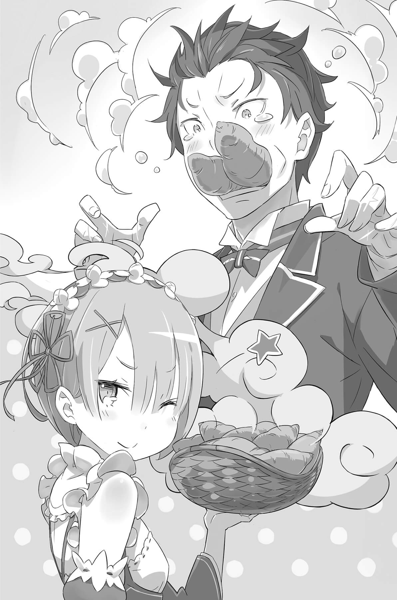

## 1

Сознание было где-то далеко. Покачиваясь на волнах, оно то всплывало, то снова тонуло между сном и явью.

— …других способов спасти его?

— …не знаю. Дальше делай как пожелаешь, мнится мне.

Вдалеке… или нет, совсем рядом, на границе между «там» и «здесь», вели беседу чьи-то голоса. Голос, полный надежды, отчуждённый голос, плачущий голос, бесстрастный голос… Разные голоса.

Ладонь вдруг ощутила мягкое прикосновение. Откуда-то из глубин памяти всплыло: это ощущение он испытывал уже не раз. Он жаждал тепла этой руки, мечтал вернуть его. Как он хотел, чтобы это было в реальности.

Ощущение чужой руки вдруг уплыло вдаль. Далеко, ужасно далеко… куда никогда не достать.

И вдруг…

— Я обязательно спасу тебя!

Эта твёрдая решимость осталась с ним, даже когда пропало всё, когда всё исчезло…

Его снова оставили позади и ушли. Ушли насовсем. Далеко-далеко.

А потом…

## 2

Интересно, сколько же раз он проваливался в темноту, чтобы потом очнуться вот так?

Субару рассеянно размышлял нал этим, разглядывая незнакомый потолок.

— Охх, больно…

Когда сознание немного прояснилось, он попытался приподняться в постели, но тут же почувствовал острую боль в боку. Попробовав ощупать живот, юноша осознал, что левая рука ведёт себя странно. Скривившись, Субару поднял руку к лицу и понял причину такой неуклюжести: от пальцев до запястья тянулся белый шрам. Но странное ощущение было не только в руке.

Он задрал рубаху — на саднящем правом боку тоже был шрам. На обеих лодыжках, на правой руке — на предплечье и на плече; даже на заду, — всех ран и не счесть.

Если это следы от зубов зверодемонов, значит…

— А я-то был уверен, что умер…

Когда он защитил застигнутую врасплох Рем, в его тело впились звериные зубы. Псы терзали плоть Субару и рвали его в клочья. Чувствуя, как вываливаются внутренности и вытекает кровь, он уже попрощался с жизнью и был практически уверен, что это конец.

— То есть меня всё же спасли и вылечили?

Проверяя, как двигаются пальцы, Субару потихоньку огляделся вокруг.

Незнакомый потолок, скромная постель. Не похоже, чтобы эта тесная комнатушка находилась в особняке Розвааля… Потом его взгляд упал на пристроившуюся на деревянном стуле девушку. Она дремала, уронив голову на грудь.

— Эмилия!

Ответа не последовало.

Эмилия спала, и её сон, похоже, был очень глубок, размеренное дыхание вздымало грудь. Серебристые волосы оказались непривычно растрёпаны, на одежде там и сям виднелись следы крови и грязи.

Итак, Субару был ранен. Пока он валялся без сознания, настало утро. Рядом спала Эмилия.

Увидев эту картину, даже медленно соображавший Субару понял, как было дело.

— Опять я у неё в долгу…

— Не знаю, не знаю. Поскольку на этот раз ты добился отличного результата, Лия наверняка не станет высчитывать, кто кому должен.

Услышав, как на его слова, произнесённые хриплым шёпотом, ответил чей-то голос, Субару глянул в сторону звука. Появившись из волос спящей Эмилии, Пак взмыл в воздух и поплыл к юноше.

— Привет, Субару! Как руки-ноги, работают?

— Не знаю. Шрамы немного подёргивает, но по случаю спасения моей жизни жаловаться не буду. Даже если рана на ране, я же мужчина, ныть не стану.

Не то чтобы он собирался изрекать: «Шрамы украшают мужчину», однако события, оставившие эти белые отметины, наверняка глубоко врежутся в его память. Но сейчас Субару больше интересовало то, как он получил эти раны.

— Чем всё закончилось, я вроде бы понял. Но что было посередине? Честно говоря, не очень помню, что случилось после того, как лесные пёсики устроили мне «мням-мням».

— «Мням-мням» — не то слово! Я видел, какого тебя принесли! Больше похоже на «гам-гам, грызь-грызь, хрусть-хрусть».

— Если судить по звуковым эффектам, я точно умер. Пяти-шести рук не хватает.

— Да уж, погрызли тебя изрядно! И служаночке с голубыми волосами досталось не меньше.

Пак вымолвил это очень легко, но у Субару сразу сжалось горло. Увидев реакцию юноши, котик добавил:

— Впрочем, находясь в демонической форме, она очень быстро залечила раны. Когда приволокла тебя в деревню, по ней уже ничего не было заметно. Даже не потребовалось применять исцеляющую магию.

— Так чего пугаешь зря?! Значит, Рем тоже вернулась в деревню. А та девочка, которая находилась вместе со мной?

— Была, была девочка, не волнуйся. Всех семерых детей вернули. Ты сделал всё совершенно правильно, Субару. Хлоп-хлоп-хлоп! — Пак бесшумно аплодировал мягкими лапками, приговаривая «хлоп-хлоп».

Субару невольно улыбнулся тому, как ловко дух обошёл проблему, но потом покачал головой, отгоняя отвлекающие мысли.

— Пак, а вы смогли расколдовать спасённых детей?

— И об этом не волнуйся. Им немножко восстановили силы магией, а уж со снятием заклятий мы с Бетти мигом справились. Расколдовали в лучшем виде, ручаюсь!

Пак гордо постучал себя в грудь, словно в барабан. Субару с облегчением вздохнул — его страдания были не напрасны! Затем юноша провёл рукой по своей груди и обернулся к спящей девушке.

— А что, Эмилия тут просидела ночь напролёт?..

— Я всегда прошу её иметь терпение и не спешить, да разве она слушает? Все силы истратила на твоё лечение, вычерпала до *ода*. Дай ей поспать.

— «До ода»? — Субару вопросительно взглянул на Пака, а тот встопорщил усы.

— Магическая сила, рассеянная в атмосфере, — это мана. Од — магическая энергия, которую живые существа накапливают в организме. Количество ода у разных людей слегка отличается, но в любом случае запас этой энергии конечен. Если полностью его израсходовать, погибнешь. Я предупреждал Лию, чтобы не пользовалась им, но…

Пак умолк, а Субару по выражению его мордочки представил, как было дело.

Начать следовало с того, что вызов Пака посреди ночи противоречил договору. И если для снятия заклятия с детей требовалась помощь Пака и Беатрис, но это могло подождать до утра, то спасать Субару нужно было немедленно, и Эмилия наверняка ни секунды не колебалась. Она всегда готова была помогать другим, жертвуя своими интересами. Именно поэтому Субару и влюбился в неё.

— Мы ведь в деревне, в чьём-то доме? Можно мне выйти и оглядеться? — не желая будить Эмилию, шёпотом спросил Субару и спустил ноги на пол. — Мне ведь лучше немного размяться и проверить, иду ли я на поправку?

Пак утвердительно кивнул. Получив разрешение, Субару осторожно направился к двери. Минуя Эмилию, он уважительно склонил голову, приветствуя её. Впрочем, когда лицо спящей сереброволосой девушки оказалось совсем близко, ему пришлось подавить неожиданно вспыхнувшее желание устроить какую-нибудь шалость, и Субару поспешно вышел.

— А, ну да, само собой. Мог бы сразу догадаться, — промолвил юноша, когда выглянул на улицу из сеней и увидел взбудораженную деревню.

Солнце только всходило, но на площади в центре поселения толпилось множество людей. Деревня была маленькой, и, если что-то случалось, все жители сразу оказывались в курсе. Старики, женщины, дети с обеспокоенными лицами окружили группу, состоящую в основном из крепких парней, которые явно их утешали.

Наверное, те самые ребята, которые вчера вслед за Субару и Рем ринулись в лес. Некоторые были в бинтах — очевидно, среди них тоже имелись раненые. Субару оглядел их, но не нашёл того, кого искал, и недоумённо наклонил голову. А потом вдруг…

— Барусу, ты очнулся?!

Кто-то окликнул его сзади, и Субару быстро обернулся. По тому, как его назвали, юноша, конечно, понял, кто это, но, увидев лицо девушки, всё же почувствовал облегчение. За его спиной стояла служанка с розовыми волосами — Рам.

Рукава привычного наряда горничной были закатаны, а в руках Рам держала что-то вроде корзинки из бамбука. Там исходила паром целая гора варёных картофелин, которую девушка куда-то несла.

Из-за аппетитного запаха картошки желудок Субару предвкушающе сжался. Только сейчас он ощутил, что страшно голоден.

— Как неприлично! Заставил всех переволноваться со своими ранами, а чуть только открыл глаза — и сразу жадно таращишься на еду? Может, раз тебя покусали псы, ты обратился собакой?

— «Обратился собакой»? Это как?! Впрочем… выходит, ты за меня волновалась?

— Вот, подавись!

— Хваху!..

Стоило Субару начать дразниться, посмеиваясь над словами Рам, как она мгновенно насовала ему в рот дымящейся картошки. Горячие клубни застряли в горле, но Субару запрокинул голову и, состроив зверскую гримасу, с чавканьем разжевал и проглотил их.

— Фу, думал, помру! Но вкусно!

— Конечно вкусно. С пылу с жару! В смысле, прямо из кастрюли.

— Даже если ты сама готовила, не обязательно так нос задирать. Впрочем, всё равно вкусно.

— Ладно, ладно, дам ещё штучку, только молчи и жуй спокойно.

Получив ещё картофелину, он стал баловаться с ней, как маленький ребёнок. Рам некоторое время неодобрительно смотрела на резвящегося Субару, а потом сказала:

— Но за вчерашнее я должна тебя поблагодарить. Ты неплохо потрудился.

— «Неплохо потрудился»? Как-то высокомерно звучит. И почему ты меня благодаришь?

— Если с вассалами что-нибудь случается, вина на господине. Как подумаю, что дети могли попасться целой стае вольгармов… В общем, ты действовал правильно, Барусу.

— Вольгармы, значит…

Так вот как назывались эти чёрные звери.

Вольгарм. Насколько Субару помнил, зверь с таким названием фигурировал в каких-то мифах. Да уж, солидное имя, подумал он. Как услышишь — сразу понятно, что от встречи с ним добра не жди. Пока Субару кивал в такт своим мыслям, Рам перевела взгляд на лес.

— Мы вчера укрепили барьер и потратили ночь, чтобы обойти периметр деревни и проверить, нет ли лазеек. Так что больше вольгармы не смогут проникнуть через границу.

— Если только… детишки опять не проберутся в лес и не притащат щеночка. Тогда вся защита будет насмарку.

— Неприятно это слышать. Я предупрежу деревенских.

Неизменно бесстрастное выражение лица Рам придало этим словам несколько угрожающий характер.

Похоже, следить за барьером, а также докладывать о его состоянии обязаны жители деревни, и Рам была явно недовольна, что по их вине могла пострадать репутация Розвааля.

Облегчив корзинку Рам ещё на пару варёных картофелин, Субару расстался с ней. Служанка направилась туда, где толпились деревенские жители, всё ещё переругиваясь между собой. Видимо, девушка решила немного позаботиться о местных и успокоить их. Выразить добрые намерения варёной картошкой — очень на неё похоже.

— Но до чего ж картошечка вкусна! И посолена просто идеально!

Жуя, Субару шагал по деревне. Он собирался проверить, хорошо ли работают его вылеченные руки-ноги, а заодно узнать, как чувствуют себя спасённые ребята.

Сами дети всё ещё спали, уставшие и измученные заклятием, ныне снятым, а вот их родители и другие родственники рассыпались в благодарностях.

Субару, который пустился в путь вовсе не из желания выслушивать благодарственные речи, занервничал и пришёл в замешательство. Поскольку скрывать смущение паясничанием сейчас было бы неуместно, он молча покраснел и рванул прочь, чтобы спастись от этой неловкости.

Обойдя деревню, Субару уже решил было вернуться в дом и подождать, пока проснётся Эмилия, как вдруг вспомнил, что ещё не видел некую девушку с голубыми волосами.

В памяти вдруг возник образ демоницы, залитой кровью и хохочущей во всё горло. Это был величественный и жуткий образ, но Субару вспомнил, что в тот момент содрогнулся не от страха. Что же он почувствовал при виде вырастающего белого рога? Наверное, это было…

— Вот ты где! Как раз вовремя, — кто-то окликнул Субару.

Раздвинув ветки, из зарослей появилась Беатрис, не заботящаяся о том, что подол её роскошного платья волочится по земле.

— Чего по улице ходишь с таким шлейфом? Испачкается ведь!

— Магия отталкивает все источники загрязнения: и грязь, и песок, мнится мне. А вообще, у меня к тебе разговор.

Достойно ответив на дурацкий вопрос, Беатрис поманила Субару рукой. Она явно предлагала отойти подальше. Как это понимать? Секретный разговор?

Слегка занервничав, Субару тем не менее не стал протестовать. Он послушно двинулся вслед за своей благодетельницей, но вдруг хлопнул в ладоши:

— Погоди-ка, если ты покинула поместье, значит, ты пришла, чтобы снять заклятье с детей?! Спасибо тебе!

— Не стоит, мнится мне. Бетти сделала это только потому, что попросил братик.

А Пак, естественно, обратился к Бетти по просьбе Эмилии. Беатрис прекрасно это знала, но тем не менее ссылалась на Пака. В этом была вся маленькая упрямая волшебница, не желающая признавать, что действовала из гуманных побуждений.

Она отвела едва сдерживающего нетерпение Субару в один из укромных уголков на окраине деревни, где дома стояли прямо у поля. Из-за переполоха со зверодемонами все жители собрались в центре поселения, так что едва ли здесь можно было кого-нибудь встретить.

— Ну, и зачем мы сюда пришли? Что у тебя за дело? — вопросил Субару, приглашающе раскинув руки, точно для объятий.

— Я думала, здесь подходящая атмосфера, чтобы ты оставил свои дурацкие шутки, — со странной неловкостью ответила Беатрис.

Не глядя ему в глаза, она, словно в нерешительности, теребила подол платья. Кажется, девочка готовилась сказать что-то неприятное.

Это было совершенно не похоже на Беатрис, которая привыкла вываливать всё как есть. Она выглядела словно ребёнок, который боится расстроить родителей. Глядя на Бетти, Субару, как ни странно, не решался её торопить. Он скрестил руки на груди и опёрся спиной на деревянную изгородь, ожидая, когда Беатрис снова заговорит.

Кажется, это подействовало ободряюще. Опустив ресницы, она помедлила, а потом взглянула прямо на Субару, который замер, вдруг увидев в её зрачках собственное отражение.

— Не пройдёт и полдня, как ты умрёшь!

## 3

Субару попробовал услышанные слова на зуб, разжевал, проглотил, усвоил.

Те несколько секунд, которые потребовались, чтобы смысл сказанного миновал его горло, спустился в желудок, переварился, проник в плоть и кровь и наконец достиг мозга, Субару оставался недвижим.

— А ты не так уж взволнован, мнится мне. Думала, будешь визжать и рыдать.

Юноша отреагировал слишком спокойно, и Беатрис удивлённо подняла брови. Внимательно глядя на неё, он поднял руку и показал два пальца:

— В голову приходят две возможности.

Он загнул один палец перед лицом замолчавшей девочки.

— Первое — это чёрный юмор. Ну, просто неудачная шутка. Если честно, это ничуточки не забавно… хотя, конечно, ты можешь сейчас достать плакат с надписью: «Ага, испугался! Получилось!» — и потешаться надо мной вволю. Кстати, сейчас самое время для плаката! — Он подмигнул, ожидая реакции на шутку, но выражение лица Беатрис не изменилось.

Видя, что она продолжает молчать, Субару загнул второй палец.

— А если это не шутка, остаётся только одна возможность. Проклятье всё ещё не снято.

— Когда в лесу тебя покусали звери, они наложили дополнительные проклятия, — сложив руки на груди, Беатрис подтвердила догадку Субару.

Получалось, зверодемоны оставили ему на память не только белые следы от клыков и зубов, пестревшие по всему телу… С отвращением взглянув на шрамы, стягивающие кожу, Субару спросил:

— На всякий случай уточняю: снять заклятье нельзя? Ты ведь не пытаешься набить себе цену?

Он, конечно, не ожидал, что Беатрис скажет: «Ты не просишь, вот я и не делаю», но в глубине души готов был цепляться за самую слабую надежду. Беатрис, разумеется, лишь покачала головой.

— Если б кто-то мог снять это заклятье, ты бы остался обязан ему по гроб жизни, мнится мне!

— Ну-ну, пощади! Мне и так уже долги возвращать — не перевозвращать.

Да он ведь только и делает, что влезает в новые долги, ещё ни одного не вернув. И в прошлый раз, и в позапрошлый, и сейчас. И не только в этом мире…

Субару настолько погрузился в воспоминания, что Беатрис подозрительно прищурилась, но он только бессильно махнул рукой.

— Ясно. Могу я спросить, почему это заклятье нельзя снять?

— Что ж, ты хотя бы заранее узнаешь, от чего умрёшь. Всё просто, мнится мне. Множество заклятий накладываются друг на друга так, что снять их слишком сложно.

— Накладываются друг на друга?

Субару задумался, не в силах представить подобное, но Беатрис развела руки в стороны, и внезапно между ладонями протянулась красная нить.

— Допустим, заклятье — эта красная нить.

Беатрис завязала на нити узелок.

— Допустим, этот узелок — способ, которым наложили заклятье. Если говорить простыми словами, для снятия заклятья нужно просто развязать этот узелок, мнится мне. Однако…

Ловко двигая пальцами, Беатрис увеличила количество нитей, соединяющих её руки. Новые нити — голубые, жёлтые, зелёные, розовые, чёрные, белые — появлялись одна за другой. На каждой нити возник собственный узелок, и все они переплелись друг с другом…

— Если заклятье одно, от него можно избавиться. Но если они вот так переплетутся…

Беатрис вытянула руки вперёд, и Субару перехватил у неё нитяной узор, как в игре. Нити, натянутые между пальцами, запутались настолько, что не поддались ни на миллиметр, когда он попытался потянуть.

— Значит, заклятья подобны этим ниткам?.. Вот чёрт! Да уж, тут явно максимальный уровень сложности.

Наверное, можно развязывать узелки по одному, но непонятно, с какого конца за это браться. Впрочем, если иметь достаточно времени, то шансы на успех есть.

— Ты сказала «полдня». Но откуда такая уверенность?

— Вот это как раз совсем просто, мнится мне. Когда пройдёт полдня, сработает заклятие, высасывающее ману.

Подняв палец, Беатрис нацелила его на Субару и продолжила:

— Заклятье, которое налагают эти твари, — «лишение маны», мнится мне. Они так питаются, мана нужна, чтобы их тела могли двигаться. В общем, ты стал кормом для зверодемонов…

— Значит, они нападают на людей, потому что голодны? И правда, дикие звери не заморачиваются. То есть мне надо сказать спасибо, что у них пока ещё животики не подвело?

Ему хотелось куда-то выплеснуть раздражение, но руки оказались заняты нитями. Глядя, как он нервно дёргает их, Беатрис поинтересовалась:

— Тебе что, не страшно?

— Чего?

— Получается, Бетти только что вынесла тебе смертный приговор. Мнится мне, мы с братиком смогли бы тебя спасти, но нам просто не хватит времени.

По самым оптимистичным оценкам у Субару осталось полдня. Хотя не будет ничего удивительного, если зверюги проголодаются ещё раньше и в то же мгновение лишат его жизни.

Вывалив на голову Субару тот факт, что спасти его невозможно, Беатрис явно ждала реакции, и юноша вдруг задумался над её мотивами.

— И что? Ждёшь, что я буду тебя упрекать?

Девочка не стала отрицать, но и не подтвердила эту версию.

Прочитать, что же на уме у молчавшей Беатрис, не получилось, и Субару горько усмехнулся.

— Если смотреть с человеческой точки зрения, то ваше с Паком решение жестокое, но вполне логичное. Слишком много риска. Вы правы. И я даже не считаю это бессердечным.

Он говорил совершенно искренне, вовсе не пытаясь рядиться в одежды отрешившегося от мира философа…

— Только у меня есть ещё один вопрос. Ты не против?

— Нет, мнится мне.

— Эмилия тоже знает про заклятие, которое на меня наложили?

Субару помнил, что Эмилия, сама не своя от усталости, заснула в той комнате, где его выхаживали. Знать бы, как она отнеслась к тому, перед чем отступили Пак и Беатрис. Неужели и Эмилия от него отказалась? Пожалуй, это единственное, что его беспокоило.

— Полукровка ничего не знает. Мнится мне. Пак не пытается снять твоё проклятие, чтобы Эмилия ничего не узнала.

— Ага, ясно. Если Пак начнёт возиться с проклятием, Эмилия наверняка заметит. Сразу поймёт, что меня вот-вот сожрут и что ситуация безнадёжная.

Осознав, что не в силах помочь Субару, Пак наверняка пытался защитить Эмилию. Если молчать до последнего момента, на душу девушки обрушится лишь один удар — смерть Субару, и её сердце не будет разрываться от ужасного ощущения бессилия. Что ж, для Пака, который прежде всего заботился об Эмилии, это было вполне естественным решением. Уяснив намерения духа, который оказался совсем не таким прохвостом, как могло показаться на первый взгляд, Субару, словно подводя итог, спросил:

— Ну? И что дальше?

Глядя на палец, наставленный на неё, Беатрис нахмурила бровки, и он уточнил:

— Думаю, ты не настолько жестока, чтобы просто так рассказывать человеку о его скорой смерти.

— Да ты ничего не знаешь о Бетти, мнится мне!

— На самом деле знаю! И немало! По моим ощущениям, наше с тобой знакомство длится раза в четыре дольше, чем ты думаешь.

Наблюдая, как у девочки на лбу собираются глубокие морщины, Субару вспомнил последние две недели, которые они — хорошо или плохо — прожили вместе.

Его отношения с Рам и Рем сейчас были самыми лучшими, если сравнить с предыдущими кругами. С Эмилией, если не считать испытанного в эпизоде с коленями стыда, тоже прекрасными. Юноше удалось найти колдуна, который был главным виновником его бед, и даже спасти детей!

Из всех кругов нынешний по набранным баллам, пожалуй, тянул на самую высокую оценку. Если бы Субару ещё удалось его пережить, можно было бы гордиться собой.

— Но ведь ты, Рем и Эмилия залечили мои раны, верно? Зачем же так возиться с парнем, которого всё равно не спасти?

Беатрис, похоже, заволновалась. Видя её хитрости насквозь, Субару слегка улыбнулся.

— Ты совсем не умеешь врать!

— Но то, что вероятность спасения очень низкая, — правда. И то, что братик старается не впутывать Эмилию в это дело, — тоже, мнится мне.

— А ты решила изобразить злодейку и принять на себя мой гнев? Слишком уж замысловато для лольки. Ну, давай рассказывай, что это за кро-о-охотная вероятность, — потребовал Субару, продемонстрировав Беатрис большой и указательный пальцы, сведённые так, что между ними осталась лишь щёлочка.

Немного поколебавшись, она устало вздохнула, словно отказываясь от борьбы, и ответила:

— Мнится мне, ты помнишь, что я рассказывала про заклятия: если они начали действовать, процесс не остановить.

— Да-да. Поэтому их нужно снимать до того, как они активировались, как ты сделала в тот раз… Нет, стой-ка! Что-то здесь не так. Если это правда… как же спаслись дети?!

Субару задумчиво опустил голову, поняв, что именно показалось ему странным ещё раньше. По словам Беатрис, снять можно только заклятие, которое не начало действовать. Вступившее в силу заклятие побороть невозможно, именно этим оно так страшно.

Найденные в лесу дети оказались существенно ослабленными, и это явно было результатом подействовавшего звериного заклятия. Но ведь ребята выжили и идут на поправку! А значит…

Выстраивая эту гипотезу, Субару вдруг почувствовал, как его, словно током, пронзила мысль. Подняв глаза на Беатрис, он снова спросил:

— Если тот, кто наложил заклятие, умирает, что происходит с колдовством?

— Обычное заклятие продолжает действовать. Но мы имеем дело с проклятием высасывания маны. Если тот, кто собирался тобой поживиться, погибнет, то, по логике, поедание должно прекратиться.

Выходит, Субару всё понял правильно!

Действие заклятия, наложенного на детей, прервалось, потому что зверодемоны были уничтожены. Если создатель заклятия погибает, то ситуация упрощается, и Беатрис может снять остатки чар.

Вчера в лесу рассталось с жизнью множество зверодемонов. Если среди них были те, которые наложили заклятия на детей, то всё сходится, и напрашивается ещё один вывод…

— Значит, так, да? Тех, кто наложил на меня заклятие, слишком много, и распутать клубок их колдовства нельзя?..

Субару оглянулся и посмотрел на лес, где обитали зверодемоны. Всё тело юноши было покрыто следами от клыков бесчисленных тварей. Если каждый шрам скрывал в себе проклятие высасывания маны, то зверей, заколдовавших его, было слишком много. Разумеется, найти и уничтожить всех за полдня — невыполнимая задача. В этом и состояла причина сомнений Пака и Беатрис, причина того, что они утаили правду от Эмилии.

— Братик…

— Я уже и сам понял. Если Эмилия об этом узнает, она обязательно попытается сделать невозможное. С одной стороны, я этому рад, а с другой — очень этого боюсь.

Эмилия такой человек — без колебаний пойдёт на любые жертвы ради других. Именно поэтому Субару не собирался просить её о помощи. Об этом и думать было страшно! Ведь если, не приведи судьба, юноше доведётся увидеть, как Эмилия погибает на его глазах, он испытает такую боль, словно его разрывают на сотни клочков.

— М-да… Получается какой-то демонический уровень сложности! Не то чтобы выжить совершенно невозможно, но шансов почти нет. Остаётся только…

«Значит, ничего нельзя сделать?» — Субару ещё говорил, когда в голове у него вдруг раздался чей-то голос. Голос был ломкий, он звучал, словно хор странных шумов, таящихся где-то в глубине подсознания. Субару резко поднял голову и оглянулся. Кроме него и Беатрис, на окраине деревни никого не было, но голос продолжал твердить: «Должен быть другой способ спасти его!»

Голос звучал настойчиво, но при этом в нём скрывалась какая-то печальная, обречённая решимость.

— У тебя голова заболела, мнится мне? Это можно понять…

«Только один, мнится мне. Поступай как знаешь».

На голос стоящей перед ним Беатрис наложились иные слова, произнесённые ею же. Субару не понимал, откуда они доносятся, но в его голове явно звучали обрывки какого-то другого разговора. В глазах потемнело, в ушах раздался звон, словно от ударов колокола. Колени стали невольно подгибаться…

«Я непременно спасу его!»

Звук полного решимости голоса заставил уже подломившиеся ноги распрямиться. Этот голос был прекрасно знаком Субару. Он понял. Понял, что должен спросить.

— А где… Рем?

С самого утра Субару на глаза ещё ни разу не попалась девушка с голубыми волосами. Ему сказали, что в деревню они вернулись из леса вместе и её раны быстро зажили.

— Малышка Беа… Беатрис, а где… где Рем?

Субару наступал на хранящую молчание Беатрис, снова и снова задавая ей этот вопрос.

— Окажись ты на её месте, что бы сделал?

— Это не ответ!.. — яростно заорал Субару и угрожающе качнулся вперёд, словно намереваясь наброситься на собеседницу, но его повело в сторону. Виной тому была слабость от недавней кровопотери. С трудом удержавшись на ногах, он вдруг осознал, насколько отвратительно его поведение.

Да, только что Субару был готов крушить всё вокруг, а Беатрис встала прямо перед ним, словно желая обратить на себя его ярость… Юноша ощутил жгучую ненависть к самому себе за то, что едва не поддался её внезапной заботе. И тут…

— Я не могу просто так оставить то, что сейчас услышала!

Позади Субару и Беатрис прозвучал негромкий бесстрастный голос. Обернувшись, они увидели, как из прохода, ведущего к площади, появилась девушка с розовыми волосами.

— Рам…

Услышав своё имя, служанка взглянула на Субару — и у него перехватило дыхание от её холодного взгляда. В памяти всплыла цепляющаяся за постель фигурка Рам и её ужасный, отчаянный крик — из того мира, где она потеряла Рем. Опасность, грозящая любимой младшей сестре, наверняка заставит Рам возненавидеть всех, как в тот раз…

Лишь додумав эту мысль, Субару наконец заметил… Заметил, как руки Рам, сложенные на груди, дрожат мелкой дрожью. Заметил, как она закусила губу, пытаясь скрыть свои чувства и стараясь изо всех сил сохранить невозмутимое выражение лица.

— У меня не получается найти Рем. Даже Ясновидением! Госпожа Беатрис… где она?

— Я лишь указала на вероятность, только и всего. У Бетти и братика выбор ограничен, мнится мне. Мы не имеем права действовать наобум.

— Разве я об этом спрашиваю?! Значит, Рем в самом деле…

…Неужели она в одиночку отправилась в лес, кишащий зверодемонами… В надежде уничтожить всю стаю?

И это лишь затем, чтобы спасти Субару Нацуки?!

— Почему?.. Почему Рем ради меня готова на такое?!

Ведь в прошлом она даже убивала Субару своими руками. Пусть их отношения сейчас немного лучше, чем раньше, но разве они настолько близки, чтобы Рем ради Субару рисковала жизнью?..

Юноша всё ещё никак не мог поверить, что Рем действительно так поступила, когда его взгляд упал на стоящую рядом Рам. На мгновение её лицо омрачилось горем, но это выражение тут же сменилось решимостью: девушка явно была готова сорваться с места и помчаться в лес вслед за сестрой.

— Стой!!!

Субару прыгнул вперёд, раскинув руки и загораживая ей путь. Рам обожгла его взглядом:

— Отойди, Барусу. Мне некогда тебя ласково утешать.

— Но нельзя же бросаться, не подумав! У меня есть несколько вопросов, и я хочу, чтобы ты сначала ответила на них, только честно.

— Но это нет вре…

— Я тоже хочу спасти Рем! И если ты хоть чуть-чуть считаешь меня своим, выслушай! Может быть, я помогу, пусть даже немного!

Осознав, что Субару предлагает какой-то способ выручить Рем, Рам немного смягчилась. Подметив её колебания и подняв палец, он торопливо задал первый вопрос:

— Всего две вещи. С твоим Ясновидением можно определить, где находится Рем?

— Да, можно. Когда я выйду за лесной барьер, она будет в поле зрения. Если я настрою Ясновидение на созданий, находящихся рядом с Рем, и если она не выйдет из радиуса действия Ясновидения, я обязательно найду её!

— То есть ты как бы смотришь чужими глазами?.. Будто перебираешь камеры наблюдения, сидя в комнате охраны… Впрочем, неважно. Главное, это позволит нам встретиться с Рем, — покивал Субару, получив ответ на первый вопрос, и поднял второй палец. — Итак, вторая вещь. Рам, ты ведь на самом деле боевая горничная?

— Что ты имеешь в виду?! — Рам прищурилась, а Субару пожал плечами.

— Неизвестно, где мы столкнёмся со зверьём, прежде чем найдём Рем. Если ты не можешь защитить себя, не о чем и говорить. Признаюсь честно: если дойдёт до схватки, я — лишь балласт.

— Стой, подожди… Барусу, ты что, собираешься идти со мной?! — нахмурилась Рам, не понимая, отчего Субару с таким гордым видом рассказывает о своей слабости.

— Я понимаю, что ты не хочешь меня брать, но это непременное условие. Будем говорить начистоту: если цель одна — спасение Рем, то я не очень нужен. Однако…

На лице Рам появилось ещё более недоумённое выражение, Субару прервался и торопливо замахал руками:

— К чёрту всё! Я переживу пятый день вместе со всеми! Ради этого я сражался раз за разом! Пожалуйста, позволь мне пойти с тобой!

Субару молитвенно сложил руки, и губы Рам дрогнули, словно она не знала, что сказать. В конце концов вместо слов с них сорвался только вздох.

— Если ты ждёшь, что я смогу драться так же, как Рем в демоническом облике, то напрасно.

— В смысле?

— В отличие от Рем я «безрогая» и умею применять только боевую магию ветра, — Рам пошевелила пальцами, и порыв ветра растрепал волосы Субару.

Вложи она больше силы в это лёгкое дуновение, оно превратилось бы в грозное лезвие, способное отрезать ногу, а то и голову! При этой мысли по спине Субару пробежал холодок, но теперь эта боевая сила была на его стороне — лучшего и желать нельзя!

— Беатрис! Мы с Рам идём в лес. Если Эмилия проснётся до нашего возвращения, придумай что-нибудь, отвлеки её.

— Собираясь вернуть младшую из сестёр, ты отказываешься от своей собственной жизни, мнится мне. Ты это понимаешь?

— Немного не так, позволь поправить, — Субару поднял палец в ответ на негромкий вопрос Беатрис. — Я не собираюсь с лёгкостью отказываться от жизни лишь потому, что привык умирать. Жизнь — драгоценная штука, и она всего одна! Я знаю, что вы изо всех сил спасали меня! Вы склеили её из кусочков, так дайте мне ещё побрыкаться, пусть даже это и выглядит жалко.

Да, они спасли его жизнь, на которую он сам уже махнул рукой. Многие протягивали юноше руку помощи, и сейчас настала его очередь. Субару получил отличный подарок — дополнительное время в матче, который уже считал проигранным.

— По правде, вы же вытащили меня с того света! А я очень жадный и ужасно хочу увидеть эпилог с собственным участием!

Это была совершенно дурацкая, непоследовательная мысль, и слова Субару не давали ответа на вопрос, заданный Беатрис, но юноша всё равно горделиво выпятил грудь.

— Не знаю, что там у тебя в голове. Ты можешь поступать как хочешь, мнится мне. Варианты я тебе описала, а какой путь избрать, решай сам.

— То же самое ты сказала и Рем? Что ж, спасибо тебе, малышка Беа.

Он обернулся к лесу, представив себе голубоволосую девушку, что, наверное, сражалась сейчас в кромешной темноте… Торопливо сбежала, не сказав ни единого слова, ни с кем не советуясь, сама решила за всех, сама сделала выводы… Вот же глупая и упрямая девчонка!

— Раз уж ты собралась что-то для меня сделать, хоть бы попросила тебе помочь! — заявил Субару, отважно грозя кулаком в сторону леса, кишащего зверодемонами.

И Субару объявил новый раунд войны — войны против стаи чёрных зверей, поджидающих в чаще, против той сверхъестественной силы, что всучила ему этот жребий.

— Последняя битва, госпожа Судьба! Скоро узнаем, кто кого!

## 4

— Пожалуй, ты слишком пафосно выступил, — заметила Рам минут через пятнадцать, уже глубоко в чаще леса.

Глядя на Субару, с трудом продирающегося через заросли, она добавила:

— Трудно скрыть разочарование при виде балласта!

— Тебе вообще известно значение слова «скрывать»? — пропыхтел Субару в ответ на её высокомерные слова, — Если собеседник узнал о том, что ты скрываешь, значит, у тебя ничего не вышло.

Они с Рам брели по лесу, полному зверодемонов, в поисках Рем. Перейти раницу и углубиться в лес предложила Рам, знакомая с повадками этих тварей. Обычно они держались поодаль от барьера, причинявшего им боль и жили стаями в горах. Естественно, Рем, которая намеревалась очистить лес от зверодемонов, должна была направиться в ту сторону.

— И вообще, чего ты ждёшь, когда тут одни звериные тропы?

— Ты еле ползёшь, а мы зашли совсем недалеко. Так нельзя!

— Погоди, не убегай! Я понимаю: нужно спешить, но по дожди хоть немножко!

Костюм горничной совсем не годился для похода по горным тропам, но Рам шагала энергично, словно происходящее было для неё не в новинку, и раза в два быстрее, чем Субару. Она торопилась спасти сестру и не собиралась приспосабливаться к медленному шагу юноши. Если он будет и дальше так тащиться, то наверняка получит столько позорных прозвищ, что в жизни от них не отмоется.

— Я, между прочим, потерял много крови, только оправился от ран, и сил у меня кот наплакал… И никакого напутствия от Эмилии-тан.

— Раз ты ещё не сказал ей: «Я вернулся», пока действуют напутствия вчерашнего вечера.

— Думаешь?..

Покрутив головой в ответ на казуистику Рам, Субару воткнул в землю меч, которым пользовался как посохом, чтобы помочь своим дрожащим ногам и не отстать от стремительной спутницы.

Этот меч Субару одолжил у парней из деревни Эрлхэм за неимением костыля.

Вряд ли он забудет лицо их предводителя в тот момент, когда объявил о походе в звериный лес. Парень был страшно удивлён и попытался остановить его, а потом, когда Субару наскоро объяснил, как обстоят дела, вручил меч. Тот считался лучшим оружием в деревне, хотя и был самым простым, одноручным. Размахивать им смог бы даже такой дилетант, как Субару, потому он принял оружие, когда их с Рам провожали из деревни. Впрочем, жители доверили им не только меч.

— Что тут у меня… конфетки… красивый камешек… Фу-у-у-у, жук! — нащупав что-то неприятное, заорал на весь лес Субару. Он как раз решил порыться в карманах и выяснить, что ему положили на прощание. Чуя свободу, жук-листоед вырвался из руки Субару и полетел в глубь леса.

— Воспользовались суматохой, сорванцы! Ох, получат они у меня!

— Это свидетельство их любви и уважения. Интересно, и что они в тебе нашли?!

— Чистые детские глазёнки видят, как сверкает моя подлинная мужественная сущность. И вообще, им нравлюсь не только я. Ты же заметила? — уточнил он, и Рам неуверенно согласилась:

— Возможно.

Субару удовлетворённо кивнул.

Девушка видела, как он сердечно прощался с детьми перед уходом из деревни; сама она могла только мечтать о таком.

После того как их с Рам проводил отряд молодёжи, Субару окружили проснувшиеся дети. Желая сказать им с Рем спасибо, они напихали ему в карманы всякой всячины. Конфеты, камешки, жук — всё это было выражением ребячьей благодарности, и к этим предметам нужно было относиться бережно. Правда, жук всё же улетел…

Выразив свои чувства наивным способом, дети сказали смущённому Субару:

— Мы и Ремрин хотим поблагодарить! Ты её приведёшь потом?

Знать бы, где сейчас Рем, в какой опасности, почему бьётся, рискуя жизнью…

Дети этого не знали. Им и не нужно знать. В конце концов…

— Сказал же, успокойтесь, мелкие паршивцы! Неслухам, которые вечером убегают в лес, я прочитаю длинную-длинную лекцию. И слишком скорой на суд сестричке, которая ни с кем не советуется, тоже.

Конечно, сюда следовало добавить и ещё одного мальчишку, который так же безрассудно отправился в лес, попался на зуб собакам и заставил всех за себя беспокоиться… Пожалуй, ему даже доставит удовольствие целый вечер просидеть на пятках, выслушивая проповедь старосты.

От таких мыслей губы Субару сами собой растянулись в улыбке. Шедшая впереди Рам остановилась и, не оборачиваясь, приказным тоном велела:

— Барусу, подожди немного. Я воспользуюсь Ясновидением.

Девушка обратила лицо к молчаливому лесу. Субару показалось, будто все звуки исчезли; он поспешил встать рядом с неподвижной Рам, вынул меч из ножен и принялся озираться.

Нельзя было терять бдительности, ведь, применяя Ясновидение, Рам становилась беззащитной. Девушка опустила бледное лицо и молча сосредоточилась.

Ясновидение позволяло смотреть глазами не только других людей, но и прочих живых существ. Используя зрение тех созданий, с кем удавалось настроиться на одну волну, можно было захватывать зрение всё новых и новых животных, расширяя тем самым охват и в буквальном смысле ясно видя на большое расстояние. Они отправились в лес, рассчитывая именно на эту способность Рам, и уже несколько раз она применяла Ясновидение, но пока обнаружить Рем не получалось. Насколько понял Субару, из-за многочисленной живности, обитающей в лесу, поиск, наоборот, усложнялся.

Вот только…

— Барусу… На нас с тобой кто-то смотрит!

— Значит, они здесь… Мне выйти вперёд?

Субару взглянул на Рам, которая кивнула с закрытыми глазами, и набрал в грудь побольше воздуха, чувствуя, как сердце начинает колотиться всё быстрее.

Он медленно двинулся дальше, оставляя позади беззащитную Рам, в одиночку пробрался сквозь заросли и поднялся на поросший мхом камень. Там он остановился и глубоко вздохнул. А потом опустил меч, который до этого держал в руках.

Железное навершие ножен ударило о каменья и по замершему лесу разнёсся громкий звон.

— Ага!

Разрывая тишину, в уши Субару ударил рык и топот лап, стремительно отталкивающихся от земли. Юноша мгновенно обернулся и увидел чёрное четвероногое создание, которое бросилось на него из-за деревьев. Обнажённые клыки нацелились в горло — зверь надеялся разорвать человека в клочья прежде, чем тот отреагирует.

Субару машинально вскинул руки в оборонительном жесте, но дикое животное оказалось быстрее. Острые клыки легко пронзили бы человеческую плоть, и захлебнувшийся кровью юноша расстался бы с жизнью, однако…

В следующий миг в тело зверя, уже летящего с раскрытой пастью, сбоку врезалось «лезвие ветра». Разрубленный пополам зверодемон моментально издох, но половина его туши с силой врезалась в Субару. Тот испуганно завопил и скатился назад. Поднявшись, весь в грязи и ссадинах, он недовольно обернулся к Рам, которая смотрела на него с вершины валуна.

— Почему они теряют хладнокровие, как только видят тебя, Барусу? Никак не возьму в толк, — устало вздохнула она.

— Ну слушай, можно же и поаккуратнее!

— Я старалась убить его безболезненно, и на тебя внимания уже не хватило.

Переведя взгляд с Рам, которая скривила губы, словно говоря: «Вот тебе!», Субару посмотрел на труп зверя у себя под ногами. Тело уже полностью лишилось жизненных сил, и хотя Субару знал, что это очень опасное животное, он всё же проводил его в последний путь, молитвенно сложив руки.

— Если так переживать о каждом, сердце не выдержит. Не говоря уж о том, что ты умрёшь, если мы их всех не уничтожим. Сам ведь придумал такой способ охоты!

— Ты что, никогда не слышала про лицемерную сентиментальность? Помогает обрести душевное равновесие.

По правде говоря, дело было не в сентиментальности, а в том, что они выросли в совершенно разных мирах. Субару не считал себя религиозным, но всегда испытывал определённое уважение к жизни. И теперь, после того как он прочувствовал на своей шкуре Посмертное возвращение, ему казалось, что это уважение даже усилилось.

— Так что, твоё Ясновидение помогло найти Рем?

— Нет. Боюсь, она где-то ещё дальше. Я попыталась проверить, но эти вольгармы, которые выпрыгивают и нападают на тебя, не дают сосредоточиться.

Говоря, Рам озадаченно приложила руку к щеке: девушка явно имела в виду то странное обстоятельство, которое заставляло зверей охотиться именно на Субару. На самом деле ответ на её немой вопрос уже смутно вырисовывался в голове юноши, но говорить о нём не хотелось. Стыдясь своей слабости, Субару молчал, а Рам, несколько раз переведя взгляд с него на зверя и обратно, заявила:

— Наверное, это потому, что ты выглядишь слабаком!

— Долго думала, чтобы так решить?! Могла бы и повежливее сказать!

— Тогда потому, что ты лёгкая добыча?

— Суть-то не изменилась, сестричка!

Рам пожала плечами, а Субару поник. Было непонятно, действительно ли Рам так считает или просто издевается. Но скорее второе.

После того как они вошли в лес, вольгармы уже несколько раз нападали поодиночке, и каждый раз Рам магией уничтожала зверя, нацелившегося на Субару.

Такой способ охоты был выбран по инициативе юноши. Мишенью всегда становится именно он, несмотря на то что во время сеанса Ясновидения Рам выглядела совершенно беззащитной. Сначала она отнеслась к этому с недоверием, но потом перестала сомневаться.

Субару подумал, что сейчас самое время сменить тему, и нерешительно задал вопрос:

— А можно спросить, что значит «безрогая»?

Его сразу заинтересовало это определение, и у юноши уже появились некоторые догадки. Рам смерила его взглядом сверху вниз.

— Именно то и означает! Оскорбительная кличка для тех глупых демонов, что потеряли свой рог.

При слове «демон» Субару сразу вспомнился вчерашний облик Рем. Воистину незабываемое зрелище: на лбу у перепачканной кровью, безумно хохочущей девушки ярко сверкал белый рог. Она выглядела в точности как демон из старых детских сказок.

А теперь вот Рам называет себя «безрогой», а значит…

— Да, из-за кое-каких неприятностей я потеряла свой единственный рог и с тех пор во всём полагаюсь на Рем.

— Наверное, я что-то неприличное спросил?

— Почему? — Рам с искренним удивлением взглянула на смущённо потирающего щёку Субару.

— Ну, я не знаю, насколько важны для демонов рога, но могу представить, что потерять их — настоящая беда. Вот и подумал, что касаться больного вопроса бестактно.

— Что уж теперь говорить, когда ты всё раскопал, — с некоторой угрозой заметила Рам, но вдруг вернулась к обычному тону. — Ладно, не волнуйся. Не будем вспоминать о прошлом, сейчас я уже смотрю на это спокойнее. Потеряв рог, я обрела жизнь. Правда, Рем так не считает, наверное…

В голосе Рам зазвучала печаль, и она оборвала себя, одновременно взмахом руки показав Субару, что применяет Ясновидение.

К тому времени, как Субару взобрался по склону, Рам уже глубоко ушла в себя, глядя на мир чьими-то глазами. Она стояла, сомкнув веки, дыхание стало прерывистым, на лбу и висках выступил пот. Ноги мелко дрожали, словно от безостановочного бега, и она даже пошатнулась, будто из-за головокружения. Судя по всему, Ясновидение, заимствующее чужое зрение, давалось девушке очень нелегко.

Но, как бы трудно ни приходилось, с её губ не сорвалось ни единой жалобы! Близнецы Рам и Рем всё-таки были очень похожими по своей сути. Когда требовалось, они готовы были надрываться, не щадя себя. Если подумать, то вся девичья команда из поместья Розвааля, включая Эмилию и Беатрис, выглядела чересчур самоотверженной…

— А я такой слабак, что самому противно!

Субару раздражённо поддал ногой траву. Но это оказалось ошибкой: разлетевшаяся земля и травинки попали в глаза и рот. Отплёвываясь, он проклинал собственную нерешительность, но очередная глупость неожиданно помогла ему немного расслабиться.

— Рам, ты ведь жутко переживаешь за Рем, да?

Он задал этот вопрос, сознавая, что нехорошо мешать Рам, сосредоточившейся на Ясновидении. Девушка, чьё сознание настроилось на чужие глаза, действительно немного повременила с ответом.

— Само собой. Она, конечно, сильнее меня, но это не значит, что о ней можно не беспокоиться.

— Вот как…

— Пусть даже она во всём лучше меня, я — старшая сестра. И это никогда не изменится.

До сих пор Субару недооценивал Рам, считая, что она использует старшинство, чтобы облегчить себе жизнь. Теперь он понял, как был неправ; более глупую ошибку и представить трудно!

Рам прекрасно понимала своё положение, гораздо лучше, чем думал Субару. Она отлично знала, что ей не по силам быть такой старшей сестрой, которой Рем могла бы гордиться, но готова была защищать младшую до конца.

Видя её непреклонную решимость, Субару понял, что пришёл его черёд.

— Конечно, я хотел это сделать после того, как мы встретимся с Рем, — пробормотал он, нервно поскрёб щёку и принялся разминаться.

Возможно, Рам почувствовала новый настрой Субару и, прервав свой так и не принёсший результата сеанс, открыла глаза. Откинув назад мокрую от пота чёлку, она недоверчиво поглядела на юношу.

— Барусу, ты что собрался делать?

— Сейчас я просто балласт, как ты знаешь. Но помнишь, до того, как мы вошли в лес, я говорил: от меня может быть польза в спасении Рем!

Он ещё не был уверен на сто процентов, но если учесть последние события, то шансы на удачу повысились до семи к трём. Конечно, оставшиеся тридцать процентов неуверенности давили тяжёлым грузом на душу…

— Значит, сделаем крупную; ставку. Рам, ты готова вместе со мной перейти по опасному мостику?

— Вдвоём с парнем в лесу, полном зверодемонов… Куда уж опасней для девушки.

— Вечно ты как скажешь, так скажешь, сестрица!

Субару рассмеялся, а потом глубоко вдохнул и раскрыл глаза. Если его догадка верна, сейчас ситуация изменится. Он не сомневался, что поступить так необходимо, но сердце всё-таки замирало от страха.

Субару осознавал, что является страшным трусом, но бывают такие случаи, когда бежать просто нельзя! И если он прав, сейчас именно такой случай!

— Рам, на самом деле я…

«Я наделён Посмертным возвращением», — вот что он хотел сообщить.

Субару попытался нарушить запрет, заговорив о том, о чём следовало молчать. Лицо Рам, которая повернулась к нему, мгновенно застыло.

Нет! Это остановилось время!

Мир утратил краски, исчезли звуки, и, казалось, само понятие времени растворилось. Всё замерло, и внезапно появилось существо, неподвластное этому оцепенению.

— Ага, вот ты где!..

Бормотание Субару было беззвучным, но он надеялся, что этот выпад всё же достигнет субстанции, что клубилась перед ним. Если бы удалось хоть чуть-чуть передать свою злость, юноша был бы страшно рад.

В мире, где остановилось время, двигалась лишь чёрная мгла. Возникнув из ниоткуда, она потянулась к слишком расхрабрившемуся Субару, принимая некую форму. Сначала возникли пальцы, потом запястье и локоть, — форма явно напоминала правую человеческую руку. Раньше она возникала по локоть, но теперь проявилась до самого плеча.

Субару беззвучно застонал, когда мгла, которая на этот раз обрела гораздо более отчётливые очертания, запустила свои чёрные пальцы в его грудь. Проникнув сквозь грудные мышцы, они скользнули по рёбрам и потянулись прямо к сердцу. Хотя юноша знал, что так и произойдёт, терпеть перешедшую все границы боль было просто немыслимо. В мире не осталось слов, чтобы рассказать о муке, терзающей стиснутое в безжалостной хватке сердце, и её невозможно было облегчить даже самым диким криком и корчами.

Невыносимое истязающее безвременье тянулось без конца.

Сердечный ритм сбился, кровь застыла в жилах, всё тело вопило от ужаса. Боль достигла такой отметки, что он чувствовал, как готовы брызнуть кровавые слёзы, как хрустят, крошась, стиснутые зубы. В замершем мире у Субару осталась лишь боль. Никакого выбора, только подчиниться ей, не имея даже возможности корчиться…

Наконец боль постепенно отдалилась, и взор затопила белизна…

— Барусу?

Услышав оклик, Субару осознал, что упал на колени. Лицо опущено, изо рта капает слюна… Спохватившись, он вытер рот рукавом и поднялся.

— Ну и ну, заснул средь бела дня!

— Нельзя так сразу утруждаться после ранения. Лучше бы тебе вернуться в деревню. Но если ты знаешь способ найти Рем, то объясни и… — начала было Рам, но вдруг изменилась в лице и оглянулась.

Лес погрузился в безмолвие, и лишь ветер покачивал ветви деревьев и шелестел листвой. Прислушавшись, Рам посмотрела на Субару.

— Что ты сделал, Барусу?

— Да так, просто бросил кости… это больно, знаешь ли…

Впрочем, несмотря на то что страдание оказалось страшным, сейчас от него не осталось и следа.

Субару ненавидел этот способ, оставлявший кровавые раны на душе, но тем не менее был благодарен хотя бы за то, что его измученное тело сохранило способность двигаться.

Впрочем…

— Ветер переменился… Запах зверей всё сильнее. Их очень много!

В шорох ветра в зарослях вплелись тревожные ноты, и Рам резко повернула голову вправо.

Субару вслед за ней посмотрел в ту же сторону и увидел, как из глубины леса к ним приближаются многочисленные красные огоньки. Похоже, зверей было не менее пяти. Глядя на тварей, Рам раздражённо щёлкнула языком:

— А ведь я ещё не успела найти Рем!..

— Ничего, не волнуйся. Думаю, мы скоро её увидим.

— Как ты можешь быть уверен?

Под угрожающим взглядом Рам Субару лишь пожал плечами:

— Рем ведь собиралась уничтожить зверей в лесу, верно? Твари воспринимают меня как добычу и потому сами бегут навстречу. Рем наверняка скоро последует за ними.

Он думал об этом уже давно. И всё время задавал себе один и тот же вопрос: почему зверодемоны в каждом круге выбирали именно его? Раз за разом зверь, с которым он встречался в деревне, насылал проклятие на Субару. Кажется, дело было не в том, что от судьбы нельзя уйти. Нет, здесь действовала иная сила.

Зверодемоны слишком агрессивно реагировали на Субару. И он нашёл ответ, вспомнив слова одного человека.

— Запах Ведьмы!

Зверодемоны — враги людей; считается, что их создала Ведьма. Неудивительно, что они в первую очередь интересовались Субару, от которого исходил ведьмин запах. По той же причине и здесь, в лесу, чудовища нападали не на Рам, а на него. И если для того, чтобы привлечь зверей, нужно только лёгкое облачко ведьминого запаха, то грех это не использовать.

До чего ж смелая идея: все твари в лесу, зверодемоны, наложившие заклятье на Субару, соберутся, а вслед за ними придёт и Рем. Это можно назвать «Хитрый тактический ход: Субару Нацуки в роли вкусной приманки»! А подсказкой, позволившей придумать эту тактику, стали слова Беатрис. Она обронила их в тот момент, когда Субару попытался рассказать Эмилии о Посмертном возвращении, и вокруг него сгустилась мгла.

При появлении этой мглы запах, окутывающий Субару, становился сильнее. Очевидно, она имела какое-то отношение к Ведьме. Какая связь существует между силой, что заставляет срабатывать Посмертное возвращение, и окутывающим юношу запахом Ведьмы, сейчас разбираться времени не было.

Субару переполняла непередаваемая тоска, о которой он не мог ни с кем поговорить, и жестокая боль, на которую был не в силах пожаловаться…

Даже перед лицом быстро приближающейся угрозы Субару недобро усмехнулся уголком рта — возможность смахнуть со стола сданные карты воодушевила юношу.

«Ага, наконец-то я хоть как-то отплачу судьбе, создавшей эту петлю!»

Готовясь встретить нападающих тварей и радуясь в глубине души, Субару покрепче сжал в руке меч и крикнул вставшей рядом Рам:

— Короче, в битве я рассчитываю на тебя, смотри не подведи!

— Надеюсь, ты умрёшь от стыда, когда поймёшь, какие гадости наговорил, — вздохнула она, и в следующее мгновение первое «лезвие ветра» вонзилось в нападающую стаю.

Новая битва со зверодемонами началась по знакомому сценарию, хотя и со сменой действующих лиц.

## 5

Оттолкнувшись от земли, юноша рванулся изо всех сил. Ударив подошвами по извивающемуся под ногами корню, он прыгнул вперёд.

Раньше Субару здорово ошибался: он полагал, что при путешествии в диких лесах и горах — там, где нет асфальтовых дорог, — нужно осторожничать и смотреть под ноги на каждом шагу. На самом же деле, когда бежишь по звериной тропе, главное — довериться инстинкту и принимать решения без колебаний, независимо от того, что встретится по пути. Вера в твёрдость своих подошв и крепость ног — вот что открывает дорогу настоящему следопыту.

Дыхание сбилось. Пот стекал со лба, и приходилось с силой моргать, чтобы он не заливал глаза. Наклонившись вперёд, чтобы хоть чуть-чуть уменьшить сопротивление воздуха, Субару мчался со всей мочи. Но топот преследователей не стихал. Словно насмехаясь над убегающим человеком, зверодемоны неотступно преследовали его — прямо по пятам. Шансы на то, чтобы оторваться от них, равнялись нулю.

Лёгкие горели. Субару задыхался, жадно хватая воздух раскрытым ртом. И более того…

— Какое трусливое лицо! Посмотрели бы на тебя там, откуда ты родом.

— Ну, погоди! Я это припомню!

Жалея о напрасно израсходованном вдохе, Субару поудобнее перехватил Рам, которая была у него на руках, и продолжил свой отчаянный бег.

С той минуты, как они применили тактику «Субару Нацуки в роли вкусной приманки», использовав запах Ведьмы, прошло примерно минут десять. Как и предполагал Субару, вокруг него мигом собралась стая зверей. Субару и Рам вступили в ожесточённую битву с вольгармами… Однако в конечном счёте были вынуждены спасаться бегством через чащу, не имея ни малейших шансов на победу.

— Я-то поверил, что ты боевая горничная и умеешь сражаться! И что получил?!

— Я и сражалась, разве нет? Просто силы кончились раньше, чем предполагала.

— Но кто хвалился, что преодолеет опасный мост?

— Мостик оказался слишком длинным. Я упала раньше, чем перешла на ту сторону.

Рам не лезла за словом в карман и дерзко отвечала на ругательства рассвирепевшего Субару. Даже не скажешь, что истратила всю ману в непрерывных схватках и теперь не может даже пошевелиться.

Звери появлялись один за другим, привлечённые запахом Ведьмы, и скоро их количество превысило то, с которым могли справиться Рам и Субару. Теперь им оставалось лишь сожалеть о собственном безрассудстве…

Используя магию ветра, Рам умело расправилась с семнадцатым зверем, когда, внезапно лишившись сил, рухнула на землю. Прятавшийся за её спиной Субару испугался, поспешно подхватил девушку на руки и бросился бежать.

— Ты не меняешься. Всё та же удивительная склонность действовать наобум!

— Для той, кого несут на руках, ты слишком разговорчива! Не заставляй меня болтать, а то язык прикушу. И вообще, у меня силы кон… чаются…

Субару мог похвастаться неплохими атлетическими данными, но из-за того, что принадлежал к домоседам, выносливость юноши никуда не годилась. Если в школе требовалось преодолеть длинную дистанцию, он оказывался в числе худших.

Впрочем, когда речь шла о спасении жизни, Субару сумел выжать всё до капли даже из своей недостаточной выносливости, но теперь и этот источник почти иссяк.

Преследовавшие его звери, вероятно, тоже понимали, что Субару вот-вот лишится сил. Словно наслаждаясь тем, как слабеет добыча, они каждый раз, стоило юноше замешкаться, клацали зубами у его пяток, подстёгивая инстинкт самосохранения загнанной жертвы.

— Ну же, сейчас самое время проявиться моим скрытым силам… Ай, больно! — В правое плечо Субару впились клыки. Один из псов вырвался вперёд, видимо устав от игры. Острая боль пронзила плечо, выстрелила по нервам в мозг, и голова юноши чуть не взорвалась от хлынувшего адреналина. Чудом вывернувшись, Субару стряхнул вцепившегося зверя.

— Барусу! — воскликнула Рам, и в тот же миг лес перед ним расступился, и стопа встретила пустоту.

— Чёрт!..

Ноги забили по воздуху, тело охватило ощущение невесомости, и все внутренности словно потянуло вверх. Однако в следующий миг Субару врезался в крутой склон, располагавшийся намного ниже, и, потеряв равновесие, покатился.

— Надули, сукины дети!..

Не стоило недооценивать зверодемонов, считая их обычными дикими животными!

Несмотря на то что с каждой новой встречей Субару всё больше убеждался в существовании у них чего-то, похожего на интеллект, из-за постоянной паники и беготни, а также из-за зверского, дикого выражения их красных глаз он никак не мог поверить в это до конца. В результате демоны умело направили жертву к обрыву, заставив выбрать нужный им путь.

— Чтоб вы сдохли!

Субару катился быстрее и быстрее. Заорав во всю глотку, он вложил как можно больше сил в правую руку, обнимающую Рам, а левой вытащил свой меч и вонзил в землю.

— Ой-ой-ой!!!

Юноша пробороздил почву левым боком, провернулся вокруг пружинящего меча, исхитрился и остановил скольжение. Склон стал практически отвесным, а внизу зияла глубокая пропасть. Если бы он опоздал хоть на секунду, наверняка разбился бы насмерть!

— У-у-у-ух!

Глянув вверх, Субару увидел, как несколько зверодемонов катятся и падают. Не в силах остановиться из-за инерции и визжа, будто комнатные собачонки, звери достигли края обрыва и исчезли. Они рухнули на беспощадные скалы на дне ущелья, и до ушей Субару донёсся хруст ломающихся костей.

— Да уж, ещё чуть-чуть — и нам тоже можно было бы лишь посочувствовать, — пробормотал Субару и услышал в ответ лишь слабое:

— Задушишь!..

Оказывается, он машинально продолжал крепко-крепко прижимать Рам к груди, и ей стало тяжело дышать. Тело девушки было лёгким, но с учётом веса самого Субару на левую руку пришлось около ста килограммов, и юноша держался за рукоять меча из последних сил.

— Нам обоим придётся несладко, если упадём. Барусу, ты сможешь вскарабкаться вверх?

— Очень хотел бы… Только вот проблемка: наверху поджидают твари, — выдавил он, стиснув пальцы левой руки и стараясь устроиться поустойчивее. Теперь весь их вес приходился на заклиненный в камнях меч, и…

— Ай! — одновременно выдохнули Субару и Рам, услышав громкий металлический треск.

Клинок меча, воткнутого в склон, сломался, и в камнях осталась примерно треть. Субару вновь поспешил вонзить оружие, но погнутый обломок не вошёл глубоко.

Не думая о ссадинах и царапинах, он всем телом приник к склону, однако трения оказалось недостаточно, чтобы удержать двух людей — меч сорвался, и они рухнули в пропасть.

— А-а-а, не вышло!..

— Это тебе будет дорого стоить, Барусу!

Летя вниз головой, Субару вспомнил ощущение свободного падения, которое испытал, когда прыгнул с утёса, и каждый его волосок встал дыбом. Тем не менее даже сейчас он инстинктивно повёл себя по-мужски и покрепче обнял Рам, пытаясь защитить девушку от удара.

Высвободив руки из крепких объятий, она протянула их к земле и выкрикнула:

— Эль Фулла!!!

Там, куда указывала Рам, мгновенно вскипела мана, выбросив встречный порыв ветра.

Восходящий воздушный поток подхватил падающие тела, перевернул головой вверх и затормозил падение.

«Ага!» — мелькнуло в голове у Субару, пока мир вертелся вокруг колесом. До хруста стиснув зубы, он изо всех сил напружинил ноги, готовясь к столкновению с землёй.

— А-а-а!!! Получилось!!!

Они уцелели!

Поднявшись на совершенно отбитые, онемевшие ноги, Субару взглянул вверх, на скалу, с которой они упали, и замер от изумления.

Высота её составляла более десяти метров — примерно как четвёртый этаж его бывшей школы. Рухнуть оттуда на твёрдую землю и остаться в живых — настоящее чудо!

— Рам, ты просто богиня! Если бы не этот волшебный ветер, мы бы сейчас… — Не успел он поблагодарить свою спутницу за спасение, как вдруг заметил, что та лежит у него на руках совершенно неподвижно. Голова девушки запрокинулась, из носа стекала струйка крови, а глаза были закрыты. Дыхание прорывалось наружу слабыми болезненными стонами.

— Эй, ты чего? Рам! Ну-ка, ты чего?!

Он окликнул и слегка встряхнул девушку, обращаясь к ней, но Рам ничего не ответила. Она ведь и без того была сильно истощена битвой со зверодемонами и сеансами Ясновидения, поэтому использованное заклинание стало последней каплей, полностью лишившей её сил.

— Вот чёрт! Как же не вовремя! Просто чертовски не вовремя!..

Проклиная собственную невезучесть, Субару взял Рам поаккуратнее и поднял упавший рядом меч. Кое-как вложив его в ножны, юноша посмотрел вверх.

Даже звери не могли спрыгнуть с отвесной скалы. Чтобы продолжить погоню, они должны были обогнуть препятствие, и едва Субару подумал, что нужно использовать это преимущество, как…

— Не может быть!..

Со склона, по которому только что слетели Субару и Рам, чуть не распрощавшись при этом с жизнью, обрушился мощный поток земли и камней, а верхом на нём — щенок, окружённый свечением маны, и вся стая зверодемонов.

Субару сразу узнал старого знакомого — это был тот самый демонический щенок, который наложил на него проклятие в первом круге, а прошлой ночью, когда они спасали детей, атаковал Рем.

Глядя, как тот уверенно ведёт за собой целую стаю куда более крупных, чем сам щенок, тварей, Субару не смог сдержать сухой смешок:

— Ну ты даёшь, госпожа Ведьма! Твои духи просто убойные!

Выругавшись, он подрыгал ногами, чтобы стряхнуть онемение, и приготовился снова пуститься в бега. Но в тот самый момент, когда он хотел рвануть с места, надеясь, что звери ещё не почуяли их и не изготовились к атаке…

— Что это?!

Какое-то странное ощущение заставило его остановиться и завертеть головой.

С оседлавшими земляной поток зверодемонами что-то было не так. Едва грохочущий сель ударился о дно пропасти, твари бросились врассыпную.

— Эй, вы куда, я же здесь! — в недоумении завопил Субару, глядя, как преследователи разбегаются, словно паучки.

Что происходит? Ответом на этот вопрос стал взрыв на вершине скалы, гулко раскатившийся по окрестностям.

— А?!

Юноша снова вскинул голову, и перемена, произошедшая наверху, сразу же внесла ясность — прямо на гребне обрыва появилась чья-то тень.

Она принадлежала девушке в форме горничной. Держа в руке вымазанный кровью железный шар, она смотрела вниз безумными глазами.

Встретив взгляд, в котором читалась только жажда крови, Субару ощутил, как по спине заструился холодный пот от очень и очень неприятного предчувствия.

В следующий миг демоница одним прыжком спустилась с отвесного обрыва, приземлившись прямо перед ним. Стоя перед устрашающим существом посреди дикого леса, в окружении хищных зверодемонов и сжимая в объятьях бесчувственную Рам, Субару понял, что прибыл к заключительной битве практически безоружным, если не считать сломанного меча.

— Слушайте, это уж совсем нечестно! — возопил он, ни к кому не обращаясь, и пронёсшийся по лесу ветер заглушил его крик.

Так вот как она выглядит — пресловутая кульминация…

## 6

«Невзирая на опасность, Субару и Рам отправляются в лес, полный зверодемонов, вместе отражают многочисленные атаки тварей, без потерь пробираются в лесную чащу. Там они обнаруживают Рем, которая сражается со стаей, но чудесным образом не получает ни царапины, ругают её за самоуправство, но на радостях быстро мирятся. Затем, используя способность Субару привлекать зверей, силами обеих боевитых сестёр уничтожают поголовье демонов и освобождают Субару от заклятья. Тут и сказке конец, причём на редкость счастливый!» — примерно так Субару всё и представлял.

— Ну почему же всё иначе?.. — несчастным голосом пробормотал юноша, ощущая, как его оптимистичные ожидания разбиваются на мелкие осколки, столкнувшись с реальностью.

В непроницаемых, словно стеклянных глазах Рем, стоявшей прямо перед ним, не было никаких дружеских чувств, только свирепое желание убивать. Вряд ли стоило надеяться, что в таком состоянии она будет склонна к какому-либо диалогу. Окружавшая её тяжёлая аура заставила Субару замереть, он стоял как вкопанный, не решаясь даже моргнуть. Юноша понятия не имел, что произойдёт, если хотя бы на мгновенье отвести взгляд от новой угрозы.

В следующий миг Субару осознал, что смотрит на стоящую перед ним Рем как на врага, и горько усмехнулся. Спрашивается, для чего же он тогда сюда пришёл?

— Ремрин, это же я, Субару! Твой лучший друг!

Изобразить на застывшем лице приветливую улыбку, обращаясь к демонице, было непросто, но он старался изо всех сил в надежде, что от его голоса девушка придёт в себя. Однако…

Рем повернула голову так резко, что, казалось, можно было услышать скрип позвонков, и сфокусировала взгляд на Субару.

— Не смотри на меня таким жарким взором, обожжёшь!

Почувствовав, как угроза концентрируется на нём одном, юноша в панике подумал, что ход был неверным. Слишком уж жуткой оказалась исходившая от нынешней Рем энергия.

Фигурка в знакомой форменной одежде была вся в крови. Поверх засохших пятен легли потёки свежей, ещё не высохшей крови, и сочетание бурого и ярко-алого создавало особенно жуткую картину.

Вытянувшиеся и заострившиеся — наверное, из-за перехода в демоническую форму — ногти на руках девушки ничем не уступали когтям лесных тварей, а свисающий с правой руки железный шар «для самообороны», покрытый кровью и рваным мясом, дополнял кошмарный образ.

Субару, конечно, предвидел, что найдёт Рем в подобном состоянии, и лишь потому сохранил самообладание. Но если бы он как-то ночью внезапно встретил её в этом обличье, то, без сомнения, сразу же напустил бы в штаны.

Несмотря на окружающую Рем атмосферу угрозы и безумия, девственно-белый рог, торчавший у неё изо лба, был изумительно красив. Этот рог являлся символом её злобной демонической сущности, но почему-то вызывал у Субару ощущение какого-то несоответствия, словно рогу было не место среди этого ужаса.

Впрочем, обстоятельства совершенно не располагали к пространным размышлениям.

Он заметил, что разбежавшиеся было звери выглядывают из-за камней и деревьев, видимо ожидая дальнейшего развития событий.

Вне всяких сомнений, они вцепятся ему в спину при первой возможности. Быть зажатым между Рем и зверодемонами — всё равно что оказаться между Сциллой и Харибдой. Безвыходное положение…

Субару не двигался, застыли и звери. Решающим должен был стать следующий шаг Рем, лишь она могла сдвинуть ситуацию с мёртвой точки. Торопливо моргнув, Субару глубоко вдохнул и снова перехватил взгляд Рем, изо всех сил стараясь проследить за движением её зрачков. И тут…

— Сестрица…

Голос прозвучал хрипло и надломленно, но Субару был уверен, что не ослышался. Губы Рем дрогнули, и её мутные глаза медленно сфокусировались на лице Рам. Даже в водовороте безумия, захватившего сознание Рем, какими-то остатками рассудка она всё же ощутила свою вторую половинку — сестру, которую так любила. Субару чуть не задохнулся от восхищения.

— Ах ты сисконщица! Ну, если это помогает прийти в себя, я не против…

— Отпусти её!

Выкрик и свист летящего железного шара прозвучали одновременно. Каким-то чудом Субару увернулся, подавшись влево. Наверное, юношу спасло то, что он ещё не до конца пришёл в себя после жёсткого приземления, и его колени — к счастью! — просто подогнулись. Шипы просвистевшего шара слегка царапнули правое плечо, и в мозг снова ударили всполохи острейшей боли. Подавив рвущийся наружу крик, Субару прыгнул вперёд и вбок:

— Больно же!..

Субару качнулся в сторону и поднырнул под железную цепь, падающую сверху. Она с размаха ударила в то место, где он только что стоял, и на земле отпечатался змеевидный узор.

Если бы Субару опоздал, подобный узор оказался бы на его спине. Представив это, он вздрогнул и обернулся к Рем, ища хоть какой-то обнадёживающий знак. Однако направленный на него взгляд Рем ничуть не изменился. Глаза по-прежнему были полны враждебности и лишены искры разума.

— Похоже, проблема не в роге. Плохо, что она не может контролировать его силу…

Нынешнее поведение Рем навело Субару именно на эту мысль.

Выходит, главный вопрос — как вернуть ей разум. Вчера вечером, превратившись в демона, она тоже была в невменяемом состоянии, но перед тем, как Субару потерял сознание, она вела себя скорее как Рем, чем как демон. Может быть, её привёл в чувство шок, ведь Субару получил страшные раны прямо у неё на глазах?..

— Подставиться под шарик? Но это же как в мясорубку лезть…

Если предположение верно, то повторение вчерашней ситуации заставит Рем прийти в себя. Правда, Субару при этом превратится в фарш…

Рам наверняка смогла бы подсказать спасительный выход, но сейчас она лежала без сознания у него на руках. Субару попытался встряхнуть девушку, надеясь, что она придёт в себя, но, судя по всему, ждать этого сию же секунду не стоило.

Рем, стоявшая прямо перед ним, и стая зверодемонов, окружившая Субару со всех сторон, тоже не собирались медлить. Поймав языком капельку пота, стекающую по щеке, Субару облизнул губы и решился. Раз не осталось никаких других вариантов, придётся безоглядно ломиться вперёд. Тем более это определённо в стиле Субару.

— Эй, Рем! Кончай таращиться на сестру, погляди лучше на меня! Моё имя — Субару Нацуки! Бесполезный новичок на побегушках! Хотя нет, сейчас я лакей в поместье Розвааля, надежда хозяина. Было дело, я доставлял вам с Рам неудобства. Временами мы жили дружно, иногда ссорились… А-а-а!!!

Вспыльчивая служанка перебила его в самый разгар хитрой тактической речи, взывающей к её чувствам и воспоминаниям. Железный шар раскрутился и устремился к Субару, снося деревья на своём пути и разбрасывая щепки, однако юноша, красиво подпрыгнув, увернулся от атаки. Оглянувшись, Субару крикнул:

— Какая невоспитанность — пришибить собеседника посреди разговора! Посмотрели бы на тебя родственнички! А, тут же есть кое-кто!

— Верни… сестрицу! — прорычала Рем в ответ на насмешки Субару и наклонилась вперёд. Внезапно, не договорив, она одним движением руки подтянула к себе шар и развернулась всем телом, используя его инерцию…

— Ха!..

Рем встретила зверя, который попытался напасть сзади, точным ударом ноги с разворота. Раздался страшный хруст, и даже издалека было видно, как разлетаются во все стороны кишки твари. Так ему и надо — нечего пользоваться чужими распрями!

Остальные вольгармы, накатывающие новой волной, невольно остановились, увидев такую страшную смерть. Но это, конечно, было большой глупостью — всё равно что лечь на землю кверху брюхом перед охотником.

Боковой удар по двум передовым псам разом размозжил одному голову, а другому разорвал брюхо. Не обращая внимания на разлетевшиеся брызги крови и клочья мяса, Рем шагнула вперёд. Следующий пёс отшатнулся назад, и она раздробила лишь его передние лапы, а потом ногой переломила шею. Удар каблука расплющил тело другого зверодемона, а пса, бросившегося отомстить за собрата, Рем ухватила за горло и энергично отшвырнула.

Описав в воздухе высокую параболу, тварь поджала хвост и завизжала тонким голоском, не подобающим хищной колдовской бестии. Наконец отдаляющийся крик прервался ударом об землю и звуком, как будто от лопнувшего помидора.

Жестокие убийства совершались одно за другим. Это была кровавая, беспощадная резня, бойня ради бойни.

Несомненно, сила зверодемонов не могла сравниться с разрушительной мощью демоницы, царствующей на поле брани. И всё же…

— Чёрт! Толпа — это тоже сила…

Видя, как у них на глазах убивают собратьев, зверодемоны тем не менее не собирались отступать. Оскалив клыки и выпустив когти, они с воинственным рычанием налетали на разбушевавшуюся Рем. Она же разбрасывала врагов страшными ударами моргенштерна, дробила черепа, топтала и давила, разрубала на куски, но звери, устилая землю трупами, всё же успевали оставить на теле Рем глубокие раны. Заметив, что кровь, залившая платье служанки, принадлежит не только зверодемонам, но и самой девушке, Субару понял, что обстановка меняется.

Развернувшееся сражение демоницы и вольгармов полностью захватило участников, и они уже не обращали внимания на Субару и Рам. Забыв на время о юноше, который представлял меньшую угрозу, твари направили все свои силы на главного врага. Если бы Рем демонстрировала явное превосходство, Субару позволил бы ей безумствовать и дальше, пока она не перебьёт всех зверей, как бы бессердечно это ни выглядело. Но ситуация постепенно ухудшалась.

— Ха-а-а!..

С размаха выкашивая тварей, Рем всё чаще вскрикивала, когда их когти впивались в её тело. Лилась кровь, белая кожа покрывалась рваными ранами.

Субару почувствовал, что не в силах на это смотреть.

Он знал средство. Всё, что от него требовалось, — влезть в гущу битвы. Но если просто вмешаться, напав на противника, окажешься в бешеном водовороте схватки и сам разлетишься на тысячу кусочков. Спасти Рем можно было только одним способом — отвлечь чем-нибудь занятых друг другом демоницу и псов.

Приняв решение, Субару встал поустойчивей, сделал глубокий вдох и уставился на Рем.

«Давай же, действуй! Мужчина — это храбрость, а женщина — нежность!»

— Рем, хватит делать страшное лицо, улыбнись! Посмертное…

Мир замер уже во второй раз за сегодня. И снова заклубилась наползающая мгла, и снова юноша захлебнулся отчаянным беззвучным криком…

Как он ни готовился к предстоящей страшной боли, терпеть её было невозможно. Более того, теперь явилась не одна Рука, — её сопровождала и вторая, левая, и это было ещё страшней.

Похоже, тьма вошла во вкус, и теперь перед вытаращившим неподвижные глаза Субару зазмеились и проникли в его грудную клетку сразу две руки. Одна схватила сердце, а вторая нежно, словно выражая симпатию, погладила Субару по щеке. Юношу парализовал ужас, и в ту же минуту боль пронзила всё его существо.

Это было чудовищное, невыносимое ощущение, мир словно перевернулся вверх ногами, и все внутренности тоже совершили какой-то жуткий кульбит.

Он перестал быть собой. Оказавшись во власти чуждой силы, Субару вдруг испытал ненависть к себе, будто он весь, от макушки до пят, стал чем-то совершенно иным. Мозг вскипел от бури негативных эмоций, сознание помутилось.

Несмотря на это, прикосновение руки к щеке было тёплым и мягким, оно принесло облегчение как раз в тот момент, когда казалось, что душа и тело полностью растворились в страдании. Однако Субару знал чувство выше этого…

— Я… вернулся!..

Зрение было нечётким. Душа изорвана в клочья. Но и боль, и муки остались где-то далеко.

В тот самый миг, когда Субару вернулся в реальность, обстановка мгновенно переменилась. Внимание Рем и зверодемонов полностью переключилось на юношу, как будто здесь, в этом самом месте, возникло то, что они не могли игнорировать. Наверное, причиной тому был обволакивавший Субару запах Ведьмы, который, как и предполагалось, резко усилился.

— Ра-а-а-а!..

Рем издала угрожающий рёв, звери завыли, заглушая, её голос, и сам Субару тоже отчаянно завопил. В следующий миг он уже уворачивался от когтей тварей и летящего железного шара, будто вся его жизнь и вся его душа вспыхнули огнём.

Началась новая битва!

## 7

Субару отчаянно бросился в невероятную схватку с рогатой демоницей и стаей клыкастых колдовских тварей, и теперь он, обычный человек, мог рассчитывать только на свою изворотливость. Задача Субару была довольно проста: ловя движения противников, не покидать поля боя и при этом уворачиваться от случайных ударов — вот и всё.

— Хрясь!

Прямо перед его глазами звери, получая удары моргенштерном, превращались в мокрые пятна на каменной стене. Совершенно не обращая внимания на смерть собратьев, псы продолжали нападать на Рем по двое или по трое, пытаясь нанести ей тяжёлые раны.

Впрочем, эта нехитрая уловка не очень им помогала: демоница парировала отчаянные прыжки встречными ударами кулака, отбрасывая тварей назад, и добивала своим страшным оружием.

Поглядывая краем глаза на жуткую бойню, Субару перехватил чуть не выскользнувшую из рук бесчувственную Рам и отпрыгнул назад. С трудом избежав клыков, он оказался в радиусе поражения железного шара. Заметив Субару, Рем тут же атаковала. Он резко уклонился от удара рукояткой и поднырнул под просвистевшую с небольшим опозданием цепь; шар пролетел над макушкой Субару и превратил головы бросившихся сзади псов в кровавые ошмётки.

Слыша, как за спиной падают трупы, Субару отбросил стыд и, позабыв о репутации, торопливо удрал тараканьим стилем — пригнувшись к земле, почти на четвереньках. Рем попыталась преследовать его, но была задержана зверодемонами, так что побег удался.

Отдалившись на достаточное расстояние, Субару со вздохом облегчения воздал должное своей способности быстро оценивать ситуацию, снова спасшей ему жизнь.

— Ух ты! А я молодец! Видали — справился!

Прыгая, как заяц, и уворачиваясь от укусов разъярённых псов, парень натравил их на хрупкую служанку и трусливо, словно насекомое, шмыгнул прочь, скрываясь от гнева разозлившейся девчонки. Опиши кто-нибудь его «подвиги» словами, Субару помер бы от невыносимого стыда. Впрочем, всё это было проделано ради спасения жизни, и юноша решил забыть на время о своём позоре.

В данный момент новый раунд сражения разворачивался точно по плану Субару. Всё шло как задумано: удалось оттянуть время, и поголовье зверодемонов изрядно сократилось.

Он глянул вверх и увидел, что на дно ущелья, прямо к месту битвы, с разных сторон стягиваются всё новые стаи тварей. Похоже, вонь, что распространялась от Субару по всему лесу, возбудила их звериные инстинкты.

Если так и будет продолжаться, всё получится. Победа не за горами! Но не успел Субару подумать об этом, как…

— Что такое?!

Уже собравшись проделать очередной кульбит, он вдруг покачнулся и почувствовал, что его повело в сторону. Оступился? Нет, дело было в другом. Юношу внезапно охватило ощущение, что силы его куда-то утекают, по всему телу пробежал озноб.

— Проклятие?.. Именно сейчас?!

Субару принялся озираться в надежде опознать среди тварей, окружавших Рем, того зверодемона, что наложил проклятие. Увы, понять, который из псов это сделал, было невозможно. Вряд ли тот специально запустил заклятье, желая помучить Субару. Наверняка он просто пытался накопить побольше маны — ему требовались силы, чтобы противостоять Рем, главному противнику. И тут как нельзя кстати подвернулся Субару, носитель заклятия, которое оставалось только активировать. Элементарная причина, тем не менее смертельная.

Если Субару лишится сил и упадёт под действием колдовства, баланс будет нарушен. Растерзав Субару, твари рано или поздно задавят Рем, оставшуюся в одиночестве, своим количеством. А ведь она и убежала в лес именно затем, чтобы…

— Ха-а-а! — сопровождаемый рёвом, от которого, казалось, раскололись небо и земля, её кулак превратил одного из псов в фарш.

На какой-то миг и Субару, и зверодемоны остолбенели при виде стремительного прыжка Рем: с ужасающей энергией она вдруг прорвала окружение и мгновенно прикончила пса, что держался поодаль. Оправившись от шока, Субару заметил, что дышать стало легче, да и вялость куда-то исчезла — он освободился от действия заклятия!

— Рем!

Словно не слыша призыва, она вернулась к кровавой резне, уничтожая демонов одного за другим.

Глядя на спину сражающейся Рем и её спутанные голубые волосы, Субару отчётливо осознал, что девушка секунду назад спасла его от колдовства! Получается, даже потеряв рассудок, даже не понимая, кто такой Субару, Рем смогла узнать любимую сестру и не забыла свою изначальную цель, ту, ради которой она ринулась в лес.

А раз так…

Субару распахнул глаза, осознав, что нужно делать, — следовать первоначальному плану, забыв про обходные пути!

— Пусть мои драгоценные служанки-близняшки разнесут к чертям это колдовство!

Похоже, у него всё ещё оставался шанс выйти живым из этой передряги, главное — избавиться от заклятия. Для этого требовалось, чтобы Рем по-настоящему пришла в себя. Субару нужна была не кровожадная демоница, а лицемерно-вежливая, склонная к поспешным и необдуманным решениям, доставившая всем кучу проблем своей неожиданной одиночной вылазкой, — та самая Рем.

— Рог! — вдруг прозвучало у него над ухом.

Рам, по-прежнему лежавшая у Субару на руках, чуть приподняла ресницы и отыскала юношу затуманенным взором.

— Ты очнулась?

— Подумала, что сейчас самое время, — слабо улыбнулась девушка.

— Отлично рассчитала, сестрица, — похвалил её Субару и переспросил:

— Так что там с рогом?

Рам устало повела подбородком.

— Этот рог превращает Рем в демона… Если по нему посильнее треснуть… она придёт в себя.

— Точно?

— Наверняка. Пожалуй. Надеюсь, что так.

— Как-то ты не очень уверена. Ладно, поверю, — сказал Субару, присматриваясь к Рем.

Белый рог, торчавший изо лба демоницы, был длиной сантиметров десять, примерно как Пак.

Лишь один удар прицельно по рогу…

— Тебе не кажется, что это невозможно?

— Собери всю смекалку и мужество и сделай что-нибудь!

— Честно говоря, со всей моей смекалкой и мужеством мне уже пришёл в голову способ добраться до неё.

Рам удивлённо подняла брови. Субару криво усмехнулся в ответ и, помявшись, неохотно добавил:

— Но ты наверняка рассердишься.

— Если в результате сестра придёт в себя, я не буду сердиться.

— Честно?

— Честно-честно.

— Поклянёшься именем Розчи?

— Какой ты храбрец, однако, что выбрал это имя. Хорошо, клянусь именем господина Розвааля.

Рам подтвердила это с таким уверенным видом, что Субару осталось лишь воздать должное её решительности.

Стоящая чуть поодаль Рем плавным движением развернулась в их сторону. Судя по всему, девушка сфокусировала внимание на Рам и Субару, но краем глаза продолжала следить и за псами. В отличие от Рем, вынужденной быть настороже на случай внезапной атаки с неизвестной стороны, Субару преследовал единственную цель — удар по рогу.

— И-э-э-эх, понеслась!

— Куда?..

На лице улетающей вдаль Рам отразился настоящий шок, ведь Субару с разворота, словно дискобол, швырнул её в воздух. Разумеется, о таком развитии событий девушка и подумать не могла!

Рам была совершенно ошарашена, но и Рем удивилась не меньше. Рогатая демоница на миг остолбенела, но тут же выставила руки навстречу сестре, летящей прямо на неё.

Бросив железный шар, Рем приняла Рам в объятья, поймав её окровавленными руками. На мгновение на её лице, полном свирепой враждебности, появилось выражение нежности.

Такой момент нельзя было упустить! Отправив в полёт Рам, Субару тут же пригнулся и рванул изо всех сил. Пока взгляд демоницы следил за летящей сестрой, Субару вплотную приблизился к девушке. Стремительно выхватив из ножен, висящих на поясе, меч и даже не выпрямляясь, юноша взмахнул оружием, целясь в рог. Казалось бы, всё было проделано идеально, и у Рем не осталось ни малейшей возможности отразить внезапную атаку. Но…

— И-э-эх?!

Субару подвёл обломанный клинок и дрогнувшая нога! Юноша остановился на полшага раньше, чем нужно и меч просвистел на несколько миллиметров выше рога!

В ужасе от того, что шанс — один на тысячу — ускользнул прямо из рук, Субару завопил:

— Эх ты, трусливая душонка! На шажок мужества не хватило!

Инерция развернула его спиной к Рем, а та мгновенно вскинула левую руку, словно копьё. Её пальцы с длинными когтями уже были готовы пронзить юношу насквозь и выйти с противоположной стороны…

Погибнуть от руки Рем, причём в одном шаге от победы?!

Не успела эта мысль промелькнуть в сознании Субару, как внезапно…

Твердь под ногами взорвалась, и стремительный поток земли и песка подбросил юношу в воздух.

— А-а-а-а-а!!!

Он взлетел под градом камней, чувствуя, как они рассекают кожу и как брызжет кровь. Внезапно Субару увидел под собой причину этого неожиданного поворота событий: к югу от того места, где зиял разлом, припал к земле щенок-зверодемон!

Скатившись вместе со всей стаей со скалы и прячась внизу, вольгарм явно выжидал момент, чтобы накрыть лавиной земли и песка и Субару, и Рем. И вот теперь он нанёс внезапный удар с фланга, поразив одновременно обоих противников, которые на мгновение отвлеклись.

Однако…

— Р-а-а-а!!!

План щенка-зверодемона провалился! Рем взревела, топнув ногой навстречу вздымающемуся потоку, магическая энергия девушки усмирила бушующую землю, и удар иссяк, обернувшись лишь порывом ветра, который растрепал голубую чёлку. Она парировала атаку яростной силой своего духа и отразила заклинание самым радикальным способом.

Остановив поток земли, Рем осторожно перехватила сестру, лежащую у неё на руках, и на мгновение расслабилась. Девушка совершенно забыла про Субару, летящего у неё над головой.

Подброшенный силой магии и беспорядочно кувыркающийся в воздухе, он потерял всякую ориентацию и уже не понимал, где верх и где низ. Однако юноша всё так же крепко сжимал в руке свой одноручный меч. К счастью, Субару падал не на камни, обнажившиеся под сорванной почвой, а на кучу земли, которая, впрочем, тоже выглядела не слишком мягкой. Тем временем Рем, не догадываясь о происходящем, оказалась ровно под ним.

Другого такого случая уже не будет! Если упустить его — всё кончено!!!

Перехватив меч обеими руками, Субару занёс оружие над головой и приготовился. Неужели наконец-то подфартило, в кои-то веки?! Смекалка побеждает! Пускай даже из чистого каприза, но боги иногда творят настоящие чудеса! Хотя могли бы подсобить и с предыдущим ударом — тогда Субару выглядел бы намного круче!

Незащищённая голова Рем была уже совсем рядом, рукой подать. Юноша ухмыльнулся. Время будто исчезло, мир замедлился, и вместе с ним движения Рем. Глядя только на белый рог, Субару со всей силы, что у него была, опустил занесённый меч.

— Смейся, Рем! Сегодня я демоничней любого демона!

Нацеленный прямо на рог, клинок блеснул и опустился.

Звонкий удар закалённой стали разнёсся по лесным владениям зверодемонов. И сразу же вслед за ним раздался вопль Субару, который приземлился слишком жёстко.
