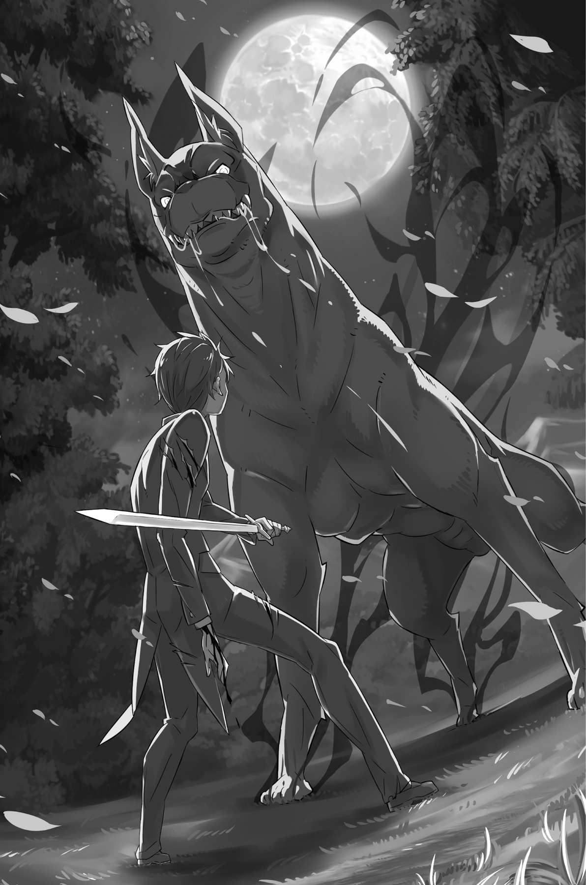

## 1

Очнувшись, Рем поняла, что её ноги не касаются земли.

Талию охватывала мускулистая рука — кто-то нёс её на весу. Носильщик был бесцеремонен и груб, похоже, он забыл, что имеет дело с девушкой. Хотя нет. Тот, кому принадлежала эта рука, изо всех сил мчался по лесу и не мог отвлекаться на пустяки.

— Барусу, впереди упавшее дерево! Направо! Ты слишком медленно бежишь!

— Хватит… чушь нести! Ффу-у-у… я и так изо всех сил… мчусь.

Над ухом Рем орали два голоса: один — давно знакомый и родной, а другой — ставший привычным на днях.

Жестокая тряска заставила Рем прийти в себя.

— Субару, что происходит?..

— О, ты очнулась, Рем? — юноша поприветствовал её, на ходу глянув вниз.

Сознание Рем оставалось спутанным, но при одном взгляде на Субару её сердце сжалось. Лицо юноши пересекал красный ручеёк — наверное, он поранил лоб. На теле там и сям виднелись белые шрамы, изрытые новыми ранами, из которых сочилась кровь.

— Я так рад, Рем! Ну и хлопот же с тобой!..

Рядом с Субару, потряхивая розовыми волосами, бежала и улыбалась младшей сестре Рам. Чуть-чуть изогнув губы в улыбке, заметной лишь тем, кто хорошо её знал, Рам вытянула руку и слегка потрепала голубые волосы сестры. И тут…

— Фулла!

Прозвучало заклинание, и воздушный клинок устремился вдаль, ломтями нарезая бегущих зверодемонов и превращая их трупы в удобрение.

Выпустив «лезвие ветра», Рам сбилась с шага, словно у неё закружилась голова, и слегка налетела на Субару.

— Бо-ольно! Рам, ты же знаешь, что у меня правое плечо вывихнуто!

— Умолкни! Если бы не я, его бы вообще откусили. А мне сейчас нужна опора.

— Ну, хотя бы на другое плечо! Ой-ой-ой!!! — запричитал Субару, чуть не плача от боли.

Рам действительно всем весом оперлась на Субару; из раны, что возникла на месте утраченного рога, текла кровь.

Глядя на них, Рем внезапно осознала ситуацию.

Она поняла, отчего здесь в беспомощном состоянии. И тогда…

— По…чему?

— Что?

— Почему вы не бросили… меня? — вырвалось у неё.

Субару взглянул на Рем с подозрением, но та продолжила дрожащими губами:

— Сестрица, Субару, зачем вы пришли? Так… всё теряет смысл. Я… я должна сама… Не хочу, чтобы пострадал кто-то ещё…

— В любом случае поздно уже. Мы с Рам и так все изодраны в клочья. Может, даже похуже тебя! — огрызнулся Субару, не слишком-то преувеличив факты.

Рем хотела бы знать, что думает старшая сестра, но та не поддержала разговор. Почувствовав себя брошенной, Рем изо всех сил пыталась подобрать правильные слова.

— Это я, я одна во всём виновата! Это я вчера колебалась… и потому сама должна отвечать… Иначе как я буду смотреть вам в глаза?..

— Слушай, мне и так тяжело! Скажи толком, в чём дело! Буду очень признателен.

— Субару, это не тебя должны были покусать…

Хоть юноша, кажется, не был настроен слушать, эта фраза явно достигла его ушей. Признавшись в своей вине, Рем увидела, как его лицо застыло.

Вчера, во время сражения в лесу, Субару закрыл своим телом слишком увлёкшуюся Рем. Клыки зверей вонзались в плоть юноши, разрывая и уродуя её, но Рем бездействовала и лишь остолбенело наблюдала за происходящим.

Тело Субару плотным облаком окутывал запах. Тот самый запах, что врезался в её память в далёкий день, когда вся прежняя жизнь сгорела дотла. Ощутив его, Рем утратила способность двигаться.

— Из-за того, что я заколебалась и не сразу протянула руку помощи, ты чуть не умер! И на твоё тело наложилось множество проклятий. Поэтому…

— Чтобы расплатиться за грех, ты ушла в одиночку? — понимающе кивнул Субару, несмотря на то что задыхался от бега. Рем потупилась, раздавленная своей виной. Она была готова к любым укорам, к презрению. Да, она должна была услышать эти слова из уст Субару ещё до того, как войти в лес. Похоже, она отложила признание, чтобы как можно скорее прийти на помощь Субару, или просто не была готова встретиться с собственной слабостью.

«Наверняка именно второе!» — презирая своё малодушие, думала Рем.

Она была готова охотно принять любые, сколь угодно жестокие слова. Ведь это справедливая кара за её преступление.

— Рем.

— Да?

Услышав своё имя, она подняла голову, и лицо Субару оказалось прямо перед глазами.

— А в лоб?..

Бам!

Раздался стук кости о кость, и у Рем посыпались искры из глаз. Сознание на мгновение помутилось от внезапной боли, и девушка, ничего не понимая, прижала руку ко лбу. Сейчас она была не в демонической форме, и её тело почти ничем не отличалось от человеческого.

На лбу вскочила шишка. Не понимая, что происходит, рем лишь хлопала глазами, а Субару рявкнул, сердито глядя на неё сверху вниз:

— Ты что, дурочка?! Не так! Ну ты и глупая!!!

— Барусу. Ты снова разбил свой дурацкий лоб.

— Я тоже дурак, сам знаю! Но твоя сестричка ещё глупее, — ответил Субару вмешавшейся в разговор Рам и замотал головой, стряхивая кровь. Увидев это, Рем поняла, что Субару стукнул её лбом. Непонятно только зачем.

— Знаешь, у меня на родине про женщин говорят: «Где баба — там рынок, где две — там базар». Ну, это здесь ни при чём, но ещё есть выражение: «Одна голова хорошо, а две лучше».

Затем Субару на мгновение задумался и пробормотал:

— Рынок, базар… ладно, не суть. В общем, чем кумекать одному, лучше постараться втроём, тогда и веник можно запросто переломить. Что-то типа того…

— Но… при чём тут веник?..

— Не-важ-но! Нечего думать в одиночку, нужно верить тем, кто вокруг тебя! Ты же умеешь разговаривать, верно? И за сердце тебя никто, как меня, не… — В этот момент лицо Субару исказилось от боли. Он согнулся пополам и, с трудом успокаивая дыхание, сказал:

— Что-то… я хватил через край. Жёстко получилось…

— О чём ты… Стой, Субару! Запах Ведьмы стал сильнее!

Рем зажала нос, и её передёрнуло от омерзительной вони. Ненавистный запах расплывался в воздухе совсем рядом с ней. Откуда он взялся? Почему так внезапно?..

— Ладно, замнём. У нас и так полно проблем…

Рассеянное замечание Субару не удовлетворило Рем, но по тому, как он напряжённо осматривался на бегу, девушка поняла, что сейчас действительно не до того.

Рам неслась рядом, она быстро прочитала магическое заклинание, приложив руку к раскалывающейся голове сестры.

— Рам, а где деревня… хотя можно и просто к барьеру. В какую сторону нам бежать?

— Если прорвёмся через ту стаю, что впереди, нужно будет изо всех сил рвануть влево. А ты что собираешься сделать?

В ответ на вопрос Рам Субару скорчил злую рожу и промычал:

— Как насчёт того, чтобы я бросил на тебя Рем, бессердечно вас покинул и в одиночку сбежал к барьеру?

— Ты отвлечёшь вольгармов, став приманкой, а я в это время удеру вместе с Рем? Хорошо.

— Как тебе не стыдно выдавать мои хитрости?!

Субару и Рам переговаривались, не снижая скорости бега. Слушая их разговор, Рем ощутила такую безнадёжность что у неё перед глазами всё словно потемнело.

— Нам же не спастись! Не… не надо, пожалуйста. Лучше я…

— Ты — просто багаж. Молчи и дай спокойно тебя нести. Всё будет нормально, я прошмыгну через границу к вам, и тогда мы сможем разом накрыть всех зверюг! Ты просто не в курсе нашего великолепного плана. А потом — финал лёгкая победа.

Что это за «великолепный план», или как там его обозвал Субару, было неизвестно. Рем сомневалась в его существовании и даже склонялась к мысли, что Субару выдумал всё ради того, чтобы её отвлечь. По-другому и быть не могло: сама мысль о том, что Субару в одиночку прорвётся через стаю зверодемонов, казалась безумной.

— Это же необязательно! Я могу сама разбросать их всех! — Рем напряглась, пытаясь подвигать конечностями. Но ни руки, ни ноги её не послушались и безвольно свисали. Ей удалось лишь пошевелить кончиками пальцев и слегка изогнуть губы. Более того, она почувствовала, что не хватает чего-то привычного…

— А где моё оружие?

— Кто ж такую тяжесть попрёт? Как вернёмся, куплю тебе новенькое.

Осознав, что не владеет собственным телом, да ещё и осталась с голыми руками, Рем с болью ощутила полную беспомощность. Ей оставалось только безнадёжно вздохнуть, полагаясь на защиту других. Субару бережно передал её Рам.

— Только не урони!

— Думаю, у меня побольше силы, чем у однорукого Барусу!

— Тогда почему именно я тащил Рем?!

— Потому что Барусу сам сказал, что понесёт, и меня не просил.

— Ты что, шутишь, что ли?!

Субару шлёпнул себя по лбу, словно сокрушаясь об утерянной возможности.

Покоясь на руках сестры, Рем смотрела на Субару и качала головой — настолько невероятным было происходящее. Она ведь наговорила ему столько жестоких слов, а он всё равно…

— Субару, почему ты так…

— И правда…

Юноша на миг задумался, а потом многозначительно поднял палец и засмеялся:

— Потому что именно с тобой у меня было первое в жизни свидание. Я не настолько чёрствый, чтобы бросить тебя, — сказав это, он легонько коснулся волос Рем. — Ну ладно, пора бежать по делам. Сестрица, ты уж присмотри за Рем.

— Буду молиться, чтобы мы снова встретились!

Обменявшись короткими прощальными словами, Субару и Рам разбежались в разные стороны.

Рам — направо, Субару — налево.

Мчавшаяся навстречу стая вольгармов на миг заколебалась, увидев, что добыча разделилась, но тут же продолжила преследование, нацелившись на Субару.

— Сестрица!

— Барусу подарил нам время, рискуя жизнью. Надо использовать его по полной.

Лицо Рам было покрыто потом; кратким ответом старшая сестра намекнула, что на разговоры времени нет. Раны и усталость давали о себе знать, и даже Рам бежала сейчас не так уж и быстро. А уж сравнивать её с демонической формой Рем и вовсе не приходилось.

Подумав об этом, Рем чуть не заплакала от собственной беспомощности. Если бы только она сумела перейти в демоническую форму, у неё хватило бы сил выбраться из этой ситуации. Она бы смогла без особого труда и Субару защитить, и нести на себе сестру… Однако теперь, в критический момент, внутренний «демон» даже не пытался выглянуть наружу. И сейчас её слабость — слабость недодемона — могла стать роковой.

В отличие от Рем, полной раскаяния, Рам без особых раздумий использовала Субару, который вызвался на роль приманки. Несомненно, её система приоритетов отличалась жёсткостью. Жизнь младшей сестры для Рам была важнее, чем жизнь Субару и, наверное, даже её собственная. Зная, что план юноши даёт шансы на спасение, она приняла его, не колеблясь.

Конечно, Рем считала решение любимой старшей сестры правильным, но всё же не могла отогнать от себя лишние мысли. Почему сестра настолько сильна, что способна отказаться от всех сантиментов ради главной цели? Что помотает ей с лёгкостью принимать такие жестокие решения? Рем с детства испытывала полное доверие к сестре и теперь не могла не спросить:

— Сестрица… Но ведь Субару… Субару…

— Не оборачивайся, Рем! Иначе вся его решимость пропадёт даром!

Это были слова сестры, которую она боготворила. Слова сестры, которая всегда оказывалась права. Если им следовать, то Рем тоже никогда не ошибётся…

Но отчего-то теперь эта правота казалась абсолютно пустой…

— Сестричка!!!

В ответ на крик Рем, вырвавшийся из глубины души, лицо Рам дрогнуло. Прикусив губу и распахнув глаза, она остановилась, Рем кубарем упала на землю и, перекатившись увидела позади спину удалявшегося Субару.

Он бежал, прилагая все силы, но слишком медленно, чтобы спастись.

Чёрные волосы развевались на ветру, по всему телу виднелись раны. Правая рука бессильно висела, и даже по спине можно было догадаться, что Субару изо всех сил сдерживает обуревающие его чувства.

Перед юношей, преграждая путь, стоял огромный зверь, чёрный как смоль. Его внушительные размеры говорили о том, что это вожак стаи. Субару отчаянно бежал прямо на чудовище, а в это время твари поменьше уже брали юношу в кольцо.

Рем протянула руку вслед удаляющейся фигуре, её душа дрожала и плакала, однако дотянуться, остановить Субару было уже невозможно.

Но несмотря на это Рем отчаянно закричала:

— Субару!

Неизвестно, услышал ли он её голос, но, как будто в ответ, Субару на бегу выхватил левой рукой слабо поблёскивающий меч.

## 2

Юноша не узнавал сам себя.

С каких это пор он начал творить подобные безумства и стал таким упрямым?

Как бы он ни хотел сохранить лицо и сделать так, чтобы сёстры не чувствовали себя ему обязанными, стоически терпеть боль, от которой на глаза наворачивались слезы, было абсолютно, ни в малейшей степени не в его духе.

Когда он повернулся сёстрам спиной, выражение его лица немедленно изменилось.

Юношу терзала сильнейшая боль всех возможных типов — и острая, и тупая. Напускная мужественность мигом слетела, Субару жалко скривил лицо и, словно собака высунул наружу язык.

— Больно! Ох и больно же! Больно, мамочка, папочка, Эмилия-тан… — призывая трёх людей, на которых больше всего в жизни рассчитывал, он бросил взгляд на повисшую плетью правую руку.

Плечо почти полностью онемело из-за травмы, полученной при неудачном приземлении после удара по рогу Рем. Хотелось верить, что дело ограничилось вывихом, но, так или иначе, сражаться правой рукой не было никакой возможности. Субару придётся с ещё более ограниченными возможностями предстать перед врагом.

На пути бегущего юноши стоял щенок-зверодемон, с которым они встречались уже столько раз, что и считать надоело. Он постоянно, из круга в круг, возникал перед юношей и уже не раз становился причиной его гибели. Настоящее проклятие! Похоже, демон имел на Субару зуб.

— Пора уже с тобой разобраться наконец, — пробормотал юноша, на бегу готовясь к потоку земли и песка, который наверняка напустит на него пёсик. Если Субару и сейчас окажется не готов к атаке, одним вывихом точно не обойдётся.

Отбросив в сторону мрачную картину гибели под градом камней, Субару уже представил, как будет уворачиваться от летящей земли, и почти нетерпеливо зыркнул на пса, как вдруг…

— Чо?! — невольно вырвалось у него дурацкое восклицание.

Впрочем, ничего удивительного в этом не было, поскольку зрелище развернулось поистине невероятное.

Пёсик негромко зарычал, и его крохотное тельце сжалось ещё сильнее, словно он напряг все свои силы. Субару прищурился, гадая, что произойдёт, и в следующий миг…

Комочек шерсти, словно взорвавшись, мгновенно увеличился в размерах. Щенок размером с комнатную собачку, которого так и хотелось взять на руки и приласкать, в мгновение ока вырос в огромного пса, намного больше самых крупных зверодемонов. У Субару отвалилась челюсть.

— В манге, конечно, часто такое рисуют… но где же ты взял дополнительную массу?!

В ответ на этот вопрос прозвучал рык, от которого содрогнулся весь лес. Пёс пружинисто оттолкнулся от земли и встал на задние лапы. Подняв передние в воздух, он ударил длинными когтями друг о друга, продемонстрировав страшное оружие, которое, казалось, даже при нечаянном прикосновении способно было содрать плоть до костей.

— А чего ж ты не нанёс решающий удар колдовством? Наверное, я наступил на твою любимую мозоль?

Субару понял, что главный пёс вызывает его на «рукопашный» бой. Юноша огляделся в надежде отыскать дорогу к спасению, но и сзади, и с боков его окружили примчавшиеся следом зверодемоны — бежать было некуда.

— Выходит, вы предпочли меня красавицам-сестричкам? Фу, какой дурной вкус! Не иначе фетишисты-демонисты… Чёрт бы вас побрал!

Поняв, что происходит вокруг, Субару почувствовал слабость в ногах. На прогалине явно собрались все псы, обитающие в лесу. Отвлекающий манёвр сработал идеально!

Ему не оставили времени на то, чтобы молить о пощаде, обмочившись и дрожа от страха. Все пути были перекрыты, не считая дороги вперёд. Юноше предстояло сразиться с гигантским псом один на один.

Придя к этому выводу, Субару решил пойти с козырей.

Он сунул руку в карман й стал шарить там. Нащупал камешек, потом раскрошившиеся конфеты, потом что-то неприятно липкое.

— Придётся поверить Паку…

Он засунул в рот то, что вынул из кармана, и всей душой взмолился, чтобы слова серого котика оказались правдой. Субару разгрыз находку и посмотрел вперёд. До начала заключительной схватки оставалось лишь несколько секунд, и тут он услышал:

— Субару!

Голос, донёсшийся сзади, звучал болезненно и трагично, словно наступил конец света, и Субару вдруг понял, что сердце той, кто окликнул его, разрывается на части при одной мысли о гибели юноши. Наверное, это было эгоистично с его стороны, но Субару невольно ощутил радость.

«Ох и жалкий же я тип! Изменщик и похотливая свинья к тому же!»

Конечно, он и понятия не имел, что чувствует девушка, выкрикнувшая его имя, но всё равно не смог сдержать улыбки, — наверное, действительно спятил!

Субару смеялся и смеялся, а когда смех иссяк, выхватил ещё действующей левой рукой обломок меча.

Возвышающийся над ним зверодемон издал громоподобный рык. Стиснув рукоять меча, Субару тоже завопил. Воинственные кличи раскатились эхом — так противники состязались в крепости боевого духа.

За мгновение до того, как налететь на врага, Субару глубоко вдохнул. Он представил самую сердцевину своего тела и находящиеся между нижними рёбрами и талией «врата», что соединяли внешнее и внутреннее. Юноша направил в них своё сознание и прокричал:

— ШАМА-А-АК!!!

Заклинание сотрясло воздух, и вокруг Субару мгновенно, словно в результате взрыва, возникло чёрное облако. Оно поглотило Субару и всех зверей, покрыв тьмой затерявшуюся в лесу сцену решающей битвы.

## 3

В чёрной дымке простирался мир, недоступный для органов чувств.

Форма этого мира, его цвет, запах — всё таяло и ускользало. Единственный уверенный сигнал передавали подошвы туфель, соприкасающиеся с землёй. Если бы не этот сигнал, Субару, наверное, даже не понимал бы, где верх, а где низ.

Он ничего не видел. Ничего не слышал. Ничего не понимал.

Настоящий конец света.

Субару ощущал мир только стопами ног, а его сознание непрестанно что-то искало в чёрном тумане. Юношу уносила мгла, но он знал: нужно что-то сделать.

«Что-то сделать… Что-то сделать… Но что же?»

Погрузившись в непостижимое пространство, он изо всех сил старался вспомнить мир, который существовал раньше.

Почему пропали все ощущения? Кто вызвал мглу? Как вырваться отсюда?..

Вспоминай, вспоминай, вспоминай! Вспомни настоящий мир, отголоски которого нащупываются подошвами, вспомни мир, находящийся вне чёрной пустоты!

Отчаянно заставляя мозг работать, он буквально видел, как мысли рассыпаются искрами и гаснут.

Ноги Субару ослабли, он не мог сделать и шага. Рано или поздно непостижимость раздавит его, даже ощущение твёрдой земли под ногами стало казаться иллюзией. Искать ответ вне тела было бессмысленно.

Но если ответа нет снаружи, значит, он внутри! Даже если внешний мир безмолвствует, можно обратиться к самому себе, к естеству, что живёт бессознательно.

«Пусть всё, что может двигаться, придёт в движение!»

И вот внезапно…

Субару почувствовал, будто всё его тело воспламенилось.

Нестерпимый жар бушевал внутри, заставляя горло юноши издавать бессловесный звериный крик. Нет, он только подумал, что это произошло, ощущения всё ещё не вернулись.

Бесчувствие.

Однако, несмотря на отсутствие ощущений, обессилевшие ноги снова двинулись.

Он пошёл вперёд. Ноги шагали в том направлении, которое избрала интуиция.

Осознанность, туман, осознанность, туман, осознанность, туман… Всё повторялось, и повторялось, и повторялось, а затем…

## 4

В тот миг, когда Субару, разорвав чёрную пелену, вырвался на свободу, он почувствовал, что меч, который он сжимал в руке, отяжелел. Оружие вырвалось из ладони. Подняв голову, Субару не смог сдержать возгласа изумления: прямо перед ним возвышался массивный пёс, голова которого оставалась в туманной пелене, а в грудь зверодемона глубоко вонзился меч — тот самый, рукоять которого Субару только что сжимал в ладони!

Эта внезапная атака оставила в руке незнакомое гадкое ощущение. Сопротивление, с которым острый клинок погружался в плоть живого существа, сотрясло Субару внезапным психологическим шоком. Он почувствовал себя палачом, только что порешившим дышащее, тёплое, живое создание.

Зверь же, всё ещё находящийся в бесчувственном мире, не ощущал нанесённой раны.

Не зная, сколько ещё продлится гротеск, в котором убитый не замечал, что он убит, Субару медленно повернулся и побежал. Голова была тяжёлой, тело вялым — последствия неумелого управления магической энергией и чрезмерной траты маны. На самом-то деле, применив такое заклинание, он должен был полностью лишиться маны и упасть без сил, однако Субару удалось избежать этого благодаря припрятанному козырю.

— Надо будет поблагодарить мелкоту, — сплёвывая оставшуюся во рту кожуру, пробормотал он и ухмыльнулся.

Ягода нашлась среди всякой ерунды, которую дети напихали ему в карманы, когда он отправлялся на помощь Рем, — неизвестно уж, где они её добыли.

Это был плод бокко, тот самый допинг, который позволял вернуть ману в истощённый организм.

С того самого момента, как Субару обнаружил её в кармане, этот план неясно маячил у него в голове. Если, используя магию, раскусить ягоду, можно будет хотя бы сдвинуться с места. Субару пошёл на смертельный риск, но чаша весов чудесным образом склонилась в его сторону.

Повернувшись спиной к застрявшим в бесчувственном мире тварям, юноша направился туда, где, по его предположению, находился охранный барьер. Он не знал, сколько продержится Шамак, созданный неопытным учеником, не имеющим достаточно маны. Но Субару не мог придумать ничего другого, что позволило бы выиграть время и хоть как-то приблизиться к барьеру…

— Что?!

Кто-то вмешался в планы Субару — сзади обрушился удар, и когти скользнули по левому бедру юноши. Хлынула кровь, Субару завопил от боли и рухнул на колени. Но заклятый враг и не думал останавливаться. Огромная лапа небрежно подхватила Субару за шею, вонзив кончики когтей в кожу, и с лёгкостью подняла его в воздух.

— Вот чёрт!

Прямо перед глазами юноши возникла пасть гигантского зверя, раскрытая так широко, словно он собирался проглотить человека целиком. К лицу приблизились окровавленные клыки, в нос ударил запах крови. Упорство врага заставило Субару криво усмехнуться:

— Да чтоб ты сдох!

Рывком вытащив из тела зверя свой меч, Субару с размаху вонзил клинок в раскрытую пасть. От смертельного удара, нанесённого прямо в голову, зверь взвыл и выпустил юношу. Ударившись об землю, Субару поднялся на ноги, шатаясь, выставил вперёд меч, который ему удалось удержать в руках, и взглянул снизу на зверя.

— Ну, чего ты остановился?! Давай, паршивец!

Зверь в ярости ощерился на Субару. Залитый кровью, юноша стоял прямо перед зверодемоном и выкрикивал ругательства, провоцируя пса. Оба так рассвирепели, что не видели ничего вокруг, — схватка шла не на жизнь, а на смерть!

Обоими владела лишь одна мысль: уничтожить врага! На мгновение замерев, человек и зверь — нет, скорее, два зверя — стояли друг напротив друга, ожидая малейшего повода для атаки.

Но это противостояние…

— Уль Гоа!

…было внезапно прервано потоком обрушившихся с неба огненных снарядов.

— А-а-а-а-а!!!

Субару закрыл лицо руками, и его отбросило назад.

Земля неожиданно вздыбилась, и взрывная волна окатила его сильнейшим жаром. Уже израненный, а теперь и обожжённый, Субару упал на бок и замотал головой.

— Да что же тут творится?!

Раскалённый воздух опалил его горло, но, приподняв голову, юноша замер от удивления: прямо перед ним гигантский пёс пылал, объятый пламенем!

Огненные языки облизывали огромное тело; пёс судорожно раздирал лапами землю, явно испытывая нестерпимую боль. Пылающий воздух сжёг его лёгкие, и зверь безмолвно плясал в красных всполохах, пока наконец не повалился на землю с предсмертным утробным рычанием. На земле остался лишь дочерна обгоревший комок плоти — раза в два меньше по объёму, чем было тело зверодемона.

Но Субару поразила не только неожиданная кончина вожака стаи. Огненные снаряды, испепелившие пса, потоком падали с неба, бомбардируя чёрное облако. Снаружи трудно было оценить силу, с которой эти снаряды рвались во тьме, но результат можно было себе представить.

Зверодемоны исчезли внутри непроницаемого мрака, даже не осознав, что погибли. Милосердие это или нет, Субару уже не понимал. Но услышал:

— Вот это да-а-а!.. Хорошо придумал! Обычно Шамак применяют лишь для отвода глаз, но использовать его для наведения на цель…

Человек, который устроил огненный финал, улыбаясь, спустился с неба. Его длинные волосы цвета индиго развевались на ветру, странные глаза — синий и жёлтый — блестели. Шутовской костюм облекал субтильную фигуру сильнейшего мага королевства — это был не кто иной, как Розвааль!

Приземлившись, граф отряхнул туфли, откинул длинные волосы за спину и взглянул на Субару сверху вниз.

— Да-а-а уж, не о-о-очень-то ты хорошо-о-о выглядишь.

— Поздновато пожаловали, Розчи. Я уже столько раз попрощался с жизнью!

Пальцев на одной руке точно бы не хватило, чтобы сосчитать! Выругавшись, Субару осел на землю, совершенно обессилевший. Ноги не держали, он не мог подняться даже на колени.

— И всё-таки, как вы меня нашли?

— Госпожа Эмилия ещё деревне насто-о-ойчиво мне напоминала: «Как бы это ни было глупо и безрассудно, когда его загонят в угол, он воспользуется магией, и вы обязательно заметите это с высоты».

— Вот ведь, малышка Беа! Ты проболталась Эмилии…

Беатрис, похоже, не хватило сил выполнить задание. Впрочем, если учесть своевременное вмешательство Розвааля, было грех жаловаться.

— Господин Розвааль! — До ушей Субару, который пытался разобраться, как всё обернулось, долетел девичий голос. Обогнув пылающее изнутри чёрное облако, из зарослей показалась Рам. Она подставляла Плечо Рем, и при виде Розвааля её лицо просветлело.

— Простите, что доставили вам столько хлопот.

— Ну что-о-о вы, не стоит. Наоборот, вы молодцы, та-а-ак замечательно справились в моё отсутствие.

Зардевшись от удовольствия, Рам приложила руку к груди и торжественно поклонилась. Глядя на их беседу, Субару облегчённо вздохнул.

— Субару!

— Чего?!

Рем внезапно бросилась вперёд и стиснула его в объятиях — настолько крепких, что из горла Субару вырвался крик. Голубые волосы упали ему на лицо. В любой другой момент он был бы вне себя от радости, но сейчас…

— Рем, я же весь изранен! Ой, кажется, моя голова…

Похоже, девушка была не в силах контролировать свои чувства и обнимала его со всей силы, не сдерживаясь.

Раны на теле вопили в унисон, и Субару изо всех сил стучал Рем по спине, пытаясь привлечь её внимание, но она, счастливая до беспамятства, ничего не замечала:

— Живой!.. Ты живой! Субару, Субару… Субару!

Рем прижалась лицом к его груди, и юноша почувствовал, как с её щёк капают горячие слёзы. Эта щекотка и прочие ощущения разом навалились на его бедный мозг, и Субару уже с трудом воспринимал происходящее. В общем…

— Опять то же самое?! — выдавив это, Субару почувствовал, что его голова бессильно поникла.

Сознание куда-то улетучивалось. Голоса пропали. Последнее, что дошло до его барабанных перепонок, — чей-то серьёзный голос, из которого исчезло всё шутовство:

— Теперь можешь отдохнуть. Когда проснёшься, мы как следует отблагодарим тебя за всё, что ты совершил. И можешь не беспокоиться, я устранил то, что тебе угрожало.

Успев почувствовать облегчение, Субару перестал сопротивляться.

И до последнего момента, проваливаясь в забытьё, он чувствовал тепло объятий. Отдавшись этому ощущению, он позволил своему сознанию утонуть в потоке безмыслия.
