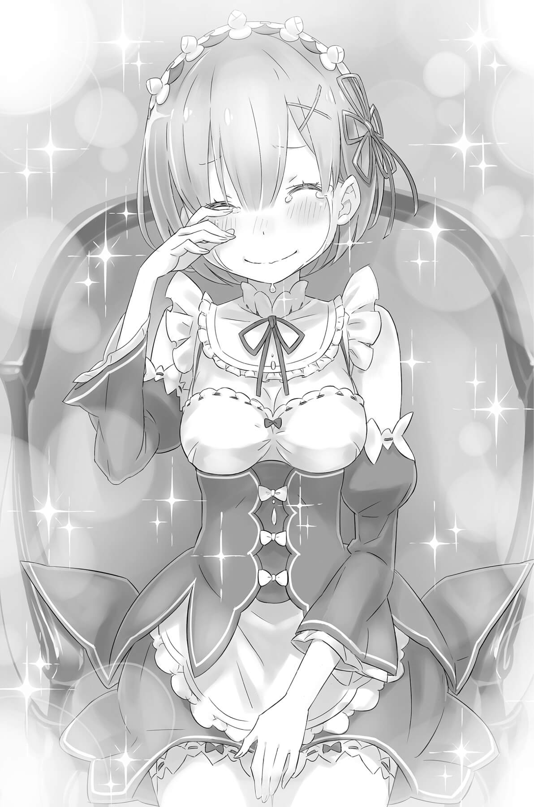
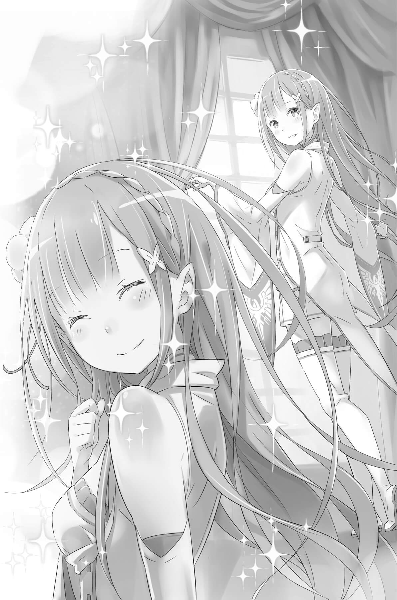

## 1

Сознание юноши снова затянуло мглой.

Здесь не было ничего. Одно лишь «я» парило в пространстве, когда Субару рассеянно осознал самого себя.

Никого. Ничего. Ни начала, ни конца. Мир, в котором не существует даже бытия…

Субару парил в пространстве, словно бросившись в ночное море и доверив своё сознание ненадёжным чувственным ощущениям.

Внезапно в этом мире тьмы что-то изменилось.

Прямо перед глазами юноши, существовавшего только в форме сознания, возник некто. Не успел он опомниться, как вытянутая по вертикали тень приняла человеческую форму.

Лицо было неразличимо. Да и силуэт выглядел зыбким и неясным, но Субару отстранённо подумал, что фигура напоминает девушку.

Тень заколыхалась и медленно протянула к нему руку. Её пальцы нежно коснулись сознания Субару, и юноше вдруг страшно захотелось заплакать. Его охватила волна непостижимого волнения, будто он всю жизнь ждал именно этого.

Субару до боли захотелось упасть в объятия этой зыбкой тени, быть проглоченным ею… но он остановился. Точнее, его остановили.

Сознание, пытавшееся слиться с тенью, обняли протянувшиеся сзади белые пальцы.

Ощущение было мягким и не просто тёплым, а даже горячим.

Как только он подумал про этот жар, тень, которая находилась перед ним, начала истончаться.

Он рванулся вперёд, взволнованный, крича о своей страсти. Однако в мире, где властвовало ничто, крик не стал звуком. Тень оставила его, постепенно удаляясь и тая. Она исчезла совсем.

Лишь в самом конце тень мягко протянула руку к чуть не плачущему Субару:

— …блю…

Даже эти слова, которые он не расслышал, беззвучно растворились, и мир исчез.

## 2

Первым, что увидел Субару, очнувшись, был непривычно роскошный потолок. Его собственная комната, где он жил, ложился спать и вставал, была предельно скромна, а убранство гостевых покоев смотрелось весьма вычурно. Наверное, показная роскошь была призвана продемонстрировать аристократический статус хозяина усадьбы, но Субару, который родился и вырос в самой обычной семье, находиться здесь было явно неудобно.

Юноша несколько раз моргнул, удивившись, что на грани сна и яви его посетили такие сложные мысли, и услышал:

— Ты проснулся?

Голос прозвучал совсем близко — кто-то сидел у его кровати.

Субару повернул голову на мягчайшей подушке и прищурился, разглядывая посетительницу.

— Проснуться и увидеть рядом настоящую горничную — это ли не мечта каждого мужчины, в некотором роде?

— Если бы этим я могла искупить свою вину…

— Так, не надо мне тут всяких мрачных рассуждений! Лучше скажи вот что… — со значением произнёс Субару после того, как уселся в постели перед потупившейся Рем и вытащил из-под одеяла правую руку. Пальцы этой руки оказались плотно переплетены с пальцами Рем.

— Это… сделал я? Наверное, схватил и не отпускал… Если так, то мне очень стыдно. Знаешь, в детстве я ни за что не хотел расставаться с любимым полотенчиком и не выпускал его из рук.

— Нет, понимаешь, это… — искоса поглядывая на переплетённые пальцы, Рем слегка покраснела. — Это сделала я!

— С чего бы? Я, между прочим, жутко потею во сне, и ладонь тоже, наверное, вся мокрая?

— Субару, ты…

— Чего? — Он умиротворённо разглядывал Рем, которая умолкла, глядя на сцепленные пальцы. Юноша не собирался её подгонять, и Рем несколько раз вздохнула и подняла глаза на Субару:

— Кажется, когда ты спал, тебе было очень плохо… Поэтому я…

— Ты взяла меня за руку?

— Да. Я такая беспомощная, полная недостатков… поэтому не знала, что нужно делать… и сделала то, чему обрадовалась бы сама.

Видимо, с этим эпизодом были связаны какие-то личные воспоминания — Рем постоянно запиналась. Но Субару, глядя на свою руку, сжатую в её ладони, улыбнулся тому, как безыскусно она открыла свои чувства. Эта рука спасла Субару, мучимого кошмарами, успокоила его, словно ребёнка.

Интересно, Рем тоже кто-то вот так держал за руку ночью, когда ей хотелось плакать? Юноша был ужасно рад, что она так поступила, — даже в груди защекотало.

Отнимать руку не было причин, и пальцы остались переплетёнными. Всё так же ощущая тепло, Субару наклонил голову.

— Расскажешь мне для начала, чем там дело кончилось, прежде чем я открою эпилог?

— Конечно, Субару, до какого момента ты помнишь?

— Примерно до того, как Розчи величественно сошёл с небес в огненном дожде, а взволнованная Рем чуть не задушила меня в объятьях.

— Значит, расскажу, что было потом.

Запинаясь, Рем изложила официальную версию случившегося.

После того как Субару потерял сознание, Розвааль зачистил лес от зверодемонов. Запах Ведьмы распространялся даже тогда, когда юноша оставался без сознания, и продолжал привлекать псов, и те твари, что скрывались в лесу, были сожжены, подобно своим собратьям.

— Так, а что насчёт моих и твоих проклятий?

— Те, кто накладывал заклятия, — в нашем случае это были звери, которые нас покусали, — погибли, поэтому можно не беспокоиться. И господин Розвааль, и госпожа Беатрис, и господин Великий Дух — все это уже подтвердили.

— Раз трое специалистов гарантируют, стало быть, всё проверено до последней мелочи. Ладно, не стану сомневаться.

Вспомнив, сколько ран от зубов осталось на его теле, Субару облегчённо положил руку на сердце.

Судя по всему, бомба замедленного действия, установленная в его теле, была успешно обезврежена. Но когда юноша вспомнил, сколько раз оказывался из-за проклятий на грани смерти и какие мучения перенёс, его лицо исказилось.

— Господин Розвааль лично унял переполох в деревне, и практически всё вернулось в норму.

— Правда-правда? Значит, и ребятишки в порядке? Небось изволновались все? Любимый братишка Субару лежит, весь погрызенный и избитый в хлам… Хе-хе-хе.

— Да, конечно, — серьёзно пробормотала Рем, не заметив иронии, и не спеша откинула одеяло. Подозрения Субару, который наблюдал за её действиями, сменились удивлением.

Субару лежал под одеялом в той же пижаме, несколько напоминавшей монашеское одеяние, которую на него надели в первый день пребывания в поместье. Однако ноги выглядели как-то странно. Он пригляделся:

— Они же все исписаны! Это что, гипс, как при переломе?

— Господин Розвааль любезно пригласил в поместье ребятишек, и они оставили это для тебя.

— Вот паршивцы! — Субару прищёлкнул языком и принялся разглядывать многочисленные надписи. Ему приходилось читать их вверх ногами, да и написано было так коряво, что разобрать удавалось с трудом. Однако это были буквы знакомого ряда «и», и Субару через какое-то время с ними разобрался.

*Спасибо, что привёл назад Рем.*

*Спаси-и-ибо!!!*

*Ты странный, но классный!*

*Будем делать радиозарядку, ты обещал!*

*Обожаю!*

— Вот паршивцы. И дурачки. Говорю же: терпеть не могу детей, — пробурчал Субару и отвернулся к окну, откинувшись на подушку. Глядя в сторону деревни, он представил себе тамошних ребят. Скорей бы туда отправиться, нужно ведь как следует отчитать шалунов!

Рем с нежностью наблюдала за Субару, чьё выражение лица так противоречило словам; но вдруг, вспомнив что-то, девушка помрачнела, и губы её задрожали.

— Оставим это. Я должна рассказать о твоём здоровье, Субару.

— Что? А, ну да. Даже если забыть о проклятье, я определённо перетрудился. — Только при этих словах Субару заметил, что плечевой сустав правой руки, которую сжимала Рем, вправлен на место. Даже когда он напрягал мышцы, плечо не дёргало и никакой боли не ощущалось. И даже в тех местах, куда вонзались клыки псов, не было неприятных ощущений.

«Исцеляющая магия в этом мире и правда всемогуща!» — подумал Субару.

— Прости, Субару, — несмотря на его оптимизм, Рем ссутулилась и опустила голову.

Не понимая, за что Рем извиняется, он замахал на неё левой рукой:

— Ну-ну, Рем, выше нос! Я прекрасно себя чувствую. У меня всё в порядке, точно тебе говорю!

— Вовсе нет. Конечно, видимые раны излечены, и, к счастью, нет последствий, которые могли бы помешать нормальной жизни. Но… — Девушка умолкла, и на её лицо легла горестная тень. — Останутся следы. Шрамы. И на теле, и на душе. Кроме того, тебя врачевали несколько раз, и мана в теле почти истощилась.

— А, так вот почему ощущается какая-то вялость! Да ладно, это не проблема. Шрамы для мужчины — ну, кроме тех, что на спине, — как медали. Да и насчёт душевных ран не страшно: я ж крутой парень! — Ткнув себя большим пальцем в грудь, Субару улыбнулся, пытаясь избавить Рем от чувства вины.

Юноша был прав. Если бы его дух оказался сломлен, он ни за что не дожил бы до этого утра и не сидел бы вот так, держась за ручку с Рем. На самом деле, если уж вспомнить прошлые круги, Субару сумел пережить самые страшные душевные раны, иначе он бы просто не осмелился открыто смотреть в глаза Рем… Думая так, он пристально её разглядывал.

Короткие голубые волосы. Правильные черты лица — не безупречно красивые, но симпатичные. Даже лицо, которое поначалу казалось бесчувственным, теперь постоянно менялось. Субару не боялся её. Совсем.

Если прошлая Рем несколько раз заставила Субару проходить новый круг Посмертного возвращения, то нынешняя от всего сердца радовалась его воскрешению. Вот это поворот судьбы!

Одна Рем делала всё только ради старшей сестры. Но была и другая Рем, которая бросилась в бой, чтобы спасти Субару. Существовала Рем, которая сбежала в одиночку, чтобы не пострадали друзья, когда она войдёт в режим берсерка…

— Ты выглядишь спокойной, но ты совсем не бесстрастна, да?

Судя по её обычному поведению в поместье, Рем была человеком, способным на замечательно хладнокровные суждения. Однако когда события ускоряли ход, в Рем проявлялась склонность к поспешным суровым решениям. Конечно, не Субару было судить кого-то за скороспелые выводы, но в случае с Рем это доставляло много хлопот, ведь она считала, что любую проблему можно решить с помощью силы, и не стеснялась прибегать к ней. Уж он-то испытал это на себе…

Услышав слова Субару, Рем на мгновение застыла, а потом потупилась.

— Знаю, — пробормотала она и продолжила, словно по капле раскрывая душу. — Я беспомощная и бездарная. Я — выродок племени демонов. Поэтому мне ни за что не сравняться с сестрой. Я слишком медленная, чтобы догнать Рам, мне нужно бежать изо всех сил, другого способа не существует…

Закрыв лицо свободной рукой, Рем продолжала своё признание:

— Сестрица справилась бы лучше. Сестрица не допускает таких промахов. Сестрица бы точно не колебалась. Сестрица бы ни за что не ошиблась, Сестрица… сестрица бы…

Прервавшись, Рем взглянула на Субару. В её глазах не было слёз. Только пустота и абсолютно покорная безнадёжность.

— Я лишь бледная тень сестры. Нет… Намного, намного хуже — до настоящей сестрицы мне никогда не дорасти. Я никудышная!

Глаза Рем вдруг увлажнились.

— Ну почему рог остался у меня? Почему не у сестрицы? Почему сестрица родилась только с одним рогом? Почему сестрица и я — близнецы?!

Её губы дрожали, когда она задавалась вопросом, зачем вообще родилась на свет. Капли, набухшие на ресницах, скатились по щекам, оставляя на белой коже блестящие следы.

Субару молчал. Рем, словно не в силах вытерпеть это безмолвие, поспешно вытерла слёзы:

— Прости, пожалуйста. Я наболтала всякой ерунды. Забудь. Я впервые это кому-то рассказываю, как странно… — начала она скороговоркой, будто пытаясь стереть сказанное.

— Знаешь, Рем… — Субару назвал её по имени, прерывая поток слов.

Что же он скажет, нарушив молчание? Боясь услышать ответ, девушка всё же подняла лицо, и Субару произнёс:

— Вот я слушаю и понимаю… ну и дурочка же ты!

— Что?!

— Если подумать, ты совершила три глупые вещи. Знаешь какие?

Глаза Рем, не понимавшей смысла его слов, вконец потускнели. Субару рассмеялся, увидев такую реакцию, и сказал, выставив перед её лицом один палец:

— Ясно. Смотри, вот первая глупость. Ты страдаешь по поводу того, что уже миновало: мол, должна была меня спасти и всякое такое. Но я же тут, перед тобой, здоров и полон сил, не видишь, что ли? И даже ноги на месте!

Субару проиллюстрировал свои слова, подрыгав исписанными загипсованными ногами. Рем, похоже, сообразила, что речь Субару связана с её признанием, но тем не менее слабо покачала головой.

— Это если смотреть задним числом…

— Древние знаешь как говорили? Конец — делу венец. А если считать промежуточные результаты, так у меня всё ещё хуже, чем у тебя, глаза б не смотрели! Ладно, вторая глупость в том, что ты пытаешься сделать всё в одиночку, — Субару подмигнул и выставил ещё один палец. — Я, конечно, страшно рад, что ты ради меня рванула в лес, но всему своё время и место. Сама подумай: если посоветоваться с другими, наверняка найдёшь наилучший способ.

Что касается охоты на зверодемонов, в словах Субару была доля истины, с этим не поспоришь. Рем, не в силах возразить, опустила глаза, словно стыдясь своей горячности. Впрочем, поскольку они знали, чем всё закончилось, это суждение тоже было «задним числом». Но Рем, погружённая в свои переживания, не обратила на это внимание и даже не заметила, как Субару украдкой высунул язык.

— Ну, и третье. Знаешь, о чём я, Рем?

— Нет… я ничего не понимаю. Мне всегда чего-то не хватает, я всегда опаздываю…

— Точно. Оно и есть! Твоя третья глупость! — Субару ткнул Рем, не желающую избавиться от привычки к самоуничижению. — Рем, ты всё время говоришь: сестрица то, сестрица сё. Превозносишь Рам до небес только потому, что она старшая, а себя хулишь и ругаешь. Мне вот не кажется, что Рам во всём тебя превосходит. Она не сильнее тебя, готовит плохо, отлынивает от работы, ругается… И она тоже склонна к скоропалительным выводам, верно?

В глазах Субару Рам вовсе не была таким идеалом, о котором говорила Рем. Старшая сестра практически во всём уступала младшей. Вроде бы это должны были понимать и сами сестры. Но Рем покачала головой, отрицая сказанное.

— Нет, нет, не так! Настоящая сестрица, она… если бы у неё был рог, ты бы никогда такого о ней не сказал!

— Но у Рам нет рога, который «мог бы быть». И другую Рам я не знаю. — Субару прервал Рем, которая попыталась снова нырнуть в пучины самоуничижения. — Я знаю только ту Рам, что описал. Она ни готовить не умеет, ни шить, ни убирать, и совсем не такая вежливая, как ты, если вообще не сказать, что грубиянка. Ну, что касается последнего, может, оно и хорошо…

Временами высокомерность Рам давала возможность как следует подразнить её, и Субару считал, что это не так уж плохо. В общем, расстояние, на котором они держались, было для юноши вполне удобным.

— Есть рог или нет — наверное, только ты, Рем, обращаешь на это внимание. Какой смысл сравнивать чьи-то несуществующие достоинства и свои недостатки?

Рем молчала.

— У тебя есть то, чего нет у Рам. Давай-ка признаем это. Ты ласковая, ты трудяга, стараешься изо всех сил, да и грудь у тебя побольше, чем у Рам.

Бац!

— Больно! Глаза на мокром месте, а сама дерётся!

Он вспомнил короткий разговор с Рам в лесу.

Субару показалось, что она не так уж и страдала из-за утраты демонического рога. Более того, всё выглядело так, словно Рам хотела, чтобы и сестра перестала относиться к этому столь болезненно. Впрочем, Субару не считал себя экспертом в подобных вопросах. В конце концов, он был всего лишь болтливым желторотым юнцом, и его жизненный опыт не отличался ни продолжительностью, ни глубиной. Вряд ли его проповеди могли задеть чью-то душу.

Однако что-то подсказывало Субару: чтобы достичь согласия с самим собой, ты должен закатать рукава и взяться за дело, а не искать готовые решения.

Поэтому Субару выкладывал Рем свои мысли и чувства — простые и незатейливые.

— Если бы не ты, меня бы уже давным-давно сожрали псы. Я спасся благодаря тебе. Заметь, я жив — не из-за сестрицы, а благодаря тебе!

— Если бы там была сестрица, у неё получилось бы лучше…

— Может быть. Но со мной была ты.

Субару прервал её слабые возражения, накрыв левой рукой правую, которую всё ещё сжимала Рем.

Девушка торопливо подняла голову, и он смущённо поблагодарил Рем:

— Я рад, что ты была со мной. Спасибо.

В ответ Рем издала сдавленный всхлип и отвернулась, не желая, чтобы Субару видел её лицо.

— Я… я всегда была лишь копией сестрицы.

— Ой, да хватит прибедняться! Вы с Рам изначально разные, в жанровом плане, так сказать. Она старшая сестра, ты младшая — да вы даже поругаться можете иногда!

Субару подразумевал, что между ними всегда будет разница, ведь у каждой есть свои плюсы. Юноша не понял, сумел ли донести до Рем свою мысль, но она крепко зажмурила глаза.

— Я не выяснял, как она потеряла рог, поэтому не знаю, в чём там дело. А раз не знаю, не буду притворяться, что понимаю, — и Субару левой рукой постучал себя по лбу — ровно в том месте, где вырастал рог у Рем. — У Рам нет рога, зато у тебя есть! И ты поможешь ей там, где он нужен. Два демона, живущие душа в душу! Нежная сестринская любовь — это же замечательно!

— Угу.

— И ещё! Ты вот говоришь: «копия». Но ведь у Рам нет замены для тебя! Если ты вдруг исчезнешь, только представь, что будет с ней?!

Рем, потерявшая дар речи, этого не знала, а вот Субару уже видел такой сценарий. Видел Рам, которая впала в полнейшее отчаяние из-за смерти сестры и бушевала, пытаясь любой ценой отомстить за неё.

— Но… Рем всё ещё не была готова согласиться. Наверное, эти чувства владели ею так долго, что превратились в стержень, поддерживающий её существование.

— Ясно. Ладно, давай так. Пока ты сравниваешь себя с той идеальной Рам, которую придумала, мы никуда не продвинемся. Значит, нужно уничтожить этот идол!

— Это не так просто! Я всегда сравнивала себя с сестрицей…

— Тогда, если тебе нужна оценка, спрашивай меня. И она будет гораздо ближе к реальности, чем созданная тобою иллюзия. Правда, предупреждаю сразу: я не умею ловить настроение, так что буду говорить прямо. Никаких комплиментов, никакой пощады — что есть, то и услышишь. Так что держись, — Субару рассмеялся и левой рукой взлохматил её голубые волосы. Глядя, как Рем жмурится от щекотки, Субару тихонько вздохнул.

— У меня на родине есть выражение: «Хочешь рассмешить демонов — расскажи им о своих планах». Так у нас и получается…

Рем, покорно подставляя голову под его руку, ничего не ответила, лишь вопросительно поглядела, и Субару продолжал:

— Смейся, Рем! Не сиди с кислым лицом, улыбнись. Давай смеяться и обсуждать планы на будущее. Вместо того чтобы оглядываться назад, станем говорить о грядущем, о том, что ждёт нас впереди. И для начала можно обсудить завтрашний день.

— Завтрашний день?

— Да! Например, давай поболтаем о том, что у нас будет на завтрак: японская еда или европейская. Или о всякой ерунде, например как надевать носки: с правой ноги или с левой. Любые, самые глупые темы! Раз у нас есть завтра, мы можем о нём говорить. Как тебе?

Субару развёл руки в стороны, ожидая ответа Рем. Поколебавшись некоторое время, девушка нахмурилась, будто ей что-то не понравилось.

— Я… очень слабая. Поэтому мне понадобится опора.

— Ну и пожалуйста. Чего тут такого? Я и сам слабак и глупец. Глаза угрюмые, и никакого подхода к окружающим. Да, это звучит грустно, даже когда сам говорю! Но, как видишь, я до сих пор жив, пускай и благодаря другим людям. Просто, чтобы идти вперёд, нужно подставить друг другу плечо.

Отказываясь делиться тяготами, Рем взвалила на свои плечи столь огромную ношу, что просто не видела дороги. Субару по меньшей мере мог подать ей руку, помогая найти путь.

Конечно, в чьих-то глазах он сам был обузой… но если ты не в силах отыскать нужную тропинку, любая помощь, даже самая скромная, будет кстати. Вот как он считал.

— Давай с улыбкой шагать плечом к плечу и болтать о будущем. Например, о завтра. Я, может, всегда мечтал говорить о своих планах с демоном и смеяться.

— Значит, ты правда одержим демонами!

— Так а я о чём?

Прикрыв один глаз, Субару хитро ухмыльнулся, и Рем, поддавшись его напору, тоже слегка улыбнулась.

Она смеялась, хотя из её глаз вдруг закапали слёзы. Они текли и текли без остановки, скатываясь по щекам, но Рем всё равно улыбалась. Она смеялась и плакала, наконец уткнула лицо в подушку, пытаясь подавить всхлипы и смешки, но они всё равно раздавались и раздавались в комнате для гостей.

Всё это время Субару ласково гладил её по волосам, а она крепко сжимала его руку.

Рука юноши двигалась и двигалась, нежно касаясь мягких прядей.

## 3

Он снова мысленно вернулся к тем дням, что провёл в поместье Розвааля, попав в этот круг. Субару добился определённого положения в качестве слуги и установил хорошие отношения с Рем и Рам. Ему удалось спасти деревенских ребят, а зверодемоны в лесу были уничтожены и больше не представляли опасности. Его приключения, продлившиеся в общей сложности почти двадцать дней, завершились успешно.

Да, вроде бы всё закончилось хорошо…

…Если не считать недовольного выражения на лице девушки, которая, наматывая на палец серебристый локон, отчитывала Субару:

— Ты не бери в голову, я вовсе не сержусь. Нет-нет, не сержусь. Подумаешь, проснулась, а больного, за которым я присматривала, нет. И пойти искать я не могу, потому что привязана к стулу и вся обмотана верёвками! С чего бы мне сердиться, право слово?!

Ему оставалось лишь покорно выслушивать упрёки и обливаться холодным потом.

Прошло уже минут десять после того, как Эмилия появилась в комнате, но большая часть этого времени была потрачена на выговор, незаметно переросший в целую проповедь.

Конечно, первым делом Эмилия осведомилась о здоровье Субару, но едва убедилась, что с ним всё в порядке, и облегчённо вздохнула, как сразу же с новой энергией принялась его отчитывать — в полном соответствии со своим характером.

— Я совсем не сержусь, правда.

— Да, Эмилия-тан, ты имеешь полное право сердиться. Прости меня.

— Говорю же: вовсе не сержусь! Но раз уж ты сам чувствуешь себя виноватым… Я приму твои извинения. Постарайся впредь так меня не волновать.

Отругав Субару, полностью капитулировавшего под её напором и рассыпавшегося в извинениях, Эмилия завершила последнее предложение чудесной улыбкой.

А вот это просто нечестно! Как можно выговаривать и прочищать людям мозги с таким очаровательным выражением лица?!

После беседы, в которой Рем открыла свою душу, служанка ушла, а вместо неё в комнате появилась Эмилия. Сначала она вела себя именно так, как Субару и ожидал. Но когда проповедь закончилась, в фиалковых глазах светилось такое беспокойство за него, что юноша не находил себе места.

— И вообще, Субару, ты никак не можешь себя поберечь? И сюда, в поместье, ты попал из-за того, что оказался весь изранен. А ведь с тех пор прошло всего четыре дня!

— Думаешь, мне самому нравится постоянно травмироваться? Просто мир слишком суров ко мне. Так что хотя бы ты, Эмилия-тан, могла бы меня пожалеть.

— Но ты же сам сбежал, как только я собралась тебя жалеть и баловать! Так что больше ни о чём не проси.

— Эхх! Какой был шанс! Чёрт, малышка Беа, могла бы устроить всё как-то половчее! — воскликнул Субару, кляня бессердечную лольку с локонами, которая так ни разу и не пришла его навестить. Эмилия же при этих словах вспомнила, как Субару её оставил, и опять надулась.

— Подумать только: задремала на стуле, а когда проснулась, поняла, что связана. Я просто обомлела!

— «Обомлела» — сейчас такого и не услышишь.

— И нечего превращать всё в шутку. Пак тоже вставлял палки в колёса и не позволил мне вас догнать. Даже не знаю, что было бы, не вернись Розвааль. Ты хоть это понимаешь?

Субару ничего не оставалось, как изо всех сил изображать смущение, пока Эмилия сердилась на него, надув губки.

Пак, как и предполагалось, сделал всё, чтобы уберечь Эмилию от опасности, а Беатрис, похоже, сразу отказалась от идеи убедить её и попросту физически зафиксировала. Представляя, как эти двое чинили всяческие препоны, легко догадаться, каково было на сердце у девушки, так беспокоившейся за Субару. Конечно, если бы его самого связали и бросили таким образом, ему бы это вовсе не понравилось. И всё же, случись подобное снова, Субару поступил бы с Эмилией точно так же.

— Опять ты спас меня!

— Чего?!

— Говорю же: ты меня снова спас! Я ведь позвала тебя в поместье, чтобы наградить за моё спасение, а ты опять бросился в бой! Я так тебе благодарна! — И Эмилия, прижав руки к груди, подарила ему сияющую улыбку.

Испытав всю её лучистую мощь, Субару наконец ощутил, как исчезает застарелая тяжесть в груди.

— Да ладно! Я ведь всё это сделал по собственному желанию, и не сказать, чтобы мы были совсем уж чужими… Да, точно! Я молодец! — Только произнеся это вслух, он в полной мере ощутил, какой камень лежал на сердце.

Субару наконец-то почувствовал, что все эти повторяющиеся снова и снова и растянувшиеся на целые двадцать дней ужасы завершились. Он так мучился, так надрывался, и вот долгожданный финал! Он победил! Это восхитительное ощущение наполнило его с головы до пят.

— Я знала, что ты так скажешь, но этого слишком мало. И Розвааль, и Рам, и Рем наверняка тоже хотят тебя поблагодарить.

— Да? Ладно, тогда я воспользуюсь предложением. Пусть Розчи слегка пересмотрит условия моего найма, чтобы Рам вместе с Рем некоторое время побыли моими личными служанками. Хе-хе-хе. А ещё… — прикрыв рот рукой, Субару издал плотоядный смешок и, поёрзав в кровати, подвинулся ближе к Эмилии. Та слегка отстранилась, но Субару наставил на неё палец: — Эмилия-тан ты ведь тоже наградишь меня?

— Если бы у меня были деньги! Но я сделаю всё, что могу… постой, в прошлый раз ты ведь спросил моё имя?

— Хе-хе, не стоит недооценивать мою жадность. Теперь я не столь скромен, как прежде. Мною управляет алчность, корысть и целый водоворот либидо! — Хоть юноша и не мог подняться с кровати, он вытянул руки, хищно шевеля пальцами.

Видя возбуждение Субару, Эмилия, похоже не ожидавшая такого наглого выкручивания рук, всё же храбро выпрямилась. Глядя на девушку, готовую встретить его требования, не ударив лицом в грязь, Субару прокрутил в голове «список возможных наград от Эмилии». Тщательно перебрав все варианты — от терпких поцелуев до ночных приключений, Субару сделал тот же выбор, что и двадцать дней назад:

— Тогда пойдём со мной на свидание, Эмилия-тан!

— «Свидание»?..

— Это когда парень с девушкой гуляют вдвоём, смотрят на одно и то же, едят одно и то же, делают одно и то же — в общем, у них возникают общие воспоминания.

— И это тебя устроит?

— Именно это меня и устроит.

Первый шаг будет сделан именно отсюда.

Сколько же пришлось вынести Субару, чтобы устроить столь желанное свидание с Эмилией? Попадая в новые круги, он отвлекался на неожиданно возникающие задачи, а препятствия, которые приходилось преодолевать, становились всё выше и выше… Однако он справился с самым сложным из них и исполнил свою мечту!

Да, трудно придумать лучшее завершение бесконечно повторяющихся кругов, чем свидание!

— Хочу похвастаться тобой, Эмилия-тан, перед деревенской ребятнёй. И знаешь, там есть очень классные штуки — цветочный луг, например. Даже если мы просто пройдёмся по нему вдвоём — мне большего и не надо.

Мне кажется, ты называешь жадностью не то, что остальные.

— Ой, не скажи! Моя наглость заставит даже твою милую улыбку застыть на лице. Оу, йес! — Субару поднял вверх большие пальцы и подмигнул, сверкнув зубами.

Сдавшись, Эмилия улыбнулась столь привычному поведению Субару.

— Хорошо, договорились. Схожу с тобой на «свидание».

— Ур-а-а-а! Вот оно! Э-Н-А! Эмилия — Настоящий Ангел!

Получив обещание, Субару захлопал в ладоши и задрыгал ногами от радости. Заметив уголком глаза, как Эмилия вздохнула в ответ на его энтузиазм, Субару понадеялся на скорое восстановление организма и с упоением уставился в окно — в сторону деревни, куда собирался отвести Эмилию на свидание.

Наслаждаясь фантазиями о блестящем будущем, Субару вдруг вспомнил про лес, кишевший зверодемонами. Ему сказали, что проклятье, притаившееся в его теле, полностью утратило силу. Все твари были уничтожены в результате цепочки событий, которая началась с того, что щенок преодолел барьер. Столкновение двух конкурирующих видов завершилось ликвидацией одного из них. Субару почувствовал, что эта мысль оставляет какое-то неприятное послевкусие, хотя и не понимал, в чём дело.

Юноша вспомнил ощущение, возникшее в тот момент, когда он, не помня себя, вонзил меч в тело зверодемона. Оно было совсем свежо и осталось на ладонях и в памяти… Ощущение того, что отнимаешь чью-то жизнь. Интересно, удастся ли когда-нибудь его забыть? Наверняка со временем оно перестанет саднить в сердце, но что ему делать до того, как этот день придёт?..

— Субару.

— Что?

Он обернулся на зов. Интересно, что подумала Эмилия о его блуждающем, рассеянном взгляде?

Девушка встала и раздвинула шторы. Солнечный свет мигом залил комнату, и серебристые волосы охватило сияние, заставившее Субару благоговейно замереть.

А Эмилия просто улыбнулась:

— Давай наберём букет цветов, когда пойдём на «свидание».

— Ага.

Ослеплённый её красотой, Субару не выдержал и закрыл глаза руками.

Он твёрдо решил, что высечет это воспоминание у себя на сердце и будет хранить до тех пор, пока не придёт день, который сотрёт всё из его памяти.

Он знал, что подобное можно назвать лицемерием и сентиментальностью и это причинит ему боль, но был уверен, что так правильно.

Он чувствовал — так велит чудесная улыбка Эмилии.

Они были вдвоём с Эмилией и улыбались друг другу, а солнце наконец-то наступившего пятого утра ласкало их своими лучами.
