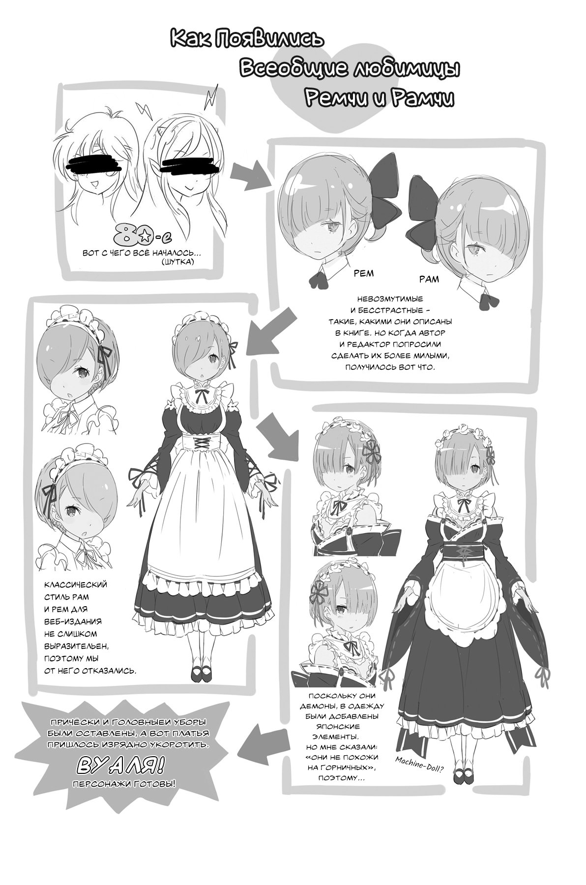
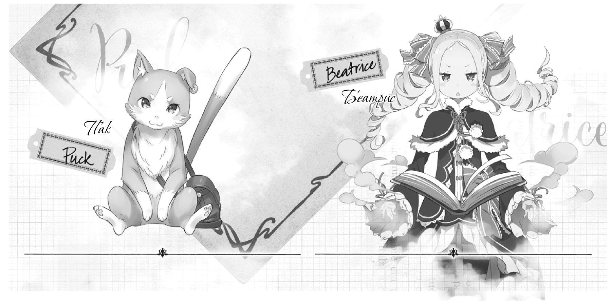

И снова здравствуйте! На связи Таппэй Нагацуки, хотя некоторым я известен под псевдонимом Кот Мышиного Цвета.

Благодарю вас за то, что вслед за первым томом вы поспешили приобрести и второй! Вряд ли среди вас, уважаемые читатели, нашлись смельчаки, которые решились начать знакомство с этой историей сразу со второго тома. Однако если же вы именно из таких храбрецов, прошу внимательнее посмотреть на книжный прилавок — вы наверняка обнаружите там первый том! Если нет, требуйте его у работников магазина. Так вы поспособствуете скорейшему распространению всего тиража!

Но оставим агрессивный маркетинг. Итак, вышел второй том, но на этом мы не собираемся останавливаться! Вы же знаете, как пишутся истории с продолжением. В одной книге ставятся вопросы и закручиваются интриги, в другой — даются ответы и разрешаются конфликты. Эта история — не исключение. Сюжетная линия снова и снова пройдёт через эти непременные стадии развития, с каждым новым витком приближая нас к финальной сцене, где будут даны ответы на все вопросы.

Кстати, первая порция ответов ожидает вас в третьем томе, который выходит уже в следующем месяце!

Второй же том изобилует новыми персонажами. Я уверен, что читатели интернет-версии с огромным нетерпением ждали их появления на страницах книги. Особенно популярными оказались сёстры-служанки, а также хранительница библиотеки. Иллюстрации с новыми героинями, которые создал Оцука-сэнсэй, изумительны! Рам, Рем и Беатрис получились потрясающе милыми, а Розвааль — просто фантастически подозрительным персонажем. Оцука-сэнсэй, низкий вам поклон за это!

Чем же закончатся события в особняке, вы уже скоро узнаете из следующего тома.

А теперь я немного расскажу о предыстории создания этой книги.

Лично мне всегда нравились сюжеты, в которых молодые ребята, не наделённые ни особым социальным статусом, ни огромной физической силой, преодолевают невероятные трудности ради спасения девчонок. Именно поэтому мой главный герой представляет собой обычного бесшабашного мальчишку, не обременённого ни силой, ни знаниями, ни навыками. Когда я придумал такого, казалось бы, совершенно бесполезного персонажа, мне всё же захотелось наделить его каким-то особенным умением — таким, чтобы в результате я мог сказать сам себе: «Вот! Это то, что нужно!»

Так и родился герой, обладающий способностью под названием Посмертное возвращение, и сереброволосая героиня, недосягаемая и пленительная богиня, которая становится для Субару смыслом жизни. Основы сюжета были разработаны во время посиделок в одном из ресторанов со старым приятелем, с которым мы знакомы уже десять лет. Теперь я могу с уверенностью утверждать: обсуждение безумных идей с друзьями за столиком в семейном ресторане до глубокой ночи является ключом к успешному творчеству.

Кажется, для такого небольшого послесловия шуток уже более чем достаточно. Приступим к благодарностям.

Прежде всего, хочу сказать большое спасибо своему редактору господину Икэмото. Нам пришлось изрядно попотеть над вторым и третьим томами, но главное — у нас всё получилось, Мы большие молодцы!

Далее хочется поблагодарить господина Оцуку. Сэнсэй, это просто немыслимо! Как вам удаётся настолько быстро создавать новые иллюстрации? Скорость работы наводит меня на мысль, что в ваших сутках гораздо больше двадцати четырёх часов! Как бы там ни было, когда я увидел результат, был на седьмом небе от счастья! Огромное вам спасибо!

Не могу не упомянуть господина Кусано, который создал для книги превосходное оформление, а также корректоров, сотрудников издательства и работников книжных магазинов. Без вас эта книга не появилась бы на свет. Спасибо!

И, конечно же, я хочу сказать огромное спасибо вам, дорогие читатели! Увидимся в следующем месяце в новом томе Re: zero!

*Таппэй Нагацуки, январь 2014 года*

*(при смерти от стресса перед выходом первого тома)*

— Пакки, Пакки! Нам доверили сделать анонс третьего тома Re: Zero, мнится мне!

— Бетти, как это волнующе! Третий том завершает арку событий в особняке, верно?

— Да, наконец-то всё разрешится. Не прошло и недели с момента появления Субару в особняке, а он уже успел несколько раз умереть. Главный герой, называется! На него даже смотреть больно, мнится мне.

— Хи-хи-хи! Ты действительно переживаёшь за него? Бетти, как трогательно! В третьем томе тебе ещё удастся проявить свою доброту. Кстати, а когда он появится на прилавках?

— Уже 25 марта, мнится мне. И не забывай, что журнал Comic Alive выпускает три специальных номера с приложением Re: Zero!

— Лия так хороша на обложке январского номера! А на обложках следующих номеров будут наши прелестные близняшки… Субару должен оценить!

— Как по мне, лучше бы там оказались мы с тобой, Пакки.

— Должно быть, они учитывали мнение читателей, когда решали, кого поместить на обложки.

— Пакки, ты, как всегда, проницателен и расчётлив, мнится мне.

— В приложениях Re: Zero. Visual Complete будет множество рисунков — иллюстраций и обложек, созданных Синъитиро Оцукой и раскрывающих публике неизвестные стороны персонажей нашей истории. Думаю, на это стоит взглянуть.

— Умолчать о любопытных фактах в основном тексте, поместив их в приложение? Хитрый ход!

— Без этого никуда. Мы, персонажи, делаем всё, что можем, здесь, внутри истории, а работники издательства — снаружи. Во втором томе Субару пришлось несладко. Интересно, удастся ли ему попасть в желанное будущее?

— Третий том «Re: Zero. Жизнь в альтернативном мире с нуля» увидит свет 25 марта, мнится мне!

— Он поклялся, что всех спасёт, но получится ли у него? Будем держать кулаки!

— Пакки, ты такой мастер создавать интригу! Ах, какая у тебя мягкая шёрстка! Я тебя обожаю!
