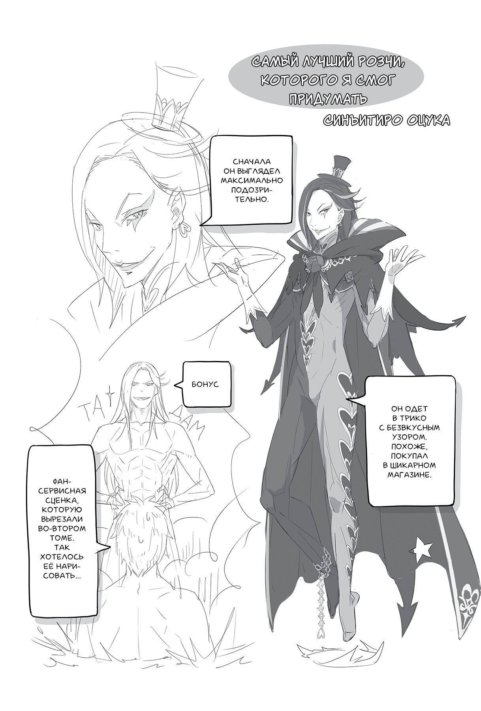
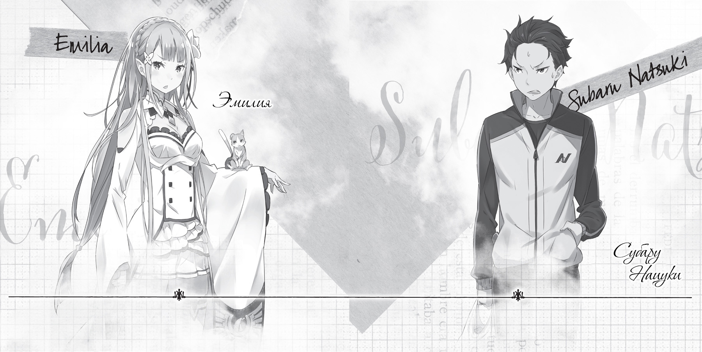

Здравствуйте! Я Нагацуки. Таппэй. Также известен как Серый Кот[^6].

Спасибо вам за то, что приобрели третий том ранобэ «Жизнь с нуля в альтернативном мире». Если вы начали с того, что просто полистали эту книгу в магазине, а потом всё же решили её купить, это просто здорово, огромное вам спасибо! Третий том — последний из тех, что последовательно публиковались на протяжении трёх месяцев. Я, конечно, не думаю, что найдутся такие смельчаки, которые начнут читать прямо отсюда, но если вашу душу тронула девочка, изображённая на обложке, непременно поищите поблизости первый и второй том. Наверное, они тоже стоят на полке. А если нет, попросите продавца заказать их.

И если благодаря этим словам продажи вырастут, то судьба всего произведения может совершенно измениться!

Занимаясь прямым маркетингом примерно так же, как в послесловии ко второму тому, я заодно хочу от всего сердца поблагодарить вас, если вы были со мной с самого начала.

Первый том является скорее разминкой. Во втором же появляется изюминка. В третьем заключено моё послание читателю, акцентированное сразу тремя томами, вышедшими всего за три месяца: эта серия действительно *интересная*!

Я отбивался от ответственного Икэмото-сана, рекомендовавшего привычный график публикации, чтобы выпестовать серию, и проигнорировал его предложение. «Мы достигнем новых горизонтов, сделаем то, чего никто ещё не делал!» — зазнавался я, радуясь, что иллюстратор Оцука-сэнсэй исполняет все мои невообразимые требования. Я заставлял дизайнера Кусано-сана просиживать над работой ночи напролёт, чтобы удовлетворить капризы автора…

Нет. На самом деле всё было совершенно иначе. Ответственный редактор велел: «Делай!» И автор пыхтел, но делал. Мне даже немного сочувствовали…

Спасибо вам, что купили книгу!

Что ж, оставим невидимые миру слёзы и вспомним, что в следующем томе наша история доберётся до сути.

Сценой следующих событий снова станет столица, и с этого начнётся новая арка, значительно расширяющая тесный мирок, который мы видели до третьего тома. Количество действующих лиц тоже как минимум удвоится, друг за другом появятся милые девчушки и крутые парни. Боюсь, Оцуке-сэнсэю не поздоровится от объёма работы по созданию персонажей, но не волнуйтесь, его лицо словно говорит: «Я справлюсь с этим благодаря письмам с вашей сердечной поддержкой, которые мне приходят!»

Разумеется, не только Оцука-сэнсэй, но и ваш покорный слуга будет рад письмам и отзывам. Я с удовольствием приму ваши послания на сайте «Стань писателем». Можно писать в *Twitter*. Можно комментировать в моём блоге. Можно создать свой сайт в поддержку *Re: Zero* и проповедовать там. Мне будет приятно. Можете даже организовать выступление на политической арене и потребовать введения моих книг в школьную программу. В общем, не стесняйтесь!

Отзывы, поддержка, критика, письма читателей — жду любых откликов. Если считать QR-код в конце тома, можно напрямую связаться с издательством «MF Бунко»[^7]. Не стесняйтесь, я жду!

Поскольку писать мне больше не о чем, я, как заведено, перейду к благодарностям.

Я очень многим обязан ответственному редактору — спасибо, Икэмото-сан. Публикация на протяжении трёх месяцев, издание в виде книги — это всё благодаря вам. Мы оба за эти три месяца изменились, и в глазах появился нездоровый блеск. Очень хочется, чтобы после перерыва к нам снова вернулся Икэмото-сан с его мягким взглядом.

Иллюстратор Оцука-сэнсэй, благодарю за великолепные, как всегда, рисунки. Особенно «коленки в роли подушечки» на фронтисписе в стиле Э-Н-А (Эмилия — Настоящий Ангел!) — я просто лишился дара речи и прыгал до потолка. Спасибо, спасибо!

Дизайнер Кусано-сэнсэй с беспощадной дизайнерской мощью высмеивал мои представления, но тем не менее превзошёл их. Огромное спасибо! Малышка Беа — это в самом деле жуткая малышка Беа.

Три тома этого произведения были созданы благодаря помощи множества других людей. Вместе с ними я смог осуществить эту публикацию за три месяца. Много было непривычного, я всем доставил массу хлопот, но благодарю вас за сотрудничество.

Буду счастлив вечно поддерживать с вами отношения!

Конечно же, я надеюсь, что и вы, дорогие мои читатели, останетесь со мной на долгое-долгое время. Благодарю вас!

*Таппэй Нагацуки, февраль 2014 года*

*(сбрасывает стресс, занимаясь прямым маркетингом)*

— Основная арка вот-вот начнётся, так что давай расскажем про следующий том. Наконец-то поворот в наших с Эмилией-тан отношениях — не слишком ли поздно?

— Хм. Но ведь мы получили шанс появиться в этой сцене, к тому же вдвоём, нужно быть благодарными. Ах, у меня прямо сердце трепещет!

— «Сердце трепещет»! Да кто сейчас так говорит?! Но если три тома подряд вышли, а до следующего, четвёртого, ещё есть время, тема для разговора вроде как отсутствует. Может, лучше пофлиртуем?

— Нельзя Работу надо выполнять прилежно. Три тома, может быть, и вышли, но ведь готовится ещё «Проект Re:Zero» в ежемесячном *Comic Alive?*

— «Проект Re:Zero», говоришь? Сначала появились три тома и *Visual Complete*, а теперь и ежемесячный журнал *Comic Alive* решил напечатать рассказы *Re:Zero?* Как это вообще? Журнал комиксов вдруг публикует рассказы?!

— Похоже, решили заняться чем-то новеньким. Причём речь пойдёт о том, что происходило между событиями, описанными в третьем томе и четвёртом. Только-только удалось справиться с проблемами в поместье и в деревне, не успели вернуться мир и спокойствие, как вдруг возникают новые неурядицы. Что-то такое. Я бы с радостью почитала!

— Судя по тому, что ты сейчас сказала, у меня сложилось ощущение, что нас ждёт не столько радость, сколько беспокойство.

— А ещё с четвёртого тома начнётся арка с главным сюжетом серии. Нас познакомят с тем, что вызывало самые горячие отклики после публикации в Сети.

— Эмилия-тан, ожидающая королевских выборов, и я, полный энергии после победы над зверодемонами. Мы возвращаемся в столицу и в королевском замке встречаемся с другими кандидатами на престол, а на меня смотрят как на самозванца! Да уж, многообещающе!

— Если говорить про всякие странные выходки, думаю, с тобой мало кто сравнится, Субару.

— Сделаю вид, что я этого не слышал. Продажи четвёртого тома «Re:Zero. Жизнь с нуля в альтернативном мире» начнутся совсем скоро, в июне.

— Ну… Спасибо, что приобрели третий том. Я очень рада, что вы будете с нами в четвёртом томе и дальше. Так правильно?

— Э-Н-А!

[^6]: В оригинале — Нэдзуми-иро Нэко, то есть Кот Мышиного Цвета.

[^7]: Актуально для японского издания.
