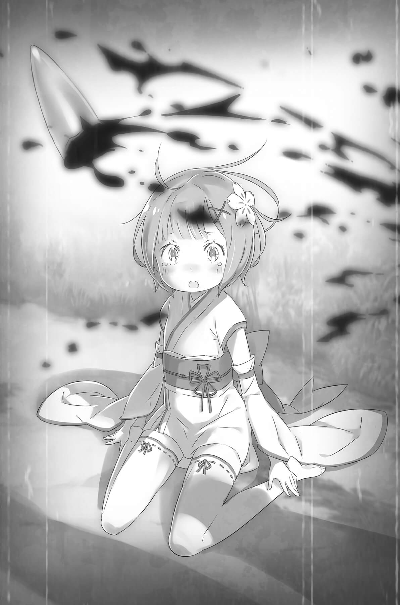

## 1

Девочке по имени Рем жилось очень тяжело: её постоянно сравнивали со старшей сестрой.

Демоны намного превосходили все прочие гуманоидные расы по физической силе и запасу жизненных сил. Могучие тела и качество маны, которой они могли пользоваться, обеспечивали им несравненную боевую мощь. Единственным слабым местом демонов была их малочисленность.

Раса, способная производить на свет очень крепких бойцов, не могла похвастаться плодовитостью, и демоны, невзирая на свою силу, волей-неволей вели скромную жизнь в горных поселениях. Но именно потому, что демоны селились вдали от людных мест, они строго придерживались своих обычаев, в том числе и тех, что защищали чистоту крови малочисленных племён.

Близнецы считались выродками. Их появление было крайне нежелательно.

От природы все демоны являлись в этот мир с двумя рожками. Обычно они прятались внутри черепа, но, когда требовали обстоятельства или просыпались демонические инстинкты, рога вылезали наружу и пожирали всю ману, что была вокруг. Высасывая из воздуха энергию и подчиняя её, демон значительно повышал свою боевую силу. Благодаря этому свойству для любого демона рога являлись предметом гордости.

Но близнецы рождались лишь с одним рогом на каждого. Тех, кто лишился рогов, демоны называли безрогими, и они становились изгоями. Даже потеря одного рога обрекала несчастного на незавидную участь, а поскольку близнецы изначально появлялись на свет ущербными, на них, естественно, смотрели как на второй сорт.

Такие дети были нежеланными, и от них избавлялись сразу же после рождения.

Жизни Рам и Рем тоже должны были оборваться согласно обычаю. Так бы и случилось, но в тот момент, когда вождь племени уже был готов привести в исполнение страшный приговор, у одной из близнецов проявился редкостный талант — необычайная магическая сила.

## 2

Близняшкам дали имена: старшую назвали Рам, а младшую — Рем, и судьбою им было уготовано оказаться на низшей ступени общественной иерархии.

Жизнь девочек никак нельзя было назвать лёгкой. Их пощадили, но о том факте, что они являются близнецами, никто не забыл. С самого начала на малышек налепили ярлык «безрогие», и соплеменники смотрели на них холодно, не скрывая отвращения и презрения к выродкам. Даже родители, казалось бы самые близкие люди, относились к ним как к чужим. Едва ли это было похоже на счастливое детство.

Впрочем, продолжалось такое отношение лишь до тех пор, пока девочки не осознали себя, а точнее, пока в старшей из близнецов не проснулась сила.

Для описания маленькой Рам лучше всего подходило слово «вундеркинд». По таланту ей не было равных даже среди великих демонов прошлых лет. Красота её рога очаровывала всё племя, и он позволял Рам распоряжаться огромным объёмом маны, несмотря на юный возраст хозяйки.

Девочка была прямолинейная как её белоснежный рог, торчащий изо лба, она не зазнавалась и же хвалилась своей силой, и соплеменники сами не заметили, как начали склоняться перед ней.

И родители, глядевшие на Рам словно на чужую, и соплеменники, щедрые на издёвки, и вождь, пытавшийся убить близнецов сразу после рождения, — все умолкали перед авторитетом Рам! Она появилась на свет, чтобы встать во главе демонов — избранного племени даже среди величественных племён нелюдей.

Демоны высоко ценили силу, и неудивительно, что они стали проявлять крайнее уважение к столь могучему созданию. Однако Рам ни разу не воспользовалась этим уважением ради собственной выгоды.

Ну а Рем оставалось лишь исполнять роль бледной копии своей прославленной старшей сестры.

Никаких выдающихся талантов у девочки не наблюдалось. И запас маны, и магическая сила были обычными, как у демонов, обладающих одним рогом. В отличие от стар шей сестры, Рем не обладала уверенностью в себе и потому всегда пряталась за спиной сестры, в её тени.

Такую нишу заняла маленькая Рем, чтобы защититься от угроз жестокого мира.

Нет, она не завидовала старшей сестре, напротив — уважала и любила её. И к родителям девочка не питала неприязни, ведь они относились к детям одинаково. Нельзя сказать, чтобы соплеменники сторонились Рем. Скорее, они возлагали на неё некие надежды как на сестру «той самой»…

У Рем была самая ласковая на свете сестричка. Были родители, которые многого ждали от неё. Были соплеменники, которые подбадривали её в надежде, что девочка пойдёт по пути выдающейся сестры. Всё это, словно мелкие, почти незаметные, но непрерывные движения резца, высекало характер Рем.

То, что они с сестрой выглядели практически одинаково, тоже, видимо, сыграло свою роль. Девочки были похожи ростом, лицом и фигурой, но вот врождённая демоническая сила оказалась разной.

Конечно, Рем пыталась что-то сделать. По-детски неумело, методом проб и ошибок она старалась приблизиться к старшей сестре хоть на шажок, превзойти её хоть в чём-то. Но из любого состязания Рам выходила победительницей.

Ещё в раннем детстве Рем осознала, что самый близкий, самый родной человек всегда и во всём будет её превосходить.

Сравняться со старшей сестрой было попросту невозможно — Рам всегда стояла впереди, купаясь в лучах славы. А Рем существовала за спиной сестры, выглядывая оттуда с опаской и съёживаясь под слепящим светом.

В какой-то момент Рем опустила руки. Она смиренно приняла повседневные горести, подобно траве или деревьям, покорившимся порывам ветра. И лишь изредка девочка задавала себе вопрос: действительно ли её судьба — мириться со всем, что происходит?

## 3

Как-то ночью Рем проснулась оттого, что стало слишком жарко.

Она заворочалась на деревянной лежанке и сбросила одеяло с покрытого потом тела. Затем огляделась: сестры в комнате не было.

«Надо поскорее отыскать её», — подумала Рем.

В любое время дня и ночи Рем следовала за решительно шагающей фигуркой старшей сестры, даже если та отлучалась совсем ненадолго, и эта привычка переросла в некую манию.

Собравшись было выйти из комнаты, Рем наконец-то поняла: воздух стал горячим потому, что их любимый уютный дом охвачен пламенем! Девочка отдёрнула руку от раскалившейся дверной ручки, и её спавшее до сих пор обоняние распознало запах гари. Во лбу защекотало — это вылезал наружу рог.

Воспользовавшись появившейся в теле силой, Рем сломала дверь и бросилась наружу из охваченного бушующим пламенем дома. Она не понимала, что происходит, но, подчиняясь инстинкту, стремилась поскорее оказаться в безопасности.

Одним ударом ноги разломав непрочную изгородь, Рем вылетела на улицу; ею управляла лишь одна навязчивая мысль: «Выбраться из дома и сделать так, как велит старшая сестра!»

Однако эта мысль в одно мгновение вылетела из головы, когда её глазам предстала ужасающая картина. На площади посреди посёлка возвышалась гора обугленных тел! Пылающие дома, сожжённые деревья — за одну ночь привычный мир превратился в багровый ад.

Среди изуродованных пламенем, скрюченных тел она увидела родные лица и, не в силах осознать происходящее, рухнула на колени.

Рем сидела на земле, а её медленно окружали тени в чёрных плащах. Низко надвинутые капюшоны скрывали лица. Незнакомцы не проявили ни следа дружелюбия, даже когда Рем попыталась заискивающе улыбнуться.

За этой улыбкой она научилась прятать отчаяние, чтобы не беспокоить окружающих. Но тени не обратили никакого внимания на полный боли взгляд.

Одна из теней приблизилась и занесла руку, в которой блеснуло серебром лезвие, но прежде, чем нож коснулся плоти… голова тени отлетела в сторону. Брызнула алая кровь. Одновременно лишились жизни ещё четверо, и головы покатились по земле. Удар был нанесён с таким мастерством, что враги не успели понять, что происходить и забить тревогу.

Знакомое движение маны, пульсирующее под кожей, подсказало Рем, что это дело рук Рам. Рем вскочила на ноги. Где бы сестрица ни была, нужно следовать за ней! Рам с искажённым от горя лицом, точь-в-точь как у Рем, подбежала к младшей сестре и заключила её в объятья. Убедившись, что Рем не ранена, она на мгновение расслабилась.

Рем обняла сестру в ответ, ощущая одновременно огромное счастье и горе.

Что было потом, она не помнила.

Наверное, как обычно, полностью доверилась сестре…

Это было правильно, ведь старшая сестра всегда принимала верные решения. Однако когда Рем пришла в себя, их уже окружили.

Бесчисленные тени выстроились вокруг стеной, но Рем, отстранённо глядя на них, всё равно верила, что сестра справится. Рам вдруг очутилась перед глазами младшей сестры; казалось, даже её спина выражает отчаянную мольбу. Сжавшись, вся в слезах, она отчаянно просила о чём-то.

Увидев Рам у своих ног, Рем заметалась, не зная, что делать. Это было просто невообразимо — смотреть на Рам сверху вниз!

Смысл существования Рем был в том, чтобы стоять за спиной сестры, быть младшей.

Рам закричала. Вскочив на ноги, она раскинула руки, защищая Рем.

Вскипела и хлынула мана. Бурлящая сила, намного превышавшая обычные возможности Рам, невидимыми лезвиями готова была обрушиться на мир, рассекая пространство… Но старшая сестра внезапно бросилась к младшей и загородила её своим телом… В тот же миг раздался удар, у головы Рам сверкнула сталь, и в огненном небе затанцевало белое свечение.

Сломанный рог вращался, совершая оборот за оборотом. Сломанный у самого корня рог, фонтан алой крови, пронзительный крик!..

Рем до сих пор отчётливо помнила, о чём тогда подумала.

Слыша крик любимой сестры, которая приняла на себя удар, глядя на то, как чудесный белый рог, которому она всегда завидовала, кувыркается в небе…

«Наконец-то он сломался!» вот какая мысль пронеслась в голове Рем…

## 4

Что случилось потом, Рем не помнила: она потеряла сознание. Очнулась девочка в большом поместье, далеко от родной деревни, а рядом с ней была сестра, потерявшая рог.

Рам пришла в себя первой и очень обрадовалась, когда Рем тоже очнулась. Однако Рем только и думала о роге, утратив который старшая сестра лишилась всех своих способностей и оказалась ниже обычного для демонов уровня.

Рам вела себя так же, как и прежде, но талант, который раньше проявлялся во всём, исчез. Рем несколько раз доводилось выручать сестру, которая мучилась с самыми простыми мелочами.

Можно было подумать, что Рем станет наслаждаться своим превосходством, которое проявлялось теперь практически во всём, но у девочки развился чудовищный комплекс неполноценности, существенно превосходящий тот, что был раньше: ведь Рем чувствовала вину за то, что её ранее всеми обожаемая сестра низверглась с вершины на самое дно.

И уважение Рем к сестре только подпитывало это чувство. Если бы душу Рем переполняла ревность к затмившей её старшей сестре, такого, наверное, не случилось бы. Но Рем очень любила Рам. И не могла простить себе низких мыслей, которые посетили её в тот миг, когда рог сестры сломался.

— Я должна научиться делать всё вместо сестрички… вместо сестрицы.

Рем начала по-другому обращаться к Рам. Выкинув из памяти те дни, когда пряталась за её спиной, девочка начала свою борьбу.

За все дела она бралась с мыслью; «Сестрица сделала бы вот так», — ведь Рем всю жизнь наблюдала за Рам, скрываясь за её спиной.

Однако результат не оправдывал ожиданий, ведь изначально Рам была гораздо сильнее. И теперь сёстры — искалеченная старшая и бездарная младшая — даже вдвоём не дотягивали до прежнего уровня Рам.

По тому пути, который Рам прокладывала раньше, по которому она решительно шагала, ведя младшую за собой, Рем теперь приходилось пробираться на ощупь, служа поводырём для некогда сильной Рам.

Теперь для девочки по имени Рем больше не существовало её собственной жизни.

Всем своим существом Рем пыталась воссоздать жизнь старшей сестры, какой она должна была стать. Но задача оказалась невыполнимой, и Рем окончательно убедилась в собственной никчёмности.

Шло время. В поместье, куда принесли двух девочек из сгоревшей деревни, разрыв между реальностью и тем идеалом, что желала достичь Рем, всё больше увеличивался.

Не то чтобы младшая сестра с неохотой выполняла работу служанки… Приютивший их хозяин оказался хорошим человеком; более того, сестра была так им увлечена, что, казалось, без колебаний отдала бы ему и душу, и тело…

Но если в этом благополучном существовании и были проблемы, то лишь по вине Рем.

«Молодец», — хвалил её за старание хозяин, но такие слова она много раз слышала и дома.

«Не загоняй себя», — беспокоилась сестра. Но как бы она себя ни загоняла, Рем всё равно чувствовала, что этого мало.

«Чего это ты так стараешься?» — спрашивала у Рем одна безответственная личность.

Но разгадка была проста: Рем постоянно не хватало чего-то. Как она ни усердствовала, сколько ни надрывала душу и ни утруждала тело — цель неизбежно ускользала.

«Зачем я живу?»

Затем, чтобы искупить собственную глупость, завладевшую её мыслями в ту охваченную пламенем ночь.

«Как мне сделать это?»

Жертвуя собой, расчистить путь, по которому должна была идти сестра и который невольно похитила у неё Рем. Ведь она — лишь жалкое подобие сестры, бледная копия, не более того.

## 5

Так, изводя себя всё более тягостными рассуждениями, Рем прожила почти семь лет.

Все вокруг высоко ценили труд Рем, хотя сама она считала, что результаты никуда не годятся. Граф Розвааль выделял её как самую способную служанку и даже велел помогать ему в самый важный период, когда ожидались королевские выборы.

Однако похвалы лишь наполняли грудь Рем смутным, но неутихающим беспокойством.

Со временем чувство вины только усугубилось, заставляя девушку посвящать всю свою жизнь старшей сестре.

«Моё имя — Субару Нацуки! Опыт работы — отсутствует! Прошу любить и жаловать!»

Чужак появился в поместье Розвааля в тот день, когда сестрица и Эмилия вернулись из королевской столицы. Израненного юношу принесли в особняк, объяснив, что Эмилия обязана ему своим спасением. Очнувшись, юноша переговорил с Розваалем и в мгновение ока выцарапал себе место ученика прислуги.

Вполне естественно, что Рем чувствовала сильное недоверие к молодому человеку неизвестного происхождения. Особенно в первый и во второй день, когда он начал работать в качестве слуги, антипатия к старательному юноше с приклеенной улыбкой только усиливалась.

Вдобавок ко всему от него исходил запах, будивший в Рем нестерпимые воспоминания. Запах Ведьмы! В этом мире крайне редко встречались создания, которых окружали подобные миазмы.

С той самой ночи, когда родную деревню поглотило море огня, нос Рем безошибочно улавливал этот запах, даже самый слабый. Она не знала почему, но миазмы будили тягостные воспоминания, и за семь лет было не раз доказано: запах Ведьмы не сулит ничего хорошего. Поэтому неудивительно, что взгляд Рем, падая на юношу, становился очень острым.

Девушка не могла открыто демонстрировать свою антипатию перед Розваалем и Эмилией, но всё чаще ловила себя на том, что постоянно следит за Субару, которого; казалось, тоже что-то подспудно мучило.

Рам; потерявшая рог, не нуждалась в каких-либо отношениях, кроме как с Розваалем, которого боготворила, и для Рем, «похитившей» место сестры, не было ничего важнее, чем защищать их обитель. Поэтому младшая сестра не пощадила бы никого, кто представлял угрозу этому убежищу.

Казалось бы, юноша не совершил ничего подозрительного, но после того, как сестра попросила понаблюдать за ним, Рем решила, что её долг — как можно скорее изгнать чужака из поместья. «Если что-то случится, будет уже поздно!» — так рассуждала Рем.

…И вот она стала свидетелем невероятного зрелища: Субару спал на коленях у Эмилии!

Рем очень высоко ценила мнение Эмилии, но в глубине души всё никак не могла определиться, как же обращаться с юношей.

Пристально наблюдая за его действиями, она поняла, что, невзирая на легкомысленный вид, он вкладывает всю душу в любое дело, даже в сарказм. Когда Субару, не обладая нужными умениями, рыл землю копытом ради результата, он очень сильно кого-то напоминал, да только вот Рем никак не могла понять, кого именно…

На следующее утро она заметила, что отношение Субару к делам и манера держаться явно изменились. Снедавшее его напряжение исчезло, и за работу он стал браться по-другому хотя нельзя сказать, что получалось намного лучше.

Демонстративное старание сменилось желанием достичь результата, да и сам юноша теперь выглядел совершенно по-другому. Увы, он продолжал оставаться обузой, но качество его работы несколько улучшилось.

Для Рем, которая чуралась перемен, Субару так и остался бестолковым нахлебником, но девушка хотя бы перестала видеть в нём врага.

Беда же случилась в ту ночь, когда Розвааля не было дома.

— Если мы ничего не сделаем, вся деревня погибнет!

Рем, по приказу сестры сопровождавшая Субару, не знала, стоит ли верить ему, однако в деревне Эрлхэм и в самом деле пропали дети, а охранный барьер, находившийся в лесу, оказался разорван и перестал работать.

— Идём, Рем. Другого выхода нет! Мы с тобой должны хоть что-то сделать.

Субару потянул упиравшуюся Рем за собой в глубь леса. Но почему парень, не наделённый какими бы то ни было боевыми способностями, так старается спасти малознакомых детей?!

Безрассудным Субару не был, он прекрасно осознавал свою слабость и без колебаний пользовался тем, что было у других, восполняя недостающее.

«Какое нахальство!» — думала Рем.

Они вошли в лес, отыскали детей, поддержали в них жизнь с помощью магии. Когда Субару заявил, что отправится в чащу, чтобы найти недостающего ребёнка, Рем уже не слишком удивилась.

Его глаза говорили, что юноша осознаёт собственное бессилие, а в голосе его звучал подавляемый страх и желание сбежать, однако Субару не сдавался.

Продолжая оказывать помощь детям, Рем смотрела, как удаляется одинокая фигура, и сердце её не могло успокоиться. Грудь наполнило странное тепло, которое не описать словами.

Передав детей подоспевшим деревенским парням, Рем отправилась за Субару, ориентируясь по запаху Ведьмы, а когда догнала, юноша, окружённый зверодемонами, находился на краю гибели.

Увидев девочку, спящую у него на руках, Рем почувствовала, что её сомнения и недоверие рассеялись.

Спасая убегающего Субару, Рем бросилась навстречу стае псов. Среди крови и боли девушка чувствовала лёгкость, словно с души упал тяжёлый груз.

Она и подумать не могла, что избавиться от подозрений настолько приятно.

В следующий миг Рем получила первый удар, сознание её провалилось куда-то во тьму, проснулись инстинкты демона — и началась резня.

Забыв, ради чего сражается, Рем чувствовала наслаждение, разрывая врагов в кровавые клочья, она упивалась возможностью не сдерживать свою силу. Разум кричал, что нужно остановиться, одуматься, но ненасытные инстинкты требовали вражеской крови…

— Гха…

Отреагировать на удар сзади Рем не успела и отлетела в сторону.

Что толкнуло её в незащищённую спину? Обернувшись, она увидела Субару, и это вырвало девушку из плена демонических инстинктов и вернуло ясность сознания.

Совсем рядом с ним она увидела оскаленные клыки свирепого зверя. Нужно было броситься вперёд, дотянуться, спасти Субару… но в этот миг её ноздрей коснулся запах, что вызвало секундную заминку. А потом…

— А-а-а-а-а-а!!!

Рем поняла, что в ней ничего не изменилось: она совершила то же самое преступление… снова.
