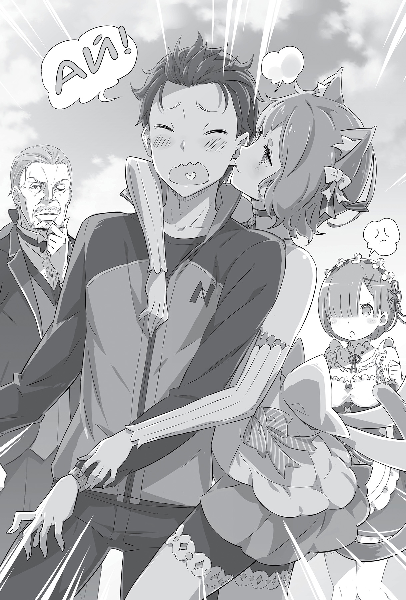

## 1

— Итак, последний раз потянулись руками вверх и закончили упражнение. Виктори!

— Виктори!

Высоко подняв руки над головой, Субару повторил клич вместе с остальными. Утренняя зарядка была завершена. Пока он вытирал пот со лба, со всех сторон доносились одобрительные возгласы.

Активными участниками зарядки оказались жители деревни Эрлхэм, ближайшей к поместью Розвааля. Каждое утро на мероприятие собиралось, наверное, больше половины деревни. Видя энтузиазм на уже знакомых лицах физкультурников, Субару не мог сдержать улыбки. А ведь ещё совсем недавно они ходили с мрачным видом, не поднимая глаз.

Юноша предложил проводить зарядку после той атаки зверодемонов. Идея, как ни странно, пришлась по душе жителям альтернативного мира, и теперь утренняя процедура пользовалась огромной популярностью.

Сначала Субару немного нервничал от такого количества участников, но, видя, как радуются местные детишки, недавно пострадавшие от зверодемонов, почувствовал, что находится на правильном пути. Нельзя было недооценивать и традиции его прежнего мира.

Субару придумал ставить печати тем, кто принимает участие в зарядке.

— Эй, ребятня, налетай! Кому печать?!

Обмакивая в чернила обрезанный край картофелины, он ставил печать на бумажки, которые протягивали ему выстроившиеся в очередь дети.

Картофельная печать оставляла на бумаге оттиск с замечательным рисунком.

— Что скажете? Раз мы начинаем новую неделю… Смотрите-ка, у нас здесь «Пак по понедельникам»! Такая грустная мордашка, и ушки опущенные.

— Такой симпатичный котик!

— Какой миленький!

— Бедняжка!

Благодаря печатям, ловко вырезанным Субару, юноше удалось завоевать ребячьи сердца, ведь многие дети с нетерпением ждали нового рисунка.

Поболтав с местным жителями, Субару помахал им на прощанье рукой.

— Ух, ну я и устал. Эмилия-тан,[^1] извини за ожидание.

— Ничего страшного. Отлично поработал! — похвалила девушка, которая, прислонившись к дереву, дожидалась его рядом с площадью.

Убрав длинные серебристые волосы, Эмилия надвинула капюшон до самых глаз и улыбнулась.

— Кажется, местные жители вновь бодры и веселы. И всё это благодаря тебе, Субару.

— Я ничего особенного не сделал. Просто из-за утренней зарядки кровь в организме циркулирует быстрее. Извини, что тебе приходится сопровождать меня каждое утро.

— Пустяки. Ты же ещё не до конца выздоровел. А у Рем и Рам и без того много работы в особняке. К тому же мне нравится так проводить время.

— Нравится? Тебе нравится проводить каждое утро со мной?

— Я о другом! Раньше у нас с местными не было никаких точек соприкосновения, а теперь появилось нечто общее. Я чувствую, что и сама немного изменилась благодаря этому.

Субару заметил, как щёки Эмилии раскраснелись под капюшоном. Она выглядела так очаровательно, что юноша и сам почувствовал, как кровь приливает к лицу.

Последнее время после утренних бесед с духами Эмилия частенько сопровождала Субару в деревню на зарядку, а после они вместе возвращались в поместье, шагая бок о бок целых пятнадцать минут, и эти мгновенья Субару ждал с большим нетерпением.

— Кажется, ты привык к деревенским. Наверное, уже стал популярнее, чем Рам и Рем.

— Ну я же герой, который их спас. Но слишком благородный, чтобы лишний раз напоминать об этом или кричать о своих подвигах на каждом углу. Эмилия-тан, я уверен — ты вновь очарована мною!

— «Вновь»? Вроде бы никогда и не была… Хотя я думаю, что они всё же относятся к тебе иначе…

Приложив пальцы к губам, Эмилия слегка наклонила голову и задумалась, а Субару расстроился, что девушка не заметила, как он намекнул на свои чувства.

— Мне кажется, в деревне к тебе относятся скорее не как к герою, который всех спас, а как к затейнику и выдумщику. Ты ведь знаешь много удивительных вещей.

— Думаешь, я вроде ходячей энциклопедии? Но, кроме зарядки, у меня нет особенных заслуг…

— А детские игры, а печати из картофеля?.. И майонез!

С этими словами Эмилия хлопнула в ладоши. Её глаза загорелись, ведь вкус майонеза, который Субару приготовил на пробу в поместье, оказался по-настоящему замечательным.

В своём мире Субару был большим любителем майонеза. Желая приправить местные блюда, он попытался воспроизвести вкус майонеза и здесь, что очень понравилось и Эмилии, и жителям деревни Эрлхэм.

— Звучит так, словно моё участие в той заварухе со зверодемонами и приготовление майонеза — равноценные поступки. А я ведь так старался ради всех…

Отправившись в лес за пропавшими детьми, Субару столкнулся с демоническими псами и был покусан. Пытаясь спасти Рем, которая вызвалась ему помочь, юноша пострадал снова. А когда твари пытались закусать его окончательно, подоспел Розвааль.

— Опля, выходит, я ничего особенного и не сделал!

Ещё раз вспомнив свои достижения, Субару понял, что они выглядят не такими уж весомыми. Да, благодаря ему ситуация разрешилась благополучно, но вряд ли юноше удалось бы чего-то добиться в одиночку…

— Ну ладно. Довольно думать о пустяках.

— Но ведь, Эмилия-тан…

— Тех, кто знает о твоём рвении, немало. И Розвааль, и Рам, и Рем.

Несмотря на то что Эмилия пыталась его подбодрить, Субару был по-прежнему расстроен. Девушка сделала пару энергичных шагов, обогнала его и встала напротив. От резкого движения капюшон упал назад, и длинные серебристые волосы, переливаясь в лучах утреннего солнца, рассыпались по плечам.

— Я тоже.

— Что?

— Я знаю, как ты старался! Поэтому не смей расстраиваться. Понял меня?

Наклонив голову набок, Эмилия добавила:

— Не слышу ответа.

Ошарашенный, Субару принялся энергично кивать головой, и такая реакция развеселила Эмилию.

— Что это? Ты теперь сломанная игрушка? Вечно что-нибудь смешное изображаешь!

— Нет, сейчас не специально… А вот ты поступаешь по-настоящему вероломно! Но погоди, как ни сопротивляйся, обязательно снова очаруешься мною.

— Да-да, конечно. Всё же эти твои шуточки — дурная привычка.

Эмилия улыбнулась — похоже, она вновь упустила заложенный в словах смысл. Поправив капюшон, она опять зашагала рядом с ним, а Субару в который раз подумал, что девушки лучше не найти в целом свете.

Пока они беседовали, впереди показались ворота поместья Розвааля. Ещё несколько минут — и счастливые утренние мгновения окажутся позади…

— Смотри, у ворот драконья повозка! — вдруг остановилась Эмилия. Бросив взгляд в сторону поместья, Субару замер.

Перед главным входом стояла карета, в какие обычно запрягают лошадей. Обычно, но не в данном случае. Субару увидел вовсе не лошадь!

Животное, тянувшее карету, оказалось ящерицей размером с кобылу! Поражённый зрелищем, Субару хлопнул в ладоши.

— А, точно! В столице они частенько попадались мне на глаза. Ты сказала, это называется драконьей повозкой?

— Разве нет? Земляные драконы тянут за собой повозки, вот их и зовут драконьими. Ой, или я ошибаюсь? Может быть, у них есть другое, правильное название?

— Да нет, я же понятия о них не имею! Наверняка ты права, не переживай.

— Правда? Ты не подтруниваешь надо мной? А то вдруг я случайно скажу это слово где-нибудь в приличном обществе и покрою себя позором. Если ты меня обманываешь, надаю тебе тумаков!

— «Тумаков»? Кто же так говорит сейчас?

Притворно рассердившись, Эмилия замахнулась на него, делая вид, что вот-вот ударит, а Субару, схватившись за голову, попытался увернуться. Подшучивая друг над другом, они приблизились к драконьей повозке.

— Ого! Ничего себе! Нереально здоровенный!

В столице юноша несколько раз видел драконьи повозки, но так близко оказался впервые.

Земляные драконы, как Эмилия называла ящериц, размером были примерно с лошадь, но отличались изящным телосложением и небольшим весом, превосходя лошадей в проворстве.

— Добрый день! Прошу прощения, я немедленно спущусь к вам. — Человек, сидевший на козлах драконьей повозки, завидев Субару и Эмилию, на удивление легко спрыгнул и выпрямился перед ними.

Субару поразился, как изящно незнакомец это проделал, ведь козлы располагались на изрядной высоте.

— С возвращением! Прошу простить, что поставил повозку перед самыми воротами, — с этими словами пожилой джентльмен отвесил учтивый поклон.

Седые волосы были аккуратно приглажены, элегантный чёрный костюм сидел как влитой. Несмотря на возраст, мужчина выглядел тренированным и подтянутым.

«Если таков слуга, какими же важными птицами должны быть его хозяева?» — думая об этом, Субару перевёл взгляд на карету. Словно предвидя вопрос, пожилой джентльмен пояснил:

— Посланник уже в поместье, на аудиенции у маркграфа Мейзерса.

Субару замешкался, не зная, что следует сказать в такой ситуации, но Эмилия, сделав шаг вперёд, обратилась к пожилому джентльмену:

— Вы сказали «посланник»? Неужели по поводу…

— Вы не ошиблись в своих предположениях, госпожа Эмилия. Это по поводу королевских выборов.

Услышав слова «королевские выборы», Субару вскинул голову и перевёл взгляд на Эмилию. Она сразу сделалась серьёзной, и юноша нахмурился, увидев перемену в её лице.

— Полагаю, посланник официально сообщит обо всём. Прошу вас проследовать в поместье.

— Неужели меня вызывают?

— О подробностях расскажет посланник.

В ответ на слова пожилого кучера Эмилия со строгим выражением приподняла голову.

— Пойдём, — коротко сказала она и, не оборачиваясь, направилась в сторону дома.

Субару поспешил вслед за ней, но через несколько шагов на мгновение обернулся. Кучер по-прежнему стоял на месте, провожая их глубоким поклоном.

## 2

— С возвращением, госпожа Эмилия.

В зале особняка им навстречу вышла горничная Рем. В её обычно звонком голосе отсутствовали эмоции, и она выглядела на удивление чопорно. Последнее время девушка часто улыбалась, особенно когда рядом оказывался Субару, но сейчас можно было предположить, что она переключилась в режим приёма гостей.

— Мы вернулись. Извини, что я оставила поместье. У нас гости?

— Из столицы прибыл посланник. Господин Розвааль сейчас беседует, вы сможете присоединиться к ним?

— Разумеется. Это ведь касается меня, я должна участвовать, — Эмилия кивнула Рем и направилась к лестнице, ведущей наверх.

— Вот как. Мне прямо не терпится услышать, о чём пойдёт речь! Обещаю без глупостей, — заверил Субару и как ни в чём не бывало зашагал рядом с Эмилией. Увидев столь решительный настрой, она остановилась.

— Эй, Эмилия, ты что, разнервничалась?

— Послушай… извини, но у нас там серьёзный разговор.

— Я понимаю и потому полон решимости принять в нём участие.

— В гостиной прислуживает сестрица. И другие слуги там не нужны. Надеюсь, это понятно? — бесстрастно проговорила Рем вместо Эмилии, которая затруднилась с объяснением.

Пробормотав: «Да не может быть», Субару взглянул на Эмилию.

— Я что, лишний?

— Прости, Субару. Рем, проводи меня.

— Слушаюсь. Субару, пожалуйста, возвращайся в свою комнату.

Рем, пребывающая в рабочем режиме, тоже не стала нянчиться с Субару и поднялась по лестнице перед Эмилией. Когда они скрылись из виду, юноша от досады щёлкнул языком.

— Всё равно я почти ничего не знаю об этом мире, так что от меня никакой пользы…

Возможно, его желание быть участником здешних событий — действительно просто глупый каприз?..

Прошёл месяц с тех пор, как юноша оказался в альтернативном мире. За это время произошло много всего, и Субару был уверен, что изменил судьбу не одного человека в лучшую сторону. И хорошие отношения с обитателями поместья, начиная с Эмилии, и дружба с жителями деревни являлись ярким тому подтверждением.

Чем больше он думал об этом, тем острее чувствовал неудовлетворённость, ведь ему не позволяли участвовать в чём-то более важном.

Субару оказался отстранён — и физически, и эмоционально.

Разумеется, юноша понимал: причина кроется в его заурядных способностях. Однако понимать причину и сдаться, опустив руки, — это совершенно разные вещи. Что же делать?..

Субару Нацуки не был настолько слаб, чтобы безропотно вернуться в свою комнату, отказавшись от задуманного. Он принялся размышлять о том, как исправить ситуацию.

— Ага!

Щёлкнув пальцами, юноша с заговорщицким видом засмеялся.

## 3

— А вам не надоело ждать? Может, стоит сделать перекур?

Пожилой кучер, сидевший на козлах, с удивлением посмотрел на Субару. Тот стоял возле запряжённой драконьей кареты с подносом, сервированным для чаепития.

— Благодарю за хлопоты. Прошу прощения, что опять разговариваю с вами, находясь наверху.

Седой джентльмен, как и в прошлый раз, проворно спрыгнул с козел — и опять совершенно беззвучно.

— Очень признателен. И правда немного хочется пить.

— Да не за что. Не знаю, какой вы любите чай, поэтому заварил самый дорогой.

Увидев поднос перед собой, пожилой джентльмен расплылся в улыбке. Всматриваясь в его лицо с морщинками вокруг рта, что свидетельствовали о почтенном возрасте, Субару вдруг вскрикнул и покачнулся от лёгкого толчка в плечо.

— Ой, что это?!

Обернувшись, он с удивлением увидел морду земляного дракона — чёрная блестящая рептилия сверлила его острым взглядом.

От этого взгляда Субару охватило какое-то странное чувство. Он не испытывал страх. Наверное, потому, что в спокойных глазах дракона не было ни капли враждебности.

— Ой, прошу простить! На самом деле этот земляной дракон самый смышлёный из тех, что у нас есть.

— Да ничего страшного. Наоборот, мне повезло, что он мной заинтересовался.

— Благодарю за великодушие. Хм… это совершенно несвойственное для него поведение…

Извинившись ещё раз за проделку дракона, пожилой джентльмен смерил Субару пронзительным взглядом голубых глаз, и тот замер, чувствуя, будто его просвечивают насквозь.

— Прошу прощения, эту рану вы получили в бою?

— В бою? Ну, боем это и не назовёшь, просто попал в одну историю…

— Но это следы от звериных клыков и когтей. К тому же движения вашей левой руки и ноги выглядят немного скованными.

Субару поразился проницательности кучера, который, заметив на его руке белый шрам, выглядывающий из-под закатанного рукава спортивной куртки, сразу же догадался, откуда тот взялся. Полученные недавно раны и правда заставляли Субару беречь левую сторону тела.

— Извините за бестактность. Вам совершенно не обязательно отвечать на этот вопрос. — Джентльмен взял чашку чёрного чая: — Превосходный вкус! Я не достоин такой роскоши.

— А я и не преувеличивал, когда сказал, что это самый дорогой чай в поместье. Наверное, розоволосая горничная будет в ярости, ведь я взял его без спросу.

Субару знал: когда Рем выяснит, кто стянул чай с надписью «Строжайше запрещено выносить с кухни», на него непременно обрушатся долгие нравоучения.

— Итак, что бы вы хотели узнать в обмен на этот замечательный чай? — пожилой джентльмен прищурил один глаз.

Его изысканные манеры и проницательность указывали на то, что расслабляться не стоит. Субару понял: у такого сопляка, как он, шансы обыграть этого джентльмена ничтожно малы, поэтому решил сразу же говорить начистоту.

— Ну, вы меня раскусили. Моё имя Субару Нацуки, и сейчас я учусь быть слугой в поместье Розвааля. Может, тоже представитесь?

Неопытному новичку не стоит скрывать то, что он неопытный новичок, Субару решил показать собеседнику, что он осознаёт собственное положение, и продемонстрировать почтение.

Увидев, что Субару склонил голову, джентльмен слегка смягчился.

— Весьма польщён вашим вниманием. Меня зовут Вильгельм. В настоящий момент я состою на службе в доме Карстен.

— Господин Вильгельм? Большое спасибо, что назвали своё имя. А вы не могли бы рассказать, зачем вы здесь?

— Думаю, именно об этом сейчас ведёт разговор посланник.

— Это я знаю. Но мне не разрешили присутствовать при встрече. Как-то обидно, что история развивается без моего участия.

Субару сразу же понял, что собеседник вряд ли легко раскроет карты. Но способность добиваться расположения окружающих была сильной стороной юноши. Он всегда настаивал на своём, невзирая на приём, который ему оказывали.

Встретившись с напористостью Субару, Вильгельм на мгновение умолк, а затем сказал:

— Смотрю, даже если всё идёт не по плану, вы не отчаиваетесь. Когда ваши замыслы разгадывают, не злитесь, а наоборот, с удвоенной силой пытаетесь их осуществить, невзирая на реакцию собеседника.

— Может быть, хоть подсказку дадите?

— Поскольку я не знаю, какое положение вы занимаете в поместье, рассказывать о чужих делах было бы крайне неосмотрительно с моей стороны. Надеюсь на ваше понимание.

Хоть в целом Вильгельм выглядел сурово, выражение его лица в этот момент было на удивление мягким. Однако Субару понял, что упорствовать не стоит, поскольку это не приведёт к желаемому результату и Рам отругает его ещё больше.

— Как я понимаю, с госпожой Эмилией у вас близкие отношения. Вы ведь здесь не просто слуга?

— Правда? Вам действительно показалось, что мы с Эмилией-тан подходим друг другу?

— «Эмилией-тан»? — Вильгельм нахмурился, а затем усмехнулся, догадавшись, что за чувства питает к ней Субару.

— Вы ступили на скользкий путь. Ведь в скором будущем она может стать королевой Лугуники.

— Но сейчас она просто очень милая девушка, а я — слуга-стажёр. Будущее пока не определено, и у нас бесчисленное множество возможностей. Господин Вильгельм, когда вы просили руки своей жены, вы же считали, что она самая красивая на свете, верно?

— Моей жены…

На мгновение Вильгельм замолчал. Но затем кивнул и сказал:

— Возможно, вы правы. Я считал свою жену самой прекрасной на свете и думал, что к этой девушке прикованы все взгляды. Рядом с ней я казался себе жалким и полагал, что она слишком хороша для меня.

— И я про то же! Чем глядеть, как девушку уводит другой, лучше сделать всё возможное, чтобы завоевать её, пусть и осознавая, что пока не дотягиваешь до её уровня. Нужно стать достойным, двигаясь шаг за шагом. Так все окажутся в выигрыше!

— Интересная у вас логика. И правда, очень интересная. Но я всего лишь кучер. Сомневаюсь, что смогу быть полезен.

— Кучер, который, несмотря на капюшон, надвинутый на самые глаза, смог понять, что перед ним Эмилия? Как-то верится с трудом…

Услышав замечание Субару, Вильгельм вновь принял безучастный вид и умолк.

— Платье Эмилии-тан — работа сильного мага, оно обладает эффектом, который скрывает её происхождение. К тому же из-за одного недавнего случая она обзавелась ещё и плащом с капюшоном, который усиливает защиту. Обычный человек вряд ли может что-то разглядеть сквозь неё, а значит, либо Эмилия сама позволила вам её узнать, либо вы обладаете достаточной для этого силой.

Одежда, дополненная магией Розвааля, была мерой предосторожности, ведь Эмилия являлась полуэльфийкой. Её кровь создавала немало сложностей в этом мире.

— Значит, вы с самого начала внимательно следили за мной? Опасный вы человек!

— Да нет же, так далеко я не зашёл. Я заваривал чай в поместье и размышлял на эту тему, а потом что-то показалось мне подозрительным. Чистая случайность.

Субару задорно рассмеялся, и выражение глаз Вильгельма изменилось. Наверное, он понял, что перед ним не просто мальчик на побегушках.

— Значит, не верите, что я обычный кучер?.. Да, вы правы, я связан с персонами, участвующими в королевских выборах. Вернее сказать, связан с теми, кто связан с кандидатами.

— Значит, вы в том же положении, что и я.

— Но моя причина — не любовь. В этом наше различие.

— Если жена — первая красавица на свете, зачем вам думать о другой?! Хотя я уверен, что Эмилия всё равно красивее.

— Ну уж нет! В красоте моя жена не уступит никому!

Субару шутил, но столь решительный ответ Вильгельма поставил его в тупик. Тот чуть улыбнулся, увидев, что реплика произвела должный эффект.

— Но… кажется, время вышло.

— Что?

Вильгельм молча указал рукой в сторону поместья.

— Там Рем и… ещё кто-то?

Рядом с горничной с голубыми волосами появилось новое лицо. Судя по рассказу Вильгельма, это и был тот самый вестник.

— Нет, это и правда мир фэнтези!.. — невольно сорвалось с губ Субару, когда он увидел, что посланник совершенно не похож на того, кого он себе представлял.

Заметив взгляд Субару, гость с хитрой улыбкой приблизился к ним.

— Эй! Я знаю, что от красотки вроде меня сложно оторвать взгляд, но так пялиться не слишком вежливо! — сказала миловидная особа с льняными волосами, остриженными до плеч.

Для девушки она была довольно высокого роста, почти вровень с Субару. Изящная фигурка и каждый жест так и дышали не просто женственностью, но прелестным кокетством.

Льняные волосы были подвязаны белой лентой, большие глаза с любопытством смотрели на Субару. Весь её облик был исполнен очарования, какое бывает у кошек, а на голове красовались ушки, покрытые мягкой шёрсткой в тон волосам. Когда незнакомка говорила, ушки шевелились.

— Персонаж с магической силой и кошачьими ушками?!

— О чём это ты, мяу?

Субару ещё не доводилось близко сталкиваться с полулюдьми. Он был попросту поражён и с огромным трудом сдерживался, чтобы не протянуть руку и не пощупать мягкие ушки.

Пока Субару, большой любитель пушистиков, из последних сил подавлял свои порывы, девушка обратилась к Вильгельму:

— А вот и я, старина Вил. Извини за ожидание, мяу. Тебе не было скучно?

— Ну что вы! В компании этого молодого человека время пролетело незаметно.

Наклонив голову набок, девушка приложила ладонь к щеке. Зрачки кошачьих глаз, внимательно разглядывающих Субару, сузились.

— Ах вот в чём дело! Теперь всё понятно. Ты тот мальчик, о котором говорила госпожа Эмилия.

Осмотрев Субару с головы до пят, словно облизав кошачьим язычком, девушка хлопнула в ладоши, будто наконец что-то поняла. Но произошедшее дальше застигло его врасплох.

— Что?! Ты зачем это?..

— Не шевелись! Я сейчас кое-что проверю.

Не обращая внимания на замешательство Субару, девушка обвила рукой его шею и прижалась к юноше всем своим тоненьким телом. Из-за одинакового роста их лица оказались рядом, шёпот защекотал ухо, и Субару залился краской.

Мягкие прикосновения, удивительно приятный запах, а главное — совершенно неожиданное развитие событий заставили Субару замереть на месте, напрягая все душевные силы только для того, чтобы казаться невозмутимым.

— Ням!

— Ай!..

Один-единственный лёгкий укус за ухо — и его усилия пропали даром! Довольно улыбнувшись в ответ на испуганный вскрик Субару, незнакомка выпустила его из объятий, и юноша немедленно попытался отпрыгнуть, неуклюже повалившись на спину.

— Какая милая реакция, мяу! И всё же… как мне и говорили, поток водяной маны в твоём теле застоялся. Мне и хотелось бы помочь, но сейчас времени нет, поэтому пока ничего не получится.

— Да что ж вы такое творите?!

— Небольшой медосмотр и подарочек в виде укуса от Ферри.

Бросив взгляд на Субару, девушка слегка прикусила мизинчик и с вызовом усмехнулась. Юноша догадался: плутовка подтрунивает, но его щёки горели от смущения, и слова для ответа так и не нашлись. И немудрено — Субару ни разу не подвергался подобной атаке со стороны лица противоположного пола.

— Не смущайся так. Значит, тебе ещё ничего не сказали?

— «Ничего не сказали»? О чём мне должны были сказать?

— О твоём собственном теле. И ещё много о чём…

Удивлённо приподняв брови, Субару уверился, что кокетка забавляется с ним, но юноше оставалось лишь подстроиться под такую манеру разговора.

— Буду признателен, если вы поведаете об этом.

— Ах, что же мне делать? Это ведь тоже важная работа…

— Феррис, довольно! — стоявший поодаль Вильгельм остановил расшалившуюся гостью, которой явно доставляло удовольствие подшучивать над Субару, и она надула губки:

— Ты слишком серьёзный, старина Вил. Уж и поразвлечься нельзя, мяу!

— Я благодарен господину Субару за чай. А нам пора ехать, — Вильгельм чопорно поклонился.

Перебросившись парой фраз без лишних церемоний, гости засобирались. Девушка с несколько кислым видом махнула кучеру и, обернувшись к Субару, озорно подмигнула:

— Ну извини. Хотелось бы ещё тебя подразнить, но мы спешим, поэтому на сегодня всё, мяу. Пора возвращаться к дорогой госпоже Круш, иначе она от беспокойства не сможет заснуть.

— Стоп! Я и до этого момента ничего не понимал! Кто такая госпожа Круш?

— Это имя тебе следует запомнить. Когда-нибудь она станет королевой!

Последние слова девушка сказала совершенно серьёзно, отбросив прежний легкомысленный тон, и сделала ошарашенному Субару ручкой. Вильгельм вернул пустую чашку на поднос.

— Большое спасибо за чай. Прощайте, господин Субару, берегите себя.

Старый слуга с лёгкостью запрыгнул на козлы и взял в руки поводья драконьей повозки.

— Прости, что не хватило времени всё объяснить, но у меня очень много дел, — бросила посланница.

— Стойте! Я же ещё не успел задать ни единого вопроса из огромной кучи моих вопросов!..

— Думаю, их лучше задать госпоже Эмилии. Если повезёт, встретимся в столице, мяу. Пока!

Решительно поставив точку в разговоре, девушка с улыбкой исчезла в глубине экипажа. Субару понял, что всё это время играл по её правилам и что с таким искусным противником ему ещё не приходилось сталкиваться.

— До встречи.

Вильгельм коротко попрощался с бессильно опустившим руки Субару и взмахнул вожжами.

Земляной дракон издал низкий рык, и повозка скрипнула, покачнувшись на рессорах. Несколько раз взрыв лапами землю, дракон рванул с места, стремительно набирая скорость. Выехавший на дорогу экипаж двигался всё быстрее, пока не скрылся вдали в клубах пыли.

Во дворе остался лишь потерпевший полное поражение Субару да аромат дорогого чая, к которому юноша почти не притронулся.

## 4

— Вы исполнили миссию посланника? — спросил Вильгельм, когда повозка покинула поместье Розвааля. Он сидел на козлах и управлял земляным драконом.

— Разумеется. Нельзя же допустить оплошность в поручении, данном госпожой Круш. Ты напрасно так переживаешь за меня, старина Вил, — ответила его подопечная, высунувшись в окошко экипажа. Трудно было представить более подходящие условия для секретных переговоров. — И всё же удивительно, что ты беседовал с этим мальчишкой, пока ждал, старина Вил. Мне казалось, ты не любитель общаться с людьми.

— Полагаю, это досадное заблуждение с вашей стороны.

— Вот как? И верно, ты любишь не говорить с людьми, а рубить их на части.

— Это ещё дальше от истины, — отрезал Вильгельм в ответ на подтрунивания, и девушка недовольно надула губы.

— Скукотища! Значит, беседа со мной тебе не так интересна, как с тем юношей? Вроде в нём не было ничего особенного, но чем-то же он тебе понравился, мяу? Может, у него есть скрытые силы или какие-то потрясающие таланты?

— Вовсе нет. Он совершенно обыкновенный, ничем не примечательный, и никаких талантов я в нём не обнаружил. Вы абсолютно правы в своих выводах.

— Но тогда почему?! Ты же терпеть не можешь таких людей и называешь их мусором.

В ответ на слова девушки, словно пытавшейся выставить Субару в самом неприглядном свете, Вильгельм медленно поднял руку к глазам.

— Его взгляд.

— Взгляд?

Девушка озадаченно наклонила голову, и он кивнул, а затем, словно что-то обдумав, продолжил:

— Меня заинтересовали его глаза. Они говорят, что этот юноша уже пересекал смертельный рубеж. Я неоднократно видел тех, кто оказался на краю, но… — Вильгельм вдруг осёкся и прикрыл глаза. — Судя по их выражению, он побывал по ту сторону границы… и даже не раз. Таких людей я прежде не встречал. Этим он и привлёк моё внимание.

— Не очень-то понимаю, о чём речь, мяу, — заметила девушка, но Вильгельм лишь усмехнулся. — Но, если ты так говоришь, старина Вил, этот парень наверняка прошёл непростой путь.

Прищурившись, она бросила взгляд на широкую спину кучера и закончила:

— Привлечь внимание самого Демона Меча, Вильгельма ван Астрея, — не намного лучше, чем заинтересовать Ведьму.

## 5

— Ты собираешься в столицу? Тогда и я! Я тоже поеду!

Напряжённая атмосфера, повисшая в приёмной зале с уходом посетителей, рассеялась благодаря одной-единственной фразе Субару.

— Что я говорил? — улыбнулся Розвааль, а Эмилия устало согласилась:

— Верно…

Субару насупился, глядя, как эти двое намекают на то, о чём он понятия не имел. Эмилия вздохнула:

— Послушай, я еду не развлекаться. Меня вызывают по важному делу… и это очень серьёзно.

— Да я понял. Это связано с королевскими выборами, верно? Я знаю, от этого зависит судьба страны. Вот потому и прошу! Возьми меня с собой! — упав на колени, Субару молитвенно сложил руки.

Не зная, что делать, Эмилия растерянно огляделась по сторонам.

— Можете не обращать на меня никакого внима-а-ания. Поступайте та-а-ак, как велит сердце.

Когда Розвааль с улыбкой дал понять, что он здесь лишь наблюдатель, из-за его спины донеслось:

— Этот аромат… Не может быть… неужели… мои драгоценные чайные листья?! Даже для Барусу это слишком! — бормотала поражённая чем-то до глубины души Рам, совершенно не обращая внимания на Эмилию. А Рем, которая ещё недавно считалась здесь самым уравновешенным человеком, вдруг идеально подыграла Субару:

— Пожалуй, это хорошая идея. Возьмите его с собой. У Субару много знакомых в столице, будет неплохо, если он навестит их и расскажет, что с ним всё в порядке.

— Отлично! Прекрасный пас! Рем, иди-ка сюда!

— Да!

С улыбкой откликнувшись на слова Субару, Рем подошла к нему и привычно подставила голову, а он аккуратно, чтобы не испортить причёску, погладил её.

Увидев довольное лицо служанки, Эмилия поняла, что осталась в одиночестве, безо всякой поддержки.

— А чем, собственно говоря, ты собираешься заниматься в столице? Королевские выборы — очень важное дело, я буду занята и не смогу уделить тебе время. К тому же это собрание имеет несколько другой смысл, не тот, что прежние…

— Тем более! Если в такой важный момент, когда решается судьба Эмилии и престола, я буду в стороне, останется только плакать от тоски. Я тоже хочу участвовать!

— Вот именно поэтому я опасаюсь тебя брать! Уверена, ты опять во что-нибудь ввяжешься. Не хочу, чтобы ты снова рисковал, понимаешь?

— Это ты, Эмилия, не понимаешь! Я сам желаю рискнуть. Ради тебя я готов пойти на любой риск! Понимаешь?

— Нет… этого я не понимаю.

Эмилия замолчала с выражением растерянности на лице, и в зале повисла гнетущая тишина.

— Ну что ж, дово-о-ольно. Так мы никуда не продвинемся. Давайте-ка я сам приму реше-е-ение, — хлопнул в ладоши Розвааль, чтобы разрядить обстановку. — И оно будет таково: Субару отправляется в столицу. Считай, это приказ твоего работодателя.

— Розвааль?!

— Ура! Ты знаешь, как вести беседу, старина Розчи.

Эмилия не могла сдержать удивления, а Субару радовался, подняв вверх большие пальцы.

— Одна-а-ако Субару едет в столицу исключительно для лечения. Королевские выборы — это совсе-е-ем другая история. Ясно?

— Что?! Исключительно для лечения?..

От неожиданного поворота беседы Субару нахмурился, и Рем, которая сидела с ним плечом к плечу, явственно напряглась. По лицу Эмилии тоже пробежала тень, а хозяин поместья продолжил:

— В сражении со зверодемонами ты использовал уже пустые врата-а-а. Даже если излечить физические раны, этот урон не так-то легко восполнить. Неуже-е-ели ты сам этого не чувствуешь?

— Хотите сказать, у меня что-то не в порядке, но я этого не замечаю?

— Субару! Мана, циркулирующая по организму, и есть твоя жизнь, — вмешалась Эмилия. — Её застой наносит урон жизненной силе. Пожалуйста, ничего не скрывай!

Кроме шрамов у юноши осталась тяжесть в руках и ногах, которую заметил Вильгельм. Субару был расстроен, что его плохое самочувствие стало достоянием общественности, но поддаваться на уговоры Эмилии всё равно не хотел.

— Хорошо, я понял, что ещё не вполне здоров, но почему лечиться нужно в столице?

— Тебе в силах помочь только первоклассный целитель. Ты же видел посланника?

— А, ту кокетку с кошачьими ушками? Хотя, честно сказать, о новой встрече с ней я не мечтаю.

— Это один из лучших магов воды-ы-ы в столице. Его целительная сила поможет тебе вернуть здоровье. А ведь уговорить специалиста такого уровня не так уж просто, госпоже Эмилии пришлось немало потрудиться!

— Не надо, Розвааль!..

Розвааль, который «случайно» раскрыл план Эмилии, сделал вид, что не заметил, как та рассердилась.

— Эмилия-тан, правда? Ради меня?

— В том, что ты до сих пор не вылечился, есть и моя вина. Ты приехал в поместье, чтобы защитить меня… и в истории со зверодемонами действовать должна была именно я… Поэтому я просто отдаю долг или компенсирую ущерб! — покраснев, затараторила Эмилия.

— Эй, я вижу, что ты пытаешься скрыть смущение, но для слов благодарности это звучит как-то суховато, не находишь? — сказал Субару, скрестив руки на груди и с улыбкой наблюдая за ней. — Выходит, Эмилия-тан, ты тоже не против того, чтобы я отправился в столицу? А почему же сразу так не сказала?

— Если бы я пошла у тебя на поводу, ты бы вновь стал позволять себе лишнее. Я ведь знаю, какой ты плут!

— «Плут»? Кто же так говорит сейчас? — заметил Субару, а Эмилия от досады показала ему язык. На этом собрание было завершено.

— Подыто-о-ожим. Субару отправляется с нами в столицу. На приготовления отводим завтрашний день, а послезавтра — в пу-у-уть. Всем всё ясно?

— Ясно.

— Никаких возражений.

— Слушаюсь, господин Розвааль.

Присутствующие согласились с предложением хозяина поместья, и план поездки в столицу был утверждён.

## 6

Через два дня ранним утром Субару стоял у ворот поместья. Весь его вид говорил о том, что юноша пребывает на седьмом небе.

— Ого!!! — его голос дрожал от восторга.

Перед Субару возвышалась огромная повозка.

Разумеется, в неё был запряжён земляной дракон. Чтобы его разглядеть, требовалось задрать голову. Дракон оказался намного больше того, что Субару видел недавно.

— Какой огромный! Какая твёрдая кожа! И какая страшная рожа!

— Честное слово, ведёт себя будто ребёнок, — со вздохом сказала Эмилия, наблюдая за Субару, который в экстазе прыгал вокруг дракона, и повернулась к стоящей рядом Рем в надежде найти поддержку.

— Субару очень милый в своей непосредственности. Госпожа Эмилия, разве вы так не считаете? — с восхищением проговорила служанка.

— Он милый, очень милый. Я согласна. Кажется, Субару и на тебя плохо влияет, Рем, — вздохнула Эмилия.

Не обращая внимания на то, что его обсуждают девушки, Субару протянул руку к земляному дракону.

— Круто! Просто слов нет! Это же сказка какая-то!

Пока зверя гладили, он стоял смирно, но, когда Субару принялся похлопывать его, терпение земляного дракона лопнуло. Один взмах хвоста сбил юношу с ног, и тот взлетел, кувыркаясь в воздухе колесом. Впрочем, через несколько секунд он уже выполз из травы, выплёвывая листья.

— Что это значит?!

— Субару! Земляные драконы — очень умные животные. Хоть они и не умеют говорить, но почти всё понимают. Поэтому к ним следует относиться с уважением.

— Могла бы и раньше сказать!

Отряхнувшись, Субару с опаской смерил взглядом громадного зверя.

Жёлтые глаза рептилии сузились, и дракон протяжно фыркнул, словно говоря: «Вот что будет, если вздумаешь бесцеремонно шлёпать меня по морде!»

В этот момент из особняка наконец-то вышли Розвааль и Рам.

— Эй-эй! А что это мы опаздываем? Розвааль, вы же сами назначили час сбора. Тех, кто не следит за временем, нужно оставлять без завтрака. Верно, Рем?

— Совершенно верно! Ведь это я сегодня утром разбудила Субару, который проспал. Впрочем, я совсем не против, чтобы меня похвалили.

— Ладно, ладно, сбавь обороты, Рем.

Чтобы девушка не сболтнула ещё чего-нибудь, Субару принялся гладить её по волосам. Строгий взгляд Эмилии заставил его поспешно сменить тему и вновь обратиться к Розваалю.

— Так в чём дело? Почему вы опоздали? Мы же все вместе завтракали.

— А, прости-и-ите! Рам остаётся за главную в поместье, некоторое время мы с ней не увидимся. Поэ-э-этому нужно было как следует попрощаться перед отъездом. — Розвааль поправил воротник. Рам, стоявшая рядом, явно пребывала в хорошем настроении. Она поспешно приглаживала волосы и приводила в порядок одежду. Догадываясь, что это могло значить, Субару проговорил:

— Ладно, сделаем вид, что я ни о чём не спрашивал. А Рам и правда остаётся?

— Увы, не могу же я бросить поместье пустым, — ответила девушка. — К тому же кто-то должен присматривать за госпожой Беатрис.

— Ха, этой Беа обязательно нужна нянька!

Таким образом, в столицу отправлялась Эмилия как кандидатка на престол и Розвааль в качестве её поддержки. Субару ехал, чтобы лечиться, а Рем для того, чтобы обслуживать всю компанию.

— А справится ли старшая сестричка одна? Ведь следить за таким поместьем совсем не просто.

— Ничего ты не понимаешь, Барусу! Человек не умрёт, если не будет есть три-четыре дня.

— Ты что, вообще не собираешься готовить?!

В ответ на возглас Субару Рам внезапно нахмурилась, схватила его за воротник и притянула к себе. Увидев её красивое личико так близко, юноша затаил дыхание.

— Держи поводья покрепче, чтобы Рем ничего не натворила. Понял меня, Барусу?

— Погоди, но ведь в столицу действительно всегда ездишь ты, Рам. Почему же на этот раз отправляется Рем?

— Раздражает, что ты выведываешь это!

Оттолкнув Субару, Рам фыркнула и пошла прочь.

Проводив её взглядом, Субару посмотрел на драконью повозку, куда Рем успела погрузить багаж.

Время болтовни подошло к концу, пора было трогаться.

— К слову сказать, Беа наверняка не придёт нас проводить. Вот ведь бессердечная лолька! — посмотрев на дверь особняка, Субару кинул камень в огород Беатрис.

Разумеется, он предполагал, что так и будет, поскольку вчера весь день безжалостно дразнил девочку, но теперь почему-то чувствовал лёгкую грусть, не видя её.

— О-о-о!

Парадная дверь приоткрылась, и Субару заметил, что кто-то потихоньку смотрит через щёлочку. Их взгляды на миг встретились, дверь распахнулась, и на пороге появилась девочка в платье с рюшечками. Беатрис держалась холодно, словно пытаясь скрыть печаль.

«Какая же она упрямая!» — подумал Субару, улыбнулся и помахал рукой.

Увидев это, Беатрис с безразличным выражением лица сделала жест, будто прогоняет его прочь. Затем она скрылась за дверью, всем видом показывая, что просто следовала этикету.

— Субару? Что-то случилось?

Обернувшись, юноша увидел, что Эмилия смотрит на него, высунувшись из экипажа. Он и не заметил, как остальные заняли места в повозке. Субару поспешно протянул руку к дверце.

— Иду-иду!

Но раньше, чем он дотронулся до неё, белые пальцы коснулись его руки. Поколебавшись мгновение, он обхватил протянутую ладонь, сжал тонкие пальцы и забрался в экипаж.

Убедившись, что Субару на месте, Рам кивнула Рем, которая сидела на козлах. Та взмахнула вожжами, и земляной дракон неспешно двинулся вперёд.

Высунувшись из окна экипажа, Субару помахал на прощанье Рам:

— До встречи! Берегите себя!

— Ты тоже, Барусу! Если что-то случится, постарайся по крайней мере закрыть собой остальных. У тебя настоящий талант выступать приманкой, это даже я признаю.

— Слушай, у меня есть и другие сильные стороны!

Девушка ничего не ответила, и на этом они распрощались.

Повозка начала ускорять ход и вот уже набрала приличную скорость. По мере того как экипаж удалялся от поместья, фигурка машущей с крыльца Рам становилась всё меньше.

Прежде чем она совсем исчезла из виду, Субару заметил, что девушка подхватила платье и сделала книксен — прямо как образцовая горничная.

— Если бы она ещё и работала так же, была бы просто идеалом.

Дорога пошла под гору, и фигурка Рам окончательно скрылась. Убедившись, что её больше не видно, Субару вернулся на место и глубоко вздохнул.

Теперь он мог насладиться своей первой поездкой в драконьей повозке.

Сиденья были роскошными, под стать богатому убранству экипажа, и ехать оказалось на удивление комфортно. Хотя дорога была не особенно ровной, пейзажи за окном мелькали очень быстро. По опыту из его прежнего мира Субару мог предположить, что они едут со скоростью не менее ста километров в час. Удивительно, но экипаж почти не трясло, и ощущения не особенно отличались от тех, что бывают при езде в автомобиле.

— О-о-о, драконья повозка для тебя в новинку? — с улыбкой произнёс Розвааль, наблюдая за тем, как Субару елозит на своём месте и провожает взглядом мелькающие за окном картины.

— Послушайте, мы летим с такой скоростью, а ведь козлы, на которых сидит кучер, открыты всем ветрам. С Рем всё в порядке? Я, конечно, не думаю, что её сдует, но, когда мы приедем в столицу, она же будет вся грязная и взъерошенная.

— Драконья повозка под Защитой, так что не волнуйся, — успокоила его Эмилия.

— «Защитой»?..

— Да, под Защитой. Благословение, которое дарует мир, когда рождается жизнь. Защита существует разная, поэтому общих правил нет. Особые её формы распространяются на определённые виды живых существ. Так, земляные драконы благословлены Защитой от ветра.

— «Защитой от ветра»?!

— Когда земляные драконы бегут, они не чувствуют сопротивления воздуха. Это свойство распространяется и на экипажи, которые они тянут.

— Значит, это относится и к Рем? — уточнил Субару, выслушав объяснения Эмилии, и она с довольным видом кивнула, словно говоря: «Молодец, всё правильно понял».

— А как же тогда я? А, Эмилия-тан? Какая Защита распространяется на меня?

Может, у него есть какие-то способности в альтернативном мире, о которых он не знает? Конечно, Субару обладал способностью возвращаться к жизни после смерти, но всё ещё надеялся отыскать что-то другое, желательно менее 6олезненное.

— Ну, мне сложно сказать. Большинство людей рождаются без Защиты. К тому же, насколько мне известно, все, у кого она есть, осознают это.

— Чёрт! Выходит, нет. Ладно, я понял. Встреча с Эмилией-тан и без того настоящее чудо! Наверняка это и есть благословение, которое мне подарил мир.

— Да-да. До столицы ещё шесть часов дороги. Так что будь хорошим мальчиком и веди себя прилично.

— Эмилия-тан так холодна со мной!

Не обращая внимания на капризы Субару, Розвааль и Эмилия приступили к обсуждению планов по приезде в столицу. Разговор шёл о серьёзных делах, и юноша не мог вставить ни слова.

Впрочем, сидеть без дела, не участвуя в беседе ему быстро надоело.

— Эмилия-тан, Эмилия-тан! Поменяйся со мной местами, я сяду у окна.

— Что случилось? А, тебя укачало? Это часто бывает с теми, кто не привык к поездкам. Подожди, я сейчас отдам тебе Пака.

— Спасибо за заботу, но я не про то… погоди, если меня правда укачает, зачем мне Пак? Его можно его использовать как гигиенический пакет?

— Думаю, ему не слишком понравится такая идея, — пробормотала Эмилия, а Субару замотал головой.

— Дело не в этом. Ты слишком занята беседой, чтобы обращать внимание на меня, поэтому я хотел посмотреть в окно и развеяться.

— Может быть, Субару тогда лучше пересесть на козлы? — неожиданно вмешалась в беседу Рем, заглянувшая в салон экипажа через маленькое окошко, расположенное за спиной кучера. — Внутри скучно и совершенно нечем заняться. А здесь можно полюбоваться видами и поболтать.

— Отличный план! Эмилия-тан, а тебе не будет тут грустно?

— Честно сказать, нисколько. Я легко обойдусь без тебя.

— Ну вот зачем было говорить: «Обойдусь без тебя»?

Юноша немного огорчился, что Эмилия не остановила его, но, получив разрешение, он мог без проблем пересесть. Видя, что Субару готов, Рем, державшая вожжи, спросила у Розвааля:

— Можно тогда остановить экипаж? Правда, земляному дракону понадобится какое-то время, чтобы тронуться в путь.

— Почему это?

— Потому что благословения не всеси-и-ильны, — отозвался Розвааль. — Если прервать работу Защиты, она возобновится только через некоторое время. Может, устроим тогда ранний обед во время остановки?

— Ну, не стоит это делать ради меня. Если во время движения я открою дверь, я же не прерву Защиту?

Розвааль улыбнулся, увидев, что Субару поднялся и схватился за ручку двери.

— Ну, при определённой сноро-о-овке всё будет в порядке, но, если упадёшь, погибнешь.

— Мне нужно просто перемахнуть туда, для этого явно не нужны чудеса акробатики. Рем, жди меня!

— Я беспокоюсь, но так и быть. Я жду, давай быстрее!

Кажется, Рем сначала немного сомневалась, но теперь с нетерпением ждала, когда Субару к ней присоединится. Он улыбнулся и встал, чтобы вылезти из салона и забраться на козлы.

— Стой, Субару. Вот, возьми, — Эмилия передала ему ремень, прикреплённый к внутренней стенке. — Это не так опасно, чтобы я тебя останавливала, но прошу, держись крепче!

— Это вроде ремня безопасности?

— Бывает, повозки падают на бок, для таких случаев и предусмотрены ремни. Пусть это будет твоей страховкой, а когда заберёшься на козлы, я смотаю его обратно.

С благодарностью приняв заботу, Субару обвязал ремень вокруг правого запястья.

Провожаемый обеспокоенным взглядом Эмилии, он открыл дверцу и вылез наружу. Ощущение было удивительным. Несмотря на то что придорожные картины стремительно бежали навстречу, тело совершенно не чувствовало потока воздуха, будто он двигался в прозрачном коробе. Впрочем, забираясь на козлы, Субару не терял бдительности и крепко ухватился за поручень.

Задача оказалась несложной, и, несмотря на неустойчивое положение, он перемахнул без особых усилий.

«И правда, удивительное чувство! Благодаря Защите это совсем не сложно», — думал Субару, наслаждаясь удивительным феноменом этого мира.

Получается, Защита драконов распространяется на повозку и на тех, кто внутри неё. Интересно, а что будет, если, находясь под Защитой, притронуться к чему-то за её пределами? Размышляя об этом, Субару протянул руку вперёд.

— Кстати, Субару, я забыла предупредить, — окликнула его Эмилия. — Не стоит выставлять руку слишком далеко от повозки, Ты окажешься вне зоны Защиты.

— Правда?!

Едва кончики пальцев высунулись за пределы безветренного пространства, по всему телу юноши внезапно ударил мощный порыв воздуха, словно собираясь утянуть смельчака за собой. От резкого толчка он разжал пальцы, которыми цеплялся за поручень, и опора ушла из-под ног. Субару мгновенно отбросило в сторону.

— Ай-ай-ай-ай! Плохи дела, совсем плохи, Декарт тебя подери!

Подхваченный потоком воздуха, он закрутился, не понимая, где верх, где низ. Но прежде чем его ударило о землю, намотанный на правое запястье ремень натянулся, и Субару повис сбоку от повозки, чувствуя острую боль в правой руке, словно та вот-вот оторвётся. Страховочный ремень Эмилии спас ему жизнь!

От боли и страха в глазах у Субару потемнело, но даже сквозь вой ветра до его ушей донёсся металлический звон. Подняв голову, он увидел перед собой извивающуюся серебристую змею с шарообразной головой, поросшей шипами.

— Снова тот же кошмар?..

Но не успел Субару это прошептать, как змея обвила его тело. Сжав так сильно, что он даже вскрикнул, цепь устремилась вверх, спасая юношу от неминуемой гибели.

Взлетев в воздух над крышей повозки, он ощутил, как змеиные тиски разжались, и рухнул вниз. В глазах всё замелькало, но в следующий миг прямо под собой он увидел Рем. Сжимая в одной руке моргенштерн и вожжи, она вытянула другую, чтобы поймать Субару на лету.

Решив, что на этот раз ему, скорее всего, удастся уцелеть, он сказал себе: «Надо постараться жить более спокойной жизнью».

Даже не успев понять, что благополучно приземлился, он потерял сознание.

[^1]: Вариация суффикса «тян» в японском языке, используется в речи маленькими детьми. В среде любителей аниме и манги суффикс «тан» также часто применяется по отношению ко всяческим маскотам как более «тёплая» версия суффикса «тян».
