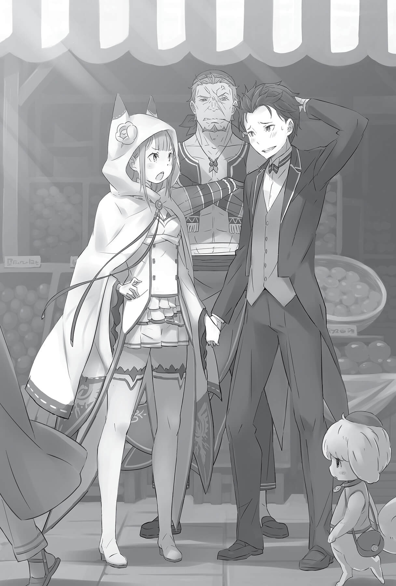
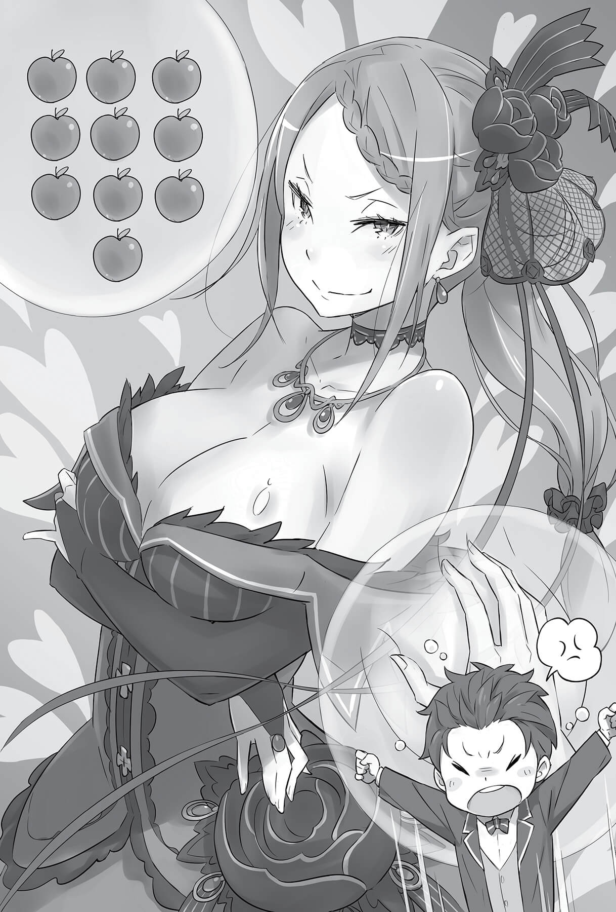

## 1

Сердце Субару Нацуки билось так отчаянно, что быстрее, казалось, и невозможно.

— Послушай, Эмилия-тан! Я знаю, ситуация довольно запутанная, но давай всё же не будем так делать, — попросил он с заискивающей улыбкой, чувствуя, как по лицу стекает холодный пот. — Я про это, — добавил он, подняв руку, которую девушка крепко сжимала в своей.

Они уже находились в столице. На шумной торговой улочке царило оживление. Крепко держась за руки в бурлящей толпе, со стороны они наверняка выглядели дружной парочкой. Правда, только в том случае, если не прислушиваться к их разговору.

— Категорически нет! Стоит на секунду отвлечься, как ты ввязываешься в очередную историю! Пока мы в столице, я не разрешаю тебе ходить в одиночку! Ты понял меня?

— Я очень сожалею о своём глупом поведении в пути! Но не надо со мной обращаться как с неразумным ребёнком!

Эмилия смерила юношу строгим взглядом, явно не доверяя его словам. Несмотря на то что он сам спровоцировал подобное отношение к себе, Субару счёл, что это уж слишком.

Очнувшись после истории, чуть не закончившейся падением с экипажа на полном ходу, он с ужасом обнаружил, что лежит головой на коленях у Розвааля. Небольшое совещание закончилось тем, что было принято решение не сводить с него глаз всё время пребывания в столице. И теперь Субару с Эмилией стояли посреди толпы, взявшись за руки.

— Я признаю, что действовал опрометчиво… но давай хоть не будем держаться за руки.

— Ты сам себе противоречишь. Тогда в деревне, на «свидании», ты всё время просил позволения взять меня за руку.

— Тогда я физически и психологически был готов к этому, но сейчас-то всё по-другому. У меня даже ладони вспотели!

Субару нервничал и опасался, что его руки потные, а Эмилия выглядела совершенно спокойной, отчего волнение юноши только усиливалось.

— Хватит уже миловаться напротив моей лавки!

Окрик со стороны мужчины весьма грозного вида заставил Эмилию испуганно вздрогнуть. Субару прекрасно понимал её чувства, потому что владелец лавки, лицо которого пересекали шрамы, вовсе не выглядел добропорядочным горожанином.

— Вы мне только клиентов распугиваете. Если ничего не покупаете, валите отсюда подобру-поздорову!

— Как можно быть настолько бессердечным! Я так старался выполнить данное обещание, но, выходит, про меня начисто забыли! Да вы хоть понимаете, какой это удар? Я прямо готов разрыдаться!

Не впечатлившись притворным отчаянием Субару, хозяин опёрся обоими локтями на прилавок и бесцеремонно фыркнул.

«Как можно работать с посетителями, когда ты такой бездушный человек? Этот мужик явно ошибся с выбором профессии», — подумал про себя Субару.

На лотках лавочки с броской вывеской «Кадомон» были рядами выложены разноцветные фрукты. Этот ларёк имел для Субару очень большое значение.

— Вы же первый, с кем я встретился в этом мире! Я пришёл выразить свою признательность, но вынужден терпеть такое отношение!

— Преувеличиваешь, парень. Что-то такое смутно припоминаю… Кажется, с месяц назад мы перекинулись парой фраз? Всего-то…

— Субару, перестань ставить человека в неловкое положение! Не обращайте на него внимания, пожалуйста.

Видя, как растерялся лавочник в попытках хоть что-то припомнить, Эмилия поклонилась и дёрнула юношу за ухо, заставляя его также склонить голову. Субару вскрикнул: «Ой, больно-больно!» — за что удостоился ещё одного строгого взгляда.

— Мы приехали сюда, чтобы ты поблагодарил тех, кто помог тебе в столице. Но, оказывается, ты всё это просто выдумал?! Поверить не могу!

— Эмилия-тан, нельзя с пренебрежением относиться к обещаниям, которые мужчины дают друг другу!

— Субару, довольно! Ты представляешь, сколько людей проходит перед хозяином этого магазина за день?

— Эмилия-тан, согласись, разочаровываться в людях — это так больно! Думаешь, в лавку человека с такой жуткой физиономией народ валом валит? Ой, больно-больно, простите меня!

Эмилия ещё сильнее сжала его ухо, отчего на глазах Субару выступили слёзы. Наблюдавший за этой сценкой хозяин при виде почти плачущего парня хлопнул в ладоши и сказал:

— А вот теперь, глядя на твою несчастную рожу, я вспомнил. У тебя же тогда в кармане ни гроша не было. Так и ушёл, ничего не купив!

— Неважно, почему вы вспомнили, я же говорил, когда-нибудь точно что-то куплю!

— Теперь ясно. Значит, ты — парень, верный своему слову. Мне это нравится, — хозяин лавочки довольно рассмеялся, притащил из глубины магазинчика деревянный ящик и с глухим стуком поставил его на прилавок. Ящик был полон красных наливных плодов.

— Вот те самые аблоки, которые ты обещал купить. Сколько штук берёшь? Одно стоит две медные монеты.

— Ну, таких крупных штук десять возьму. Гораздо больше, чем обещал!

Услышав это, хозяин радостно хлопнул в ладоши. Субару полез за деньгами, но увидел, что Эмилия делает то же самое.

— Эмилия-тан, зачем ты вытаскиваешь кошелёк?

— Как же заплатить, не вытащив кошелька?

— Как-то странно, что ты собираешься платить за меня… Эй, дядя, почему вы на меня так смотрите?

— Помнится, ты сказал, что придёшь за покупками, когда заработаешь денег. А ты привёл барышню, чтобы она заплатила? Такое я не одобряю!

— Вы что, не слышали, о чём мы только что спорили? Я же сказал, что расплачусь сам! — Субару поспешно схватился за кошелёк в ответ на подозрительный взгляд хозяина.

В кошельке лежало жалование за работу в усадьбе. Благодаря щедрости Розвааля у Субару было достаточно денег.

— Одно аблоко стоит две медные монеты, выходит, две серебряные за десяток?

— Эй, парень, ты чего — не знаешь обменного курса? Сейчас одна серебряная монета стоит девять медных.

— Значит, я должен вам две серебряные и две медные? Вот, держите.

Он поспешно вытащил деньги из кожаного кошелька-мешочка и передал хозяину. Тот замолчал в изумлении, а затем покачал головой и тяжело вздохнул. Субару смотрел на него, не понимая, что происходит.

— Слушай, парень, разве можно верить всему, что говорят незнакомцы?! Сегодняшний курс написан на вывеске рядом со входом на рынок. А ты пришёл сюда, даже не взглянув на неё! Тебя же любой нечистый на руку продавец облапошит!

По неодобрительному выражению лица хозяина можно было подумать, что он имеет дело с каким-то скользким типом, а не с простодушным дурачком. Вероятно, Субару и правда слишком верил людям, ведь в своём мире он платил в магазине ровно столько, сколько ему говорили.

В деревне возле поместья все друг друга знали, поэтому, наверное, мысль обсчитать покупателя никому не приходила в голову. Но в таком большом городе, как столица, определённо было немало проходимцев.

— А вы всё же славный малый! — сказал с улыбкой Субару.

— Тебе просто повезло. Мне было бы стыдно, если бы покупателя, который проделал дальний путь, чтобы выполнить обещание, где-нибудь обобрали до нитки. Понял?

— Понял. Вы только с виду вредный, а на самом деле — с золотым сердцем. Цундэрэ[^2], чего тут не понять!

— Давай поторапливайся и забирай свои фрукты! Спасибо за покупку!

Первая фраза прозвучала грубовато, а вторая ровно так, как и полагается при обслуживании покупателя. Не сумев сдержать улыбки от резкого контраста, Субару забрал бумажный кулёк с аблоками, взял Эмилию за руку и двинулся прочь.

— Спасибо, дядя! Надеюсь, ещё встретимся.

— Буду рад, если придёшь за покупками. А вам, барышня, следует выбирать себе спутников получше!

— Не вашего ума дело! — выкрикнул на прощание Субару, вместе с Эмилией углубляясь в толпу. Они уходили всё дальше от лавочки чрезмерно добродушного хозяина, пока та не скрылась из виду.

— Хорошо, что он тебя вспомнил. Но вначале я даже растерялась.

— Рожа у него, конечно, страшноватая, но привыкнуть можно…

— Да нет, я не об этом, Субару. Ты невероятно быстро считаешь. Просто огорошил меня.

— «Огорошил»? Да кто же так говорит в наши дни?!

По обыкновению поддразнив Эмилию, которая использовала вышедшие из употребления слова, Субару всё же обрадовался похвале. Несмотря на своё легкомыслие, он довольно бойко считал в уме.

Да, я неплохо считаю. Выходит, Эмилия-тан, ты любишь интеллектуалов?

— Интел… лект?.. Не знаю, что ты имеешь в виду, но я удивилась не только поэтому. Хм, всё же такое занятное совпадение! Хи-хи!

— Какая ты милая. А что за совпадение?

— Это секрет. Между мною и дочерью хозяина. Итак, что дальше?

Субару, кажется, начал смутно догадываться, о чём идёт речь, но решил не доставать Эмилию расспросами и перехватил поудобнее кулёк с аблоками. Столица была слишком большим городом, чтобы праздно бродить по ней.

Сегодняшняя цель — обойти всех, кому он был чем-то обязан в самый первый день, когда оказался в этом мире. К продавцу из фруктовой лавки они зашли, теперь требовалось выполнить следующую задачу.

— Очередная цель… Это Фельт и дед Ром. Когда я вырубился, их забрал Райнхард, верно?

— Да. Сначала всё шло к тому, чтобы попросту отпустить их… Но Райнхард вдруг переменился в лице и увёл девочку с собой.

— Похоже на похищение. Хотя такое не заподозришь, зная, кто у нас в роли «преступника». Чёрт, везёт же красавчикам!

Вспомнив молодого человека с огненно-красными волосами, Субару непроизвольно прищёлкнул языком. Эмилия, наблюдавшая за ним, приложила палец к губам и задумчиво опустила голову.

— Чтобы найти Райнхарда, заглянем в кордегардию городской стражи, которая напротив квартала знати. Туда, где располагалось то самое здание… Хотя сейчас там просто гора кирпичей.

Субару согласился. Когда они в первый раз встретились с Райнхардом, тот обходил город, да и говорил о себе как об одном из стражников. Вероятно, он занимает какой-то высокий пост — может быть, рыцарь?

— Значит, с планом мы определились. Идём к кордегардии, чтобы выяснить, как связаться с Райнхардом. Ну, в путь. Ой!..

— Что? Что случилось?

— Я просто посчитал, сколько аблок в кульке. Одиннадцать штук!

В кульке и правда оказалось одиннадцать больших и спелых красных плодов. Вряд ли хозяин лавки просто ошибся.

— Выходит, тот дядя — и правда славный малый!

Вспомнив лицо неприветливого продавца, Субару от удовольствия не смог сдержать улыбки.

Всё же исполнять данные обещания — это правильное дело.

## 2

— А как мы свяжемся с ним из кордегардии? У вас ведь нет телефонов? — озадаченно спросил Субару по пути к посту.

— Теле… фонов?.. — удивлённо переспросила Эмилия, услышав незнакомое слово.

— Это такая штука для связи с человеком, который находится далеко от тебя.

— Мития? Да, я думаю, там есть Зеркало беседы.

— Зеркало беседы?

— Это мития, при помощи которой два человека, у которых есть зеркала, могут беседовать друг с другом. Их находят довольно много, и они используются в разных местах.

— Ясно. Значит, тут всё же есть средства связи. «Зеркало» звучит действительно волшебно!

Субару подумал, что ещё ни разу не видел настоящей митии. И само это слово всплыло в разговоре всего лишь раз, когда в ломбарде деда Рома он пытался выдать за митию свой телефон.

— В любом случае, если удастся переговорить с Райнхардом с помощью этой штуки, все проблемы будут решены. Теперь наша цель ясна.

— Точно. Но если мы не поторопимся, Рем будет ворчать.

Рем тоже хотела бы сопровождать Субару в его прогулке по столице. Однако на ней лежала масса профессиональных обязанностей, и она была вынуждена уступить эту миссию Эмилии. Наверняка сейчас она не находила себе места от досады.

— Конечно, мне жаль Рем, но благодаря её отсутствию я получил особую привилегию.

— А?.. Что ты сейчас сказал?

— Ничего особенного. Я вроде бы перестал стесняться того, что мы ходим, взявшись за руки. Послушай, Эмилия-тан, по поводу завтрашнего собрания насчёт королевских выборов…

Увидев, что Эмилия спокойна и расслабленна, Субару решил невзначай завести разговор на тему, которая не давала ему покоя. Он рассчитывал, что её благодушный настрой поможет в этом деле. Однако, едва услышав слово «выборы», Эмилия изменилась в лице, и взгляд её фиалковых глаз, обращённый на Субару, наполнился печалью.

Тем утром, когда приезжал посланник из столицы, и несколько раз позже Субару пытался завязать разговор на эту тему, но Эмилия была непреклонна. И даже в столице она не изменила своего решения.

— Сколько ещё повторять? Я взяла тебя с собой, чтобы ты выполнил данные обещания и подлечился. Обо мне, пожалуйста, не беспокойся.

— Разве я так могу? Вот же, я здесь и даже держу тебя за руку… Как тут не беспокоиться?!

Субару замедлил шаг и остановил Эмилию, которая решительно шагала вперёд. Прядь спрятанных под капюшоном серебристых волос упала на её щёку, и юноше на мгновение показалось, будто это слёзы.

— Я хочу быть полезным для тебя. Если возникнут проблемы, я помогу. Так уже было раньше… и так будет всегда.

Субару, готовый на всё ради Эмилии, открыл ей свои чувства.

— Почему?

— Что?..

— Почему ты это делаешь? Я не понимаю.

Судя по растерянности во взгляде, девушка была озадачена признанием и неожиданной клятвой преданности. Субару чувствовал, как она всё сильнее сжимает его руку, будто пытаясь отыскать ответ, но слова застряли в горле, не найдя выхода.

— Потому что… Потому что…

Он понимал, что именно должен сказать, однако от неожиданности лишился присутствия духа. Эмилия ждала, но Субару так и не выдавил из себя ни слова.

— Пойдём. Нужно поторопиться, чтобы успеть до заката. — Пауза так затянулась, что терпение Эмилии иссякло. Она двинулась вперёд, и Субару послушно поплёлся следом, кусая губы от досады.

Он ненавидел себя за то, что потерял дар речи и не сказал этой изящной, хрупкой девушке главных слов.

Он ненавидел себя за слабость, за то, что бесполезен для девушки, спасшей его жизнь и его душу; девушки, при мысли о которой становилось так тепло на сердце.

*— Наверное, лучше оставить всё как есть, Субару.*

Юноша чуть не подпрыгнул, когда, коря и ругая себя за нерешительность, вдруг услышал этот голос. Шёпот прозвучал будто бы прямо в его голове.

— Что?!

*— Это я. Я напрямую говорю с твоим сердцем. Можешь не беспокоиться, Эмилия меня не слышит.*

Такой метод общения казался невероятным, но этот голос Субару уже где-то слышал. Пак! Дух в облике кота, заключивший сделку с Эмилией и сопровождающий её повсюду.

Внезапный сеанс телепатии сильно впечатлил юношу.

*— А что, ты тоже меня слышишь?!*

*— Быстро соображаешь! Поначалу это получается не очень, но с тобой контакт удался на удивление легко. Наверное, у тебя хорошая совместимость с Духами. Поэтому и Бетти к тебе так привязалась.*

Уверенная интонация Пака, который, по всей видимости, прекрасно разбирался в ситуации, вызвала у Субару печаль и раздражение. Юноша чувствовал, что он один остаётся в неведении, и это не на шутку мучило его.

*— Не переживай, Лия не разочаруется в тебе из-за сегодняшнего разговора.*

*— Не врёшь? Откуда тебе знать?*

— *Знаю, и всё тут. Про Лию я всё знаю и всё понимаю, *— Пак явно не собирался вдаваться в подробности, но в голосе звучали тёплые отеческие нотки.

Впрочем, в отношении Субару слова Пака произвели обратный эффект — он всё больше и больше страдал от своей беспомощности.

Если подумать, Субару действительно ничего не знал об Эмилии. Ему было известно лишь то, что она красавица и полуэльфийка по происхождению. Кроме того, она являлась кандидаткой на трон Лугуники и жила под защитой своего опекуна Розвааля.

Девушка оказалась честной и прямой, всегда старалась выглядеть сильнее, чем являлась на самом деле, а ещё была очень добра к другим и помогала им, не жалея себя. Несмотря на отзывчивый характер, Эмилия имела немало слабых сторон, и её было нетрудно обмануть.

Субару знал лишь внешнюю сторону её характера. Но о том, что творится внутри и почему Эмилия стремится стать королевой, он не имел ни малейшего представления.

*— Вкладывать во что-то всю душу нелегко, верно? — *заметил Пак.

Несмотря на то что Субару держал рот на замке, он не мог перестать думать и, соответственно, скрыть свои мысли от Пака.

*— Послушай, Субару.*

Юноша не хотел ощущать себя жалким и не желал показывать чувства. Однако он не мог заглушить слова, звучащие в сердце, и Пак заговорил снова.

*— Не старайся нас слишком обнадёживать. Ни меня, ни Лию.*

*— Что?*

*— Надежда — это сладкий яд. Даже если понимаешь, что рано или поздно он убьёт тебя, очень сложно сдержаться и не вкусить его. А ведь ты — взаправду яд!*

Пак всегда казался Субару невозмутимым, безмятежным созданием, и теперь его слова совершенно разрушили прежнее впечатление и явились настоящим ударом для юноши.

*— В каком это смысле?*

Но прежде чем он получил разъяснения, прозвучали слова Эмилии.

— Мы на месте, — сказала она и резко остановилась. Субару чуть не врезался в неё по инерции, притормозив в последний момент. Он поднял голову и с запозданием понял смысл слов «квартал знати».

Квартал разительно отличался от торговых улиц и трущоб; было видно, что сюда вложили массу денег. И здания, и дороги, и ограды, и даже высаженные на улицах растения, радовавшие глаз, говорили об этом. Как можно было понять из названия, в этом квартале обитали представители высшего общества. Здание, перед которым они остановились, перегораживало улицу поперёк, словно отделяя квартал от внешнего мира.

Грубая кирпичная постройка, внешним видом напоминающая тюрьму, не вписывалась в роскошь элитного района. К фасаду здания с двух сторон примыкали толстые стены, а сверху располагалась площадка, с которой, наверное, открывался отличный вид на город. Однако было очевидно, что соорудили эту конструкцию не для любования видами, а чтобы следить за порядком в округе.

— Это пост, с которого королевская стража наблюдает за столицей. И ещё они проверяют документы у всех, кто приходит в квартал знати.

— Похоже на контрольно-пропускной пункт или заставу. То есть с этими целями его и построили?

Признавая, что подобные организации необходимы для поддержания порядка, Субару всё же недолюбливал официальные учреждения и откровенно робел перед полицейскими участками.

Пока он в нерешительности топтался на месте, Эмилия направилась прямо к кордегардии. Учтя, по всей видимости, окружающую обстановку, она отпустила его руку, и Субару пожалел об этом, чувствуя, как исчезает тепло её ладони.

Эмилия уже собралась постучать, но дверь отворилась сама, и оттуда выглянул молодой человек.

— О, какая неожиданная встреча! Давненько не виделись, госпожа Эмилия. Надеюсь, у вас всё в порядке.

Молодой человек учтиво поклонился, узнав Эмилию несмотря на капюшон, надвинутый до самых глаз. В Субару закрались подозрения, сама же девушка невозмутимо кивнула в ответ.

— Спасибо, всё по-прежнему. Похоже, Юлиус, у тебя тоже дела обстоят неплохо.

— Я польщён тем, что вы помните меня! Ваша красота, госпожа Эмилия, расцвела ещё ярче!

Комплимент, который сделал юноша, названный Юлиусом, показался Субару претенциозным. Фиолетовые волосы нового знакомца были аккуратно уложены, ростом он оказался сантиметров на десять выше Субару — примерно сто восемьдесят. Несмотря на субтильное телосложение, он не выглядел тщедушно, а был, скорее, изящным. Правильные черты лица и глаза цвета янтаря, по которым наверняка вздыхали девушки, делали его настоящим красавчиком.

— Для меня тоже большая неожиданность встретить в кордегардии королевского гвардейца.

В самом деле на юноше была военная форма с яркой оторочкой и эмблемой на рукаве в виде дракона, а на боку висел тонкий меч наподобие рапиры. Весь его внешний вид красноречиво говорил о занимаемой должности.

— Я прибыл выразить благодарность стражникам и заодно проинспектировать квартал. Меня попросил об этом один из товарищей. Полагаю, порой следует ставить дружбу на первое место. И сегодня я вознаграждён с лихвой, ведь моим глазам предстал столь прекрасный цветок!

С этими словами Юлиус привычным жестом опустился на одно колено, взял белую руку Эмилии и чуть коснулся её губами.

Юноша ошарашенно наблюдал за происходящим, но вскоре всё внутри него закипело. Он уже был готов наброситься на Юлиуса, чтобы прекратить это безобразие, но Эмилия вовремя остановила Субару свободной рукой.

— Спасибо, Юлиус. Извини за неожиданную просьбу, но у меня здесь кое-какие дела. Ты не мог бы выступить в роли посредника?

— Эти дела связаны с молодым человеком? — Юлиус посмотрел на Субару.

Тому оценивающий взгляд пришёлся не по душе, и он с вызовом посмотрел в ответ. Юлиус продолжил, немного понизив голос:

— Его манеры и наряд совершенно не соответствуют этому месту. Вряд ли подобный облик допустим для первого знакомства.

— Благодарю за предупреждение. Я тоже хотел бы посоветовать вам кое-что. Не стоит в таком костюмчике есть лапшу-удон с карри, пятна от бульона будут сразу бросаться в глаза.

— Спасибо. Если доведётся отведать это блюдо, чем бы оно ни являлось, обязательно приму к сведению вашу рекомендацию.

Они обменялись улыбками, которые вряд ли можно было назвать дружелюбными, и Субару понял, что поладить с этим парнем будет непросто. Наверное, Юлиус подумал то же самое. Отвернувшись от Субару, он продолжил беседу с Эмилией:

— Итак, я провожу вас к Зеркалам беседы. Мне очень неловко, что приходится вести вас, госпожа Эмилия, в такое неприглядное место.

— Не стоит переживать, я полагаюсь на тебя.

— Хорошо, тогда прошу внутрь.

Юлиус пригласил Эмилию последовать за ним и скрылся за дверью. Фыркнув, Субару хотел было войти, но в этот момент Эмилия резко обернулась, преградив ему путь.

— Подожди меня здесь.

— Что?

В ответ на его удивлённый взгляд Эмилия, взмахнув длинными ресницами, опустила глаза.

— Я не против, чтобы ты пошёл со мной, но вряд ли это понравится Юлиусу.

— Выходит, на первом месте его интересы, а не мои? А этот тип особенно не церемонился!

— Дело в другом. Понравится это Юлиусу или нет, мне безразлично. Я просто не хочу, чтобы у тебя снова были неприятности. Пожалуйста, просто послушайся.

— Если дело в неприятностях, то я к ним привык. А этот тип посмел нагло облизывать твою драгоценную руку!

Субару с первого взгляда невзлюбил Юлиуса и расценил его действия как домогательство. Естественно, он не хотел, чтобы Эмилия продолжала общаться с красавчиком, — юношу мучила примитивная ревность.

— Я постараюсь не слишком задерживаться, подожди меня здесь. Хорошо?

Несмотря на мягкую интонацию, слова прозвучали как непререкаемый приказ. Эмилия была вполне последовательна, отстраняя Субару от всего, что касалось её дел. Юноша покорно промолчал, боясь рассердить Эмилию своим упорством.

— Как я жалок!..

Слова, которые он прошептал, бессильно ударились о закрытую дверь, отделившую его от Эмилии. Пнув ботинком попавшийся камень, Субару отошёл подальше от входа в кордегардию, чтобы дожидаться там. Отбросив грустные мысли о собственном ничтожестве, он переключился на того неприятного парня.

— Кажется, он сказал что-то о гвардии…

Насколько Субару понял, Юлиус являлся рыцарем королевской гвардии. Слово «гвардия» подразумевало, что этот отряд находится на особом положении. По идее, он должен подчиняться непосредственно королю… Но что же происходит сейчас, когда престол пустует?

— Может, когда вся королевская семья погибла от неизвестной болезни, ответственность за это свалили на королевских гвардейцев, которые не смогли предотвратить трагедию? Не удивлюсь, если их дома были уничтожены, а сами они оказались бродягами… Нет, стоп! Всех жалко, пусть только этот мерзкий тип хлебнёт лиха…

Осознав, что получает определённое удовольствие от мрачной фантазии, Субару задумался, в кого же он уродился таким жалким и злопамятным?

Случись подобное чуть раньше, он бы, не стесняясь в выражениях, высказал недовольство вслух, выплеснул раздражение, невзирая на мнение других людей. Однако теперь Субару поступил иначе. Оказавшись в этом мире, юноша стал задумываться, как он выглядит в глазах окружающих.

Находясь в обществе столь честной и прямолинейной девушки, Субару хотел жить так, чтобы не пришлось стыдиться перед ней. Возможно, захватившее его чувство, которое он едва ли мог выразить словами, понемногу меняло юношу? Ответа на этот вопрос он не знал.

— Хм?..

Что-то нарушило глубокую задумчивость Субару, и он нахмурился. Неподалёку происходило нечто необычное. Его рассеянный взгляд на короткое мгновение остановился на улице, что вела к рынку, и в последний момент поймал исчезающую за углом фигурку в вызывающе ярком облачении.

Огненно-красное платье словно отпечаталось на сетчатке его глаз. Впрочем, если бы человек просто переходил улицу, вряд ли Субару обратил бы на это внимание. Девушку в красном вели в тёмный переулок какие-то парни потрёпанного вида.

— Неужели… то, о чём я думаю?

Дерзкое преступление прямо под носом у стражников?!

Этот угол, если смотреть со стороны кордегардии, находился в слепой зоне, и Субару, машинально устроившийся в узком промежутке между соседними зданиями, стал свидетелем по чистой случайности.

— Какая, оказывается, полезная привычка — прятаться в укромный уголок, чтобы обдумать свои дела. Нужно срочно звать стражу…

Субару хотел было броситься за помощью, но вдруг засомневался. А действительно ли он стал свидетелем преступления? Вполне возможно, он неверно истолковал ситуацию. Более того, юноша сильно злился на королевских гвардейцев и не очень-то желал иметь с ними дело.

— Если я ошибся, то запросто создам Эмилии проблемы. Сначала нужно убедиться, что это и вправду преступление.

Уговорив самого себя, Субару бросил взгляд на кордегардию, а затем побежал к переулку. Он чувствовал себя виноватым, ведь нарушил данное Эмилии слово дождаться её, но чувство справедливости и неприязнь к Юлиусу подталкивали его в спину.

— Эй ты, чёртова девка! Издеваешься над нами, что ли?!

Услышав возглас, Субару убедился в своей правоте и побежал ещё быстрее.

## 3

— Шутить вздумала, наглая девица?.. Сейчас разукрасим твоё милое личико!

— Зачем поднимаете столько шума, плебеи? Бескультурные типы вроде вас даже не в состоянии найти убедительную причину для ссоры!

До Субару донеслись голоса спорящих. В узком проулке стояла девушка, окружённая тремя типами, которые отрезали ей пути к бегству. Но юношу поразило вовсе не то, что городская шпана цепляется к девушке, а её внешность, которая никак не сочеталась с атмосферой этого грязного закоулка.

Ярко-оранжевые подколотые волосы, словно освещённые лучами солнца, рассыпались по спине. Алое как кровь платье эффектно подчёркивало изящную фигуру. Украшения на шее, в ушах и на пальцах — наивысшей пробы. Это было понятно даже неспециалисту. С точки зрения Субару, весь её наряд словно кричал: «У меня в сто раз больше денег, чем у тебя!»

Впрочем, даже это платье и украшения меркли в сравнении с её природной красотой. Миндалевидные красные глаза глядели с вызовом, а бледно-розовые губы выделялись на белой, словно нетронутый первый снег, коже. Не всякий художник в состоянии передать такое великолепие, даже потратив на это всю свою жизнь! Субару в очередной раз поразился, в какой же необыкновенный мир он попал.

Окружившие красавицу оборванцы продолжали выкрикивать оскорбления, но девушка лишь скрестила руки на груди таким образом, что её и без того пышный бюст приподнялся ещё выше, и бесстрашно смотрела на обидчиков. Было очевидно, что подобное поведение ещё больше их провоцирует, и Субару не мог оставаться в стороне.

— Привет! Извини, что заставил ждать, дорогая!

Быстро подняв руку, Субару проскользнул в самый центр компании. Удивлённые внезапным вторжением парни и девушка уставились на него, а он сложил ладони, словно извиняясь, и обратился к босякам:

— Кажется, тут вышло какое-то недоразумение. Прошу нас извинить. Думаю, вы уже поняли по её внешнему виду, что у этой малышки не всё в порядке с головой. Понимаете, о чём я?

Разгуливать по переулкам далеко не безопасного города в таком шикарном наряде — это всё равно что открытым текстом заявить: «Вот они, мои побрякушки, пожалуйста, ограбьте меня скорее!» Такую беспечность можно списать лишь на невменяемость. Пока сбитые с толку бодрым выступлением Субару парни молчали, он схватил красотку за руку и добавил:

— Ну, нам пора!

— Что?

— Послушай, милая, довольно беспокоить этих добрых горожан. Мы же собирались провести время вдвоём, кормить друг друга сладостями с ложечки…

Субару импровизировал, сделав незнакомку героиней своих фантазий; он уже нацелился смыться с места событий, однако…

— О?..

— Не смей прикасаться ко мне!

Девушка перехватила его запястье свободной рукой и, резко развернувшись, толкнула Субару. От неожиданности он разжал пальцы и ударился лицом об стену.

— Клиффхангер!..

— Вечно одна и та же история! Стоит мне только из дома выйти, сразу же со всех сторон, захлёбываясь слюной, сбегаются простолюдины! — девушка поглядела сверху вниз на Субару, он лежал на земле, прижав к лицу ладони.

Возмущённый таким отношением, юноша вскочил на ноги и накинулся на незнакомку:

— Слушай, ты хоть врубаешься, что здесь происходит?! Это же традиционный сюжет: герой спасает девушку от шпаны! Неужели не ясно?!

— Не понимаю, о чём ты говоришь. Я делаю то, что хочу.

— Девушка, которая швыряет тебя лицом в стенку при первой же встрече! Пожалуй, хуже варианта и не придумаешь!

Он пытается помочь, а она не только не понимает этого, но ещё и смеет обращаться с ним как с похотливым приставалой. Боль и стыд оказались ещё горше, когда Субару вспомнил, как собирал всё своё мужество, чтобы помочь. Подумав, что со стороны наверняка выглядел весьма нелепо, Субару перевёл глаза на парней, которые смотрели на него с некоторым сочувствием.

— О, а ведь знакомые всё лица!

Одолеваемый мрачным предчувствием, Субару покачал головой. Он сравнил физиономии хулиганов с теми лицами, что отпечатались в памяти, и хлопнул в ладоши:

— Ага, вы же Без, Моз и Гов! Неужели в столице никакой другой шпаны нет?

Это была та самая придурковатая троица, с которой он столкнулся в первый свой день в альтернативном мире. Разумеется, Субару запомнил тех, кто однажды лишил его жизни, и сразу понял, что терять бдительность нельзя.

— Ох, у меня уже нет никаких сил с вами связываться! Вы что, правда этим на жизнь зарабатываете? — устало проговорил он.

Увидев, что Субару не собирается немедленно лезть в драку, оборванцы принялись совещаться:

— Припёрся, встрял не в своё дело, получил по лбу, а теперь какую-то чушь несёт. Дурачок, что ли?

— Эй, не хочу с ним связываться. Давай ты.

— Я тоже не хочу. Если слегка вмазать, может, сам свалит?

Шпана явно потеряла боевой настрой, и девушка, молча наблюдавшая за происходящим, заговорила:

— О чём вы там треплетесь, словно девчонки? Если такие нежные, одевайтесь соответственно. Натяните на свои мускулы и волосатые руки дамское тряпьё. Вам пойдёт!

С губ девушки, которые она жеманно прикрыла пальцами, щедро сыпались оскорбления и насмешки. На мгновенье хулиганы замерли, не понимая, о чём идёт речь, а потом с запоздалым возмущением завопили все разом:

— Так ты глумиться вздумала, мерзавка?!

— Сейчас мы тебе покажем, кто тут баба!

— Язык как помело! Что себе позволяет!

— Вообще обнаглела! Сейчас узнаешь, что мы настоящие парни! Погодите-ка, что это я кричу вместе со шпаной?..

Банда сама не заметила, как увеличилась на одного подельника, а Субару искренне поразился, обнаружив, что переметнулся на другую сторону. Впрочем, если подумать было очевидно: скорее что-то не в порядке с девицей, затеявшей весь этот сыр-бор, нежели с ним.

— Ребята, понимаю ваши чувства, но совсем отступаться от изначальных целей не буду. Если ищете повод свалить на кого-то вину, то пеняйте лучше на себя, что связались со мной тогда — в самый первый день.

— Эта заносчивая девка — не твоя проблема! Куда ты лезешь, сопляк?!

Судя по всему, Субару не остался в их воспоминаниях. А ведь именно на этих хулиганов Эмилия насылала свою магию; именно они проиграли Субару в битве три на одного, а потом пырнули его ножом…

— А, точно! Ведь в нынешней версии мира ничего подобного не произошло! Если они что-то и помнят, то лишь эффектное появление прекрасного юноши, — пробормотал себе под нос Субару.

— Слушайте, я вспомнил! Это же малец из торгового квартала…

— Тот самый! Ненормальный! Опять какую-то чушь несёт!

— Точно! Наряд другой, вот я сразу и не признал.

Сначала его вспомнил Без, а затем по цепочке — Моз и Гов. Несмотря на не слишком-то приятные слова, Субару был рад, что задержался в их памяти, и хлопнул в ладоши:

— Отлично-отлично, рад, что вспомнили. Ну, раз уж мы знакомы, отпустите нас.

— Ты чего, идиот? Да мы не просто знакомы, мы с тобой враги! Только теперь встретились не трое на одного, а трое против двоих.

— Поправка. Не трое против двоих, а трое против одного и против одного.

— Слушай, не могла бы ты помолчать?

Несмотря на то что Субару пытался вытащить их обоих из этой заварухи, рыжая девица не желала замечать его усилий и продолжала стоять на своём. Если бы он только мог вернуться на пять минут назад и дать себе дружеский совет не лезть в это дело! Теперь, конечно, было уже поздно: он знал, что эти парни не отличаются терпением.

Увидев, как они набычились, Субару понял, что кровь прольётся неизбежно, это лишь вопрос времени.

— Ладно, ничего не поделаешь. Я не хотел использовать эту карту, но…

— Чего? Ты вообще соображаешь, чего происходит?! Что ты сделаешь?

— Сразу же скажу, что знаю господина Райнхарда. Мы с ним друзья. Если я попрошу, он примчится стрелой!

— Чего?!

Субару выложил свой козырь, словно лиса, позвавшая на помощь тигра. Услышав имя Райнхарда, банда испугалась. Без, Моз и Гов как один переменились в лице.

— Ну что, парни? Одно моё слово — и вам не поздоровится! А я это сделаю!

Увидев, что затея сработала, Субару стал вызывающе наступать на банду, всем своим видом показывая, что вот-вот позовёт подмогу.

— Н-нет, на сегодня, пожалуй, хватит.

— Только запомни: мы вовсе не проиграли!

— И совсем не испугались твоего Райнхарда!

Как и следовало ожидать, поджавшая хвосты банда быстро ретировалась, бросая через плечо ругательства и угрозы. Убедившись, что они скрылись из виду, Субару выдохнул.

Кажется, опасность миновала, и можно было расслабиться. Если бы теперь девушка хоть немного смягчилась…

— Что глядишь как попрошайка? Мне нечего дать такому простолюдину, как ты!

— Нечего?.. Ну, наверное, ты могла бы хоть поблагодарить за спасение…

— «Спасение»?!

Девушка с удивлением наклонила голову набок. Прикрыв глаза, она будто предалась размышлениям, а затем промолвила:

— Хочешь сказать, что разливался здесь соловьём, чтобы спасти меня? Хм, а я и не заметила!

— Что значит «не заметила»?! Как можно быть такой непонятливой?

— Ты заблуждаешься. Эта история изначально не представляла проблемы! Пытаться помочь, когда никакой опасности и нет, а потом этим гордиться — просто нелепо!

— Что-то я не понимаю, к чему ты клонишь? Хочешь сказать, такая сильная, что и одна, без моей помощи справилась бы? Что-то в этом роде?

— Нет. Всё ещё проще. Этот мир устроен так, чтобы мне было удобно. А значит, я никогда не окажусь в затруднительной ситуации. Я спасена благодаря самой себе. Не кажется ли тебе, что хвастаться несуществующим подвигом стыдно?

Девушка гордо выпятила грудь и лучилась сознанием собственной абсолютной правоты. Глядя в её горящие высокомерием глаза, Субару наконец-то всё понял. Если человек настолько не в себе, с ним категорически нельзя иметь никаких дел!

— А-а-а, вот оно что! Ну прости. Ещё раз извини, что помешал. До свидания.

В такой ситуации логичнее всего было ретироваться, отпустив на прощание пару примирительных фраз. Всем своим видом показывая, что не собирается оспаривать её утверждения, Субару кивнул и повернулся было, чтобы уйти…

— Стой!

Он молча проклял себя самого за то, что инстинктивно замер на месте, услышав резкий оклик.

— Что такое?

— Покажи, что у тебя в кульке.

Неохотно обернувшись, Субару увидел, как она движением головы указала на кулёк, что находился в его руках. Выполнять бесцеремонный приказ было обидно, но и препираться совершенно не хотелось. Субару развернул бумажный кулёк и продемонстрировал его содержимое — красные спелые плоды.

— Я не знаю, что это. Как называется этот фрукт?

— Это аблоки. Плоды мудрости. Неужели никогда не видела?

Она моргнула, а затем презрительно шмыгнула носом.

— Враньё, и даже не смешное! Аблоки — белого цвета. Они совершенно не такие, как эти красные штуки.

— Ну да, если очистить от кожуры, будут белые, — ответил Субару, пытаясь скрыть удивление.

Теперь уже на лице девушки появилось озадаченное выражение.

— Неужели ты никогда не видела нечищеных аблок?

— Угадал. Я видела этот фрукт только на столе. Ладно. Давай их сюда.

Кивнув в знак того, что юноша оказался прав, девица вдруг с таким видом потребовала отдать аблоки, словно любой её приказ должен беспрекословно выполняться.

Он бросился на помощь девушке, которую собирались ограбить, а теперь она же пытается обобрать его самого! Ситуация была поистине странной.

Субару почувствовал, что ему хочется поскорее встретиться с Эмилией. И ещё было бы очень неплохо поплакаться в жилетку Рем — она бы наверняка его утешила.

— Давай сюда. Я разрежу его пополам и проверю, что внутри. Посмотрим, не обманул ли ты меня.

— Только аккуратнее.

Поняв, что сопротивляться глупо, Субару достал из кулька аблоко и передал девушке. Она взяла плод в руки, слегка покатала в ладонях, словно проверяя, каков он на ощупь. Затем её левая ладонь стремительно мелькнула в воздухе, мгновенно разрубив аблоко на четыре части. Облизав сок с пальцев, она удовлетворённо посмотрела на белый срез.

— Кисло-сладкое. Это и правда аблоко. Ты спас себе жизнь.

— «Спас жизнь»?! Ладно, пусть так. Всё, довольна?

— Занятно. Давай сюда остальные, Я хочу проверить все.

— Что за чушь?!

Её повелительный тон и грубые манеры вывели Субару из себя.

— Я вовсе не был обязан давать тебе и одно аблоко, а теперь ты хочешь заполучить все?! Чтоб ты знала, для меня это не просто фрукты! Это знак мужской дружбы!

— Довольно болтовни. У меня есть предложение.

Указывая пальцем на кулёк, девушка мило улыбнулась уголками губ.

— Давай заключим пари.

— Пари?

— Очень простое пари. Например, подбросим монетку, нужно будет угадать, орёл или решка. За один проигрыш ты мне отдаёшь одно аблоко. Идёт?

Субару усмехнулся.

— Что за околесица! Какой мне смысл в этом участвовать? Я же ничего не выигрываю, в моих интересах просто поскорее слинять отсюда!

— Разумеется, у тебя тоже будет выигрыш. Например…

Размышляя, она дотронулась пальчиками до губ, а затем бросила взгляд на Субару и, скрестив руки под грудью, демонстративно выставила вперёд эффектный бюст.

— Если выиграешь, я позволю тебе потрогать мою грудь. Ну как?

Услышав, что девица предлагает себя в качестве ставки, Субару сделал глубокий вдох и помотал головой. Так легко поставить на кон собственное тело, не задумываясь о последствиях, мог только азартный игроман, готовый разрушить свою жизнь ради пагубной страсти. Видимо, она не сомневалась: перед такой красавицей не устоит ни один мужчина. Подобному ограниченному взгляду на мир можно было только посочувствовать…

Заметив, что Субару медлит с ответом, девушка подозрительно прищурилась.

Прямо ответив на её взгляд, Субару бросил в лицо незнакомке:

— Тебе стоит выше ценить себя. Что за чушь! Думаешь, меня так легко соблазнить?

*Спустя непродолжительное время.*

— Седьмая победа подряд. Осталось три аблока!

— Да что ж это такое… Хочешь окончательно обобрать меня?!

Отдавшись азартной игре, Субару терпел одно поражение за другим.

## 4

— Так-так, — с этими словами девушка выудила белыми пальцами ещё одно аблоко из кулька.

Теперь у Субару оставалось только два. Прошло всего лишь десять минут с начала игры, а он уже потерпел восемь поражений подряд и был в паре шагов от того, чтобы потерять всё.

— Ты должен осознать тщетность своих жалких попыток. Я нахожусь на вершине пирамиды, а такие, как ты, барахтаются на самом дне!

— Эй-эй, не кажется, что ты перегибаешь палку? Я просто проиграл пари, с чего это я теперь в основании пирамиды? Да, моя гордость задета, и будет депрессия после такого разгрома… Но это не значит, что я барахтаюсь на дне!

— Не переживай! В этом мире есть только я и те, кто ниже меня.

Конечно, Субару очень хотелось опровергнуть сомнительное утверждение, но это были бы слова жалкого неудачника, досадующего на своё поражение.

— Итак, что дальше? Если больше не хочешь доверять свою судьбу орлу и решке, можем сыграть во что-нибудь другое.

— Ну, ты сама предложила. Перед смертью не надышишься, конечно, но почему бы нам не сыграть в «камень-ножницы-бумага»?

— «Камень-ножницы-бумага»?..

Услышав незнакомое название, девушка нахмурилась, а перед Субару забрезжил лучик надежды.

— Эта игра определяет победителя. Участники произносят считалочку, а затем выбрасывают фигуры, сложенные из пальцев, и более сильная побеждает. Фигур всего три: «камень», «ножницы» и «бумага». Камень затупляет ножницы, ножницы разрезают бумагу, а бумага оборачивает камень. Всё понятно?

— Да. Какая интересная игра. А что за считалочка?

— «Камень-ножницы-бумага: раз, два, три!» И на счёт «три» нужно выбросить свою фигуру. Если они совпадут, засчитывается ничья, и начинается следующий раунд.

— И это всё? Хорошо, поняла. Я выброшу «бумагу».

— Ты уже пытаешься меня обставить?!

Субару пробрала дрожь от того, как быстро его соперница ухватила суть. Она тут же смекнула, что к чему, и манипулировала юношей, готовая одержать победу. Наверное, такое поведение заслуживало похвалы…

— Итак, начнём! Камень-ножницы-бумага…

— Стой, стой! Я пока не решил, что выбрасывать.

Субару разволновался от того, как умело она перехватила инициативу. Так и не сделав выбор, Субару поднял руку. На счёт «три» девушка, как и обещала, выкинула «бумагу». У Субару оказался «камень».

— Кажется, несмотря на все отговорки, тебе нестерпимо хочется отдать мне все аблоки!

— Ничего подобного! Просто, по статистике, человек бессознательно выбрасывает именно тот вариант, который считает неправильным! Вот я идиот!

Субару сгубил его же замысел, он будто подпилил сук, на котором сидел, и был вынужден передать аблоко победительнице.

Теперь у него осталось всего одно аблоко.

— Ну что ж, заключительный раунд.

— Может, пожалеешь и оставишь мне хоть последнее?

— Все твои аблоки должны стать моими. Если я оставлю даже одно, это будет означать, что я не получила желаемого. Всё или ничего! Предлагаю поставить на кон все аблоки, которые есть у каждого.

Она сказала «все», значит, её ставка составляла девять аблок!

«Всё или ничего» — то самое деструктивное мышление заядлого игрока.

— Ещё раз сыграем в «камень-ножницы-бумага»?

— Я уже всё решила. Тебе остаётся лишь выбрать способ, которым ты передашь мне последнее аблоко.

Девушка не сомневалась в собственной победе и не собиралась давать поблажек Субару. Пришло время решиться. Решиться на нехороший поступок. Поступок, достойный порицания…

— Камень-ножницы-бумага… — выкрикнули они хором, и в тот момент, когда каждый выбросил руку вперёд, в мире воцарилось молчание. В красных глазах девушки, сжимавшей кулак, промелькнуло недоумение.

— Что… что это такое?!

— Всякий, кто услышит, удивится, всякий, кто увидит, поразится! Узрите смертельный приём «КамНожБум»!

— Я спрашиваю, что это такое?! Ты мне об этом не говорил!

— Хватит ныть. Я не говорил, но ты бы могла спросить, а если не спросила, сама виновата! Вот эта часть — камень, тут ножницы, а вот здесь бумага! Выходит, я выбросил такую фигуру, которая победила твой камень.

— Если следовать этой логике, то часть твоей фигуры проигрывает моему камню.

— А-а-а! Ничего не слышу! Мой камень одержал верх силой ножниц и бумаги! Ура! — подняв над собой руку, сложенную в странную фигуру, Субару с пафосом провозгласил свою победу, одержанную с помощью запрещённого приёма.

Понимая, что несёт ерунду, Субару всё ещё надеялся замять эту историю с пари. Однако девушка, словно не обратив внимания на его попытки, глубоко вздохнула:

— Ясно. Значит, я и правда не предусмотрела такой вероятности. Отсутствие логики в этой игре действительно занятно. Хорошо, ты победил, можешь получить свой выигрыш.

Девушка решительно шагнула навстречу. Действия соперницы насторожили Субару, и он непроизвольно отступил назад.

— Только не говори, что… теперь, когда у тебя появилась возможность потрогать мою грудь, ты струсил?

— Что?.. О чём ты?! Кто тут с-с-струсил?..

— Какой-то странный парень… Хотя то, как ты испугался, выглядит довольно мило!

Субару сдрейфил, но гордость не позволяла девушке отступить. Она надвигалась, а он пятился, и в этот момент…

— Ну вот! Только этого не хватало! — Девушка отвела взгляд от Субару и посмотрела в сторону широкой улицы.

— Ого, кажется, сюда направляется целый отряд шпаны!

— И во главе те самые простолюдины, которые были здесь. Ну и ну! Примитивные глупцы!

— О чём они только думают? Ведь слышали же имя Райнхарда.

— Ты вёл себя слишком заносчиво, хвастаясь знакомством с Рыцарем из Рыцарей, и они решили, что ты лжёшь. Им нужно защитить свою репутацию, поэтому они собрали силы и решили отомстить. Всё очевидно.

— Чёрт! Сегодня и правда не мой день…

Начиная с падения с драконьей повозки и сложного разговора с Эмилией, неприятности сыпались на него одна за другой.

Субару торопливо схватил стоявшую рядом девушку за руку и, прижимая к себе кулёк с аблоками, бросился вглубь переулка.

— Эй, что ты делаешь?! Не смей меня трогать!

— Сейчас не до того. Если не хочешь, чтобы они разукрасили твоё личико, беги!

Сжимая её руку, Субару промчался по плохо вымощенной улице и нырнул в тёмный переулок, увлекая за собой девушку, которая явно не хотела никуда бежать. За спиной звучали громкие крики и топот преследователей.

Сегодня действительно несчастливый день. Проклиная всё на свете, Субару был вынужден спасаться бегством…

## 5

— Если мы не поторопимся, нас поймают. Сейчас не время прохлаждаться!

— Не тебе… это говорить! Дай передохнуть… сейчас… ещё секундочку…

Через пять минут бега по неровной, изрытой колдобинами мостовой впереди оказалась девушка, и она даже не запыхалась. Субару же, напротив, был слабоват для длительных забегов со спринтерской скоростью и еле переводил дыхание. Когда они стартовали, юноша нёсся впереди, но теперь уже не поспевал за спутницей.

— Какой жалкий тип! Тебе не стыдно отставать от девушки?

— У меня имеется оправдание: я ещё не излечился после ранения… хотя дело и правда дрянь. Чем дальше мы убегаем, тем глуше улицы. У тебя есть какие-нибудь идеи?

Они довольно далеко оторвались от преследователей. Но дорога была всего одна, и любая остановка или снижение скорости приближало встречу с врагами. Требовалось выбраться на большую оживлённую улицу, но поблизости тянулись только узкие переулки.

— Откуда мне знать? Всё, что я ни делаю, приносит мне пользу. Я никогда глубоко не задумываюсь о чём-либо, просто верю в удачу.

— Но ты же проиграла в «камень-ножницы-бумага»?..

Пока им везло, и они не угодили в тупик, однако никакого выхода из сложившейся ситуации не наблюдалось.

— Хм, это неприятно, — девушка неожиданно замерла.

Субару, с трудом восстанавливая дыхание, вопросительно посмотрел на неё. До этого незнакомка тащила его за собой, но теперь юноша был вынужден остановиться.

— Эй-эй, чего тормозишь? Нужно выиграть время, иначе нас поймают.

— Мне надоело.

— В смысле… «надоело»?!

Ошарашив Субару этим неожиданным ответом, девушка со скучающим видом посмотрела на него и повторила:

— Я сказала, что мне надоело. И вообще, почему я должна куда-то бежать? Я сама решаю, что мне делать. С чего это вдруг толпа каких-то простолюдинов будет влиять на это?

— Легко сказать! Нашла момент, называется…

— Решено. Позволяю тебе нести меня.

— Ноу, сэнкью![^3] — Субару скрестил руки на груди в знак отказа от столь щедрого предложения, и девушка изобразила на лице глубокую обиду.

— Чести нести меня на руках удостаивается не каждый встречный! Нужно не знать страха, чтобы отказаться от неё!

— По-твоему, я супермен, способный бежать с кем-то на руках?! Даже когда я был в наилучшей форме, и то чуть не сдох, пока тащил девушку гораздо меньше тебя. А сейчас мои силы и без того на исходе.

Спутница бросила на изнеможённого Субару презрительный взгляд, но ничего поделать не могла. Более того, потратив драгоценное время на перебранку, они всё ещё оставались в тупике.

Только Субару подумал об этом, как вдруг услышал:

— Давненько не виделись! Что ты здесь делаешь?

Из темноты показалась крупная фигура.

Субару поднял глаза. Над ним возвышался такой верзила, что макушка мужчины обычного роста оказалась бы на уровне его груди. Задрав голову ещё сильнее, Субару рассмотрел лысину.

Мускулистый старик, с которым юноше довелось свести знакомство, взирал на него сверху вниз.

— А вот и подмога! Мы спасены!

— Выглядишь ты немного иначе, малец, но по-прежнему раздражаешь. Пожалуй, оставлю тебя здесь…

— Стой! Помоги, мы тут попали в заваруху! За этот месяц уже десятый раз, не меньше.

— Весело живёшь!

Пока они вместо приветствия обменивались этими репликами, великан — дед Ром — прищурившись, смерил взглядом Субару и его спутницу.

— Смотрю, те же проблемы? Да ты мастер впутываться в истории с девицами!

— Не смей так пялиться на меня, грязный старикан.

— Эй, чего ругаешься, когда я из кожи вон лезу, чтоб к нему подлизаться?! Брось хамить человеку, который сейчас вытащит нас из этой западни! Пожалуйста, дед Ром, не обижайся. Просто и у меня, и у этой девчонки язык работает быстрее головы!

— А ты можешь осадить кого угодно, пройдоха! Ну ладно, быстрее прячьтесь!

Пока Субару зажимал рот девице, которая пыталась вновь брызгать ядом, дед Ром огляделся по сторонам, а затем бросился туда, где решил спрятать парочку. Около стены лежала куча строительного мусора, за ней можно было укрыться вдвоём, если сесть на корточки.

Подтолкнув спутницу, Субару забрался вслед за ней. По виду девушки можно было безошибочно сказать, что она вот-вот начнёт жаловаться на пыль и грязь. Однако Субару не отнимал руки от её рта, и кое-как им удалось спрятаться.

— Окей, дед Ром!

— Что ещё за «окей»? Сидите у меня за спиной и не вздумайте шевелиться. Если застукают, нам всем придётся расхлёбывать…

Бросив это грозное предупреждение, старик прикрыл беглецов своим громадным телом. Не прошло и минуты, как послышался топот целой толпы.

— Проклятье! Я думал, здесь мальчишка, а тут какой-то старый пень. Чёрт побери! — выкрикнул главарь банды, на что дед Ром не моргнув глазом ответил:

— Не нравится мне, как вы обращаетесь с пожилым человеком!

В голосе старика не было угрозы. Но когда такой гигант говорит недовольным тоном, напугается кто угодно. Вся шайка, включая главаря, уже была готова отступить, когда один из парней вдруг с вызовом крикнул, указывая пальцем на старика:

— Я-то думаю, кто у нас тут? А это же старик Кромвель! Считаешь, вправе говорить с нами так нагло?

— Не люблю, когда меня называют этим именем, — в голосе деда Рома прозвучала горечь, а морщины на лице, казалось, стали ещё глубже.

— Нечего тут выпендриваться! Нас вряд ли в трущобах кто-то осудит, если камня на камне не оставим на твоём складе с ворованным барахлом.

— За столько лет там скопилось немало грязи, и, если кто её вычистит, только спасибо скажу! Так что делайте с ним что вам вздумается, — на лице старика не дрогнул ни один мускул, и парень из банды лишь с ухмылкой пожал плечами.

— Ладно, проехали. Кстати, Кромвель… а здесь не пробегала парочка сосунков?

— Я не заметил. А вы случайно не видели мою знакомую светловолосую девчонку?

— Понятия не имеем, где она. Неужели тебе настолько важна соплячка, которую ты подобрал? Не хотел бы я вот так выжить из ума в старости!

Махнув на прощание, парни шумной толпой убежали прочь. Дед Ром смотрел им вслед, покусывая губу и еле сдерживая раздражение.

Наблюдая за ним из-за груды мусора, Субару понимал, насколько паршиво сейчас на душе у старика. Встретившись с ним спустя несколько недель, юноша был очень рад, что дед Ром отнёсся к нему по-дружески, однако старик выглядел не совсем так, как прежде.

— Фуватит…

— Что?

Услышав шёпот, Субару оторвался от своих размышлений и посмотрел на соседку. Рядом с ним, так близко, что они дышали одним воздухом, сидела давешняя красотка, и он по-прежнему зажимал её рот рукой.

— Фуватит фажимать фой фой фот!

Ладонь, в которую внезапно впились зубы, пронзила острая боль.

— Ай!

Истошный, напоминающий щенячий визг крик Субару разнёсся по тихому переулку.

## 6

— Спасибо, что спрятал нас, дед Ром. Когда ты в тот раз ударился головой, я боялся, что лишишься рассудка. Но, похоже, всё в норме.

— Чтоб тебя, мерзавец! Может, мне передумать и позвать сюда тех парней?

— Не будь мелочным, при таких габаритах тебе это не идёт! Оставь всякую ерунду хлипкому парню вроде меня!

Глядя, как Субару улыбается во весь рот, подняв большой палец кверху, старик устало вздохнул. Теперь они находились не в том узком переулке, а шагали по более широкой улице. Дед Ром отвёл их туда, где можно было спокойно поговорить, не привлекая внимания прохожих.

— Слушай, ты! А ну-ка, объясни мне, кто этот старик, который по-дружески болтает с тобой? — девушка, всё это время хранившая молчание, вдруг раздражённо дёрнула Субару за рукав.

— Один из обитателей столичных трущоб. Он торговец, ведёт дела со всякими прохиндеями, зовут дед Ром. Его отличительные черты такие: подслеповат, добр к детям и не слишком удачлив.

— Прожить столько лет и получить подобную характеристику? Всё ясно, судьба старика заслуживает только жалости!

— Твоя подруга меня немного раздражает, малец.

Дед Ром и без того сердился из-за слов Субару, пускай отчасти оценка и была правдива, но юноша с дружеской улыбкой продолжил:

— Если честно, я рад, что мы встретились! Тогда я и сам был полуживой, потому не мог убедиться, что с тобой и Фельт всё в порядке.

— Быстро переключаешься, парень, и всё такой же ненормальный! Но, кажется, тебе удалось избежать самого худшего, — дед Ром с ухмылкой осмотрел Субару сверху донизу и, заметив шрамы, поморщился. — Не мне об этом говорить, но тебе порядком досталось от той женщины, размахивающей ножом!

— Она меня ранила в живот, а все остальные отметины — это другая история.

— Не прошло и месяца, а ты умудрился ещё во что-то ввязаться?!

Субару подумал, что дед Ром прав. Юноша вспомнил последний месяц. Лично для него это был весьма продолжительный отрезок времени, вместивший в себя историю с сёстрами-горничными и зверодемонами, а также проблему с Лилианой.

Дед Ром по-своему истолковал молчание Субару и, покачав головой, перевёл разговор на другую тему:

— Парень, а ты случайно не знаешь, куда подевалась Фельт?

— А ты что, не слышал? Поговаривают, её забрал Райнхард.

— Райнхард? Тот самый Великий Мечник и Рыцарь из Рыцарей? Зачем же ему понадобилось уводить Фельт?

Дед Ром был совершенно ошарашен этой новостью. Однако Субару быстро догадался, почему старик так удивлён. Во время той истории Ром потерял сознание как раз перед появлением Райнхарда и рыцаря не видел.

— Наверное, если очнуться посреди разгромленного склада, действительно будешь сбит с толку. И рядом никого, кто бы всё объяснил…

— По счастью, в таком жалком положении я не был. Очнулся в кордегардии у гвардейцев. Они вылечили мои раны и отправили обратно.

— Ясно. Думаю, ты там себя чувствовал неуютно.

Человек, который занимается тёмными делишками, наверное, не очень-то обрадуется, придя в сознание в полицейской больнице. Лишних вопросов задавать не будет и постарается побыстрее смыться оттуда.

— Теперь понятно, почему ты не в курсе. Окей. Тогда я опишу, что случилось после того, как вырубился ты, и до того, как вырубился я.

Субару начал рассказ в лицах, и Ром стал с восторгом наблюдать за впечатляющим, хоть и чрезмерно театрализованным, представлением, и даже девушка, заскучавшая было во время их беседы, оживилась и с интересом следила за ходом истории.

— …Она очень удивилась, и тогда я сказал: «Я хочу, чтобы ты назвала своё имя».

— Хо-хо, какой изящный оборот. Мне нравится! — заметила красотка.

— Вот это да… хотя сейчас не время особенно восхищаться. Выходит, парень, в итоге ты ничего и не знаешь, кроме того, что Фельт увёл Великий Мечник?

— Это я и собирался сегодня уточнить.

Собственно говоря, Субару и влип в теперешнюю историю, пытаясь связаться с Райнхардом.

— Но кто бы подумал, что здесь замешан дом Астрея… — пробормотал дед Ром так тихо, что Субару не услышал.

Впрочем, он заметил, как помрачнел старик, и беспомощно пожал плечами:

— Возможно, мне удастся переговорить с Райнхардом. Если что-то узнаю, обязательно сообщу. Я сам хотел убедиться, что с Фельт всё в порядке.

— Буду здорово обязан… Вообще, даже удивительно, какие у тебя знакомства. Это связано с сей барышней?

— Нет-нет, всё не так! Я даже не знаю, как её зовут!

— И ты ввязываешься в такие передряги ради незнакомки?!

— К слову сказать, в той истории с Эмилией-тан я тоже не знал её имени. Выходит, для меня это совершенно нормальное поведение.

Услышав легкомысленный ответ Субару, дед Ром устало потёр лоб:

— Ладно, сейчас без толку размышлять об этом. Хорошо, я всё понял. Буду рассчитывать на тебя. Если узнаешь, где Фельт, сразу свистни, а уж я отблагодарю чем смогу.

— Подожди благодарить. Выходит, ты всё так же неровно дышишь к малявке?

— Ну, она мне вроде внучки… Поэтому очень надеюсь на твою подмогу.

Губы Субару расплылись в улыбке от сознания того, что кто-то рассчитывает на его помощь.

Если бы та светловолосая воровка узнала, что есть человек, который так печётся о ней, что бы она подумала? Наверняка покраснела бы до пунцово-красного цвета, но продолжала делать вид, что это её не касается.

— И всё же удивительно, что имя Райнхарда всплыло в вашем рассказе, — вдруг пробормотала девушка, когда беседа со стариком подошла к концу, и приглушённо хихикнула. Субару тут же обернулся к ней:

— Эй-эй, подслушивание вовсе не свидетельствует об изящных манерах! Какое тебе дело до чужих разговоров?

— Я не подслушиваю. Вы же беседуете в моём присутствии! Судя по всему, ты и правда знаком с Великим Мечником. И близко?

— Не то чтобы друзья не разлей вода. Мы и виделись-то всего пару раз. Но, конечно, отношения у нас тёплые.

Юноша был обязан Райнхарду и намеревался отблагодарить его, хотя сложно даже представить, что Субару когда-нибудь окажется полезен Великому Мечнику…

— А что ты знаешь о Райнхарде? Непохоже, чтобы ты была его фанаткой.

— Поговаривают, он странный человек. Правда, я видела его лишь несколько раз, к тому же издалека.

Называть странным человека, с которым ни разу не разговаривал, было по крайней мере нелогично. Девушка замолчала и, казалось, не собиралась продолжать. Поэтому Субару вновь обратился к деду Рому:

— Ладно, не обращай на неё внимания. Как мне с тобой связаться?

— На торговой улице есть лавочка с вывеской «Кадомон». Назови её хозяину моё имя, и он скажет, где я.

— Ол райт, ол райт![^4] «Кадомон»… «Кадомон»? — услышав знакомое слово, Субару наклонил голову набок.

Впрочем, он сдержал обещание увидеться с дедом Ромом и поблагодарить его и теперь мог смело вычеркнуть очередную строку из своего столичного списка. Но для того, чтобы перейти к следующим пунктам, требовалось сделать ещё кое-что.

— Кстати, дед Ром, по правде говоря, я что-то совсем заблудился. Проводи нас к главной улице, а то, чувствую, потеряюсь здесь с концами и не смогу выполнить другие обещания.

— Хорошо, можешь на меня положиться. Куда именно вас вывести?

— Мне нужно попасть в кордегардию.

— Ты что, не слышал, как я рассказывал, что еле сбежал оттуда?! — возмущённый рык старика разнёсся по всему переулку.

С того момента, как Субару расстался с Эмилией, прошло уже более часа.

## 7

— Сначала эти грязные трущобы заинтересовали меня своим стихийным беспорядком, но теперь, когда я к ним привыкла, не вижу здесь ничего занимательного. Они не годятся даже на то, чтобы развеять мою скуку, — пробормотала рыжеволосая девушка, равнодушно взирая на закоулки.

Приподняв подол платья, она брезгливо отряхнула его, даже не пытаясь скрыть недовольство.

— Вряд ли архитекторы и строители прокладывали эти улочки ради чьего-то развлечения.

— Мир существует для меня, и всё в нём должно меня радовать! Понятия не имею, о чём думал тот, кто утверждал такой унылый план. Королевская семья могла бы обладать и более изящным вкусом… Должно быть, потому династия и рухнула.

— Как можно выражаться столь неуважительно, находясь в королевской столице?! — Субару непроизвольно оглянулся по сторонам, желая убедиться, что её никто не слышал.

Девушка фыркнула, заметив осторожность или, вернее сказать, трусость Субару.

— Какая неинтересная реакция и беспочвенные страхи! Да, ты такой же, как и вся прочая чернь.

— Знаешь, я в курсе, что являюсь обычным, посредственным, ничем не примечательным, среднестатистическим человеком. И общаться с тобой мне, честно говоря, не очень-то и хочется. Меня ждёт одна девушка, и, боюсь, она рассердится, что я куда-то пропал.

— Что за чушь? И какая грубость — упоминать в моём присутствии каких-то девиц! У меня тоже есть спутник, но я абсолютно не переживаю из-за того, что он отстал.

— А может, стоило бы попереживать. Разве тебе его не жаль?

Впрочем, Субару уже понял, что особа, которую он сопровождал, — само высокомерие, Даже не будучи знакомым с человеком, которого она назвала своим спутником, Субару искренне ему сочувствовал.

— Да какая разница, в конце-то концов.

В любом случае они были абсолютно чужими людьми и не знали даже имён друг друга. Скоро они выйдут на главную улицу, развернутся друг к другу спиной и больше никогда не встретятся.

Субару не привык приспосабливаться и терпеть то, что ему не нравится, да и подружиться с каждым встречным он не пытался. Однако оставить девушку посреди разбойничьих трущоб никак не мог, таким уж уродился.

Деда Рома с ними уже не было. Он побаивался выходить на большую улицу, поэтому, показав дорогу, скрылся в переулке.

Субару немного жалел, что отпустил старика и остался наедине с заносчивой спутницей, как вдруг увидел: за поворотом наконец показалось широкое пространство, залитое ярким солнечным светом. По тротуарам текли толпы горожан, и Субару с облегчением подумал, что худшее позади.

— Выйдем на улицу — и мы снова друг другу совершенно чужие! Мне нужно найти свою очаровательную спутницу, да и оказаться втянутым из-за тебя в какую-нибудь историю я совсем не хочу. А тебя, наверное, ищет твой друг, поэтому не убегай никуда и жди.

Момент прощания неотвратимо приближался, и Субару не стеснялся в выражениях, изливая накопившуюся за всё это время неприязнь. Он ждал, что девушка ответит тем же, однако она остановилась, скрестив руки на груди и не говоря ни слова.

— Что такое? Почему ты молчишь? Ладно, может, я погорячился и сказал лишнее, но именно это у меня сейчас на душе. Если ты впредь будешь осторожнее, возможно…

— Ты вызываешь у меня жалость, — сказала девушка, с усмешкой глядя на Субару, который от неловкости принялся оправдываться. — Не знаю, осознаёшь или нет, но шутовство стало частью твоего характера. И это не украшает. Просто раковина, скрывающая слабости, и смотреть на них так же противно, как на твоё глупое лицо!

— Первая половина прозвучала довольно серьёзно, а во второй ты просто стала насмехаться над моим внешним видом?

— Продолжай в том же духе, меня это уже не касается.

Субару было невдомёк, о чём она говорит. Увы, девушку совсем не заботило, понял её собеседник или нет. На объяснения рассчитывать не приходилось, и Субару решил не обращать внимания на её слова.

Впрочем, не исключено, что Субару просто убеждал себя в том, что она говорит бессмыслицу, не желая смотреть правде в глаза.

Пока он размышлял над ответом, они вышли на широкую улицу, где и услышали возглас:

— Наконец-то я нашла тебя!

В отличие от тёмных подворотен, главная улица оказалась залита солнечным светом, столь ослепительным, что даже глазам было больно. Субару увидел девушку в белом, которая, словно источала сияние.

Красивые брови были нахмурены, она беспокойно накручивала на палец прядь блестящих серебристых волос. Тревога в фиалковых глазах и улыбка облегчения говорили о том, как сильно Эмилия переживала за Субару.

С одной стороны, он чувствовал себя виноватым, ведь заставил Эмилию волноваться, но с другой — радовался тому, что она думала о нём.

— А, Эмилия-тан! — Субару просиял от неожиданной встречи, но это чувство сменилось тревогой — рядом с Эмилией он увидел какого-то незнакомого мужчину весьма крепкого телосложения.

— Стой-ка, стой-ка! Только я отлучился ненадолго, как рядом с тобой опять кто-то ошивается?!

Бросившись к Эмилии, Субару решительно встал между нею и незнакомцем, освещённым со спины яркими солнечными лучами. Нахмурившись, он приготовился отпустить какое-нибудь язвительное замечание и вдруг замер на месте.

— Эй-эй, барышня! А у вашего спутника, кажется, винтиков не хватает. С головой у него всё в порядке?

Мужчина говорил с дружеской интонацией, но голос прозвучал глухо, и разобрать слова было сложно. Что и не удивительно — на его голове красовался воронёный шлем с опущенным забралом, полностью закрывающим лицо. Наверное, будь человек целиком экипирован, это не бросалось бы в глаза настолько сильно. Точнее говоря, шлем притягивал взгляды потому, что остальное платье совершенно ему не соответствовало.

— Значит, ты не столько рад встрече, сколько волнуешься, что твою даму отобьют? Интересное представление о рыцарском духе, я просто в восторге!

— Ты бы лучше обратил внимание на подбор одежды!

— Да ты не очень-то вежливо разговариваешь со старшими! Я спокойный и добрый парень, поэтому прощу тебя на этот раз. Но при встрече с другим противником за такое можно и головы лишиться.

Субару невольно разинул рот, глядя, как весело и непринуждённо мужчина ударил себя по загорелой открытой шее, показав, что ждёт наглеца.

Воронёный шлем тонкой работы закрывал только голову. Ниже никаких доспехов не было, лишь жилет, как у пирата, и короткие панталоны, на плечах — дешёвый плащ. Поверх носков с отдельным большим пальцем была надета обувь, напоминающая сандалии, а на талии красовался великолепный кривой меч. Широкий клинок, заткнутый за пояс, завершал экстравагантный образ незнакомца.

Конечно, тренировочный костюм Субару тоже смотрелся чужеродно на улице фэнтезийного средневекового города, однако облик этого человека выходил за любые рамки разумного.

— Эмилия-тан, неужели в столице такие наряды — обычное дело?

— Не волнуйся, Субару. Я удивилась не меньше твоего.

— Точно! Видел бы ты, как её это поразило, — необычайно милая была картинка! Хотя я и сам немало удивился, когда она предложила помочь с поиском потерявшейся спутницы, — засмеялся мужчина в шлеме, частично объяснив причину своего появления.

Положив руку на плечо Эмилии, Субару прищурился и поглядел туда, где должны были находиться глаза незнакомца.

— Эмилия-тан, твоя вера в людей — прекрасное качество, но следует внимательней присматриваться к окружающим. Знаешь, почему ядовитые грибы обычно такие яркие? Они словно говорят: «Я опасный, если съешь меня, умрёшь!» Это помогает предотвратить беду.

— Ты так говоришь, будто я какой-то злодей, даже обидно слушать!

— Если бы там, откуда я родом, появился подобный подозрительный тип, все бы принялись названивать в полицию, а в окрестных школах тут же сделали объявление о похитителе детей, — парировал Субару и снова обратился к Эмилии: — В любом случае, Эмилия-тан, я всегда говорил тебе: берегись повозок и мужчин. Особенно мужчин! Они настоящие хищники! Нельзя показывать незнакомцам милое личико с беззащитной улыбкой… Постой, ты что, сердишься?

— Слушая тебя, я задалась вопросом, помнишь ли ты, что я говорила, Никаких задних мыслей у меня не было.

Она попала в самое яблочко. Субару стало так стыдно за свои слова, что захотелось провалиться сквозь землю. Но, к счастью для него, Эмилия не успела продолжить разнос, поскольку на сцене появилось ещё одно действующее лицо.

— Хм… Хвалю твою смекалку, понял, где я окажусь. Да, ты весьма внимателен, Ал, — надменно заявила рыжеволосая спутница Субару, остановившись рядом с ними.

— Честно сказать, это не более чем счастливое стечение обстоятельств. Но отрицать мою внимательность означало бы поставить под сомнение твои слова, принцесса, поэтому соглашусь. Всё именно так! — со смехом ответил мужчина, названный Алом. Довольно фамильярно потрепав рыжеволосую девицу по макушке, он встал за её спиной и продолжил: — Однако удивительное совпадение! Тот, кого потеряла барышня, и та, кого разыскивал я, оказались вместе. Перст судьбы, не иначе!

— Между мной и Эмилией будто протянута красная нить. Но я очень сомневаюсь, что у нас есть что-то общее с вами!

— А ты, смотрю, не лезешь за словом в карман.

Мужчина в шлеме помедлил с ответом, и на мгновение Субару показалось, что он обиделся. Но Ал почти сразу же рассеял сомнения, глухо засмеявшись из-под шлема и взмахнув правой рукой. Разговаривая, он жестикулировал лишь правой рукой. Потому что левой у него не было.

Вдобавок к глухому, закрывающему лицо шлему и легкомысленному одеянию он оказался одноруким. Судя по голосу и фигуре, мужчина был старше Субару лет на пятнадцать. Но впечатление взрослого, солидного человека не производил, наверное, из-за манеры разговаривать, столь же лёгкой, как и его наряд.

С одной стороны, он был простым и дружелюбным, с другой — так до конца и не повзрослел.

— Пак, ты же её защитник, так почему не вмешался и позволил якшаться с подозрительными типами?! — возмутился Субару.

*— Мы вышли из кордегардии, и Лия увидела человека, который искал кого-то в куче мусора. Она предложила ему свою помощь так быстро, что я и глазом моргнуть не успел,* — телепатически ответил Пак.

— Вот оно что, — устало протянул юноша.

Самоотверженность Эмилии не являлась для него большим секретом, но этот чудак, разыскивающий спутницу в куче мусора, явно был не в себе. Субару мог только надеяться, что Эмилию и Ала не объединяет нечто большее.

С тревогой посмотрев на неё, Субару вдруг заметил неладное. Эмилия замолчала и спряталась за его спиной, опасаясь, что её заметят. Она надвинула капюшон на самые глаза и притихла. Нахмурившись, Субару поглядел в ту же сторону, куда смотрела Эмилия.

— Ты что уставился? Хочешь налюбоваться впрок моим прекрасным лицом? Знаю, что я невыносимо хороша, но так пялиться не очень-то вежливо!

— Прости, но я не страдаю от недостатка женской красоты в своём окружении, — прохладным тоном ответил Субару на слова девушки, от взгляда которой пряталась Эмилия. — Итак, мы нашли тех, кого искали, разойдёмся по своим делам, — обратился он к Алу. Судя по всему, Эмилия не хотела, чтобы её узнали, и Субару, хоть и не знал подробностей, пытался ей в этом помочь.

— Да, думаю, пора. И правильно, что ты обратился ко мне, а не к принцессе.

— А тебе я по-настоящему сочувствую. Честное слово, — сказал Субару, на что Ал пожал плечами, бросив взгляд на девушку.

— Относись к людям терпимо, как это делают взрослые, и жить станет проще. Знаешь, как смотрят на породистых кошек, не приученных к дисциплине? Наверное, я уже достаточно постарел, чтобы находить в этом некоторое очарование.

Несмотря на шлем, скрывающий лицо, было видно, что мужчина относится к ней с отеческой любовью.

«Кажется, они неплохо ладят», — подумал Субару и сказал:

— Итак, мы отправляемся в ту сторону. А вы куда?

— И мы туда же, — ответила рыжеволосая.

— Тогда мы в противоположную! — отрезал Субару.

— Тогда и мы в противоположную! — заявила девица.

— Слушай, это даже не смешно. Ты в меня влюбилась, что ли? Вообразила себя героиней симулятора свиданий?

— Полагаю, это такая шутка? Глупая, без сомнения. Скучного мужчину ждёт скучная смерть. — И девушка, сохранявшая до самого конца равнодушный вид, удалилась с гордо поднятой головой в сопровождении своего спутника. Казалось, она является воплощением самого высокомерия…

Несмотря на то что Субару хотел побыстрее распрощаться, её уход почему-то не обрадовал его. И в качестве последней мести он крикнул в спину рыжеволосой девице:

— Эй, держи, зазнайка!

— Кажется, ты пренебрежительно относишься ко мне! Одно моё слово — и Ал обезглавит тебя! — Она угрожающе обернулась, но вдруг её красные глаза расширились от удивления. Подняв руки, девушка поймала два аблока, брошенных Субару по навесной траектории.

— Держи. Аблоки дружбы! Я, конечно же, отыграл всё в последнем раунде, но воспользуюсь правом победителя и проявлю снисхождение к побеждённой. Смотри больше не попадайся в лапы подозрительных типов!

— Тебе стоит уяснить, что я не какая-то дурочка, по глупости попавшаяся в чьи-то лапы.

— Так почему же они к тебе приставали?

— Я спросила, не стыдно ли этим голодранцам жить с такими позорными рожами, вот они и взбесились…

— Так ты же сама во всём и виновата!!!

Ещё раз посочувствовав троице знакомых бандитов, которые натолкнулись на эту высокомерную особу, Субару потянул безмолвную Эмилию за руку, желая уйти. Юноша был удовлетворён тем, что последнее слово осталось за ним.

Впрочем, не успели они скрыться, как с другой стороны улицы до них донёсся голос Ала, приглушённый забралом:

— Барышня, благодарю, что составили компанию в поисках!

## 8

— Эмилия-тан, они уже скрылись из виду, теперь можно и поговорить.

Распрощавшись с заносчивой девицей и её телохранителем, Субару и Эмилия отошли на приличное расстояние и остановились.

Резкая перемена в поведении Эмилии заставила юношу переживать, не сказал ли он чего-то лишнего.

— Субару, эта девушка… — Немного помолчав, она подняла глаза и задала ожидаемый вопрос: — Она… где ты с ней встретился? Почему?..

— Что такое? Эмилия-тан, неужели ты ревнуешь? Я взаправду удостоился такой чести?

— Субару! — Эмилия резко оборвала его попытку отшутиться. Выражение её лица было предельно серьёзным, и юноша передумал паясничать.

— Что такое? Эмилия-тан, почему ты такая озабоченная?

— Прошу тебя, хватит дурачиться! Как ты оказался вместе с ней?

Эмилия явно пыталась что-то выяснить. Субару разволновался, но решил откровенно всё рассказать.

Однако не успел он рта открыть, как раздались сердитые выкрики:

— А-а-а, вот вы где! Попались!

Субару ошарашенно огляделся.

Улочка оказалась перекрыта бугаями преступной наружности. Во главе шайки стоял верзила из той самой троицы, знакомой Субару по предыдущим историям. Без смерил юношу злобным взглядом.

— Я искал тебя и эту девчонку, чтоб проучить за издевательства!

— Значит, чтобы отомстить за небольшую обиду, ты привёл целую толпу дружков? Я был о тебе лучшего мнения! Кто бы что ни говорил, думаю, взрослый мужик в состоянии подтереть собственный зад!

— Заткнись! Что ты вообще обо мне знаешь?!

Пока Без кричал, брызжа слюной, Субару осматривался по сторонам. Дорогу им преградило человек пятнадцать-шестнадцать, и вряд ли стоило рассчитывать на чудесное появление Райнхарда…

— Как ни прискорбно признавать, остаётся надеяться лишь на Эмилию-тан и Пака.

*— С одной стороны, прискорбно, а с другой… честно признать свою слабость — весьма круто!* — телепатически похвалил его Пак за готовность довериться друзьям.

Субару стало даже немного жаль эту шайку, ведь сил одного Пака было достаточно, чтобы разобраться с хулиганами на раз-два.

Не успел Субару театрально, словно герой-злодей из исторической драмы, взмахнуть рукой и воскликнуть: «Ваш выход, сэнсэй!» — как вновь «услышал» Пака:

*— Богатое у тебя воображение! Но, кажется, на этот раз я пас.*

И прежде чем Субару успел что-либо возразить, откуда-то сверху донёсся знакомый голос:

— Я пыталась отследить Субару по запаху. И что здесь творится?

Горничная с голубыми волосами, кружась в воздухе, спикировала прямо вниз. Придерживая подол платья, Рем приземлилась с каким-то странным хрустом. Не обращая внимания на ошеломлённые взгляды разбойников, она отряхнула с одежды пыль, самым милым образом наклонила головку и поинтересовалась:

— Итак, Субару, ты ничего не хочешь рассказать Рем?

— Ага, давай начнём с… Эй, он ведь жив, да? — Субару указал ей под ноги, где, попираемый изящными туфельками, лежал Без. Рем приземлилась прямо на него.

— Опять… горничная! — прохрипел Без, чья голова оказалась вдавлена в землю, и перестал шевелиться.

Рем кивнула:

— Пока дышит.

— Отлично! Спасибо, Рем! Ты супергорничная и всегда появляешься в нужный момент!

— Ах, мне делается так неловко, когда ты признаёшься, что не можешь обойтись без меня!

Не обращая внимания на притихших бандитов, поражённых появлением боевой горничной, Субару и Рем принялись перекидываться своими обычными фразочками. Глядя, как Рем, услышав похвалу, залилась краской, бандиты опять осмелели.

— Сейчас мы вам покажем!

— Живыми не уйдёте…

— Так-так, насколько я могу судить, эти люди угрожают госпоже Эмилии и Субару? — спросила Рем совершенно другим, бесстрастным голосом, переключившись, похоже, в рабочий режим.

Слегка сочувствуя бандитам, которые испуганно замерли, Субару поднял палец.

— Рем!

— Никого не убивай, хорошо?

— Субару, какой ты всё же добрый. Тогда я просто их поколочу.

Рем, являя собой странную комбинацию боевой мощи и очарования, стрелой ворвалась в ряды разбойников, и они попадали в разные стороны, словно кегли. Кто-то бросился на неё — но только для того, чтобы получить свою порцию; кто-то попытался спастись бегством; кто-то просто упал на землю, не понимая, что происходит. Рем щедро раздавала удары направо и налево, досталось всем.

— Ого! Вот это круто! — Субару восхищённо наблюдал, как бандиты один за другим взлетают в воздух.

Он был так увлечён происходящим, что не заметил, как Эмилия, не обращая внимания на окружающий хаос, неотрывно смотрит на него своими фиалковыми глазами и шепчет словно с мольбой:

— Субару!..

## 9

— И поэтому мы обойдёмся с вами грубовато. Со-о-овсем чуть-чуть! — преградившая дорогу банда, которую возглавляли Моз и Гов, бесцеремонно, с вульгарными ухмылками разглядывала рыжеволосую девушку.

В глазах головорезов недвусмысленно читались грязные намерения.

— Хм, кисло-сладкое. Никаких сомнений — это и прав да аблоко! Теперь моя версия, что он ради смеха покрасил шкурку, отпадает. Удивительное дело! Значит, аблоки всё же красные! — казалось, девушка, уплетающая разрезанное на дольки аблоко, даже не замечает окруживших её бандитов.

— Эй, принцесса, ты понимаешь, что происходит?

— Если хочешь что-то сказать, не стесняйся. Не люблю, когда ходят вокруг да около.

— Хорошо, тогда я скажу прямо: аблок два, и одно из них должно быть моим!

— Что за глупости! Послушай, я поймала оба аблока, брошенные тем болваном. Следовательно, оба мои!

— Но, видимо, раз их у тебя два, нужно поделиться?!

И девушка, и её спутник абсолютно игнорировали происходящее, чем довели шайку до белого каления. Злобно скалясь, бандиты взяли в кольцо свою добычу.

— Итак, принцесса. Чего изволит желать весь наш мир?

— Того, что желаю я! Уж ты-то должен об этом знать, Ал.

— Более или менее…

Удовлетворённо кивнув, девушка отправила в рот очередную дольку аблока, и от кисло-сладкого вкуса на её губах заиграла улыбка наслаждения.

— Я сейчас в хорошем расположении духа. Можешь не убивать их, — сказала она с невинностью ангела, обрывающего крылышки насекомым.

Услышав её слова, Ал положил руку на кривой меч. Пока тот медленно появлялся из ножен, был слышен приглушённый свистящий звук — словно фоновая музыка к предстоящей битве.

— Слушаюсь, мэм! — под чёрным лакированным забралом сверкнула свирепая улыбка.

[^2]: Цундэрэ — герой, который по классификации персонажей в аниме, играх и манге стесняется выражать свою симпатию и грубит.

[^3]: «Нет, спасибо»(англ.).

[^4]: «Хорошо, хорошо!» (англ.).
