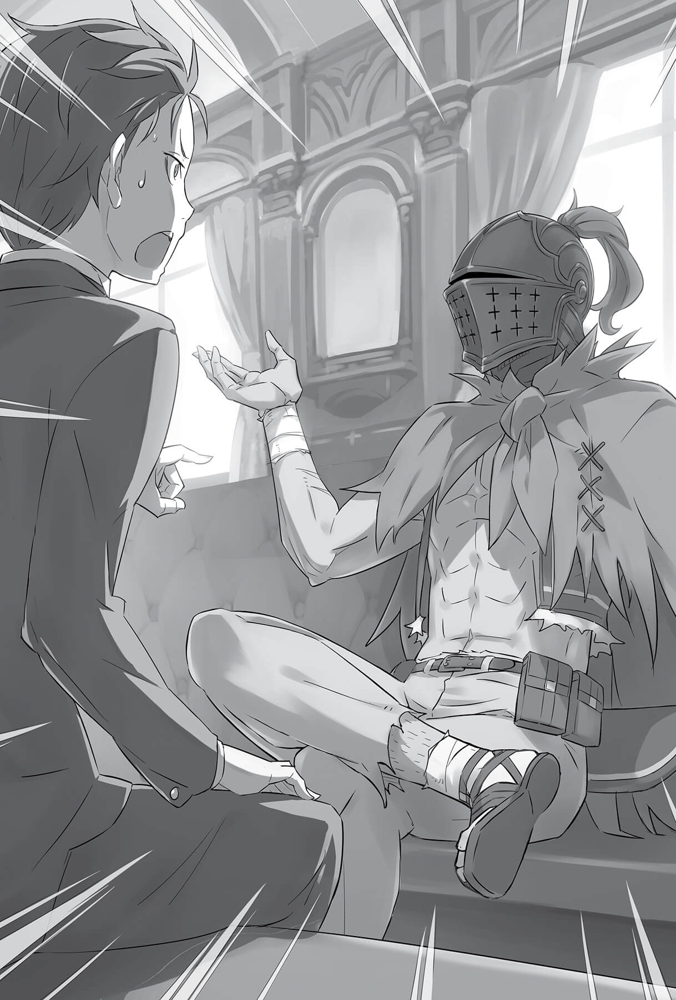
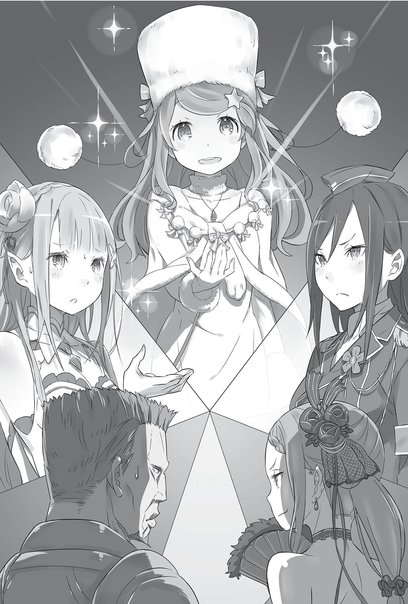
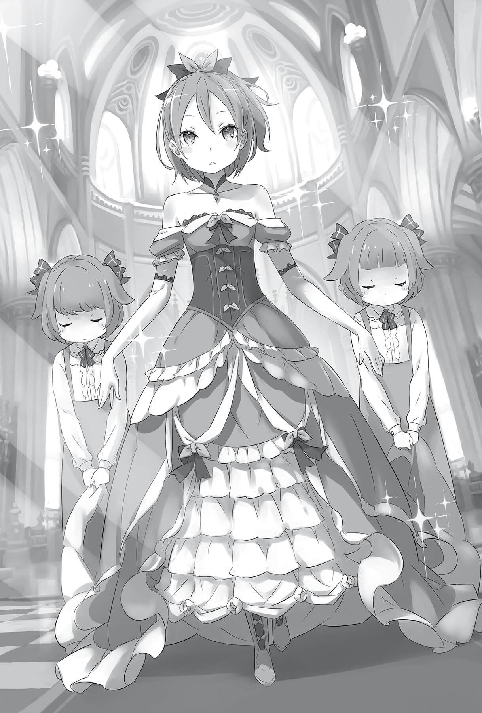

## 1

— Что?.. Я остаюсь в гостинице?! — удивлённо воскликнул Субару, когда следующим утром ему объявили о планах на предстоящий день.

Розвааль, сославшись на предварительную договорённость, уже ушёл, и за завтраком, приготовленным Рем, остались трое: Субару, Эмилия и она сама. Завершив трапезу, Эмилия сообщила о своём решении.

— А что в этом удивительного? Мы привезли тебя в столицу, чтобы ты навестил знакомых и подлечился. Таков был уговор.

— Но ведь его можно интерпретировать по-разному…

— Категорически нет! Сегодня нам не до развлечений, и посторонним вход запрещён. Я даже Рем не могу взять с собой.

Эмилия была серьёзна как никогда, и у Субару не осталось аргументов, ведь только вчера он совершил непростительную оплошность. В поисках поддержки юноша посмотрел на Рем, но голубоволосая горничная только покачала головой.

— Я считаю, госпожа Эмилия совершенно права. Прошу, не перечь ей.

— Чёрт! Никто не хочет встать на мою сторону. Но что тут сказать, признаю, вчера я был неправ. Эх, какая досада!..

Даже Рем, которая всегда и во всём поддерживала Субару, была непреклонна. Вчера, нарушив обещание, данное Эмилии, юноша вёл себя крайне неосмотрительно, и ему запретили выходить из дома.

Видя переживания Субару, Эмилия поставила руки на пояс и вздохнула:

— Хотела бы сказать, что сегодняшнее дело не займёт много времени, но это не так. Я не знаю, во сколько вернусь, поэтому ужинайте, не дожидаясь меня.

— Ясно. Раз уж ты, Эмилия, так строга ко мне… Устроим сегодня шикарный ужин на двоих? А, Рем?

— Нет, сегодняшнее меню уже определено: запечённые аблоки с аблочным салатом. Аблочный пирог с джемом. А на десерт свежевыжатый аблочный сок.

— Сплошные аблоки! Чёрт бы побрал того продавца со шрамом!

Поскольку вчера Субару принёс девять аблок, Рем приготовила из них ужин.

Перед глазами Субару появился улыбающийся хозяин фруктовой лавки, и юноша горько усмехнулся.

— Отлично, Рем. Аблоко — мой любимый фрукт! Окружённый аблоками, я чувствую себя как в раю! Просто чудесно, Рем! Съедим всё вдвоём!

— Нет-нет. Как я могу притронуться к тому, что так любит Субару! Всё это я подам тебе.

— Иногда кажется, что ты сочувственно ко мне относишься, но в следующий же миг жестокосердно ставишь подножку! — закричал Субару на Рем, которая не только знала своё место, но и понимала, как извлечь из него выгоду.

Наблюдая за их перебранкой, Эмилия вновь вздохнула, а затем посмотрела на горничную.

— В любом случае, Рем, я поручаю его твоим заботам. Думаю, и Розвааль говорил об этом: следить за Субару нужно внимательно. Очень внимательно!

— Эмилия-тан, ты несколько раз повторила одно и то же, значит, заботишься обо мне!

Услышав наставления, Субару поднял вверх большой палец. Эмилия, уже привыкшая к этому жесту, накрыла ладонью его руку.

От неожиданного прикосновения у Субару перехватило дыхание.

— Субару, я не прошу о многом!

— Ч-что?..

— Пожалуйста, подтверди, что я могу тебе доверять!

Услышав её просьбу, юноша на мгновение потерял рассудок. Прокрутив в голове, усвоив и осознав сказанное, он закивал в ответ.

— Да! Ради тебя я готов на всё! Даже пожертвовать собственной жизнью!

По-прежнему не понимая причин, по которым в её глазах цвета фиалок сквозило беспокойство, Субару не задумываясь пообещал слушаться. Какие проблемы — сейчас он не будет перечить, а когда дойдёт до дела, примет решение.

Внимательно глядя на Субару, беспечного, как и всегда, Эмилия тихо, с едва заметной печалью сказала:

— Хорошо. Я верю тебе.

## 2

Прошло около часа после того, как Эмилия отправилась в город. Чтобы как-то убить время, Субару, оставленный под присмотром Рем, выводил письменные знаки альтернативного мира. Однако, пока он механически копировал буквы, его мысли были где-то далеко.

Как быть? Как вести себя рядом с Эмилией, которая пытается занять престол?

Ему не давала покоя настоятельная просьба Эмилии дожидаться в гостинице. Субару абсолютно не был настроен сидеть тут до её возвращения. Конечно, его немного мучили угрызения совести, ведь юноша собирался нарушить данное обещание, однако он успокаивал себя мыслью, что в столице у Эмилии есть враги.

Впервые он встретил Эмилию во время её предыдущего визита в столицу. Она приехала инкогнито, и, несмотря на это, враги не только попытались лишить её перспективы участия в королевских выборах, но и покусились на жизнь девушки!

Не окажись рядом Субару, её жизнь оборвалась бы в тот самый день. Вспоминая об их судьбоносной встрече, юноша чувствовал, как в его груди всё горит.

Попав в альтернативный мир, он жил до этого дня сам по себе. Субару всё ещё не понимал, кто и ради чего призвал его, на это не было ни малейшего намёка. Однако такое положение вещей дарило свободу выбора: раз уж нет определённой миссии, можно выбрать её самому!

— Я буду помогать Эмилии!

Наверное, ради этого он и был призван. Но если даже и не так, Субару всё равно принял решение. Поставленная цель придаст ему сил и станет стимулом к действию.

— И для этого…

Субару поднял голову и поймал на себе взгляд Рем. С лёгким румянцем на щеках она стояла у дверей, преграждая путь.

Юноша уже предпринял несколько попыток сбежать, но горничная непрестанно сопровождала его, даже до туалета. Пора было сдаться.

— Ну…

— Что такое, Субару? Не смотри так, я смущаюсь.

— Ну…

— Нет, Нельзя. И взгляд брошенного щенка не поможет!

— Ну…

— Пойми же, я обещала сестрице, что выполню свой долг. Поэтому не разрешаю.

Увы, этот молчаливый взор загонял Рем в угол. Не в силах выносить его, девушка с упрёком посмотрела на Субару.

— Ты настолько… беспокоишься за Эмилию? Она в королевской крепости, кроме неё там очень много посетителей. Уверена, охраняют дворец безупречно.

— Дело не в качестве охраны. Обидно, что в ответственный для Эмилии момент меня нет рядом…

— Субару…

Юноша понимал, что Рем права, ведь он действительно слаб. Его усилия уже не раз оборачивались потерями и 60лью. Тем не менее…

— Скорее всего, я окажусь бесполезным, если только что-нибудь не произойдёт. И очень надеюсь, это «что-нибудь» не произойдёт…

Рем слушала молча.

— Но, знаешь, в непредвиденной ситуации без меня не обойтись! Потому в такой важный момент я должен быть рядом с Эмилией.

Субару обладал уникальной способностью Посмертным возвращением. Конечно, извлекать выгоду из собственной смерти — более чем странно, однако ради Эмилии он был готов на всё.

— Что с тобой поделаешь… Субару, ну почему ты приносишь одни проблемы? — прошептала Рем, сдаваясь под его напором. Юноша поднял голову.

— Тогда, Рем…

— Нет, нельзя! Даже в таком случае я не должна тебя отпускать.

— Но ведь всё идёт к тому. Ты же сама сказала!

Рем раздосадованно хмыкнула, а потом, подняв палец, произнесла:

— У меня родилась идея! Новое блюдо с аблоком. Нужно сосредоточиться, поэтому я отправляюсь на кухню. Наверное, если кто-то выйдет из комнаты, я даже и не замечу.

Субару не нашёлся что сказать, а девушка продолжила:

— Но ты не должен делать ничего такого. Пока я не вернусь, сиди и учись. А когда я всё приготовлю… угощу тебя чем-то совершенно потрясающим. Из аблок.

Субару ошеломлённо молчал, а Рем с улыбкой встала, надела фартук и вышла из комнаты. Слушая звук удаляющихся лёгких шагов, Субару тяжело откинулся в кресле и прикрыл глаза.

— Ох, Рем, какая же ты милая! Я настоящий мерзавец, что постоянно пользуюсь твоей добротой. — От души поблагодарив девушку за участливость, Субару встал. Уже собравшись выйти из комнаты, он вдруг остановился, схватил перо и вырвал из прописей страницу.

## 3

— Немного жаль, что он не сказал: «Пойдём со мной», — прошептала Рем, вернувшись в пустую комнату, и коснулась рукой стола.

На нём лежала записка, в которой кривыми буквами было написано: «Прости меня. Спасибо».

— Этот Субару просто неисправим!

Тем не менее Рем выглядела счастливой. Записка от Субару казалась ей настоящим подарком. Спрятав листок в кармашек на груди, она бережно прижала его руками.

— Но о чём только думает господин Розвааль? — пробормотала девушка и с недоумением покачала головой, припомнив утренний наказ хозяина: «Не мешать Субару. Что бы ни говорила Эмилия».

Похоже, он предвидел нынешнюю проделку юноши. Но, как ни странно, решил помочь Субару.

— Возвращайся целым и невредимым!

Рем не сомневалась, что у Субару есть продуманный план действий, но помнила: этот юноша в любой момент готов броситься на помощь очертя голову. В такой ситуации девушке оставалось лишь молиться, чтобы Субару вернулся невредимым.

Закрыв глаза, она представила его образ и пожелала удачи. А затем аккуратно сложила небрежно брошенные прописи и спустилась на кухню.

Так Субару Нацуки, даже не догадываясь, под чью дудку пляшет, во второй раз отправился в город.

## 4

Воспользовавшись добротой Рем, Субару выбежал из дома и направился к фруктовой лавке «Кадомон», чтобы найти деда Рома.

— Прорваться в замок… Шанс есть. Но для начала нужно добраться хотя бы до его ворот.

Если он объяснит, что сопровождает Эмилию и Розвааля, то, возможно, его пропустят. Однако Субару даже не знал, в какой стороне находится замок.

— Так, стоп! Стражники из кордегардии при помощи зеркал наверняка свяжутся с Эмилией, и она велит не пускать меня! Но если я доберусь хотя бы до входа в замок, то как-нибудь её уломаю, ведь Эмилия обычно поддаётся на уговоры! Вряд ли она отправит меня обратно, зная, что без присмотра я наверняка вляпаюсь в очередную историю!

Видя будущее в радужном свете, Субару направился в сторону торгового квартала. Он хотел поскорее найти деда Рома и разузнать, как пробраться в ту часть города, где живёт знать.

Вчера Эмилия попыталась связаться с королевским замком из кордегардии, но, кажется, неудачно. В последнее время Райнхард был сильно занят и вчера в замке не появлялся. Но одно не вызывало сомнений: Райнхард служит в королевской гвардии и наверняка будет присутствовать на сегодняшнем собрании кандидатов на престол.

Покидая утром гостиницу, Эмилия сказала, что узнает о судьбе Фельт. То есть сегодня, самое позднее завтра выяснится, куда та подевалась. Субару хотелось побыстрее сообщить об этом деду Рому, который очень переживал за девочку.

Быстро миновав толпу, он увидел знакомую яркую вывеску. Слово «Кадомон» было выведено необычным цветом, но это, как ни странно, неплохо сочеталось с приметной, покрытой шрамами физиономией хозяина.

Думая о том, как тесен мир, Субару подбежал к дверям.

— Эй, дядя! Давненько не виделись, аж со вчерашнего дня!

Рядом раздался до боли знакомый голос:

— Что-то ты припозднился, братишка. Времени у нас в обрез. Ещё немного, и я бы ушёл, так что тебе повезло.

Прямо над ухом Субару прозвучал смех со странным, словно в железной бочке, эхом. Он повернулся, сбросил с плеча бесцеремонно положенную руку и смерил взглядом говорящего.

— А я-то думаю, кто это такой… Здорово, вчерашний дядя!

— Точно, «вчерашний дядя»! Ну, раз ты и вправду пришёл, можно вздохнуть с облегчением, я уж боялся, что меня будут отчитывать…

Не обратив внимания на то, как грубо Субару оттолкнул его руку, человек в чёрном воронёном шлеме похлопал себя по груди.

Перед юношей стоял мечник Ал. В таком же странном наряде, как и вчера. Субару был удивлён неожиданной встречей, а тот лишь посмеивался.

— Да не бойся ты так! Сам открыто говорил в присутствии принцессы, где вы собрались встречаться. А у неё хорошая память.

— «Открыто»? Да меня просто подслушали! И зачем ты здесь? Определённо это приказ той вздорной девчонки, но что она хочет, ума не приложу!

— Я никогда не выясняю подробности, Принцесса капризна и своенравна, спрашивать её о чём-то — только время терять. Ладно, идём.

— «Идём»?!

Не отвечать на заданный вопрос и переключаться на другую тему — похоже, телохранитель научился этому у своей хозяйки. Ал молча сделал шаг вперёд, и Субару нахмурился:

— Постой, что значит «идём»? Куда идём? Ты мне так ничего и не объяснил. Я не обязан подчиняться!

— И охота же тебе задавать все эти вопросы?! Наш мир — огромный поток. Просто отдайся течению — и жить станет намного легче!

— Не тебе, великовозрастному неудачнику, меня учить! У каждого своя дорога. Некогда мне болтать с тобой и твоей принцессой, — отрезал Субару, не видя за шлемом лица собеседника.

Он мало что знал про Ала и ту девицу, но считал, что вовсе не обязан беспрекословно их слушаться.

— И вообще, я бы на твоём месте пересмотрел своё отношение к её капризам, пока не поздно… — продолжил он, но Ал вдруг прервал юношу, понизив голос:

— Ты же пытаешься проникнуть в королевский замок?

От услышанного Субару остолбенел.

— Ого! Мгновенный эффект! Принцесса — молодец! Всё ровно так, как она говорила.

— Слушай, ты!.. Откуда тебе известно?

— Мне ничего не известно. Принцесса приказала так сказать. И вот он результат. — Ал весело пожал плечами, а Субару насупился.

Выходит, Субару танцевал под дудку той девицы даже в её отсутствие. С чувством, что проигрывает по всем фронтам, он облизал пересохшие губы.

— В замок? А туда можно попасть? Если я последую за вами…

— Ну, как сказать… если последуешь, узнаешь.

Ал не ответил ничего конкретного, и Субару еле сдержался, чтобы не возмутиться вслух. Стиснув зубы, он отвёл взгляд.

Собеседник молча ожидал его решения, и Субару страшно раздражало, что ответ очевиден. Выдержав небольшую паузу, он с недовольным видом выбросил белый флаг.

— Хорошо. Я пойду за тобой.

— Да ладно, не дуйся! Как только ты появился в лавке, всё случилось по сценарию принцессы.

— Тебе можно верить?

— Как пожелаешь. У нас мало времени, если не поторопимся, опоздаем. Там всё строго, — Ал бесцеремонно отмахнулся от вопроса единственной рукой.

Прежде чем двинуться за ним, Субару повернулся и крикнул хозяину лавки, который озадаченно наблюдал за сценой из-за прилавка:

— Дядя, мне нужно с тобой кое о чём поговорить, но отложим это до следующего раза.

Проведя пальцем по шраму, пересекающему лицо, хозяин вздохнул.

— Я не против. Когда такие подозрительные типы ошиваются у моего магазина, это отпугивает клиентов, так что уведи его подальше.

— Мне кажется, клиенты не жалуют твою лавку по другой причине. Да, у меня есть ещё одна просьба. Ты ведь можешь связаться со здоровяком по имени Ром?

Услышав это имя, хозяин лавки почему-то смягчился. Субару, чувствуя, что тот слушает с большим доверием, сказал, тщательно подбирая слова:

— Передай старику: Субару Нацуки отправляется в замок, чтобы всё разведать про Фельт. Пусть ждёт добрых вестей!

## 5

Картина, что открылась взору Субару, лишила его дара речи.

— Это же… прямо не найти другого слова, как…

— Знаю, братишка. Отлично знаю, что ты хочешь сказать, — Ал согласно кивнул.

Они переглянулись и, одновременно указывая вперёд, воскликнули:

— Настоящая роскошь!!!

Перед ними стояла вызывающе шикарная драконья повозка. Экипаж броского цвета украшала тонкая резьба и позолота, колёса были инкрустированы драгоценными камнями. Повозку тащили два земляных дракона с красной кожей и пышными гривами, и даже упряжь отличалась изысканным дизайном.

— Мы поедем на этом?! Меня точно ни с кем не перепутали?

— Дело не в тебе. Увы, даже в нашем обширном королевстве лишь принцесса может кататься на такой повозке, пуская всем пыль в глаза.

Подтолкнув в спину Субару, невольно сделавшего шаг назад, Ал направился к экипажу, перегородившему всю дорогу. Несмотря на то что припарковалась карета на тихой улочке, прохожие не оставили её без внимания. Большинство разглядывало диковинку не столько с завистью, сколько с любопытством.

Поёжившись под взглядами зевак, Субару сдался и двинулся вперёд. Чувствуя спиной внимание публики, он проворно забрался в экипаж.

— Мне пришлось тебя ждать! За дерзость дорого заплатишь! — язвительно бросила девушка, восседавшая на широкой скамье.

Её сегодняшний наряд был ещё шикарнее вчерашнего. Платье с глубоким декольте подчёркивало соблазнительные пышные формы.

— Я благодарен за приглашение, моя признательность не знает границ.

— Хорошо, хотя для меня это лишь развлечение. Способ как-то скоротать время.

— Выходит, явившись, я повёл себя как верный слуга. Так трогательно, я сейчас расплачусь!

Хозяйка и её рыцарь переглянулись. Видя, что Субару пытается побороть неловкость, Ал кивнул:

— Располагайся, пока стоишь, повозка не тронется с места. Конечно, благодаря Защите внутри не качает, но сидеть всё равно приятнее. К тому же принцесса не любит, когда на неё смотрят сверху вниз.

— Хм, Ал, а ты всё прекрасно понимаешь! Слышал, простолюдин? Если будешь и дальше таращиться на меня сверху вниз, придётся укоротить тебя… скажем, вдвое!

Субару поспешно сел, смекнув, что шутками здесь и не пахнет. То, что повозка тронулась, он понял только по смене картинки за окном. Экипаж двигался очень плавно и неспешно.

— Карете важнее внешний вид, поэтому ей не хватает манёвренности. Эстетика превыше всего! Это легко понять, верно? — Ал еле сдерживал усмешку, словно читая мысли Субару.

Юноше оставалось только поражаться, насколько отличается альтернативный мир от его собственного. В этот момент девушка, сидевшая в глубине повозки, спросила:

— Итак, плебей, с какой целью ты забрался в мою повозку?

— Что?! «С какой целью»? Ты отдала приказ этому дядьке, и он привёл меня.

— Нет. Это всего лишь предлог. А я спрашиваю про истинный мотив. Так зачем же ты здесь?

Ироничный тон девушки заставил Субару сцепить зубы. Он сдерживался, чтобы не ответить в том же духе. Юноше не хотелось подбирать слова, но злить гордячку не стоило. В лучшем случае его бы выкинули из повозки. А в худшем Ал мог взяться за меч, висевший на боку.

К тому же в словах «истинный мотив» скрывался определённый смысл.

— Мне нужно попасть в королевский замок. Поэтому я и сел в драконью повозку.

— Значит, именно по этой причине ты здесь. То есть, не окажись ты в моей карете, попытался бы попасть в королевский замок другим способом.

— Да, наверное. Возможно, залез бы в экипаж каких-нибудь знатных господ, — кивнул Субару.

Принцесса не ошиблась: ни при каких условиях он бы не оставил попыток проникнуть в королевский замок. Пускай даже тайком забравшись в чужую повозку. Однако…

— Безрассудная затея! Даже в обычный день там строгая охрана, что уж говорить про это особенное мероприятие. Ты бы ни за что не скрылся от глаз форейторов или гвардейцев.

О таком повороте Субару не задумывался. Действительно, даже прокравшись в чужой экипаж, он не достиг бы желаемого. План изначально был провальным.

— В этом смысле то, что вы меня пригласили — большая удача.

— Посмотрим. Всё зависит от твоих намерений, — многозначительно произнесла девушка и усмехнулась. В повозке воцарилась напряжённая атмосфера. — То есть ты сел в мой экипаж, чтобы оказаться в королевском замке. Значит, решил, что он отправляется туда. Тебе нет смысла врать, понимаешь это, верно?

— Ну, в общем, да. Если я ошибся с пересадкой, то прошу скорее меня высадить!

— Экспресс остановится только через три станции, — вставил Ал, чуть слышно хохотнув. Субару нахмурился, но не успел он ответить, как девушка продолжила свой допрос.

— Тебе посчастливилось оказаться в повозке, которая направляется в королевский замок. А ты знаешь, для чего мы едем туда?

Юноша затруднился с ответом.

— Надеюсь, ты способен оценить происходящее. Но если замечаешь лишь то, что мельтешит перед глазами, то ты глупец, который не заслуживает права жить! Отвечай немедленно!

У Субару от этих слов перехватило дыхание, а девушка между тем переменила позу. До этого она сидела, поджав ноги, но теперь спустила их на пол и вальяжно откинулась на спинку, не отрывая взгляда от Субару.

— Зачем эта повозка направляется в королевский замок?

— Эта повозка направляется в королевский замок, чтобы…

Заворожённый красными глазами, Субару почувствовал, как внутри него всё сжалось. От девушки исходила мощная подавляющая энергия: дашь слабину — тут же сломаешься.

Высокомерное поведение, надменные слова и поступки, презрительный взгляд. Слуга, безоговорочно следующий приказам. Роскошный экипаж. Пазл почти сложился, оставался лишь один недостающий фрагмент. Субару уже не сомневался.

— Чтобы участвовать в королевских выборах. В этой повозке едет кандидатка на престол!

— Ого, значит, ты всё понял.

— Ты одна из тех, кто желает стать правителем Лугуники.

Девушка прищурилась, а затем ухмыльнулась с таким садистским выражением, что Субару вздрогнул.

— Ал

— Да-да, я всё понял. Ты прав, братишка, в своих предположениях. Присутствующая здесь госпожа претендует на трон Лугуники. Перед тобой Присцилла Бариэль, — в голосе Ала, который впервые произнёс имя своей хозяйки, звучало большое уважение.

Присцилла удовлетворённо кивнула и посмотрела на Субару.

— Конечно, имея столько подсказок, любой глупец догадается. Как бы то ни было, успокойся. Возможно, твоя кровь и не прольётся здесь.

— Я рад. Конечно, повозка достаточно просторная, чтобы взмахнуть мечом, но от запаха крови очень сложно избавиться.

— Что за ерунда! Можно просто взять новый экипаж. Чем беспокоиться о таких мелочах, позаботься лучше о моём настроении!

— Простому человеку вроде меня никак не понять такое отношение к деньгам…

Слушая, как Присцилла и Ал перебрасываются фразами, Субару незаметно для них выдохнул.

Ещё вчера юноша начал догадываться, кто находится перед ним. Судя по высокомерному поведению Присциллы, можно было предположить, что она принадлежит к высшему обществу. Последние сомнения рассеяла реакции Эмилии. Несмотря на то что магическая накидка должна была скрыть истинное происхождение, она боялась общаться с Присциллой. Теперь всё встало на свои места: гордячка являлась претенденткой на престол!

— Вы пригласили меня в свою повозку, потому что знали, с кем я был вчера.

— Девчонка тщетно пыталась скрыться под жалкой тряпицей. Она вся сжалась от страха, прячась за твоей спиной. Вы друг друга стоите!

— Послушай, ты не могла бы следить за тем, что говоришь?..

Субару не мог сдержать гнева, когда в его присутствии издевались над Эмилией. Он вскочил на ноги и собирался уже потребовать, чтобы Присцилла взяла свои слова обратно, но в этот момент услышал предостережение:

— Эй, остынь, братишка. Мы же решили не проливать кровь!

Субару почувствовал, что меч Ала приставлен к шее. Ещё один шаг — и его голова упала бы с плеч.

— Ты ведь уже имеешь представление о характере принцессы, так относись к её словам попроще. В противном случае… рискуешь серьёзно ошибиться.

— А ты прыткий, хоть и однорукий!

— С одной рукой я живу гораздо дольше, чем с двумя. Человек ко всему приспосабливается.

Субару прищёлкнул языком в ответ на меткое замечание Ала, лицо которого было скрыто забралом, и сделал шаг назад. Увидев, что Ал вернул меч в ножны, он сел на прежнее место.

Было ясно, что Ал доволен таким решением, но Субару не мог скрыть досады. Посмотрев телохранителю в лицо, он решился спросить о том, что давно его интересовало.

— А можно задать бестактный вопрос? Где ты потерял руку? — Субару не исключал, что Ал обидится и замолчит, но и такой вариант его вполне устраивал. Однако беседа приняла неожиданный оборот.

— Понятное дело, тебе интересно узнать. Назовём это крещением в альтернативном мире. Думаю, ты тоже, братишка, оказался в похожей ситуации.

— А…

Субару задал этот вопрос, чтобы отомстить Алу, но внезапный ответ заставил его забыть, о чём спрашивал. Видя ошеломлённое лицо юноши, Ал провёл рукой по прорези забрала и наклонил голову.

— Эй, что случилось? Неужели сразу не понял? Мы товарищи по несчастью.

— Что?! — Субару широко раскрыл глаза.

Слова Ала настолько поразили его, что Субару утратил способность размышлять. В голове была пустота, он не находил слов. Чувствуя настоящее головокружение, как будто мир перевернулся с ног на голову, он всё же выдавил:

— Постой… постой. «Товарищи по несчастью»?.. Ты что, правда из…

— Понимаю, это звучит неправдоподобно. Я тоже вчера не поверил собственным ушам. Уже восемнадцать лет я не слышал фразочек вроде «между нами красная нить».

— Восемна?..

Субару даже не смог договорить. С тех пор как он сам оказался в этом мире, прошло около месяца. Если то, что сказал Ал, правда…

— Именно, Я попал сюда восемнадцать лет назад. Тогда и руку потерял… Мне было немногим больше, чем тебе сейчас.

Выходит, Ал был в том же положении, что и Субару. Однако юноша не мог порадоваться встрече. Итог, к которому привели Ала эти восемнадцать лет, не слишком вдохновлял.

— Так ты… ты смог что-нибудь узнать… о причине?..

— Почему потерял руку или почему оказался в этом мире? Что касается руки, тогда я слабо понимал, что происходит. Можно считать, по собственной невнимательности. А почему попал в альтернативный мир… Этого я не знаю.

Субару не сумел выдавить ни слова, и Ал продолжил:

— Не могу сказать, что активно выяснял причины, по которым оказался здесь. Я просто изо всех сил старался выжить.

Ал провёл в этом мире уже восемнадцать лет. Ему не посчастливилось, как Субару, встретиться в самом начале с кем-то вроде Эмилии. Однако и Субару прочувствовал на собственном опыте, что такое битва не на жизнь, а на смерть, и даже знал, как тяжело потерять руку.

Но, несмотря на всё это, Субару Нацуки мог считать, что ему ещё повезло.

— Два страдальца! Вы только оскверняете своим жалким клоунским видом мою карету! — надменное замечание Присциллы нарушило тоскливую атмосферу. — Мне наскучило слушать беседы о прошлом. Даже смехотворные истории о вашей родине за Великим каскадом и то звучали интереснее!

— За Великим каскадом?..

— Ты что, не знаешь?! На краю материка, там, где заканчивается земля, бушуют потоки, смывающие всё на своём пути. Иными словами, Великий каскад. Поговаривают о людях, которые появляются из-за него, как ты и Ал. В основном это выдумки… но с Алом всё иначе.

— Почему ты так думаешь? Есть какие-то основания?

— Это чутьё!

Ответ Присциллы был в её стиле. Он ничего не объяснял, лишь утверждал, что она права.

— Послушай, этот мир устроен так, чтобы мне было удобно. Моё чутьё и есть ответ на любой вопрос! Ал отличается от простолюдинов, которые только и могут, что врать. Кажется, ты тоже правдолюб.

— Ох и язык у тебя!.. Хорошо, но какая тебе выгода с того, что я сижу в этом экипаже, хоть и связан с конкуренткой?

Субару надеялся доказать, что Присцилла действует непоследовательно, но девушка только рассмеялась, глядя на Субару как хищник на жертву.

— Наивный! Раз ты связан с моей конкуренткой, я возьму тебя в заложники и потребую, чтобы она отказалась от участия в выборах! Или преподнесу ей твою голову, намекая, что следующей будет она. В сложившейся ситуации ни то, ни другое не составит труда.

Присцилла явно наслаждалась испугом Субару, которому до настоящего момента даже в голову не приходил такой сценарий. Причина была проста: он не считал, что обладает для Эмилии достаточной ценностью, чтобы стать заложником.

— Судя по твоей физиономии, сюрприз удался!

Как ни крути, действительно выходило, что он — слабое место Эмилии. Присцилла радостно хлопнула в ладоши, словно её домашний питомец отмочил нечто забавное.

— Стоит посмотреть на тебя, и становится ясно, из-за каких чувств ты пытаешься помочь этой девушке. Эмоции застилают тебе глаза, и ты не видишь дальше собственного носа. Глупец, да и только!

Возразить было нечего, и Субару потупился. Он просто хотел помочь и думал лишь о том, как принести пользу, но оказался в таком дурацком положении.

— Принцесса, он же мой земляк. Не издевайся над ним!

— Я ни над кем не издеваюсь. Этот плебей сам заметил допущенную ошибку, на которую прежде не обращал внимания, сам поверг себя в отчаяние и борется с самим же собой. Жалкое зрелище! — Присцилла пожала плечами, всем своим видом демонстрируя скуку. — Не следует предаваться дурным мыслями. Если бы я желала использовать тебя, уже вчера велела бы четвертовать прямо на улице! Однако я пригласила тебя в свой экипаж. Что это, если не доказательство чистоты моих помыслов?

— Я корю себя не за то, что могу угодить в заложники. Стыдно другое: я даже не подумал о такой вероятности. И для чего же ты позвала меня?

Субару и раньше должен был понимать, что все его действия могут отразиться на Эмилии, но осознал это, лишь получив предупреждение Присциллы. Увы, она была кругом права…

В ответ на его вопросительный взгляд девушка снова сменила позу, подперев подбородок рукой.

— Я же говорила: для меня это своего рода развлечение, забава. Чем брать тебя в заложники или угрожать, демонстрируя труп, гораздо занимательнее привести тебя в замок, где проходят королевские выборы. Таково моё решение.

— «Занимательнее», скажешь тоже… — пробурчал Субару.

Присцилла, зевнув, продолжила:

— Всё в этом мире устроено так, как удобно мне. Что бы ни произошло, оно непременно принесёт мне выгоду. Поэтому я выбираю тот путь, который развлечёт меня.

Субару опять не нашёлся, что на это ответить, а Присцилла закрыла глаза, давая понять, что разговор ей наскучил. Судя по её позе и поведению, девушка собиралась вздремнуть. Удивительное самообладание! Ведь меньше чем через час она окажется на важном собрании, посвящённом королевским выборам.

Субару бросил взгляд на Ала. Тот поднял руку, давая понять, что сам пасует перед своенравным характером хозяйки, и беззвучно откинулся на спинку сидения. Субару решил было последовать его примеру, и тут Присцилла неожиданно заметила:

— Если и есть иная причина, кроме развлечения, то это…

— Что же?

— Аблоки.

Субару удивлённо замер, а Присцилла снова погрузилась в молчание, по её виду было ясно, что разговор окончен.

Отчаянно пытаясь сообразить, в чём дело, Субару наконец пробормотал:

— Выходит, мою жизнь спас хозяин фруктовой лавки…

Как ни странно, но дядька со шрамом оказался причастен практически ко всему, что произошло с юношей в столице. Мысль о том, что он остался жив благодаря случайности, в очередной раз погрузила Субару в пучину самоедства.

## 6

Через центральные ворота драконья повозка въехала на территорию королевского замка. Направляясь к парадной лестнице, Субару остро чувствовал, что находится не в своей тарелке.

— Слушай, а ничего, что я здесь? Честно говоря, я настолько не подхожу к этому месту, что как-то страшновато…

— Ещё бы! Ты же явился на вечеринку без приглашения. Да и вообще, таких, как мы, тут не очень-то ждут.

Оценив свою одежду, Субару посмотрел на Ала, шагавшего рядом. Хоть тот выглядел столь же неуместно, его это абсолютно не тревожило. Наверное, за восемнадцать лет, прожитых в альтернативном мире, он совершенно забыл, что такое дресс-код.

Присцилла, возглавлявшая процессию, с достоинством выступала по центральной галерее королевского замка. По стенам с обеих сторон были выставлены предметы изобразительного искусства, там же стояли и вооружённые до зубов стражники, взгляды которых были прикованы к Присцилле.

Казалось, Субару никто не замечал, но юноша так нервничал, что ему было тяжело дышать. Дойдя до конца галереи, они увидели огромные двустворчатые двери.

— Стражники, коридоры, огромные ворота…

Один лишь вид портала создавал настолько величественное и подавляющее впечатление, что Субару невольно вытянулся в струнку. Никогда он не чувствовал себя так неуютно, как сейчас.

— Мы ждали вас, госпожа Присцилла.

Рыцарь, стоявший рядом с дверью, сделал шаг вперёд и отсалютовал мечом, приветствуя девушку. Великан в полной экипировке снял шлем и смерил Присциллу и её свиту проницательным взглядом.

Ему было около сорока лет, облик мужчины свидетельствовал не столько о грубой силе, сколько о стойкости и строгости. Казалось, черты его лица вырублены из камня. Было очевидно: перед ними воин, который прошёл через множество сражений.

Присцилла чуть заметно кивнула головой на приветствие рыцаря, а затем, указав на Субару и Ала, сказала:

— Это моя свита. Один — рыцарь, а другой… этот клоун отвечает за аблоки.

— Стойте-ка… — попытался воспротивиться Субару, но осёкся, осознав, что это не место для перебранки. На лице рыцаря не дрогнул ни один мускул.

— Отвечает за аблоки?

— Да, совершенно безобиден. Поставляет мне красные и кислые аблоки.

Рыцарь ничего не ответил, но внимательно окинул Субару и Ала взглядом голубых глаз.

— Я не чувствую никакой опасной магической силы. Господин рыцарь, при вас только меч?

— А? «Господин рыцарь» — это вы мне? Yes-yes.[^5] Если я увижу какого-нибудь подозрительного опасного типа, то вот этой самой рукой разрублю его пополам.

— Если что-то произойдёт, вы должны защищать свою госпожу. Обо всём остальном позаботятся гвардейцы.

— 0ui-oui![^6] — таким образом Ал заверил, что всё понял.

Глава стражи обернулся и мотнул подбородком. Двери начали медленно раскрываться.

— Вас ожидают. Прошу поторопиться.

— Ждать госпожу — удел плебеев. Обратная ситуация невозможна! — Присцилла высокомерно двинулась к дверям. Увидев, что Ал пошёл следом за ней, Субару собрал всю свою решимость и сделал шаг вперёд.

Перед ними возник огромный зал, пол был застелен красным ковром. Роскошно украшенные стены поддерживали высокий потолок, с которого свешивались элегантные светильники.

Несмотря на внушительную площадь, в зале почти не было мебели, и в глаза бросался небольшой подиум с креслами. По пять кресел справа и слева и одно в центре.

Стены позади них были украшены орнаментом с изображением дракона, и тот, кто сядет по центру, наверное, будет выглядеть так, словно несёт дракона на плечах, пребывая под его защитой. Поскольку они находились в тронном зале королевского замка, нетрудно было догадаться, что перед ними не что иное, как престол Королевства Лугуника.

Увлёкшись троном, Субару сначала даже не посмотрел по сторонам, но теперь осторожно огляделся. Внутри зала, в отличие от галереи, не было ни одного стражника. Зато здесь рядами стояли рыцари королевской гвардии в белой форме и с мечами.

Дальше расположились какие-то люди в официальном платье, судя по важному виду — вельможи высокого ранга.

В центре зала, на некоторой дистанции от рыцарей и аристократов, стояла небольшая группа людей. Девушка с серебристыми волосами, увидев вошедших, воскликнула:

— Субару?!

Фиалковые глаза были полны недоумения, словно она не верила, что Субару действительно здесь. Шок, отразившийся на лице Эмилии, заставил сердце юноши забиться чаще. С одной стороны, он был рад видеть её, с другой — чувствовал свою вину за непослушание. Уверенность, которая подавила здравый смысл и привела его сюда, вдруг пропала, и Субару пришёл в замешательство.

— Эмилия, я…

В этой ситуации следовало что-то сказать, но он не мог найти слов. Взгляд Эмилии жёг Субару, казалось, она требует объяснений, но губы девушки оставались плотно сжатыми. Однако тишину нарушил не Субару и не Эмилия.

— Зачем ты пялишься на моего слугу? Тебе от него что-то нужно, получеловек?

Субару почувствовал, как нечто мягкое прижалось к его спине, и почему-то испытал настоящий ужас. Вокруг торса обвились изящные руки. Присцилла, стоявшая сзади, оперлась подбородком о плечо Субару, практически прижавшись щекой к щеке юноши, и вызывающе смотрела на Эмилию.

— Ты что?! Отодвинься! Эмилия-тан всё неверно поймёт!

— Что значит «неверно»? Между нами тесная связь. Можешь прижаться сильнее, я разрешаю.

— Не для этого я угощал тебя аблоками! Что за коварство!

Сбросив руки Присциллы, которая подтрунивала над ним, Субару поспешно отодвинулся. Она недобро прищурилась, встретив такой отпор, и топнула каблучком об пол.

— Давненько не ви-и-иделись, госпожа Присцилла. Прошу прощения за переполох, устроенный моим слугой. Я очень признателен за то, что вы подобрали его. Наверное, бедняга заблудился, — голос Розвааля прозвучал с мягкой усмешкой, разрядив обстановку. Субару даже не заметил, как тот оказался рядом.

Синеволосый мужчина был одет в официальное платье с эмблемой, напоминающей кленовый лист, она не имела отношения к его статусу придворного мага.

— Кто тут у нас? А, это вы, господин мошенник! Не припомню, чтобы это был ваш слуга. Я и правда подобрала простолюдина, чем докажете, что он принадлежит вам?

Присцилла продолжала упорствовать, однако Розвааль лишь пожал плечами.

— Я с да-а-авних пор ставлю метки на всём, что принадлежит мне. На внутренней стороне его ливреи вышит мой герб.

Присцилла пытливым взглядом посмотрела на Субару. Тот торопливо отвернул лацкан фрака и продемонстрировал вышивку в виде сокола.

Присцилла презрительно хмыкнула.

— Дешёвый трюк! Ну ладно. Благодаря этому клоуну и получеловеку я смогла немного развеяться. К тому же мой рыцарь попросил меня об этом.

— Принцесса! Мы же договаривались!

— Не будь таким мелочным. Иначе не вырастешь.

— Вряд ли в сорок лет есть шанс подрасти…

Одним взглядом заставив Ала замолчать и даже не посмотрев на Субару, Присцилла направилась в центр зала, где посреди небольшой группы людей находилась Эмилия.

Она сжалась, увидев Присциллу, но та не обратила на неё никакого внимания, и Эмилия вновь устремила взор на Субару.

— И всё-о-о же у тебя удивительная судьба, раз свела с госпожой Присциллой! А если бы тебя нашёл кто-то другой, что-о-о тогда, хотелось бы знать?

— О чём это вы? Разве она известна своим благородством и великодушием?

— Нет, ниско-о-олько. Но если бы это была не она, тебя, вероятно, бросили бы в темницу или даже прикончили на месте. А госпожа Присцилла благодаря доброму расположению духа оставила тебе жизнь, хотя могла и убить. Вероятность пятьдесят на пятьдесят.

— Я уже понял, что балансировал над пропастью. Вы… не сердитесь? — с опаской спросил Субару у Розвааля, который завёл разговор как ни в чём не бывало.

— О чём это ты? Я предполага-а-ал, что ты появишься, так оно и вышло. Может, тебе в пути пригодилась ливрея с моим гербом?

— В пути?.. Только что она спасла меня, но в пути… нет, не припомню.

Розвааль удивлённо поднял брови:

— Тебя не остановили стражники? Как же ты сюда пробрался?

— Эта капризная принцесса подобрала меня ещё в городе. Хотя, если изложить всю историю, рассказ получится длинный…

Кажется, хозяин поместья был удивлён, но прежде чем Субару успел объясниться, он заметил, что Эмилия направляется прямо к нему.

— Почему?

Похоже, в этом единственном слове, которое она промолвила с заметным трудом, сплелись все чувства, кипевшие у неё в груди. Когда Субару услышал это «почему», вмещающее множество вопросов, у него перехватило дыхание.

— Как ты… нет, я не спрашиваю как… я спрашиваю почему. Субару, почему ты здесь?!

— Долго рассказывать. Наверное, я мог бы ответить одним словом, но…

— Хватит дурачиться! Я же просила тебя, Субару. Не помнишь?!

Её слова заставили Субару молча отвести взгляд. Сегодня утром он пообещал послушно дожидаться в гостинице, но сразу же нарушил слово и устремился в замок. Он был виноват. Однако, с другой стороны, юноша не солгал бы, сказав, что сделал это ради Эмилии. Он воспользовался стечением обстоятельств и связями лишь для того, чтобы оказаться рядом с ней.

Но не успел Субару открыть Эмилии свои чувства, как по залу разнёсся торжественный голос:

— Господа, все в сборе. Приветствуем Совет мудрецов!

Распахнулась высокая дверь, и в зал, предваряемая рыцарями в доспехах, которые остановились по сторонам, вошла Процессия старейшин. Роскошные одеяния безошибочно указывали на их высокий статус, а величавая походка и манеры говорили о благородном происхождении и огромном опыте правления.

Среди прочих выделялся седой старик с длинной бородой, которая волочилась по полу. Он не сутулился, но оказался на голову ниже Субару. Судя по глубоким морщинам, он был старше остальных, но его взгляд оставался пронзительным и острым, словно клинок.

— Это глава Совета мудрецов, господин Миклотов. В отсутствие короля он обладает наивысшей властью в Лугунике. Провожая взглядом процессию, Субару слушал негромкие пояснения Розвааля.

— Значит, Совет мудрецов и правда управляет королевством?

— Форма-а-ально Совет наделён лишь совещательными правами. Но на самом деле управление сейчас сосредоточено именно в их руках. Признаться, когда у власти была королевская семья, дела обстояли приме-е-ерно так же, — Розвааль пренебрежительно пожал плечами.

Выходит, даже в те годы, когда на троне восседал монарх, не обладавший, судя по всему, выдающимися способностями, бразды правления находились в руках Совета мудрецов.

— Ну что, братишка, пора нам занять своё место — вон там, — Ал, стоявший до это молча, указал подбородком туда, где выстроились королевские гвардейцы.

Присутствующие в зале разделились на две части: с левой стороны собрались рыцари, а с правой — сановники и аристократы.

— И что, мне можно встать там?

— Если следовать традициям, то са-а-амым правильным было бы немедленно выгнать тебя из замка… но, поскольку мне очень интересно, что будет дальше, следуй за ним.

— Послушайте, Розвааль!.. — вскинулась Эмилия, но тот остановил её.

— Увы, сейчас не время для споров. Если всё сложится, Субару останется здесь на долгое, до-о-олгое время…

— Но если мы позволим Субару встать там, то он…

— Довольно, госпожа Эмилия, собрание начинается. Прошу в центр, — посуровевший Розвааль указал в сторону мудрецов Совета, рассевшихся по бокам от трона. Свободным оставалось лишь кресло в центре — то есть сам престол. А перед мудрецами выстроились те, чей блеск затмил всё вокруг.

Кроме знакомой девицы с рыжими волосами, там стояли ещё три девушки, даже по внешнему виду которых можно было судить об их особом положении.

Присцилла расположилась в центре. Уперев руки в бока, расправив плечи, выпятив грудь, она слегка покачивала бёдрами, и подол алого платья едва заметно колыхался из стороны в сторону. Даже оказавшись перед мудрецами, управляющими страной, она была полна самоуверенности.

Справа от неё стояла девушка в облачении, напоминающем военную форму. Длинные тёмные, почти чёрные волосы слегка отливали глянцевым зелёным блеском и на конце были подвязаны белой лентой, лицо отличалось красотой и правильными чертами, а взгляд — прямотой. Для девушки она обладала довольно высоким ростом, не уступая Субару, но её ноги были намного длиннее. На поясе висел меч, украшенный гербом в виде льва с оскаленными клыками. О таких говорят: красавица в мужском наряде.

С левой стороны от Присциллы находилась девушка с лиловыми волосами. Она, в отличие от серьёзной девушки, стоявшей справа, казалась задорной и весёлой. Волнистые волосы ниспадали до середины спины, и весь её образ напоминал что-то мягкое и нежное, словно сахарная вата. Меньше ростом и изящнее двух предыдущих девушек, она была одета в белое платье с меховой оторочкой. Внимание привлекала белая лисья горжетка и гигантский кошелёк, висевший на боку.

Каждая из девушек обладала неповторимой красотой, и не возникало сомнений: на этом собрании они играют главную роль.

— Но потом мы должны серьёзно поговорить! — с досадой сказала Эмилия, обращаясь к Субару, и поспешила вернуться на своё место.

Когда она, взмахнув серебристыми волосами, встала в ряд с другими красавицами, Субару показалось, что её наряд слегка проигрывает прочим. Однако, по мнению юноши, миловидностью Эмилия намного их превосходила.

— Выходит, здесь все претенденты на престол королевства?

Одни девушки! С удивлением осознав этот факт, Субару последовал за Алом к королевским гвардейцам.

— Всё же ты пришёл, Субару, — с тёплой улыбкой поприветствовал его красноволосый красавец, стоявший во главе рыцарей.

Райнхард. Замечательный молодой человек, который, судя по всему, не забыл Субару за то время, что прошло с их предыдущей встречи. Яркие огненно-красные волосы и глаза цвета неба производили такое же впечатление, что и в прошлый раз, но сегодня на нём была форма гвардейца.

— Услышав, что здесь будет госпожа Эмилия, я предположил, что и ты появишься.

— Боюсь, ты меня переоцениваешь. Во время нашей последней встречи я только и делал, что звал на помощь да подставлялся под удары. Должно быть, оставил не очень-то хорошее впечатление.

— Ты защитил Эмилию, да и в остальном действовал весьма достойно. Я считаю, воздать хвалу — не лишнее.

В ответе Райнхарда не было ни тени язвительности. Он слегка пожал плечами, но в его исполнении даже такой простой жест выглядел изысканно.

Встав рядом с Райнхардом и Алом, Субару оказался в первом ряду рыцарей. Только он успел подумать, что, должно быть, слишком выделяется, как услышал:

— Привет, Субарунчик! — уже знакомая девушка с кошачьими ушками помахала рукой.

Та самая девушка-посланник, которая принесла весть о королевских выборах, теперь красовалась в гвардейской форме — мундире и юбке. Субару с удивлением понял, что она также состоит на службе. Рядом с девушкой оказался и Юлиус, он поприветствовал Субару кивком и получил в ответ хмурый взгляд.

— Субару, что случилось? Ты вдруг переменился в лице.

— У меня на родине такое выражение появляется у тех, кто встретил своего соперника в любовных делах.

Услышав такое пояснение, Райнхард слегка улыбнулся.

— Не обижайся, Юлиус. Субару всегда так держится с новыми людьми, думаю, виной тому застенчивость.

— Нет, ничего подобного! Может, хватит приписывать мне то, чего нет? — немедленно возразил юноша. Услышав это, Юлиус отбросил волосы назад и заметил:

— Мне всё равно, Райнхард. Долг рыцаря — вести себя сообразно званию. Меня зовут Юлиус Юклиус, я состою на службе в королевской гвардии. Надеюсь, вы запомните моё скромное имя… так же, как и стоящий рядом с вами достопочтенный рыцарь, — представившись нарочито вежливо, Юлиус обратился к Алу.

— Ой, к чему такие формальности! Да и не стоит называть меня достопочтенным рыцарем. Я Ал, простой охранник. Совершенно не такой, как вы, заявил он без лишних церемоний.

От такого ответа Субару вскинул брови. Он считал, что Ал со всеми общается по-приятельски, но сейчас тот держался не слишком дружелюбно. Впрочем, размышлять на эту тему было некогда.

Стоявший на возвышении пожилой рыцарь, вероятно главный из присутствующих гвардейцев, зычным голосом объявил:

— Уважаемый Совет мудрецов! Все кандидаты в сборе. Я, капитан королевской гвардии Маркос, позволю себе начать наше собрание.

— Хм… прошу вас, — слегка кивнул Миклотов со своего места. Маркос поклонился и с серьёзным видом обратился к публике:

— Наше собрание посвящено избранию следующего правителя, поэтому здесь присутствуют те, кто имеет отношение к выборам. Благодарю, что пришли. Сегодня Совет мудрецов должен принять важное решение.

Маркос не повышал голоса, но его слова отчётливо доносились до каждого, а заключённая в них сила полностью соответствовала статусу командующего королевской гвардией.

— Беда стряслась полгода назад: неизвестная болезнь одного за другим унесла всех членов королевского дома, причём первым умер сам король. В отсутствие правителя страна оказалась на грани кризиса. Для Драконьего королевства Лугуники это весьма серьёзная проблема, ведь она связана с Договором.

Договором называли союз, заключённый некогда с духом-драконом. Субару слышал об этом союзе во время бесед в поместье Розвааля, но до конца не понимал, что конкретно он собой представляет. То же самое можно было сказать и о самих королевских выборах. Субару надеялся, что сегодняшнее собрание прояснит многие неясные моменты.

— Связь между нашим королевством и Драконом возникла несколько столетий назад. Тогдашний король Фарсель Лугуника и дракон Волканика заключили Договор. С тех пор Дракон неоднократно спасал королевство и способствовал его процветанию. — Дух-дракон Волканика всегда был верен данному слову. Сменялись эпохи, проходили века, но он неизменно защищал нас даже издалека, пребывая по ту сторону Великого каскада.

Слушая торжественную речь Маркоса, глава Совета Миклотов кивал и поглаживал свою бороду.

— Само существование Лугуники зависит от соблюдения условий Договора. Нет слов, чтобы передать нашу скорбь из-за утраты королевской династии. Однако теперь нужно как можно быстрее избрать новую жрицу. — Обновить договор с Драконом может лишь девушка-жрица, отвечающая определённым критериям. Из поколения в поколение эту роль исполняли представительницы королевского рода, но теперь необходимо избрать новую жрицу, — произнеся это бесстрастным голосом, Маркос обернулся к мудрецам и положил руку на грудь. — В связи с этим Совет отдал приказ королевской гвардии найти избранных девушек по сиянию Драконьего жемчуга. И она выполнила эту миссию.

Маркос достал из-за пазухи небольшой значок, инкрустированный драгоценными камнями. Субару несколько раз приходилось видеть такой — именно он давал право участия в королевских выборах.

Сделав шаг вперёд, Маркос поклонился кандидаткам и протянул значок.

— Госпожи кандидатки, прошу предъявить ваши инсигнии.

Услышав призыв, девушки вытащили значки, или, как более торжественно назвал их Маркос, инсигнии.

На мгновение сияние разлилось по всему тронному залу. Свет исходил от инсигний. На ладони Эмилии значок горел красным, но инсигнии остальных девушек бросали на стены отблески других цветов.

Среди рыцарей послышались восхищённые возгласы, а на морщинистых лицах старейшин читалось облегчение.

— Как вы можете видеть, каждая из кандидаток обладает нужными качествами, чтобы стать жрицей Дракона. А раз так, то мы, следуя начертанному на Драконьей скрижали…

— Послушайте…

Торжественную речь вдруг прервал чей-то спокойный голосок. Перед Маркосом, наклонив голову набок, стояла девушка с сияющей синим светом инсигнией на ладони. Та самая девушка с лиловыми волосами, одетая в белое платье.

— Я понимаю, что господин капитан гвардии намерен подробно рассказывать обо всём, но у меня маловато времени. У нас в Карараги говорят: «Время и деньги стоят одинаково».

Несмотря на мягкий голос и спокойное выражение лица, она говорила довольно требовательно. Убрав Драконий значок, претендентка улыбнулась.

— Достаточно о том, что и так все знают. Хотелось бы перейти к сути.

Маркос выглядел обескураженным. Но гораздо больше был удивлён Субару: в речи девушки он уловил необычный акцент.

— Эй-эй, она же говорит на кансайском[^7] диалекте!.. Как такое возможно? — чуть слышно прошептал он.

— Что, братишка, впервые услыхал? В западной стране Карараги все так говорят. Я не видал те края своими глазами, но манера речи у них именно такая, — столь же тихо ответил Ал.

Речь девушки и впрямь напоминала кансайский диалект, пусть и специфичный. Субару стало любопытно, что это за страна Карараги и какие в ней обычаи.

— Поддерживаю! — прозвучал ещё один звонкий голос. Он принадлежал зеленоволосой претендентке. Она стояла, скрестив руки на груди и приподняв подбородок. В зале нарастало напряжение.

— Госпожа Круш! Не пристало главе дома Карстен высказываться в таком тоне…

— Я осознаю важность формальных церемоний, но мы ограничены во времени. Предлагаю немедленно сообщить причину, по которой мы здесь собрались. Хотя, разумеется, в общих чертах я имею представление о ней, — девушка, названная Круш, прикрыла один глаз.

Миклотов, на которого она бросила взгляд, восхищённо произнёс:

— Как и следовало ожидать от главы дома Карстен! Вы уже догадались о цели собрания?

— Да, лорд Миклотов. Планируется банкет, верно? Мы, конкурентки, до сих пор мало что знаем друг о друге. Находясь за одним столом, мы сможем чуть лучше понять характеры…

— Нет, это не так, — Миклотов прервал уверенные рассуждения Круш. Она нахмурилась и, обернувшись, посмотрела туда, где стоял Субару и рыцари.

— Феррис, разве не о том шла речь?!

— Да нет же! Просто в замок везли такое количество провианта, что мысли о вечеринке напрашивались сами собой, — ответила девушка с кошачьими ушками.

— Вот оно что… Я просто поспешила с умозаключениями. Прости, что усомнилась в тебе.

Беседа госпожи и рыцаря смотрелась довольно странно — они словно поменялись местами. Вновь повернувшись лицом к Совету, Круш слегка вздохнула и промолвила:

— Прошу прощения, забудьте о том, что я сказала. Мне весьма неловко.

— Ой, госпожа Круш так мужественна… — произнесла Феррис, приложив руки к щекам.

Кажется, девушку не слишком беспокоило, что её слова привели к ошибочной гипотезе. Более того, её реакция наводила на мысль, что всё не случайно.

— Послушайте! Возможно, Круш и ошиблась, но моё мнение не изменилось. То, о чём вы сейчас рассказываете, все и так знают. Верно?

Девушка, бойко говорившая на кансайском диалекте, хлопнула в ладоши, призывая остальных поддержать её. Круш кивнула головой, Присцилла фыркнула, не желая соглашаться, а Эмилия, подняв руку, заметила:

— Я считаю, мы должны выслушать всё, что нам хотят сказать…

— Прости, дорогуша, но твоё мнение никто не спрашивал.

Присцилла, судя по всему, не слишком-то церемонилась с Эмилией. По лицу той было видно, насколько ей это неприятно, и Субару не смог сдержаться:

— Эй, что ты себе позволяешь?!

Однако возмущённый возглас Субару сразу прервал Ал. Он поднял руку и сказал:

— Извините! Я, например, знать не знаю, что такое королевские выборы, и хотел бы послушать поподробнее!

Перетянув всё внимание на себя, Ал замахал рукой:

— Не надо на меня так глазеть, прямо неловко делается! Да, я нахожусь не на своём месте, но не совсем же я чужой? Не доводите человека до слёз, а то расстроюсь и ненароком покрушу что-нибудь.

— Госпожа Присцилла, полагаю, это ваш рыцарь? Вы ничего не рассказали ему о королевских выборах?

— Какой смысл делать это заранее, если нам всё равно предстоит выслушивать эти длинные объяснения? Я просто избавила себя от лишних хлопот, — ответила Присцилла вызывающим тоном.

Субару отметил, что все кандидатки отличаются своенравным характером и лишь Эмилия выделяется на их фоне. Однако по недавней реплике рыжей девушки было понятно, что к Эмилии относятся с неприязнью.

— Я выручил тебя. Уже второй раз! — прошептал ему на ухо Ал, выставив два пальца, и Субару в глубине души поблагодарил земляка.

Страшно было подумать, что Субару мог натворить в порыве гнева, и Ал специально подставился, чтобы отвлечь внимание на себя.

— Это воля неба, чтобы простолюдины следовали за мной. Пусть радуются и танцуют на моей ладони. Продолжай, Маркос. Объясни моему вассалу, как я стану королевой.

— Ловко ты спихнула свои обязанности на других, нечего сказать. Раз так, я умолкаю, — девушка с лиловыми волосами разочарованно пожала плечами.

Маркос посмотрел на Эмилию и Круш, убедился, что и они согласны, и продолжил:

— Итак, вернёмся к нашей главной теме. Мы собрали здесь девушек, способных стать жрицей Дракона, из-за нового предсказания, появившегося на Драконьей скрижали. Там написано: «Когда Договор окажется прерван, Лугунику возглавит новая жрица».

— Хм… То, что написано на скрижали, — воистину слова провидения! Дух-дракон Волканика даровал нам скрижаль в знак заключения Договора, на ней проявляются письмена, предрекающие судьбу королевства. Наша скромная миссия заключается в том, чтобы следовать им.

Старейшины одобрительно кивнули.

— Драконья скрижаль и прежде указывала нам путь. В древние времена она помогла спастись во время Великого голода Кудегра и во время Кошмара злого духа Баргелена. В новое время сообщила о нападении Чёрного Змея и позволила свести к минимуму ущерб.

— Хм… Это впечатляет, но дальше можно не продолжать, все присутствующие осведомлены.

Приведённые примеры, вероятно, были какими-то важными историческими вехами, о которых Субару не имел ни малейшего представления. Но он отметил, что довольно удобно обладать такой замечательной штукой, на которой появляется информация о грядущем.

— Я тут подумал… если всё дело в Договоре с Драконом, разве обязательно, чтобы жрица являлась королевой? А что, если это будут два разных человека? — Субару вполголоса обратился к Райнхарду, и тот горько усмехнулся.

— Вполне резонное замечание! Но так не получится…

— Почему же?

— Потому, что Договор о защите Лугуники заключается между Драконом и королём, Дракон сам выбирает того, с кем будет общаться.

— Так тем более! Дракон может рассердиться, что вы наспех выберете жрицу и королеву в одном лице. Стоит ли спешить? Не лучше ли просто объяснить Дракону, что короля больше нет и теперь вместо него жрица?

— По этому поводу действительно велись ожесточённые споры. Но в результате было решено, что для нас главным приоритетом остаются слова, высеченные на Драконьей скрижали, ведь они определяют будущее страны. Это решение Совета мудрецов, они и отдали приказ гвардейцам. Надеюсь, не ошиблись…

Выходит, те, кому принадлежит власть, уже всё решили. А что решит Дракон, знает только он сам. Наверное, именно это имела в виду Рам, говоря: «Известно только Дракону».

В зале вновь зазвучал голос Маркоса.

— Предсказание содержало следующее: среди пятерых претенденток на престол будет выбрана одна жрица, которая и заключит Договор с Драконом.

Кое-что в этой фразе показалось Субару странным, и он нахмурился.

— Пятерых?..

— Да, пятерых. Сейчас здесь четыре претендентки, но выборы ещё не начались. То, что на поиски пятой ушло столько времени, лишь наша вина.

— Но в Лугунике население пятьдесят миллионов! Найти четверых за полгода — это на самом деле довольно быстро!

Поиски человека в мире, где нет транспортной сети, объединяющей территории, — очень сложная задача. И то, что за такой короткий срок нашли четверых, действительно было достойно похвалы.

— Я обрисовал текущую ситуацию, Госпожа Анастасия, прошу прощения, что отнял ваше время.

Маркос, завершив объяснения, извинился перед девушкой, которая просила ускорить процесс.

— Нет-нет, не стоит. Всё в порядке. Полагаю, принцесса теперь довольна?

— Как сказать. Ал, ты что-нибудь понял своей пустой головой?

— Oui,[^8] всё ясно. Благодарю! И вас, барышня из Карараги, — ответил Ал, взмахнув рукой, а Присцилла удовлетворённо кивнула:

— Надо же, даже он уяснил!

Анастасия нахмурилась, слушая этот странный диалог хозяйки и рыцаря, и посмотрела на Совет мудрецов:

— Если есть ещё что-то, о чём вы намерены рассказать, то нельзя ли побыстрее? Я весьма занята, меня ждут дела. Думаю, старцам, которые держат в руках кошель страны, это должно быть понятно.

Субару застыл, полагая, что дерзкое заявление вызовет в зале настоящую бурю, но было непохоже, что Совет мудрецов возмущён её поведением.

— Мы просим прощения, понимая, как вы заняты, госпожа Анастасия. Но выражаем надежду, что вы побудете с нами ещё некоторое время. Уверен, этот день останется в истории страны.

Голос Миклотова неожиданно стал тише, и Субару почувствовал, как в зале воцарилась торжественная атмосфера, подобная той, что была в начале собрания. Юноша невольно выпрямился.

Однако Присцилла, не обращая внимания на происходящее, непринуждённо спросила:

— Вы хотите сказать, старейшина, что этот день изменит историю. Верно?

Миклотов слегка кивнул и перевёл взгляд на Маркоса, подав ему знак. Тот поклонился, и своды зала неожиданно наполнил его зычный голос:

— Рыцарь Райнхард ван Астрея!

Субару вздрогнул от неожиданности.

— Здесь! — Райнхард стоял недалеко от Субару — похоже, он только и ждал, когда его вызовут. С достоинством сделав шаг вперёд, он поклонился четырём кандидаткам и остановился на подиуме перед Маркосом.

— Итак, Райнхард, твой доклад.

— Есть.

Маркос сделал шаг назад, уступив место. Все взгляды были прикованы к Райнхарду, а он смотрел на Совет.

— Благородные старейшины Совета мудрецов! Я, Райнхард ван Астрея, готов сообщить о завершении миссии.

— Хм. Говорите так, чтобы всем было слышно, — попросил Миклотов.

Повернувшись лицом к залу, Райнхард провозгласил:

— Пятая кандидатка на престол и звание жрицы найдена! Среди рыцарей поднялись волнение и ропот, а на лицах девушек-кандидаток мгновенно отразилась сложная гамма чувств. Тут было всё: и решительный боевой настрой, и радость, и скука, и замешательство.

Появилась новая кандидатка, и королевские выборы официально начались. Но кто же она?..

— Приведите её, — коротко скомандовал Райнхард, и стражник, стоявший у дверей, поклонился и медленно распахнул створки.

В тронный зал в сопровождении слуг вошла ещё одна девушка. Увидев её, Субару от удивления широко разинул рот.

Она ступала по ковру на высоких каблуках, подол лимонного платья подрагивал, золотистые волосы были уложены в сложную причёску. Но эту девушку с волевыми красными глазами и хулиганским клычком сложно было с кем-то спутать.

— Представляю вам госпожу Фельт, которую я признаю будущей королевой.

Эти слова повторились в ушах Субару, потерявшего дар речи, многократным эхом.

[^5]: «Да-да» (англ.).

[^6]: «Да-да» (фр.).

[^7]: Кансайский диалект японского языка часто используют в литературе и аниме, чтобы придать колоритность речи персонажа.

[^8]: «Да» (фр.).
