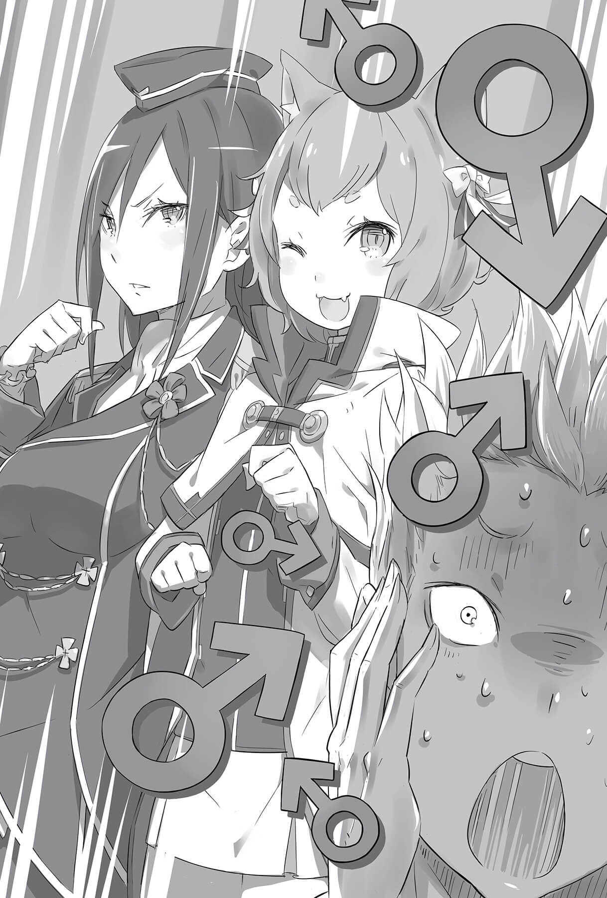
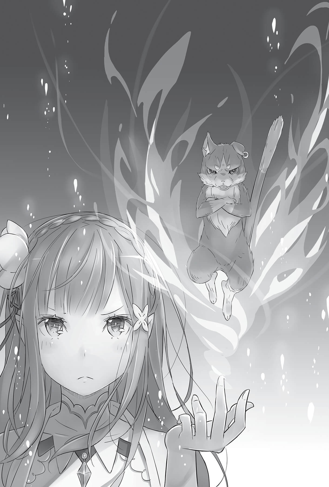

## 1

Девчонка в грязной порванной одежде, со взъерошенными золотистыми волосами. Маленькая разбойница из бедняцких кварталов, которой больше всего подходило слово «проныра». Именно такой Субару запомнил эту девочку.

Однако та Фельт, которая, величаво ступая по ковру, вошла в тронный зал в сопровождении двух служанок, выглядела настоящей благородной дамой.

Субару и прежде казалось, что в ней что-то есть и девчонка станет намного симпатичнее, стоит только отшлифовать её красоту. И теперь Фельт, подобно огранённому бриллианту, засияла во всём великолепии, заставляя восхититься мастерством Райнхарда.

Она поистине блистала.

Медленно пройдя мимо потрясённого Субару, Фельт остановилась перед Райнхардом, и он с почтительной улыбкой поприветствовал её:

— Благодарю вас, госпожа Фельт, что почтили нас своим присутствием.

Фельт подняла на него глаза и сказала звонким голосом:

— Райнхард!

— Да, — ответил он, и взгляды госпожи и её рыцаря скрестились.

— Какого чёрта ты притащил меня сюда, ничего толком не объяснив?!

Фельт приподняла подол платья, и её длинная стройная ножка описала стремительную дугу. Прикрывшись рукой, Райнхард перехватил её, отразив удар, нацеленный в подбородок.

— Вы меня удивили. Что это вдруг?

— Как я должна это понимать?! Где мы?! Что это за тряпьё?! Кто все эти люди, и вообще, что происходит?! Моё терпение на исходе!!!

Вне себя от злости, Фельт, еле удерживая равновесие, запрыгала на одной ноге, грубо теребя дорогое платье, наверняка сшитое специально для неё. Видя шокирующую сцену, служанки, стоявшие по обеим сторонам, попятились назад.

— Вам не понравилось платье? Жаль, оно вам очень к лицу, не стоит стесняться.

— Я не про это чёртово платье! И вовсе я не стесняюсь! Мне не нравится всё это! И ты в первую очередь! Как не стыдно господину рыцарю удерживать в заложницах девчонку, а?!

— Всё ради процветания нашего королевства! — не моргнув глазом парировал Райнхард, и Фельт схватилась обеими руками за голову, словно в приступе мигрени.

— Зря я испугался, что она совершенно изменилась, это только внешне. Всё-таки люди не могут моментально переродиться! Прямо от сердца отлегло, я уж засомневался в собственном рассудке, — пробормотал себе под нос Субару. Он уже думал, как доложит деду Рому о разительных переменах, произошедших с Фельт.

Юноша мог вздохнуть с облегчением — девчонка была в полном порядке. Сейчас, вспоминая случайную встречу с Фельт, которая теперь являлась претенденткой на престол, он видел в тех событиях что-то судьбоносное.

Ведь Фельт впервые встретилась с Райнхардом, пытаясь украсть значок Эмилии.

— Значит… ещё тогда… Вот почему Райнхард был настолько удивлён…

Эмилия, узнавшая Фельт, вероятно, подумала о том же. До этого они соперничали за значок-инсигнию, а теперь будут соперничать за королевский престол…

И претендентки, и рыцари, и все аристократы, присутствующие на собрании, были взбудоражены появлением Фельт. Разумеется, её дерзкое поведение вызвало недоумение, и, чувствуя со всех сторон осуждающие взгляды, Фельт бесцеремонно фыркнула.

Субару почти не знал её, но, кажется, прежде она не была такой агрессивной. Наверное, за этот месяц на её долю выпало немало испытаний. Конечно, и сам юноша пережил невероятное количество неприятностей, но превращение уличной девчонки в кандидатку на королевский престол выглядело настоящей историей Золушки.

— О, братишка! А ты что тут делаешь?

Осматривая зал, Фельт заметила Субару в первом ряду рыцарей и, оттолкнув Райнхарда, направилась к нему.

Субару невольно задался вопросом: как же хулиганке удалось выглядеть столь благородно, когда она вступила в зал? Не найдя ответа, он приветственно помахал рукой.

— Давно не виделись! Гляжу, у тебя всё отлично! — заявила Фельт, расплывшись в улыбке, а в следующий миг Субару почувствовал резкий удар в живот, от которого повалился на колени.

Наблюдая за тем, как ошеломлённый Субару корчится, пытаясь подняться на ноги, Фельт скрестила руки на груди и кивнула:

— Порезанный живот почти зажил, но, смотрю, в других местах ран только прибавилось. Как со здоровьем-то вообще?

— Если так беспокоишься обо мне, зачем дерёшься?! А если бы швы разошлись?.. Но, по правде сказать, я уже оказывался в подобной ситуации…

Хотя рана поперёк живота давно затянулась, на её месте красовался чёткий белый шрам. К тому же по всему телу виднелись следы от укусов зверодемонов, и теперь Субару готов был поспорить с утверждением, что шрамы на спине — позор для бойца.

— Надеюсь, госпожа Фельт, вы уже должным образом поприветствовали своего старого друга. Прошу сюда, — сохранявший всё это время бесстрастное выражение лица Маркос повёл рукой, указывая Фельт её место на возвышении.

Покривившись от его пафосного вида, девчонка неохотно шагнула вперёд.

— И что вы собираетесь со мной сделать?

— Попрошу вас держаться так, как подобает благородной леди. Позвольте вручить вам это.

Фельт состроила недовольную гримасу, но Райнхард вытащил из кармана мундира значок с изображением дракона и положил ей на ладонь. Драгоценный камень сразу же испустил белое сияние.

— О, такая же штука, как я украла! Она мне сразу показалась странной. Почему камень светится?

— «Украла»?.. — насторожился Маркос.

Кажется, с губ Фельт невольно слетело то, о чём следовало молчать, но Райнхард тут же ответил, сделав вид, что ничего не произошло:

— Потому что Дракон видит в госпоже Фельт достойную претендентку.

— Именно так. Драконий жемчуг подтверждает, что госпожа Фельт может стать жрицей. Признавая её претенденткой на престол, мы объявляем выборы открытыми!

С этими словами Маркос приложил руку к груди и поклонился. Его примеру последовали Райнхард и все остальные рыцари.

Итак, возложенная на них миссия была выполнена — пять жриц Дракона, пять претенденток на престол Лугуники собрались в тронном зале.

— Вот как… Да, получается, что этот день действительно войдёт в историю, — пробормотала Присцилла.

Действо, свидетелем которого оказался Субару, по всей видимости, являлось необычайно важным, даже эпохальным. Оглядевшись, он понял, что все присутствующие чувствуют это. С другой стороны, в рядах сановников началось какое-то беспокойное движение, и на их лицах отразились подспудные сомнения и неуверенность.

— Прошу меня простить, — Мужчина из группы вельмож сделал шаг вперёд. Средних лет, сутулый, с мешками под глазами, он нервно теребил окладистую бороду. — Должен сразу же высказать своё восхищение тем результатом, которого достигли господа королевские гвардейцы. Без ваших усилий подготовка королевских выборов могла существенно затянуться.

— Мы не заслуживаем подобной похвалы, — скромно ответил Маркос.

— Однако, несмотря на то что претендентки отвечают условиям, описанным на Драконьей скрижали, на мой взгляд, некоторые вызывают сомнение…

— Что вы хотите сказать?

— Да, каждая из них годится на роль жрицы, однако претендентка должна обладать не менее важным качеством — быть достойной королевского престола!

Сутулый мужчина бросил эту фразу с гневным выражением, и тут же раздались возгласы одобрения со стороны прочих сановников.

— Договор с Драконом имеет неизмеримую ценность. Лугуника на протяжении длительного времени является Драконьим королевством и без Договора не сможет оставаться таковым. Но если мы будем принимать во внимание один лишь Договор, пренебрегая мнением народа, то можем совершить непоправимую ошибку!

— Иными словами, вы заявляете, что Драконьи жрицы, в поисках которых королевские рыцари не жалели себя, недостойны престола?

— Я бы иначе расставил акценты, но в общем речь именно об этом.

Испугавшись прямолинейного вопроса Маркоса, сановник попытался сгладить острые углы, но было поздно. Рыцари, не пожалевшие ни сил, ни времени ради того, чтобы сделать практически невозможное, были возмущены.

Стоя в ряду гвардейцев, Субару всем телом чувствовал, как растёт градус напряжения.

— Что-то запахло жареным. Чую приближение грозы…

— Ну, он просто наехал на рыцарей. Лично меня это никак не задевает. А вы, господа хорошие, что скажете? — спросил с усмешкой Ал, обращаясь к стоящим рядом Феррису и Юлиусу, и они пожали плечами.

— Никаких проблем, мяу. Что бы ни говорил этот бородач, у меня уже есть та, кого я считаю достойнейшей!

— Не могу сказать, что абсолютно согласен, но испытываю схожие чувства. Мой меч признаёт лишь одну хозяйку, которой я присягнул. Рано или поздно им придётся сделать то же самое. А вот перекладывать ответственность за собственные сомнения на других — это попросту низко, как по мне.

— О, метко сказано! Я тоже питаю к принцессе что-то подобное.

Услышав слова Ала, оба рыцаря улыбнулись, и Субару вдруг показалось, что он лишний в этой компании.

Феррис и Круш. Ал и Присцилла. Судя по всему, Юлиус был рыцарем Анастасии. Вся троица доверяла своим хозяйкам, и, сравнивая себя с ними, Субару чувствовал, что в чём-то уступает. Однако юноша был полон решимости исполнить любое желание Эмилии!

Пока Субару боролся со странным чувством неполноценности, ропот в зале становился всё громче. Из группы сановников донеслись недовольные возгласы:

— Жрица должна стать королевой, но разве претендентки готовы к такому?!

— Можно изменить внешний вид, но не сущность!

— Им не хватает благородства! И образования. Хотите сказать, что одна из них станет королевой?!

— В чём же пробле-е-ема? Будет интересная борьба-а-а за престол.

— А вам следовало бы помолчать!

Услышав, как знакомый голос пробивается сквозь гомон, Субару посмотрел на Эмилию и остальных девушек. Конечно, гнев и возмущение были направлены прежде всего на Фельт, которая только что шокировала общественность своими манерами. Однако нельзя сказать, что критика не коснулась остальных претенденток.

Судя по лицу Эмилии, девушке приходилось нелегко, и Субару очень хотелось немедленно броситься к ней и подставить плечо.

— Довольно!

От одного слова Миклотова в зале воцарилась тишина. Глава Совета, прищурившись, осмотрел Фельт, несколько секунд помолчал, а потом вздохнул.

— Хм. Вы продемонстрировали неуважительное отношение к присутствующим, и я разделяю мнение господина Риккерта. Для начала давайте узнаем биографию претендентки.

— Согласен. Мы должны решить, годится ли она на эту роль, — строго добавил лысый старик. Увидев, как представители Совета мудрецов один за другим кивают, вельможа по имени Риккерт сделал шаг назад, а Миклотов продолжил:

— Рыцарь Райнхард, расскажите для начала о происхождении девушки.

Увидев, как Райнхард преклонил колено, Субару почувствовал, что на лбу выступил холодный пот.

Если рыцарь расскажет правду, разумеется, всплывёт и то, что Фельт промышляла воровством.

— Я взял под стражу госпожу Фельт месяц назад. Это случилось в бедном квартале столицы — так называемых трущобах. В силу определённых обстоятельств она прикоснулась к Драконьему жемчугу, и я понял, что эта девушка способна стать жрицей Дракона. Потому и привёз её сюда.

Несмотря на опасения Субару, Райнхард спокойно изложил суть дела, не вдаваясь в подробности. В таком рассказе было большое белое пятно, однако внимание присутствующих привлекло другое.

— Бродяжка из трущоб? Райнхард, да вы в своём уме?! — взорвался Риккерт. — Допускаете, что девчонка из бедняцких кварталов станет правительницей Лугуники? Что вы вообще думаете о королевском престоле?!

Отвесив поклон, Райнхард молчал. По его бесстрастному лицу не было заметно, что он обеспокоен.

Риккерт вновь обратился к Миклотову:

— Господин Миклотов! Необходимо пересмотреть решение. Выбранная Драконьим жемчугом вряд ли может претендовать на престол… Мы должны выбрать ту, которая достойна королевской короны. Нельзя же брать всех подряд!..

— Господин Риккерт, мне кажется, вы сли-и-ишком горячитесь.

Риккерт, призывавший Миклотова изменить решение, встретил неожиданный отпор. Розвааль смотрел на него с нескрываемым вызовом.

— Вы забываетесь, Розвааль! Я не понимаю ваших мотивов. И не только я, но и большая часть придворных. До настоящего момента мы закрывали на это глаза, объясняя всё чрезвычайными обстоятельствами, но довольно! Ни Астрея, который выдвигает бродяжку из трущоб, ни вы, протежирующий полуведьму…

— Господин Риккерт, я бы рекомендовал исправить формулировку.

Хладнокровный голос разнёсся по всему залу, и красное от возбуждения лицо Риккерта внезапно побелело.

— Называть полуэльфа полуведьмой — серьёзный проступок. Неужели вы не знаете, почему госпожа Эмилия претендует на престол?

Голос Розвааля звучал так же, как обычно, однако Риккерт отвёл взгляд, будто под давлением. Он потряс головой, словно пряча испуг, и широким жестом указал на возвышение.

— Если это и так, я не считаю, что ошибаюсь. Право стать жрицей Дракона и право стать королевой — далеко не одно и то же. Господин Миклотов! Я очень прошу пересмотреть этот вопрос. Если мы допустим ошибку, выбирая кандидатов, это окажет пагубное влияние на будущее страны, её благополучие…

— Рыцарь Райнхард!

Ничего не ответив на просьбу Риккерта, старейшина вызвал рыцаря с красными волосами.

— Вы сами уверены в том, что это она?

— Уверенности у меня нет. И проверить данный факт я не могу. Однако не думаю, что совпадения случайны.

— И как же их объяснить?

— Судьба.

Миклотов в глубокой задумчивости прикрыл глаза.

О чём говорили эти двое, не поняли ни Субару, ни остальные. Кажется, лишь собеседники были в курсе дела. Старик приложил руку ко лбу с таким выражением, словно происходящее вызывало у него глубокое разочарование, и огляделся.

— Неужели не заметили? Даже один раз взглянув на госпожу Фельт, вы должны были всё понять. Вынужден с сожалением констатировать, что преданность каждого из вас королевству вызывает сомнения.

У присутствующих перехватило дыхание от таких слов Миклотова, и все взоры разом обратились на Фельт. Оказавшись в водовороте бесцеремонных взглядов, девчонка скорчила недовольную мину.

— И что мы должны были заметить? Она весьма юна. Девушке следует очень многому научиться, прежде чем претендовать на престол… — отпустив желчное замечание, Риккерт вдруг распахнул глаза, словно внезапно что-то осознав. — Золотистые волосы… и красные глаза?..

Услышав это, окружавшие его сановники вдруг зашевелились, словно тоже заметили нечто подозрительное. Лишь Субару, слишком мало знавший об этом мире, не понимал, что происходит.

Поглядев по сторонам, он заметил, что Феррис и Юлиус смотрят на происходящее со знанием дела. Лицо Ала было закрыто, но, похоже, он тоже был спокоен.

— Золотые волосы и красные глаза — это же неотъемлемая примета особ королевского рода Лугуники!.. Но как такое возможно?! Не прошло и полгода, как все члены королевской семьи умерли один за другим. Вряд ли кто-то мог выжить… — попытался возразить Риккерт, но Райнхард мягко осадил его:

— Господин Риккерт! Известно ли вам о событиях, произошедших при дворе четырнадцать лет назад?

Старейшина словно оцепенел.

— Неужели?.. Рыцарь Райнхард… вы хотите сказать, что…

— Четырнадцать лет назад в замок ворвались злоумышленники и похитили дочь младшего брата короля, господина Фольда. Их не поймали, и найти принцессу так и не удалось…

Об этой позорной неудаче королевской стражи никто из посторонних не знал.

— Это не было предначертано на Драконьей скрижали, и нападение оказалось неожиданным. На тот момент в государстве было множество других невзгод, и поиски принцессы не организовали должным образом.

— В результате того инцидента старая королевская гвардия была распущена и создана новая. Кажется, ваши родственники с этим связаны.

— Именно от них я всё узнал и смог сопоставить факты.

Миклотов кивнул, услышав ответ Райнхарда, однако Риккерт продолжал упорствовать:

— Какая странная, дикая гипотеза! Вы хотите сказать, что принцесса, пропавшая четырнадцать лет назад, оказалась в трущобах, и по невероятному стечению обстоятельств вы нашли её? Ко всему прочему, она обладает правом стать Жрицей Дракона? — Риккерт рассмеялся. — Верится с трудом! Уж слишком гладко всё складывается! Не удивлюсь, если вы просто нашли девушку, обладающую способностями жрицы, и покрасили ей волосы, а цвет глаз изменили при помощи магии. Однако хочется верить, что вы не запятнали себя столь постыдными делами!

— Клянусь мечом! — сказал Райнхард, положив клинок на пол перед собой и склонив голову.

Глядя на Рыцаря из Рыцарей, Риккерт понуро добавил:

— Все монаршие потомки мертвы, и мы не можем выяснить, принадлежит ли она к королевскому роду. Вряд ли кто-то присягнёт новой королеве, опираясь лишь на ваши догадки.

— Разумеется. Однако я убеждён, что госпожа Фельт достойна унаследовать престол независимо от происхождения.

— Смотрю, вы уверены в собственной правоте, рыцарь из рода Великих Мечников, — сказал со вздохом Риккерт, услышав уверенный ответ Райнхарда. Затем он вновь посмотрел на Фельт. — Пусть она и обладает способностями жрицы, но девчонка выросла в трущобах. Даже если допустить, что перед нами наследница угасшего королевского рода, сложно представить, как её примет народ. Выдержит ли она такое испытание? — спросил Риккерт, явно провоцируя Фельт.

— Что?! Чего там бормочет этот дядька? Думает, я сплю и вижу, как стану королевой?!

Проигнорировав всё сказанное, Фельт решительно отказалась участвовать в королевских выборах. По залу пробежал ропот — такого поворота не ожидал никто.

— Вот этот парень насильно притащил меня сюда из бедняцкого квартала! Я просила отпустить меня, но без толку. Старую одежду спрятали, и теперь у меня только вот эти тряпки. Моё терпение уже на исходе, я не понимаю, зачем весь этот цирк?!

После гневного заявления Фельт в зале повисла тревожная тишина. Даже Субару, который никогда не отличался умением читать настроение окружающих, понимал, что ничего хорошего ситуация не сулит.

— Сколько можно повторять одно и то же? О чём тут спорить? — вдруг произнесла Присцилла, которая, сложив руки на груди, стояла со скучающим видом. Колыхнувшийся пышный бюст привлёк внимания не меньше, чем слова девушки. — Чтобы начать выборы, нужно собрать пять кандидатов. Давайте же начнём, недостойные просто отсеются. Очевидно, что победа будет за мной, независимо от того, есть ли в остальных королевская кровь.

— Чего?! — Фельт искренне возмутилась. Быстро спустившись с возвышения, она встала лицом к лицу с Присциллой. — Меня сразу удивил твой расфуфыренный вид, дамочка. Оказывается, у тебя и в голове райский сад с цветочками. Если хочешь драки, ты её получишь. За мной не заржавеет дать тебе пинка.

— Что за нахалка! Ты хоть знаешь, кто я такая?

— Не особо интересно…

Фельт дерзко усмехнулась на слова Присциллы, и та зловеще прищурилась.

— Принцесса, не надо! — крикнул Ал, и Субару понял: что-то вот-вот произойдёт. Похоже, телохранитель догадался о намереньях своей хозяйки.

Вместе с криком Ала по залу пронёсся ветер.

— Прошу меня простить, госпожа Присцилла, — спокойно сказал Райнхард, мгновенно оказавшись рядом.

Только что он стоял на возвышении, преклонив колено, а теперь, не успел никто и глазом моргнуть, оказался меж двух девушек. Рыцарь с красными волосами и девушка с рыжими смотрели друг на друга. За спиной Райнхарда стояла Эмилия, она прижала к себе Фельт, словно желая защитить.

— Что за поведение в таком важном месте?! О чём ты только думаешь? — возмущённо бросила Эмилия Присцилле. Фиалковые глаза были полны гнева. Однако гордячка лишь отмахнулась: похоже, ей было всё равно.

— Я просто хотела показать этой невоспитанной девчонке, где её место. Напоминаю: всякий, кто осмелится грубить мне, лишится жизни!

— Ты не хочешь попросить прощения? Неужели и правда совсем не сожалеешь? — сказала Эмилия своим обычным тоном. Присцилла на миг застыла, но в следующее мгновение расхохоталась.

— Как занятно! Давненько меня так не развлекали. Это даже заслуживает похвалы.

— И не надоедает тебе язвить…

— Думаешь, если сделал что-то плохое, нужно извиниться? Тогда тебе самой следует просить прощения. За то, что родилась на свет, сереброволосая полуэльфийка!

Субару понял, что слова достигли цели и поразили Эмилию в самое сердце. Плечи девушки задрожали, отвага, переполнявшая всё её существо, куда-то подевалась, глаза наполнились болью.

— Ты говоришь… о моей связи с Ведьмой?

— Нет смысла отпираться! Существование таких, как ты, под запретом в нашем мире. При одном твоём виде сердца людей наполняются страхом. Разве не потому ты натягиваешь балахон, пытаясь скрыть свою сущность?

Ядовитые слова, брошенные Присциллой, заставили Эмилию побледнеть и молча потупиться.

Субару знал, о чём говорит Присцилла. Знал, но это не укладывалось у него в голове. Как она смеет обвинять Эмилию в грехах, не имеющих к девушке никакого отношения, и незаслуженно оскорблять её? Чаша терпения переполнилась, Субару открыл было рот… но его опередили.

— Принцесса, может быть, хватит? Мне очень не хочется, чтобы вы нажили новых врагов, честное слово! — крикнул Ал разбушевавшейся госпоже, не поднимая забрала. — Драка с Рыцарем Священного Меча принесёт большие неприятности. Думаю, стоит извиниться.

— Как мой слуга может говорить такие постыдные вещи! Он Рыцарь Священного Меча — и что с того?! Подумаешь, «самый сильный»! Сделай же что-нибудь!

— Я не продержусь и минуты, — Ал объективно оценивал ситуацию.

Присцилла всем своим видом продемонстрировала, как ей всё наскучило, и, словно выплеснув яд, успокоилась.

Присутствующие, включая Субару, были поражены, как ловко Ал приструнил Присциллу — словно укротитель змей.

Похоже, наихудшего развития событий удалось избежать. В зале, где вновь воцарилась тишина, вдруг прозвучал громкий голос.

— Надеюсь, все закончили? — спросил Миклотов, привлекая к себе внимание. — Госпожа Фельт, госпожа Эмилия, вы успокоились?

— Да, со мной всё хорошо. Кажется, с ней тоже…

— Отстань! Пусти меня! Со мной и до того всё было в порядке!

Эмилия поспешно выпустила Фельт из объятий.

— Что ты тут устроила? Только зря старалась! Неужели я выгляжу такой слабачкой?!

— Прости. Это и правда было лишнее.

— Не собираюсь тебя благодарить, — с недовольным видом процедила Фельт. Райнхард поклонился Эмилии, и девушки вернулись в ряд к остальным претенденткам.

Зачинщица свары Присцилла по-прежнему стояла со скучающим видом, на её лице не было ни тени сожаления.

Убедившись, что все вновь заняли свои места, Миклотов продолжил:

— Итак, цель нашего собрания — выборы королевы. Мы открываем заседание Совета мудрецов, на котором побеседуем с каждой кандидаткой.

## 2

В зале вновь воцарилась напряжённая атмосфера. Кандидатки стояли вытянувшись по струнке, лица сопровождающих застыли. Миклотов огляделся по сторонам, желая убедиться, что все старейшины готовы начать заседание, и они одобрительно закивали в ответ.

— Благодарю за поддержку. Итак, мы можем начать обсуждение. Разумеется, наш главный вопрос: кому из кандидаток доверить престол. Однако есть некоторая сложность… На Драконьей скрижали значилось, что мы должны собрать кандидаток, но не уточнялось, каким способом проводить выборы. Чтобы вынести вердикт, я предлагаю для начала выслушать каждую из них.

Старейшины вновь закивали в знак одобрения. Убедившись, что все согласны, Миклотов взглянул на Маркоса, стоявшего в углу подиума. Заметив это, рыцарь сделал шаг вперёд.

— Итак, позволю себе продолжить нашу церемонию. У каждой из претенденток есть своя позиция и свои идеи. Предлагаю изложить их перед собравшимися.

Глубоко поклонившись, Маркос провозгласил:

— Начнём с госпожи Круш. Её сопровождает рыцарь Феликс Аргайл.

— Да.

— Здесь!

Услышав своё имя, Круш слегка кивнула, а девушка с кошачьими ушками взмахнула рукой.

Выбежав вслед за Круш, Феррис остановилась перед Маркосом и обратилась к нему, очаровательным образом наклонив голову и подперев пальчиками щёчки:

— Командир! Сколько же вам говорить: называйте меня, пожалуйста, не Феликс, а Феррис! Иначе вы раните мои нежные чувства!

— Я не могу относиться к кому-то из подчинённых в особом порядке. Разумеется, это касается и тебя. Выходи вперёд.

Подтолкнув наглую девчонку, Маркос велел ей пошевеливаться. Феррис с недовольством показала язык и встала рядом со своей госпожой.

— Кандидатка в королевы глава дома Карстен — Круш Карстен, — уверенно представилась строгая зеленоволосая красавица.

— Рыцарь госпожи Круш — Феррис из дома Аргайл, — легкомысленно пропищала её спутница.

— Рыцарь Феликс Аргайл, господа старейшины, — Маркос поправил Феррис, и она скорчила недовольную рожицу.

— О! Эту девочку зовут Феликс? Мужским именем?! — удивился Субару.

Кажется, в Японии в старых самурайских кланах дети наследовали мужские имена независимо от своего пола. В компьютерных играх на историческую тему часто бывало, что военным командующим оказывалась женщина.

— Субару, а ты что, не слышал?

— О чём?

— У Ферриса мужское имя, потому что… он и есть мужчина!

Слова Райнхарда на мгновение лишили Субару способности размышлять. Он скрестил руки на груди, наклонил голову и закрыл глаза, пытаясь осознать услышанное.

— Что ты сейчас сказал?!

— У Ферриса мужское имя, потому что он и есть мужчина.

Райнхард один в один повторил то, что произнёс в прошлый раз.

— А? Что?! Но…

Как только его слова проникли в мозг Субару, громкий крик разнёсся по всему тронному залу. Привлечённые шумом люди смотрели на юношу, но Субару этого не замечал.

— Он мужчина??? Рыцарь из Рыцарей, я вижу, что юмор — не твой конёк. Это абсолютно не смешная шутка! — Субару разглядывал Ферриса с макушки до пяток.

Впрочем, ему и в прошлый раз показалось, что «она» слишком высокая для девушки. Однако черты лица и субтильная фигура выглядели совершенно по-девичьи. Нельзя отрицать, что на груди не хватало округлостей, но на свете полным-полно взрослых женщин, плоских, как доска, потому Субару ничего и не заподозрил.

— А, ты только сейчас об этом узнал? Мой рыцарь — мужчина. Я могу это подтвердить, — рассеяла сомнения молчавшая до сего момента Круш.

— Сказать легко, а где доказательства? Без доказательств отказываюсь верить!

— В детстве мы часто принимали ванну вместе. Уверяю, между ног у него пенис, как и полагается мужчине…

— Прошу меня простить! Вот уж чего я не хотел, так это услышать из девичьих уст рассказ про пенис. Извините, я был неправ!

Торжественно признав своё поражение, Субару уставился на Ферриса, который стоял рядом с Круш.

— Чёрт тебя подери! А зачем ты так нарядился? Какой в этом смысл? Ещё и ушки кошачьи… Да что всё это значит?! Ненавижу тебя за то, что ты меня ещё и за ухо укусил!

— Можешь говорить что угодно, но ты сам всё превратно истолковал, мяу. Я не называл себя девушкой.

— Ещё издевается! Чёртова дев… то есть чёртов парень!

Феррис показал Субару язык и подмигнул.

— Всякий, кто узнаёт, что Феррис — мужчина, не может скрыть удивления. Сколько бы такое ни случалось, каждый раз слежу с большим удовольствием. Правда, столь бурная реакция, как сегодня, бывает нечасто, мяу.

— Хм… Зная об этом, вы заставляете своего рыцаря одеваться таким образом? У вас не очень добрый нрав, госпожа Круш, — с осуждением заметил Миклотов, увидев довольную улыбку на губах Круш.

Впрочем, девушка тут же стала серьёзной и покачала головой:

— Господин Миклотов, кажется, вы неверно поняли ситуацию. Я не заставляю Ферриса так одеваться. Он делает это по собственному желанию.

— Я считаю, что следить за нарядом слуги — обязанность хозяина, — прокомментировал слова Круш Риккерт, на что она ответила с хитрым прищуром:

— Говорите, что обязанность хозяина — следить за нарядом слуги? Я вам отвечу: меня устраивает то, как он одет! И знаете почему?

— Почему же?

— Всё очень просто. Каждый имеет право пребывать в том облике, который помогает ему раскрыться. Феррису гораздо больше подходит нынешний наряд, нежели рыцарские доспехи. А мне — тот, в котором я сейчас, а не женское платье, — гордо проговорила Круш, и Феррис с улыбкой встала… то есть встал рядом со своей госпожой.

Риккерт затруднился с ответом, и даже Субару почувствовал дрожь в груди от восхищения свободным образом мыслей и уверенностью в себе.

— Госпожа Круш великолепна, как и всегда… Первое выступление в качестве кандидатки на престол впечатляет. Не зря она обладает наибольшей властью по сравнению с остальными. Что и говорить, она внушает доверие, — отчётливый шёпот подтвердил впечатление, которое сложилось у Субару. Надеясь узнать подробности, он повернулся к Райнхарду.

— Круш занимает пост главы аристократического дома Карстен, который на протяжении своей долгой истории является опорой Лугуники. Верность королевству и высокое происхождение — её плюс. Кроме того, сама герцогиня Круш обладает достаточным талантом, чтобы, несмотря на юный возраст, руководить домом. Она просто идеальный кандидат!

— Ясно… Значит, у неё наибольшие шансы на победу.

Субару не сильно разбирался в аристократических титулах, но герцогиня наверняка была одной из самых влиятельных фигур в стране. В отсутствие наследников королевского рода немудрено, если многие отдадут предпочтение Круш как представительнице высокопоставленного семейства.

По залу прокатилась волна восхищённого шёпота. Похоже, для большинства Круш уже была победительницей.

— Мне кажется, многие заблуждаются, — шёпот окружающих был прерван самой Круш. Дождавшись, когда в зале восстановится тишина, она величественно кивнула и продолжила: — Я представляю, что именно от меня ожидают. Дом Карстен всегда был тесно связан с королевским двором и серьёзно влиял на политику страны. Полагаете, если государство возглавлю я, курс развития останется прежним? Так?

Присутствующие согласно закивали.

— Жаль вас разочаровывать, но я не могу этого обещать.

На долю секунды в тронном зале повисло молчание, а затем все слушатели разом зашумели.

— Но что это значит? — раздавались голоса с разных сторон.

Круш, не меняясь в лице, обернулась к подиуму. Тряхнув тёмно-зелёными волосами, она пронзительным взглядом посмотрела на дракона, изображённого на стене за троном.

— Наше королевство на протяжении долгого времени соблюдало условия Договора, заключённого с Драконом, благодаря чему процветало. Мы избежали междоусобиц, эпидемий и даже голода. Благодаря Дракону беды обходили Лугунику стороной. Разумеется, Дракон — часть нашей истории.

Окинув взглядом присутствующих, Круш сложила руки на груди.

— Благосостояние и процветание достигнуты благодаря Договору с Драконом. Во время войн он отгонял от нас врагов; когда случались эпидемии, исцелял маной; а в голодные годы земля, обагрённая его кровью, давала богатый урожай. Дракон спасал нас от всевозможных невзгод, даря благополучие…

Несмотря на пафосную речь, в лице Круш не было даже оттенка торжественности, и присутствующие не понимали, куда она клонит.

Наконец девушка понизила голос и проговорила:

— А теперь ответьте: разве это не постыдно?!

Воздух погружённого в тишину тронного зала, казалось, готов был зазвенеть от напряжения. Но не успело оно разрядиться гневными выкриками, как Круш, стоящая перед Королевским троном, продолжила с нарастающим ожесточением:

— Нам пообещали, что благодаря Договору мы будем защищены от всех невзгод. И мы расслабились, вечно полагаясь на помощь извне, а теперь, когда продление Договора оказалось под вопросом, судорожно пытаемся сохранить прежний порядок. Неужели вам это не надоело?!

— Госпожа Круш, подбирайте слова! — сердито закричал один из старейшин. — Я не позволю легкомысленно отзываться о Договоре! Скольких жертв удалось избежать благодаря ему! Вы что, намерены отрицать его важность?

— Как я уже сказала, он сыграл важную роль в развитии нашей страны в прошлом. Я ни за что не назвала бы его бесполезным. Дом Карстен возник вместе с Королевством Лугуника. Если страна была спасена Драконом, то же самое можно сказать и о моём доме.

Сделав глубокий вдох, Круш продолжила:

— Но будущее — совсем другое дело. Неужели вы не понимаете, что это недостойно? Зачем вы продолжаете цепляться за Договор? Если в нашей стране вновь случится война, эпидемия или голод, неужели мы сами не справимся?!

— Вы хотите сказать, что…

— Мы стали слишком зависимы от Договора и Драконьей скрижали, отчего страна потеряла суверенитет и ослабла. Всякий раз, когда королевство сталкивалось с серьёзной проблемой, мы прибегали к помощи Дракона. Но можно ли утверждать, что во всех других ситуациях мы полагались на собственные силы? Многочисленные неурядицы… неудавшееся Великое завоевание четырнадцать лет назад… всё это говорит о нашей слабости.

Присутствующие затаили дыхание, Бросив на слушателей суровый взгляд, Круш подняла сжатый кулак и решительно продолжила:

— Если без помощи Дракона нашей стране суждено пасть, значит, такова её участь. Долгая жизнь под защитой извне порождает застой, застой ведёт к падению нравов, а падение нравов — к печальному концу. Так я считаю.

— Вы… вы предлагаете погубить страну?!

— Нет! Я говорю другое: если мы не в состоянии жить без Дракона, мы сами должны «стать драконом»! Во всём, в чём мы — королевская семья, придворные, народ — прежде полагались на него, должно полагаться лишь на самих себя.

Сделав паузу, Круш продолжила:

— В тот миг, когда стану королевой, я забуду о Договоре. Драконье королевство Лугуника не является собственностью Дракона. Оно принадлежит народу!

Ошеломлённые слушатели молчали.

— Нам уготованы испытания. Возможно, подобные тем, что удалось избежать с помощью Дракона, или же более суровые. Однако я хочу жить с высоко поднятой головой!

Понизив голос, Круш опустила взгляд.

— Меня всегда обуревали сомнения относительно устройства нашего королевства. И сейчас небеса даровали нам шанс всё исправить.

Возможно, её речь звучала не слишком почтительно по отношению к правителям прошлых лет, но в словах Круш имелся резон, и даже Субару это отметил. Наверное, подобные мысли охватили и остальных, никто из присутствующих не рискнул спорить с ней. Юная девушка намеревалась кардинально изменить будущее страны, и эта позиция была достойна настоящей королевы.

— Хм… Я понял вас, госпожа Круш. Рыцарь Феликс Аргайл, вы бы хотели что-то сказать?

Выслушав Круш, Миклотов обратился к Феррису, стоявшему рядом с госпожой. Видимо, рыцарь должен был произнести несколько слов о достоинствах своей хозяйки.

— Прошу прощения, но добавить мне нечего. Свою позицию госпожа Круш уже изложила. Её правоту докажет время. Но лично у меня нет никаких сомнений, что именно моя госпожа должна стать королевой!

Вложив в эти слова огромное уважение, Феррис почтительно поклонился. Затем на его лице вновь появилось прежнее озорное выражение, и он улыбнулся:

— Госпожа Круш, вы великолепны! Впрочем, как и всегда. Я просто таю, мяу!

— Временами, Феррис, ты перегибаешь палку! Но я тебя прощаю. Ты никогда не навредишь мне, — ответила Круш, ласково посмотрев на Ферриса.

— Итак. Мы выслушали речь первой претендентки. Хм… Довольно серьёзная программа, — подытожил Миклотов.

Не стоит и говорить, что для старейшин и придворных слова сильнейшей из кандидаток оказались большой неожиданностью. Скорее всего, в результате этого выступления она потеряла большое количество потенциальных голосов, но настоящие союзники Круш лишь укрепились в своём решении.

«До сих пор не понимаю: как же будет выбрана победительница?» — подумал Субару. Видимо, для начала старейшины оценят предвыборные речи кандидаток.

— Итак, продолжим. Попрошу выступить следующую кандидатку.

— Ну наконец-то! Время моего хайпа! Теперь вы можете бросить свои недостойные взгляды на такую прекрасную особу, как я, — рыжеволосая девушка с заносчивым выражением лица сделала шаг вперёд.

— Она только что сказала «время хайпа»?..

Субару на мгновение оторопел от модного словечка из его родного мира, прозвучавшего из уст Присциллы, и хотел было спросить Ала, но тот уже стоял рядом с хозяйкой, гордо показывая на себя большим пальцем и давая понять, кто её этому научил.

— Принцесса, ты так удачно ввернула моё словечко! Прозвучало очень круто, правда!

Несмотря на то что окружающие были удивлены странным заявлением Присциллы, девушка стояла, гордо выпятив грудь, и Ал не скупился на похвалы.

— Итак, прошу вас, госпожа Присцилла Бариэль.

— Как бы меня это ни удручало, придётся с вами пообщаться. Итак, господа дряхлые кости, всё, что вам нужно, — восхититься моим величием и сделать правильный выбор. Очень просто!

С этими словами она вытащила из глубокого декольте веер, шумно обмахнулась и рассмеялась, прикрыв рот. Этот смех совсем не подходил её миловидному облику, напоминая скорее садистский хохот какой-нибудь злодейки.

— Кровавая Невеста! Как отвратительно!

Эти слова, полные ненависти, сорвались с чьих-то губ и разнеслись по всему залу.

После провокационного выступления Круш атмосфера в зале и без того была напряжённой, а теперь, казалось, в воздухе сгустились грозовые тучи.

Итак, началась предвыборная гонка.

## 3

— Что за глупый писк?! Такие примитивные, до боли знакомые выпады, что клонит в сон, — с откровенной скукой в голосе сказала Присцилла, нарушив гнетущую тишину тронного зала.

Похоже, выкрик «кровавая невеста» был грубостью, граничащей с оскорблением. Однако Присциллу, судя по всему, это совсем не задело, и она ничего не стала отрицать.

— Кстати, меня давно беспокоит вопрос: где Бариэль… то есть Лейп Бариэль? — поинтересовался Миклотов.

— Этот старый развратник полгода назад окончательно впал в маразм и слёг. Не понимая разницы между реальностью и видениями, он скончался на днях.

— Вот оно что… Хм… А какие у вас были отношения с господином Лейпом?

— Формально я его вдова. Но он не прикоснулся ко мне и пальцем, поэтому на деле у нас просто общая фамилия, — без тени печали объяснила Присцилла поражённому Миклотову.

— Принцесса, не переусердствуй!

— Он прожил бессмысленную жизнь и умер бессмысленной смертью. Единственная польза от этого старого пня заключается в том, что весь капитал он оставил мне. Я владею домом Бариэль.

Не отреагировав на замечание Ала, Присцилла с вызовом оглядела собравшихся.

Недовольство её поведением росло как снежный ком, однако никто не рискнул высказать его вслух. Даже Риккерт, так активно выступавший против Круш, следил за происходящим молча.

— Хм… Всё ясно. Нас с господином Лейпом связывали долгие годы знакомства, известие о его кончине меня бесконечно печалит. Теперь ваше положение ясно…

— Ещё бы оно было не ясно!

— Я хотел бы задать ещё несколько вопросов. Кто этот рыцарь? — спросил Миклотов, указывая на слугу Присциллы, стоящего рядом с ней.

— А… это вы про меня? — ответил с зевком Ал, тем самым быстро настроив окружающих против себя. Казалось, и госпожа, и её слуга намеренно подогревают и без того раскалённую атмосферу.

— Да, я о вас. Необычный наряд. Не припоминаю вашего лица… то есть вашего шлема среди рыцарей королевской гвардии.

— И неудивительно! Этот шлем был изготовлен в южной империи Волакия. Мне стоило большого труда привезти его с собой. Он надёжный и ещё долго прослужит. Ну и выглядит замечательно.

— Империя Волакия?.. Выходит, вы не принадлежите к королевской гвардии?

— Я порвал связи с Волакией, так что теперь я бродяга. Меня зовут Ал. Наверное, вам не по душе, что я не показываю лица… Но сомневаюсь, что оно кому-то понравится…

Окружающие смотрели на грубоватого в выражениях мужчину с осуждением, но он, не обращая внимания на косые взгляды, одной рукой приподнял забрало.

— О! — кто-то непроизвольно вскрикнул.

И такая реакция была понятной: лицо оказалось сильно изуродовано ожогами и шрамами. Эти отметины были раз в десять хуже тех, что остались на теле Субару.

— Как видите, облик довольно устрашающий, поэтому прошу простить за непочтительность, ведь я не показываю…

— Требовать это от вас было бы ещё большей непочтительностью, — вмешался Маркос, — Вы сказали, что родом из Волакии… и эти шрамы… Могу я предположить, что вы из крепостных мечников?

— Ого! Господин капитан королевской гвардии прекрасно осведомлён о тёмных делах империи, блюдущей свои секреты! Да, я бывший крепостной мечник. Ветеран с боевым стажем более десяти лет.

По тронному залу опять пронёсся шёпот, несколько рыцарей повторили слова «крепостной мечник». Судя по всему, речь шла о рабах, владеющих мечом.

— Вы сражались на турнирах?

— Вроде того. В молодости потерял по неосторожности руку. — О своём трагичном прошлом Ал говорил легкомысленно, словно произошедшее его не касалось, и те, кто ещё недавно смотрели на него с осуждением, теперь не могли промолвить ни слова.

Но больше всех был впечатлён Субару.

По пути сюда в драконьей повозке Ал почти ничего не говорил о себе, а Субару не расспрашивал. Ни о потере руки, ни о причине, по которой тот скрывает лицо. Теперь это выглядело так, словно юноша подсознательно избегал тяжёлой темы.

Ал, как и Субару, был призван в альтернативный мир, и всё, что случилось с этим мечником, косвенным образом касалось и Субару, ведь юноша, получивший способность возвращаться после смерти, уже неоднократно погибал.

Ал потерял руку, а его лицо было обезображено, и Субару, тело которого покрывали бесчисленные шрамы, мог без труда представить себя на его месте.

Сумел бы он сам выдержать подобное? Субару с трудом скрыл дрожь, пробежавшую по спине ледяными коготками.

— Хм. Выходец из империи Волакия… По какой же причине он оказался в охране госпожи Присциллы? — поинтересовался глава Совета.

— Нет никакой особой причины. Просто прихоть. Ведь небеса уже решили, что королевой стану я. Поэтому неважно, кто будет моим слугой. Вот я и выбрала самого занятного.

— И как же вы его нашли?

— Очень просто. Я бросила клич среди воинов и устроила турнир с условием, что возьму в слуги того, кто мне приглянется. Это было довольно весело, — Присцилла многозначительно посмотрела на Ала.

— Ну, всё ясно. То есть он победитель турнира…

— Нет. Я не победил. Жизнь — суровая штука, однорукий воин вряд ли одержит победу, сражаясь с мастерами меча, имеющими две руки. Но мне очень повезло попасть в четвёрку сильнейших.

Даже Миклотов удивился неожиданному ответу Ала.

— Ну и ну! Тогда почему же вы сделали такой выбор, госпожа Присцилла?

— Кажется, я уже объясняла! Взяла того, кто пришёлся мне по вкусу, — гордо выпятив грудь, девушка так хлопнула Ала по спине, что тот невольно айкнул, и продолжила: — Раз он откликнулся на призыв сразиться с сильнейшими воинами, то явно не отличается большим умом, зато уверенности ему не занимать, даже несмотря на чудаковатый вид. Но больше прочего меня привлекла его история: Ал родился далеко за Великим каскадом и сбежал из Волакии.

Присцилла опять рассмеялась, и красные глаза девушки загорелись огнём. Судя по всему, она решила побыстрее завершить объяснения и громко топнула ногой, привлекая к себе всеобщее внимание.

— Вот так было дело. И то, что я выбрала Ала, и то, что я стану королевой, есть воля провидения. Совсем скоро оно поможет мне блистать во всей красе!

В Присцилле не было ни капли сомнений. Её непоколебимая вера в собственную победу даже пугала.

— Вы говорите, что избраны небесами…

— Естественно! Всё в этом мире происходит ради меня. Я считаю себя идеальной кандидаткой на трон. Даже не так, скажу иначе: я — единственная, других попросту нет! А вам требуется лишь признать это и подчиниться мне.

От такого высокомерного поведения все присутствующие утратили дар речи. Лишь один человек сохранял невозмутимый вид и относился к происходящему снисходительно.

— Принцесса, а что они получат, если подчинятся?

— Всё очень просто. Они примут сторону победителя. И получат то, что захотят. Но только последовавшие за мной.

Отбросив рыжие волосы назад, она взмахнула рукой, всем своим видом демонстрируя, что разговор окончен, и, повернувшись спиной к старейшинам, спустилась обратно в зал. Прежде чем пойти за ней, Ал заметил:

— Принцесса не слишком стесняется в выражениях, но она права по сути. Тот, кто подчинится её воле, будет вознаграждён. Потому что Присциллу избрали небеса. Вы, наверное, слышали, что она правит на землях старикана… то есть господина Лейпа?

Вопрос Ала был адресован Маркосу.

— Да, я могу это подтвердить. После смерти господина Лейпа Бариэля госпожа Присцилла взяла управление в свои руки… и сейчас её земли по-настоящему процветают.

— Только не стоит заблуждаться, думая, будто она старается ради других. Просто во всём, что бы ни делала Присцилла, она попадает в точку. Такова её сила, благодаря которой всё складывается наилучшим образом.

Маркос слушал молча, и напоследок Ал добавил:

— Конечно, вам решать, когда податься под знамёна госпожи Бариэль. Но, думаю, на лошадку, которая гарантированно придёт первой, нужно ставить незамедлительно!

И госпожа, и её слуга обладали невероятной самоуверенностью. Наверняка они были такими ещё в материнской утробе…

Когда Присцилла вернулась в ряд к остальным кандидаткам, напряжение, висевшее в воздухе всё это время, немного ослабло.

— Красавица в мужском платье с рыцарем, наряженным девушкой. Красавица-вдова с рыцарем из другого мира. Каких только типажей тут нет! — пробормотал Субару.

— Итак, госпожа Анастасия и её рыцарь Юлиус Юклиус! Прошу!

Следующей вызвали девушку с лиловыми волосами.

На её лице было весёлое, жизнерадостное выражение, однако в зале после выступления Присциллы ощущался тяжёлый осадок. Юлиус поднял и резко опустил руку.

Раздался свистящий звук, и всем показалось, будто помещение наполнилось свежим воздухом.

— Премного благодарна, — Анастасия сделала шаг вперёд. Рядом с ней встал Юлиус.

Наступил черёд пары, которая, пожалуй, больше всех прочих соответствовала традиционным представлениям о госпоже и рыцаре. Рассматривая следующую кандидатку, Субару постарался собраться с мыслями и подготовиться.

## 4

— Глубокоуважаемые господа, я очень надеюсь, что вы не станете ожидать от меня такого же эффектного выступления, как у двух предыдущих кандидаток. Мне не очень нравится, когда действуют грубой силой, поэтому моя хитрость в том, чтобы работать мягко, — с милой улыбкой начала Анастасия. Её доброжелательный и спокойный настрой вернул присутствующих в торжественную атмосферу тронного зала. — Меня зовут Анастасия Хосин, и я премного благодарна за прекрасную возможность выступить с речью. Рассчитываю на вашу снисходительность.

— Я рыцарь госпожи Анастасии — Юлиус Юклиус. Прошу любить её и жаловать, — Юлиус слегка поправил чёлку, демонстрируя изящество жестов.

Субару трактовал слова про хитрость как тонкую шутку, но особенно его заинтересовала витиеватая манера речи Анастасии. И кажется, не только его.

— Судя по вашей речи, вы родом из Карараги? — спросил Миклотов.

— Вы абсолютно правы. Я происхожу из Карараги, из низшего класса негоциантов свободного торгового города.

Услышав ответ Анастасии, Миклотов слегка прищурился.

— Хм… Говорите, низшего? И какова ваша связь с Лугуникой?

Если слова «низший класс» в Карараги означали то же, что и в Лугунике, Анастасия происходила не из аристократии, а из торгового сословия или даже из простонародья.

— Вышла я из низов, но сейчас у меня особняк в столице и магазины в нескольких городах. Изначально я приехала в Лугунику именно по торговым делам.

— Госпожа является главой Торговой компании Хосин, одной из наиболее влиятельных сил Карараги в настоящий момент. Благодаря своей невероятной деловой хватке госпожа Анастасия приобрела Торговый дом Рьюсика, который занимал господствующее положение на протяжении длительного времени, дала ему новое название и заняла пост главы.

При словах Юлиуса брови Анастасии приподнялись домиком, словно она смутилась. Хотя, если сказанное являлось правдой, успехи Анастасии были просто невероятными, и их определённо не следовало стесняться.

— Торговый дом Хосин расширяет свой бизнес в Карараги и одновременно ведёт переговоры о выходе на рынок Лугуники. Благодаря этому мы познакомились с госпожой Анастасией.

— Хм. Несмотря на простое происхождение, госпожа Анастасия собственным трудом добилась столь высокого положения. И это в таком юном возрасте! Похоже на историю о легендарном основателе Карараги, — сказал Миклотов.

Анастасия всплеснула руками, и её глаза заблестели.

— Да, именно так! Я всегда была горячей поклонницей того самого Хосина из Пустошей и потому назвала в честь него свой торговый дом.

— Хосин является одним из величайших людей на континенте с древних времён до наших дней. Взять себе его имя… всё ясно. Это говорит о боевом настрое.

Казалось, Анастасия и Миклотов нашли общий язык. Субару уже приходилось слышать о Хосине из Пустошей. Кажется, это был один из героев прошлого, о котором до сих пор слагали песни.

— Особенность Карараги заключается в том, что даже такой скромной девушке, как я, может выпасть шанс. Мне повезло, ведь я и правда чую запах денег.

Субару увидел, какое впечатление произвело на окружающих выступление Анастасии. Судя по всему, дело было в невероятной одарённости, благодаря которой девушка смогла преодолеть стену, отделяющую простолюдинов от аристократии.

Субару не знал, когда в ней обнаружился талант к торговле, но по внешнему виду Анастасия была даже моложе, чем он сам. Похоже, девушка представляла собой далеко не рядовое явление в деловом мире.

— Способности госпожи Анастасии в торговле — это природный дар. Не будет преувеличением сказать, что он сопоставим с даром самого Хосина! И у такого заурядного человека, как я, это вызывает безграничное восхищение!

Слушая, как Юлиус рассыпается в похвалах своей госпоже, Миклотов тоже энергично закивал.

— Да-да, если сам Безупречный Рыцарь так говорит, это несомненно истинная правда!

Однако для Субару эти слова прозвучали совершенно неубедительно, и он спросил у Райнхарда, стоявшего рядом:

— Если я не ослышался, его назвали Безупречным Рыцарем?

— Да, именно так. В королевской гвардии Лугуники Юлиус — следующий по рангу после капитана Маркоса. Разумеется, есть ещё и его заместитель, но это, скорее, просто почётное звание, — обстоятельно пояснил Райнхард. — Он прекрасно владеет мечом и обладает безупречными манерами. Происхождение и заслуги говорят только в пользу Юлиуса. И он воистину достоин зваться Безупречным Рыцарем.

— Но разве не тебя в городе называют Рыцарем из Рыцарей? Об этом знали даже те хулиганы — Без, Моз и Гов, и ты, кажется, не отрицал…

— Это прозвище не вполне соответствует моим реальным заслугам. Хотя, если оценивать искусство владения мечом, я сильнее Юлиуса. И никогда не встречал того, кто превзошёл бы меня.

Райнхард сделал столь смелое заявление как ни в чём не бывало. У Субару даже пробежал холодок по спине, но тот, казалось, вовсе не собирался хвастаться. В глазах, скорее, читалась зависть, а губы были плотно сомкнуты.

Субару задумался, как следует реагировать на подобное поведение, но, прежде чем он нашёлся, внимание юноши привлекли голоса из центра зала.

— Насколько я могу судить, между хозяйкой и рыцарем сложились добрые отношения. Хм. Тогда я хотел бы задать вопрос госпоже Анастасии. Как жительница Карараги, какую цель вы ставите перед собой, претендуя на престол?

— Ах, всё-таки моё происхождение беспокоит вас!

И это было вполне естественно. В альтернативном мире тоже существовали барьеры между странами и народностями. Насколько высокими они оставались, Субару не знал, однако даже в чрезвычайной ситуации сложно было представить, что престол доверят чужестранке.

Пока весь зал, затаив дыхание, с беспокойством и волнением ожидал ответа, на лице Анастасии играла спокойная улыбка.

— Не стоит возлагать на меня слишком большие надежды. Это, признаться, заставляет нервничать. К сожалению, в отличие от госпожи Круш, я не увлечена великими идеями и не так уверена в себе, как госпожа Присцилла.

— Но вы же не скажете, что появились здесь лишь потому, что Драконий жемчуг отреагировал на вас?

— Ха-ха, вы правы, этой причины было бы недостаточно. Разумеется, я тоже преследую определённую цель. Честно говоря, я довольно жадная по характеру, — просто и естественно ответила Анастасия.

Ответ прозвучал шокирующе, и добрая половина присутствующих усомнилась в собственном слухе.

— Я с самого детства не желала довольствоваться тем, что имела. Думаю, что успешным торговцем я стала именно благодаря этой одержимости.

— «Одержимости»?

— Сначала я занималась мелкими делами в небольшом торговом доме и как-то раз, изложив своё мнение в разговоре с владельцем и его советниками, смогла провернуть удачную сделку. Подобное повторялось раз за разом, сделки становились всё крупнее, я вырвалась из бедности и всё реже вспоминала о своём происхождении. Я приобрела комфорт, но не стала свободнее. Как раз наоборот, свободу я потеряла.

Сосчитав на пальцах важные жизненные этапы, Анастасия покачала головой.

— Хм. И почему же?

— Потому что желания — страшная вещь. Потребности всегда опережают возможности. Хочется это, хочется то… Сколько бы ты ни имел, будет мало… И вот, не успела я опомниться, как оказалась здесь.

Анастасия с улыбкой указала себе под ноги, имея в виду королевский замок.

— Я настолько жадная, что хочу всего. Я не знаю, что такое быть удовлетворённой. Сейчас я желаю заполучить собственную страну!

— И вы намерены положить целое государство на чашу весов собственных желаний?

— Да! И если этот груз окажется слишком велик для моих весов и сломает их, я буду удовлетворена, — с уверенной улыбкой ответила Анастасия на вопрос Миклотова, в котором звучало осуждение.

Девушка открыто объявила, что причина, по которой она претендует на престол, — это её собственные желания.

— Но если, заполучив страну, я по-прежнему не буду удовлетворена… мне придётся поставить перед собой более амбициозную цель.

— А если окажется, что полученное вами не обладает ожидаемой ценностью?

— Я говорила: мною движут желания. То, что я приобрела когда-то, пригодится для того, чтобы удовлетворить будущие запросы. Поэтому и роскошная жизнь в Карараги, и торговый дом Хосин, и служащие, работающие на меня, — всё это предназначено для того, чтобы удовлетворять меня. И я это не брошу.

Обведя глазами всех присутствующих, Анастасия добавила:

— Что плохого в том, чтобы принадлежать мне?

На губах девушки цвела нежная улыбка, точно такая же, как и в тот момент, когда Субару впервые увидел её в этом зале.

Однако под внешней мягкостью скрывалась безумная алчность.

Её идеи были грубы и примитивны. Анастасия хотела стать королевой и обещала сделать всё возможное для процветания страны. Единожды заполучив что-то, она не собиралась с этим расставаться. Ею владело неуёмное желание приумножать свою собственность и подниматься всё выше.

— Хм. Я понял вашу программу, госпожа Анастасия. Рыцарь Юлиус, у вас есть что добавить?

Внимание публики переключилось на рыцаря. Он и раньше говорил, почему его госпожа достойна стать королевой, и теперь, сделав шаг вперёд, указал на Анастасию и добавил:

— Госпожа Анастасия сказала, что ею движет жадность, но жадность ли это? Скорее честолюбие, проявление сильной воли. Как руководитель торгового дома она демонстрирует способность не поддаваться эмоциям, что является незаменимым качеством для любого правителя.

— Хм… Вероятно, вы правы.

— К тому же позволю себе повториться: коммерческая жилка госпожи Анастасии — это то, что сейчас просто необходимо нашему королевству. Мы переживаем непрестанные конфликты с соседними странами. Из-за расходов, вызванных столкновениями с империей, а также из-за прошлогоднего голода финансовое положение Лугуники в настоящий момент очень тяжёлое.

Слова Юлиуса, внезапно заговорившего о неприглядной ситуации, сложившейся в стране, немедленно вызвали недовольство.

— Вряд ли стоит говорить об этом здесь и сейчас, да ещё с такой легкомысленной интонацией, рыцарь Юлиус! — заметил один из старейшин.

— Все мы знаем, что необходимость финансовой реформы назрела уже несколько десятилетий назад. Я не считаю, что должен говорить обиняками. Не является ли кризис в стране результатом того, что мы год за годом закрывали глаза на очевидные финансовые трудности?

— Рыцарь, играющий роль посредника, не должен вмешиваться в подобные дела…

— Дом Юклиус, к которому я имею честь принадлежать, не ощущает на себе негативного влияния. Даже если мы ничего не предпримем, при жизни моего поколения вряд ли произойдёт что-то непоправимое. Однако я не могу смотреть сквозь пальцы на тяжёлую ситуацию, в которую попал королевский дом, ведь я ему служу!

Стоя перед рассерженными мудрецами Совета, Юлиус повернулся к Анастасии.

— Именно поэтому, надеясь, что и в Лугунике подует ветер перемен, я установил связи с Торговым домом Хосин, который привёл Карараги к процветанию. В процессе переговоров я обнаружил в госпоже Анастасии качества, необходимые будущей королеве. Иными словами, я почувствовал судьбу!

Юлиус говорил с большим чувством, его голос стал звучать громче, речь ускорилась.

— Если небеса выбирают королеву, то ею должна стать госпожа Анастасия! Как человек, который поклялся в верности королевскому дому и Лугунике, я могу сказать, что именно госпожа Анастасия достойна престола! Благодарю вас за внимание.

Юлиус эффектно завершил свою речь, будто актёр на сцене. Увлечённые слушатели, словно вернувшись из мира искусства в реальность, пожирали глазами госпожу и её рыцаря, стоящих на возвышении.

— Полагаю, вы закончили, рыцарь Юлиус, — проговорил Маркос, сохраняя бесстрастное выражение лица. Юлиус, вероятно, привыкший к манерам начальника, поблагодарил его и вернулся к Анастасии.

— Вы держались просто великолепно, госпожа Анастасия! Для этого места будет большой честью, если здесь расцветёт такой цветок, как вы.

— Спасибо. Ах, кажется, я наговорила лишнего, мне даже неловко. — Похлопав ладошками по раскрасневшимся щёчкам, Анастасия вместе с Юлиусом вернулась к другим кандидаткам.

Так закончилось выступление третьей из них, и теперь наступил черёд…

— Итак… госпожа Эмилия, прошу, — спустя несколько мгновений прозвучал голос Маркоса.

Лишь эта девушка с серебристыми волосами, стоящая среди кандидаток, была без рыцаря. Когда прозвучало её имя, Эмилия подняла глаза. На белом прекрасном лице читалось беспокойство, за которым, однако, чувствовалась твёрдая воля.

— Я здесь. — Эмилия сделала шаг вперёд, знаменуя тем самым вступление в предвыборную гонку.

И в тот же момент Субару Нацуки понял…

## 5

В тот самый момент, когда Эмилия подняла руку и сделала первый шаг, чтобы выйти в центр зала, Субару понял: он должен что-то предпринять.

В обычной ситуации он бы утешил её, изобразив преданного щенка, но, похоже, сейчас это могло не сработать. Её походка выглядела неуверенной. Кажется, Эмилия и сама это заметила — она выпрямилась и поспешно вышла в центр тронного зала, провожаемая взглядами старейшин. По залу прокатился ропот, и до ушей Субару долетело произнесённое шёпотом «полуведьма».

— Субару, всё в порядке. Не волнуйся, — заметив, как взбешён юноша, Райнхард попытался успокоить его.

— Хватит читать мои мысли. Я что для тебя, открытая книга?

— Кулуарные сплетни развеются, когда Эмилия предстанет вживую. Ты должен верить в неё!

Но эти слова должен был сказать Субару. Оттого что их произнёс Райнхард, в груди юноши тоскливо заныло.

Словно доказывая правоту Райнхарда, шёпот схлынул, как только рядом с Эмилией появился Розвааль. Глядя на мага, Маркос, проводивший церемонию, со значением кивнул.

— Итак, госпожа Эмилия, лорд Розвааль L. Мейзерс, можете начинать.

— Хорошо-о-о. Ах, мне даже неловко, что приходится выступать после уважаемых господ рыцарей. Кажется, что я совершенно не на своём ме-е-есте, — с легкомысленной интонацией заметил Розвааль.

Он обернулся к Эмилии, словно предлагая ей согласиться, но девушка никак не отреагировала. Эмилия была напряжена до предела, и не следовало ожидать от неё непринуждённого ответа. Субару раздражённо скрипнул зубами, злясь на бестактность Розвааля.

Однако уже в следующее мгновение юноша забыл об этом.

— Уважаемые старейшины, я впервые имею честь встретиться с вами. Меня зовут Эмилия. Я не ношу другого имени, кроме этого, поэтому прошу называть меня так.

Её голос звучал как серебряный колокольчик, и это имя эхом разнеслось по всему залу, дойдя до каждого из присутствующих. Ни следа дрожи, уверенный взгляд. Куда же делось то напряжение, которое Субару только что наблюдал? Эмилия, уверенно представившаяся Совету мудрецов, ни в чём не уступала остальным кандидаткам.

— Я лорд Розвааль L. Мейзерс, являюсь поручителем госпожи Эмилии. Благодарю уважаемый Совет за уделённое нам время.

— Хм… Выходит, что поручитель не королевский гвардеец, а придворный маг?! Надеюсь, вы расскажете нам, почему так случилось.

Пощипывая бороду, Миклотов задал вопрос Розваалю, Продолжая при этом внимательно рассматривать Эмилию. Оглядев её с головы до пят, он добавил:

— Ваша кандидатка — госпожа Эмилия. Прошу рассказать обо всём важном, включая происхождение претендентки.

— Слушаюсь. Итак, уважаемые господа, наверное, многие уже знают, но я выступлю с поясне-е-ениями. Прекрасные серебристые волосы, полупрозрачная фарфоровая кожа, фиалковые глаза, которые не оставят равнодушным никого, кто взглянет в них, незабываемый звонкий голос… Всё это свидетельствует о том, что госпожа Эмилия наполовину унаследовала кровь эльфов.

— «Наполовину»? Значит, у неё половина человеческой крови? Иными словами, она полуэльфийка? — перебил Розвааля лысый старик из Совета мудрецов.

На висках рослого пожилого сановника гневно вздулись синие вены, и он бросил на Эмилию взгляд, полный презрения.

— Возмутительно! Неужели вы не осознаёте, какая это наглость — проталкивать на престол полуведьму с серебристыми волосами?!

— Господин Бордо, не слишком ли вы резки в своих высказываниях?

— Господин Миклотов, но вы-то должны понимать! Разве полуведьма с серебристыми волосами не похожа как две капли воды на Ведьму Зависти?! Когда-то она чуть не поглотила половину мира, ввергнув всех живых существ в отчаяние и хаос! Вы не можете заявить, что позабыли об этом!

Глава Совета промолчал.

— Я уверен, многие люди задрожат от страха, только увидев её! Как можно даже заикнуться о том, чтобы возвести на престол такую претендентку?! Соседние страны назовут нас безумцами, что уж говорить о гражданах Лугуники — Драконьего королевства, где спит Ведьма!!!

Размахивая руками и топая, Бордо не стеснялся в выражениях. Эмилия никак не реагировала на его поведение, но воздух в зале словно резко охладился.

— Господин Бордо, мо-о-ожно и мне кое-что сказать?

— Мне и самому есть что сказать!.. Вы совершаете нечто из ряда вон выходящее. Вы хоть понимаете это, придворный маг?!

— Разумеется, понима-а-аю. И опасения господина Бордо, выступающего от лица Совета мудрецов, и чувства народа, — поднял палец Розвааль, прищурившись на Бордо, — Одна-а-ако вы забыли кое о чём. То, что вам, господин Бордо, кажется проблемой, не имеет совершенно никакого значения на данных выборах.

— О чём это вы?

— По странному стечению обстоятельств и-и-именно об этом в самом начале сказала госпожа Присцилла. Выборы начнутся, когда соберутся пять кандидаток, пусть даже формально. Давайте приступим, а уж потом про-о-осто посмотрим, что из этого выйдет, — доверительно понизив голос, предложил Розвааль. Миклотов прищурился.

— Хм… Так вот о чём речь. Другими словами, вы считаете, важно лишь то, что госпожа Эмилия была избрана Драконьим жемчугом? Имеет она право на престол или нет — безразлично?

— Выражение «запасная фигура» может звучать грубова-а-ато, но почему бы нам не использовать его? Конечно, облик госпожи Эмилии необычен. Вряд ли найдётся человек, который, увидев её, не вспомнит о Ведьме Зависти. Поэтому её крайне удобно использовать в качестве пешки на на-а-ашей доске.

Розвааль говорил так, словно никогда и не верил в победу Эмилии.

Эти слова произвели на Субару гораздо большее впечатление, чем оскорбительные высказывания одного из старейшин, и юноша замер, словно поражённый громом. Происходящее не шло ни в какое сравнение с недавней бестактностью Розвааля. Зная о том, как Эмилия старается соответствовать высокому званию претендентки, он позволяет себе такие выпады! Тот, кто обещал поддерживать её и быть союзником!

— Так вы предлагаете, чтобы на королевских выборах за престол фактически боролись только четверо претенденток? — с подозрением уточнил Бордо.

— Чем ме-е-еньше выбор, тем ме-е-еньше вероятность раскола, не так ли? В отсутствие короля, когда Лугунике угрожает вмешательство извне, разве не должны мы свести риски к минимуму?

Предложение Розвааля заставило Бордо, судя по выражению его лица, глубоко задуматься. Другие старейшины тоже, казалось, были готовы принять такой план. Все они согласились, что в предвыборной гонке Эмилия выступит в роли запасной фигуры.

— Что за глупость?!

Сердитый крик разнёсся по всему залу, и в ответ на него воцарилось молчание. Единственным звуком, раздававшимся в этой мёртвой тишине, было запалённое дыхание красного от гнева Субару.

«Всё-таки я это сделал!» — промелькнуло в голове юноши. Пути назад не было.

Розвааль строго посмотрел на Субару, который выскочил, не успев даже толком подумать.

— Не предполагал, что ты до такой степени наивен! Тебе тут не место! Извинись и выйди из зала.

— Я сказал, что думаю! И к тому же извиняться здесь впору вам, а не мне!

— Ты удивляешь меня всё бо-о-ольше. Тебе настолько не дорога жизнь?

Обычное шутливое выражение исчезло с лица Розвааля. Мага окутала настолько кровожадная аура, что он выглядел демоном, готовым в любой момент растерзать дерзкого спорщика. Воздух вокруг дрожал из-за огромного количества маны.

Перед глазами Субару, плотно стиснувшего зубы, словно наяву заплясали языки и водовороты кипящего огня. Он вспомнил, как горел лес зверодемонов, где нашла свой конец стая вольгармов, безжалостно сожжённых магом.

— Если ты сейчас же падёшь ниц и взмолишься о прощении, возможно, ещё выйдешь отсюда. Если же продолжишь упорствовать…

Королевские выборы представляли собой важнейшее событие для Лугуники, и Розвааль, защищая честь страны, готов был испепелить наглеца, что осмелился вмешаться в их ход, дав волю эмоциям.

Чувствуя приближение бури, Субару ощутил, как у него затряслись поджилки. Дрожь неумолимо распространялась, начиная с кончиков пальцев, и, если бы он изо всех сил не стиснул зубы, они бы оглушительно застучали.

— Кажется, я уже сказал. Извиняться должны вы, а не я!

Несмотря на дрожь в голосе, он произнёс это громко и ясно. Субару не собирался отступать, ведь Эмилия, не сделавшая ничего плохого, совершенно не заслуживала подобного отношения.

— Послушай-ка меня-а-а. Не обладая силой, ты вряд ли что-то сделаешь. Заруби это себе на носу. Пригодится в следующей жизни.

Последнее предупреждение было сделано, и поток маны, несущий в себе невероятную силу, выплеснулся наружу и приобрёл форму. Это был огненный шар, ярко осветивший весь зал. Сгусток огня, родившийся на ладони Розвааля, оказался столь жарким, что Субару даже на расстоянии почувствовал, как тот жжёт его кожу.

— Я покажу тебе наивысшую силу огня. Аль Гоа!

Произнеся эту фразу, Розвааль протянул руку. Пламя сорвалось с ладони и устремилось к Субару, чтобы сжечь юношу дотла.

Субару попытался увернуться, но тело не слушалось. Может быть, из-за дрожи в ногах? Или его парализовало предчувствие неминуемой смерти?

Нет.

За спиной Субару стояла Эмилия.

Поэтому сейчас он ни за что не должен был двигаться.

От того, что произошло в следующий момент, у всех присутствующих перехватило дыхание.

Огненный шар разбился о сферу голубого света, окутавшую юношу со всех сторон. Красный и синий огни столкнулись и в результате исчезли, оставив лишь белёсый дымок.

— Довольно! — в зале, наполненном изумлением и страхом, прозвучал звонкий, как серебряный колокольчик, голос. — Я не допущу, чтобы в моём присутствии кто-то прибегал к насилию. И если вы намерены продолжать…

— …То я готов применить силу по воле моей дорогой доченьки!

Вместе с властным голосом Эмилии прозвучал ещё один голос, и зрители, озадаченно поднявшие брови, замерли, осознав, кому он принадлежит.

Кусачий мороз, выражающий гнев Великого духа, распространился по тронному залу и сковал всё живое.

— Ничтожные люди! Вы слишком много себе позволяете в её присутствии!

Сложив лапки на груди и подёргивая розовым носом, маленький котик с шёрсткой пепельного цвета медленно спустился вниз по воздуху. В его чёрных глазах было непривычно холодное выражение.

Рыцари отреагировали на появление Пака, мгновенно выхватив мечи и настороженно глядя на парящего в воздухе пришельца.

— А?.. что?..

Субару никак не мог понять, что же происходит.

Юноша думал, что Розвааль сжёг его, однако Эмилия, которую он защищал своим телом, стояла не за спиной Субару, а впереди него.

— Зверь Апокалипсиса из земель вечного льда…

По залу прокатилась волна испуганного шёпота. Услышав эти слова, Пак пошевелил ушками и взглянул на Миклотова, который их произнёс.

— А ведь и правда, меня так называли. Смотрю, вы весьма осведомлённый юноша.

— В моём возрасте уже и не ждёшь, что тебя назовут юношей, — на удивление спокойно ответил Миклотов, которому, в отличие от прочих, как-то удалось сохранить присутствие духа.

В ответ на комментарий старейшины Пак мотнул хвостом.

— Можете считать кем угодно и называть как угодно, мне безразлично. О том, кто я такой, поведает вот этот господин.

— Господин Розвааль? — позвал Миклотов.

Розвааль почтительно поклонился, а затем, указав одной рукой на Эмилию, а другой — на Пака, произнёс:

— Как уже догадался господин Миклотов… сверхъестественное существо, представшее сейчас перед вами, — это Великий дух древности, которого называли Зверем Апокалипсиса из земель вечного льда. В настоящий момент у него заключён контракт с госпожой Эмилией.

— Невероятно! Один из четырёх Великих духов на посылках… и к тому же у полуведьмы!.. — воскликнул потрясённый Бордо. Пак бросил на него пронзительный взгляд, и старейшина задрожал, сознавая, что перед ним противник, способный одним взглядом превратить врага в ледяную глыбу.

— Все присутствующие, включая молодого человека, который только что высказался, должны поблагодарить Лию за то, что я не заморозил вас на месте. Раз моя дорогая дочь настаивает, я буду вести себя тихо. Если бы она не остановила меня, здесь уже было бы царство льда.

В подтверждение его слов по залу пролетел холодный поток воздуха, и собравшиеся поёжились, осознав, что дух не шутит. Тишину нарушил неожиданный звук, и напряжение, охватившее людей в присутствии древней силы, способной по своему усмотрению распоряжаться их жизнями, заставило всех вздрогнуть.

— Ха-ха-ха!

Все разинули рты при виде Миклотова: без очевидной причины он вдруг разразился хохотом, хлопая себя по ляжкам.

— От вашего выступления даже моё сердце пропустило удар!

Слова смеющегося старейшины заставили Пака легкомысленно пожать плечами.

— Вы нас раскусили. Эй, Розвааль, я же говорил тебе: не переусердствуй!

В тот же миг холодный воздух, заполнивший зал, согрелся. Розвааль растерянно хлопнул себя по лбу.

— А я был та-а-ак уверен в себе… Какая неприятность!

— Эй, стойте! Что всё это значит? — возмутился Бордо, видя, что Пак, Розвааль и Миклотов прекрасно понимают друг друга.

— Если коротко, это было показательное выступление группы поддержки госпожи Эмилии. Хотя по формату оно несколько отличалось от того, что продемонстрировали вам остальные кандидатки, — пояснил Розвааль и под укоризненным взглядом Миклотова поднял руки, словно показывая, что сдаётся.

— То есть, выходит, вы хотели показать, как сильна Эмилия, которая заключила договор с Паком? Ради этого устроен весь спектакль?! — завопил Субару, топая и яростно сверля глазами Розвааля, но лицо мага вновь приняло обычное легкомысленное выражение. Не успел крик юноши раскатиться по залу, как вдогонку полетел вопль Бордо:

— Так это был спектакль?! Получается, всё заранее спланировано? Розвааль!.. Ты хоть понимаешь, где находишься?!

— Да-да, я понимаю, что вы рассержены. Давайте я извинюсь вместо него. Приношу извинения. Прошу простить. Пожалуйста, извините. Я поступил нехорошо, но всё, сказанное мною прежде, — истинная правда.

Принеся свои извинения, Пак добавил в заключение несколько слов, которые заставили Бордо поперхнуться. Кот стал описывать круги, проплывая в воздухе мимо старейшин, и спокойно продолжил:

— Я не заморозил всех вас только потому, что не хотел огорчать добросердечную Эмилию. Не забывайте об этом!

— А теперь вы нам угрожаете?! Хотите сказать: «Не будете подчиняться, и вас всех превратят в сосульку»? Думаете, что добьётесь своего шантажом? — возмутился Бордо, но Пак промолчал.

— Вот именно, я вам угрожаю! — решительно заявила Эмилия, подтвердив накопившиеся у присутствующих подозрения. — Уважаемые господа старейшины, разрешите представиться ещё раз. Меня зовут Эмилия. Долгое время я провела в вечном холоде леса Элиор и сейчас связана контрактом с духом по имени Пак, повелевающим маной огня. Я — полуэльфийка с серебристыми волосами, Жители соседней деревни называют меня… — сделав паузу, Эмилия бросила взгляд на старейшин, сидящих на возвышении, — …Ведьмой Льда из Ледяного леса.

Ведьма. Стоило ей произнести это слово, как атмосфера в зале мгновенно изменилась. Все замерли, не в силах выговорить ни слова, за исключением Миклотова, который строго нахмурился:

— Показать свою силу и выдвинуть требования — типичное поведение для ведьмы. Итак, госпожа Ведьма Льда, припугнув нас, вы намерены чего-то потребовать?

— Лишь одного! Я требую справедливости.

— Справедливости?

— Я по себе знаю, что такое быть полуэльфийкой и с каким предубеждением сталкиваешься, имея внешнее сходство с Ведьмой. Но я категорически против дискриминации! Нельзя лишать кого-либо прав из-за того, что вам не нравится его внешность.

— То есть вы хотите участвовать в королевских выборах наравне с другими кандидатками?

Вне всякого сомнения, у Эмилии накопилось множество тяжёлых воспоминаний. Наверное, не раз и не два её притесняли только из-за необычного происхождения.

— Для меня справедливость очень важна. И мне нужно от вас лишь одно — непредвзятое отношение. Разумеется, я не намерена поступать нечестно и узурпировать трон при помощи духа, с которым у меня заключён контракт.

Безусловно, Эмилия могла прибегнуть и к такому способу, если бы пожелала, но девушка хотела честной борьбы.

— Да, по сравнению с остальными кандидатками я имею массу недостатков. Многого не знаю, мне ещё учиться и учиться… Но у меня есть цель, поэтому я готова трудиться изо всех сил.

Субару видел, как усердно она занималась в усадьбе, как серьёзно относилась к поставленной задаче. Он лучше всех знал, что слова Эмилии — чистая правда. Не в силах унять дрожь, юноша почувствовал, как в горле пересохло, а глаза наполнились слезами, и попытался сдержать всхлипы.

— Возможно, мои старания недостаточны, но намерение продолжить борьбу — искреннее. И в этом я не уступлю ни одной из кандидаток! Поэтому я хочу, чтобы вы смотрели на меня объективно. Просто как на Эмилию, не принадлежащую ни к какому семейству. Не как на Ведьму Льда или полуэльфийку с серебристыми волосами. Просто посмотрите на *меня*.

Её последние слова прозвучали как мольба. Однако было слышно, насколько сильная воля вложена в них.

В зале воцарилась тишина. Люди замерли в ожидании ответа.

Наконец Бордо, на котором сошлись все взгляды, глубоко вздохнул.

— Моё мнение не изменилось. Претендентка, напоминающая Ведьму Зависти, несомненно, не придётся по душе народу. И соответственно, она изначально окажется в невыгодном положении.

От этого ответа в фиалковых глазах Эмилии промелькнула тень.

— Увы, — продолжал Бордо, — чувства зачастую неподвластны разуму, и я ничего не могу сделать с тем, что думают о вас люди. И всё же я должен извиниться за неучтивость. Прошу меня простить, госпожа Эмилия.

Бордо преклонил колено и отвесил глубокий поклон, в котором чувствовалось почтение.

— Вы бы могли заморозить меня за то, что я выступил с критикой. Но повели себя благородно, и этот поступок заслуживает уважения.

Теперь, когда Бордо говорил спокойно, в его словах чувствовался ум, достойный члена Совета мудрецов. Этот ответ заставил глаза Эмилии вновь засиять, и лицо девушки просветлело от радости, что её признали. Плотно сжатые губы дрогнули, и на них появилась улыбка — словно расцвёл цветок.

Оказавшийся с ней лицом к лицу Бордо невольно задержал дыхание и покраснел, а Миклотов поспешил продолжить разговор.

— Кажется, мы пережили бурю. Можно сказать, всё позади. Госпожа Эмилия, лорд Розвааль, вам, полагаю, больше нечего добавить?

— Именно так.

— Мне хотелось бы ещё поговори-и-ить, но раз вы настаиваете…

— Большое спасибо.

Маркос прервал Розвааля, который явно желал ещё побыть в центре внимания, слегка похлопав его по спине. Эмилия же обернулась к Субару.

В фиалковых глазах отразился водоворот сложных, противоречивых чувств, и она приоткрыла рот, словно собираясь что-то сказать. Но её опередил Миклотов, который, нахмурившись, разглядывал Субару.

— Кстати, а какое положение занимает этот молодой человек?

На лице Эмилии появилось замешательство.

— Ну, он… он мой… э-э-э…

Куда делась та решимость, с которой она только что выступала? Она вновь стала той самой Эмилией, которая разожгла огонёк любви в груди Субару, согревавший его день за днём.

Почувствовав облегчение, Субару положил руку на плечо девушки, стоявшей перед ним.

— Всё в порядке, Эмилия. Я решился.

— «Решился»?.. На что же? Субару, что ты намерен делать? Подожди!..

Не слушая, что ему говорят, юноша сделал несколько шагов вперёд.

Чувствуя на себе взгляды Совета, он стиснул зубы и решительно поднял голову.

— Добрый день, уважаемые господа из Совета мудрецов. Прошу прощения за то, что не представился сразу же.

Подражая тому, что видел, Субару почтительно преклонил колено, как это делали рыцари, а затем, чувствуя, как сердце бьётся всё быстрее, поспешил продолжить.

— Меня зовут Субару Нацуки! Я прислуживаю в поместье Розвааля и являюсь рыцарем госпожи Эмилии, кандидатки на престол!

Чувствуя пристальное внимание публики, Субару сцепил зубы, пытаясь успокоиться.

— Надеюсь, вы запомните моё имя.

Чужой в этом мире, Субару должен был вступить в бой, чтобы завоевать своё место.

Температура воздуха вдруг стала резко падать — гораздо быстрее, чем во время недавнего выступления Пака.

## 6

Субару Нацуки назвал себя рыцарем Эмилии, хоть она и попыталась остановить юношу.

После этого объявления в зале воцарилась неловкая атмосфера, все молчали. Чувствуя на себе озадаченные взгляды, Субару понял, что ситуация развивается совсем не так, как он представлял.

— Хм… «Рыцарь»?! Лорд Розвааль… Что он говорит? — спросил Миклотов.

— Извини-и-ите, он не очень разбирается, что к чему. К тому же всегда всё делает невпопад.

— А кто на самом деле является рыцарем госпожи Эмилии?

Розвааль поджал губы и почесал подбородок.

— В отличие от остальных кандидаток, госпожа Эмилия в настоящий момент не имеет рыцаря. Весьма прискорбно. Одна-а-ако из этого не следует, что рыцарем может назваться кто угодно. Особенно когда речь идёт о потенциальной королеве.

Розвааль говорил в своём обычном тоне, очевидно, адресуя свои слова Субару.

— Основное качество рыцаря — преданность сюзерену. А ещё си-и-ила, которой хватит, чтобы защитить его. Если человек не обладает чем-то особым, что поможет сюзерену взойти на престол, его вряд ли стоит считать рыцарем, и тогда…

— Этого недостаточно, лорд Розвааль, — вдруг раздался голос из ряда, где стояли кандидатки. — Прошу прощения, что перебиваю. Однако мне нужно во что бы то ни стало задать юноше вопрос.

Молодой человек с фиолетовыми волосами, который сразу привлёк к себе всеобщее внимание, отвесил учтивый поклон.

Субару ещё до начала выборов был враждебно настроен по отношению к этому рыцарю, Юлиусу, поэтому, услышав его голос, скривился.

— Надеюсь, мой вопрос не сильно тебя затруднит. Ответив, ты сможешь действовать дальше по собственному усмотрению.

— Я выгляжу обеспокоенным? Ну, может, тогда отложить вопрос на завтра?

— Перестань паясничать! Это не к лицу тому, кто столь дерзко назвался рыцарем госпожи Эмилии.

— Что ты имеешь в виду?..

— Ничего, кроме того, что уже сказал.

Юлиус с раздражением посмотрел на Субару, который, казалось, не хотел понимать намёков.

— Кажется, ты не осознаёшь. Ты только что сообщил, что являешься рыцарем. В этом месте, где собрались лучшие силы королевской гвардии Лугуники!

Юлиус развёл руки в стороны, указывая на гвардейцев, стоявших за его спиной. В тот же момент все рыцари, как один, вытянулись по стойке смирно, а затем чётким выверенным движением приставили ногу и подняли мечи в знак приветствия.

— Как слаженно! Вы репетировали, чтобы выступить?

Субару не мог скрыть своего смятения и решил позлить оппонента, но, судя по ответу Юлиуса, тот оставался абсолютно спокойным.

— Можно и так сказать. Мы прекрасно сознаём, что являемся воплощением чести нашего королевства, и непрестанно блюдём её. Сюда входит тренировка тела и духа, а также достойное поведение на подобных мероприятиях. Готов ли ты жить так же?

Теперь Субару наконец-то понял истинный смысл вопроса. Юлиус нёс на себе груз ответственности, свойственный каждому рыцарю, и спрашивал у Субару, осознаёт ли тот масштаб миссии.

А ведь Субару назвался рыцарем лишь для того, чтобы поддержать Эмилию, показать, что думает о ней больше, чем кто-либо. Чтобы продемонстрировать это всем: кандидаткам, рыцарям, Совету мудрецов.

— Я… я хочу привести Эмилию к престолу. Нет, я обязательно сделаю её королевой!

— И для этого у тебя есть уверенность и сила?

— Уверенность — это ещё не всё… да и силы у меня пока маловато. Я предан и верен, и это не единственное, что я испытываю к Эмилии… Но ответ останется неизменным.

Набрав побольше воздуха, облизнув пересохшие от волнения губы и ещё раз собрав всю свою решительность, Субару провозгласил:

— Я сделаю Эмилию королевой! Я исполню её желание!

— А тебе не кажется, что это прозвучало слишком дерзко?

В глазах Юлиуса промелькнула тень разочарования, словно он услышал какие-то небылицы.

— Вот что я скажу: все люди разные с рождения. И у каждого имеется предел возможностей. Ты ничего не добьёшься, пытаясь выйти за него. Почётное звание «рыцарь», которое ты так легкомысленно себе присвоил, относится к тем понятиям, которые лежат за пределом твоих возможностей.

Юлиус стукнул ножнами об пол, и то же самое сделали все рыцари, стоявшие за его спиной. Тяжёлое эхо вернулось из-под высоких сводов тронного зала, и Юлиус удовлетворённо кивнул.

— Тому, кто желает добиться звания рыцарь, необходимо быть верным своему сюзерену и королевству. Ему также нужна сила, которая позволит защищать то, что ему будет доверено. Рыцарь немыслим без этих качеств. Но можешь ли ты, положа руку на сердце, сказать, что обладаешь волей, силой и решимостью?

— Не гляди на меня свысока вместе со своими корешами! Все эти прописные истины я и без тебя знаю! Да, сил мне не хватает, хоть я и пытаюсь быть полезным… но моя решимость безгранична!

— Ты только что говорил, что признаёшь отсутствие в себе силы. Вот как… И даже понимая свою слабость, ты продолжаешь демонстрировать недостойное поведение!

Субару бессильно молчал, а Юлиус продолжал обличать его, не скрывая презрения:

— Ты понимаешь, что слаб, и прилюдно сообщаешь об этом?! Думаешь, тебя за это должны похвалить? Слабости следует стыдиться, а не выставлять её напоказ!

На это Субару нечего было ответить.

— А ещё ты сказал, что твоя решимость безгранична. Ясно. Великолепно. Но что ты сделал, обладая этим прекрасным, высоким чувством в душе, чтобы заслужить право стоять здесь? Много ли ты трудился, чтобы теперь так легкомысленно смотреть на королевских рыцарей?

Юлиус бросал один убийственный упрёк за другим, словно разя клинком, и явно не намеревался убирать оружие в ножны.

— В королевскую гвардию, которая является высшим рыцарским орденом, принимают лишь юношей достойного происхождения. И дело даже не в том, что важна кровь, которая течёт в жилах рыцаря. Происхождение является подтверждением преданности королевству. Поэтому ни ты, ни мечник Ал не имеете права именоваться рыцарями!

— Происхождение?! Оно как-то связано с личными возможностями человека?

— Разумеется. Поэтому я и сказал, что предел возможностей даётся от рождения. Как, например, дом, в котором ты появился на свет. Люди изначально не равны!

Пронзив Субару взглядом, Юлиус продолжал:

— Разумеется, не каждый, рождённый в рыцарской семье, может стать рыцарем. Не всем хватает для этого воли. Стараться на пределе возможностей, стремиться к новым высотам и даже отдать жизнь за то, что стоит за твоей спиной, — вот наивысшая честь для посвящённых, для тех, кто получил право носить рыцарский меч!

Слова Юлиуса звучали типично для представителя аристократического рода. Претензии простолюдина вроде Субару вызывали у него лишь возмущение. Надо полагать, его мнение разделял и весь рыцарский орден. Среди собравшихся не было ни одного человека, который признал бы Субару рыцарем. Но юноша тем не менее выдавил:

— И всё равно я сделаю Эмилию королевой!

— Не могу этого понять! Никто тебя не признаёт, а ты продолжаешь упорствовать?!

Во взглядах окружающих, направленных на Субару, сквозило презрение к его безрассудству. Однако он не замечал этого. Кое-что ранило его гораздо сильнее.

Взгляд Эмилии — девушки с серебристыми волосами, стоявшей позади. Она неотрывно смотрела на Субару, но он был не в силах обернуться. Ему просто не хватало мужества.

Чувствуя её присутствие спиной, Субару, поборов сомнения, выкрикнул:

— Потому что она особенная!..

Юлиус широко раскрыл глаза от удивления. Однако он почти сразу же скрыл вспыхнувшие чувства за спокойнопрезрительной маской.

— Какие сильные чувства! Хорошо, я понял причину, по которой ты здесь, вне зависимости от того, есть у тебя на это право или нет. А значит, мне больше нечего сказать.

Юлиус уже сделал шаг, чтобы вернуться на своё место, однако вдруг остановился и повернулся вполоборота к Субару.

— Однако я всё ещё не могу признать тебя рыцарем.

— Что?

— Я понял, ты хочешь защитить ту, которая будто бы в этом нуждается. Однако твои мысли… нет, было бы некрасиво обнародовать их.

Юлиус покачал головой, глядя на Субару с презрительной жалостью.

— Но тот, кто расстраивает даму сердца, — не рыцарь!

Субару чувствовал спиной холод.

Что сейчас выражает лицо Эмилии?

Он не решался обернуться и проверить. Субару осознал собственное поражение, и досада захлестнула его.

— Рыцари то, рыцари это… легко говорить тому, кто родился рыцарем! Прикрываться именем предков — это что, достойно? Не смешите меня! Между прочим, Рыцарем из Рыцарей здесь зовут совсем другого человека! Думаешь, меня впечатлили твои слова?

Этот выпад выглядел попросту глупо, и Юлиус достойно ответил, не поддавшись на дешёвую провокацию:

— Говоришь, тебя зовут Субару Нацуки? Оскорбляя других, ты унижаешь не только себя, но и того, от чьего имени выступаешь. Это некрасиво.

Юлиус сказал как отрезал, ставя крест на всех словах и поступках Субару. Рыцарь расценил их как что-то ничтожное.

Кандидатки смотрели на Субару с презрением. Гвардейцы, стоявшие за Юлиусом, осыпали наглеца враждебными взглядами. И в рядах придворных тоже не осталось никого, кто был бы расположен к безрассудному эмоциональному юноше. Поднять глаза на Совет мудрецов Субару не осмелился.

Но было то, что не давало Субару пасть духом, — самоотверженная решимость, пылающая в сердце юноши. Пускай против него ополчится весь свет, он не дрогнет, продолжит стоять за Эмилию!

Однако…

— Ну хватит, Субару!

Он ещё не решился обернуться назад, когда до его ушей донёсся серебряный голос.

То, как сильно дрожала рука, прикоснувшаяся к его плечу, потрясло юношу.

— Приношу свои искренние извинения за отнятое время. Я распоряжусь, чтобы он немедленно покинул зал.

Потянув Субару за рукав, Эмилия поклонилась Совету мудрецов.

«Отнятое время»?! Эти слова острым ножом вонзились в сердце юноши, лишив его дара речи.

У него не осталось ни решимости, ни убеждённости в своей правоте, они были растоптаны.

Субару безропотно подчинился и позволил Эмилии вывести себя. Но он по-прежнему не решался посмотреть в лицо сереброволосой девушке.

— Отнюдь, время не потрачено напрасно. Кое-что во всём этом было очень поучительным, госпожа Эмилия, — прозвучал хрипловатый голос Миклотова. Глава Совета продолжил, глядя в спины удаляющихся Субару и Эмилии: — По крайней мере, он показал нам, что вы совсем не такая, как та полуэльфийка, перед которой трепетал весь мир. У вас прекрасный слуга.

— Субару… — Эмилия остановилась и оглянулась назад.

Её взгляд был направлен на Совет мудрецов, и даже краем глаза она не посмотрела на юношу. Однако теперь он хорошо видел лицо девушки.

Глаза Эмилии были холодными, и в них читалась решимость избавиться от чего-то. Она отчётливо проговорила своим звонким серебряным голосом:

— Субару мне не слуга!

Она ясно дала понять, что отвергает все слова и чувства юноши.

## 7

Субару покинул тронный зал и на ватных ногах шёл по галерее.

Он уже не помнил, что произошло после того, как он опозорился перед Эмилией и множеством людей. Капитан гвардии велел страже отворить двери, предоставив Эмилии самой решать судьбу юноши.

С одной стороны, он позволил себя вывести, поскольку не хотел создавать дополнительных неприятностей для Эмилии. Но причина, по которой он бежал оттуда, куда так стремился попасть, была ещё проще.

Он больше не мог выносить холодного взгляда Эмилии.

— Что-то случилось? — поинтересовался сопровождавший его стражник, когда Субару шагал по галерее, терзаясь и виня себя за всё. Поскольку стражник стоял за дверями, он не видел, каким позором покрыл себя Субару, и обращался с юношей учтиво, проявляя должное уважение к особе, причастной к королевским выборам.

— Нет, ничего не случилось. Извините, что вам приходится сопровождать меня, отвлекаясь от службы.

— О чём вы говорите! Сейчас в тронном зале вершится история нашего королевства! У меня нет права входить внутрь, но даже стоять рядом — большая честь! — бойко сказал стражник, но его слова прозвучали для Субару как горькая ирония.

Стражник гордился тем, что имеет хоть какое-то отношение к королевским выборам. А что же Субару? Разве мог он похвастаться тем, что натворил? Пускай его отвергло высшее общество — это полбеды, но он был предан той, чьего признания добивался больше всего на свете!..

— Чёрт!..

Раздосадованно скрипнув зубами, Субару потупился и вдруг заметил какое-то движение в конце коридора. Навстречу торопился ещё один стражник, и, судя по виду, он был очень взволнован.

— Извините! Пожалуйста, пропустите меня. Мы поймали подозрительного типа. Мне нужно получить указания командира!

— Стой, там сейчас в разгаре собрание! С подозрительным типом можно и позже разобраться, отведите его в казарму…

— Всё не так просто! Самим решить не удастся.

Не слушая, что ему сказал товарищ, стражник обернулся к остальным. Несколько человек скрутили нарушителя, проникшего в крепость.

Проблема, ради решения которой можно прервать собрание, посвящённое королевским выборам?! Юноша бросил взгляд на арестанта… и в этот момент Субару Нацуки получил самый сильный удар за день.

— Что?!

Четверо стражников тащили лысого старика со связанными руками и ногами. Субару узнал его.

Дед Ром! Но он никак не должен был оказаться в таком месте. Почему он здесь? Субару ведь передал через лавочника, чтобы старик просто ждал вестей.

В глазах у Субару потемнело, и юноша догадался: «Так, значит, он следовал за мной?»

Сомнений не оставалось: Субару стал виновником того, что дед Ром пробрался в замок. Другого объяснения не было. Наверняка, получив сообщение, старик сразу же догадался, что в замке может найтись какая-то зацепка для поисков Фельт. Поэтому недолго думая попытался проникнуть сюда.

Похоже, деда Рома поймали из-за его неуклюжести. Тем не менее ситуацию спровоцировал не кто иной, как Субару. Старик переживал за Фельт, и Субару должен был понимать, что тот не захочет бездействовать.

Группа стражников прошла мимо. Дед Ром оказался на расстоянии вытянутой руки, но Субару лишь молча проводил процессию взглядом. Он мог бы остановить стражников и объяснить, кто такой дед Ром. Но тем самым он показал бы, что имеет отношение к человеку, незаконно проникшему на территорию крепости, и это бросило бы ещё большую тень на Эмилию.

Прокрутив в голове эту мысль, Субару вздрогнул. Юноша осознал, до чего именно додумался.

Он собирался бросить старика Рома на произвол судьбы лишь потому, что боялся навредить Эмилии. Как можно быть таким жалким лицемером?!

— Эй, постойте…

— Чего уставился? Все вы такие, аристократишки, ни капли сострадания! Так интересно поглазеть на старика, которого скрутили по ногам и рукам? Хочешь посмеяться — смейся на здоровье. Чтоб ты провалился, сопляк!

Стоило Субару окликнуть стражников, как на него посыпался град ругательств. Он стоял, вытаращив глаза, а дед Ром продолжал извергать проклятья. Глядя на застывшего от удивления Субару, старик, физиономию которого украшали синяки, криво усмехнулся:

— Что ж, глумитесь над стариком, который выполз из грязи бедняцких кварталов!

— Молчать!

— Гх…

За грубость в отношении такой важной особы, как Субару, старика ударили кулаком.

— Постойте! Не надо его бить…

— Добренький нашёлся, сопляк! Эй вы, господа хорошие! Стражники! Не слышали, что ли, приказ любимого хозяина? Забыли помахать хвостом?

— Опять ты за своё, бродяга!

Дед Ром никак не унимался, поэтому стражники начали бить его с удвоенной силой. На мгновение взгляды юноши и старика встретились, и до Субару наконец-то дошёл истинный смысл происходящего.

Дед Ром пытался прикрыть Субару, чтобы тот не сболтнул чего лишнего и не поставил себя в ещё более затруднительное положение.

— И без твоей заботы обойдусь, щенок!

Ругательства сменились хриплым бормотанием, но стражники ничего не заподозрили. Только Субару понял, что именно означают эти слова.

И они глубоко его ранили.

Протягивая руку помощи, Субару опять был отвергнут. История из тронного зала повторилась. Каждый раз, когда он пытался что-либо предпринять, тот, ради кого это делалось, отказывался от его поддержки.

Подавленный, Субару молчал. Стражники поклонились и повели деда Рома дальше. Они направлялись к тронному залу. Что же будет со стариком?

Помотав головой, Субару попытался отделаться от мрачных мыслей. В тронном зале есть те, кто в состоянии по-настоящему помочь, в то время как участие Субару вызовет одни проблемы. В зале находятся трое знакомых Рома и даже та, кого можно считать родственницей. Наверняка всё будет хорошо.

Наверняка. Ничего плохого не должно случиться. Субару поступил правильно…

— Ради чего… я всё это делал?

## 8

По залу пробежал ропот, присутствующие терялись в догадках.

Причиной суматохи было появление в зале злоумышленника в сопровождении стражи. Сначала все удивились, но дальнейшее развитие событий многое объяснило.

— Я что вам сказала? Отпустите дедушку Рома, быстро! Это всё, что мне надо.

— К сожалению, я не могу выполнить ваш приказ.

В середине зала препирались Фельт и Маркос, буравя друг друга взглядами. От гнева у Фельт даже вздулись голубые жилки на висках.

— Господин капитан гвардии, позвольте мне объяснить…

— Помолчи, Райнхард. Я понимаю, что необходимо следовать воле хозяйки, которой присягнул. Но это лишь в том случае, если она приняла присягу, — остановил Маркос рыцаря, который попытался разрешить конфликт. — Во время сегодняшней церемонии госпожа Фельт отказалась участвовать в королевских выборах. Надеюсь, ты понимаешь: из этого следует, что мы, гвардейцы, не обязаны выполнять её приказы.

Слова Маркоса звучали логично.

Услышав их, Фельт скривилась и взъерошила золотистые волосы.

— Мудрёно излагаешь! А если попросту ты не хочешь меня слушаться, потому что я не согласна становиться королевой?

— Если коротко, то да.

— Ладно-ладно, я всё поняла. Ты вконец меня взбесил!

Фельт, словно разъярённая кошка, бросила гневный взгляд на Маркоса, но тот с равнодушным выражением лица проигнорировал её выпад.

— Хватит уже болтать! Выручай меня скорее! — разнёсся по залу жалобный вопль старика, который до этого помалкивал. — Фельт! Ведь это же я, дед Ром! Помнишь, как мы жили в трущобах? Не понимаю, что тут творится, но ты ведь можешь меня спасти? Помоги! Я не хочу умирать!

Упав на ковёр, старик принялся умолять Фельт самым заискивающим тоном, и даже девчонка потеряла дар речи, глядя на столь унизительное действо. Присутствующие с презрением смотрели на жалкого оборванного бродягу.

— Когда ты попадала в беду, я выручал тебя! Столько раз!.. Отплати же мне добром за добро! Неужели не смилуешься?! Скорее, скорее! Сделай хоть что-нибудь!!!

Старик кричал, брызжа слюной, припоминая свои былые заслуги и моля о пощаде.

Впрочем, этим он не вызывал у окружающих ни сочувствия, ни жалости, скорее наоборот. За несколько минут большая часть публики прониклась к нему отвращением.

— Плохи дела…

Почувствовав в поведении старика угрозу, Райнхард сделал шаг вперёд. Похоже, красноволосый рыцарь понял его истинные намерения и решил действовать.

— Райнхард, не стоит! На твоём месте я бы не лез… — начал было Ал, но его остановила Присцилла. Громко фыркнув, она прикрыла веером зловещую улыбку:

— Ай-ай-ай, Райнхард. Кажется, ты встревожен… Хочешь заткнуть рот старику, пока он не сболтнул лишнего? Какая жуть!

Рыцарь замер, словно пытаясь скрыть досаду от того, что его раскусили, а Присцилла с насмешкой повела плечами, изображая, как она испугалась. Окружающие принялись перешёптываться, поглядывая на униженного арестанта.

— Какое постыдное поведение!

— И ещё заискивает! Немыслимо жалеть такого. Выглядит как наглый вор!

— Даже если он и помогал госпоже Фельт, отпускать такого типа на свободу недопустимо!

Даже рыцари, которые должны были поблагодарить старика за то, что он в своё время защищал кандидатку на престол, начали хмуриться.

— В бедняцких кварталах все такие… Неужели госпожа Фельт выросла там?!

— Даже если в ней течёт королевская кровь, разве сможет она возглавить королевство с таким-то воспитанием?..

— Наверное, стоит подумать ещё раз. Или разрешить ей избираться лишь формально, чтобы количество претенденток соответствовало указанному на Драконьей скрижали.

Недовольство росло, и Райнхард кусал губы от досады. Он упустил шанс и не сумел защитить репутацию своей протеже.

Фельт стояла, немного склонив голову, шум вокруг становился всё громче, и вдруг…

— Заткнитесь, чтоб вы все провалились! Чёртовы идиоты! — раздался звонкий девичий голосок, и все разом замолчали. В зале повисло недоумение.

Присутствующие переглядывались, пытаясь понять, не ослышались ли они, но слова всё ещё звенели в ушах. Девушка решительно шагнула вперёд.

Пожилой великан стоял на коленях, но, чтобы встретиться с ним взглядом, маленькой хрупкой Фельт пришлось посмотреть вверх. Её красные глаза были полны печали.

— Что ты вытворяешь? Ну и позорище! Разве можно так унижаться? Смотреть противно!

Выражение лица старика, на котором ещё недавно была заискивающая улыбка, застыло.

— Послушай, дедушка Ром. Мы, жители трущоб, действительно ничтожные людишки. По правде, вдобавок к жалкой жизни у всех нас скверный характер, у меня тоже. Да и немудрено — ведь трущобы по-настоящему паскудное место. — Помянув недобрым словом родной дом, Фельт вздохнула: — Чего удивляться, это же помойка, где собираются самые жалкие отбросы. Но даже живя в таком гнусном месте, разве не имели мы собственную гордость?! Как бы нас ни презирали, мы не сдавались и не становились на колени!

— Фельт!..

— Будь у меня зеркало под рукой, дедушка Ром, я бы показала, как мерзко ты сейчас выглядишь! Заискивая, скуля и виляя хвостом, молишь пощадить твою жизнь… Но разве можно это назвать жизнью?!

Круш, слушая Фельт, кивнула в знак согласия. Эти слова действительно были созвучны её собственной речи.

— Если ты думаешь, что я спасу тебя ценой собственной свободы, то горько заблуждаешься! — отчеканила Фельт, уперев руки в бока.

Девчонка была готова бросить близкого человека на произвол судьбы, хотя могла бы спасти его одним лишь словом. Для этого требовалось согласиться участвовать в выборах, принять присягу Райнхарда и отдать соответствующий приказ.

Красноволосый рыцарь поднял голову.

— Госпожа Фельт…

Райнхард был не в силах скрыть, как тяжело ему слышать слова Фельт. Похоже, он предвидел реакцию свободолюбивой девчонки.

Старик, от которого все отвернулись, понуро опустил плечи и уткнулся лицом в пол, словно потеряв последнюю надежду. Однако от взгляда Райнхарда не ускользнуло то, что уголки губ Рома чуть дёрнулись. Не от сожаления или отчаяния! На его лице промелькнуло такое выражение, словно он удовлетворён отлично проделанной работой.

Он поставил свою жизнь на кон, вступил в схватку и одержал блестящую победу. По чести, Райнхард должен был немедленно раскрыть замысел старика и показать Фельт, что она поступила неверно.

Но рыцарь не мог этого сделать именно потому, что являлся самим собой — человеком с определённым характером, к тому же скованным множеством ограничений.

Смерив взглядом согбенного старика и стоящую рядом с ним Фельт, Маркос решил положить конец этой сцене. По его знаку стражники поклонились и, звеня цепями, потащили Рома за кандалы прочь.

— Прошу прощения за поднятый шум. Мы немедленно его…

— И что, вы правда подумали, что вот так всё и закончится?! — перебила его Фельт.

Маркос от неожиданности замолчал, а она, недобро усмехнувшись, победоносно оглядела окружающих.

— Давайте-ка, господин капитан гвардии, отпустите его. Эти кандалы слишком малы для великана, просто невозможно смотреть!

— Я уже говорил и вынужден повториться: у меня нет оснований следовать приказам госпожи Фельт…

— Хотите сказать, если я не участвую в королевских выборах, то не имею права приказывать? Ну, тогда всё просто. Ладно, я согласна на эти чёртовы выборы. Нужно ведь просто попробовать нацепить корону? И всё?

Когда Фельт сказала это, с усмешкой обнажив кривой клычок, по всему тронному залу прокатился ропот. Большинство присутствующих было настроено против девушки, которая с такой презрительной лёгкостью приняла судьбоносное для страны решение. Но сильнее всех был удивлён старик.

— Что ты такое говоришь, Фельт? Л-ладно… я всё понял. Верно ты сказала: не годится жить унижаясь. Я сам виноват, что ты от меня отвернулась…

— Довольно клоунады, старый пень. Столько лет на свете прожил, а так и не понял, что актёрского мастерства в тебе — ни грамма?! Я давным-давно тебя знаю и разбираюсь, что к чему. Когда ты врёшь, у тебя круги на лысине в другую сторону заворачиваются!

С этими словами Фельт ткнула пальцем в собственную макушку, а дед Ром побледнел и принялся поспешно ощупывать закованными в кандалы руками свою голову.

— Ага! Вот и попался! Ну и глупая у тебя сейчас рожа! Просто смотреть на это не могу!

— Ай!

Старик, угодивший в ловушку Фельт, вытаращил глаза, а она лишь покачала головой.

— А теперь снимите с дедушки Рома кандалы. Всё, что вы слышали, — это бредни впавшего в маразм старика.

— Мы не можем просто так отпустить неизвестного…

Маркос продолжал сопротивляться, и Фельт решительно отдала ему приказ:

— Этот старик — моя семья. Отпустить немедленно!

На мгновение на лице предводителя рыцарей появилось удивление, но он сразу же скрыл его за официальной маской.

— Слушаюсь, встав по стойке смирно, Маркос отпустил цепь, за которую держал пленника, и бросил стражникам, стоявшим за его спиной:

— Ключ от кандалов!

Однако Фельт остановила его, вскинув руку.

— Я не желаю ждать, Райнхард!

— Здесь! — рыцарь мгновенно откликнулся на требовательный возглас и вышел на середину зала. Даже не удостоив его взгляда, Фельт скрестила руки на груди и кивнула в сторону старика:

— Действуй!

— Слушаюсь, моя госпожа!

Повинуясь самому короткому приказу из возможных, он поднял руку и резко опустил вниз, разрезая воздух.

Железные оковы слетели, словно клочки бумаги. Кандалы упали на пол, блеснув идеально ровным срезом свежего металла, и по всему тронному залу разнёсся грохот, словно знаменуя момент, когда девушка и рыцарь по и настоящему стали сюзереном и вассалом.

— Это всё ты спланировал?

— Вовсе нет. Такова была воля судьбы.

— Ха! Опять про судьбу? Ты что, её раб?

— Нет. Я рыцарь госпожи Фельт.

— Вот зануда… — недовольно промолвила Фельт, но благополучное разрешение ситуация всё же слегка подняло ей настроение.

По-прежнему стоя на коленях перед Фельт и её рыцарем, дед Ром пробормотал, глядя в пол:

— Но почему, Фельт? Я же хотел, чтоб ты…

— Я знаю, зачем ты наговорил все эти глупости. Видел, как противно мне тут торчать, вот и решил помочь.

— Раз ты всё поняла, то зачем…

Увидев недоумение на лице старика, Фельт смущённо хихикнула:

— Думаешь, я могла отвернуться от своего, считай, члена семьи, а потом как ни в чём не бывало вернуться в трущобы? Считаешь, я способна на такую подлость?!

Горечь, которую можно было прочитать на лице деда Рома, вдруг сменилась чем-то другим. Повернувшись спиной к девочке, он потёр глаза рукой.

— Я проиграл… — проговорил Ром хриплым голосом, подняв глаза к небесам, — потому что воспитал слишком хорошую девочку!

## 9

Дождавшись, пока стихнет эхо от голоса старика, который то ли сокрушался, то ли радовался, Миклотов откашлялся. Когда внимание собравшихся вновь обратилось на него, он с возвышения посмотрел на Фельт.

— Итак, госпожа Фельт, господин Райнхард, можно ли считать, что вы согласны участвовать в королевских выборах?

— Ладно, так и быть.

— Поддерживаю мою госпожу.

Фельт по-прежнему вела себя нахально, а Райнхард следовал кодексу рыцаря. Величавый старейшина, не комментируя больше её поведение, кивнул и спокойно произнёс:

— Хорошо. Итак, несмотря на некоторую неразбериху, все вопросы улажены. Госпожа Фельт, вы хотели бы что-то добавить?

Миклотов предлагал девушке изложить свою программу, как это сделали другие кандидатки. Фельт на несколько мгновений задумалась, а затем сказала:

— Всего лишь одно.

Обводя взглядом присутствующих, девушка подняла палец, чтобы начать свою речь, и её красные глаза ярко сверкнули. Набрав побольше воздуха, она рявкнула:

— Я ненавижу аристократов!

По губам Фельт скользнула ядовитая усмешка, когда её рука указала на Совет мудрецов.

— Я ненавижу рыцарей!

С той же усмешкой она показала другой рукой на королевских гвардейцев.

— Я ненавижу это королевство!

Разведя руки в стороны, она громко продолжила:

— Я ненавижу всех, стоящих в этом зале! Я уничтожу всё! Что скажете?!

Фельт наклонила голову набок. Время, будто застывшее на мгновение, снова помчалось вперёд, раздались удивлённые возгласы:

— Что?! Что она несёт?..

— Она собирается не созидать, а разрушать?!

— А как же всё, чего мы добились?..

— Только и можете, что пищать и прикрываться словами «то, чего мы добились»? Я говорю вам: вся ваша гордость и «великая история» не стоят и выеденного яйца! — едко парировала Фельт. — Если я стану правительницей, то всё здесь уничтожу. Тем, кто не видит, что стоит на краю пропасти, не место в королевстве! Я избавлюсь от вас и запущу в страну свежий ветер!

Смелое заявление повергло зал в настоящий хаос, но Миклотов медленно, с тем же выражением, что и прежде, кивнул и обратился к рыцарю.

— Ваша госпожа весьма экстравагантна. А как вы относитесь к её позиции?

— К моему сожалению, намерения госпожи Фельт вряд ли осуществятся.

— Эй, с чего ты взял?!

— Но рано или поздно её слова услышит каждый. А моя задача — способствовать этому.

— Однако, судя по словам госпожи Фельт, вы тоже относитесь к числу тех, от кого она планирует избавиться.

— Госпожа Фельт говорит не только про разрушение, но и про обновление. И я буду рад оказаться рядом с ней на пороге нового мира!

Райнхард отвечал на вопросы Миклотова с вежливым поклоном, но твёрдо. Наблюдая за поведением своего рыцаря, Фельт небрежно взъерошила золотистые волосы.

— Так ты на моей стороне иди нет?

— На вашей. Только на вашей.

— Ну ладно. Тогда я использую тебя на полную катушку!

Таким образом, последняя участница королевских выборов дала своё согласие. Обведя взглядом всех претенденток, Миклотов сдержанно кивнул.

— Итак, все кандидаты в сборе.

Казалось, сам облик Миклотова изменился. В его голосе зазвучала несгибаемая воля:

— Все пять претенденток изъявили желание принять участие в королевских выборах. Прошу членов Совета мудрецов подтвердить своё согласие.

— Я согласен, действуя в рамках полномочий Совета.

— Согласен.

— Тоже согласен.

Процедура была соблюдена. Миклотов поднялся с места. Он встал рядом с королевским троном и обернулся к залу.

— Итак, я оглашаю правила проведения королевских выборов!

Его взгляд упал туда, где стояла Круш Карстен, герцогиня дома Карстен, и её помощник Феликс Аргайл, Синий Рыцарь.

— Кандидаты: Круш Карстен, Присцилла Бариэль, Анастасия Хосин, Эмилия, Фельт. Подтверждаю, что все пять девушек обладают способностями жрицы Дракона!

Затем он взглянул на Присциллу Бариэль, Кровавую Невесту, и мечника Ала, бродячего однорукого воина, призванного из другого мира, и продолжил:

— Срок полномочий королевы — ровно три года, до той же даты за месяц до очередного обновления Договора с Драконом!

Теперь он смотрел на юную предпринимательницу из соседней страны, Анастасию Хосин, и её рыцаря Юлиуса Юклиуса, Безупречного Рыцаря.

— Мы проводим выборы от лица всего народа, благодаря сиянию Драконьего жемчуга и по воле Дракона!

Далее его глаза обратились к предполагаемой потерянной наследнице королевской семьи Фельт и её рыцарю Райнхарду ван Астрея, Великому Мечнику.

— До того момента, когда будет выбрана королева, каждая из кандидаток должна всеми силами служить Лугунике!

Последний взгляд он направил на сереброволосую полуэльфийку, Ведьму Льда Эмилию, рядом с которой в этот момент не оказалось рыцаря-самозванца Субару Нацуки.

— Все условия для начала выборов соблюдены! — громко провозгласил Миклотов, отчего весь зал разом затаил дыхание в невероятном волнении. Никто не произнёс ни слова, но в душе каждого бушевала настоящая буря.

Всем телом ощущая горячее воодушевление публики, Миклотов выпрямил согбенную возрастом спину и зычно объявил:

— Королевские выборы начаты!
