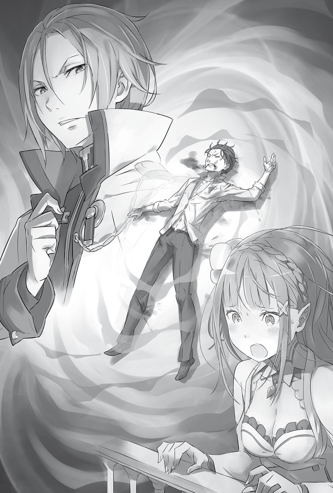
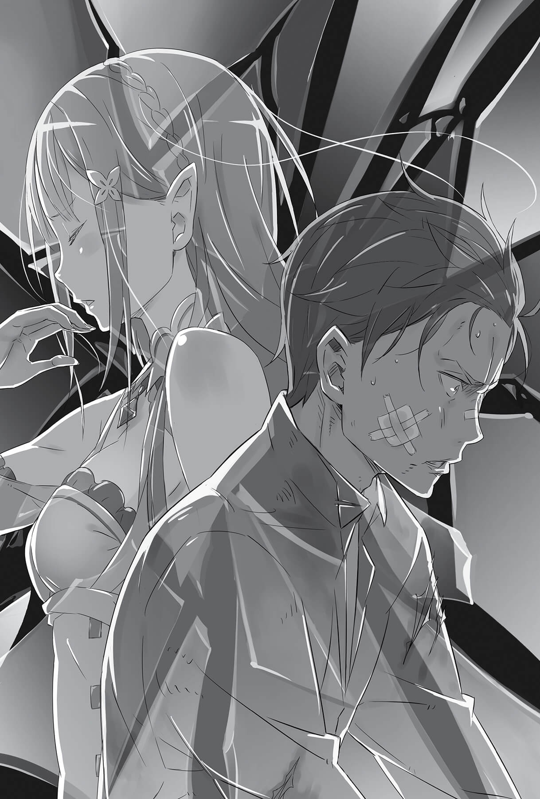

## 1

О том, как развивались дальнейшие события, Субару узнал от Райнхарда и Ферриса, которые заглянули к нему в привратный зал.

— Королевские выборы благополучно начались. Выходит, Субару, теперь ты рыцарь Эмилии. Пожелаем друг другу удачи, мяу.

— Что? А, ну да.

Последняя реплика Ферриса после всего, что произошло сегодня в тронном зале, показалась Субару насмешкой. Феррис не мог не понимать, в каком состоянии теперь пребывает Субару. Однако у юноши не осталось сил отвечать на жестокие шутки. Информация о ходе королевских выборов была важна, однако сейчас его волновала другая проблема.

Видя, что Субару не решается спросить, опасаясь худшего, Райнхард сам ответил на незаданный вопрос:

— Если ты беспокоишься о том старике, могу сказать, что он в полном порядке. Всё обошлось благодаря вмешательству госпожи Фельт.

— А!..

— Судя по всему, ты столкнулся с ним в галерее. Я знаю, вы знакомы, и неудивительно, что ты тревожишься, — Райнхард желал утешить Субару, хоть и не знал истинной подоплёки происходящего.

Увы, тёмное облако в душе юноши никуда не делось, ведь он ничего не предпринял, видя, как деда Рома волокут на расправу…

— Ну и отлично! Нужно поблагодарить Райнхарда и госпожу Фельт! Теперь, Субарунчик, можешь не искать себе оправданий.

У Субару по спине пробежали мурашки. Он поднял голову и посмотрел в лицо Феррису. Жёлтые глаза ярко светились, словно пронизывая его насквозь.

Субару было неприятно: похоже, Феррис прочёл его мысли. Чтобы скрыть замешательство, он отреагировал преувеличенно бодро:

— Вот и чудесно! Всё произошло именно так, как рассчитывал! Значит, я верно рассудил, что лучше доверить это дело Эмилии и Фельт!

Субару по-клоунски замахал разведёнными в стороны руками, чтобы Райнхард и Феррис не догадались о его чувствах.

— Но кто бы мог подумать, что именно из-за этого Фельт согласится участвовать в выборах! Эмилия-тан, наверное, не в восторге от того, что теперь у неё такой сильный противник, как Райнхард.

Субару тараторил без разбора. Собеседники, конечно, за метили его смятение, однако не стали усугублять ситуацию расспросами. Кажется, оба рыцаря жалели юношу, и осознание этого факта ещё глубже ранило его сердце.

— Раз официальная часть закончилась, где же Эмилия-тан?

— Все кандидатки остались в зале, чтобы узнать детали предстоящей процедуры. Когда я сказал, что хочу посмотреть, как ты, Феррис вызвался меня сопровождать.

— Спасибо за заботу, но разве так можно? Разве ты не должен быть рядом со своей госпожой?

Субару мог понять, почему здесь Райнхард, но зачем пришёл Феррис, оставалось загадкой.

— Если ты о безопасности, то всё в порядке. Госпожа Круш гораздо сильнее Ферри.

— Как-то легкомысленно звучит… Тогда почему же тебя взяли в королевскую гвардию?

— Моя сильная сторона в другом. Ты ведь уже знаешь, мяу.

Искоса посмотрев на Субару, Феррис покачал пальцем, на кончике которого засветился синий огонёк.

— Хм, может, мне кажется… будто бы усталость из плеч, колен и спины вдруг стала уходить… но почему?!

— Ох, Субарунчик, у тебя всё тело — сплошная болячка, как у старика.

— Так это и есть твоя сильная сторона? А ведь я действительно слышал, что ты умелый маг воды…

Изначальной целью посещения столицы было именно лечение израненного в схватках со зверодемонами Субару. И в поместье правда говорили, что врачеванием займётся эта девушка… то есть парень с кошачьими ушками.

— Выражение «сильная сторона» недотягивает, Субару. Можно сказать, что среди водных магов Феррис — номер один на всём континенте! Не зря его прозвали Синий Рыцарь, несмотря на столь юный возраст. Это говорит о феноменальных способностях в Магии воды.

— Эх, как только мне дали такое пафосное прозвище, от тех, кому нужна помощь, отбоя не стало, — гордо ответил Феррис на похвалу Райнхарда, даже не думая скромничать.

Если он и правда такой искусный целитель, как говорят, ничего удивительного, что Феррис настолько популярен. И тому, что он согласился лечить Субару, могло быть только одно объяснение…

— Значит, это Эмилия-тан?..

— Она самая!

Услышав подтверждение своей догадки, Субару почувствовал, как тяжело стало на душе. Он представил, сколько ей пришлось приложить сил, чтобы договориться о лечении, и не мог подавить чувство вины, сжавшее сердце.

Если Феррис из лагеря Круш принял заказ на лечение Субару накануне королевских выборов, это означало, что Эмилия попросила о помощи своих конкурентов и теперь была им обязана.

Выходит, и в этом Субару доставил хлопоты Эмилии…

— Слушай, а мне обязательно лечиться?

— Плата за услугу уже получена, мяу. Если ты не пройдёшь лечение, все усилия Эмилии пойдут прахом.

— А что за плата? Если нечто вещественное, можно просто отдать…

— Это не вещь, а то, что не вернуть. Поэтому, к сожалению, я не могу выполнить твоё пожелание.

Приложив руку ко лбу, Субару уныло повесил голову. Он вовсе не хотел путаться под ногами у Эмилии, однако все его действия только мешали ей.

Субару желал помочь. Именно по этой причине он находился здесь. Это было единственное, что придавало смысл его существованию.

— Если ты так сильно переживаешь, что у тебя мало сил, то, видимо, следует…

Безмятежный голос разнёсся по привратному залу, и Субару удивлённо поднял голову. Это сказал не Райнхард и не Феррис. В проёме открытой двери стоял благородный рыцарь Юлиус.

— Чего ты здесь делаешь?! — враждебно спросил Субару, покривившись при виде Юлиуса, но тот спокойно встретил злой взгляд.

— Полагаю, не стоит открыто демонстрировать своё неудовольствие. Я не надеялся на тёплый приём, но давать волю эмоциям неприлично.

— И что с того?

— Это бросает тень на тех, кто рядом. Впредь будь осторожен.

— Гкх…

Ироничное замечание попало в самую точку, и Субару чуть не задохнулся от злости.

— Кажется, ты спросил, зачем я здесь. — Пройдя мимо Субару, Юлиус направился к окну и выглянул во двор, отделённый от внешнего мира крепостной стеной, а затем прищурился. — Разумеется, для того, чтобы встретиться с тобой. Я хочу, чтобы ты составил мне компанию.

Изящно поведя рукой, Юлиус словно спрашивал, что Субару ответит на это. Судя по колючими взглядам, которыми они обменялись, предложение вряд ли было дружеским.

— Вот что я скажу: никогда не ведусь на такие подначки, если не знаю, куда и зачем меня зовут. Так что придётся тебя послать!

— Место встречи — плац. А цель… ну, как сказать… — Юлиус опустил голову, словно задумался, а затем с вызывающей улыбкой бросил: — Скажем так, цель встречи — показать тебе, что такое реальность.

## 2

Через десять минут после того, как они обменялись колкими любезностями, Субару стоял на круглой площадке, по сыпанной песком.

Выйдя из привратного зала, они направились в ту часть крепостного двора, которая граничила с казармой королевских гвардейцев. Плац из утоптанной красно-коричневой глины был обнесён прочной стеной, и всё вокруг словно дышало историей.

Площадь плаца была примерно с половину школьного двора — достаточно, чтобы побегать друг за другом и скрестить мечи.

Потопав ногами по земле, Субару начал разминаться.

— Юлиус, лучше прекрати! Это на тебя не похоже.

Райнхард, стоявший неподалёку, попытался остановить Юлиуса. На лице у красноволосого рыцаря не было ни раздражения, ни злости, лишь беспокойство за Субару.

— Он и правда перегнул палку, но можно ограничиться устным выговором, чтобы мальчишка исправился на будущее. В другой ситуации ты и сам пришёл бы к такому выводу.

— В другой ситуации — да. Ты абсолютно прав, мой дорогой друг Райнхард.

Снимая церемониальную накидку, Юлиус холодно посмотрел на Райнхарда.

— Если бы это произошло в другой день и в другом месте, возможно, я бы оставил его в покое. Однако сегодня — особый случай. Он посмел надругаться над идеей нашего служения! И не только отказался извиниться, наглец оскорбил лично меня!

На плацу воцарилась мёртвая тишина.

— Я обвиняю его в том, что он попрал рыцарскую гордость!

— Да!

В этот момент по крепостному двору словно пролетел сильный порыв ветра, от которого заложило уши. Впрочем, на самом деле это зазвучали возгласы присутствующих.

Юлиус был представителем гвардейцев, а Субару нанёс им оскорбление, и теперь они собрались, чтобы посмотреть, чем кончится поединок.

— Сто к одному, на меня вряд ли кто поставит… Хоть плачь от подобной непопулярности, — пробормотал Субару.

Впервые в жизни такое множество людей было агрессивно настроено против него. Субару даже казалось, что гнев рыцарей клонит его к земле, заставляя колени сгибаться. Однако пульс оставался ровным, в руках и ногах ощущалась тяжесть, не дрожь. Но дело было не в том, что юноша покорился судьбе…

Субару так и не успел разобраться в своём душевном состоянии, когда Юлиус обратился к нему:

— Итак, прежде чем мы начнём, спрошу тебя ещё раз: намерен ли ты просить прощения за собственную грубость? Если принесёшь извинения, я прощу тебя.

— «За грубость»? Что-то не припомню ничего подобного… И как же я должен извиняться?

— Со слезами пасть ниц. Или, словно преданный пёс, кататься по земле и вилять хвостом. Что выбираешь?

— Пожалуй, ни то, ни другое не выглядит элегантно. Я отказываюсь.

Скорее всего, Юлиус и не надеялся, что Субару согласится. Он коротко кивнул, передал свой боевой меч стоящему рядом рыцарю и взял деревянный клинок.

— За такую наглость стоило бы зарубить тебя на месте. Но, к сожалению, ты являешься слугой госпожи Эмилии. Поэтому мы проведём схватку на деревянных мечах.

Юлиус бросил взгляд на Субару, желая удостовериться, что тот не против, и юноша махнул рукой, подтверждая своё согласие. Юлиус кивнул, не дожидаясь жеста, он понял всё по выражению лица.

— Итак, нашим секундантом будет Феррис.

— Да-да!

Юлиус посмотрел на стоящего в стороне Ферриса, который бодро махал ему рукой.

Было сложно понять, о чём тот думает, поскольку он очень легко согласился стать секундантом и, в отличие от Райнхарда, будто бы радовался предстоящему поединку.

— Ферри желает тебе удачи! Какие бы серьёзные раны ты ни получил, я тебя вылечу. Разумеется, если они не будут смертельными. Держись, Субарунчик!

— Почему ты говоришь об этом только мне? О нём не станешь беспокоиться?

— Ого, какой настрой! Господа, вы это слышали? — Феррис, обернулся к публике и взмахнул руками, словно дирижёр. Над плацем громыхнул дружный хохот гвардейцев — они от души потешались над безрассудством Субару.

Чувствуя спиной насмешливые взгляды, юноша сделал несколько шагов по направлению к Юлиусу. Взяв один из деревянных мечей, он покрепче сжал рукоять в ладони.

— Рад, что ты полон решимости. Итак, приступим, — провозгласил Юлиус начало боя.

Ощущая воцарившееся на плацу напряжение, словно мелкие электрические разряды на коже, Субару встал в стойку и на пробу махнул деревянным мечом.

— Стоп-стоп! Как-то он мне не подходит, — покрутив тренировочный снаряд в руке, пожаловался юноша.

— Правда? Не думаю, что мечи разные, но давай поменяемся.

— Прости. Я же современный парень, мне сложно пользоваться тем, что не ложится в руку.

Приняв с этими словами клинок Юлиуса, Субару протянул ему свой.

— Ой!

Не успел Юлиус взять меч в руки, как Субару разжал пальцы. Меч упал, и рыцарь потянулся за ним. До этого Юлиус стоял выпрямившись, а теперь наклонился и потерял преимущество в росте.

— Ха!

В этот самый момент Субару сделал выпад, взмахнув своим клинком снизу вверх, надеясь попасть в подбородок противника. Свободной левой рукой он швырнул в глаза Юлиусу горсть песка, который незаметно собрал во время разминки.

Не успев злорадно насладиться своей хитростью, Субару вдруг услышал у самого уха:

— Ты и правда лишён гордости! Легко, наверное, живётся таким бесстыдным людям!

И в тот же миг Субару почувствовал острую боль в солнечном сплетении.

Сильный удар в грудь отозвался во всём теле, ноги оторвались от земли, и через мгновение Субару рухнул лицом вниз. Во рту почувствовался песок и кровь, приступ тошноты подкатил к горлу, и сознание помутилось из-за невыносимой боли. Откуда-то издалека донеслись крики зрителей, обрадованных тем, что наглец жестоко наказан.

Стон скорчившегося на земле юноши тоже запоздало взмыл к равнодушному небосводу.

Куда-то высоко-высоко…

## 3

— Разрешите доложить. В настоящий момент на плацу рыцарь Юлиус и… слуга госпожи Эмилии Субару Нацуки ведут тренировочный бой.

— Что?! — непроизвольно воскликнула Эмилия, услышав доклад стражника.

Она пыталась спокойно и трезво проанализировать эти слова, но не понимала их смысла.

— П-почему… почему они это делают? Плац?.. Это же рядом с казармой гвардейцев. Там дерутся Юлиус и Субару?

— Прошу прощения, но это не драка, а тренировочный бой. Драки начинаются из-за личной неприязни, и подобное предположение бросает тень на честь рыцаря Юлиуса, — пояснил стражник Эмилии, которая не могла скрыть недоумения. Девушка была слишком взволнована, чтобы обратить внимание на ироничную интонацию докладчика.

Ей вспомнилась словесная перепалка между Субару и Юлиусом у дверей кордегардии. Они явно друг другу не понравились и, наверное, могли устроить дуэль…

— В любом случае это нужно немедленно остановить! Проводите меня до плаца.

— Я не считаю, что стоит вмешиваться, — прозвучал высокий голосок. Перед Эмилией, подняв руку, стояла Анастасия. Девушка привлекла к себе всеобщее внимание.

Сейчас кандидатки и лица, имеющие непосредственное отношение к выборам, переместились из тронного зала в кабинет для совещаний. Разумеется, доклад стражника слышала не только Эмилия, но и все присутствующие.

— Я хотела бы уточнить, кто же начал этот «тренировочный бой»?

— Насколько мне известно, рыцарь Юлиус. Однако господин Субару Нацуки принял его вызов, и теперь…

— Ясно, можете не продолжать. Мне достаточно услышанного, — Анастасия кивнула стражнику, а затем обернулась к Эмилии. — Раз начал он, я против того, чтобы останавливать поединок.

— Но твой рыцарь и мой… мой знакомый дерутся! Ты что, не волнуешься?

— Волнуюсь? О чём? О том, что Юлиус перестарается и мне придётся оплачивать лечение мальчика?

Анастасия с неприкрытым удивлением наклонила голову набок, а Эмилия от такой наглости потеряла дар речи.

Вместо Эмилии отозвалась Присцилла. Она захихикала.

— Верно! Насколько я могу судить, этот глупец слишком много думает о себе, не понимает, где его место. Он получит хороший урок и впредь будет скромнее!

— Точно! Он пламенно тут выступал, но теперь, полагаю, от боевого настроя не осталось и следа!

— П-послушайте!.. Разве сейчас время говорить об этом? — дрожащим голосом произнесла Эмилия. Она не могла поверить, что соперницы говорят о происходящем с неприкрытой издёвкой.

— Но что испугало Эмилию ещё больше, так это слова Круш, которая долгое время оставалась безучастной:

— Если бы вызов бросил слуга Эмилии, было бы правильно предложить примирение. Но раз дуэль начал Юлиус, а мальчишка согласился, то останавливать их ты не вправе.

— Почему же?.. И да, Субару не мой…

— Если ты этого не понимаешь, объяснять нет смысла…

Круш говорила тоном, не допускающим возражений.

— А зачем этот стражник прибежал сюда? — с раздражением в голосе спросила Фельт, которой не нравилось, что из-за этого переполоха всё застопорилось. — Если они просто дерутся, можно потом доложить, кто выиграл. Я ещё понимаю, сообщить, что бой вот-вот начнётся, но на кой чёрт врываться и вопить в разгар драки?

Стражник, которому Фельт, скрестив руки на груди, с вызовом адресовала этот вопрос, замялся. Почувствовав неладное, Маркос шагнул к своему подчинённому.

— Доложи!

— Е-есть! Тренировочный бой между рыцарем Юлиусом и господином Субару Нацуки… не выглядит как бой. Господин Субару только обороняется. Я пришёл за указаниями!

— Обороняется?

— Должно быть, рыцарь Юлиус знает, что делает… но на это невозможно смотреть.

Судя по всему, стражник видел что-то страшное и теперь не смел поднять глаз на Эмилию. Его слова мгновенно изменили ситуацию.

— Это надо остановить!

Слова стражника стали последней каплей. Эмилия, до сих пор сомневавшаяся, пулей вылетела из кабинета и побежала по галерее к казармам гвардейцев и плацу.

— Может быть, последуем за барышней и посмотрим на тренировочный бой? — подняв руку, предложил Ал после того, как Эмилия исчезла за дверью. — Принцесса, ты ведь такое любишь. Шоу, в котором свирепый зверь терзает слабую жертву.

— Не придумывай про меня небылицы, Ал! Хотя ты прав, очень люблю! — Присцилла обольстительно улыбнулась, покачивая пышной грудью. — Почему бы и нет! Скучные беседы слишком затянулись, невозможно больше слушать. Посмотрим, в каком жалком положении окажется тот глупец, и посмеёмся над ним!

Присцилла указала веером на стражника, вытиравшего холодный пот.

— А ты проводишь меня. Это приказ!

## 4

Кровь из разбитого лба залила правый глаз, окрасив окружающий мир в кроваво-красный цвет, и юноша неловко стёр её.

Он уже сбился со счёта, в который раз его швырнули на землю. Распухший левый глаз ничего не видел, во рту был солоноватый привкус. Рассечены губы или же причина в другом — он не понимал.

Но сильной боли не чувствовалось.

Возможно, он потерял способность ощущать боль, или же мозг так реагировал на адреналин… Вероятных причин была масса.

Однако, скорее всего, забыть о боли Субару помогла самая банальная, примитивная ярость.

— Полагаю, тебе пора признать поражение!

Даже видя, как отчаянно сопротивляется Субару, Юлиус не думал хвалить его; на лице рыцаря читалась лишь скука.

Сам Юлиус по-прежнему выглядел безупречно: ни песчинки на костюме, ни капли пота на лице. Он просто взмахивал деревянным мечом, снова и снова бросая Субару на землю.

— Надеюсь, ты уяснил, в чём разница? Увидел пропасть, которую тебе ни за что не преодолеть? Думаю, теперь ты знаешь, кто такие рыцари, о которых посмел отзываться с пренебрежением?!

Он не взывал к разуму, не пытался переубедить. Юлиус вколачивал свои слова в Субару, подкрепляя их грубой силой. Рыцарь жестоко избивал юношу, но тот продолжал отчаянно и безрассудно упрямиться перед лицом реальности, в которую его тыкали носом. Коса нашла на камень, и ситуация казалась неразрешимой…

— Сопротивляясь дальше, ты рискуешь жизнью!

— Я от такого не помру… И не думай… что всё понимаешь…

— Будто ты сам знаешь, о чём говоришь!

— В этом мире… именно я знаю о смерти… побольше других…

Семь. Именно такое количество смертей пережил Субару с тех пор, как оказался в альтернативном мире. Вряд ли в целой вселенной можно найти человека с аналогичным опытом.

Люди часто говорят: «до смерти досадно», «до смерти обидно», «до смерти страшно»… но от этого не умирают.

Тряхнув гудящей от ударов головой, Субару с трудом поднял меч и бросился в атаку с хриплым боевым кличем. Как только Юлиус оказался в пределах досягаемости, юноша попытался нанести удар.

— Как некрасиво!

Но, не сумев даже задеть врага, Субару получил резкий удар по запястью правой руки, сжимающей меч. Деревяшка полетела на землю. Провожая её взглядом, Субару почувствовал сильный тычок в солнечное сплетение. Хватая ртом воздух, он покатился, сделал пять оборотов и упал плашмя, раскинув руки и ноги. Субару остался лежать, харкая кровью.

Столпившиеся по краю плаца рыцари и стражники по-прежнему наблюдали за публичным избиением, которое устроил Юлиус. Но теперь уже никто не кричал и не подначивал его.

Их глазам предстал наглец, который посмел принижать рыцарское достоинство на королевских выборах, в судьбоносный для страны день. Юлиус, один из сильнейших гвардейцев, решил проучить задиру, чтобы тот на своей шкуре почувствовал, что натворил. И ради того, чтобы это увидеть, собрались зрители.

И в самом деле, первые минут десять каждый выпад Юлиуса сопровождали восторженные возгласы, а неприглядный вид Субару вызывал лишь насмешки. Но когда стало ясно, что это не бой, а публичное наказание, всё изменилось.

Мастерство соперников нельзя было даже сопоставить. Все атаки Субару оказывались отражены, а попытки защититься терпели крах одна за другой. Юноша вновь и вновь валился на землю.

Первые несколько падений сопровождало насмешливое улюлюканье. Но счёт перевалил за десяток, и его сменило раздражение от беспомощности жертвы. А когда это повторилось столько раз, что надоело считать, зрителям захотелось отвести глаза.

Этот бой следовало остановить. Любому было понятно, кто тут победитель, а кто побеждённый; было понятно и то, насколько рыцарь превосходит в силе своего противника.

Однако Юлиус продолжал безжалостно избивать Субару, не давая ему поблажек. Как ни странно, но и секундант Феррис, имевший право остановить поединок, не делал этого, несмотря на ранения Субару. И юноша из раза в раз вставал на ноги, обманывая надежды рыцарей на то, что всё скоро закончится.

Каждому было понятно, что битва бессмысленна. Зрители могли наблюдать лишь одно — жалкое, неприглядное упрямство. Собравшиеся чувствовали, что обязаны увидеть развязку. Как бы зрители ни хотели отвернуться от постыдного действа или уйти, они ощущали ответственность за происходящее, пусть и косвенную.

Субару, дрожа всем телом, вновь поднимался под пристальными взглядами. Подобрав валяющийся рядом деревянный меч и опершись на него, юноша встал на ноги.

Он вновь сплюнул сгусток крови.

Глядя на измученную фигуру, каждый из присутствующих понял: следующий раунд станет последним в этом бессмысленном противостоянии.

## 5

«Ещё один удар — и конец», — решил Субару в глубине души. По иронии судьбы его намерение совпало с выводом, к которому успела прийти публика, видя, как он избит. Однако юноша не обращал никакого внимания на взгляды окружающих.

На плацу были только он и Юлиус.

Если его ещё раз ударят, подняться не получится. Даже если Субару заденет противника мечом, это уже ничего не изменит.

Тогда почему же он не сдаётся? Зачем упрямится, если исход предрешён?

Юноша не знал ответа. Он даже не помнил, по какой причине начался этот бой. Он с ненавистью глядел заплывшими от побоев глазами на безупречного Юлиуса. Субару решил, что вложит все оставшиеся силы в последний удар и сломает переносицу этому отвратительному типу.

Каждый вдох отзывался в лёгких волной боли. Каждый выдох обжигал пересохший рот. Пользуясь этой болью как союзником, Субару удерживал сознание, готовое вот-вот отключиться, и, собрав последние силы, выжидал удачного момента.

Момента, когда Юлиус потеряет бдительность.

Больно, больно, больно, больно, больно, больно, больно, больно, больно, больно, больно, больно, больно, больно, больно, больно, больно, больно, больно, больно, больно, больно, больно, больно, больно, больно, больно, больно, больно, больно, больно, больно, больно, больно, больно, больно… умри!

Пересиливая раздирающую боль, Субару не упустил момент, когда взгляд Юлиуса дрогнул.

Юноша не слышал звуков. Он отбросил всё, вложив последние силы в свой меч.

Юлиус, отвлёкшись на мгновение, ещё не отреагировал. Но что завладело его вниманием? Едва живые клеточки мозга Субару не могли дать ответа, ведь все оставшиеся силы организма были направлены на этот последний удар.

Субару показалось, что он слышит голос.

В онемевшем, глухом мире, в котором не существовало ничего, кроме него самого и противника, которого должно одолеть.

— …ру!

Он услышал голос. Чей-то голос. До ушей Субару донёсся чей-то голос.

Но его рассудок ушёл глубоко в себя; всё исчезло, забылось, утонуло в ненависти. Лишь это чувство, направленное на врага, стоящего перед ним, сейчас поддерживало юношу в сознании.

— …бару!

Голос звучал всё отчётливее. Он начал понимать смысл слов. Как только юноша чётко услышит его, пути обратно уже не будет!

Поэтому Субару собрал все физические и душевные силы, словно пытаясь убежать от чего-то угрожающего.

— Субару!

— Шама-а-ак! — закричал юноша.

В тот самый момент, когда до него отчётливо донёсся серебряный голосок, Субару изо всех сил заорал, заглушая его.

Мгновенно возникло чёрное облако, покрывшее коричневатую землю плаца, и всё исчезло. Перед юношей разверзся мир забвения, и Субару понёсся сквозь него с криком. Он обрушил меч в тот момент, когда остатки помутившегося сознания подсказали: «Пора!»

Руки, занёсшие оружие до того, как всё поглотило чёрное облако, сработали сами, раньше, чем он успел сообразить, что происходит.

— Значит, это и есть твой козырь?!

В мире, в котором он ничего не видел, до ушей Субару вдруг донеслись отчётливые слова.

Чёрное облако рассеялось, и перед Субару, со свистом рассекая воздух, пронёсся деревянный меч, снова безжалостно швырнув его на землю.

— То, что ты можешь использовать Магию тени, удивительно. Признаю, впечатлил.

Слыша голос, доносящийся откуда-то сверху, юноша чувствовал не боль, а удивление. Распластавшись на земле и глядя в небо, Субару осознал, что ему не осталось ничего другого, как принять реальность такой, какая она есть.

— Однако твой уровень владения магией слишком низок. Вряд ли она подействует на кого-то. Разве что на человека, который ещё слабее, или на неразумного зверя. Не только против меня, но и против любого из гвардейцев это не сработает, — вещал голос, словно подтверждая, что пора признать поражение.

А он-то думал переломить ситуацию. Надеялся, что даже такой, как он, способен хоть на что-то…

— Ты слаб и безнадёжен. Тебе не место рядом с ней.

Субару из последних сил противился, он ни за что не мог принять их — слова, отрицающие самый смысл его существования. Мотая головой и страдая от бессильного желания затолкать их обратно в глотку противнику, Субару попытался поднять запухшие веки.

Но встретился со взглядом фиалковых глаз.

С террасы замка, выходящей на плац, Эмилия смотрела на него, перегнувшись через перила. За её спиной стояли другие девушки, которых он уже знал, и равнодушно глядели на происходящее.

Но юноше было неважно, что о нём подумают… Ведь здесь находилась она, та единственная, перед которой он ни за что не хотел бы предстать в столь жалком обличье…

Субару почувствовал, как где-то внутри него словно обо рвалась натянутая нить, и понял, что отключается.

Сознание, ещё недавно ясное, стало гаснуть. Мир стремительно терял краски и теперь действительно исчезал. Юноша погружался в темноту.

— Субару!

Ему показалось, что до ушей донёсся шёпот, которого он не должен был услышать, и всё исчезло.

## 6

Очнувшись, юноша с удивлением уставился в потолок. Такой комнаты он не помнил.

Для Субару, который всегда легко просыпался, время после пробуждения, когда всё вокруг словно плавает в лёгкой дымке, было очень ценным. На несколько секунд он погружался в безмятежный огромный мир, пока его сознание, словно неводом, вылавливало из памяти неясные картины: что произошло до того, как заснул, где находится…

Виски пронзила острая боль, и юноша тут же пришёл в себя.

— Точно!..

Он вспомнил, в какую переделку попал и каким образом оказался здесь. Поднеся руку ко лбу, он почувствовал в ней боль. На запястье виднелся большой шрам, которого он не помнил, — наверное, рана быстро зажила благодаря лечению магией.

Ощущая новые раны на своём теле, он вдруг всё понял.

— Выходит, я не умер!

Ощупав недавно разбитый лоб и убедившись, что почти не чувствует боли в правом запястье, которое, кажется, было сломано, он удовлетворённо выдохнул, радуясь, что лечение избавило его от физических страданий. Если бы удалось так же легко избавиться и от ощущения собственной ничтожности, тлеющего в груди, можно было бы сказать, что всё позади… но нет.

— Субару!

Печальный взгляд девушки не могла исцелить никакая магия…

Она сидела в кресле возле постели, фиалковые глаза были полны тревоги. Белый плащ, теперь ненужный, лежал на коленях.

Судя по тому, что солнце за окном приближалось к горизонту, Субару сделал вывод: прошло несколько часов после поединка.

— Беседа с кандидатками на престол уже закончилась? — Субару попытался завести разговор на отвлечённую тему. Но глаза Эмилии, явно ожидавшей объяснений, удивлённо распахнулись, когда она поняла, что юноша делает вид, будто ничего не произошло.

Да, закончилась. Практически всё, что нам хотели сообщить, было сказано в тронном зале, поэтому оставались только второстепенные вопросы. От меня почти ничего и не требовалось, лишь Розвааль несколько раз кивнул, — кажется, в голосе Эмилии сквозила досада. Субару почувствовал странное удовлетворение, словно девушка, сожалевшая о собственной робости, каким-то образом разделяла его слабость и унижение…

Чтобы Эмилия не заметила этого, юноша поспешил нацепить легкомысленную маску.

— Ясно-ясно. Значит, ты столько времени просидела тут, пока я дрых. Давай вернёмся в гостиницу. Встретимся с Рем и обсудим предвыборную стратегию.

— Субару!

— Здесь, в крепости, и у стен есть уши. Чтобы спокойно поговорить, наверное, лучше вернуться в поместье. А для начала надо пообщаться с влиятельными особами в столице…

— Субару…

— Хотя… нет! Пожалуй, следует вступить в какую-нибудь коалицию с другими кандидатками. Ведь выборы будут трудными, и неизвестно, с какими препятствиями мы столкнёмся…

— Субару!!!

Только резкий оклик Эмилии остановил юношу, который торопливо громоздил слова друг на друга. Замолчав, он наконец-то посмотрел ей в глаза.

— Нам надо поговорить! — тихо, но непререкаемо сказала она.

Поднявшись, Эмилия крепко сжала в руках плащ. По её напряжённому лицу можно было догадаться, что предстоящий разговор будет непростым.

— Субару, мне нужно задать тебе много вопросов. Действительно очень много.

— Ну да, наверное…

У Эмилии задрожали губы, словно она не могла решить, с чего начать.

Субару, как никто другой, понимал её теперешние сомнения. Всё, что он совершил сегодня, было спонтанным и не вписывалось в рамки ожиданий. Конечно, Эмилия хочет выяснить, почему он так себя вёл.

И если ему придётся отвечать, Субару сможет без стеснения всё рассказать. Однако вопрос оказался иным.

— Скажи, почему ты дрался с Юлиусом?

Объяснить это было намного сложнее.

— Наверняка была какая-то причина, так ведь?

Юлиус появился, когда Субару сидел в привратном зале. Он принял вызов гвардейца и направился на плац, сразу же догадавшись, что Юлиус намерен проучить его за неучтивость, проявленную в тронном зале.

Субару знал, что силы неравны. С самого начала он понимал, что шанса на победу нет. Но, несмотря на это, он взял в руки деревянный меч, вступил в схватку и, обречённый на проигрыш, был повержен.

Зачем же он всё это сделал? Ответ был один.

— Я хотел отплатить ему.

— Что?!

Субару поднял взгляд. Смотря в прекрасное лицо и непонимающие глаза, Субару продолжил:

— Я хотел показать, что стою чего-то. Если бы получилось нанести хоть один удар… я думал, что смогу… Если бы я хоть немного приблизился…

Мысли рассыпались. Он ненавидел себя за то, что не мог превратить в слова то, о чём думал. Сумей он раскрыть чувства, которые пылали в его душе, не пришлось бы так мучиться от бессилия.

— Субару…

— Я упрямился. Он говорил, что я жалкий, слабый, бесполезный и не стою тебя. Он пытался выгнать меня прочь, и я ненавидел его за это… Потому и вступил в бой.

Таким был ответ.

Юлиус яростнее остальных упрекал Субару в том, что тот недостоин Эмилии. Но юноша понимал это и без Юлиуса лучше, чем кто-либо.

Юлиус с лёгкостью сорвал с Субару маску, которую тот так долго лепил, желая скрыть истинные чувства. Субару не мог простить такого и бросился в драку.

Ответ понурившегося юноши заставил Эмилию на мгновение замереть.

— Только… ради этого? — с трудом проговорила она и умолкла.

Наверное, девушка ожидала более осмысленный ответ. Вымышленный идеал разбился о тусклую реальность, в которой Субару просто проявлял глупое упрямство.

Услышав последнюю фразу, исполненную разочарования, Субару слабым голосом пробормотал, не поднимая глаз:

— Тебе… этого не понять, Эмилия-тан.

И тут Субару вдруг понял, что пытается переложить вину за свои промахи на неё. Более того, он отрицал даже саму возможность того, что Эмилия поймёт его. Юноша сам отказывался от искреннего участия. Оправдания хуже и специально не найти!

— Ты прав.

Субару не смог поднять взгляда, когда услышал тихий ответ. Голос Эмилии звучал так, словно она поняла объяснения и, чтобы закрыть тему, сама поставила точку.

Такая реакция помогла Субару немного успокоиться, он почувствовал, как напряжённые плечи опустились. И в этот самый момент Эмилия проговорила:

— Мы с Розваалем завтра возвращаемся в поместье. А ты останешься в столице и пройдёшь лечение.

Не сразу поняв, о чём идёт речь, Субару открыл рот и только смог выдавить:

— Что?..

Глядя, как юноша мотает головой, показывая, что ничего не понял, Эмилия, словно через силу, посмотрела на него.

— Таков был уговор с самого начала. Ты приехал в столицу, чтобы пройти лечение. Нужно исправить разрушенные врата. Я обо всём договорилась с Феррисом, твоя задача — делать, что он скажет, отдыхать и поправляться.

— Н-но постой…

— В столице мы передаём тебя заботам Ферриса… хотя даже не так, заботам госпожи Круш. Ты будешь вместе с Рем, так что не беспокойся о бытовых мелочах.

Эмилия быстро сообщила Субару о дальнейших планах. Осознав, что в них совершенно не учитываются его собственные желания, Субару отчаянно воскликнул:

— Постой!

Протянув руку, он схватился за рукав её платья, пытаясь остановить Эмилию.

— Почему так неожиданно?.. Я…

— Если ты будешь рядом со мной, опять натворишь глупостей. — Эмилия глядела в сторону.

От этих слов у Субару перехватило дыхание, и он тихо возразил, отчаянно желая, чтобы она обернулась и посмотрела на него:

— Не говори так…

— Но разве я не права? С первой нашей встречи… и в усадьбе… и сегодня… ты же всё это делал, потому что я была рядом?

В её голосе слышалось явное недовольство. Столкнувшись с незнакомой, совершенно несвойственной Эмилии интонацией, Субару лишь бессильно покачал головой.

— Я говорил совсем не об этом. Я просто…

— «Просто»?!

— Я просто хотел что-нибудь сделать ради тебя.

— Ради… меня?!

Когда она повторила его слова, Субару торопливо закивал. Именно ради Эмилии он отчаянно шёл наперекор судьбе. Юноша страстно желал быть понятым. И потому следующие слова Эмилия заставили его потерять дар речи.

— Наверное, всё же ради себя?

Мозг Субару отказался работать.

Он не понимал, что Эмилия ему сказала. Не понимал, что она имеет в виду.

— Я просто хотел… ради… тебя…

Грусть? Тяжесть? Обида? Его сердце одновременно сдавили злость и желание разрыдаться.

*«Я хочу сделать тебя счастливой! Я хочу помочь тебе достичь желаемого! Я хочу защитить тебя от всех печалей!»*

Именно это лежало в основе всех его поступков, таковы были чувства, которые Субару испытывал к Эмилии, то, что двигало им. Так считал сам юноша. И он верил, что даже без слов она почувствует это, поймёт по его действиям. Субару был совершенно убеждён в этом и не принимал во внимание истинные чувства Эмилии.

Мягкая ткань внезапно хлестнула его по лицу, и Субару вскрикнул от неожиданности. Он сбросил её с головы и понял, что это белый плащ с вышитым ястребом. Эмилия, всё это время комкавшая плащ в руках, в ярости швырнула его.

Он был не в силах поверить, что она способна на столь резкий жест, совершенно не вяжущийся с её характером. Даже понимая умом, что это сделала она, юноша не мог принять случившееся сердцем.

Ведь Эмилия, которую знал Субару, всегда была добра и заботлива, даже если не поощряла его упрямство. Она очень хорошо относилась к людям, прощая слабости и помогая им. Но почему же она сейчас так поступила?

В фиалковых глазах бурлил шквал эмоций. Девушка кусала губы, дрожащие от гнева. Казалось, ни выражение лица, ни возмущённый взгляд не принадлежат той Эмилии, которую он знал… но это была именно она. И реакция девушки была адресована ему.

Он понимал, для восхищения сейчас не время, но в этот миг она была так прекрасна!

— Хватит уже врать, что ты всё делаешь ради меня!!!

Волна эмоций хлынула через край в виде слёз, наполнивших глаза. Мотая головой, словно желая освободиться от наболевшего, Эмилия закричала:

— Ты пришёл в замок, ты дрался с Юлиусом, ты использовал магию!.. Хочешь сказать, всё ради меня?! Не помню, чтобы просила об этом!!

Субару был не в силах проронить ни слова.

— Мне кажется, я предельно ясно сказала, чего жду от тебя!

— Я… я…

— Ты помнишь?! Помнишь, о чём я просила?

— Да, я…

Её гнев и возмущение заставили Субару оцепенеть от ужаса. Придя в смятение, юноша никак не мог найти ответа на её вопрос.

Видя, что он молчит, Эмилия зажмурилась и заговорила тише:

— Я попросила тебя остаться с Рем!

Субару не мог выдавить ни звука.

— Я попросила тебя больше не использовать магию, потому что это может привести к непоправимому!

Он помнил обе просьбы.

Беспокоясь за Субару, Эмилия просила его вести себя разумно и не лезть на рожон. Однако ни ту, ни другую просьбу Субару не выполнил.

Если бы, проигнорировав её слова, он добился хоть какого-то положительного результата, то смог бы выкрутиться. В глубине души Субару легкомысленно рассчитывал, что Эмилия всё равно простит его. Однако он не просто нарушил данное обещание и не добился желаемого, но ещё и помешал ей.

Тем не менее… сейчас Субару отчаянно хотел донести, что его мотив был искренним.

— Я виноват в том, что ослушался. Признаю. Честное слово, я сожалею! Но… но всё не так!.. Я действовал не ради себя… — начал Субару, но, увидев тоскливый взгляд Эмилии, словно онемел и сумел лишь выдавить: — Эмилия, ты… не веришь мне?

Прозвучали слова. Слова, что ни в коем случае не следовало говорить. Особенно той, которую Субару только что обвинил в неспособности понять его.

— Я хочу верить. Я хочу верить тебе, Субару, — со слезами в голосе сказала Эмилия. Возможно, она на самом деле плакала. Но Субару не хватало мужества убедиться в этом. Он не мог посмотреть ей в глаза.

Эмилия плакала. Субару Нацуки так старался, чтобы ей не пришлось грустить, и сам довёл её до слёз. И вот в самый ответственный момент…

— Я хочу тебе верить. Но ты сам не даёшь мне!..

Её чувства вырвались наружу.

Она была спокойной и разумной девушкой. Конечно, иногда Эмилия сердилась, но ещё ни разу она не поддалась эмоциям и не потеряла контроль над собой.

Теперь же Эмилия, в словах которой звучали неприкрытый гнев и обида, бросила ему в лицо:

— Ты не сдержал ни одного обещания, Субару! Ты сам дал мне слово, но с лёгкостью от него отказался и появился здесь!

Данное обещание, её доверие… он всё разрушил, прикрываясь тем, что делает это ради Эмилии.

— Ты не держишь слова, а сам желаешь, чтобы я верила тебе? Это невозможно!..

Он хотел во всю мочь закричать, что Эмилия ошибается.

Но его голосовые связки сковал такой спазм, что он не мог издать ни звука. Голова, словно придавленная свинцовым грузом, склонилась. Сидящая перед ним девушка дрожала крупной дрожью и плакала, не в силах контролировать свои эмоции. А что Субару? Он повернулся спиной, продолжая предавать её!..

— Послушай… Почему ты так хочешь мне помочь?

Наверное, именно этот вопрос Эмилия неоднократно пыталась задать, но каждый раз её что-то останавливало. Она видела, как Субару отчаянно рвался вперёд, несмотря на раны; как он улыбался, испытывая боль; как бросался в смертельный поединок. И каждый раз она задавалась этим вопросом.

И не было ничего удивительного, что этот вопрос наконец прозвучал. Если бы Эмилия не задала его сейчас, то продолжала бы теряться в догадках: отчего же Субару так старается ради неё? Этот вопрос стал её последней попыткой протянуть юноше руку помощи.

Субару был уверен, что теперь, когда он нарушил данное слово, любые заверения прозвучат фальшиво, но Эмилия всё равно пыталась понять его и найти ответ.

Почему Субару так старался ради Эмилии?

Почему, попав в этот мир, он настолько привязался к ней?

— Я хочу сделать ради тебя всё, что могу, потому что ты меня спасла.

— Я… спасла тебя?

— Да.

В тот самый момент, когда он неожиданно оказался в альтернативном мире. Он был растерян, не знал, куда идти; он столкнулся с насилием, к которому совершенно не привык; он думал, что тут ему и придёт конец.

— Наверное, ты и сама не представляешь, сколько сделала, чтобы спасти меня. Не выразить словами, как ты мне помогла!

Эмилия не просто спасла его жизнь, она позволила Субару остаться самим собой. Он не смог бы ничего сделать, если бы Эмилия в тот самый первый момент не пришла ему на помощь. Поэтому всё, что он совершил потом, все его отчаянные усилия и подвиги были лишь попыткой отплатить за добро.

— Я не понимаю, Субару…

— В этом нет ничего удивительного. Но это правда. Ты спасла меня. Поэтому поначалу я просто хотел… вернуть тебе долг. Но сейчас…

Субару собирался сказать, что теперь всё по-другому, но…

— Говорю же, я не понимаю!

Но его слова не дошли до Эмилии. Она гневно замотала головой, тряхнув серебристыми волосами. Глядя на Субару глазами, полными слёз, и тяжело дыша от обуревающих её чувств, девушка прокричала:

— Я спасла тебя?! Не может такого быть! Мы впервые встретились на воровском складе, и до того я тебя в жизни не видела!!!

— Нет, всё не так!..

— Если бы мы встречались прежде, если бы это было правдой, то я бы… я бы… — Эмилия закрыла лицо руками, она не желала ничего слушать, замкнулась в своей скорлупе, и юноша не мог пробиться сквозь неё.

Что же из сказанного так ранило её? Он не понимал. Но, даже не понимая, должен был говорить. Поэтому, собрав всю оставшуюся волю в кулак, продолжил:

— Может быть, ты не понимаешь. Но всё равно выслушай меня. Это правда! Когда я впервые оказался в этом мире, я… видел тебя…

В это мгновение пространство и время застыло. Субару понял, что пытается нарушить табу.

И лихорадочное биение его собственного сердца, и голос Эмилии отдалились на какое-то невероятное расстояние, и даже стоящий в его ушах звон стих, уступая место безмолвию.

Субару охватил бессильный гнев. Он злился на собственную неосторожность и на неведомую тень, которая причиняла ему чудовищную боль, стоило лишь проговориться об уникальной способности.

Сделав предупреждение юноше, который хотел нарушить табу, остановившийся мир опять ожил, и Субару почувствовал, что весь покрылся испариной.

На этот раз по какой-то непонятной прихоти неведомые силы не наказали его болью. Однако стоит сейчас сболтнуть лишнего, как тень безжалостно стиснет сердце Субару в замершем мире. Он вспомнил эту боль, и слова, готовые вырваться наружу, застряли в горле. Его искренние чувства, которые он страстно желал донести до Эмилии, превратились в невероятную тяжесть, пригнувшую юношу к земле.

— Ты опять молчишь, —- в голосе Эмилии звучали холод и разочарование, словно она наконец махнула на него рукой.

Субару душила злость. Тоска, не находя выхода, разрывала сердце. Что он мог теперь сделать? Юноша пытался поведать ей о своих чувствах, но Эмилия не желала слушать. Он хотел рассказать о том, что происходило с ним на самом деле, но появилась проклятая тень и помешала.

— Почему же ты не понимаешь?..

— Субару.

— Я думал, что уж ты-то точно всё поймёшь…

— Субару, в твоей голове я совсем другая.

Эти слова были полны такого разочарования, что он буквально физически почувствовал, как Эмилия стремительно отдаляется.

Когда остолбеневший Субару поднял голову, Эмилия отвела взгляд и посмотрела в сторону.

Кому же она адресовала печальную улыбку? Субару? Или самой себе?

— Та Эмилия, что живёт внутри тебя, всё понимает без слов. И твои страдания, и твою печаль, и твой гнев. Понимает тебя как саму себя.

— Но я не смогу понять тебя, если ты не расскажешь.

Всё было кончено. Разбито вдребезги. Фантазия разлетелась на куски. То единственное, во что он верил и на что надеялся в этом мире, исчезло.

— Я…

Собирая все свои силы, претерпевая страшную боль, глотая слёзы и преодолевая невыносимую тоску, он рвался вперёд. И всё это делал для того, чтобы защищать ту, которую считал своим идеалом.

Но этот идеал, придуманный им самим и никогда на самом деле не существовавший, со звоном рассыпался прямо у него на глазах.

— Всё, что я делал…

Его губы дрожали. Глаза жгло от слёз. Язык словно онемел, а сердце билось так сильно, что закладывало уши.

Он встретился взглядом с Эмилией. В её взоре была лишь печаль. Субару в её глазах выглядел жалким, ничтожным…

— Разве ты находишься здесь не благодаря тому, что я сделал?!

Гневный крик Субару разнёсся по комнате.

— И на воровском складе, когда украли твой значок… я же спас тебя от той сумасшедшей убийцы! Рискуя жизнью!.. Потому что ты дорога мне!

Руки Субару изо всех сил сжали простыню, ногти впились в ладони так, что выступила кровь.

— И в поместье!.. Меня кусали, меня чуть не разорвали на куски, но я отчаянно сражался! Мне разбили голову, но я спас всех в деревне! И Рам, и Рем!.. Всё это благодаря мне!

Юноша перечислял все свои заслуги, которые мог вспомнить, пытаясь остановить Эмилию, а она, казалось, уходила всё дальше и дальше.

— Не будь меня, всё обернулось бы трагедией! Никто бы не спасся! Никто, никто, никто! Всё это, всё, всё!.. Всё это благодаря мне!!! Благодаря тому, что там был я!..

И на складе, и в поместье — всё это были результаты его усилий.

Результаты, которыми можно было гордиться, которые должны быть вознаграждены. Потому что всё это сделал именно он. Потому что он так отчаянно старался.

— Ты предо мной в неоплатном долгу! — прокричал Субару, ощущая себя так, словно все чувства, которые толкали его на эти поступки, оказались преданы.

Его старания никак не были вознаграждены. Страстное желание услышать похвалу; свербящая жажда признания; эгоистичное стремление оказаться незаменимым — все чувства, подсознательно обуревавшие его, наконец-то вырвались на свободу.

И для Эмилии, и для Субару эти слова оказались фатальными.

— Да, ты прав, — вдруг сказала девушка дрожащим голосом, и Субару почувствовал, как его лоб покрывается потом.

В её голосе звучали смирение и решимость. Это был конец.

— Я многим, очень многим обязана тебе, Субару.

— Да, точно! Потому я…

— Потому я просто верну долг, и мы положим этому конец.

Субару чуть не подпрыгнул от того, как просто она это произнесла.

Видя, как пустеют глаза Эмилии, он с невероятной остротой осознал, что в запале сказал то, что невозможно забрать обратно. С детской вспыльчивостью он выпустил наружу свои чувства и всё испортил.

Он низвёл их отношения до уровня купли-продажи, выясняя, кто кому остался должен. И это означало, что отношения завершатся, как только случится взаиморасчёт.

— Довольно, Субару Нацуки.

С их самой первой встречи Эмилия дружески звала его по имени. Субару слишком поздно понял, что, потеряв это расположение, никогда уже не сможет его вернуть.

— Сюда скоро придёт Рем и скажет, что тебе нужно сделать. Обо всём остальном я уже позаботилась.

Он не мог выдавить ни слова в ответ. Кажется, Эмилия и не ждала этого. Она развернулась, чтобы уйти. У Субару не осталось ни сил протянуть к ней руку, ни храбрости посмотреть вслед.

Физическое расстояние между ними становилось всё больше, но куда стремительнее росла дистанция между их душами.

— Я… вдруг начала Эмилия, уже взявшись за ручку двери.

Казалось, что она говорит не с Субару, а сама с собой.

— Я ожидала, что ты… именно ты, Субару, не будешь относиться ко мне с предубеждением. Станешь воспринимать как обычного человека, как обычную девушку…

В тронном зале на королевских выборах она требовала беспристрастного отношения к себе. Сколько же страданий пришлось претерпеть Эмилии лишь потому, что она была полуэльфийкой?..

Однако Субару ответил ей шёпотом:

— Я не могу.

Слова Эмилии не предполагали ответа. Поэтому и шёпот Субару был адресован ему самому. Беззвучно повторив то, что она произнесла, юноша покачал головой и чуть слышно пробормотал:

— Даже если бы на свете не осталось других людей, я бы не смог, Эмилия. Я не могу относиться к тебе беспристрастно.

И это были его истинные чувства, вне всякого сомнения…

Хлопнула дверь, и в воздухе повисла тишина.

Субару остался один. Свернувшись калачиком на кровати, он не знал, на чём остановить взгляд… и вдруг обратил внимание на её плащ, зацепившийся за край кровати.

Он дотянулся и взял его в руки. Юноше показалось, что материя ещё хранит тепло хозяйки. Субару прижал плащ к груди, словно пытаясь сохранить связь, которая вот-вот должна была исчезнуть.

В этот день Субару Нацуки впервые в альтернативном мире по-настоящему остался в одиночестве.
