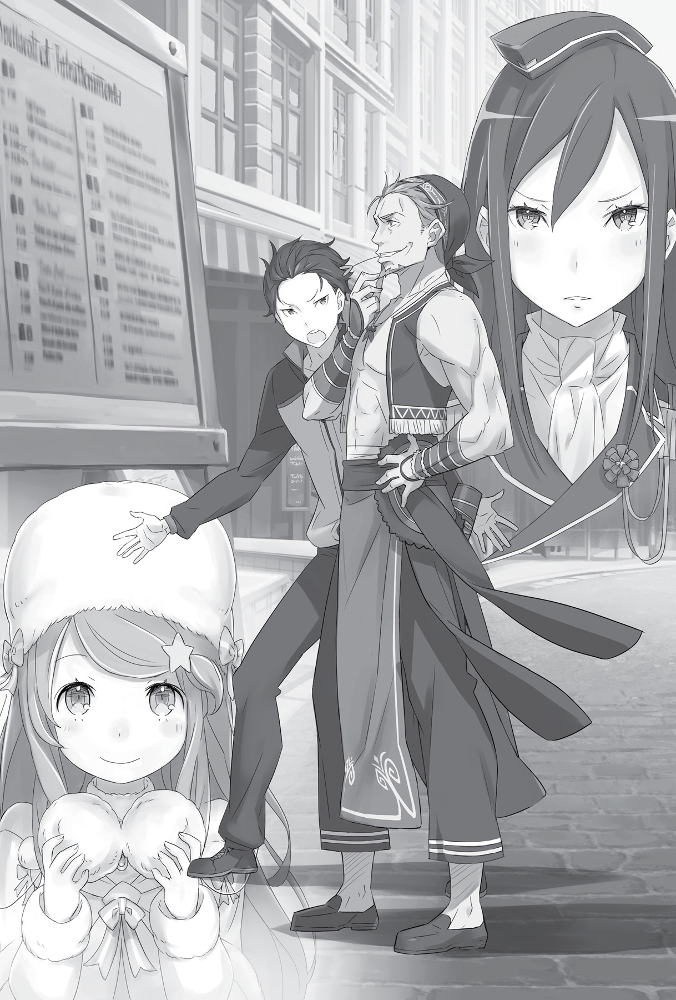
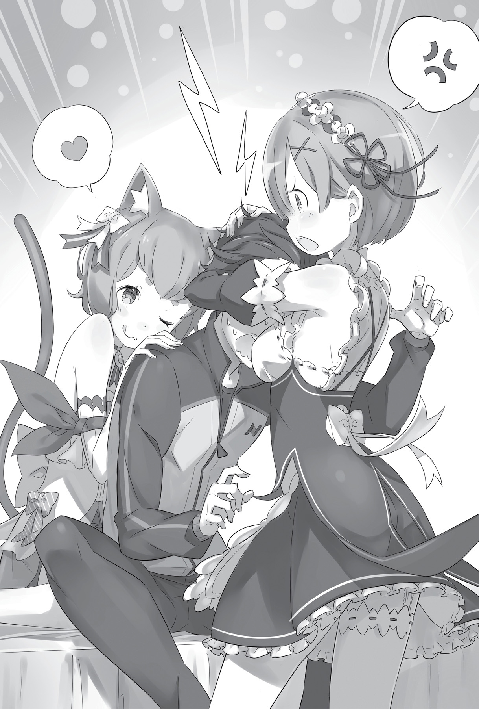

## 1

Грохнувшись навзничь, Субару открыл глаза и тут же утонул в небесной голубизне.

С тех пор как его забросило в альтернативный мир, прошло около двух с половиной месяцев. Сколько раз за это время он вот так, валяясь на голой земле, смотрел в раскинувшееся над головой небо?

Гигантские тяжёлые облака временами преграждали путь солнцу, но лучи всё равно прошивали их, заливая земную поверхность слепящим сиянием.

Чувствуя, как свет пытается проникнуть сквозь прикрытые веки, Субару вдруг вспомнил:

— А ведь если подумать… С тех пор как я здесь оказался, не было ни одного дождливого дня!

Ему несколько раз доводилось попадать под мелкий дождик, моросивший поздно ночью, или под ливень на закате, но не было ещё ни дня, чтобы дождь лил с утра до вечера.

Погода в Лугунике, несколько жаркая для того, чтобы ходить в одежде с длинными рукавами, по ощущениям напоминала то ли японский июнь, то ли сентябрь, который продолжал дарить летнее тепло… Малое количество дождей свидетельствовало о том, что сейчас в этом мире царил сухой сезон.

— Полагаю, на сегодня достаточно? — послышался чей-то голос, и Субару отвлёкся от глубокомысленных дум.

Юноша приподнял голову: перед ним стоял высокий старик в чёрном костюме дворецкого. В крепком мускулистом теле и безукоризненной осанке не было ни намёка на почтенный возраст. Густая седина аккуратно зачёсана назад, спокойное лицо покрыто редкими неглубокими морщинами. Во всём его облике ощущались достоинство и благородство галантного пожилого джентльмена. В руке мужчина сжимал длинный деревянный меч.

— Не торопитесь, — отозвался Субару, — Мне нужно подумать над одним философским вопросом.

— О! Весьма любопытно. Над чем же вы размышляете?

— Снизу — потоп, сверху — пожар. Что это[^1]?

Субару резко сгруппировался и вскочил на ноги. В груди всё ещё чувствовалась какая-то тяжесть, но боль от ударов уже сошла на нет. Он слегка покрутил кистями и ступнями, разминая их, затем взмахнул деревянным мечом, рукоять которого сжимал всё это время, и направил остриё прямо на Вильгельма.

— Поработайте со мной ещё, пожалуйста.

— Так каков же ответ на ваш философский вопрос?

— Да так, ерунда. Обмочивший штаны подросток, сердце которого горит жаждой мести!

Отделавшись нелепым ответом, Субару прыгнул вперёд, пригнулся и резким взмахом прочертил полукруг. Меч со свистом рассёк воздух и уже готов был обрушиться на противника, как вдруг…

— Йи-и-их!

— Ваши руки, ноги, шея и спина слишком напряжены… Да и лицо тоже.

Вильгельм плавным движением отвёл атаку, и оружие, направленное ему в голову, пронеслось над седой макушкой. Старик крутанулся и стремительными, но аккуратными выпадами прошёлся вдоль тела Субару там, где выстроились уязвимые точки — голова, шея и солнечное сплетение. Последний удар оказался мягким, но сильным, и Субару отбросило назад.

Контрприём был выполнен с исключительной осторожностью и не причинил ему вреда. Но от болезненных толчков у Субару перехватило дыхание. Ударившись спиной о землю, он издал жалобный стон, в глазах потемнело.

Субару снова оказался повержен, и небо опять смеялось над ним. Сейчас эта прозрачная синева была ему отвратительна…

— Полагаю, на сегодня достаточно?

В спокойном, ровном голосе Вильгельма не было ни насмешки, ни презрения. Субару уже сбился со счёта: в который раз старик обращался к нему с этим вопросом?..

— Тебя не так-то просто остановить.

Юноша оторвал взгляд от ненавистного небосвода и повернулся на новый голос. На верхней террасе, опершись на перила, стояла девушка и наблюдала за Субару, распластавшимся на газоне.

— Я просто услышала шум. По-моему, ты чрезмерно усерден.

Голос принадлежал настоящей красавице. Её длинные изумрудные волосы искрились на солнце. От девушки исходила аура доблести, подчёркнутая природной королевской осанкой. На женственной, с изящными изгибами фигуре прекрасно сидел костюм мужского покроя, похожий на мундир.

Герцогиня Круш Карстен. Владелица особняка и хозяйка Вильгельма. Несмотря на юность, она была необычайно талантливой особой и занимала далеко не последний пост в королевстве Лугуника.

— Простите, госпожа Круш. Мы отвлекли вас от дел.

— Ничего страшного, я как раз собиралась сделать перерыв. — Благосклонно кивнув слуге, Круш снова обратила взгляд на бессильно растянувшегося Субару. — К тому же с моей стороны было бы бесцеремонно гасить чьё-то искреннее рвение. Равно как и указывать работникам, чем заниматься в свободное время. Вильгельм, ты волен поступать как знаешь.

— Слушаюсь, госпожа. — В ответ на разрешение, сформулированное типичным для Круш образом, Вильгельм отвесил глубокий поклон, а затем покосился на Субару. — И всё-таки… Полагаю, на сегодня достаточно?

— Сказали бы прямо: давай-ка закругляться, пока цел. Я умею читать между строк, уж поверьте!

Субару поднялся на ноги, смахнул приставшие к одежде травинки и в третий — хотя нет, уже, наверное, в десятый — раз оглядел себя со всех сторон, убеждаясь, что цел и невредим. Хрустнув пальцами, он с грустью вздохнул:

— Накостыляли на глазах у такой красотки! Это любого парня загонит в депрессию. Мой уровень отваги скоро упадёт ниже плинтуса…

Субару ловко поймал брошенный Вильгельмом меч и мрачно усмехнулся.

— Не о чем переживать, — донеслось с террасы. — Я и раньше видела, как тебя колотят.

Беспощадное замечание было подобно удару под дых. Субару издал невнятный звук, но тут на помощь пришёл Вильгельм:

— Я знаю о том поединке лишь по рассказам, но мне кажется, госпожа Круш слишком резка в своей оценке.

— Разве? — искренне удивилась Круш, задумчиво подперев подбородок. — По-моему, всё очевидно: нельзя одолеть соперника, который сильнее тебя. Однако несгибаемая воля — не то, чего следует стыдиться. Исход, разумеется, не лучший, но не позорный.

Субару стало немного не по себе. Он не был готов выслушивать снисходительные рассуждения о том случае, ведь за ним последовала самая крупная неудача в его жизни. Провал, хуже которого и не представить. Расставание в вестибюле особняка…

— На твоём месте я бы тревожилась о вчерашнем происшествии. Узнала из вторых рук, но… могу представить, как ты зол.

Во взгляде Круш мелькнуло сочувствие. Субару выдавил неловкий смешок и потёр щёку. Ему было трудно по-другому отреагировать на упоминание о событии, что приключилось каких-то двенадцать часов назад. Речь шла о неожиданной встрече с Великим Мечником — Райнхардом, приехавшим в резиденцию Круш, чтобы увидеться с Субару.

— Возвращаясь к прежней теме, — произнесла Круш, заметив перемену в лице юноши, — ты говоришь, что брать уроки на глазах у женщины — сущая мука. Но разве не этим ты занят изо дня в день?

Свесившись через перила, она многозначительно посмотрела в дальний угол сада, откуда за тренировкой молча наблюдала девушка с голубыми волосами. Сообразив, на кого намекает Круш, Субару неловко пробормотал:

— Опозориться на глазах у того, кто тебе близок, — совсем другое…

— Мне кажется, твоя беда в том, что ты раскрываешь карты, находясь в руках потенциального противника. Хотя обо мне, приютившей тебя в своём доме, можно сказать то же самое. Сердце — удивительная штука, его порой так сложно понять…

Последнюю фразу Круш произнесла, меланхолично качая головой, словно думала о чём-то своём. Затем она обратилась к слуге:

— Вильгельм!

— Да, госпожа?

— Думаю, мне тоже стоит немного размяться. Сейчас я закончу дела и спущусь. Несмотря на раннее время, я хочу, чтобы ты позанимался со мной.

— Как будет угодно, я всегда к вашим услугам — прошу вас, не спешите.

— Увы, сейчас я не в том положении, чтобы расслабляться. — Круш слабо улыбнулась, выпрямилась во весь рост и вернулась в кабинет.

Её движения были полны изящества. Солнечный свет ласкал изумрудные волосы, которые покачивались в такт шагам. Проводив взглядом удаляющуюся фигуру, Субару облегчённо вздохнул и тут же самокритично усмехнулся.

По правде говоря, Круш относилась к тем девушкам, с которыми Субару было неуютно и тяжело. Пристальный, решительный взгляд ясных глаз, казалось, пронзал насквозь, а поведение, подкреплённое прямолинейным резким характером, порою вселяло чувство неловкости и тревоги.

Она была чрезвычайно уверена в себе и не колебалась, принимая решения. Невольно сравнив себя с Круш, Субару понял, насколько жалок в её глазах, и встряхнул головой, чтобы прогнать неприятные мысли.

— Полагаю, на сегодня достаточно, — Вильгельм повернулся к ученику, покачивая деревянным мечом.

— На вопрос не похоже, — заметил Субару, уловив перемену в интонации дворецкого. — Значит, закругляемся?

Уроки фехтования были для него суровым испытанием, однако Субару находил в них некую отдушину. Заметив неподдельное огорчение в его глазах, Вильгельм слегка улыбнулся:

— Когда госпожа Круш изволит пребывать в особняке, я должен исполнять обязанности инструктора. Это одна из причин, по которой я нахожусь в услужении у семьи Карстен.

— Нисколько не возражаю! Я и так уже здорово поплатился за то, что злоупотребляю вашим расположением.

Желая хоть на минуту продлить тренировку, Субару снова встал на изготовку, направив остриё меча в лицо дворецкого. Раньше он немного занимался кэндо и, хотя забросил его ещё в средней школе, успел освоить кое-какие базовые приёмы.

Когда Вильгельм увидел, что Субару снова рвётся в бой, добродушное выражение исчезло с его лица.

— Готовы? — спросил он.

— Будьте уверены! — заявил Субару и, оттолкнувшись от земли, бросился в атаку. Безо всяких уловок, прямо в лоб, с мечом, поднятым высоко над головой.

Однако клинок, готовый разрубить соперника надвое, просвистел в пустоте и вонзился в землю.

— Ах!

Субару кубарем полетел через голову, и спустя ещё секунду на него обрушился шквал точных ударов деревянного меча Вильгельма.

## 2

Вот уже три дня Субару Нацуки гостил в резиденции Круш Карстен.

Особняк герцогини располагался в самом сердце элитного квартала, среди роскошных апартаментов столичной знати. Хотя говорили, что этот дом она использует только во время пребывания в столице, по своему убранству, не говоря уже о размерах, резиденция Круш превосходила даже особняк Розвааля.

Впрочем, самой Круш эти излишества были не слишком интересны. Скорее, она использовала их, чтобы произвести впечатление на многочисленных гостей-аристократов.

На протяжении всех трёх дней Субару наблюдал нескончаемый поток визитёров. Одним из них и оказался Райнхард ван Астрея, недавний разговор с которым оставил крайне неприятный осадок.

— Мне очень жаль, что я не смог остановить вас тогда, на плацу, — сказал Райнхард, повинно склонив голову. — Я бездействовал, и мне очень стыдно.

Тот, кого называли Великим Мечником, человек, которым восхищалась вся страна, стоял у освещённых кристаллическим фонарём ворот резиденции Карстен и просил прощения. Поведение рыцаря удивляло. Субару стало очень неловко.

— С-стоп, стоп, стоп! За что ты извиняешься? Ты ведь ничего плохого не сделал.

— Вовсе нет, Субару. Вы с Юлиусом мои друзья, а у меня не хватило ума предотвратить ваш поединок.

— Друзья?!

Имя, произнесённое Райнхардом, было предпоследним из тех, что Субару хотел бы услышать. Однако рыцарь вовсе не желал его обидеть. Райнхарду действительно было неудобно. Если бы он вмешался, возможно, Субару не пришлось бы терпеть унижения…

Да, схватку между Субару и Юлиусом нельзя было назвать дуэлью по всем правилам, тем не менее втягивать посторонних не следовало. Только так участники могли сохранить лицо. Райнхард винил себя за то, в чём не был виноват. Но именно обострённое чувство ответственности и делало его Рыцарем из Рыцарей.

— Ну, в любом случае я рад встрече, — сказал Субару. — У тебя же наверняка куча всяких дел?

— Не хотелось бы класть на противоположные чаши весов дела и дружбу, но… если бы не приехал сейчас, мне бы не скоро представился шанс извиниться.

— Ты… куда-то уезжаешь?

— Я покидаю столицу, чтобы сопроводить госпожу Фельт в дом моей семьи. Ей предстоит многое познать. К тому же нужно обучать новых слуг.

На лице Райнхарда появилась грустная улыбка, сквозь которую проглядывало беспокойство из-за предстоящих трудностей. Но, похоже, с драчливой хозяйкой он уже поладил.

— Думаешь, у Фельт что-то получится? — спросил Субару.

— Идеи у неё хоть и чудны́е, — помедлив, сказал Райнхард, — но не лишённые смысла. Когда она наберётся достаточно знаний и опыта, чтобы воплотить их, непременно всех удивит. А я буду всячески ей помогать.

— Вот оно как… Рад за вас, — сказал Субару и отвёл взгляд.

Он больше не мог смотреть в глаза Райнхарду. Этого молодого человека с огненно-красными волосами не страшили сложности. Его не мучил вопрос, как наладить отношения со взбалмошной госпожой. Миссия, которую он взвалил на себя, не тяготила рыцаря. Колоссальная разница между ним и Субару была очевидной.

— Ты… сожалеешь? — спросил Райнхард, озабоченно сдвинув красивые брови.

«Сожалеешь…» — мысленно повторил Субару и нервно прикусил губу.

Он только и делал, что сожалел. Вчера сожалел о том, что сделал позавчера. Сегодня сожалел о вчерашнем. А завтра, если оно наступит, непременно будет жалеть о нынешнем дне.

Те решения, которые Субару успел принять в своей жизни, превратили её в непрерывную череду сожалений. Что бы случилось, выбери он другой путь? Вдруг всё сложилось бы иначе? Эти мысли постоянно не давали ему покоя.

— Не буду изрекать банальностей вроде: «Понимаю, каково тебе», — продолжил Райнхард, потупившись. — Скажу лишь одно: мне тоже очень стыдно из-за того происшествия. Хоть я уже и говорил, но повторюсь: мне очень жаль!

Субару тоже было жаль, но сейчас они думали о разных вещах. И в этом нет ничего удивительного. Каждый смотрел на ситуацию с высоты своего положения и видел то, что не мог увидеть другой. Поэтому, что бы ни сказал рыцарь, Субару намеревался сохранять спокойствие и был готов к любому развитию беседы.

То есть он считал, что был готов, однако…

— В той дуэли… то есть драке между тобой и Юлиусом… не было никакого смысла. Ты ввязался в неё, прекрасно понимая, что шансов нет, и лишь напрасно получил увечья. Я стоял в стороне и молча наблюдал, а потом не находил себе места.

Такого поворота Субару и представить не мог!

— Никакого смысла?!

— Да, никакого. Чего вы оба добились, схлестнувшись на плацу? Ты оказался избит, а Юлиус подпортил себе карьеру. Ты в курсе, что его временно отстранили от службы? Наверняка теперь он сам раскаивается в содеянном.

Новость о наказании Юлиуса стала для Субару неожиданностью. За схваткой наблюдало множество зрителей — рыцарей, которых Юлиус позвал болеть за него, Субару был уверен: Юлиус всё устроил так, чтобы не пришлось отвечать за последствия. А теперь — подумать только! — он получает взыскание.

Впрочем, Субару ни за что бы не поверил, что Юлиус сожалеет. Уж это ясно как день!

— Если бы вы дали друг другу время, — продолжал Райнхард, не догадываясь, о чём думает Субару, — то сумели бы спокойно всё обсудить. Я могу это устроить, если хочешь. Если помиритесь, мы сделаем так, что ваш поединок будет восприниматься как чистое недоразумение.

Глаза рыцаря светились неподдельным участием.

— Как если бы никакого поединка и не было вовсе? — спросил Субару, переварив услышанное.

— Именно! У Юлиуса есть свои недостатки, но вообще он очень искренний и открытый человек. Достаточно раз поговорить с ним по душам, и между вами не останется недомолвок…

— Райнхард, — прервал Субару пылкую речь рыцаря.

Райнхард умолк и вопросительно устремил на него ясный взор. Конечно, в этих глазах цвета небесной лазури не было ни следа недобрых намерений.

Иными словами, Райнхард говорил абсолютно серьёзно. Он правда полагал, что поединок не имел смысла, и упускал из виду, что это был вопрос гордости, принципиальный для обоих дуэлянтов.

— Я вижу, ты хочешь помочь, и мне приятна твоя забота, — произнёс Субару. — Ты действительно очень хороший парень.

— И?

— Но я не принимаю твоё предложение. Просто не могу принять, Разговор окончен.

Субару развернулся и зашагал к дому. Не найдя слов, Райнхард в замешательстве протянул вслед руку.

— Райнхард, ты отличный парень, — повторил Субару, остановившись, — и я прекрасно понимаю, что в твоих словах нет злого умысла. Всё, абсолютно всё, что ты сейчас делаешь, целиком и полностью, исключительно и всецело ради моего блага. Я… понимаю это.

Райнхард замер. Чувствуя его растерянность, Субару двинулся дальше и, лишь миновав ворота, добавил:

— Но я ни за что не сделаю то, о чём ты просишь. Я не позволю тебе… лишить тот поединок смысла!

Этого никто бы не хотел — ни Субару, ни Юлиус, ни наблюдавшие за боем рыцари. В той схватке был смысл. Определённо был. Пусть даже он и оставался неясен Райнхарду — Великому Мечнику.

— Пусть так, но… Что ты приобрёл? Ты ведь только потерял, разве нет?! — в отчаянии прокричал Райнхард вслед, словно желая сократить возникший между ними разрыв. Ты потерял даже госпожу Эмилию!

Эти слова переполнили чашу терпения. Имя, произнесённое рыцарем, было последним из тех, что Субару хотел бы сейчас услышать.

— Уходи, Райнхард. Пока твоя госпожа не расхныкалась от одиночества, — холодно бросил он Великому Мечнику.

Ворота с лязгом затворились, ставя жирную точку в их отношениях.

— Не суй нос, куда не просят, — процедил Субару то, что не осмелился бросить Райнхарду в лицо, и от досады скрипнул зубами. При воспоминании о вчерашней беседе его передёрнуло, и он отчаянно замотал головой, чтобы прогнать неприятные мысли.

— Субару, тебе нельзя, — послышался нежный, заботливый голос. Ты сильно ударился. Лежи спокойно.

Юноша приоткрыл глаза и увидел склонившееся над ним лицо девушки с голубыми волосами. Одетая в чёрное короткое платье с передником, она сидела на мягкой траве, положив голову Субару себе на колени, и улыбалась.

Это была Рем — очаровательная служанка из поместья Розвааля, получившая указание сопровождать его.

— Этот ускоренный курс обучения так утомил тебя, — тихо проговорила она, нежно теребя его волосы, — Тебе нужно отдохнуть, так что мои колени к твоим услугам.

— Не такой уж и ускоренный… Обычное фехтование. Небось, скучно было смотреть?

— Ничего не скучно! Я счастлива уже оттого, что провожу время с тобой, Субару.

Он не стал спорить. Эта девушка находила повод для гордости даже в самых досадных его неудачах. Субару смущённо прикрылся рукой. Занятия с Вильгельмом больше напоминали издевательства над самим собой, нежели тренировку, и Рем наблюдала за этим действом от начала до конца. Причём совершенно спокойно.

И сейчас, когда он, сгорая от стыда, спрятал лицо, Рем промолчала. Она по-прежнему нежно гладила его короткие чёрные волосы, будто говоря: пройдёт и это.

Субару не вытерпел и хрипло позвал:

— Рем…

Рука девушки замерла, покорно ожидая продолжения. Он сделал паузу и спросил:

— Ты ведь не считаешь меня… жалким?

«Впрочем, какой же ответ ты хочешь услышать?» — мысленно спросил он самого себя, «Да, Субару, считаю»? Или: «Нет, не считаю»? И какого Субару она должна была оценить? Сегодняшнего? Или того, что был три дня назад? А может, ещё раньше?..

— Считаю.

Короткий и ясный ответ прервал его внутренний монолог, и мучительный вопрос отпал.

— Правда? Тогда зачем ты осталась со мной, таким жалким? — Он поднял сердитый взгляд, и перевёрнутая Рем отразилась в его глазах. — Потому что тебе приказали?

Рем медленно помотала головой.

— Я могу считать тебя жалким и вместе с тем быть рядом. Нет никакого противоречия. И даже без приказа я всё равно осталась бы.

— Но… почему?

— Потому что я так хочу, — отрезала Рем.

От неожиданности Субару не нашёлся что сказать. Пытаясь подобрать нужные слова, он вдруг почувствовал невероятное облегчение — точно камень свалился с души. Казалось, он разом получил ответы на все терзавшие его вопросы.

— Рем, ты… просто чудо!

— Да. Но сестрица ещё лучше.

Субару поднял руки.

— Сдаюсь, она тоже клёвая, хотя я никогда не понимал твоего фанатизма по поводу Рам, — сказал он, совершенно разомлев на коленях Рем.

Девушка снова запустила пальцы в его волосы, и Субару зажмурился от наслаждения.

— Мне кажется, я исполняю твои желания, — сказала она. — Поэтому я здесь, с тобой.

— Выходит, я не только желаю, чтобы ты смотрела, как меня избивают, мне ещё позарез нужно, чтоб ты признала меня жалким мазохистом?!

— А разве нет? — На лице Рем возникло загадочное выражение, ясные глаза излучали саму невинность.

Субару только протяжно вздохнул в ответ.

Прошло несколько тихих, ничем не нарушаемых ленивых минут.

— Давай вернёмся в дом? — предложила Рем. — А то помешаем тренировке госпожи Круш.

Она попыталась привстать, но Субару обхватил её коленки руками и придавил их щекой.

— Ещё чуть-чуть, — простонал он жалобно. — Я же ударился головой, мне нельзя двигаться!

— Ну хорошо, — согласилась девушка. — Если ты так хочешь…

Безграничная доброта Рем помогала Субару забыть о неурядицах и всё глубже и глубже погружала его в тёплое, мягкое лоно душевного покоя.

С начала королевских выборов, с того самого момента, когда между Субару и Эмилией пролегла невидимая граница, прошло три дня.

Субару Нацуки благополучно шёл ко дну…

## 3

«В чём была моя ошибка?» — думал он всякий раз, когда у него появлялось время поразмышлять.

Это были тяжёлые воспоминания, и всё же он вновь и вновь мысленно возвращался в тот вечер. Сереброволосая девушка, повернувшись к нему спиной, уходила прочь…

«Что я сделал не так?» — думал он каждый раз, когда в голове раздавался звук захлопнувшейся двери.

Он понимал, что сказал много лишнего. Непосредственно перед этим Субару сильно избили, а Эмилия так на него насела, что он не успел опомниться, как наговорил ей совсем не то, что хотел сказать.

В итоге именно эти слова привели к разрыву. А что, если то был всего лишь горячечный бред?..

Или же у него вырвались именно те слова, которые всегда вертелись на языке?..

Субару беспокоился об Эмилии и в то же время хотел, чтобы она это понимала. И то и другое было правдой.

Но какой смысл вкладывал в свои слова, он и сам теперь не мог понять.

— Эй, парень! Парень! — прозвучал над ухом чей-то грубый голос.

Субару вынырнул из пучины невесёлых мыслей и снова очутился в реальности.

Сморгнув полусонный туман, юноша посмотрел на мужчину, чей голос вывел его из оцепенения. Тот удивлённо пожимал плечами. Лицо пересекал внушительный вертикальный шрам.

— Слушай, парень, не стоял бы ты с выпученными глазами перед моей лавкой. Покупателей распугаешь, — мрачно пробурчал он.

Субару потёр глаза. Что ни говори, а выслушивать суровые речи сразу по возвращении в действительность он был не готов.

— Знаешь, дядя, по-моему, пугать клиентов такой злобной физиономией — не самая лучшая идея.

— Никто и не пугает! Я, может, переживаю! Явился сюда с каким-то подозрительным типом, попросил меня передать деду Рому весточку, что я и сделал, а тот взял и пропал без следа. Ты хоть понимаешь, как я испереживался?! Вот задать бы тебе! — прорычал он сердито и стукнул мускулистой рукой по прилавку, на котором стояли корзины с фруктами. Удар был насколько сильный, что фрукты так и попадали бы на землю под ноги прохожим, если бы… в тот же миг откуда ни возьмись не появилась, взметнув подолом юбки, Рем.

— Нельзя так беспечно относиться к продуктам! — воскликнула она, когда все плоды аккуратно упали в подставленную ею корзинку — мгновение назад та ещё стояла на прилавке.

— О, спасибо тебе, девочка, выручила, — выдохнул Кадомон, в голосе которого смешались облегчение и удивление от проделанного служанкой трюка. Взяв из рук Рем корзинку, он покосился на Субару и, слегка понизив голос, проговорил: —3наешь, я плохого не посоветую. Не нравится мне, как этот парень на тебя смотрит, держись-ка от него подальше! Такой до добра не доведёт.

— Чего ты ей в уши дуешь? Хватит выдумывать обо мне всякие гадости!

— А кто выдумывает? — возразил торговец. — Начнём с того, что в прошлый раз я видел тебя с другой девчонкой. Та была… что-то не могу припомнить… Ну, раз не могу, значит, о ней и вспомнить нечего. Недаром же ты нашёл посимпатичней. Кобель ты, вот ты кто!

— Я что, похож на тех, кто встречается сразу с несколькими девчонками? И вообще, почему ты…

«…забыл, что я приходил с Эмилией?» — хотел было спросить Субару, но прикусил язык.

Кадомон и не мог помнить её, потому что Эмилия сама пожелала остаться неузнанной и воспользовалась для этого соответствующей магией. Перед глазами Субару вдруг возникло лицо Эмилии, и в груди сразу защемило.

Так и не дождавшись продолжения, Кадомон с сомнением покачал головой и продолжил увещевать Рем:

— Полюбуйся-ка: и глазом не моргнёт! Девочка, как бы ты ни старалась ему угодить, с таким только горя хлебнёшь, уж поверь!

— Благодарю вас за заботу, но… я с ним потому, что это мне по душе, — покрывшись румянцем, сказала Рем и покосилась на Субару.

Глядя, какими влюблёнными глазами она смотрит на своего спутника, Кадомон с сожалением замолчал — видимо, решил, что дальнейший разговор с этой глупышкой бесполезен.

— Кстати, — начал Субару, чтобы сменить тему, — вам не кажется, что на улице сегодня не так, как прежде? Людей по-прежнему много, но они… как будто слегка на взводе. Если раньше все куда-то спешили, то сейчас многие стоят и о чём-то шепчутся…

— Наблюдательный — прямо диву даюсь, — буркнул Кадомон. — Да, есть такое дело. Всякое крупное событие, неважно, какое именно, для нас, торговцев, — самое время хорошенько заработать. Самому прямо не терпится узнать хотя бы одну новую сплетню!

С этими словами Кадомон взял с прилавка один из плодов и впился в него зубами. Глядя на лавочника, пожирающего свой товар, Субару опешил.

— Интересно, каким же образом торговец фруктами может заработать на суете вокруг королевских выборов?.. Похоже, дядя, у тебя природный талант — отставать от других на самом старте.

— Поговори мне ещё! Ну, как ни крути, а именно потому все и шепчутся. Только и разговоров, что об этих выборах. Взгляни-ка вон туда.

Кадомон указал огрызком аблока на щит с объявлениями, стоящий на углу. Щит был такой большой, что у остальных вывесок и плакатов, отчаянно пытавшихся завладеть вниманием прохожих, не оставалось никаких шансов.

— Вообще-то я только самые простые символы читать умею…

— Уроки, что ли, прогуливал? Ну, хотя бы что написано на моей вывеске, ты понимаешь?

— Значки вроде знакомые, но так коряво нарисованы, что не разобрать.

Вопиющее невежество ошеломило торговца.

— Ну и что там написано? — спросил Субару.

— Да то же самое, про что мы тут болтаем: «Королевские выборы начались»! — ответил Кадомон, уже позабыв о своей вывеске и глядя на щит вдалеке.

Субару картинно наморщил лоб, и торговец яростно поскрёб у себя в затылке.

— Ладно, — сказал он, — пойдём, я тебе прочитаю. Дочка, присмотри за лавкой.

— Как скажете, — отозвалась Рем.

Субару лишь пожал плечами. Как-то это странно: один как ни в чём не бывало бросает своё рабочее место, а другая попустительствует столь нерадивому отношению к работе…

— Разве можно оставлять лавку на новичка?! И ты, Рем, тоже хороша: нельзя быть такой легкомысленной и соглашаться на что угодно.

— Всё, что ей нужно делать, это брать деньги согласно ценникам и вручать товар и сдачу. Тем более покупателейто и нет.

— Наконец ты сам это признал! — с обвиняющим видом заявил Субару, но Кадомон уже направился к щиту, так что юноше пришлось поспешить. Рем помахала им на прощание рукой.

— Я смотрю, королевские выборы интересуют всех: и стариков, и молодёжь, — заметил Субару. — А ты, дядя, что об этом думаешь?

— Хм… Все только и гадают, кто взойдёт на престол. Не может же трон вечно оставаться пустым. По мне, быстрей бы уж решили — и дело с концом.

— Может, я чего-то не понимаю, но если есть люди, которых вы называете Советом мудрецов, значит, страной кто-то управляет? Или народу плохо без короля?

— Ну ты даёшь! — удивился Кадомон. — Может, хватит шуток на сегодня? Хотя были и другие умники, которые считали, что король — не король, а так, пустое место… Соглашение с Драконом заключает каждое поколение королевской семьи. И за то, что ссора с Волакией закончилась лишь небольшой стычкой, мы должны сказать спасибо Дракону, который защищает Лугунику.

Кадомон упомянул Волакию — государство на юге материка. На севере находилась страна Густеко, Лугуника — на востоке, а Карараги — на западе. Эти четыре державы властвовали над миром. Было ещё несколько государств поменьше, но все они подчинялись упомянутым четырём державам.

— А эта империя, Волакия, — не унимался Субару, — она что, нападёт на Лугунику, если Дракона не станет?

— Там девиз знаешь какой? «Богатая страна — сильная армия. Кто сильнее, тот и прав». Мы с ними воевали, пока четыреста лет назад не заключили соглашение с Драконом. Вмешательство Дракона их разозлило, и они до сих пор зуб на нас точат. Мерзкая история…

— То есть люди требуют короля, так?

— Люди не люди, а всё равно такому зверю, как государство, нужна голова, иначе худо будет. Не сказал бы, что прежний король отличался особой мудростью, но всё-таки был не так уж и плох. Так я считаю.

Преодолев поток разномастной уличной толпы, они подошли к щиту, который оказался даже выше, чем здоровяк Кадомон. Протиснувшись сквозь толчею перед объявлением, Субару вытянул шею и попытался прочесть хотя бы несколько слов.

— Здесь написано, что объявлено начало королевских выборов, — объяснил Кадомон. — И рассказывается, как всё происходит. Похоже, речь идёт о ритуале. Его проведут после избрания нового правителя, то есть через три года. А ниже кратко о кандидатках.

Субару уже начал было терять интерес, так как ничего нового для себя не узнал, но при слове «кандидатки» встрепенулся. Искоса взглянув, Кадомон заметил, как его спутник облизнул пересохшие губы. Торговец кивнул:

— Интересуешься кандидатками? Их всего пятеро. Самые известные, пожалуй: герцогиня Круш Карстен и девчонка по имени Анастасия, глава Торгового дома Хосин.

— А она что, знаменита, эта герцогиня Круш?

— Ещё бы! На то она и герцогиня! Стыдно не знать такие вещи, если живёшь в столице! Продолжательница рода Карстен хоть и юная, но, говорят, таких дарований наша страна давно не видала. До сих пор легенды ходят о её боевом крещении во владениях Карстен. Благодаря чему, кстати, она и получила звание главы рода.

— Боевом крещении?..

— Однажды во владениях Карстен объявилась орда зверодемонов. Герцог, отец Крущ, был ранен. Тогда она собрала войско и разгромила зверодемонов в два счёта, чем и прославилась на всю страну. Вот отец и передал ей, семнадцатилетней, свой титул.

Узнав новые подробности из жизни Круш, Субару ещё острей ощутил своё ничтожество. Однако Кадомону его чувства были невдомёк.

— Что касается Хосин, — продолжал он, поглаживая пальцем шрам, — вряд ли найдётся хоть один торговец, который бы не слыхал, как шустро поднялась её компания в последние годы. Ходили слухи, что эта девчонка, Анастасия, разорила какие-то крупные торговые дома, а затем взяла их под своё крыло. Вот уж точно — Хосин из Пустоши. Про таких говорят: сама себя сделала. Второй Хосин, не иначе.

Кадомон рассказывал об Анастасии с некой гордостью: как-никак она была его коллегой. Простая торговка дорастает до претендентки на королевский трон — прямо история Золушки, ни дать ни взять!

Великолепная, импозантная Круш, чьи убеждения твёрже стали, и Анастасия, обладательница волос цвета бледной сирени и мелодичного кансайского говора, — действительно, обе эти претендентки выглядели впечатляюще.

Текст на щите повторял то, о чём говорилось на церемонии открытия выборов. Факты, доведённые до сведения горожан, были точны и беспристрастны.

— В общем, по слухам, — сказал Кадомон, — пока выглядит так, что, скорее всего, победит кто-то из этих двоих. Лично я считаю, что преимущество на стороне Круш. Торговка всё-таки пришлая, а Круш — одна из самых выдающихся фигур нашей страны.

— Одним словом, лидер… — задумчиво произнёс Субару.

Но ведь то, что она заявила перед Советом мудрецов, должно было пошатнуть её популярность.

Тем не менее происхождение и репутация Круш определённо служили ей мощной поддержкой. Простой люд ведь не слышал её речи, произнесённой на церемонии. С точки зрения обычных граждан, Круш была самым вероятным победителем.

— Значит, если лидер — Круш, её единственная соперница — Анастасия, тогда… кто же тёмная лошадка?

— Трудно сказать, — произнёс Кадомон и вслух прочитал имена ещё трёх претенденток. Затем он нахмурился и скрестил руки на груди. — Об остальных я даже не слыхал, хотя не первый год живу в столице. Присцилла, судя по фамилии, некая знатная особа. У других двух даже фамилий нет. Если в кандидатки угодила глава Торгового дома Хосин, я просто не понимаю, как они их выбирают…

Здесь Субару мог бы согласиться с Кадомоном, если бы знал столько же, сколько знал тот.

Действительно, всё выглядело так, будто за престол боролись нынешняя глава герцогского рода, молоденькая хозяйка заграничной торговой фирмы, некая никому не известная аристократка и ещё две претендентки непонятного происхождения, у которых даже не было фамилий. Народу, не посвящённому в секреты отбора, это мало о чём говорило. И хотя Субару знал, что кандидатки выбраны инсигниями с изображением Дракона, оставалось неясным, чем руководствовался сам Дракон. Не может же быть, что он просто падок на красоток? Субару едва не прыснул со смеха, когда подумал об этом, но тут снова заговорил Кадомон.

— А то, что среди претенденток полуэльфийка, так это вообще ни в какие ворота! — сказал он с отвращением. — Здесь вот кое-что из их биографий. Ты погляди, они включили в список полуэльфийку по имени Эмилия… Выставить в кандидаты полудемона — надо же додуматься!

— Полу… демона?

— Подходящее название для приспешников Ведьмы. И о чём только думают эти чёртовы сильные мира сего?

Во взгляде Кадомона смешались негодование и досада.

Субару не знал, что и сказать. Ему нравился лавочник со шрамом на лице. Это был первый человек, с кем он заговорил здесь, и он искренне считал, что на Кадомона можно положиться. Да, на первый взгляд торговец казался не слишком дружелюбным, но у него было доброе сердце и больше всех на свете он любил жену и дочурку. По крайней мере, Субару не сомневался в его доброте и отзывчивости.

И вдруг он говорит ужасные вещи о совершенно незнакомом человеке! Будто это в порядке вещей. К тому же в таких выражениях, которые Субару просто не мог оставить без ответа.

Именно поэтому слова слетели с губ прежде, чем он успел их как следует обдумать.

— Что ж теперь, всех под одну гребёнку?!

— А?.. — Судя по его лицу, Кадомон не ожидал такой реакций.

— Нельзя ставить крест на ком-то только потому, что он полуэльф! — горячо возразил Субару. — Эта девушка, Эмилия, она совсем не такая!.. Ну, в том смысле, что она, возможно, о стране беспокоится. А что, если она добрая и вообще замечательная, почему бы и нет?!

— Остынь-ка! — сказал Кадомон. — Не знаю, чего ты вдруг кинулся защищать полудемона, но ты это дело брось. Никогда не знаешь, кто может тебя услышать, улавливаешь?

— Ага, всё ясно. Не хочешь, чтобы милая дочурка, придя к папаше на работу, вдруг увидела, как он со свирепым видом говорит всякие гадости о незнакомом человеке?!

Сарказм с изрядной примесью яда заставил Кадомона смутиться. Он с виноватым видом приложил руку ко лбу:

— Ладно-ладно, погорячился. Мне стыдно.

— Ну да, конечно.

Субару недоверчиво покосился на торговца. Искренности в словах Кадомона не было ни на грош, и всё же он, перестав препираться, повёл себя как взрослый человек. Поэтому и юноша отступил… но, едва он сложил оружие, Кадомон вновь взял слово:

— Думай, как тебе хочется, — сказал он с вызовом, — но полуэльфийке никогда не стать королевой! Не бывать такому!

Спор грозил разгореться с новой силой.

— Опять ты за своё… Но почему? Из-за Ведьмы Зависти? Неужели ни один полуэльф не заслуживает доверия только потому, что эта Ведьма тоже была полуэльфийкой? — возмутился Субару, кипя от гнева.

— Да! — упрямо ответил Кадомон.

— Опять ты… — Субару осёкся, заметив в устремлённом на него взгляде торговца настоящий страх. — Но почему?!

— Потому что Ведьма… Она просто ужасная! И это понятно всем как дважды два. Не знаю, откуда ты такой недалёкий взялся, но большинству одного этого достаточно, чтобы остерегаться полудемонов!

Субару хотелось хоть что-нибудь возразить, но голос ему не повиновался.

— Ясно тебе? — продолжил Кадомон. — Ходит легенда, что Ведьма Зависти была чудовищем, каких поискать. Четыреста лет назад её тень поглотила почти весь материк. Ни прославленные герои, которых было множество, ни драконы — никто не смог её одолеть. Если бы не сила Божественного Дракона, если бы не знания мудрецов и не Великий Мечник той эпохи, миру пришёл бы конец!

Серьёзность, с которой говорил Кадомон, подействовала на Субару. Юноша не мог отвести от него глаз, боясь упустить хоть слово.

— Но при том, что натворила эта Ведьма Зависти, мы почти ничего о ней не знаем. Известно только, что она была полуэльфийкой с серебристыми волосами. С ней невозможно было договориться, словно она не понимала нашего языка, а потом ещё начала свирепствовать. Похоже, ей стал ненавистен весь мир!

В расширенных зрачках торговца пульсировало невыразимое чувство. Кажется, не существовало слов, чтобы описать тот трепет, который обитатели этого мира таили в дальнем уголке сознания.

Легенда о Ведьме передавалась из поколения в поколение в разных формах — и устно, и письменно, в чём Субару уже успел убедиться на примере сборника сказок. Детали причудливо изменялись в зависимости от рассказчика, но души людей по-прежнему были наполнены безусловным страхом, который внушала эта история.

— Ведьма — вот кого все боятся! Таинственная тварь вселяет ужас. Одного этого достаточно, чтобы держаться от неё подальше!

— Всё равно это не повод ущемлять всех полуэльфов… — пробурчал Субару сквозь зубы.

Кадомон поморщился так, будто услышал самую большую глупость на свете.

— По крайней мере, — сказал он, — слухи о том, что у полудемонов коварный нрав, — чистая правда. Рождаются они такими или становятся под влиянием окружения, я не знаю…

Кадомон и сам прекрасно понимал, что его слова звучат неубедительно. Но одна лишь мысль о Ведьме так сильно его пугала, что доводы логики и разума оказывались бессильны. Похоже, подобный образ мышления обитатели этого мира впитывали с молоком матери…

И тут Субару осенило: он вдруг со всей ясностью осознал, что именно хотела сказать Эмилия, выступая перед Советом мудрецов. Она говорила о полуэльфах. О железной цепи, которая их сковывает, не позволяя встать на одну ступеньку с другими.

— Поэтому, — мрачно подытожил Кадомон, сложив руки на груди, — с такой славой на победу пусть не надеется! А если кто-то сдуру будет за неё радеть… пускай лучше займётся чем-нибудь другим.

Последние слова, похоже, адресовались тому, кто желал поддержать эту безнадёжную кандидатку в борьбе за трон. И хотя на самом деле это было проявлением доброты Кадомона, который просто пытался предостеречь Субару от опасности, юноше это казалось очень слабым утешением, ведь вся забота лавочника была основана на страхе перед полуэльфами.

Именно этому предубеждению Эмилия бросала вызов в первую очередь.

— И зачем её вообще допустили до выборов? Толку никакого, одно мучение. — В словах Кадомона мелькнула жалость, и он покачал головой. Его явно удивляла непонятливость Субару, ведь страх перед Ведьмой засел в людях так глубоко, что притеснения полуэльфов выглядели в их глазах чем-то совершенно естественным.

В этом смысле Субару действительно являлся полным невеждой. Он не был знаком с историей этого мира. И даже о дурной славе Ведьмы знал лишь то, что было написано в книжке. Насколько силён страх перед полуэльфами? Насколько люди чуждаются их? Трудно было даже представить, *что* в такой обстановке думают о людях сами полуэльфы…

И всё же в ушах Субару снова прозвучали слова Эмилии:

*«Ни с места, злодеи!»*

Тогда в переулке, ползая по земле, терпя боль и унижения, Субару услышал твёрдый, полный решимости голос, похожий на звон серебряного колокольчика. Он понял, что спасён.

Где же та якобы присущая полуэльфам корысть, та расчётливость, которая сподвигла её на этот поступок?

Субару ничего не знал ни об истории этого мира, ни о ведьмах, ни о полуэльфах. Но он знал, что в этом мире есть Эмилия.

*«Меня зовут Эмилия. Просто Эмилия. Спасибо, Субару».*

Он знал, что эту сереброволосую девушку с доброй бескорыстной душой ставят на одну доску с Ведьмой Зависти, не имея на то ни малейших оснований. Он знал, что её доброе сердце всегда готово прийти на помощь, оно не ожесточилось, несмотря на отнюдь не доброе окружение.

…Неважно, насколько жесток этот мир. Уж он-то будет…

*«…Наверное, всё же ради себя?»*

Цепочку мыслей вдруг прервал холодный металлический голос, от которого мороз продрал по коже.

Нежную улыбку, которую юноша нарисовал в своём воображении, сменил холодный взгляд и строгий голос:

*«Я хочу тебе верить, Субару. Но ты сам не даёшь мне!..»*

Он растоптал доверие Эмилии, и её голос, полный боли и горечи, эхом отдавался в его голове.

Он думал, что всё понял. Посчитал, что теперь-то всё ясно. И с умным видом пошёл и спокойно нарушил данное ей слово. И вновь горькие упрёки вонзались ему в сердце острыми ножами:

*«Но я не смогу понять тебя, если ты не расскажешь!..»*

Снова и снова в ушах Субару звучали слова укора.

Сердце разрывалось. Казалось, эта боль вот-вот раздавит его, но, даже вспоминая тяжёлые минуты под её ледяным взором, юноша не мог сдержать гнев.

Он лез из кожи, делая всё, что от него зависело. Он помогал Эмилии, как только мог. Он вынес столько ударов и лишений. Разве не заслужил он вознаграждение? Разве не заслужил взаимность?

«Я тоже ничего не пойму, если ты не объяснишь мне!»

Эмилия так ничего и не поведала Субару. Ни о королевских выборах, ни о гонениях на полуэльфов, ни о собственных чувствах и переживаниях. Она держала юношу на расстоянии, не позволяя вмешиваться в свои дела. Он был чуть ли не пустым местом.

Получается, Субару ничего о ней не знал. Эмилия не посвящала его в свои дела.

Какой жизнью она жила? Какие цели преследовала, претендуя на королевский трон? Что думала о мире, который видел в ней ведьму? Всё это осталось для Субару загадкой.

И теперь он уже не хотел знать, что Эмилия думает о нём самом.

— Эй, парень! Чего это с тобой?

— А?.. У-а! — очнувшись и увидев прямо под носом лицо лавочника, Субару испуганно отпрянул. — Ты что делаешь, дядя? Давай аккуратней, а то своей физиономией до инфаркта доведёшь кого-нибудь.

— Злой же ты на язык, парниша! Опять, как в прошлый раз, ни с того ни с сего застыл и стоишь как истукан. Болезнь у тебя такая, что ли?

— Если страсть, сжигающую моё сердце, можно назвать болезнью, то, наверно, да, — проговорил Субару. — Иногда она как лёгкое недомогание, а иногда как жестокий приступ. Похожа на горячку, симптомы те же самые…

— Вижу, болезнь у тебя злокачественная, — шутливо заметил Кадомон, скрывая своё замешательство. Он тряхнул головой, показывая, что разговор ему уже порядком надоел, и пробурчал: — Ладно, хватит болтать, пойдём назад.

Субару поспешил за ним, вдруг осознав, что весь покрылся холодным потом. Он попытался было понять, с чего бы это, но вопрос так и остался без ответа. В голове стоял такой туман, что мысли увязали в нём, как в густом сиропе.

Шагая позади торговца и глядя себе под ноги, Субару краем уха услышал бормотание Кадомона:

— Может, я слишком осторожничаю, но…

Затем он пробурчал, перейдя чуть ли не на шёпот, но так, чтобы Субару услышал его:

— Ишь чего удумал! Рассуждать о Ведьме на глазах у всего честного народа! И меня ещё втянул… Никогда не знаешь, кто может тебя услышать!..

Это не выглядело попыткой продолжить разговор, скорее наоборот, и Субару посчитал, что молчание станет лучшим знаком согласия.

Говоря о причинах страха перед полуэльфами и об укоренившейся в народе предвзятости по отношению к ним, Кадомон боялся навлечь на себя чьё-то недовольство, но чьё именно, для Субару оставалось загадкой. По крайней мере, проблемы ему были не нужны.

— Никогда не знаешь… — бубнил Кадомон как заведённый, хотя Субару уже давно закрыл рот на замок. Ему стало не по себе.

Наконец лавочник умолк, и оставшийся путь до фруктовой лавки они прошли, не проронив ни слова. Субару всё не мог унять кипевшие в груди чувства, а Кадомон, судя по его виду, переживал, что набросился на парня почём зря. Но когда они дошли до лавки, лавочник вдруг замер, словно впал в ступор.

— С возвращением! Последний покупатель только ушёл! — сообщила Рем, которая минуту назад передала клиенту товар со сдачей и проводила его вежливым поклоном.

Кадомон не верил своим глазам: прилавок был совершенно пуст! Нет, Рем не избавилась от товара, сбыв его за бесценок, и доказательством тому была корзинка, доверху наполненная монетами.

Все фрукты оказались распроданы!

— Да ты… ты заработала больше, чем я за целый день! Причём за несколько минут…

То ли из-за уязвлённой профессиональной гордости, то ли ещё от чего торговец закрыл лицо ладонями и бухнулся на колени.

Рем же как ни в чём не бывало обогнула прилавок и подбежала к Субару.

— Я ведь хорошо потрудилась, да, Субару? Я узнала, что этот господин однажды помог тебе, поэтому постаралась сослужить ему добрую службу! Я ведь достойна похвалы, да? — Поглядывая на Субару, Рем отчаянно виляла невидимым хвостиком.

Субару посмотрел в её преданные глаза, и ему немного полегчало.

— Конечно, Рем. Ты молодец, — сказал он.

— Да! Но сестрица ещё лучше!

— Тебе лишь бы возразить, — хмыкнул он и ласково погладил её по робко подставленной голове, вновь ощутив волнующую мягкость и нежность волос. Раздалось тихое довольное мурлыканье.

Глядя на эту парочку, Кадомон провёл пальцем по шраму и разочарованно произнёс:

— Похоже, внешность и впрямь имеет значение…

То, что в вялой торговле была виновата его наружность, до Кадомона дошло только сейчас.

## 4

— Только посмотрите-мяу, сколько аблочек им дали в подарок!

Кошачьи ушки дёрнулись, и вилка вонзилась в верхний кусочек из целой горки порезанных спелых фруктов. Рука поднесла её к губам, на которых появилась кокетливая улыбка. Из насаженной на вилку дольки аблока потёк сок.

Тот, кто произнёс эти слова, имел волосы соломенного цвета, аккуратно подстриженные до плеч и украшенные белыми ленточками, небольшие кошачьи ушки и шаловливо распахнутые глаза, приличествовавшие самой эффектной красотке… хотя он был всё же не красоткой, а… красавчиком?

— Это далеко не всё, Бо́льшую часть я отнёс на кухню. Кстати, не смей бросать на меня масленые взгляды и облизываться! У меня от этого мурашки по коже.

Судя по поведению субъекта, он был в курсе, какой эффект производит его внешность, но помнил о своей настоящей половой принадлежности. Стало быть, его следовало считать мальчиком, который любит наряжаться девочкой.

Пришло время вечернего чая, и сегодня в качестве второго полдника выступали аблоки. Это был подарок Рем от Кадомона в знак благодарности и в то же время досады, ведь она побила рекорд по продажам. Рем ушла в свою комнату переодеться. Они договорились с Субару, что позже встретятся в его комнате, чтобы до ужина сделать уроки.

— А ты думал, я приду в восторг, когда вернусь в комнату и увижу чёртова трансвестита? Конечно, сам виноват, что не запер дверь на ключ, но тебе не кажется, что такая беспардонность не соответствует званию рыцаря?!

— Ой, перестань. Считай это свидетельством доверия. В присутствии госпожи Круш я ни за что не смогу так расслабиться, р-мяу…

Феррис плюхнулся на кровать рядом с сидящим Субару, отчего последнего слегка подбросило. Лёжа на животе, рыцарь посмотрел на него многозначительным взглядом:

— Неужели не ёкает в груди?

— Я бы сказал, колет. Слушай, я ничего не имею против тебя лично, но мне это совсем не интересно. Я самой что ни на есть нормальной ориентации. Мне нравятся девушки!

Каким бы очаровательным ни был этот парень, крутить романы с представителем своего пола Субару не собирался. Наблюдая, как кокетство на лице Ферриса сменяется озадаченностью, Субару удивлённо мотнул головой:

— И вообще я не припомню, чтобы давал тебе повод так доверчиво расслабляться рядом со мной. Не такие уж мы и друзья. Я что, испускаю какие-то неправильные феромоны?

— О, всё очень просто, Субарунчик, — сказал Феррис, подперев щёчку рукой. — Ты же не будешь отрицать, что я сильнее тебя. Ты очень хиленький, так что я спокоен.

Его беспечный тон на мгновение лишил Субару дара речи.

— Ну и паршивец же ты!

— Хе-хе, получилось! А я всё думал-мяу, смогу ли ещё больше рассердить тебя.

— Но факт есть факт. Чего уж тут обижаться…

Субару было не впервой выслушивать упрёки по поводу собственной слабости. С момента призыва в альтернативный мир он только и делал, что страдал от своей беспомощности. Самое крупное поражение ему нанёс Юлиус, однако бесконечная череда пусть даже мелких провалов в поединках с Вильгельмом тоже не радовала. К тому же альтернативный мир в этом смысле мало отличался от прежнего, ведь и раньше горечь бессилия немало отравляла Субару жизнь.

— Говоришь, что я хилый, а сам? Конечно, ты служишь в королевской гвардии, и вас там, наверно, как-то тренируют, но…

— Что? Меня-мяу? Ещё чего, мечи — это вообще не моё! Рыцарский меч слишком тяжёл, поэтому я ношу только кинжал — подарок госпожи Круш. Хотя им я тоже особо не размахиваю, не хватало ещё мозоли заработать!

Феррис залился звонким смехом и весело задрыгал ногами. Субару поморщился. Его собеседник так легко признался в своей слабости, что юноша испытал приступ зависти и огорчения одновременно. У него так ни за что не получится…

Субару промолчал, но, должно быть, переживания отразились на его лице, потому что Феррис поспешил объяснить.

— Но-о-о, — протянул он, — мои достоинства в другом. И пусть рыцарь из меня неважный, меня-мяу это ничуть не тревожит!

— Понятно. Значит, надо просто принять свою слабость, и всё будет в ажуре. М-да…

Феррису было на что опереться. Он имел твёрдую почву под ногами, и его переполняла уверенность в своих силах, чего нельзя было сказать о Субару. Он отвернулся от Ферриса, и тот, не преминув воспользоваться шансом, уселся позади Субару и прижался к спине, практически повиснув у него на шее.

— А теперь ёкнуло?

— В первый день ёкало, теперь нет. Если хочешь, не стесняйся, начинай.

— Какой ты ску-учный.

Феррис недовольно надул губки, затем выпрямился и положил руки на плечи Субару, как будто собираясь делать массаж. Он закрыл глаза и сосредоточился. По телу стало разливаться тепло. Энергия маны воды, излучаемая Феррисом, начала циркулировать через врата — волшебный орган внутри Субару — и заполнила собой всё его существо.

— Ме-едленно, споко-ойно, мягко… — шептал Феррис. — Сдаётся мне, Субарунчика терзают печальные мысли. О, седой волосок! Выдернем-ка его!

— Ай! Ты мог бы не болтать во время работы? И так эта мана по всему телу гудит… — Голова и конечности отяжелели, и Субару начало мутить. Такова была реакция организма на исцеляющую магию. — Как бы в обморок не брякнуться…

Феррис, которого на самом деле звали Феликс Аргайл, считался лучшим магом воды в столице. Собственно, Субару потому и гостил в особняке Круш, что Феррис занимался исцелением его врат.

Лечение с помощью Магии воды вовсе не было такой простой и безболезненной процедурой, как могло показаться на первый взгляд. Врата маны позволяли использовать магию, чем Субару и воспользовался во время боя с Юлиусом. Но он не рассчитал силы, и, чтобы исправить последствия столь неразумного поступка, требовались довольно жёсткие методы лечения.

— Такое ощущение, будто ты латаешь дырки в прохудившемся шланге, прочищаешь от грязи и всякой плесени…

— В чём дело? Ты говоришь так, будто тебя это напрягает-мяу.

— Не бери в голову. Просто минутка самоуничижения. Ох, плохо мне что-то…

Голова шла кругом, но Субару держался. С тех пор как он поселился в доме Круш и Феррис занялся его лечением, прошло три дня, но он так и не привык к этим процедурам. В первый день его вообще вырвало прямо на месте.

— Ну, то не твоя вина. Очень уж много-мяу грязи накопилось в твоём «шланге», пришлось пробивать напрямую. Ты тогда напоминал ходячий труп. На тебе живого места не было: ни внутри, ни снаружи…

— Тебя, смотрю, хлебом не корми, дай ткнуть человека в самое больное место!

Юноша старался не показывать вида, но Феррис считывал чувства пациента по малейшим движениям тела, и это раздражало. То, с какой уверенностью маг воды бередил душу Субару, было ещё больнее, чем неосознанные попытки Райнхарда содрать корку с его сердечной раны.

— Чувствую, Субарунчик задумался о мести. Так вот зачем он берёт уроки у старика Вилли, р-мяу!

— Может, хватит тыкать в такое чувствительное для мужчины место? Даже ты должен понимать, каково мне… Ты ведь знаешь, о чём я?

— Ещё бы! Я тоже хотел стать сильным! И мне тоже пришлось пройти через это… Правда, все те сумасбродства уже позади. — Голос Ферриса слегка дрогнул, и от обсуждений женоподобной стороны своей сущности он ловко уклонился.

Субару слегка удивился, ведь такого Ферриса он ещё не видел. Даже у столь самоуверенных личностей тоже, оказывается, случались моменты ошибок и заблуждений…

Получается, когда он в конце концов обнаружил у себя задатки мага, то сошёл с пути боевых искусств. А что Субару? Чем *он* мог бы гордиться? И если повод для гордости будет найден, избавит ли это от удушающего чувства собственной никчёмности?

— Та-ак что-о… тебе, наверно, лучше и не помышлять о такой мрачной штуке, как месть. Не хочется это говорить, но… если вздумаешь кому-нибудь отомстить, то сам погибнешь, р-мяу.

— Знаю, — буркнул Субару.

В стычке с Юлиусом ему досталось так сильно, что не передать словами. И всё-таки Субару понимал: Юлиус пожалел его. Иначе как объяснить, что он не забил юношу до смерти?

И теперь Субару нужно было не только излечить телесные раны. Он безнадёжно уступал Юлиусу и, когда понял это, напросился в ученики к Вильгельму. Конечно, нечего было и мечтать, что за пару тренировок он сократит этот огромный разрыв, но всё-таки…

— Почему бы Субарунчику немного не перевести дух? — сказал Феррис, не дав Субару сказать хоть слово в своё оправдание. — Ты столько натерпелся, что сам на себя не похож. Никто и слова не скажет, если поваляешься в постели под предлогом лечения. Разве от кого-то убудет, если ты позволишь телу и уму расслабиться, р-мяу?

В его манере речи не было ни грамма сочувствия, и это слегка нервировало, однако Субару сейчас находился в таком состоянии, что предложение Ферриса показалось ему весьма заманчивым. Раньше подобный разговор всколыхнул бы в нём бурю протеста, но теперь в сердце что-то дрогнуло… Вдруг послышался чей-то негромкий голос:

— Господин Феликс, прошу вас, не морочьте Субару голову.

Субару вздрогнул и обернулся. На пороге стояла Рем. Как всегда, её лицо не выражало никаких эмоций. Выглядела она так, словно и не переодевалась: на ней было то же самое платье, что и во время прогулки по городу. Уловив во взгляде Субару недоумение, Рем аккуратно приподняла подол юбки и объяснила:

— Я сменила костюм горничной для прогулок на костюм горничной для походов в гости.

— А, понятно. Ты всегда отвечаешь, не дав мне даже задать вопрос.

— Да, — подтвердила Рем. — Когда я с тобой, мне хочется выглядеть свеженькой.

— Ну, я рад, конечно, только ты говоришь так, будто речь о свежих овощах…

Пропустив замечание Субару мимо ушей, Рем обратилась к Феррису:

— Благодарю вас за то, что вы каждый день занимаетесь лечением Субару. И всё же, прошу, перестаньте его совращать. Вы злоупотребляете своим положением.

— Совращать?! — на губах Ферриса возникла лукавая улыбка. — Что вы, мне дорога моя репутация-мяу. Говорю честь по чести: я предложил это исключительно потому, что беспокоюсь о здоровье Субарунчика! — С этими словами он вновь прильнул к спине пациента, и в ту же секунду юношу захлестнула энергетическая волна.

Выдержать такой поток маны Субару был не в состоянии. В глазах потемнело, но…

— Господин Феликс, воздержитесь от своих выходок. Шутить нужно в меру.

…Мягкий толчок привёл его в чувство.

Субару вздрогнул и очнулся. Взгляд упёрся в белоснежную материю. Присмотревшись, он обнаружил, что лицо крепко прижато к знакомому платью, а голова покоится в объятиях Рем.

— Гм… Рем, как-то неловко перед людьми…

— Субару, помолчи. — Рем ещё крепче прижала его голову к груди и тут же обратилась к лекарю непривычно холодным тоном: — Господин Феликс?

— Ах да! Рем ведь у нас, кажется, тоже не прочь побаловаться мяу-Магией воды. В таком случае у неё могут возникнуть претензии к моим методам, — посетовал Феррис тоном нашкодившего ребёнка, чья шалость оказалась раскрыта, и провёл пальцем по спине пациента.

— Эй, Феррис, поаккуратнее там, — подал голос Субару. — Мне эдакие прикосновения ни к чему, тем более от такого, как ты… Ай, Рем, ты чего?! Мне, конечно, приятны твои объятия, но хоть немного ослабь хватку!.. A-a-a!

— Прости, Субару. Господин Феликс никак не желает расставаться с тобой, поэтому… чтобы никто тебя не отнял…

— Что за странные идеи?!

Чувствуя, что череп вот-вот лопнет в ладонях Рем, юноша выскользнул из превратившихся в настоящие тиски объятий, сбросил с себя руки Ферриса и кинулся прочь. Забившись в угол комнаты, Субару испуганно посмотрел на своих поклонников. Рем с досадой покачала головой:

— Бедный Субару. Должно быть, ты пережил настоящий ужас!

— От твоей последней фразы любой бы ужаснулся! Сдаётся мне, в тебе есть что-то от яндэрэ[^2]!

Рем и Феррис стояли по разные стороны кровати, лицом к лицу. Субару их уже не интересовал. Рем сверлила рыцаря немигающим взглядом, и тот сдался, принявшись невинно накручивать на палец соломенные локоны.

— Твой гнев можно понять, но это не значит, что я постоянно строю всякие козни-мяу. Я и правда чуточку беспокоюсь о Субарунчике!

— А о ком вы беспокоитесь не чуточку? — осведомилась Рем.

— О госпоже Круш, конечно же, ведь я её рыцарь. Скажешь, я не прав?

— Не скажу. Но вам, господин Феликс, должно быть известно, что я отвечу на это…

Судя по всему, в глазах Рем блеснуло нечто такое, на что Феррису оставалось лишь обречённо вскинуть руки.

— Хо-ро-шо! Вас понял-мяу! Больше не стану под предлогом лечения промывать ему мозги.

— Впредь я буду присутствовать во время сеансов, — сказала Рем.

— О, откуда такое недоверие?! Ладно, делай как знаешь, р-мяу!

Феррис покосился на больного. Рем сделала движение в сторону, закрывая собой Субару. Тогда Феррис вытянул шею и, выглядывая из-за её плеча, сказал:

— Итак, все упрёки от Рем получены, на этом заканчиваем. В следующий раз устроим тайное свидание в более укромном месте, ага?

— А разве это было тайное свидание? И вообще, ты, кажется, сказал что-то о промывке мозгов?! Знаешь, я не в восторге от идеи опять с тобой встречаться!

— Конечно, принимашка[^3], конечно!

— Не говори, чего не знаешь!!!

Феррис спрыгнул с кровати и, потягиваясь, направился к двери.

— Рем, — позвал он вдруг, остановившись у порога.

— Можешь мне не верить-мяу, но… Когда я говорил, что делаю это, беспокоясь о Субарунчике, то вовсе не лгал.

— Хорошо… — ответила Рем, помедлив. — Я поняла.

Субару стоял позади Рем и не мог видеть её лица, но ему что-то не понравилось в этой секундной заминке.

— Ну, тогда бай-бай! — промурлыкал Феррис с хитрой улыбкой и вышел из комнаты.

Внезапно на Субару навалилась ужасная усталость, и он в бессилии опустился на пол.

— Почему я всегда такой разбитый после этих сеансов? Так и должно быть?..

— Субару, тебе плохо?

— Всё в порядке… кажется. Я не совсем понял, но ты меня вроде как выручила?

— Разве не надо было? Не то чтобы господин Феликс желал тебе зла, но его поведение… — Рем задумалась. — Не знаю, чего он хотел добиться…

Субару склонил голову набок:

— Так это-о… что же произошло?

— Господин Феликс вошёл в твою ману.

— Гмм… Наверно, так нужно для лечения. Честно сказать, процедура не из приятных, но мне каким-то чудом удалось не упасть в обморок.

— Доверить кому-то свою ману — это всё равно что принять человека в себя. Теперь, наверное, ты понимаешь, что имел в виду господин Феликс.

— Как сказать!.. В любом случае слово он подобрал мерзкое! — Субару вдруг вскочил и принялся ощупывать себя, проверяя, всё ли в порядке. — Как я выгляжу? Ничего странного не замечаешь? Кажется, уже чувствую в себе что-то женское. Окончания слов не растягиваю?

— Субару, ты в полном порядке. Поверь мне, ведь я постоянно любуюсь тобой.

Юноша не оценил тонкий намёк и лишь с облегчением похлопал себя по груди. Затем он спохватился, вспомнив, где находится.

— Слушай, а ведь точно! Это же, можно сказать, один из опорных пунктов врага! А я порядком расслабился, позволил усыпить свою бдительность…

— Не волнуйся. Рем делает всё возможное, чтобы безнадёжно расхлябанный и нерадивый Субару мог спать спокойно.

— А можно без подробных характеристик?!

Только что ему открылась шокирующая правда. Субару даже представить не мог, каково было Рем вести бой в полном одиночестве, пока он беззаботно проводил время в особняке Круш.

— Теперь я тоже буду осторожен, — заявил он. — Тут куда ни ткни — одни враги…

— Враги? — тихо переспросила Рем, но Субару не слушал им овладела решимость взять себя в руки и трезво оценить положение.

Убедившись, что цел и невредим, он взглянул на кристалл, который висел на стене и служил часами.

— Бог мой, сколько времени потеряли! Может, займёмся учёбой, пока не позвали ужинать? А, Рем-сэнсэй?

С этими словами Субару направился к письменному столу. Помимо аблок там лежали учебные принадлежности, которые он взял с собой из особняка Розвааля. Не успев ещё как следует овладеть местной письменностью, он старался посвящать свободное время занятиям.

— Сколько раз ты называл меня так, а я всё не привыкну, — посетовала Рем.

— Я же ученик, вот и подумал, что так будет правильно… Если не хочешь, не буду! Сэнсэй.

— Нет, очень даже хочу! — спохватилась Рем. — Ведь это только для меня! Если ты назовёшь так кого-нибудь ещё, обижусь!

— Раз ты так настаиваешь, деваться некуда! — Субару повернулся к столу. — Хо-хо-хо, я не сдаюсь!

Стоя позади, Рем смотрела на него ласковым взглядом. Правда, временами она, будто о чём-то глубоко задумавшись, теряла связь с реальностью, и тогда на лице девушки проступало чуть напряжённое выражение.

— Сэнсэй, вот здесь не совсем понятно…

Но стоило Рем услышать этот голос, как её губы невольно растягивались в улыбке.

— Ох, Субару, ты безнадёжен! Без Рем как без рук. И я не против, чтобы иногда ты доказывал свою благодарность делом…

## 5

— Очень кстати, Субару Нацуки. Не составишь мне компанию?

Голос прозвучал в тот момент, когда Субару возвращался в свою комнату из ванной.

Это был вестибюль второго этажа особняка Круш. На верхней ступеньке лестницы остановилась длинноволосая девушка, держащая в руке поднос. В первую секунду Субару не узнал её, так как привык видеть в другой одежде и обстановке.

— Леди… Круш? — Он нахмурил брови.

— Верно. А что, я как-то не так выгляжу?.. Ах да! Ты, верно, никогда не видел меня в обычной одежде. Пожалуй, это может сбить с толку.

Вместо привычной формы на Круш было лёгкое домашнее платье, а плечи герцогини покрывала изящная шаль. В отличие от мундира, глухо застёгнутого на все пуговицы, ночное одеяние подчёркивало женственные округлости Круш, и она производила совсем другое впечатление.

Субару смущённо отвёл взгляд, но девушка, не обратив на это внимания, сказала:

— Как бы там ни было, я рада, что разрешила твои сомнения. Возвращаясь к первому вопросу: ну так что, уделишь мне время? Если не возражаешь, я бы пропустила с тобой пару стаканчиков перед сном.

— Вообще-то я не пью…

— Можешь налить себе воды. Я и сама напиваться не собираюсь.

Круш чуть заметно улыбнулась и двинулась дальше по лестнице. Немного поколебавшись, Субару решил, что лучше всё-таки уступить, и последовал за ней. Поднявшись на третий этаж, он очутился на балконе.

— Воздух сегодня свежий. Прекрасная погода, чтобы выпить и полюбоваться ночным небом.

У перил стоял накрытый белой скатертью стол и пара стульев. Усевшись, Круш показала глазами на второй стул, и Субару робко опустился на краешек.

— А почему именно я удостоился чести быть приглашённым? Почему не Феррис?

— Разумеется, обычно я приглашаю Ферриса, но… сегодня у него очень много работы.

Субару догадывался, о какой работе идёт речь. Феррис слыл искусным целителем и был в столице нарасхват. Каждый день он оказывал помощь десяткам людей, проводя с ними лечебные сеансы того же рода, что и вечерние процедуры Субару. Так что график у него был чрезвычайно плотный, и времени на отдых почти не оставалось.

— Нет ничего дурного в том, чтобы иногда посидеть за бокалом вина с кем-то иного ранга и звания.

— Хочу напомнить, что не пью алкоголь.

— Я положу тебе побольше льда, выпьешь прохладной воды. Итак…

На подносе стояли два бокала. Один из них она наполнила вином цвета янтаря, другой — чистой водой. Субару взял предложенный ему бокал и нехотя чокнулся. Хрустальный звон бокалов слился с позвякиванием кубиков льда. Круш прищурилась.

— Тебя, видно, одолевает множество тревожных мыслей, — заметила она. — Расслабься. Я не собираюсь устраивать допрос. Клянусь, я никогда бы не опустилась до такого.

— Что вы, я ни о чём таком не думаю…

— Когда дует ночной ветерок, все тревоги и опасения становятся явными. Не нужно скрывать, у тебя это всё равно плохо выходит. Поскольку ты принадлежишь к лагерю моего политического соперника, твоя настороженность — скорее плюс. Это поможет мне помнить об истинном положении вещей.

Круш с наслаждением пригубила наполовину полный бокал. Её алый язычок скользнул по губам. Чувствуя себя так, словно она видит его насквозь, Субару безо всякого удовольствия сделал глоток ледяной воды.

— Кажется, последние дни вы очень заняты… Это ведь как-то связано с королевскими выборами?

Помолчав секунду, Круш разразилась смехом:

— Ха-ха-ха! Стоило мне сказать «расслабься», как ты сразу взял быка за рога! Не ожидала. Вот это я понимаю — настоящий политический соперник!

— Я всегда отличался врождённой наглостью и неумением понимать настроение окружающих.

— И ещё бы добавила: лицемер, выдающий свои недостатки за достоинства! Конечно же, я занята, с этими выборами столько хлопот. И не только у меня — Феррису с Вильгельмом тоже хватает.

Потягивая с блаженным видом вино, Круш пребывала в столь прекрасном расположении духа, что сболтнула лишнее. Рассудив, что сейчас самый подходящий момент, Субару бросил взгляд на сад, что был виден с балкона, и, набравшись храбрости, спросил:

— А всё это добро, что свозят в особняк, и люди, которые без конца приезжают и уезжают, тоже связаны с выборами?

— Не знала, что ты такой сообразительный… Хотя чему удивляться, когда всё делается на виду. — Вопрос гостя нисколько не омрачил её настроения, и Круш благодушно улыбнулась. — Не то чтобы совсем не связаны… Скоро состоится одно событие… поэтому я собираю у себя нужных людей и снаряжение. В ближайшее время это может доставить тебе и Рем некоторые неудобства.

— Скорее, это мы вам доставляем неудобства, так что о нас не тревожьтесь… А что должно произойти?

— Ты ведь в курсе, почему Вильгельм стал служить у меня? — ответила Круш вопросом на вопрос.

Субару промолчал, не зная, что сказать. Однако было вполне ясно: упомянутое событие имело какое-то отношение к Вильгельму и Круш не могла раскрыть подробности без разрешения старика.

— Ты волен строить любые догадки… я и так сказала слишком много. Теперь, наверно, получу выговор от Вильгельма.

— Мне кажется, Вильгельм не из тех, кто будет грубить хозяйке…

— В это трудно поверить, но Вильгельм не знает пощады. Можешь посмотреть, как он занимается со мной фехтованием. Ему самому, наверное, стыдно вспоминать нашу первую встречу.

Круш слегка улыбнулась и снова пригубила вино. Чувствуя неловкость, Субару принялся нащупывать новую тему для беседы.

— Кстати, о фехтовании. Я вижу, вы тоже каждый день усердно упражняетесь.

— Хочешь сказать, женщинам не пристало размахивать мечом? — Круш хитро прищурила один глаз. — Ладно, шучу. Просто мне с детства твердят об этом: «Как же так?! Молодая леди дома Карстен помешана на фехтовании!» В герцогстве меня считали дурочкой, которая срывает цветы вместо того, чтобы любоваться ими…

— А я слышал совсем другое. Что вы пользуетесь огромным уважением. Выдающаяся личность, которая оставит след в истории… И всё такое.

— Поступки человека меняют мнение окружающих о нём. Ради корысти люди готовы вмиг пересмотреть свои убеждения… но я сама виновата, что жила до того момента впустую. И я не собираюсь упрекать представителей дворянства. А что касается слухов среди простолюдинов, признаюсь, они вгоняют меня в краску…

Судя по всему, Круш принимала близко к сердцу любую оценку — неважно, с каким знаком — плюс или минус. Масштаб её личности был поистине велик.

Глядя на эту хрупкую девушку, никто бы не догадался, что она способна на такое. Упомянутый поступок, который самым решительным образом повлиял на отношение к ней, натолкнул Субару на некоторые мысли.

— А эта разительная перемена произошла случайно не после знаменитого боевого крещения? — спросил он Круш, которая вновь коснулась губами бокала.

Герцогиня лишь хмыкнула, но затем, слегка прищурив глаза цвета янтаря, вдруг добавила:

— Стыдно вспоминать.

Глядя на помрачневшую собеседницу, Субару всё же уточнил:

— Отчего же стыдно? Я слышал, вы здорово уделали тех зверодемонов, что напали на ваши земли. Для первого боя очень даже круто!

— Круто?! Позволь уточнить один момент: я их не уделывала, а всего лишь прогнала. С моей стороны было слишком дерзко принять на себя командование войском вместо раненого отца. Я поступила опрометчиво.

— Но ведь сработало?

— Разумеется. Я ввязалась в бой вопреки воле отца и не имела права проиграть. Проблема не в том, получилось или нет… Мне нестерпимо стыдно, что такая неопытная девчонка, как я, посмела ослушаться родителя.

Не то чтобы Круш была недовольна предметом беседы, но вид она имела такой, что Субару уже не знал, как уйти от этой темы. Судя по всему, на событие, о котором в народе слагали легенды, сама героиня смотрела совершенно иначе. Похоже, оно было её ахиллесовой пятой.

— А ты любитель сыпать соль на рану! Но что ещё можно ожидать от политического соперника, верно? — Круш хитро подмигнула.

Субару не считал себя таким уж зловредным человеком, но собеседница не оставила ему возможности извиниться. Отхлебнув ледяной воды, он попытался сменить направление разговора.

— Эмм… А ещё что-нибудь новенькое у вас произошло? Не связанное с тем событием.

— Хм… дай-ка подумать… Когда разошлась весть о королевских выборах, на меня как из рога изобилия посыпались предложения. Впрочем, этого и следовало ожидать…

Субару чуть не поперхнулся водой из своего бокала. Попытка выведать подробности о ситуации в стане врага привела к неожиданному открытию.

— В как… каком смысле — предложения? Неужели выйти замуж?

— Мне уже двадцать… Вступать в брак в таком возрасте — обычное дело. Раньше я старалась избегать подобных разговоров. Всё это очень сложно, учитывая моё положение.

— Ну да. Мужчины, наверно, пасуют перед герцогинями…

— Может, звучит слишком прямолинейно, но так и есть. Стоило мне показать свой характер, как все женихи сразу исчезали… Только вот сейчас обстоятельства совсем другие.

Круш отпила вина — на сей раз больше, чем раньше, — и, закрыв глаза, насладилась его вкусом.

Теперь, когда она претендовала на трон, Круш становилась важнейшей фигурой в государстве. И даже те, кто прежде не горел желанием предлагать ей руку и сердце, сейчас наверняка встрепенулись.

— И как вы смотрите на эти предложения? Сами-то не прочь выйти замуж?

— Трудно сказать… Даже для меня это слишком серьёзный шаг. Всё нужно как следует обдумать. Если бы попалась удачная кандидатура, это могло бы обеспечить мне конкурентное преимущество. Просто все претендентки — одинокие особы. Мы в равных условиях. Наверное, только Присцилла Бариэль отличается от остальных — она вдова.

— П-понятно… Все незамужние и в равных условиях…

В груди Субару поднялась волна беспокойства. Подучить преимущество над соперниками, заключив брачный союз с влиятельным лицом, — такой вариант представлялся вполне реальным. Неудивительно, если остальные претендентки тоже получили предложения подобного рода.

В том числе и Эмилия…

— Кажется, моя месть слишком жестока, — сказала Круш. — Прости, Субару Нацуки.

— А?..

Мысли о возможной свадьбе Эмилии отвлекли его, и он пропустил извинение Круш мимо ушей.

— Правила, — продолжила она, — говорят о том, что до конца королевских выборов кандидатам запрещено вступать в брак. Якобы сначала нужно послужить стране, а уже потом жить ради себя. Хотя, по-моему, они просто отчаянно пытаются сдержать нарастающую борьбу между лагерями, которую может подстегнуть брак.

— Тогда… тогда в чём же смысл всех этих предложений, которые вам поступают?

— Расчёт на то, что я выиграю. Чем раньше сделаешь предложение, тем раньше разойдутся слухи об этом. Но с моей стороны это было бы похоже на раздачу ничем не подкреплённых обещаний. И я совсем не хочу в этом участвовать.

Субару с облегчением вздохнул. Раз закон запрещает использовать брак для борьбы с конкурентами, насчёт Эмилии волноваться не стоит: она не выйдет замуж у него за спиной.

— Хотя можно втайне всё решить, а церемонию отложить на потом.

— Вам, леди Круш, похоже, нравится издеваться над моими мужскими инстинктами, — проворчал Субару.

— Ты первый надавил на больное место. Полагаю, теперь мы в расчёте, — невозмутимо сказала Круш и покачала бокал с вином. — Редко попадаются люди, которые знают своё место и при этом не боятся прямо говорить о чувствах. На самом деле мне даже интересно, чем у тебя всё закончится.

— Вот только не надо вмешиваться в чужую личную жизнь, лучше занимайтесь своей! Уж у вас-то с этим, наверное, всё в порядке?

Лёгкая издёвка Круш встретила достойный отпор, однако ответ герцогини оказался неожиданным.

— К сожалению, если рождаешься в семье Карстен, о браке по любви можно даже не мечтать. Хоть я и девушка, но не во всём похожа на нормальных девушек…

В противоположность Субару, погружённому в романтические фантазии, Круш давно махнула рукой на свои чувства. Таковы были законы высшего общества: пару выбирали не по своему вкусу, а по статусу и родословной.

Круш наблюдала за тем, как в бокале тают кубики льда. Её взгляд был преисполнен незыблемой уверенности и решимости, которые она взращивала в себе долгие годы. Глядя в эти смелые глаза, Субару неожиданно понял, что ответить ему нечего.

Подул свежий ночной ветер, и Круш лёгким движением поправила взъерошенные волосы. Субару невольно залюбовался её бледной кожей, выразительными миндалевидными глазами, прекрасной тёмно-зелёной шевелюрой и точёным профилем.

Что бы она ни говорила о своей непохожести на нормальных девушек, Круш была по-настоящему очаровательной. И это никак не умаляло возвышенности и благородства её убеждений.

Молчание становилось невыносимым, и Субару спросил первое, что пришло в голову:

— А как вы… как вы относитесь к королевским выборам?

— Хм… — Круш задумчиво опустила ресницы. — Я уже говорила, когда выступала перед Советом мудрецов. У меня есть свой взгляд на развитие страны.

— Да… я помню, — сказал Субару.

— Допустим, я стану королевой. Тогда буду действовать согласно тому, что заявила на церемонии. Тем не менее Драконья Скрижаль избрала меня претенденткой. Меня — ту, которая собирается разорвать договор с Драконом! Что это, желание самого Дракона? Или постарались силы небес? В любом случае очень интересный ход. Тебе так не кажется, Субару Нацуки?

Субару не нашёлся что сказать и поэтому оставил вопрос без ответа.

— Я не считаю себя слабой, но и не переоцениваю свои силы, — продолжила Круш. — Я вообще не мыслю такими категориями. Не мне судить о собственной персоне, это должны делать другие. И если мне выпал шанс побороться за трон, это лишь потому, что некто невидимый оценил мой прежний образ жизни и рассудил, что я этого достойна.

— Звучит так, будто вы хотите отблагодарить его за эту высокую оценку.

— Нет. Репутация построена на том, как меня оценивают другие, но я считаю, это должно делаться по факту. Следует анализировать, насколько поступки личности соответствовали её способностям, и только потом делать выводы. И вот, как видишь, Драконья Скрижаль предлагает мне, обладательнице таких убеждений, бороться за трон. По-моему, довольно изящный замысел…

Слегка прищурив янтарные глаза, Круш смотрела на исчезающий в бокале лёд. Субару молчал, не зная, что ответить. Казалось, ему только что объяснили: мир совсем не такой, каким он его видит.

Чтобы хоть как-то нарушить неуютную тишину, Субару сунул в рот кубик льда и принялся им хрустеть, и тут раздался возмущённый голос:

— Э-э! А Субарунчик-то чего здесь забыл?!

Повернувшись на крик, собеседники увидели ворвавшегося на балкон Ферриса. Он тяжело дышал, плечи угрожающе поднимались и опускались. Феррис приблизился к столу и опёрся на него обеими руками.

— Ты, верно, очень устал, Феррис, — сказала Круш, покачивая в руке бокал. — Уж не обессудь. Я подумала, что не дождусь твоего возвращения, поэтому решила взять на закуску Субару и выпить без тебя.

— Что значит «на закуску»?! — возмутился юноша, но Феррис перебил его:

— Ох, за вами глаз да глаз, госпожа Круш! И вообще-мяу, ничего себе-мяу! Госпожа Круш, вам не кажется, что на сегодня хватит? — осведомился он, взглянув на полупустой графин. — И с Субару, значит, подружились уже… Приятные беседы, все дела… Ух, я даже ревную!

— Да, сегодня я действительно выпила лишнего. И собеседник оказался на удивление разговорчивым — много всего обсудили. В том числе и деликатные темы.

— Леди Круш, что о нас могут подумать!

— Так нечестно! — воскликнул Феррис. — Нет-нет, так не пойдёт! Да ещё в таком беззащитном виде, р-мяу!..

Круш с сомнением оглядела свой наряд, состоящий из шали и ночного одеяния, затем поставила бокал и поднялась.

— А в чём проблема? — спросила она. — Я думала, что одета так же, как во время наших с тобой, Феррис, вечерних посиделок. Разве нет?

— В том-то и дело, что да! Когда вы со мной, это одно, но сидеть вот так один на один с диким зверем! Да разве можно, р-мяу?! Любой мужик что голодный волк!

Феррис вдруг превратился в заботливую мамашу, опекающую неразумную дочь, и Субару не выдержал.

— Кто бы говорил! Сам-то разве не мужик?! — Сердце Субару не забыло, как жестоко он обманулся в догадках о половой принадлежности рыцаря с кошачьими ушками.

— Ферри, в отличие от некоторых, не пялится на госпожу Круш, сгорая от желания. А вот Субарунчика нашего бросает-мяу из стороны в сторону! Никак он, бедняжка, не определится. Такому — никакого доверия, р-мяу!

— Феррис, довольно издёвок, — сказала Круш. — Все присутствовавшие на церемонии узнали, кто является дамой сердца Субару Нацуки. На такую чёрствую зануду, как я, он и смотреть не станет.

Она бросила на Субару взгляд, словно требуя подтверждения, и юноша на какое-то мгновение замялся:

— Эмм… Ну-у, наверно…

— Чего-о? Хочешь сказать, госпожа Круш чем-то нехороша? Тебе жить надоело.

— А что, я должен был признаться, что таращусь на неё?!

— Минутку, — вмешалась Круш. — Я уловила нотки фальши и сомнения в твоих словах. Интересно, что бы это… А-а, всё ясно! У тебя же ещё есть Рем. Тогда, конечно, мои слова были недостаточно убедительными.

— И теперь она всё совершенно неправильно поняла!..

Хотя в словах Круш не было слышно осуждения, вывод звучал пугающе. К тому же на лице Ферриса, обычно добродушном и обаятельном, застыло настолько угрожающее выражение, что Субару стало не по себе.

Когда недоразумение оказалось худо-бедно улажено, снова подул ветер, овевая ночной прохладой устроившуюся на балконе троицу.

Прихлёбывая воду маленькими глотками, Субару наблюдал, как Круш и Феррис подливают друг другу вина, и ему в голову пришёл новый вопрос.

— Вы общаетесь прямо душа в душу! — произнёс он, когда госпожа и её рыцарь чокнулись бокалами. — Наверное, давно знакомы?

— Хм. Разведка в тылу противника продолжается?

— Даже не думал об этом! Спрашиваю из чистого любопытства. Просто вижу, какими влюблёнными глазами Феррис смотрит на вас…

Придвинувшись поближе к Круш, рыцарь то и дело с обожанием поглядывал на хозяйку. Определённо, такую преданность невозможно воспитать за короткое время.

— Верно подмечено, — сказала Круш. — Мы с Феррисом давно уже вместе. Примерно… лет десять, наверное.

— Десять лет, сто двадцать два дня и примерно шесть часов-мяу, — уточнил Феррис.

— Ты пугаешь меня всё больше! — не удержался Субару и тут же пожалел, так как Феррис бросил на него весьма суровый взгляд.

— Как я могу забыть тот день, когда впервые встретился с госпожой Круш? — произнёс он, подперев рукой щёку. — С того самого дня-мяу я её преданный слуга-мяу!

— Да ладно тебе, — сказала Круш. — Я лишь сделала то, что должна была сделать. И это самая большая удача в моей жизни, поскольку в награду я получила верного спутника.

Этим двоим можно было позавидовать. Они случайно встретились, но привязались друг к другу так сильно, что не могли уже жить врозь. Среди всех претенденток на трон и рыцарей это была самая крепкая пара.

— Как видишь, мы прекрасно ладим! Не то что некоторые! — сказал Феррис и разразился смехом. Он в точности озвучил вывод, мысленно сделанный юношей. — Субарунчик, тебя правда насквозь видно!

Субару поджал губы и бросил на него мрачный взгляд, но рыцарь с кошачьими ушками как ни в чём не бывало продолжал потягивать вино.

— Твои отношения с Эмилией зашли в тупик. Полагаю, именно поэтому ты и топчешься на месте, — подхватила тему Круш. Глядя на кислую мину Субару, она чуть приподняла подбородок и скользнула языком по губам, смоченным вином. — Боюсь, наш с Феррисом опыт вряд ли тут пригодится. У нас тоже были подобные проблемы, но мы решили их десять лет назад.

— Подобные… проблемы?

— Некий рубеж, или, правильнее сказать, «обряд посвящения». У каждого свой способ… скажем так, преодоления трудностей. Они возникают, когда сюзерен и вассал пытаются построить крепкие отношения. Вначале Феррис познавал свои возможности методом проб и ошибок.

— Госпожа Круш, только не надо подробностей-мяу! Я же смущаюсь!

Приоткрыв завесу тайны, скрывающей прошлое Ферриса, Круш заставила рыцаря зардеться, но лишь покачала головой:

— Здесь нечего стыдиться. Нет ничего зазорного в том, чтобы проявлять усердие, желая соответствовать господину, которому служишь. Меня тогда очень тронула твоя смелость. Я до сих пор сомневаюсь, достойна ли быть твоей хозяйкой, ведь ты столько сделал для меня!

— Госпожа Круш, не сомневайтесь, для меня вы были и остаётесь лучшей хозяйкой-мяу!

— Даже если бы я провела весь день в праздности, ты сказал бы то же самое. Не подлизывайся, ведь у меня не настолько сильный характер, чтобы противостоять соблазну морального разложения.

Круш произнесла эти скромные слова с неподдельной искренностью. Глядя, как Феррис смотрит на хозяйку с возрастающим обожанием, Субару почувствовал, что ему всё труднее лицезреть эту парочку.

Узы доверия между госпожой и рыцарем выглядели настолько прочными и нерушимыми, что ему было невыносимо думать об этом.

— Выше нос, Субару Нацуки, — вдруг резко бросила Круш.

— А?..

— В померкшем взгляде гаснет свет души. Будущее затягивает мрак, и жизнь теряет всякий смысл.

Субару смотрел на неё не отрывая глаз.

— Мы следуем внутреннему чувству правоты, но много ли сделаешь, глядя себе под ноги? Подними голову, смотри вперёд, расправь плечи. Все усилия пойдут прахом, если не будешь видеть того, ради кого стараешься. Кем бы тот ни был!

К горлу подкатил ком, кровь в жилах застыла, словно сказанное заставило сердце Субару остановиться.

Но в этот момент Круш смотрела не на него, а на остатки вина в своём бокале. Страшно представить, что было случилось, если бы пронзительный взор Круш остановился сейчас на Субару. Не исключено, что юноша в тот же миг, не задумываясь, пал ниц. Не столько удивлённый проницательностью, сколько от восхищения прирождёнными лидерскими качествами Круш. И на колени Субару не бухнулся только потому, что Феррис опередил его восторженными словами:

— О госпожа Круш… Ради вас я отдам всё, что у меня есть! Клянусь!

— В таком случае я не пожалею ничего, чтобы отплатить за твою преданность. А ты, Субару Нацуки, ни в коем случае не отступай от своих идеалов. Мне не хотелось бы считать тебя никчёмным соперником!

Верность Ферриса и благородство Круш глубоко тронули сердце Субару. Он облизнул пересохшие губы и, запинаясь, произнёс:

— С вашей стороны это… очень любезно — помогать соперникам.

— На кону стоит будущее страны. Возможно, мои слова прозвучат нескромно, но если уж бороться за трон, то лишь с достойными противниками. Какой пример я подам герцогам, если получу корону, превзойдя слабаков?

— Хотите сказать, какими бы сильными ни были противники, вы уверены, что победите?

— Я ни в чём не уверена. У меня есть лишь намерение. Ради того, чтобы исполнить долг, ради результата я приложу все усилия. Поэтому я жду того же от оппонентов.

Уж кого-кого, а Круш Карстен ни за что нельзя было заподозрить в нечестных намерениях. Посидев с ней за одним столом, Субару изменил своё мнение. Если раньше Круш производила впечатление прямолинейной особы голубых кровей, то сейчас юноша увидел в ней девушку, в которой пылал яростный огонь. Беспощадную, как лезвие обнажённого клинка. Поистине, это была девушка-меч!

— Кажется, беседа стала слишком церемонной, — подал голос Феррис. — Может, разрядим обстановку?

Субару заметил, как рыцарь смахнул со лба капельки пота, хотя ветер был по-прежнему свежий.

— Я так увлеклась, что не заметила, как выпила лишнего. Извини, что завела разговор, который тебя обеспокоил.

— Нет-нет, госпоже Круш не за что извиняться! Ну, думаю, Субарунчик наконец понял, что ему надо делать, — встрял Феррис, и его слова, подводящие итог беседы, отдались в ушах Субару эхом.

— Что мне теперь… надо *делать*?..

Юноша не имел ни малейшего представления о том, на что намекал рыцарь с кошачьими ушками. Единственное, что Субару осознал за время этих вечерних посиделок, кроме собственной ничтожности и растерянности: между Круш и Феррисом существует крепкая связь.

Но что следует делать и что будет дальше, Субару не понимал.

Тем не менее Феррис явно подразумевал что-то.

— Я предпочёл бы, чтобы Субарунчик и госпожа Эмилия были не в ладах. Однако этого не хочет госпожа Круш. А значит… Субарунчик должен помириться с госпожой Эмилией! Сделать для этого всё возможное.

— Всё возможное…

А что он сейчас может? Теперь, когда он всё глубже погружается в вязкую трясину и не в состоянии сдвинуться вперёд ни на миллиметр?

— Да, — сказал Феррис. Он прижал руку к груди и предался воспоминаниям. — Давным-давно, когда я только собирался стать рыцарем госпожи Круш, я тоже раздумывал над похожим вопросом-мяу. Что я могу сделать, на что способен? Всю голову сломал-мяу.

Исподволь поглядывая на Ферриса, Круш улыбнулась. При виде этого сердце Субару забилось чаще.

То, что может сделать один лишь Субару Нацуки!

Это снизошло на него, словно божественное откровение.

— Кое-что я могу!..

Услышав его шёпот, Круш и Феррис перевели взгляды на Субару.

— Кое на что способен только я. Да, точно! Как же сразу не догадался!..

Он понял. Нет, он это и раньше понимал. Но чуть не забыл. А теперь ему просто напомнили.

Круш и Феррис. Субару был бесконечно благодарен им. Ведь они изо всех сил старались поддержать соперников и помогли ему вспомнить, что он может сделать для Эмилии.

— Конечно!.. У меня всегда это было! Разве нет?

И это не имеет никакого отношения ни к физической силе, ни к знаниям, ни к рангам, Всё это вздор!

Феррис правильно сказал: это единственное, самое мощное оружие, которым владеет только Субару.

И оно было у юноши с самого начала. Просто шквал различных событий заставил совершенно забыть о нём, задвинуть в дальний уголок сознания.

В голове по очереди всплыли образы Юлиуса, Райнхарда, Эмилии.

Они смотрели с таким презрением, что их взгляды ранили душу Субару, словно острые ножи.

Именно этим людям Субару должен был доказать свою правоту.

— Теперь нужен лишь повод. Если он появится, я решу все… все проблемы.

Сомнений не осталось. Будто разошлись тёмные тучи, омрачавшие душу Субару. Он крепко-крепко сжал кулаки, рисуя в воображении девушку с серебристыми волосами.

— Ветер поднялся, — тихо заметила Круш, покачивая в руке бокал. А затем добавила: — Похоже, завтра будет ненастная погода.

Кубик льда в её бокале раскололся с тонким звоном.

[^1]: Субару исказил популярную японскую загадку: «Сверху — потоп, снизу — пожар. Что это?» Ответ: «офуро» (ванная). Загадка восходит к тем временам, когда под резервуаром с водой для купания разводили огонь.

[^2]: Яндэрэ — один из типажей в аниме и манге. Изначально очень нежный и любящий, впоследствии становится одержимым объектом страсти, что может вылиться в агрессию.

[^3]: Феррис намекает на «укэ» — пассивного партнёра в мужских сексуальных отношениях.
