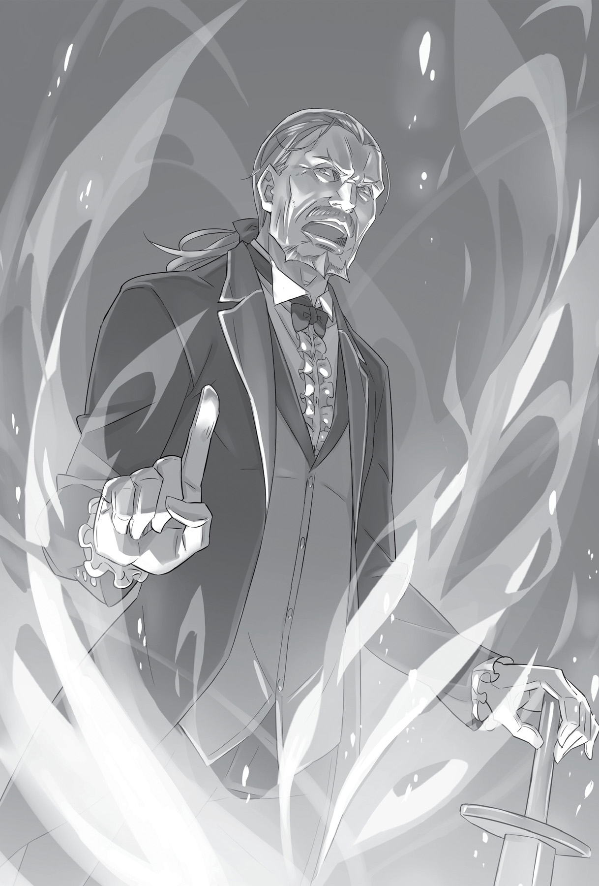

## 1

Получив деревянным мечом по лбу, он потерял равновесие и грохнулся на землю.

Перед глазами всё завертелось. Субару обхватил себя за плечи и сгруппировался, чтобы амортизировать удар. Падение обошлось без травм. Его переполнила гордость за свои успехи.

— Аргх!.. Земля в рот попала… Тьфу-тьфу! Как будто травы наелся… Тьфу-тьфу!

— Полагаю, на сегодня достаточно?

— Шутите? Неужели не заметили, что я стал намного лучше падать? Мой талант только начинает раскрываться!

Единственное, в чём он преуспел за эти дни, так это в падениях, не без горечи признался юноша самому себе.

Поединки с Вильгельмом во дворе особняка Круш проходили ежедневно. Как и прежде, Субару не мог провести ни одной атаки, но его успехи в самостраховке при падениях указывали на то, что Вильгельм, похоже, не зря его лупил.

— Только вот в бою на настоящих мечах ваша техника бесполезна.

— Думаете, я сам этого не понимаю?! У меня и так душевное здоровье по швам трещит!

Вильгельм был прав: если бы они дрались боевым оружием, хватило бы одного удара. Отточенное до блеска мастерство самостраховки не принесло бы Субару решительно никакой пользы. Возможно, он зря развивал навык, полезный только на тренировках. Но так ему, по крайней мере, удавалось растянуть время этих тренировок.

— Как бы там ни было, я вижу, сегодня вы настроены решительнее.

— Леди Круш дала мне пару советов. Она развеяла мои сомнения, так что сегодня я чувствую себя довольно уверенно.

— На днях я прочёл книгу, где герой высказывался примерно так же, как вы, мастер Субару. Но легкомысленность заставила его распрощаться с жизнью на поле боя…

— Неужели в альтернативных мирах тоже есть флаги смерти[^4]?!

Похоже, и в этом мире необдуманные реплики могли довести до могилы.

Субару вдруг задумался над этим, словно ожидая, что Вильгельм подтвердит его предположение.

— Мастер Субару? — Вильгельм обеспокоенно сдвинул брови.

— Нет, ничего. Правда ничего, — улыбнулся юноша, качая головой.

Теперь такие слова, как «смерть» и «поле боя», его не страшили.

Ведь именно на поле боя можно всем показать, чего на самом деле стоит Субару Нацуки.

— …Заснули?

— Ай!

Зазевавшись, Субару не заметил, как тренировка возобновилась, и снова получил внезапный удар мечом. Он был не такой уж и сильный, но юноша завертелся в воздухе как волчок.

— Ха! Подумаешь!

Рухни Субару на голову, он непременно свернул бы шею, но, сгруппировавшись в последний момент, юноша успел принять универсальную позу самостраховки, которая выручает при любом падении.

— Хотите сказать, пора заканчивать? — Вильгельм просунул меч между скрюченными конечностями Субару и лёгким движением распластал его на газоне. Юноша крякнул и раскинул руки и ноги в стороны. Вид у него был такой, словно он так и не понял, что произошло.

Вильгельм воткнул меч в землю и сказал:

— Я застал вас врасплох, но при этом вам удалось упасть правильно. Первый настоящий успех. Однако дело в другом…

Потирая ушибленный нос, Субару бросил на тренера негодующий взгляд, но Вильгельм был исполнен такого спокойствия, что юноша тут же позабыл о нанесённой обиде.

— Дело в том, что вы с самого начала настроены на поражение. Пора менять стратегию. Согласны?

Субару почувствовал, что старик угодил прямо в яблочко, и молча ждал продолжения. Вильгельм поднял кверху указательный палец и сказал:

— Прежде чем я начну обучать вас технике владения мечом и защите, давайте поговорим об основных принципах психологического настроя. Когда принимаешь решение идти в бой, надо отдаться битве без остатка. Не стоит себя нахваливать, ибо это приведёт к поражению. Используйте любые средства и стремитесь лишь к одному — к победе. Если есть силы стоять на ногах, если есть силы пошевелить хоть одним пальцем, вставай. Вставай! Вставай и бейся. Пока жив, бейся! Бейся! Дерись!.. Вот что значит сражаться по-настоящему!

Вильгельм вздохнул, и напряжение, которым был пропитан воздух в саду, развеялось.

Только сейчас Субару обратил внимание, как бешено, оглушительно громко бьётся его сердце. И в тот же момент осознал, что это пульсирует сама жизнь.

Ещё никогда он не ощущал жизнь настолько интенсивно и ярко.

Всего пару минут назад юноша был готов встретить смерть с распростёртыми объятиями. Теперь это чувство иссякло на глазах.

В тот самый миг, когда Вильгельм заговорил о настоящей сути воина, его аура вдруг преобразилась. В глазах Субару этот мягкий, учтивый джентльмен превратился в настоящего дьявола с мечом в руках.

А может, как раз это и был настоящий старик Вильгельм?.. Пожилой мечник Вильгельм Триас; учитель по фехтованию лидера королевских выборов Круш Карстен; воин, который не стесняется демонстрировать свою силу?..

— Бросить вызов, даже если знаешь, что суждено проиграть… — пробормотал Субару, поражённый речью старика. Юноша почувствовал, как огонь в его душе, совсем было потухший, разгорается с новой силой. — Звучит нелогично, но смысл ясен. Я понимаю его не умом, а сердцем. Значит… если у меня получится, я смогу стать сильнее?

— Не факт. Ибо желание обладать силой — это ещё не сила как таковая.

— И вы говорите это в такой момент! Ну сказали бы: «Да, сможешь»! Чего вам стоило?! Всю беседу испортили!

— Я сыт по горло жестокой ложью. Никакой фальши вы от меня не услышите!

— По-моему, правда порой тоже бывает жестока, — произнёс Субару, не заметив, что Вильгельм потупил взгляд.

Казалось, старик что-то недоговаривает. Покрепче сжав рукоять меча, Субару вдруг спросил:

— Но ведь у меня есть хоть какой-то талант к владению мечом?

— По моему мнению, нет. Как ни прискорбно. Не больше, чем у самого обычного человека. Так же, как и у меня… — сказал Вильгельм, будто насмехаясь над собой.

Брови Субару удивлённо поползли на лоб.

— Не ожидал подобной скромности, сэр Вильгельм. Чтобы у вас не было такого таланта…

— Это чистая правда. У меня нет способностей к фехтованию. Иначе я бы делал куда меньше лишних движений. Поэтому у вас, мастер Субару, есть все шансы достичь того же уровня, какого достиг я.

— И сколько для этого нужно времени? — помедлив, спросил Субару.

— Не так уж много. Полжизни будет вполне достаточно.

— Полжизни…

Говорят, настоящий талант в том, чтобы не опускать руки и упорно идти к цели. Но если бы даже Субару действительно имел соответствующие задатки, посвящать тренировкам полжизни он не горел желанием. Ведь юноша пошёл в ученики к Вильгельму только затем…

— Забудь обо всём на свете, погрузись в фехтование с головой, и достигнешь озарения. Что-то вроде этого?

— Кто знает… Одного понимания недостаточно, чтобы взять и обрести силу. Неважно, чист ваш разум или набит сумбурными мыслями. В конце концов победит тот, кто одолеет соперника. Это незыблемая истина. — Вильгельм на секунду задумался. — Может, не стоит такое говорить, но я почти никогда не орудовал мечом с чистым разумом. Например, когда я только начинал осваивать искусство фехтования, моя голова была занята совсем другим.

— И чем же она была занята?

— Мои мысли были всецело посвящены моей жене.

— Сэр Вильгельм, мне иногда кажется, вы просто повёрнуты на своей жене!

Субару вспомнил, как во время знакомства с Вильгельмом тот говорил о супруге с большой теплотой. Да и за время пребывания в особняке Круш ему кто только не напоминал о безумной любви Вильгельма к жене. Должно быть, их брак поистине был заключён на небесах…

Субару улыбнулся воспоминаниям. Глядя на него, Вильгельм коснулся рукой подбородка и произнёс:

— Так или иначе, чтобы обрести силу, нужно быть внутренне готовым к этому. Эх, боюсь, мои наставления не принесут вам особой пользы.

— В смысле?

В ответ Вильгельм слегка покачал головой:

— Я давно понял: если человек не желает стать сильнее, объяснять ему, как это сделать, бессмысленно.

На какой-то миг Субару застыл в недоумении, переваривая сказанное, но тут же спохватился и обиженно воскликнул:

— Минуточку, сэр Вильгельм! Что вы имеете в виду? Я чувствую себя преступником, хоть ничего не успел сделать! Повторите-ка, что вы сказали?

— Если вы в состоянии понять сами, продолжать не стоит. Я уже и так сказал лишнее. Но я не мог упустить возможность донести это до вас.

Вильгельм умолк. Вид у него был такой, словно старику всё ясно. Субару застыл в молчании. Ему становилось тревожнее и тревожнее. Слова Вильгельма всколыхнули в юноше волну нетерпения — того самого нетерпения, природу которого Вильгельм отлично понимал.

Старик видел его насквозь, и это было просто невыносимо.

— Мастер Субару, мне кажется, на сегодня хватит.

— А?..

Субару вытер со лба неожиданно выступивший холодный пот и поднял голову. Вильгельм смотрел в сторону особняка. По саду быстрым шагом приближалась Рем, и, судя по выражению её обычно бесстрастного лица, девушка была обеспокоена.

Что-то случилось.

— В эту минуту появление Рем казалось Субару спасением — отличной возможностью забыть о разговоре с Вильгельмом. Поэтому при виде взволнованного лица Рем он испытал облегчение.

Хотя, быть может, у него просто возникло некое предчувствие…

— Субару! Очень важный разговор.

Рем была сама серьёзность. При взгляде на неё Субару почувствовал, как часто забилось сердце.

Однако юноша никому бы не рассказал о предвкушении, охватившем его сердце…

## 2

— Судя по всему, ты уже в курсе дела, — сказала Круш, когда Субару появился в гостиной.

Феррис тоже находился здесь. Очевидно, Субару был последним, кого оповестили. Он качнул головой.

— В подробности меня пока не посвящали, — произнёс он, покосившись на Рем. — Похоже, Рем и сама толком не знает, в чём дело.

Стоя рядом с Субару, девушка напряжённо произнесла:

— В общем… я уверена, что между мной и сестрицей сработала телепатическая связь. Если бы у меня были способности к ясновидению, как у неё, я бы узнала подробнее, но…

Сокрушаясь над своим бессилием, Рем потупила взгляд.

Выслушав девушку, Круш восхищённо вздохнула:

— Телепатия… Я слышала, некоторые полулюди могут общаться с родственниками без слов… Так ты принимаешь сообщения от сестры, несмотря на расстояние между моим домом и поместьем Розвааля?

— Как я говорила, это смутные ощущения. Обычно какие-то сильные эмоции и слова, которые Рам очень хочет мне передать. Но…

— Выходит, ощущения, которые ты уловила, весьма-а тревожного характера, я правильно понял-мяу? — осведомился Феррис, поводя кошачьими ушками. Он стоял позади Круш и держался непринуждённо.

Субару разозлил насмешливый тон рыцаря, и юноша заслонил Рем:

— Хватит строить из себя высокомерного индюка! Ты ведь тоже что-то знаешь. Может, как раз то, чего не смогла понять Рем. А ну, выкладывай!

— Никто не любит попрошаек, р-мяу! Да и не так-то это просто расставлять сети, чтобы собирать информацию. Назови хоть одну причину, по которой я должен тебе что-то сообщать — обычному пациенту и гостю в этом доме?

— Ах ты…

Феррис был прав на все сто процентов. Субару являлся не более чем пациентом, человеком со стороны, хотя к нему и относились как к гостю. Он мог сколько угодно твердить, что причастен к этому делу, но кто станет угождать политическому сопернику?!

— Феррис, не будь бессердечным, — с укоризной произнесла Круш, пока Субару проклинал свою наивность. — Роль злодея тебе не к лицу. Третируя Субару Нацуки, ты обретёшь врага в лице Рем.

— Ла-адно.

Сидя на диване, Круш предложила Субару место напротив.

— Умение анализировать свои действия приходит с опытом, — сказала она. — Но это зависит от времени и конкретного случая. Сейчас самое главное — устранить разногласия. Согласен?

— Разумеется, — сказал Субару. — Мне ужасно неловко чувствовать себя нахлебником, но я хочу узнать правду.

Субару присел на предложенный диван, а Рем встала позади.

— Во владениях Мейзерсов, точнее, в родовых землях графа Розвааля, в районе, где располагается его поместье, обнаружено некое подозрительное движение. Часть владений по приказу графа уже закрыта.

— Подозрительное движение? Закрыта?

Сообщение Круш вызвало у Субару тревогу. Когда Рем рассказала о своём телепатическом видении, Субару внутренне приготовился к плохим новостям. Однако, услышав подробности, ощутил, как первы натянулись до предела.

— Доподлинно мы пока не знаем, что же происходит в поместье Розвааля. Но мы предвидели подобное. Знали: что-то должно случиться. С того самого момента, когда граф объявил о своём намерении оказывать поддержку Эмилии как претендентке на престол. Иначе говоря, помогать полуэльфийке!

— И что же это? Мятеж?.. Взбунтовалось население его земель, что ли?

Круш не замедлила подтвердить опасения Субару:

— Разумеется, это нельзя исключать. Поскольку всем известно, что у Ведьмы Зависти дурная слава, придётся бороться с народными предрассудками.

Вновь Субару подумал, как страдала Эмилия от своего происхождения, и решил, что это нельзя так оставлять. Как же они отвратительны, никчёмные суеверные глупцы!

— Она прекрасно знала, на что идёт, когда выбирала свой путь. Полагаю, твой гнев не к месту, — заметила Круш, глядя ему в лицо.

— Мой гнев не к месту?! А их гнев?.. Значит, вы говорите, что из-за такой чепухи в поместье Розвааля разгорается бунт… Думаете, это лишь начало?

— Если не вдаваться в подробности, ты прав. Отсюда и ощущения Рем.

Когда Круш заговорила о Рем, все дружно посмотрели на служанку.

— По ощущениям… там было с лихвой гнева и чуть меньше раздражения. Не думаю, что сестрица специально мне это сообщила… Кажется, всё произошло случайно.

— И часто между вами образуется такая связь?

— Нет, разве что по неосторожности. Мы стараемся сдерживать эту способность. Должно быть, сестрица забылась, и случилась ненамеренная передача.

В голосе Рем всё явственнее слышалась тревога. Не было бы преувеличением сказать, что во всём поместье Розвааля Рам обладала самой стойкой психикой. Очевидно, произошло что-то действительно скверное, если уж даже она не смогла обуздать эмоции.

Однако Рам не стала намеренно прибегать к телепатии, чтобы позвать сестру на помощь.

— Думаешь, она не хочет втягивать в это других? — чуть ли не шёпотом пробормотал Субару, рисуя в воображении жуткие картины.

Почему Рам, находясь в критической ситуации, не попросила Рем вернуться? Единственное, что приходило на ум: Рам не хотела, чтобы об этом узнал Субару.

Неужели *она* так не хочет втягивать его в свои проблемы?

— Но ведь… она в беде!..

Положение было таково, что вести из поместья Розвааля докатились даже до столичного особняка Круш.

Как и прежде, положиться Эмилии почти не на кого, а врагов — хоть отбавляй. Кто в таких условиях окажет ей бескорыстную поддержку?

Скорее всего, никто. Потому что сейчас рядом с ней нет её самого надёжного союзника. Потому что она бросила его здесь. Когда Эмилия поймёт это, она обязательно пожалеет. Потому…

— Я должен помочь ей, — тихо произнёс Субару. Он был исполнен решимости.

Все уставились на него: Круш — прищурив один глаз, а озорник Феррис — молча поджав губы.

— Но… Субару, ты не можешь!.. — Рем дёрнула его за рукав. В глазах девушки читалась смесь тревоги и растерянности… и мольба на грани отчаяния. — Ты должен следовать указаниям госпожи Эмилии и господина Розвааля — сосредоточиться на лечении! И я с ними согласна. Прежде всего ты должен думать о своём здоровье!..

— А тем временем случится непоправимое?! — перебил её Субару. — Рем, история повторяется! Ты говоришь то же самое, что в тот раз, когда мы оказались на опушке леса со зверодемонами. У нас нет выбора. Мы должны помочь ей!

Лицо Рем сделалось болезненно неподвижным.

Однажды он сказал то же самое. Когда Рем отговаривала его идти в лес, чтобы вернуть детей, похищенных зверодемонами.

В тот раз у них получилось. Субару твёрдо принял решение и спас ребят. Поэтому сейчас Рем наверняка догадывалась, что движет юношей в эту минуту, и её гипотеза была недалека от истины.

— Вы слышали, леди Круш. — Субару отстранил вцепившуюся в его рукав Рем и пристально посмотрел на герцогиню, что сидела напротив. — Мы с Рем возвращаемся в особняк, к Эмилии. Лечение придётся отложить, пока мы всё не уладим…

— Субару Нацуки! — перебила его Круш.

Юноша замер. Прозрачный незамутнённый взгляд был устремлён прямо на него. Сердце билось как бешеное, готовое в любую секунду выпрыгнуть из груди. Кажется, он забыл, с кем имеет дело.

— Если ты покинешь этот дом, считай, что стал моим врагом!

Холодная, сухая фраза поразила его, словно удар клинка. Её смысл, как боль от ножевой раны, дошёл до мозга не сразу.

— Что… что вы хотите…

— Во-первых, хочу развеять твои заблуждения. То, что я обращаюсь с тобой как с гостем, и то, что Феррис тебя лечит, является частью договора.

— Договора?..

— Да, договора. Мы с Эмилией заключили договор. Я пустила тебя в дом в обмен на определённое вознаграждение. Но…

Круш вдруг умолкла и приложила руку к груди.

— Договор был заключён до начала королевских выборов, — продолжила она. — Сейчас ситуация изменилась. Поскольку отныне Эмилия — моя политическая соперница, я должна быть очень осторожной, имея дело с её сторонниками. То же самое касается договора о твоём лечении. С началом королевских выборов обстоятельства изменились, и я не обязана соблюдать условия договора, который был заключён прежде.

«Договор, договор…» — раз за разом повторяла Круш, и, слыша это, Субару вспомнил о «договорённости», которая была между ним и Эмилией. В памяти всплыл момент расставания, и снова ужасно защемило в груди.

— Как только ты покинешь этот дом, я буду считать, что условия договора нарушены. В конце концов, мы с Эмилией враги, пусть даже между нами и нет открытой неприязни.

Происходящее никак не укладывалось в голове! По сути, Круш объявила войну.

Субару понимал, что официально Круш и её сторонники являются его врагами. Ещё недавно он сам говорил об этом Рем, когда осознал, как беспечно проводит здесь время, и пообещал девушке впредь быть осторожнее.

Тем не менее понимания было недостаточно. Он всё ещё не осознавал до конца тот факт, что девушка, сидящая на против, была могущественным противником, который стоял на пути Эмилии и его самого.

— А я думал, мы станем друзьями… Как же я заблуждался!..

Повисла пауза.

— В тот вечер, — продолжил Субару, — когда мы сидели на балконе и болтали, вы сказали: «Ты должен сделать всё возможное…» Какой же я глупец — поверил врагу! Конечно, лучше прикинуться дурачком и ввести соперника в заблуждение…

В душе Субару возникло смутное ощущение ненужности — как тогда, на церемонии открытия выборов. И одновременно — ощущение, что его предали. Воспоминания о недавних посиделках на балконе стали далёкими и тусклыми. Ведь тогда Круш внушала Субару, что он должен сделать всё, на что способен.

А теперь она встаёт на его пути. Разве это не предательство?!

— Короче, вы желаете меня задержать, потому что у вас будут неприятности, если я помогу Эмилии?

— Хотелось бы избежать недопонимания-мяу… — подал голос Феррис, который, видимо, устал молча наблюдать за происходящим.

Под угрожающим взглядом рыцаря Субару не смог выдавить ни слова.

— Госпожа Круш вовсе не желает тебе зла. Совсем наоборот. Ради бога, идите спасайте госпожу Эмилию, нам от этого ни горячо ни холодно, р-мяу.

— Феррис, довольно!

— Не-ет, госпожа Круш, я скажу! — Феррис не отрываясь сверлил глазами Субару. — Такое ма-аленькое недопонимание может плохо кончиться, так что кто-нибудь должен объяснить юноше, что к чему. Иди, Субарунчик, иди, но имей в виду: это ничего не изменит. Думаешь, ты поступаешь правильно? И договор пропадёт напрасно, а ведь госпожа Эмилия чем-то поступилась, заключая его. Неужели ты до сих пор не понял? После того позора в королевском замке? Мало тебя Юлиус обработал на плацу? Неужели не ясно: лучше вести себя тихо, спокойно наблюдать за развитием событий и сосредоточиться на своём здоровье?

Слова Ферриса стали последней каплей. Субару даже почудилось, будто он услышал громкий треск. И когда понял, что это лопнуло его терпение, юношу охватила такая ярость, что он чуть не прокусил насквозь губу.

Довольно унижений! В груди вспыхнуло пламя негодования. Он доверился, но оказался обманут.

И этой вспышки гнева оказалось более чем достаточно.

— Решено! Я возвращаюсь в особняк, к Эмилии. Благодарю за гостеприимство.

— Субару! — умоляюще воскликнула Рем.

Но он остановил девушку жестом и, поднявшись с дивана, посмотрел сверху вниз на Круш. Герцогиня сидела, скрестив руки и закрыв глаза. Субару не знал, о чём она сейчас думает. Стоящий рядом Феррис тяжело вздохнул.

— Никакого уважения к другим… — сказал он, брезгливо поморщившись. — Разве настоящему мужчине не до́лжно прислушиваться к советам, которые ему дают?

— Благодаря твоим советам я и принял это решение. Так что спасибо.

Феррис не стал отвечать на явный сарказм в свой адрес. И тут заговорила Круш. Она высвободила руки и, подняв глаза на Субару, обратилась к нему:

— Субару Нацуки. К сожалению, все драконьи экипажи для дальних поездок заняты. Осталось лишь два вида драконов: грузовой, он слишком медлителен, и дракон для средних дистанций, которого по дороге придётся заменить.

— Что?.. — Субару не поверил своим ушам. Он уже приготовился выслушивать упрёки, но Круш пошла ему навстречу.

Её предложение оказалось столь неожиданным, что Субару ещё некоторое время не мог прийти в себя. Герцогиня нахмурилась.

— Феррис, — она повернулась к рыцарю, — я что-то не то сказала?

— Меня всегда поражало, госпожа Круш, как радикально вы можете менять намерения-мяу, — сказал Феррис, подперев щёку рукой и с горечью возведя глаза к потолку. — Вы же не собираетесь на самом деле давать Субарунчику дракона?!

Круш кивнула Субару:

— Делай то, что считаешь нужным. Я уважаю твоё решение. Каким бы оно ни было, ты должен нести ответственность за его выполнение и совершить задуманное! Чтобы не было стыдно перед самим собой. Верно?

— Да, именно! Я просто хочу быть честным перед самим собой. Не могу я тут прохлаждаться, когда Эмилии нужна помощь…

Никто не собирался его останавливать, и присутствующим стало как-то неловко.

Решимость юноши, кажется, передалась и Рем: девушка вдруг опустила веки, словно мысленно укоряя себя за что-то, а затем, когда распахнула глаза, её лицо снова стало непроницаемым.

— От имени моего хозяина позвольте поблагодарить вас за доброту и гостеприимство.

— Не стоит. Нам было приятно. Но хотелось бы всё-таки понять, как вы предполагаете добраться до владений Розвааля…

— Не сочтите за дерзость, — сказала Рем, опустив голову, — но вся надежда на вас. Нам нужно как можно скорее удостовериться, что дома всё в порядке…

— Однако вы избрали не самое подходящее время, — предупредила Круш. — Дорога до поместья Мейзерса займёт не менее двух с половиной суток.

— Двух суток?! Ничего себе! Но сюда мы доехали меньше чем за полдня!

Если Субару не изменяла память, драконья повозка покинула поместье Розвааля ранним утром и уже к обеду прибыла в столицу. Даже если в их распоряжении окажется не такой быстрый экипаж, Круш явно ошиблась в расчётах.

— Нет, — сказала Круш. — По тракту Лифаус, по которому вы сюда попали, сейчас не проехать. К несчастью, эту дорогу затянул Туман. Так что придётся добираться в объезд.

— Подумаешь, туман! Разве это помеха?..

— Это Туман, порождаемый Белым Китом, — пояснил Феррис. — Всякому известно: попадёшь в этот Туман на зад не вернёшься, р-мяу.

Белый Кит… Субару наморщил лоб, пытаясь понять, где мог слышать о нём. Пока он вспоминал, Рем взяла инициативу в свои руки. В результате было решено, что дом Карстен одолжит им экипаж для средних расстояний, а в одной из придорожных деревень путники пересядут в другой и в нём доберутся до особняка Розвааля.

Субару мысленно посетовал на неудобство драконьих повозок, на которых нельзя было двигаться без остановок для отдыха. То ли дело машина: подливай бензин и гони сколько хочешь!

Субару весь горел от нетерпения, но сложные обстоятельства требовали от него умерить пыл. Тревога окутывала юношу, как Туман, застилавший обратный путь. На сердце тяжёлым камнем лежало недоброе, мучительное предчувствие…

## 3

Как только все вопросы были улажены, Субару и Рем живо начали готовиться к отъезду. Быстро собрав вещи, они поспешили к воротам резиденции Круш, где их уже ждал экипаж. Чтобы облегчить повозку, с неё сняли все украшения. В карету был запряжён пурпурно-красный земляной дракон, которого держал под уздцы Вильгельм. Заметив Субару и Рем, старик согнулся в глубоком поклоне.

— Это самый резвый дракон из оставшихся, — сообщил он. — К сожалению, он не так хорош, как драконы графа. Да и тем, что бегают на дальние дистанции, он тоже уступает, но… вы уж не обессудьте.

— Нам вполне сгодится и этот, — сказал Субару, когда Рем взяла поводья. — Вот только… не знаю, как мы вернём его обратно, — добавил он с поникшим видом.

Из провожавших у ворот стоял лишь Вильгельм. С Круш и Феррисом гости попрощались в холле у дверей особняка. Они, без сомнений, расставались навсегда: вряд ли у Субару и Рем будет возможность вернуться, чтобы отдать карету и дракона.

— Моё положение таково, — проговорил Вильгельм, — что я обязан исполнять приказы госпожи Круш. Когда вы покинете этот дом, наши хозяева станут врагами. Карета и дракон — скромный прощальный подарок в знак сожаления о том, что вам пришлось прервать на полпути как своё лечение, так и уроки фехтования.

— Мне кажется… когда мы прощались, леди Круш не проронила об этом ни слова…

Герцогиня и её рыцарь Феррис сказали ровно то, что и следовало ожидать:

«Желаю удачи. И пусть избранный путь не посрамит твою честь и не омрачит душу!»

«Госпожа Круш была к тебе очень добра-мяу, так что, если ты быстренько не помиришься с госпожой Эмилией, её это очень расстроит! Я серьёзно-мяу! А теперь давай, руки в ноги и вперёд!»

Слова Ферриса подействовали на Субару особенно сильно. Однако в них не было и намёка на подарок, о котором говорил Вильгельм.

— Не волнуйтесь, — сказал Вильгельм, — Я уже давно служу в доме госпожи Круш и более-менее разбираюсь в её желаниях.

— Кстати, а как долго вы здесь работаете?

— Кажется, чуть более полугода…

— Я думал, у вас стаж повнушительней! Говорите так, будто сто лет уже вместе!

Пока Субару и Вильгельм беседовали, Рем проворно погрузила багаж в карету, а затем, взяв поводья, ласково погладила дракона по морде.

— Ты будешь меня слушаться? Конечно, будешь, — приговаривала девушка. — Молодец, хороший мальчик.

— Рем, как он тебе?

— Кажется, у него немного вздорный нрав, но я уже объяснила, кто здесь главный, так что проблем быть не должно. Надеюсь, мы поладим.

— Мм… А ты та ещё командирша!

После «разговора» с Рем дракон выглядел так, словно был готов исполнить любое её желание. Им предстоял долгий путь, поэтому кучеру было важно найти с животным общий язык.

— Раз вы собираетесь двигаться в объезд, ваш путь будет лежать через две деревни. Полагаю, в той, что называется Ханумас, — она ближе к владениям графа — вы сможете пересесть на другую повозку.

— А сколько ехать до этой деревни Ханумас?

— Часов четырнадцать, а то и пятнадцать. Оттуда до поместья ещё полдня пути, если гнать изо всех сил…

Как ни крути, а пилить придётся не меньше полутора суток, Субару с досадой почесал в затылке.

— Спасибо вам за всё-всё, — юноша поклонился. — Особенно за тренировки. Жаль, что пришлось их бросить…

— Полагаю, самому важному я вас научил. А чтобы совершенствоваться, достаточно просто усердно заниматься. Ну, будьте здоровы.

Вильгельм протянул Субару руку, и они обменялись крепкими рукопожатиями.

Рем вскочила на ко́злы. Субару забрался в карету и, выглянув из окошка, в последний раз помахал Вильгельму рукой.

— Счастливо! Если повезёт, ещё увидимся!

— Мой деревянный меч всегда готов оказать радушный приём!

Так, с шутками, приличествующими истинному джентльмену, Вильгельм проводил Субару и Рем в путь.

Дракон издал короткий рык, и экипаж неспешно тронулся с места. Постепенно набирая скорость, он всё удалялся от особняка Круш, пока стоящая у ворот фигура с почтительно опущенной головой совсем не скрылась из виду.

Спустившись с холма, они миновали кордегардию, охранявшую квартал знати, проехали по широкой улице, на которой селились простолюдины, покинули столицу через главные ворота и направились к окольному тракту.

Экипаж слегка тряхнуло, когда дракон активировал Защиту. Ощущая под собой эту едва уловимую дрожь, Субару глядел в окошко, пытаясь совладать с нервным ознобом.

Когда стройные ряды домов остались позади, за окном, сколько хватало глаз, раскинулись обширные зелёные равнины.

Перекинуться хоть парой слов с Рем было невозможно: девушка полностью сосредоточилась на управлении экипажем, поэтому Субару ничего не оставалось, как погрузиться в размышления.

«Круш, — рассуждал он, — заявила, что не может одолжить экипаж для дальних поездок. И действительно, эта карета выглядела так, словно её использовали для перемещений по городу».

Субару вспомнил бесконечный поток въезжающих на территорию резиденции и покидающих её драконьих повозок. Однако герцогиня пошла навстречу и, несмотря на то что весь транспорт был занят, выделила дракона. Такая отзывчивость вызвала в Субару смешанные чувства, которые было очень трудно выразить словами.

Вплоть до сегодняшнего утра он считал её хоть и суровой, но неравнодушной девушкой, однако разговор перед отъездом сильно его запутал. Вместе с тем юноша понимал, почему так много людей мечтает об аудиенции с ней. Эмилии стоило бы поучиться у Круш заводить полезные знакомства.

Как бы там ни было, Эмилии предстояло ещё множество испытаний. Причём как неизбежных, так и тех, без которых лучше бы обойтись.

— Вот почему я должен… как можно скорее добраться до Розвааля!..

Само собой, впереди их ждали политические интриги сильных мира сего. Субару прекрасно понимал, что беспомощен в таких вопросах и что скоро столкнётся с невыполнимыми задачами. Однако собственная слабость — не повод бросать в беде того, кто тебе дорог. Субару не допускал даже мысли об этом!

Надо всей душой желать и верить, тогда любая преграда будет нипочём!

Именно это Субару Нацуки и делал.

— Без меня она пропадёт… В конце концов Эмилия всё должна понять…

Хотя его вера не была чем-либо подкреплена, юноша не сомневался в своём плане и мечтал воплотить его в жизнь.

У Эмилии неприятности. Ему нужно побыстрее оказаться с ней рядом, и тогда всё как-нибудь образуется. По крайней мере, Субару на это надеялся, хотя надежда и была призрачной.

Ему не терпелось показать, чего он стоит. Эмилии сейчас очень непросто, но Субару вытащит её из беды!

Нет, даже не так: Эмилия попала в беду именно для того, чтобы Субару смог проявить себя, чтобы все узнали, каков он!

— Да… Без меня у неё ничего не выйдет! Как пить дать!..

В сознании возник необычайно дорогой и близкий образ девушки с серебристыми волосами. Но нежная улыбка скрылась в загадочном мраке, утонула в смертельном яде, грозящем остановить её благородное сердце.

Такую картину рисовал Субару, закрыв глаза и до боли закусив нижнюю губу. Он молча считал минуты и часы одинокой дороги, оторванный от всего мира. Кроме Рем, управлявшей экипажем, вокруг не было ни единой живой души.

Юноша даже не заметил, как уголки его губ слегка приподнялись.

## 4

Солнце уже клонилось к закату, а до деревни Ханумас, где путники планировали сменить дракона, было ещё далеко. Когда тьма начала сгущаться, экипаж достиг посёлка Флёр; там же была почтовая станция.

— Ночью ехать опасно, — сказала Рем. — Можно нарваться на разбойников или зверодемонов. Или на Туман, который тоже где-то рядом. Я думаю, сегодня нам следует заночевать на постоялом дворе.

— Далеко ещё до этой деревни — Ханумас?

— Пока мы туда доберёмся, будет за полночь. Боюсь, места для ночлега мы не найдём. Да и нового дракона посреди ночи нам никто не станет искать…

— Гм… Тогда и вправду лучше остаться здесь.

Пока Субару, сидя в карете, предавался размышлениям, у Рем тоже было время подумать. Разумеется, в отличие от своего легкомысленного спутника, она тщательно взвесила все за и против, прежде чем принять решение. И хотя Субару совсем не радовала перспектива задержаться здесь на ночь, он всё же согласился.

— Ладно, остановимся во Флёре. А на рассвете тронемся в путь. Дракон как раз успеет восстановить силы, а в Ханумасе найдём новый транспорт.

— Верно. Отправимся пораньше, сменим в Ханумасе дракона и, возможно, к вечеру будем дома, — с облегчением сказала Рем, довольная, что Субару не пришлось уговаривать.

К счастью, место для ночлега во Флёре нашлось довольно быстро. Поставив дракона в стойло, примыкающее к постоялому двору, путники утолили голод нехитрым ужином, смыли дорожную пыль и улеглись спать, чтобы ранним утром двинуться в путь.

— Не могу уснуть…

Мысли об Эмилии и разгорячённое воображение никак не давали Субару покоя. Ворочаясь с боку на бок, он отчаянно пытался забыться, но сон ускользал прочь.

Юноша вспоминал особняк Розвааля и резиденцию Круш. Много ночей подряд он наслаждался кроватями и постельным бельём наивысшего качества. Здесь же, в глуши, койки оказались настолько жёсткими, что уснуть было совершенно невозможно.

«Поскорее бы рассвет!» — мечтал Субару, проклиная бесконечные минуты и своё изнеженное тело. Время для размышлений ему уже не требовалось, и единственное, чего он хотел, — быстрее начать действовать. Поэтому юноша непрестанно торопил восход.

Когда пялиться в потолок уже не было сил, а все мыслимые лежачие позы оказались перепробованы, в дверь постучали.

— Субару, можно войти?

Тихо скрипнула дверь. Юноша приподнялся и увидел Рем. Она стояла на пороге, просунув голову внутрь. Вместо привычного костюма служанки на ней была лёгкая голубая сорочка, в которой Субару уже видел её однажды.

Заметив, что он не спит, Рем обрадовалась и подошла к кровати.

— В чём дело? — спросил Субару. — Знаешь, сейчас не самый удачный момент жаловаться, что тебе грустно и ты не можешь заснуть одна. Будь я не так взвинчен, я бы здорово посмеялся, но сейчас…

— Я пришла не поэтому. У меня бессонница, и просто захотелось поговорить…

— Ясно… Значит, и тебе тоже не спится. Ну, ничего не поделаешь.

Субару выполз из-под одеяла, и Рем осторожно присела рядом с ним на краешек кровати. Они сидели настолько близко друг к другу, что едва не соприкасались плечами.

— Мне так неловко, — проговорил он, бросив беглый взгляд на бледное лицо девушки, — что доставил столько хлопот.

— Тебе не за что винить себя. Ради тебя, Субару, я готова преодолевать любые трудности.

Рем гордо вскинула голову, и юноша ощутил укол совести. Он знал, что Рем так ответит. После переполоха со зверодемонами она стала его безоговорочным союзником. По иронии судьбы именно Рем была тем человеком, кто по-настоящему ценил Субару.

— Сейчас ты не обо мне должна беспокоиться, а о том, что произошло в особняке. Переживай лучше за тех, кто там. Мы ведь даже ничего толком не знаем!

Лицо Рем сделалось неподвижным. Она кивнула и потупила взгляд.

— Всё будет хорошо! — подбодрил её Субару и улыбнулся. — Мы имеем слишком большие планы, чтобы так просто сдаться! Как только приедем на место, уж я как-нибудь разберусь со всем!

Субару старался вести себя как можно увереннее, чтобы хоть немного облегчить тяжесть, которую Рем взвалила себе на плечи, и успокоить её расстроенные нервы.

Но, увы, у него по-прежнему не было для этого никаких оснований. Юноша не имел конкретного плана действий и сомневался в собственных словах. И всё-таки…

— Хорошо. Я верю тебе, Субару.

Рем улыбнулась, её лицо излучало такое спокойствие, словно вместо одного-единственного защитника её поддерживает многотысячное войско. Улыбка Рем очаровала Субару настолько, что он тут же залился румянцем и стыдливо отвёл взгляд.

Ему стало неловко не только за свои слова, но и за то, что девушка поверила им. Не зная, что сказать, он повернулся к Рем спиной и тут же спохватился: о чём она подумала, когда он сделал это?

Внезапно Субару почувствовал тепло её тела. У него перехватило дыхание.

— Ре… Рем-сан? Вы… Почему вы это делаете? — Шею обожгло жаркое дыхание, и юноша машинально перешёл на вы.

— Потому что хочется, — помолчав, сказала Рем.

В ответе крылось нечто большее, чем просто слова. Тело девушки было таким горячим, что сердце Субару заколотилось, как отбойный молоток.

Прижавшись к нему сзади, Рем нежно обвила руками его торс. Субару вдыхал сладкий аромат, ощущал прикосновение ладоней и медленно погружался в блаженное *тепло*.

— Это… это похоже на… — прошептал он, всё сильнее заливаясь краской.

И тут он понял, что это за *тепло*. Это было не то тепло, что исходило от тела. Оно поразительно напоминало то, что юноша ощущал последние несколько дней кряду.

— Я излечиваю твои врата, Субару, — произнесла Рем, будто прочитав его мысли. — Так же, как это делал господин Феликс. Я ведь несколько раз наблюдала за сеансами. Конечно, я не так сильна, как господин Феликс, и моё лечение, возможно, принесёт лишь временный эффект…

— А-а… Лечение! Ну конечно! Лечение! Теперь понятно. Ха-ха!..

Субару стало стыдно за поспешные выводы, и он с трудом выдавил наигранный смешок. Ему показалось, что Рем за его спиной робко улыбнулась, после чего мана хлынула с новой силой.

— О-о, вот это да… По правде сказать, у тебя это получается даже лучше, чем у Ферриса.

— Спасибо. Но это нечестно по отношению к господину Феликсу.

— Да прям! Нет, я серьёзно! Так хорошо стало, и… спать захотелось…

Пусть эффект от лечения Рем был не так силён, как от процедур Ферриса, но пациент всё равно был готов отдать пальму первенства девушке. Субару овладело блаженство, точно его погрузили в тёплую воду.

— Наверное, эффект зависит от того, что лекарь чувствует к пациенту, — тихо заметила Рем, но он не расслышал. Приятная истома всё глубже погружала его в сон.

Субару уже клевал носом, когда девушка приблизила губы к его уху и прошептала:

— Усни. А я аккуратно уложу тебя на постель, накрою одеялом и, вдоволь налюбовавшись тобой, пойду к себе.

— Ничего, не замёрзну… Да и как я могу заснуть, когда ты так для меня стараешься…

Упрямиться было глупо, но юноше не хотелось показаться равнодушным к её доброте. Рем про себя улыбнулась, и Субару почувствовал, что руки, обнимающие его за плечи, коснулись шеи. Поток тепла от ладоней девушки усилился. Веки Субару стали словно чугунные.

— А-а… Чёрт… Зачем я… То есть зачем ты… Рем, тебе же тяжело…

Он яростно потёр глаза, прогоняя напавший сон.

— Рем, — снова заговорил Субару, лишь бы не заснуть, — почему ты… так ко мне…

— Потому что мне так хочется. Этого достаточно.

Мысли разбредались в разные стороны. Ещё чуть-чуть — и он вырубится. Но ответ Рем успел дойти до его сознания. «Мне так хочется». Очень важные слова. Именно они были отправной точкой всех его мыслей и стремлений.

— Она точно… разозлится на меня…

Он вернётся в особняк, встретится с Эмилией. Но что дальше? Это не давало покоя.

Юноша закрыл глаза. Голова кружилась, как перед обмороком. И только нежные объятия Рем не давали ему завалиться на бок.

— Главное — не спеши. Встретишь её в подходящем месте, скажешь всё, что думаешь, и она обязательно поймёт. Субару, ведь ты такой молодец. Всё будет хорошо!

— Да… Точно… Раз ты… и правда так… думаешь…

Его голос звучал словно издалека. Нет, просто сознание было готово вот-вот ускользнуть.

Сладкая истома уступила место неодолимому, точно проклятие, сну, и опустившиеся веки превратились в клетку для всех его мыслей и чувств.

Однако прежде чем сознание Субару погрузилось в сон…

— Оставь в своём сердце уголок и для меня.

…он ощутил, как губы Рем коснулись его затылка.

— И никуда не уходи, Субару…

Произнесённая шёпотом мольба осталась без ответа. Субару медленно проваливался во тьму, пока не исчез в ней.

## 5

Проснувшись, он сразу же почувствовал сквозь сомкнутые веки обжигающее тепло солнечных лучей.

Лёжа на боку, юноша поднёс к глазам ладонь, заслоняясь от яркого света. Солнце нещадно било в широкое окно, и под одеялом, которое он натянул по самую голову, было так жарко, что Субару вспотел.

Прошло несколько секунд, прежде чем юноша собрался с мыслями. И тут до него дошло.

— Как? Солнце уже встало?!

Он скинул одеяло, вскочил с кровати и подбежал к окну. Сквозь распахнутые ставни в комнату лился свежий воздух, и на ошеломлённого Субару взирало стоящее высоко в небе дневное светило.

Открывшийся вид ударил как обухом по голове.

— Не может… быть!.. Какой же я кретин! Уже столько времени!..

В голове закрутилась страшная мысль: «Проспал!» Субару опрометью бросился в коридор к соседней комнате, где спала Рем, и принялся молотить в дверь. Затем, не дожидаясь ответа, ворвался внутрь.

— Рем, вставай! Мы проспали!

Внутренне проклиная себя за то, что провалялся полдня, как сурок, он тревожно огляделся.

— Рем?..

Только теперь Субару понял: комната пуста!

Кровать оказалась аккуратно заправлена, простыни выглядели нетронутыми. Было совсем не похоже, чтобы на них кто-то лежал. В комнате не наблюдалось каких-либо следов человеческого присутствия. Субару охватило неприятное предчувствие.

Не обнаружив даже багажа, который они принесли ночью, Субару выбежал из комнаты и помчался к стойке. Хозяин, накануне оказавший гостям радушный приём, был на месте. Завидев Субару, он изобразил вежливую улыбку.

— О, доброе утро! Хорошо ли спалось?..

— Что с голубоволосой девушкой, которая была со мной вчера?! — выпалил Субару, пропустив учтивый вопрос мимо ушей, и стукнул кулаком по стойке.

Хозяин удивлённо вскинул руки, пытаясь угомонить разъярённого гостя:

— Пожалуйста, тише! Вы напугаете постояльцев…

— Отвечай! Что с моей спутницей, Рем? Куда она делась?

— Ваша спутница… с которой вы… пожаловали вчера вечером… на драконьем экипаже?

— Ну, говори же!

— Я и говорю! — чуть ли не закричал хозяин, испугавшись свирепого вида Субару. — Она уехала ночью! На том же драконе, на котором вы прибыли! А ваш багаж оставила мне и заплатила за постой. — С этими словами он полез под конторку, вытащил оттуда сумку и положил её перед Субару. — Вот. А насчёт оплаты не беспокойтесь, она оставила даже больше, чем нужно…

— Не беспокойтесь?! — повторил Субару,

Судя по всему, хозяин старался лишний раз не раздражать постояльца, но эта фраза привела Субару в ещё большее бешенство.

— Не беспокойтесь?! Да ты хоть понимаешь, что произошло?!

Он с силой ударил по сумке, а затем обхватил голову руками.

На Субару обрушился настоящий вихрь вопросов, сомнений, злости и печали. Всё сплелось в невообразимый клубок, и юноше оставалось лишь рвать на себе волосы. Как же несправедливо она поступила! Единственный человек, который понимал его и сочувствовал, оказался бессердечным!

— О чём ты только думала, Рем?! О чём?! — простонал он, возводя глаза к потолку.

Но его слова отозвались эхом.

## 6

*Субару.*

*Сейчас, читая это письмо, ты наверняка злишься на меня. Я оставила тебя и уехала в особняк одна, но я не прошу прощения. Прошу лишь понять меня.*

*Тебе опасно возвращаться, ведь твоё здоровье ещё не окрепло.*

*Поэтому будет лучше, если ты дождёшься меня здесь, во Флёре. Когда я всё улажу, обязательно приеду за тобой.*

*Все Деньги я оставила. Можешь жить в гостинице сколько понадобится. Хозяину я заплатила и обо всём с ним договорилась.*

*Пожалуйста, береги себя. И прошу: жди меня и никуда не уезжай!*

*Твоя Рем*

[^4]: Флаг смерти — действие или реплика, которые с большой вероятностью приводят к тому, что персонаж, совершивший данное действие или произнёсший данную реплику, умирает. Встречается в видеоиграх, аниме и др.
