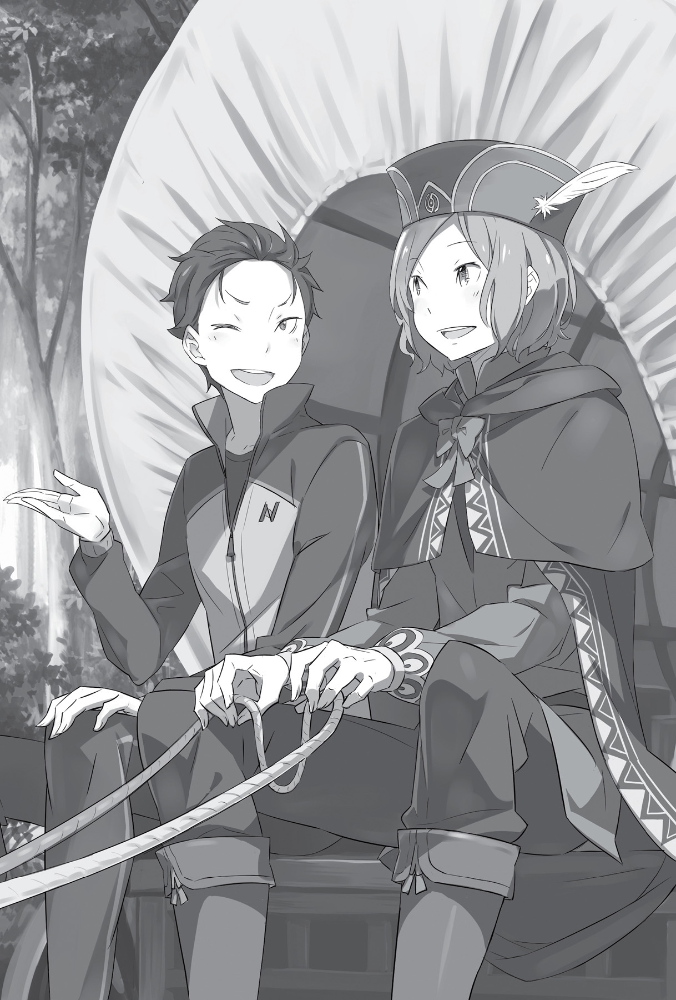
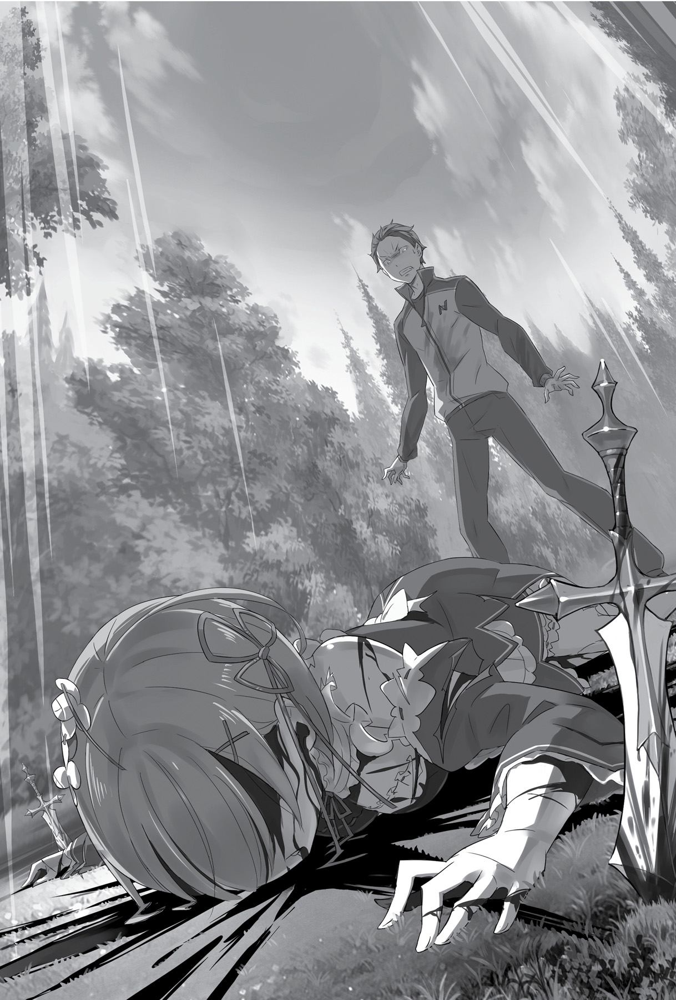

## 1

«…Как ты посмела предать меня, Рем?.. Как ты посмела?.. Как?..»

— Какая же ты дурёха!..

Письмо, которое она оставила вместе с вещами, вызвало в Субару бурю негодования.

Он сидел на жёстком диванчике в гостиной на первом этаже постоялого двора. В полном одиночестве. Впрочем, юноша сам распугал всех гостей, когда пришёл в ярость из-за Рем. Даже хозяин, ответив на вопросы Субару, поспешил ретироваться — и правильно сделал! Субару сейчас был в таком состоянии, что мог наброситься на любого, кто подвернётся под руку.

— Я-то думал, что ты со мной! Что ты за меня!..

Письмо было написано простейшими символами, аккуратным, разборчивым почерком. Ведь Субару ещё не успел как следует овладеть местной письменностью и не мог читать сложные тексты. И от такой предусмотрительности со стороны Рем ему становилось ещё больнее.

Девушка явно старалась для него, но, увы, Субару не мог принять такую заботу. И в письме он увидел лишь одно.

— Даже ты, Рем, считаешь меня бесполезным, никчёмным слабаком…

В памяти всплыли разговоры в доме Крути, вчерашний диалог с Рем, препирательства с Эмилией в столице…

Голоса хором осыпа́ли его упрёками за слабость и недальновидность. А ведь был такой шанс! Он мог отбросить прошлое и показать всем, чего на самом деле стоит!

Ведь никто на свете, никто другой не верил в него так, как Рем. По крайней мере, Субару так думал.

— А, я понял!.. Ты бросила меня, потому что я обуза… Потому что на меня нельзя положиться… Тогда в гробу я видал твою поддержку! — Субару заскрежетал зубами от злости и резко поднялся.

На столе лежали оставленные Рем вещи и мешок с приличной суммой. По-видимому, Розвааль не поскупился, когда они покидали особняк. Денег в мешке оказалось столько, что о них можно было не думать довольно долго.

…Всё рассчитала. Но в одном она ошиблась. Неужели Рем думает, что предаст человека, уедет, оставив кучку монет, а он будет покорно ждать её возвращения? Ну уж нет! Ему надо придумать, как выпутаться из передряги, и деньги он пустит именно на это…

— Можно нанять извозчика, чтобы добраться до особняка. Почему бы и нет? Но опять же…

Похоже, Рем действительно всё предусмотрела. Такой план никуда не годился. По словам хозяина постоялого двора, взять напрокат экипаж в этой деревне было просто негде, а дорожное сообщение между соседними поселениями прекратилось из-за Тумана.

Иными словами, деньги не помогут. Проблема в отсутствии транспорта. Рем с самого начала, предлагая заночевать в этом посёлке, всё продумала. Подстроила так, чтобы у Субару не осталось выбора. Словно в насмешку над его простодушием.

И всё ради того, чтобы задержать его, не дать вернуться в особняк.

— А если пешком?.. Нет, это надо быть полным дураком! У меня и карты не… И если зверь какой встретится — что я смогу сделать?

Встреча с разбойниками или зверодемонами положила бы конец его путешествию. За время пребывания в этом мире Субару несколько раз попадались на глаза географические карты. Однако ни масштаб карты, ни своё местонахождение Субару не знал. Шансы добраться до особняка без каких-либо ориентиров равнялись нулю.

Пришло время расплачиваться за собственное невежество, недостаток знаний и слабость.

Впрочем, раньше ни разбойники, ни зверодемоны Субару особо не страшили. Едва ли он хоть раз серьёзно задумывался, как дать отпор. И теперь у Субару не оказалось даже меча. Какой был смысл заниматься фехтованием, если в критический момент он остался без оружия? Что можно сделать голыми руками?

Даже в самых пустяковых вопросах Субару целиком и полностью полагался на Рем. Он не знал, сколько стоит прокат драконьей повозки или ночь на постоялом дворе. Какой бы крупной суммой ты ни владел, богатству грош цена, если не умеешь его применить.

Такова была плата за невежество. За множество упущенных шансов подтянуть свои знания.

— Ну, теперь уже ничего не попишешь. Всё равно надо что-то делать.

Субару понимал: он сам загнал себя в тупик. Юноша продолжал нервно постукивать ногой по полу, желая отделаться от этой неприятной мысли.

— Вариант идти пешком отклоняется. Дракона взять негде. Но должен же быть хоть какой-то выход!.. Думай!

Обхватив голову руками, Субару мобилизовал все свои скудные знания, полученные в этом и в родном мире. Казалось, вся энергия тела уходила на то, чтобы подпитывать мозг, который работал на полную катушку. Наконец Субару увидел одну возможность, которая могла переломить ситуацию.

— Взять напрокат дракона тут нельзя, и все регулярные рейсы отменены… Тогда…

Кого можно найти в посёлке, кроме местных жителей? Путников, приехавших рейсовыми дилижансами, и…

— Тех, кто прибыл па собственном транспорте, — таких, как мы с Рем!

Учитывая, что на постоялом дворе имелось стойло для драконов, гипотеза была вполне логичной.

— Если найдутся богачи… нет, лучше странствующие торговцы — будет просто чудесно! По идее, прежде чем открыть свою лавку, любой торговец работает на чужого дядю, разъезжая по всей стране с товаром…

В душе вновь затеплился почти угасший огонёк надежды. Решив, что надо испробовать все варианты, Субару поспешил к хозяину постоялого двора. Тот поначалу был против, но в конце концов скрепя сердце показал несколько номеров, в которых остановились купцы.

— Только вряд ли они возьмут лишний груз или свернут с намеченного пути, — добавил он. — Даже не знаю, согласится ли кто вам помочь…

— Ничего, за спрос не бьют в нос. Спасибо вам за участие! Поблагодарив хозяина, Субару принялся обходить комнаты, где остановились странствующие торговцы. Однако опасения владельца подтвердились: никто не желал менять маршрут. Все как один ответили отказом.

— До владений Мейзерса? — переспросил один тощий мужичок, выслушав Субару. — Извини, но ехать туда сейчас — не лучшая затея, — отрезал он и хлопнул дверью.

Когда же Субару попытался пристроиться к владельцу крытой повозки, тот посмотрел на юношу сочувствующим взглядом и сказал:

— Не хочу расстраивать, но, боюсь, тебе никто не поможет. В том числе и я: у меня важный груз.

— Важный груз?

— Изделия из металла: оружие, доспехи, всё в таком роде. Говорят, в столице здорово выросли цены, так что завтра я должен мчаться туда во весь опор, иначе упущу момент, — объяснил он, хлопая гружёную повозку по борту всматриваясь в горизонт на западе.

Субару поник. Вид у него сделался настолько жалкий, что торговец не выдержал и, поправив на голове съехавшую повязку, сказал:

— В этом посёлке по пути в столицу останавливается много купцов вроде меня. Поэтому он и процветает. Для своих размеров местечко зажиточное. Да, торговцы здесь на каждом шагу, но… вряд ли тебе улыбнётся удача.

— Угу, — кивнул Субару, помолчав. — Ты шестой из тех, кто отказал.

— Это потому, что сейчас время такое: все спешат в столицу, чтобы подзаработать. Ничего не поделаешь… из-за этих выборов поднялась изрядная шумиха. Где деньгами запахло, туда и бежим, больше нас ничего не интересует… — произнёс торговец с мрачным видом.

— Так вот в чём дело… — Субару наморщил лоб, осознав причину неудачи.

Купцы съезжались в столицу совсем не ради сиюминутной прибыли. Торговля в главном городе сулила большие выгоды в долгосрочной перспективе, и было бы глупо упускать этот шанс. Разумеется, никто не собирался исполнять капризы Субару в ущерб собственным планам.

— Вдобавок насчёт этого Мейзерса гуляют кое-какие нехорошие слухи. Так что даже если кто-то и не собирается в столицу, вряд ли поедет в его земли.

— А эти… нехорошие слухи как-то связаны с королевскими выборами?

— По-моему, дешёвые сплетни. Якобы владелец поместья поддерживает претендента-полудемона. В любом случае официально такое никто не подтверждал. А ты что-то знаешь?

— Да нет, откуда, — соврал Субару. Если откроется, что он связан с Эмилией, это лишь усложнит положение. Однако вынужденная ложь оставила неприятное послевкусие…

— А, погоди! — торговец вдруг хлопнул себя по лбу. — Есть один парень, которого, быть может, удастся уговорить.

— Правда?! — оживился Субару. — А я уж хотел всё бросить и пуститься во все тяжкие!

— Не пойму, о чём ты, ну да ладно. Такой человек и вправду имеется. Пойдём, отведу тебя к нему.

Небрежно похлопав Субару по плечу, торговец поманил юношу, приглашая следовать за ним. Пройдя пару кварталов, он показал пальцем на дом через улицу.

— По крайней мере, вчера он был здесь. Пойду позову, а ты подожди. —Торговец скрылся за двустворчатой дверью. Субару поднял глаза и посмотрел на вывеску.

— Кажется, здесь написано «трактир»… — неуверенно произнёс он, глядя на символы ряда «ро», которые только начал изучать. Впрочем, даже у входа в заведение слегка попахивало алкоголем, поэтому, похоже, Субару не ошибся.

Значит, тот, о ком сказал торговец, находился в трактире…

— А если он сейчас в стельку пьяный? Интересно, наказывают ли в этом мире за вождение в нетрезвом виде? До́ма враз бы прав лишили…

Хотя существуют ли здесь права? На этот вопрос Субару затруднился ответить, но решил так: даже если этот человек окажется нетрезвым и агрессивным, придётся дать ему столько денег, сколько тот запросит, и поехать, невзирая на опасность.

Как только Субару укрепился в своём героическом намерении, из дверей показался торговец, таща за руку молодого человека.

— Вот этот парень. Эй, Отто, поздоровайся!

Субару увидел молодого человека с пепельно-серыми волосами, худым лицом и тонкими правильными чертами. Выглядел он года на два старше Субару, однако ростом был чуть ниже.

«Хотя бы на буйного алкоголика не похож, зря я боялся», — с облегчением подумал Субару.

— Меня зовут Субару Нацуки. Извини, что беспокою. Мне сказали, ты в состоянии мне помочь, поэтому… О чёрт! Да от тебя несёт как из пивной бочки! Фу, от одного запаха опьянеть можно!

Не успел Субару завести дружескую беседу, как оказался нокаутирован тяжёлым алкогольным духом. От парня так несло перегаром, что Субару чуть не вывернуло наизнанку. Агрессивным и социально опасным он не выглядел, но шатало парня изрядно.

— Доб… рый день, ик, рад знакомству, ик, меня зовут Отто, ик… — раскрасневшийся от вина Отто поочерёдно оглядел Субару и торговца. — Что ва-ам нужно? Хотите что-нибудь приоб… приобрести? Ик… Деловые переговоры? Ик… Со мной? Ха-ха… Ик… Очень смешно… Ик…

Не в силах стоять на ногах, Отто уселся на корточки и залился смехом. В голове Субару раздался грохот — это рушились его планы и надежды. Юноша бросил на торговца укоризненный взгляд, и тот, спохватившись, принялся оправдываться, показывая на Отто пальцем:

— Погоди, я и не думал тебя обманывать!

— Если это реально тот, с кем ты хотел меня познакомить, твоя вменяемость под большим сомнением. Ещё не хватало, чтоб нас арестовали за вождение в пьяном виде! В таком состоянии даже пешком пойдёшь — тебе допрос устроят!

Новый знакомый Субару был не просто пьян, а пьян мертвецки. Торговец вздохнул, наклонился к Отто и крепко тряхнул его за плечо:

— Отто! Слышишь, поднимайся! Не ты ли хотел познакомиться с кем-то, кто с ходу изменит твою жизнь?

— Изменит мою жизнь?!

Отто мгновенно преобразился. Глаза, ещё секунду назад мертвецки пьяные, вдруг вспыхнули. Опершись на локоть торговца, он каким-то невероятным образом сумел встать на ноги, хотя только что едва ли не ползал на четвереньках.

— Приношу извинения! Меня зовут Отто Сувен, скромный странствующий торговец, — объявил он, повернувшись к Субару. Расплывшиеся черты лица вдруг подобрались, выражая сосредоточенность и внимание. — Да, теперь я вижу: передо мной не обычный простолюдин. Не сомневаюсь, он станет моим лучшим клиентом! Спасибо, Кэти.

— Да ладно. Ну, я вам больше не нужен? Тогда прошу извинить. Запомни, парень, кто тебе помог. А ты, Отто, теперь мой должник.

Убедившись, что Отто крепко стоит на ногах, сердобольный торговец с облегчением погладил себя по груди и удалился. Субару проводил его взглядом, а затем повернулся к Отто. Парень продолжал с любопытством таращиться; кажется, теперь с ним можно было разговаривать.

— Что вам будет угодно? — осведомился Отто, улыбаясь во весь рот. —Хотели что-нибудь приобрести?

Понимая, что именно сейчас решается его судьба, Субару напомнил себе, что не имеет права упускать этот шанс.

— Боюсь, моя просьба может показаться слишком наглой… — робко начал он и затем изложил суть дела, стараясь не касаться нежелательных подробностей.

Если Отто откажется, всё пропало! Субару трясло от напряжения, но, когда он вкратце описал ситуацию, Отто немного подумал и кивнул:

— Хорошо. Я помогу вам.

Не верилось, что этот вежливый ответ был дан тем самым человеком, который ещё недавно еле держался на ногах. Субару схватил Отто за руки и с жаром принялся их трясти:

— Большое спасибо! Очень выручишь! По гроб жизни буду обязан!

— Ай, больно! Полегче, полегче! Да подождите! — Высвободившись из объятий Субару, Отто отступил на шаг. — Меня очень радует ваше воодушевление, но есть кое-какие условия!

Субару вопросительно уставился на него, и Отто, потряхивая помятой кистью, объяснил:

— Для меня дракон — не просто средство передвижения. Мне без него не выжить. Да, я согласен помочь, но вам придётся заплатить больше, чем за стандартный фрахт повозки. К тому же, направляясь в поместье Мейзерса, мы рискуем нарваться на неприятности…

— Логично, — сказал Субару. — Тогда назови цену. В разумных пределах, конечно…

Юноше стало немного не по себе: что, если этот парень заломит слишком высокую цену? Субару не мог предложить больше, чем имел. Если той суммы не хватит, придётся торговаться.

Тревога была написана у Субару на лице, и Отто, растянув губы в гаденькой ухмылке, произнёс:

— Пусть это будут все деньги, что у вас есть. Идёт?

Недолго думая, Отто взял быка за рога. Он будто понял по взгляду Субару, что сумка в руках юноши набита монетами. Как истинный торговец, Отто играл по своим правилам: сделай первый ход, захвати инициативу, и прибыль пусть на грош, но увеличится.

Отто предвкушал словесную баталию. Вот-вот разразится битва красноречия и деловой хватки…

— Все деньги? Идёт, держи. — Субару вручил Отто мешок. — Ну что, поехали?

…Нет, похоже, битва отменяется. С разинутым от удивления ртом Отто взял протянутый мешок. Ощутив в руках приятную тяжесть, он сглотнул и растерянно уставился на Субару.

— Н-не может б-быть! Мы должны были начать спор, каждый выдвинул бы свои требования, потом мы бы нашли компромисс, уступили друг другу!.. А вы взяли и…

— Пустая трата времени. Да и какой из меня спорщик? Если эта сумма устраивает, поехали. — Субару был готов отдать все деньги, лишь бы решить проблему. Сделка и так была для него выгодной.

Отто недоверчиво нахмурился. Слишком легко и поспешно его клиент расставался с деньгами.

— Сдаётся мне, с вами хлопот не оберёшься…

— Расслабься. Я не собираюсь тебя ни во что впутывать. По крайней мере, не хотелось бы… — заверил Субару, хотя в его словах не было ни грамма убедительности.

— Вы так говорите, что у меня внутри всё переворачивается! — воскликнул Отто, однако затем обречённо вздохнул и покрепче сжал мешок с деньгами. — Хорошо. Я назвал вам свои условия, вы их приняли. Честь торговца не позволит мне пойти на попятную, поэтому, сколько бы монет там ни оказалось, я сделаю то, что… Что-о-о?! Так много?! И вы так легко… ик… с ними расстаётесь?.. Ик…

Содержимое мешка настолько впечатлило торговца, что тот вновь принялся икать. Субару крепко сжал кулаки — он добился своего! Множество преград вставало на пути, но он их преодолел. Субару ещё не знал, какие сложности ждут Эмилию, но был готов устранить любые препоны, встав с девушкой плечом к плечу.

— Уже совсем скоро… Скоро я буду рядом, подожди ещё немного! — прошептал Субару, и его губы растянулись в улыбке.

Что скрывалось за этой улыбкой — желание непременно спасти Эмилию или какая-то другая, не менее масштабная причина, — не мог понять даже он сам…

## 2

Субару сидел на козлах повозки, которую слегка потряхивало на ухабах, и следил за проносящимися мимо пейзажами. Солнце окрашивало вечернее небо в яркие оттенки оранжевого и красного, извещая о скором наступлении ночи. В такое время обычные путники ищут место, чтобы разбить лагерь, или останавливаются на ночлег в ближайшей деревушке. Пожалуй, Субару не мог выбрать более неудачное время, чтобы отправиться в путь. Но это было в его стиле…

— Поместье графа Мейзерса, говорите… — задумчиво произнёс Отто. — Знаете, провести полночи в дороге, чтобы как можно быстрее доехать… Награда наградой, но это абсурд!..

— Ты ещё жалуешься! Да у тебя слюни ручьём потекли при виде монет! Давай же, дружище, моё будущее в твоих руках!

— В настоящий момент моё будущее тоже поставлено на карту. Так что сделаю всё, что могу! — заверил Отто и крепче сжал вожжи.

Драконья повозка торговца, которой он так гордился, представляла собой большой крытый фургон, в который был запряжён огромный, под стать самой повозке, могучий дракон. Чрезвычайно грузный на вид, он поначалу казался неповоротливым.

— Зато он чертовски выносливый, — успокоил Отто. — Из особо сильной породы драконов, выведенной для дальних поездок. Три дня непрерывного хода для него не предел!

— Три дня непрерывного хода? Этак и рехнуться недолго.

— Пару лет назад была у меня поездка — боялся опоздать на одну выгодную сделку. Знаете, человек способен на удивительные вещи, когда речь идёт о жизни и смерти! Ну так вот, закончил я дело и тут же слёг от переутомления. Почти неделю болтался между этим светом и тем!..

— Когда дело касается жизни и смерти, говоришь… пробормотал Субару, покосившись на Отто. Тот бросил вопросительный взгляд, но Субару отмахнулся и, упёршись локтями в колени и положив подбородок на ладони, принялся всматриваться вдаль.

— Извините, что у меня нет приличного сиденья, — нарушил молчание Отто, — я не рассчитывал на пассажиров.

— Я сам напросился, — сказал Субару, — ничего страшного, потерплю. Тем более, благодаря Защите, повозку почти не трясёт и не обдувает ветром. Так что мне повезло.

Фургон Отто служил исключительно для транспортировки грузов и не был оборудован местами для пассажиров. И потому Субару пришлось пристроиться прямо на козлах, рядом с Отто.

— У меня в повозке много всякой всячины навалено, но, если захотите спать, место найдём. Мне часто приходится ночевать в дороге, поэтому я вожу с собой несколько одеял.

— Большего и желать нельзя, — ответил Субару. — Послушай, раз нам не нужно менять дракона, может, не будем останавливаться в Ханумасе?

— Да, проедем без остановки, — согласился Отто. — Ханумас — прекрасное место для отдыха, даже лучше, чем Флёр. Но воды и провизии у меня и так достаточно. К тому же мы торопимся.

Отто оказался опытным путешественником. Несмотря на спонтанность поездки, в поведении молодого человека, держащего в руках вожжи, не ощущалось ни капли беспокойства. Это была не более чем очередная дорога, коих он изъездил не одну сотню. Немногим старше Субару, Отто сейчас являлся непререкаемым авторитетом, что слабо вязалось с внешностью торговца. Неожиданно для себя Субару осознал, насколько этот молодой человек храбрее его и опытнее, и от обиды поджал губы.

— Скажи, — обратился он к Отто, — почему ты согласился помочь мне? И зачем так напился?!

— Сэр Нацуки, вы задаёте неудобные вопросы… — улыбнулся Отто, и при виде этой улыбки Субару позабыл обо всех обидах.

В альтернативном мире его мало кто называл по фамилии. Чувствуя себя несколько неловко, Субару подумал, что опять затронул больную для собеседника тему.

— Ну, что сделано — то сделано. Чистосердечное признание облегчает наказание!

— Так точно, господин стражник! — ответствовал Отто. — Я вовсе не хотел настолько напиваться… Но разве я сделал что-то дурное? Вовсе нет! Просто свалял дурака…

Выдав преувеличенную реакцию на шутку Субару, Отто как-то помрачнел.

— Моя повозка, — он мотнул головой, показывая за спину, — битком набита товаром. Как вы думаете, что там?

— Смахивает на какие-то кувшины или горшки. Перевозишь домашнюю утварь?

— Не угадали. Товар не кувшины, а то, что внутри. Я везу масло высшей пробы. Собирался доставить его в северную страну Густеко, но…

На Отто было жалко смотреть: молодой человек ужасно расстроился из-за крушения своих планов.

— Это всё, наверное, из-за королевских выборов, — продолжал он унылым голосом. — Власти на время закрыли сообщение между Густеко и Лугуникой. Я испугался, что товар пропадёт, даже начал жаловаться, но… кто меня будет слушать?..

В Густеко, где царил лютый холод, на продаже масла можно было неплохо заработать. Однако теперь, лишившись перспективного рынка, Отто не заработал ничего, кроме головной боли. И это было лишь полбеды: масло он получил в обмен на большую партию скобяных изделий, которые отчаялся выгодно продать.

В итоге шанс реализовать скобяные изделия — пусть и за бесценок — был упущен, а сбывать масло стало просто негде. И Отто не оставалось ничего, кроме как утопить горе в вине.

— В Лугунике мне никогда не продать столько масла, а если отдавать по дешёвке — просто по миру пойду. Я уже был на грани отчаяния, но тут появились вы, сэр Нацуки!

— Эти деньги покроют твой убыток?

— На них можно купить всё моё масло, ещё и сдача останется! И я при деле.

Отто повернулся к собеседнику, сложив ладони в почтительном жесте, от которого тот небрежно отмахнулся. Субару был благодарен Отто ничуть не меньше. Скорее, даже больше. Последовал обмен традиционными любезностями вроде: «Всё благодаря вам!», «Нет-нет, это я должен сказать спасибо!», «Без вас я бы пропал!», «Да, нас свела судьба!» — и скоро они были уже лучшими друзьями.

Когда поток взаимных комплиментов иссяк, в разговоре спутников возникла пауза.

— Слушай, Отто, — пробормотал Субару, нарушая молчание, а правда, что ехать по этой равнине очень опасно?

Субару оторвал взгляд от убегающей вдаль дороги и глядел на бескрайние поля, тянувшиеся по обе стороны. Отто вдруг хлопнул себя по коленям, как будто услышал отличную шутку.

— Опять вы за своё! Всему есть предел, даже удачным остротам! Когда равнину застилает Туман, появляется Белый Кит. Это самый известный из зверодемонов, и встреча с ним — верная гибель!

— Неужели он так опасен? И никто не пытался с ним справиться?

— Надо держаться подальше от Тумана, тогда Белый Кит не страшен — отделаетесь лёгким испугом. Я слышал, когда-то давно, больше десяти лет назад, чтобы его истребить, посылали карательный отряд… Большую экспедицию организовали, но, как вы сами догадываетесь, всё без толку: Белый Кит до сих пор жив-здоров.

Карательная операция провалилась, и никто не рискнул отправить новую экспедицию. При упоминании о зверодемонах у Субару засосало под ложечкой. Твари ассоциировались с вольгармами, с которыми он столкнулся всего несколько дней назад. Для Субару эта встреча закончилась тяжёлыми ранениями, однако Розвааль истребил зверодемонов всех до последнего. Теперь юноша хорошо понимал: жить бок о бок с чудовищами очень неприятно.

— А Белый Кит… он правда выглядит как кит?

— Те, кто его видел, говорят, он такой огромный, что сразу и не разглядеть — глаз не хватит. Крушит вокруг себя всё и вся. Люди бросали имущество и уносили ноги — лишь бы спастись.

На этой жуткой ноте Отто умолк. Как странствующий торговец, он, без сомнения, видел в Белом Ките отвратительное, гадкое создание, которое многодневными набегами на равнины рушит торговые пути. Все бы вздохнули с облегчением, если бы кто-то усмирил мерзавца, но добровольцев не было. По-видимому, взгляды Отто разделяли многие торговцы…

— Сколько нам понадобится времени, чтоб добраться до земель Мейзерса, если будем ехать с этой скоростью? — спросил Субару, желая переменить тему разговора.

— Дайте-ка подумать… Мой дракон может видеть в темноте, так что ночь ему не помеха. Разбойники, что орудуют в окрестностях равнины, сами боятся тумана, так что, если ничего не помешает, завтра рано утром будем на месте.

Отто скользнул взглядом по своему пассажиру. Субару заметил это и вопросительно поднял брови, а тот поспешно отвёл глаза.

— Вам ведь нужно в особняк графа Мейзерса, не так ли? — осведомился торговец.

— Ага, именно, — подтвердил Субару.

— Так вот откуда у вас столько денег… И одежда, видно, недешёвая. Сэр Нацуки, только между нами, скажите, кто вы такой? Вы как-то связаны с графом? — осторожно спросил Отто, раскрывая Субару причину своих подозрений.

Для него личность Субару являлась тайной, покрытой мраком. И Отто можно было понять: не каждый день просят подвезти до графского поместья и предлагают в награду мешок денег. Тем более сейчас, когда об этом особняке ходит столько сплетен.

— Верно, — сказал Субару. — Я связан с… графом Розваалем. Видно, до тебя тоже дошли всякие странные слухи, но что там правда, а что нет, пока неизвестно. К тому же я не собираюсь доставлять тебе…

— Что вы, что вы! Даже не берите в голову! Просто я подумал… граф известен своими наклонностями, да и ходят всякие слухи о выборах… Вот и хотел узнать, правда это или нет.

— Что *это*?..

Субару, похоже, всё понял по тону голоса Отто. Но ему удалось не показать вида и сохранить спокойствие.

— Правда, что этот господин граф благоволит барышне-полуэльфийке?!

«Так и знал…» — из груди Субару вырвался вздох разочарования. В тревожном голосе Отто он уловил отчётливый страх перед неизвестностью. Вот опять! Эти дурацкие предрассудки из-за происхождения Эмилии!

— Даже если я скажу, что ложь, ты скоро сам всё узнаешь. Да, это правда. Кандидатка, которую поддерживает граф, — полуэльфийка. Но она совсем не такая, какой вы её пред…

— Значит, правда?! — перебил его Отто с явным облегчением. — Ну и славно!

Такой реакции Субару не ожидал. Он даже онемел от удивления.

— Ой, извините, что прервал вас, — стыдливо усмехнулся Отто. — Просто когда до меня дошла эта молва… Ну, думаю, и патрона она себе выбрала…

— В смысле… Эмилия?

— Госпожа Эмилия, говорите? Да, кажется, её зовут так. У нас ведь полуэльфам до сих пор несладко приходится. И вот один из них, живя в отнюдь не дружелюбной среде, смело выставляет свою кандидатуру на королевских выборах… Это просто потрясающе! — голос Отто дрогнул.

Слова торговца совсем сбили Субару с толку и подняли в нём волну противоречивых чувств. Юноша так и не понял, что Отто хотел этим сказать. Заметив смятение Субару, тот потёр кончик носа.

— Наверное, с моей стороны очень нескромно ставить себя в один ряд с госпожой Эмилией… однако я знаю, каково это — когда тебя никто не понимает. И я, как бы странно ни прозвучало, ей сочувствую. Наверное, полуэльфийке придётся здорово потрудиться, чтобы стать королевой, но если она постарается, кто знает… В общем, я просто хотел уточнить.

Отто умолк. По-видимому, рассказывать о себе ему не хотелось, а беседа грозила повернуть именно в такое русло. Субару промолчал и на этот раз. Скрестив руки на груди, он продолжал безмолвно смотреть на дорогу.

Если Отто не лукавит, рассуждал Субару, следует сказать ему спасибо, ведь именно такие люди нужны Эмилии. На её пути стоит множество искусственных преград, но из этого не следует, что поголовно все ненавидят Эмилию. Есть люди, подобные Отто, они знают, каково ей приходится, и готовы её поддержать.

Без сомнений, это именно тот спасательный круг, за который Эмилия может ухватиться. Больше надеяться не на кого. И всё же отчего-то слова благодарности в адрес Отто остались невысказанными, а в груди теснилось какое-то странное, незнакомое чувство. Как избавиться от него, Субару не знал.

А драконья повозка всё мчалась вперёд, подскакивая на неровной дороге, ведущей к поместью Мейзерса…

## 3

— Сэр Нацуки, проснитесь! Совсем скоро будем на месте!

Субару лежал на полу фургона, укутавшись в одеяло, когда до его ушей донёсся голос Отто. Он открыл глаза.

Вчера юноша долго не мог заснуть, и теперь голова была словно ватная. Похлопав себя по щекам, он высунулся из-под полога и увидел, как солнце, выплывая из-за далёких зеленоватых гор, рассылает первые лучи.

Ночной марш-бросок почти завершился. Не прошло и суток, а Субару уже был совсем близко к поместью Мейзерса.

— Молодец, Отто. Пока я дрых без задних ног, ты вкалывал как ломовая лошадь…

— Не говорите так, а то у меня всякое желание трудиться пропадёт! Лучше вот что скажите: особняк графа Мейзерса находится по соседству с деревней Эрлхэм? — Отто глядел то на дорогу, то на карту, что лежала на коленках. Он не спал всю ночь, отчего глаза стали болезненно красными, но, к счастью, молодой человек не выглядел чересчур уставшим. — Я, как напился, вторые сутки не сплю, а чувствую себя на все сто! Так что доставлю вас в целости и сохранности! Хэ-хэй!

— Ты точно можешь управлять повозкой? — с тревогой спросил Субару в ответ на этот лихорадочный энтузиазм. У него возникло опасение, что Отто тронулся от переутомления. — Ты случайно не наелся каких-нибудь таблеток против усталости?

— Не беспокойтесь! В Лугунике такие таблетки под запретом!

Субару успокаивало лишь одно: до особняка Мейзерса было уже рукой подать.

— Наверно, мы и Рем обогнали, — предположил он. — Неслись всю ночь без остановок.

— Вряд ли. Догнать кого-то, кто выехал на полдня раньше, довольно сложно. Сэр Нацуки, почему бы вам не привести себя в порядок? Мы скоро приедем, причесаться точно не помешает! — полушутливо сказал Отто.

Субару принялся приглаживать растрёпанную шевелюру, как вдруг рука его замерла. Вплоть до этого момента он старался не думать о том, как будет происходить его встреча с обитателями особняка, однако теперь, когда цель маячила перед глазами, подобные мысли сами полезли в голову.

Надеяться, что его примут с распростёртыми объятиями, не стоило. После расставания в столице он возвращался в поместье, бросив на полпути лечение врат, за которое Эмилия чем-то заплатила. Он ослушался Рем — последнего своего союзника — и теперь, судя по всему, остался в полном одиночестве.

Но что бы о нём ни думали…

— Я прибыл сюда, чтобы совершить то, что должен, — сказал Субару самому себе. — Мне нечего стыдиться. Вот так. Я всё делаю правильно.

Он как будто оправдывался, извинялся перед кем-то.

— Всё ради Эмилии, — пробормотал Субару. Эти волшебные слова обычно вселяли в него бодрость духа. — Без меня ей придёт конец.

Субару упорно продолжал подбадривать израненное эго. О другой точке зрения на происходящее он уже и не вспоминал…

Перевалив через холм, повозка покатилась по широкой дороге. Вскоре по обе стороны потянулся лес, и перед глазами замелькали до боли знакомые виды. До пристанища Розвааля оставалось не более часа езды, когда колёса вдруг с яростным скрипом затормозили, и повозка резко остановилась.

— А-ай! Отто!

Должно быть, Защита дракона перестала действовать: в тот же миг повозку сильно качнуло, и Субару, сидевшего под пологом фургона, с силой отбросило к борту.

— Отто! — завопил он. — Что это было?! Мы же ещё не приехали! Почему ты остановился?..

— Сэр Нацуки, — сдавленно произнёс Отто, опустив глаза, — мне бы не хотелось продолжать путь…

Смысл его слов дошёл до Субару не сразу.

— Что ты такое говоришь?! — Он схватил торговца за грудки и рванул на себя. — Уж не собираешься ли ты повернуть обратно? Сейчас, когда мы практически на месте! Я требую, чтобы ты…

Субару хотел продолжить: «…довёз меня, куда обещал», — но, увидев бледное как полотно лицо Отто, запнулся на полуслове и выпустил его одежду из рук. Молодой человек осел на козлы и, потупившись, тихо произнёс:

— Мне очень жаль. Я хотел сопровождать вас до конца, но, увы, у меня не хватит мужества ехать дальше.

— Да о чём ты говоришь? Какое мужество?! Осталось совсем чуть-чуть! И дорога вроде неплохая… Отто, пожалуйста! не унимался Субару.

— Даже не просите… — сказал Отто убитым голосом. — Что касается денег, я верну вам половину. А теперь позвольте мне вернуться домой.

— Да что с тобой такое? Что произошло?..

— Мой дракон… — тихо сказал Отто. — Ему страшно. И, кроме того, в этой местности царит очень странная тишина! Именно потому, что драконы инстинктивно чувствуют опасность, странствующие торговцы их используют!..

Отто испуганно смотрел на друга-дракона. Его руки, лежавшие на коленях, била мелкая дрожь. Дракон послушно ждал приказа, но тяжело дышал, то и дело недовольно фыркая в сторону поместья Мейзерса. Его тело подёргивалось, словно животное хотело предупредить о поджидавшей опасности.

Глядя на дракона и на реакцию Отто, который явно доверял своему зверю, Субару всё понял. Видимо, впереди их действительно поджидало нечто ужасное. Наверное, стоит пожалеть Отто и не принуждать его…

— Спасибо тебе за всё, Отто. Прости, что доставил тебе столько хлопот.

Субару спрыгнул на землю и, разминая занемевшие ноги, поднял на торговца глаза:

— Дальше пойду пешком. Осталось всего ничего. Спасибо, что подвёз! Деньги можешь оставить себе.

— Сэр Нацуки, куда же вы?! Пропадёте! Давайте вернёмся вместе! Впереди сплошной туман!

— Выходит, там Белый Кит?

— Для странствующих торговцев это дурной знак! Туман — не игрушка, всё очень серьёзно!.. Ладно, оставим пустые разговоры. Сэр Нацуки, прошу вас, поедемте со мной!

— Прости, — в ответ на мольбу Отто, который искренне беспокоился о своём спутнике, Субару грустно усмехнулся. Доброта молодого человека никак не вязалась с его занятием, ведь прибыль для торговцев превыше всего.

Субару повернулся к Отто спиной и зашагал прочь. Казалось, этот великодушный человек — белая ворона среди торговцев…

— Ты выбираешь между жизнью и золотыми монетами, а я — между жизнью и той, кто мне очень дорог. Она ждёт меня впереди!

— Сэр Нацуки, постойте! Давайте всё обсудим!

— Я не держу на тебя обиды. Наверно, ты поступаешь правильно, отказываясь ехать. А мне достаточно того, что я предупреждён.

Впереди, куда направлялся Субару, его поджидало то, чего испугался даже дракон! Но юноша не мог медлить. Нужно как можно скорее прибыть па место, ведь именно там, в особняке Розвааля, он найдёт ответы на главные вопросы!

— Сэр Нацуки!.. — отчаянно прокричал Отто.

— Спасибо тебе, — промолвил Субару и стремительно побежал вперёд по дороге, проложенной сквозь лес. Он мчался навстречу своей цели, оставив человека, который искренне о нём беспокоился…

Пейзаж казался знакомым, но это чувство было иллюзорным. Субару оставалось только догадываться, как далеко отсюда находится поместье Розвааля. Но в одном он был уверен: эта дорога непременно приведёт его к особняку!

Теперь, когда угроза стала очевидной, а цель маячила перед глазами, Субару овладел целый ураган чувств. В любом случае нужно как можно скорее добраться до поместья. Только тогда он совладает с бурей эмоций, что его терзает. В конце концов он всё уладит, чего бы это ни стоило.

Поглощённый потоком мыслей, Субару вдруг остановился как вкопанный.

— Что такое?..

Нет, это был не особняк Розвааля. Перед глазами лежал всё тот же пейзаж: по-прежнему уходила вдаль широкая дорога, которой, казалось, нет конца, а по сторонам зеленели буйные заросли, словно нарочно отрезающие пути к бегству. Грудь Субару ходила ходуном, однако силы ещё не были исчерпаны. Что же заставило юношу прервать свой бег?..

— Здесь… слишком тихо, — произнёс он и удивился своим словам. Это были те же слова, которые он совсем недавно слышал из уст Отто!

В воздухе витало странное напряжение. Именно оно и заставило Субару остановиться. Он огляделся, но не заметил никаких перемен: деревья шумели, повинуясь порывам ветра, а в ушах юноши звучало его собственное тяжёлое дыхание. Больше ничего. Субару провёл в этих местах почти два месяца, и царящее кругом безмолвие показалось ему ненормальным. Не было слышно даже стрекотания насекомых!

Внезапно в его сознание ворвалось какое-то неприятное, тёмное предчувствие.

—Что за чёрт?..

Прямо перед юношей, не издав ни единого звука, возникла тёмная фигура. Вздрогнув от неожиданности, Субару машинально отшатнулся. Таинственный человек был облачён в чёрный балахон, лицо скрывалось под широким капюшоном.

И он был не один!

— Откуда ты… то есть вы…

Субару в испуге завертел головой. Не прошло и секунды, как его окружила дюжина незнакомцев в чёрных балахонах. Самым же удивительным было то, что явившиеся из ниоткуда люди не издали ни малейшего шороха. Вокруг по-прежнему царила сводящая с ума тишина.

Под их пристальными взглядами Субару не мог вымолвить ни слова. Ждать чего-либо хорошего явно не стоило. Вместе с тем враждебностью от них тоже не веяло, хотя замерший в окружении неподвижных зловещих фигур Субару не решался пошевелить даже пальцем.

Неизвестно, как долго длилась эта немая сцена. Напряжение нарастало, и каждая секунда казалась вечностью.

Мучительная пауза разрешилась так же легко и внезапно, как и началась. Словно по команде, тёмные фигуры почтительно склонили перед Субару головы.

— А?..

Разум Субару оставил всякие попытки осмыслить происходящее. Загадочный отряд, выразив столь же загадочное почтение, заскользил над землёй, уносясь вдаль и оставляя юношу в полной растерянности.

Язык Субару прилип к нёбу. Сейчас ему только и оставалось, что ошарашенно оглядываться по сторонам, наблюдая, как фигуры неслышной скользящей поступью удаляются восвояси. Отказать им в умении передвигаться бесшумно было никак нельзя. Видимо, именно благодаря этому умению они и возникли внезапно. Однако сказать о них что-то определённое было невозможно.

Стиснувшая сердце тревога оказалась напрасной, и, как только тени исчезли из виду, Субару бросился бежать дальше. Рассуждать было некогда. Задушив тягостное беспокойство, превозмогая страх и скверное предчувствие, он мчался к особняку Розвааля, не помня себя.

Что это были за фигуры, зачем появились у него на пути — для Субару оставалось загадкой, которую он и не пытался разрешить. Поэтому юноша не обратил никакого внимания на то, что таинственные тени направились туда, где он оставил Отто.

Субару было не до того. Сейчас он думал лишь об одном: нужно как можно быстрее добраться до особняка, ведь это вопрос жизни и смерти!

## 4

Беспокойство подкатывало к горлу тяжёлым комом. Ноги неслись вперёд, а душа, казалось, была готова вырваться из тела и устремиться навстречу грядущему. И вместе с тем Субару всем нутром ощущал приближение необъяснимого страха. Страх следовал за ним по пятам и с каждым мигом чувствовался всё явственнее.

В ушах стоял оглушительный звон, в животе скрутился клубок тошноты. Голова шла кругом, и казалось, вся кровь превратилась в вязкую грязную жижу. Мучительная тревога нарастала, а сердце готово было разорваться, точно жалкий тряпичный мешочек.

…В чём дело? Почему его трясёт, как в лихорадке? Ведь не произошло ничего смертельного, всё складывается хорошо! Пускай не повезло один раз. Пускай времени в обрез. Но у него должно получиться! Надо точно знать, чего ты хочешь! То, что произошло в столице, было досадным недоразумением, дурным сном!

…Поэтому сейчас самое главное — встретиться с Эмилией. Он знает, что должен сделать, Спасти Эмилию! Вытащить её из неприятностей! Настал его черёд. Он и раньше спасал её, спасёт и теперь. Всё будет отлично! Эмилия изменит своё мнение, она скажет: «Без тебя, Субару, я бы не справилась!» — и непременно признает свои ошибки. И снова позволит ему быть рядом.

Субару продолжал бежать, задыхаясь, изнемогая, не чувствуя под собой ног. Не успевшее оправиться после болезни тело кричало от страшной усталости, но он не мог допустить даже мысли о том, чтобы остановиться. Иначе его настигнет то самое загадочное нечто, что с каждой секундой было всё ближе…

— Чёрт… Чёрт, чёрт, чёрт!!!

Как же Субару хотел увидеть Эмилию! Хотел, чтоб она улыбнулась ему. Хотел услышать ласковый голос Рем, погладить её по голове… Как же он соскучился по язвительной малышке Беатрис, по строптивой Рам! А этот чудаковатый Розвааль и своевольный Пак! Вот бы вновь увидеть их и больше никогда не расставаться! И зачем только он поехал в этот город! Да ещё и проторчал там уйму времени?! В этой грязной столице, источнике всех зол…

В голове Субару по очереди возникли образы Райнхарда, Фельт, деда Рома, Круш, Ферриса, Вильгельма… Он вспомнил Юлиуса, Анастасию, Ала, Присциллу, Совет мудрецов, сборище рыцарей на плацу… Сейчас все они вызывали ненависть.

…Будь они все прокляты! Пусть сдохнут в мучениях! Это из-за них Субару забыл, зачем он здесь. Если получится помириться с Эмилией и вернуться в те блаженные дни, он с радостью покажет, на что способен! Все свои силы он растратил на ерунду, поэтому теперь так трудно мобилизоваться…

— Ничего!.. — выдавил Субару. — Скоро… я вам… по… покажу!..

Бежать становилось всё тяжелее, лёгкие жгло огнём, и его терзала такая обида, что сердце разрывалось на части. Но юноша не обращал на это внимания. Посылаемые им проклятия и вера в то, что там, впереди, его ждёт награда, служили источником живительной силы.

— А?.. — Задыхаясь, он оторвал взгляд от земли и осмотрелся. Что-то изменилось в окружающем пейзаже. Лес по сторонам дороги поредел, открыв взору разбросанные тут и там следы присутствия человека. Дорога начинала подниматься в горку, и над склоном Субару разглядел нечто смутное и очень знакомое, отчего из горла юноши вырвался хриплый радостный возглас.

Это был сизый дымок, поднимавшийся над вершинами деревьев. Кто-то готовил обед или, возможно, грел воду для купания. Но что бы это ни было, дым исходил от огня, разведённого человеком.

Деревня. Там, за холмом, лежала ближайшая к поместью Розвааля деревня Эрлхэм. До сих пор он вспоминал лишь про обитателей особняка, однако теперь в памяти Субару всплыли лица деревенских жителей, ставших ему такими близкими. Непосредственная ребятня и на удивление расслабленные взрослые. Хорошие, добрые люди, которые не стали поднимать на смех познания Субару об альтернативном мире, а приняли их с благодарностью. С тоской вспомнив доброжелательные улыбки, Субару чуть не расплакался.

Как же он мог забыть о них?.. Деревня послужит ещё одним доказательством того, что Субару действительно существовал в этом мире. Он спас эту деревню! Если бы не он, её бы стёрли с лица земли! Это была его заслуга и, наверное, единственный результат, которым он мог гордиться.

До жилищ оставалось совсем чуть-чуть, и ноги сами понесли Субару туда. Скорее, скорее! Пока струйку дыма не подхватил ветер и не разметал по небу. Там обязательно будут люди. Люди, которые знают Субару, знают, чего он стоит!..

…Большего и не надо. Лишь бы кто-то показал, что ему здесь рады, что его здесь любят!..

Ещё немного, уже совсем близко… Наконец Субару взбежал на склон и увидел источник дыма. Юноша утёр стекавший по лбу пот рукавом куртки и радостно окинул взглядом деревню.

И в этот момент кошмар, что мчался следом, настиг его.

## 5

Добравшись до околицы деревни, Субару сразу же почувствовал неладное. Он принялся осматриваться, пытаясь отыскать хоть одного местного жителя.

Стоило остановиться, как всё нутро свело судорогой от долгого бешеного бега. Озираясь, Субару тяжело дышал, с трудом сплёвывая вязкую слюну и страстно мечтая рухнуть на землю и уснуть.

На первый взгляд, всё было как обычно: утренний бодрящий воздух, яркое солнце… Однако деревня не подавала никаких признаков жизни. Субару туго соображал после бессонной ночи. Быть может, ещё слишком рано, и лежебоки-селяне сладко спят? Он пожал плечами и принялся искать источник дымка. Там, где есть дым, очевидно, должны быть и люди!

Однако надежды Субару не оправдались: он так никого и не встретил. Юноша нашёл место, откуда в небо поднималась струйка сизого дыма, но там не оказалось ничего, кроме кучи слабо тлеющих углей.

На этот раз его охватила уже не смутная, а вполне явная тревога. Дыхание и пульс участились, но сумасшедшая пробежка была ни при чём. Субару бросился к ближайшему дому и громко постучал в дверь. Ответа не последовало. Тогда он ворвался внутрь — внутри оказалось пусто. В доме не было ни души. Неужели вся семья ушла работать в поле? Чушь! Невероятно, чтобы оказаться правдой.

Снарядом влетев в соседний дом, Субару закричал, зовя хозяев. Никого! Та же пустота!

По спине пробежал мороз. Точь-в-точь как в тот раз, когда на лесной дороге перед ним выросли мрачные тени. Не помня себя, Субару в отчаянии кинулся па поиски хоть одной живой души.

Он стучал во все двери подряд, разбивая кулаки в кровь, кричал, срывая голос, но ответом ему была лишь тишина. Оставленный целым миром, юноша обессиленно повалился на землю.

Как бы часто Субару Нацуки ни сталкивался на своём тернистом пути с необъяснимыми ситуациями, он убедился, что к ним невозможно привыкнуть. Как говорится: куда ни кинь, всюду клин.

Юноша в очередной раз печально вздохнул: искать дальше не было никакого смысла. В деревне не осталось ни одного человека!

Субару поднялся; под ногами расплывалась скользкая, пропитанная влагой земля. Он не помнил, чтобы шёл дождь, однако вся деревня была в лужах, и Субару не раз поскальзывался и чуть не падал в них, бегая от дома к дому. Обходя мокрые места и перешагивая через валявшиеся повсюду странные брёвна, он шёл к центру деревни, туда, откуда поднимался дым.

Огонь давно потух, оставив после себя слабо тлеющие угли. Субару медленно опустил глаза и стал рассеянно смотреть на последние отблески умирающего пламени. Угли как угли, ничего необычного. За исключением одного обстоятельства: они представляли собой обгорелый труп старика!

Почёсывая голову и стараясь не думать об увиденном, Субару побрёл вон из деревни. Делать здесь было нечего — селение опустело. Теперь оставалось лишь поскорее добраться до особняка.

Перешагнув через труп какого-то мальчика и осторожно, чтобы не поскользнуться, ступая по кровавым лужам, он обошёл тела молодых мужчины и женщины, старухи, лежащей навзничь, пока наконец не выбрался на площадь.

Площадь была усыпана останками. Субару оглянулся, разыскивая хоть какие-то признаки жизни: вдруг кто-нибудь его узнает и назовёт по имени. Но желанию не суждено было сбыться — на площади царил абсолютный покой.

Пора уходить. Он и так слишком долго тут торчит. Вот что бывает, когда отклоняешься от главной цели. Тратишь время на всякую чепуху и получаешь соответствующие результаты. Всё, что здесь есть, уже никому не нужно. И он сам никому здесь не нужен…

Плюнув на всё, Субару на подкашивающихся ногах побрёл через площадь. Внезапно нога за что-то зацепилась, и он кувырком полетел на землю. Ударившись плечом, юноша взвыл от боли и машинально бросил взгляд на препятствие.

И увидел безжизненные, пустые глаза Петры.

— А-а-а-а-а-а-а!!!

## 6

Взять и сбежать? Нет, невозможно… Сотрясаемый рыданиями, Субару с надрывом, до хрипоты кричал, прижимая к груди брошенный на сырой земле труп Петры.

Тело девочки давно остыло, руки и ноги были твёрдые как камень. Тяжести, свойственной человеческому телу, даже когда человек без сознания, в ней совсем не ощущалось. Петра была лёгкой как пушинка, слишком лёгкой даже для ребёнка. Видимо, из открытой раны на её груди вылилось огромное количество крови.

Глаза Петры были широко распахнуты, лицо застыло в удивлении. Оставалось утешаться лишь тем, что на нём не было следов агонии, — значит, Петра умерла мгновенно. Вряд ли девочка с дырой, зияющей в груди, долго мучилась…

Субару положил тело Петры на землю и накрыл своей курткой — единственное, что он мог сейчас для неё сделать. Юноша хотел закрыть ей глаза, но девочка так окоченела, что сделать это не удалось.

Помолившись за упокой души Петры, Субару, дрожа всем телом, обернулся через плечо. На месте деревни, ставшей такой близкой и родной, господствовал ад, лицезреть который без содрогания не смог бы и человек с железными нервами. Обуглившийся труп деревенского старосты всё ещё дымился. Молодёжь, по-видимому, пыталась дать отпор и сражалась на мечах. По всей деревне валялось оружие и подсобные инструменты. Земля была залита кровью. Кругом царила смерть. Всё кончилось задолго до того, как Субару пришёл сюда. И теперь он в одиночку наблюдал последствия кровавой драмы. Юноше оставалось лишь бессильно воздевать руки к небу, онемев от боли и шока.

Это какая-то дикость! То, что здесь произошло, просто не укладывалось в голове. На деревню обрушилось нечто зверское, ужасное! Унесло десятки жизней ни в чём не повинных людей, превратив их в бездыханные трупы. Не выжил никто.

Голоса, воскресшие в памяти, звучали непосредственно и дружелюбно.

*«Доброе утро, господин Субару! Сегодня снова будете играть с Детьми?»*

Ребятня радостно встречала гостя, гомоня по-детски искренне и непринуждённо:

*«Субару пришёл!»*

*«Наконец-то, Субару!»*

*«Субару пришёл один!»*

*«Я обязана тебе жизнью, Субару! Когда вырасту, я тебя отблагодарю».*

Теперь эта девочка, которая, копируя взрослых, смело раздавала обещания, лежала на сырой земле, накрытая спортивной курткой.

Никого не осталось! Воспоминания были растоптаны, уничтожены, превращены в прах. Произошедшее не укладывалось в голове. Слёзы текли без остановки, и удержать их не было никакой возможности, как бы недостойно это ни выглядело…

Уже почти захлебнувшись в слезах, Субару почувствовал, что к нему пришло запоздалое понимание. Понимание того, что эта жестокая трагедия вряд ли ограничилась одной лишь деревней Эрлхэм.

Субару затрясло, как никогда прежде. Попав в этот мир, он не раз преодолевал жуткие испытания либо сдавался под их давлением, но никогда он ещё не ощущал такого страха и безнадёжности. У него отбирали самых дорогих людей, и юноша был бессилен что-либо сделать.

Зубы Субару лихорадочно застучали. В глазах, где кипели горючие слёзы, то темнело, то вновь прояснялось. Он поднял затуманенный взгляд к небу. Где-то впереди, под этим голубым куполом, безразличным к человеческим трагедиям, Субару ждал особняк Розвааля. Место, куда он так хотел вернуться, место, которое страстно желал увидеть… Сейчас оно находилось совсем близко — рукой подать… Но теперь юноше было невыносимо страшно возвращаться туда. Нечто, превратившее деревню в настоящий ад на земле, едва ли обошло своим вниманием поместье…

Субару жалобно всхлипнул. Ему было страшно. По-настоящему жутко. Он не хотел думать, что этот ужас коснулся и особняка. Стоило лишь допустить такую мысль, не то что высказать вслух, и она могла воплотиться в реальности. Именно это и пугало его.

Субару замотал головой в попытке унять разыгравшееся воображение. Но, однажды возникнув, эта страшная мысль прицепилась к нему, как пиявка, и принялась вертеться в голове, не желая уходить. И тогда, чтобы наконец избавиться от неё, Субару прибегнул к самому недостойному средству. Если всего одна неосторожная мысль, высказанная вслух, может подставить под удар *её*, тогда уж лучше…

— Что… с Рем?… Что случилось… с ней?..

Рем должна была добраться сюда раньше него. Рем, которая беспокоилась за него, обнимала его, не хотела видеть в нём никаких недостатков и всё же… предала его. В глубине души Субару понимал, зачем зовёт её по имени. Понимал и тем не менее делал вид, что беспокоится о её судьбе, обманывая себя самого.

— Если Рем вернулась, она не могла пройти мимо того, что случилось в деревне…

…Оправдания. Даже здесь, где не было ни единой живой души, он продолжал искать жалкие оправдания. Как низко! Как подло! Он не хотел этого понимать, но всё же понимал. Ни в коем случае нельзя думать, что он может потерять ту, которую любит. Иначе его сердце разорвётся от горя. Лучше принести в жертву другую…

Субару продолжал обманывать себя и прикидывался, что не понимает всю низость подобных мыслей. Он чувствовал, как девушка с голубыми волосами — улыбка, тепло объятий, голос, зовущий его по имени, — уплывает, становится далёкой.

— Вот так. Потому что Рем… Рем…

На заплетающихся, ослабевших ногах он побрёл к особняку. Не желая больше видеть ни бездыханное тело Петры, ни мёртвых селян. Впереди по-прежнему ждала неизвестность. Он боялся осознать произошедшее, хотя и понимал, что обязан сделать это. Юноше не хватало смелости, чтобы броситься вперёд и поскорее всё выяснить.

Снова и снова повторяя имя Рем, которое теперь осталось единственным спасением для его трусливой душонки, Субару медленно, еле-еле перебирая ногами, поднялся по склону и побрёл к видневшемуся впереди поместью.

Рем лежала мёртвой в саду.

## 7

Сад, в котором Субару не раз наблюдал начало одного и того же дня, превратился в настоящий ад.

Небольшие клумбы, засаженные красивейшими цветами, были вытоптаны, стройные ряды окружавших особняк деревьев повалены и сломаны. На зелёной лужайке, истекая тёмной кровью, валялось несколько мертвецов в чёрных балахонах, сквозь прорехи в которых виднелись бездыханные тела. Обошлись с этими людьми невероятно жестоко: трупы оказались изуродованы до неузнаваемости. Степень жестокости превосходила даже виденное Субару в Эрлхэме. Ужасные зверства совершались с демонической яростью.

Орудие убийства — окровавленный железный шар, соединённый длинной цепью с рукоятью, — валялось на земле посреди сада. Уничтожив нескольких противников, оно, должно быть, в самый разгар битвы выскользнуло из рук хозяина. Наверняка моргенштерну было обидно, что он не показал всё, на что способен…

Демоницей же, которая вела смертельный бой, орудуя шипастым шаром, оказалась…

— Рем…

Но той, за которой он так спешил, здесь уже не было…

Рем лежала ничком поблизости от зловещего шара. Её униформа была перепачкана ярко-красным. Земля, пропитанная кровью, свидетельствовала о последних героических минутах девушки.

Множество трупов, разбросанных по саду, говорило об одном: Рем билась до последнего. Она сражалась со злодеями, которые устроили резню в деревне, а затем вонзили своё ядовитое жало в особняк. Рем не жалела себя, не обращала внимания на раны, уничтожила не мало врагов и погибла.

О чём они думали, чёрные фигуры, убивая её? Ну почему это произошло именно с ней? Почему? Почему? Почему?..

Что убийцы знали о Рем? Ведь Рем была такой старательной, усердной, заботливой, пусть даже и принимала поспешные решения. Она была так добра к Субару и баловала его, хотя порой проявляла строгость. Когда юноше было грустно, она непременно вставала на его сторону. Пусть даже и оставила в конце… Рем очень любила свою сестру, а себя ненавидела, но в какой-то момент начала ценить и себя. И вот когда девушка наконец перестала убеждать всех, что является лишь жалким подобием своей сестры, и только-только начала жить собственной жизнью…

— Рем… — тихо позвал Субару. Ответа не последовало.

Сколько ни тряси её за плечо, похолодевшее тело Рем никогда уже не станет тёплым и податливым. Её мягкие волосы, которые он так любил гладить, склеились от крови.

Рем лежала ничком, и у Субару не хватило мужества перевернуть её, чтобы взглянуть в лицо. Каким бы оно ни было: искажённым болью, исполненным отчаянной решимости биться до конца или даже спокойным и безмятежным — он не имел права смотреть.

В конце концов, Субару Нацуки не сильно отличался от тех, кто убил Рем.

Его взгляд упал на сарайчик для хранения садовых инструментов позади тела девушки. Поза Рем выглядела неестественной: она лежала с широко раскинутыми руками — так, словно защищала сарай. Из-под закрытой двери вытекал алый ручеёк крови. Сдерживая рвотные позывы, Субару потянул за ручку.

Дверь со скрипом приоткрылась, и тотчас в нос ударил резкий запах крови. Субару машинально прикрыл нос и рот ладонью. Перед его взором предстали останки тех, кого пыталась защитить Рем.

Среди находившихся в сарайчике детей выжить не удалось никому.

Субару упал, его желудок начал извергать содержимое на траву. Казалось, юношу будет рвать вечно и слёзы не иссякнут никогда…

Рем погибла, защищая детей. Он вспомнил селян, сражавшихся с оружием в руках. У них не было шансов. Чтобы спасти детей, взрослые остались в деревне. Малыши бросились к особняку и спрятались в сарае, а Рем отчаянно боролась за их жизни.

Но у неё не получилось. Их убили хладнокровно, безжалостно, невзирая на мольбы.

Из горла Субару вдруг вырвался дикий крик.

Нет, ничего не случилось. Просто его внезапно объял беспредельный ужас, о котором он уже успел позабыть. Юноша вернулся в надежде найти кого-нибудь, кто его знает. Но ни в деревне, ни в поместье он так и не встретил ни единой живой души — повсюду лишь безмолвные трупы.

Субару почудилось, что с ним говорят пустые глазницы, в которых теперь зияла чернота. Что его призывает к ответу окровавленный, широко раскрытый рот. Что они полны ненависти… Тем ужаснее были воспоминания о беззаботных днях, проведённых вместе со всеми…

— Нет… Нет, это неправда! Неправда, неправда! Нет, нет!..

*Почему ты остался в живых?*

*Почему именно мы должны были умереть?*

— Нет… Я… совсем… не хотел…

Субару был ослеплён фантазиями, грезил наяву. Когда он понял, что над Эмилией нависла беда, воспринял это как дар свыше. Она отвернулась от Субару, но он думал, что сможет снова завоевать её доверие. Он наделся, что выручит Эмилию и услышит слова благодарности; что они снесут стену непонимания и пойдут по жизни, взявшись за руки. А все трудности, опасности и беды — не более чем трамплин, с которого начнётся новая жизнь. Субару думал, что ему всё нипочём, что они обязательно наверстают упущенное…

Знал бы он, что в награду получит гору трупов…

«Нет, я здесь ни при чём! Я… я…»

Субару замотал головой, поднялся с земли, повернулся спиной к трупу Рем и бросился к особняку. Он пересёк сад, разбил ударом ноги окно террасы и проник внутрь. Захрустели осколки. Словно вор, пробравшийся в тёмный дом за добычей, он принялся рыскать и звать:

— Кто-нибудь! Кто-нибудь! Кто-нибудь! Кто-нибудь! Кто-нибудь!..

Субару носился по особняку как одержимый в поисках хоть одной живой души. И продолжал повторять — как тогда, в деревне, — свои отвратительные оправдания. Но на этот раз слова звучали ещё более гнусно.

— Я здесь ни при чём… Я ни при чём… Я… ни при чём!..

«Я совсем не этого хотел, Я тут пи при чём!»

Субару было нужно, чтобы кто-нибудь живой подтвердил эти слова. Ему были нужны живые люди. Субару нуждался в них как в воздухе. Найти во что бы то ни стало! Иначе грош цена его словам…

Стоит только убедить себя, что это он неосторожными мыслями вызвал трагедию, и его сердце уже никогда не обретёт покой. Субару был нужен любой благовидный предлог, чтобы защититься, чтобы вернуть себе душевный комфорт, чтобы избавиться от неподъёмной ответственности за смерть людей.

Он с грохотом вваливался в очередную комнату, убеждался, что она пуста, и разочарованно спешил к следующей, упорно продолжая поиски обитателей особняка — Рам, Беатрис, Розвааля… Но больше всего на свете он желал увидеть Эмилию.

— Ну где же ты?.. Появись, пожалуйста… спаси меня… спаси!.. — чуть не плача, повторял он полушёпотом.

Обычно Субару, даже пребывая в отчаянии, без особых ухищрений добирался до запретной библиотеки Беатрис. Однако теперь, когда настал критический момент, у него это не получалось. С какой бы радостью он сейчас выслушал колкое замечание Бетти!

Еле волоча ноги от усталости, Субару снова, как девчонка, залился слезами. Он судорожно всхлипывал и, словно зомби, всё бродил и бродил по особняку в поисках живых.

Пока не добрался до комнаты в самом конце коридора второго этажа, где обнаружил мёртвую Рам.

Насмотревшись за день на горы трупов, Субару понял это сразу: Рам отнюдь не прилегла отдохнуть.

Её красивая кожа выглядела такой бледной, что казалась прозрачной. Губы же, наоборот, были ярко-красные. Рам нанесли посмертный макияж, поэтому создавалось впечатление, что смерть ей к лицу. Чего нельзя было сказать о Рем, почти точной копии сестры: девушка умерла совершенно иной смертью. Субару вспомнил, как он частенько подшучивал над Рам: «Когда молчишь, ты гораздо симпатичней!» Но имел в виду он совсем другое…

Субару почудилось, будто он слышит проклятия. Те же упрёки, что в деревне и в саду. Его проклинали за то, что он остался жив. Это было невыносимо, и он пулей вылетел в коридор. Цепляясь за стены, на подгибающихся ногах, он опрометью помчался прочь — подальше от этой комнаты, где покоилась Рам. Чем дальше, тем лучше…

Зажав уши ладонями, отчаянно мотая головой, он наконец добежал до лестницы, упал на четвереньки и, поминутно срываясь и поскальзываясь, начал взбираться наверх. Теперь, когда Рам обнаружилась мёртвой, в доме должно было остаться три человека. Ноги отказывались идти в спальню Эмилии, которая находилась на том же этаже. Поднявшись, он направился к комнате, что располагалась в самом центре особняка. К кабинету Розвааля.

Тишину помещения оберегали тяжёлые массивные двери, настолько солидные и прочные, что казалось, они способны отразить любое зло.

Двери оказались не заперты. Субару переступил через порог и огляделся. Он приготовился к худшему: сейчас его взгляд упадёт на труп Розвааля, прислонённый к столу.

Здесь погибла Рем, здесь же прервалась линия жизни Рам. Зачем он пришёл сюда? Найти выживших? Или он рыщет по особняку, таская за собой груз безысходности, чтобы навсегда покончить с надеждой?.. Субару уже и сам не понимал.

В кабинете не оказалось ни души. Внутри царил порядок: стол и прочие предметы интерьера находились там же, где и раньше. Это принесло юноше немалое облегчение. Правда, не столько потому, что в комнате не оказалось трупа Розвааля, сколько потому, что на этот раз никто не будет осыпать его упрёками.

Хотя нет, впечатление, что вся мебель стояла на прежних местах, оказалось ошибочным. Было одно отличие: книжный шкаф находился не на своём месте.

— Хитро придумал… — произнёс Субару, когда заметил, что шкаф сдвинут в сторону, а за ним зияет вход в тёмный туннель. Боязливо подойдя поближе, он заглянул во мрак и увидел винтовую лестницу, ведущую вниз.

«Аварийный выход», — мелькнуло в голове.

Не было ничего удивительного в том, что граф и землевладелец Розвааль подготовил секретный лаз на случай опасности. Хотя не исключено, что этот чудак соорудил потайной ход ради забавы.

Изнутри тянуло холодным сквозняком. Судя по всему, ход был довольно длинным и давал возможность при необходимости спокойно сбежать из особняка.

— Значит, Эмилия тоже…

Субару сделал несколько глубоких вдохов и решительно шагнул в темноту.

Стены хода на ощупь оказались гладкими и холодными. Они были сделаны из непонятного материала, который испускал неяркое голубоватое сияние, освещая лестницу на несколько метров вперёд. Придерживаясь рукой за стену, Субару осторожно начал спускаться.

По всей видимости, лестница уходила под землю. Когда ступеньки закончились, Субару увидел тоннель, прямой, как стрела. Полагаться по-прежнему приходилось лишь на тусклый свет от стен. Надежды найти выживших у Субару почти не осталось. Он не мог даже точно сказать, жив сам или умер.

— А?.. — Внезапно стена исчезла из-под ладони, и рука провалилась в пустоту. Субару машинально сделал ещё несколько нетвёрдых шагов и понял, что оказался в каком-то зале. Точнее, не зале, а небольшой комнате. Пространство немногим меньше обычной гостиной было усеяно множеством беспорядочно расставленных колонн причудливой формы.

Огибая так некстати возникшие на пути преграды, Субару хоть и ужасно медленно, но всё же продвигался вперёд. Спустившись в подземелье, он почувствовал чудовищную усталость: ноги еле двигались, словно к ним привязали пудовые гири. Туман в голове становился всё гуще, грозя растворить даже память о событиях пятиминутной давности.

Каждый шаг требовал неимоверных усилий. Веки налились свинцом, тело пригибалось к земле, словно под тяжёлой ношей, но Субару упорно, как автомат, шёл вперёд, подгоняемый злобой, обидой, чувством долга и безумием.

Протиснувшись между колоннами, он увидел в дальнем конце комнаты железную дверь. В щелях завывал сквозняк — за дверью продолжался ход.

…Зачем он вообще пришёл сюда?

Пока мысли продирались сквозь туман в поисках ответа, онемевшие пальцы правой руки потянулись к двери. Дыша как загнанный зверь, движимый одним лишь чувством долга, Субару ухватился за ручку.

В ту же секунду обжигающая боль прошила ладонь, и комнату огласил истошный вопль. Субару отдёрнул руку и принялся трясти ею в воздухе. Ладонь горела как ошпаренная. Готовый к худшему, юноша поднёс руку к глазам.

На кисти не оказалось указательного пальца.

— А?!

Субару ошеломлённо уставился на свою побелевшую ладонь. Кожа свисала тонкими лохмотьями, а указательный палец был оторван у самого основания. Средний и большой пальцы лишились по одной фаланге каждый.

Субару медленно повернул голову и посмотрел на дверь: палец остался на ручке.

В голове стремительно пронеслась мысль:

*«Надо быстрее приставить его обратно!..»*

Субару хотел забрать свой палец, но не смог: как он ни старался, рука не реагировала на приказы мозга. Это сильно раздражало, Юноша попытался сделать шаг, и его нога переломилась чуть выше щиколотки. Субару с нечеловеческим воплем повалился набок.

Был ли это крик боли? Или он кричал от тщетного желания выжить во что бы то ни стало?..

Он сделал вдох, чтобы вновь огласить комнату истошным воплем, но не смог выдавить ни звука. Лёгкие наполнились ледяным воздухом и судорожно затрепыхались, мгновенно потеряв способность нормально функционировать. Дыхание Субару прервалось. Шокированный столь неестественным состоянием, он лишь бешено вращал глазами.

Все чувства притупились, конечности онемели. Ему уже приходилось терять ногу, но на сей раз это была совершенно другая боль: ступню словно отбили, как ножку бокала. Правая половина тела, на которую он упал, также оказалась повреждена в нескольких местах.

Только сейчас Субару заметил, что его лицо приклеилось к полу: любое движение головой грозило оставить его без щеки. Боли он уже не чувствовал, поэтому всё же попытался приподняться и начисто лишил себя правой щеки и уха.

Плевать!

Изрядно повозившись, он кое-как перекатился на спину и, глядя на перевёрнутую вверх тормашками комнату, осознал нечто ужасное. В том беспорядке, в котором стояли колонны, не было ничего странного. Да и не колонны это вовсе. То есть выглядели они как колонны, но роль опор не играли.

Это были остолбеневшие замороженные мертвецы!

Так же, как и Субару, эти бедняги попали в ледяной капкан и, превратившись в мёрзлые статуи, нашли здесь последнее пристанище. Совсем скоро такая же участь постигнет и самого Субару…

Мозг довольствовался последней порцией кислорода. В голове промелькнула мысль: интересно, от чего же он умрёт — от недостатка кислорода или от холода?

В глазах сгустился мрак. Мало-помалу тело Субару превращалось в кучу ледяных обломков. Хотя, если уж на то пошло, тот, кто лежал сейчас на полу, уже не являлся Субару Нацуки. Он был всего лишь безумцем в обличье Субару. Наверное, его сердце превратилось в лёд давным-давно, там, в деревне…

Пропали ощущения в нижней части тела. Куда-то запропастилась рука. Странно, что мозг ещё работает… Интересно, где обитает жизнь? В мозгу или в сердце?

Но не стоило ждать, что этот студёный мир соизволит ответить.

Чей-то безразличный голос прорвался сквозь белую мглу:

— Слишком поздно.

И…

Субару Нацуки распался на белые осколки и пропал из этого мира.
