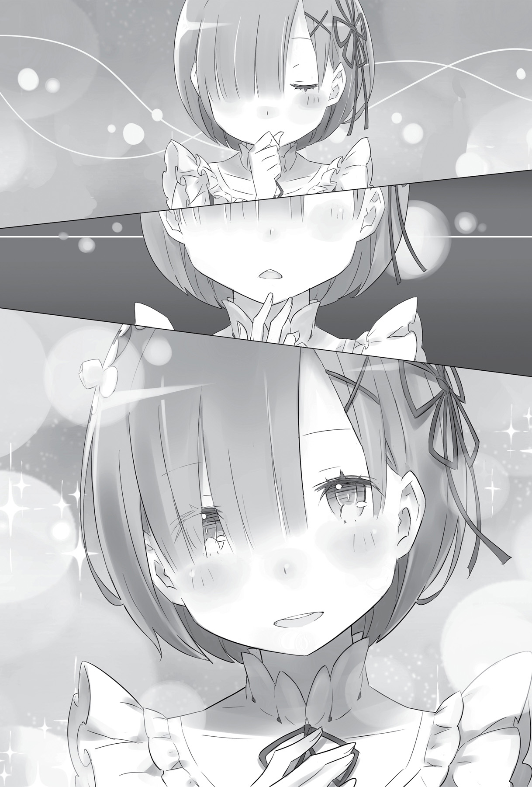
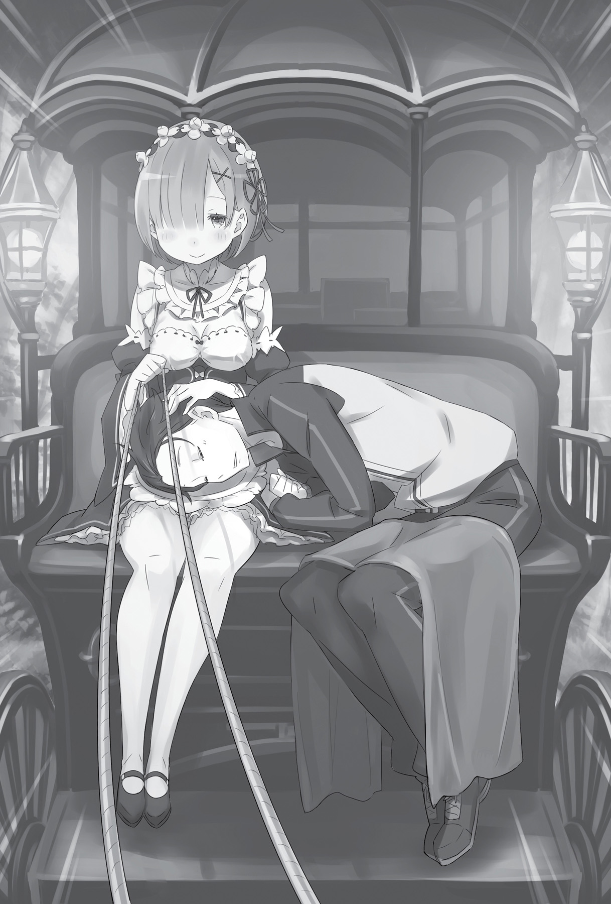

## 1

Солнечные лучи разре́зали мрак и вонзились в сомкнутые веки, знаменуя пробуждение.

— …снул, что ли?

По венам струилась тёплая кровь, рассы́павшиеся на части ноги вновь чувствовали под собой твёрдую почву. В следующую секунду тело возвратило себе все утраченные функции. Мозг заработал и тут же вскипел от избытка информации. Голова пошла кругом в буквальном смысле слова.

Какое-то время не было слышно ничего, кроме звона в ушах, но вскоре в картину мира влился шум толпы. Глазам открылся поток снующих туда-сюда по пыльной улице людей — тех самых живых людей, которых ему так не хватало.

Субару стоял столбом в потоке пешеходов, которые осторожно обходили его стороной. Нервы были на пределе. Ещё чуть-чуть — и сердце выскочит!

Кто-то грубо окликнул его:

— Эй! Я тебе говорю! Слышишь меня?

В голосе ощущалось раздражение. Пошатываясь, Субару повернулся на зов и обнаружил прямо перед глазами недовольную физиономию с вертикальным шрамом на щеке.

— Ты, конечно, извини, но спать надо дома, — сказал знакомый здоровяк, поглаживая белёсый шрам.

— Э?.. — Субару сумел выдавить из себя лишь хриплый стон.

— Чего ты экаешь? Ладно, проехали, — мужчина вздохнул. — Брать-то будешь?

Он вытянул ладонь, на которой лежал маленький красный плод. Слова настолько не вязались с внешним видом этого человека, что вызывали ощущение ирреальности происходящего.

Субару отсутствующим взглядом смотрел на ладонь и молчал. В распознавательной способности его мозга произошёл серьёзный сбой. Однако у торговца не было никакого желания вникать в чужие проблемы. Он навалился на прилавок, вытянул руку и схватил Субару за плечи.

— Хватит уже дурака валять! Сколько мне ещё спрашивать: берёшь аблоки или нет?!

Он резко тряхнул Субару, и юноша, покачнувшись, повалился на лотки с фруктами. Мужчина не на шутку перепугался.

— Ты… ты чего? А ну, встань! Ноги не держат, что ли?

— Но… ноги?..

— Те две штуки, приделанные к твоей заднице! Неужто приснилось, будто ноги оторвало? Эй, оставь свои тупые шутки, — устало проговорил торговец. — Меня бесит, когда кто-то придуривается.

Однако тело не слушалось Субару. Оно не воспринимало реальность. Мозг отчаянно посылал сигналы, но тщетно.

«…Почему я тут? Что произошло? Я чувствую, что-то случилось, но что же?.. Зачем я здесь? Зачем? Зачем? Зачем?»

— Субару? — послышался девичий голос.

Он безмолвно поднял широко распахнутые глаза и посмотрел вглубь лавки: из-за широкой спины торговца появился изящный силуэт.

На девушке, которая, очевидно, делала уборку, было чёрное платье с белым передником и белая наколка. Стройная фигурка распрямилась и повернула к Субару, который по-прежнему лежал на прилавке, очаровательную головку.

Голубые волосы, едва не достающие до плеч, слегка колыхнул ветерок, ещё сильнее подчёркивая нежный образ.

Из глаз Субару хлынули слёзы.

— Ох! — смутился торговец.

— Субару? — воскликнула девушка.

Юноша затрясся в рыданиях. Слёзы заливали глаза, и он, в ужасе оттого, что её силуэт стал размытым и неразборчивым, принялся ожесточённо их тереть. Однако картина, которую он видел, всё удалялась, а гомон вокруг становился громче.

Внезапно Субару осознал, что прилавок, служивший ему опорой, исчез, а сам он лежит пластом прямо на мостовой, не в силах пошевелить рукой или ногой, и его сотрясают частые надрывные вздохи.

Хотя нет, дело оказалось в другом.

— Хэ… Хи-хи… Ха-ха… Ха-ха-ха-ха!..

Это был смех!

Гомон усиливался, и Субару понимал, что число обращённых на него взглядов увеличивается с каждой секундой. На него смотрели. Его видели. Он был не одинок. Он находился среди людей. Одно это доказывало то, что Субару, валяющийся на дороге, словно нищий, существует в реальности, что его признают за живого человека!

— Субару, что случилось? С тобой всё хорошо? Возьми себя в…

Девушка даже не стала обегать прилавок — она разом через него перемахнула и оказалась рядом с Субару. Обхватив его за плечи, она попыталась помочь юноше подняться, как вдруг…

— Ой!

…почувствовала крепкие объятия. Даже слишком крепкие. Девушка от неожиданности вскрикнула, на мгновение ощутив себя хрупкой и беззащитной, однако сопротивляться не стала.

Ощущать её тепло и дыхание было чертовски приятно, и Субару, уткнувшись носом в нежную шею, ещё сильнее прижал девушку к себе.

Она смешалась и пробормотала:

— Что ты?.. Субару… Мне…

Каждое её слово, каждый звук, каждый вздох был для него сродни благословению. Субару продолжал крепко прижимать её к себе, а она, мелко дрожа, покорно принимала его объятия и не пыталась высвободиться.

Ощущение тепла её тела, биения её сердца, ощущение живого существа было ярким, как никогда раньше.

Субару Нацуки всё смеялся и смеялся, словно обезумевший…

## 2

— Честно сказать, я даже не знаю-мяу, чем помочь-мяу… — сказал Феррис, подпирая пальцем щёку.

Красавчик сидел в кожаном кресле и, подёргивая кошачьими ушками, качал головой, увенчанной копной соломенных волос. Он оторвал печальный взгляд от кровати, на которой лежал Субару, и посмотрел на Рем.

— Я работаю только с телесными болезнями, — сказал он извиняющимся тоном. — Если бы это была рана — снаружи или внутри, — я бы что-нибудь предпринял, но… душевные травмы я излечить не в силах.

— Нет-нет, я всё равно вам очень благодарна, — ответила Рем и вежливо поклонилась.

Однако голос прозвучал сухо. Но не потому, что она, как обычно, глушила свои эмоции… Девушка стояла с опущенной головой подле Субару, раскинувшегося на кровати, а внутри Рем всё сжималось и вибрировало от боли.

Субару не спал. Глаза его были широко раскрыты, а взгляд устремлён в потолок. Иногда его лицо искажала судорожная улыбка, как будто он что-то вспоминал, а когда улыбка исчезала, начинался плач. И эти муки казались бесконечными…

Болезнь свалилась как снег на голову. Вплоть до обеда они с Рем гуляли по городу, и всё шло как обычно. Конечно, неприятные события, произошедшие за последние дни, всё ещё тяготили его душу, но он, как мог, старался не показывать вида. Рем высоко оценила это и тоже вела себя так, будто ничего не случилось. Ничто не предвещало беды…

Теперь Рем очень жалела, что в тот момент, когда с ним произошла метаморфоза, отвлеклась, помогая по хозяйству в лавке. Тем не менее она всё время прислушивалась к разговору между Кадомоном и Субару.

Благодаря тому, что Рем постаралась и сделала торговцу хорошую выручку, тот, пребывая в прекрасном расположении духа, собирался угостить их аблоками. Когда мужчина спросил Субару, сколько аблок они хотели бы взять, Рем услышала: «Давай все, что есть!» Сразу после этого юноша застыл на месте, а затем как подкошенный повалился. Рем бросилась, чтобы помочь подняться, а он глядел на неё, смеялся и плакал — то ли от радости, то ли от горя.

Сообразив, что дело плохо, Рем привела Субару в особняк Круш, хоть и осознавала, какие неудобства может этим при чинить. Подозревая, что здесь не обошлось без вмешательства магической силы, Рем стала умолять Ферриса принять Субару. Однако результат осмотра оказался неутешительным: даже Феррис, величайший в столице лекарь, не смог установить причину аномалии. А это означало, что ни один столичный маг, каким бы первоклассным специалистом он ни являлся, не сможет исцелить Субару.

Нет, магия здесь была ни при чём. Субару просто в один миг лишился рассудка.

— Это, конечно, меня не касается, — сказал Феррис, — но позволь спросить, что ты теперь будешь делать?

— Пока мы не поймём причину, предпринимать что-либо бессмысленно, — ответила Рем. — Боюсь, господин Феликс, мы доставим вам массу…

— Брось, ничего страшного-мяу. На самом деле сейчас, когда он так непривычно тих и спокоен, мне будет намного удобнее продолжать лечение.

Субару не выносил процедуры Ферриса и каждый раз выказывал недовольство. Ферриса можно было понять: с бесчувственным, прикованным к постели пациентом справиться куда легче. Хотя он мог выразиться и помягче…

— Думаешь, стоит продолжать лечение?

Рем оторвала взгляд от Субару и посмотрела на Ферриса:

— Что вы хотите этим сказать?!

— Постарайся выслушать меня спокойно. Для чего я занимаюсь восстановлением врат Субарунчика? Для того чтобы он испытывал как можно меньше неудобств в повседневной жизни, верно?

— Да.

— А есть ли смысл исцелять человека, который не может достойно распорядиться своей жизнью?

— Но ведь ещё не…

Рем едва не сорвалась на крик, позабыв о том, кто перед ней. Чёрствость Ферриса казалась возмутительной. И хотя чувства Рем не остались незамеченными, лицо Ферриса по-прежнему выражало глубокие сомнения.

— «Ещё не всё потеряно»? Ты это хотела сказать? Видя, в каком он состоянии? Серьёзно? Да, бедняга и до того многое пережил, но если уж что-то настолько выбило его из колеи, полагаю, тут ничем не поможешь…

Феррис глядел на Субару с явным презрением. Рем показалось, что для того, кто звался Синим Рыцарем, для лучшего в Лугунике мага воды Феррис был слишком жестокосердным.

Значит, если надежды на выздоровление нет, человека надо бросить? И это говорит он — лучший в королевстве лекарь?! Да что такое знает Феррис о Субару, если объявляет его безнадёжным?..

— Ого, вот это взгляд-мяу! Да наш Субарунчик просто баловень судьбы! Правда, сам он вряд ли это понимает…

— То, что с ним произошло, не имеет никакого отношения к королевским выборам. Я не верю, что Субару из тех, кто падает духом после первой же маленькой неудачи.

— Верить или нет — дело хозяйское-мяу. Я бы на его месте не смог чувствовать себя спокойно после всего, что натворил. И вообще… — Феррис вперил в Рем холодный немигающий взгляд, который никак не вязался с шутливой манерой речи. — Не пойми меня неправильно-мяу. Я ведь всё это говорю вовсе не потому, что питаю к Субарунчику какую-то неприязнь или злобу.

Рем молчала.

— Против лично Субару я ничего не имею. Я всего-навсего презираю тех, у кого нет воли к жизни.

Феррис указал рукой на Субару, а затем приложил палец к своему подбородку и продолжил:

— Моей силе нет иного применения, кроме врачевания. Подобные мне маги специализируются лишь в одном деле. Чтобы послужить госпоже Круш, я каждый день спасаю самых разных людей. Все они отчаянно борются за жизнь, все благодарят меня, и я вовсе не против благодарности — мне даже порой приятно расходовать на них свою силу.

— Думаю, это заслуживает большого уважения, — произнесла Рем.

— Спасибо. Но я не хочу помогать тому, кто сам поставил на себе крест. Да, я исцелю его тело, но он снова примется растрачивать жизнь впустую. Так что лучше вовремя остановиться, пока он никому не доставил хлопот. Да, лучше остановиться…

Сказав это, Феррис с холодным видом отвернулся от кровати.

Рем понимала: за годы лекарской практики Феррис выработал привычку смотреть на многочисленных пациентов без эмоций. Со стороны это выглядело как жестокость, однако такое отношение служило защитой, необходимой в работе с людьми, что балансировали на грани жизни и смерти.

— И всё-таки… Субару, он…

Убитая заявлением Ферриса, Рем обратила жалостливый взгляд на Субару. Юноша, даже не догадываясь, что разговор шёл именно о нём, издавал отрывистые хриплые смешки. Больше всего Рем хотелось припасть к его груди и зарыдать. Однако таким поступком она рисковала не только уронить его достоинство, но и бросить тень на доброе имя Розвааля. Но прежде всего это было бы предательством по отношению к собственным чувствам, которые девушка оберегала как самое дорогое, что у неё есть.

В комнате воцарилось неловкое молчание, которое внезапно прервал звучный голос:

— Феррис, ты перегибаешь палку!

Рем встрепенулась, а Феррис, заметивший посетителя заблаговременно, остался невозмутимым. Правда, в его глазах заиграл таинственный огонёк, какой бывает у истовых фанатиков, узревших объект поклонения.

— Госпожа Круш! — Рем поспешно поклонилась.

— Я не считаю слабость преступлением. Но довольствоваться слабостью, не пытаясь исправить положение, грешно.

Круш вошла в комнату, бросив Рем повелительный жест, который означал «не надо церемоний», и, покачивая на ходу длинными тёмно-зелёными волосами, приблизилась к кровати. На губах Субару блуждала глупая улыбка. Оглядев больного, Круш сощурила глаза и произнесла:

— А положение действительно серьёзное. Что это может быть?

Феррис развёл руками:

— Рем говорит, он ни с того ни с сего повалился на землю. Я исследовал каждый волосок, но не нашёл ничего, что указывало бы на повреждение маны.

— А если это колдовство? Хотя такое и маловероятно, но нельзя исключать, что кто-то раздобыл информацию о лицах, причастных к королевским выборам, и совершил диверсию. Или соперник решил продемонстрировать силу…

— Маловероятно в обоих случаях, — возразил Феррис. — Сейчас не лучшее время затевать подобные скандалы. Да и кому мог помешать Субарунчик? Всем, кто его знает, известно: он мало на что способен. И вообще, уверяю вас, никакими магами, в том числе колдунами, здесь не пахнет-мяу, И-и-или вы-ы-ы… — протянул он, с жалостным видом ухватившись за полу мундира хозяйки, — …сомневаетесь-мяу в моих способностях, госпожа Круш?!

— Конечно, нет. — Герцогиня скрестила руки на груди. — Чтобы я сомневалась в твоих способностях, добросовестности и верности? Даже если станешь угрожать мне кинжалом, я не изменю своего мнения!

— О боже, давненько я не слышал от вас таких убийственных комплиментов-мяу!.. Сейчас раста-аю…

Рыцарь замурлыкал от удовольствия, но Круш отстранилась и выразительно посмотрела на Рем:

— Ты слышала, что сказал Феррис. Если он не в состоянии помочь, в моём доме не найдётся никого, кто бы излечил Субару Нацуки. Прости, тут я бессильна.

— Вам не за что извиняться! Вы так добры к нам, что я не знаю, как вас благодарить!

И Рем снова поклонилась. Её тронули слова Круш, в которых звучало сочувствие, хотя герцогиня ничем не была ей обязана. Фактически Круш продемонстрировала невероятное великодушие. Субару обследовал лучший лекарь королевства, а глава вражеского лагеря пожалела его. Разве можно требовать чего-то большего? Вины Круш или Ферриса здесь не было, и Рем понимала это.

Девушка точно знала, кто виноват в случившемся.

Ведьма!

С каждой секундой от Субару всё сильнее несло *миазмами* — верной приметой Ведьмы. Явились ли эти миазмы непосредственной причиной болезни, Рем оставалось лишь догадываться, однако факт оставался фактом: незадолго до того, как Субару впал в безумие, их концентрация значительно увеличилась.

Если дело в миазмах Ведьмы, то обвинять Ферриса в бессилии просто нет смысла. Тех, кто способен их почувствовать, можно пересчитать по пальцам, Рем была в их числе, но даже Рам не могла этим похвастаться.

От существ, испускающих миазмы, не стоило ожидать ничего хорошего. Дурные воспоминания, связанные с ними, пробуждали в Рем столь сильную ненависть, что порой она переставала мыслить здраво. Впрочем, поступки юноши, от которого пахло сильнейшей на свете ведьмой, уже растопили ожесточённое сердце Рем, и от былого предубеждения не осталось и следа.

Тем не менее она прекрасно понимала: если в воздухе витает запах Ведьмы, жди беды!

И демон внутри Рем не давал ей забыть об этом…

## 3

— Вы нам очень помогли. От имени моего хозяина выражаю искреннюю благодарность за вашу доброту! — Рем отвесила глубокий поклон.

Находясь в вестибюле особняка, Круш и Феррис провожали гостей домой.

— Извини, что не смогли помочь, — сказала Круш, слегка потупив взгляд. — Собственно, я не имею права рассчитывать на какую-либо благодарность…

— Вовсе нет! — решительно возразила Рем. — Мы так рано покидаем ваш гостеприимный дом лишь потому, что нам самим так будет лучше. Я очень благодарна за заботу. Вы определённо заслужили обещанное вознаграждение.

Выслушав Рем, Круш ещё раз напоследок извинилась и умолкла, посчитав дальнейший обмен любезностями излишним.

— Конечно, жаль, что мы не провели полный курс, — подхватил Феррис. — Ну, ничего не поделаешь-мяу. Удачи тебе, Рем, и… позаботься о Субару. Кажется, именно так говорят в подобных случаях?

Феррис выставил большой палец и подмигнул, а затем поглядел на Субару, который, неуклюже привалившись к двери, торчал позади Рем. Состояние его ничуть не улучшилось. Реакции по-прежнему были заторможенными, а сознание пребывало в глубоком ступоре. Однако Субару уже научился держаться на ногах не падая, хотя, как ребёнок, всё время цеплялся за чью-нибудь руку. Правда, внезапные взрывы смеха и потоки слёз так и продолжали сотрясать его время от времени.

— Приношу искренние извинения за причинённые неудобства, — произнесла Рем. — И от всего сердца благодарю за радушие.

— Между мной и Эмилией заключён договор, — ответила Круш. — Мы многое обговорили. Так что я по определению не могла остаться равнодушной. Боюсь, тебе придётся нелегко…

Рем покосилась на Субару, на лице которого застыла кривая улыбка.

— Ничего, я знала, на что иду, — решительно сказала девушка, сжав пальцами краешек подола.

Было ясно как день, что Рем ожидают тяжёлые времена, и Круш ей сочувствовала. Но Рем решила остаться рядом с Субару. Ведь она не забыла его слова:

*«Давай с улыбкой шагать плечом к плечу и болтать о будущем. Например, о завтра. Я, может, всегда мечтал говорить о своих планах с демоном и смеяться!»*

Сколько десятков, сотен раз она прокручивала в голове эту сцену? Рем считала своим долгом отплатить Субару за добро, ведь оно было несравнимо больше того, что девушка могла дать взамен…

— Мне жаль, но, боюсь, я не смогу принять твоё предложение, — сказала Круш, опустив глаза.

— Здесь нет вашей вины, — Рем бледно улыбнулась: ей была приятна забота герцогини, тем более сейчас, в такую трудную минуту. — Да, наши переговоры не увенчались успехом. Но я желаю вам, госпожа Круш, удачи во всех начинаниях.

— Передай Эмилии, что я надеюсь на честный поединок, который не запятнает наши имена, — добавила напоследок Круш.

На этом роль, которую Рем выполняла в особняке герцогини, закончилась. Увы, она так и не довела лечение Субару до конца не и не выполнила секретное распоряжение Розвааля. Рем возвращалась домой с позором — словно специально для того, чтобы получить строгий выговор. Но она не могла не вернуться — хотя бы из-за Субару…

— Приедете в поместье, — снова заговорил Феррис, — и что дальше-мяу? Есть к кому обратиться за помощью в лечении?

— По крайней мере, мы увидим госпожу Эмилию… — произнесла Рем, стараясь скрыть досаду. Эмилия была единственной её надеждой.

Сколько раз Рем ни пыталась говорить с ним, сколько ни касалась его, как бы преданно ни ухаживала, Субару не реагировал. Попытки достучаться до его сознания были тщетны. Однако даже в таком состоянии из уст юноши нет-нет да и вылетали разные слова.

— Имена… — прошептала Рем.

— Мм? — Феррис посмотрел на неё вопросительно.

— Иногда он произносит имена. Моё, сестрицы и…

Рем было отрадно расслышать в горячечном шёпоте Субару своё имя. И в то же время очень грустно, когда он был глух к её прикосновениям и словам.

Бо́льшая часть того, что он говорил, была совершенной бессмыслицей, однако чаще прочего он произносил имя…

— …госпожи Эмилии. Если Субару с ней повидается, быть может, это что-то изменит.

— Но, насколько я знаю-мяу, расстались они после страшной ссоры, не так ли? С тех пор не прошло и четырёх дней. Думаешь, она успела остыть? Наверное, лучше чуть-чуть подождать… Или я не прав?

— Конечно, я поступлю неделикатно по отношению к чувствам госпожи Эмилии. Но самой мне не справиться. Нам необходимо вернуться хотя бы для того, чтобы получить дальнейшие указания.

Рем кривила душой: в эту минуту госпожа и граф были для неё далеко не на первом месте. Свои истинные желания девушка пыталась скрыть под маской преданной служанки, горько сожалея о том, что сама не в силах возвратить Субару к нормальной жизни.

— А вот и Вильгельм, — сказала Круш.

Проследив за её взглядом, Рем увидела, что к железным воротам особняка подъезжает драконий экипаж. Поводья держал знакомый пожилой джентльмен.

— Не буду раскрывать подробности, но скоро мне понадобится очень много драконьих экипажей, — пояснила Круш. — Сейчас это единственная повозка для дальних путешествий, которую я могу одолжить.

— Вам повезло! — вставил Феррис. — Если поедете по тракту Лифаус, думаю, уже сегодня будете дома. До особняка Розвааля примерно полдня пути.

Солнце стояло в зените, и яркий свет мешал Рем как следует разглядеть подъехавший к воротам экипаж. Стрелки часов уже перешагнули отметку двенадцать. Если гнать во весь опор, до места назначения можно добраться за полночь. А по пути, когда расстояние до особняка сократится, телепатически известить Рам о своём возвращении.

— От всего сердца благодарю вас за доброту, — промолвила Рем, обращаясь к Круш.

— Пустяки. Это самое меньшее, что я могу для вас сделать. Если что-нибудь случится, дай знать!

Круш говорила так не просто из вежливости, и Рем это чувствовала. Девушка подумала, что ей, наверное, крупно повезло познакомиться с таким замечательным человеком, как герцогиня. Это было одной из немногих удач, что выпали на её долю за последние дни.

— Что ж, мне пора.

— Рем, — внезапно сказала Круш. Впервые за всё время в её глазах читалась неуверенность. — Не сочти за бестактность, но… мне бы хотелось задать один вопрос.

— Конечно, задавайте, — сказала Рем, беря Субару под руку. Янтарные глаза Круш стали холоднее.

— Почему ты так стараешься ради Субару Нацуки? Вас связывают совсем не те отношения сюзерена и вассала, которые сложились между мной и Феррисом. Но ты так на него смотришь… У меня не укладывается в голове!

Рем не проронила ни слова.

— Если не хочешь отвечать, не нужно. Мне самой неловко за эти расспросы, — проговорила Круш извиняющимся тоном.

Пристально глядя на хозяйку, Феррис безмолвствовал.

— Нет, — покачала головой Рем, — ответить я могу, но подобрать правильные слова совсем не просто…

Стоило облечь переживания в слова, как чувства превращались во что-то совсем иное. В недоумении Круш не было ничего удивительного. Существующее внутри Рем *нечто* не прекращало трансформироваться ни на секунду, каждый миг изменяясь в размерах и силе и всё глубже укореняясь в душе.

Оно не желало быть облечённым в слова. И едва ли его можно было выразить… Но если дерзнуть и попробовать объяснить непонятное чувство, овладевшее сердцем?..

— Наверное, потому, что Субару особенный?..

Рем и сама не понимала, смогла ли ответить на вопрос Круш. Но сейчас девушке казалось, что она открыла главное, то, что хранилось в глубине сердца.

На лицах Круш и Ферриса застыло немое удивление.

— Я что-то не так сказала? — поддерживая Субару за плечи, Рем прижала руку к сердцу и вопросительно склонила голову.

— Прости, я забылась… Сама от себя не ожидала, — рассеянно проговорила Круш.

— Вовсе не-е-ет! — встрял Феррис. — Я тоже очень удивился! А как же? Рем ведь не присутствовала на церемонии в королевском замке.

Круш и Феррис переглянулись и кивнули друг другу. Что Феррис имел в виду, Рем так и не поняла, однако Круш, кажется, удовлетворилась её ответом.

— Приношу свои извинения за бестактность. Субару Нацуки очень повезло встретить тебя, — сказала Круш с вежливой улыбкой на губах.

— Это точно! — подхватил Феррис. — Вот поправится-мяу, я ему и шагу ступить не дам, задразню-мяу!

Рем благодарно улыбнулась, понимая, что и Круш, и Феррис искренне желают Субару выздоровления.

— Удачи, — пожелала на прощание Круш.

— Держи хвост трубой, р-мяу! — добавил Феррис.

Рем в последний раз низко поклонилась провожающим и, ведя Субару за руку, покинула особняк. Ожидавший у ворот Вильгельм поприветствовал её кивком и передал девушке поводья.

— Вам я обязана особенно многим, господин Вильгельм, — сказала Рем, почтительно склонив голову перед пожилым джентльменом.

— Бросьте, слишком много чести для старой развалины! К тому же я, как и моя хозяйка, бессилен что-то сделать. Как жаль, что не мог это предупредить, — сказал Вильгельм, озабоченно глядя на Субару.

Фактически старик провёл с ним больше времени, чем все прочие обитатели особняка Круш. И хотя обучение продлилось всего четыре дня, между Вильгельмом и Субару, проявлявшим усердие в тренировках, успели сложиться доверительные отношения учителя и ученика. Видимо, наставник тоже чувствовал свою вину в случившемся.

— А ведь я сам с тех пор не продвинулся ни на шаг… — пробормотал себе под нос старый мечник.

— Господин Вильгельм?

Глаза его были устремлены на юношу, но при этом смотрели словно бы сквозь Субару. Услышав голос Рем, Вильгельм рассеянно моргнул и помотал головой.

— Прошу прощения. Да, я оказался бессилен, но стану молиться о выздоровлении мастера Субару. Мисс Рем, проявляйте осторожность в пути!

— Благодарю. Будьте здоровы, господин Вильгельм.

В глазах старика мелькнула тень беспокойства, но Рем не стала придавать этому значение. Когда-то девушка не знала, что важно, а что нет, но теперь была преисполнена решимости. Она окончательно поняла, кого будет защищать.

— Субару, я помогу!

Придерживая его со спины, Рем усадила юношу на козлы и устроилась рядом сама. Места для двоих оказалось маловато: они сидели, прижавшись друг к другу вплотную, но Рем было не привыкать к неудобствам. Левой рукой она обхватила Субару за талию, а правой крепко сжала вожжи.

— Наверное, тесно? Но ты же потерпишь, правда?

Впереди лежал долгий-долгий путь. Рем сильно переживала из-за бремени, тяготившего Субару. Когда они доберутся до особняка, ей следует вступиться за юношу. На радушный приём рассчитывать не приходилось. Но даже если от Субару все отвернутся, Рем останется его другом, пусть и единственным!..

— Я ни за что не брошу тебя! — твёрдо сказала она и стегнула дракона вожжами по шее. Тот взрыл лапами землю, и карета покатилась вперёд, оставляя позади и особняк, и пожилого джентльмена…

Колёса крутились всё быстрее и быстрее, и дрожь, передававшаяся рукам Рем через поводья, словно выражала нетерпение, зреющее в её сердце.

## 4

Путь к поместью Мейзерса выдался более-менее спокойным. Опасения Рем, что у Субару снова случится припадок, к счастью, не оправдались. Юноша почти всю дорогу сидел смирно и рассеянно смотрел на проплывающие пейзажи. Впрочем, от лишних движений его избавляли крепкие объятия Рем.

Внезапные приступы смеха и слёз прекратились — вероятно, из-за смены обстановки. Порой в душе Рем загорался огонёк надежды: вдруг Субару пошёл на поправку? Но в нос ударяли предательские миазмы, и огонёк тут же угасал.

Когда Субару, начав клевать носом, положил голову ей на плечо и задремал, на губах Рем появилась лёгкая улыбка. Девушка была счастлива, что он, такой беззащитный, всецело полагался на неё. Увы, сейчас это был не тот Субару, которого она знала, но Рем понимала: юноша стал таким не по своей воле. И всё-таки служить ему опорой было для Рем высшим наслаждением.

— Придвинься поближе, Субару. — Рем ещё крепче прижала его к себе, хотя дыхание юноши и так щекотало ей кожу.

В ответ он пробормотал что-то невнятное. На узеньких козлах было так тесно, что путники касались друг друга плечами. Сжав покрепче в правой руке вожжи, Рем уложила голову юноши себе на колени, чтобы Субару как можно меньше трясло на неровностях.

На протяжении всего пути Рем старалась обеспечить ему максимальный комфорт. Устроившись на самом краешке, потому что Субару занимал почти всё сиденье, она прислушивалась к его беспокойному дыханию и заботливо гладила по голове, временами даже останавливала дракона, чтобы напоить юношу водой и помочь справить естественные нужды. А ведь Рем ещё приходилось управлять драконом! Другой на её месте уже свалился бы от напряжения и усталости.

Однако Рем была гораздо сильнее и выносливее рядового человека. Она знала, что старается не ради кого-то, а ради Субару, и это её вдохновляло.

— Мне и вправду следовало бы держать свои чувства при себе… — прошептала Рем, обнимая Субару за плечи, но ответа не последовало.

Сейчас он блуждал где-то между сном и явью, и шёпот Рем превращался в монолог.

— Наверное, тебе не хотелось задерживаться в столице, но… честно говоря, для меня это было хоть чуточку, но всё-таки счастливое время. Ведь в особняке господина Розвааля мне приходилось делить тебя с другими…

В поместье Розвааля Рем не могла проводить с Субару много времени. Всегда находился кто-нибудь, готовый составить ему компанию, пока Рем хлопотала по хозяйству.

— Когда ты работал, с тобой была Рам, а свободное время проводил с госпожой Эмилией. Ты всегда улучал минутку, чтобы подразнить госпожу Беатрис. А я всё терпела!..

— Мм…

— Ты всегда был так занят, Субару! В поместье помогал деревенским, помогал мне, а в столице всё время хлопотал ради госпожи Эмилии.

Насколько она знала, Субару вечно суетился. Ради кого-то или ради себя, однако поводов ему хватало. Но всякий раз, когда Рем наблюдала его беготню, её душу терзало одно и то же чувство.

— Поэтому когда мы оказались в доме госпожи Круш и ты стал принадлежать мне одной, это было счастье… Хотя я знала, как ты мучаешься. Прости!..

Извинившись, она устало улыбнулась. Юноша, мирно сопящий на её коленях, состроил недовольную мину. Рем провела рукой по его лбу, убирая прядь с глаз, и тихо вздохнула.

— И слышала, как сильно ты поссорился с госпожой Эмилией… прости, — повторила она.

Рем вспомнила тот день, когда в королевском замке проходило собрание, посвящённое выборам. Девушка не была свидетелем событий, и ей оставалось только догадываться о причинах разрыва между Субару и Эмилией.

— Ни госпожа Эмилия, ни господин Розвааль не обмолвились о том, что случилось. Меня послали за тобой в замок, велев проводить к госпоже Круш… Увидев тебя, я сильно испугалась…

Когда Рем обнаружила юношу в привратном зале, Субару еле стоял на ногах, и она сама поразилась тому, как сильно её это задело. Уже тогда, размышляя, как ему помочь, Рем твёрдо решила, что не бросит Субару в одиночестве.

— Я старалась проводить с тобой как можно больше времени. Не только ради тебя, но и ради себя самой… Когда ты рядом, я превращаюсь в плохую девочку.

Рем жалела его и в то же время находила в своей жалости удовольствие. Когда Субару был рядом, она постоянно открывала в себе новые, неизвестные ранее стороны. Загибая пальцы, Рем принялась перечислять качества, о которых и не подозревала:

— Я увидела в себе много нехорошего. Я смотрела, как непринуждённо ты общаешься с сестрицей, и мне становилось грустно. Когда ты, краснея от смущения, заговаривал с госпожой Эмилией, я ужасно злилась. А когда наблюдала за твоими забавами с госпожой Беатрис, мне было очень обидно.

Но сегодняшнее открытие убедило Рем, что она состоит не только из недостатков.

— Теперь я думаю, что буду очень счастлива, если ты поладишь с сестрицей; и мне покажется милым, если покраснеешь, заводя разговор с госпожой Эмилией; и всякий раз, наблюдая твои забавы с госпожой Беатрис, я буду думать: «Он такой заботливый!..» Оказывается, и я могу быть доброй и любящей, — продолжала Рем свой сбивчивый монолог, пользуясь тем, что никто не прерывал.

Рем всё говорила и говорила; её переполняли чувства, о которых девушка никогда не поведала бы ему в лицо. Всё, что скопилось на душе, теперь изливалось непрерывным потоком.

— Если бы не ты, Субару, все эти чувства — и мрачные, и радостные — остались бы мне неведомы. Поэтому для меня это было счастливое время. Жаль, что всё так сложилось… — Досадливо сжав губы, она опустила голову и мысленно посетовала на свою слабость.

Рем видела, что Субару гложет тоска, однако покорно ждала, когда юноша сам изольёт ей душу. Не эта ли пассивность привела к такому печальному исходу? Быть может, следовало проявить большее участие и самой начать разговор? Быть может, она этого не сделала из-за своей слабости, из-за желания обладать им единолично?

Ещё немного, и Рем возненавидела бы саму себя, но Субару отвлёк её от тягостных размышлений. Лёжа на её коленях, он вдруг заворочался и издал тихий стон, будто ему снился дурной сон.

— Всё хорошо, Субару. Я здесь, спи… — ласково прошептала она.

Видимо, для него эта стремительная поездка оказалась тяжёлым испытанием. Рем уже подумывала, что стоит разбить где-нибудь лагерь, а не мчаться всю ночь до самого поместья, как планировала прежде. До полуночи оставалось каких-то два-три часа, и, если не снижать скорость, до особняка Розвааля они доберутся не раньше утра.

— Но тогда мне будет очень трудно связаться с сестрицей.

Успех телепатической связи зависел не только от расстояния, но и от того, спят сёстры или бодрствуют. Чтобы Рем могла передать сообщение Рам, требовалось соблюсти оба условия. Сейчас Рем не могла установить связь с сестрой, потому что находилась далеко. Но когда расстояние станет приемлемым, наступит глубокая ночь…

— Тогда лучше встать на ночлег, — решила она и потянула за вожжи, чтобы остановить дракона.

Карета начала замедляться и вскоре замерла. Дракон, тяжело пыхтя, обернулся и поднял глаза на Рем. Девушка же, оставив Субару на козлах, спрыгнула на землю и настороженно огляделась.

Солнце, освещавшее тракт Лифаус, уже село за горизонт, и полагаться приходилось лишь на луну и установленный на повозке лагмитовый светильник. К счастью, ночь выдалась ясная, и глазам вполне хватало света, отражаемого луной. Это также снижало риск подвергнуться налёту ночных разбойников.

— Прости, что тревожу, Субару, — прошептала Рем, поднимая мирно дремлющего юношу на руки. Девушка положила его на сиденье в экипаже и накрыла одеялом.

Некоторое время она наблюдала за его безмятежным сном, затем выбралась под открытое небо и внимательно оглядела окрестности. Рем волновали не столько бандиты, сколько бродячие псы и зверодемоны, которые нередко рыскали стаями по ночным дорогам. Знакомые со вкусом крови и плоти, дикие животные и зверодемоны были гораздо опаснее любого человека, и Рем это отлично понимала.

— Но сегодня мы вдвоём, так что, может, не стоит волноваться. — Рем протянула руку, и дракон подставил голову, позволяя себя погладить.

Умный и выносливый зверь, он был надёжной поддержкой в их отчаянном марафоне. Несмотря на то что Рем являлась для него новым кучером, дракон вёл себя очень послушно, как и подобает дракону герцогского дома, прекрасно обученному и воспитанному. Впрочем, нельзя исключать и то, что дракон инстинктивно понимал: Рем, являясь демоном, в биологическом смысле стоит на ступень выше. Возможно, этим и объяснялась его покорность.

Земляные драконы отличались от остальных тем, что были дружелюбны к людям. Они составляли неотъемлемую часть здешнего уклада, их любили за мягкий нрав и покладистость. В случае же с летающими и водяными драконами требовалась особая дрессировка. К тому же зачастую эти звери обладали очень строптивым нравом, из-за чего сфера их применения в повседневной жизни была ограничена.

Привязанность к человеку и кроткий нрав считались нормой, характерной для этого вида, что позволяло провести чёткую границу между ними и остальными животными. Мало кто из диких зверей, чувствуя, что силы не равны, рискнул бы наброситься на земляного дракона.

Вдобавок драконы и сами обладали чрезвычайно острым нюхом на опасность. С ними можно было не бояться нападения звериных стай иди разбойничьих ватаг — драконы чуяли их приближение заранее. Именно за это странствующие торговцы и простые путешественники их так ценили.

— Спокойной ночи, Субару, — прошептала Рем, повернувшись к карете. Поглаживая дракона, она велела ему лечь на землю и, привалившись к грубому на ощупь телу, натянула на себя одеяло и стала прислушиваться.

Утром, на рассвете, они снова тронутся в путь и до полудня прибудут в поместье. Рем возвращалась, не выполнив задания. Дома её ждёт строгий выговор, который она примет с должным смирением. Как бы то ни было, она будет действовать так, чтобы не навредить хотя бы Субару.

— Если бы мне только удалось вернуть его к прежней жизни…

На это была способна лишь Эмилия. Как бы ни была для Рем горька эта правда.

Рем с самого начала было очень трудно принять Эмилию. Даже Розвааль, пригласив девушку в свой дом в качестве гостьи, относился к Эмилии, кандидатке на королевский престол, как к вышестоящей персоне. Он распорядился, чтобы и сёстры-служанки обращались с ней так же.

Приказ обходиться с Эмилией более учтиво, чем с самим господином, не вызвал в Рем такого замешательства, как в Рам. У старшей сестры, свято чтившей главенствующую роль Розвааля, такое положение вещей породило внутренний протест. Рем же в этом плане не была столь принципиальна. Само собой, Рам оказалась достаточно умна, чтобы не показывать своё недовольство. Однако телепатическая связь между близнецами, раньше почти не ощущаемая, показывала Рем, как сильно раздражена сестра.

Рем испытывала смешанные чувства к Эмилии вовсе не из-за Розвааля. Причина, по которой ей было сложно воспринимать Эмилию, оказалась банальна до неприличия и заключалась в полуэльфийском происхождении Эмилии. Иначе говоря, Рем отторгала полудемона.

Умом Рем понимала, что ей не в чем обвинить Эмилию. Но сердце не считалось с доводами разума. Эмилия не сделала ей ничего плохого. Однако существа, известные как полудемоны, имели прямое отношение к тем, кто оказал огромное влияние на жизнь Рем, и переоценить это влияние было невозможно.

В памяти жили воспоминания о Культе Ведьмы, который стёр с лица земли её родную деревню. Всякий раз, когда Рем думала об этом, сердце девушки наполняла скорбь.

В итоге взаимодействия между Рем и Эмилией свелись к модели «прислуга — гостья», за рамки которой Рем никогда не выходила. Спрятав эмоции подальше, она механически исполняла распоряжения Эмилии, которая, ощущая, быть может, этот холод, старалась без особой необходимости не попадаться служанке на глаза. Таким образом, в отношениях с Эмилией Рем соблюдала нейтралитет, не испытывая ни дружеских, ни враждебных чувств.

Время шло, и Рем казалось, что, каким бы ни был исход королевских выборов, она будет относиться к Эмилии так же, как раньше. Роль, которую исполняла Рем, вряд ли подразумевала тесные отношения с кандидаткой вплоть до самого конца выборов. Размышляя о своём положении в доме Розвааля, Рем приходила к выводу, что Эмилия не нуждается в её поддержке.

Однако теперь мысли об Эмилии принимали новый оборот. И когда Рем спрашивала себя, в ком произошли перемены, получалось, что дело в них обеих. Да и повод для перемен был общий.

Этим поводом стал Субару. С момента его появления в доме Розвааля жизнь Рем перевернулась с ног на голову. Плоский чёрно-белый мир заиграл вдруг яркими красками, чувства Рем вновь приобрели остроту, а вслед за этим преобразилась и окружающая действительность.

Работа по дому начала приносить большее удовлетворение. Рем перестала испытывать благоговейный страх перед сестрой и, общаясь с Розваалем и Беатрис, уже не чувствовала прежнюю скованность. Появилось больше поводов для общения с Эмилией, и Рем узнала, что у них есть общие интересы.

Конечно, питая к Субару смутные, ещё не слишком понятные ей самой чувства, Рем знала, к кому этот юноша неровно дышит. Вот почему мысли об Эмилии так болезненно отзывались в её сердце.

— Я не могу ни полюбить её, ни возненавидеть. Чувствую себя потерянной…

Ночь стояла тихая-тихая. Безмолвие нарушали только негромкий стрекот сверчков и дыхание дракона. В этом сумеречном краю, где в свете луны сновидения сливались с реальностью, мысли путались сами собой, превращаясь в обрывочный поток сознания.

Время текло вяло, неспешно, и казалось, луна, сколько ни жди, никогда не переместится на другой край небосвода…

Долгая ночь. Ночь глубочайшего холодного одиночества, которому нет конца…

Рем вдруг овладело острое желание забраться внутрь кареты. Туда, где безмятежно спал Субару — так крепко, что сны не могли пробиться в его сознание. Как было бы здорово залезть к нему под одеяло и вместе наслаждаться теплом!

— Ещё совсем недавно он сидел так близко, что мы касались друг друга… Хорошего понемножку!

Рем одёрнула себя, но стремление вновь оказаться с ним рядом было так сильно, что девушка не могла остановиться и рисовала в воображении желанные картины. Искушение всё бросить и сбежать овладевало ею сильнее и сильнее.

…А может, и правда сбежать? Что ожидает Субару в особняке, как не жестокая реальность, бесконечно далёкая от идеала? Если сбежать сейчас, неважно куда, с угрызениями совести она как-нибудь справится…

Денег, которые дал Розвааль на дорожные расходы, было более чем достаточно. С такой суммой Рем могла бы уехать туда, где их никто не найдёт, и спокойно жить вместе с Субару. Там он продолжал бы общаться с людьми, чтобы в один прекрасный день вновь обрести себя, стать нормальным человеком и делить с Рем счастливьте минуты… Пускай эта жизнь и будет совсем не такой, как раньше.

Субару поправится, и Рем начнёт новую, счастливую жизнь вместе с дорогим ей человеком. Никто не будет знать об их прошлом и не посмеет встать у них на пути…

Рем встряхнула головой и, уткнувшись лбом в коленки, усмехнулась своей бурной фантазии:

— Да, мечты, мечты…

Она никогда не решится на это. И как ей только могла прийти в голову столь бредовая идея?! Бросить Рам, родную сестру, и сбежать из дома? Рем не могла так поступить. Ближе сестры у неё не было никого на свете. Вдобавок трудно даже вообразить, сколько работы навалится на Рам, если Рем исчезнет…

Добрая и снисходительная к младшей сестре, Рам наверняка простила бы ей слабость. Именно поэтому для Рем было немыслимо совершить предательство.

И Розвааль снабдил её такой большой суммой именно потому, что полагался на преданность служанки. Честная и требовательная к себе, Рем не могла обмануть доверие господина.

— Самое главное — помочь Субару, — прошептала она. — Я не могу оставить его, когда Субару так плохо.

Рем от природы имела характер собственницы и осознавала это. Была бы её воля, она держала бы при себе всех дорогих людей. Отдавая себя без остатка, ибо только так могла почувствовать свою значимость, Рем не ведала большего счастья, чем служить другим. Любовь к служению была у неё в крови. Так что девушку совсем не тяготили хлопоты. Наоборот, Рем чувствовала себя счастливой, если каждый её день был наполнен заботами о больном беспомощном друге.

Но это был не тот Субару, к которому она привыкла.

*«Наверное, потому, что Субару особенный?..»*

В памяти воскресли слова, сказанные во время прощания с Круш.

Да, в этом всё дело. Рем помнила его улыбку, его голос, помнила, что он говорил ей. Помнила тепло ладони, которую Субару протянул. Тогда казалось, что жизнь остановилась и каждый день она будет всё глубже погружаться в омут безысходности. Именно Субару вытащил её из этого омута, он стал тем светом, ради которого стоило жить!

Именно он спас детей, которых она по своему недомыслию чуть не обрекла на гибель. Именно он, находясь под проклятием зверодемонов, балансируя на грани жизни и смерти, не бросил Рем и Рам!..

Разве этого недостаточно? Какие ещё нужны причины, чтобы Рем могла безоговорочно вручить всю себя Субару Нацуки?

Что ещё нужно, кроме этих чувств, греющих сердце, чтобы посвятить всю себя Субару, чтобы вернуть его к нормальной жизни и быть рядом?

Ведь для Рем человек по имени Субару Нацуки всегда был…

— Самый замечательный на свете безумец, одержимый демонами!

## 5

Рем тряхнула влажными от утреннего воздуха волосами и медленно открыла глаза. Ещё в дурмане, блуждая между сном и явью, она почувствовала, как биологические часы напоминают ей, что пора выдвигаться в путь.

Ночь прошла спокойно: ни зверодемоны, ни бандиты не потревожили покой путников. И всё-таки усталость давала о себе знать. Удостоверившись, что выбранное для ночлега место достаточно безопасно, Рем всю ночь провела в полудрёме, восстанавливая силы.

Поднявшись с земли, она вдохнула свежий утренний воздух и сладко потянулась — неэстетичное плотское действие. На глазах у других она ни за что бы так не сделала, но сейчас её никто не видел, поэтому можно было не волноваться. Если только посапывающий у неё под боком Субару не…

— Су… Субару?!

Девушка испуганно отскочила: в шаге от неё, завернувшись в одеяло, прямо на траве лежал её спутник. Потеряв опору в виде Рем, он повалился на холодную землю и теперь, состроив недовольную мину, подрагивал от утреннего холодка. Рем в замешательстве переводила взгляд с кареты на Субару и обратно.

— Пока я спала, ты выбрался наружу и пристроился рядом?..

Как она могла не заметить?! Рем оторопела, и в то же время пришло осознание того, как сильно, без оглядки она доверяет Субару. Лицо девушки вдруг зарделось. Выходит, если бы он набросился на неё во сне, Рем не смогла бы защититься.

— Какая я неосторожная… — простодушно пробормотала она. Вместе с тем инцидент, наверное, можно было рассматривать как добрый знак: похоже, Субару шёл на поправку!

А ведь ещё недавно его реакции на окружающий мир исчерпывались смехом и слезами. И вот он самостоятельно вылезает из кареты на землю и совершает осмысленное действие! Значит, истерзанный дух Субару постепенно оживает, и юноша вновь становится полноценной личностью. В душе Рем забрезжила надежда.

— Ну что ж, поехали домой, Субару.

Если он стал выздоравливать, значит, скоро всё непременно наладится! Рем поймала себя на мысли, что впервые за долгое время смотрит в будущее с надеждой, — так сильно повлияло на неё это происшествие. И где-то в глубине души ей было очень приятно наблюдать в себе эту перемену.

А вчерашние мысли пускай исчезнут как дурной сон, вызванный малодушием и усталостью. Нужно всё позабыть и, будто ничего и не было, думать о том, что впереди их ждёт только хорошее.

Субару всё ещё спал, когда Рем взяла его на руки, уложила на козлы, а затем подняла дракона. Поблагодарив зверя за то, что тот всю ночь оберегал их покой, Рем напоила его и приготовилась к дороге. Затем она примостила голову Субару себе на колени и натянула вожжи — колёса кареты медленно завращались. Мимо поплыли новые пейзажи. До поместья оставалось примерно полпути — семь-восемь часов хода. Ещё вчера Рем отправлялась в дорогу с тяжёлым сердцем, сегодня же она ощущала себя на пике душевных и физических сил. Любуясь безмятежным профилем Субару, Рем всё больше сгорала от нетерпения. Она желала поскорее добраться до особняка и подстёгивала дракона.

Летящую повозку слегка потряхивало. Обнимая одной рукой Субару, который по-прежнему спал, подтянув колени к животу, Рем осторожно взяла его ладонь в свою и переплела пальцы.

— Твоя ладонь такая узкая… И всё равно это ладонь мужчины.

«…Прости мою слабость. Взять тебя за руку и сбежать куда глаза глядят я не смогла, так подари мне хотя бы эти прикосновения. Маленький ритуал, чтобы забыть о дур ном сне…»

…Большего Рем и не желала: только бы чувствовать тепло Субару, когда тот прижимается к ней… Ведь желать большего — значит быть эгоисткой.

Сохранить эмоции, которые дарит его тепло, сохранить радость, что нужна ему, посвятить себя Субару!..

Рем не задумываясь отдала бы ему всю себя…

## 6

В воздухе витало ощущение чего-то странного и подозрительного.

Рем гнала дракона. Одной рукой она держала поводья, а другую подложила под голову Субару и, запустив пальцы в чёрную шевелюру, перебирала жёсткие пряди. Именно тогда она и почувствовала неладное.

Вчера вечером у неё оказалось достаточно времени, чтобы поразмыслить. Возможно, в этом и было всё дело. Разобравшись с сумбуром чувств, в глубине души Рем ликовала, ведь Субару, очнувшись посреди ночи и выбравшись из кареты, расположился у неё под боком. Ни о чём другом она и думать не могла и на неестественную тишину, царившую вокруг, обратила внимание только сейчас.

— Какая я дурёха…

За всё время пути по тракту Лифаус они так и не повстречали ни один экипаж. Хотя Рем вела карету по ответвлению от наиболее оживлённого маршрута, до самого горизонта не было видно ни души, и это настораживало.

Обычно, двигаясь вдоль одной из главных дорог страны, нет-нет да и увидишь какого-нибудь торговца, спешащего на столичный рынок, или местного жителя, что направляется на полевые работы. Однако со вчерашнего дня им не встретился ни один человек, словно они ехали по пустыне, а не вдоль столичного тракта, вблизи деревень и сёл. Вдобавок перестали петь птицы и жужжать насекомые. В душе Рем шевельнулось дурное предчувствие. Тишина указывала на то, что звери попрятались, ощущая опасность, которую ещё нельзя было распознать человеческими органами чувств.

Карета поднялась на склон и помчалась вдоль горной тропы. Чем меньше оставалось до особняка, тем больше нарастала тревога и тем сильнее Рем подстёгивала дракона, и без того несущегося во всю прыть. Сознавая, что зря мучает бедное животное, Рем всё же не хотела терять ни минуты. Она желала как можно быстрее выяснить истинную причину беспокойства. Пускай тревога окажется напрасной. Лучше она извинится перед Субару и драконом за то, что втянула их в бессмысленную гонку, и будет терзаться раскаянием так же, как вчера вечером…

Но не успела Рем как следует додумать свою мысль, как…

— Сестрица?..

Её внезапно захватил поток беспорядочных чувств. Чужих чувств! Невыносимая тревога и ярость ворвались в неё на какую-то секунду, чтобы тут же исчезнуть.

Это была Рам. Между сёстрами сработала телепатическая связь. Со стороны Рам казалась спокойной и невозмутимой, но внутренне она всегда была напряжена до предела и готова к любым поворотам. Ничто не могло вывести её из равновесия, если только не было связано с хозяином или младшей сестрой.

Рем никогда бы не подумала, что Рам может испытывать столь сильные эмоции: находясь за много километров от особняка, сестра почувствовала их накал! А мимолётность этого ощущения говорила о том, что Рам пытается держать себя в руках, не желая извещать Рем о своём состоянии.

«Раз Рем в столице, вряд ли она сможет прийти на помощь», — должно быть, именно так рассуждала старшая сестра. Но Рем успела уловить главное: Рам в беде! И даже если она не желает впутывать младшую сестру, до поместья уже рукой подать. Поэтому…

— Нужно торопиться! Я должна скорее вернуться!

Рем так крепко сжала в руке вожжи, что кончики пальцев побелели. Теперь она имела все основания гнать вперёд на максимальной скорости. Охваченная острым желанием быстрее добраться до дома, Рем вмиг позабыла о царящем вокруг безмолвии.

Она всегда твердила себе, что внешне следует быть невозмутимой, а внутренне изо всех сил стараться сохранять хладнокровие. Но когда на кон были поставлены человеческие жизни, она вспыхивала, забывая следить за тем, что происходит вокруг. Это был её недостаток. Недостаток, на который столько раз указывали и Рам, и бывшая сослуживица…

И теперь этот недостаток стал для Рем роковым.

Окружающий мир будто замер, когда перед глазами девушки пролетела отсечённая голова земляного дракона.
