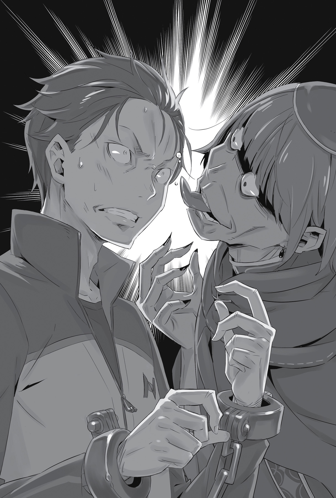
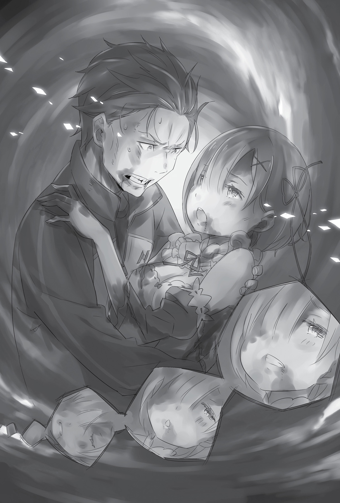
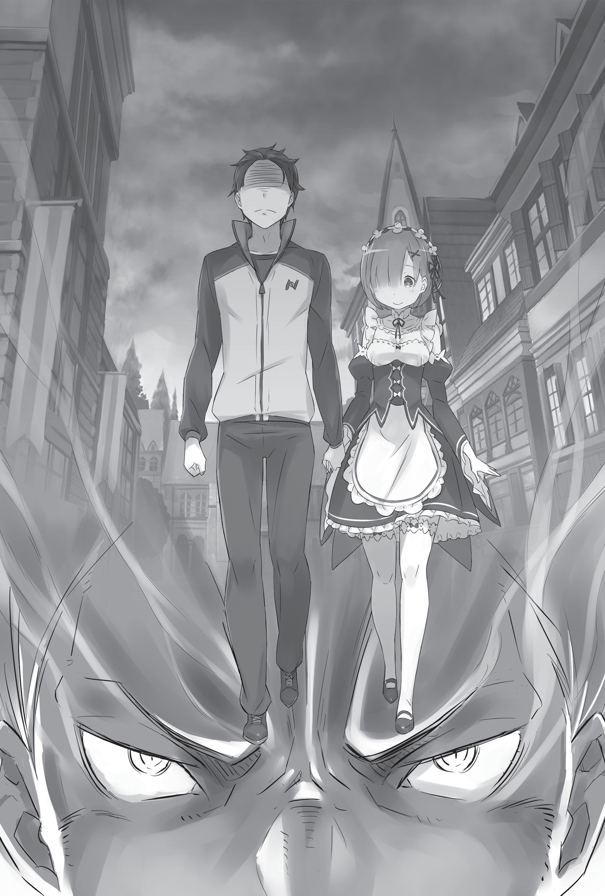

## 1

…Туша обезглавленного на ходу дракона безвольно покатилась по земле. Бегущая следом карета налетела на неё колёсами, высоко подпрыгнула, грохнулась на бок и, поднимая клубы пыли, протащилась ещё несколько метров и наконец замерла. Хватило мгновения, чтобы разразилась настоящая катастрофа!

Горную дорогу с обеих сторон обнимал тихий, безмолвный лес. Экипаж уже успел въехать на земли Мейзерса; ещё пара часов — и путники были бы на месте. Однако теперь карета представляла собой груду обломков и искорёженного металла, и только скрип бесцельно вращающихся колёс разносился по округе. Дракон был мёртв, в воздухе отчётливо пахло кровью.

Послышался стон юноши, выброшенного из кареты. Он лежал в стороне от смятого кузова, прямо в зарослях на обочине дороги. Судя по всему, вьющиеся лианы и мох смягчили удар при падении. Он лишь чудом не получил серьёзных увечий. Однако это не делало травмы безболезненными. На теле появились ссадины и множество синяков. По счастью, обошлось без переломов и кровоточащих ран, и всё же боль была такая, что беднягу согнуло в дугу.

— А-а-а… О-о-ох… — стонал от боли черноволосый юноша, лёжа на траве, из его глаз текли слёзы. Лоб был измазан в крови и грязи; вытекающая изо рта слюна делала его вид ещё более жалким. Картину дополняла разбитая карета, красноречиво говорящая о недавней трагедии.

Группа неподвижных чёрных фигур стояла вокруг юноши и экипажа, безмолвно созерцая случившееся. Незнакомцы, которых была добрая дюжина, осмотрели обезглавленного дракона и, убедившись, что тот мёртв, сосредоточили внимание на юноше.

Фигуры были облачены в чёрные балахоны, головы закрывали плотные капюшоны, так что разглядеть лица или хотя бы определить пол было невозможно. Внезапно они встрепенулись и скользящей поступью сжали кольцо вокруг юноши.

— Ла-а-а… — негромко вывела одна из фигур.

Вслед за ней то же самое произнесла другая. Пение переходило от одной фигуры к другой, окружая тело раненого непрерывным звучанием голосов. Весь мир погрузился в шорох листвы и шёпот чёрных фигур.

— А-ах… А-а-а! — в многоголосье вклинился стон юноши. Он принялся извиваться и биться спиной о землю, словно выброшенная на берег рыба.

Однако страдания причиняли вовсе не ушибы и ссадины: теперь он задыхался от боли, которая будто шла изнутри. Его терзало нечто, беснующееся в нём самом, пожирающее изнутри. Со стороны это выглядело как реакция на зловещий шелест.

Между тем наблюдавшие за агонией фигуры не умолкали. А когда одна из них зачем-то протянула к юноше руку…

— Не трожь Субару! — прогремел яростный крик. В воздухе просвистел железный шар, и голову тени, что хотела дотронуться до Субару, разбило вдребезги.

Осколки черепа разлетелись в стороны, фигура повалилась на землю. Вслед за этим послышалось звонкое бряцанье железной цепи. Грозно извиваясь, серебристая змея устремилась к другой тени, словно в жажде новой крови.

Однако реакция была молниеносной. Тут же позабыв о мёртвом соучастнике, фигуры беззвучно бросились врассыпную, а затем выхватили из-за пазухи крестообразные кортики. Сжимая обеими руками примитивные орудия, они распределились так, чтобы прикрывать друг друга, и настороженно замерли.

Теперь их было одиннадцать. То, как стремительно они построились в боевой порядок, способный отразить внезапную атаку и не оставляющий мёртвых зон, заслуживало похвалы. Подобная тактика была бы эффективной, если бы противник атаковал в двумерном пространстве, однако…

Вшух!

Над головами теней возникла фигурка в платье с передником. Она прыгнула с дерева. В ногах девушки было столько силы, что на стволе, от которого она оттолкнулась, остались вмятины. Пулей вылетев из ветвей за миг до того, как мрачные фигуры подняли головы на шум, она взмахнула своим страшным орудием и вонзила его прямо в макушку одного из врагов. Раздался треск, из дыры в темени брызнула кровь, фигура задёргалась и начала заваливаться, но девушка пинком ноги отбросила её к соседней тени, заслоняя той обзор, а сама отскочила назад.

Однако соседняя фигура не растерялась. Двумя взмахами клинка она рассекла летящий на неё труп сообщника надвое… лишь для того, чтобы через мгновение закрученное шипастое ядро превратило её в кровавое месиво.

Послав шар в противника, девушка застыла на месте. Тени воспользовались моментом и разом метнули в неё кортики. Клинки летели со всех сторон, но в левой руке девушки, казавшейся беззащитной, возник второй железный шар, поменьше. Один взмах — и все кортики попадали на землю.

Ловкий трюк поверг противников в замешательство и привёл к заминке в стане теней. Длилось это не более секунды, но этот миг стал фатальным.

Лес огласил яростный крик:

— Ррра-а-а-а!!!

Девушка рванула цепь. Шипастое ядро описало горизонтальный полукруг, скашивая на своём пути деревья и кустарники, достигло очередной фигуры, вырвало конечности и превратило её в бесформенную массу.

Изо лба голубоволосой девушки, безжалостной, но по-прежнему прекрасной, торчал белоснежный рог!

Одного этого было достаточно, чтобы распознать в ней принявшего женский облик оборотня.

— Только попробуйте тронуть Субару!!!

Очаровательное личико демоницы налилось кровью, а глаза, в которых горела решимость драться до последнего, глядели с презрением и отвращением. И всё-таки девушка занимала оборонительную позицию, прикрывая собой окружённого неприятелями юношу.

Не обращая внимания на истекающее кровью плечо, она продолжала размахивать над головой смертоносным шипастым ядром. Рану девушка получила в момент крушения кареты. Если бы Рем ехала одна, она бы отделалась лёгкими царапинами, но в тот миг от неё зависела жизнь Субару. Всё, на что она была способна, — это, рискуя собственной жизнью, отбросить тело юноши подальше от места аварии, в пружинящие заросли, и разделить горькую участь разбитого драконьего экипажа.

В результате Рем разодрала лоб, а деревянный обломок кареты глубоко вонзился ей в левое плечо. Кажется, была повреждена и левая бедренная кость: каждое движение доставляло такую адскую боль, что сводило скулы.

И всё же Рем, превозмогая боль, сделала шаг вперёд. Не спуская глаз с тёмных фигур, она с ненавистью бросила:

— Вы, одержимые Ведьмой!..

Никакой реакции на яростный выкрик не последовало. Фигуры молча стояли напротив Рем, безликие и безучастные, словно их совершенно не интересовало происходящее. Но момент затишья длился недолго — так или иначе, требовалось довести дело до конца. Рем выпустила цепь на всю длину, и теперь шар описывал в воздухе максимально широкие круги. Не размышляя, Рем кинулась в атаку.

— Йах!

Кроша на своём пути деревья, раскидывая щепки и комья грязи, шар устремился к мрачной группе. Фигуры уклонились от атаки — одни в прыжке, другие пригнувшись к земле — и, улучив момент, кинулись на Рем. Девушка дёрнула рукой, чтобы притянуть шар к себе, но прежде чем моргенштерн вернулся к хозяйке, сверкнул нацеленный в грудь Рем кортик.

— Рра-а!

За миг до того, как остриё вонзилось в тело, демоница махнула ногой, нанеся удар в подбородок нападавшего. Это был не просто удар в челюсть. Мощь его оказалась такова, что у врага буквально оторвало пол-лица. Но боль не остановила залитую кровью фигуру. Стремясь вонзить клинок в Рем, она продолжила атаку, словно и не получила смертельной раны. Живое существо не могло вести себя подобным образом…

Но железное ядро, подтянутое сильным рывком Рем, угодило прямо в затылок нежити. Девушку окатил фонтан крови вперемешку с ошмётками плоти. Перехватив утыканный шипами шар, она замахнулась, и железный кулак всей своей тяжестью обрушился на головы подступавших сбоку фигур.

Шестеро готовы! Рем удалось сократить число тварей вполовину. Задыхаясь от ярости, она обратила взгляд на оставшихся и вдруг увидела летящий прямо на неё заострённый булыжник. Рем уклонилась за мгновение до прямого попадания, и булыжник чиркнул её по виску. Перед глазами поплыли красные пятна.

На мгновение она перестала соображать. Земля поплыла из-под ног, и Рем подпрыгнула. Но тут же пожалела об этом. У противника были средства для ведения дальнего боя, поэтому, взмыв над землёй, она подставила себя под удар.

В воздухе вспыхнул огненный шар, он прошил ствол огромного дерева и устремился прямиком к зависшей в воздухе Рем. Девушку обдало жаром. Она тотчас выставила вперёд левую ладонь и прокричала:

— Хьюма!!!

На пути огненного шара возникла полупрозрачная плёнка изо льда. Снаряд врезался в щит, в воздухе заклубился пар, и послышалось громкое шипение. Однако ледяной преграде не удалось окончательно укротить огненную стихию.

Реакция девушки была молниеносной! Она подняла над головой левый кулак и вмазала по огненному шару.

Шар разорвало на части… ценой руки Рем!

— Ах!

Девушку накрыло взрывной волной. Отлетев в сторону, она ударилась спиной о ствол дерева и упала на переплетение толстых корней. Левую руку прошила острая боль. Рем вскрикнула и тут же вскочила на ноги.

На изуродованную руку было страшно смотреть: от локтя до кончиков пальцев она превратилась в обугленную головешку. Если не показаться опытному лекарю наподобие Ферриса, руку не спасти…

Несмотря на тяжёлое ранение, Рем стиснула зубы и заставила себя включиться в реальность. Подавляя рвущийся наружу крик, она изо всех сил старалась заглушить боль, ещё больше распаляя свой боевой дух и готовясь ринуться в драку. Она почувствовала, что пора напомнить о себе, и яростно закричала.

Главное — чтобы они забыли о существовании Субару…

Ближайшая к Рем фигура вскинула руку, и девушку вновь со страшной силой ударило об ствол. В теле Рем что-то хрустнуло, изо рта брызнул алый фонтан.

Кровь обожгла горло, и боль пронзила каждую клеточку тела. Рем упала на колени и этим спасла себе жизнь. Противник снова поднял руку: огромное дерево за спиной Рем, с корнем вырванное из земли, закружилось в воздухе, как пушинка.

Эта безоружная фигура, явно отличавшаяся от остальных, стремительно атаковала, и удары её ноги заставили землю судорожно затрястись.

Рем откатилась в сторону, сплюнула кровавую слюну и начала искать глазами свой моргенштерн.

В тот момент, когда она уклонилась от очередной заострённой глыбы, летящей в голову, в спину Рем угодил огромный камень. Позвоночник хрустнул, и хрупкое тельце, ударившись о землю, отскочило и снова оказалось в воздухе.

Но девушку уже поджидала та самая фигура. В руке у неё был железный шар Рем. Фигура размахнулась, чтобы раздробить шипастым ядром тело девушки, но окрестности снова огласил пронзительный крик:

— Эль Хьюма!

Исторгнутая изо рта кровь мгновенно смёрзлась в ледяной клинок. Алое лезвие отрезало руку фигуры, и грозный моргенштерн опять покатился по земле.

— Аррргх!

Рем сгруппировалась. Упав на землю, она схватила рукоятку своего оружия и пнула шар ногой. Посланное за спину фигуры шипастое ядро описало круг, и Рем изо всех сил затянула цепь на толстой шее врага.

Послышался глухой треск. Увидев, что шея противника сломана, Рем облегчённо выдохнула.

И в этот миг…

— Ах!

Фигура, что должна была валяться без памяти, сделала резкое движение и яростным ударом сбила Рем с ног.

Удар пришёлся в левый бок, затрещали рёбра. И без того повреждённая бедренная кость сломалась окончательно. Удар оказался последней местью фигуры в балахоне — она повалилась на землю и затихла. Однако увечья, которые получила Рем, были колоссальны.

— А-а-а… — простонала девушка, проклиная левую половину тела, которая отказывалась повиноваться. Сплюнув сгусток крови, она поднялась на ноги.

Видимо, с наиболее сильными бойцами Рем разобралась. Осталось пятеро. Они бездействовали: похоже, ближний бой не являлся их коньком.

Шансы есть. Пока есть.

Приблизиться и снести им всем головы!

Но насколько велики эти шансы, когда левая часть тела обездвижена?

— Только… не раскисать!.. — приободрила себя Рем, изо всех сил сдерживая стон.

Дело не в шансах. Дело в том, что иначе просто нельзя!

Подумаешь — полтела не работает! Ведь другая половина пока подчиняется. Отнимется правая рука, Рем растопчет их ногой! Оторвут ногу, будет вгрызаться им в глотки зубами! Она убьёт всех до последнего и спасёт Субару!

Вспомнив о том, ради кого ринулась в бой, Рем оглянулась, разыскивая дорогого ей человека. Взглянуть на него в последний раз и отринуть сомнения. В последний раз он послужил тем запалом, что воспламенит её сердце.

Однако…

— Субару?!

Его нигде не было.

Тело Субару, который только что корчился поодаль от боли и страха, не понимая, что происходит, исчезло.

Рем завертела головой. Но сколько она ни искала, Субару нигде не было.

И тут Рем кое-что заметила.

— А где же… ещё один?

Их было пятеро. Однако теперь на неё глядели четыре пары ненавидящих глаз.

Держа в опущенных руках крестообразные кортики, фигуры плавно сдвинулись. Они загородили собой дорогу, чтобы спрятать исчезнувшего сообщника. Того самого, который покинул поле брани с телом Субару на руках.

— Вам… вам… — губы Рем дрожали. Как и голос.

По бледным, побелевшим от огромной кровопотери губам побежали ярко-красные струйки, В этой ужасающей боевой раскраске хорошенькое личико Рем действительно стало неотличимо от ужасающей демонической маски.

— Вам было мало лишить сестрицу рога, лишить меня смысла жизни…

Рем согнула правую руку, сжимавшую рукоять железного шара, и, поджав ногу, приготовилась к прыжку. Фигуры бросились в атаку с занесённым над головами оружием, и в тот же миг…

— Теперь вы отбираете у меня человека, ради кого я готова умереть!!!

…Рем оттолкнулась от земли и взмыла в воздух.

Перед глазами вспыхнула необъятная стена пламени. Прошив её насквозь, Рем смела фигуру, что скрывалась за стеной, но в следующую секунду всё поле зрения заслонил огромный огненный шар.

Раздался отчаянный крик. Лес озарила вспышка оранжевого адского пламени. Затем ещё и ещё…

Разбушевавшийся жар испепелял деревья и плавил землю, превращая мир в преисподнюю…

На огромной выжженной прогалине остался лишь обгоревший кусочек белого передника. Его подхватил ветер и унёс прочь…

## 2

Субару безвольно болтался на плече у похитителя, пуская изо рта нити слюны. Ссадины и ушибы, полученные во время аварии, уже почти не болели. Не то чтобы они совсем не беспокоили юношу, но возникла иная боль, которая перекрыла все прочие ощущения. Эта боль пожирала его изнутри. Не было сил ни закричать, ни даже издать слабый стон.

Окружив Субару на месте крушения повозки, фигуры в балахонах начали произносить какое-то заклинание. Чем дольше он слушал их шёпот, тем громче звенело в голове и тем яростнее становился терзавший нутро хаос. В нём будто сидело нечто враждебное, оно росло, наливалось чернотой, извивалось и ворочалось, пытаясь сгрызть Субару изнутри.

На заднем плане раздавался женский голос, звучавший подобно проклятию. Мелодичный и нежный, он словно предавал Субару анафеме, усугубляя его страдания, погружая в пучину безумия и сводя с ума.

Одна мысль о том, что это продлится хотя бы ещё мгновение, была невыносима. Боль рвала душу на части, калечила, изменяла до неузнаваемости. После таких проклятий человек перестаёт быть человеком…

Внезапно его обслюнявленные губы искривились, и с них сорвался безумный смех — как будто он о чём-то вспомнил:

— Ха-ха-ха, хи-хи-хи, хи-хи…

Отзвуки зловещего чёрного хаоса, бурлящего внутри, стали какими-то далёкими, и сознание переключилось на внешний мир. Позабыв душевные муки, Субару плакал от физической боли, что доносили его истерзанные нервы.

Субару рыдал. Стонала каждая клетка его тела, и юноше так хотелось, чтобы кто-нибудь приласкал его, пожалел, согрел. Но фигуру, несущуюся по звериной тропе, меньше всего интересовали его желания. Сковав железной хваткой трепещущее тело, она с ураганной скоростью мчалась сквозь лес, ловко огибая преграды, что казалось невозможным с её долговязым телосложением.

В глубине дремучего леса не было ориентиров, но фигура двигалась уверенно, словно направляемая невидимым проводником. Стремительный бег продолжался не меньше десяти минут. Постепенно фигура стала сбавлять скорость, пока наконец не остановилась.

Прямо перед ней вздымался скалистый утёс с высокими замшелыми отвесами. О том, чтобы перебраться через эту природную крепостную стену без специального снаряжения, нечего было и думать. Неужели его похититель заблудился? Нет, фигура совсем не выглядела растерянной. Она не спеша приблизилась к утёсу и приложила ладонь к камню.

По коже Субару побежали мурашки, словно кто-то использовал магию. А глыба, к которой прикоснулась тёмная фигура, испарилась как по волшебству. На её месте открылся тайный ход. Вероятно, он вёл в пещеру. Фигура переложила Субару на другое плечо и проскользнула в дыру.

Воздух пещеры окутал пришельцев промозглой сыростью. Стояла полная тишина — не было слышно даже звука шагов. Иногда безмолвие нарушал стон Субару, но никто не обращал на него внимания. Когда фигура удалилась от входа метров на десять, свет погас. Похоже, камень вернулся на прежнее место и скрыл пещеру от посторонних глаз.

Несмотря на это, пещера всё же не погрузилась во мрак. Вдоль узкого прохода на равном расстоянии друг от друга были установлены кристаллы, они вспыхивали неярким светом, озаряя дорогу. Ориентируясь по этим огням, фигура устремлялась всё глубже и глубже, унося пленника в бездонную тьму.

Она продвигалась вглубь пещеры, и чёрный хаос, клубящийся внутри юноши, вновь пришёл в движение. Однако на сей раз он не пытался растерзать внутренности Субару и превратить их в месиво. Напротив, он с любовью вылизывал каждый сантиметр организма. Но эти ласки доставляли нескончаемую боль и с каждой секундой становились всё отвратительнее. Субару била крупная дрожь, из глаз текли слёзы, а из горла вырывался истерический хохот.

Казалось, коридору не будет конца, но вскоре свет кристаллов стал чуть ярче, позволяя разглядеть то место, куда привёл их узкий тоннель. Это был зал с высоким сводом, на удивление объёмный.

И здесь Субару лицом к лицу столкнулся с самым настоящим Злом этого мира.

— Поди ж ты!

Худой как щепка человек.

На нём была чёрная, как балахоны окружавших фигур, ряса. Ростом немногим выше Субару, этот человек был настолько тощ, что больше походил на скелет, обтянутый кожей. В целом он производил впечатление немытого доходяги с засаленными тёмно-зелёными волосами.

Если только не смотреть в его глаза, где горел огонёк безумия.

Долговязый похититель снял с плеча безвольное тело Субару, лицо которого выражало полное безразличие, замкнул на его руках и ногах кандалы, соединённые железными цепями с крюками, что были вбиты в стену, и бросил юношу на холодный твёрдый пол.

Человек в рясе с любопытством осмотрел пленника большими, выпученными глазами. Пока холодный, как у рептилии, взгляд беззастенчиво шарил по телу Субару, незнакомец всё больше кособочился. При этом голова его склонялась в ту же сторону, что и туловище, пока шея не искривилась на девяносто градусов.

— Как интере-е-есно… Ну и ну! Прелюбопытненько!

Исследовав глазами каждую пядь тела Субару, человек согласно кивнул. Затем одна из фигур — та самая, которая доставила юношу, — упала на колени и, застыв в благоговейной позе, стала ждать дальнейших приказов. Все остальные последовали её примеру и тоже преклонили колени перед хозяином. Однако тот не удостоил их вниманием. Кажется, он о чём-то глубоко задумался. Засунув в рот палец правой руки, он впился в него зубами и с необычайной лёгкостью, словно обкусывая ноготь, разгрыз его коренными зубами.

— А может, ты… Гордыня, а-а? — произнёс он с сомнением. К окровавленным губам пристали кусочки плоти, а из размозжённого пальца струилась кровь, но его это явно не беспокоило. Точно так же и Субару не слишком впечатлился представлением сумасшедшего визави и не удостоил его ответом, ведь юноша тоже был лишён рассудка.

Глядя на эту отвратительную сцену самоистязания, он лишь хихикал как ненормальный. Взгляды безумцев пересеклись, и какое-то время они пристально смотрели друг на друга, словно меряясь степенью сумасшествия.

— Хм! Боюсь, такой ответ мне не подойдёт-с!

С этими словами человек распрямился, с лёгкостью признавая своё поражение. Судя по всему, неудача в противоборстве его не огорчила. Он отнял палец от губ и, словно о чём-то вспомнив, постучал себя окровавленной рукой по лбу.

— Ах да-а! Совсем запамятовал. Похоже, я должен извиниться, ведь не отрекомендовался!

Его поведение мало вязалось со словами сожаления. Человек разразился леденящим душу смехом, и на его лице возникла дружественная гримаса, словно он принял улыбку спятившего пленника за знак симпатии.

— Пред тобой греховный архиепископ Культа Ведьмы. — Он церемонно поклонился, а затем выгнул шею и устремил взгляд прямо перед собой: — Моё имя — Петельгейзе Романе-Конти, олицетворение… Лени-с!

Показывая пальцами обеих рук на Субару, Петельгейзе закатился диким смехом умалишённого. Скрежещущий хохот жутким рокотом прокатился под сводами пещеры.

## 3

Гогот Петельгейзе эхом отражался от холодных стен мрачной пещеры. Что его так развеселило, было неясно, однако он всё скалил окровавленные зубы и в экстатическом восторге закатывался сумасшедшим хохотом. На лице Субару, в свою очередь, тоже играла неестественная улыбка.

Железные оковы больно врезались в кожу и сдавливали кровеносные сосуды. Побелевшие руки и ноги немели, теряя чувствительность. Похоже, оказывать Субару радушный приём здесь никто не собирался.

— Ах, как потешно, правда?! Какое занима-нима-нима-нима-нимательное зрелище!!! Воистину, воистину, воистину-у-у! Мой мозг трепещет!..

Щерясь дьявольской улыбкой, Петельгейзе взмахнул искалеченной рукой и быстро нарисовал на стене кровавый узор. Жуткий образец наскальной живописи не имел никакого смысла и, по-видимому, отражал психическое нездоровье художника.

Противостояние двух безумцев, соперничающих в своём помешательстве, — истерически хихикающего Субару и хозяина этого сумасшедшего мира Петельгейзе — было прервано одной из коленопреклонённых фигур. Это была та самая долговязая тень, которая притащила сюда пленника. Приблизившись к Петельгейзе, она что-то шепнула ему на ухо. Никто, кроме хозяина, не мог расслышать шёпот, который был не громче взмаха крыльев бабочки. Петельгейзе согнал с лица дьявольскую ухмылку, прекратил кривляться и выгнул шею под прямым углом.

— Вот ка-а-ак! А-а-ах, как волнующе! Мой мозг трепещщщет!!! — проверещал он фальцетом, сохраняя при этом абсолютно серьёзное выражение лица. Затем поднёс ко рту здоровую руку и безо всяких колебаний принялся по очереди разгрызать пальцы. Раздался звук раздираемой плоти и хруст ломающихся костей.

— Как больно… Больно-больно-больно-больно-больно-больно-больно-о-о!!! — Петельгейзе замахал рукой с израненными пальцами, разбрызгивая повсюду капли крови. Затем он возвёл глаза к своду пещеры и довольно произнёс: — Вот она… полнота жизни-с!

Подобострастно наблюдавшая за хозяином фигура, по-прежнему стоя на коленях, вновь что-то прошептала.

— Безымянный палец левой руки ликвидирован? Ах, что за сладостное испытание! Хотя он был таким усердным… В нашем бренном мире любовь может принимать разные обличья-с!

Шух-шух-шух.

Фигура вновь что-то прошептала.

— А-а-а, так это же прекрасно! Теперь оставшиеся фаланги безымянного пальца воссоединятся со средним и указательным! Ещё-ещё-ещё-ещё целых девять пальцев! Шансов показать свою преданность ещё предостаточно!

Петельгейзе вытянул левую руку и благодарственным жестом возложил окровавленную ладонь на макушку одной из фигур. Какие чувства скрывались внутри этой дрожащей всем телом фигуры, было неизвестно, однако, казалось, она была глубоко тронута вниманием Петельгейзе.

— Именно! Испытание! Испытание! Это испытание! Всё — суть испытание, чтобы мы могли отблагодарить за оказанную нам милость! Сияй! Веди нас! Ах, мой мозг трепещет!

Брызжа слюной от восторга, Петельгейзе залился хохотом. Присутствующие на этом странном и жутком собрании явно прониклись речью оратора и принялись аплодировать.

Фигура шептала Петельгейзе настолько слабым голосом — не громче мышиной возни, — что слов было не разобрать даже в тишине пещеры. Вместе с монологами Петельгейзе это выглядело как загадочная сцена из некоего зловещего спектакля.

— И при всём при этом у нас есть он! Ах, у нас есть он! Кстати, кто он вообще такой-с?

Петельгейзе наклонился, вывернул голову и придвинул лицо почти вплотную к Субару, обдав его запахом крови. Юноша поднял на безумца безразличный взгляд.

— Конечно, конечно-конечно-конечно-нечно-нечно! Как удивительно-о-о, как тревожно-о-о, неисповедимо-о-о… И почему именно сейчас, когда на носу испытание, именно ты, о котором нет ни слова в Евангелии?!

Шух-шух-шух.

— Драконья повозка! Ах, земляные драконы — это прекрасно! Они милы, преданны и самоотверженны! Этот вид прилежен в послушании, прилежен в работе, прилежен и трудолюбив во всём! Он изумителен-с!

Шух-шух-шух.

— Убит?! Ах, ещё одна хорошая новость! Это было неизбежно, ведь он тащил повозку. Ах, ты тоже прилежен! Молодец! Пока на моих руках есть пальцы, прилежание не иссякнет! Ах, любовь! Жизнь! Люди! Прилежание переполняет всё! — восторженно вопил Петельгейзе, выгнувшись назад так, что едва не касался затылком земли.

Его лицо сияло экстазом, когда он, словно спущенная тетива, вернулся в исходное положение.

— А-а-а, своими собственными прилежными руками! Взял верх над драконом, самим воплощением прилежания! Да-а-а, мой мозг трепещет! Трепещет, трепещет, трепещет -трепещет-трепе-е-е-ещщщет!!!

Исступление Петельгейзе было за гранью понимания простых смертных. Архиепископ так разгорячился, что из его ноздрей побежала кровь. Слизав алые капли с губ, он расплылся в хмельной улыбке.

— Да-а-а… Мёртвый дракон воистину нерадив, не так ли? — прохрипел он, бешено вращая глазами, и затрясся в экстазе.

Стерев кровь рукавом рясы, Петельгейзе издал протяжный стон. Внезапно охватившее его возбуждение рассеялось. Показывая рукой в сторону выхода, он произнёс спокойным, ровным голосом:

— Немедля замести следы крушения повозки. День испытания близок, и мы не хотим, чтобы кто-то о нас узнал-с. Со свидетелями, полагаю, вы разобрались, и на этот счёт можно не волноваться… Что? Попутчик? Вы как следует о нём позаботились?

Шух-шух-шух.

— Так, с ним был один попутчик… Голубоволосая девочка… Левый безымянный палец уничтожил драконью повозку… Во время захвата пленника пришлось вступить в бой… Девочка уничтожила безымянный палец… а затем пропала без вести…

Петельгейзе повторял за фигурой и, задумчиво хрустя шейными позвонками, непрерывно качал головой то вправо, то влево, как часовым маятником. Он крутился, извивался, перегибался и наконец резко наклонился вперёд и угрюмо произнёс:

— Про-па-ла… без… вес-ти?..

Он поднял лицо и невидящим взглядом посмотрел на подчинённого:

— Так ты, оказывается… нерадив?

Выпучив бельма, Петельгейзе обеими руками схватил его за голову, измазав её кровью истерзанных пальцев. Не обращая на это никакого внимания, Петельгейзе возопил:

— Впереди испытание, а ты посмел оставить повод для тревоги! Это и есть?! Вот это, вот это, вот эта-а-а-а-а!.. Твоя искренняя благодарность Евангелию?! А-а-ах, эта праздность! Лень, лень, лень, ле-е-е-е-ень!!!

С неожиданной силой, невесть откуда взявшейся в его тщедушном теле, Петельгейзе стал мотать голову провинившегося из стороны в сторону, затем швырнул его на пол, уселся на него верхом и, рыдая, воздел глаза к высокому своду:

— Нерадение моих пальцев — моё небрежение! А-а-ах, прости меня, предавшего твою любовь, за небрежение! Прости эту тварь, всецело посвятившую своё прилежание благу Евангелия! Что *должна* была посвятить, но предавалась праздности! Прошу, прости ей неразумие!

Пока Петельгейзе заливался горючими слезами, фигура, на которой он устроился, тоже начала хлюпать носом. Это выглядело бы первой человеческой реакцией подчинённых Петельгейзе, если бы фанатик в следующий же миг не воздел руки кверху в молитвенном жесте.

— Любовь! — продолжал визжать Петельгейзе. — Любовь! За любовь нужно благодарить! Нерадение непростительно! Нужно следовать Евангелию! На любовь отвечать любовью!.. Разыскать пропавшую девчонку! Если жива, отправить к праотцам, если мертва, отрезать от трупа голову и принести сюда! Во имя любви-с!

Повинуясь приказу, фигуры начали растворяться во мраке пещеры. Когда исчезла последняя, Петельгейзе какое-то время ещё стоял на коленях, глядя в пустоту и переводя дыхание. Затем он обернулся к Субару, сидевшему у стены.

— Так-так-так-так-так-так-так-так-так, — сказал он и на четвереньках, быстро шаркая коленями по полу, приблизился к пленнику. — Так что же ты, в конце концов, такое?..

Субару что-то промычал в ответ.

— Не похоже, чтобы тебя привело сюда Евангелие. Но дух любви, исходящий от тебя, так упоителен! Воистину, воистину, воистину-у-у! Как интересненько!

Придвинувшись к Субару, Петельгейзе высунул язык так далеко, что едва не касался им глаза пленника. Субару по-прежнему смотрел прямо перед собой безжизненным, стеклянным взглядом. Физиономия архиепископа просияла от восторга. Он удовлетворённо хлопнул в ладоши и произнёс:

— Я знаю в лицо всех, кроме Гордости, и всё же полагаю, такую милость тебе могло ниспослать только Евангелие.

Он сунул руку в складки своей рясы и вытащил книгу в чёрном переплёте. Размерами она напоминала небольшой словарь. На первый взгляд, в этом не было ничего особенного: человек просто достал свою любимую книгу. Однако так мог сделать кто угодно, но только не этот сумасшедший.

— Да-а-а… Я чувствую Евангелие, я чувствую любовь! Мой мозг… трепе-е-ещщщет…

Он нежно погладил корешок безымянной книги. Его дыхание и взгляд были преисполнены пылкой страсти, но страницы он принялся перелистывать с какой-то торжественной неспешностью.

— В Евангелии о тебе ничего не сказано. Хотя и о проблеме, возникшей в преддверии грандиозного испытания, здесь тоже ни слова! То есть! Выхо-о-одит!.. — Петельгейзе с грохотом захлопнул книгу, поднял её высоко над головой и, брызжа слюной, провозгласил: — Есть ты или нет, невелика важность! Тебя нет даже в Евангелии, поэтому вершить твою судьбу буду *я*! А ведь ты удостоен такой глубокой-глубокой-глубо-о-окой милости… Парадоксальное существо!

Он ткнул пальцем себе в висок и начал ковырять в нём ногтем. Субару глядел, как из раны на виске маньяка заструилась кровь, но по-прежнему никак не реагировал. Самоистязание, которым занимался Петельгейзе, вызвало у юноши очередной идиотский смешок.

— А-а-а-а-а… — отрывисто произнёс Петельгейзе. — Игнорируешь! Печальненько-с! А ведь я так!.. Так!.. К тебе добр-добр-добр-добр-добр-добрррррррр!!!

С этими словами он обхватил руками лицо бесчувственного пленника, крепко сжал его между ладонями и силой заставил поглядеть себе в глаза. Несмотря на то что связь с реальностью была почти утрачена, Субару не понравилось такое обращение. Он скорчил гримасу и попытался высвободиться, но…

— Смотреть в глаза! — произнёс Петельгейзе тихим, но твёрдым, не допускающим возражений голосом.

Субару вздрогнул и, повинуясь приказу, направил на Петельгейзе отсутствующий взгляд. Серые глаза архиепископа, в которых плясал огонёк безумия, заглянули прямо в душу.

— Отвечать! Отвечать искренне. На мои вопросы, на мои просьбы. Что тебя привело в такое место, с чего тебя удостоили этой милости? У тебя нет Евангелия? Удалось ли твоей душе лично внять *её* шёпоту?

— У-у-у… ы-ы-ы…

— Так мы далеко не уйдём! Попробуем задать вопросы в другом порядке.

Не получив ответа, Петельгейзе снова вывернул шею на девяносто градусов и впился в Субару мутными глазами:

— Я жду ответа!

Вместо ответа снова последовали нечленораздельные звуки. Тогда Петельгейзе высунул язык и лизнул Субару в левый глаз. Субару содрогнулся от отвращения и, гремя цепями кандалов, задёргался в попытке отстраниться. Но это продолжалось ровно до тех пор, пока не прозвучал следующий вопрос:

— Зачем ты… разыгрываешь из себя полоумного?!

## 4

— А-а-а! А-а-а-а-а!

Как плохо… гадко… страшно… отпустите… спасите… страшно, страшно, страшно, страшно!

Что он сказал? Ничего не понятно…

Отвратительные скользкие прикосновения, невыносимый пристальный взгляд, от которого хотелось бежать без оглядки, вдруг прервали конвульсии, бьющие тело. Он замер в прострации, и снова мерзкий язык коснулся распахнутого глаза…

— Зачем ты разыгрываешь из себя полоумного?

Новое скользкое прикосновение заставило закованные в кандалы руки яростно дёрнуться. Цепи натянулись, не давая рукам свободы. Рывок не удался, и юноша повалился на пол.

— У-у-у! А-а-а-а! Иа-а-аы-ы!..

— Нет-нет-нет. По правде говоря, твоя игра вызывает со мнения. Зачем? С какой целью? Во имя чего ты разыгрываешь этот безумный спектакль?

Он не должен слушать. Не должен впускать это в себя. Не должен знать.

Мотая головой и гремя кандалами изо всех сил, он отчаянно пытался отстраниться от действительности. Не слышать, не понимать то, что говорит этот человек!

— Невменяемость — удобный способ уйти от реальности, но тебе не суждено им воспользоваться.

— А-а-а! Гхы-ы-ы!..

— Твоя невменяемость слишком вменяема. Разве так сходят с ума? С расчётом и благоразумием изображая горемыку, который просит сочувствия и любви? Это так непочтительно по отношению к безумию!

Субару закричал, издавая истошные, раздирающие горло вопли, — только бы заглушить эту речь. Но человек, будто насмехаясь над попытками сопротивляться, всё же находил лазейки и ввинчивал свой голос в его уши.

— Такая игра никуда не годится! Когда натурально сходишь с ума, впадаешь в помешательство в прямом смысле слова, мир вокруг перестаёт существовать, замыкается на тебе самом. Душа скитается по пустоши одиночества, а ты ясно осознаёшь своё безумие!

— А-а-а! А-а-а! А-а-а-а-а-а!!!

— А-а-ах, как потешно, необычайно потешно! Зачем ты разыгрываешь из себя психа?! Настоящий псих тебя вмиг раскусит! Сейчас лопну от смеха!

Больно… тошнит… Что-то распирает грудь, заявляя о себе острой болью. Оно находилось там с самого начала. Просто было заперто внутри, и Субару старался его не замечать. Юноша знал: оно там и его ни за что нельзя выпускать наружу!..

— Какой же ты жалкий! Несчастный! Горемычный, мерзкий, убогий, плюгавый грешник! Мне жаль тебя до глубины души! Тебя удостоили такой любви! И что за нужда отпираться? Неужели ты желаешь рассеяться в безвременье, как дым, вместо того чтобы утонуть в дарованной любви, отблагодарить за оказанную милость? А-а-ах, ну что с тобой делать!

Человек с серыми глазами схватил его за виски и с размаху отбросил к стене. От удара о твёрдый камень из глаз Субару посыпались искры, а из пробитой головы заструилась кровь. Истерзанное тело стонало от нестерпимого унижения и побоев, но мучителя это ещё больше раззадоривало. Пещеру огласил восторженный хохот.

— Как же ты-ы-ы… ты-ы-ы… нерадив!

Раздался треск. Кажется, что-то лопнуло в голове.

Субару ничего не слушал. Полная тишина. Всё это лишь бред сумасшедшего. Все слова мимо цели, в них ни капли истины.

Субару не понимал. И раньше, и сейчас. Но так и должно быть. Так должно быть всегда. Иначе нельзя. Иначе он…

— А-а-ах… Довольно.

Чёрное мрачное нечто наполняло грудь и уже готово было взорваться, но тихий, спокойный голос, чей хозяин будто позабыл о своём помешательстве, остановил этот процесс за миг до финала.

Несмотря на то что градус безумия в его словах неожиданно спал, Субару почувствовал, что исходящая от психопата угроза увеличилась вдвое, и юношу бросило в пот.

— Стану давить на тебя слишком, да, слишком-слишком-слишшшком сильно — сам потом буду не рад. Поразмысли немного над явленной тебе милостью, не спеша, обстоятельно, и ответ не заставит себя долго ждать.

— А-а-а… У-у-у…

О чём он? Всё, от первого слова до последнего, звучало полнейшим абсурдом, в котором ничего не разобрать. Но он вёл себя так, будто что-то знал. Он был то заботливым взрослым, ведущим ребёнка за руку, то дьяволом-искусителем, заманивающим заблудшего путника на прогнивший подвесной мост.

Чудовище за гранью понимания! Между ними зияла непреодолимая пропасть, и Субару никогда не смог бы стать таким… до того мига, когда достиг точки невозврата…

— А-а-ах… Если бы ты отринул свою нерадивость и стал прилежным!..

## 5

Безумец глядел в затуманенные глаза Субару с таким видом, словно на него снизошло откровение. Затем он обратил взгляд к своду пещеры и, молитвенно сложив руки, принялся что-то шептать. Пожалуй, это было первое действие, не похожее на фарс, ведь оно более-менее соответствовало его званию — архиепископ.

Помолившись, Петельгейзе вдруг повернул голову, будто на какой-то звук:

— Вот так-так!

Прямо из-под земли один за другим стали появляться его приспешники, которых он только что отправил на поиски девчонки. Их набралось более десятка, Опустив головы, они упали перед хозяином на колени, словно в ожидании приказаний.

— В чём дело?

*Шух-шух-шух.*

— Что? Девчонка пожаловала?.. А-а-а, так вот почему вы вернулись. Прекрасно! Очень хорошо! Всенепременно встретим! Я лично окажу ей тёплый приём!

Петельгейзе сиял от счастья, но смысл его речи до Субару не доходил. Юноша открыл рот, будто желая что-то сказать, но издал лишь слабый стон. И всё-таки грудь распирало непонятное чувство, спешащее вырваться наружу…

Но Субару не смог выдавить ни звука: его рот будто заткнули невидимым кляпом. Не так, как бывает при испуге или каком-то ином чувстве, когда слова застревают в горле. Это ощущение было более явственным, как если бы рот закрыла некая физическая преграда. Не в силах сбросить не видимую ладонь, зажавшую рот, Субару в ужасе распахнул глаза. Петельгейзе повернулся к пленнику и разразился хохотом.

— Пожалуй, не будем торопиться! У нас достаточно времени, — вымолвил он, и снова его хриплый хохот разнёсся по пещере.

Жуткое эхо резануло слух, ощущение невидимой ладони исчезло, но немота не отпускала. Нельзя было ни смеяться, ни плакать. Оставалось только молча ждать, пока что-нибудь не произойдёт.

Ждать пришлось не более часа. Фигуры всё так же стояли на коленях, а Петельгейзе расхаживал между ними зигзагами, не произнося ни слова. В пещере раздавались лишь звуки его шагов да тяжёлое дыхание Субару. Первой шевельнулась фигура, сидевшая ближе всех ко входу в подземный зал. Она подняла голову, и остальные фанатики по цепочке зашевелились вслед за ней. Заметив оживление в рядах последователей, Петельгейзе тоже повернулся ко входу в пещеру, и лицо его растянулось в улыбке до самых ушей.

— Явилась! — со злорадным весельем произнёс он, но ужасающий грохот заглушил слова.

Огромная масса породы разлетелась, словно взорвавшись, в разные стороны. Сотрясение докатилось даже до Субару, который в эту минуту лежал на каменном полу. Все, кто находились в обширном промозглом гроте, сразу поняли, что произошло: вход в подземный зал разнесло яростными ударами некоего грозного орудия.

Фигуры встрепенулись и вскочили на ноги. Выхватив крестообразные кортики, они рассредоточились по всему пространству, тесноватому для манёвров десяти с лишним человек, и замерли в угрожающих позах. Пещерный зал был площадью с пару школьных классов — особо не разгуляешься. Это создавало благоприятные условия для атакующей стороны, которая уступала по численности отряду фанатиков Петельгейзе.

— Вот вы где!

В воздухе просвистел металлический шар, и фигуры, бросившиеся в атаку, оказались сметены в мгновение ока. На стене расплылось несколько алых пятен. Хватило одного удара, чтобы превратить троих нападавших в кровавое месиво. Моргенштерн был тем смертельным оружием, которое не оставляло противнику ни малейшего шанса. От него можно было только уклониться, но в тесной пещере такой манёвр являлся очень сложной задачей.

Ядро грохнулось на пол, раскрошив его поверхность. Облепленные кровью и кусками плоти шипы угрожающе заскребли по камню. Из темноты шагнула девушка, её голубые волосы были вымазаны чем-то тёмным. Она обвела зал холодным взглядом. Когда её глаза наткнулись на юношу, лежащего ничком на полу, с дрожащих губ сорвался тихий возглас:

— Наконец-то! Субару!..

Произнеся его имя, демоница — то есть Рем — облегчённо вздохнула. Её кошмарный вид говорил о героических усилиях, которые девушке пришлось приложить, чтобы добраться сюда. Рем с головы до ног была заляпана кровью, волосы склеились в грязно-бурую паклю, на переднике не найти живого места от прожжённых дыр. Ниже порванного в лоскуты платья виднелись израненные ноги, а левая рука оказалась изуродована ужасным ожогом, на который нельзя было взглянуть без содрогания.

От Рем исходил густой запах крови и смерти, и всё же она отыскала в себе силы улыбнуться Субару.

— Просто великолепно! Восхитительно! — завизжал Петельгейзе, восторженно глядя на полуживую гостью и хлопая в ладоши. Судя по всему, судьба убитых подчинённых его не только не встревожила, но вызвала настоящий восторг. — Что за девчонка! Сама чуть жива, а всё не сдаётся! И ради кого? Ради вот этого мальчишки?! Пошла на такой отчаянный шаг, чтобы спасти удостоенного милости юнца! Ах, эта любовная одержимость! Жизнь ради любви!..

— Довольно болтовни, приспешник Ведьмы…

Рем не сводила с безумца глаз, пока тот, встав между ней и Субару, с пеной у рта твердил про торжество любви.

— Вы просто банда невежд! Вы вторглись во владения Мейзерсов без разрешения господина Розвааля, хозяина этих земель, и заслуживаете смерти! Господина Розвааля здесь нет, поэтому я беру на себя смелость привести приговор в исполнение.

— Ты себя в зеркало видела? Не стоит так уверенно заявлять о намерениях, если не можешь их воплотить! Ведь ты пришла только для того, чтобы забрать этого мальчишку. К чему такие громкие слова?

Петельгейзе присел на корточки рядом с Субару, схватил пленника за волосы и приподнял его голову. Невзирая на сопротивление юноши, Петельгейзе с наслаждением принялся бить его лицом об пол.

— …в покое!

— Что-что?

— Я сказала, оставь его в покое!!!

От холодной сдержанности демоницы не осталось и следа. Рем была готова взорваться от гнева.

— Да, да, именно! — довольно осклабился Петельгейзе. — Вот что тобою движет! Вот твоя истинная сущность! Твоя любовь во всей красе! Любовь! Любовь! Это любовь! Любовь привела тебя сюда! Отнекиваться, скрывать, обманывать — значит предать любовь! Какое святотатство! А-а-ах, эта нерадивость!

— Слушать эту чушь выше моих сил!..

— Какой замечательный крик! Вот что у тебя на уме! Ты отбросила все посторонние чувства, выкинула лишнее и примчалась сюда, думая только о нём!

Рем погрузилась в гневное молчание. В сумасшедших зрачках Петельгейзе блеснула искорка жалости. Он опустил взгляд на Субару:

— Вот потому мне и досадно. Такой благочестивый ученик любви, как ты, скрывается за мерзкой маской безумия и невежества. Что в ней такого, что ты столь упорно безучастен?.. Что это, если не лень?!

— Да что ты знаешь о Субару?! — прокричала Рем. — Ты, самовлюблённый ведьмин лакей!..

— Неужели гнев так затуманил твой разум, что сама не видишь? Этот юноша, объект твоей любви… ты его потеряла. С ним всё кончено.

— Нет, не кончено! Я ещё жива! Я не забыла, что Субару говорил мне! Сейчас я возьму его за руку, и мы уйдём отсюда вместе. Пока я рядом, Субару будет держаться!

Слова Рем не были отчаянной попыткой утешить саму себя; в глубине души она была твёрдо уверена, что именно так и произойдёт.

Бешеный крик Рем и безумный смех Петельгейзе заставили Субару медленно поднять голову. Он сидел, прислонившись спиной к стене, а внутри него звучал чей-то голос. Слов было не разобрать. Однако Рем заметила эту перемену в отрешённом лице юноши и бросилась вперёд.

В тот же миг в воздух взвилась пара безмолвных фигур в балахонах. Они оттолкнулись от стены и кинулись наперехват. Во мраке свистнули кортики-кресты, нацеленные на израненную девушку.

— Не стойте между Субару и мной!.. — закричала Рем и взмахнула правой рукой, обмотанной цепью моргенштерна. Кинжалы со звоном отскочили от железного нарукавника. Рем со всей мочи ударила им по одной из фигур, снеся той полголовы. Ещё одна фигура, лишившись клинка, хотела обхватить Рем руками, но прежде чем она это сделала, шипастый шар размозжил ей затылок.

Рухнув на пол в компании двух мертвецов, Рем оказалась посередине грота — в гуще толпы фанатиков Петельгейзе. Мрачные фигуры с кинжалами кинулись к противнице, чтобы искромсать девушку на куски, но Рем опередила их яростным криком:

— Эль Хьюма!

Заклинание породило волну холода. Мертвец, что валялся у ног Рем, вдруг подлетел в воздух; из трупа брызнули алые струи крови, они застыли в пространстве острыми ледяными шипами и вонзились в тела фанатиков. Нападавшие замерли на месте, и в следующий миг Рем сокрушила их безжалостными ударами кулака и железного ядра.

— Чудесно! Великолепно! Безо всяких преувеличений! И всё-таки почему?! А-а-ах, ну почему?! Почему ты не принимаешь любовь?! Не признаёшь её?! Отрицаешь?! Таить любовь в себе — значит лишиться спасения, которое и без того далеко!.. И всё-таки — почему?!

— Довольно пустословия! Своё спасение я нашла уже давно! Тем утром я обрела то, что считала навсегда утраченным в злополучную ночь! И другого мне не надо! Так что… — Рем бросила пронзительный взгляд на Субару, — я не пожалею себя, чтобы отблагодарить за всё, что мне было дано. Я должна это сделать! Я хочу этого! Называйте как вздумается, мне плевать на дешёвое словоблудие!

С половиной приспешников Петельгейзе, коих изначально было человек пятнадцать, Рем расправилась ещё до того, как ворвалась в пещеру. Оставшиеся были явно не в состоянии укротить её безудержную ярость. В превосходстве Рем не приходилось сомневаться. Она демонстрировала чистую, подлинную силу расы демонов.

И всё же… Почему?

— А-а-а… а-а-а… — Петельгейзе закрыл лицо руками и, глядя сквозь пальцы на своих остервенелых последователей, испускал экстатические вздохи. Его трясло, но не от скорби, не от страха или тревоги. Его трясло от чистого восторга, и Субару чувствовал это.

Он лежал подле Петельгейзе и видел жестокую битву Рем. Постепенно до него начинали доходить смысл этой сцены и причины, по которым Рем вела бой. Субару сопротивлялся. Ему не хотелось ничего понимать. Но кое-что всё же сумело пробиться к его сознанию.

Пока он глядел, как девушка, несмотря на кровавые раны, продолжает сражаться, желание сделать хоть что-нибудь росло в нём с каждой секундой. Быть может, он должен облечь в слова всё то, что его терзает… но в таком случае Субару больше не сможет оставаться в блаженной трясине безумия. Ему ничего не останется, как взглянуть в лицо реальности и осознать, в чём он был прав, в чём ошибался и почему всё получилось именно так, как получилось…

Но страх Субару оказался слишком велик, как и его эгоизм…

— Мой мозг… трепещет! — удивительно спокойно проговорил Петельгейзе и поднялся. Шурша подолом чёрной рясы, он царственной походкой зашагал вперёд.

В отличие от своих адептов, он был совершенно безоружным и непринуждённо размахивал пустыми руками. Более того, во всём его флегматичном облике не ощущалось ни капли враждебности. Никому бы и в голову не пришло, что этот ходячий скелет таит в себе какую бы то ни было силу.

Заметив, что Петельгейзе направляется в её сторону, Рем отправила в нокаут ещё одну фигуру в балахоне и взмыла в воздух. Свесившись с потолка, она бросила яростный взгляд на Петельгейзе. Спустя мгновение девушка замахнулась, чтобы нанести удар и разорвать тощее тело на кусочки, однако…

И всё-таки… почему?.. Откуда это дурное предчувствие, от которого душа в ужасе замерла?

— Не приближайся к Суба…

Окончания фразы не последовало.

По пещере прокатилось эхо и всколыхнуло сердце Субару. Наверняка даже сама Рем не думала, что так получится. Её слова были адресованы вовсе не юноше. Но череда отчаянных, надрывных выкриков растопила заледеневшее сердце.

Из горла Субару вылетел еле слышный хрип — бессмысленный и пустой. Юноша оторвал лицо от земли, сделал мучительный вздох и сосредоточил вскипевшие чувства в одном коротком слове:

— Рем…

Шёпот был едва различим. Похоже, он не произносил это имя целую вечность…

Слабое, мимолётное сипение… Казалось, едва родившись, оно тут же растворилось в неуловимом движении воздуха… Но Рем услышала! Лицо девушки, висящей под сводом пещеры, на миг озарилось радостью. На губах промелькнула улыбка — ведь Субару возвращался из беспамятства в реальность.

— Субару… — выдохнула Рем и…

…раздался хруст. Тело девушки внезапно скрутило и смяло. Рем рухнула на холодный пол пещеры.

Вокруг неё расплывалась лужа крови. У Субару вырвался стон. На изувеченное тело Рем было страшно смотреть. Раны, полученные прежде, теперь казались лёгкими царапинами. Руки и ноги были вывернуты невероятным образом, а поперёк туловища зияла чудовищная рана, как если бы девушку схватил великан и сломал пополам.

— Полномочие Лени, — произнёс Петельгейзе, не спуская глаз с Рем.

Искалеченное тело девушки стало подниматься в воздух. Было непохоже, чтобы кто-то использовал магию. И всё-таки Рем, вопреки законам физики, зависла в пустом пространстве. Как будто её держала невидимая рука.

— Незримая Длань Полномочия Лени! — провозгласил Петельгейзе.

Субару обернулся: архиепископ стоял позади, вытянув перед собой руку и удерживая Рем в воздухе. Рядом с девушкой в пределах досягаемости не было ни единой души. Невероятное зрелище!

— Где не достаёт рука, без труда достанет длань, — произнёс архиепископ. — Какая прилежность для такого нерадивого существа! А-а-ах, я так нерадив, что мой мозг… трепещет!

Ошеломлённо глядя на жестокую агонию Рем, Субару не мог вымолвить ни слова. Он был так потрясён, что почти перестал дышать. Едва вернувшееся к нему чувство реальности снова стало ускользать. Сознание вновь погружалось во мрак, медленно падало в бездонную яму небытия…

— Удирать не разрешалось!

Петельгейзе схватил Субару за волосы и приподнял над землёй, не дав ему снова забыться. Лицо юноши перекосило от боли. Архиепископ сделал резкое движение рукой, словно хотел отбросить пленника в сторону, но цепи не дали Субару отлететь слишком далеко. Кандалы разодрали кожу до мяса, но Петельгейзе мало заботили истекавшие кровью руки Субару. Он взял юношу за подбородок и повернул к Рем.

— Гляди же, гляди! Девчонка мертва. Пожертвовала собой ради любви. Сражалась, несмотря на тяжёлые раны, бросалась на врагов, забыв о страхе. Она погибла, так и не достигнув цели.

— Мм… А-а-а…

— Смотри! Хорошенько смотри! Это всё твоя работа!

Глядя на обагрённое тело Рем, Субару ощущал на себе хищное дыхание безумного архиепископа и жадно хватал воздух ртом.

— Это твоя работа. Она умерла из-за твоего бездействия и нерадивости! Это *ты* её убил!

— Ты…

— Моими руками! Моими пальцами! Моим телом! Это всё ты, всё ты, всё ты, всё ты-ты-ты-ты-ты-ы-ы-ы… её убил! — верещал Петельгейзе, жонглируя фигуркой Рем с помощью своей сверхъестественной силы. Вывихнутые конечности девушки то поднимались, то опускались, болтаясь в воздухе, будто кто-то дёргал за верёвочки. Тело Рем всецело подчинялось власти безумца, выполняя любой его каприз.

— Хва… тит…

Внезапно раздался хлёсткий треск. Тело девушки не выдержало издевательств, пучки сухожилий лопнули, и вместе с этим звуком в мозгу Субару что-то щёлкнуло.

— Ай, как больно, как мучительно! Погибаю, спасите, спасите!.. Эй, Субару!

Глумясь над Рем, Петельгейзе пустил в ход самые дешёвые трюки, на которые была способна больная фантазия. Он унижал достоинство девушки, словно она была бездушной куклой, и явно получал от этого необыкновенное удовольствие.

Зрелище необъяснимым образом притягивало своей мерзостью. И эта атмосфера безумия наконец пробудила в Субару его «я» и дала силу бесстрашно взглянуть в лицо реальности.

— Петельгейзе-э-э-э-э-э!!!

Субару бросился на архиепископа, желая впиться ему в горло зубами, но цепи не дали сделать это: клыкам не хватило нескольких сантиметров. Субару не удержал равновесие и грохнулся лицом на пол, расквасив нос и выбив передние зубы. Глядя на него сверху вниз, Петельгейзе расплылся в счастливой улыбке:

— А-а-ах, ты наконец-то назвал моё имя. Я тронут до глубины души!

— Убью… Я убью тебя, слышишь? Убью, убью, я убью тебя! Умри! Сдохни! Сдохни! Сдо-о-охни-и-и!..

— Ненависть ради жизни сродни любви! Одно не может без другого! А-а-ах, она настолько уродлива, что восхитительна! Не зря мои пальчики так прилежно трудились!

— Это ты… Ты убил Рем. Ты… убил. Убил, убил… Умри! А-а-а! Я убью тебя! Убью, убью! Умри! Будь ты проклят, ты! Умри-и-и!!!

Субару надрывно ревел, извергая проклятия в адрес архиепископа и брызжа слюной. Кандалы вреза́лись в кожу, но ему было плевать на боль: пусть раздирают руки и ноги хоть до костей. Только бы освободиться от оков и убить врага.

Ненависть горела в нём адским пламенем. Петельгейзе должен умереть! Его нельзя оставлять в живых! Этот человек заслуживает смерти. Он должен умереть прямо здесь и сейчас!..

Пока Субару, обуреваемый яростью, рвался, чтобы прикончить безумца, Петельгейзе вдруг стёр с лица маниакальную улыбку и спокойно сказал:

— На сегодня достаточно грязных дел. Пришло время прощаться.

Он поманил к себе оставшихся в живых подручных и, когда те собрались вокруг, указал на выход из полуразрушенного зала:

— Пора. Неважно, сколько вас осталось, присоединяйтесь к остальным и продолжайте исполнять роль пальцев левой руки. Испытание начнётся по плану.

— Умри! Сдохни! Сдохни, сдохни!..

Отдав распоряжение, Петельгейзе ударил в ладоши, и фигуры растворились в полумраке, оставив своего хозяина наедине с беснующимся Субару и окровавленным телом Рем. Однако сам Петельгейзе, по-видимому, не собираясь задерживаться, неспешно направился к выходу.

Пока звуки его шагов отражались от стен звонким эхом, Субару не переставая посылал проклятия ему в спину.

— Куда ты, тварь?! Я убью тебя!.. Убью! Сдохни! Сдохни!..

— Ой, совсем запамятовал, — обронил Петельгейзе и, повернувшись к юноше, скрестил руки на груди. Какие бы проклятия ни сыпались в его адрес, казалось, ему всё нипочём. — Признаться, твоя позиция мне совсем непонятна. Поэтому я предоставлю тебе возможность самому решить свою судьбу.

Шея Петельгейзе снова согнулась вбок под прямым углом. Оставалось только гадать, как он до сих пор её не свернул.

— Я оставлю тебя на привязи, — сказал он с мерзкой улыбкой. — Единственное, что тебя ждёт, — неминуемая смерть. Однако… если бы ты прямо сейчас принял Евангелие… глядишь, избежал бы столь незавидной участи.

— Сдохни!.. Чтоб ты сдох! Чтоб тебя разорвало на части! На куски! На лоскуты!

— Ты можешь спастись, сделавшись нашим единомышленником. В противном случае пеняй на себя. Всё просто и ясно, правда?

Судя по довольному голосу, Петельгейзе находил свой план весьма удачным. Повернувшись к выходу, он беззаботно зашагал прочь, словно дикие проклятия, посылаемые ему в спину, значили не больше, чем дуновение лёгкого ветерка, а лужи крови, через которые он перешагивал, были обычными лужицами после полуденного дождя.

Он так и ушёл бы, не обращая на Субару никакого внимания, но громкий всплеск заставил его остановиться и повернуть голову на звук.

— А-а. — Петельгейзе кивнул, глядя на тело голубоволосой девушки, рухнувшее посреди кровавой лужи. Для него Рем была не более чем куклой. Наигравшись, Петельгейзе равнодушно бросил её. — Ученица любви. Да, именно так. Ты очень хорошо потрудилась. — В голосе звучала искренняя похвала.

Петельгейзе повернулся к Рем. Он сделал движение рукой, похожее на крестное знамение, и затем продолжил:

— Ты пожертвовала собой ради любви, не пожалела сил и бросила вызов собственной судьбе. Но ты сломалась на полпути, тебе стало некого любить, ты не воплотила в жизнь свои желания, и тебе осталась лишь пустота…

Петельгейзе резко перешёл от похвалы к оплакиванию бесплодных усилий Рем, и его безумное лицо исказила издевательская усмешка.

— А-а-ах, как ты… нерадива!

Эти слова стали последней каплей.

Пространство пещеры разорвал дикий, яростный рёв. Гнев, сдавивший горло; чувства, невыразимые словами; ненависть, от которой хотелось рыдать кровавыми слезами, заставили Субару Нацуки издать нечеловеческий вопль.

Петельгейзе захохотал, словно этот крик был для него лучшей похвалой, но шага не сбавил. О том, чтобы остановить его, не то что убить, можно было только мечтать.

Казалось, трескучий смех архиепископа будет звучать вечно. Даже когда Петельгейзе уйдёт, когда проклятия перестанут долетать до его ушей, когда свет в пещере погаснет и Субару останется во тьме наедине с мёртвой Рем — даже тогда этот смех не прекратится.

Всё так же будет отражаться от стен пещеры жутким насмешливым эхом…

## 6

— Убью… убью… убью… убью…

Чем больше сгущался мрак, тем тяжелее, концентрированнее становилась ненависть Субару. Потоку брани и проклятий, который подпитывался неиссякаемым источником злобы, не было конца.

Ещё ни разу в жизни Субару не ощущал такой ненависти — ни к одному живому существу. С тех пор как его забросило в этот мир, юноша часто злился на свою, как говорят, незадачливую судьбу. Не хватит пальцев на руках, чтобы сосчитать, сколько раз он бесился и проклинал этот бессердечный мир — мир, который бросал его на дно, ставил лицом к лицу с самой суровой реальностью, принуждал расплачиваться жизнью за неверный выбор…

Но ещё ни разу в жизни он не испытывал такой ненависти к отдельно взятому человеку.

— Петельгейзе… Романе-Конти!..

Стоило произнести это имя вслух, воскресить в памяти тощую фигуру, вспомнить пронизывающий металлический голос… стоило лишь впустить в сознание мысль о Петельгейзе, как кровь в жилах Субару вскипала от волны яростной огненной злости.

…В конце концов, кто он такой, этот Петельгейзе?

Для Субару личность безумца была тайной, покрытой мраком. Юноша не знал о нём ничего, кроме того, что тот был совершеннейшим психом, злом в человечьем обличье, подонком, каких не видывал свет, и попросту конченым негодяем.

Злодей, изувечивший Рем, надругавшийся над жизнью и достоинством девушки, которая, не жалея себя, бросилась на выручку Субару… Если он будет и дальше ходить по земле, сколько ещё невинных людей пострадает?

Он заслуживает только смерти! Он должен умереть! И Субару убьёт его вот этими самыми руками. Юноша должен убить Петельгейзе сам. Иначе как он отомстит за смерть Рем?..

— Убить, убить во что бы то ни стало!.. Я прикончу тебя, Петельгейзе…

Утвердившись в своём намерении, Субару принялся что было сил изворачиваться и вертеться, гремя кандалами. Отчаянно дёргая руками и ногами, он пытался сбросить оковы, но этим только причинял себе лишние мучения. Боль была такой острой, что даже ярость не могла её заглушить. Однако всякий раз, когда боль обжигала нервы, Субару думал о страданиях, выпавших на долю Рем, и крепче стискивал зубы.

Он был готов сломать себе запястья — лишь бы высвободиться из железных тисков. Если только удастся сбросить оковы, если только получится пошевелить хотя бы одним пальцем, если во рту останется хотя бы один зуб… Субару уничтожит Петельгейзе!

Прошло несколько часов. Кристаллы лагмита погасли, и воцарилась непроглядная тьма. Казалось странным, что в природной пещере отсутствовали какие-либо признаки жизни: не было ни насекомых, ни червей. Единственным живым существом здесь оказался сам Субару.

— Петельгейзе-э-э!..

Субару натужно прохрипел ненавистное имя, чтобы не потерять сознание. И только после этого наконец понял, что находится посреди абсолютного мрака и безмолвия.

Мир погрузился во тьму, и Субару остался в нём совершенно один. Шум дыхания, стук сердца, бряканье кандалов, звук капающей воды… Полное одиночество и беспомощность так быстро съедают человеческие силы…

— А-а-а-а!.. Петельгейзе! Петельгейзе-э-э!..

Чтобы не позволить воображению свести себя с ума, Субару дал волю ненависти. Оказавшись изолированной от внешнего мира, человеческая психика быстро разрушается. Субару кричал, надеясь прогнать страх и забыть, что его бросили умирать в холодном мраке.

Крики ненависти и безумная жажда убийства помогали сохранить рассудок.

Чтобы не обезуметь, Субару разжигал в себе ненависть.

Юноша не знал, сколько прошло времени. Время для него перестало существовать.

— У… уб… ю… ю-у…

Разум блуждал в пустоте между сном и явью. Душа и тело постепенно сдавались под натиском усталости, изнеможения, бессилия. Конечности, измученные долгой борьбой с кандалами, отказывались повиноваться приказам мозга. Запястья и лодыжки были содраны до костей. Малейшее движение причиняло адские муки.

«…Убью, убью, убью, убью…»

Но в глубине души, в самом сокровенном её уголке, всё ещё горело желание убивать. Теперь, когда на тело не оставалось никакой надежды, этот источник в глубине души служил Субару последней опорой.

Казалось, прошла целая вечность с того момента, как Петельгейзе покинул пещеру, предоставив пленника самому себе. Субару исчерпал все ресурсы — как физические, так и моральные — и всё же из последних сил старался не впасть в забытьё.

Петельгейзе… Греховный архиепископ Лени… Культ Ведьмы… Пальцы… Правая рука… левая… Незримая длань… Указательный палец, безымянный, мизинец… Прилежность… Нерадение… Нерадение… Лень… Из всего бреда, который исторгал Петельгейзе, в память врезались именно эти слова. Был в них смысл или нет, неважно. Главное — не дать себе забыться.

Нужно вспоминать его лицо. Представлять как можно отчётливее, во всех деталях. Вспоминать голос, очертания фигуры, походку, манеру говорить — так, как воскрешают в воображении образ дорогого, любимого человека. Образ, запечатлённый в душе, который не даёт уснуть. Только при этом испытываешь совсем другие, прямо противоположные чувства…

Со стороны могло показаться, что Субару уже погрузился в безумие. Оставалось только гадать, что угаснет раньше: разум, не выдержавший огромной нагрузки, или физическое тело, неспособное следовать за кипящим сознанием и погибающее от измождения. Увы, иной альтернативы на этом пути судьба не предоставит…

…Если Субару *действительно* остался один.

— А?.. — Он затаил и без того еле слышное, полумёртвое дыхание, почувствовав нечто странное в глубине пещеры. Он поднял голову, хотя это движение причиняло невероятную боль, и посмотрел туда, где ощущалось чьё-то присутствие.

Разумеется, не было видно ни зги. Однако внутреннее чутьё подсказывало: там что-то происходит. Какое-то движение… медленное, очень медленное. Что-то приближалось к Субару, подкрадывалось миллиметр за миллиметром, словно мрак не был ему помехой и оно точно знало, куда следует двигаться.

Стало страшно, Субару начала бить дрожь. Но вслед за этим юношей овладело чувство совсем иного рода — прямо противоположное.

С чего он вообще решил, что там кто-то есть?..

Но тут он уловил шелест одежды и едва различимое дыхание. Совсем близко, на расстоянии нескольких метров. И тут до него дошло!

Неужели она ожила?!

— Ре… Рем?

Разум твердил, что такое невозможно, и всё-таки, скорее всего, это была она.

Когда Субару видел её в последний раз, на Рем нельзя было взглянуть без содрогания. Её облик оказался настоль ко ужасен, что теперь в Субару закралось сомнение: быть может, он слышит движение одного из оживших членов Культа Ведьмы?

Она не могла выжить. Рем была мертва. В этом не оставалось сомнений.

Но если шорох издаёт живое существо, то кто, если не Рем?! Субару был почти уверен, что это Рем. А раз так, для тревоги нет причин.

— Рем?.. Рем?..

Ответом на зов, больше похожий на болезненный стон, было тоскливое молчание. Однако Субару показалось, как только он подал голос, тот, кто к нему приближался, стал ползти немного быстрее и увереннее. Правда, перемена эта была совсем незначительной.

Субару прислушивался к звукам; что-то медленно-медленно волочилось по каменному полу. Он привстал на колени и, натянув до предела це́пи, которыми были скованы руки и ноги, подался вперёд, но продвинулся на какие-то жалкие сантиметры. Слёзы, источник которых, как он думал, уже иссяк, вновь побежали по щекам. Юноша заплакал от беспомощности и жалости к себе, но напряг остатки воли и подавил всхлипы. Ещё не хватало, чтобы Рем слышала его рыдания!

Тем временем шорохи постепенно приближались, пока наконец…

— Ре…

…пока наконец она не доползла до Субару. Что-то коснулось предплечья, Тл он тотчас же схватил её за руку и хотел позвать её по имени, но язык прилип к нёбу.

Рука девушки была практически невесомой и такой холодной, что никак не могла принадлежать живому человеку.

— Ре… Рем!..

Она лежала ничком у его ног. Тонкие руки, холодные, как две льдинки, била мелкая дрожь. Рем была холодной, словно покойник, — точно уже давно отправилась на тот свет. Доползши в полумёртвом состоянии до Субару, она отыскала в себе силы протянуть руки и провела пальцами по его ладоням, плечам, груди, шее. Словно удостоверившись, что с ним всё в порядке, Рем припала к Субару и обняла его.

Он не стал сопротивляться молчаливым объятиям покойницы и только ошалело соображал, что происходит. Чувствуя кожей её дыхание, он был уверен: это не кто иной, как его Рем. Хотя происходящее казалось немыслимым: на ощупь её тело было уже мертво и двигалось словно по инерции, используя энергию последних тлеющих угольков жизни. Но юноша не испытывал отвращения. Наконец он робко обнял её в ответ. Таких объятий между ними ещё не бывало.

Что, если прикоснуться к Субару было её последним желанием? Сможет ли он хотя бы напоследок подарить ей успокоение ответными объятиями?

Но Субару уже смирился с мыслью, что Рем мертва, и девушка, должно быть, почувствовала это. Она расцепила руки и, выпустив юношу из своих ледяных объятий, обессиленно стала падать на колени.

— Рем? — Субару хотел подхватить её, но она не дала ему сделать это.

Стоило юноше протянуть руки, как она схватила их и прижала к земле. Субару не удержался и повалился навзничь. Опешив от внезапного поступка и невероятной силы, с которой она всё проделала, Субару не успел среагировать. Лёжа лицом вверх, он почувствовал, как на одно, а потом на другое запястье льётся струйка какой-то жидкости — вязкой, с запахом железа. Рем истекала кровью, и Субару сразу это понял, поскольку давно запомнил характерный запах.

Ощущать, как на тебя льётся чужая кровь, было жутко, и юношу продрал мороз по спине. Но то, что за этим последовало, мгновенно стёрло ощущение холода.

Послышался шёпот: «Хьюма…» — и Субару тут же ощутил, как кто-то потревожил его ману. Юношу охватила сумасшедшая боль, как если бы в запястья воткнули острые ножи. Неожиданно возникнув в области запястий, боль прошила руки до самых плеч.

Субару в ужасе гадал, что бы это значило. Рем полила его своей кровью, затем вдруг вспыхнула острая боль. Если так продолжится, он просто умрёт… В мозгу пронеслась мрачная мысль: «Неужели Рем хочет…»

Субару не успел додумать — раздался треск, и кандалы, словно не выдержав давления, раскололись и упали с запястий.

— Ах!

Металлические осколки со звоном посыпались на пол. Внезапно боль утихла, и Субару с шумом выдохнул. Рукам вернулось чувство свободы, но кожа на запястьях горела, как от ожога. Он сжал и разжал кулаки, удостоверяясь, что они подчиняются. И только тут всё понял…

— Рем, так ты…

С помощью магии Рем заморозила кровь, которая текла из её рта, благодаря чему разорвала оковы. Конечно, прямое магическое вмешательство не могло не сказаться на состоянии его рук. И всё-таки теперь юноша мог пошевелить пальцами. Если не обращать внимания на боль, всё пришло в норму, План Рем сработал!

Субару открыл рот, чтобы поблагодарить её, но невесомое тельце Рем упало ему на грудь. Девушка была очень лёгкой, как пушинка. Она потеряла огромное количество крови, и её сознание гасло быстрее, чем свеча на ветру. Освобождение Субару лишило её последних сил.

— Рем, нет!.. Рем… Погоди, ты меня…

О чём он хотел спросить? «Ты меня покидаешь?» Или: «Ты меня ненавидишь?»

Так или иначе, оба вопроса подразумевали, что он думает только о себе. Осознав это, Субару впал в отчаяние. Жалкое, слабое существо. Сейчас он не заслуживал ничего, кроме презрения.

А ведь Рем буквально попрала смерть ради того, чтобы его спасти!..

— Мм…

— Рем?

Губы девушки, мертвенно-холодные губы умирающей девушки, попытались вымолвить что-то осмысленное. Ради того чтобы сказать эти слова, она тратила последние силы.

Субару прижал её к себе, боясь упустить хоть один звук. Он склонил голову к дрожащим губам, чтобы навсегда запечатлеть в душе каждое её слово.

И она выдохнула.

— Жи… живи… Я… лю…

Рем была мертва.

Невесомая фигурка на руках Субару вдруг отяжелела, хоть и оставалась лёгкой. Теперь душа окончательно покинула это тело, и оно всей эфемерной тяжестью легло на Субару.

«Живи», — сказала она перед смертью.

Во мраке пещеры раздался, отзываясь долгим эхом, тоскливый надрывный вой…

## 7

Прошло несколько часов, прежде чем Субару освободил от кандалов ноги и выбрался из пещеры. Сбросить последние оковы ему помог кортик, который он позаимствовал у лежащего неподалёку трупа.

Щиколотки были изодраны до костей. Юноша покрутил ступнями, затем поднялся на ноги, сделал шаг. Было больно, настолько, что темнело в глазах, но он мог терпеть. Вынести бездыханное тело Рем ему было вполне по силам.

— Какая ты лёгкая…

Субару бросил сломанный кинжал в стену. От удара кристалл лагмита начал испускать бледное свечение, и проступили контуры пещеры. Субару зажмурился, а затем взглянул на Рем, которую держал на руках. Уже больше суток он не видел её при свете.

Слёзы жгли глаза. Состояние Рем не поддавалось описанию. Эту картину он запомнит на всю жизнь!..

— Пойдём, Рем.

Субару пересёк подземный зал, проследовал по узкому тоннелю и увидел выход. Когда юношу приволокли сюда, вход в пещеру был наглухо закрыт валуном. Теперь же, когда он смотрел изнутри, валун выглядел прозрачным, и Субару прошёл прямо сквозь него. Судя по всему, преграда была магическим трюком, обманом зрения. Миражом или, что более вероятно, голограммой. В любом случае размышлять о природе этой загадки и проверять гипотезы у Субару не было ни сил, ни желания.

Снаружи его встретило сияние закатного солнца — самого настоящего, не идущего ни в какое сравнение с блёклым светом лагмита. Оранжевые лучи озаряли мир, зажигали верхушки деревьев и меркли, скрываясь за далёким холмом.

Позади возвышался скалистый утёс, впереди, насколько хватало глаз, простирался лес. Совершенно незнакомый пейзаж. Субару окинул его взглядом, но ничего похожего на дорогу или лесную тропу не заметил. Этого стоило ожидать: банда фанатиков спряталась подальше от людских глаз.

— Надо идти…

Цель оставалась прежней — земли Мейзерсов, поместье Розвааля. Скорее всего, Рем направлялась именно туда, прихватив с собой Субару, рассудок которого в это время дрейфовал в бездне безумия. Покопавшись в памяти, юноша выудил обрывки смутных воспоминаний: трясясь в драконьей повозке, он наслаждался покоем на коленях Рем… Грудь сдавило от смущения и благодарности.

Затем он вспомнил о Петельгейзе и яростно заскрежетал зубами.

Ярость, печаль, ненависть, любовь — эти чувства руководили Субару, вдыхали в него силы и заставляли идти вперёд. Он шагал в неизвестность, и не было никого, кто бы указал правильный путь.

Но воля не позволяла сдаться, и ноги несли юношу всё дальше, хотя он понятия не имел куда.

Быть может, ему помогло чудо?..

Без посторонней помощи он добрался до места назначения. Когда то, чего желаешь всем сердцем, сбывается, наверное, правильно назвать это чудом…

С тех пор как Субару оказался здесь, этот мир впервые подарил ему чудо. Если существует на свете бог, который распоряжается судьбами, то он наконец-то повернулся к юноше лицом и улыбнулся.

При этом Субару отлично знал…

— Ха!..

…знал, что, если и существует на этом свете бог, его смех звучит точь-в-точь как хохот Петельгейзе.

В деревне глазам предстал точно такой же ад, какой он уже видел однажды.

Сожжённые дотла дома, истекающие кровью тела людей… Жители отчаянно сопротивлялись, а теперь их трупы были свалены в беспорядочную кучу посреди деревни.

Справа и слева догорали пожарища, над землёй плыл дым, разнося смрад смерти. Надежды найти уцелевших не осталось.

Взглянув на бездыханные тела, Субару осознал, в чём заключалось отличие от прошлого раза.

— Петра, Милд, Лука, Мэйна, Каип, Даин…

Среди горы трупов он различил тела несчастных детей.

Ноги подкосились, й Субару, по-прежнему прижимая к груди холодное тело Рем, упал на колени. С губ сорвался хриплый стон.

Что он делал? Чем занимался? Почему позволил этому случиться?..

Он совершенно позабыл, выбросил из памяти эту душераздирающую, адскую картину. Не вспоминал о ней до тех пор, пока, бредя по звериной тропе, не заметил дым, поднимавшийся в небо.

Нет, он не забыл. Субару запрещал себе думать про этот ад, пряча воспоминания за скорбью из-за смерти Рем, заглушая их потоком ненависти к Петельгейзе.

В порыве эгоизма Субару Нацуки вновь пытался убежать от действительности. И теперь своими глазами наблюдал результат.

На этот раз дети погибли прямо здесь, потому что Рем не успела добраться до деревни вовремя. Взрослые не смогли ни спасти их, ни дать им шанс убежать в поместье и, умирая в невероятных муках, стали свидетелями жестокой расправы над собственными чадами.

Ждать помощи было неоткуда. Субару позволил этой трагедии произойти, и теперь его переполняла смесь отчаяния и негодования. Ненавистная реальность въедалась в сердце как червь и поглощала его изнутри.

Теперь всё ясно. Всё стало ясно…

Петельгейзе.

Это он убил деревенских, убил детей, убил Рем. Этот подонок, этот безумец уже дважды совершил непростительное злодеяние!

Теперь стало ясно, в каком направлении надо двигаться и что делать.

— Петельгейзе…

Надо убить Петельгейзе! Уничтожить его, прикончить, испепелить! Чтобы не осталось ни одной живой клетки, чтобы не осталось даже намёка на его существование. Только так можно отплатить за смерть этих людей!..

Мысли заполнила ненависть, окружающая реальность окрасилась в багровые тона. Почти вся кровь прилила к голове и даже потекла из носа. Субару быстро вытер нос рукавом, осторожно, чтобы не осквернить своей кровью, перехватил хрупкое тело Рем и поднялся. Ноги подгибались, колени тряслись. Если он сможет устоять на ногах, если сможет сделать хоть шаг, это будет настоящее чудо!

— Убью тебя, убью, уничтожу, прикончу…

Если только Субару сможет идти, если найдёт силы двигаться вперёд, он перегрызёт мерзавцу глотку!

В сердце бушевала жажда убийства. Субару повернулся в сторону поместья.

В аду, в который превратилась деревня, нечего больше делать. Следующий пункт — особняк Розвааля. Что ждёт его там? Что произошло в прошлый раз перед тем, как он погиб? Прежде чем его отбросило в новый круг Посмертного возвращения, что-то случилось, но вот что?.. В памяти образовался провал, из которого никак не удавалось выудить информацию.

Субару подозревал, что его рассудок пошатнулся после того, как он добрался до особняка и увидел там нечто ужасное, но что же это было? Он изо всех сил напряг извилины и наконец вспомнил.

Субару обнаружил труп Рем!

И вот он снова прошёл через это…

Юноша машинально усмехнулся. Ничего, ровным счётом ничего не изменилось! Всё случилось так же, как в прошлый раз. Разница лишь в последовательности. Ещё никогда ему не доводилось так бездарно провести новый круг жизни. На этот раз он палец о палец не ударил!

Пройдя сквозь смерть, он должен был хоть чего-то добиться. Но чего он достиг, запершись в клетке собственного безумия? Субару не смог спасти ни единой живой души и снова столкнулся лицом к лицу с адом. Чего он сто́ит, если даже не может с толком использовать Посмертное возвращение?..

Юноша сам не заметил, как начал забывать, кого ещё несколько минут назад жаждал убить.

Петельгейзе!.. Субару стоял на ногах только благодаря тому, что помнил его имя. И этого было достаточно. Именно его он и хотел убить. И если он убьёт… Когда он убьёт… Если попытается…

«…Когда прикончу его, хорошо бы, чтобы и *это* тоже сдохло. Только вот что же *это*?..»

В голове шумело, сознание временами проваливалось в пустоту и вновь возвращалось. Балансируя на краю обморока, Субару поднял от земли налитый кровью взгляд и посмотрел перед собой.

Как бы там ни было, он решил сначала добраться до особняка, а то, что одолевало его прямо сейчас, просто отложить… Как всегда… И потом…

…В тот миг, когда Субару поднялся на вершину холма, он увидел, что особняк Розвааля разваливается на части!

Раздался громкий гул, в небо поднялись клубы пыли. Вслед за этим провалилась кровля и начала обрушиваться терраса. Единым залпом вылетели окна, усеяв землю сверкающими осколками. Пошедшие трещинами белые стены с яростным грохотом разорвало на куски.

Дойдя до ворот, Субару оторопело глядел на неимоверные разрушения, представшие его взору. Здание было уничтожено за какие-то мгновения, будто взрывчаткой, которую используют при сносе домов. Сад, за которым так бережно ухаживали, оказался погребён под обломками. То, что некогда было роскошным особняком, превратилось в руины.

— Как? Почему?..

Он порылся в памяти, но воспоминаний о подобной катастрофе там не оказалось. Значит ли это, что произошло то, чего в прошлый раз не было? А может, шок за мгновение до той, предыдущей, смерти был такой силы, что он просто забыл, как умер?

Запутавшись в собственных воспоминаниях, но по-прежнему неся на руках Рем, Субару еле держался на ногах. Внезапно в голове прозвучал зловещий смешок костлявого безумца. Если резня в деревне была делом его рук, тогда следующим объектом злодеяний мог стать и особняк. Значит, это он уничтожил поместье?

— Как ему вообще удалось такое?.. — прошептал Субару, ошеломлённый ужасной сценой. Изо рта вылетело облачко пара.

Безысходность одолевала его всё сильнее, и он инстинктивно покрепче прижал к себе тело Рем, но холод окоченевшего трупа, пройдя сквозь ладони, пронзил сердце тоской. Субару вздрогнул. Холод обжёг его лёгкие, и он закашлялся.

Наконец он заметил, хотя уже было поздно…

Заметил, что его надрывное дыхание, выходя из лёгких, превращается в сизый пар.

Тотчас же его охватила острая боль. Воздух, который он вдохнул, обжёг нутро таким холодом, что, казалось, в груди разыгралась снежная буря. Мороз словно убивал его изнутри. Инстинкт самосохранения отчаянно забил тревогу.

— Что… за… ерунда?..

Тело мгновенно похолодело, и Субару, не устояв, как и был, с Рем на руках, опустился на колени и начал заваливаться вперёд, но в последний момент упал на бок. Насквозь промёрзшие конечности больше не могли сдвинуться ни на миллиметр.

Это состояние было ему знакомо: нельзя пошевелить ни рукой, ни ногой, и сознание начинает отделяться от тела. Уже не раз Субару приходилось испытывать это ощущение невероятного одиночества и бессилия, к которому никогда не привыкнуть…

В последней попытке оттянуть неизбежный конец юноша приказал мозгу послать нервные импульсы по всему телу. Авось хотя бы какая-нибудь часть тела откликнется. Единственным, что было способно двигаться, оказался правый глаз, прикрытый веком.

Неимоверным усилием он приоткрыл веко, повернул едва живой глаз в направлении разрушенного особняка и зафиксировал взгляд. Едва ли он сможет двинуть им ещё раз. Что-то загораживало дым, поднимавшийся от руин.

— А?..

Это был священный зверь, стоящий на обломках особняка. Животное, покрытое серым мехом и со сверкающими золотом глазами. С четырьмя конечностями и длинным-предлинным хвостом, которым оно мерно помахивало из стороны в сторону. Невероятное, завораживающее зрелище!

Но более всего поражали гигантские размеры, из-за которых зверя можно было запросто спутать с самим зданием.

Наблюдая за ним издалека, Субару сообразил, отчего разрушился особняк графа. Этот зверь возник внезапно прямо посреди него. Ничего удивительного, что конструкция не выдержала появления подобного исполина!

Тело зверя дрогнуло, и он повернулся, грозно оглядевшись по сторонам. В его хищной морде было что-то кошачье. Из пасти, обнажившей острые клыки, вырывалось, точно порывы метели, холодное дыхание, превращая всё вокруг в ледяной ад.

«Что бы это могло быть?» — подумал Субару, а затем почувствовал, как его взгляд заволакивает пеленой, а дыхание останавливается. Внезапно зимний холод пропал. Более того, юноша ощутил тепло. Мелькнула мысль, как здорово было бы отдаться этому теплу целиком, — и в следующий миг Субару забыл и свою ненависть, которая буквально сжигала его, и душераздирающую тоску. Он забыл всё. Сознание погрузилось в пучину забвения, исчезло в зыбком тепле, что испытывает замерзающий человек.

За мгновение до того, как уснуть, он услышал чей-то голос, Или ему показалось, что он слышит.

— Спи. Вместе с моей девочкой.

Низкий, грозный голос. Вместе с тем печальный, исполненный скорби и тоски. Знакомый голос.

…Субару ничего не узнал и не понял.

Мир поглотили тишина и покой, обещающие, что всё непременно придёт к концу.

Субару Нацуки растворялся. Он таял, таял, таял, пока не исчез окончательно.

## 8

Очнулся он в глубокой бездонной тьме.

Кромешный мрак. Субару принялся мысленно озираться, пытаясь различить в нём хоть что-нибудь. Непроглядная чернота не имела конца и простиралась до самого края света; а может, её границы были совсем рядом — на расстоянии вытянутой руки, и это порождало ощущение, будто юноша пойман в ловушку.

Что это за место и почему он здесь?

Впрочем, о чём это он? Ведь даже неясно, кто он такой…

Сознание дрейфовало в пустоте, не имея телесной оболочки.

Он оставался на месте. Он чувствовал под собой твердь. Однако то, что он осознавал как твердь, сливалось с мраком, и казалось, что он буквально подвешен в воздухе.

Вдруг в этом царстве тьмы произошло движение.

Чёрная мгла начала закручиваться и сплющиваться, а затем в пустом пространстве образовалась трещина. Пространственная щель беззвучно разорвала мрак надвое, чтобы соединить чёрную пустоту с иной пустотой. Этот феномен просуществовал лишь краткое мгновение, затем из щели возникла человеческая фигура.

Кажется, фигура была женской. В тот миг, когда он осознал, что это *она*, им овладело чувство, не поддающееся никакому описанию.

Это чувство, вспыхнувшее, как пламя взрыва, подстёгивало его, побуждая броситься вперёд. Ему страстно захотелось кинуться к ней, прижаться к хрупкому телу, уткнуться губами в шею… Показать, что он — это он и никто иной.

Однако не было ног, чтобы броситься к ней. Не было ни рук, чтобы обнять её, ни губ, которые жаждали поцелуя. И не было «я», которое желало доказать, что существует.

От досады захотелось рыдать, но и это осталось за пределами его возможностей.

…Что же это такое? Он ничего не понимал. Ничего…

Но фигура словно уловила его чувства и медленно протянула к нему руки. Она сама сократила дистанцию.

Руки плавно тянулись к нему, пока не приблизились настолько, что уже могли обнять его.

Прикосновение пальцев вызвало прилив эйфории, и со знание закружилось в вихре блаженства.

А затем…

— Я люблю тебя!

## 9

В тот момент, когда сознание Субару вернулось во времени и вновь оказалось в физическом теле, юноша со всего маху шлёпнулся на землю.

— Э-эй! Ты чего это, дружище?! — Глядя, как Субару ни с того ни с сего свалился, Кадомон обеспокоенно перегнулся через прилавок.

Не успев подстраховаться при падении, Субару больно ударился о мостовую. Он поморщился от боли и произнёс:

— Да просто… поскользнулся.

— Ничего себе поскользнулся! Грохнулся, будто ноги отказали! Стоять разучился, что ли? Смотри, если помимо мозгов ещё что-нибудь откажет, я с тобой возиться не стану!

— Что значит «помимо мозгов»? Так говорите, будто я сумасшедший какой-то.

— Жулика ничем не исправить! Даже если найдёшь приличную одежду и станешь моим постоянным клиентом — всё равно останешься прежним. Сдаётся мне, с тобой тогда вообще будет невозможно иметь дело, только хлопот прибавится.

В ответ на неласковые слова Кадомона Субару досадливо цокнул языком и вдруг почувствовал, что кто-то тянет его за рукав. Он обернулся и непроизвольно вздрогнул.

— Субару, ты не сильно ушибся? — взволнованно спросила девушка, прикоснувшись к ссадине на его руке.

Она тут же принялась залечивать ссадину с помощью магии, но, заметив на себе пристальный взгляд Субару, в удивлении склонила голову набок. Прекрасные голубые волосы скользнули по её плечу. И тут в груди Субару снова вспыхнуло прежнее безудержное чувство.

Где-то на задворках памяти закружился мутный водоворот воспоминаний. Множества, множества воспоминаний. Он подхватил вернувшееся сознание и поглотил его. Субару застыл на месте, не в силах отвести широко распахнутых глаз от Рем.

Он открыл рот, но так и не сообразил, что сказать.

Он попытался произнести её имя, но тяжёлый язык не желал сдвинуться ни на миллиметр. Рассудок тщетно пытался постичь происходящее, а чувство в груди всё росло и яростно давило изнутри. От горькой досады он прикусил непослушный язык и дрожащим голосом выдавил имя девушки:

— Ре… Рем…

Получилось невнятно, будто он сказал это, не открывая рта. Дошёл ли до неё этот слабый зов? Переживая, что она не расслышала, Субару сделал вдох, чтобы попробовать ещё раз.

— Да, это я, — опередила его Рем.

Прежде чем он успел произнести её имя ещё раз, Рем улыбнулась, ответив на нелепый зов.

Да, она ответила, в этом не было сомнений!

— Рем.

— Субару?

— Рем… Рем… Рем…

Услышав своё имя несколько раз подряд, девушка смутилась.

…Она была удивлена. Она находила его странным. Но Субару всё равно не мог сдерживать то, что рвалось наружу. Он назвал её имя, и Рем ответила ему. Уже одно это сделало его счастливым. Он был счастлив, ведь Рем стояла прямо перед ним. Ещё никогда он не был так рад своей жестокой смерти!..

— Что случилось, Субару? У тебя такой вид, будто мертвеца увидал. Не волнуйся, вот я, рядом с тобой. Это я, твоя Рем.

Она сказала это в несвойственной шутливой манере, и на лице девушки появилась улыбка.

Должно быть, сейчас он являл собой столь печальное зрелище, что Рем было жалко на него смотреть. Но слова «будто мертвеца увидел» не были смешными! Нисколько.

— Рем, я… я…

— На тебе лица нет. Я подумала, будет лучше, если перестанешь хмуриться. Улыбка тебе идёт гораздо больше, Субару. Я просто хотела, чтобы ты улыбнулся.

Рем печально потупилась, глядя на его ссадину, которую уже успела к этому моменту излечить.

— Готово! — сказала девушка и уже собралась было отнять пальцы, но Субару прижал её тёплую ладонь к себе. — Субару?!

Резкое движение застало Рем врасплох. Она подняла удивлённый взгляд и тотчас увидела, как на его лице отчётливо проявляется какое-то бурное чувство.

— Субару, я правда не понимаю. Хотя мне приятны твои… приятно то, что ты так делаешь, но… это было так внезапно, что я испугалась.

— Такая тонкая, маленькая… Тёплая…

Вот она, ладонь Рем. Такая изящная, что умещается в руке целиком. Её мягкое тепло — доказательство того, что Рем жива. Ощущение другое, совсем не то, что он испытал, прикасаясь к ледяному, безжизненному телу…

Она жива, жива! Рем жива! Этого простого, естественного факта было достаточно, чтобы измученное сердце Субару наконец обрело покой.

— Я не в восторге, когда Меня называют маленькой… Но поскольку это говоришь ты, я не против. И какой же я ещё должна быть, если не тёплой? Живая, потому и тёплая!

Стоило Рем сказать последнюю фразу, как Субару встрепенулся и поднял на неё лицо. Их взгляды встретились. Светло-голубые глаза Рем смотрели на него ласково, с любовью.

— Тебя что-то тревожит? Но ведь я здесь, с тобой. Ты спас меня, рискуя жизнью, Субару. Так что я в полном порядке.

Нет. Всё было совсем не так.

Он позволил ей умереть. Убил её. Целых два раза. Жестоко, беспощадно.

Может быть, в первый раз он и был ни при чём, но во второй… Во второй раз Рем погибла ради него, и этому не было никаких оправданий.

Ради того чтобы защитить его, спасти, она погубила свою жизнь, выжала из себя всё до последней капли и умерла.

Но сейчас она не помнит об этом.

Об этом знает только Субару.

Он сжал в руке маленькую ладошку Рем и, отведя взгляд, опустил голову. Пальцы Рем дрогнули: может быть, девушка подумала, она виновата в том, что он сам не свой? Но её волнение продолжалось краткий миг.

— Всё хорошо. Всё хорошо. Со мной всё хорошо!

Чувствуя дрожь его пальцев, Рем осознала, что Субару чего-то боится. Поэтому свободной рукой она стала гладить его по плечу, нежно, словно маленького ребёнка. Так ласково, как только могла, пока Субару наконец не оторвал взгляд от земли.

## 10

— Извините, что прерываю ваши любовные утехи, но не могли бы вы сюсюкаться в другом месте? Мне торговать надо, — пробурчал Кадомон, которому уже порядком надоело наблюдать эту сцену перед своей лавкой.

В обычной ситуации Субару непременно сказал бы что-нибудь вроде: «Какая разница, стоим мы тут или нет, к тебе всё равно никто не ходит!» — за что немедленно впал бы в немилость у торговца. Однако сейчас Субару безропотно отошёл в сторонку, последовав за Рем, которая потянула его за руку.

Хотя если бы Субару действительно мешал, торговец прогнал бы его минут на пятнадцать раньше. Но он дождался, пока Субару придёт в себя и успокоится, и лишь затем заявил, что ему надо торговать. Ещё одно подтверждение врождённой доброты Кадомона!

Впрочем, сейчас Субару не обратил на это внимания. Ему было не до того. Мыслями завладело одно желание.

«…Убью, убью, убью, убью, убью!..»

Он прошёл через Посмертное возвращение, начал новый круг, и единственным, что осталось старым, была ненависть.

Петельгейзе Романе-Конти.

В этом круге жизни заклятого врага Субару звали именно так. Мерзавец, каких свет не видывал, он совершил непростительное злодеяние, жестоко убив Рем и обитателей деревни. Теперь миссия Субару заключалась в том, чтобы убить Петельгейзе, используя Посмертное возвращение.

— Субару, как ты себя чувствуешь?

Уведя его подальше от лавки, Рем остановилась и обернулась к нему. Очнувшись от мрачных мыслей, Субару как ни в чём не бывало пожал плечами:

— А что?

Посмотрев на него в упор, Рем слегка потянула своим красивым носиком и сказала:

— Нет, ничего… Наверное, я ошиблась. Просто мне показалось, что… нехороший запах, исходящий от тебя, стал как будто сильнее…

— Нехороший запах?

Субару поднёс руку к своему носу, но так ничего и не почуял.

Однако Рем не могла ошибиться. От Субару определённо исходил запах Ведьмы. Он вспомнил, что Петельгейзе, кажется, тоже нёс какой-то бред по поводу непонятной природы Субару.

«Похоже, Посмертное возвращение и Ведьма как-то связаны… Но вот как?»

Каждый раз, когда он делает попытку рассказать о Посмертном возвращении, запах Ведьмы усиливается. В лесу зверодемонов это ему пригодилось, но последовавшая за тем суматоха не дала ему тщательно всё проанализировать, и Субару бросил думать об этом. То ли он сам подсознательно не хотел делать какие-либо выводы, то ли мешала сила Ведьмы — он не знал.

Пока он стоял, погружённый в размышления, Рем не отрывала от него тревожного взгляда. Субару не хотелось доставлять ей беспокойство, и он решил, что хорошенько подумает обо всём позже.

— Не хмурься, Рем. А то морщины появятся. У нас впереди ещё много интересного!

— Прости, я часто волнуюсь из-за всяких… — Она вдруг замолчала, и Субару задумался, что бы такое сказать, чтобы успокоить её.

Наконец он немного приподнял руку, за которую Рем его держала:

— Смотри. Если ты боишься, что я куда-нибудь убегу, просто держи меня покрепче, и всё!

— Что?..

— Ты вон какая сильная, мне ни за что не вырваться, поэтому можно не беспокоиться, да? — сказал Субару, пряча за этими словами собственное замешательство.

Рем посмотрела на их руки, сцепленные вместе, затем перевела взгляд на Субару и, улыбнувшись, кивнула:

— Да.

Теперь Субару будет идти не впереди неё и не сзади, Он будет идти рядом с ней.

И они двинулись дальше, плечом к плечу. Всё это время Рем, опустив голову, неотрывно смотрела на его руку, которую крепко сжимала в своей, и, не говоря ни слова, старалась не отставать от Субару ни на шаг.

Это было очень трогательно. Субару чувствовал тепло её ладони и улыбался… А в груди продолжала кипеть ненависть, приправленная жаждой убийства.

Они шли рука об руку. Но мысли их текли в разных направлениях.

Разум Субару затягивала бездонная тёмная трясина…

