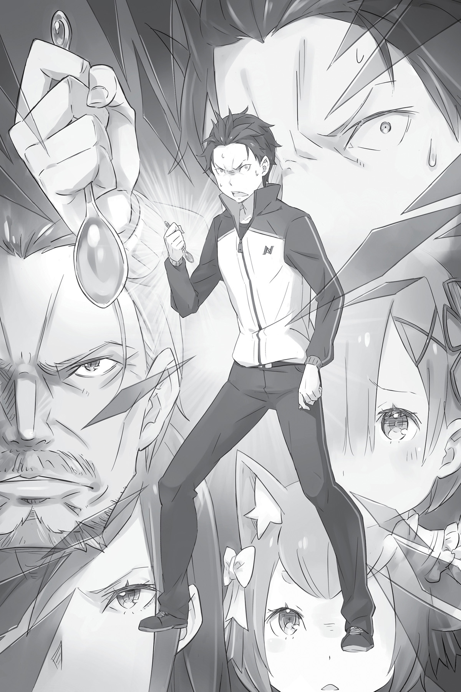

## 1

Для Субару это была уже третья по счёту петля событий, в которой он оказался из-за Посмертного возвращения.

В первую петлю вошли события, связанные с кражей инсигнии, которая случилась в день его призыва в альтернативный мир. Во вторую петлю его втянули зверодемоны, устроившие охоту в поместье графа Розвааля.

— И вот я в третьем круге… Успел уже целых два раза умереть, а чего добился?!

Раньше после очередного Посмертного возвращения Субару удавалось сопоставить все факты и найти выход из, казалось бы, безнадёжного положения. Однако последние две смерти он встретил совершенно неподготовленным. Он так и не разобрался, что именно его убивает и запускает механизм петли. И всё же эти смерти не были совершенно бессмысленными: кое-что важное Субару удалось из них вынести. Нечто несомненное.

— Петельгейзе Романе-Конти…

Вот кто главный злодей, главарь банды ненормальных, Культа Ведьмы, и основная причина несчастий, постигших деревню и поместье… Теперь только желание найти отвратительного безумца и стереть его с лица земли подпитывало Субару энергией и двигало вперёд.

Чтобы вырваться из петли, нужно хорошенько покопаться в глубинах спутанных воспоминаний. А последние две смерти послужат топливом для ненависти, из которой возгорится пламя жестокой мести…

— Сначала надо понять, сколько мне отпущено времени.

Нападение Культа Ведьмы на деревню и особняк произошло за полдня до того, как Субару туда добрался. Однако вторая смерть практически не повлияла на время его прибытия.

— Получается, у меня в запасе пять дней… Или даже четыре с половиной?

Времени оставалось в обрез. От досады Субару стиснул зубы.

А ведь ещё нужно добраться из столицы в особняк. То есть в распоряжении меньше двух дней. И за это время он должен уничтожить Культ Ведьмы вместе с Петельгейзе!

— Ладно, некогда нюни распускать. Надо думать о том, как разорвать этот круг и выйти победителем!

Первое, на что ни в коем случае нельзя закрывать глаза, это убийства в особняке и деревне. Они произошли по вине адептов Культа Ведьмы, поэтому идеальное решение нелёгкой задачи, которую судьба поставила перед ним на этот раз, Субару знал наверняка.

— Я должен прикончить Петельгейзе!

Только расправившись с этим безумцем, с подлым убийцей — первоисточником всех бед, можно предотвратить страшную трагедию. Но для этого потребуется мощная поддержка. Противостоять Культу Ведьмы, который возглавляет Петельгейзе, в одиночку просто невозможно. Боеспособность сторонников Эмилии вызывает большие сомнения. Во всяком случае, Субару не замечал, чтобы у Розвааля, владельца поместья, было личное войско. Возможно, самонадеянный граф считает себя достаточно сильным, чтобы в крайнем случае защитить поместье, но ясно одно: никаких боевых средств у него нет.

— Кстати, а где находился сам Розвааль во время атак?..

Субару не нашёл Розвааля ни в первый, ни во второй раз. Внешний вид графа и его боевое искусство говорили о том, что он блестящий маг. Если бы Розвааль вступил в схватку, в окрестностях особняка непременно остались бы какие-то следы. Однако ничего похожего Субару не заметил.

— Может, Культ Ведьмы специально выбрал время, когда Розвааля не было дома? Иначе выходит, его застали врасплох и либо убили, либо лишили способности драться…

Иными словами, или Розвааль отсутствовал по роковой случайности, или атака была тщательно спланирована.

— Вдобавок я так и не понял, что за чудовище уничтожило особняк…

Субару вспомнил о четвероногом звере, настолько огромном, что он сперва перепутал его со зданием. Вероятно, дыхание, сковавшее льдом всё вокруг, заморозило насмерть и самого Субару. Если это чудище подчиняется Культу Ведьмы…

— Тогда мои дела обстоят ещё хуже…

Адепты Культа, Петельгейзе… и этот повелитель холода, с которым, наверное, тоже придётся иметь дело в самом конце. Что ни говори, противник значительно превосходил Субару по силам, и первым делом требовалось собрать мощную команду.

И юноша знал, у кого он найдёт боевую поддержку!

## 2

Закончив поход по торговым рядам для горожан среднего достатка, Субару и Рем отправились в особняк Круш. Близился вечер, и когда они достигли дома герцогини, небо уже окрасилось в багровые тона.

— С возвращением, господа!

У главных ворот гостей встречал Вильгельм. Пожилой дворецкий, одетый в строгий чёрный костюм, пристально смотрел на приближавшуюся пару. Юноша и девушка шли бок о бок, держась за руки.

— Мастер Субару, хотя ваша легкомысленность простительна, ибо свойственна всем мужчинам, лично я не склонен одобрять такое поведение.

— О чём это вы, Вильгельм, толкуете? Ребёнок просто держится за руку чтобы не потеряться. Правда ведь, Рем?

— Конечно! Субару такой рассеянный! Всё время заставляет меня волноваться. Поэтому я стараюсь не упускать его из виду. Его даже дома нельзя оставить одного!

— Это уже, конечно, преувеличение… — снисходительно заметил Вильгельм.

После обмена шутливыми фразами (хотя в ответе Рем была лишь доля шутки, Субару грустно ухмыльнулся), юноша мельком покосился на ворота.

— Кажется, кто-то ещё пожаловал в гости к леди Круш?

У железных ворот стоял драконий экипаж.

Неброский, сдержанный орнамент, украшавший карету, свидетельствовал, вероятно, о тонком вкусе владельца. Запряжённый в карету земляной дракон блестел красной начищенной чешуёй. Одежда кучера была так же безупречна. Вместо приветствия тот лишь кратко кивнул, не проронив ни слова.

— Вы правы, — подтвердил Вильгельм. — С тех пор как было объявлено об участии госпожи Круш в королевских выборах, к нам устремился нескончаемый поток визитёров, желающих аудиенции. Впрочем, некоторые являются по приглашению самой госпожи Круш.

— Набиваются в друзья потенциальной королеве. От таких гостей хлопот больше, чем проку, — без обиняков заметил Субару.

Вильгельм невольно усмехнулся. Затем лицо старика посуровело. Он пристально поглядел голубыми глазами в лицо Субару, будто хотел что-то рассмотреть.

— Мастер Субару, мне кажется, из города вы вернулись несколько другим. Что-то случилось?

— Со мной? С чего вы взяли? Неужели какие-то два-три часа превратили меня в гламурного красавчика?

— В ваших глазах отражается ужас кровавой драмы. Самой настоящей и подлинной.

— Бросьте, Вильгельм! — Юноша улыбнулся как можно естественней. — Какая такая перемена могла со мной произойти?!

— Боюсь, она всё-таки произошла и была довольно значительной. Смутный огонёк в ваших глазах не мог появиться без веской причины. Я знаю об этом больше, чем кто-либо… — с серьёзным видом кивнул Вильгельм. В его зрачках заиграл доселе неизвестный Субару блеск. Однажды дворецкий тоже испытал боль, за которую нельзя простить обидчика. С тех пор в душе старика горела жажда мести. Наверное, именно поэтому он и разглядел сжигающую Субару ненависть…

— Вы собираетесь… выставить меня вон?

— Вовсе нет. Полагаю, будет лучше, если вы осуществите желаемое. Теперь вы мне нравитесь гораздо больше, чем несколько часов назад!

Вильгельм и Субару обменялись таинственными улыбками. Мужчины ни слова не сказали о том, что было у них на душе, но прекрасно поняли друг друга.

— Субару, мне не нравится выражение твоего лица!

— Хе-хе-хе!.. — зловеще усмехнулся юноша, но тут Рем потянула его за ухо. — Ай, больно же, больно! Оторвёшь ведь!

— Не заставляй меня волноваться, Субару, — озабоченно проговорила девушка, не понимающая сути происходящего.

— Погоди-ка! Чтобы Рем меня о чём-нибудь просила? Я не верю! Но можешь не беспокоиться. Всё будет исполнено в лучшем виде, я уж постараюсь!

Субару обнадёживающе улыбнулся. Он знал, что должен делать. Сомнений не оставалось: нужно расквитаться с тем, кто заслуживает смерти. Понимание задачи успокаивало. Однако озабоченности на лице Рем только прибавилось. Она уже открыла рот, желая что-то сказать, но тут раздался негромкий голос Вильгельма:

— Судя по всему, гость собирается домой.

И правда: на пороге особняка показался мужчина. Он направлялся к воротам. Это был высокий человек с тёмно-русыми волосами, одетый в добротный, со вкусом украшенный, церемониальный костюм. На вид ему было лет тридцать. Похоже, какой-то влиятельный господин.

Оставаясь невозмутимым под пристальными взглядами, он подошёл к воротам и, поглаживая аккуратно подстриженную бородку, произнёс:

— Ах, какие замечательные люди меня провожают!

На его губах показалась мягкая улыбка. Вкрадчивый голос, словно проникающий в самую душу, был спокоен и приятен. Взгляд мужчины, направленный на Субару, излучал доброжелательность, хотя раньше они не встречались. Незнакомец наморщил лоб и сказал:

— Прошу меня извинить. Рассел Феллоу. Рад познакомиться с вами, мастер Субару Нацуки.

— Взаимно. Кстати, позвольте узнать, откуда вам известно, как меня зовут? Анонимность всегда была моим коньком! Если моё имя станет греметь на всю страну, мне и нос показать на улицу будет неловко.

— Слухом земля полнится. Вы тот самый человек, который объявил себя рыцарем госпожи Эмилии, претендентки на королевский трон. Впрочем, далеко не всем известно, что сейчас вы проходите лечение в резиденции госпожи Круш, — добавил Рассел благодушно.

Ответ насторожил юношу ещё больше, а Расселу, похоже, это и было нужно. Определённо, человек не из приятных!.. Повисла пауза, и Вильгельм поторопился нарушить неловкое молчание.

— Мастер Рассел, — обратился он к гостю, — удачно ли прошла ваша беседа с госпожой Круш?

— К сожалению, нет, — Рассел пожал плечами и отрицательно помотал головой. — Госпожа Круш придерживается очень строгих взглядов. И на нас смотрит с ожидаемым презрением. Поэтому убедить её будет непросто.

— Вот оно как… Очень жаль. Если не сдадитесь, получить согласие остальных будет ещё труднее.

— Реальность такова, что, если я получу титул герцога и вас в качестве союзника, остальных претендентов можно будет только пожалеть… Вы всё ещё представляетесь как Вильгельм Триас?

Вильгельм опустил испещрённое глубокими морщинами лицо:

— Полагаю, сейчас с моей стороны было бы слишком дерзко использовать фамилию жены.

— А вы так и остались при своих строгих взглядах! Выражаю восхищение, мне до вас далеко. В любом случае я буду рад оказать поддержку вашему дому, — закончил Рассел их туманный для постороннего уха диалог и направился к драконьему экипажу, стоящему у ворот.

Однако прежде, чем сесть в карету, он обернулся и сказал:

— Если госпожа Круш преуспеет в текущих начинаниях, мы будем только рады. И вы, мастер Вильгельм, тоже сможете воплотить в жизнь заветную мечту. Полагаю, в будущем нас ждут большие успехи.

С этими словами Рассел скрылся в карете. Молчаливый кучер хлестнул вожжами, и дракон, безмолвный, как и его погонщик, на удивление тихо тронулся с места и помчался вдаль.

— Вильгельм, кто это был? — спросил Субару, проводив взглядом драконий экипаж.

Рассел Феллоу. Он управляет казначейством столичной торговой гильдии. Феллоу не просто потомственный торговец, он умелый делец, через которого проходят все законные и незаконные имущественные сделки в столице. Думаю, он знает о вас, мастер Субару, намного больше, чем просто имя.

— Бе-е… — скривился юноша. — Я совсем не в восторге от того, что мной интересуется этот дядя. Лучше бы вместо него была какая-нибудь девчонка.

— Хм… Понимаю, — сочувственно произнёс Вильгельм. — Мастер Рассел был последним посетителем на сегодня, поэтому предлагаю пройти в дом. Мастер Субару, мне кажется, вы хотите о чём-то рассказать.

Видя, как Вильгельм подготавливает почву для разговора, Субару смущённо поскрёб в затылке. Впрочем, нет ничего плохого в том, чтобы сразу расставить все точки над «и».

— Извините, но последним визитёром на сегодня буду я. Мне нужно побеседовать с госпожой Круш. Хочу попросить у неё поддержки.

## 3

— Значит, мой последний посетитель на сегодня — это ты? Неожиданный поворот! — сказала Круш с улыбкой. Герцогиня была в приподнятом настроении. То, что события пошли не по расписанию, её нисколько не расстроило.

Облачённая в мундир, она сидела в глубоком кресле в гостиной, элегантно закинув ногу на ногу, и поглаживала пряди тёмно-зелёных волос. Пристальный янтарный взгляд, казалось, проникал прямо в душу.

Субару пришла мысль, что раньше этот пронзительный взгляд его бы до крайности смутил. Теперь же, когда рядом была Рем, беспокойство, овладевавшее им при встречах с Круш наедине, куда-то девалось.

Позади Круш стоял Феррис. Рыцарь подёргивал кошачьими ушками и недовольно поглядывал на Субару.

— К счастью, ужин ещё не подали. Поэтому ничто не помешает мне выслушать тебя, — сказала Круш.

— Являясь без предупреждения, ты отнимаешь-мяу у госпожи Круш драгоценное время, — заметил Феррис. — Учитывая её великодушие, тебе следовало бы пасть перед ней на колени и горячо благодарить её.

— Не беспокойся. Я не жду благодарности и не потребую, чтобы ты пал ниц, — сказала Круш.

— Не может быть! Госпожа Круш, я восхищён вашим доблестным благородством!

Когда традиционный полушутливый обмен репликами между госпожой и её рыцарем окончился, заговорил Субару:

— Предлагаю перейти к делу. Не думаю, что вы, леди Круш, намерены тратить время на пустую болтовню.

Хотя Субару не решался выкладывать как на духу суть вопроса, он боялся, что уклончивые слова вызовут у герцогини только недовольство.

— Ты сам попросил аудиенции — тебе и говорить первым. Ну, так чего ты хочешь?

Собеседница и правда не собиралась затягивать. Субару облизнул пересохшие губы, сделал глубокий вдох и прямо, без всяких околичностей, выпалил:

— Последователи Культа Ведьмы хотят напасть на владения графа Розвааля. Мне нужна ваша поддержка, чтобы дать им отпор.

Поскольку надеяться на военную мощь Розвааля не приходилось, оставалось искать поддержку на стороне. И Субару знал, что Круш в состоянии помочь.

Все находившиеся в гостиной встрепенулись, и только Круш слегка качнула головой:

— Вот как? Культ Ведьмы?

На её губах появилась кокетливая улыбка, и Субару стало немного не по себе от этой перемены в облике герцогини. Такой реакции он никак не ожидал. Так или иначе, начало разговору было положено. Пытаясь унять бешеное сердцебиение, юноша ждал, что скажет Круш.

— В чём дело? — герцогиня по-прежнему улыбалась. — Почему молчишь? Ты пришёл, чтобы говорить, разве нет?

— Да, но… я уже всё сказал…

— Не думаю, что это всё! Почему тебе нужна поддержка? Что конкретно ты хочешь? И что получу я, если откликнусь на просьбу? Я не смогу принять решения, пока не знаю всех подробностей.

Субару открыл было рот, но так и не нашёлся что сказать. Круш смотрела на просителя скучающим взором. И только тут до Субару дошло, насколько легкомысленно он себя повёл.

— Да, вы правы. Извините. Просто у меня нет опыта подобных бесед, поэтому я… немного волнуюсь…

— Понимать, что ты несовершенен, тоже важно. Не беспокойся. Но имей в виду: наш разговор ограничен моментом подачи ужина. Об этом не стоит забывать.

Продолжая демонстрировать великодушие, Круш не преминула напомнить и о времени. Метод кнута и пряника она использовала мастерски.

— Сперва о сути проблемы… Тут всё просто: нам не хватает боевой мощи. Нас слишком мало, чтобы одолеть членов Культа Ведьмы. Мы не можем отразить нападение.

— Действительно, всё просто. Однако мне кажется, тут достаточно одного графа Розвааля. Он самый сильный воин в королевстве Лугуника. Культ Ведьмы представляет для него не большую опасность, чем… что угодно другое.

— Если бы враг наступал в одном направлении… однако есть загвоздка: атака произойдёт одновременно по двум фронтам, а Розвааль всего лишь один!

Субару не сомневался: Культ нападёт и на особняк, и на деревню. К тому же разбойники, насколько он слышал, предпочитают избавляться от свидетелей. Негодяи могли причинить зло драконьим экипажам или каким-нибудь странствующим торговцам, повстречавшимся на пути.

— Ясно, — вымолвила Круш. — Твои доводы понятны. Однако не халатность ли это хозяина поместья, графа Мейзерса? Обязанность каждого землевладельца — иметь наготове вооружённые силы, способные защитить территорию. Неужели граф настолько беспечен и переоценивает собственную силу? Я была о нём лучшего мнения.

— Вы правы. И всё-таки именно по этой причине мы не в силах дать отпор злодеяниям, которые задумал Культ Ведьмы. Поэтому мне нужна военная поддержка! Требуется численное превосходство!

О том, что Розвааля может вообще не оказаться на месте, Субару решил умолчать. Он невзначай глянул на Вильгельма: старик был одним из тех, кого Субару непременно хотел бы видеть в рядах своего войска.

Круш, вероятно, догадалась, какой смысл был вложен в этот беглый взгляд, и, о чём-то задумавшись, тяжело вздохнула.

— Значит, Культ Ведьмы перешёл к активным действиям…

— Ага, — кивнул Феррис. — Впрочем, мы это предвидели, ведь на политической сцене появился полуэльф в лице госпожи Эмилии.

Субару нахмурился и хотел было потребовать объяснений, но тут его внимание привлекла Рем. Девушка молча сидела рядом, крепко сжав губы, однако Субару ощутил волну ярости, которая исходила от неё. Рем старалась выглядеть бесстрастной, и это выдавало бурю, бушевавшую внутри. Культ Ведьмы, который Рем люто ненавидела, отныне являлся заклятым врагом и для Субару. Нет сомнений: его глаза горели той же ненавистью, что и взгляд Рем.

— Картина ясна, — снова заговорила Круш. — А теперь объясни, почему ты пришёл со своей просьбой именно ко мне? На чём ты основывал свой выбор?

— Признаться честно, я выбрал вас потому, что в нынешних обстоятельствах мне проще всего договориться с вами. Вы оказали большую услугу нам с Рем, и я подумал, что лучшего союзника из претендентов мне не найти.

Ответ на этот вопрос Субару подготовил заранее. На самом деле он знал, что есть и другой потенциальный союзник, с которым было бы относительно просто договориться. Однако сейчас ближе всех оказалась Круш, поэтому юноша и обратился к ней.

— Проще всего, говоришь…

— Да, так и есть. Поэтому я решил…

— Субару Нацуки, позволь поправить тебя, — перебила Круш. На её лице возникла многозначительная улыбка. Герцогиня подняла вверх указательный палец и продолжила: — Похоже, я ввела тебя в заблуждение, приютив в своём доме. Сейчас я его развею.

— Заблуждение?.. Что вы имеете в виду?

— Я обращаюсь с вами как с друзьями. Но Эмилия — мой политический конкурент. Понимаешь? Мы враги.

— Но вы приняли нас как дорогих гостей…

— Потому что заключила соглашение. Моё отношение к вам закреплено в договоре. В особняке вы мои гости, но за пределами этих стен мы, как и прежде, соперники.

В первую свою жизнь в особняке герцогини Субару нарушил соглашение, и Круш объявила его своим врагом. С одной стороны, это показывало, насколько серьёзно она относится к договорённостям. С другой, свидетельствовало об упрямстве и формальном подходе к делам.

— То есть вы хотите сказать, что мне не стоит рассчитывать на вашу помощь?

— Одно с другим никак не связано. Как я уже говорила, Субару Нацуки, если хочешь договориться, тебе следует показать мне выгоды от сделки. Пока что ты просто объявил предварительное условие. Откуда твои сведения, какую пользу принесёт мне участие? Вот что я хочу услышать. Впрочем… — Тут Круш прервала речь и оперлась на подлокотник. — Можешь не объяснять, каким образом узнал про нападение. Как только происхождение Эмилии стало достоянием общественности, мы предположили, что Культ Ведьмы скоро даст о себе знать. Неважно, из надёжного источника твоя информация или является плодом фантазии. В любом случае она похожа на правду.

В том, что Культ Ведьмы активизировался, Круш не сомневалась. Судя по всему, для обитателей этого мира данный факт был очевиден, что было Субару на руку.

— Итак, главная цель переговоров — найти взаимную выгоду. Воспользовавшись моей поддержкой, ты устранишь угрозу в лице Культа Ведьмы. А что получу я? Надеюсь услышать это от тебя.

— Но… но разве спасение людей не…

— Окажись этого достаточно, — перебила Круш, вонзив в него убийственно холодный взгляд, — для тебя это был бы идеальный вариант.

Субару в отчаянии стал подыскивать слова:

— Ну-у… Если вы протянете руку помощи, наш лагерь будет перед вами в огромном долгу…

Однако ответ Круш уничтожил его окончательно:

— Если я приму твоё предложение, — заявила герцогиня, — это будет означать выход Эмилии из гонки за королевский трон. Ты понимаешь?

— Что?! — Субару так и застыл с открытым ртом. Предостережение Круш прозвучало словно гром.

— А ты как хотел? Тому, кто метит на роль главы государства, не подобает в минуту опасности перекладывать ответственность на другого. Если он не в силах защитить людей на своих землях, как же собирается управлять целой страной? Субару Нацуки, позволь мне уточнить ещё вот что.

Она подняла палец и направила его, точно острие кинжала, на Субару.

— Судьба Эмилии сейчас находится в твоих руках. Всё, что ты скажешь, повлияет на её будущее и будет иметь такой же вес, как её собственные слова. Твоё решение должно быть взвешенным. Огласив его, ты не сможешь отказаться от своих слов.

— Э-э…

— А теперь повторю: в данной ситуации услуга лагерю Эмилии будет означать её проигрыш и выход из гонки за престол. Тебя устраивает такой расклад?

Только сейчас Субару начал осознавать, где находится.

Дом герцогини Круш — не место для легкомысленных дискуссий, в которых никто не несёт ответственности. Это арена, где любое сказанное слово может пошатнуть положение многих и даже повлиять на судьбу королевства.

— Но… всё равно…

Слишком поздно он понял, какое бремя возложил на свои плечи. И всё же Субару был готов нести его, стиснув зубы. Если Круш отправит в подмогу Розваалю своих солдат, это приведёт к необратимым для Эмилии последствиям — отказу от участия в выборах. В противном же случае фанатики Культа Ведьмы совершат набег, и трагедия повторится. В голове юноши шла ожесточённая борьба. Чаши весов находились в непрерывном движении. Их скрип отдавался острой болью, мысли сплелись в клубок, и Субару, терзаемый муками, наконец дал ответ:

— Я всё равно хочу, чтобы вы помогли нам!

— Даже если это будет означать отказ Эмилии от участи я в выборах? — помедлив, уточнила Круш.

— Главное — чтобы она осталась жива, — пробормотал Субару понурившись. От собственного бессилия он погрузился в отчаяние. — Если она погибнет, в любом случае всё будет кончено…

Если Эмилия погибнет, это будет крах всех надежд. Утонувшая в крови деревня. Ужасная смерть Рем. Не хватит никакого мужества, чтобы увидеть это снова. Если возможно спасти их жизни, он должен пойти на этот шаг! Каким бы унизительным он ни выглядел со стороны…

— Понятно, — произнесла Круш. — В таком случае дом Карстен никогда не окажет тебе военную поддержку.

## 4

Смысл сказанного дошёл до Субару не сразу. На какой-то миг его взяла оторопь.

— А?..

Сорвавшийся с губ звук имел, конечно, вопросительную интонацию, однако был настолько невнятен, что больше походил на бессмысленный хрип. Тем не менее Круш поняла его правильно. Герцогиня изящно закинула одну длинную ногу на другую.

— Повторяю, — сказала она медленно и отчётливо, будто для того, чтобы у Субару не осталось сомнений. — Мой дом не станет удовлетворять твою просьбу. Мы не будем оказывать содействие Мейзерсу, а следовательно, предоставлять военную поддержку Эмилии.

— Это шутка?.. — Субару показалось, что над ним издеваются. В юноше закипала ярость. — Но… почему?!

— Во-первых, мотив. Да, отказ от участия в выборах станет для Эмилии тяжёлым ударом, с которым ей в конце концов придётся смириться, но для меня это не аргумент. Понимаешь?

— Почему же?! Разве устранение одного из конкурентов — недостаточная компенсация?

— Ты же сам это сказал. Забыл? Выход Эмилии из гонки за престол произойдёт и так, безо всякого участия с моей стороны.

— Что вы… — Субару собирался добавить «хотите сказать», но сразу понял, на что намекает Круш.

— Как ты сам заметил, — продолжила герцогиня, — без посторонней помощи Эмилия не сможет защитить свою территорию, то есть поместье Мейзерса. А значит, игра в выборы для неё окончена. Моего участия здесь не требуется. Однако, если опрометчиво ввяжусь в это дело, другие претенденты подумают, будто я нечестно играю. Как тебе известно, я лидер этой гонки. Попытка устранить конкурента вызовет бурю неприязни со стороны других лагерей, а мне хотелось бы избежать подобного.

Иными словами, Круш могла просто наблюдать за происходящим со стороны, причём безо всякого ущерба для себя. К чему идти на риск и подвергаться опасности?..

Но тогда…

— А как же… люди, что живут в деревне Розвааля?! Бросите их на произвол судьбы?!

Крик Субару встретил ледяной взгляд герцогини.

— Не уходи от темы, Субару Нацуки, и позволь уточнить!

— Угх…

— Свою землю не способна защитить Эмилия! И она же, а никак не я, из-за собственной никчёмности позволит челяди погибнуть.

«Неспособная», «никчёмная»… Эти жестокие слова разили Субару, как удары под дых.

Он хоть что-нибудь должен возразить! Но на ум не приходило ничего, кроме пылких наивных аргументов, бессильных против рациональных доводов Круш.

— Судя по всему, тебе нечего сказать.

Круш бросила взгляд на магический кристалл времени, висящий над дверью гостиной: он испускал желтоватое свечение.

— Уже почти время Земли. Пора ужинать. Мы уложились.

— По… постойте! — простонал Субару, когда Круш уже собиралась подняться.

Для неё разговор был окончен, однако юноша в отчаянии завертел головой по сторонам:

— Вы… вы правда оставите их? Но жители деревни ни в чём не виноваты! Они не заслуживают смерти! — вместо серьёзных доводов с его губ снова слетела жалкая мольба, недостойная мужчины.

Круш обратила на наивного переговорщика усталый взгляд:

— Я уже сказала: это не мои проблемы…

— Вы всё прекрасно понимаете и тем не менее оставите их умирать?! Разве это не подло?! Если у вас есть средства, если вы в состоянии помочь, почему не хотите это сделать?! Неужели несчастные безразличны вам только потому, что это чужие люди?!

— Эй, замолчи-ка и послушай! Тебе не кажется, что…

— Феррис, не надо.

— Но, госпожа Круш! Что он себе позволяет? — недовольно пробурчал Феррис.

— Он демонстрирует храбрость. Не в моих правилах оставлять такие выпады без ответа, — сказала Круш, и рыцарь послушно отступил.

Поглядывая на Ферриса краем глаза, Круш вновь опустилась в кресло и, глубоко вздохнув, задумчиво произнесла:

— Значит, бросая их на произвол судьбы, я поступаю подло?

— Ещё бы! Вы же собираетесь стать королевой! От вас будет зависеть жизнь целой страны! Что же это за монарх, который не может защитить одну-единственную деревню?!

— Позволь развеять ещё одно заблуждение.

Не спуская с неразумного просителя грозного взгляда, герцогиня снова подняла указательный палец и продолжила:

— Объясняя свой отказ, я сказала «во-первых». У меня есть ещё одна причина, которая должна поставить точку.

Итак, была ещё одна причина, по которой Круш оставалась глуха к мольбам Субару и равнодушна к судьбе Эмилии…

— Вторая причина заключается в том, что истории не хватает убедительности!

Эти слова перевернули с ног на голову всё, о чём Круш говорила до сих пор. Они ударили Субару, словно электрический разряд.

— Чт… что?..

— Культ Ведьмы? Да, вполне возможно, что они зашевелились. Их идеи и прежние проделки позволяют сделать такое предположение. Однако проблема в другом.

— В другом?..

— Откуда тебе известно точное место и время следующей атаки?

Круш ткнула в Субару пальцем. Её ледяной, как сталь клинка, голос продолжал:

— Адепты Культа тщательно оберегают свою тайну, и узнать о них что-либо практически невозможно. Тот факт, что они существуют уже сотни лет, несмотря на вред, который успели причинить, говорит сам за себя. Так откуда же ты узнал подробности о дурных намерениях шайки?

— Но вы же… вы же ничего об этом…

— Не считала необходимым. Тебя не удовлетворили мои доводы, поэтому теперь я прошу предоставить аргументы, которые смогли бы меня переубедить. Если ты не в состоянии это сделать, напрашивается только один вывод…

Субару молчал, и Круш высказала свою догадку, произнеся каждое слово медленно и отчётливо:

— А если тебе это известно потому, что ты сам принадлежишь к Культу Ведьмы?

— Что за бред!!!

Сдерживать гнев больше не было сил, и он выплеснулся наружу непроизвольным криком. Но поток иссяк, только успев начаться. И самообладание Субару тут оказалось ни при чём. Дело было в девушке, которая всё это время молча слушала беседу Субару и Круш. Юноша затих потому, что ощутил, как вокруг Рем сгущается недобрый, жутковатый дух.

— Госпожа Круш, не шутите так больше! — проговорила она словно не своим голосом и почтительно склонила голову. — Субару никак не может являться членом Культа Ведьмы!

— Разве? Субару Нацуки не желает поведать нам об источнике своих знаний, поэтому остаётся предполагать, что он с ними заодно. Такой вывод тебе не кажется естественным?

— Не кажется, — чуть помедлив, ответила Рем.

Заметила ли Круш эту секундную заминку? Рем чувствовала исходящий от Субару запах Ведьмы. Девушка поняла, что Круш пытается подловить её, и вовремя остановилась, чтобы не сболтнуть лишнего.

— Как бы то ни было, я не склонна доверять Субару и потому ничем не помогу Эмилии. Впрочем, сдаётся мне, ему никто и не давал полномочий проводить подобные переговоры.

Субару напрягся.

— Несколько минут назад я сказала, что на твоих плечах лежит ответственность за политическую судьбу Эмилии. В действительности это не так. Сейчас от тебя не зависит ровным счётом ничего.

Круш была права. Никто не просил его искать помощи. Возомнив себя защитником, Субару сел в лужу. Замечание герцогини острым лезвием вонзилось в него и порезало на куски беззащитное сердце.

— Сейчас ты не в силах меня уговорить. Ты сам нуждаешься в защите, потому ты и явился сюда, как беспомощное дитя.

Расчётливая и властная герцогиня не проявила ни капли сострадания.

## 5

Ледяной голос и холодный взгляд Круш разрывали его на части. Субару молчал, подрагивая. Он и сам не знал от чего: то ли от гнева, то ли от горя. Было невозможно разобраться в бурлящей мешанине чувств.

— Нет… Я правда… хотел… их всех…

Круш неправа. Считать, что им движет ненависть к Культу, — огромная ошибка. Его чувствами всегда руководило желание помочь другим, разве нет?

Тем не менее Субару не издал больше ни звука.

— В то, во что не веришь сам, не поверят и другие. В твоих глазах я вижу огонь. Безумие? Желание убить? Замечаешь ли ты это, Субару Нацуки? — В суровом взгляде Круш мелькнула жалость. — И это продолжается с тех пор, как ты вернулся в мой особняк.

Субару машинально поднёс руку к глазам, словно хотел нащупать там огонь, о котором говорила Круш. И этот жест служил доказательством того, что герцогиня права.

— Твоя одержимость Культом Ведьмы мне не ясна. Они многим испортили жизнь. Возможно, и тебе. Возможно, твои гнев и ненависть оправданы. Однако к делу это никоим образом не относится.

— Да, я ненавижу их, и что с того?! Они… от них же один вред! Разве не лучше уничтожить всех до единого? Да, я действительно так думаю! Но это не повод выпроваживать меня вон и бросать людей на произвол судьбы!

— Ты опять отклонился от темы, Субару Нацуки. Действительно, моё подозрение, что тобою движет ненависть, не относится к переговорам. Важнее другое: ты, судя по всему, не имеешь полномочий для их проведения! Это ставит под сомнение правомерность твоих предложений.

Юноша закусил губу, выступила кровь.

— Не обладаю полномочиями?.. Что вы имеете в виду? — спросил он, чтобы потянуть время.

Конец диалога будет означать конец переговоров. Сейчас он боялся этого больше всего.

— Если я права и тобою действительно движет ненависть к Культу Ведьмы, напрашивается вывод, что ты изначально использовал Эмилию в своих целях.

— Использовал Эмилию… в своих целях?!

— Никто не сомневался: как только Эмилия вступит в гонку за престол и сведения о её происхождении станут достоянием общественности, Культ Ведьмы, следуя своему учению, что-то предпримет. Идеальный момент, чтобы прижать к ногтю тех, кто не оставляет следов!

— Хочешь сказать, я использую Эмилию как предлог для мести?! — Возмущённый лживыми домыслами, Субару ударил кулаком по столу, что был перед ним.

— Думаешь, подобное поведение добавляет тебе убедительности? Твои глаза горят ненавистью, каждое слово исполнено жаждой крови. И в том, и в другом погрязнуть можно настолько, что уже никогда не отмыться, не говоря о том, чтобы забыть…

«Нет!.. Нет! Нет! Нет! Нет!.. Я вовсе не такой!..»

— При чём здесь ненависть?! Негодяи всё равно останутся негодяями! Они не должны жить! Их надо прикончить! И тогда люди останутся живы! И всё будет хорошо! Мы должны убить эту шайку!!!

— Я уже сказала, Субару Нацуки: в то, во что не веришь сам, не поверят и другие, — последовал холодный ответ.

Субару тяжело дышал, глаза налились кровью. По-прежнему сидя в кресле, Круш, сощурив глаза, смотрела на него снизу вверх.

— Когда ты говоришь, что тобой движут не злость, не жажда крови, не ненависть к Культу Ведьмы, тебе не хватает убедительности.

— По… почему?..

— Сам не видишь? — В глазах Круш читалась печаль: собеседник не понимал очевидных вещей.

Субару в недоумении наморщил лоб. Круш с нескрываемым разочарованием отвела от него взгляд и произнесла:

— Ты ни разу не сказал, что хочешь спасти Эмилию!

— А?..

— Ты говоришь только о том, что желаешь кого-то спасти, защитить неких людей. Со стороны может показаться, что ты искренен, но внутри тебя нет ничего, кроме кипящей злости. Во всяком случае, это совсем не тот Субару Нацуки, которого я наблюдала в тронном зале.

Юноша ошалело водил глазами из стороны в сторону, не осознавая смысла её слов.

«Я не думал о спасении Эмилии?!»

Этого быть не может! Ведь он боролся за жизнь только ради неё, с тех самых пор, как Эмилия спасла его в том злосчастном переулке! Так было всегда! И в тронном зале, и когда дрался на плацу, и сейчас! Если оставить всё как есть, он потеряет и её, и друзей из деревни! Сейчас он просто пытается спасти их!

«Никогда, никогда, никогда ненависть не вытеснит из моего сердца…»

— Дальше я тебя не пущу!

Голос разорвал повисшую тишину и вернул Субару в реальность. Перед ним во весь рост стоял Вильгельм. Старик заслонял собой Круш, его испещрённое глубокими морщинами лицо выражало сочувствие. Но эти исполненные сострадания глаза, глядящие на Субару сверху вниз, почему-то раздражали.

— Субару…

Кто-то вдруг потянул юношу за рукав. Вцепившись в него, Рем глядела на Субару с глубокой печалью.

— Пожалуйста, успокойся. Буяня, ты всё равно ничего не добьёшься. К тому же мне никогда не справиться с господином Вильгельмом.

— Буяня?.. О чём ты, Рем? Я далее не собирался…

— Постой-ка, постой-ка! — вмешался Феррис. — Тогда зачем ты, скажи на милость, вцепился эту ложку? Неужели родители не учили тебя, как надо держать столовые приборы?

Только сейчас Субару заметил, что в правой руке он сжимал чайную ложку. Причём так, словно хотел её во что-то вонзить.

«Когда это я успел…»

— Как правильно заметила Рем, тебе лучше успокоиться, — продолжал Феррис. — Устроишь тут переполох, старик Вил не оставит от тебя и мокрого места. И Рем ничем не поможет.

— Да и мне этого совершенно не по душе, — сказала Круш. — Тем более после того, как ты пробыл здесь несколько дней. Могут возникнуть вопросы политического характера. И я не хочу пачкать ковёр, подаренный отцом.

Несмотря на дерзость гостя, Круш по-прежнему держалась спокойно и уверенно. И это свидетельствовало не только о её благородстве, но и выражало презрение к беспомощности Субару. Излить свой гнев при помощи ложки?! Такое определённо не заслуживало уважения!

Всё это ужасно злило, и вместо извинений с его губ сорвался настойчивый вопрос:

— Значит, ты всё-таки не станешь помогать?

— Да. Я сомневаюсь в правдивости твоих заявлений, а обещанные выгоды меня не прельщают. Поэтому я принимаю роль стороннего наблюдателя.

— Культ Ведьмы уже близко! В таком случае в смерти жителей деревни будешь виновата ты! Ты всё знала, но ничего не сделала. Их убьёт твоя лень!

Произнося любимое слово мерзкого безумца, Субару метнул в Круш ненавидящий взгляд.

— Твои слова звучат высокомерно. Что ж, скажу лишь одно. — Круш поднялась и посмотрела в помутневшие глаза Субару. — Я всегда вижу, лжёт собеседник или говорит правду. И я горда тем, что ещё никому не удалось обвести меня вокруг пальца.

Взгляд герцогини проникал в самую глубь одичавших глаз.

— Исходя из своего опыта, я могу с уверенностью сказать, что ты не лжёшь.

— Но… но тогда…

— Ты твёрдо уверовал в этот вздор, и тебе он кажется истинной правдой. А это уже сумасшествие. Субару Нацуки, ты безумен!

В тот же миг юноша отчётливо осознал, что переговоры завершились. Его плотно сжатые зубы по-прежнему впивались в нижнюю губу. По подбородку бежала струйка крови. Вид у него был жалкий. Наверное, поэтому Круш, наблюдавшая за этой сценой, произнесла:

— Феррис, излечи его.

— Обойдусь! — взревел Субару прежде, чем Феррис вскочил, едва не опрокинув стул.

— Пора ужинать. Присоединишься?

— Вряд ли тебе понравится сидеть за одним столом с сумасшедшим. Возможно, это и доставит кому-то особое эстетическое удовольствие, но, кажется, такое слишком даже для тебя.

Отпустив колкость, Субару развернулся и подошёл к двери. Вслед за ним Рем тоже встала со своего места и, вежливо поклонившись, произнесла:

— Прошу прощения за причинённые неудобства. От имени моего хозяина выражаю вам крайнюю признательность.

— Ты говоришь это от имени графа Мейзерса?

— Да. Мне дали распоряжение следовать любым пожеланиям Субару.

Юноша не понимал, о чём идёт речь. Он стоял спиной к Круш, не видя её лица. Тем не менее Субару заметил толику сожаления в голосе герцогини. С ним она разговаривала куда жёстче, и сейчас это злило.

— Рем, пошли.

Девушка поспешила к Субару, он потянул за ручку двери.

— Кто-нибудь ещё есть на примете? — спросила Круш.

— Постарайся стать хорошей королевой, — не оборачиваясь, процедил Субару. — Диктатором, которому плевать на слабых.

Он вышел, громко хлопнув дверью. На этой печальной ноте переговоры Субару и Круш завершились.

## 6

Когда Субару, бесславно закончив переговоры, выскочил из особняка Круш, сгущались сумерки.

Солнце почти закатилось за горизонт, и жизнь города медленно вступала в ночную фазу. Оказавшись на освещённой кристаллическими светильниками улице, Субару привалился спиной к металлической ограде и с чувством выругался:

— Чтоб вы все провалились!.. Упёртые болваны… Ну почему они не могут взять в толк, что я говорю правду?!

В душе кипела ненависть к тем, кто стоит у него на пути.

Круш не видела эту бойню, эту жестокость. Она не слышала хохот гнусного безумца. Герцогиня не ощутила происходящее на своей шкуре. Вот почему она не понимает: эту банду нельзя оставлять в живых!

— Ладно. Хватит. Забудь о своём провале, забудь об этих бессердечных тварях. Сейчас надо думать о будущем!..

Вместо того чтобы сожалеть о прошлом, следует двигаться вперёд, хотя бы маленькими шажками. Теперь время являлось главным сокровищем, которое не стоило растрачивать впустую.

— Прости, Субару, что заставила ждать, — послышался голос Рем.

Миновав ворота, она оказалась рядом со своим подопечным, который никак не мог унять дрожь в руках, сведённых от злости. Девушка держала саквояж. Бросив на прощание язвительные пожелания и покинув особняк, Субару ждал, когда Рем соберёт вещи и выйдет к нему.

— Извини… Дай мне, я сам понесу.

— Ничего, он не тяжёлый, — решительно сказала Рем и обхватила ношу руками. — К тому же ты ещё не совсем здоров.

При иных обстоятельствах он бы настоял, однако сейчас, когда его мысли были заняты другими вопросами, отступил/

— Кстати, а ты, кажется, была не против покинуть особняк?

— Не против. Ты ведь сам так захотел.

— После всего, что я наговорил, лечения в этом доме мне больше не видать. Не знаю, чем расплатилась Эмилия, но теперь я чувствую себя виноватым…

Увы, очередное доброе дело, совершённое Эмилией ради Субару, пошло псу под хвост. Но юноша успокаивал себя мыслью, что выручит Эмилию из беды, они помирятся, и девушка непременно простит его. А ради этого нужно во что бы то ни стало убить Петельгейзе…

— Субару… То, о чём ты говорил с госпожой Круш…

— Только и знает, что разглагольствовать! Неправдоподобно ей! Невыгодно! Нет в ней ничего человеческого! О чём с такой вообще разговаривать?! С этой выскочкой!..

Вероятно, Рем почувствовала, что Субару не желает возвращаться к болезненной теме, и тут же перевела разговор в другое русло.

— Что будем делать дальше? — озабоченно поинтересовалась она. — Если то, о чём ты говорил, правда, нам нельзя терять ни минуты!

— «Если»?!

— Хм… Нам нельзя терять ни минуты, — повторила Рем, не обращая внимания на вопрос. — Мы вернёмся в особняк господина Розвааля?

Субару покачал головой:

— Нет. Если вернёмся одни, от этого будет мало толку. Мы должны заручиться подмогой тех, кто сможет противостоять Культу. Либо надо придумать какой-то другой план…

Субару понимал: без военной поддержки события пойдут по прежнему сценарию. Наверное, можно было бы выехать из столицы пораньше, чем в прошлый раз, и вернуться в особняк, не рискуя столкнуться по дороге с Культом. Но отразить удар противника своими силами наверняка не удастся.

— У нас мало людей, сражаться некому… И чем только Розвааль занимается?..

Не исключено, что граф мог вышвырнуть нарушителей границ в одиночку. Однако где же был придворный маг в трагический момент? Чем занимался?

— Субару… На самом деле господин Розвааль… Вероятно, его несколько дней не будет в поместье.

— Что?! Ты знала? То есть он планирует куда-то уехать?

— Господин Розвааль решил наведаться к Гарфиэлю… в общем, съездить в один из уголков поместья, — подтвердила его опасения Рем. — Он рассчитывал пробыть там несколько дней.

— Чёрт, как не вовремя! — выругался Субару, дёрнув себя за волосы. — Так вот почему он никак не помешал нападению!

Поскольку поддержки от Розвааля, самого сильного бойца, ждать не стоило, больше надеяться было не на кого. Торопиться в поместье, чтобы прибыть туда раньше Культа Ведьмы, не было никакого смысла.

Вывод напрашивался сам собой.

Рем неотрывно смотрела на своего спутника. Субару кивнул ей:

— Без подмоги мы ничего не сделаем!..

Субару принял решение. Нельзя было терять ни минуты. Трагедии предыдущих кругов жизни не должны повториться, а для этого нужно покинуть столицу не позднее завтрашнего дня. В запасе оставалось меньше двенадцати часов.

— Как ни крути, надо искать другого союзника. Рем, ты хорошо знаешь город?

— Я бывала здесь несколько раз, и мы с тобой в последние дни много где ходили, поэтому более-менее знаю… Но кого же ты хочешь попросить о помощи на этот раз?

— Расскажу потом, сначала определимся с ночлегом. У нас и так времени в обрез. Если завтра не уедем, можем опоздать. Как бы там ни было… подумаю об этом, когда найдём, где переночевать.

Рем не стала возражать. Су бару поднял глаза к небу. На город спускалась ночь, и неспешно приближающийся мрак сулил недоброе. Было нечто гнетущее в этой медлительности, словно небо хотело сказать Субару: ничего хорошего ждать не стоит…
