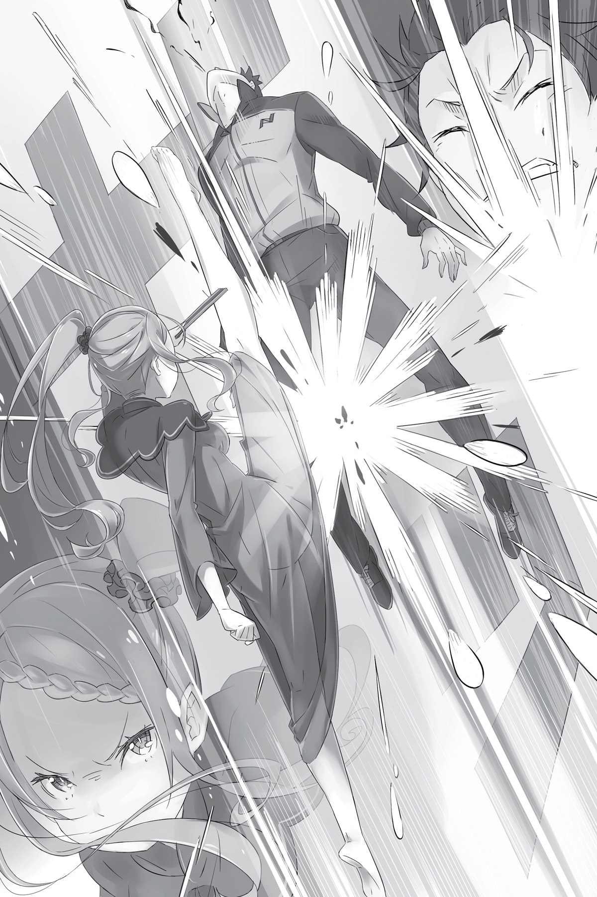
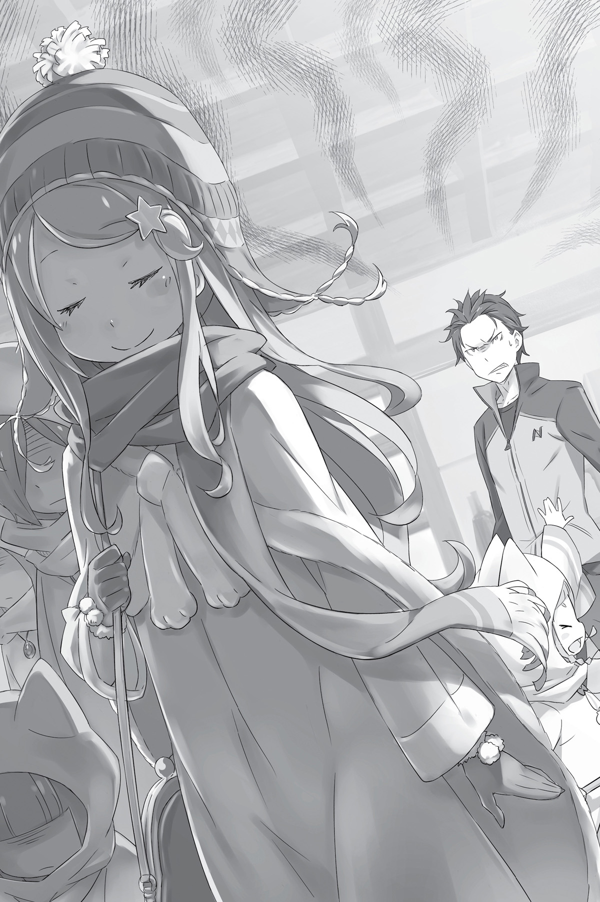

## 1

— Быть может, по мне и не скажешь, но книги я люблю, — произнесла девушка.

Она сидела в роскошном кресле, положив одну руку на подлокотник, а второй придерживая изысканно переплетённую книгу. Её глаза скользили по строчкам раскрытого примерно на середине тома. В эту минуту она производила иное впечатление, нежели в прошлую их встречу.

На девушке была тонкая красная ночная сорочка, плечи покрывал красный же платок. Она нисколько не стеснялась, демонстрируя пышные формы мужчине. Вид она имела такой, словно и не замечала его вовсе. Казалось, ей было совершенно не до посетителя — настолько она увлеклась чтением.

Субару вдруг осознал, что уже некоторое время не может оторвать взгляда от импозантной особы. Девушкой, чей тонкий белый пальчик скользил по буквам, а глаза неотрывно смотрели в текст, хотелось любоваться вечно. Субару не мог сказать с уверенностью, что именно в ней так его привлекало.

Он продолжал топтаться кедами по ковру, не зная как быть дальше. Хозяйка пустила его к себе, но гость её совершенно не интересовал. Девушка произнесла одну-единственную фразу, когда тот попытался начать разговор.

«Неужели придётся ждать, пока она дочитает? Сколько ж мне так стоять?» — размышлял юноша, пытаясь прогнать опасения, но в ответ лишь тихо шелестели страницы. Он понимал: с её положением и в самом деле легко быть невежливой.

Огненно-рыжие волосы и малиновые глаза, которые, казалось, способны испепелить всё, на что упадёт взор. Бледная полупрозрачная кожа и обольстительные формы — она могла очаровать любого мужчину! Хотя её привлекательность и была сродни яду, устоять перед красотой этой особы, склонившей голову над книгой, было невозможно. Каким же великим благоволением небес она пользовалась, если была способна влюбить в себя кого угодно?..

Присцилла Бариэль. Претендентка на королевский трон. Следующая, кого Субару собирался просить о помощи.

## 2

Узнав о том, что Райнхарда, последней его надежды, нет в столице, Субару впал в уныние. Пока Рем искала ночлег, юноша наведался в резиденцию семьи Астрея, оставшуюся под присмотром пожилой супружеской пары. Радушно встретив нежданного гостя, они внимательно выслушали его, однако ответ был неутешительным:

— Не далее как два дня тому назад молодой господин вместе с госпожой Фельт отбыли в родовую усадьбу. Если угодно, мы сообщим господину о вашем прибытии.

Именно об этом и говорил Райнхард, когда заезжал в особняк Круш. Субару понимал, что едва ли застанет его здесь, но всё-таки решил испытать удачу. Однако надежда не оправдалась. Связываться с рыцарем не было смысла: путь из столицы в его фамильную усадьбу, а оттуда — в особняк Мейзерса неизбежно займёт уйму времени. Об участии Райнхарда в борьбе с Культом Ведьмы можно было забыть.

Попрощавшись, Субару пошёл прочь.

— Что Розвааль, что Райнхард… В самый нужный момент их нет на месте!

Удалившись от резиденции Астрея на приличное расстояние, Субару впал в отчаяние. Всё в этом круге жизни шло наперекосяк. Возможные кандидаты в союзники устранились — впору хвататься за голову! Как жаль, что Посмертное возвращение не отправило его в тот день, когда Райнхард ещё был в столице!..

— С этим ничего не поделаешь… Думай, думай, думай, думай! У меня нет ни сил, ни союзников, ни времени — ничего! Остаётся только шустрее шевелить извилинами…

Субару изо всех сил напряг мозги в надежде отыскать выход. Если исключить Круш и Райнхарда, выбирать не из кого. Учитывая исход переговоров с герцогиней, обращаться за помощью к рыцарям королевства было бессмысленно. К тому же теперь Субару испытывал к ним недоверие.

Когда Круш, с которой, как он считал, наладились хорошие отношения, отвернулась от него, в душе Субару стали роиться сомнения и страх. И они мешали положиться на кого бы то ни было. Не замечая, как ограничивает себя в выборе, Субару решил, что может рассчитывать лишь на двух людей. Но один из них был «достойнейшим» рыцарем, которого он ненавидел больше, чем всех рыцарей вместе взятых. Не могло быть и речи, чтобы склонить перед ним голову.

Таким образом, оставался один кандидат.

— Субару, что ты собираешься делать? — озабоченно спросила Рем, когда они снова встретились. Глубокая задумчивость на его лице порядком встревожила девушку. — Знаешь, я…

— Не волнуйся, Рем, — перебил Субару. — Положись на меня. Я что-нибудь придумаю. Тебе не надо ничего делать. Просто будь рядом, этого достаточно.

Он слабо улыбнулся и вновь погрузился в раздумья. Ни в коем случае нельзя допустить, чтобы Рем оказалась на острие атаки. Если понадобится, эта девушка без колебаний отдаст за него жизнь. Он будет защищать Рем до конца. Это его долг. Однажды Субару уже выручил её из беды, и теперь она была к нему сильно привязана.

Ему нельзя терять Рем. Он должен действовать самостоятельно. Если не удастся защитить её, спасение Эмилии и жителей деревни не будет иметь никакого смысла. Так же, как и месть Петельгейзе…

— О чём это я…

От неожиданной мысли повеяло опасностью. Субару коснулся пальцами висков. Неужели расправиться с Петельгейзе для него важнее, чем спасти Эмилию?.. Не это ли имела в виду Круш?

— Всё нормально. Я прав. Я поступаю правильно. Собираюсь… поступить… — твердил он, укрепляясь в своих намерениях. Отрицая очевидное, он мысленно закрывал крышкой бездонный колодец ненависти, из которого черпал силы.

Иначе Субару просто сошёл бы с ума.

## 3

Наутро Субару и Рем снова отправились в квартал аристократов, чтобы испытать судьбу. Эту часть столицы составляли роскошные дома, в которых жили высшие слои общества. Великолепный особняк, у которого остановились Субару и Рем, был, без сомнения, элитным. По своему великолепию и роскоши он даже превосходил ожидания.

— Сразу видно, чей это дворец, и спрашивать не надо…

Разинув рот, Субару с восхищением глядел на строение, блеск и пышность которого заметил ещё издалека. Крыша особняка сияла золотом в утренних лучах солнца, стены украшали изящные резные узоры. Окна были отделаны лепниной, а сад уставлен множеством каменных изваяний, напоминающих произведения авангардного искусства.

Демонстрация всего этого богатства была на редкость вызывающей и в превосходной степени отражала характер владельца. Дерзость, с которой хозяин особняка заявлял о себе, не могла не вызывать сардоническую усмешку.

Спутники застыли у ворот и всё разглядывали фасад дворца. Уж насколько невозмутима была Рем — и та не сумела скрыть изумления. Если владелец преследовал цель ошеломить гостей, ему это в полной мере удалось.

— Только не говори, что всю эту красоту навёл предыдущий хозяин. Мне её жаль… — с иронией заметил Субару.

— И не собираюсь, — усмехнулся человек по ту сторону ворот. — Таковы вкусы Принцессы. Строили впопыхах: бедолаги работали круглые сутки, зато потом их закидали мешками с золотыми монетами, так что никто не жаловался.

— По-моему, было бы гуманнее использовать для этого пачки банкнот, а то как-то травмоопасно.

Вместо ответа человек просунул толстый палец в щель под своим чёрным железным шлемом и почесал затылок. Одет он был просто — как разбойник с большой дороги, и производил впечатление легкомысленного балагура. В общем, вид имел эксцентричный, но, пожалуй, более всего в глаза бросалось то, что у него отсутствовала левая рука.

Это был Ал, спутник особы, к которой пожаловали Субару и Рем. Ал называл себя наёмником и являлся соотечественником Субару, также призванным в альтернативный мир. Может, именно потому он питал к юноше симпатию и встречал ранних гостей как дорогих друзей.

— Ну, и что тебя привело сюда ни свет ни заря? Ты же знаешь, у меня низкое давление, поэтому по утрам я как варёная спагеттина. Если хотел пригласить меня перекусить, боюсь, а пас.

— Сейчас мне не до ресторанов! — сказал Субару. — Я хочу поговорить с госпожой Принцессой.

— Принцессой?

О выражении лица, скрытого чёрным шлемом, Субару приходилось только догадываться. Юноша поёжился, словно в спину подул холодный ветер. Наконец Ал произнёс:

— А, так ты привёл нам новую служанку! Хорошо, я доложу.

— Ещё бы я такой ерундой занимался. У вас что, своих слуг не хватает?

— О, да ты не знаешь Принцессу! Наша раскрасавица, какой она себя считает, не держит в доме ни одной служанки. Только мальчишка-дворецкий — и всё.

— Видать, та ещё вредина. Я был о ней лучшего мнения. Ладно, доложи, что мы пришли.

— Ага, — вяло буркнул Ал и поплёлся в особняк.

Стоя в шаге от Субару, Рем за весь их диалог не проронила ни слова, сохраняя невозмутимое выражение лица. Волнение девушки выдавали только пальцы, робко трогающие Субару за рукав. Юноша был бы рад успокоить её, но не мог, поскольку тревожился ничуть не меньше.

— Похоже, раннее утро — не лучшее время для визитов… — вздохнул Субару. — Да ещё и без предупреждения. Сейчас начнёт бухтеть, что не даём ей выспаться…

— Эй, хозяйка не против принять вас, — донёсся с порога весёлый голос Ала.

Ответ, столь же быстрый, сколь и неожиданный, ввёл Субару в ступор.

— Как-то слишком легко она согласилась…

— Может, тебя это удивит, — усмехнулся Ал, — но Принцесса ранняя пташка. Зато вечером, стемнеть не успевает, она уже на боковую. Ну, заходите.

С этими словами Ал сделал гостям знак следовать за ним.

Интерьер особняка оказался не менее впечатляющим, чем экстерьер. В холле стояли дорогущая на вид мебель и предметы искусства, их то и дело приходилось огибать, чтобы продолжить путь. В убранстве, каждая деталь которого, вплоть до светильников и картинных рам, была выполнена из благородных металлов, чувствовалась болезненная тяга к роскоши.

— Поначалу аж в глазах рябит, — сообщил Ал. — Но ничего, привыкаешь. Утром ещё ладно, а вот вечером по этому холлу и пройти страшно!

— Ты же не дитя малое — тёмных коридоров бояться! Вполне взрослый дядя.

— Видел бы ты, как по ночам сверкают глаза у статуй!

— Это говорит о том, что у твоей хозяйки с головой не всё в порядке!

Подняв голову, Субару заметил, что у изваяний, шеренги которых тянулись по обе стороны прохода, в глазницы вставлены камни, с виду драгоценные. Видимо, они и светились во мраке. Покупатель, как и автор этих предметов искусства, явно был не от мира сего.

Шагая позади мужчин, Рем настороженно потягивала носом и безотрывно глядела в спину человека в шлеме, словно её исключительный нюх уловил нечто подозрительное. Вскоре путешествие нескладной троицы по особняку закончилось.

— Принцесса находится на верхнем этаже. — Ал указал большим пальцем вверх по лестнице. — Её роскошная комната занимает чуть ли не весь этаж.

— Типа президентского номера, что ли? Нам можно подняться?

— Только тебе, брат, — загадочно произнёс рыцарь.

Субару обратил на него тревожный взгляд.

— Нет-нет, я не хочу никого обидеть! Просто Принцесса готова встретиться лишь с тобой. А барышня подождёт в комнате для гостей.

— Думаешь, я спокойно доверю её тебе? Ты же только что жаловался на нехватку слуг!

— Не беспокойся, я буду ожидать тебя у входа в покои Принцессы. А твою спутницу, хотя и с большим сожалением, доверю Шульту.

Ал щёлкнул пальцами, и на верхней ступени лестницы возник мальчик со светло-розовыми кудрями и красными глазами. Для его описания более всего подошёл бы эпитет «прелестный». Изящную фигурку мальчика украшала форма дворецкого, а лицо было исполнено преданности служебному долгу — таким неестественно строгим и серьёзным оно выглядело.

— Ты уж будь с нашей гостьей поделикатнее, — проговорил Ал, хлопнув мальчика по плечу.

— Хорошо, можете не сомневаться, — с готовностью отозвался дворецкий Шульт и жестом пригласил Рем следовать за ним.

Девушка растерянно посмотрела на Субару.

— Извини, — сказал он, — но тебе лучше дождаться, когда я закончу переговоры. По идее, все скользкие личности, включая этого дядьку в шлеме, должны собраться на верхнем этаже особняка, так что не волнуйся и чувствуй себя как дома.

— Обидно, когда тебя называют скользким! Обычно про меня говорят «подозрительный».

Оставив замечание Ала без внимания, Субару погладил Рем по голове, чтобы успокоить.

— Хорошо, — сказала она понурившись, а затем приблизила губы к уху Субару и шёпотом добавила: — Только будь осторожен с этим человеком. — И покосилась на Ала.

Рыцарь не вызывал у неё доверия.

— Ладно, понял. — Субару кивнул.

В глубине души ему хотелось верить земляку, но на Рем, само собой, он полагался больше. В конце концов, он пребывал на вражеской территории.

Рем улыбнулась ему, последовала за мальчиком-дворецким и вскоре исчезла в глубине коридора.

— Фиу, — присвистнул Ал. — Ты, брат, не промах. Она так и заглядывает тебе в глаза!

— Если уж взялся, свисти нормально. Или не можешь при мне?

От свиста Ала у Субару по спине побежали мурашки. Он с горечью вспомнил свои безуспешные попытки научиться свистеть.

— Просто у меня с губами проблема. Не могу свистнуть как следует.

— А, понятно… Тогда извини.

Ответ Ала несколько обескуражил юношу, и он решил оставить эту тему.

— Конечно, жаль, что пришлось отправить барышню в другую комнату, но навлечь на себя гнев Принцессы — ещё хуже. Так что давай-ка шустри наверх.

— Чем быстрее поговорим, тем лучше. Кстати, какое у Присциллы сейчас настроение? — Субару боялся, что расположение духа этой особы может серьёзно повлиять на итог.

— Хм… ни хорошее, ни плохое. Но ты на её настроение особо не рассчитывай. Оно нестойко, как погода: может поменяться в любую минуту. Никогда не знаешь, что у неё на уме. Так что в крайнем случае импровизируй и проявляй смекалку.

— То есть второго раунда не будет, — подытожил Субару. — С импровизацией у меня никогда не складывалось…

Субару поднялся по лестнице и остановился перед богато декорированными дверьми.

— Вот здесь и находятся её покои. Меня никто не приглашал, так что подожду тут, а ты иди.

Ал присел на ступеньку. Вид у него был в высшей степени беззаботный. Рыцарь вытащил из болтающихся на поясе ножен меч и положил его на колени.

— Постарайся не испортить ей настроение, ладно? — попросил Ал. — Если разозлится, пеняй на себя. Когда Принцесса не духе, в её голове возникают всякие сумасбродные идеи, от которых я уже устал.

— Не хочу тебя расстраивать, но я сам пришёл сюда с весьма сумасбродной идеей, — сухо ответил Субару. Затем он сделал глубокий вдох и толкнул дверь.

## 4

Так Субару оказался лицом к лицу с Присциллой.

Принцесса сидела в глубине просторного зала в кресле, стоящем на некотором возвышении, и читала книгу, перелистывая страницы элегантным движением. На Субару она даже не взглянула.

Юноша топтался на месте уже несколько минут, не зная, с чего начать. Нетерпение и замешательство охватывали его всё сильнее.

— Итак…

Раздался внезапный хлопок — Присцилла закрыла книгу. От неожиданности Субару вздрогнул: казалось, хозяйка хотела показать, как он слаб. Субару скрежетнул зубами. Принцесса не удостоила его и взглядом.

— Скучно, — произнесла она, медленно проводя пальцем по обложке.

— А мне показалось, ты была весьма увлечена чтением.

— Погружаться в книгу с головой — лучший способ чтения, — пояснила девушка. — А затем, по завершении, можно будет сказать, что ты из неё извлёк. Утверждать, что книга скучна, даже не прочитав её, могут только глупцы!

По-видимому, Присцилла была заядлым книгоманом. Внезапно она подбросила книгу в воздух.

— Ах!

Субару был изумлён: книга внезапно вспыхнула! Яростное пламя в мгновение ока превратило её в горстку чёрного пепла, закружившегося в воздухе.

— По твоей милости я вынуждена прервать утреннее чтение. Надеюсь, дело, с которым ты пришёл, заинтересует меня сильнее, чем эта книжка…

На лице Присциллы возникла неприятная ухмылка. Она кокетливо закинула ногу на ногу и, вытянув руку, направила тонкий белый пальчик на посетителя. В лицо Субару ударила волна жара.

— Я по поводу Эмилии, — зашевелил он пересохшими губами, — такой же, как и ты, кандидатки на престол. Я хочу попросить у тебя помощи, чтобы справиться с тяжёлым положением, в котором она оказалась.

Присцилла молча ждала продолжения. Чувствуя, как под пристальным взглядом красных глаз тает присутствие духа, Субару изо всех сил сосредоточился на подготовленной речи. Чтобы поведать всю историю, потребовалось несколько минут.

— Культ Ведьмы, говоришь? Хм… — Присцилла прикрыла веки. Одна её рука подпирала подбородок, а пальцы другой постукивали по колену.

— Да, Культ Ведьмы. Если ничего не предпринять, пострадает не только Эмилия. Банда доставит неприятности многим. Я собираюсь покончить с ними до того, как это случится! Поэтому и хочу, чтобы ты…

Внезапно раздался сдавленный смешок. Присцилла смотрела в пол, её плечи вздрагивали. Субару пришёл в замешательство, но тут Принцесса резко вскинула голову и разразилась хохотом:

— Ха-ха-ха-ха! Вот смех! Ты такой забавный! И впрямь развеселил меня, причём гораздо сильнее, чем книжка! Высшее мастерство шутовства! Надо же, додуматься до такого!

Присцилла хохотала. Её улыбка напоминала свирепый, хищный оскал. Оскал кошки, в лапы которой угодила неосторожная мышь.

— Что же здесь смешного?!

— Самое забавное, что ты даже не понимаешь! Брось, неужели не видишь, насколько несуразно ты сейчас себя ведёшь?!

Присцилла наматывала оранжевые локоны на палец и заливалась весёлым смехом. Она говорила так, словно видела Субару насквозь. Ему была знакома эта манера речи. Похожим образом, словно желая выставить на посмешище, с ним не раз обращались в доме Круш.

— Не знаю, может, тебе и правда больше некого просить о помощи, но, раскрывая чужому лагерю слабые стороны собственного, ты помогаешь врагу. Только безнадёжный болван станет говорить: то да сё, нам нужна поддержка, мы в беде, выручите нас, пожалуйста!.. — потешалась Принцесса, постукивая пальцем по виску.

Субару допускал, что его могут встретить холодно, но такого издевательства даже представить не мог.

— Тебе плевать, что ты смешон? Дело хозяйское. Но нельзя же быть таким наивным! Желая помочь, ты ставишь союзника в неловкое положение и подыгрываешь сопернику. Это называется медвежья услуга. Горбатого могила исправит. Уж лучше б тебя убили!

Присцилла поднялась и, шагнув с возвышения, приблизилась к Субару.

— С удовольствием снесла бы тебе голову с плеч!

В следующее мгновение Присцилла выхватила из-за пазухи складной веер и легонько ткнула им Субару в область сонной артерии. Приём был исполнен мастерски: юноша даже не сообразил, в чём дело.

Хотя веер и не являлся холодным оружием, Субару живо понял, насколько быстро может лишиться головы. По спине побежал холодок.

— Даже не успел заметить? — произнесла Присцилла со скучающим видом и убрала веер. — Ты не просто наивен, но ещё и непроходимо глуп, а значит, тебе уже ничто не поможет. Однако меня восхищает, что ты предан хозяйке, хотя она весьма сурово с тобой обошлась. Поэтому…

Не сводя с Субару прищуренных глаз, Принцесса со щелчком раскрыла красный веер и спрятала за ним лицо.

— Думаешь, я просто посмеюсь над тобой и выгоню вон? Нет, я дам тебе шанс.

— Шанс?..

— Да, шанс. Считай, тебе подфартило. Кажется, так говорят? — неуверенно произнесла Присцилла. Должно быть, это сленговое словечко она услышала от Ала.

Затем она сложила веер и направила его в Субару. Веер медленно приближался к голове юноши, но тот отчего-то был не в силах уклониться. Наконец кончик веера уткнулся ему в лоб, и Субару шлёпнулся на пятую точку.

— Лижи! — приказала Присцилла, скинув туфлю и сунув голую ступню ему под нос.

Субару оторопело, словно пытаясь сообразить, чего Присцилла хочет, переводил взгляд с её лица на ступню и обратно. Глядя сверху вниз, Принцесса снова заговорила. Голос был ласков, словно она увещевала непослушное дитя, и в то же время жесто́к, как если бы она обращалась к рабу:

— Встань на четвереньки, прочувствуй позор и унижение и лижи мою ногу. Припади к ней, как грязная бездомная псина, как младенец, сосущий молоко матери. И тогда я подумаю над твоим предложением.

— Что?!

— Тебя никто не заставляет. Если хочешь сохранить жалкие остатки гордости и готов ради этого отказаться от своей обожаемой госпожи, будь по-твоему. Меня позабавит любой расклад.

Присцилла хихикнула, прикрывая рот ладонью. Она откровенно издевалась над Субару. Внутри юноши бурлил гнев. Однако в последний миг он сдержал рвущийся наружу крик негодования. Если даст волю эмоциям, переговоры снова провалятся.

Субару оторвал взгляд от ноги, которую Присцилла по-прежнему держала у него перед носом, и посмотрел на ехидную ухмылку. Закрыв глаза, юноша вспомнил Эмилию, Беатрис… В сознании одно за другим проносились лица деревенских жителей, детей и взрослых. Кипящая внутри магма постепенно остывала.

Наконец он произнёс:

— Хорошо…

Преодолевая стыд, Субару стал на колени и взял в руки ступню Присциллы. Разве унижение, которое он сейчас испытывает, может сравниться с предсмертными муками, выпавшими на долю Эмилии и жителей деревни? Он готов изображать кого угодно, хоть пса, если это спасёт их жизни. Он приблизил дрожащие губы к бледной ноге, но за миг до того, как прикоснуться к соблазнительной коже…

— Да, теперь я вижу: ты действительно дрянной, ни на что не годный мальчишка!

Прямой удар ногой в лицо подбросил его в воздух, как пушинку. Субару перевернулся через голову и закувыркался, не чувствуя ни верха, ни низа и совершенно не понимая, что произошло.

Ощущение полёта, возникшее после сокрушительного удара по голове, прервалось, когда он врезался во что-то твёрдое. Спустя пару мгновений туман в голове рассеялся, Субару осознал, что лежит на полу, раскинув руки и ноги. Из носа струилась липкая жидкость.

— Это не преданность и не лояльность. Я вижу мерзкую собачью покорность и свинячью жадность. Ленивую свинью, которая хочет только брать. Как же она отвратительна!

В голове непрерывно звенело, а тошнота грозила вывернуть нутро. Откуда-то доносился голос Присциллы, но суть слов не проникала в сознание.

— Даже если вы устраните Культ Ведьмы, лагерь, приютивший такую свинью, как ты, будет уязвим, и я с лёгкостью сотру его в порошок! Именно твоё неразумное поведение сподвигло меня на такое решение.

Присцилла схватила Субару за грудки и резко приподняла верхнюю часть туловища.

Кровь из носа юноши пошла ещё обильнее, и он закашлялся. Холодный голос раздавался совсем рядом.

— Ты ведёшь Эмилию прямиком к гибели. Можешь гордиться собой. — С этими словами Принцесса со всей силы швырнула его к выходу.

Субару проехал по полу и замер у двери.

— Альдебаран! — прокричала хозяйка. Похоже, сам посетитель был ей куда неприятнее, чем оставленные им кровавые следы.

В ответ открылась единственная дверь, и в проёме появилась голова Ала.

— Матерь Божья, что с тобой стряслось?.. — воскликнул он, глядя на окровавленного приятеля.

— Вышвырни это ничтожество! Или убей, мне всё равно.

— А мне очень даже не всё равно… Пошли, брат.

Не смея перечить разгневанной хозяйке, Ал взвалил Субару на плечо и поспешил вон. Однако уже на ходу он обернулся и негромко бросил:

— Не надо так сердиться, Принцесса. Свирепое выражение тебе совсем не к лицу.

— Избавь меня от него, если не хочешь, чтобы я ещё больше изуродовала твою и без того мерзкую физиономию! Повторять не буду, Альдебаран!

— Просил же не называть меня этим именем! — бросил напоследок рыцарь и поспешил закрыть дверь. — Тебе лучше делать ноги, и как можно скорей! — посоветовал он Субару, болтавшемуся на плече. — Принцесса может в любую секунду передумать и приказать отрубить тебе голову. Так что беги, пока не поздно.

— А… у-у… — промычал Субару в полуобмороке.

— Погоди, не сейчас. Потом, когда окажемся на улице. Нужно ещё позвать барышню, твою спутницу, — сказал Ал и во всю прыть помчался вниз по лестнице.

## 5

— Субару!

Увидев юношу, который сидел на земле, обессиленно привалившись к воротам особняка, Рем переменилась в лице и тут же бросилась к нему. Девушка коснулась его рукой, чтобы оценить, насколько серьёзны раны, и принялась залечивать их исцеляющей магией. Ссадины и синяки на лице Субару окутало бледное сияние.

— Что там случилось, наверху?

— То самое. Похоже, он испортил настроение нашей Принцессе. А ведь я предупреждал… Хотя угадать, что на уме у кошки, нереально, — проговорил Ал печально. Однако виноватым себя он, судя по всему, не считал.

Возмущённая его словами, Рем открыла было рот, чтобы сказать всё, что думает, как…

— Нет… не надо…

— Субару! Ты в сознании?

Благодаря исцеляющей магии, Субару понемногу приходил в себя. Услышав его голос, Рем просияла и, закрыв глаза, ещё сильнее сосредоточилась на лечении.

— С тебя и вправду нельзя глаз спускать, Субару. Даже часа не прошло, а ты вернулся весь израненный!

— Я же не специально…

Из ноздрей снова побежали алые струйки. Юноша машинально поднёс руку к носу, чтобы остановить кровь, и тогда Рем вытащила из-за пазухи салфетку и аккуратно приложила к его лицу.

— Подержи вот так. Кровь остановится. А я продолжу лечение.

— Ладно…

Субару прижал салфетку к носу и погрузился в мягкий поток исцеляющей маны.

— Похоже, ты скоро придёшь в норму, — кивнул Ал, глядя на них. — Стоять тут смысла нет, так что я пойду. Уж не знаю, о чём вы беседовали, но, судя по всему, разговор не удался. Если задержусь, боюсь, брат, Принцесса и вправду прикажет порубить тебя на шашлык.

— Порубить Субару?! — Глаза Рем округлились.

— Расслабься, сестричка! Пока не приказала. Поэтому бегите отсюда сломя голову. У меня самого, знаете ли, нет желания заниматься этим. Ладно, брат, береги себя, — добавил рыцарь, склонившись над Субару. — И ты, барышня, тоже… Кажется, тебя Рам звать? Позаботься об этом парне.

— Рам — имя сестрицы, — поправила Рем, когда Ал, попрощавшись, повернулся к ним спиной. — А меня, господин Ал, зовут Рем.

Ал остановился.

— Рем?..

Рыцарь медленно обернулся.

— Да ладно! Разве не Рам?

— Нет. Меня зовут Рем, — повторила девушка. — Прошу прощения, господин Ал, но откуда вы знаете сестрицу? — Рем решила, что Ал спутал её с сестрой, ведь они были похожи как две капли воды.

Ответа не последовало. Ал поднял единственную руку, коснулся шлема и постучал пальцами по металлической поверхности.

— Эй, это что же получается?

В голосе Ала читалось беспокойство, похоже, он не верил своим ушам. Будто в подтверждение этого, пальцы барабанили по шлему всё быстрее.

— Эта барышня — Рем, а Рам — её сестра…

— Да, именно.

— Извини за такой вопрос, но… твоя сестра жива?

— Не понимаю, с какой целью вы об этом спрашиваете… Разумеется, сестрица в добром здравии.

В тот самый момент, когда Рем произнесла эти слова, Субару ощутил, как по телу побежали мурашки.

— Ерунда какая-то…

Тихий, холодный голос отозвался в ушах громовым раскатом.

Ал почёсывал шлем в районе лба и, немного ссутулившись, что-то вполголоса бормотал. И тут Субару наконец уловил дурной, зловещий холодок, исходивший от рыцаря.

Инстинкт бил в набат: нужно бежать! Рем, видимо, ощущала то же самое. Девушка прервала лечение и, не вставая с колен, придвинулась к Субару.

— Сможешь опереться на моё плечо и встать? — спросила она, обеспокоенно поглядывая в сторону Ала.

Субару кивнул и, набрав в грудь воздуха, поднялся на ноги, держась за девушку.

— Спокойно. Я ничего вам не сделаю.

Ал покачал головой, и зловещий холодок рассеялся. Субару невольно издал вздох облегчения. Даже напряжённое лицо Рем стало чуть спокойнее.

— Извините, что заставил понервничать, но вам нужно поскорее уходить. Думаю, вы и сами поняли, что я не в лучшем расположении духа.

— Хорошо. Передайте, пожалуйста, что мы благодарны за уделённое время.

— Ладно, сделаю. Бывайте.

Попрощавшись с рыцарем, Рем медленно зашагала прочь от особняка Бариэль, поддерживая своей изящной фигуркой Субару.

— Что за глупости?! Не может такого быть… Меня уже тошнит от этого, — процедил рыцарь, не отрывая от них пристального взгляда до тех пор, пока два силуэта, спустившись по склону, не скрылись из виду.

## 6

Теперь, когда переговоры с Присциллой Бариэль провалились, последняя надежда обрести союзника растаяла.

— Неужели мне так и не удастся найти военную поддержку?.. — вздыхал Субару, прижимая ладонь к носу и чуть не плача от бессилия и отчаяния.

Только что перевалило за полдень. На беседу с Присциллой он потратил полдня драгоценного времени. До запланированного отправления из столицы оставалось всего несколько часов. Запас времени таял на глазах.

Стоит ли говорить, что Субару не только не приблизился ни на шаг к цели, но стал ещё дальше от неё?..

— Эта чванливая тварь даже забыла, как я её выручил!

Подумав о том, как в первую их встречу вывел Присциллу из окружения злодеев, Субару поморщился от досады. Что Принцесса не испытывает благодарности, сомневаться не приходилось, но то, как она обошлась с юношей в особняке, не укладывалось в голове!..

Ал тоже поступил бессердечно, не заступившись за Субару перед хозяйкой. Земляк, называется!

— К кому ни обратись, всем плевать! Они же ничегошеньки не знают, ничего не понимают!.. Им самим грозит опасность, а они только и делают, что вставляют мне палки в колёса!

Субару был так зол, что стиснул зубы до предела. Из разбитых губ сочилась кровь, но он был полон такого гнева, что не обращал внимания на привкус железа во рту.

— Забудь о них, забудь! Свет не сошёлся клином на этих болванах!

Нужно было о многом подумать…

Несколько часов назад Субару отправил Рем на задание и теперь шёл к месту их встречи. Юноша миновал аристократический квартал и вскоре оказался в торговом районе. В этой части столицы проживали горожане среднего достатка.

Протискиваясь сквозь толпу, Субару шёл прямо к назначенному месту, и вдруг до него донёсся чей-то голос:

— О-о! Посмотри-ите на него! Похоже, ему о-очень больно! Ты в поря-адке?

— А? — Удивившись, Субару поглядел вниз.

Существо было невысокого роста, примерно ему до пояса. Оно стояло на цыпочках и заглядывало юноше в глаза. Это был получеловек-полукотёнок с оранжевой шерстью, огромными круглыми глазами и милой, сияющей мордочкой.

— У тебя кро-овь! Это больно, я знаю, сама иногда прикусываю щёку, когда е-ем. Это о-очень больно! До слёз больно, пра-авда?

— У моей крови более серьёзная причина… Ладно, мне некогда. Пока.

— Ты не будешь лечи-иться? Нюх-нюх, нюх-нюх. Я чую запах крови, и он не только от твоего рта. Из носа тоже кровь текла?

Хотя рана, нанесённая Присциллой, уже должна была затянуться, девочка-котёнок всё же почуяла запах крови. Субару накрыли неприятные воспоминания, и он уже собрался оттолкнуть малышку и пройти мимо, но тут раздался голос её спутницы:

— Мими, вот ты где! Нехорошо приставать к людям! Немедленно прекрати проказничать!

Мими обернулась и энергично замахала кому-то маленькой ручкой, Обладательница голоса глядела на неё с любовью. Когда девушка приблизилась, Субару узнал в ней…

— Приношу свои извинения. Моё дитя доставило вам неудобства… О-о!

Девушка вдруг умолкла, и стало ясно: она узнала Субару. Удивлённое выражение вмиг исчезло с её лица, и глаза засветились радостью от неожиданной встречи.

— Кажется… Да, это Субару! Рыцарь Эмилии Субару Нацуки. Так ты всё ещё в столице? Какая нежданная встреча!

Это была миниатюрная девушка с бледно-лиловыми мягкими волосами. В её добрых зелёно-голубых глазах горел задорный огонёк. Но Субару знал: на самом деле это хищница. Даже встретившись с ней при других обстоятельствах, он бы ни с чем не перепутал то особое ощущение, которое возникало при взгляде на девушку.

— Анастасия Хосин!..

— Верно. Ты меня запомнил, да? Я очень рада! А то всё тревожилась, не блёклое ли впечатление произвела во время церемонии. Теперь буду спать спокойно… Если уж ты меня вспомнил, хотя тебе пришлось несладко, насчёт других и волноваться нечего, правда?

Говор Карараги, напоминающий кансайский диалект, был непривычен на слух. Анастасия изысканно улыбнулась. Надо же было встретиться с ней в такой момент! Субару огляделся кругом. Если Анастасия тут, значит, где-то поблизости должен быть и…

— Расслабься. Юлиус занят. Здесь он точно не появится.

— Ясно…

Субару с облегчением выдохнул. Сейчас, глядя на довольную улыбку Анастасии, он меньше всего желал увидеться с её подчинённым.

Хотя их встреча и была неожиданной, Субару не счёл её знаком судьбы. Из-за Юлиуса. После схватки на плацу Субару ни за что не стал бы объединяться с лагерем Анастасии.

— Смотрю, ты в добром здравии. Я уж немного волновалась.

— Вашими молитвами. У тебя, видно, дела идут в гору, — язвительно заметил Субару.

— То так, то сяк, — ответ, достойный жителя Кансая[^1].

— Да-а! То так, то ся-ак! — радостно засмеялась кошечка.

Девочка, которую Анастасия звала Мими, по всей видимости, была её единственной спутницей.

— Разве можно звезде королевских выборов на пике славы разгуливать без охраны?!

— Вообще-то, я думала, эта одежда позволит мне остаться неузнанной.

Анастасия покрутилась туда-сюда, демонстрируя свой наряд. Он мог бы служить неплохой маскировкой, но белая лисья накидка, главный элемент туалета, и огромный кошелёк с застёжкой «поцелуйчик» сводили на нет всю конспирацию. Похоже, недружелюбный взгляд Субару выдал его мысли. Анастасия улыбнулась.

— Увы, красоту не спрячешь! К тому же, если понадобится, я всегда могу положиться на моего второго командира, поэтому волноваться не о чем, — с гордостью заявила она и посмотрела на Мими, которая уже разглядывала прилавки, не обращая на собеседников никакого внимания.

— Второго командира?..

Уж на кого, а на командира Мими не была похожа ни грамма.

— Кажется, ты сомневаешься в моих словах, но это истинная правда. Малышка является вторым лицом моей личной гвардии. Сразись она с Юлиусом, думаю, их бой получился бы гораздо зрелищнее, чем ваш… Ой, обидела? Прости, прости. Глядя на тебя, трудно удержаться и не пошутить.

Субару недовольно поджал губы.

— Если ты хотела просто поболтать, то я, пожалуй, пойду. Меня, в отличие от некоторых, дела ждут!

— Как грубо! И что за дела тебя ждут?

— Нужно встретиться с товарищем. И ещё найти повозку, чтобы уехать из города. Много чего.

Субару и Рем договорились встретиться в одной из харчевен на улице, ведущей к главным воротам столицы. Независимо от того, справится Рем с порученным заданием или нет, через несколько часов они собирались покинуть город.

— Хм, найти повозку? А у тебя есть кто-нибудь на примете? По правде говоря, сейчас нужно хорошо постараться, чтобы раздобыть в столице драконий экипаж.

— В городе нельзя найти повозку?! Да не может такого…

«Быть» — Хотел продолжить Субару, но осёкся. Он вспомнил повозки, на которых возвращался в поместье Мейзерса в предыдущих кругах жизни. В первый раз экипаж одолжила Круш. Если события второго круга развивались примерно в том же русле, то, скорее всего, транспорт был опять же позаимствован у Круш.

— По слухам, некто скупил все драконьи повозки в столице. Так что, если надеешься арендовать экипаж, тебе придётся хорошенько поискать, — сказала Анастасия и тихонько хихикнула.

— Вот те раз… — только и пробормотал Субару.

Резона лгать у неё не было. Теперь выезд из столицы становился настоящей проблемой. У Субару голова шла кругом от невероятного количества испытаний и тягот, выпавших на его долю.

— Сеньора, нельзя смеяться над чужой бедой! — Глядя на поникшего юношу, Мими потянула Анастасию за рукав. Вы говорите о повозках, в которые запряжены те ящерицы? Почему бы не одолжить одну?..

— У тебя есть свободная повозка?!

— Я как-никак глава торговой компании. Думаешь, я не могу достать несколько драконьих повозок? Вот только, кажется, ты не горишь желанием разговаривать со мной…

— Угх… Извини, погорячился… — неловко промямлил Субару, когда Анастасия напомнила ему, как бесцеремонно он пытался прервать беседу.

— Ладно, так уж и быть, я тебя прощаю, — хихикнула Анастасия, прикрывая рот ладонью. — В таком случае, может быть, поговорим о том о сём? Неважно, хочешь ли ты попросить меня об одолжении, главное — поддерживать хорошие отношения. Можем пойти туда, где у тебя назначена встреча.

Улыбка этой торговки была так очаровательна, что Субару просто не смог отказать.

## 7

— Для обеда рановато, однако прийти в харчевню и ничего не заказать — невежливо, — сказала Анастасия, протягивая продолговатые сэндвичи из овощей и мяса между булочками. Получив от хозяйки нехитрое угощение, Мими жадно впилась в него зубами.

Они расположились в харчевне на широкой улице, недалеко от главных ворот столицы. Посетители непрерывно сновали туда-сюда, ведь это было одно из самых популярных заведений города. Субару, Анастасии и Мими повезло занять последние свободные места.

— Не стесняйся и тоже что-нибудь съешь. Раз вы назначили встречу именно здесь, наверняка намеревались заодно и перекусить?

— Мне неудобно принимать от тебя угощение, ведь я и так собираюсь просить об одолжении. Перекушу вместе с компаньонкой, когда она придёт, просто не обращай на меня внимания, Ана… Кхм, вот.

Заведение не могло похвастаться большой площадью. Было тесно, и Субару не рискнул называть Анастасию по имени.

— Не стоит тревожиться. Можешь называть меня просто «сеньора».

— Тоже не лучший вариант… Так что там насчёт драконьей повозки?

— Хочешь сразу говорить о деле? Ты не заинтересуешь партнёра, если будешь ставить во главу угла личные интересы. Следует показать и его выгоды — это главное правило переговоров. А с твоим подходом, Нацуки, мы далеко не уйдём.

Указав на его ошибку, Анастасия принялась за сэндвич. Прожевав еду, она кокетливо провела языком по губам, собирая остатки соуса. Так же как у Присциллы и Круш, каждое движение Анастасии было исполнено очарования, которого лишены обычные люди. Должно быть, все кандидатки на королевский трон были в этом похожи.

— Я немного смущаюсь, когда на меня так пристально смотрят во время трапезы. Мне не дали надлежащего воспитания, поэтому мои манеры оставляют желать лучшего. Должно быть, я как-то неправильно ем?

— Я сам не настолько хорошо воспитан, чтобы делать такие замечания… Нет, всё нормально. Просто необычно видеть женщину, которая с такой силой вгрызается в гамбургер.

— Надеюсь, ты не считаешь это комплиментом? Если да, то должна сказать, что он не удался.

— Послушай, я не шучу! — произнёс Субару, решив наконец перейти к сути. — У меня действительно большие неприятности. Поэтому давай сразу к делу.

— Взывать к сочувствию такого партнёра, как я, очень недальновидно! Но следует отдать должное твоей настойчивости. Итак, тебе нужна драконья повозка.

Анастасия вынула из-за пазухи перо, развернула на столе клочок бумаги, в которую был завёрнут сэндвич, что-то быстро нацарапала и сложила листок пополам.

— Здесь адрес лавки, в которой должны были остаться повозки, и моя подпись. Стоит показать эту записку — и подучишь желаемое.

— Не слишком-то нос задирай!

— Ты тоже себя не переоценивай. Возомнил, что я отдам экипаж просто так? — парировала Анастасия ласковым тоном и положила записку на стол.

Прикрыв бумажку ладонью, она с улыбкой посмотрела на Субару. Однако на этот раз улыбка была иного рода…

— Успокойся. Я просто хочу обсудить последние сплетни. Поговорим о том, что меня интересует, и разойдёмся. Хотя мне и будет жаль с тобой прощаться. Но, полагаю, это не слишком большая наглость — рассчитывать на твоё общество, пока ждёшь компаньонку?

— А с чего тебе понадобилось обсуждать сплетни именно со мной? Сомневаюсь, что могу оказаться полезным.

— Я придерживаюсь мнения, что в мире нет ничего бесполезного. Никогда не знаешь, из какого источника почерпнёшь очередную идею. К тому же у меня возникло ощущение, что именно ты, Нацуки, обладаешь исключительно ценными сведениями!

— Если ощущение пришло к тебе на церемонии открытия выборов, мне это совсем не льстит.

— Неужели нас с тобой, кроме той церемонии, ничего не объединяет?

Субару обратился к последней доступной защите — иронии, но очередной довод Анастасии не оставил от неё камня на камне. Юноша, мысленно взвесив все за и против, отдался судьбе.

— Ты точно отпустишь меня, когда придёт Рем? И отдашь эту записку?

— Порой мне приходится мошенничать, но на сей раз я говорю правду. Хочешь расписку?

— Обойдёмся. Так о чём будем беседовать?

— Кажется, мы с этого и начали. По правилам переговоров, ты должен показать выгоду партнёра. Если хочешь научиться говорить, научись слушать! Логично начать с того, что интересно собеседнику, не правда ли?

Иными словами, Анастасия не собиралась вести диалог на темы, которые ей заведомо неинтересны. Злить её не стоит, иначе торговка не выполнит обещание, и тогда пиши пропало. Субару почесал затылок.

— Эй, эй! Сеньора, сеньора! Мими хочет добавки! Мо-ожно?

— Конечно, ешь сколько душе угодно. Только аккуратнее! Посмотрела бы ты на свою славную мордашку, она вся в соусе. Хотя это не делает её менее славной…

— Вытри меня! Всё, я побежа-ала!

Когда Анастасия утёрла Мими мордочку, та радостно поскакала делать новый заказ. Субару смотрел вслед её маленькой фигурке, и ему пришла идея.

— Когда ты говорила о втором командире, ты имела в виду эту малышку, верно?

— Что? Ты хочешь говорить не обо мне, а о Мими? Так вот кто тебя интересует, Нацуки. Увидел кошачьи ушки, и уже неважно, что она всего лишь ребёнок?! Если так, лучше не приближайся к моей крошке!

— Да нет у меня таких опасных наклонностей! И даже будь они…

Субару вспомнил о рыцаре с кошачьими ушами из особняка зелёноволосой упрямой особы и нервно сжал челюсти.

— Короче, я совсем не такой. Просто кое-что не даёт мне покоя. Ты, кажется, упомянула личную гвардию…

— В Карараги о ней знают все. Отряд наёмников «Железный клык», которым владеет моя компания «Хосин». Его членов я отбираю лично, — пояснила Анастасия и с мечтательным видом поглядела в сторону Мими. — Не правда ли, она прелестна? Страсть как обожаю спать с ней в обнимку!

— Не уверен, что о таком пристрастии следует распространяться. Ты хочешь сказать, даже на такую должность, как второй командир, берёшь по блату?

— Насчёт этого не волнуйся. Разве я не говорила? Малышка является вторым лицом в «Железном клыке» и занимает должность второго командира именно благодаря своим способностям. Иначе я не стала бы разгуливать с ней вдвоём по столице.

Слова Анастасии были исполнены доверия, и Субару ещё раз оценил взглядом миниатюрную фигурку Мими. На вид она совсем не казалась сильной. Но будь она слабой, девочка не получила бы места.

— Да, имей в виду, каких-либо подробностей о моих солдатах ты не услышишь. Я не настолько щедра, чтобы делиться сведениями о своих людях. Великодушной, я уверена, меня не назовёшь.

— Боюсь, это не повод для гордости…

Несмотря на то что Анастасия уклонилась от обсуждения отряда, его название — «Железный клык» — Субару мысленно внёс в список потенциальных угроз, которые непременно возникнут, когда ему придётся схлестнуться в бою с лагерем Анастасии.

— Нацуки, перестань хмуриться. Твой взгляд от этого становится тяжёлым.

— Да он с рождения тяжёлый! Не береди мои комплексы.

— Комплексы? Ну хорошо. И всё-таки, раз зашла речь о тебе, откуда ты родом, Нацуки? Взять хотя бы чёрную шевелюру — такая встречается крайне редко. И одежда чудна́я…

— Я родился в Японии, что на планете Земля, а одежда называется «спортивный костюм». Скорее всего, он единственный в этом мире.

Ответ был предельно честным, но прозвучал как попытка перевести разговор в таинственное русло. Как и предполагал Субару, лицо девушки приняло озадаченное выражение, будто она почувствовала подвох.

— Никогда не слышала о «Японии, что на планете Земля»… Где это?

— По ту сторону Великих Каскадов. Далеко-далеко на востоке, ещё дальше, чем восточная страна Зипангу, — насочинял Субару.

— Великих Каскадов…

Анастасия задумалась. Юноша не ожидал такой реакции.

— Разве не смешно? — пробурчал он хмуро. — А Райнхард чуть живот не надорвал!

— Хм… Мне рассказывали: встречаются люди, хотя и чрезвычайно редко, которые будто бы явились из-за Великих Каскадов. Правда, никогда не думала, что сама столкнусь с одним из них.

— Надо же, хоть у кого-то здесь, кроме меня, есть чувство юмора. Эти люди знамениты?

— Если интересуешься, попробуй навести справки о Хосине из Пустоши, — посоветовала Анастасия без тени улыбки.

Услышав о Хосине из Пустоши, Субару задумался. Фамилия Анастасии была Хосин. К тому же, насколько он помнил, в этом мире существовала легенда под названием «Хосин из Пустоши».

— А этот Хосин не имеет к тебе отношения? Если не ошибаюсь, ты говорила, что взяла эту фамилию, желая походить на него…

— Он основал Карараги, и поскольку я родилась там, не сказала бы, что не имею к нему никакого отношения. Хотя кровного родства действительно нет. Я просто сделала его имя своей фамилией. Для меня он всегда был богом торговли и олицетворением успеха. Я посчитала, что это принесёт удачу.

— По-моему, надо быть чертовски смелой, чтобы решиться на такое.

И всё же Анастасия пошла на это: нарекла себя именем полубога и поставила перед собой задачи, сопоставимые с его великими достижениями. Субару вспомнил, как на церемонии открытия выборов она громко заявила, что готова даже завладеть королевством ради своих интересов. Именно в тот момент она отрезала себе пути к отступлению.

— Если б я потерпела неудачу, надо мной бы смеялись и показывали пальцем. Но я стала такой, какая сейчас. Впереди ещё много работы, поэтому оставлю громкие слова.

О прошлом Анастасии Субару знал совсем немного — только основную информацию, услышанную во время церемонии открытия королевских выборов. Она выросла в трущобах Карараги, а своего нынешнего статуса добилась исключительно благодаря коммерческой хватке.

Став главой известного на всю страну торгового дома, она выдвинула свою кандидатуру на королевский пост. Субару казалось, только сейчас он осознал грандиозный масштаб сидящей перед ним личности.

— И как тебе удалось всего добиться?.. Не боишься, что проиграешь выборы?

— Ах, что с тобой, Нацуки? Неужели начал проявлять ко мне интерес?

Вопрос, сорвавшийся с языка юноши, не содержал какого-либо подтекста. Субару задал его потому, что наконец-то встретился с Анастасией лицом к лицу. Не как с человеком, с которым неприятно иметь дело, и даже не как с госпожой Юлиуса, а как с самостоятельной личностью по имени Анастасия.

— Не боюсь ли я, что проиграю? Конечно, мне бывает страшно. Я никогда не скажу, что моя жизнь состоит из одних побед. Но в действительно важных сражениях я всегда выигрываю.

— А тебе не кажется, пора завязывать с авантюрами? Сколько можно, в конце концов? Успеха в торговле ты добилась, уймой связей обзавелась. Так может, хватит?

— Никогда не говори «хватит» в моём присутствии. Пределы моих желаний не известны даже мне самой, — тихо проговорила Анастасия.

Пристальный взгляд её зелёно-голубых глаз заставил Субару съёжиться. Вдруг Анастасия сменила тему.

— У меня есть мечта, — сказала Анастасия с полуулыбкой и легонько забарабанила пальцами по столу, будто не замечая умолкнувшего собеседника. — Она появилась, когда я жила в трущобах. Я не знала, что будет завтра, и день за днём отчаянно пыталась выжить. Именно тогда я решила, что непременно завладею всем, до чего только смогу дотянуться.

— Всем, до чего сможешь дотянуться?..

— Я жажду выяснить, где лежит предел моих возможностей. Остановиться и сказать: «Хватит, довольно», — значит пойти на компромисс, но это не про меня. Пока жива, я буду стремиться заполучить как можно больше. Быть может, я всё потеряю и скончаюсь без гроша. Быть может, умру в богатстве, удовлетворённая достигнутым. Поживём — увидим. Битва длиною в жизнь продолжается!

Субару был потрясён. Он понял, что сидящая перед ним хрупкая девушка — в действительности великая, неординарная личность, до которой ему никогда не дорасти.

Она росла в иной среде, нежели Круш и Присцилла, но своей мощной харизмой Анастасия нисколько им не уступала. Пожалуй, она нравилась Субару гораздо больше, чем те великосветские дамы.

Теперь, когда он разорвал отношения со своенравной Круш, когда бессовестная нахалка Присцилла буквально вытерла об него ноги, Анастасия была спасательным кругом, посланным небесами, последней возможностью привлечь на свою сторону дополнительные силы… Или же Субару просто хотелось так думать…

— Послушай, Анастасия, у меня к тебе серьёзный разговор…

Теперь юноша не думал о ней как о тяжкой обузе, отныне Анастасия представлялась ему совсем в другом свете.

Но как только возникла мысль попросить о помощи, в памяти вспыхнул Юлиус. Виде́ние пронзило сердце острым мечом, однако Субару волевым усилием подавил нахлынувшие чувства и заговорил.

— Минутку! Ты же слышал мои слова! Я, конечно, весьма рада, что интересую тебя, но не кажется ли тебе, что ты поступаешь нечестно?!

Тонкий голосок Анастасии не дал ему развить столь решительно начатую тему.

— И вовсе мне так не… А в чём дело? Объясни.

— А в том, что в любых переговорах важно идти на взаимные уступки. Иначе люди ни о чём не договорятся. Ты, кажется, собираешься уехать из столицы. Осмотрел уже все достопримечательности?

— Не самое подходящее время для шуток! Я сюда не за тем приехал. Скорее, это ты здесь туристка. Решила послоняться по большому городу, как заезжая провинциалка?

— Слоняться я нигде не планировала, однако не стоит недооценивать прогулки по городу, — сказала Анастасия с ехидной улыбкой. Затем её лицо посерьёзнело, и, понизив голос, она добавила: — Когда гуляешь по многолюдным местам, можно заметить немало интересного!

Субару как заворожённый наблюдал эти перемены в собеседнице.

— Посмотри туда, — сказала Анастасия, мотнув подбородком в сторону улицы. — Не замечаешь, что настроение в городе изменилось? И на этой улице, и на той, где мы встретились.

— Кстати, да! Такое ощущение, будто все куда-то торопятся…

Хотя Субару провёл в столице всего несколько дней, перемены в городе были настолько разительными, что бросалась в глаза даже ему.

— Посмотри, сколько новых лиц. Как только весть о королевских выборах разлетелась, город наводнили невесть откуда взявшиеся охотники за звонкой монетой.

— А ты сама разве не из той же категории?

— Не видишь разницы между желанием сколотить капиталец и стремлением возглавить страну?! Печально. К тому же куй железо, пока горячо… Наблюдая за людьми с деловой хваткой, можно уловить тенденции и более высокого порядка.

О каких именно «тенденциях высокого порядка» говорила Анастасия, Субару мог только догадываться.

— Куда движутся верха, туда и народ идёт. Вслед за народом приходят в движение вещи. Поэтому в столицу устремилось бессчётное число странствующих торговцев. И теперь пора обратить внимание на вещи. Здесь тоже многое можно увидеть.

— Вещи?.. В смысле, товары? То есть ассортимент о чём-то говорит?

— Соображаешь. Кстати, сейчас в столице цены на самые разные товары очень неустойчивы. Особенно подорожали изделия из железа. Кто-то скупает оружие — мечи, копья. Причём не только в городе, но и в окрестностях.

— Железо и оружие? Что-то я уже про это слышал… А, Отто!

Субару вспомнил разговор со странствующим торговцем, который согласился подвезти его в первом круге жизни в особняке Круш. Не в состоянии продать целый воз залежавшегося товара, Отто ушёл в долгий загул. Наверняка в эту минуту он был уже на грани разорения…

— Неужели тот, кто скупает мечи и доспехи… хочет применить всё это железо в деле? Он что, войну собирается затеять, что ли?

— Как знать… Вполне возможно, его цель заключается не в приобретении оружия, а в стимулировании рынка. Чтобы заслужить добрую славу, достаточно взять на себя инициативу и оживить торговлю. И популярность среди лавочников обеспечена.

Торговцы определённо должны быть благодарны тому, кто подарил им возможность заработать. Если оживится экономика, оживится и город. Субару был согласен с рассуждениями Анастасии.

— И кто же закупает это железо? Какая-нибудь известная личность?

— Ты весьма хорошо знаком с этой личностью, Нацуки.

— Кого ты имеешь в виду?

— Герцогиню Круш Карстен. Это она скупает оружие.

— Круш?!

Субару не мог скрыть удивления, когда в ответ на случайно заданный вопрос услышал знакомое имя. В памяти тут же возник поток посетителей в особняке Круш. Они приезжали не только для того, чтобы наладить отношения с влиятельным лицом. Не исключено, что среди них были торговцы, с которыми Круш обговаривала условия поставок товара.

— Значит, и Рассел явился за этим…

— Рассел Феллоу? Весьма крупная фигура.

Вряд ли стоило удивляться тому, что имя Рассела Анастасии было знакомо. Наконец кусочки мозаики начали складываться в единое целое.

— Огромные ящики в саду, люди, снующие туда-сюда посреди ночи… Стратегия, позволяющая привлечь торговцев?

Субару вспомнил вечер, проведённый за разговором с Круш, и суетливые передвижения слуг. Однако вели они себя так, будто не просто складировали ящики с металлическими изделиями, а ожидали чего-то грандиозного…

Стоило ему задуматься, как тут же возникло ощущение бесполезности этого процесса.

«А какое отношение всё это имеет сейчас ко мне?» — спросил он себя и выбросил лишние мысли из головы.

Что хочет Круш, действительно ли она предполагает вдохнуть новую жизнь в экономику столицы — это его не касается. Сейчас самое главное — противостоять Культу Ведьмы. С какой стати он должен тратить время на обдумывание всяких пустяков?

— Надо же! Сколь полезную информацию я раздобыла… — неестественно пробормотала Анастасия.

Когда Субару поднял на неё глаза, девушка протянула руку. Субару машинально принял то, что было в ладони, — записку с адресом.

— Спасибо, Нацуки. Я услышала всё, что хотела.

Улыбка Анастасии и переданная записка означали конец разговора. Однако Рем ещё не появилась. Анастасия уже уходит?..

Внезапно Субару охватило нехорошее предчувствие. Запоздавшее предчувствие.

— Это же вышло… случайно?.. — Юноша скрипнул зубами.

— А сам как думаешь, Нацуки? — сказала она равнодушным голосом. Зелёно-голубые глаза смотрели на него в упор, старательно следя за переменой в лице собеседника. Анастасия словно желала убедиться, что не прогадала, отдав Субару роль шута в своей постановке.

— Ты всё спланировала с самого начала?! Ради того, чтобы выудить сведения?..

— Ты ведь вчера поссорился с Круш и покинул её дом? Я подумала, сейчас, когда ты как на ладони, мне будет проще тебя разговорить.

Субару угодил в ловушку! Он ощутил, как к голове прилила кровь, а в горле встал ком.

— И ты ещё гордишься собой?! Использовала грязный трюк!

— Такое даже меня может обидеть! Хотя, учитывая твоё отношение, я не могла рассчитывать на открытый, непринуждённый разговор. Когда к собеседнику нет никакого доверия, разве не логично подстраховаться?

Злые слова, брошенные прямо в лицо, громом поразили Субару, словно молния. Он прижал руку к груди и посмотрел на Анастасию так, словно она была его заклятым врагом.

— Ты сделала это потому, что я тебе не нравлюсь? Уверена, что не ошиблась?

— Я ошиблась?!

— Ты не видишь дальше своего носа и упускаешь то, что действительно важно! Не боишься, что потом пожалеешь?

— У каждого свои представления о правильном и неправильном. Пока я могу сказать лишь одно, — Анастасия слегка склонила голову набок, усмешка не сходила с её губ. — Если хочешь, чтобы я поверила тебе, ты должен быть убедительным. Поправить репутацию можно лишь поступками. Я сужу о тебе по твоим делам, по твоему прошлому. Увы, его не изменить. Так что я осталась при своём мнении.

Анастасия глядела на Субару исподлобья.

— Должен же ты искупить то, что натворил!

— Ах ты!..

— Дядя, не смей приближаться к сеньоре! Я очень сильная!

Шагнуть вперёд Субару не позволила длинная трость, направленная прямо в лицо. Мими! Девочка встала между ним и Анастасией, защищая хозяйку от разъярённого собеседника.

— Спасибо, Мими. Но это ни к чему. Вряд ли Нацуки хоть на что-то способен.

— Да как ты… смеешь! — взревел Субару, брызжа слюной.

— Ткнула в больное место? Что ж, прости. Но за то, что воспользовалась тобой, извиняться не буду. Где можно урвать — урви! Золотое правило всех торговцев. — Анастасия отступила и сцепила руки за спиной. — Заметь, наша беседа была безобидной и даже взаимовыгодной. Я услышала то, что хотела, да и ты задал немало вопросов, разве нет?

— В этом и заключался твой план! Подло… Это очень подло!

— Я предупреждала, что иногда мне приходится мошенничать. Что же ты не предложил составить письменное соглашение? Каждый должен страховаться сам.

— Да как только тебе хватило наглости?! Две бандитки! К чёрту вас!..

Субару должен был прислушаться к интуиции и сказать так в самом начале, когда встретил эту ненавистную особу на рыночной улице. Он должен был раскусить её гнилую сущность ещё в тот день, когда Анастасию сопровождал Юлиус. Анастасия заболтала его, и Субару увидел в ней возможного союзника! Сколько же позора он должен вытерпеть, чтобы успокоиться?..

— Юлиус тоже получил своё. Хотя в этом есть и моя вина.

Субару пропустил её слова мимо ушей. Он сделал движение рукой, намереваясь порвать полученную от Анастасии записку. Но тогда все унижения окажутся напрасными. Рука остановилась.

— Я знала, что тебе хватит ума не наделать глупостей. Какое облегчение!.. Мими!

— Е-есть! Дядя, повернись ко мне!

Субару, сжимая в кулаке записку, стоял как вкопанный и продолжал кипеть от гнева. Мими подняла трость, и голову юноши окутал мягкий бледный свет.

— Ранка, ранка, заживи-и!

Это была исцеляющая магия, которая вмиг залечила кровоточащие губы Субару. Глядя на растерянного пациента, Мими звонко расхохоталась, словно проделать эту процедуру было для неё проще простого.

— С сеньорой бывает непросто найти общий язык, но она совсем не злая, так что прости её, ла-адно? Когда нет друзей, и не тако-ой станешь.

— Мими, не болтай лишнего. Что ж, увидимся, Нацуки.

Субару был уничтожен. Плечи юноши дрожали как в приступе лихорадки. Сейчас он представлял собой жалкое зрелище. Повернувшись к выходу, Анастасия зашагала прочь.

«А что, если взять и наброситься на неё?..» — мелькнула безумная мысль.

Вдруг Анастасия остановилась и, не поворачивая головы, подняла указательный палец и сказала:

— Напоследок поделюсь с тобой секретом. Перед тем как садиться за стол переговоров, следует оценить, насколько хорошо ты подготовлен. Нужно быть ловким дельцом и уметь занять господствующее положение, наглядно показав партнёру, что ты можешь дать ему желаемое. У тебя же одни хотелки, и в этом, Нацуки, твоё слабое место!

Субару были неизвестны истинные намерения Анастасии. Однако юноша сразу ухватил смысл её слов.

— Что ж, все за мной! — приказала Анастасия и хлопнула в ладоши.

Странное действие озадачило Субару. В тот же миг посетители харчевни как один поднялись со своих мест и последовали за Анастасией. Лиц было не разглядеть из-за капюшонов, покрывающих головы. Но, присмотревшись, под ними можно было заметить странные холмики, напоминающие звериные уши.

В голове Субару тут же всплыло название личного вооружённого отряда Анастасии — «Железный клык».

— Это ка-ак? Они были зде-есь? Ах, так увлеклась тобой, что даже не заметила! — Глядя на стройно вышагивающих солдат, Мими довольно оскалилась и, махнув Субару рукой, выскочила на улицу.

В опустевшем заведении Субару остался наедине с хозяином.

«Перед тем как садиться за стол переговоров, следует оценить, насколько хорошо ты подготовлен». Ах вот что она имела в виду!

— Стерва!

Ненавидя себя за наивность, он в ярости обрушил кулак на стойку. Хозяин харчевни, удивлённый внезапным исчезновением посетителей ничуть не меньше Субару, поспешно скрылся в недрах своего заведения.

Юношу трясло от стыда и унижения, как вдруг раздался голос:

— Субару?

Это была Рем. Как они и договорились, девушка пришла в харчевню. Подбежав к Субару, она взволнованно спросила:

— Субару, что стряслось? Здесь что-то произо…

— Всё нормально. Как успехи, Рем? — перебил Субару, силясь подавить стыд.

Рассказывать о том, как ловко его обставила Анастасия, не было никакого смысла. От неожиданности Рем на секунду растерялась, но затем покорно отчиталась о результатах:

— Я сообщила господам рыцарям из кордегардии, что Культ Ведьмы готовит нападение. Я упомянула имя господина Розвааля и… Дверь перед моим носом, конечно, не захлопнули, но…

Последнюю фразу Рем произнесла почти шёпотом, однако Субару догадался, как отреагировали солдаты на её появление. К рыцарям он питал неприязнь, поэтому отправил к ним Рем. Это и было её заданием.

— Они тебе отказали?

— Похоже, они уже много раз получали подобные сообщения. Кто стоит за Культом Ведьмы, неизвестно, поэтому анонимным посланиям, которые невозможно проверить, нет числа.

— Понятно. К ведьмам тут и правда относятся как в те времена, когда их жгли на кострах. Если главарь скрывается, дело плохо…

Культ Ведьмы вселял страх в такое количество людей, что ложные сведения о его присутствии бытовали чуть ли не в каждой деревне. В итоге рыцари давно привыкли к фальшивым сообщениям, и когда дело дошло до правды, никто не воспринял её всерьёз. Виной тому оказалась и нерадивость рыцарей, и свирепость адептов Культа. Первые были обязаны тщательно проверять все заявления, а вторые могли претендовать на звание полномочных представителей зла в этих краях.

Увы, все труды пошли прахом.

— Выходит, нам ни за что не найти подмогу… Очень жаль, но ничего не попишешь.

— Что мы… будем делать?

— Я уже решил: вернёмся в особняк. И увезём оттуда Эмилию и Рам. Можно даже не дожидаться, пока Розвааль уедет в столицу или куда он там собирается. В любом случае находиться в поместье опасно!

В голове раздался зловещий хохот Петельгейзе, и от злости юноша так сильно сжал кулаки, что заныли пальцы. Сейчас ему больше всего на свете хотелось размозжить эту тощую, как у мумии, физиономию, однако он не мог драться в одиночку. Ведь не заручившись поддержкой, он неизбежно подставит под удар Рем.

«Только не это! Я больше не вынесу…»

Субару не допускал и мысли о том, чтобы причинить боль Рем. Если не удастся получить военную поддержку, об отпоре шайке Петельгейзе нужно забыть. Потеря Рем станет ужаснейшим кошмаром его жизни.

В душе бурлила жажда мести, а в голове нескончаемым потоком звучали проклятия.

— Субару… Но ведь чтобы вернуться домой, нам нужна драконья повозка… — неуверенно напомнила Рем.

Юноша кивнул:

— Анастасия сказала, что экипаж так просто не раздобыть. И дала мне это. — Он развернул клочок бумаги.

На листке было нацарапано название лавки и стояла подпись. Единственный трофей, который Анастасия из жалости позволила унести, несмотря на сокрушительное поражение в переговорах.

— В этой лавке нам помогут, даже не сомневайся.

— Правда? Откуда ты её… Субару, какой же ты молодец!

— Молодец… Ты сказала «молодец»? Ха-ха! Смешная ты, Рем.

Девушке было невдомёк, каким образом ему досталась записка, насмехаться она и не думала. И всё же Субару не смог сдержать горькую улыбку.

— У нас нет времени, медлить нельзя!

Субару двинулся к указанной лавке сквозь пёструю мешанину раздражающих уличных звуков.

— Прошло всего полтора дня. Если отправиться сейчас, на третий день мы будем в особняке и сможем увезти оттуда Эмилию.

Уже в который раз Субару прокручивал в голове первый круг жизни, проверяя, сколько осталось времени. Он не мог сказать это определённо, поскольку память о втором круге, с которым следовало сопоставить первый, была туманной. Юноша навсегда упустил эту возможность.

— Чёрт! Сколько же дней прошло, пока я находился в забытье?!

Субару шёл вперёд, непрестанно хватаясь за голову и браня себя за дырявую память и никчёмность. Рем семенила позади, стараясь не отставать. Субару не оборачивался и вскоре перестал её замечать…

[^1]: Стандартный ответ, который, как считается, жители Осаки (регион Кансай) дают на приветствие «Как бизнес?». Поскольку Осака исторически была центром коммерции, в Японии сложился стереотип, что все осакцы в той или иной степени вовлечены в торговлю.
