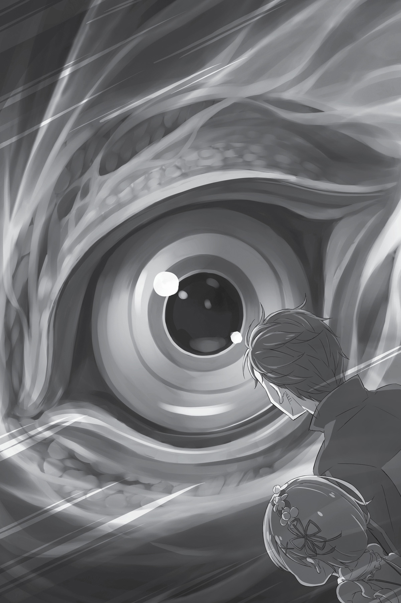
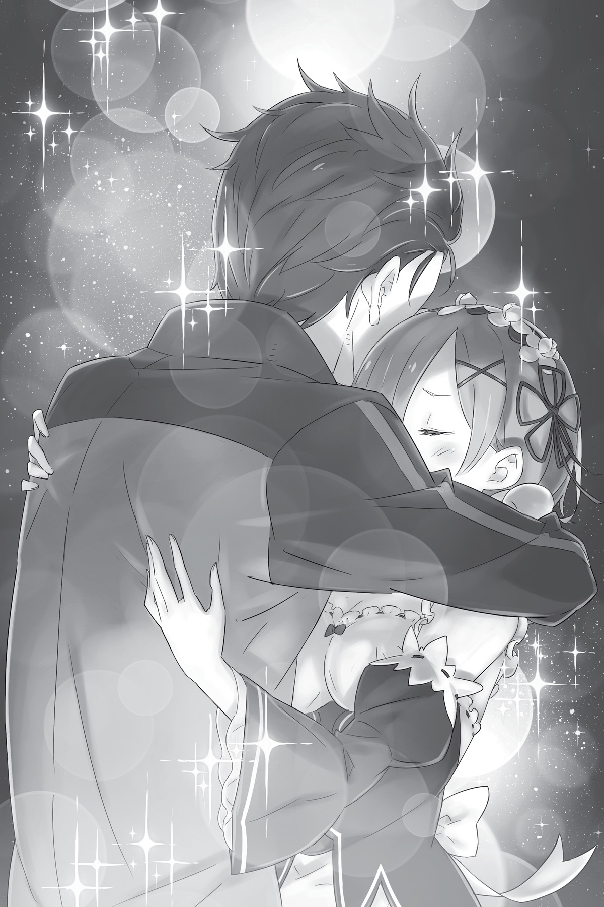

## 1

Дракон, доставшийся Субару благодаря знакомству с Анастасией, оказался самым большим из всех, что он видел. Гордясь своими огромными размерами, тот с громким топотом мчался по поросшей травой равнине, выбрасывая из-под ног куски земли.

— Для дальних расстояний такой верзила в самый раз… но сколько же от него пыли! — Сидя на козлах, Субару силился рассмотреть хоть что-нибудь сквозь окружавшее их облако.

— Я слышала, такие драконы предназначены для грузовых перевозок. Поэтому манера его передвижения неудобна для пассажиров. Он специально приучен к быстрому бегу.

— Мало того что нам досталась последняя повозка, так ещё и с драконом, который может бежать без отдыха. Не слишком ли мы везучие? Но пылит он, конечно, жутко.

К счастью, благодаря божественной Защите дракона — особой, присущей этому миру силе, которой были наделены и отдельные люди, и целые виды животных, пыль не лезла путникам в глаза и нос, хотя видимость всё равно была никакая.

Субару посмотрел на небо. В вышине плыли облака, да неспешно перемещалось солнце. Это намекало, что время не стоит на месте, и на сердце становилось ещё тяжелее.

«В этот раз у нас должно быть больше шансов на успех».

Хотя получить подмогу не удалось, теперь он выехал из столицы на второй день, а это намного раньше, чем до этого. Они могут достигнуть особняка Розвааля уже к завтрашнему утру. То есть в данном круге времени у них на полдня больше, чем в первом. Этого должно быть достаточно, чтобы увезти Эмилию и скрыться от Культа Ведьмы.

— Вопрос в том… не встретится ли нам по дороге к особняку шайка Петельгейзе…

Смутные воспоминания второго круга говорили, что сознание вернулось к нему в пещере. Если он оказался там, столкнувшись с Культом, значит, и в этот раз могло повториться то же самое. Допустим, на то, чтобы выбраться из пещеры с мёртвой Рем на руках, понадобилось около одного дня…

— Выходит, они скрываются в окрестностях особняка уже несколько дней.

Вот только в какой именно момент они могут напасть на дороге, оставалось тайной. Трагедия разыгралась утром пятого дня. Если предположить, что во втором круге Субару понадобилось полтора дня, чтобы, придя в сознание, выбраться из пещеры, тогда неожиданная встреча с Культом Ведьмы произошла либо на третий, либо на четвёртый день.

— То есть, приехав завтра утром, мы всё ещё можем столкнуться с Культом…

Неизвестность изводила Субару. Он искоса глянул на Рем. Девушка, сжав поводья, сосредоточилась на управлении драконом. Как ни крути, если они встретятся с Культом Ведьмы, ему снова придётся полностью положиться на неё. Он мог бы предупредить её об этой опасности, но как только открывал рот, чтобы заговорить, тут же обнаруживал, что не может вымолвить ни слова.

Его страшило не только наказание за передачу знаний, полученных благодаря Посмертному возвращению. Конечно, Субару боялся боли. Ни один человек в здравом рассудке не захочет терпеть адскую боль, когда чьи-то пальцы сжимают сердце. Страшно было даже подумать о том, чтобы снова испытать те мучения. Однако сейчас Субару не мог поведать Рем о возможной встрече с Культом по другой, более серьёзной причине.

Поверит ли она его словам?

От мысли об этом по спине побежали мурашки. Субару обхватил себя за плечи, словно его знобило. Сердце забилось как бешеное, нутро скрутило до тошноты. Многодневный стресс, недосып и банальная усталость вымотали его морально и физически.

Теперь Рем была единственным в этом мире человеком, которому он мог безоглядно довериться. Теперь, когда его отвергла Эмилия, когда Круш, Присцилла и Анастасия по очереди вытерли об него ноги, его терзали страх, тревога и бесконечная череда сомнений. Так что Рем оставалась его единственным другом. Каково ему придётся, если он, рассказав ей о Культе, увидит, как по её лицу пробежит тень недоверия? Ему не хотелось проверять.

— Не время поджимать хвост!..

Он попытался взбодрить себя, но из горла вырвался только хриплый, тише шёпота, стон, который тут же утонул в топоте бегущего зверя, не слышный даже самому Субару.

Пусть ему страшно, но он должен рассказать ей. Если он умолчит о том, что они могут столкнуться с Культом Ведьмы, это будет просто предательством. В конце концов, не ради ли того, чтобы предотвратить беду, он вернулся из мёртвых?

— Рем… я должен тебе кое-что…

— Субару… Там впереди какие-то люди.

— А?

Субару посмотрел туда, куда был направлен взгляд Рем, и увидел за пыльной завесой несколько фигур.

Юноша содрогнулся. Неужели Культ устроил засаду, и всё случится так быстро? Наконец зыбкие фигуры постепенно начали принимать ясные очертания. И тут…

— Эй! Притормозите-ка! Не желаете ли поговорить? Авось найдётся, что поведать друг другу!

Одна из фигур стояла прямо посреди дороги. Размахивая руками и громко крича, она просила остановиться. Это был человек с тонкими чертами и пепельно-серыми волосами — странствующий торговец Отто Сувен.

## 2

— Как я рад! Сейчас так много путников спешат в столицу, а в обратную сторону почти никого! Вот мне и захотелось узнать, куда вы путь держите, — сообщил Отто, потирая руки, когда Рем остановила повозку.

Отто был трезв и пребывал в добром расположении духа. Стоит также добавить, что на нём не было заметно ни единого синяка. Судя по всему, странствующий торговец находился в добром здравии.

Субару вспомнил, как в первом круге оставил его одного, когда Отто наотрез отказался продолжать путь. Чтобы скрыть неловкость, Субару окинул взглядом пространство за ним.

— Я правильно понял, что тут только странствующие торговцы и им подобные?

— Совершенно верно, все до единого. И у всех на уме исключительно желание хорошенько заработать в столице, — ответил Отто, добродушно улыбаясь.

На обочине стояло штук десять драконьих повозок. Мужчины, судя по всему, их хозяева, сгрудились неподалёку. Среди них были люди разных возрастов: от совсем молодых до лет сорока на вид. Когда Отто поприветствовал новоприбывших, торговцы выстроились кругом, каждый из них назвал своё имя, после чего они принялись бойко беседовать.

Говорили большей частью о нынешнем положении дел в столице, переменах, произошедших с начала королевских выборов, стоимости денег и прочих вещах, что беспокоят коммерсантов. По правде говоря, Субару было жалко тратить на них время. Он убедился, что Отто в порядке, поэтому теперь, обменявшись парой фраз, можно было продолжать путь. Однако тут заговорил Отто:

— Уже собрались ехать? По темноте опасно! Мы с ребятами собираемся заночевать здесь, так что, если хотите, можете оставаться с нами.

Отто был прав. Солнце клонилось к закату, и подкрадывалась ночь. Совсем скоро тракт Лифаус поглотит мрак, и полагаться придётся исключительно на сияние звёзд и тусклый свет кристаллических светильников.

Торговцы уже начали разбивать лагерь, в центре которого пылал яркий костёр. Ни бродячие псы, ни разбойники, рыскающие вдоль тракта, не посмеют напасть на такую большую группу людей. Вот только Субару совсем не хотелось терять драгоценное время, пусть и в безопасной компании. Но отказаться от приглашения он не успел, потому что раздался насмешливый голос одного из торговцев:

— Какой ты гостеприимный, Отто! И не скажешь, что тебе лишь бы избавиться от масла, которое ты не успел продать!

Торговцы прыснули со смеху, на что оскорблённый Отто обиженно поджал губы.

— И думать не думал. От чистого сердца предложил. Прошу, вот еда и фонарь. Конечно, я не буду против, если вы ещё и купите у меня немного масла…

Хоть Отто и расстроился, но сдаваться не собирался.

— А что не так с вашим маслом? — поинтересовалась Рем.

— Всё так, просто я сам дал промаху. Накупил кучу масла, которое сейчас почти ничего не стоит. По правде говоря, я намеревался продать его в Густеко, что на севере, и выручить неплохие деньги, но теперь я на грани разорения, ибо не знаю, чем покрыть убытки…

Отто всем своим видом вызывал чувство жалости и ясно давал понять, что готов ухватиться за любую возможность продать масло. По-видимому, это понимала даже Рем. Хотя ей было жалко парня, она ограничилась формальными словами утешения.

— Я даже не уверен, смогу ли распродать всё масло в столице. Если придётся отдавать за гроши, я разорён. Разорён…

Последнее, дважды произнесённое Отто слово намекало, что для него не было дела важнее. Тем не менее Субару не собирался проявлять великодушие и покупать у него всё масло. В первом круге Отто помог ему, но именно поэтому Субару не хотел его впутывать. Сейчас следует больше заботиться о своей судьбе, нежели о судьбе этого торговца.

Нужно как можно быстрее преодолеть путь по ночному тракту и оказаться во владениях Мейзерса. Субару уже собирался попрощаться, но внезапно ему пришла мысль. Если репутация не позволяет заполучить союзников, тогда в этом должны помочь деньги.

— Отто, есть разговор. Точнее… деловой разговор.

Заметив некую неопределённую перемену в настроении Субару, Отто уставился на него широко раскрытыми глазами. Видимо, тон голоса юноши дал ему понять, что тот не шутит, поэтому торговец тут же воспрянул и возбуждённо произнёс:

— Деловой разговор? Я весь внимание! Что бы вам хотелось приобрести?

— Я выкуплю всё масло в твоей телеге. Взамен я хочу, чтобы ты помог нам с перевозкой.

Субару указал на дракона Отто — того самого, которого он помнил по первому кругу, а затем громко, так, чтобы торговцы, продолжавшие готовиться к ночлегу, услышали его, заявил:

— Я нанимаю всех находящихся здесь торговцев с драконами и всех, кто занимается перевозками!

## 3

Услышав, в чём заключается деловое предложение Субару, торговцы переглянулись и усмехнулись между собой. Но когда Рем, угадав намерения юноши, развязала мешок и показала, что он наполнен монетами, лица мужчин вмиг стали серьёзными. Разумеется, Отто был первым в списке желающих. Его примеру последовали ещё несколько человек. В результате из четырнадцати торговцев десять решили отправиться вместе с Субару и Рем. Правда, ещё некоторое время они не могли договориться, как будут делить заработанные деньги, но Отто предложил такой план, который устроил абсолютно всех.

— Весь товар повезут те четверо из нас, у кого самые сильные и выносливые драконы. Выручку разделим позже, через торговую гильдию.

Благодаря усилиям Отто, взявшего на себя роль посредника, вопросы оказались улажены довольно быстро. По-видимому, он изо всех сил хватался за выпавший ему шанс.

— Я счастлив, что смогу избавиться от своего масла, но всё-таки поясните, зачем вам понадобились наши драконы? — спросил Отто, поглядывая на коллег, которые уже таскали груз.

Субару тоже наблюдал за ними, сложив руки на груди и тревожась, хватит ли им времени. Услышав, что Отто обратился к нему с вопросом, юноша коснулся рукой подбородка и сказал:

— Мы сейчас направляемся во владения Мейзерса. В общем, мы слуги графа.

— Мне известен этот господин. Граф Розвааль L. Мейзерс, питающий слабость к полулюдям. Ходят слухи, что среди титулованной знати Лугуники он выделяется довольно необычными наклонностями.

Рам такая оценка, услышь она её, привела бы в бешенство. Субару же в ответ пожал плечами:

— Ну, отрицать не стану. Что правда, то правда: парень он с отклонениями.

— И вы так говорите о своём хозяине? Не подумайте плохого, я как раз и ожидал от вас это услышать. Всё-таки вы, сэр Нацуки, совсем не похожи на слугу знатного человека.

— Я ещё стажёр. Зачёты пока сдал только по шитью и застиланию постели.

— И всё равно, если вы говорите правду и действительно работаете на господина графа… зачем вам драконы? Неужели такой человек, как граф, не имеет собственных?

Наводящие вопросы Отто свидетельствовали о его сомнениях в истинных намерениях Субару.

— Я уже сказал: драконов нужно много. Придётся перевозить большое количество груза, поэтому лучше, чтобы повозки были пустыми. А тебе вообще деваться некуда, ведь я выкупаю всё твоё масло.

— Да, и я очень благодарен вам. Тогда что за товар мы повезём?

Отто сыпал вопросами как из рога изобилия, но не потому, что его терзали сомнения по поводу социального положения клиента. По-видимому, торговца тревожила мысль, что перевозимый груз может быть опасным, и этим объяснялась настойчивость, с которой он расспрашивал Субару. Лгать не было никакой нужды. Если Отто засомневается и откажет, ситуация станет безвыходной.

— Что за товар повезём, спрашиваешь?.. Людей.

— Но мы не занимаемся торговлей людьми! — взволнованно воскликнул Отто.

— Ни о какой торговле людьми речь не идёт. Недалеко от особняка графа есть деревня. Совсем небольшая, и сотни человек не наберётся. Я хочу, чтобы вы перевезли их в другое место.

Вот зачем Субару хотел нанять Отто и его товарищей. Мысль его заключалась в следующем: большегрузная повозка, на которой они с Рем двигались, вмещала не меньше десяти человек. Будь таких повозок хотя бы несколько штук, они могли бы вывезти из деревни всех жителей.

— Вы ведь не собираетесь перевозить трупы? Если это так, то мне весьма жаль, но мы…

— Именно поэтому я и хочу увезти их из деревни, пока они живы!

Торопясь как можно быстрее увидеться с Эмилией, Субару совсем забыл про жителей деревни. Собственной беспечностью он был сыт по горло, но повстречать на пути Отто и его коллег было крупным везением. На этот раз судьба повернулась к нему лицом, что являлось редкой удачей.

— Дело в том, что совсем скоро планируется прочесать лес в окрестностях графского поместья.

— Прочесать лес?..

— С давних времён там обитает множество видов зверодемонов. До сих пор они не пересекались с людьми благодаря магическому барьеру, но… несколько дней назад зверодемоны напали на деревню.

— И поэтому вы решили прочесать лес? — не унимался Отто, видимо, не удовлетворённый объяснением.

Субару молча отвернул рукав на правой руке и показал шрам от укуса безжалостного зверя. Увидев глубокие следы зубов и когтей, Отто нервно сглотнул. На теле юноши оставалось также несколько других не исчезающих шрамов.

— Я находился на грани смерти, но граф был так добр, что оплатил моё лечение в столице. Основной курс пройден, и теперь мы возвращаемся домой.

— Ясно… Но всё-таки почему граф не сообщил об этом сам, а отправил вас искать повозки?..

— Граф планирует разобраться со зверодемонами по-быстрому, не трогая жителей своих земель, — терпеливо объяснял Субару, опустив глаза. — Но не исключено, что зверодемоны, как это видно по моим шрамам, могут устроить новую вылазку. Поэтому я хочу подстраховаться. Не то чтобы я не доверял хозяину, но опыт подсказывает — лишним не будет.

Выслушав юношу, Отто тихонько вздохнул и задумался.

— Хорошо, — вымолвил он наконец, тревожно поглядывая на Субару. — Извините меня за настойчивые расспросы. Даже без продемонстрированных вами шрамов рассказ был очень убедительным.

Добродушное лицо Отто омрачила печаль. Должно быть, торговец сожалел о том, что ненамеренно затронул больную для клиента тему.

— Да не переживай! Расскажешь остальным то же самое, чтобы ни у кого не возникало вопросов.

— Вы нас извините… Такой уж у нас, торговцев, вредный характер, — весело заметил Отто и простодушно улыбнулся.

«Ты по сравнению со мной просто ангел», — подумал Субару. Его рассказ не был лживым. Просто он не стал говорить торговцу всю правду.

## 4

Спустя два часа приготовления к отъезду были закончены, и путники снялись с лагеря, оставив только четыре большегрузные повозки с товаром. К владениям Мейзерса по ночному тракту мчалось одиннадцать экипажей. Этого должно было хватить, чтобы увезти из деревни, пусть и в несколько стеснённых условиях, всех её жителей.

— Будем гнать всю ночь — к утру должны достигнуть земель Мейзерса, — сообщил Отто, ехавший бок о бок с драконьей повозкой Субару и Рем.

Возможность разговаривать друг с другом им давала Защита от встречного ветра, которой обладали земляные драконы. Она была настолько эффективна, что ни ветра, ни тряски не ощущалось.

— Извини, что помешал вам как следует отдохнуть.

— Что вы, что вы! Даже не берите в голову! Я просто счастлив, что продам товар, да ещё и на перевозке наварюсь! Ради этого я готов мчаться три дня и три ночи подряд!

— Чтобы потом сразу слечь от измождения?

— Что?! Вы мысли читаете, что ли?! — Отто был ошеломлён тем, как ловко собеседник угадал концовку его коронной шутки.

Затем Субару перевёл взгляд с Отто на Рем, которая сидела рядом и держала поводья. Девушка смотрела прямо перед собой, на уходящую вперёд дорогу. По её лицу нельзя было понять, что она сейчас чувствует, и Субару это совершенно не радовало.

— Субару…

— А? Что такое, Рем? Что-то случилось?

— Нет, просто ты замолчал, и я подумала, что ты, наверно, утомился. Из-за песка почти ничего не видно, но рядом с нами другие драконы, так что мы не собьёмся с пути. Если захочешь, можешь спокойно спать.

— Рад бы воспользоваться твоим предложением, но это будет наглостью с моей стороны.

— Ты же ещё не совсем здоров!

Обеспокоенность Рем его самочувствием поставила Субару в тупик. Слова девушки звучали мягко и ласково, однако она твёрдо стояла на своём. Очевидно, она была готова сделать всё, лишь бы облегчить бремя, которое Субару на себя взвалил. Всякий раз, когда она проявляла самоотверженность ради него, Субару становилось страшно, потому что он не понимал, ради чего она это делает.

— Рем… я…

— Да?

Под взглядом бледно-голубых глаз Рем Субару не удалось вымолвить ни слова. Он мог бы оправдать молчание нерешительностью, но дело было не в этом. Если его мучают сомнения о том, ради чего Рем так старается, не лучше ли прояснить всё прямо сейчас?

— Рем, ты действительно считаешь, что я поступаю правильно? Ведь я тебе ничего толком не объяснил. Ни то, откуда мне известно про Культ, ни то, зачем нанял торговцев.

Субару отдавал себе отчёт, что воспользовался безоглядной добротой Рем, поэтому её беспрекословное подчинение не могло его не тревожить. Рем на мгновение прикрыла веки.

— Господин Розвааль наказал мне уважать твои поступки и считаться со всем, что ты делаешь, находясь в столице, — ответила девушка с совершенно бесстрастным выражением лица.

Субару на какое-то время потерял дар речи.

— Розвааль… наказал?..

— Да. Распоряжений делать что-то конкретное он не давал. Просто следовать за тобой, что бы ты ни делал, пока мы в столице. И я, насколько могла, старалась выполнять это указание.

— Приказ Розвааля…

Новость не укладывалась в голове. Субару мысленно прокрутил слова Рем, не вдумываясь в их значение. Выходит, Рем послушно шла за ним лишь потому, что таково было указание Розвааля. Значит, она поступала так вовсе не по доброй воле? И даже само её присутствие рядом с Субару было вызвано необходимостью следовать инструкциям хозяина?

— Субару?

Рем, нахмурив красивые брови, поглядела на умолкнувшего спутника. Теперь даже этот тревожный взгляд не мог найти отклика в его сердце. Он кивнул головой, избегая смотреть на Рем.

— Всё… хорошо. Я в порядке.

Ответ не блистал оригинальностью, однако Субару должен был хоть чем-то прервать затянувшееся молчание. Её беспокойство и забота о нём, поддержка, которую она дарила ему в трудную минуту, когда все остальные от него отворачивались, — теперь Субару думал, что за всеми этими поступками стоял приказ Розвааля. Не исключено, что в глубине души Рем вовсе не одобряла действия Субару.

Терзаемый тягостными сомнениями, юноша ощутил во рту кислый привкус желудочного сока. К горлу подступала тошнота, тело разрывало от физического страха и чувства безысходности. Конечности одеревенели, перед глазами плыли круги, а в голове шумело так, что топот драконов был едва слышен.

«Не хочу ни о чём думать. Не хочу…»

Чем дольше он размышлял об этом, чем чаще возвращался к невесёлым выводам, чем больше искал ответы на мучающие его вопросы, тем меньше понимал и тем стремительнее идеалы рушились в прах, а надежда обращалась разочарованием.

— Субару, ты заснул?

«Не хочу. С меня хватит. К чёрту мысли, к чёрту сомнения. Не хочу никому верить, не хочу быть обманутым…»

Субару обхватил голову руками и замкнулся в себе, начисто отрезав связь с внешним миром. Рем позвала его по имени несколько раз, но, убедившись, что он не отвечает, оставила в покое и вновь принялась смотреть на дорогу. В этот момент Субару наконец осознал, что в этом мире он абсолютно одинок.

## 5

— Субару, я прошу прощения… Проснись, Субару!

Зов проник в спящее сознание. Плеча коснулась чья-то рука, и, пробившись сквозь мутную пелену беспамятства, он пробудился. Он потёр тяжёлые веки и открыл глаза, в которых сразу отразилось знакомое лицо спутницы.

— Рем? Ты чего?..

Стоило увидеть Рем, как в памяти всплыл их последний разговор. В груди сразу болезненно заныло. Но Рем не знала о его муках. Виновато склонив голову, девушка извинилась за то, что разбудила его, а затем доложила:

— Скоро доедем до развилки. Мы не пропустим этот ориентир даже в темноте, поэтому волноваться не стоит… но я бы хотела уточнить, сколько нам ещё ехать.

Кругом царил глубокий мрак. Нельзя было толком разглядеть даже лицо Рем. Единственными источниками света служили кристаллический светильник, болтавшийся на шее земляного дракона, да простенький фонарь на повозке. В отличие от дракона, которому темнота не была помехой, человеческому глазу такого количества света явно не хватало.

— Понятно. Но от меня-то ты что хочешь?

— Мне нужно взглянуть на карту. Но я не могу отпустить поводья, поэтому была бы признательна, если бы ты достал карту из нашего багажа, который стоит у твоих ног.

— У моих ног… Отсюда?

В полной темноте Субару подтащил к себе довольно тяжёлый вещевой мешок, поставил его на колени, однако, покопавшись внутри, не обнаружил никакой карты.

— Не знаю, где тут эта карта… Темно, хоть глаз выколи. Дай подумать… У меня идея!

Субару снова пошарил у своих ног в поисках другого мешка — на этот раз со своими личными вещами.

— Нашёл!

Нащупав знакомый предмет, он вытащил его из мешка и продемонстрировал Рем. На глазах у изумлённой девушки Субару нажал на кнопку включения.

— Давно не заряжал, но батарея ещё не села.

Спустя несколько напряжённых секунд ожидания на экране вспыхнула приветственная надпись, а ещё ровно через секунду пространство под рукой Субару осветил яркий пучок света. Удивлению Рем не было предела.

— Субару, что это?..

— Сотовый телефон, чудо утерянных технологий… Хотя нет, скорее технологий будущего. Нам повезло, что заряд пока есть.

С того дня когда начались его приключения в альтернативном мире, Субару старался не включать телефон без крайней необходимости. Среди всех немногочисленных предметов, которые оказались у него с собой, этот был самым полезным. Конечно, при условии работающей батареи.

— Но я и не догадывался, что в следующий раз он понадобится мне в качестве карманного фонарика…

Субару поднёс продукт цивилизации к багажу и осветил его внутренности. Карта обнаружилась почти сразу. Субару извлёк её и развернул на коленях Рем.

— Я буду светить, а ты пока смотри.

— Хорошо. Спасибо большое!

— Сэр Нацуки, что это у вас такое? Какой удивительный инструмент! — Из темноты вынырнул Отто. На его лице был написан острейший интерес. Одновременно управляя драконом, который мчался слева от дракона Субару и Рем, торговец подался вбок, вытягивая шею. — Ни разу не встречал похожих кристаллов… Хотя нет, это даже не кристалл. Кажется, какой-то неизвестный мне материал…

Реакция Отто привлекла другого торговца, двигавшегося справа, и тот поравнялся с ними. Это был мужчина средних лет с банданой на голове. Он сверкнул глазами и как прикованный уставился на телефон.

Раньше в подобном случае Субару непременно оживился бы и стал шутить и бахвалиться. Но сейчас, увы, на это у него не оставалось ни сил, ни желания.

— Извините, но этим секретным инструментом меня снабдил граф. Узнаете подробности — можете пропасть без вести, так что лучше забудьте, что его видели.

— Бог мой, вы меня заинтриговали! Чувствую, за него бы дали хорошие деньги!

Похоже, предупреждение Субару ещё сильнее возбудило любопытство Отто, однако сочинять очередную историю не было нужды, потому что Рем подняла голову от карты и, довольно кивнув, сообщила:

— Совсем скоро должно показаться Древо Флюгеля. Если от него поедем на северо-восток, то окажемся во владениях Мейзерса.

— Древо Флюгеля? — переспросил Субару, услышав незнакомое название.

— Древо Флюгеля — это огромное, почти до облаков, дерево, возвышающееся в самом центре тракта Лифаус, — объяснил Отто. — Такого высокого дерева нигде больше не увидишь. По преданию, его посадил мудрец по имени Флюгель несколько веков тому назад.

— Значит, Древо Флюгеля, говорите? А зачем этот мудрец его посадил?

— Видишь ли, с тех пор уже не одна сотня лет прошла. Да и вообще, кроме того, что этот Флюгель посадил дерево, о нём ничего особо не известно. Очень много загадок, включая и то, почему его называют мудрецом.

— Это что же получается? Великий человек, о достижениях которого никто ничего не знает?

Объяснение Отто трудно было назвать исчерпывающим, однако, видя, что ни Рем, ни другие торговцы не желают дополнить рассказ, Субару не стал расспрашивать дальше. Видимо, легенды о подвигах этого персонажа и правда не дожили до наших дней. Когда спустя десять с небольшим минут впереди показалось упомянутое дерево, у Субару вырвался вздох изумления:

— И впрямь громадное! Как и обещали!

Величественно раскинув в ночном небе свои ветви, оно взирало на путников с исполинской высоты. По своим размерам оно намного превосходило деревья из родного мира Субару. Даже те, возраст которых насчитывал тысячу лет. Если, как сказал Отто, его посадили несколько столетий назад, растения в этом мире должны расти в разы быстрее.

Рядом с Древом Флюгеля не росло ни одного деревца — оно возвышалось над равниной в полном одиночестве. Пожалуй, более заметного дорожного ориентира не сыскать на всём свете. Повернув у самого ствола, олицетворявшего величие и покой, драконьи повозки помчались на северо-восток, к поместью Мейзерса. Глядя на исчезающее вдали гигантское древо, Субару даже загрустил, что с ним пришлось так быстро расстаться. Тягостные думы волновали его настолько, что он не сделал ни одного снимка.

— Нашёл время киснуть!..

Выбросив из головы мысли о дереве, Субару заметил, что торговец, который двигался с правой стороны и проявлял неподдельный интерес к сотовому телефону, куда-то исчез.

— А куда подевался дядя в бандане?..

Субару оглянулся: может быть, он просто отстал? Но позади юноша увидел только тех драконов, что бежали сзади упомянутого им торговца. Самого же его в драконьем караване не оказалось.

— Неужели залюбовался деревом и отстал от остальных?..

— Сэр Нацуки, что случилось? Кого-нибудь потеряли?

— Спрашиваешь! Один из твоих товарищей куда-то пропал! Суровый такой, в прикольной бандане, ехал справа от меня. Может, ударился в детство и решил полазить по дереву? Нашёл время.

Дисциплина в рядах торговцев под руководством легкомысленного Отто оставляла желать лучшего. Однако в ответ на критику Отто недоуменно уставился на Субару, будто не понял ни единого сказанного слова.

— О чём это вы? Уверяю, по другую сторону от вас никто не ехал.

— Что?.. — Субару раскрыл рот. — Ты чего, Отто? Он же только что вместе с тобой глаз не мог оторвать от телефона!..

— А, так это называется «телефон»! Всё-таки надеюсь, из-за того, что я узнал его тайну, со мной ничего такого не случится. Не хотелось бы пропасть без вести… — обеспокоенно заметил Отто.

— Кончай зубоскалить! — вскипел Субару. Он снова оглянулся через правое плечо, но позади по-прежнему зияла пустота. Никого похожего на человека в бандане там не было.

Внезапно пустота перед глазами юноши подёрнулась рябью. Воздух словно наполнился сизой дымкой. Субару поморгал, однако прогнать это странное ощущение не удалось. Драконью повозку по-прежнему окружала бездонная тьма. И эта тьма внушала страх и тревогу, от которых нельзя было отделаться. Именно поэтому Субару вновь включил телефон и направил свет в пустоту, разгоняя мрак. Но на этот раз не для того, чтобы отыскать пропавшего торговца, а чтобы выяснить причину таинственного и неотступного чувства ужаса.

Но как только луч света прошил тьму…

— А?..

Из мрака вынырнуло гигантское око, которое смотрело юноше прямо в глаза. Вслед за этим раздался рёв, и тракт Лифаус накрыл туман.

Густой, плотный туман.

## 6

В лицо ударил порыв ветра, несущий водяные брызги.

— Угх!

Налетевший ураган поднял Субару в воздух. Он машинально протянул руку, но пальцы схватили пустоту. Ещё мгновение — и его унесло бы в глубину мрака, но тут…

— Субару!

Кто-то ухватил его за воротник и потащил вниз, к повозке. Субару шлёпнулся обратно на сиденье. Перед глазами поплыли цветные пятна, сквозь которые он разглядел нависшую над ним Рем, другой рукой удерживающую поводья. От бесстрастного выражения на её лице не осталось и следа. Из открытого рта Рем вырывался отчаянный крик.

Рем выкрикивала заклинание. Повинуясь её воле, в атмосфере начала сгущаться мана. Девушка перекраивала мир своей магией. В мгновение ока в воздухе материализовались три ледяных копья длиной в человеческий рост. Едва сформировавшись, они пулями устремились к цели. Раздался звон стали, наткнувшейся на камень. Копья ударились о тьму и… разлетелись на части.

— Ох, ничего себе!

Вслед за этим Субару снова схватили за шиворот и дёрнули вверх. Оказавшись в воздухе, он увидел тушу земляного дракона, который, не заметив отсутствия пассажиров, по-прежнему гнал во весь опор по ночной дороге, поднимая столб пыли. Однако спустя несколько мгновений на повозку вместе с драконом обрушилась колоссальная масса, сминая их своей тяжестью. Простая, без изысков грузовая повозка превратилась в щепки, а туша дракона, ударившись о землю, разлетелась вокруг кровавыми ошмётками.

Совершенно не вяжущаяся с реальностью картина заполнила мысли Субару молочно-белой пустотой.

— Налево!!! — прогремел совсем рядом крик, и спустя секунду Субару рухнул на твёрдый настил.

Тупая боль, прошившая плечо и поясницу, вернула его сознание из белой пустоты в реальность. Однако непрерывная череда залпов не позволяла поднять голову. Драконья повозка, в которой он оказался, резко накренилась, и юноша откатился к борту. От того, чтобы не вылететь наружу, его спас канат, за который он успел ухватиться.

Субару повертел головой: он угодил в повозку Отто. Это единственное, что он понял. Обвязав вокруг запястья канат, которым крепили грузовую платформу, и превозмогая тряску, он попытался встать.

— Субару, нет! Не вставай! Мы лишены Защиты от ветра! Теперь нам лучше не делать лишних движений!

Тут он заметил, что Рем пытается приподняться над полом, опираясь на правую руку. Удерживать равновесие в такой болтанке было нелегко даже с её физическими способностями. Без божественной Защиты от встречного ветра, которая окутывала дракона, безжалостные порывы урагана и дикая тряска лишали Субару всяких сил.

Наконец он понял, что именно с ним произошло. Схватив его в охапку, Рем перескочила из разбитой в хлам повозки в экипаж Отто. Случись это на мгновение позже, и Субару тоже был бы разбит в хлам.

— Что это было?! Что это за чертовщина такая?!

Катастрофа, причинившая грандиозные разрушения, заняла считаные секунды. Всё случилось настолько стремительно, что разум Субару не успел осознать происходящее.

— Вы до сих пор не поняли?! — бросил Отто, едва не срываясь на истерический крик. Обернувшись, он указал дрожащим пальцем в небо. Вид у Отто был бледный, как у мертвеца. — Ночной туман сошёл! Есть только одно существо с такой громадной тушей, способное парить в тумане!

Затем торговец судорожно вдохнул в сжавшиеся от страха лёгкие побольше воздуха и что было сил проорал:

— Белый Кит!!!

Точно в ответ на его вопль воздух над равниной сотряс рёв Белого Кита.

«Белый Кит!»

Это имя Субару слышал во время первого круга жизни в особняке Круш. Так называли чудовище, окружавшее себя туманом, заволакивающим дороги между городами. В первом круге жизни, когда они с Рем возвращались в особняк Розвааля, из-за тумана им пришлось делать большой крюк, и в итоге он опоздал, не сумев помешать Культу Ведьмы творить зло.

Однако самого Белого Кита Субару ещё ни разу не видел. Скорее всего, как раз поэтому он его и не запомнил.

— Надо же было встретиться с этой тварью именно сейчас!

Тогда они с Рем покинули столицу на третий день. Тракт в тот момент был перекрыт туманом Белого Кита. Сейчас поздняя ночь второго дня. Если монстр к утру приблизится к столице, уже завтра дорога будет заблокирована. То есть сегодня ночью путники были обречены столкнуться с этой страшной угрозой.

— Вот угораздило… налететь на Белого Кита… Ох, Дракон, Дракон, спаси нас!..

Выпучив глаза, Отто отчаянно бубнил под нос молитвы о спасении, даже не думая дать хоть какой-то отпор. Теперь Субару мог воочию убедиться в том абсолютном страхе, который Белый Кит вызывал у странствующих торговцев.

В прошлый раз Отто говорил, что торговому люду встреча с Белым Китом не предвещает ничего хорошего. Вне себя от ужаса, с дрожащими губами, он всё же не выпускал поводьев из рук. Его дракон тоже заметил присутствие чудовища. Охваченный паникой, зверь гнал на пределе своих возможностей, стремительно набирая скорость.

Вцепившись в борт бешено трясущейся повозки, Субару изо всех сил пытался разглядеть что-нибудь во мраке. Однако Белого Кита словно бы поглотила ночь, и его громадная туша исчезла из виду. Лоб покрывали какие-то капли, но это не были капли холодного пота. Субару поднёс ко лбу ладонь и тут же сморщился от неприятного ощущения. Увидеть что-нибудь в темноте, без единого источника света, да ещё в таком тумане представлялось безнадёжной затеей.

— Рем! Ты видишь его?

Субару вертел головой по всем сторонам, надеясь, что в поле зрения окажется нечто похожее на рыбью тушу.

— Слишком темно! — откликнулась Рем. — Но я…

Девушка хотела что-то добавить, но отчего-то заколебалась. Рем вглядывалась во тьму, однако по её силуэту в окружающем тумане невозможно было понять, что она сейчас испытывает. Туман становился всё гуще, и уже ничего нельзя было разглядеть даже на расстоянии вытянутой руки.

Вначале, когда глаза Субару впервые встретились с оком Белого Кита, глазное яблоко этого чудовища показалось ему настолько огромным, что юноше не хватило бы длины рук, чтобы показать его размеры. Существо с таким глазом, наверное, и само было громадными, полностью оправдывая своё название. Теперь это чудовище свободно парило в ночном небе, не выдавая своего присутствия ни звуком, ни движением. И из-за этого было ещё страшней.

— Но я, кажется, попала в него, когда нанесла первый удар… Так что он, скорее всего, отступил.

Не слишком ли оптимистично настроена Рем? По своей мощи ледяные копья, пущенные ей при помощи заклинания, превосходили всё виденное им ранее магическое оружие. Одно такое копьё могло три раза отправить его на тот свет. Каким бы гигантским ни был этот монстр, серьёзные ранения наверняка заставят его ретироваться.

— Что с остальными повозками?

— По-видимому, как только опустился туман, они сразу же разбежались кто куда. Если им повезло и Белый Кит не стал их преследовать, они могли благополучно выйти из пелены тумана.

Наверняка так поступил бы любой нормальный человек, наткнись он на Белого Кита. И действительно, теперь спутников рядом не было видно. Все прочие экипажи, мчавшиеся за ними стройной колонной, судя по всему, последовали неписаному правилу и, бросившись врассыпную, скрылись их виду. Поняв, что теперь он остался без транспорта, добытого с таким трудом, Субару с досадой стиснул зубы. Как не вовремя! План по спасению жителей деревни снова шёл коту под хвост.

— Слезами горю не поможешь… Сейчас надо думать о том, как выбраться из тумана…

Он с трудом представлял, сможет ли справиться с предстоящими трудностями. Теперь, оставшись без собственной драконьей повозки, Субару должен был добраться до особняка хотя бы на телеге Отто.

Внезапно прямо перед глазами возникла широко раскрытая пасть с рядами огромных, мощных, как мельничные жернова, зубов. Раздался рёв, и земляной дракон, съёжившись от сокрушительной взрывной волны, оступился и затормозил лапами. Колёса повозки подпрыгнули, грузовая платформа резко качнулась, и горшки с маслом, прорвав полог, вывалились наружу. Субару тоже едва не выбросило вон, но он крепко ухватился за борт. Вцепившись в него мёртвой хваткой, Субару наблюдал, как огромная пасть приближается к повозке, грозя проглотить её целиком. Только сейчас он начинал понимать, где оказался и что происходит. Они столкнулись с Белым Китом и теперь блуждают в непроглядном тумане. И он вступил в схватку, в которой каждая секунда может оказаться для него последней.

— Р-ра-а-а-а-а!!!

Когда челюсти уже были готовы сомкнуться вокруг повозки, прогремел боевой клич, а за ним последовал удар, от которого дощатый настил платформы разлетелся в щепки. Это была Рем. Совершив стремительный прыжок на монстра, она размахнулась своим грозным оружием — шипастым шаром. Из головы демоницы, совсем рядом с белоснежной заколкой, торчал острый рог.

— Бери левей!!!

— Левей, левей, левей, левей!..

Шар обрушился на верхнюю челюсть Кита. Взметнулся фонтан крови, и чудовище вынужденно захлопнуло пасть. Тем не менее, пропахав нижней челюстью землю, гигантская морда приближалась, не сбавляя скорости. Отто едва успел повернуть дракона влево, однако грузовая платформа, оказавшись правым бортом на пути монстра, с громким скрежетом, словно о камень, чиркнула по его туше и накренилась…

«Я погиб?»

Секундное промедление непременно принесло бы смерть, однако за мгновение до этого тело Субару обвила серебристая змейка, дёрнула его вверх, а затем бросила прямиком на козлы повозки.

— Получай!!!

Держа в правой руке моргенштерн, которым она спасла Субару, левой рукой Рем разорвала сцепку, соединяющую повозку с грузовой платформой, схватила платформу за борт и со всего маху ударила ею по туше чудовища. Белый Кит взревел, изогнулся и пропахал хвостом землю, поднимая в воздух облака пыли и комья земли.

— Попали?! — прокричал Отто. В полном безысходности голосе промелькнула искра надежды на то, что его жертва не напрасна. Пусть не все события, но хотя бы часть из них не ускользнула от внимания торговца: он понимал, что потерял половину своей драконьей повозки.

Воздух сотряс оглушительный рёв, и сумеречный туман стал ещё гуще и плотнее. Подступающее сзади отчаяние не оставляло от надежды камня на камне.

— Почему он преследует именно нас?! — истошно вопил Отто, проклиная выпавшее на его долю несчастье. — Ведь есть же и другие повозки!

Невзирая на остальные восемь экипажей, Белый Кит упорно преследовал повозку Отто, и эта несправедливость возмущала его. Субару был с ним согласен, но, в отличие от торговца, непрестанно извергающего грязные ругательства, не выказывал недовольства.

— Жалобами ничего не изменишь…

Между тем летящий по воздуху гигант нагонял беглецов. Хотя без грузовой платформы дракону стало легче бежать, когда его настигнут, было лишь вопросом времени.

— Думай, думай, думай! Есть же какой-то выход! Придумай хоть что-нибудь! Что-нибудь!..

Субару напрягал мозги изо всех сил, но совершенно без толку. Ощущение неотвратимой гибели и непроглядный туман, казалось, закрывали все пути к спасению. Время проходило в бездействии, а судьба снова принуждала его сделать мучительный выбор.

Юноша сидел, вцепившись в борт бешено трясущейся повозки, когда к нему незаметно приблизилась Рем. Несмотря на тряску, походка девушки была на удивление твёрдой. Рем присела рядом с ним и сказала:

— Субару, возьми это.

Юноша поднял глаза:

— Ты что-то придумала?! Значит, мы сможем выбраться из… — обрадовался было он, решив, что у Рем возникла идея, как выпутаться из передряги, но тут заметил, что в руках она держит мешок. Тяжёлый на вид мешок с деньгами на дорожные расходы.

Какой толк от этих денег сейчас, когда они в такой беде? Субару начало трясти.

— Рем… Что ты задумала?..

— Я спрыгну с повозки и перехвачу его. А ты тем временем постарайся выбраться из тумана, — решительно сказала Рем. Затем она повернулась к Отто: — Господин Отто, позаботьтесь о Субару. Обещанное вознаграждение возьмёте у него. Когда достигнете владений Мейзерса, сообщите всем о появлении Белого Кита.

— Вознаграждение?.. О чём вы говорите?! Тут бы ноги унести! — воскликнул Отто, не слышавший их разговора.

Видя, как торговец изо всех сил старается спасти свою жизнь, Рем испытала небольшое облегчение.

— Субару, — сказала она, вновь обратившись к юноше, — я не очень сообразительна, поэтому это единственный план, который пришёл мне в голову. Так что, пожалуйста…

— Погоди, Рем! Ты просишь, чтобы я сообщил о появлении Белого Кита? Не хочешь ли ты сказать, что мы видимся в последний раз?!

Субару не был готов принять её жертву. Пространство вокруг по-прежнему окутывал глубокий мрак, но лицо девушки Субару отчего-то видел особенно отчётливо. Бросив мешок у его ног, она стояла прямо перед ним.

— Не пущу! Я не пущу тебя! Если ты… если и ты погибнешь, я…

Субару подтащил её к себе и крепко обнял за хрупкую талию. Девушка попыталась вырваться, но объятия Субару были сильней. Если он ослабит хватку, Рем, готовая расстаться с жизнью, упорхнёт. Он не должен этого допустить. Иначе…

— А-а…

Когда Субару, охваченный диким вихрем чувств, уже готов был заплакать, Рем в его объятиях издала слабый стон, и кожу юноши обожгло её горячее дыхание. Он опустил взгляд и увидел, что Рем смотрит на него, самозабвенно улыбаясь.

— Я появилась на свет ради этого момента.

— Что ты такое…

Субару хотел продолжить «говоришь», но не смог произнести ни слова больше.

Что-то ударило его по голове, и перед глазами всё завертелось. Обвив рукой шею Субару, она стукнула его ребром ладони по затылку. Стремительно теряя силы, он повалился на Рем.

— Рем… Что ты…

В глазах темнело. Вслед за силами Субару покидало сознание. Он начал заваливаться назад и отчаянно вцепился в Рем. Девушка наблюдала за его судорогами с нежностью в глазах. Затем она приблизила губы к его уху и, словно стремясь достучаться до обрывков уплывающего вдаль сознания, прошептала:

— Всё хорошо. Я всегда буду стоять за твоей спиной и защищать тебя.

«Ничего не надо делать. Просто стой рядом со мной».

Именно так он сказал ей сегодня утром, прежде чем они отправились в путь.

Поэтому Рем послушно следовала его просьбе: она будет стоять на его защите. Всегда.

— Нет… Я вовсе не это… имел…

— Субару, я…

Сознание отключилось. Оно унеслось вдаль, а голову опять заполнила белая пустота. Осталось лишь ощущение того, что его крепко обняли. Кто-то нежно коснулся лба и сразу же отстранился. Это было последнее, что он почувствовал перед тем, как окончательно провалился в забытье.

## 7

«Ах…»

Тряска, толчки и ощущение, будто кто-то бьёт по лицу, вновь и вновь.

Эти бесконечные удары пробудили его сознание, и Субару вернулся в действительность.

Он оторвал голову от пола и попробовал приподняться, но почувствовал на животе какой-то увесистый предмет. Субару поднёс руку и, потрогав, удостоверился, что это был мешок с золотыми монетами. В голове пронеслись воспоминания о том, что произошло за секунды до того, как он отключился.

— Где Рем?!

— Сэр Нацуки? Вы проснулись?

Субару сбросил с живота мешок и, приподнявшись, осмотрелся. Вокруг по-прежнему царила тьма. Жестокая тряска и грохот сообщили ему, что он находится в драконьей повозке. Заметив, что пассажир пробудился, Отто повернул к нему голову.

— Не шевелитесь, прошу вас! — прокричал торговец, когда Субару попытался подняться на ноги. — Хотите ещё раз головой удариться? Мы уже давно без божественной Защиты, а дракон всё ещё несётся на полной скорости! У меня нет времени следить за вашей безопасностью!

— Да мне без разницы! Что ты сделал с Рем, я спрашиваю?! — прорычал Субару в ответ и принялся осматривать каждый угол повозки.

Без грузовой платформы та здорово уменьшилась в размерах. Любому сразу бы стало ясно, что искать здесь кого-то ещё нет никакого смысла. Тем не менее Субару не мог поверить в это, пока не убедился своими глазами.

— Отто, отвечай! Что ты сделал с Рем?

— Эта девушка, она…

Видя, что рассерженный Субару готов в любую секунду наброситься на него, Отто, по-видимому, понял, что медлить с ответом небезопасно.

— Она спрыгнула с повозки, собираясь отразить атаку Белого Кита… чтобы мы могли уйти, — сдавленно проговорил торговец.

Иными словами, разговор перед тем, как он потерял сознание, не был ни сном, ни плодом воображения. Несколько секунд Субару переваривал услышанное. А затем сказал:

— Разворачивайся.

— Что?

— Я говорю, разворачивайся! Мы должны спасти Рем, слышишь?! Разворачивайся сейчас же!

Субару вскочил на узкие козлы и схватил Отто за грудки. Торговец побледнел, однако ничем не мог ответить на буйство пассажира, так как управлял драконом, который продолжал мчаться вперёд как полоумный.

— Вы… вы серьёзно?! Вы хоть понимаете, что говорите?! Разве вы не видели, какой это страшный монстр?! Это же самоубийство!

— Видел, и очень близко! Поэтому я и говорю тебе разворачиваться! Надо спасти Рем!

Отказ повиноваться вызвал у Субару приступ ярости. Юноша побагровел от гнева. Уж кого-кого, а это чудовище он будет помнить до конца своих дней. Исполина, плывущего по воздуху со скоростью, превосходящей скорость любого земляного дракона. Монстра, который лёгким движением хвоста способен уничтожить большегрузную повозку. Он не упустит добычу даже в непроницаемом тумане, его не берёт даже магия Рем. Несомненно, это самый сильный и опасный враг из тех, с которыми Субару пришлось столкнуться в альтернативном мире. Справиться с Эльзой, представительницей рода человеческого, или вступить в схватку с несметной стаей вольгармов было гораздо проще. Субару не имел ни малейшего понятия, как победить это чудовище.

— А ведь и Рем тоже не знала, как его побороть… Разве я могу её бросить? Если я оставлю всё как есть…

Субару было прекрасно известно, на что способна Рем в облике демона. И от этого становилось ещё печальнее. Потому что даже эти сверхспособности бесполезны в борьбе против Белого Кита. Если он бросит её, она непременно погибнет, и тогда всё потеряет смысл. Не будет никакой разницы, останется ли он жив. Потому что в будущем, которое он видит в своих мечтах, он не сможет жить без Рем.

Если она исчезнет, он потеряет самого себя. Без Рем он не сможет ступить и шага. Рем была ему необходима. Ему был нужен тот, кто соглашался бы с ним и во всём поддерживал.

— Думаешь, я спокойно дам ей умереть?! Сейчас же гони назад, Отто! Иначе…

— Вы совсем спятили, что ли?!

Своим криком Отто заглушил настойчивые требования Субару, который по-прежнему держал его за грудки. Торговец перехватил его руку, вывернул запястье, и в следующий миг Субару оказался прижатым спиной к козлам.

— Ах!

— Я не раз путешествовал по тракту один и без божественной Защиты. Почему вы решили, что можете подчинить меня грубой силой? Вы меня недооцениваете!

Дёрнув его за запястье, Отто повернул Субару лицом вниз и заломил ему руку. Всё это торговец проделал одной рукой, ни на секунду не выпуская из другой поводья.

— И всё-таки я прошу вас успокоиться! Видите? Я вас обездвижил. И что вы теперь можете сделать? Та девушка, что осталась на дороге, дала нам шанс, и вы хотите его упустить?!

— Не смей говорить о Рем! Какое право ты имеешь говорить о ней после того, как оставил её умирать?! Поворачивай! Надо спасти Рем немедленно! — Субару дёрнулся, пытаясь вырвать прижатую руку.

— О нет, я вижу, с вами бесполезно разговаривать! Пожалуйста, спокойней, спокойней! — взмолился Отто. Затем он стал всматриваться вдаль, туда, куда на всех парах гнал дракон. — Неужели вы до сих пор не поняли, как опасен Белый Кит? Он держал мир в страхе сотни лет, а сколько раз его хотели убить — и не сосчитать! Понимаете?!

Увещевать строптивого пассажира не доставляло Отто никакой радости.

— Сотни вооружённых воинов бросали ему вызов, но всё напрасно! — продолжал торговец мрачно. — А мы? У нас нет оружия, нам нечем драться! Что мы, по-вашему, можем сделать? Спасти безрассудную девчонку?! Как вы себе это представляете? У нас ничего не получится!

— Заткнись! Не смей ставить на ней крест, пока…

— Но это ясно даже последнему дураку! Карательный отряд, посланный властями Лугуники, возглавлял предыдущий Великий Мечник! И Великая Экспедиция провалилась, потому что это чудовище убило его! Нам ни за что не победить!

Голос Отто дрогнул. В его шокирующем признании ощущалась терзавшая торговца боль и досада. Он испытывал к Белому Киту больше, чем просто ненависть. Однако для обычного человека угроза, которую представлял ненавистный монстр, была слишком велика. И сейчас, объясняя это упрямцу Субару, Отто вновь волей-неволей представлял себе, какой Кит огромный, и это было болезненным воспоминанием.

— Убил… Великого Мечника?..

Крик души торговца наконец достиг сознания Субару. Он тут же перестал сопротивляться и обмяк.

«Великий Мечник». Это прозвище носил сильнейший из всех людей, встречавшихся попаданцу Субару. Для него оно было символом исключительной, ни с чем не сравнимой мощи. И воплощением этой мощи был Райнхард. Предыдущий Великий Мечник мог и не обладать такой же силой, как Рыцарь среди рыцарей. Но можно ли представить, чтобы человека, которого называли Великим Мечником, убил Белый Кит?

— Он что, сильнее Райнхарда?..

Получается, это чудище, которое стоит выше сильнейшего существа на свете, и есть худший кошмар, который только можно представить?

Совершенно беспочвенное озлобление, переполнявшее Субару ещё минуту назад, начало стремительно исчезать. И только успокоившись, он осознал, что у него нет сил даже подняться на ноги.

— Что это я… Нашёл время валяться…

Единственное, что нужно сейчас сделать, это спасти Рем. А для этого следует развернуть повозку. И хотя сердцем он понимал, что должен встать и ринуться в бой, руки и ноги не слушались.

— Я слаб, вы тоже слабы, — печально произнёс Отто, отпустив его. — Поэтому мы не можем помочь девчонке. Нам никогда не стать такими же сильными, как она.

Но ведь Рем на самом деле вовсе не сильна. Хотя Субару это знал, он промолчал. Угрюмо глядя в пол, он с усталой обречённостью отдался на произвол трясущейся драконьей повозки. Дракон мчался по прямой, пробираясь сквозь густой ночной туман и унося их от Рем. Повозка увозила Субару всё дальше и дальше, увеличивая расстояние между ними.

Так прошло, может быть, пять или десять минут, пока его не окликнул Отто:

— Сэр Нацуки, впереди…

Субару медленно поднял голову, затем подполз к козлам и посмотрел туда, куда показывал торговец. Перед ними смутно различался дрожащий огонёк.

— Из-за тумана почти не видно, но… это же свет фонаря!

— Мы… выбрались?

— Выбрались или нет, но сейчас всё равно глубокая ночь, поэтому очень необычно увидеть горящий свет. Наверняка кто-то так же, как и мы, попал в туман…

Словно в подтверждение подозрений Отто, источник света стал стремительно приближаться. Спустя секунд десять из тумана вынырнула драконья повозка.

— Наконец-то люди! — прокричал возница, мужчина средних лет. Он явно паниковал. — Вот так туманище! Белый Кит, как думаете?

Внезапно возникшие в ночном тумане путники представлялись ему божествами, которые непременно выручат его из беды. В исполненном отчаяния голосе читалась надежда, что предположение окажется неверным, но Отто кивнул и сказал:

— Да, Белый Кит. Наткнулись на него по дороге. К счастью, опасность позади, но, пока мы в тумане, в любой момент можем встретить его снова. ?

— Вы… вы серьёзно?! Вот беда так беда! Ничто не предвещало… — скорбно произнёс мужчина, схватившись за голову.

Бросив на него быстрый взгляд, Субару с ненавистью посмотрел на сидевшего рядом Отто. «К счастью». Сказанные торговцем слова были просто возмутительны. Словно он уже не испытывал чувства вины за то, что оставил Рем на произвол судьбы.

— Отто, следи за языком.

— А в чём дело, сэр Нацуки?

— Не строй из себя дурака! «К счастью»? Издеваешься? Забыл уже, что мы своим спасением обязаны Рем?..

В тот момент, когда они оставили Рем за бортом, Субару и Отто находились в совершенно равном положении. Но при мысли о Рем Субару переполняла злость, за которой он пытался скрыть терзавшую его вину.

Ему было очевидно. Даже ему уже давно стало очевидно. Верить в то, что Рем, бросив вызов Белому Киту, сумела каким-то образом выжить, было не более чем пустой фантазией. Она снова, уже в третий раз, погибла. Сгинула в этом проклятом тумане, спасая Субару…

— А кто такая Рем?..

Поток патетичных мыслей Субару был прерван поразительно легкомысленным вопросом Отто.

— Что?

— Мне показалось, вы сказали «Рем»… Среди остальных странствующих торговцев не было людей с таким именем. О ком вы говорите? — Отто вопросительно посмотрел на Субару, не понимая, кого тот имеет в виду.

Это было уже слишком. Субару не мог стерпеть такого издевательства над благородной жертвой Рем. Юноша замахнулся и ударил торговца кулаком по лицу. Отто тут же выпустил вожжи, и повозка сильно качнулась. Не устояв на ногах, Субару упал на дно повозки, а вслед за ним с козел свалился и Отто. Прижав ладонь к щеке, торговец тут же вскочил на ноги.

— Вы что, с ума сошли?! — ошарашенный внезапным необъяснимым нападением, он гневно воззрился на распростёртого на полу пассажира. Однако для Субару слова Отто звучали так же необъяснимо.

— Да пошёл ты! — взорвался Субару. — Что ты мелешь?! Рем спрыгнула с повозки, чтобы дать нам уйти, а ты говоришь, мол, кто она такая?! Хочешь, чтобы я убил тебя?!

Однако Отто как ни в чём не бывало гнул свою линию:

— Я же сказал, что не понимаю, о ком вы! С чего вы вдруг начали нести этот бред? Помешались, увидев Белого Кита?!

Субару побагровел от гнева. Перед глазами всё плыло, как при замедленной съёмке. Ведомый жаждой крови, он испытывал острое желание свернуть тощую шею неблагодарному торговцу, посмевшему забыть о подвиге Рем. Он уже вытянул руки, чтобы осуществить это желание, как вдруг послышался недоуменный крик попутчика, повозка которого двигалась параллельно повозке Отто:

— Что вы творите?! Нашли время воевать! — Видя, как готовые в любую секунду вцепиться друг другу в глотки Субару и Отто бранятся, мужчина призвал их к спокойствию. — Сейчас главное — выбраться из тумана!

Его призыв не был услышан. Однако мужчина не терял надежды убедить попутчиков закончить распри, и спустя несколько секунд ему это удалось.

— Выбраться из тумана и сбежать от Белого Ки…

Из-за спины показалась огромная пасть. Не успел Субару опомниться, как мужчина исчез в ней вместе с повозкой и драконом. Подняв морду к небу, Белый Кит принялся жевать добычу своими зубами-жерновами: деревянные и металлические части повозки, а затем и самого дракона, который, издав предсмертный рык, исчез в глотке монстра. Голос кучера, который, вероятно, также был превращён в фарш, никто не услышал — его крик утонул в рычании и скрежете.

— Что за…

Несмотря на гигантские размеры, Белый Кит приблизился совершенно бесшумно. При виде этой душераздирающей картины Субару и Отто потеряли дар речи. Торговец затрясся как в припадке.

— Почему ты… опять здесь?..

Белый Кит, живой и здоровый, не выказывал никакого интереса к их ничтожным персонам: чудовище было занято пережёвыванием ужина.

— Ты здесь, потому что…

Что же стало с девушкой, которая взялась отвлечь монстра на себя? При виде поражающего воображение существа Субару захотел узнать ясный и чёткий ответ на этот вопрос.

Естественно, от Белого Кита ждать его было глупо. Доев добычу, тот принялся искать следующую жертву. Его огромный глаз остановился на повозке, мчавшейся рядом, и сфокусировался на Субару. Но первым рассудка лишился Отто.

— А-а-а-а-а! — Психика торговца не выдержала. Паника охватила и дракона: зверь, не дожидаясь приказа хозяина, помчался ещё быстрее. Дистанция между драконом и Китом увеличилась, но чудовище, извиваясь, мгновенно сократило разрыв.

— Почему? Почему? Почему он не отстаёт от нас?..

Ошеломлённый и совершенно подавленный ужасной картиной, Субару сидел на козлах мчавшейся во весь опор повозки. Стенания помешавшегося торговца проходили сквозь него не задерживаясь.

— Почему именно за нами?.. — продолжал всхлипывать Отто. — Почему… в такой… темноте… Может… нас что-то выдаёт?!..

Он снял с повозки кристаллический фонарь и в надежде, что это хотя бы немного собьёт Кита с толку, бросил его в темноту. Попытка сопротивления выглядела жалкой. Однако горестные крики Отто вдруг навели Субару на мысль.

Быть может, их действительно что-то выдаёт? Если ужасающая напористость Белого Кита имеет свою причину, тогда…

— Не верю…

Субару стал вглядываться во тьму за спиной. Туда, где скрывалась беззвучно плывущая в ночном тумане туша монстра. Юноше стоило больших усилий, чтобы разглядеть во мраке очертания его морды. На голове Белого Кита виднелся искривлённый рог. Вольгармы, зверодемоны, обитающие в окрестностях особняка Розвааля, выглядели как огромные псы с рогом на голове. А зверодемонов, порождённых Ведьмой, привлекает запах Ведьмы, который исходит от Субару, поэтому они и напали на него. Другими словами…

— Значит… Белый Кит тоже зверодемон?..

Предположение казалось невероятным. Субару замотал головой, отказываясь принимать реальность. Однако всё сходилось. И то, что из всех бросившихся врассыпную повозок Белый Кит погнался именно за той, где были Субару и Рем. И что он стал неотступно преследовать повозку Отто, на которую Рем перенесла Субару. А теперь, когда Рем пошла на риск в попытке выиграть для них время, Кит снова досаждает им с Отто.

Субару вспомнил: когда Белый Кит только сел им на хвост, Рем хотела что-то сказать, но не решилась. Рем уже тогда догадалась, в чём дело.

— Белому Киту… нужен я?..

Монстр напал на них потому, что гнался за Субару, пахнущим Ведьмой. Рем поняла это в самом начале, потому и сбежала, спрыгнув с повозки. Она хотела выиграть для него время. Рем сделала это исключительно ради его спасения.

— Значит, Рем… Она… из-за меня…

Осознание этого легло на душу тяжёлым камнем. Субару закрыл лицо руками и опустился на дно повозки. Он потерял её, он лишил себя Рем. Это произошло по его вине.

— Сэр Нацуки… — Отто похлопал его по плечу. Пальцы торговца дрожали, голос был хриплым от крика.

Субару боязливо повернул к нему голову:

— Отто, я…

— Умрите, — проговорил Отто и столкнул его с повозки.

— А?..

Перед глазами всё завертелось. Субару закувыркался, потеряв представление, где верх, где низ. В этом зрительном хаосе возник Отто.

— Это вы во всём виноваты! — кричал торговец как полоумный, хохоча во весь рот и пуская слюни. — Из-за вас! Это из-за вас он погнался за нами! Так пеняйте на себя! Ха-ха-ха! Умрите, умрите! А я хочу жить!

Отто сошёл с ума. Уловив слабое бормотание Субару, он безо всяких вопросов ухватился за это объяснение, и ему ничего не оставалось, кроме как столкнуть пассажира с повозки. В тот момент, когда Субару это понял, он больно стукнулся о землю и остановился. От беспощадного удара спиной о грунт тело пронзила такая адская боль, словно в нём не осталось ни одной целой косточки. Звук падения смешался с криком боли, из горла хлынула кровь. Шок на время лишил его чувств.

Непрерывно харкая кровью, Субару медленно поднял голову. Повозка, с которой его скинули, с грохотом уносилась вдаль. Удивительно, но ему не было обидно — слишком сильно Субару страдал в эту минуту. Однако, помимо мук, он испытывал и ещё одно непостижимое разуму чувство, из-за которого не мог заставить себя винить Отто.

Торговец был втянут в эту происходящее совершенно случайно. Он вытолкнул Субару из повозки, потому что просто боролся за жизнь. У него не было другого выхода. Вероятно, поэтому Субару его и простил.

— Э-э… Гха…

Субару лежал плашмя, корчась от боли, когда перед ним возникла туша непомерно огромного существа. Стоило увидеть его монументальную мощь, как всякие мысли о борьбе начинали казаться сущей глупостью. Белый Кит был на расстоянии вытянутой руки. Из его невероятно огромной пасти вырывалось зловонное дыхание — настоящий ураган для такого крохотного существа, как человек. Теперь, когда Субару был не в силах даже приподняться, одного такого вздоха было достаточно, чтобы сдуть его с места.

Открытые переломы дарили ему новую, ранее не известную боль, но рвущийся из горла крик был привычен до тошноты. Наблюдая за мучениями Субару, Белый Кит, словно в насмешку, хранил молчание. Он вообще не походил на обычное живое существо. Субару был подобен муравью, решившему побороться со слоном. С таким же успехом он мог бросить вызов обычному киту в открытом море. Горло стиснуло ощущение близкой смерти и уже такой знакомой безнадёжности. Чувство медленной потери себя. Чувство собственной беспомощности, когда на полпути к цели понимаешь, что бессилен сделать что-либо. Эти переживания подкрались к нему и, словно старые приятели, обняв за плечи, смеялись над смятением в его душе и комичными попытками выжить.

В чём была его ошибка, уже нельзя было разобраться. Однако теперь, когда он навсегда потерял Рем, Субару оказался у разбитого корыта. Его жизнь была пустой: он ничего не сделал и ничего не оставил после себя.

Морда Белого Кита приближалась. Из открытой пасти виднелись ряды мощных зубов, способных с лёгкостью перемолоть даже твёрдую чешую дракона. Теперь он собирался превратить в фарш плоть Субару. Сожрать его кости и саму душу.

Юноша шевельнул губами, собираясь сказать: «Лучше убей» или «Быстрее сожри меня». Слова человека, не умеющего достойно проигрывать. Но и это ему было не под силу.

— Я не хочу… умирать…

Именно в этот момент Субару впал в самое настоящее отчаяние. Холодное остриё бессилия пронзило грудь. Кровь в жилах застыла, глаза погрузились во мрак.

— Нет… Я не хочу… умирать… Спасите! Не хочу умирать! Не хочу умирать, не хочу умирать!.. Нет, нет, нет! Спаси… Рем, спаси!..

С губ Субару срывались жалобный плач, всхлипы и трусливые просьбы во что бы то ни стало спасти его от смерти. Беспомощный слабак, тряпка, ни на что не годный неудачник, не способный никого защитить, он цеплялся за жизнь и продолжал стенать, хотя был уже мёртв.

Он был жалок. Ничтожен. Субару представлял собой просто безобразное зрелище. Всякий, увидев этот цирк, отвёл бы взгляд, бросил едкую остроту или зло заметил, что на него даже смотреть мучительно. Ни один нормальный человек не одобрил бы такой низости.

— Нет… Не хочу… умирать… Спаси… — бормотал он, ползая во тьме в поисках спасения.

Теперь он не мог сдвинуться даже на сантиметр. Когда не осталось сил даже рыдать, Субару повалился навзничь. На этом его борьба закончилась. С губ слетел еле слышный стон:

— Не… хочу… умирать…

На большее он уже был не способен. Но удара, который положил бы конец его страданиям, не последовало. Сколько бы он ни ждал, смерть, ставшая ему уже такой родной, ужасная гибель в глотке монстра всё не наступала.

Страх ожидания конца легко ломает человека. Скорчившись от нестерпимого ужаса, Субару из последних сил приоткрыл веки и поводил глазами по сторонам в поисках того, кто положил бы конец его мучениям.

— А?..

Белый Кит исчез.

## 8

И Субару побежал без оглядки, одержимый только одним желанием — выжить.

— Не хочу умирать… Не хочу умирать… Не хочу умирать…

Грудная клетка ходила ходуном, ноги заплетались, кровь, сочившаяся из разбитой головы, застилала глаза. Но его это нисколько не заботило. Он бежал, и ни мрак, ни туман, ещё гуще, чем раньше, не могли его остановить.

Тьма, в которую не проникал свет луны и звёзд, не давала ему разглядеть даже собственных ног. Быть может, он просто не заметил, как Белый Кит проглотил его, и сейчас он пробирается по брюху этого зверодемона навстречу собственной смерти? Во мраке он был совершенно одинок. Рем он потерял, Отто бросил его, и даже Белый Кит не стал с ним связываться. Никто больше не вспомнит о никчёмном ничтожестве по имени Субару. Он всё твердил: «Не хочу умирать», сам не понимая зачем. В чём смысл такой жизни? Какой толк в том, чтобы не умирать?

Поток бессвязных мыслей, был, наверное, отголоском инстинкта самосохранения, стремящегося оградить Субару от боли и страха. Вот уж мерзко проявлять эгоизм в такой ситуации.

— А?

И только когда он перебрал все упрёки в свой адрес и не знал, какими ещё словами себя обругать, завеса тумана внезапно разорвалась. Достигнув предела тьмы, казавшейся бесконечной, Субару изумлённо повалился на землю. С неба лился мягкий лунный свет. Увидев его, юноша понял, что жив. Вновь ощутил, как по жилам бежит кровь. Субару протянул руки к ночному небу. Сделать это его заставила не радость от того, что он сохранил жизнь.

— Я… опять…

Сейчас Субару переполняло разочарование в самом себе, ведь он снова сумел выжить. Чувство вины и стыда убивало его.

— Рем… Рем…

Он закрыл лицо руками и, истекая слезами, продолжал повторять её имя. Называя её по имени, прося у неё прощения, Субару пытался утешить самого себя. Неизвестно, сколько времени он проплакал, уткнувшись лбом в сырую землю. Послышался скрип — кто-то не спеша приблизился к его распластавшейся на земле фигуре.

— Это… ты…

Рядом стоял заляпанный кровью дракон, запряжённый в изуродованную повозку. Без сомнения, то был дракон Отто. Однако хозяина, избавившегося от своего пассажира, в повозке не оказалось.

— Почему ты… А где он?.. Где Отто?

Ответа, разумеется, не последовало. Субару поднялся и подошёл ближе. Присмотревшись к полуразрушенной повозке, он заметил, что козлы были заляпаны кровью, а из досок торчало несколько крестообразных кинжалов.

Как только Отто выбрался из тумана, его атаковали несколько человек. Сложно вообразить, какое отчаяние охватило его, когда, сойдя с ума и оставив Субару, он, спасая свою жизнь, снова оказался лицом к лицу со смертью. Однако оставшийся в одиночестве дракон ясно давал понять, что случилось с его хозяином.

Превозмогая боль, Субару поднялся с земли, забрался на козлы и тихо сказал дракону:

— Поехали.

Взял едва двигающейся правой рукой поводья и, вспомнив, как это делали другие погонщики, хлестнул дракона — совсем не так, как это делал хозяин. Зверь несколько растерянно повернул к нему маленькие круглые глаза. Субару взмахнул поводьями ещё раз, и тогда дракон медленно двинулся вдоль тракта.

Драконья повозка неспешно катилась под серебряным светом луны. Человек и дракон, товарищи по несчастью, каждый из которых потерял близкого друга, медленно двигались по освещаемой луной и звёздами дороге. Колёса тихо поскрипывали, повозка продолжала свой путь.
