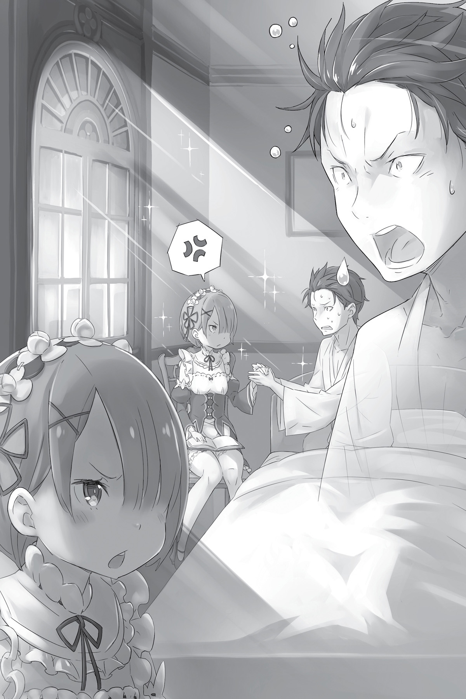
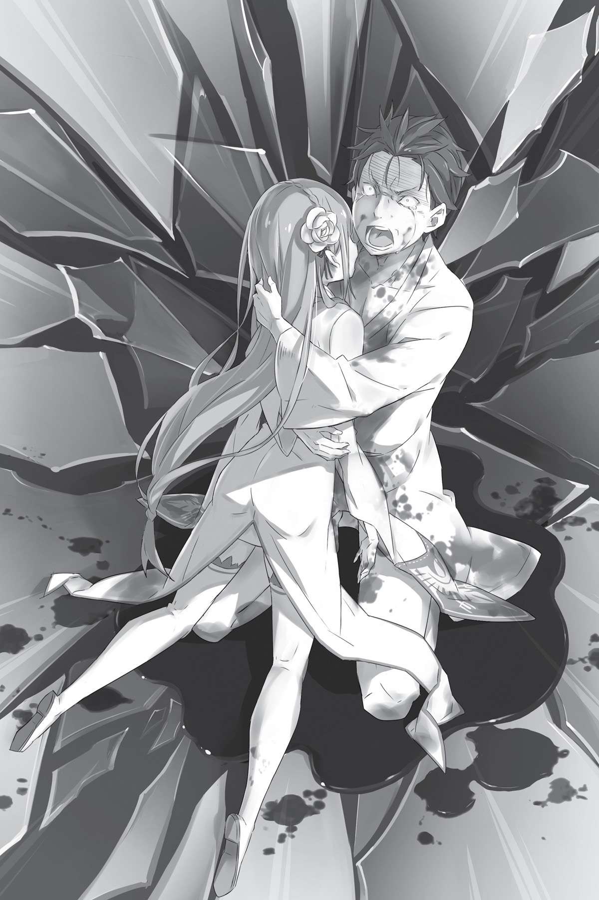
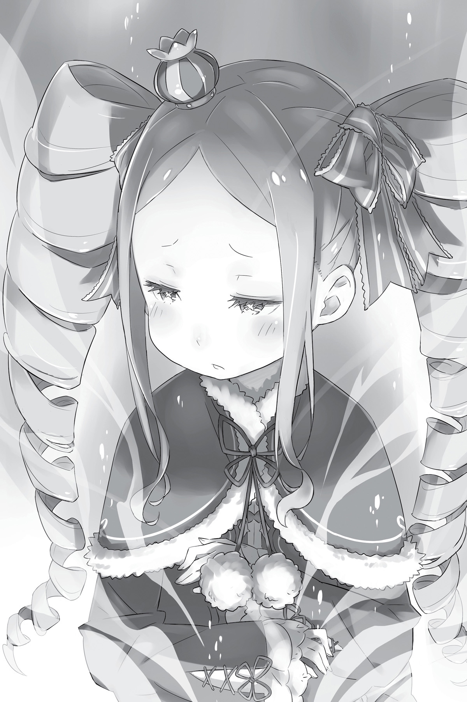

## 1

Субару сидел на козлах, откинувшись на спинку и лишь формально исполняя роль возничего. Мысли его блуждали где-то далеко. Усталость и раны брали своё, но больше всего были измотаны нервы.

Сломанные кости и ссадины на лбу нужно было срочно залечивать. В вывихнутой левой руке пульсировала боль. Язык нащупывал обломки зубов, и это было гадкое ощущение. Одежда, измазанная кровью и грязью, пропитавшаяся мочой, неприятно липла к коже и холодила её.

Зачем он остался жив?

Теперь, когда он потерял Рем, когда его бросил Отто, а он, как последний трус, слёзно молил о спасении… Когда его оставил даже Белый Кит, он, как сумасшедший, метался в ночном тумане и наконец выбрался из него живым. Куда их приведёт эта дорога, по которой он следует вместе с другим уцелевшим — земляным драконом? И даже если она куда-нибудь их приведёт, что он будет там делать?

Он верил, что им движет желание помочь кому-то, спасти кого-то. Но на самом деле он только любовался собой, пряча за красивыми словами нежелание увидеть малоприятную картину. Теперь он понимал, что больше всего ему дорога собственная жизнь. Что он эгоистичное существо из плоти и крови. Когда они оставили Рем позади и он приказал Отто разворачиваться, торговец отказался. Не испытал ли он облегчения, притворившись, что отказ Отто больно ранит его?

Возвращаться к Белому Киту — противнику, которого не смог одолеть даже Великий Мечник, было равносильно самоубийству. Рем не хотела бы этого. Поэтому не было никакого смысла возвращаться. Не было смысла умирать. Он и не стал возвращаться, чтобы спасти Рем. Вместо этого юноша принялся умолять гнусного монстра о пощаде. Кричал, что не хочет умирать, и, обмочившись, метался во мраке как безумный. Ни одной мысли о Рем в этот момент у него не промелькнуло. Какая же она глупышка, что отдала свою жизнь ради него.

— Но… дурнее всех оказался…

Рем больше не было на свете. Сгинули и Отто, и остальные странствующие торговцы. Субару остался совершенно один. Отныне его единственный попутчик — земляной дракон, идущий по тракту туда, где живут люди.

Неважно куда. Субару был готов ехать куда угодно.

Отдавшись воле дракона, он бросил поводья и повалился на козлы. Его взгляд упал на вонзённые в дерево крестообразные кинжалы — свидетельство нападения адептов Культа Ведьмы, на которых Отто, по всей видимости, наткнулся, выбравшись из тумана. Почему бы им не явиться прямо сейчас? И сделать с ним то же, что они сделали с Отто, — прекратить его бессмысленное существование? Или он снова стал бы просить пощады, попадись им на пути? Даже если бы встретил Петельгейзе?

— Петель… гейзе…

Произнеся имя объекта своей ненависти, Субару остро ощутил пустоту в сердце. Он произнёс имя безумца, источника всех зол, который зверски расправился с Рем и вдоволь поиздевался над ним самим, и всё же в его сердце ничего не шелохнулось. Хотя всего несколько часов назад только ненависть к Петельгейзе и давала ему силы жить.

— О чём я… вообще…

Пронзительный скрип колёс резал слух. Субару поморщился от этой болезненной какофонии и слегка приподнялся.

— Лес?

Он не успел заметить, когда дракон остановился. Субару огляделся кругом. Повозка стояла на лесной тропе, по обе стороны которой возвышались деревья. Над головой нещадно светило солнце. Время, видимо, близилось к полудню. Солнечное тепло согревало до самого сердца.

— Субару?

Звонкий детский голосок застал его врасплох. Несколько ребятишек вскарабкались на повозку и, вытаращив глаза и показывая на него пальцами, принялись наперебой потешаться над его видом:

— Это точно Субару!

— Субару, что с тобой?

— Ты такой грязный!

— Субару, от тебя воняет!

Но их насмешки были совсем не злыми. Они шутили над ним с любовью: так, как это возможно только между хорошо знакомыми людьми.

— Это… вы…

Он узнал их. Он не один раз видел эти лица на протяжении нескольких дней. И он видел их искажёнными от муки и ужаса, с навсегда погасшими улыбками. Это были смеющиеся детишки из деревни Эрлхэм, располагавшейся в окрестностях особняка Розвааля.

Субару обалдело приподнял голову и разглядел впереди такой желанный пейзаж — жилища людей. Он добрался до них. Лишившись всего, отдавшись на милость отчаяния, он всё- таки успел.

— Субару?

— Эй, что с тобой?

— Осторожно!

Голоса детишек стали громче. Субару догадался, что они беспокоятся о нём. Но голова шла кругом, а ноги грозили в любой момент подвести его.

Сковавшее тело напряжение внезапно отпустило, и сознание Субару, точно стряхнув с себя груз страданий, стало мягко погружаться в глубокий сон…

— Ой, он падает!..

…пока не растворилось в нём совсем.

## 2

Открыв глаза, Субару увидел знакомый белый потолок. Простой и скромный, украшенный лишь кристаллическими светильниками, он смотрелся диковинно в особняке со множеством роскошных комнат. Он сам выбрал себе эту комнату, и она полюбилась ему за то, что в ней он чувствовал себя состоятельным человеком. Голова лежала на высокой подушке, дарившей мягкость, к которой невозможно привыкнуть. Одеяло было натянуто до самого подбородка.

Стоило Субару открыть глаза, как голова сразу начинала работать. Такая уж у него была физическая особенность. Оглядев комнату, он удостоверился, что это именно то помещение, в котором ему уже не раз приходилось просыпаться. Затем…

— О!

…его взгляд упал на девушку, сидящую на стуле подле кровати. Она читала книгу. На девушке было чёрное платье горничной, перекроенное так, чтобы осталось как можно меньше открытых частей тела. Короткие волосы украшала заколка в виде цветка. Прелестные и вместе с тем строгие черты её лица были напряжены. Едва заметив её присутствие, Субару резко, словно подброшенный пружиной, поднялся на постели и схватил её за руку. Девушка пропустила момент его пробуждения, поэтому не на шутку испугалась.

— Почему ты так бесцеремонно меня трогаешь, Барусу? — произнесла она холодно и резким движением руки стряхнула ладонь Субару, развеивая его иллюзии.

Надежда на то, что он снова встретился с дорогим человеком, которого, казалось, потерял навсегда, разбилась в тот самый миг, когда Субару понял, что у сидящей перед ним девушки розовые волосы. Это была вовсе не та, которую он надеялся увидеть, а её старшая сестра-близнец, похожая на младшую, как одна капля воды похожа на другую.

— Я понимаю, что ты рад спустя несколько дней снова встретиться со мной, но не нужно накидываться на меня, потакая своим инстинктам. Это поведение бабника, а не мужчины. Отвратительно!

Глядя на Субару с презрением, Рам отодвинулась на стуле подальше от кровати. Несмотря на абсолютное внешнее сходство с младшей сестрой, холодный взгляд и тон голоса старшей всё же ясно давали понять, кто есть кто.

— Да… Верно. Теперь уже у меня нет никакого права… — Субару зарылся пальцами в волосах и, прикусив губу, потупился. Рам посмотрела на него с сомнением.

Для неё это было не более чем обычным, не без сарказма, утренним приветствием, поэтому она ждала от него в ответ какой-нибудь шутки. Однако гость был непривычно мрачен и молчалив.

— Не заставляй меня делать то, к чему я не привыкла… — проговорила Рам и, снова придвинувшись, стала нежно поглаживать его по голове.

Ритм движений её ладони был тихим и ровным, нежные прикосновения пальцев успокаивали его нервное сердцебиение. Субару вздрогнул.

— Судя по твоему лицу, Барусу, ты сейчас думаешь о чём-то неприличном. Удивлён, что я такая добрая?

— Ещё как… Обычно ты используешь мою слабость, чтобы нанести удар исподтишка.

— Ни одна другая служанка не может похвастаться моим огромным запасом доброты и великодушия. Слишком подло издеваться над тобой, когда ты в таком состоянии. Отложу на потом, чтобы в следующий раз угостить тебя с добавкой.

— Вот теперь я тебя узнаю́.

Несмотря на обещание всего лишь отложить издевательства до удобного момента, пальцы Рам по-прежнему ласкали его с любовью и нежностью.

Они различались всем: характером, тем, как держали себя, как разговаривали, — и тем не менее они были сёстрами. Размышляя, что их забота о нём берёт начало из одного и того же источника, Субару ощущал, как его грудь болезненно сжималась. Мысленно он готовился к неизбежным мукам, потому что он должен был кое о чём рассказать.

Внезапно Рам отняла ладонь от его головы. Субару очнулся и машинально издал стон сожаления. Он поспешно прикрыл рот ладонью, но этот звук не ускользнул от внимания служанки. Рам кокетливо улыбнулась и спросила:

— Хочешь ещё?

— Я не ребёнок, обойдусь, — смутился Субару.

— Кто бы говорил, — сказала Рам, поглядывая на него искоса. — Только что едва не зарыдал, как малое дитя. Упрямство, достойное незрелого мальчишки.

Служанка пожала плечами.

— Итак, Барусу.

Придвинувшись ещё ближе, так, чтобы оказаться напротив Субару, Рам устремила на него пристальный взгляд и начала беседу:

— Сейчас ты мне всё расскажешь. Ты был в ужасном состоянии. Деревенские пришли и сказали, что в деревне появилась незнакомая драконья повозка, в которой оказался грязный полумёртвый Барусу. Я сначала подумала, что это шутка.

Рассказ о том, как Субару привезли в бессознательном состоянии в особняк, Рам вела отстранённо.

— У тебя было вывихнуто плечо и разбит лоб. Сломанные рёбра срощены, но для полного восстановления требуется время, поэтому не стоит перенапрягаться. Твою грязную, в кровавых пятнах одежду я выбросила. О мокрых штанах я рассказывать госпоже Эмилии не буду.

— Вот за это спасибо, — хрипло ответил Субару, на что Рам со скучающим видом пожала плечами.

С точки зрения Рам, всё это, вероятно, было немного забавно, но самому Субару было вовсе не смешно.

— А мои раны… Кто их залечил?

— Госпожа Эмилия, — без колебаний подтвердила его опасения Рам.

Субару уныло понурился.

— У меня не было другого выхода, — хмыкнула Рам, уперев руки в бока. — Сначала я обратилась к госпоже Беатрис, но она не захотела. Госпожа Беатрис очень своенравна, поэтому не скажу, что её отказ меня удивил.

— А Эмилия… она что-нибудь сказала по моему поводу? — боязливо осведомился Субару, тронув себя за исцелённое плечо.

— Я не могу ничего говорить, — сухо бросила Рам. — Об этом тебе следует спросить саму госпожу Эмилию. Я не знаю, что произошло между вами в столице. Мне и не интересно. Судя по твоей реакции, ты совершил что-то весьма скверное.

— Ты слишком строга ко мне.

— А мне кажется, это справедливое предположение. Боясь заговорить о главном, пытаясь перевести беседу на другую тему, ты ведёшь себя как самый настоящий трус.

Субару не нашёлся что сказать на это. Хотя в глубине души понимал, что Рам хочет услышать от него. Как бы там ни было, он вернулся один, без Рем. Естественно, первым делом он должен сообщить Рам, что слупилось с её сестрой. То ли от доброты, то ли от жестокости, но Рам ждала, когда Субару прервёт молчание и поведает ей об этом. Бесспорно, её забота о нём была и мягкой, и жестокой одновременно. Он не мог позволить себе бесконечно злоупотреблять её чуткостью.

— Рем… мертва.

В тот миг, когда Субару произнёс эти слова, в груди что-то оборвалось. Тяжёлый камень, лежавший в самой глубине души, медленно рассыпался на мелкие обломки, заявив тем самым о себе. Что это был за камень, он понял лишь тогда, когда ощутил жжение на щеках.

«Рем погибла… из-за меня…»

Из глаз Субару потекли ручьи слёз. Только сейчас он осознал это. В который раз он становился причиной её гибели.

Считая дни, проведённые в особняке Розвааля, она гибла из-за него уже в четвёртый раз. В четвёртый раз он осознавал, что Рем больше нет. Её смерть за всё время он оплакивал впервые. Впервые он лил слёзы, думая о Рем, отдавшей ради него свою жизнь. Он делал это не из жалости к себе и не из чувства вины. Ему просто не хватало её.

— Я… ничего не мог сделать… По дороге сюда опустился туман… появился Белый Кит. Поэтому Рем… чтобы я смог сбежать… Но меня бросили в тумане… Поэтому я…

Связных предложений не получалось. Субару перемежал слова со всхлипами, глотал окончания, так что понять его было непросто. Ему показалось, что своими нечленораздельными объяснениями, больше похожими на оправдания, он только позорит последние минуты жизни Рем, и ему стало страшно. Он признавал свою вину. Был готов получить наказание. Наказание, которое он, жалкий неудачник, заслуживает. Так что сейчас он соберётся с мыслями и обо всём…

— Кто такая Рем?

— Э-э… А?

«О чём это она?..»

Вопрос служанки поставил его в тупик. От удивления Субару потерял дар речи. Что значит «кто такая Рем»?

Но Рам, с сомнением глядя на Субару, повторила вопрос:

— Кто такая Рем, Барусу?

Услышав имя родной сестры, она и бровью не повела.

— Что значит «кто»? Не говори ерунды! Это же… это же твоя младшая сестра! Рем! Я говорю про Рем! Нашла время…

— Младшая сестра?..

Рам задумчиво приложила палец к губам и закрыла глаза. Она была сама серьёзность. Глядя на служанку, Субару чувствовал, что его терпение вот-вот лопнет.

— Моя младшая сестра Рем. А-а…

— Вспомнила?!

Лицо служанки выражало абсолютное безразличие.

— Нельзя вспомнить того, кого не существует, — категорично заявила Рам, не оставив Субару даже искорки надежды. — Я всегда была одна, никакой сестры у меня быть не может.

— Что за чушь?.. Ты хоть понимаешь, что ты…

— У меня нет сестры.

— Не прикидывайся! Если бы не Рем, чем бы закончилась та схватка со зверодемонами в лесу?! Я, Рем и ты, мы…

— Ты и правда не в себе, Барусу. Обидно признавать, но истребление вольгармов наполовину твоя заслуга. В остальном постарались мы с господином Розваалем. Никакой младшей сестры по имени Рем и близко при этом не было.

Доводы Субару не подействовали. Рам слышать не хотела ни о какой сестре. Детали событий нескольких кругов жизни в особняке оказались вытеснены из её памяти. Реальные воспоминания заменились в памяти Рам ложными.

В голове Субару всё перепуталось. Что случилось с Рам? Почему она так говорит?

— Это вовсе не смешно… Мне бы такое и в страшном сне не приснилось…

— Я всегда серьёзна. Это ты у нас любитель пофантазировать.

— Пофантазировать?.. Пофантазировать?! Совсем, что ли?!

Видя, что её ничем не проймёшь, Субару отбросил одеяло и встал с кровати. Ослабленные ноги подрагивали, но злость придала ему силы, и он зашагал к двери.

— Барусу, тебе пока нельзя…

— Заткнись! Сейчас… сейчас я тебе покажу!

Рам протянула к нему руку, чтобы остановить, но он яростно отмахнулся. Они находились в его личной комнате на втором этаже восточного крыла особняка. Комната Рем располагалась на третьем этаже. Туда он и направлялся, надеясь отыскать там доказательства существования Рем.

— Ты ещё очень слаб. Если тебе станет хуже, это доставит мне лишние хлопоты! — предупредила Рам, идя следом за ним, но Субару лишь раздражённо дёрнул плечом.

Подъём по лестнице занял у него больше времени, чем обычно. Наконец он достиг третьего этажа, прошёл по коридору и остановился перед дверью знакомой до мельчайших деталей комнаты.

Сейчас он войдёт и докажет, что Рам просто бредит. Субару схватился за ручку и влетел внутрь. Без колебаний.

Интерьер комнаты оказался простым, однако скромных, характерных для Рем элементов убранства здесь…

— Что за… фигня?..

Однако скромных, характерных для Рем элементов убранства здесь не было.

Как и в остальных пустых комнатах, единственными предметами мебели служили кровать да небольшой письменный стол. Пусть личное пространство Рем и не отличалось обилием вещей, однако всякие безделушки, которые любят хранить девушки, придавали ему некоторую индивидуальность, которой в этом помещении не было и в помине.

— Этого не может…

Не веря своим глазам, Субару оглядел комнату, а затем вылетел в коридор, мимо стоящей у двери Рам. Не обращая внимания на взгляд служанки, он принялся считать двери, начиная от крайней, у лестницы, и заканчивая той, в которой только что побывал. Всё верно. Ошибка исключена. Он нашёл бы нужную дверь даже с закрытыми глазами.

Тогда в чём же дело?

— Это Беатрис? Она перемешала комнаты, как тогда, в самом начале, и…

— Барусу!

— Точно! Это точно она! Это же её фирменный трюк! Выставить меня дураком…

— Барусу, довольно.

Тихий голос Рам подействовал на Субару как ведро холодной воды. Он в ошеломлении уставился на служанку.

Это было невероятно, но в её взгляде читалась столь несвойственная ей глубокая тревога. Она беспокоилась о нём.

Но это был не тот взгляд, который Субару хотел сейчас видеть. В его голове помутилось.

— Рем… здесь…

— Такого человека в этом доме никогда не было, — сказала Рам, качнув головой, и затем добавила, выделяя каждое слово: — У — меня — нет — никакой — сестры.

И тут Субару очнулся окончательно.

## 3

Зная, что он в ответе за смерть Рем, Субару был готов понести наказание. Наконец он принял эту тяжкую ответственность, бремя, от которого раньше уклонялся всеми правдами и неправдами.

— У… меня…

«…нет права оплакивать судьбу Рем, нет права просить прощения?»

Он думал, что старается ради Эмилии, но она не принимала его помощь. Они смотрели на это совершенно по-разному. Рем, готовая ради него на всё, каждый новый круг жизни гибла героической смертью. И теперь, когда он решил взять на себя ответственность за её жизнь, мир отобрал у него эту возможность.

Всё было против него. Время, мир, Культ Ведьмы, Белый Кит — всевозможные преграды мешали сбыться его надеждам. Почему этот мир так жестоко обманывает его ожидания?

Это просто… просто…

— Барусу, тебе следует вернуться к себе, — сказала Рам.

Субару по-прежнему стоял истуканом посреди пустой комнаты. Служанка взяла его за руку, вывела за порог и легонько толкнула в спину.

— Должно быть, ты переутомился, поэтому в твоей голове такая сумятица. Возвращайся в комнату и досматривай сон. У меня много дел, я не могу долго с тобой возиться, — строго сказала она, хотя прекрасно видела, насколько он подавлен.

Уже спускаясь по лестнице, Рам бросила через плечо:

— Иди в свою комнату и ложись спать.

«Быть может, и правда лечь спать», — думал Субару, когда служанка ушла. Возможно, сон избавит от ощущения того, что он здесь чужой. Всё это дурной сон, не иначе. Он видит сон, в котором ложится спать, чтобы видеть сны. Лучше бежать, скрыться где-нибудь подальше отсюда. Он оказался здесь, спасаясь бегством. Что, если повторить побег? Что, если скрыться от реальности, погрузившись в сон, и бежать, бежать, бежать, пока не…

— Ну сбегу, и что дальше? — пробормотал он и, прежде чем сделать шаг вниз по лестнице, замер и отвёл занесённую над ступенькой ногу назад. Сбежать от реальности в сон было не самой удачной идеей. Субару поднял взгляд на лестницу, ведущую на верхний этаж.

Побег ничего не изменит. Субару снова чуть не предал Рем. Ради чего она защищала его и, рискуя жизнью, позволила сбежать от Белого Кита? Чтобы дать ему возможность достичь цели — защитить дорогих ему людей, вырвать их из дьявольских лап Культа Ведьмы. Если сейчас он отступит от этой цели и отдастся во власть сна, то…

— Это будет даже подлее, чем молить о прощении… — произнёс он, повернулся к ступеням, ведущим наверх, и уверенно зашагал на верхний этаж. Туда, где его ждала та, ради которой он вернулся.

Ступенька за ступенькой, он твёрдыми шагами поднимался. Достигнув конца лестницы, Субару приблизился к нужной двери, сделал глубокий вдох и медленно выдохнул.

Взявшись за ручку, он обнаружил, что им овладело необыкновенное спокойствие. Сердце, которое совсем недавно, когда он ворвался в комнату Рем, било как отбойный молоток, сейчас совершенно затихло. Может быть, к нему вернулось самообладание? А может, нервное напряжение достигло такого пика, что повергло сердце в глубокую тоску, и оно за было о своём назначении? Для Субару сейчас не было никакой разницы.

— Рем, придай мне храбрости…

Стоило произнести её имя, как он тут же ощутил в своих пальцах силу. Субару повернул ручку, и тяжёлая и прочная на вид дверь мягко распахнулась. За дверью оказалась сидящая за письменным столом девушка, которая обернулась и воскликнула:

— Субару?

Услышав, как этот голос, похожий на звон серебряного колокольчика, произносит его имя, Субару закрыл глаза. Сердце наполнилось невыразимым чувством, и он наконец вспомнил. Он вспомнил, что вернулся именно затем, чтобы услышать этот голос.

Перед ним была девушка с бледной, почти прозрачной кожей и фиалковыми глазами. Её серебристые волосы качнулись, когда она поднялась из-за стола, а прелестные, утончённые черты лица омрачила тень печали.

— Почему ты вернулся?

Внимание Субару поглотило не столько содержание этого вопроса, сколько дрожь в голосе Эмилии. Губы девушки дрожали, в глазах трепетал слабый блеск.

Спустя столько времени они снова встретились. Ему показалось, что со времени их разлуки она осунулась ещё больше. И по голосу, и по глазам была заметна сильная усталость, как если бы Эмилия провела много ночей без сна. Очевидно, что-то изводило её и истощало её душевные силы.

— Пойдём, — сказал Субару, не обратив внимания на вопрос, шагнул ей навстречу и протянул руку. — Здесь нельзя оставаться.

Бесцеремонное поведение удивило Эмилию, и она шагнула назад. Когда дистанция между ними снова увеличилась, Субару посмотрел на Эмилию непонимающе. Девушка отрицательно замотала головой:

— Куда мы пойдём?.. То есть зачем?

— Куда угодно, лишь бы подальше отсюда. Хочешь знать зачем? Так я отвечу: ради тебя. Я вернулся ради тебя…

— Субару, снова ты за своё! — в отчаянии воскликнула Эмилия.

Субару умолк. Девушка подняла на него полные слёз глаза:

— Появляешься ни с того ни с сего, весь израненный, и снова заставляешь меня волноваться… Разве ты не должен быть сейчас в столице на лечении у Ферриса? Почему ты здесь?

— Долго объяснять! Мне нужно много тебе рассказать, но сейчас нет времени! Прошу, послушай меня! Мы должны убраться из особняка как можно…

— Я же сказала, что не могу! Я говорила, что не могу теперь верить тебе! Разве не говорила?!

Эмилия сокрушённо качала головой. Они вернулись диалогу в вестибюле королевского замка. Эмилия оставалась слепа к отчаянью Субару, и он не мог взять в толк, почему она не желает его понять. Однако на этот раз он был готов пойти ещё дальше.

— Я всё равно уведу тебя отсюда, хочешь ты этого или нет! Когда-нибудь ты поймёшь, что я был прав! Поэтому…

— Подожди, Субару, постой! Да что с тобой?! Я тебя ещё никогда не видела таким! Ты ведь… совсем не…

— Замолчи и слушай меня! — заорал он так, что Эмилия вздрогнула и уставилась на него широко раскрытыми глазами, полными бесконечного удивления. Глядя на неё в упор и гневно сопя, Субару снова заговорил: — Здесь нельзя оставаться. Ты потом пожалеешь. Непременно пожалеешь! От этого никому не станет лучше, и это никого не спасёт. А я больше не хочу страдать, я не хочу больше лить слёзы!

— О чём ты говоришь?!.. Субару, я не понимаю!

— Замолчи! Вы… Ты должна делать то, что я говорю! И всё обойдётся! Это правда! Ну почему меня никто не хочет понять?! — вскричал он, схватившись за голову. В его голосе слышались слёзы. Сейчас его раздражала не столько стоящая напротив Эмилия, сколько вся нелепость ситуации.

Эмилия не понимала сказанного им в запальчивости. Но у Субару не было выбора: либо он говорит ей это здесь и сейчас, либо никогда. Всё то мучительное и уродливое, что накопилось у него на душе, он мог высказать только Эмилии — первопричине того абсурда, с которым ему пришлось столкнуться.

— Прости меня, — скорбно проговорила Эмилия, опустив глаза. — Я не понимаю, что ты хочешь мне сказать. Не могу понять.

Затем, не поднимая взгляда, добавила более мягким, утешающим тоном:

— Я бы хотела понять тебя… но, боюсь, сейчас у меня нет на это времени. Меня ждёт множество неотложных дел. Так что давай пока…

— К чёрту все дела! — со злостью перебил Субару, показывая этим, что ему плевать на её заботы. Застыв с открытым от изумления ртом, Эмилия только растерянно моргала. — Ты обречена. Ничего не выйдет. Мы проиграем. Можно даже не пытаться. Это конец. Всё это лишь пустая болтовня. Никого не спасти. Никто не выживет. Чем больше лишних движений, тем выше горы трупов. Вот что ждёт тебя в будущем.

Говоря эти слова, Субару испытывал грязное, злорадное наслаждение. Каждое произносимое им слово, каждый звук отдавался в сердце Эмилии болью, вонзался в него ножом и резал на куски.

В этот миг он полностью поглотил её внимание. Субару испытывал мрачное удовольствие оттого, что Эмилия была не в силах его игнорировать. Он насмехался над её намерениями, плевал на её решимость, смешивал её поступки с грязью, издевательски называл её прошлое никчёмным, а будущее описывал в тёмных, безрадостных тонах.

— Что с тобой? — прошептала Эмилия.

Её лицо сделалось неподвижным — так обидно и больно было слышать эти жестокие слова, безрадостный приговор, который он выносил её будущему. Её фиалковые глаза застилала пелена, но он этого уже не замечал. Зачарованный блеском её глаз, он увидел в них отражение мира, а точнее — отражение себя самого…

— Субару, почему ты так горько плачешь?

Только сейчас он заметил, что его лицо исказила кривая улыбка, а по щекам текут слёзы. И понял, что всё, что он сказал, он говорил о себе самом. Истекая слезами, он вспомнил каждое слово, которым только что втаптывал чувства Эмилии в грязь. И каждое слово резало по сердцу.

Его намерения, решимость, поступки, прошлое и будущее тоже никем не ценились. Ему казалось, что всё, за что бы он ни брался, разваливалось. К Субару пришло осознание, что он совершал свои поступки из чувства долга, требующего от него сделать хоть что-нибудь. Он не понимал, ради чего должен бороться. А если что-то и понимал…

Субару попытался выудить из глубин памяти самую главную причину, приведшую его сюда:

— Ради той… той, которая сопровождала меня… нет, которая привела меня сюда. Ради Рем, я должен был сделать что-то и ради Рем тоже…

Уловив краем уха его бессвязное бормотание, Эмилия с сомнением повторила:

— Рем?

У Субару перехватило дыхание.

Эмилия произнесла это имя не так, как обычно. Словно бы она говорила слово, смысл которого не был ей достаточно ясен.

— Ты тоже…

— Что?

— Ты тоже не помнишь Рем?..

О ней совершенно позабыла старшая сестра. Не осталось никаких следов, которые могли бы напомнить о её существовании. Её забыла даже та, ради кого он, рискуя жизнью, вернулся в особняк. Исчезло всё: прожитые ею дни, её мысли, её желания, её жизнь. Её улыбка, гнев, слёзы, прикосновения, свидетельства того, что она действительно существовала. То, что составляло её личность. Куда же оно подевалось?

— Ладно. Я расскажу тебе всё.

В глазах Эмилии застыл испуг. Глядя на её тонкие черты, Субару вновь убедился в том, что чувства, прежде побуждавшие его к действиям, всё ещё живы.

Раз случилось, что память о Рем исчезла в небытии, Субару твёрдо решил:

— Пусть я изойду кровью, но расскажу всё как есть.

Он решился открыть всю правду и излить ей душу. Заметив, как изменился его взгляд, Эмилия с затаённым дыханием ждала продолжения.

Субару приложил руку к груди. Сердце колотилось. Ему стало страшно, потому что он заранее понимал, к чему приведёт его признание. Его настигнет боль. Боль, от которой можно потерять рассудок. Некто станет издеваться над ним, стискивать, сдавливать сердце, причиняя долгие страдания, которые неизвестно когда закончатся, и нельзя будет даже закричать. Пусть так. Неважно. Какая разница? Теперь на всё плевать. Что такое боль по сравнению с муками, которые он испытывает сейчас?

Она может не поверить ему. Может не понять его. Если он способен вытерпеть страдания оттого, что никто не помнит Рем, тогда ему не страшна любая боль. Если уж идти, то до конца. Даже если придётся отдать за это своё сердце.

— Эмилия…

— Да…

— Я… видел будущее. Я знаю, что произойдёт дальше. Потому что я… возвращаюсь после смер…

В тот миг, когда Субару заговорил о главном, всё кругом застыло. Как он и предполагал, движения постепенно замедлялись, пока наконец не остановились совсем. Краски поблекли, исчезли слышные до этого звуки ветра, дыхания, стук сердца. Субару оказался отрезанным от всего мира. А затем, словно решив составить Субару компанию, хотя он нисколько не нуждался в ней, в воздухе медленно материализовалась добрая и ласковая рука. Вначале возникла чёрная дымка, которая, бесшумно скользя в пространстве и извиваясь, приняла форму руки. Раньше эта дьявольская рука всегда принимала форму правой конечности. Однако с каждым новым тайным свиданием дьявольская рука показывала ему какой-нибудь новый приём. И теперь, с небольшим запозданием, к ней присоединилась и левая рука.

Приблизившись к Субару, левая рука принялась ласково гладить его по щеке. Правая же, точно ей было невтерпёж, поспешно проникла в его грудь, проскользнула мимо рёбер и нежно обвила свои пальцы вокруг сердца. Ощущение того, что сердце находится всецело во власти этой руки, напугало Субару. Если раньше чёрное облако, едва появившись, без дальнейших церемоний причиняло Субару острую боль, то теперь жизнь юноши находилась в этой коварной чёрной руке, которая желала сломить его волю и решимость запредельным ужасом. Вместо ожидаемой боли в сердце Субару начинал зарождаться безмолвный ужас.

Он поклялся, что вытерпит любую боль. Но дьявольская длань, будто в насмешку над его готовностью, решила, что обычной боли недостаточно, и придумала, как подавить его и психологически, и физически. Не в силах пошевелить даже пальцем, Субару хотел кричать. Но он не стал этого делать, лишь крепче сжал обездвиженные челюсти. Какими бы мучительными ни были страх, боль и неизвестность, они ни за что его не сломят. Иначе все усилия пойдут прахом. Иначе он не получит прощения. Потому что, если уж в этом мире, где никто не помнит о Рем, Субару, взявший на себя ответственность за её смерть, будет просить прощения, он сможет сделать это только в своей душе. Пускай боль, муки, пусть всё что угодно изрубит его на куски. Но его твёрдую решимость так просто не поколебать.

Затаив дыхание, Субару неотрывно, со злостью в глазах смотрел на чёрную руку, которая по-прежнему сжимала его сердце. Но рука оставалась совершенно неподвижной. Она позволяла себе это потому, что могла убить его в любой момент. Когда состязаешься, кто кого перетерпит, в мире, где время остановилось, приходится сражаться до полного истощения моральных сил. Рано или поздно решимость Субару будет сломлена, и он примет это поражение со смирением. Но до тех пор он будет терпеть эти муки сколько угодно часов, сколько угодно дней. Он готов вытерпеть самые тяжкие страдания.

Внезапно в неподвижный мир начали возвращаться краски. Боль, которая должна была прийти, канула в небытие, так и не достигнув своего пика. К Субару, оставшемуся один на один со своей решимостью, вернулись цвета и время. Всё кругом снова наполнилось звуками. Он опять стал слышать свои дыхание, сердцебиение. Мир, словно насмехаясь над его растерянностью, возвращался к жизни.

Неужели дьявольские силы осознали свою беспомощность перед непоколебимой решительностью Субару? Здравый смысл подсказывал, что этого не может быть, ведь они уже столько раз подвергали его своим пыткам. В груди всё ещё оставалось ощущение, как правая рука из чёрного облака нежно обхватывает пальцами сердце. Если она в состоянии сжимать его сердце, тогда Субару сейчас…

Придя к этой мысли, он вдруг заметил странную вещь. Он ясно ощущал неприятное прикосновение правой руки, которая крепко сжимала его сердце. Но куда же подевалась левая? Сначала она гладила его по щеке, а потом…

Прежде чем он успел ответить на свой вопрос, застывшая напротив Эмилия издала какой-то невнятный звук:

— Угх…

И вдруг упала ничком прямо на него. Он машинально вытянул руки вперёд и подхватил её падающее тело. Субару едва не задохнулся, когда ощутил ладонями тёплое, мягкое прикосновение.

Кап.

— А?..

Кап-кап-кап.

— Эмилия?

Кап-кап-кап-кап.

Держа Эмилию на руках, он с ужасом наблюдал, как из её рта обильно струилась кровь. Где была левая рука, пока правая сжимала сердце Субару в своих пальцах?

Голова Эмилии лежала на его плече, из её рта продолжала бежать кровь, заливая ему рубашку. Тело Эмилии становилось всё легче и легче.

— Прекрати… А? Что?..

Он попытался остановить кровь, приподнимая голову девушки, но она падала назад. Плечи обмякли и опустились, и когда Субару посмотрел в её потухшие глаза, то всё понял. Эмилия умерла у него на руках.

— А-а-а-а-а-а-а-а!!!

Вопль эхом прокатился по особняку.

Если бы этот крик, разрывающий голосовые связки, помог ему забыть всё, что он только что увидел! Пусть вопль раздирает ему горло, пусть разорвёт его на части, пусть заберёт всё, что у него есть.

Тело Эмилии, обмякшее тело Эмилии, повисшее у него на руках, становилось всё легче. Непрекращающийся поток алой крови с каждой секундой всё больше и больше пачкал одежду Субару.

В то время как правая рука сжимала его сердце, левая завладела сердцем Эмилии. Злая насмешка судьбы не оставляла камня на камне от его решимости, готовности, устремлений, его прошлого и будущего. Твёрдая решимость, которую он только что считал непоколебимой, была стёрта в порошок, а сам Субару Нацуки погрузился в бездну отчаяния. Его вопль всё ещё отдавался эхом в коридорах.

В конечном счёте Субару…

…убил Эмилию.

## 4

Сколько слёз он ещё должен выплакать? Сколько страданий ещё должен вынести? Неужели его поступки так непростительны?

Получив столько ран, искалечив душу, потеряв друга, не сумев спасти тех, кого должен был защитить, теперь он собственными руками лишил жизни самого дорогого человека. Разве кто-нибудь заслуживает подобного наказания?

— Я… я…

Ошибся. Промахнулся. Замечтался. Повёл себя слишком самонадеянно, решив, что сможет воспользоваться наложенным на него ведьмовским проклятием, ведь однажды ему удалось обратить его против самой Ведьмы. Этому способствовала легкомысленность, с которой он надеялся вернуться после смерти, в результате чего он недооценил и отвратительную Ведьму, и её дьявольские козни. Всё это привело к ужасной трагедии, разыгравшейся у него на глазах.

Субару рухнул на пол, положил себе на колени бездыханное тело Эмилии и принялся растерянно водить остекленевшим взглядом по сторонам. Сколько прошло времени с момента её внезапной смерти?

Он прикоснулся к похолодевшей щеке. Даже бегущая из её рта струйка крови стала студёной как лёд, а нежная кожа рук начинала костенеть. Все признаки смерти были налицо. Смерть была очевидна, и всё же Субару не мог заставить себя сделать хоть одно движение.

Как же он устал. Неужели на его долю выпало недостаточно мучений? Найдётся ли в этом мире человек, который настрадался бы так же, как Субару? И если найдутся такие люди, то сколько их наберётся? Он не щадил своих сил, делая всё возможное и невозможное, и всё-таки не смог избежать катастрофы: беда настигла его и лишила всего. Неужели этого мало?..

— У тебя такое лицо, будто ты хочешь сказать: «Я самый несчастный в мире человек!»

Субару повернул голову к дверному проёму. В комнате они должны были быть вдвоём с Эмилией. Наверное, ослышался. Медленно-медленно, словно во сне, он поднял глаза и увидел в дверях девочку. Она глядела на него с пренебрежением.

Её длинные, кремового цвета волосы были разделены на прямой пробор и завиты в прелестные букли. На девочке было роскошное платье, в какие бывают одеты европейские куклы. Что касается внешности, она была само очарование. За эти несколько зацикленных во времени дней Субару возвращался в особняк дважды, но с ней встретился впервые.

— Беа… трис…

— Ты и так не отличался храбростью, но, пока мы не виделись, окончательно превратился в тряпку, мнится мне, — едко заметила Беатрис и окинула взором разыгравшуюся в комнате трагедию. — Хорошеньких дел ты натворил.

К своему предельно краткому комментарию девочка добавила лишь лёгкий вздох. Вид неподвижного тела Эмилии в луже крови и обнимающего её Субару, во взгляде которого зияла пустота, не вызвал у неё более никаких эмоций. Однако спокойствие Беатрис не пробудило в нём естественного внутреннего протеста. Наоборот, он был готов сказать ей спасибо за то, что она не задавала лишних вопросов. Субару был бы рад, если бы она прямо сейчас оставила его наедине с Эмилией.

— Пакки не выйдет, мнится мне, — проговорила Беатрис. Подойдя к Субару, она опустилась на колени и протянула руку к Эмилии. Не зная, что она хочет сделать с трупом, Субару тем не менее не пытался её остановить. Между тем Беатрис коснулась пальцами основания шеи Эмилии, чем вызвала у Субару неописуемое раздражение. Ему захотелось отогнать девчонку, но, прежде чем он успел открыть рот, Беатрис уже сделала то, что хотела.

— Сняла, мнится мне, — сказала она. В ладони она сжимала снятый с Эмилии кристалл, сиявший великолепным изумрудным светом.

Это был кулон, с которым та никогда не расставалась. Он служил домом для Пака — духа, с которым она заключила контракт, — и являлся доказательством их договора. Однако теперь кристалл…

— Он… расколот…

— Не будем показывать пальцем на того, кто в этом виноват. Всё равно с тебя как с гуся вода.

Беатрис с грустью посмотрела на кристалл, расколовшийся у неё в ладони ровно надвое, а затем убрала его за пазуху.

Что произошло с духом, который должен был находиться в кристалле? Где он теперь, этот всеми любимый дух, называвший Эмилию своей дочерью? Куда подевался?

— Не бойся, Пакки не умер, — сказала Беатрис как ни в чём не бывало, точно прочитала мысли Субару. — Просто теперь ему пришлось принять свой истинный облик. Чтобы вернуться сюда, нужно время… Но времени-то у него как раз не так много, мнится мне.

Девочка поднялась и отряхнула полы юбки. Глядя на её упругие букли, Субару испытал облегчение, хотя это чувство совершенно не вязалось с происходящим. Раз она сказала, что дух жив и что он ещё вернётся сюда, так и будет.

— Ты хочешь что-то сказать, мнится мне, — произнесла Беатрис бесцветным голосом.

Какие чувства скрывались за этим голосом, Субару было невдомёк. Но ему в самом деле было что сказать.

— Убей меня.

Ему хотелось, чтобы его убили здесь и сейчас.

Всё опостылело. Все эти передряги вымотали его. Поэтому не осталось никакого желания жить. Смерть закончит страдания. Даже если после неё можно начать круг заново, он наверняка снова всё потеряет. В любом случае он был сыт этим миром по горло.

Эмилия мертва, Рем погибла. Все усилия оказались напрасны. Поэтому…

— Убей… меня…

Теперь его спасёт только смерть. Если она может выполнить хоть какую-то просьбу, пусть лучше положит конец его никчёмной жизни. Пусть растопчет его человеческое достоинство, убьёт чувства. Пускай превратит это жалкое, бестолковое, всеми брошенное существо в пепел. Пусть сотрёт его с лица земли. Эта девочка, что стоит напротив, обладает сверхъестественной силой, а значит, она сможет это сделать.

Коль скоро Беатрис не питала к нему симпатии, нет сомнений, она убьёт его жестоко, сообразно его прегрешениям, если только согласится это сделать. Всё равно глупец по имени Субару умирал уже девять раз, и ничего не изменилось. Так что десятая по счёту смерть станет хорошим поводом покончить со всем. Прекрасным моментом, чтобы убедиться, что он уже всем опротивел: и богам, и богиням, и ведьмам, и бесам. Поэтому…

— Убей меня… прямо здесь, — взмолился Субару с трупом Эмилии на руках.

Пусть всё кончится сейчас. Он хочет умереть, прижимая к себе тело Эмилии.

Субару всегда думал только о себе, потому-то всё и закончилось наихудшим образом. Он был упорен в своём эгоизме до последней минуты. Покрепче обняв Эмилию, он закрыл глаза в ожидании конца.

На некоторое время повисла тишина. Затем Беатрис внезапно нарушила молчание, обронив неясную фразу.

— А? — слабо, почти шёпотом прохрипел Субару. Из груди вырвался невольный вздох, юноша открыл глаза и посмотрел на девочку снизу вверх.

Беатрис стояла на прежнем месте и скорбно глядела на Субару. Обхватив своё тонкое тельце руками и покусывая дрожащие словно от холода губы, девочка произнесла поникшим голосом:

— Просить, чтобы я убила тебя… Слишком жестоко, мнится мне.

Субару перестал понимать, что происходит. Он несколько раз моргнул, но, когда посмотрел снова, лицо девочки по-прежнему было искажено гримасой скорби. Ещё никогда он не видел её такой подавленной.

Куда же подевалась её неприязнь к нему? Беатрис всегда относилась к Субару с прохладцей. Хотя она бывала к нему добра, потому что кое-что человеческое в ней всё же оставалось, Субару полагал, что в обычных обстоятельствах она способна быть крайне жестокой.

Субару допускал, что её, возможно, пришлось бы уговаривать исполнить просьбу, допускал, что она могла отказаться, при этом бросив на него презрительный взгляд и уколов едким замечанием.

— Ничего не понимаю… Я тебя совсем не понимаю!..

Субару и подумать не мог, что ему откажут в просьбе убить с таким печальным видом.

— Беатрис?..

— Я не стану исполнять ни одно из твоих пожеланий, мнится мне. Хочешь умереть, дело твоё. Можешь умирать так, как тебе заблагорассудится. Я в этом не участвую, мнится мне.

Беатрис отрицательно мотнула головой и закрыла глаза. Её лицо снова приняло безразличное выражение. Глаза девочки были наполнены слезами, но она сдержала их и направила ладонь в сторону Субару.

— Что ты… Что происходит?!

В тот же миг пространство вокруг исказилось, по нему пробежала трещина. «Должно быть, именно так начинается разрушение мира», — подумал Субару и покрепче прижал к себе бездыханное тело.

— Так или иначе, ты уже всё испортил, — сказала Беатрис, сверля его ледяным взглядом. — Тебе больше нельзя здесь находиться. По крайней мере, я смогу защитить хотя бы этот дом, мнится мне.

— О чём ты… Нет, Беатрис! Ты…

— Я тебе не Розвааль. Боль, муки, страдания, печаль, страх — я сыта ими по горло, пусть это всё и было ради обретения будущего.

Ответ Беатрис был столь же туманен, насколько был неясен вопрос Субару. Вопреки всем законам физики Субару начало затягивать в образовавшуюся в пространстве щель. Но боли он не почувствовал.

— Будет лучше, если ты, по крайней мере, умрёшь там, где я этого не увижу, мнится мне.

Хотя последняя фраза, брошенная полушёпотом, и была произнесена нарочито бесчувственным тоном, Беатрис всё же не удалось скрыть печаль, которой она была пронизана.

Субару не мог ничего сказать, не мог ничего понять. Теперь им владело лишь одно чувство, передавшееся от Беатрис. Беатрис сокрушалась о его намерениях.

Когда искажение пространства достигло предела, щель с треском схлопнулась и исчезла. Осталась лишь кровавая лужа на полу. Беатрис с усталым видом прислонилась к стене. Медленно-медленно подняла ладонь и прикрыла ею глаза.

— Матушка, сколько же мне ещё…

Шёпот девочки, покинутой всем миром, затих, едва успев прозвучать, и так и не был никем услышан.

## 5

Выпав из образовавшейся в пространстве дыры, Субару рухнул в заросли покрытых мхом деревьев.

Выплюнув скрипнувшую на зубах землю, он поднял голову и осмотрелся. В полутьме он различал окружающие его стволы. Его выбросило посреди леса.

— Ночная чаща… Интересно, что это за лес?..

Ночное небо было безоблачным, поэтому, благодаря лунному свету, тьма не была совершенно непроглядной. Прохладный ветер шелестел листвой, кругом раздавался унылый стрекот насекомых. Судя по тому, что за пределами особняка царила ночь, Субару сделал вывод, что проспал не меньше половины дня.

Но как же он оказался здесь, в лесу?

— Скорее всего, пространственный тоннель…

Субару засосало в щель, которая мгновенно перенесла его сюда. Беатрис, владевшая магией блуждающей двери, соединяла пространство своей запретной библиотеки с дверью любой комнаты особняка. Так что при желании она запросто могла бы перенести его в другую точку пространства.

Предположения Субару казались логичными, но он по-прежнему не мог взять в толк, чем руководствовалась Беатрис. Перед глазами до сих пор стояло её печальное лицо. Пусть она и отказала ему в просьбе, но почему при этом не одарила его презрительной ухмылкой и не оставила в одиночестве? Её взгляд был исполнен разочарования и безнадёжности…

— Как будто… она…

Быть может, возлагала на него какие-то надежды?

Субару отверг эту идею. Слишком много самомнения, себялюбия. Осознал ли он, что является вредителем, который приносит одни беды? Принял ли этот факт?

Разве мог кто-нибудь надеяться на него, если он сам не был в себе уверен? Не говоря уже о том, что она его презирала. О каких надеждах может идти речь? Не много ли он на себя берёт? Ведь он и оказался в этом мире лишь потому, что всю жизнь избегал всякой ответственности.

— Никакого толку из меня не выйдет… — проговорил он с обречённой улыбкой и попытался согнуть ноги, но не смог пошевелиться.

Только теперь Субару заметил покоившийся на его ногах груз. Труп Эмилии переместился в пространстве вместе с ним и по-прежнему лежал у него на коленях.

— Эми… лия…

На её мертвенно-бледном лице, освещаемом слабым лунным светом, не было ни признаков агонии, ни спокойствия: лишь изумление оттого, что гибель настигла так внезапно. Её живое сердце раздавили, когда время замерло. Успела ли она почувствовать боль? Оставалось только гадать. Впрочем, даже если не успела, какая теперь разница! Смерть не бывает безболезненной и никогда никого не щадит.

За исключением самого Субару.

— Прости меня. Прости, прости… Прости меня, пожалуйста…

Он склонился над её лицом, на бледные щёки падали солёные капли. Удивительно, что слёзы ещё оставались. Его колодец слёз был неисчерпаем, как неисчерпаемы были терзающие его пытки.

Послышались голоса. Они бранили его. Все, кого он повстречал на своём пути, посылали ему гневные проклятия. Среди них была и сереброволосая девушка, была и девушка с голубыми волосами…

— Кто-нибудь… всё равно кто…

«Убейте меня».

Осыпаемый упрёками и презрительными насмешками, Субару, с Эмилией на руках, поднялся на ноги и, ступая по траве и ломая сучья, начал медленно пробираться сквозь лесной мрак.

Вдалеке послышался вой диких зверей. Теперь он будет только рад встретиться с теми чёрными псами-демонами. Пускай они разорвут его плоть и сожрут его целиком, вместе с маной. Ибо если они не сделают этого, ему не спастись.

Субару взял курс на вой и продолжил путь в самую глушь тёмного леса. Парадоксально, но ни тяжести тела Эмилии, ни усталости от ходьбы по горной тропинке, едва различимой во мраке, он не ощущал. Возможно, то, что перед ним появилась ясно видимая цель, позволяло ему выжать из себя всё без остатка. Однако парадоксы на этом не заканчивались…

— Канава… Значит, на той стороне…

Он осторожно спустился по склону и, ступая по переплетению корней, как по лесенке, перебрался на противоположную сторону рва. Жизненные силы иссякали, подобно огарку свечи, который вот-вот погаснет, но Субару продолжал идти. И дело было не только в стремлении достигнуть цели. Просто маршрут, по которому он следовал, оказался ему знаком.

— А, вот и вы!

В словах Субару прозвучала неуместная радость, словно он испытал облегчение. Он улыбнулся. Такая улыбка могла появиться только на лице заляпанного кровью безумца с расшатанной психикой. Субару знал этого человека. Будь перед ним зеркало, он наверняка увидел бы на своих губах точно такую же улыбку. Зловещая ухмылка, которая оставляет в сердце смотрящего глубокие раны и вызывает органическую ненависть. Однако фигурам, которым он улыбался, было не привыкать.

Субару стоял в глубине ночного леса в окружении группы фигур, облачённых в чёрное. Словно из ниоткуда, они возникли, не издав ни единого шороха, окружили юношу и направили на него пристальные взгляды. В них не было ни добрых, ни злых намерений. Абсолютно пустые, они засасывали, точно водоворот. Субару вспомнил, как встретился с этими людьми в первом круге.

— Как в тот раз…

Фигуры в чёрном, будто следуя привычному шаблону, одновременно склонили перед ним головы. Безвольно, словно марионетки, они выказывали ему уважение. Субару мог только догадываться, что они в нём нашли. Однако то, что перед ним последователи Культа Ведьмы, как и то, что между Ведьмой и тьмой, окутавшей Субару, была какая-то связь, не вызывало никаких сомнений.

— С дороги.

В действительности у него была к ним уйма вопросов. И он бы с удовольствием задал их, прежде чем отдаться в руки судьбе. Однако сейчас это любопытство было совершенно неуместно. Повинуясь краткому приказу Субару, фигуры растворились во мраке. Мир наполнила звенящая тишина. Затих и звериный вой, к источнику которого он так стремился, и неумолчное стрекотание насекомых, и шум ветра. По-видимому, Культ Ведьмы был отвратителен всему живому. А может, дело было не только в Культе, но и в Субару. Там, где Культ Ведьмы и Субару оказывались в одном месте, не могла находиться ни одна живая тварь — настолько омерзительным сочетанием они были. Именно вторая версия казалась ему сейчас более правдоподобной. Субару слабо улыбнулся этой мысли. Теперь, когда преграда из адептов Культа исчезла, он мог двигаться дальше. Он шёл, перешагивая через корни деревьев и приминая подошвами траву, пока в конце концов не вышел на открытую местность. Дальнейший путь преграждала отвесная скала, уходящая высоко в небо, а прямо перед ней стоял тощий человек.

— Давненько тебя дожидаюсь, верный ученик милости! — произнёс он и улыбнулся точно такой же, как у Субару, улыбкой безумца.

## 6

— Так, так, так! Кого же, кого же, кого же, кого же это мы держим на руках? Не дочь ли полудемона, а?

При виде Субару с Эмилией на руках Петельгейзе согнул шею под прямым углом и с видимым удовольствием высунул язык, с которого закапала слюна.

— Бедняжка! Простилась с жизнью, не успев пройти наше Испытание! Какая несчастная судьба! Какое горе! А-а! А ты, ты, ты! Каким прилежным ты оказался! Всё сделал за нас! Лишил! Жизни! Дочь демона в преддверии Испытания!

Пока Петельгейзе размахивал руками и с преувеличенной торжественностью воспевал смерть Эмилии, вокруг собрались адепты Культа. Все как один они упали на колени и стали внимательно слушать бред, который нёс безумец.

— Прилежным?.. Я?.. — еле слышно прохрипел Субару.

— Да, именно! Ты прилежен! Великолепен! Ты не такой, как мы! Мы недостаточно расторопны, туго соображаем, нам не хватает решимости, а ты взял и, никого не дожидаясь, воплотил замысел Ведьмы!

Петельгейзе радостно захохотал и стал быстро приближаться к Субару. Не дойдя нескольких шагов, он пал на колени и, распростёршись ниц, принялся стучать лбом о каменистую почву.

— Я и мои пальцы! Как мы медлительны, глупы и неумелы по сравнению с тобой! А-ах, прости меня! Недостойного любви за плохую работу! Ленивого за нерадивость! Неспособного отплатить за дарованную тобой любовь, за глупость, прошу тебя, прости!

Из глаз Петельгейзе ручьём текли слёзы, а он всё просил прощения и бился головой о землю, разбивая лоб в кровь.

Жестокий акт самоистязания сопровождался летящими во все стороны красными брызгами. На разодранных запястьях виднелись оголённые кости. Но безумие не прекращалось. Вот уже и ученики, последовав примеру полоумного, тоже принялись наносить себе увечья.

Субару наблюдал это кровавое торжество безумия и боли, оставаясь совершенно равнодушным. Даже такая отвратная личность, как Петельгейзе, не вызывала в его душе ни малейшего движения.

— А-ах! Ты завершил испытание вместо меня, нерадивого, не заслуживающего такого внимания с твоей стороны! Что я могу сделать для тебя? Скажи! Что мне сделать, чтобы ответить на твою любовь и показать, что я вовсе не ленив?

Петельгейзе приблизился к Субару вплотную, его лоб истекал кровью, а из глаз лились ручьи слёз.

— Убей меня, — сказал Субару в ответ на его мольбу.

Просьба оказалась неожиданной даже для такого маньяка, как Петельгейзе.

— Ты уверен, что хочешь этого?

Но Петельгейзе даже не выказал удивления. Нисколько не растерявшись, он тут же пнул Субару в корпус. Юноша зашатался и отступил назад. Петельгейзе поглядел на него с восхищением:

— А-ах! Великолепно, великолепно-лепно-лепно! Разве я не прилежен? Я, завершивший испытание, давший спасение ученикам, ищущим спасения, давший любовь! А-ах, всё-таки я сумел не погрязнуть в лени! И я, и ты! Тебе — благодарность! Моему прилежанию — любовь!

Нисколько не сомневаясь в просьбе Субару, ставшей его идеей-фикс, не испытывая никаких мук из-за своего безумия, ни грамма не опасаясь того, что с логикой этого мира что-то не так, Петельгейзе был рад пролить чужую кровь, объясняя свои зверства прилежанием.

Взглянув на беснующегося архиепископа и ощущая нарастающую пульсацию в груди, Субару закрыл глаза. По крайней мере, теперь его желание исполнится. Смерть уже близко, он чувствовал её дыхание кожей…

— И всё-таки… — вымолвил Петельгейзе. — Не преодолеть ни единого Греха, не найти в себе сил взглянуть в глаза хотя бы одному, при этом строить далеко идущие планы и, споткнувшись о первый попавшийся камешек, издохнуть…

Стенания безумца были адресованы спящей вечным сном Эмилии.

— А-ах, как ты… ленива!

Более дерзкое надругательство над смертью Эмилии было сложно придумать. Это напомнило Субару, как в прошлой жизни этот маньяк всячески унижал ещё живую Рем.

Открыв глаза, он увидел надвигающееся на него чёрное облако, принявшее форму руки. Субару тут же сжался, вспомнив, какие страдания она всегда приносит. Однако на этот раз всё было совершенно иначе. Он мог двигаться. Он мог двинуть ногой, пошевелить рукой. А значит, мог и уклониться.

Как был с Эмилией на руках, Субару прыгнул в сторону, увернувшись от медленно, но неумолимо приближавшейся чёрной руки. Промахнувшись мимо цели, рука словно бы растерялась и растаяла. Субару наблюдал за этим со стороны, тяжело дыша.

— Ты же видел сейчас Незримую Длань, ведь так? — спросил архиепископ с дрожью в голосе. Широко раскрыв глаза, в которых плясал огонь безумия, он пристально смотрел на Субару.

Затем он стал по очереди засовывать в рот свои тонкие, как хворост, пальцы и разгрызать суставы. Послышался отвратительный треск рвущейся плоти и ломающихся костей.

— Нет. Это неправильно, — произнёс он, разбрызгивая капли крови. — Это ненормально, это ошибка, этого не может быть. Чтобы моё Полномочие, Полномочие Лени, милостиво дарованную мне Незримую Длань! Кто-то узрел! Это недопустимо!

Хрустя обломками костей и харкая кровью, Петельгейзе не сводил с Субару налитых кровью глаз. В следующий миг его чёрный силуэт словно взорвался, высвобождая наружу несколько чёрных рук. Теперь их было семь, они бешено заплясали в воздухе. Точно такие же, как те дьявольские руки, что наказывали Субару за нарушение запрета, они порождали в душе страх и трепет.

— Раз я их вижу и они не сковывают моих движений…

…значит, от них всё-таки можно увернуться.

Перемещались чёрные руки крайне медленно. Хотя они могли дотянуться куда угодно и разорвать человека на части, страшнее всего была их способность оставаться невидимыми. Но в случае с Субару это их преимущество не работало.

— Почему? Почему? Почему? Почему? Почему-чему-че-му-чему-чему?! Ты смог уклониться! Ты узрел! Это же моя! Только моя любовь!

— Мне ненавистна сама мысль быть убитым тобой, — бросил Субару, затем крутанулся, увернувшись от одной руки, и, прыгнув вперёд, ушёл с линии атаки другой. Новые атаковали слева и справа, Субару, не теряя ни секунды, пригнулся и в мгновение ока приблизился к Петельгейзе.

При виде искажённой в изумлении морды, юноша ощутил, как в груди разливается приятное чувство. Он вспомнил. Вспомнил о том, что сам хотел прикончить этого маньяка.

С криком «На-а!» он врезал ему головой по физиономии. Архиепископ выгнулся назад, и Субару со всей силы нанёс ему удар ногой. Чёрные руки заметались, как в пламени пожара. По лбу юноши из пореза, оставленного зубами Петельгейзе, обильно побежала кровь, заливая правый глаз и мешая видеть…

Субару не успел отреагировать, когда архиепископ схватил его за ноги и швырнул к огромному дереву. Ударившись о ствол, он даже не вспомнил, что надо сгруппироваться — лишь крепче прижал к себе Эмилию, которую до сих пор держал в руках. Не из страха, а чтобы защитить её от удара.

После столкновения с деревом в спине что-то угрожающе хрустнуло, затрещали совсем недавно залеченные рёбра. Всё тело взвыло от адской боли. Субару лежал под деревом и с пеной у рта корчился в невыносимых муках.

— Безобразие! Разве это не безобразие! А-ах, как хорошо! Воистину хорошо! Моя лень зашла слишком далеко, все мои деяния едва не обратились в дым! Теперь я, как и прежде, служу прилежанию и люб…

— Заткнись! Кретин…

По хриплому звуку своего дыхания Субару понял, что его лёгкие серьёзно повреждены. И всё же он нашёл в себе силы поддеть мерзавца.

— В чём твоя любовь, идиот? — прохрипел он, сплюнув пену. — Где та любовь… которой тебя якобы одарили?.. Я не вижу её! Или ты даришь её кому-то другому? Так ты изменщик!

— Что ты! Сказал… сказал, сказал, сказал, сказал, сказаллллл… Мой мозг… мой мозг трепещщщщет!

Петельгейзе верещал, выкатывал глаза и рвал на себе волосы. Приблизившись к Субару, безумец что было сил двинул ногой по трупу Эмилии. Удар вырвал её из рук Субару, тело покатилось по земле, ударилось о корни деревьев и замерло. Петельгейзе взглянул на неё искоса и усмехнулся.

— Я не позволю поносить мою любовь! — возопил он в приступе неконтролируемой ярости. — А-ах, решено. Решено! Полудемон, что должен был пройти испытание, мёртв, но остался тот, кто его прикрывал!

Одна из чёрных рук схватила Субару за горло. Боль была такая, что, казалось, рука вот-вот оторвёт ему голову. Субару выпучил глаза, ему хотелось закричать, но он не смог выдавить ни звука.

— Сперва истреблю всех, кто живёт в особняке, затем доберусь до ближайшей деревни и принесу в жертву милости всех её жителей! Никого не забуду! Работать спустя рукава — признак лени! Для меня же превыше всего прилежание, и мы с моими пальчиками постараемся на славу! Из-за тумана по дороге сейчас не проехать, так что никто не помешает мне нести любовь!

Брызжа слюной от восторга, Петельгейзе расписывал подробности своего злодейского плана.

— Ты обнимал её так, словно она тебе весьма дорога… Что, если я разорву тело этого полудемона на части? Как ты тогда запоёшь, а? — Петельгейзе скривил губы и вопросительно посмотрел на Субару. Архиепископ сгорал от любопытства и жажды крови.

Из-за его спины выползли ещё пять рук. Извиваясь и виляя из стороны в сторону, они приблизились к телу Эмилии. Четыре руки ухватились за конечности девушки, а пятая взяла её за шею.

— Видишь ли ты? Понимаешь ли ты, что сейчас будет?

— Пре… крати!

Субару охватил страх — именно от того, что он всё видел. Он очень хорошо запомнил, что сделали руки этого маньяка с Рем, когда его взгляд был затуманен безумием. А теперь объектом той же самой жажды уничтожения стало тело Эмилии. Субару был бессилен остановить злодейство. Меж тем Петельгейзе ухмылялся всё шире. Ещё немного, и хрупкое тело Эмилии оказалось бы разорвано на части самым жестоким образом, как вдруг в небе раздался грозный голос, от которого все замерли:

«Что вы делаете?!»

Улыбка исчезла с лица Петельгейзе. Архиепископ принялся шарить глазами по небу. В голосе ощущалась такая сила и такой лютый гнев, что это напугало даже его. Наконец взгляд архиепископа остановился. Вслед за ним Субару, шея которого была по-прежнему обхвачена чёрной рукой, поднял глаза и стал всматриваться в тот же участок ночного неба.

«Повторяю!»

Тёмное небо заполнило невероятное количество ледяных стрел. С шумом вырывающийся изо рта воздух окрасился в белый цвет. Над лесом пронёсся порыв ледяного ветра.

«Что вы делаете с моей дочерью, плебеи?!»

Зверь, несущий ледяную смерть всему живому, сковал мир льдом. И оказался тем, благодаря кому Субару покинет этот мир в десятый раз.

## 7

С того момента как Субару призвали в альтернативный мир, ему неоднократно пришлось испытывать муки смерти.

Для всякого живого существа жизнь является игрой, в которой нет второго раунда. Субару же наплевал на это безусловное правило и бросил вызов смерти уже в десятый раз, поэтому смерть он знал в лицо, как никто другой. Он шёл со смертью рука об руку и был единственным, кто по-настоящему понимал, что она собой представляет. Если смерть была рядом, если в воздухе начинал витать её отчётливый аромат, он тут же улавливал его своим обострённым чутьём.

С неба, где висел частокол из льда, снова раздался голос, от которого в буквальном смысле мороз продирал по коже:

«Развлекаетесь в своё удовольствие, я погляжу?»

Роем ледяных стрел, направленных остриями в землю, руководил дымчатый кот. Именно его холодный голос они слышали.

Небольшое тельце, которое могло бы уместиться на ладони, и такой же длины хвост. Розовый носик и круглые, как пуговки, глазки. Сложив на груди короткие лапки, он, совсем как человек, смерил обидчиков Эмилии свирепым взглядом.

Глядя на сверхъестественное существо, говорившее человеческим языком, Культ Ведьмы, включая главаря, продолжал хранить молчание. Субару почувствовал, как в горле встал нервный ком. Он тоже был шокирован, однако его шок отличался от того, что испытали адепты Культа.

Никогда ещё он не видел, чтобы это существо, этот дух был так разгневан. Субару не сомневался, что достаточно одного взмаха хвоста, одного грозного рыка, и миру наступит конец.

— Пак…

Дух в облике кота продолжал парить в воздухе, окружённый белой пеленой. Деревья вокруг трещали, зелёная листва за считаные секунды покрывалась инеем, стволы обрастали льдом. Стремительно теряя ману, листья срывались с обледеневших веток и падали. На земле происходили такие же перемены: сперва погибли травы и цветы, затем сама земля обледенела и начала обжигать кожу. Боль охватила с головы до ног. Телом юноши завладела постепенно нарастающая слабость, дыхание стало неровным, сознание затуманилось. Отнимавшая ману сила была ему знакома. Однажды он испытал её на себе, когда Беатрис внедрилась в его ману. Только разгневанный Пак осуществлял это более масштабно.

Субару едва сдержал стон. На лбу Петельгейзе, в страхе шагнувшего назад, выступил холодный липкий пот. Сидевшие на земле последователи Культа беззвучно, как рыбы, раскрывали рты, словно им не хватало кислорода.

«Культ Ведьмы?.. Сколько прошло времени, а вы нисколько не изменились. Вы всегда торчали у меня как кость в горле», — произнёс Пак таким тоном, словно имел дело с насекомыми-вредителями.

Во всём лесу остался лишь один уголок, которого не коснулась убийственная сила Пака. Глаза духа смотрели туда, где лежало тело Эмилии.

«Ах, какая жалость… Погибла, даже не успев понять от чего, — вздохнул Пак и затем перевёл взгляд на уцелевших. — Вы убили мою дочь, а это весьма серьёзный проступок. Так и знайте: никто не уйдёт отсюда живым».

Однако Петельгейзе его угрозы не испугали.

— Ничтожный дух! Что ты, что ты, что ты, что ты там… сказал?! Полудемон, проваливший испытание, не более чем трусливый, безнадёжный кусок мяса! В том, что ты не смог защитить эту дурёху, виновата твоя лень! А-а! А-а! А-а-а-а-а! Мой мозг… трепещ-щ-щет!

Петельгейзе верещал, воздев руки к небу. Теперь он жаждал крови в тысячу раз сильнее. Он бешено вращал покрасневшими глазами, с губ слетала пена.

— Явления повсеместные, явления вероятные, правдивая история — всё записано в Евангелии! Ведьма любит меня, именно поэтому я воздаю должное за прилежание! Погрязни же в лени, ничтожный дух!

Любовь. Для Петельгейзе вера в Ведьму являлась не чем иным, как совершением поступков в награду за любовь. Демонстрировать Ведьме свою любовь через поступки для него было важнее всего на свете. Ведьма — прежде всего. Ведьма — важнее всего. Именно поэтому тот, кто поступал наперекор его любви к ней, заслуживал наказания.

— Полудемон мёртв! А тебе снова расплачиваться за свою лень! Ради милости Ведьмы! Ради истинной любви, приводящую сердца в трепет! Пожертвовать собой весьма похвально!

Петельгейзе вопил, размахивал руками и топал ногами. Пак смотрел на всё это безумие совершенно спокойно. Не выражая ни жалости, ни гнева, этот взгляд оставался невозмутимым потому, что не находил причин придавать значение объекту наблюдения.

— Мои пальцы! Воздайте недоумку за его прегреш…

«Умри».

Зависшие в небе ледяные стрелы посыпались на приспешников архиепископа и пригвоздили их к земле. Пронзённые градом стрел, теперь они были похожи на коллекцию засушенных насекомых. Воздух звенел от напряжения, а трупы адептов Культа тем временем сковывал лёд, превращая каменистую поляну в выставку ледяных скульптур.

Безо всяких прелюдий Пак в один присест уничтожил почти две дюжины противников, даже глазом не моргнув. Петельгейзе тоже оставался равнодушен к судьбе своих подчинённых, только что пущенных им в расход. Улучив момент, когда внимание Пака ослабло, он расплылся в отвратной улыбке и произнёс:

— Мой мозг… трепещет.

В тот же миг на глазах у Субару фигура архиепископа выбросила новую порцию рук. Взрывной волной Субару отбросило в сторону, а семь рук двинулись в небо прямо на Пака.

Дух обладал достаточной сноровкой, чтобы с лёгкостью уклониться от медленно приближающихся дьявольских дланей. Однако ничего не делал. Он их не видел.

— Пак! — вскричал Субару, чтобы предупредить об опасности.

Взгляд и голос Пака оставались невозмутимыми.

«Тихо, Субару. Уж тебе-то ничего… Угх!»

Пак не успел договорить, руки настигли его крохотное тельце, и дух исчез.

— Ах…

Пак был настолько маленький, что мог бы спрятаться в ладони взрослого человека. Когда его настигли целых семь рук, его уже было не разглядеть за ними. Тем более Незримые Длани Петельгейзе были так сильны, что играючи разорвали бы и человеческое тело.

— Нерадивость! Небрежность! То бишь лень! Тебе следовало прикончить меня немедля! Такой сильный, а поленился сделать то, что должен! Так пеняй же на себя! Себя! Себя! Себя! Да-да-да-да-да-а-а-а!!!

Незримые Длани, видимые только Субару, раздавили Пака, как котёнка. Петельгейзе кружился в безумном восторге. Тушка всесильного духа оказалась самым жестоким образом стёрта в…

«Это всё, на что ты способен?»

В следующий миг клубок из чёрных рук разнесло на куски, и Субару увидел.

«Уже четыреста лет ты упрямо прикрываешься именем Ведьмы. Если ты действительно намерен убить меня…»

Обледеневшие стволы деревьев сломались под навалившимся грузом. Под градом осколков качнулся длинный хвост. Ледяные статуи трупов последователей Культа разлетелись в пыль, когда на землю опустились огромные передние лапы. Всё пространство вокруг превращалось в зону смертельного холода. Его дыхание могло сравниться с вьюгой, а сверкающие в белой дымке золотом глаза глядели на погибающий мир с холодным презрением.

«…отбрось тысячу теней — половину того, что имеет Сателла».

Пред взором Субару гордо предстало гигантское, выше деревьев, четвероногое животное с серой шерстью. Зверь апокалипсиса, разрушивший однажды особняк и убивший Субару.

Мороз стал ещё сильнее. Такой, что трудно было даже открыть глаза. Превозмогая боль, Субару обалдело уставился на зверя.

— Что… ты… — послышался еле слышный шёпот, который вдруг перешёл в крик: — Что ты привёл за собой?!

От крика сухие на морозе губы Петельгейзе треснули, на них выступила кровь, но спустя всего мгновение холод сделал своё дело, остановив и кровь, и боль вместе с ней. Сопротивляясь свирепому ветру, который, казалось, не даст больше открыть веки, если рискнуть их прикрыть, Субару переварил смысл его крика и снова взглянул на зверя.

— Ты… Пак?.. — спросил он сиплым голосом.

«Если я скажу: “Не видишь, что ли?”, это не будет слишком грубо?» — подтвердил его догадку зверь, шевеля исполинскими челюстями. Каждое слово его ироничного ответа сопровождалось ураганными порывами.

После этих слов для Субару одной загадкой стало меньше. Теперь он знал, кого следует винить в его смерти в прошлом и позапрошлом кругах жизни.

— Невоз… можно… — пробормотал Петельгейзе, не обращая внимания на умолкнувшего Субару и злобно глядя на Пака.

Безумец принялся хрустеть пальцами невредимой руки, разбрызгивая капли крови. Словно его больное сознание нуждалось в боли, чтобы быть уверенным, что это не сон.

— Это невозможно, этого не должно быть! Чтобы рядовой! Дух! Ничтожный дух! Обладал такой силой! Это невозможно! Иначе я…

«Ехидна».

Петельгейзе застыл с широко распахнутыми глазами и кровавой пеной у рта. Его крик прервал Пак, произнеся некое слово, похожее на человеческое имя. Это слово подействовало на Петельгейзе самым решительным образом. «Уж вам-то, служителям Культа Ведьмы, должно быть известно, что означает это имя, не правда ли?» — спросил Пак, поддразнивая архиепископа.

— Омерзительно!!!

Реакция Петельгейзе оказалась впечатляющей. Раздался треск, и из его рта хлынула кровь. Это были его зубы. В крайней ярости архиепископ стиснул зубы так сильно, что они не выдержали и раскололись.

— Произносить её имя вслух — уже верх гнусности! А-ах, глупец, не познавший страха, презренный раб лени! Прямо мне в глаза! Назвать по имени не только Сателлу, но и другую падшую ведьму!..

Налитые кровью глаза Петельгейзе стали ярко-алыми, как если бы в них полопались все капилляры. Рыдая кровавыми слезами, безумец ткнул изувеченным пальцем в Пака.

— Это не что иное, как оскорбление моей веры! Любви! Всего, чем я пожертвовал! — вопил Петельгейзе, топая ногами.

«Человеческая жизнь коротка. Кто ты такой, чтобы говорить о времени с духом?» — холодно ответил Пак, и в его жёлтых глазах сверкнул жутковатый огонёк.

И тут извивающийся в припадке безумия Петельгейзе застыл на месте. Однако сделал он это не по собственной воле. Архиепископ превращался в ледышку, начиная с самых пяток, и теперь именно лёд сковывал его движения. Распростёршись на земле, Субару наблюдал сквозь белую дымку за агонией заклятого врага.

Близкую смерть осознавал и сам Петельгейзе. Однако это нисколько не мешало ему разразиться очередной яростной речью в адрес Пака:

— Время и сила веры не связаны! Ты растратил бо́льшую часть своей вечной жизни на праздность! Я не хочу, чтобы меня путали с таким глупцом, как ты! А-ах! А-а-а! А-а-а! Мой мозг… трепе-е-е-ещщщщщет!!!

Осознание близкого конца ни на йоту не поколебало фанатичную веру Петельгейзе. Для Субару, который, как никто другой, знал ужас неизбежности смерти, такое поведение было форменной патологией. Упрямо цепляться за свои бредовые идеи в считаных секундах от смерти мог только самый законченный психопат.

«Для вас даже смерть недостаточное наказание. Вот почему я вас ненавижу».

— Испытание пройдено! Пусть моя плоть обратится в прах, мой дух устремится на зов высокопочтенной Ведьмы и будет вкушать её милость… А-ах, как я жду нашего воссоединения!

Раскинув руки, Петельгейзе поднял глаза к небу и разразился гомерическим хохотом, но бушующая вьюга усилилась, тощая фигура архиепископа покрылась белой коркой льда, голос стал тише, движения замедлились, и вскоре безумец застыл неподвижным истуканом.

Который всё ещё продолжал заходиться смехом. Блаженное безумие не прекращалось до самого конца, пока гогот не оборвался и архиепископ не испустил последний вздох.

«Ушёл непобеждённым», — вымолвил зверь, затем хлопнул передними лапами, и превратившийся в сосульку Петельгейзе разлетелся на множество осколков, которые разметал ветер.

Смерть безумца не вызвала у Субару никаких эмоций. Архиепископ был настолько ему отвратителен, что Субару хотел его убить. Именно Петельгейзе заварил эту кашу, поэтому юноша верил, что если его уничтожить, то всё обязательно наладится.

Но что вышло в итоге? Став свидетелем смерти гнусного противника, Субару не испытывал теперь ничего, кроме внутренней пустоты. Петельгейзе был мёртв, а это значит, Культ Ведьмы больше никому не угрожал. Однако Рем, которая могла бы разделить с ним эту радость, погибла, а Эмилию, с которой он надеялся помириться, вернувшись с хорошими новостями, убил лично он.

Когда их смерть легла тяжким камнем на его совесть, Субару сам пожелал умереть, но в итоге не смог сделать и этого. Даже его заклятый враг пал от руки другого мстителя, а самому Субару ничего не досталось. Он провёл этот раунд с нулевым результатом.

«Итак».

Зверь направил спокойный взгляд на Субару, который был совершенно раздавлен собственным бессилием. От одной мысли о том, что этот исполин на самом деле Пак, Субару снова бросило в дрожь. Он вспомнил, как совершенно равнодушно наблюдал за рыцарями и Советом мудрецов, которые все как один затряслись от ужаса при упоминании прозвища Пака.

«Поговорим?»

Теперь он прекрасно понимал, каково им было в тот момент.

Адский холод затуманивал рассудок. Боль уже отступила. Смерть медленно приближалась теперь и к Субару, он уже слышал её шаги. Мечтая о смерти, он уже хотел отдаться её сладкому предчувствию…

«О, так не годится. Ты весь истёк кровью. Я остановлю кровотечение».

— А-а! — Субару вскрикнул, потому что уже почти исчезнувшая боль вернулась с новой силой, словно его окатили кипятком.

От этой боли сдавило горло, все многочисленные раны на глазах Субару начали, потрескивая, замерзать. То же происходило и с переломами: лёд сращивал сломанные кости, пока не восстановил их все. Пак лечил Субару, не обращая никакого внимания на муки, которые доставляла процедура исцеления. В голове что-то взорвалось, и мир перед глазами окрасился в красные тона. Назвать это болью было бы слишком мягко, внутри него творился ад.

«Субару, ты совершил три проступка».

Зверь-исполин продолжал как ни в чём не бывало говорить с Субару, который уже почти потерял сознание, раскрыв рот в немом крике. Несмотря на свои гигантские размеры, торчащие из пасти острые клыки и громоподобный голос, говорил Пак по-прежнему мягко и спокойно, и именно это и пугало.

«Во-первых, ты нарушил данное Лие обещание. Должно быть, ты не совсем понимаешь, как важно для повелителя духов соблюдение договорённостей. Видимо, тебе совсем невдомёк, какую боль ты причинил Лие, опрометчиво нарушив договор».

Разум отказывался понимать то, что говорил Пак. Точнее, разум Субару пребывал во власти боли.

Лёд, не щадя внутренностей, соединял сломанные кости, пронзая плоть, которая оказывалась на пути сращивания. То, что Пак называл остановкой кровотечения, являлось крайне болезненной заморозкой кровоточивших ран. Чем крупнее была рана, тем больше был участок, подвергавшийся заморозке. Тем сильнее была боль. Тем ближе казалась смерть. Очень больно, очень больно, больно, больно…

«Во-вторых, ты вернулся, проигнорировав желание Лии. Бедная Лия не хотела встречи с тобой. Так в какое положение ты её поставил? Мало было растоптать данное ей обещание, ты вытер об неё ноги».

Пак приблизил морду к распластавшемуся на земле Субару и вздохнул, обдав его холодом. Дыхание зверя доставило ещё больше мук, как если бы в глаза вонзились иголки, в которые превратились замёрзшие слёзы. Мозги юноши корчились в спазмах.

«И в-третьих, ты погубил Лию».

Слова Пака прошлись по сердцу напильником, Субару даже забыл, как дышать. Нервы будто окунули в раскалённую магму. Он проклинал свою глупость. Он ошибался, полагая, что легче стерпеть боль, чем смерть. Глубоко ошибался. Боль, смерть, страх уничтожали слабака Субару Нацуки в равной мере. Душа Субару Нацуки была загнана в угол, откуда нет выхода.

Субару уже начинал, хоть и медленно, осознавать ужасную правду, когда Пак заявил:

«Следуя контракту, я уничтожу мир».

Если раньше в глазах зверя горела лишь ярость, то теперь в них заиграло ещё одно, другое чувство.

«Я обращу мир в лёд и похороню его под снегом. Пусть это будет моим прощальным подарком для Лии».

— Ты… не…

«Обрадует он её или нет, но решение принято, и я не буду его менять. Контракт есть контракт», — сказал Пак и слегка улыбнулся: «Однако, скорее всего, я не смогу завершить начатое. Даже если я решу накрыть всю землю ледяным панцирем, как я сделал это с лесом, в котором жил вместе с Эмилией… мне непременно помешает Великий Мечник. А его одолеть я не в силах».

Озвучив прозвище огненноволосого героя, Пак горестно вздохнул. Но Субару не спешил верить его признанию. Обладая такой силищей, Пак утверждал, что в схватке с Великим Мечником у него нет шансов на успех. Тогда зачем он собирается жертвовать собой в бою, если понимает, что его ждёт гибель?

— Зачем… ты…

«Лия… Эмилия была для меня всем. Вместе с ней я потерял смысл жизни. Мир без неё не имеет права на существование. Для меня всё закончилось в тот момент, когда не стало Лии».

Как только Пак умолк, пронизывающий ветер задул ещё сильней, он не давал открыть глаза, от него замерзала кровь… Конец был близок.

«Интересно, как долго продержится человек, если постепенно его замораживать, начиная с кончиков пальцев? Любопытно, не правда ли, Субару?»

Субару не проронил ни слова.

«Молчание — знак согласия. Мне бы хотелось, чтобы ты сам помог мне узнать ответ на этот вопрос».

Медленно, медленно холод вгрызался в плоть. Если от боли можно сойти с ума, то почему он не лишит его рассудка как можно скорее? Пусть он разорвёт, раздавит, расчленит его душу или как там это называется… Иначе…

«Гляди-ка, туман идёт. Похоже, незваный гость скоро пожалует».

Что за звуки? Кто-то что-то говорит, но ничего нельзя расслышать.

«Полномочие Чревоугодия… Да, если я не ошибаюсь, его зовут Белый Кит. Ты вызвал его, погубил Лию, а заодно и себя… Ты и правда совершенно никчёмен».

Что там за голос? Ничего нельзя расслышать. Ничего не ясно, но всё же слышен голос.

Он смеётся. Хохочет. Откуда-то доносится хохот. Трескучий гогот. Знакомый хохот. Он принадлежит человеку, которого он до смерти ненавидел.

«Откуда же он доносится?» — мелькнула мысль, прежде чем кашеобразное сознание шагнуло за линию невозврата.

Ах, вот оно что. Неудержимый трескучий смех звучал из его собственного горла. Боль отошла на второй план, и мозг начинал испытывать наслаждение. Безумие расширяло пределы, и Субару с удовольствием ступал на его территорию. Хохот не прекращался. Это был хохот над самим собой. Погубил Рем, убил Эмилию и сам сдох собачьей смертью. О да, это не что иное, как…

«Лень, да, Субару?»

Нить, связывавшая сознание с реальностью, лопнула. Но вместе с ней потерялось и нечто другое. Нечто, что он долго, любыми способами пытался сохранить. Теперь оборвалась связь и с этим. Лопнула последняя нить.
