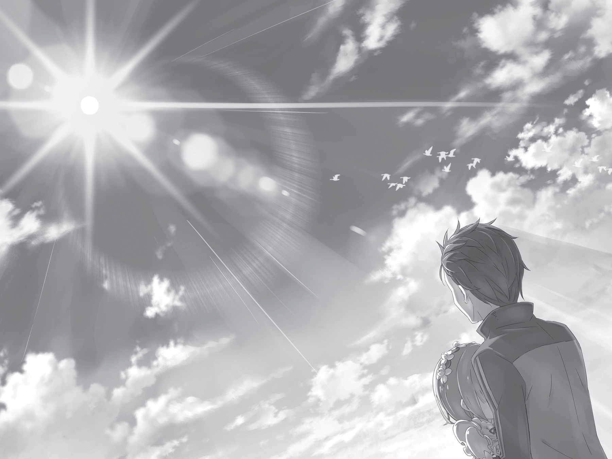

## 1

Мир исчезает в белом тумане.

Что случилось с его заледеневшей плотью? Быть может, она растворилась? Или разбилась на осколки? А может, обрела вечный покой, обратившись в ледяную статую? Кто знает…

Теперь ему было совершенно всё равно. Лишь одно он понимал предельно ясно: каждый новый круг заканчивался одинаково плачевно. Каждый новый круг он усугублял ситуацию и в итоге лично погубил ту, которую больше всего стремился уберечь от несчастий. Теперь он наконец осознал.

Осознал, что никто, даже он сам, не сможет положиться на Субару Нацуки.

Привыкнуть к ощущению, когда утраченные чувства внезапно возвращаются, невозможно, сколько раз его ни испытывай. Сначала — абсолютная отстранённость, когда не чувствуешь даже мороза, пробирающего до мозга костей, и глубоко-глубоко погружаешься в белую студёную мглу. Затем это странное чувство отчуждённости рассеивается, ты моргаешь и видишь, что мир вокруг такой же, как прежде. По истерзанным конечностям вновь бежит кровь, боль изувеченных льдом нервов исчезает в небытии. Пронизывающий холод сходит на нет, и снова яркое солнце греет кожу своими тёплыми, ласковыми лучами.

— Ах!

С обеих сторон загомонили, зашумели — это вновь заработал слух, мёртвый ещё мгновение назад. Пытаясь свыкнуться с резким и бессмысленным гомоном, Субару оценил своё состояние. Окоченевшие руки и ноги, повреждённый позвоночник, превратившееся в шербет нутро — весь организм оказался в полном порядке и работал без нареканий. Всё было как всегда. Он снова мог управлять своим телом, и это принесло облегчение. Но больше всего Субару был рад вновь услышать:

— Субару, что случилось? У тебя такой растерянный вид!

По ту сторону прилавка стояла Рем. Девушка смотрела на Субару в замешательстве.

Брошенный всеми, убитый собственным абсолютным бессилием, павший духом, пожиная плоды своих поступков, он загнал себя в угол и погиб ни за грош, чтобы снова вернуться и сказать:

— Рем…

— Да, Субару, это твоя Рем. Что с тобой? — Рем обогнула прилавок и вышла на улицу.

Она приблизилась к замершему в оцепенении Субару и коснулась его щеки. На её миловидном лице мелькнула тень беспокойства.

— Прости, что сразу не заметила. Ты устал от уличного шума. Я совсем позабыла о главной своей обязанности. Плохая из меня служанка.

— Устал… Да, наверное…

Субару поднял руку и нежно прижал ею маленькую ладонь, лежавшую на его щеке. Рем в удивлении вскинула брови, но, услышав его слабый голос и увидев, как он осунулся, потеряла дар речи. Но он даже не глядел на неё. Он ощущал её тепло в своей ладони и старался прочувствовать его как можно полнее.

— Устал… падать и быть на грани…

Но Рем была здесь, рядом с ним, и это было несомненно.

— Субару?

Он твёрдо решил, что теперь никуда её от себя не отпустит.

## 2

Быстрым шагом миновав толчею, они спускались по пологому уклону. Под самым боком пронеслась драконья повозка, подняв облако пыли. Субару сморщился, но взгляд его по-прежнему был направлен строго вперёд. Он знал, куда идёт, в его быстрой походке не было ни малейших колебаний. Сейчас, думая о прошлых кругах жизни, Субару видел, что всегда был полон колебаний и сомнений. Сомневался в том, каким он должен быть. Сомневался в намерениях Эмилии. Сомневался в смысле своего существования. Сомневался в том, на что способен ради счастливого будущего. Продолжал сомневаться, захваченный вихрем безумия. Заблудший путник, по ошибке угодивший в альтернативный мир.

Ещё никогда он не ощущал себя настолько целеустремлённым. Никогда прежде у него не было такого чёткого плана. Он наконец понял. Сейчас, когда ответ найден, прожитые дни не казались зря потраченным временем. Чтобы осознать это, пришлось по-настоящему загнать себя в угол, выдохнуться физически и морально. Зато теперь он видел, что можно сделать. Что нужно сделать.

— …бару!

Решительный взгляд зафиксирован на цели, шаг ровный и твёрдый. В теле лёгкость. Теперь, когда сердце освободилось от тяжкого груза, для Субару не существовало такого понятия, как страх.

— Субару, послушай же меня!

Он вёл её за руку, а впереди уже показалась главная улица города. Самая широкая в столице, она вела к главным воротам города, окружённого высокой, прочной стеной. Покинуть столицу или же въехать в неё можно было только через них. С момента объявления королевских выборов главная улица стала невероятно оживлённой. Вот и сейчас она кишела пешеходами, сквозь поток которых Субару приходилось прокладывать себе путь.

Как только он вышел из тени домов, в глаза наконец ударили лучи солнца. Субару закрылся от светила ладонью и, подняв глаза, увидел высеченную на главных воротах надпись: «Столица Лугуника». Ещё один шаг, и они окажутся…

— Субару!

Сбавляя постепенно темп, Рем в конце концов остановилась и потянула Субару за руку. Неожиданное сопротивление вынудило его притормозить и обернуться. Рем смотрела на Субару с тревогой, показывая своим видом, что она не сдвинется с места, пока не услышит от него объяснений.

— Что с тобой? Что случилось? Скажи, или я…

Девушка вырвала руку из его ладони и вся как-то сжалась. Субару понимал, что Рем имела полное право задать эти вопросы. Произошедшая в нём перемена, должно быть, казалась ей чересчур резкой. Ничего не объяснив, он протащил её за руку через весь город. Вряд ли такое кому-нибудь пришлось бы по душе.

— Гм, извини. Что-то я разнервничался. Просто столько… м-м… всего надо обдумать. Прости, что не объяснился.

— Как ты меня взволновал! Я прекрасно понимаю, что тебя тяготит множество дум, но не стоит держать всё в себе.

Рем дотронулась до щёк, на которых появился лёгкий румянец, и облегчённо вздохнула. Голос Субару был такой же, как всегда: спокойный и ровный, а его недавнее странное поведение — не более чем плод её беспокойного воображения.

Как стыдно! Он совсем забыл о ней. В её глазах перемена, произошедшая с Субару сразу после Посмертного возвращения, казалась поразительной, ведь всего минуту назад он был совершенно другим. О том, что за минуту он прожил несколько дней, знал только он сам. Вдобавок с утра Субару был так подавлен, что аж самому противно. Сперва он устроил скандал на церемонии открытия королевских выборов, затем его жестоко избил Юлиус на рыцарском плацу, потом он напрочь разругался с Эмилией и был оставлен в столице. Всё это привело к тому, что Субару потерял смысл своего существования. Живя праздной жизнью в особняке Круш, он безуспешно пытался найти ответы на мучительные вопросы: что он может сделать, что обязан сделать.

Глупец, по-другому и не скажешь. Именно таким он теперь себя видел. Когда все его сомнения улетучились за считаные мгновения, для Рем это было словно гром среди ясного неба.

— Прости, что заставил волноваться. Со мной всё нормально. Я, наверно, в последнее время вёл себя очень не по-мужски: сам хандрил и других огорчал. Но я наконец всё понял, — заверил её Субару.

— Ничего страшного, — обрадовалась Рем. — Я счастлива, что могу волноваться о тебе, Субару. Так ты… всё понял?

Субару не мог скрыть сдержанной радости от того, что спустя долгое время наконец может пообщаться с Рем. И когда она переспросила, юноша скромно улыбнулся и кивнул:

— Мне правда чертовски неловко, что я заставил понервничать столько народу, но теперь я знаю, как можно всё уладить. Вернее, теперь я понимаю, что мог бы сделать это в самом начале, и мне даже ясно дали понять как, но… я просто не умею сдаваться.

— А мне кажется, это замечательная черта… — несколько туманно заметила Рем, на что Субару грустно усмехнулся.

Затем поднял глаза к высокому, чистому небосводу и почувствовал, что с его души свалился увесистый камень. Небо, непрерывно наблюдавшее за ним, наверняка уже заждалось этого момента. Настала пора вздохнуть свободно. Ответ на вопросы всегда был рядом. Куда бы он ни направлялся, в какой бы омут ни нырял, в какую бы авантюру ни пускался, она всегда послушно шла за ним.

— Решено, Рем.

Вот она, совсем рядом, только руку протяни. Он посмотрел ей прямо в глаза.

Короткие, ровно постриженные голубые волосы развевал ветер, в бледно-голубых прозрачных глазах отражался он сам. На тонкой, изящной фигуре — чёрное платье с передником. На платье ни складочки, сидит идеально, даже слишком. Сразу видно, что девушка, на которой оно надето, благородная и чрезвычайно ответственная. Маленький нос, черты лица правильные и очень милые, а на голове белоснежная заколка.

— Да, Субару.

На светло-розовых губах заиграла улыбка, глаза смотрели на него с любовью и лаской. Голос девушки, такой сладкий и нежный, что в нём хотелось утонуть, очаровал Субару, и потребовалось время, чтобы снова собраться с мыслями.

— Сперва возьмём напрокат драконью повозку. Со всей этой предвыборной суматохой раздобыть её будет, наверно, непросто, но в крайнем случае можно прибегнуть к читерству[^2]. С Анастасией я не знаком, поэтому в идеале лучше заполучить повозку законным способом.

Нужен быстрый, выносливый дракон. Прекрасно, если он ещё окажется кротким. Предстоит долгая поездка, поэтому он должен быть бодр и днём, и ночью, чтобы бежать без отдыха.

— Драконью повозку? — в замешательстве повторила Рем.

Однако Субару как ни в чём не бывало указал рукой на главные городские ворота и продолжил:

— Пока я буду искать повозку, на что, наверно, уйдёт немало времени, тебе лучше заняться закупкой провизии, если ты не против. Можно было бы обойтись какими-нибудь бутербродами, но мой желудок не переварит сухой паёк. Уж лучше одну воду пить.

Когда-то Субару, что называется, на собственном опыте убедился, что консервы и подобная им еда для быстрого перекуса ему совершенно не подходят. Вспоминать об этом опыте было не очень приятно. Стоит ли говорить, что к местным консервам он питал ещё меньшее доверие.

— Хотя, если местные консервы изготавливают при помощи магии, может, они не так уж и плохи?..

— Э-э, Субару?

— А, извини, — спохватился Субару, когда понял, что отклонился от темы. — Мысли не в ту степь завернули. Что ты хотела сказать?

Он ласково улыбнулся. При виде этой улыбки девушка на мгновение растерялась, но всё же собралась и сказала:

— Прошу прощения, но я не очень сообразительна, поэтому так и не поняла, что ты собрался делать…

— А-а, понял, виноват! Прости, совсем упустил из виду. Мне показалось, я всё рассказал, и уже план составлять собрался. М-да, свалял дурака! — Субару театрально хохотнул, а затем продолжил: — Что-то я сам усвоил, что-то мне помогли усвоить, хотя ответ был очевиден уже давным-давно! В общем, я поступаю так потому, что теперь у меня за плечами богатый опыт.

На его лице появилась горькая, по-настоящему горькая усмешка. Субару хлебнул горя. И сказать, что сожалел о поступках, значит, ничего не сказать. Сколько слёз и крови было пролито, то своей, то чужой… Сколько унижений от жестокосердной, немилостивой судьбы принято, сколько раз пришлось умереть глупой, ненужной смертью…

Теперь он точно знал, как следует поступить.

— Рем…

Вымолвив её имя, он медленно протянул ей руку. Рем взглянула на протянутую ладонь, молча ожидая, что он скажет дальше. Чувства переполняли его и требовали выхода, и Субару дал им выход:

— Сбежим вместе! Неважно куда!

Битва с судьбой проиграна. Субару выбрасывал белый флаг.

## 3

— А?..

Наверно, Рем не поняла смысла сказанных слов, потому что из её горла вырвался лишь хриплый вздох. Субару ожидал такой реакции и поспешил пояснить:

— Я собираюсь уехать из столицы на запад… или на север. На юг, говорят, лучше нос не совать, так что остаётся только два варианта. Но так как я не выношу холода, лично мне больше всего подошло бы отправиться на запад.

— Ну, я…

— Правда, я не могу сказать, насколько долгим окажется путешествие, но вряд ли оно будет лёгким, учитывая, что у нас нет времени на то, чтобы как следует подготовиться. И ещё: я не думаю, что смогу вернуть одолженную повозку. Как, думаешь, поступим? Может, не брать её напрокат, а сразу купить?

Ответственность за поиск повозки Субару планировал возложить на Рем, так как в здешних системах проката не разбирался, а сколько может стоить такая повозка, и вовсе не знал. Поскольку повозки были защищены от угона, рассуждал Субару, значит, торговля ими в королевстве шла полным ходом…

— Подожди, Субару! — прервала его размышления Рем, вытянув вперёд ладонь. На лице было написано несвойственное ей раздражение. — Что значит «сбежим»? Ты говоришь так, будто и не собираешься оставаться в Лугунике, а хочешь уехать совсем в другую страну…

Рем растерянно моргала, не веря собственным словам. Затем она вдруг как будто спохватилась и хлопнула в ладоши:

— Точно! Наверное, у тебя снова родился какой-нибудь затейливый план, да? Ты же такой выдумщик, Субару! Должно быть, ты придумал что-то, что поможет госпоже Эмилии или господину Розваалю…

— Ничего подобного, Рем.

— А?..

Намерения Субару отнюдь не были такими благородными и дружественными, как того хотелось Рем. И он не собирался тешить её иллюзиями.

— Я же сказал: сбежим. Здесь, в столице, я всё равно бесполезен. Но это не значит, что мне следует вернуться в особняк, — от этого я не стану сильней. Теперь я точно это знаю.

Собственные бессилие, никчёмность, несправедливость мира давили на него тяжким грузом, и давили тем сильнее, чем больше он их отрицал. Быть может, на сердце полегчает, если смириться и принять всё как есть? Теперь ему не нужно делать вид, будто все прошлые неурядицы были простым недоразумением. Теперь он может позволить себе быть собой.

— Поэтому я хочу, чтобы ты сбежала со мной. Здесь нельзя оставаться. Мне все об этом говорили. Я до последнего не верил, но… они оказались правы. Я слабак и никому не нужен.

Слишком большого мнения он был о себе. Он заблуждался. И, питая иллюзии, зашёл слишком далеко. Он попал в альтернативный мир и обнаружил у себя способность изменять судьбу. Каким-то чудом ему удалось с её помощью исправить положение, но он ошибся, посчитав, что мог бы выручить ещё кого-нибудь. Не было у него ни физической силы, ни моральной: он не имел никаких качеств, позволяющих ему спасать жизни.

— Это не…

— Неправда? Нет, Рем, это правда. Мне ясно дали это понять. И не один раз.

Понять, что он лишний.

В первый раз, игнорируя желание Эмилии, сбежал из особняка Круш. Рем пыталась его остановить, но он не послушал и в итоге вызвал чудовищную катастрофу с кучей трупов.

Во второй раз скрылся от реальности в мире безумия, ни перед кем не ответив за то, что позволил умереть дорогим ему людям. Всё кончилось героической смертью Рем, а Субару так никого и не спас.

Третий же круг жизни обернулся самыми масштабными бедами. Субару втянул в свою авантюру странствующих торговцев, отдал Рем на растерзание Белому Киту и в довершение всего своими руками убил Эмилию. С Культом Ведьмы расправился Пак, который потом пообещал уничтожить мир. Если после смерти Субару Пак исполнил своё обещание, тогда количество смертей просто неисчислимо.

А если вернуться в более отдалённое прошлое, ко времени, на которое текущее Посмертное возвращение уже не может повлиять? Когда в королевском замке собрались кандидатки на выборы, Субару сделал всё, чтобы вогнать Эмилию в краску. Не только назвался её рыцарем, но и наговорил много лишнего, чем здорово подмочил её репутацию. Однако вместо того, чтобы поправить дело, Субару ввязался в отвратительную драку. В итоге он поссорился с Эмилией, нагрубив ей и ранив её в самое сердце.

Из горла едва не вырвался сухой смешок. Ох и натворил же дел! Оглядываясь назад, на то, как он себя вёл и о чём думал, Субару видел гнусного подлеца, и смотреть на эту неприятную картину было очень больно.

Попрошу о помощи ради Эмилии? Есть люди, которых никто не спасёт, кроме меня? Если я не вмешаюсь, всем непременно придёт конец? Что за бред! Какая самонадеянность. Просто мания величия какая-то…

Навредил репутации Эмилии и, хотя она всё равно продолжала беспокоиться о нём, обидел её. Потом позволил Рем, которая всё время была рядом с ним, умереть жестокой смертью. После этого только идиот мог бы затеять такую глупость.

Замечательно. Просто замечательно. Никто не сомневался в том, что это плохо кончится. Именно поэтому все и твердили: Субару, угомонись, не лезь не в своё дело, твоя помощь не требуется, уймись, исчезни! Всё окружение прекрасно представляло себе, к чему приведёт его вмешательство. В этом и была огромная разница между ними и самим Субару: он знал будущее, но был бессилен его изменить, не понимая, как это сделать. Быть может, не Субару, а именно они оказались во временно́й петле?

— Иначе кто мог бы опозориться так же, как это сделал я?..

Жалкое зрелище. В высшей степени жалкое, и с этим ничего не поделаешь. Клоунаду можно назвать клоунадой тогда, когда клоун осознаёт, что над ним смеются, и действует так, чтобы рассмешить людей ещё сильней. В таком случае действия Субару не были даже клоунадой, ведь он не осознавал, что публика смеётся и тычет в него пальцами. Он был просто безнадёжным глупцом.

— Так что я решил исчезнуть. От этого всем будет только лучше. Намного лучше. Иначе я снова наломаю дров, и тогда… трупов только прибавится.

Трупы, трупы, трупы, трупы, трупы…

Трупы незнакомцев, трупы знакомых, трупы тех, кого ценил, трупы тех, кому доверял, трупы тех, в кого хотелось верить. Труп той, кого лю…

Хватит. Сыт по горло.

За что ему такое наказание? Неужели после стольких страданий он не заслужил награды? Субару знал, что далеко не всегда усилия непременно вознаграждаются и что терпение и труд не обязательно всё перетрут. Но ведь он желал совсем немногого! Разве не имел он права стремиться уберечь себя и других от худшего варианта развития событий?

Он не имел такого права. Поэтому каждый новый исход был хуже предыдущего.

— Убежим, Рем! Ни мне, ни тебе… нельзя оставаться в этой стране.

Всё бросить, плюнуть и сбежать. Наверняка пойдёт недобрая молва, но решение Субару было твёрдым. И с собой он возьмёт только одного человека — того, что сейчас стоит напротив. Только Рем. Субару был готов бросить всё, позабыть обо всём, но кое от чего он всё равно не мог избавиться. От страха одиночества. Одиночество пугало его. Субару понимал, что в этом огромном мире, тёмном и неизведанном, самый верный способ сохранить своё — не иметь ничего лишнего. Но страх остаться в полном одиночестве неотступно преследовал его. Поэтому он надеялся, что Рем не побрезгует составить компанию в путешествии такому трусу, как он. В круговерти одинаковых дней только Рем всё время была рядом. Ни безобразное поведение, ни гнусные поступки, ни вся его непутёвая жизнь не отвратили от него Рем. Именно поэтому Субару посчитал, что стоит рискнуть и положиться на неё.

Каждый из трёх последних кругов жизни заканчивался её смертью. Чтобы не допустить этого, они не должны возвращаться в особняк Розвааля. Рем непременно погибнет: либо на месте, либо по дороге в особняк. Не было твёрдой уверенности и в том, что спасти её жизнь можно было бы, задержавшись в столице. Мирную жизнь в столице рано или поздно прервёт сообщение от Рам о несчастье в особняке, и Рем обязательно кинется туда. И тогда Субару уже не сможет её остановить. И Рем будет ждать тот же конец.

Снова потеряв её, он окончательно утратит смысл существования. Субару понимал это отчётливо. Рем не должна ничего знать. Только так можно сохранить ей жизнь. Если он действительно желает спасти её, он должен увезти её из королевства.

— Это так неожиданно… Что же мне делать?..

Рем едва заметно качнула головой. Но этот жест не означал отказ. Девушка просто растерялась и выразила это чувство лёгким движением. Предложение Субару оказалось настолько внезапным, что у Рем не было времени обдумать его, а тем более принять решение — слишком мало предлагало оно пищи для размышлений.

Всё бросить и сбежать. Такое предлагают не часто, и не у всякого хватит решимости сказать: «Да, я согласен». Субару понимал, что его слова звучат абсурдно, но страх ведьмовских злых чар не мог позволить рассказать больше. Где пролегала граница дозволенного, Субару было неизвестно. Ему казалось, что стоит только открыть рот, как проклятие Ведьмы вновь заявит о себе в виде чёрной руки. Что бы он ни предпринял, несправедливая судьба сделает его своей жертвой. И когда это произойдёт, кроме него, жертвой могут стать и дорогие ему люди…

Заколдованный круг. Беспросветный мрак. Судьба загнала его в тупик, из которого нет выхода. Остаётся прибегнуть к последнему доступному средству — умолять Рем и что есть мочи взывать к её совести. Сознавая, что это очень не по-мужски. Сознавая, что она зависима от него, и используя эту зависимость в своих целях.

— Времени мало. Мне очень неловко, что я тебя огорошил. Правда неловко. Я очень виноват, но… ты должна выбрать.

— Выбрать?..

— Либо ты со мной, либо… без меня.

Субару ненавидел себя за малодушие. За то, что принуждал Рем сделать трудный выбор. Но ждать было некогда, обстоятельства требовали решительных действий. Правда, он не мог сказать с уверенностью, что его это не радовало. Делая ставку на срочность и зная, что Рем сильно к нему привязана, Субару рассчитывал на положительный ответ. Хотя это был не столько расчёт, сколько мольба на грани отчаяния. Отчаяния эгоиста, который надеялся, что Рем простит его трусость.

— Раздобудем повозку и двинем на запад! К западу от Лугуники… кажется, Карараги? Купим там небольшой домик и будем жить вместе!

Субару живо принялся расписывать их будущую совместную жизнь. Простую и спокойную, в которой не будет места ни жестокости, ни абсурду.

— Перед Розваалем, конечно, неудобно, что придётся присвоить деньги на дорожные расходы. Но, если хочешь, будем считать, что мы взяли взаймы, на время, а потом отдадим. Сперва приедем, осмотримся… Я обязательно работу найду. Правда, я ещё никогда не работал, но я справлюсь, обещаю!

Из-за прогулов Субару исключили из старшей школы, поэтому образование у него было неполное среднее. В этом мире он работал только в должности прислуги-стажёра, если не считать его занятий с ребятишками, когда он обучал утренней гимнастике, что довольно сложно назвать даже неквалифицированным трудом.

Наверняка найти приличную работу будет непросто, но он найдёт её во что бы то ни стало. По сравнению с тем, что уже пришлось пережить — болью, лишениями, смертью, — с такими трудностями он справится на раз-два. Чем больше он думал об этом, тем светлее и ярче воображалось ему будущее. Должно быть, здорово жить с уверенностью, что впереди ждёт только хорошее, а мрачные времена, когда он из кожи вон лез, навлекая на себя лишь неприятности, остались позади.

— Даже если нам придётся непросто, вдвоём мы справимся! Когда я представляю, что кто-то с улыбкой будет ждать меня дома… Как бы тяжело ни было, если ты будешь ждать меня, Рем, мы обязательно всё преодолеем!..

«Пусть они осуждают меня, те, кого я оставлю, — если рядом будет Рем, я как-нибудь переживу! Поэтому очень прошу… больше мне ничего не нужно…»

— Поедем со мной… — умолял он сдавленным голосом, протянув ей руки. — Поедем со мной, и тогда я всё брошу к твоим ногам. Я буду жить только ради тебя. Отдам тебе всего себя… Прошу…

Сейчас он не видел её лица. У Субару не было храбрости взглянуть Рем в лицо. У него не было ни грамма храбрости. Если бы была, нет сомнений, всё кончилось бы совсем, совсем по-другому. Жалкий трус, оставшийся ни с чем.

— Сбежим вместе… Будем жить вместе…

«Только не умирай, молю тебя».

Пока Субару осипшим голосом изливал Рем чувства, сердце юноши трепетало, а дыхание стало таким частым, как если бы он только что пробежал стометровку. Тягостное молчание давило на расшатанные до предела нервы.

Рем не давала ответа.

Уличный гомон стал каким-то далёким. В эту минуту Субару меньше всего волновало, что могут подумать люди, глядя на парочку, болтающую в людном месте у главных ворот. Всё внимание юноши были приковано к Рем. Больше в мире никого не существовало. Не вытерпев, он открыл глаза и заглянул ей в лицо, хотя и боялся, что на нём, возможно, уже будет написан ответ. Рем, не замечая его взгляда, хранила молчание. Её губы были крепко сжаты. Девушка изо всех сил старалась выглядеть как обычно — спокойной и невозмутимой, но морщинки на лбу и в уголках глаз выдавали её крайнюю озабоченность, растерянность и колебания. Слова, что Субару ей сейчас сказал, всколыхнули в её сердце сильное, мучительное смятение. Бушующая в её душе вакханалия чувств казалась Субару вечной: юноша сгорал от нетерпения. В конце концов Рем заговорила.

— Субару… — вымолвила она ласковым, наполненным любовью голосом.

Тон этого голоса, его дрожь моментально убедили Субару в том, что мольба оказалась услышана. Рем согласна. Она простит ему эту слабость и прижмёт его, человека по имени Субару Нацуки, к себе, со всеми его недостатками и пороками. В душе поднялась тёплая волна. Наконец-то его усилия будут вознаграждены! Субару поднял на Рем глаза… и увидел на её лице глубокую печаль.

— Я не могу с тобой сбежать… — Рем улыбнулась сквозь слёзы. — Но мы… всё равно должны смотреть в будущее с улыбкой, правда?

## 4

Ставка проиграна.

Искажённое печалью лицо Рем и его же собственные слова, которые она произнесла, были сродни сокрушительному удару. Он поставил на карту всё, что имел, и проиграл. А ведь он был уверен: Рем так сильно привязалась к нему, что бросит всё и сбежит вместе с ним.

Это были пустые мечты. Слишком самонадеянные планы. И ведь с самого начала было ясно —не сработает. Когда Субару убедился, что не представляет для других никакой ценности. Мысль о побеге родилась в его голове совершенно естественно. На что он рассчитывал?

— Ну… пока что радоваться нечему, но… если мы всё-таки решимся, у нас обязательно всё наладится… Да, так и будет. Поэтому, может…

Хотя Рем уже дала ответ, Субару не мог принять его по-мужски и всё подыскивал слова, которые могли бы её переубедить. Вот только в голову ничего не шло. Но он должен был сказать что-нибудь, иначе надежда угасла бы окончательно. Вдруг Рем передумает? Хотя, наверное, он всё ещё цепляется за очередные иллюзии…

— Я тоже думала об этом, — тихо произнесла Рем, пристально глядя на Субару, в глазах которого тлела надежда.

Девушка слегка улыбнулась и, мечтательно вздохнув, принялась дополнять нарисованную Субару картину будущего:

— Добраться до Карараги и снять какое-нибудь жильё. Конечно, чтобы прочно укорениться там, хотелось бы собственный дом, но пока это не по карману. Сначала нужно найти постоянный доход, — сказала она, подняв указательный палец. — К счастью, господин Розвааль позаботился о том, чтобы я получила образование, поэтому в Карараги мне не составит большого труда найти какую-нибудь работу. А ты, Субару… мог бы устроиться разнорабочим или помогать мне по дому, правда?

Рем нежно улыбнулась, подтрунивая над тем, что в плане зарабатывания денег Субару был абсолютно беспомощным. Что правда, то правда. Знания об этом мире у него были скудные, да и полезными навыками ему похвастаться было трудно.

— Когда будет постоянный доход, начали бы подыскивать хороший дом. Чтобы получить хорошую работу, тебе пришлось бы много учиться… Понадобилось бы около года, чтобы ты освоил нужную специальность. Чем упорнее ты будешь трудиться, тем быстрее станешь самостоятельным.

Взгляды на образование у Рем оказались на удивление спартанскими. На подмене у Рам во время обучения Субару Рем была мягким и совсем не строгим преподавателем, но сейчас она сделала просто беспощадное замечание.

— Если мы оба будем работать, то накопим сколько-нибудь денег… и тогда, наверное, сможем купить дом. Можно и лавку открыть. В Карараги развита торговля, поэтому ты обязательно найдёшь там хорошее применение своим сумасбродным идеям!

Рем радостно хлопнула в ладоши. Будущее в её голове выглядело даже чересчур оптимистично. Ей словно хотелось, чтобы и Субару смог насладиться представленной ею картиной. В воображении Рем она по-прежнему тревожилась из-за него, потакала ему, но, несомненно, видела его работающим не покладая рук. Потому что верила, что он всё же не совсем утратил чувство ответственности.

«Да, было бы здорово», — думал Субару. Он был бы счастлив, если бы мог показать, как упорно он намерен трудиться — ради неё, только ради неё!

— Когда жизнь войдёт в колею… Немного стыдно об этом говорить, но можно уже подумать и о детях. Малыш родится очень озорной, ведь он будет полукровкой: от демона и человека. Хоть мальчик, хоть девочка, хоть двойня, хоть тройня — у нас будут прекрасные дети!

На щеках Рем выступил румянец. Чувствуя, что в своих мечтах зашла немного дальше, чем нужно, девушка смутилась. Когда же пришёл черёд загнуть очередной палец, Рем к своему ужасу заметила, что все десять пальцев она уже использовала.

— Конечно, жизнь не будет казаться сплошной сказкой. Не всё пойдёт так гладко, как хочется. Если будут рождаться одни девочки и ни одного мальчика, тебе, наверное, станет в доме неуютно.

— Рем…

— Но я, Субару, всегда буду на твоей стороне. Даже если дети будут обижать тебя, когда вырастут. Мы с тобой на всю окрестность прослывём как неразлучные, любящие друг друга супруги. Будем жить душа в душу, состаримся…

— Рем…

— Прости меня за столь эгоистичное желание, Субару, но я бы хотела, чтобы ты позволил мне умереть первой, в окружении наших детей и внуков, и чтобы ты держал меня за руку, а я бы прошептала: «Я прожила счастливую жизнь…»

Субару не смел поднять на неё глаза. Рисуя образы будущего, Рем своим нежным, тихим голосом делала ему больно. Девушка фантазировала с таким воодушевлением, что, слушая её, Субару всё сильнее испытывал мучительный зуд, где-то глубоко в подреберье.

— И тогда, со счастливой улыбкой на губах, я смогу спокойно умереть.

Рем умолкла, но трепещущее в груди невыразимое ощущение тоски продолжало грызть его сердце.

— Если тебе…

Голос Субару сорвался. Голова раскалывалась. К глазам подступал бесконечный жгучий поток. Он тряхнул головой, чтобы она не заметила этого.

— Если тебе… тоже хочется…

«…сбежать вместе со мной, неважно куда, хоть на край света…»

Однако мольба Субару…

— Субару, я не задумываясь отдала бы свою жизнь… ради того, чтобы ты был счастлив.

…не была ею услышана. Рем улыбнулась, хотя ей было намного печальней. Сила духа этой хрупкой девушки поразила его. Глядя сквозь слёзы на её улыбку, Субару наконец понял: как бы он ни умолял, его заклинания не в силах изменить её намерений. Это было ясное, до ужаса ясное осознание того, что он проиграл эту ставку.

На него вдруг навалилась тяжёлая, каменная усталость. Изнеможение, от которого, казалось, он рухнет прямо здесь и сейчас. Насилу справившись с подступающим обмороком, Субару в отчаянии закрыл лицо ладонями. Рем отказалась с ним ехать. А это значит, больше ему никак не спасти её. Он мог просто быть с ней рядом, но в конце концов она направится в особняк, где судьба уже приготовила для неё жестокую ловушку, и трагедии не избежать. Тогда, может, оставить её здесь и сбежать в одиночку?

Одиночество тогда гарантировано, но, по крайней мере, он спасётся от надвигающейся беды. Всё равно никак нельзя повлиять на то, что случится с обитателями особняка и его окрестностей. Так он хотя бы спасёт себя: закроет глаза, заткнёт уши и сделает вид, что ничего не знает. Субару был готов ухватиться даже за этот вариант действий.

Однако, даже если он спасётся таким образом, в чём будет заключаться это спасение? Он мог броситься в схватку, или скрыться в мире безумия, или всё бросить и сбежать — в любом случае ему не уйти от злого рока. Что же тогда остаётся?..

— Если бы мы могли жить вместе… Сейчас я необыкновенно рада тому, что ты задумал сбежать и сказал, что хочешь быть со мной. Но… я не могу.

Рем отстранила протянутую руку и, залившись краской от избытка чувств, потупилась. Она, как никто другой, понимала, что после побега все её мечты станут реальностью. Это было самым большим её желанием. Именно о таком счастье она мечтала. И всё-таки она отказалась. Отказалась потому, что…

— Просто если мы сейчас сбежим… мне кажется, это будет предательством по отношению к тебе. А ведь дороже тебя у меня никого нет…

Что она такое говорит?

Субару медленно поднял голову и с удивлением воззрился на Рем. Лицо девушки по-прежнему было искажено горестной улыбкой, но в глазах читалась твёрдая решимость. Этот взгляд поразил его до глубины души.

— Субару, расскажи мне, что стряслось.

Субару покачал головой. Нельзя. Если рассказать, Рем погибнет.

— Если не можешь рассказать, тогда, прошу, доверься мне! Я обязательно что-нибудь сделаю!

Субару покачал головой. Нельзя. Если позволить ей, она погибнет.

— Тогда давай хотя бы вернёмся? Мы не будем торопиться, ты успокоишься, всё обдумаешь, глядишь, возможно, и отыщется другой ответ.

Субару покачал головой. Нельзя. Если ждать сложа руки, все погибнут.

— Хватит с меня страданий. Я уже подумал… Пропади оно всё пропадом.

Никто не верил ему. Никто не желал положиться на него. Все махнули рукой: что с него, дурака, взять? Только бы не совал нос не в свои дела. Но он проигнорировал их советы, выбивался из сил, выставляя себя на посмешище, и в итоге оказался там, где есть…

— Сдаться всякий может, — возразила вдруг Рем.

«СДАТЬСЯ ВСЯКИЙ МОЖЕТ».

Слова Рем шокировали Субару. Это было словно удар обухом по голове. В груди что-то взорвалось, всё тело охватил такой жар, что Субару моментально покрылся испариной.

— Сдаться… всякий может?

— Субару… — растерялась Рем.

— Чепуха! — произнёс уязвлённый юноша сквозь зубы.

Это шутка? Сдаться всякий может? Конечно, нет ничего приятней и радостней, чем просто взять и отказаться от цели, выбросить белый флаг и сбежать с поля боя. Как только ей могла прийти в голову такая глупость? Субару взорвался:

— Ни фига не всякий!!!

Рем от испуга съёжилась. Его крик заставил прохожих обернуться, но Субару были безразличны любопытные взгляды толпы. Он глядел на Рем в упор:

— Думаешь, я ничего не пытался изменить? Не ломал голову, а просто махнул рукой? Думаешь, я сдался именно так?!

Это решение далось далеко не просто. Ценой кровавых слёз и горького опыта, настолько мучительного, что хотелось кричать, раздирая глотку. И только затем, чтобы потом осознать, что никто тебя не услышал.

Махнуть на всё рукой. Звучит просто, но сколько жертв пришлось принести, чтобы сделать такой вывод? Никому не позволено умалять лишения, через которые он прошёл.

— Сдаться может далеко не всякий! Куда проще заявить: «Я буду драться! Так или иначе, я сделаю это!» Но дело в том, что ничего нельзя сделать! Нет никакого выхода! Поднять лапки кверху — вот и всё, что остаётся!

Субару угодил в тупик. Злая судьба, словно в насмешку, перекрыла все выходы. Бесполезно бороться, сопротивляться, строить планы спасения, обращаться за помощью к другим. И пытаться сбежать бесполезно.

Даже те, кому он хотел помочь, отвергли его помощь. Так зачем навязываться? Пусть кто-нибудь посмеет сказать, что он сдался слишком быстро. Только тот, кто, подобно Субару, испытал на своей шкуре те же муки и лишения, тот, кто прошёл через такой же ад, имеет право на эти слова.

— Если б я мог сделать хоть что-нибудь… я бы… я…

Он искренне желал помочь, спасти, выручить из беды. Он не хотел никого потерять. Но его никто не услышал. Никто не пожелал слушать. Длинная вереница прожитых дней обернулась петлёй вокруг собственной шеи.

— Субару…

В голове нещадно гудело. Выплеснув всё, что накопилось на душе, Субару имел довольно жалкий вид, не в силах даже поднять глаза на Рем. Он проиграл в схватке с судьбой, и с этим ничего нельзя было поделать.

— Сдаться всякий может. Но… — повторила девушка, хотя всего минуту назад эти слова вывели Субару из себя.

Не веря своим ушам, Субару в ошеломлении воззрился на Рем. Почему она не слышит его? Неужели даже сейчас она не способна понять его муки?.. Глядя прямо в его глаза, Рем произнесла решительно:

— Но тебе это не пристало!

И в тот же миг весь его внутренний мрак, всё недовольство, вся жалость к себе на грани истерики — рассеялись. Её слова прозвучали так отчётливо, точно Рем была уверена в своей правоте на сто процентов.

— Я не знаю, какие горькие мысли терзают тебя и что такого мучительного тебе известно. И думаю, что не имею права легкомысленно заявлять, что я в курсе. Но кое-что я всё-таки знаю! Ты не из тех, кто бросает дело на полпути!

Рем говорила прямо, без смущения, страха и колебаний, обращаясь к убитому горем мужчине, который только что заявил, что готов сдаться.

— Это я точно знаю! Знаю, ты можешь говорить о будущем с улыбкой!

Говорила прямо в лицо, смело и мужественно, тому, кто только что, заливаясь слезами от чувства вины и сожаления, рассказывал ей о спокойном и наполненном безоблачным счастьем мире, в котором они, сбежав отсюда, будут жить.

— Я знаю это. Знаю, что ты, Субару, не из тех, кто может махнуть рукой на своё будущее! — закончила она категорично.

Глаза девушки сверкали искренним огнём, в котором не было ничего, кроме веры в Субару. Это неистовое пламя обжигало его.

И всё же Рем заблуждается. Это пусть и милая, но ошибка. Человек по имени Субару недостоин таких восторженных речей. Он не знал, насколько тот Субару, что отражался в её глазах, был похож на высоконравственную и гордую личность, о которой она говорила. Но реальный Субару точно не относился к числу великих людей.

Настоящий Субару Нацуки — трус, который расклеивается в любой опасной ситуации, рыдает, жалея свою слабость и беспомощность, впадает в уныние при первом же поражении и стремится сбежать.

— Нет… Я… не такой… Я…

— Неправда. Ты ведь не бросил ни госпожу Эмилию, ни сестрицу, ни господина Розвааля, ни госпожу Беатрис, ни даже посторонних людей! — твёрдо возразила Рем.

И всё же она ошибалась. Субару бросил их всех.

— Бросил. Бросил, Рем. Бесполезно пытаться спасти сразу всех… Я не настолько силён. Слишком большая ноша, я просто не выдержал…

— Нет, ничего подобного! У тебя…

Рем настаивала, упорно не желая принимать отречение Субару от самого себя. Что ещё такого подлого и безобразного он должен натворить, чтобы она увидела в нём все его изъяны? Что она в нём, в конце концов, нашла? Надоело это слушать. Противно.

«Да когда же ты угомонишься?.. Что ты хочешь мне сказать?»

Пылавшая внутри лава ярости вырвалась наружу.

— Что тебе… такое… Что тебе такое обо мне известно?! Скажи! — заорал Субару и стукнул кулаком о стену, у которой они стояли. Из ссадин на костяшках пальцев выступила кровь, испачкав стену. Субару пренебрежительно размазал её ладонью. — Вот каков я на самом деле! Беспомощный, зато полный больших надежд безмозглый мечтатель, который ни черта не может сделать и способен только топтаться на месте!

У каждого человека есть хотя бы одно толковое, положительное качество. И он может обратить его себе во благо. Но Субару Нацуки был таких качеств лишён. А без этого нечего даже мечтать достигнуть высоты, которую он себе наметил.

— Я… я сам себя ненавижу!!!

Только сейчас, посмотрев в глаза реальности, от которой он всё время стремился убежать, пряча свою трусость за глупыми шутками и паясничаньем, Субару излил истинные чувства. Больше всего на свете Субару Нацуки ненавидел самого себя.

— Я умею только разглагольствовать! Толку от меня никакого, зато бахвальства с избытком! Сам палец о палец не ударил, зато жалуюсь исправно! Да что я о себе возомнил?! Как меня вообще земля держит?! Я тебя спрашиваю!

Не знаешь, как заработать себе очков в глазах окружающих, — принизь их самих. Не хочешь признать, что другие лучше тебя, так хотя бы сохрани остатки своего самолюбия, указывая другим на их слабости. Низко и бесполезно, но именно так и поступал Субару.

— Я дешёвка. Внутри меня пустота. Кто бы сомневался… И это даже не обсуждается! Ты хоть знаешь, что я сделал до того, как попал сюда? До того, как встретился с вами? Тебе известно это?

Что он сделал до того, как угодил в альтернативный мир? В том, своём мире, живя скучной, посредственной жизнью, в которой каждый день как один?

— Я ничего там не сделал…

Он провёл эти дни, предаваясь лени, апатии, сну. Однако не ставя на себе крест, а наивно рассудив, что он покажет, на что способен. Просто для этого необходимо дождаться, когда придёт время.

— Я ничего не сделал… Ровным счётом ничего! Хотя у меня было столько времени! Столько свободы! Я мог заняться чем угодно, но мне было лень! И вот результат! Прямо перед тобой!

Времени у Субару было хоть отбавляй. Используй он его с толком, он мог бы стать кем угодно. Но в реальности тратил его попусту, ничего в итоге не достиг и ничего не создал. Поэтому, когда настал момент проявить себя, у него не оказалось ни сил, ни смекалки, ни умений.

— Виной всему… моя прогнившая личность! Как можно быть таким самонадеянным, желая достигнуть чего-то, когда всю жизнь до этого лежал на боку?.. Это всё моя лень, моя привычка растрачивать жизнь на всякие глупости! Это они убили и меня, и тебя!

Горбатого могила исправит. Родись он заново, непременно пошёл бы той же самой дорожкой. Точно так же тратил бы время на те же самые глупости, попал бы в этот мир тем же самым человеком и после точно так же раскаивался бы. Если человек прогнил, это навсегда. А Субару Нацуки именно таким и был — ограниченным и мелким человечишкой. Сомневаться в этом не приходилось.

— Да, я такой… И даже жизнь с вами меня нисколько не изменила. Вильгельм меня сразу раскусил…

Оставшись в столичном особняке Круш, Субару стал обучаться фехтованию под руководством Вильгельма. Наблюдая за учеником, как он падает, снова и снова, а потом, утерев ушибленный нос, вновь бросается в атаку, старик тем не менее разглядел истинные намерения Субару. Однажды во время одной из тренировок, рассуждая о психологическом настрое, который должен быть у воина, старик, покачав головой, заметил: «Я давно понял: если человек не желает стать сильнее, объяснять ему, как это сделать, бессмысленно».

Тогда Субару не согласился с его словами, сделав вид, словно не понимает, о чём речь, но в глубине души он прекрасно осознавал, на что намекает старик.

— Я не стремился стать сильнее и вообще не надеялся, что у меня получится… Просто притворялся, будто что-то делаю, прикладываю силы… и занимался самооправданием…

Когда Эмилия не захотела видеть его своим рыцарем, он пережил позор, которого ему ещё не доводилось испытывать. Терпеть обращённые на него внимательные взгляды было невыносимо, и Субару, чтобы защитить себя, прикинулся невинной жертвой.

— Я просто хочу сказать, что ничего нельзя сделать! Чтобы ты мне сказала: ничего не поделаешь! И только! Я делал вид, будто жилы рву, затем, чтобы услышать это! И когда я взялся за учёбу под твоим руководством, я лишь желал скрыть эту неловкость! Я эгоист, которого волнует только то, что о нём подумают! Моя сущность, моя мелкая, трусливая, подлая сущность никогда, никогда не изменится!..

Он не хотел, чтобы о нём плохо думали, и настаивал на том, что всё делает правильно. Неудовлетворённое честолюбие сжигало его изнутри.

— Я действительно это понял. Во всём виноват я один.

Какое облегчение он испытал бы, если бы мог громогласно объявить, что виноват кто-то другой, что причина в чём-то другом! Эгоистичный слабак, тем не менее желавший быть любимым.

— Я… ничтожество… Я… ненавижу себя… — Субару, тяжело дыша, извергал наружу всю грязь, что заполняла его с той поры, как он попал в этот мир. Хотя эта грязь была в нём и раньше…

Его тошнило от самого себя. Однако, излив всю ненависть, он всё равно не чувствовал облегчения. Разве он не заслужил его, высказав то, что скопилось на душе?

И всё-таки легче не стало. Наоборот, теперь, ещё отчётливей осознав свою глупость, он испытал настолько невыносимое чувство стыда, что захотелось умереть. Какое же он ничтожество! Ведь очерняя себя в глазах Рем, которая продолжала верить в него, он в первую очередь думал о себе. Субару Нацуки не был достоин даже жалости.

— Я знаю. Знаю, что, какая бы непроглядная тьма тебя ни окружала, ты всегда готов проявить храбрость и протянуть руку.

И всё-таки, как бы ему ни хотелось обратного, Рем по-прежнему верила в него.

## 5

Любовь Рем была безусловна, доверие — безгранично. Субару разозлился. Ей мало того, что он накричал на неё и был с ней груб! Что он вывернул наизнанку свою мерзкую душу и наглядно показал, насколько все его поступки лживы и что сам он последний лицемер и подлец! Как ещё ему поступить, чтобы она перестала смотреть на него такими любящими глазами?..

— Я люблю, когда ты гладишь меня по голове, — неожиданно произнесла Рем спокойно и мягко. — Когда я чувствую твои прикосновения, мне кажется, мы с тобой хорошо понимаем друг друга. Я люблю твой голос. Как только слышу его, на душе сразу становится теплее. Я люблю твой взгляд. Обычно он суров, но, когда ты стараешься быть ласковым с кем-то, становится мягким и добрым.

Субару слушал её молча. Сделав короткую паузу, Рем продолжила:

— Я люблю твои пальцы. Хотя ты и мужчина, но у тебя они очень красивые. А когда ты держишь меня за руку, сразу видно, что это пальцы мужчины, сильные и крепкие. Ещё мне приятно гулять с тобой. Когда мы вместе, ты иногда оборачиваешься, чтобы проверить, не отстала ли я. Мне это очень нравится.

Душа Субару разрывалась. Каждый раз, когда Рем переходила от одной его черты к другой, внутри Субару раздавался мучительный крик.

— Хватит…

— Мне нравится любоваться тобой, когда ты спишь. Беззащитный, как младенец! И ресницы длинные. Когда я касаюсь твоей щеки, ты успокаиваешься, а когда в шутку касаюсь твоих губ, ты этого даже не замечаешь… и мне от этого больно. Но мне это тоже нравится.

— Зачем…

«…ты это говоришь?»

Зачем она продолжает говорить это ему прямо в лицо?

— Ты сказал, что сам себе противен, поэтому я хочу, чтобы ты знал: в тебе есть и хорошее, Субару.

— Это всё… фальшивое!

Фантом, который Рем сама себе выдумала.

Настоящий Субару совсем не такой. Настоящий Субару полон пороков. Настоящий Субару — это мерзкая, подлая личность, диаметрально противоположная тому, что видит Рем.

— Ты просто не знаешь! Я знаю себя лучше! — закричал Субару рефлекторно.

— Ты знаешь только себя! Откуда тебе знать, каким тебя вижу я?! — Рем тоже повысила голос в ответ — впервые за всё время, что они простояли у главных ворот.

От неожиданности Субару разинул рот. Внезапно он заметил: в глазах Рем, которая изо всех сил старалась сохранить невозмутимое выражение лица, застыли крупные слёзы. Признание Субару ранило её, чего и следовало ожидать. Рем с её добрым сердцем наверняка было больно видеть, как он занимается самобичеванием. И всё равно она не потеряла веру. Даже несмотря на то, что узнала, каков он на самом деле.

— Почему… ты так… Ведь я трус… Я полный ноль… И всегда был таким… Так почему ты всё равно…

«Почему ты так веришь в меня? Ведь я настолько жалок, ненадёжен, слаб!.. Я сам не могу в себя поверить, так почему ты в меня веришь?!»

— Потому что ты, Субару, мой герой.

Слова Рем были полны безусловного, безграничного доверия. Сердце Субару дрогнуло. Как бы тяжело ни было, как бы он ни пытался убедить её в своих недостатках, она одним-единственным словом перекрыла всё то плохое, что в нём было. К Субару пришло запоздалое понимание.

Он ошибался. Заблуждался. Он уверовал в то, что только она, Рем, готова вечно прощать его пороки. Он ошибался, полагая, что она простит и его слабость, и его безобразное поведение.

Это ошибка. Заблуждение. Фатальная глупость. Рем никогда не простит его неуверенность в своих силах.

Все только и делали, что советовали ему не вмешиваться, повзрослеть. Никто не возлагал на него надежд, все продолжали твердить: «У тебя ничего не выйдет». Только Рем не могла простить ему слабость. Только она говорила: не падай духом, не сдавайся, всё в твоих руках!

Никто не надеялся на Субару. Даже он сам поставил на себе крест. И только Рем верила в него до последнего, поэтому она никогда не простит, если он сдастся. Дело было в чарах, которыми он её околдовал.

— Той ночью в лесу, когда я была сама не своя и крушила всё вокруг, ты пришёл ко мне на помощь… Потом, когда я проснулась и не могла пошевелиться, а сестрица была измождена использованием магии, ты отвлёк зверодемонов на себя и дал нам сбежать… Шансов почти не было, жизнь висела на волоске, но мы всё равно выжили… Потом ты вернулся, и я обняла тебя… А открыв глаза, ты улыбнулся и сказал то, что я больше всего хотела услышать. С того ночного пожара… с той ужасной ночи, когда я потеряла всех родных, кроме Рам, время для меня остановилось.

Вспомнив фрагмент из своего печального прошлого, Рем обратила на Субару взгляд, полный чистой любви и истинной преданности.

— Благодаря тебе моё время возобновило свой ход. Именно ты мягко и нежно растопил лёд, в который превратилось моё сердце. Тебе и невдомёк, что ты оказался моим спасителем. Именно тебе я обязана тем, что вновь могу радоваться жизни.

Рем прижала руку к груди и заговорила снова:

— Я верю в тебя. Какие бы горькие испытания тебе ни пришлось пройти, как бы сильно тебе ни хотелось опустить руки, даже если весь мир отвернётся от тебя, даже если ты сам разуверишься в себе, — я буду верить в тебя.

Рем сделала шаг навстречу Субару, приблизившись к нему почти вплотную, вытянула руки, обвила ими шею и потянула к себе. Субару не стал сопротивляться её мягкой хватке и тут же оказался в объятиях девушки. Прижав его голову к груди, Рем произнесла над самым ухом:

— Ты спас меня, Субару, и значит, ты — самый настоящий герой.

Субару почувствовал тепло её дыхания, когда Рем приблизила губы к его лбу. В то время как дыхание становилось всё горячей, в груди юноши зашевелилось неведомое чувство. По венам одеревеневших конечностей вновь побежала кровь, гул в голове исчез…

— Как бы я ни старался, мне никого не спасти.

— Но есть я. Есть Рем, которую ты спас, Субару. Я сейчас здесь, с тобой.

— Я никчёмен и пуст. Никто меня и слушать не станет.

— Нет, Субару. Я всегда готова тебя слушать. Я хочу тебя слушать.

— Я ненадёжен. В меня никто не верит… Я ненавижу себя.

— А я люблю тебя, Субару.

Щеки коснулась тёплая рука. Рем приблизила лицо почти вплотную к его лицу, в её глазах стояли слёзы. Своим видом она словно бы хотела сказать, что её слова — истинная правда.

— То есть… со мной всё хорошо?

— С тобой всё хорошо, Субару… Я так рада, что ты у меня есть. Если ты не можешь простить себя за прошлые ошибки… тогда начни всё сначала!

— Начать… что?..

— Помнишь, я сказала, что благодаря тебя моё время возобновило ход? Ты можешь так же оживить и своё, прямо сейчас! Начни всё с чистого листа! Начни всё с нуля! Если одному тяжело, я помогу. Разделим ношу, будем поддерживать друг друга. Ты ведь именно так мне и сказал тем утром, помнишь?

«Давай с улыбкой шагать плечом к плечу и думать о будущем!» — вот что он сказал тогда. А ещё он сказал: «Я, может, всегда мечтал говорить о своих планах с демоном и смеяться».

— Субару, покажи своё мужество.

Потому что всё, что он демонстрировал раньше, было сплошным малодушием. Потому что она до сих пор находилась под влиянием его чар. Это был его долг.

— Рем…

— Да, — тихо отозвалась Рем.

Субару поднял лицо. Посмотрел ей прямо в глаза. Рем безмолвно ждала, что он скажет ей дальше.

Субару хотелось стать тем Субару Нацуки, которого она любила.

— Я… люблю Эмилию.

— Да, — кивнула Рем с улыбкой, означающей, что ей это и так известно.

Субару понимал, что поступает жестоко по отношению к её доброте, и всё-таки сказал:

— Я хочу увидеть улыбку Эмилии. Хочу помочь ей стать счастливее. Хотя от неё я только и слышу: «не мешай», «не приходи»… Тем не менее я хочу быть рядом с ней.

Теперь, когда он узнал, что чувствует Рем, его собственные чувства к Эмилии получили новое подтверждение. Только на этот раз он переживал их как-то иначе.

— Наверное, с моей стороны нагло рассчитывать на твоё понимание только потому, что ты меня любишь. Но сейчас я хочу спасти Эмилию. Ей грозит серьёзная опасность, поэтому надо сделать так, чтобы мы все вместе смотрели в будущее с улыбкой. Ты… поможешь мне?

Субару протянул ей руку. Зная, что не может ответить ей взаимностью. Зная, что поступает как трус, пользуясь её чувствами.

— Один я не справлюсь. Я слаб и не уверен в себе. Иначе не обратился бы к тебе за помощью.

— Субару, ты скверный человек. Сначала отвергаешь меня, а потом просишь о таком!

— Думаешь, мне легко с тобой разговаривать после того, как ты отказалась стать моей женой? Этот шанс выпадает раз в жизни!

Субару сделал усилие и улыбнулся. Словно не в силах сдержать смех, Рем тихонько прыснула и улыбнулась в ответ. Затем выпрямилась, грациозно приподняла полы юбки и сделала безукоризненный реверанс.

— Я согласна помочь. Если моему герою Субару это поможет встретить будущее с улыбкой.

— Да, смотри хорошенько!

Субару взял её за руку и притянул к себе. Рем ахнула, когда её хрупкая фигурка оказалась в его объятиях.

— Смотри и наблюдай, как мужчина, которым ты восхищена, становится самым крутым героем!

В груди пылал жар. Он не видел её лица. Прижавшись к его груди, девушка обдавала его своим горячим дыханием. Субару ощущал прикосновение её горячих щёк и лба. Но самыми горячими казались слёзы, которые текли из её глаз.

Даже теперь Субару не переставал ненавидеть себя. Но была та, которая, несмотря ни на что, продолжала его любить. И была та, от которой он мечтал услышать, что она любит его.

Я смотрю на неё. Ты смотришь на меня. Поэтому я не опущу глаз.

Я начну всё с нуля.

Начну историю Субару Нацуки.

Историю жизни с нуля в альтернативном мире.

[^2]: В компьютерных играх нечестная игра практика получения преимущества над соперником или прохождение трудных игровых этапов.
