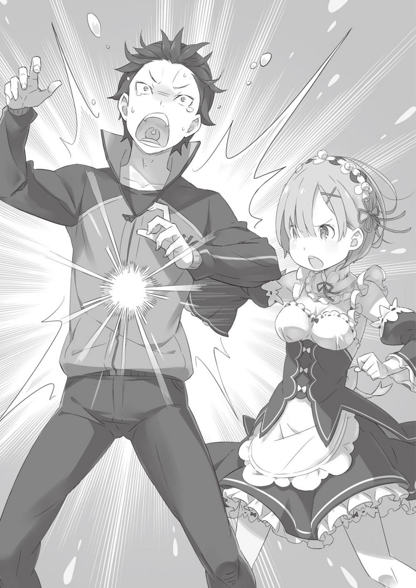

## 1

Жизнь — такая штука, в которой приходится полагаться исключительно на те карты, которые она тебе сдала.

Происхождение, внешность, таланты, нравственные качества, навыки — важны все входные параметры. Субару Нацуки отдавал себе ясный отчёт: ни с одним из этих параметров ему не повезло. И хотя по какому-то недоразумению он снискал абсолютное признание Рем, юноша прекрасно понимал: ему очень далеко до того идеала, который она нарисовала в своём воображении.

В сравнении с придуманным Субару Нацуки, реальный безнадёжно отставал и по количеству карт на руках, и по их качеству. Но если уж сидишь за игровым столом, никто не станет слушать твои жалобы на неудачный расклад. Каждый располагает теми картами, которые ему выпали.

Остаётся лишь совершать ходы и вовремя блефовать…

Белый Кит.

Субару сделал ход той картой, которая обещала произвести наибольший эффект. И судя по лицам присутствующих, ожидания оправдались.

Партия разворачивалась в гостиной особняка герцогини Карстен, что находился в элитном квартале столицы. Участников собрания, если не считать Субару, было пятеро. Хозяйку особняка, Круш Карстен, поддерживала свита в лице Ферриса и Вильгельма. Консультантом Субару выступал видный столичный коммерсант — Рассел Феллоу.

Единственным же источником безграничной силы храбреца была Рем, державшая юношу за рукав.

Лишь начавшись, беседа вошла в самую важную стадию. Целью Субару было уговорить Круш, чтобы та вступила в союз с Эмилией на равных условиях. Лагерь Эмилии нуждался в помощи, но осторожная Круш до последнего занимала выжидательную позицию. Пока Субару не произнёс: «Белый Кит». Это была та самая карта, которая могла сподвигнуть Круш к принятию решения.

В глазах герцогини засветился неподдельный интерес. Феррис обратил на хозяйку тревожный взгляд. На лбу Рассела, коммерсанта до мозга костей, образовалась хмурая складка, а Вильгельм…

Субару невольно задержал дыхание: гостиную наполнил и тут же схлынул невероятно мощный гнев — такой, что стало дурно. Подняв глаза, юноша увидел его источник — седого старика, который тяжело дышал и потряхивал головой.

— Ужасно виноват, мне следовало сдержаться. Увы, я весьма далёк от совершенства… — лицо Вильгельма было по-прежнему невозмутимым. Пожилой мечник, гнев которого ещё несколько секунд назад ощущался во всех углах комнаты, стыдливо тронул висящий на поясе меч. — Прошу прощения, что прервал беседу. Прикажете выйти вон?

— Нет, останься. Мне интересно твоё мнение.

Распорядившись, Круш вопросительно взглянула на Субару, и он согласно кивнул. — Итак, ты, кажется, упомянул Белого Кита, что было довольно неожиданно. Не тот ли это

Белый Кит, которого называют Туманным Зверодемоном? Один из Трёх Великих Зверодемонов? — Он самый. Чудовище, что плавает по небу и заволакивает всё туманом. Я знаю, когда и где он объявится в следующий раз. И я готов поделиться этой информацией в обмен на согласие заключить союз.

Нервы Субару были на пределе. Затаив дыхание, он что ответит Круш. Герцогиня, приложив руку к подбородку, погрузилась в размышления. Однако, прежде чем она сообщила о своём решении, заговорил Рассел.

— Простите, могу ли я поинтересоваться одной мелкой деталью? — произнёс он, подняв руку.

— Конечно. Чем угодно.

— Тогда я хотел бы удостовериться вот в чём. Мастер Нацуки, вы говорите, что вам заранее известно, где и когда появится Белый Кит. Осознаёте ли вы ценность таких сведений?

— Ну, это поможет сократить число жертв, — робко ответил Субару. — Странствующие торговцы и перевозчики грузов изменят маршруты, таким образом мы сбережём жизни.

— Да, совершенно верно. Но я засчитываю ваш ответ только наполовину.

В своей оценке Рассел был жестокосердным.

— Известно ли вам, сколько уже пролилось крови по вине Туманного Зверодемона? Сколько торговых караванов пропало без вести, навсегда сгинув в Тумане? Сколько рыцарских отрядов, посланных, чтобы усмирить монстра, оказалось разбито и обращено в бегство? Когда-то он появлялся в окрестностях деревень и сёл и пожирал всех местных жителей. Зачастую факты об этом не предавались огласке. Белый Кит — это не просто огромный зверодемон!

Рассел расписывал, как страшен Белый Кит, с преувеличенной страстью. Субару сразу смекнул, что имеет дело с пессимистом, жаждущим передать свой негатив другим. Оказываясь перед лицом сильного врага, такие люди начинают превозносить его силу, тем самым оправдывая собственную слабость.

— Этому зверодемону ни в коем случае нельзя попадаться на глаза! Многие торговцы и путешественники больше всего на свете боятся, что их путь заволочёт Туман. Белый Кит — символ катастрофы! Попал в его Туман — жди беды! В мире мало столь ценных сведений, как информация о том, где он появится в следующий раз! Однако есть одно но…

Рассел, только что сжимавший кулаки и горячо убеждающий всех в опасности Белого Кита, обратил на Субару внезапно остывший взгляд.

— Ценными являются только достоверные сведения! Без доказательств всё, что вы говорите, не более чем пустышка.

— Я хотела сказать практически то же самое, — с бледной улыбкой вымолвила Круш. — Поведаешь, на чём основаны твои знания?

Субару почувствовал, как спину облил холодный пот. Но юноша смог скрыть волнение. С бесстрашной улыбкой на губах, изо всех сил стараясь не сдрейфить, он приготовился выложить на стол свой следующий козырь. Он много раз делал это в воображении, тщательно продумывая детали плана.

— Да, мне известно, где объявится Белый Кит. И вот почему!

Козырь со стуком приземлился на стол.

Сначала Субару показалось, что при виде доказательства лица присутствующих нисколько не изменились, однако в следующее мгновение в их глазах мелькнуло замешательство.

— Субару Нацуки… — тихо позвала Круш.

— Да? — откликнулся юноша, бесстрашно вскинув голову.

Однако Круш не удостоила комментарием дерзкий жест.

— Что это такое? — спросила она, показав пальцем на «доказательство», лежащее посреди стола. Плод сверхсовременных технологий поблёскивал ослепительно-белым металлическим корпусом — взгляд герцогини был прикован к сотовому телефону.

## 2

То, что Субару знал точное время появления Белого Кита, было всего лишь капризом судьбы, к которому привела череда случайностей.

Ключевое событие в этой истории произошло в туманную ночь третьего круга жизни, когда Субару столкнулся с Белым Китом. Было очень темно, и юноша, чтобы осветить карту, достал из вещевого мешка телефон и включил его.

«Да. Как раз тогда это и случилось».

Впервые Белого Кита Субару увидел в тот момент, когда разгонял светящимся дисплеем мрак, желая узнать, куда подевалась ехавшая по соседству повозка.

Шок, который он испытал при виде громадного глаза, Субару помнил до сих пор. Раздался рёв, и монстр нанёс первый удар, разбив их повозку в щепки. Но Рем схватила Субару за шиворот, и юноша оказался в воздухе. То, что он видел дальше, напоминало разрозненные фрагменты. Мир стал похож на слайд-шоу, но один из этих слайдов оказался особенно ярким. В момент удара, когда телефон выскочил из рук, светящийся экран был обращён к Субару и на нём отображалось «15:13». После того как Субару попал в альтернативный мир, функция часов в телефоне потеряла всякий смысл. Однако вряд ли в этом мире найдётся инструмент, который столь же точно предсказывает будущее! С этой точки зрения мобильник оказался просто незаменим.

— Неудивительно, что вы незнакомы с этой штуковиной. Это так называемая мития, найденная при раскопках у меня на родине. Она и послужит доказательством моих слов.

Субару не сомневался: мития неизвестного происхождения сама по себе является подспорьем в переговорах.

— Можно потрогать?

Рассел сглотнул слюну и первым протянул руку к телефону. Субару кивнул. Тогда Рассел робко взял телефон и провел пальцем по корпусу.

— Какая необычная на ощупь! Похоже на металл, но тёплый.. Поверхность гладкая и будто бы даже мягкая… Она отворяется?

Рассел открыл телефон-раскладушку и весьма удивился, когда в глаза ударил свет. На заставке в режиме ожидания отображался классический часовой циферблат, который Субару установил перед началом переговоров. Единственное, что сейчас можно было выжать из этого аппарата, — список немногочисленных контактов.

— Сначала появился свет, а теперь рисунок пришёл в движение!.. Но что всё это означает, я не понимаю. Здесь какие-то неизвестные символы… Или это рисунки?

По дисплею не спеша передвигалась секундная стрелка, но у жителей этого мира были иные способы измерения времени, так что смысл увиденного оставался им неясен. То же самое касалось и цифр: максимум, что местные могли в них разглядеть, — детские каракули. Субару прекрасно понимал этих людей, ибо сам изо дня в день испытывал подобные потрясения.

— Это особенные символы — не думаю, что кто-то из присутствующих может их прочесть.

— Тем не менее ты умеешь пользоваться этой штукой, не так ли? — осведомилась Круш.

— Не то чтобы я умел пользоваться всеми функциями… — промямлил Субару, выбирая слова с предельной осторожностью.

Для успешного завершения переговоров требовалось соблюсти несколько условий, но одно из них являлось наиважнейшим. Круш ни капли не сомневалась в своей проницательности, и нельзя было допустить, чтобы она раскусила задумку. Субару шёл по минному полю, не имея права на ошибку.

— То есть ты хочешь сказать, что эта мития работает как Предупреждающий камень, сообщая о приближении Белого Кита?

— Никогда не слышал о Предупреждающем камне, но в целом всё верно.

Судя по названию, Круш имела в виду некую разновидность волшебных камней, которые подавали сигнал тревоги в случае опасности.

— Мития, сообщающая о приближении Белого Кита? Что скажет эксперт?

— Честно, даже не знаю, что и сказать. Каждая мития по-своему уникальна. Одинаковые обнаруживаются весьма редко. Исключением являются Зеркала для диалога, которые мы научились копировать, но их стоимость не позволяет запустить массовое производство. Без всякого преувеличения могу заявить, что впервые слышу о таких митиях.

Рассел проявлял чрезвычайную осторожность, высказываясь о неизвестном предмете. В этих переговорах он являлся третьей стороной и не поддерживал ни Субару, ни Круш. Рассел был настроен весьма критично, так как пытался понять, к кому примкнуть, чтобы извлечь максимальную прибыль.

— В таком случае я не знаю, как определить достоверность информации. Но и верить на слово я не могу. Итак, что будешь делать?

— Ситуация и правда щекотливая. Я бы очень хотел доказать, что говорю правду, но…

Субару растерянно развёл руками:

— Хм… Может, проверим, будет ли она издавать сигнал при приближении к какому-нибудь зверодемону? Вероятно, у тебя есть способ доказать, что мития действительно реагирует на зверодемонов?

Субару поднял указательный палец и покачал им из стороны в сторону.

— Позволь тебя поправить! — сказал он, радуясь возможности подразнить Круш. — Эта мития не реагирует на зверодемонов как таковых. Иначе она звенела бы постоянно, ведь кругом полно тварей. Она подаёт сигнал только тогда, когда это действительно важно!

— Не хочешь ли ты сказать, что она откликается лишь на тех зверодемонов, которые угрожают её обладателю?

Это было бы слишком удобно, чтобы оказаться правдой. Однако не успела Круш посмеяться над заверениями Субару, как раздался тихий возглас:

— А!

Он принадлежал Рем, стоявшей рядом с Субару, и прозвучал так, словно девушка обо всём догадалась. Она тут же потупилась, чувствуя неловкость, — ведь помешала ходу беседы.

— Мне не нравится твоя реакция, Рем. Наш разговор тебе о чем-то напомнил? Круш ждала ответа. Рем бросила короткий взгляд на Субару. В её бледно-голубых глазах отразились тревога и сожаление. Субару улыбнулся, чтобы успокоить девушку:

— Всё в порядке. Если есть что сказать, смело говори.

— Хорошо. Раз ты разрешаешь, Субару…

Рем повернулась к Круш и указала на телефон, лежащий на столе.

— Если не вдаваться в подробности, то недавно во владениях графа Мейзерса произошла стычка со зверодемонами. При этом Субару действовал так быстро, что в конце концов мы справились и всё обошлось. Мне показалось удивительным, что Субару, прожив с нами всего несколько дней, сумел разобраться в ситуации быстрее, чем сам хозяин поместья, господин Розвааль…

— Хочешь сказать, это мития предупредила его о нападении?

— Иначе не объяснить…

Рем с опаской посмотрела на Субару. Прежде она не понимала, каким образом юноша предвидел нападение вольгармов, но мития расставила всё по своим местам.

Тем временем взгляд Круш был прикован к Рем. Гипнотический и пронизывающий, он как будто стремился проникнуть в самую глубину души собеседника. Прошло несколько изнуряющих секунд, пока Круш наконец не вымолвила:

— Кажется, ты говоришь правду.

Слова Рем вызвали у неё понимание и доверие. Услышав вердикт герцогини, Субару еле скрыл облегчение, но в душе он победно сжал кулаки. История с митией была выдумкой чистой воды, сочинённой им на ходу.

Иными словами, Субару блефовал. Если бы правда вскрылась, переговоры бы точно провалились, а самому Субару, скорее всего, снесли бы голову с плеч. Но он всё же сумел заговорить зубы Круш.

При этом, отвечая на вопросы, юноша не произнёс ни одного лживого слова. Его телефон действительно не реагировал на всех зверодемонов без разбора, да и использовал Субару свой сотовый далеко не на сто процентов — даже сообщения он посылал считаные разы.

Труднее всего, казалось, будет заручиться поддержкой третьего лица, но тут на помощь пришла Рем, чьей неосведомлённостью Субару и воспользовался. И хотя её рассказ не являлся правдой в полном смысле, у девушки не былое Намерения кого бы то ни было обманывать.

— Так говоришь, будто сразу видишь: врёт человек или говорит правду, — заметил Субару, подтрунивая над Круш. В памяти всё ещё жили воспоминания о том, как жестоко он обманулся, однажды доверившись герцогине…

— Прозвучит нескромно, но так и есть. У меня не только развита наблюдательность, я обладаю Божественной Защитой, которая позволяет видеть ауру.

— Видеть… что?

В прошлом круге Круш упоминала о своей способности «видеть ложь», но Субару был уверен: это не более чем фигура речи.

Перед тем как принять решение, я учитываю то, что скрыто от большинства. Так уж вышло, что я вижу ауру, окружающую людей. Когда кто-то лжёт, вокруг него появляется соответствующая аура. У Рем я подобного не заметила.

— Ого! Круто! Я и не знал… не догадывался даже…

— Тебя окружает аура тревоги, Субару Нацуки. Конечно, с моей стороны было бы нечестно умолчать об этой способности за столом переговоров…

Улыбку Субару исказила судорога. Какой же надо быть мерзавкой, чтобы раскрыть своё главное умение, дождавшись самого разгара переговоров! Разве можно во время важной беседы использовать запретные приёмы, подобные Божественной Защите? Неудивительно, что у герцогини был острый язык, жаливший Субару в прошлом круге.

— В словах Рем нет ни капли лжи. Они подтверждают, что ты действительно обладаешь средством предсказания.

На этот раз самоуверенность Круш сыграла с ней злую шутку. Балансируя на грани разоблачения, Субару был готов пойти на любые жертвы, сулящие победу…

— Я правильно понимаю, что ты веришь моим словам о митии?

— Не делай поспешных выводов. Я вижу, что между вами нет сговора, но в первую очередь я должна думать о том, чтобы не пострадала моя семья. От этого решения зависит исход королевских выборов и, следовательно, будущее страны. Прежде чем действовать, нужно как следует подумать.

Субару знал, что склонить Круш на свою сторону будет не так-то просто. Убедить её в том, что с помощью митии можно узнать о появлении Белого Кита, юноше худо-бедно удалось, и герцогиня всерьёз задумалась над предложением Субару. Однако придать истории правдоподобия и способствовать достижению цели мог только один человек…

— Позволите присоединиться к беседе? — Голос привёл собравшихся в лёгкое замешательство.

Отвечая на недоуменные взгляды изящной улыбкой, особа прошла в гостиную. Субару смотрел на неё не отрываясь.

— Как забавно, что ты, Нацуки, удивлён больше всех, хоть сам пригласил меня! — бросила улыбчивая девушка и провела рукой по кудрям.

Бледно-лиловые волосы, достигающие пояса, были гладкими как шёлк, а черты лица — такими мягкими, что при взгляде на неё в душе воцарялось умиротворение. Однако проникновенный взор улыбчивой девушки ясно давал понять: она ни за что не потерпит пренебрежения к себе.

— Анастасия Хосин, — вымолвила Круш, узнав посетительницу.

Анастасия слегка кивнула:

— Как нечестно! Я всё бросила и поспешила по первому зову, а вы начали разговор, не дождавшись меня! Так я могу присоединиться? Насколько поняла, речь идёт о чём-то весьма любопытном с финансовой точки зрения…

Анастасия испытывала настоящее удовольствие, играя словами, которые звучали как просьба, однако, по сути, являлись проявлением кокетства. Субару машинально посмотрел ей через плечо и этим выдал свои опасения.

— Расслабься, Юлиус не пришёл, — сказала Анастасия, ухмыльнувшись. — В настоящий момент Юлиус под домашним арестом по приказу начальника отряда рыцарей гвардейцев. Отбывает наказание за то, что пошалил с одним пареньком без моего позволения. Хлопот с этим рыцарем не оберёшься!..

Под домашним арестом…

Субару вспомнил вечер, когда Райнхард сообщил ему ту же самую новость. Юлиуса отстранили от службы из-за драки с Субару. Поэтому тот и не пришёл вместе с Анастасией.

— Вот как… М-да, не повезло.

При мысли, что ему не придётся видеть Юлиуса, Субару испытал смесь облегчения и стыда. Он до сих пор не представлял, что бы сказал Юлиусу, встреться они ещё раз.

Пока юноша предавался раздумьям, к Анастасии обратилась Круш:

— Говоришь, тебя пригласили? Это сделал Субару Нацуки?

Анастасия села на предложенное место и принялась поглаживать лисью горжетку, укрывавшую её плечи.

— Если точнее, это была вон та девчонка, что его сопровождает. По правде говоря, я бы и слушать её не стала… Однако оказалось, что дело касается Белого Кита, поэтому пришлось уделить ей время.

Анастасия вдруг захохотала, и Круш перевела взгляд на Субару.

Две кандидатки на престол в одном месте! Это здорово меняло ситуацию.

Субару сжал кулак.

Пора приступать.

Теперь, когда все были в сборе, Субару наконец мог начинать переговоры по-настоящему.

— Прошу прощения. Мастер Нацуки, могу я кое-что уточнить?

Разумеется, Рассел был не в восторге от того, что на собрание пожаловал его коммерческий конкурент.

— Конечно, господин Рассел.

— Мне хотелось бы знать, о чём вы думали, приглашая госпожу Анастасию. Если госпожа Анастасия, кандидатка на королевский трон, а также глава торговой компании Хосин, имеющая голос даже в Столичной Торговой Гильдии, участвует в нашем собрании, моя роль становится неопределённой. Возникает ощущение…

— Что я позвал её в противовес вам? — подсказал Субару, и в тот же миг атмосфера в гостиной сгустилась.

Вслед за уязвлённым Расселом потемнела лицом и Круш:

— То есть ты будешь выбирать союзника, исходя из того, кто из нас, я или Анастасия Хосин, больше заплатит за информацию о Белом Ките?

Субару промолчал.

— Если я права, это опрометчивое решение, Субару Нацуки!

Честолюбие Круш оказалось серьёзно задето. Герцогиня поднялась из кресла и обратила суровый взгляд на Анастасию, чем позабавила её ещё больше.

— Бог мой, Круш! От твоего взгляда у меня мурашки! Так выглядят птицы высокого полёта, которые боятся, что кто-то поднимется ещё выше.

Не самый хороший повод для шуток, — невозмутимо парировала Круш. — Впрочем, этого и следовало ожидать от того, кто живёт, лелея собственную алчность. Мои же принципы ничто не сможет поколебать!

Сказав это, герцогиня повернулась к Субару.

— Слышал, Субару Нацуки? Знай: если надеялся, что я стану бороться с торговой компанией Хосин за информацию, то просчитался. Оправдывать твои ожидания я не…

— Подожди! Что за поспешные выводы?! Успокойтесь обе! — перебил юноша, опасаясь, что Круш немедля объявит переговоры закрытыми.

— Поспешные, говорите?! Выходит, вы, мастер Нацуки, не собирались выбирать между двумя кандидатками?

— Конечно же, нет! За кого вы меня принимаете? Я вам что, Будда какой-нибудь — наблюдать, как кто-то бегает у меня на ладони? Нет, мои ладони куда меньше! Смотрите!

(Субару имеет в виду фразеологизм «быть на ладони у Будды», то есть быть легко контролируемым.)

Субару помахал одной ладонью, а другой взял за руку стоящую рядом Рем. Тепло девушки тут же придало ему, храбрости и помогло унять дрожь в пальцах.

— Вот, это всё, что я могу сейчас сделать своей рукой!

— Ага, понятно, благодарю за объяснение. Так о чём мы будем беседовать? — поинтересовалась Анастасия.

— Рад, что угодил. Итак…

Субару попытался высвободиться из крепкой хватки Рем, но не сумел и ударил свободной рукой по столу.

— Карту Белого Кита я разыграл, представителей столичной торговли пригласил. Стало быть, пора начинать большую игру… Но прежде я хочу кое-что предложить.

Юноша постучал пальцем по столу, глядя на Круш с коварно-торжествующей улыбкой. В этой улыбке читались и сила духа, и воля к победе, скрывавшие слабость и прочие недостатки.

— Позволите?

— Я прервала тебя, сделав скоропалительные выводы, но теперь выслушаю, говори. Диктаторский дух, витавший вокруг герцогини, стал ощущаться еще сильней. Такой же незримый нажим Субару испытывал и со стороны Анастасии. Ещё немного — и он падёт под их чудовищным психологическим давлением. Субару не сомневался: будь он без Рем, тут же объявил бы всё шуткой и удрал куда подальше.

Юноша ощущал тепло Рем, крепко сжимавшей его ладонь. Ни позвать Субару по имени, ни подбодрить словами она не могла. И Рем держала его за руку, чтобы придать смелости. Но Субару был рад и этому. Сейчас он мог сразить я хоть с Ведьмой!

Он закрыл глаза, задержал дыхание и стал прислушиваться к мыслям, проносящимся потоком в его голове.

Должно сработать! Он обдумывал это тысячу раз. Без конца вспоминая первый, второй и третий круги, Субару сложил пазл, нарисовал на белом холсте предполагаемую картину событий. Твёрдой уверенности не было, и гарантий никто не давал. Однако крупицы информации, собранные в ходе переговоров, указывали на единственно возможный исход.

Не исключено, что это всего лишь иллюзия, которой он решил себя потешить… Или теперь, спустя три смерти, Субару станет свидетелем чуда…

Будь что будет!

— Круш, мои сведения…

Субару помолчал, затем продолжил:

— Я уверен, мои сведения окажутся очень полезными в походе на Белого Кита, который ты планируешь! Информация о будущем, которой обладал Субару, могла помочь герцогине достичь её цели. Ведь и для Круш, и для Субару Белый Кит являлся врагом, которого следовало одолеть. Вот почему юноша решил, что герцогиня Круш Карстен станет подходящим союзником в этой борьбе.

## 3

В гостиной повисла тишина, давая каждому из присутствующих возможность поразмыслить.

Круш, Анастасия, Феррис, Вильгельм, Рассел — все закрыли глаза, словно тщательно обдумывали услышанное. Пауза длилась считаные секунды, однако успела накалить воздух до такой степени, что Субару стало дурно.

Он на ринге, пути назад нет! События перешли в новую, фазу, и смоделировать их развитие уже невозможно, остается лишь подстраиваться под ход игры.

Молчание прервала Круш:

— Объясни мне одну вещь, Субару Нацуки.

Герцогиня развела скрещённые на груди руки и, подняв палец, направила его на Субару.

— Откуда у тебя эта сумасбродная идея? С чего ты решил, что мой дом планирует подобную операцию? И не вздумай отпираться. Такое заявление требует объяснений.

Бесцветный голос Круш был сух, холоден и лишён каких-либо признаков волнения. Импозантность герцогини, свойственная важным государственным персонам, внушила Субару самый настоящий благоговейный страх. Он нервно сглотнул и, бегая туда-сюда глазами, окликнул спутницу:

— Рем!

— Да?

— Хлопни-ка меня хорошенько по спине.

— Пожалуйста.

В голове юноши мелькнула мысль: «Как бы она не переусердствовала…» — но было поздно. Рем зарядила настолько мощный и хлёсткий удар, что Субару на миг почудилось, будто всё его нутро готово вылететь наружу. Он не удивился бы, обнаружив по центру спины след, как от ожога, в форме ладони. Однако боль и жжение помогли ему прийти в себя, Заметив недоуменные взгляды, Субару сконфуженно опустил глаза:

— Извините за неприятное зрелище. Мне нужно было встряхнуться.

— Всякий знаком с ситуацией, когда требуется вернуть себе присутствие духа. Я в таких случаях прибегаю к испытанному способу: пишу на ладони «враг», сжимаю её в кулак, подношу ко рту и смело иду в бой…

— Госпожа Круш, госпожа Круш! — шёпотом позвал Феррис. — Это же я сто лет назад научил вас такому шуточному ритуалу, а вы всё ещё про него помните?

Поражённая признанием, Круш уставилась на рыцаря:

— Так это… была шутка?!

— Ну, у этого способа, конечно, нет серьёзных оснований, но, если он помогал вам справиться с душевным волнением, значит, метод работает. Я просто счастлив, госпожа Круш, что мой совет вам пригодился-ня!

— Ясно. Выходит, ты сделал это, заботясь обо мне. В таком случае прощаю.

Когда выяснилось, как легко Круш когда-то обманулась, её рассказ о Божественной Защите стал вызывать некоторые сомнения. Скорее всего, за долгое время их знакомства Феррис изучил свою хозяйку и отыскал лазейки в её Защите.

— Мне начинает казаться, что мы отвлеклись от переговоров на какие-то пустяки… — заметил Субару.

— Как же, как же! — встрепенулась Анастасия. — Я тоже перед важной встречей провожу магический ритуал! Насыпаю в мешок монеты, подношу к уху и трясу — звяк-звяк. И настолько меня это, знаете ли, храбрит!.. А что ты так смотришь?..

— Кому скажи, что это беседуют соперники в борьбе за трон, никто не поверит! — заметил Субару, намекая, что пора бы перейти к делу, ради которого все и собрались.

Анастасия недовольно надула губы, затем протяжно вздохнула:

— Ну хорошо. На этом закончим перерыв и вернёмся к разговору. Согласен?

— Да. Спасибо за участливость.

Круш и Феррису, в силу характера их отношений, было свойственно вести непринуждённые беседы, и сейчас Субару был благодарен Анастасии за то, что своей репликой она позволила ему выиграть время и привести в порядок мысли.

— Хотя я живу в этом особняке всего несколько дней, успел кое на что обратить внимание. Вопервых, куча посетителей. Слишком много народа приезжает и уезжает, оставляя горы груза.

— Всё потому, что было официально объявлено о моём участии в выборах. Но тебе, наверное, это и так понятно…

— Согласен, это объясняет наплыв посетителей в течение дня. А как насчёт тех, кто приезжает ночью? Будешь утверждать, что и они хотят поговорить? Когда ты уже переодета в ночную сорочку и готовишься ко сну?

Однажды, в первом круге жизни, Круш пригласила Субару выпить перед сном по бокалу вина. В ночной сорочке герцогиня была сногсшибательно женственной. Тогда Субару, смущаясь, не знал, куда девать глаза. Сидя за столиком вместе с Круш, он обратил внимание на суету в саду, ему показалось, что внизу туда-сюда снуют люди.

— Невозможно, чтобы такой человек, как ты, встречал посетителей, находясь навеселе. Тогда кто все эти люди, которые приходят в особняк, когда ты пьяна? Получается, их не интересует беседа?

На этот раз Круш даже не попыталась прервать рассуждения Субару. Пока что инициатива в беседе принадлежала юноше. Он хлопнул ладонью по столу: — Далее. На что я ещё обратил внимание, так это на состояние рынка металлических изделий. Один знакомый лавочник рассказал, что цены на товары из железа — оружие, доспехи и тому подобное — подскочили до небывалых высот.

Это были обрывки сведений, которые Субару удалось получить в первом, втором и третьем кругах.

— Кто-то в больших количествах скупал вооружение, когда оно стоило ещё гроши. Знакомые лавочники и странствующие торговцы поведали мне, что этот кто-то — Круш Карстен!

Кажется, один торговец, попутчик Субару, в шутку предположил, что скупщик оружия готовится к войне.

— Да так активно скупал, что это повлияло на весь рынок! Оружие привозят даже из других земель, причём в такой спешке, что всякий нормальный человек начнёт подозревать: затевается нечто серьёзное.

— Делать из этого подобные выводы просто немыслимо! Твои догадки не стоят и одного китового уса. Да, мой дом скупает вооружение, но это не значит, что я готовлюсь к охоте на Кита. А вдруг мне просто захотелось собрать армию и, наплевав на результаты выборов, силой захватить власть?

— У тебя нет причин прибегать к насилию. Да и не такой ты человек, даже я это понимаю.

Вряд ли найдётся хоть кто-то, столь же верный принципам, как Круш — живое воплощение понятий «искренность», и «благородство».

— Должна признать, я несколько удивлена, — вымолвила герцогиня, подкрепив свои слова вздохом восхищения. Она вновь скрестила руки на груди и оглядела юному с головы до ног. — Я была уверена, что твои дневные прогулки по городу носят праздный характер. Похоже, на этот раз именно я оказалась не слишком наблюдательной.

— Ну да. Бить целыми днями баклуши, знаешь ли, не в моих правилах.

Субару ощутил укол совести. Ведь Круш на самом деле была чертовски права, заключив, что её гость безнадёжно испорчен. Теперь оставалось только делать вид, что он вовсе не такой, как подумала герцогиня.

— Узнав о скупке оружия, я решил, что ты готовишься к войне. Вот только с кем ты собиралась воевать?.. Этого я не понимал… пока один торговец не проболтался.

— Один торговец? — Круш бросила взгляд на Рассела, но тот поспешил развеять подозрения.

— На всякий случай поясню: это был не я! Во избежание недоразумений…

Видимо не найдя в его словах лжи, Круш нехотя отступила, Герцогиня обладала поистине острым чутьём. Но её догадка была одновременно и верна, и неверна. Проговорившимся торговцем действительно был Рассел, то есть Круш не ошиблась в своих подозрениях. Однако не тот Рассел, что сидел сейчас в гостиной, а Рассел, которого Субару встретил в прошлом круге жизни.

«Если госпожа Круш преуспеет в текущих начинаниях, мы будем только рады», — бросил напоследок Рассел, когда покидал резиденцию Круш после неудачных переговоров. Эти слова крепко засели в памяти Субару. Если торговец имел в виду победу герцогини в выборах, то сложно представить, что помешало им договориться. Тогда Субару подумал: а что, если у Круш и Рассела имеются какие-то общие интересы?

— Судя по слухам, которые ходят вокруг королевских выборов, у тебя практически нет конкурентов. Только вот торговый люд, мне кажется, не в таком восторге от твоей персоны, как прочие граждане.

— Отрицать не стану. Логично брать деньги с тех, у кого они водятся. На моих землях действительно высокий налог на торговлю. Зато там царят мир и порядок… Хотя, соглашусь, стороннему наблюдателю это не вполне очевидно.

— Факты таковы, — продолжал Субару, — что, в отличие от твоих подданных, другие люди судят о тебе лишь по тем обрывкам информации, которые до них доходят.

Круш действительно управляла своими владениями, как подобает хорошему хозяину. Однако тем, кто не мог убедиться в её способностях на деле, оставалось довольствоваться собственными домыслами. В этом Круш была похожа на Эмилию, которую бойкотировали лишь на том основании, что она являлась полуэльфом. А герцогиню недолюбливали те, кто видел в её жёстких методах правления только недостатки.

— Поэтому я рассудил так: герцогиня Круш, скорее всего, на дух не переносит людей, что судят о книжке по обложке. Однако в контексте королевских выборов даже они могут оказать какую-то поддержку. Но как заставить их изменить мнение в лучшую сторону?

— Если кто-то судит о книге по обложке, — подхватила Анастасия, — тогда, мне думается, следует как-то украсить обложку! Но это легко только на словах. На деле всё гораздо сложнее, да и высока вероятность провала. Не слишком ли смело ты интерпретируешь факты в свою пользу? — Не могу с тобой поспорить. Но я уверен, что оружие скупает герцогиня Круш и что она намерена переманить на свою сторону лавочников, предприняв для этого нечто грандиозное. Связано ли происходящее с Белым Китом? Вполне возможно, что нет и я просто выдаю желаемое за действительное. Может, я связал одно с другим, поскольку знаю, что Белый Кит совсем скоро даст о себе знать… Субару смотрел на Круш в упор. Лицо герцогини не выражало абсолютно никаких эмоций. Понять, что у неё на душе, было невозможно. И всё-таки в этот раз она не стала отрицать догадки Субару. Значит, игра стоила свеч!

— Я подытожу, — вновь заговорил Субару. — Если ты объединишься с лагерем Эмилии, то получишь не только право добывать магическую руду в лесу Элиор, но также информацию о месте и времени появления Белого Кита. Одолев монстра, который держал народ в страхе сотни лет, ты обеспечишь себе вечную славу и почёт!

Юноша сделал паузу, затем продолжил:

— Если я попал пальцем в небо и сделал совершенно неверные выводы, забудь. Если неправ, считай, что я просто предлагаю информацию о Белом Ките.

Возможно, одних сведений о монстре будет достаточно, чтобы двое торговцев, находящихся в гостиной, увидели свою выгоду. Круш тоже могла извлечь из этой информации пользу: сообщив её торговцам, герцогиня заручилась бы их поддержкой. В любом случае Субару шёл на оправданный риск.

— Но если твоя цель и моё желание всё-таки совпадают…

Субару протянул ей руку в надежде, что герцогиня подаст в ответ свою и они обменяются рукопожатиями. Это станет свидетельством того, что будущее, которое видел Субару, чего-то стоит, а разделявшие их стены отныне можно считать разрушенными.

— Отправимся на охоту и прикончим мерзавца!

Воспоминания, которые навевала эта фантастическая тварь, грозный монстр из ночного кошмара, синоним катастрофы для странствующих торговцев, были для Субару весьма неприятными. Пришла пора уничтожить чудовище. Именно это он и предлагал Круш.

— У меня есть один вопрос, — вымолвила герцогиня, глядя на протянутую руку, и подняла указательный палец.

Словно шестым чувством, Субару понял: этот вопрос станет последним заготовленным для него испытанием. Юноша затаил дыхание.

— Ты твёрдо уверен, что знаешь, где и когда появится Белый Кит?

— Твёрже не бывает! — заверил Субару и выдохнул. Лгать не пришлось. — Я знаю наверняка, где и когда появится Белый Кит. Юлову даю на отсечение!

Чтобы узнать это, Субару действительно пришлось не раз пожертвовать жизнью. И не только своей. Его информация не подлежала сомнению. Слишком далеко он зашёл, чтобы в конце пути поддаться на уловки.

Круш вздохнула и, закрыв глаза, произнесла с обречённым видом:

— Хотя кое-что продолжает меня смущать, я восхищена тем, что ты распознал мои намерения. Сначала Субару не понял смысла сказанного. На то, чтобы переварить слова герцогини, у него ушло некоторое время.

— Так значит…

— Да, у меня есть кое-какие подозрения и сомнения. В твоей истории много неясного, поэтому мне нелегко дать согласие с ходу. Но…

Круш протянула руку, и тонкие бледные пальцы герцогини крепко сжали ладонь Субару.

— Твой пыл и горящий взгляд не оставляют мне выбора. Я верю.

Переговоры прошли успешно.

Присутствующие расслабились, а самая большая гора упала с плеч Рассела. Он издал преувеличенно шумный вздох и с показным облегчением покачал головой:

— Заставили же вы меня понервничать. Но главное — все благополучно разрешилось. Мастер Нацуки, надеюсь, обещание которое вы дали мне перед началом собрания в силе?

— Вы мне очень помогли Рассел. Как только мы разделаемся с Белым Китом, я отдам вам телефон.

Рассел и Субару обменялись заговорщическими улыбками, на что Круш удивленно подняла брови и спросила:

— Так вы сговорились?

— Я просто попросил немного мне подыграть, вот и всё, — сказал Субару как ни в чем не бывало

— Не подумайте ничего плохого, вступил Рассел. — Надеюсь, оказывая поддержку мастеру Субару, я сумел соблюсти меру. Я согласился на это исключительно ради тех перспектив, которые сулит заключение союза.

Круш молча пожала плечами Субару отправился за Расселом сразу после разговора с Рем. Он поймал торговца по дороге, когда тот, в полном соответствии с событиями третьего круга жизни, возвращался от Круш. Когда юноша объяснил суть дела, Рассел согласился поддержать его в переговорах в обмен на сотовый телефон.

Правда, Рассела тоже пришлось надуть насчёт функций аппарата. Субару сделал ставку на то, что глава торговой гильдии не упустит шанс заполучить «продукт сверхсовременных технологий», коим являлось это электронное устройство.

— Итак, осталось лишь разобраться, какова твоя роль в этой пьесе, — сказала Круш, глядя с сомнением на Анастасию. Та удивлённо распахнула глаза:

— А в чём дело?

— Логика Субару Нацуки и Рассела Феллоу мне ясна. Но я смутно представляю, каково твоё место в этом предприятии. Зачем тебя пригласили сюда?

— Ну, во-первых, чтобы добавить себе убедительности. — Прижав к груди шикарный лисий воротник, Анастасия кокетливо надула губки и протянула:

— Хм… Как видишь, здесь присутствуют две кандидатки на трон и один из самых влиятельных в столице промышленников. В такой знатной компании не станут чесать языками почём зря. Одно моё присутствие добавляет веса словам Субару.

— Ну… как бы… не то что я совсем не надеялся на это, приглашая тебя…

Юноша покрылся испариной, ведь Анастасия попала в яблочко. На самом деле Субару позвал её по очень схожей причине. Не с целью удержать Круш от скоропалительных решений, а чтобы у герцогини не сложилось впечатление, будто Субару несёт безрассудную, ни на чём не основанную чепуху. Он дал понять: раз здесь собрались настолько значительные фигуры, значит, ему можно доверять. Правда, насколько действенной оказалась идея, Субару не решился проверять, опасаясь, что проницательные Круш и Анастасия быстро его раскусят.

— Ты сказала «во-первых». Есть и другая причина?

— Она очевидна: я торговка!

Анастасия хихикнула, прикрыв рот ладонью, и бойко двинулась вперёд. Приблизившись к Субару и Круш, руки которых были по-прежнему сцеплены, она аккуратно положила сверху свои ладони.

— Я возлагаю большие надежды на операцию по устранению Белого Кита. Для нас, торгового люда, это вопрос жизни и смерти. Уничтожив Белого Кита, вы окажете нам неоценимую услугу. Кстати, торговый дом Хосин будет счастлив предоставить вам любую помощь в подготовке операции.

— Не торопитесь, — прервал Рассел откровенную саморекламу Анастасии. —

Преимущественное право в этом деле должно принадлежать Столичной Торговой Гильдии. Прошу вас соблюдать умеренность и не вовлекаться в сделку слишком активно!

Пока представители бизнеса сверлили друг друга неприязненными взглядами, Круш, спохватившись, обратилась к Субару:

— Погоди-ка! Мы действительно должны поторопиться?

— О важных деталях я не осведомлена, — снова заговорила Анастасия, — но в ходе беседы мне показалось, что это именно так. А что же на деле? Мы правда в цейтноте?

Круш и Анастасия пристально смотрели на Субару. Юноша облизал пересохшие губы. Сделка с Круш у него в кармане, поэтому нет смысла секретничать. — Это так. Мития говорит, что Белый Кит даст о себе знать примерно через тридцать часов. Случится это… в окрестностях Древа Флюгеля.

— Тридцать часов!.. — скрипнула зубами Круш.

— Древо Флюгеля… — повторила Анастасия и задумчиво склонила голову.

Участникам операции предстояло вступить в схватку с временем. Круш вникла в ситуацию мгновенно.

— Нужно в течение тридцати часов перебросить все силы на равнину Лифаус и атаковать Кита, как только он появится. Для этого… — Она повернулась к Вильгельму.

Пожилой мечник кивнул хозяйке и заговорил:

— Сначала нужно сформировать отряд. Этим мы и занимаемся последние дни. Отряд расквартирован в столице, чтобы мы могли оперативно среагировать в момент появления Белого Кита. Полагаю, сама судьба распорядилась так, чтобы это знаменательное событие совпало с началом королевских выборов.

— Так это же совсем другое дело! Но послушайте, разве Белый Кит появляется по какому-то графику?

Сообщение Вильгельма обрадовало Субару, однако кое-что он не мог взять в толк. Насколько юноша слышал, место и время появления Белого Кита были совершенно непредсказуемы. Туманный Зверодемон возникал так же внезапно, как и исчезал. Именно это свойство считалось самой страшной его способностью.

Феррис сделал шаг вперёд и, встав рядом с Вильгельмом, пояснил:

— Благодаря своему упорству старик Вил выяснил, где и когда Белый Кит совершал нападения. Все четырнадцать лет после Великой Карательной Экспедиции Вильгельм жил, думая лишь об этом-ня.

Феррис дёрнул кошачьими ушками и украдкой заглянул в лицо широкоплечего пожилого мужчины.

— Боевой подготовкой отряда занимался старина Вил, так что на этот счёт можно не беспокоиться. А вот то, что ресурсов не хватает, это факт-ня. Если госпожа Круш приведёт всю свою армию в столицу, поднимется большой шум, поэтому она собрала войско втайне.

Вильгельм выслушал Ферриса и, направив на Субару суровый взгляд, добавил:

— Пока, конечно, нельзя сказать, что оружие и прочее снаряжение подготовлены в полном объёме… Но я полагаю, мастер Субару, что госпожа Анастасия и мастер Рассел как раз для этого здесь и присутствуют.

Субару почесал в затылке:

— Такое не исключено…? Всегда хотел произнести эту фразу!

(Данная фраза — визитная карточка Сиро Санады, героя анимационного сериала 1974 года «Космический линкор „Ямато“».)

— Члены Гильдии уже в курсе, и подготовка идет полным ходом, — сообщил Рассел. — К завтрашнему полудню мы закупим у столичных торговцев всё необходимое.

— Компания Хосин тоже готова помочь! — с энтузиазмом подхватила Анастасия. — Есть торговцы, не состоящие в Гильдии, но готовые ухватиться за этот шанс. Позвольте мне договориться с ними. Мы можем посодействовать и в других вопросах!

Круш скрестила руки на груди. Судя по выражению лица, заверения конкурентки её тронули. Анастасия улыбнулась:

— Железное правило всех дельцов: никогда не упускай выгодную возможность! Вот почему я здесь. Торговать, конечно, здорово, но куда приятней делать добро! Упаковывать не надо, повредить нельзя, хранить на складе тоже не требуется, но самый большой плюс — нет прейскуранта!

— Конечно, здорово иметь тебя в союзниках, но то, что я слышу, повергает в ужас!..

Анастасия, на щеках которой играл румянец, была прелестна, однако её меркантильная сущность вселяла в присутствующих смутный страх. Одному Богу было известно, какой ценник она могла выставить за сделанное добро…

Глянув краем глаза на торговку, пребывавшую в прекрасном расположении духа, Круш согласно кивнула:

— Так ты подготовил почву ещё до начала переговоров? Ясно. Выходит, на этот раз я сама не отличилась ни дальновидностью, ни решительностью. Я восхищена, Субару Нацуки!

— Просто учёл прошлые ошибки. Не представляешь, какое облегчение я сейчас испытываю! Хотя Субару и продумал каждую деталь плана, шансов на успех у него было не больше, чем при переходе по канату через пропасть.

И всё же…

— Рем, по-моему, мне удалось сохранить честь, оставшись в городе.

— Да. Я знала, что у тебя всё получится, Субару!

Они победно подняли сцепленные руки. Наверняка Рем, которая немало сделала для достижения цели, больше других радовалась итогам переговоров. Первоначально именно Рем было поручено их провести. Поскольку о своей миссии она не могла поведать даже Субару, несложно представить, как её выматывали еженощные разговоры с Круш.

Тогда Субару всё глубже погружался в пучину морального разложения. Должно быть, мысли о его будущем и о судьбе лагеря Эмилии очень тяготили девушку. И теперь Субару спрашивал себя: удалось ли ему хотя бы частично компенсировать муки Рем? Если да, одно это принесло бы ему невероятное облегчение.

Внезапно его мысли прервал чей-то голос:

— Мастер Субару.

Это был Вильгельм. Пожилой мечник, расправив плечи, устремил на Субару серьёзный взгляд. На его изрезанном морщинами мужественном лице читалась целая гамма чувств. Глядя юноше прямо в глаза, он промолвил:

— Благодарю.

Произнеся лишь одно слово, он почтительно преклонил колено. Субару удивился неожиданному жесту мечника. Однако, судя по лицам, остальные восприняли происходящее как должное. И это касалось не только Круш и Ферриса, близких Вильгельму, но даже Рем и Анастасии.

— Я благодарен вам не меньше, чем своей госпоже, герцогине Круш Карстен. Благодарен за то, что вы подарили мне, недостойному, возможность отомстить!

— Э-э… Ну, вообще…

— Такой сообразительный человек, как вы, мастер Субару, наверняка уже догадался, но я всё же…

Не обращая внимания на растерянность юноши, Вильгельм снял с пояса меч в ножнах, положил на пол и, накрыв его ладонями, низко поклонился.

Затем продолжил:

— Ранее я назвал себя старым родовым именем — Триас. Но я имел честь присоединиться к фамильному древу Великих Мечников, взяв в жёны Терезию ван Астрея, которая являлась Великим Мечником. Моё имя — Вильгельм ван Астрея.

Он сделал паузу, в глазах вспыхнула жажда мести.

— Вы подарили старику шанс уничтожить мерзкого монстра, который лишил его супруги. Благодарю вас за доброту, — произнёс он, глубоко склонив голову.

Искренность, с которой были сказаны эти слова, тронула собравшихся за живое. Все смотрели на Субару в ожидании ответа. Под пристальными взглядами юноша слегка струхнул.

— Ну… э-э… Догадался, конечно. Я сразу понял, что леди Круш собирается устроить охоту на Белого Кита и по этой причине тоже!

— Субару Нацуки, — мягко произнесла герцогиня.

Когда её глаза янтарного цвета поймали мечущийся взгляд Субару, Круш тихо вздохнула:

— От тебя исходит аура лжи.

Она мигом раскусила манёвр юноши, продемонстрировав силу Божественной Защиты Видения Ауры.
