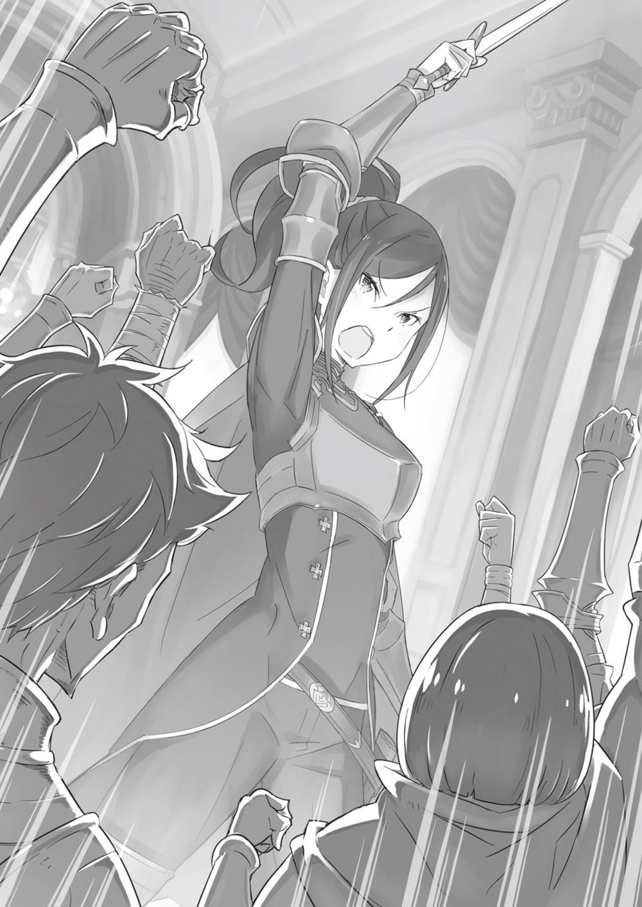

## 1

Когда переговоры закончились и план по уничтожению монстра приобрёл конкретные черты, участники не мешкая приступили к активным действиям. Коммерсанты, Анастасия и Рассел, как и обещали, собрали всё оружие, имевшееся в столице, а Круш созвала заранее подготовленный отряд. Вдобавок предстояло раздобыть драконьи экипажи для перевозки людей и грузов. Иначе говоря, работы было невпроворот.

— Скупила все телеги! Так вот почему я не мог вернуться в особняк Розвааля… — сообразил Субару, глядя на повозки и снующих по территории особняка Круш людей.

Пока он путешествовал в своё удовольствие по временной петле, Круш, Вильгельм и другие готовились к битве с Белым Китом. Осознание этого факта не давало юноше покоя. Целых три круга Субару доставлял окружающим одни хлопоты, и теперь он задумался, как помочь.

— Если я в силах чем-нибудь…

— Хм, сомневаюсь, что Субарунчик может оказаться нам полезным.

— Эй, я же сказал «если»!

Поглощённый суетливой атмосферой, Субару хотел было предложить помощь, но Феррис охладил его пыл. Рыцарь зевнул, прикрыв рот ладонью. Вёл он себя так, словно к нему это все не имело никакого отношения. Субару такое поведение возмутило.

— Если тебе самому наплевать, не значит, что и другим тоже! Даже для меня должно найтись хоть…

— Кажется, ни заготовка ресурсов, ни формирование отряда не входят в твою компетенцию. А когда посторонний лезет туда, куда его не приглашают, это лишь усложняет дело, так что веди себя тихо.

— Разве я могу оставаться в стороне?! Ведь именно из-за меня всё и закрутилось! А ты предлагаешь…

— Вот тут ты ошибаешься! — резко перебил Феррис и щёлкнул воодушевлённого юношу по носу. — Когда кто-то заявляет «всё из-за меня» и тому подобное, это не особо радует. Я бы даже сказал, бесит!

— Но ведь действительно вся эта ночная суета — моих рук дело… — не сдавался Субару: не сидеть же просто так в ожидании результата?!

— Сейчас всё вертится вокруг королевских выборов, но раньше госпожа Круш была обычной милой барышней аристократкой, которая даже не помышляла о политической стезе-ня.

— Что?!

— Ой, я сказал «милой»? Немного не так. Милой-то она всегда была, но уже в те времена госпожа Круш отличалась такой силой и импозантностью, что могла заткнуть за пояс любого мужчину!

Субару растерялся от внезапной перемены в беседе, но Феррис словно забыл о его присутствии, щёки рыцаря загорелись.

— Госпожа Круш искренна, отважна, непобедима! Она прямолинейна более, чем кто-либо другой, и у неё чрезвычайно доброе сердце… Однако вступить в борьбу за трон её заставил один человек…

— О ком ты говоришь?

— Я имею в виду Его Высочество Фурье Лугунику, ныне почившего четвёртого принца королевства.

Слова Ферриса слегка удивили Субару. И не только потому, что он услышал незнакомое имя. Юноша не мог оторвать глаз от печально-задумчивой улыбки Ферриса, когда тот произносил это имя. Улыбка рыцаря, исполненная тоски по давно ушедшим временам и в то же время сдержан. но гордая, была по-настоящему прелестна. Конечно, Субару помнил, что перед ним мужчина, но всётаки восторженно вздохнул.

— Ты, Субарунчик, слегка напоминаешь мне Его Высочество.

— Неужели он тоже всех смущал своим суровым взглядом?

— Правда, тот был посимпатичней-ня. С тобой, Субарунчик, ни в какое сравнение. Но характер у него был не из лёгких: своенравный, прямой и поразительно самоуверенный… Всё, больше ничего не скажу, чтобы не оскорбить Его Высочество.

— Ты уже и так наговорил более чем достаточно, но дело в том, что мне тоже обидно!

Если причиной сантиментов Ферриса было что-то, кроме внешности, выходит, у Субару с принцем нашлось много общих дурных черт. Юноше стало грустно оттого, что он не мог это отрицать, но Феррис покачал головой.

— Его Высочество Фурье являлся, несомненно, сложным человеком, однако он был предан своему делу. Принц уделял большое внимание тому, что зовётся королевским достоинством, но доставлял много хлопот окружающим своими идеями. И хотя у него вечно всё валилось из рук, Его Высочество был пылким человеком — никого и слушать не хотел, если-ня его пытались успокоить.

— По-моему, с ним было нелегко иметь дело…

— Ещё как! Он говорил: «Разве я могу сидеть сложа руки, когда остальные усердно работают?» В этом вы с ним очень похожи. Но Его Высочество никогда не говорил «это всё из-за меня»! Такому человеку, как он, подобное и в голову не пришло бы.

В словах Ферриса, который предавался воспоминаниям с мечтательной улыбкой, чувствовалась любовь к этому человеку. Видимо, принц был очень ему дорог. Так подумал Субару и наконец осознал одну вещь. Четвёртый принц Королевства Лугуника, человек по имени Фурье, должно быть, умер от эпидемии, из-за которой пришлось объявить королевские выборы. Не исключено, что именно этот человек сподвигнул Круш завладеть троном…

— А этот принц Фурье и леди Круш, они были хорошо знакомы?

— Они были примерно одного возраста, и Его Высочество частенько захаживал к госпоже Круш, при этом каждый раз извиняясь, что редко появляется. Он не умел скрывать свой чувства и был весь как на ладони.

Глядя на улыбку Ферриса, погрузившегося в приятные воспоминания, Субару предположил, какие смутные чувства испытывал Фурье. Отношения между Феррисом и Круш выходили за рамки отношений между рыцарем и госпожой или между мужчиной и женщиной. Все трое были друг для друга особенными и представляли большую ценность.

— Своей жизнью на девяносто пять процентов я обязан госпоже Круш. — Феррис прижал руку к груди и опустил глаза. — Однако оставшиеся и самые важные пять процентов — заслуга Его Высочества Фурье. В этом я не сомневаюсь.

Слова рыцаря неожиданно тронули Субару. Юноша был уверен, что Феррис не раскрывает своей души никому, кроме Круш. Являясь лекарем, Феррис каждый день имел дело с пациентами, которые находились на грани жизни и смерти, возможно, поэтому его взгляд порой становился холодным до дрожи. Однако, когда он говорил о Фурье, в лице Ферриса не было ни капли суровости. Самый обычный юноша, каких в мире полным-полно… Если только не считать, что выглядел он как миловидная девушка.

— То есть ты испытываешь ко мне такие же тёплые чувства, как к этому Фурье?

— Что?! — угрожающе произнёс Феррис. — Думаешь, ты Ровня Его Высочеству Фурье?! Да я тебе…

— Ну ты и злюка! У меня аж мурашки побежали!

Под испепеляющим взглядом Ферриса Субару здорово напугался. Рыцарь откашлялся и сказал:

— Нет, Субарунчик, это не так. Я вспомнил о Его Высочестве вовсе не потому! — Феррис топнул ногой. — Дурачок, разве это не очевидно?! Ну что с таким делать-ня?..

— Откуда я знаю, что у тебя на уме?! — закричал Субару в ответ. — Чего тебе, в конце концов, от меня надо?!

— Субару, господин Феликс, что случилось? Почему вы так кричите? — послышался голос Рем, которая в эту минуту должна была собирать вещи. Девушка спускалась к них по лестнице. Увидев её обеспокоенное лицо, Субару почесал в затылке, придумывая объяснение.

— Мне просто показалось, что я могу быть полезен, а вот Феррис утверждает, что от меня одни помехи. Да он сам не знает, что несёт!

— Твоё предположение, Субарунчик, в корне неверно! Не понял он, что я имел в виду!.. Я имел в виду, что ты будешь путаться у всех под ногами…

— Да как ты смеешь! Я же хотел помочь! Ведь это из-за меня…

— Довольно! — резко оборвал его Феррис. Ушки рыцаря вздрогнули, и он ткнул Субару пальцем в грудь. — «Из-за меня», «из-за меня»… Надоел! Не «из-за», а «благодаря». И ночная суета, и то, что старик Вил теперь может сразиться с Белым Китом, — всё это благодаря тебе-ня.

— «Благодаря»?.. — Субару в недоумении склонил голову. Стоявшая рядом Рем улыбалась, выражая согласие с довольным Феррисом.

— И участие в выборах, и сражение с Белым Китом… На самом деле это не ради самой госпожи Круш, а ради всех и каждого! — продолжил Феррис. — Убить Белого Кита — заветная мечта старика Вила. Он не был рядом, когда Белый Кит погубил его супругу — прежнего Великого Мечника.

—Великого Мечника?..

— Старик Вил, как безумный, охотился на Белого Кита чтобы отомстить, но на деле словно пытался схватить туман. Он вёл записи: где появлялся монстр, когда и при какой погоде… Благодаря этому мы перебрали множество гипотез и в конце концов нашли закономерность.

Каким настойчивым надо быть, чтобы в одиночку охотиться на смертельного врага —

Туманного Зверодемона! Его боялся весь мир, вместе с тем о нём почти ничего не было известно!

— Но когда наконец Вильгельм понял, ему никто не поверил.

Сколько бессонных ночей провёл пожилой мечник, ведя записи и горя жаждой мести! Но когда, спустя годы упорных поисков, он напал на след, сил убедить кого-либо в своей правоте уже не было…

— Великая Карательная Экспедиция оставила незаживающую рану на теле королевства. Трон в то время пустовал, и старику Вилу не к кому было обратиться за поддержкой. Никто не имел ни сил, ни желания сражаться с Белым Китом. Должно быть, старик Вил совсем уже отчаялся…

Вильгельм грезил местью, но на деле не мог даже подступиться к ненавистному противнику. Субару хорошо знал это отчаяние, порождённое бессилием. Ведь слабость была его грехом, от которого нет спасения…

— Кажется, старик Вил даже подумывал всё бросить и пойти на Белого Кита в одиночку. Он считал, что бездействие куда позорнее поражения. Какие же глупцы эти мужчины! Его жена точно не одобрила бы подобное рвение.

— Конечно! — подала голос Рем.

Девушка искоса поглядывала светло-голубыми глазами на Субару, прижав руку к груди.

— Мне хочется, чтобы люди, которых я люблю, всегда были здоровы и бодры. И чтобы вспоминали обо мне с улыбкой, даже когда меня не станет…

— Рановато ты себя хоронишь, — не стерпев, заметил Субару в ответ на сентиментальные слова Рем, затем протянул руку и ласково погладил девушку по голове.

Субару сделал это так искренне, что Рем довольно зажмурилась.

— Выходит, госпожа Круш вызвалась помочь Вильгельму?

— В конце концов, госпожа Круш — очень добрый человек, — кивнул Феррис, глядя куда-то вдаль. — Она всегда подаст руку помощи тому, кто на грани отчаяния, от кого все отвернулись. Она скажет: «Его Высочество поступил бы так же».

Феррис на мгновение прикрыл веки, затем его лицо приняло привычное выражение.

— Ладно, оставим праздные разговоры. Хотя мы проболтали достаточно долго, не ломай над этим голову, Субарунчик. И не думай, что все бегают вокруг тебя. Не такая уж ты важная птица, как возомнил!

— Не знаю, зачем ты это говоришь, но ранишь меня прямо в сердце!

— Субару, не расстраивайся! Я всегда думаю о тебе. Какой бы птицей ты себя ни возомнил, я твёрдо уверена: ты в десять раз важнее!

— Рем, ты меня пугаешь!

Феррис мог бы сказать и помягче, но и Рем хороша: её утешительная реплика оказалась совсем не к месту. Задетый, Субару всё-таки надеялся, что понял их слова правильно.

— Ох, как всё сложно-то…

— Не думай, Субарунчик, что во всём разобрался, меня это раздражает!

— Феррис, что-то ты слишком разговорился. Может, помолчишь немного?

— Что?! — Из-за спины Ферриса послышался чей-то голос, он испуганно подпрыгнул и обернулся.

Позади, скрестив руки на груди, стоял пожилой джентльмен. Под пристальным взглядом Вильгельма Феррис как-то весь сжался.

— Тебе не кажется, что это нехорошо — обсуждать чужие неудачи?

— Помилуйте, какие неудачи?! Я же просто переосмысливаю вашу личность!

Рыцарь принялся оправдываться, сплетя пальцы рук и обиженно надув губы. Как он ни старался выглядеть миловидной девушкой с кошачьими ушками, Феррис всё равно оставался парнем.

Разумеется, его сексуальные чары не могли подействовать на Вильгельма.

— В любом случае не стоит обсуждать кого бы то ни было без его позволения!

— Понял, — нехотя бросил Феррис и с понурым видом удалился. При этом Феррис не был бы Феррисом, если бы не махнул на прощание рукой и не подмигнул.

На душе Субару остался неприятный осадок. Юноше было ужасно неудобно, что он ненамеренно узнал о прошлом Вильгельма. Субару даже пришла в голову мысль в качестве компенсации поделиться своим тёмным прошлым. Но стоило представить, какие ужасные последствия это повлечёт, как он отверг безрассудную идею. Субару промолчал, на лбу его выступила испарина.

Тишину нарушил Вильгельм:

— Приношу свои извинения за то, что вам пришлось услышать эту неприятную историю. Я был одержим пустой, как сухое дерево, идеей и напрасно потратил время. Прошу, забудьте. На губах Вильгельма появилась вымученная улыбка. Субару решил, что к желанию старика следует отнестись с уважением. А желал он сейчас одного: чтобы Субару ни о чём не спрашивал. Так юноша и поступил.

— Должно быть, вы очень любите свою супругу.

«Мисс Рем?!»

Шок был таким сильным, что Субару в своих мыслях невольно прибавил «мисс» к имени девушки.

Рем ступила на минное поле.

Вильгельм поднял брови и, немного помолчав, ответил`

— Да, я люблю её. Больше, чем кого-либо. Больше, чем что-либо. И буду любить вечно! В прошлом Субару не раз приходилось слышать из уст Вильгельма о том, как он любит свою жену. Если бы юноша тогда знал, что супруга старика погибла, слова Вильгельма зазвучали бы для него совершенно по-другому.

— Завтра у нас много дел, пора отдыхать. Желаю вам спокойной ночи.

Вильгельм повернулся к Субару и Рем спиной и не спеша зашагал прочь.

— Завтра… — машинально повторил Субару, глядя вслед старику.

Вильгельм замер, но не обернулся.

— Завтра мы с Рем будем сражаться вместе с вами.

— Вы…

— Разве мы можем сидеть сложа руки, когда наш союзник бьётся с могущественным противником? — затараторил Субару, пока Вильгельм не успел ответить отказом. — Не волнуйтесь, Рем умеет драться. Я тоже… кое-что могу… Вместе мы прикончим этого подонка! Я буду помогать изо всех сил!

Пообещав составить старику компанию, Субару поднял большой палец.

Вильгельм немного помолчал, затем обронил:

— Моя жена была из тех женщин, которых восхищает красота цветов.

Казалось, мечник ответил совсем невпопад.

— Она не хотела размахивать мечом, но меч любил её больше, чем кого-либо. Судьбой ей было предначертано посвятить жизнь мечу, и она покорилась воле провидения.

В способностях Райнхарда, который на данный момент был Великим Мечником, Субару убедился на собственном опыте. Сила Божественной Защиты Великого Мечника, с точки зрения обычного человека, была чудовищной. Настолько чудовищной, что определяла будущее её обладателя

— Я забрал у неё меч и заставил отказаться от прозвища Великий Мечник.

Однажды Вильгельм сказал Субару, что считает себя бездарным и ему понадобилось полжизни, чтобы стать тем, кем он являлся теперь.

Сколько неудач пришлось вытерпеть Вильгельму, сколько раз он падал духом, прежде чем приблизился к осуществлению своего страстного желания.

— Она отказалась от пути воина и стала обычной женщиной, тогда я женился на ней. Я уверял, что она получит прощение и сможет жить не как Великий Мечник, а как человек по имени Терезия. Однако меч ее не простил…

Почему же она вступила в отряд, который пытался уничтожить Белого Кита, если перестала быть воином? Но Вильгельм, вспоминая прошлое, об этом умолчал.

— Мастер Субару, благодарю, — произнёс он и, вздохнув, добавил: В завтрашней битве я разгадаю тайну моего меча. Я отправлюсь туда, где пребывает Терезия, наконец мы встретимся.

С этими словами Вильгельм удалился.

Субару, обуреваемый чувствами, не мог унять дрожь. Решимость Вильгельма, такого же человека, как он сам, внушала юноше глубокое почтение. Старик любил свою жену всем сердцем, беззаветно…

Повисла тишина.

— Субару, ты… — послышался вдруг голос Рем.

Он повернулся к девушке и встретился с ней взглядом.

— Ты будешь помнить обо мне так же долго, когда меня не станет?

— Не хочу отвечать на этот вопрос, плохая примета, — пробурчал Субару и легонько ткнул Рем пальцем в лоб.

Она потрогала свой лоб и улыбнулась, словно это и было то, что девушка хотела услышать.

## 2

Наступило утро. До начала операции по уничтожению Белого Кита оставалось семнадцать часов.

— От госпожи Круш поступило указание дать тебе любое животное на твой выбор.

— Не такой уж простой выбор…

Они стояли на переднем дворе особняка Круш, обдуваемые прохладным утренним ветерком. Субару растерянно смотрел на выстроившуюся перед ним шеренгу земляных драконов, которых демонстрировал Феррис. Вопреки обыкновению, на нём было не девичье платье, а белая форма рыцаря-гвардейца с белоснежной накидкой.

Судя по выражению его лица, Феррису не терпелось ринуться в бой. Рыцарь недовольно надулся.

— Ну что ещё? Хочешь сказать, тебя совсем не воодушевляет доброта госпожи Круш?!

— Вовсе нет! Я рад, что мне позволено выбрать дракона, но, честно говоря, я в них совсем не разбираюсь. Я что, похож на эксперта по драконам с многолетним стажем?

— Хм, я бы не сказал. Ну, тогда положись на интуицию. От этого зверя будет зависеть твоя жизнь, и я не хочу оказаться виноватым, если ты вдруг помрёшь. Поэтому больше не скажу ни слова-ня!

— Вот только не надо каркать! Умирать никто не собирается.

Хотя до битвы оставалось меньше двадцати часов, Феррис казался на удивление спокойным.

Лишние переживания, конечно, были ни к чему, но и слишком расслабляться тоже не следовало.

Среди многочисленных драконов, подготовленных для похода на Белого Кита и стоявших сейчас во дворе Круш было много грузовых. Однако Субару требовался дракон для верховой езды, оседлав которого он смог бы участвовать в сражении. Юноша слышал, что Карстены держат только лучших животных с безупречной родословной.

— Сколько ни выбирай, всё равно следующий кажется лучше, чем предыдущий. Рем, что скажешь?

Большинство воинов привели с собой любимых драконов. Правда, толку от этой привилегии оказалось немного.

— Дай подумать, — сказала Рем, поглаживая одного из зверей. — Меня никогда особенно не волновал выбор дракона, потому что большинство из них меня слушается, когда я показываю, кто главный.

— Да, это точно. Знаю я твои спартанские принципы. И что же делать?..

Дракон, которого ласкала Рем, уселся на землю, словно хотел продемонстрировать безоговорочное подчинение. Вероятно, зверь осознавал, что человек стоит выше него.

— Субару, у нас не так много времени, так что выбирай поскорее! — поторопил Феррис.

— Ты говоришь так, словно тебя это совсем не касается. Будь серьёзнее!

— Меня это и правда не касается, но я так говорю по другой причине. Фактически ты можешь выбрать любого: каждый из них обладает всеми нужными качествами, так что не пожалеешь. Поэтому я советую тебе обратиться к интуиции.

— Ну, звучит вроде логично…

Подгоняемый Феррисом, Субару шёл вдоль шеренги драконов и вдруг остановился у одного из них. Шагавшая рядом Рем удивлённо посмотрела на юношу:

— В чём дело, Субару?

— Ничего, просто подумал вот об этом звере…

Перед Субару стоял чёрный как смоль красавец-дракон с хищной мордой и желтыми глазами. Экипирован он был так же, как и другие: на спине имелось седло, а голова была покрыта специальным кожаным шлемом. Впечатляли глаза, остановившиеся на Субару, — они были совсем не такие, как у остальных. В его взгляде не ощущалось ни гордыни, ни подобострастия, свойственных другим земляным драконам. Чёрный дракон просто ждал, когда его выберут, невозмутимо и с достоинством.

— Ты, случайно, не тот самый дракон, что недавно встретился мне у особняка?

Субару вдруг понял, что видел уже этого зверя, и протянул к нему руку. Рем, немного испугавшись, хотела было остановить его, но дракон опередил девушку: он потёрся носом о протянутую ладонь.

— Вот этот, пожалуй, лучший!

— Мне показалось, он из тех драконов, которые известны своим строптивым нравом, и она испугалась, что он откусит тебе руку, Субару…

— А ведь и правда, мог откусить! Надо быть осторожнее…

И всё же волноваться не стоило. Похоже, Субару и дракон были на одной волне. Юноша решил, что доверит свою жизнь именно этому чёрному зверю.

— Феррис, я выбираю этого. У нас любовь с первого взгляда!

— Ага, понял. О, хороший выбор! А ты, Субарунчик, тот ещё бесстыдник! Про любовь лучше не заикайся, а то Рем обидится.

— Вовсе не обижусь! Мы обязательно поладим, у нас получится.

Субару немного смутила последняя часть фразы Ферриса, но, поскольку Рем одобрила его выбор, он остановился на чёрном драконе. Оставив Ферриса подготавливать зверя к походу, Субару вместе с Рем направились в особняк.

До назначенного часа оставалось ещё какое-то время, и в особняк Круш один за другим прибывали члены отряда — участники операции по уничтожению Белого Кита. Но из всех собравшихся в холле кое-кто привлёк особое внимание Субару.

— А они что здесь делают?..

Субару таращился во все глаза. Заметив взгляд юноши, один из вновь прибывших двинулся ему навстречу неуклюжей, грузной поступью.

— Вот тебе раз! И ты тоже собрался на Белого Кита?! Здорово, малой! оглушительно проревел незнакомец.

Его слова, казалось, раскатился по всему особняку. У Субару едва не лопнули барабанные перепонки. Он закрыл уши руками и, сморщившись, как старый гриб, вперил в громилу негодующий взгляд.

— Мне сеньора рассказала! Так это ты устраиваешь сегодня охоту на Кита?! А нам позволишь присоединиться? Хоть погода наладилась!

— Чего так надрываться-то?! Не видишь, я скоро оглохну!

Пытаясь переорать громогласного воина, Субару сам перешёл на крик. Глупый гогот, раздавшийся в ответ, был ещё громче, чем вопль Субару. Принадлежал этот смех зверочеловеку с собачьей головой.

Тело его покрывала коричневая шерсть, а на голове красовалась длинная тёмно-каштановая грива. Суровый взгляд и клыки, торчащие из пасти, делали морду чудной и даже обаятельной. Тем не менее, разглядывая кожаный наряд на его мускулистом двухметровом теле, Субару не мог отделаться от мысли, что воин появился на свет в результате эксперимента по скрещиванию варварства и цивилизации. Его полуобнажённое тело защищал стальной наплечник с броской эмблемой торгового дома Хосин.

— На этой эмблеме написано «зверочеловек» на диалекте Карараги… Выходит, вы из отряда Анастасии «Железный клык»?!

— Чего? Что ты там бормочешь? Можно погромче? Ничего не разобрал!

— Да не кричи! Это чем же надо питаться, чтобы вырасти таким здоровым?! Из какого ты племени?

— Из кобольдов, неужели не понятно?! Или ты видал человекопсов другого семейства?

— Из кобольдов… Да быть не может!

Субару представлял их в виде карликов с собачьими головами. Этот тоже имел звериную голову и перемещался на двух ногах, но телосложение отличалось разительно.

— Меня зовут Рикардо. Славная с тобой девчонка!

— Здравствуйте, господин Рикардо! Вы очень любезны. Меня зовут Рем.

Девушку его внешний вид не удивил, поэтому в ответ на веселое приветствие воина она учтиво представилась.

Тем временем в толпе воинов показалась Анастасия, следившая за происходящим краем глаза. С ухмылкой на лице она подошла ближе. Глядеть на эту мину было неприятно, и Субару насупился.

— Нацуки, я хотела сообщить, что у Рикардо проблемы со слухом. Чтобы общение не вызывало неудобств, вот тебе совет: не подходи к нему слишком близко.

— Об этом следует предупреждать заранее! У тебя совесть есть?!

— Ох, прости! Я поддалась соблазну увидеть эту сцену, — хихикнула Анастасия.

— Вижу, что ни стыда ни совести. Ужас!

Не успел Субару умолкнуть, как зверочеловек Рикардо легонько хлопнул его широкой ладонью по голове.

— Эй, парень! — проревел он, обнажив клыки. — Следи за языком, когда говоришь с сеньорой! Как-никак моя хозяйка, так что будь повежливей! Она человек деловой, просто так разговоры разговаривать не станет, поэтому и друзьями не обзавелась. Проявишь любезность — глядишь, подружитесь.

— Рикардо, если уж принялся выбалтывать секреты, обойдись без брани.

— А когда это я бранился?! Я же о вас беспокоюсь, сеньора! Сколько себя помню, никогда с людьми особо не ладили. А теперь вы уехали из Карараги сюда, где никого не знаете! У меня сердце щемит, когда об этом думаю! Но гляньте! Тада-ам! Вот вам друг номер один!

— Давайте вы сами поболтаете, а? И вообще, чего ты меня за голову хватаешь?! Да ещё мотаешь из стороны в сторону! Оторвёшь ведь! Сила есть — ума не надо!

Субару кое-как стряхнул с себя крепкую, как сталь, руку Рикардо, пока тот не оторвал ему голову. Отойдя от воина подальше, юноша принялся крутить головой направо и налево.

— Ох, чуть шею не свернул! Не хватало ещё, чтоб меня перед решающей схваткой из-за травмы удалили из команды! Я бы не простил себя за такой глупый промах!

— Хватит делать из мухи слона! Я всего лишь хотел, чтобы вы подружились.

— Понятие «дружить» в разных странах понимают по-своему. Вы в Карараги все такие, что ли?

— Вовсе нет, — сказала Анастасия и встала рядом с воином. — Таких, как Рикардо, немного. Разве, глядя на меня, ты не понимаешь, насколько изящны и утончённы женщины Карараги, а? — добавила она холодным, высокомерным тоном.

Субару сделал глубокий вдох и подтолкнул Рем вперёд.

— Видишь? Вот истинная женственность и утончённость. Погляди, как она грациозна!

— Субару… Ты меня смущаешь…

— Хм… Странная девочка, но в хорошем смысле. У неё определённо есть будущее. Неплохой выбор, Нацуки.

Субару задели слова Анастасии. Словно он выбрал себе девчонку для легкомысленных развлечений.

— Судя по всему, вы уже познакомились, — послышался голос Круш.

Герцогиня приблизилась к причудливой компании, которую собрал вокруг себя Субару. На этот раз вместо привычного парадного мундира мужского покроя на ней была форма с лёгкими доспехами, практически лишённая каких-либо украшений. Видимо, во главу угла Круш ставила свободу движений, однако Субару сомневался, что такие доспехи обеспечивают эффективную защиту.

— Боевая форма должна быть удобной, — объяснила Круш, заметив в глазах юноши сомнение.

— Не беспокойся, благодаря кузнецу эти доспехи обладают надёжной Божественной Защитой. Пока во мне есть мана, они крепче, чем кажутся на первый взгляд.

Круш провела ладонью по нагрудной пластине.

— Надо же, и такое бывает! Всё равно эта магия и Божественная Защита — читерство… Может, во мне тоже спит какая-нибудь суперудобная Божественная Защита, о которой я просто не догадываюсь?

— Каким бы долгим ни был сон, разве можно забыть, как дышать? С Божественной Защитой то же самое. Если до сих пор её не заметил, просто смирись, что никакой Божественной Защиты у тебя нет.

Субару уже не в первый раз разочаровывали подобным образом. Пора было оставить всякую надежду на сверхспособности. Юноша обиженно поджал губы — совсем как ребёнок. Чтобы утешить Субару, Рем стала поглаживать его по спине. Тем временем Круш перевела взгляд на Рикардо, который смотрел на неё с высоты своего гигантского роста.

— Вот ты какой, — сказала она, сложив руки на груди. — Я наслышана о тебе, но реальность превзошла самые невероятные слухи! Так ты и есть командир «Железного клыка», правая рука Анастасии Хосин?

— Я всего лишь наемный солдат. А ты Круш Карстен, верно? О тебе я тоже много слышал и от сеньоры, и от других… Но увидеть вживую — это, знаешь ли…

Рикардо шмыгнул своим чутким собачьим носом, затем наморщил морду и громко захохотал. — Всё-таки вы великие люди! Должно быть, нелегко участвовать в таком деле, как королевские выборы, а, сеньора?

— Именно потому я и продаю свои добрые услуги! А уж что именно я напишу на ценнике, зависит от того, как ты, Рикардо, будешь работать. Так что не подведи!

— Га-ха-ха-ха! Ох и строгая вы хозяйка, сеньора!

По поводу Круш Анастасия была того же мнения, что и Рикардо. Торговка говорила с гогочущим солдатом мягко. Быть может, потому, что они давно знали друг друга. Похоже, она испытывала к исполину самые тёплые чувства.

Если не принимать во внимание громогласность воина, Субару он тоже понравился. Возможно, дело было в человеческих качествах Рикардо, если, конечно, понятие «человеческий» применимо к существу с собачьей головой. Правда, приобрести немного сдержанности ему бы точно не помешало.

— Успел отдохнуть вчера вечером?

Круш отвела взгляд от Рикардо и теперь вопросительно смотрела на Субару. Тот всё ещё вертел головой, которой едва не лишился.

— Спасибо за заботу, но мне показалось, что спать без задних ног, когда вы, леди Круш, и остальные готовятся к битве, неправильно.

— Как говорится, каждый на своём месте. Твоя задача заключалась в том, чтобы собрать нас — Рассела Феллоу, Анастасию Хосин и меня — в одном месте. Ты исполнил свою роль в тот момент, когда мы приняли решение уничтожить Белого Кита. По правде сказать, я удивлена, что ты вызвался участвовать в операции.

Круш слегка улыбнулась, затем снова посерьёзнела и посмотрела Субару прямо в глаза. По выражению её янтарных глаз юноша понял, что Круш колеблется. Не зная, чего ожидать, Субару напрягся.

— Я благодарна тебе за помощь в борьбе с Белым Китом… Но… умеешь ли ты сражаться?

— Конечно нет! В бою от меня пользы не больше, чем от кошки! В таких делах лучше положиться на собаку…

— Ты на меня намекаешь, что ли?! — возмутился Рикардо.

— На тебя, но это не повод встревать! — прикрикнул Субару. — Ха! То, что не надо, ты слышишь!

Когда юноша прямо заявил, что не собирается сражаться, глаза Круш округлились. Субару принялся мучительно подбирать слова.

— Воин из меня не очень… Но в битве с Белым Китом такой человек, как я, всё же может пригодиться.

— Поясни, я вся внимание.

— Я и сам не особо рад этому факту… В общем, дело в том, что от моего тела исходит запах, притягивающий зверодемонов.

Откровенное признание Субару снова повергло Круш в ступор, из которого её вывела Рем.

— Субару говорит правду, — подтвердила девушка, и Круш, немного помявшись, потребовала продолжения.

— Допустим, я тебе верю. Но объясни подробней.

— Возможно, «запах» — не самое подходящее слово… Просто у моего организма есть такая особенность. Помните, вчера мы говорили о нападении зверодемонов на особняк Розвааля? Именно этой своей особенностью я их и привлёк.

— Вот как… Выходит, твоя особенность связана с митией, которая сообщает о приближении зверодемонов…

— Неожиданный поворот… А… не обращайте внимания, это я сам с собой.

Субару умолк, едва не сболтнув лишнего. Круш глядела на него с подозрением.

— В любом случае я считаю, что это сработает и с Белым Китом. Думаю, моё присутствие приведёт его прямиком к нам в руки. Но рассчитывать, что я стану с ним сражаться, не стоит, такую тяжёлую ношу я на себя не возьму.

Вольгармы были всего лишь огромными собаками, и то Субару едва не погиб. Конечно, степень опасности зверодемона не определяется величиной его тела, но габариты Белого Кита в несколько тысяч раз превосходили размеры вольгармов. Уйти от преследования Белого Кита в одиночку, не говоря уже о том, чтобы схлестнуться с ним на поле брани, Субару было не по силам. — Я стану отвлекать его внимание, мелькая под самым носом на драконе, а вы тем временем наброситесь всей своей мощью. По крайней мере, я бы посоветовал придерживаться этой тактики.

План действий, предложенный Субару, вызывал сомнения даже у него самого. Воин из юноши был никудышный, зато он мог носиться по полю боя, играя роль живой приманки. Именно в этом и заключалась стратегия. Но такая перспектива ужаснула бы и тех, кто жаждал смерти…

— Невероятно, но факт! Ты, по всей видимости, не лжёшь. Круш задумчиво тронула подбородок и вздохнула, в её глазах по-прежнему читалось сомнение. Вероятно, она проанализировала слова Субару с помощью Божественной Защиты Видения Ауры и теперь обдумывала, насколько эффективен такой план.

— За последние полдня я уже не в первый раз сомневаюсь в своей Божественной Защите… Не то чтобы я считала свой дар безупречным, но…

— Теряете уверенность в себе?

— Нет. Удивительные вещи напоминают мне, что нельзя расслабляться.

Круш улыбнулась, показывая, что совсем не расстроена. В её глазах мелькнуло выражение горделивой львицы, которое тут же исчезло, и лицо герцогини приняло обычный величественный вид. — Феррис доложил: из всех земляных драконов, что были в моём стойле, ты выбрал лучшего. Что ж, если готов сыграть непростую роль, пусть будет по-твоему. Главное — ты должен следовать моим указаниям.

— Вот что ещё хотел уточнить, — отозвался Субару. — По вашему виду это и так ясно, но всётаки… Вы тоже собираетесь сражаться?

— Неужели ты полагаешь, что я буду спокойно сидеть в своём кресле в особняке, ожидая хороших вестей?

Круш щёлкнула пальцем по металлическому доспеху и гордо вскинула голову. Субару виновато понурился: герцогиня выглядела такой отважной, что его вопрос оказался совершенно неуместным.

— Похоже, все в сборе, — тихо констатировала Круш.

В тот же миг, словно услышав команду, в вестибюль особняка один за другим вошли люди. Это были мужчины с суровыми лицами, облачённые в военную форму. Видавшее виды снаряжение говорило о богатом боевом прошлом хозяев. Однако Субару смутил возраст воинов.

— Что-то мне подсказывает, эти ребята уже далеко не молоды…

Первая мысль, что взбрела в голову, сразу же слетела с его языка.

Люди, прошедшие мимо Субару строем, судя по всему, были членами отряда ликвидации Белого Кита. Отряд насчитывал около десяти человек, причём весьма немолодых, за пятьдесят лет.

Расслышать бормотание незнакомца они вряд ли могли, но один мужчина внезапно устремил на Субару взгляд. Юноша машинально напрягся. Воин вышел из строя, его волосы и борода были заметно поседевшими.

— Госпожа Круш, отряд в полном составе прибыл, — отрапортовал он поставленным голосом. — Это тот самый?

— Да, это он, — кивнула Круш.

Воин повернулся к Субару и тронул его за плечо.

— Спасибо тебе, мальчик.

— Что?..

— Благодаря тебе наша заветная мечта наконец осуществится. И мы этому безмерно рады.

Воин с чувством сжал плечо Субару, что привело того в ещё большее смятение. Мужчина второй раз поблагодарил юношу, похлопал по плечу и вернулся в строй.

— Должно быть, все эти господа как-то связаны с Белым Китом, — шепнула Рем на ухо Субару, провожая взглядом удаляющихся воинов.

— То есть они участвовали в прошлых походах на Кита?

— Многие из того отряда уже удалились на покой. А в новый отряд вступили воины, откликнувшиеся на призыв Вильгельма. Они опытны, их боевой дух закалён ничуть не меньше, чем у рыцарей действительной королевской гвардии.

— То есть мы имеем дело с ветеранами, пылающими жаждой мести… Это вдохновляет. Чувствуя возбуждение, Субару мельком глянул на Круш, которая любовалась старой гвардией.

Ради того, чтобы осуществить мечту Вильгельма, она была готова вступить в схватку даже с Белым Китом. Приглашая ветеранов участвовать в битве, она также исполняла их заветное желание. Круш была добра. Именно об этом сказал Феррис вчера вечером. А возможно, так проявлялось влияние Его Высочества, которое, судя по всему, было весьма велико.

— Полагаю, это не всё войско?

— Здесь только самые выдающиеся воины. Остальных мы направили к Древу Флюгеля.

Час икс был уже близок, и Круш собрала в своём особняке костяк отряда. Присутствие опытных воинов придавало сил перед решительным рывком. Это вдохновляющее воздействие испытал на себе и Субару: с каждой секундой в нём росла уверенность, что они непременно одержат победу, а к горлу подступал нервный комок.

— Пора. Никуда не отлучайтесь, — бросила Круш Субару и Рем и взглянула на кристалл времени, находившийся над входом в вестибюль.

Судя по всему, герцогиня собиралась произнести напутственную речь для поднятия боевого духа присутствующих. Стоило ей сделать шаг, как в вестибюле появились Вильгельм и Феррис.

На рыцаре был тот же наряд, в котором он беседовал с Субару в саду. А вот Вильгельм был одет иначе. Вместо обычного чёрного костюма на нём была лёгкая экипировка с простенькими доспехами, закрывавшими только самые уязвимые части тела. Справа и слева на поясе болтались шесть небольших мечей. Вид Вильгельм имел такой, словно хоть сейчас готов ринуться в бой.

— О, и Рассел тоже пожаловал! Не желаете ли побеседовать?

Позади Вильгельма и Ферриса показалась тёмно-русая шевелюра Рассела. Торговец выглядел уставшим, как после бессонной ночи, однако в глазах горел огонёк предвкушения великой битвы.

— Судя по выражению лица Рассела, — сказал Субару, — он сделал все, что планировал. А как насчет вас, Анастасия?

— Неужели ты подумал, что я попаду впросак?!

— Нет, не подумал, просто спросил.

Что касается внимания к мелочам и скрупулезности, с Анастасией не могла тягаться ни одна из претенденток на престол.

Вскоре приготовления были окончены. Условленный час приближался, и в зале уже отчётливо ощущалось боевое настроение. Совсем скоро предстояло двинуться к месту решительной схватки.

— Минутку! — произнёс Субару вслед удаляющейся Анастасии и глянул искоса на Рем, которая в недоумении склонила голову.

Оставалось одно нерешённое дело.

— Анастасия, Рассел, мне бы хотелось с вами поговорить.

— А?..

Анастасия остановилась и обернулась. Выражение её лица свидетельствовало о том, что торговка почувствовала запах наживы. Женственность, которой ещё недавно сияли ее глаза, исчезла, уступив место блеску, что мерцает во взгляде перебирающего костяшки счётов коммерсанта. Но сейчас эта перемена внушала оптимизм.

Субару с Анастасией, на лице которой блуждала меркантильная ухмылка, направились к Расселу, и его усталое лицо оживилось.

Уж на кого, а на торговцев можно было положиться.

— Я хочу поговорить с вами, как с двумя выдающимися предпринимателями, дальновидными и благоразумными. Возможно, я делю шкуру неубитого медведя… Но давайте обсудим, что будет после того, как мы разделаемся с Китом.

Пока охота на Белого Кита не началась, Субару решил, что настала пора обговорить кое-какие важные детали.

## 3

— Четыреста лет! — начала Круш свою речь перед воинами.

Исполненный величия голос сотряс накалённый волнением воздух. Она стояла, гордо подняв голову и вытянувшись во весь рост до боли в спине. Пристальные взгляды собравшихся были направлены на герцогиню. Круш медленно окинула взором публику. Её ладонь лежала на рукояти воткнутого в пол фамильного меча, на которой был выгравирован герб дома Карстен — львиный оскал. — Четыреста лет миру угрожает Ведьма Зависти, принёсшая ужасные беды, память о которых сохранится в веках. И все эти годы мы живём в страхе перед исчадием Ведьмы — Белым Китом, избравшим наш мир в качестве охотничьих угодий, возомнившим себя хозяином наших земель. Ведьма Зависти однажды уничтожила полмира, её имя до сих пор является синонимом слова «страх». А Туманный Зверодемон, бывший слуга Ведьмы, ныне лишённый хозяйки, свободно разгуливает по свету. Это чудовище четырнадцать лет назад обратило в бегство Великую Карательную Экспедицию, многие участники которой пали его жертвами.

— Белый Кит унёс бессчётное число жизней. Никто не знает, сколько именно душ он сгубил, также никто в полной мере не изучил природу порождаемого им коварного Тумана. На протяжении четырёхсот лет количество надгробных камней только росло: как с выбитыми на них именами, так и безымянных.

Пока Круш произносила речь, воин-ветеран, глядя в пол, скрежетал зубами, едва сдерживая плач. Глава отряда наёмников сжимал кулаки так сильно, что ногти впивались в ладони и на пол падали капли крови. Пожилой мечник, обуреваемый безграничной яростью, молча ждал возможности выпустить наружу скопившийся гнев.

Их негодование, глубоко засевшая ненависть к врагу, что погубил многие тысячи невинных душ, сгустились мраком, который стал заполнять пространство огромного зала.

— Но настал час расплаты! Мы уничтожим Белого Кита и положим конец череде несчастий!

Круш сделала паузу, затем добавила:

— Уничтожим жалкого зверодемона, который, несмотря на отсутствие хозяина, продолжает следовать его воле!

В груди Субару разгорелось пламя. Юноша ощутил, как точно таким же огнём зажглись сердца воинов, молча стоявших в зале. Ветеран, склонивший голову; солдат-наёмник, ладони которого были сжаты в кулаки; пожилой мечник, прикрывший веки… Сейчас все они впивались в Круш широко раскрытыми глазами.

Увидев гнев, пылающий в их взглядах, Круш выбросила вперёд руку и произнесла ещё громче:

— В бой! На тракт Лифаус, к Древу Флюгеля!

— Да!!! — раздался громогласный ответ, и, сотрясая стены, воины с грохотом затопали ногами.

Поднявшаяся волна боевой энергии захватила и Субару. Не успел он опомниться, как сам принялся кричать во всё горло.

Круш воздела обнажённый меч и, перекрикивая толпу, провозгласила:

— Сегодня мы покончим с Белым Китом!!!

Битва с Белым Китом, самая крупная военная операция с момента прибытия Субару в альтернативный мир, началась.

