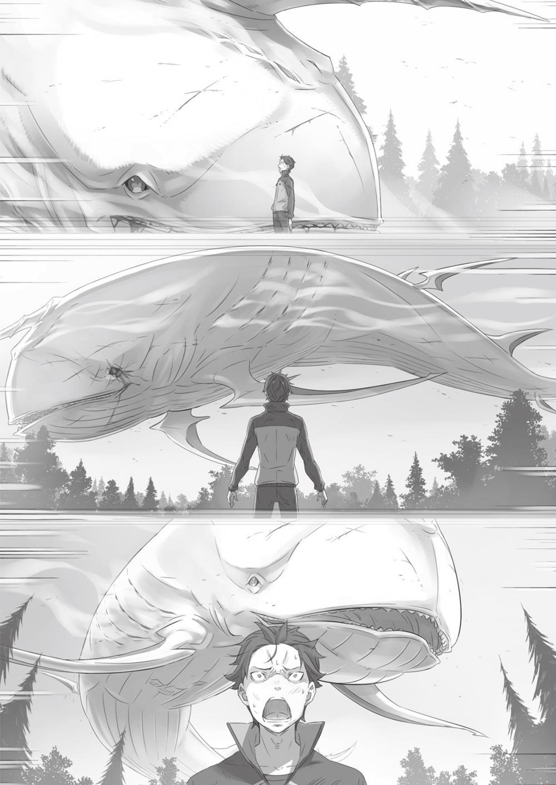

## 1

Операция по уничтожению Белого Кита, возглавляемая герцогиней Круш Карстен, стартовала.

За последние четырнадцать лет — со времён Великой Карательной Экспедиции — это была первая крупномасштабная военная операция против Белого Кита, которая грозил обернуться небывалым по ожесточённости сражением. Командование Большим Карательным Отрядом, сформированным под руководством Круш, было поручено Вильгельму ван Астрея — представителю фамильного древа Великих Мечников.

Карательный отряд, подчинявшийся Вильгельму, подразделялся на пятнадцать взводов, которыми руководили воины-ветераны, что пришли в большой зал особняка Круш. Каждый взвод насчитывал по пятнадцать бойцов. Таким образом, отряд состоял примерно из двухсот двадцати человек.

Однако то были далеко не все участники экспедиции. К Древу Флюгеля — месту, где должна была развернуться схватка, — Рассел уже направил военный обоз с необходимыми припасами. Помимо этого, в экспедицию входило тридцать наёмников-зверолюдей из отряда Анастасии «Железный клык». Ими командовал Рикардо, у которого имелось два помощника.

И этими помощниками являлись…

— Я Мими! — рука девочки энергично взмыла в воздух.

— А меня зовут Хэтаро, — коротко кивнул мальчик.

Это были представители расы зверолюдей — полулюди-полукотята. Покрытые рыжей шёрсткой, они едва доставали Субару до пояса. Белоснежные плащи, ниспадающие от самой шеи, чрезвычайно гармонировали с детскими мордочками.

При виде их Субару коротко и ясно выразил своё впечатление:

— Вы такие милые, что хочется схватить вас и убежать!

— Сеньора часто нам это говорит! — звонко засмеялась Мими.

— Сестричка, ты опять за своё!.. — пробурчал мальчик, представившийся Хэтаро. Судя по всему, они являлись братом и сестрой, двойняшками. Похоже, Мими была старшей, этакая девчонка-сорванец, а брат обладал спокойным, сдержанным характером и уравновешивал взбалмошную сестру. Субару был вовсе не против иметь среди союзников такую миловидную парочку. Ведь главное не внешность, а реальные способности. В конце концов, не на пикник же они собирались…

— Не то чтобы я сомневаюсь… Но ты действительно служишь вторым командиром?

— Мм? А мы с вами где-то уже встречались? Что-то не припоминаю, но меня это совсем не удивляет!

Мими сложила руки на груди и с сомнением посмотрела на Субару. Юноша замялся. Не было ничего удивительного в том, что девочка его не помнила. Знакомство с Мими в системе отсчёта Субару состоялось в предыдущем круге жизни. Вдобавок это событие было из тех, о которых и вспоминать-то особо не хочется. Впрочем, безудержная жизнерадостность Мими нисколько не потускнела.

— Не бери в голову, Меня зовут Субару Нацуки. Значит, вы двое — способные ребята?

— Ладно, не бу-уду. И да, вместе с Хэтаро мы сила! А будь с нами Тиви, стали б ещё круче! Суперсила! Дзы-ынь!

— В общем… да, верно. Мы с сестричкой можем постоять за себя.

Удержать самоуверенную Мими в узде младшему брату, судя по всему, было нелегко. Глядя на парочку, Субару подумал: «В этом мире, наверное, все старшие сёстры такие — заставляют младших краснеть за их поведение».

— В чём дело, Субару? — Рем вопросительно склонила голову набок.

Юноша глядел на неё с задумчивым видом, потом вдруг спохватился, откашлялся и снова повернулся к Мими:

— Самоуверенности тебе не занимать! Но чтобы быть вторым командиром, этого недостаточно!

— Мы применяем супертактику! Когда начинается битва и командир устремляется вперед, громя все вокруг, как сумасшедший, за дело берётся Хэтаро!

— Вместо сестрички и командира приказы отдаю я.

— А, ясно… Нелёгкая у тебя задачка.

Субару представил себе громогласно хохочущего здоровяка, бросающегося в военном угаре в атаку, и тут же — миниатюрную фигурку Мими. Юноша сделал вывод, что именно Хэтаро исполняет обязанности второго командира. А кавайная сестричка — чистое воплощение легкомысленной и неискушённой сорвиголовы.

— Мы, насколько это возможно, следуем указаниям госпожи Круш, но в сражении используем свою тактику. Я подумал, господин Нацуки, следует сообщить об этом заранее, чтобы вас не смутило наше поведение… Господин Нацуки?

— Нет… я просто удивлён, насколько ты внимателен к другим! Чуткий и заботливый, прямо как Рем!

— Ага, он у меня такой!

— Ну вот, сестричку опять понесло… И всё-таки она прелесть!

За искреннюю заботу Субару похвалил Хэтаро, однако нос задрала Мими. Брат сначала поморщился, но затем, видимо, проговорился о том, что чувствует на самом деле. Знакомство с Хэтаро навело Субару на мысль, что в этом мире младшие из близнецов по определению более способные и умелые, чем старшие. Ещё он подумал, что младшие всегда слишком балуют старших. В этом смысле Хэтаро был похож на Рем. Наверняка он внёс немалую лепту в либеральное воспитание Мими.

Познакомившись с близнецами, Субару проверил время на сотовом. Белый Кит должен был появиться через двенадцать часов. До места назначения оставалось полпути. Когда они окажутся у Древа Флюгеля, в запасе будет около пяти часов.

— Как доберёмся до Древа, нужно повторить план действий, — пробормотал Субару. — Мне кажется, мелькая у него под носом, я здорово его запутаю…

— На этот раз я тоже не стану сражаться. Я буду с тобой, Субару. Мне совсем не хочется, чтобы история с вольгармами повторилась! — Глаза Рем горели спокойной решимостью. — На самом деле Рем против твоего участия. По-моему, это слишком опасно, ведь Белого Кита притягивает запах Ведьмы… И этот запах исходит от тебя, Субару!

— Я должен использовать всё, что можно! Если это увеличит шансы на успех хоть на долю процента, оно того стоит! Я и так мало на что гожусь. Упущу возможность — и уже никогда не получу другую.

— Ты замечательный, Субару!

Рем видела его твёрдую решимость, но всё равно упрямо стояла на своём. В том, как она обиженно отвернулась, читался ворох чувств, которые девушка редко демонстрировала. Субару улыбнулся, и улыбка получилась слишком нежной, чтобы её можно было назвать усмешкой.

За прошедшие полдня он явственно ощутил перемену в поведении Рем. Со времени нападения вольгармов на деревню юноша был уверен, что Рем открыла ему своё сердце. Однако понастоящему Субару начал понимать её лишь вчера, во время разговора у главных городских ворот.

«Ты можешь оживить своё время» — так сказала Рем и, вне всяких сомнений, он был в силах это сделать. Именно потому…

— Я хочу победить. — Субару облёк желание в тихие слова.

Теперь всё должно пойти без сучка и задоринки, как прежде и не снилось. Сбылась, казалось, несбыточная мечта: его просьба услышана! Отношения с лагерем Круш установились прекрасные, хотя ещё недавно Субару был уверен, что ему с герцогиней не по пути. Юноша был горд также и тем, что их связь с Рем стала крепче, хоть он и раскрыл ей свою гнилую сущность…

Однако теперь он ступал на минное поле, ещё более опасное, чем прежде. Белый Кит наводил такой ужас, что Субару, видевший монстра собственными глазами, до сих пор находился под впечатлением.

Огромная туша, настолько мощная, что даже Рем оказалась бессильна ей противостоять, одним взмахом хвоста разнесла повозку в щепки. В ушах Субару до сих пор стоял предсмертный рёв земляного дракона, которого монстр, отправив в пасть целиком, принялся размалывать жуткими, похожими на жернова зубами. При мысли о новой встрече с этим Субару чувствовал неудержимую дрожь в конечностях.

Однако всякий раз, когда он испытывал малодушие, Рем смотрела ему в глаза, словно глядела в самое сердце. Одного этого было достаточно, чтобы позабыть о страхе и воодушевиться, ведь он не мог проявлять трусость в её присутствии.

— Понятное дело, что одной решимостью врага не одолеть…

Увы, даже если перестать предаваться унынию, коренным образом ситуацию не улучшишь. Впереди Субару поджидало множество новых опасностей, и с его стороны было бы слишком самонадеянно утверждать, что он подготовился на сто процентов.

Единственное, что юноша смог сделать, — это вовремя позвать на помощь соратников, а дальше положиться во всем на девчонок, то есть прибегнуть к привычной тактике. Однако Круш и Анастасия большего и не требовали, при этом они вовсе не считали Субару ни на что не годной помехой.

Когда придёт время, он сделает всё возможное. А так как способности его скромны, необходимо трезво оценивать собственные силы, чтобы выложиться на максимум.

— Все как всегда… Хотя чему удивляться?..

— Что это ты, братец, такую серьёзную мину скроил, будто на подвиг собрался? — раздался вдруг весёлый голос Рикардо, который поравнялся с Субару. За плечами у него висел большой тесак.

Субару зыркнул на звероголового воина и растянул губы в ухмылке.

— А как же! Лучше поздно, чем никогда. А что, разве я не крут, когда иду на подвиг? Если суждено помереть — помру, от судьбы всё равно не убежишь!

— Вот это я понимаю — твёрдость духа! Сеньоре бы понравилось! По-моему, вы с ней здорово бы сдружились!

— Как говорится, у каждого своё место. Но я не прочь пожать ей руку… Хотя… есть один неприятный тип, из-за которого мы вряд ли подружимся…

Стоило Субару подумать об Анастасии, как тут же в мыслях возник её красавец-рыцарь. Тот позорный день, когда Юлиус избил его на плацу, теперь казался очень далёким. Для Субару с той поры миновало уже несколько недель, но в действительности не прошло и пяти дней. Рикардо не сдержался, и его огромная пасть расплылась в ухмылке. Судя по реакции и шальному огоньку в глазах, он был наслышан о бесславных похождениях Субару. Юноше стало обидно, и он отвернулся.

— Можешь хохотать до упаду! Даже я теперь понимаю, каким был безмозглым… — Нет-нет! Я совсем по другому поводу! Ладно, потом сам поймёшь, а то болтать об этом сейчас некрасиво, —сказал Рикардо, поглаживая свою гриву.

В его кокетливом поведении было нечто подозрительное, но Субару не стал приставать с расспросами, подумав, что всё равно ничего не добьётся.

— Кстати, я с момента отправления всё хочу кое о чём спросить…

— Спрашивай о чём угодно, братец! Ты же мне друг! Поговорим о чём хошь! Если, конечно, это не что-то секретное. А если уж секретное, тут зависит, сколько предложишь!

— По такой фразе сразу видно, что ты из Карараги!.. Я хотел спросить вот об этих огромных, похожих на собак зверях, на которых вы едете.

Не зная, как правильно назвать животных, которых использовали бойцы из отряда «Железный клык», Субару указал на зверя под седлом весельчака Рикардо. Звери эти совсем не походили на земляных драконов. Вернее всего было бы назвать их крупными псами. Однако по телосложению они не уступали хищникам вроде льва или тигра, а по скорости и выносливости могли сравниться с земляными драконами.

Рикардо с понимающим видом похлопал зверя по спине: — Здесь таких редко увидишь! Это лигр. В Карараги они ценятся так же, как у вас драконы. Лигры сильно привязаны к своей территории, поэтому в Лугунике и других странах почти не встречаются.

— Лигры…

На первый взгляд лигры смахивали на особую разновидность вольгармов. К счастью, никаких рогов на их головах Субару не обнаружил, да и морды, по сравнению с вольгармовскими, оказались куда симпатичнее. Если зверодемоны имели волчий оскал, то лигры больше походили на собак. Однако было странно видеть собакоголового зверочеловека Рикардо верхом на гигантском псе…

— Мне как-то не по себе от такой картины. Тебя самого это не смущает?

— Порой мне задают подобные вопросы, но нет, не особо. Для нас зверочеловек и животное — строго разграниченные понятия. Ты осторожней болтай, а то иные могут и обозлиться. Мне-то всё равно…

— Прошу прощения, если задел. Больше не буду.

— Ха-ха-ха! Какие мы деликатные!

Рикардо засмеялся, обнажив клыки, затем потрепал лигра по загривку. Зверь никак не отреагировал. Лигр продолжал молча нести хозяина на своей спине, и казалось, есть в этом что-то от собачьей преданности. Обогнав обычных дворняг по размерам, лигры, похоже, не утратили собачьих инстинктов.

— Лошадиных сил у лигра поменьше, чем у земляного дракона, зато он куда проворней. Вот начнётся схватка с Китом, сам увидишь. Мне не будет равных!

— Лошадиных сил?! То есть мощность животного, даже если это дракон или собака, всё равно измеряется в лошадиных силах?.. Кстати, я пока ни одной лошади здесь не видел.

Субару знал, что лошади в этом мире имелись, об этом ему рассказывала Эмилия. Но, судя по тому, что пока он не встретил ни одной, эти животные были здесь малораспространёнными.

Субару указал на повозку в хвосте отряда.

— Вон ту повозку тянет упряжка из нескольких собак. Это потому, что у них меньше лошадиных сил? Не лучше ли для перевозки грузов использовать драконов, ведь к началу битвы собаки уже устанут?..

— За своей поклажей мы должны следить сами. Тут нечего переживать: лигры, что тянут грузовую повозку, как раз для такой работы и подготовлены. Баловать их ни к чему. Если ты думаешь, что, кроме Кита, нам некого бояться, то глубоко заблуждаешься.

Субару нервно сглотнул, но каким-то чудом сумел скрыть внутреннюю дрожь. Рикардо же, будто не заметив его испуг, продолжил:

— Ведь по дороге можно схлестнуться с грабителями. Протянешь время — и опоздал! А это, брат, всё крышка! Так что о своём багаже мы как-нибудь сами позаботимся

— Вы же вооружены до зубов! Если кому и хватит смелости напасть на ваш отряд, уж точно не грабителям! Конечно, если они не самоубийцы…

— Верно говоришь! — Рикардо расхохотался. Затем он махнул Субару рукой и двинулся вперёд. Юноша наблюдал, как воин погнал своего ездового зверя к голове отряда, то и дело зычно заговаривая с теми, мимо кого проезжал.

— Похоже, господин Рикардо таким образом подбадривает воинов перед сражением, — прошептала Рем на ухо Субару, глядя вслед собакоголовому исполину.

Субару криво улыбнулся. Оказывается, этот здоровяк способен проявлять заботу.

— Я-то думал, что готов…

С высоты своего возраста Рикардо видел, что Субару слишком зелен для подвигов. Но впереди их поджидало множество препятствий, одно из которых, самое трудное, — схватка с Белым Китом — было уже на носу.

— Легко сказать «дерзай, герой», а вот сделать… намного сложней, это точно.

Бормотание Субару не расслышала даже Рем. На его губах мелькнула улыбка. То, что он должен был исполнить, совпадало с тем, чего он желал. Вдобавок его окружали единомышленники — самое время действовать!

Скоро начнётся битва, и Субару был готов к ней на сто процентов.

— Что ж, посмотрим, кто кого, госпожа Судьба.

## 2

До условленного места отряд добрался, к счастью, без происшествий. Оставалось пять часов. На ночном небосклоне виднелся бледный месяц.

Когда отряд прибыл, его уже поджидали посланные вперед подразделения. Начались проверка оружия и доспехов, а также заключительное обсуждение плана операции, в котором, разумеется, участвовал и Субару. Вскоре роли каждого из участников были расписаны и утверждены, после чего воины занялись своими делами, ожидая часа икс.

Каждый коротал время, как ему вздумается. Субару, поставив ногу на причудливое сплетение корней, над которыми вспучивалась земля, разглядывал высоченный ствол Древа, не в силах сдержать восхищения.

— Ну и гигант!

Задрав голову до боли в шее, юноша так и не увидел его верхушки. Рем с улыбкой наблюдала за этой сценой.

— Ты такой счастливый, Субару!

— Что поделать… — протянул он, щупая кору. — Нас, мужчин, привлекают всякие здоровые, мощные штуковины! Когда я в первый раз увидел земляного дракона, это меня сильно впечатлило. Как всё-таки природа удивительна! Молодец, Флюгель! — похвалил он великий поступок мудреца, который, по преданию, посадил это дерево.

Чем ещё отличился этот великий человек, Субару не знал. Однако это его не смущало, ведь мудрецу удалось совершить что-то, вписавшее его имя в историю. И какое классное — Флюгель!

— О, а тут чьё-то имя вырезано. Вряд ли это был школьник на экскурсии. Совсем не умеют люди себя вести… Рем, дай ножик.

— Субару, я этого не одобряю! И остальные тоже не одобрят, — мягко предупредила Рем, когда Субару загорелся желанием вырезать на стволе свое имя.

Юноша виновато потупился, и тогда Рем улыбнулась ему и подняла глаза на Древо.

— Тут и появится Белый Кит, верно?

— Да, здесь. Когда придёт время, телефон… то есть мития зазвонит.

Он достал из кармана сотовый и за шнурок принялся раскачивать его из стороны в сторону. Будильник уже был установлен на время появления Белого Кита.

Именно так Субару объяснил Круш принцип действия «митии» во время последнего собрания. Юноша чувствовал себя виноватым, ведь ему приходилось врать, но он успокаивал себя тем, что делает это ради всеобщего блага. Однако сильнее всего его мучила невозможность рассказать правду Рем…

— Твоя мития сообщит нам о приближении зверодемона…

— Ага, верно. Честно говоря, не знаю, какой от меня был бы прок, если б не эта штука…

— Это ведь ложь, да? — сказала вдруг Рем с улыбкой.

Сердце Субару замерло, он бесшумно выдохнул, и пульсация в груди возобновилась.

Что она сейчас сказала?!

Слабая надежда, что он ослышался, разбилась, когда юноша увидел глаза Рем.

Она сказала именно это и была уверена в своих словах.

— Позвольте, в каком смысле «ложь»? Что за нужда мне врать?..

— Субару, не копируй говор Карараги, тебе не идёт.

— Нет, ну в самом деле, как же это может быть ложью, когда и Круш, и все остальные поверили?!

Отшутиться не вышло, но Субару продолжал гнуть свою линию.

Ведь если вскроется правда, ему несдобровать. Придётся многое объяснять, а единственный способ аргументировать свои знания — рассказать о Посмертном возвращении. Субару не мог даже помыслить о том, чтобы нарушить табу Ведьмы и раскрыть тайну. Меньше всего ему хотелось, чтобы чёрная рука снова раздавила чьё-то сердце, как она уже сделала с сердцем Эмилии. Если история повторится, на этот раз жертвой может стать Рем.

Она ни в коем случае не должна узнать правду!

В ответ девушка медленно покачала головой:

— Госпожа Круш и остальные просто решили, что у тебя нет нужды лгать, вот и всё. Если бы ты солгал, не только госпожа Круш, но и торговцы — госпожа Анастасия и господин Рассел — стали бы твоими врагами. В этом не было никакого смысла.

— Но я…

Рем была права, с этим Субару не мог поспорить. Во время переговоров Круш ничего не стоило разбить его слабую аргументацию в пух и прах. Так же могли поступить и прожжённые переговорщики Рассел и Анастасия. Однако он заставил их закрыть глаза на множество нестыковок и принять его предложение. Но случилось это не потому, что ему доверяли. Просто дельцы хорошенько обдумали ситуацию, взвесив все за и против.

Субару сам выбрал и место переговоров, и состав участников. У него не было необходимости врать. Конечно, юноша рассчитывал на то, что именно так они и подумают. Однако делать на это ставку — как шагать по тонкому льду. Субару завоевал расположение только потому, что упорно продолжал лгать. Если же он добьётся желаемого, раскрывать правду не будет нужды…

Но Рем отличалась от всех прочих. Она по-прежнему была на стороне Субару. Юноша убедился на собственном опыте: сейчас, в этом мире, у него нет никого ближе. Одно дело — лгать Круш, и совсем другое — Рем. Узнав про обман, она уже никогда не будет относиться к нему попрежнему.

«Субару не может сказать правды Круш и другим, поскольку у них совпадают интересы. Мне же он не признаётся потому, что не доверяет» — должно быть, именно так и думала Рем, но юноша ничего не мог с этим поделать.

— Рем, я…

— Всё хорошо, Субару.

— А?

Он хотел объясниться, но Рем пресекла его попытку. Девушка улыбнулась и покачала головой. От удивления Субару раскрыл рот, на что Рем, серьёзно глядя на него, сказала:

— Я знаю, что ты лжёшь, Субару. Я же всегда-всегда наблюдаю за тобой!

Смущённо улыбаясь, Рем забавным движением коснулась своих губ, а затем этим же пальцем указала на Субару.

— И я понимаю, что ты не можешь рассказать мне правду. Но меня это вовсе не расстраивает!.. Потому что я верю тебе без оглядки, Субару.

Они стояли под деревом и смотрели друг на друга, в волосах играл ветер. Субару молчал, и Рем, прижав руку к сердцу, призналась:

— Если ты утверждаешь, будто знаешь, где появится Белый Кит, я верю тебе. Если ты говоришь, что Культ Ведьмы охотится на Эмилию, я верю тебе. Даже если ты скажешь, что луна упадёт с неба и погибнет вся страна, я не усомнюсь в твоих словах!

— Ну уж такого я никогда не скажу!

— Да, не скажешь, но я готова поверить и в это!

Рем больше не улыбалась, теперь она смотрела на Субару серьёзно. Затем приподняла подол юбки и сделала реверанс. — Ради тебя Рем готова на всё, Субару! Я верю тебе и никогда не усомнюсь в твоих словах. Прошу, не мучайся, убеждая меня во лжи.

К горлу подступил ком, но Субару тут же его сглотнул. На глаза навернулись слёзы, и тогда юноша поднял голову и широко раскрыл рот.

— А-а!.. Дух захватывает, когда видишь такие огромные деревья, правда?

— Да, конечно.

— Теперь, чтобы прийти в себя, я должен смотреть на верхушку. Это трудно объяснить, но пока что вниз мне смотреть нельзя…

— Да, конечно.

Чтобы остановить слёзы, Субару пришлось разыграть спектакль, стоя с задранной головой. Но девушка, в силу своей тактичности и доброты, не стала разоблачать его притворство. В этот момент Субару снова осознал, насколько он глуп.

Следовало с самого начала открыться Рем. Но поведать всё до мельчайших деталей юноша не мог. Печальный опыт говорил Субару, что это бесполезно. Сумей он сообщить о трагедии, не пришлось бы переживать эту жуткую катастрофу несколько раз подряд. Однако Субару убедил себя, что обречён действовать в одиночку.

Но Рем была не такой, как другие, — она не требовала объяснений. Девушка верила Субару на слово. Вот и сейчас она из жалости позволила ему утаить правду.

— В такой момент, наверно, лучше сказать не «прости», а «спасибо»…

Кое-как сдержав слёзы, Субару наконец повернулся к Рем лицом. Она просияла и кивнула:

— Всегда пожалуйста! Но и я тоже, Субару, очень-очень-очень тебе благодарна. Так что мы в расчёте!

— Знаешь, мне не даёт покоя мысль, что я вряд ли когда-нибудь смогу отблагодарить тебя за то многое, что ты для меня сделала.

— Обязательно сможешь! — возразила Рем, слегка опустив ресницы. — На самом деле я понимаю, что этими разговорами только мучаю тебя, но я по природе эгоистка.

— Вовсе нет! Это ведь я секретничаю, так что сам виноват.

— И всё же я эгоистка. Но прошу меня простить.

В словах девушки слышалось презрение к самой себе, но, когда Рем подняла глаза, её лицо светилось. Это противоречие сбило Субару с толку.

— Я хочу, чтобы ты поделился со мной хотя бы малой частью груза, который взвалил на плечи, — сказала Рем, глядя с улыбкой на растерянного юношу. — Мне будет нестерпимо горько, если ты решишь, что мне это не по силам.

— Я… Субару чувствовал, насколько сильна её решимость. В эту минуту Рем раскрывала душу. Он прислонился спиной к стволу Древа и сделал глубокий вдох, набираясь храбрости, чтобы облечь в слова пульсирующее в сердце тёплое чувство…

— Я… люблю Эмилию.

— Да.

Однажды между ними уже состоялся подобный диалог.

Прекрасно зная, что эти слова жестоко ранят девушку Субару тем не менее повторил их. — И всё-таки… всё-таки, когда ты рядом, мое сердце трепещет. Видишь, не такой уж я хороший, как ты думаешь, — сказал Субару и тут же подумал, что снова повёл себя как последний эгоист.

Но это были его истинные чувства. Понимая, что не может ответить взаимностью, Субару отдавал себе отчёт: именно слова Рем грели его всё это время.

Из девичьей груди вырвался горячий выдох.

— Ты действительно скверный человек, Субару!

— Знаю.

— Неправда! Я люблю тебя!

— Да знаю, говорю…

Когда Рем вновь сказала о своих чувствах, лицо Субару залила краска. Если бы не ночь, она наверняка заметила бы это. Из боязни оконфузиться юноша отвернулся и зашагал к лагерю. — Пора возвращаться. Нужно сделать последние приготовления, прежде чем Белый Кит объявится. — Субару взял Рем за руку.

Девушка тихонько ахнула и поспешила следом, стараясь не отставать.

— Субару, — окликнула она, лукаво глядя на его строгий профиль.

— Что? — Юноша не смотрел на неё.

— Я согласна быть твоей второй женой!

Субару машинально замер на месте и повернулся к Рем. Она, словно дружелюбный щенок, размахивающий хвостиком, нетерпеливо ждала ответа.

Да когда же поймёт наконец?!

— Если бы Эмилия-тан была не против многожёнства…

— Значит, как только вернёмся, нужно непременно поговорить с ней! Беру это на себя! — вдохновенно пообещала Рем, сжав в кулак свободную руку.

Её предложение, которое больше походило на шутку, позволило Субару немного расслабиться. Юноша снова отчётливо осознал, насколько эта хрупкая девушка сильнее его самого. В подобных ситуациях женщины всегда проявляют большую стойкость, чем мужчины. И Эмилия, и Рем являлись доказательством тому. Однако, в отличие от прошлых поражений, это было для Субару не так зазорно.

## 3

Час икс приближался. Пространство вокруг Древа наполнялось всё возрастающим напряжением, какое бывает на полях сражений перед бранью.

Участники экспедиции по очереди отдыхали и принимали пищу, и сейчас все были в полной боевой готовности. Земляные драконы и лигры беспокойно фыркали в ожидании команд. Отряд сохранял самообладание и, затаив дыхание, ждал, когда придёт его время.

По ночному небу над трактом Лифаус сильный ветер стремительно гнал облака. Всякий раз, когда очередное облако преграждало путь лунному свету, кто-нибудь поднимал голову, чтобы проверить: уж не туша ли Белого Кита плывёт по небу. Каждый из членов отряда был начеку.

— Ждать осталось совсем недолго… — едва слышно пробормотала Круш. Краем глаза герцогиня заметила, как стоявший рядом Феррис слегка качнул головой.

Даже Феррису, никогда не терявшему чувства юмора, теперь, казалось, не до шуток. Но дело было не в стрессе. Понимая, что в отряде он играет одну из ключевых ролей, Феррис был сосредоточен на том, чтобы исполнить её как можно лучше.

В действительности от Ферриса зависело, сколько в конце битвы останется победителей. Круш не сомневалась в победе своего лагеря, но понимала, что одолеть Белого Кита без единой жертвы не удастся. Тем не менее герцогиня самоуверенно считала, что число жертв можно сократить. Правда, поскольку эта самоуверенность была основана на доверии к рыцарю Феррису, возникал вопрос: стоит ли называть это самоуверенностью?..

Впереди отряда стоял Вильгельм. Пожилой мечник положил ладони на рукояти двух из шести мечей, висящих на поясе, и был готов ринуться в атаку хоть сейчас. Старик распространял вокруг себя дьявольскую ауру, подпитываемую безмолвной отточенной ненавистью. И даже теперь, предвкушая исполнение заветной мечты, он продолжал шлифовать своё чувство, доводя его до блеска. Аура эта была настолько чиста и совершенна, что Круш не могла не испытывать неуместного восхищения. Вильгельм проявлял удивительную настойчивость в стремлении сохранить чистоту в сердце. В глубине души Круш мечтала, что когда-нибудь достигнет того же уровня мастерства… За седовласым мечником тянулись ряды воинов карательного отряда. Их лица выражали непоколебимую решимость двинуться в бой. Последовав за Круш, теперь они ожидали Белого Кита, тем не менее сомневаясь. Главным источником сведений о появлении монстра был Субару, но воины слишком мало знали его, чтобы верить на слово. Однако из уважения к герцогине Круш отряд подчинился без возражений. И она ясно осознавала, что должна отблагодарить своих людей за доверие.

Чем ближе был заветный час, тем сильней жгло в груди Круш — она предвкушала битву. Рука герцогини покоилась на рельефной рукояти фамильного меча с гербовой гравировкой в виде львиного оскала. Привычка проводить пальцами по семейной реликвии, приобретённая ещё в юности, придавала ей храбрости…

Она обязана победить! Рядом Феррис, а под пальцами — последняя воля Львиного Короля. Каким бы сильным ни был враг, она не отступит!

Внезапно… заиграла музыка.

Тишину ночи, погрузившей во мглу равнину Лифаус, нарушила незатейливая мелодия. Круш метнула взгляд туда, откуда доносился режущий слух звук, и увидела загоревшийся дисплей «митии» в руке Субару. Как и заверял юноша, «мития» подавала сигнал, извещая о приближении зверодемона.

— Внимание! Боевая готовность!

Воины все как один встали на изготовку. По словам Субару, Белый Кит должен был объявиться примерно через полминуты после сигнала. Это означало, что туша зверодемона вот-вот покажется в небе, прямо над их головами.

Простор для сомнений оставался огромным, однако Субару был уверен. Круш оставила всякие опасения и ждала, словно сжатая пружина, готовая стремительно распрямиться в атаке на зверодемона.

Однако в безмолвии ночи ничто не намекало на присутствие гиганта. Прошла минута, но на поле предполагаемой битвы ничего не изменилось. Не сказать, что Круш разочаровалась, однако герцогиню охватила несвойственная ей тревога.

Тракт Лифаус был по-прежнему погружён в тишину, в окрестном пейзаже — никаких признаков противника. Луну закрыло очередное облако, и на равнину легла большая и мрачная тень…

Круш подняла голову и тут же прокляла себя за беспечность!

Туча, преградившая путь свету, медленно опускалась и с каждой секундой становилась всё ближе.

Нет, это была не туча! В небе парила огромная туша с рыбьим хвостом!

У Круш перехватило дыхание. В этот миг почти все члены отряда осознали происходящее. И когда ни у кого не осталось сомнений, воины устремили взгляды на герцогиню.

Отряд ждал приказа о нанесении упреждающего удара. Они заметили зверодемона первыми, и это была удача. Белый Кит находился на мушке. Осталось только, согласно плану, провести внезапную атаку и полностью завладеть инициативой.

Круш сделала вдох, готовясь отдать первый приказ. Белый Кит всё ещё не замечал поджидавших его букашек. Зверодемон вращал туда-сюда гигантской головой, словно пытался понять, где находится. Было видно: он совершенно не подозревает об опасности. Лучшего момента для нападения и не придумать!

Наконец Круш решилась:

— Внимание!

«Все в атаку!» — хотела выкрикнуть она, но вместо этого…

— Врежем ему!!!

— Аль Хьюма!!!

Заклинание прогремело одновременно с призывом и даже громче него, и в тот же миг мана пришла в движение. Раздался треск льда, и в воздухе образовались огромные сосульки невероятной плотности. Их было четыре, каждая размером с колонну особняка. Сосульки стремительно понеслись к Белому Киту и поразили цель прямым попаданием. Спустя мгновение равнину огласил рёв, и на землю хлынула кровь.

Отряд не успел опомниться, как Субару и Рем, оседлав дракона, бросились вперёд. Одной рукой юноша держал Рем за талию, другая была сжата в кулак и воздета к небу. На лице Рем читалось удовлетворение, ведь она исполнила свою роль, нанеся упреждающий удар.

Наблюдая за этой картиной, отряд оторопел. И даже Круш, глядя на мчащегося в атаку дракона с двумя всадниками, не могла сдержать эмоций. Но то был не гнев — герцогиня улыбалась.

— Отряд! Вперёд! За этими безумцами! — приказала она, вернув самообладание, и воины сразу же ринулись в атаку.

Оглушительный рёв зверодемона снова раздался за клубами поднявшейся в небо пыли и прокатился по равнине Лифаус.

Тщательно подготовленному сражению с Белым Китом был дан старт.

## 4

Всякий раз, испытывая на себе действие Божественной Защиты от ветра, Субару искренне удивлялся. Это сверхъестественное свойство драконов полностью компенсировало тряску и ветер.

Субару сидел верхом на мчащемся во весь опор драконе и, вцепившись в Рем, вглядывался во тьму. Облизав пересохшие губы, он нервно сглотнул.

Сотовый телефон зазвонил в установленный час, небеса разверзлись, и Белый Кит выплыл из мрака, царившего над равниной. Нет других слов, которые описали бы точнее появление гиганта. При виде внушающего первобытный страх монстра Субару вспомнил о недавнем смертельном столкновении со зверодемоном. От этих мыслей переворачивалось сердце.

В тот момент, когда в небе показался Белый Кит, Субару огляделся: члены отряда, тоже заметившие чудовище, находились в оцепенении. Бойцы по приказу Круш должны были ринуться в атаку, однако в это мгновение все воины, включая саму герцогиню, застыли в испуге. Запредельный ужас, охвативший отряд, мог обернуться непоправимой бедой. Поэтому Субару ударил по плечу соратника, стоявшего впереди, и, прежде чем Круш успела выпалить приказ, гаркнул:

— Врежем ему!!!

— Аль Хьюма!!! — откликнулась Рем, придавая массивному сгустку маны нужную форму. В пространстве возникли четыре устрашающие ледяные стрелы, острые наконечники которых безжалостно вонзились в брюхо парившего в небе Белого Кита.

Врезавшись в каменную шкуру, лёд с треском разлетелся на осколки. Однако, прежде чем ледяные стрелы успели разрушиться полностью, лёд пробил толстенную кожу монстра, и на землю пролилась кровь.

Над равниной разнёсся истошный рёв, от которого и у Субару, и у Рем едва не полопались барабанные перепонки. Вскочив на чёрного дракона, они бесстрашно помчались вперёд.

Но Субару и Рем поступили отнюдь не опрометчиво. Когда объявился Белый Кит, отряд охватило секундное оцепенение. Если бы этот миг оказался упущен, возможность нанести упреждающий удар, скорее всего, была бы потеряна. Именно это мгновение являлось ключевым. Тем не мене бесстрашная Круш не смогла противостоять гипнотическому величию монстра, хоть и понимала: секундное промедление может стоить жизни!

Даже те, кто не сомневались в появлении Белого Кита, при виде чудовища почувствовали, как в груди что-то оборвалось. Страх искажает мысли, а искажённые мысли парализуют волю, что ведёт к поражению.

Возгласы Субару и Круш разделяло одно мгновение, и причиной тому была любовь.

Круш приняла решение на долю секунды позже, чем Рем, потому что не смогла безоговорочно довериться Субару и его «митии». В глубине души герцогиня верила, однако политический статус не позволял ей оставить сомнения.

А Рем верила Субару всем сердцем: раз он сказал, что Белый Кит появится именно в этот момент, значит, так оно и будет. Потому девушке удалось заранее подготовить самый мощный магический залп, на который она была способна, и в нужный момент ударить по врагу.

Что это, если не результат, достигнутый благодаря любви?..

— Ты вгоняешь меня в краску!.. — прокричал Субару, догадавшись о причинах успешного начала.

— Субару, держись за меня крепче, иначе свалишься! — откликнулась Рем, сжимая поводья.

И тут же прозвучал возглас Круш, знаменующий следующий этап операции по уничтожению Белого Кита:

— Отряд! Вперёд! За этими безумцами!

В следующий миг бойцы, повинуясь приказу, стали загружать снаряды из магической руды в стволы похожих на пушки орудий и подпаливать один за другим фитили. Оглушительно грянул стройный залп, и снаряды на полной скорости устремились к огромной туше.

В момент прямого столкновения мана, заключенная в руде, трансформировалась в энергию заложенного в ней свойства — пламя, лед и лучи света. Рана, которую нанесла чудовищу Рем, стала ещё шире, и на землю хлынул кровавый чёрный дождь.

Тем временем дракон, на котором восседали Субару и Рем, под покровом тумана из мелких капель крови проворно обежал Кита и оказался сзади. Этот манёвр был спланирован заранее.

— Я спровоцирую его повернуться к отряду хвостом!

— Осторожно! Они будут «разгонять ночь»! Закрой глаза! — прокричала Рем, подняв голову к небу и сверкнув белоснежным рогом, который торчал из её лба.

Субару поспешил сделать так, как советовала Рем: опустил голову и закрыл глаза. В следующее мгновение пространство озарила вспышка. В небо ворвался свет, и ночной мир в один миг поглотило белое сияние.

Свет был таким ярким, что проникал даже сквозь сомкнутые веки. От испуга у Субару перехватило дыхание. Спустя несколько секунд он боязливо приоткрыл глаза.

— Ого! Правда круто, как мне и рассказывали!

Не верилось, что над трактом Лифаус секунду назад царила ночь. Всего за несколько мгновений день и ночь поменялись местами и на равнине стало абсолютно светло.

Над головой вместо солнца, покоящегося за горизонтом, сияли особые магические кристаллы, которые, как было принято говорить, «разгоняли» ночную тьму. Правда, изначально маны в одном кристалле хватало лишь на тусклый пучок света…

— Выходит, эта богачка накупила кучу таких штуковин, чтобы на небе засияло целое солнце!

— Поймать Белого Кита в темноте не так-то легко… Всё только начинается!

Кристаллы, сияющие в небе, были добыты двумя выдающимися, даже по столичным меркам, коммерсантами. Они, объединив усилия, сделали все, чтобы собрать таких кристаллов побольше. Свет, озарявший Древо и его окрестности, мог сиять почти час — вполне достаточно, чтобы закончить бой.

В небе над равниной появилась резко очерченная туша. Эту тушу…

— Так вот он какой!..

Ещё ни разу Субару не приходилось наблюдать эту тушу под названием Белый Кит так ясно и отчётливо, как сейчас, под лучами квазисолнца.

Белый Кит был возмущён тем, что его лишили покрова ночи. Туша вздрогнула, и монстр взревел

— настолько громко и свирепо, что задрожал воздух, а закаленные земляные драконы инстинктивно съёжились. Этот жестокий рев наверняка был слышен за много километров от Древа. Несмотря на обильный поток крови, пролившийся на землю, и полученные раны, Кит как ни в чём не бывало продолжил свой путь по небу. Вращая головой по сторонам, он невозмутимо взирал на человечков, посмевших бросить ему вызов.

— Вот это громадина!.. — пробормотал Субару дрожащим голосом. Юноше стало казаться, что он не может пошевелить ни рукой, ни ногой, словно конечности парализовало.

Узрев монстра во всей красе, он понял: страх, овладевший им при первом столкновении с ненавистным зверодемоном, не составляет даже десятой доли того ужаса, что он испытывает сейчас.

Белый Кит. Как и следовало из его прозвища, тело монстра было полностью белым. Твёрдую, словно камень, шкуру покрывала густая белая шерсть, а грудные плавники напоминали косу смерти. Спинной и хвостовой плавники имели ту же форму, но размером были чуть меньше. На голове и по бокам туши виднелось множество углублений, которые закрывались и открывались, будто Кит через них дышал

Если не учитывать эти отличия, Белый кит действительно весьма напоминал обычного кита. Вот только по своим размерам чудовище превосходило морского собрата раза в два.

Насколько Субару было известно, самым большим в мире китом является синий кит — крупнейшее млекопитающее, длина которого достигает тридцати метров. Однако Белый Кит, похоже, побил этот рекорд: он был метров пятьдесят, не меньше. Благодаря колоссальным размерам он больше походил не на животное, а на белую утёсистую гору, которая, как бы это странно ни звучало, вальяжно рассекала небесные просторы.

У Субару застучали зубы, дрожь начала распространяться по телу, и тут прозвучал голос:

— Субару…

Это был голос Рем. Находясь к Субару спиной, девушка взяла его за руки и обвила их вокруг своей изящной талии. Рем находилась очень близко, и Субару казалось, что он слышит её дыхание. Тем временем Рем, не оборачиваясь, спросила:

— Тебе страшно?

Спросила не с целью задеть, а чтобы дать понять: она доверяет Субару.

Еле уняв дрожь, он с усилием проговорил:

— Да, мне страшно. Страшно, когда представляю, как меня будут превозносить, когда уничтожу эту тварь!

Оправдав в шутливой форме надежды Рем, Субару похлопал её по плечу.

— Моя жизнь в твоих руках! Давай-ка нарежем круги! — сказал он, готовый храбро носиться перед самым носом чудовища.

— Моя жизнь принадлежит тебе, Субару… А теперь примемся за дело! — Рем улыбнулась и хлёстко ударила поводья по вороной спине дракона. Зверь взревел и, нисколько не боясь монстра, бросился вперёд, поднимая клубы пыли.

Морда Белого Кита глядела прямо на них. Требовалось проскочить наискосок под его правым боком и оказаться у хвоста. Огромные глаза Кита наблюдали за приближением Субару и Рем. Всадники отделились от остальных и бросились в атаку. Кит раскрыл пасть, в которой уместился бы даже большегрузный драконий экипаж. Обнажив ряды зубов, похожих на жернова, он намеревался издать оглушительный рев. Сидя верхом на драконе, Субару приготовился принять на себя разрушительный звуковой удар. Как вдруг над головой раздался голос отважной амазонки:

— Морду воротишь? Где же твоё уважение?!

И в следующий миг стальная шкура Белого Кита оказалась рассечена прямым, как стрела, неглубоким разрезом. Из головы чудовища ударил фонтан крови.

Субару обернулся в поисках того, кто нанёс незримый Удар, и увидел белого дракона, который мчался во главе отряда. На его спине восседала Круш в позе человека, который только что совершил атаку. Однако…

— В её руках ничего нет?! — изумился Субару.

— Это меч-невидимка, поражающий на большом расстоянии. С его помощью госпожа Круш может сразить сотню воинов одним взмахом, — объяснила Рем. Субару никогда не слышал о такой способности герцогини. Слова Рем звучали как байка, однако недвусмысленно объясняли, на что способна «безоружная» Круш.

Невидимый меч помешал Киту атаковать противника. Воспользовавшись замешательством зверодемона, отряд пошёл в наступление. Снова ударили пушки, и в монстра один за другим полетели снаряды с маной, нанося врагу всё больший урон. Белый Кит изогнулся и стал терять высоту.

Поначалу он плавал на уровне облаков, но вскоре опустился настолько, что оказался…

— В пределах досягаемости меча!

Один из драконов оттолкнулся от земли и подпрыгнул. Несмотря на массивное тело, он взмыл в воздух с необычайной лёгкостью. И всё же, по сравнению с громадной мордой Белого Кита, фигурка зверя казалась ничтожной.

Сверкнул клинок, и металл рассёк твёрдую белую шкуру по вертикали, войдя в неё, как в масло. Поле боя, на котором только что грохотали пушки, погрузилось в тишину.

Тишина эта была свидетельством того, что зверодемона настигла не магия, не снаряды, заряжённые маной, и не удар незримого клинка. То была сталь, выкованная человеком и оказавшаяся в руках умелого воина. Мечник, долгое время мечтавший отомстить, наконец сделал это.

— Четырнадцать лет… — только и произнёс человек, затем вонзил в рассеченную морду монстра другой меч и опустился на корточки.

Держась за рукоять воткнутого меча, он, чтобы не упасть, резко взмахнул первым клинком, разбрызгивая кровь. От крепкой, мускулистой фигуры распространялась аура ненависти, искажающая пространство.

— Как долго я грезил этим днём!

Человек встал на ноги, а Белый Кит принялся изгибаться и, стеная, крутиться в воздухе, как бочка. Он пытался сбросить непрошеного гостя со своей морды. Над равниной поднялся неистовый вихрь. Воины, разинув рты и затаив дыхание, наблюдали за дикой пляской гиганта.

Но пока Белый Кит описывал в воздухе круги и, ревя от боли, яростно размахивал хвостом, человек рассёк морду зверодемона ещё раз, прямо поверх старой раны, на этот раз по горизонтали. Оставив на лбу монстра крестообразную отметину, мужчина ловко перескочил на спину чудовища.

Губы Дьявольского Мечника расплылись в зловещей улыбке, а в голубых глазах заиграл жутковатый блеск.

— Ты сдохнешь прямо здесь, жалкая тварь! — презрительно бросил Вильгельм. Держа меч обеими руками, он вонзил его в шкуру зверодемона и помчался по его спине, словно вихрь, распарывая плоть от головы до хвоста.

Он играючи разрезал твердокаменную шкуру, и в воздух устремлялись чёрные фонтаны крови. В эту минуту фигура, стремительно несущаяся по спине Белого Кита, и впрямь выглядела дьявольски.

Атакованный Вильгельмом, Белый Кит дёргался и брыкался, но был бессилен что-либо сделать. Пожилой мечник продолжал стремительный бег, и монстр принялся вращаться вокруг своей оси, поднимая бурю, но…

— Очень любезно с твоей стороны, что помогаешь потрошить тебя!

За мгновение до того, как Белый Кит опять начал вращаться, Вильгельм подпрыгнул и снова вонзил меч в тушу врага. Кит тут же совершил оборот, и клинок проделал в его плоти ещё один идеально ровный разрез.

Зверодемон ревел, в воздухе стоял кровавый туман, а Дьявольский Мечник, испещрённый каплями крови, улыбался. Всё с той же улыбкой старик поднял над головой оба меча и бросился зверодемону на бок. Соединив лезвия буквой V, Вильгельм вонзил их в тушу монстра и кинулся вниз, вырезая длинный клинообразный кусок плоти.

Пространство огласил истошный рёв. Хвост Кита метнулся в сторону в попытке прикончить падающего Дьявольского Мечника. Но за мгновение до прямого удара в воздух взметнулся земляной дракон и подхватил Вильгельма, избавив того от неминуемой смерти. Едва успев приземлиться, зверь опрометью бросился бежать. Ослеплённый яростью, Белый Кит попытался догнать ускользающего Дьявольского Мечника.

— Не отвлекайся, дубина! Ты ещё с нами не пообщался!

Огромный тесак ударил Кита в челюсть как раз в тот момент, когда чудовище повернулось на крик, и с глухим звуком выбил ему огромный пожелтевший зуб. Сидя на спине лигра, Рикардо издал воинственный клич и устремился вверх прямо по морде Кита. Зверочеловек был прав: лигр оказался куда проворнее земляного дракона. Грозная псина с хозяином на спине, демонстрируя ловкость и скорость, принялась носиться по туше взмывающего в небо монстра.

— Эй, эй! Мы ещё не закончили! — взревел Рикардо, 3амахиваясь тесаком. Его рёв походил на звериный даже больше, нежели рёв мчавшегося во весь опор лигра.

В боевом угаре он принялся рубить шкуру зверодемона, и во все стороны полетели куски плоти. А вслед за Рикардо…

— А вот и мы! В бой!

— Сестричка, не забегай слишком далеко! Отряд, в атаку!

Командиры-близнецы, каждый на своём лигре, поменьше, чем у Рикардо, разделились и отдали приказы наемникам, которые следовали за ними. Стая лигров ринулась вперед и, запрыгнув на тушу Кита побежала по его гигантскому туловищу, как по плацдарму.

Воины размахивали мечами и копьями, отчего отряд напоминал рой ядовитых насекомых, наносивших Белому Киту непоправимый урон. Пытаясь скинуть с себя агрессоров, зверодемон извивался, словно червяк. Исполинские размеры Кита делали его неповоротливым, и в довершение всего…

— Бойцы, отступить! — скомандовала Круш, мчавшаяся по полю боя, и облепившие Кита наёмники из «Железного клыка» разом попрыгали на землю.

На Белом Ките не осталось ни одного лигра, и монстр сделал крутой разворот, чтобы ударить в отместку. Но это решение было ошибкой.

— Подставляешь свой бок!

Подняв меч высоко над головой, Круш нанесла второй улар — по диагонали — и рассекла бок зверодемона. Приняв это за сигнал, в бой вступила третья часть войска — отряд магов, которые находились всё это время в стороне и концентрировались на заклинаниях.

— Аль Гоа!!!

Хор из множества голосов, произносящих заклинание, породил огненно-красное свечение. В небе, в котором уже висели и луна, и рукотворное солнце, возникло ещё одно светило. Оно было ниже первого «солнца» и пылало раскалённым ореолом.

Пространство исчезало, поглощаемое пламенем судного дня Субару не мог оторваться от этого потрясающего зрелища. Огромный огненный шар диаметром больше десяти метров испускал волны жара, опаляя кожу и грозя иссушить глаза.

Внезапно шар дрогнул и пришёл в движение.

— О-о-о!!!

Огненное ядро быстро разогналось и врезалось прями. ком в тушу Белого Кита, подставившего под удар свой бок. Зверодемон взревел от боли, которую причинило пламя, во. рвавшееся внутрь тела.

Наёмники бросились врассыпную, уклоняясь от горящих ошмётков, полетевших на равнину.

Находясь в гуще событий, Субару и Рем не отрываясь глядели на объятого пламенем Белого Кита. Зверодемону не дали даже опомниться. Безусловно, результат битвы оказался столь впечатляющим, поскольку чудовище застигли врасплох. И теперь все указывало на то, что отряду удалось справиться с монстром.

— Кажется, здорово сработало! Наверно, достаточно?

Субару сидел верхом на драконе вдали от бушующего пламени и сжимал кулаки. Несомненно, отряд взял верх, нанеся Киту немалый ущерб. Памятуя о поражении, которое потерпела четырнадцать лет назад Великая Карательная Экспедиция, юноша старался сдерживать эмоции, но ощущение лёгкой победы не отпускало. Им завладела эйфория: каждый пункт его плана воплотился на сто процентов, победа, можно сказать, была в руках.

Однако Рем не спешила радоваться.

— Нет. По идее, после нашей внезапной атаки он должен был упасть на землю…

Девушка с досадой покачала головой, пристально глядя на объятого огнём зверодемона. У Субару округлились глаза, он перевёл взгляд на Белого Кита, чтобы понять, в чём дело. Полтуловища изжарило мощнейшим залпом, шерсть горела, и пламя не утихало. Кит был настолько изранен магическими снарядами и изрублен холодным оружием, что на его истекающую кровью тушу даже смотреть было больно.

Однако…

— Он… продолжает пари́ть!

Белый Кит по-прежнему находился в небе. Высота, на которой он завис, была в пределах досягаемости прыгучих земляных драконов и лигров. Добраться же до него без помощи зверей было невозможно. Но чтобы перейти к следующей фазе операции, требовалось сбросить монстра на землю. — Все, что могли сделать на первом этапе, мы сделали. А он висит хоть бы хны! Видать, тварь оказалась на порядок крепче, чем мы думали, — сказал Рикардо, приблизившись. Тесак лежал у него на плече, морда была забрызгана каплями вражеской крови. Он шумно втянул воздух собачьим носом и повел заострёнными ушами. — Думал, управимся за раз, но такую толстенную шкуру пробить непросто. Если б не мой тесак и не клинок Вила, вся операция полетела б к чертям!

— Возможно, так и есть, вы его здорово посекли, но ведь атака магов тоже была неслабой! — Всё не так просто. На первый взгляд, магия сработала превосходно, но шерсть рассеивает ману и ослабляет её воздействие. Моя магия тоже не такая уж действенная, как я думала, — заметила Рем с сожалением.

Тело Белого Кита действительно было сплошь покрыто неглубокими ранами, но ни одного серьёзного ранения, способного вывести его из строя, зверодемон, похоже, не получил. Однако Субару отказывался в это верить.

— Но уж магия огня точно на него подействует! Хотя бы потому, что уничтожит шерсть!

Рикардо был согласен с этим предположением.

— Можно спалить его чудо-мех, а из поджаренного китового мяса приготовить обед! Это раз плюнуть! — прорычал он, грозно обнажая клыки. Затем взял тесак на изготовку и шлёпнул лигра по спине. — Выбьем из твари остатки жизни! Передайте леди Круш: пусть хорошенько вмажет ему по больному месту!

С этими словами Рикардо бросился на передовую. Оказавшись рядом с Китом, он запрыгнул на тушу монстра. И тут Субару заметил Вильгельма. Юноша предполагал, что он уже находится на безопасном расстоянии. Старик подобрался с хвоста и хотел забраться Киту на спину. Воины из отряда оценили обстановку и стали поспешно занимать позиции.

Иными словами, к атаке готовилась вторая группа воинов.

— Похоже, сейчас начнут палить по Киту, поэтому нам лучше не приближаться. Рем, ты можешь снова врезать ему с помощью магии?

— Чтобы заклинание произвело такой же эффект, потребуется время. Если же использовать магию воды, мана рассеется и Кит не получит никакого урона. А заклинания уровнем ниже по определению не подходят.

Если следовать логике Рикардо, Рем должна была вооружиться моргенштерном, броситься на передовую и выжать из своего орудия максимум пользы. Однако сделать этого она не могла. Рем и Субару никак нельзя было разделяться, ведь юноша играл роль приманки.

— Жаль, конечно, но нам остаётся только ждать удобного момента для манёвра, — проговорил Субару, внимательно следя за ходом боя.

— Мне тоже досадно-ня! К дракону Субару и Рем подошёл и остановился другой дракон, облачённый в тяжёлые доспехи. На нём восседал Феррис.

— Сражаться я, увы, не могу, поэтому обычно лишь смотрю, как дерутся другие. А что остаётся? Дело привычное, хотя меня это всякий раз печалит-ня…

Несмотря на боевую обстановку, Феррис пребывал в привычном расположении духа.

— Ты в отряде на вес золота благодаря таланту к исцелению, — напомнил Субару. — Никому и не нужно, чтоб ты участвовал в битве. Так что, пожалуйста, делай то, что можешь, и не отлынивай!

Феррис хмыкнул и, прищурив один глаз, сказал:

— Надо же, прошёл всего день, а ты так изменился! Что же на тебя повлияло?

Если хочешь знать, я просто стал немного мужественней, буркнул Субару надувшись. Подавив мрачные мысли, он продолжал следить за полем боя.

В ответ Феррис многозначительным жестом поднёс указательный палец к губам:

— Случайно, не Рем помогла тебе стать мужественней-ня?

На этот вопрос можно было ответить и да и нет.

Однако пошлости здесь были совсем не уместны, и Субару собрался уже заткнуть Феррису рот, но вдруг Рем испуганно вскрикнула:

— Смотрите! Господин Вильгельм!

Субару повернул голову туда, куда показывала девушка, и увидел Вильгельма, бегущего по спине Белого Кита. Вонзив клинок в зверодемона, Дьявольский Мечник распарывал тушу от самого хвоста. За его спиной бешено взмывали фонтаны крови. Сейчас Вильгельм действительно походил на сатану из преисподней.

Невероятное мастерство пожилого мечника вдохновило весь отряд наблюдавший за этим безумным действом с земли Воспрянув духом, воины принялись с удвоенной скоростью палить из пушек магическими снарядами, а натиск наемников и кавалерии Круш стал еще мощнее. Белый Кит извивался от нестерпимых мук, но противостоять нападающим никак не мог Глядя на беспомощную тушу Туманного Зверодемона напасть досаждавшую миру целых четыреста лет, Субару был убежден, что удача повернулась к ним лицом и больше их не покинет. — И-и-и-е-э-э-э!!!

На одном дыхании прочертив кровавую линию до самой головы Кита, старик, не останавливаясь, сиганул с края огромной туши, перевернулся в воздухе и…

— Давай!

Снизу подоспел Рикардо Воин подставил свой тесак плоской стороной, и, когда подошвы Дьявольского Мечника соприкоснулись с клинком…

Ш-ших!

Недюжинная энергия Рикардо сложилась с силой прыжка Вильгельма, который стрелой взмыл ввысь. Замахнувшись двумя клинками, Вильгельм принялся, как очумелый, всаживать их в морду Кита — от кончика носа и дальше, пока не добрался до левого глаза. Затем он вонзил оба меча по самые гарды в исполинское око, и оттуда хлынула жидкость.

Вильгельм не мешкая обнажил ещё два клинка, вонзил их в верхнюю и нижнюю части глаза и провёл по горизонтали, затем вытащил клинки, повернул их, воткнул слева и справа и сделал вертикальные разрезы. В итоге левый глаз Белого Кита оказался вырезан.

— Глаз падает!

Левый глаз Кита вместе с Вильгельмом устремился вниз. Ударившись о землю, глаз лопнул, во все стороны полетели капли крови и какой-то жижи.

Дьявольский Мечник, приземлившись рядом, воткнул меч в изувеченный глаз зверодемона и поднял его над головой, так чтобы правым глазом Белый Кит мог лицезреть своё поражение.

— Ты проиграл, жалкая тварь!

На губах мужчины блеснула кровожадная победоносная улыбка.

Белый Кит беспомощно взирал на торжествующего Дьявольского Мечника. Очевидно, размеры монстра не служили решающим фактором в битве с человеком. Теперь, лишившись глаза, зверодемон, наверное, признал это.

— Смотрите, его глаз!

— Он меняется!

— Субару, пригнись!

В тот момент, когда юноша заметил, что цвет уцелевшего глаза стал меняться, Феррис закричал, а Рем погнала дракона.

Из-за остановки Божественная Защита от ветра перестала действовать. Субару вцепился в Рем, чтобы от тряски и шквала, ударившего в лицо, не свалиться на землю. Кое-как он сумел посмотреть на небо, где висел Белый Кит.

Зверодемон преображался!

Монстр оглушительно взревел. Потеряв око, он пришёл в ярость. Уцелевший глаз, наливаясь кровью, вперился в отступающий отряд. Кит содрогнулся от ненависти и гнева, вслед за чем с его телом стали происходить странные изменения.

Субару передёрнуло от невыразимого отвращения — Белый Кит раскрыл свои рты!

Выглядело это именно так, хотя сказано не совсем точно. Оглушительный рёв, разносившийся над равниной, издавали бесчисленные отверстия, возникшие по всей поверхности туши. Адская какофония изматывала слух и терзала мозг. От дикой разноголосицы страдали не только люди. У земляных драконов и лигров подкосились лапы, настолько силён был овладевший ими первобытный ужас.

С самого начала операции воины не чувствовали себя столь беззащитными, как в эту минуту.

И тут…

Хор из несметного числа голосов издал стон, и отверстия исторгли огромное количество Тумана. В мгновение ока он поглотил равнину, и мир, освещённый искусственным солнцем, превратился в белое месиво.

Пелена застила глаза. Субару оцепенел — Белый Кит наконец признал их своими врагами!

Туманный Зверодемон издал воинственный рёв, объявляя войну в истинном смысле слова.

## 5

Над трактом Лифаус разносился оглушающий хохот.

Какофонию порождали мелкие отверстия, рассыпанные по всему телу Белого Кита — исполина, неспешно плывущего по небесным просторам.

Рёв, который Кит издавал обычным способом, мог вызвать землетрясение. Но диссонанс, испускаемый нестройным хором этих многочисленных отверстий, был настолько не. приятен, что создавалось впечатление, будто миллион гвоздей царапает стекло. Этот звук не бил по барабанным перепонкам; он проникал в мозг тонкой иглой, которая яростно перемешивала серое вещество.

В ту самую минуту, когда с Белым Китом начали происходить эти жуткие метаморфозы, Субару почувствовал, что настроение в боевом стане тоже меняется. Рем удалось нанести мощнейший упреждающий удар. Затем к бою подключился отряд Круш, начиная с Вильгельма, и группа наёмников, которая провела массированную атаку. Урон, нанесённый Белому Киту, отнюдь не был незначительным.

Общей огневой мощи с избытком хватило бы, чтобы убить Субару сотню раз! Если же сравнивать со зверодемонами, теми же вольгармами, ударная сила отряда могла бы уничтожить их стаю раз десять.

Белый Кит подвергся целой серии этих жестоких ударов, в результате чего потерял глаз. Пусть враг и не был повержен, Субару питал надежду, что Кит по крайней мере свалится на землю…

— Чёрт! Туман!..

Монстр продолжал истошно реветь и распылять Туман из бесчисленных отверстий. Он окутывал непроницаемой белой пеленой всё более обширные пространства вокруг тракта. Искусственное солнце, разогнавшее ночную тьму, постепенно теряло смысл. Туманный Зверодемон показал себя во всей красе.

Видимость на равнине, затянутой Туманом, приближалась к нулю, отрезая связь между членами отряда. Но самое страшное заключалось в том, что в море Тумана растворился и сам Белый Кит.

— Как же так?! — при мысли об исчезнувшей туше Субару бросило в дрожь.

— Субару, положись на меня! — прокричала Рем и наклонилась вперёд. В ответ юноша протянул руки в белый кисель, наткнулся на Рем и крепко в неё вцепился.

Дракон повиновался движениям девушки, которая натягивала поводья, развернулся и рванул, расшвыривая лапами комья земли. Феррис, находившийся неподалёку, тоже направил своего дракона вглубь Тумана. Если уж Белый Кит объявил им войну, ответный удар неизбежен. Само собой, будут жертвы, и для лучшего лекаря столицы, прозванного Ао, обязательно найдётся работа.

— Отряд! Уходим! — донеслось из Тумана.

Это скомандовала Круш. Субару не успел сообразить, откуда исходит крик, потому что в следующий миг…

— Уо-о!

Дракон в мгновение ока сменил направление, и центробежная сила швырнула юношу вбок. Двигавшийся впереди Феррис тоже совершил крутой вираж: его дракон повернул в другую сторону, отделившись от Субару и Рем.

Во время манёвра Субару заметил краем глаза, как мимо пронёсся белый шторм.

— Эй-эй-эй!..

Плотный клок Тумана полетел туда, где только что были два дракона. Задержись они на миг, всадников снесло бы «цунами».

Казалось бы, Туман — это пустяки, но тем, кто увидел его воочию, было не до шуток! Белый сгусток оставил после себя глубокую траншею, будто расплавив поверхность равнины, над которой промчался. Если бы на его пути стоял человек, от несчастного не осталось бы и мокрого места.

— Если б нас задело…

Субару полагал, что на прошедшем собрании узнал об опасности Белого Кита более чем достаточно. Однако реальность превзошла ожидания.

— Так вот он какой, смертоносный Туман!..

Туманный Зверодемон, Белый Кит, мог испускать два вида Тумана.

Первым — стелющимся — Кит накрывал дороги, расширяя себе пространство для свободного плавания. Второй же — уничтожающий — только что у всех на глазах снёс верхний слой земли. Именно этот Туман являлся оружием, которое Кит до сих пор не демонстрировал. Его разрушительная сила не вызывала сомнений, однако угрозы на этом не заканчивались… — Йи-и-их! — прозвенел решительный возглас. Кто-то одним махом разогнал Туман. В пелене внезапно образовался просвет, откуда показалась Круш. Герцогиня восседала на белом драконе. Чтобы рассеять Туман и обеспечить обзор, она, вероятно, воспользовалась своим незримым клинком со сверхшироким радиусом действия.

Тяжело дыша, Круш резким движением смахнула пот со лба. Увидев командира посреди расчищенного пространства, члены отряда, успевшие разбрестись кто куда, начали поспешно собираться. Когда все подтянулись, Круш оглядела своих солдат.

— Какие потери?

— У меня двенадцать бойцов, не хватает троих, — сообщил командир взвода, человек средних лет.

— Кого именно? — несколько раздражённо спросила Круш.

— Не могу знать… — выдавил тот, качая головой.

Суть этого разговора Субару была неясна. Неужели командир взвода не может вспомнить имена пропавших бойцов?! Чепуха какая-то, такого просто не может быть…

— У меня четырнадцать человек, отсутствует один.

— В моём взводе пропали двое. Имена неизвестны.

— Шестеро… Виноват! Наши позиции попали под удар, многие не смогли скрыться… Командиры взводов один за другим отчитывались о потерях, и ни один из них не назвал имён пропавших. Именно это обстоятельство было самым страшным последствием Тумана, распространяемого Белым Китом.

Туман-убийца! — обронил Субару дрожащим голосом.

Человек, попавший под его удар, не только пропадал физически, исчезали и воспоминания о нем! Потому-то никто не мог назвать имена соратников.

Предвидя подобное, Круш сформировала одинаковые взводы — в каждом по пятнадцать человек, что позволяло по крайней мере оценить потери количественно.

Субару не понаслышке знал об этом ужасном свойстве Тумана. В прошлом круге Отто, торговец, сопровождавший юношу в особняк Розвааля, позабыл о существовании своих коллег, убитых Белым Китом, и о Рем, которая пыталась задержать зверодемона. Тогда Субару подумал, что Отто от страха повредился умом и просто вычеркнул из памяти то, о чём не хотел вспоминать. Но теперь всё встало на свои места.

И торговцы, и Рем просто исчезли из памяти Отто. Даже Рам, старшая сестра-близнец Рем, позабыла о младшей. Это выяснилось, когда Субару достиг особняка.

Теперь произошло то же самое. Но кое-что не поддавалось объяснению…

— О них помню лишь я!.. — в изумлении произнёс Субару.

О пропавших воинах помнил только Субару. Точно так же в середине прошлого круга юноша не забыл об исчезнувших торговцах и Рем, которая пожертвовала собой, спасая его.

Среди собравшихся вокруг герцогини командиров взводов двое были новыми. Прежние командиры попали под удар Тумана и пропали, а им на смену пришли заместители. Эту новую реальность отряд воспринимал как само собой разумеющееся. Внезапной перетасовки личного состава будто никто и не заметил. Наблюдая происходящее, Субару осознал: Белый Кит — существо поистине сверхъестественное, как и Ведьма.

Субару Нацуки продолжал помнить то, о чём все позабыли. Нет сомнений, этот факт был связан с Посмертным возвращением — способностью, которой обладал лишь он.

Закончив общение с командирами взводов, Круш оглядела отряд и сказала:

— Поскольку враг скрылся в Тумане, мы не знаем, откуда он атакует. Не станем играть ему на руку, толпясь в одном месте. Рассредоточиться! Будем применять антиманные снаряды!

Выслушав приказ, командиры взводов кивнули. Наблюдая за ними краем глаза, Субару заметил, что среди воинов нет Вильгельма и Рикардо. Юноша изумился: неужели Кит уничтожил даже этих двоих?

— А вот и Вильгельм!

Беспокойство Субару оказалось беспочвенным: разорвав густую пелену, на свет показалась величественная фигура Дьявольского Мечника, испещрённая кровавыми каплями. Вильгельм стёр с меча запёкшуюся кровь, смахнул алые капли с лица и сказал:

— Я слишком поторопился. Есть ли потери?

— Двадцать один человек… Считай, полтора взвода. И мы даже не сможем оказать павшим друзьям последние почести!..

Люди буквально растворялись в проклятом Тумане! Следы тех, о ком никто уже не мог вспомнить, затерялись в молочно-белой пустоте. Куда же исчезли чувства, которые к ним питали друзья? Куда исчезли узы, что связывали их с другими людьми? Куда исчезла любовь?.. Из-за спины Вильгельма показалось несколько лигров. На самом крупном сидел Рикардо, на других — два вторых командира. По-видимому, меньше всех пострадала та часть отряда, которая, как и Вильгельм, сражалась, запрыгнув прямо на Белого Кита.

Треклятый Туман! — прорычал зверочеловек. — Боюсь, снарядов не хватит! Если промахнёмся, это конец!

— Мы снова проведём массированную атаку. Он должен упасть. Поскольку противник скрылся из виду, сначала следует разогнать Туман. Так мы избежим внезапного нападения. Возражения?

Возражать Круш никто не стал, и тогда она повернулась ко взводу поддержки, которым руководил Феррис.

— Феррис, заряжай пушки. Снарядов осталось всего на два залпа. Не подведи!

— Уже зарядил. Всегда готов исполнить любой ваш приказ! — с гордостью ответствовал Феррис.

Круш кивнула ему и обратилась к отряду:

— Наша судьба решится здесь и сейчас! Мы уже провели атаку, и доказательством тому служит кровь на ваших ладонях! Разумеется, враг силён, и мы не знаем, что от него ожидать. Смерть в объятиях Тумана ужасна: она сотрёт нас из памяти людей. И всё же!..

Круш обнажила фамильную реликвию дома Карстен. Меч, висевший на поясе герцогини, в бою она не использовала, поскольку могла разрубать врагов пустыми руками. Подняв клинок над головой, Круш громогласно произнесла:

— Ради ушедших, могилы которых навсегда останутся безымянными, ради слабых, что беззащитны перед Туманом, уничтожим тварь! Пускай и ценой собственных жизней! За мной!!!

— Ура!!! — хором закричали воины, подняв в небо копья и мечи.

Ошеломляющий всплеск боевого духа сотряс пространство. Почти угасший боевой задор вспыхнул с новой силой.

— Приготовиться вести огонь! Пли! — скомандовала Круш.

Бойцы Ферриса направили стволы орудий вверх. В следующий миг раздался грохот, и в застланную Туманом высь полетели антиманные снаряды.

— Туман… исчез! Скрывавшая небо белая пелена была моментально стёрта сиянием разлетевшихся снарядов. Впрочем, Туман, застилавший равнину, никуда не делся. Он стал лишь чуть менее плотным, что совсем незначительно улучшило видимость.

Тем не менее и этого оказалось достаточно. Судя по всему, Туман являлся видоизмененной маной, которая имелась у Белого Кита в колоссальном количестве. Иными словами, монстр делал свою ману зримой, придавая ей вид стелющегося Тумана. Эффект антиманных снарядов заключался в том, что они нейтрализовали окружающую ману и делали её снова прозрачной. Поэтому ману-туман удалось обезвредить и очистить от неё пространство.

Затея была рисковая, так как антиманные снаряды могли ослабить и магию, используемую против Кита, но, пока войска наблюдали оставшийся Туман, волноваться на этот счёт не стоило.

— Наверно, не хватит снарядов, чтобы убрать весь Туман.

Рем легонько кивнула.

— Зато наша магия работает в полную силу. Я тоже стараюсь как могу, — сказала она, сверкнув рогом, который возвышался надо лбом. Мана рядом с Рем закручивалась, это говорило о том, что девушка готовилась нанести удар.

Отлично! Сейчас не время робеть. До сих пор от меня не было никакого толку. Но настал наш черёд! Вперед!

— Да! Вперёд!

Рем натянула поводья. Субару подскочил в седле, когда зверь взревел и помчался. Юноша вцепился в талию Рем и стал вглядываться в просветлевшее небо над головой, надеясь заметить там Белого Кита. Отряд во главе с Круш тоже бросился на поиски врага, разделяясь по дороге на группы. От напряжённого ожидания битвы, которая могла возобновиться в любую секунду, у Субару пересохло в горле.

Кит по-прежнему не объявлялся. Ощущения были похожи на те, что овладевали отрядом перед самым началом сражения…

— Туман!

Внезапно на краю сознания Субару мелькнуло дурное предчувствие, хотя особого повода для этого и не было. Он вспомнил множество разговоров, что велись накануне операции: о действии антиманных снарядов и о том, как они влияют на использование магии. В памяти также всплыли воспоминания о встрече с Белым Китом в прошлом круге, и в душе юноши проснулась тревога. Пространство было заполнено стелющимся Туманом. Так Белый Кит расширял зону своего влияния и дезориентировал противников. Субару знал о нём только это, почему же юношу охватил страх? Но прежде чем вопрос успел возникнуть в его голове…

Субару вздрогнул, потому что над трактом Лифаус раздался скрипучий визг.

— Чёрт, что там ещё такое?!

Крик, похожий на женский, был так отвратителен, что захотелось зажать уши ладонями. Запредельный ужас проник сквозь Туман и объял всю равнину.

— Что это бы…

Субару не успел договорить, потому что заметил, как клубившийся вокруг Туман пытается проникнуть в его тело.

— А-а-а-а-а!..

Первыми, с кем начали происходить странности, были бойцы взвода, что двигался сбоку от Субару. Когда они принялись издавать нечеловеческие вопли, юноша подскочил в седле. Подозревая неладное, он повернулся на голоса: рыцари, мчавшиеся в непосредственной близости от Субару, один за другим падали с драконов на землю.

— Эй! Чего это они?! В ответ на крик Субару Рем развернула дракона и направила к лежащим на земле воинам. Драконы, лишившиеся седоков, носились вокруг них как сумасшедшие. Улучив момент, Субару прокричал:

— Вы живы? При таком падении царапиной не отделаешься, но…

Юноша невольно умолк. Попадавшие с драконов и теперь корчившиеся на земле всадники имели такой вид, что беспокойство об их ранениях отошло на второй план.

— У-у-у-у-а-а!..

Дикие стоны и крики, которые они издавали, больше напоминали звериный рёв. Один из воинов извивался в судорогах, пуская изо рта пену и выпучив глаза. Другой что-то мычал и в отчаянии раздирал кожу на собственных руках. Третий, стиснув зубы, бился головой о землю.

Симптомы были разными, но одно не вызывало сомнений: Туман заразил их безумием.

— Это же… — еле выдавил Субару.

— Туман проник прямо в их души, используя тот голос. Это как опьянение маной, очень страшное… — промолвил Рем, коснувшись рукой своего лба. Лицо девушки исказил ужас.

— Опьянение маной?.. Ты хочешь сказать, за этим стоит нечто большее, чем просто Туман?! Глядя на Рем и ощущая липкое прикосновение белёсых клубов, Субару понял, как на самом деле работает Туман. Для всех, кто находился в пределах его господства, он был ловушкой, которая влекла неизбежные изменения в сознании. Последствия этого чудовищного воздействия Субару наблюдал сейчас своими глазами.

Наивно было полагать, что Туман затронул только Субару, Рем и воинов, находящихся поблизости. Юноша различил множество взводов, бойцы которых приостановились, пытаясь справиться с напастью, что обрушилась на их товарищей.

— Выходит, кто-то восприимчив к Туману, а кто-то нет?.. Ведь я не чувствую ничего такого!

— У меня лишь голова немного… Хотя уже прошло.

Рем дотронулась до своего рога и, чтобы успокоиться, несколько раз глубоко вдохнула и выдохнула. Тем временем Субару слез с дракона и бросился к всадникам, которые продолжали заниматься самоистязанием.

— Эй, хватит! Убьётесь же… Ай!

— И-и-и-и-и!.. Не подходи-и-и!.. Один из воинов в бешенстве отмахнулся от протянутой ладони, сильно оцарапав Субару руку. От резкой боли юноша отскочил в сторону. Боец снова принялся наносить себе увечья, раздирая лицо в кровь.

— Больно же! Разве так можно?! Вы же до смерти себя замучаете!

— Субару, ты ранен?! — бросилась к нему Рем.

— Больно до слёз, но ничего, заживёт! С ними-то что делать? Убьют ведь себя! Можно им както помочь?

Глядя на безумствующих, Рем с сомнением покачала головой:

— Мои исцеляющие способности, к сожалению, не безграничны. У них пострадала не только плоть, Туман проник через Врата и затронул од. Кроме господина Феликса, никто не справится с таким сильным загрязнением маны…

— А как долго можно сопротивляться этому «загрязнению души»? Из нашей группы, считай, полегли все, кроме нас с тобой!

Почти весь взвод, двигавшийся вместе с Субару и Рем, был выведен из строя. Несколько бойцов, как и Субару, сохранивших здравый рассудок, суетились вокруг беснующихся товарищей, пытаясь их утихомирить.

— Если эта напасть свалит с ног и Ферриса, нам всем крышка! Что же делать?..

Оценить ситуацию Субару мог, лишь исходя из увиденного. Если за белой завесой происходило то же самое, положение было катастрофическим. Феррис являлся главной поддержкой Круш и Вильгельма. Если он погибнет, всему конец — продолжать бой станет практически невозможно.

— Те, кто держатся на ногах, пусть отвезут пострадавших к Древу! — послышался голос Круш с той стороны белой завесы. — Без применения силы нам не обойтись!

В ответ раздались голоса. По-видимому, на герцогиню Туман не повлиял. По доносившимся звукам Субару понял: там пытаются справиться с теми же проблемами, с которыми столкнулся он сам. Ещё несколько минут назад Круш отдавала приказ о массированном наступлении, теперь же поменяла курс на прямо противоположный.

Похоже, Круш была огорчена. Субару и сам злился на коварного зверодемона.

— С тактической точки зрения заставить противника возиться с ранеными — гораздо лучше, чем просто убивать. И как эта тварь додумалась до такого?!

— Господин Феликс, кажется, тоже невредим. Он избавит пострадавших от последствий загрязнения, однако…

Рем умолкла, но Субару понял, что она хотела сказать. С таким количеством больных Феррис будет загружен до предела. Чтобы собрать всех покалеченных, тоже нужны люди, Оставшихся воинов не хватит для продолжения боя. Но важнее всего было то, что…

— У нас нет времени, — сказал Субару. — Мы беззащитны, и ждать, пока Феррис поставит всех на ноги, слишком долго.

— Самое ужасное, что Кит может сделать, — это дождаться, пока отряд соберётся в одном месте, и заглотить его целиком! Мне не хочется думать, хватит ли у него на это мозгов, но… именно из-за нашего оптимизма мы имеем то, что имеем.

— Даже если он действует инстинктивно… С такими дикими тварями в любом случае шутки плохи.

Круш намеревалась передать пострадавших Феррису, хорошо понимая всю опасность этого решения. Требовалось как-то выиграть время и не подпустить Белого Кита к пострадавшим. Вместо того чтобы атаковать врага всей оравой, нужно было привлечь его соблазнительной приманкой.

— Фу-ух…

Субару выдохнул, постаравшись опустошить лёгкие полностью. Сделав это, он ощутил естественную сдавленность в груди, а вместе с ней — неспешный, ровный ритм сердца. Юноша невольно усмехнулся собственному спокойствию. Субару всегда плыл по течению, волны обстоятельств увлекали его и тянули на дно, а сердце под влиянием бурных чувств не прекращало отбивать свой бешеный ритм. Почему же теперь, в критический момент, когда ему предстоит принять судьбоносное решение, сердце так спокойно?

— Храбрость есть храбрость, пусть даже заимствованная, так?

Хлопнув себя по груди, он сделал глубокий вдох. Задержал воздух, зажмурился, затем выдохнул и открыл глаза. Посмотрел прямо перед собой. Впереди была Рем, она Сиде ла верхом на драконе и глядела на Субару сверху вниз.

Девушка ждала его решения.

— Рем, я направляюсь в самое опасное место и хочу, чтобы ты была со мной.

— Хорошо. Куда угодно.

Рем ответила без колебаний, на её лице даже появилась улыбка. Субару бросился к дракону, ухватил Рем за руку и вскочил в седло.

— Мы с Рем привлечём внимание Белого Кита! — сообщил он воинам, которые всё пытались успокоить бесновавшихся на земле товарищей. — А ваших ребят пока пускай подлечат. Передайте их Феррису и скачите к герцогине!

— Привлечёте внимание?! — с сомнением переспросил пожилой мужчина. — Как же вы собираетесь это сделать?

— А вот так!

Субару улыбнулся ему, сделал глубокий вдох и прокричал изо всех сил:

— Те, кто слышит меня, закройте уши! Те, кому не до этого, можете ничего не делать! Голос разнёсся над равниной. Рем с удовольствием послушала его, а затем закрыла уши руками. Всадники, что были рядом, впопыхах сделали то же самое. Бойцы, находившиеся в радиусе слышимости, должны были закрыть уши, об этом Субару попросил их во время собрания накануне операции.

Пришло время нарушить табу…

— Я возвращаюсь после смерти!..

Стоило Субару произнести эти слова, как приступ страха тисками сдавил нутро. А что, если план не сработает и чёрная дьявольская длань устремится к его союзникам, к Рем?

Но Субару поборол свой страх. Ведьма должна была его услышать.

«Если тебе нужно моё сердце — бери! Ну, где твоя рука?!»

Глаза распахнуты, воля сжата в кулак. И тут в ответ на мысленный крик он услышал:

«Я люблю тебя».

Словно кто-то шепнул на ухо тихим, еле слышным голосом.

Но что это за тёплое чувство, которым он был проникнут и от которого затрепетало сердце? На глазах выступили слёзы, дыхание сперло. Субару охватило страстное желание броситься туда, куда уносился, затихая, этот голос, и, догнав его, заключить в объятия. Всё его существо наполнилось нежностью, а сознание вспыхнуло ярко-белым…

— Я снова здесь…

Субару вернулся в реальность.

Жар, который владел им ещё секунду назад, исчез. Теперь он даже не мог вспомнить, что за странное, глубокое чувство охватило его. Осталось лишь необъяснимое ощущение, будто что-то пошло не так: адская боль, к которой он был готов, не появилась. И всё-таки…

— Рем, от меня пахнет Ведьмой?

— Да, — подтвердила девушка. — Ещё как воняет!

— Именно это я и хотел услышать, правда, не в такой грубой форме! — недовольно прокричал Субару, и всё же цель была достигнута.

Убедившись, что от него исходят миазмы Ведьмы, Субару обратился к всадникам, которые были рядом:

— Мы сейчас вас покинем! Сделаем всё возможное, чтобы не подпустить Кита к Древу, так что отыщите леди Круш и будьте с ней!

— Ясно! Удачи вам!

— Взаимно!

Попрощавшись с рыцарями, Субару хлопнул Рем по плечу, и дракон помчался. Сейчас юноша должен был оставлять за собой шлейф свежего аромата Ведьмы, хотя вряд ли этот запах можно было назвать ароматом. Однако вопрос заключался в том, какой эффект он произведёт на Белого Кита.

— Тогда, в случае с вольгармами, запах распространился по всему лесу. Интересно, как выйдет на этот раз? Загадка…

В прошлом круге, после того как Субару столкнулся с Китом, зверодемон очень настырно преследовал повозку Отто, в которой находился юноша. Хотя Субару даже не произносил никаких запретных фраз. Теперь же запах должен быть гораздо сильнее. Выходит, он является прекрасной приманкой…

Не успел Субару толком подумать об этом, как…

Дракон, мчавшийся строго по прямой, вдруг что-то почувствовал и круто повернул. Субару вскрикнул, едва не выпав из седла, и впопыхах крепко обхватил Рем руками.

— Что за…

— Белый Кит!!! — прокричала девушка.

Внезапно пелену Тумана прорвали гигантские челюсти. Они скользнули слева от дракона, едва не задев всадников. Челюсти пропахали землю, загребая траву и прочую растительность.

Совсем рядом раздался хруст: зверодемон принялся жевать землю, однако вскоре понял, что не ощущает вкуса плоти, и бросился в погоню. За спинами Субару и Рем раздавался рев.

— Уо-о-о-о-о?! — завопил Субару, ощущая натиск приближающейся сзади туши.

Дракон мчался что было сил, однако Белый Кит не отставал: он плыл по воздуху с какой-то невероятной скоростью. Гигант величиной с гору двигался быстрее ветра и за считаные секунды сократил дистанцию. Челюсти чудовища, готовые поглотить весь мир целиком, с каждой секундой всё приближались…

Когда морда Кита оказалась прямо за спиной Субару и он ощутил зловонное дыхание монстра, юноша скомандовал:

— Рем, давай!

— Уль Хьюма!!! — прокричала она. В тот же миг из земли, прямо под Китом, выскочили три ледяные пики и вонзились в брюхо зверодемона. Насадив тушу монстра на пики, как на шампуры, Рем надеялась остановить его, но…

— Плевать он хотел!

Ледяные пики, каждая толщиной с сотню связанных в пучок копий, раскололись у самого основания и со звоном рассыпались на осколки, которые тут же обратились в ману. Из ран зверодемона хлынула кровь, но он нисколько не сбавил хода. Раны, кровотечение — монстру всё оказалось нипочём. Похоже, он обладал таким количеством жизненной энергии, что был непобедим. При мысли о том, насколько это сложная задача — сбить Белого Кита, — Субару снова за дрожал.

— Это вам не вольгарм, тут лучше не зевать!

Юноша попытался спровоцировать Кита, который уже немного отставал, и показал ему средний палец. Жест здорово разозлил гиганта, и над равниной снова прозвучали раскаты рёва. Но тут раздался боевой клич:

— Ррра-а-а-а-а!!!

Откуда-то сбоку выскочил Вильгельм, вонзил в тело зверодемона меч и проворно взбежал на его спину сквозь кровавый туман. Вслед за ним в воздух взвились два лигра, верхом на которых сидели близнецы с кошачьими ушками.

— Сестричка, ты со мной?

— Да! Вперед, Хэтаро!!!

Мими и Хэтаро соскочили с лигров и, взявшись за руки, остановились перед зияющей раной, которую нанёс Вильгельм. Близнецы широко раскрыли рты и одновременно закричали:

— Ва-а-а-а!

— Ха-а-а-а!

Возникшая звуковая волна несла огромную разрушительную силу. Порезы на теле Белого Кита снова закровоточили. Туша покачнулась, и монстр, не желая того, моментально снизился. Пока зверодемон дёргался и ревел от боли, едва удерживаясь в воздухе, близнецы вновь оседлали лигров и спрыгнули с его спины.

— Мы разыграли свой козырь!

— Командир, давай!

— Я уже тут! Неплохо постарались, малышня! Не ударить бы и мне в грязь лицом!

На смену близнецам уже спешил Рикардо верхом на огромном лигре. Взбираясь по туше Кита, он размахивал тесаком и обрушивал удары на бесчисленные отверстия, испускавшие Туман. Тем же самым был занят и Вильгельм: старик рубил мечом зловредные лакуны в шкуре Кита, выводя из строя одну за другой.

Однако Белый Кит не собирался сдаваться. Из отверстий, которых не становилось меньше, сколько ни руби, Кит непрестанно выпускал Туман уничтожающего типа. Воины только и успевали уклоняться от убийственных залпов. Рикардо полагался на проворность лигра,

Вильгельм же — на собственную сноровку, которая была на пределе человеческих возможностей.

Возобновился обстрел из пушек: отряд вновь объединил усилия с «Железным клыком», чтобы прикрыть Вильгельма и Рикардо, которым в эту минуту приходилось несладко. Белый Кит был в бешенстве. Атаки не достигали цели, а увечий, которые ему наносили букашки, становилось всё больше. Зверодемон выгнулся и широко распахнул пасть, приготовившись напустить побольше Тумана.

— Рем!!!

Девушка верхом на драконе ринулась к морде Кита. Когда зверодемон, привлеченный запахом

Ведьмы, устремил взгляд на Субару и приготовился к броску, план монстра был нарушен ударом меча.

— Как невежливо! Я четырнадцать лет ждал встречи с тобой, а ты на меня даже не взглянешь?! Вильгельм вонзил клинок в китовый лоб. Лезвие пробило череп, и мечник замер, но ненадолго. Старик тут же вскочил на рукоятку, взобрался на голову и, обнажив ещё два клинка, принялся рубить направо и налево. К бешеному танцу пожилого мечника присоединился Рикардо.

— Вот это я понимаю! — захохотал зверочеловек, широко разевая пасть. — Тварь крепче, чем я думал, но его сила сама по себе не такая уж большая проблема. Что скажешь?

— Я бы предпочёл, чтобы он был посноровистей, — буркнул Вильгельм, нахмурившись.

В отличие от довольного сверх всякой меры Рикардо, старик был мрачен.

— Страшно представить, как моя жена… Великий Мечник потерпел поражение от зверодемона такого размера, — проговорил Вильгельм, продолжая рубить монстра. — Нам удалось застать его врасплох, и в самом начале Кит не смог разделить нас Туманом, однако…

Внезапно гигант прервал размышления Вильгельма.

— Ух! А-а-а-а!

Зверодемон резко поменял тактику: задрав голову, он стрелой взмыл ввысь, и Рикардо, не удержавшись, полетел на землю вместе со своим лигром.

— Прежде чем я покину тебя, — прокричал Вильгельм, оставшись в одиночестве, — я отберу кое-что ещё! Кит, изогнувшись, летел в небо, а Вильгельм мчался по его туше вниз. Достигнув одного из спинных плавников, старик отсёк его у самого основания и полетел на землю, наслаждаясь рёвом врага.

Падение с такой огромной высоты, по логике, непременно закончилось бы смертью, но за миг до столкновения с земной твердью старика подхватил дракон.

— Сэр Вильгельм! — прокричал Субару, желая выяснить, всё ли в порядке, но тот не откликнулся. Старик смотрел вслед Киту, который уходил всё дальше и дальше.

Субару тоже поднял голову к небу. В поле зрения мелькнул хвост уплывавшего ввысь Кита. Из отрубленного плавника фонтанировала кровь, заливая землю и растущую на ней траву алым. Вильгельм стоял под кровавым дождём, полный решимости продолжить бой.

Субару даже представить не мог, что Кит возьмёт и сбежит. Какую цель он преследовал, удирая в небо, пока не было ясно. Воины «Железного клыка» и карательного отряда тоже с беспокойством глядели в небо. Субару стало тревожно за раненых, которые сейчас находились у подножия Древа

— Идёт, — тихо промолвил Вильгельм, глядя в небо щуренными глазами. Его руки снова сжали рукояти мечей. Остальные воины тоже встрепенулись.

Все затаили дыхание и ждали, когда что-нибудь произойдёт. Но вскоре пожалели об этом:

следовало немедленно бросаться врассыпную, пока Кит снова не дал о себе знать!

— Туман!!!

Субару закричал что было мочи, и Рем в тот же миг развернула дракона, уходя от удара. Другие драконы и лигры тоже все как один бросились наутёк, ноу Субару уже не было времени удостовериться, что все находятся в безопасности.

Заслоняя собою небо, на землю неслась колоссальная масса уничтожающего Тумана. Выглядело это так, словно падала целая туча. Уберечься от неё можно было, только сбежав из радиуса поражения. Сопротивляться не было никакого смысла: Туман поглощал любые преграды на своём пути, будь то деревья или даже скалы.

Оставалось только бежать, молясь об удаче. Страшно было даже поднять голову: на землю обрушивалась неумолимая, безмолвная смерть.

Субару пригнулся и железной хваткой вцепился в спину дракона, который ринулся прочь что было сил.

— Успели?!

Стало немного светлей, словно им и правда удалось вырваться из-под тучи. Субару обернулся. Туман поглотил множество его соратников. Они не смогли сбежать и скрылись в Тумане вместе с драконами.

Смертоносный полог накрыл землю и вскоре рассеялся, не оставив после себя и следа. Теперь никто не вспомнит имена погибших, об их смерти будет знать лишь Субару…

— А-ах…

Из груди юноши вырвался тихий стон. Люди, которые, спасаясь, успели убежать, были уже далеко. Несомненно, теперь их осталось значительно меньше, чем во время второго наступления. И карательный отряд, и «Железный клык» понесли потери. Субару вертел головой в надежде отыскать кого-нибудь из командующих.

— Виль…

И обнаружил Вильгельма. Старик выбрался из ловушки оседлав дракона. Субару хотел окликнуть его, но тут заметил: из-за густой пелены, широко разинув пасть, к Вильгельму приближался зверодемон!

— Беги!

— Угх! Мечник заметил опасность в тот же миг, когда Субару крикнул. Однако было уже поздно. Не издав ни единого звука, Белый Кит приблизился к Вильгельму и заглотил его вместе с драконом и землей, на которой те стояли.

— Ах… При виде этой немыслимой картины не только Субару, но и Рем потеряла дар речи. Шок от потери был огромен ещё и потому, что они знали, как страстно старик мечтал отомстить. Утратив одного из сильнейших бойцов, отряд утратил и надежду на победу…

— Не-е-ет!!! — прогремело совсем рядом, но, прежде чем Субару и Рем успели отреагировать, сбоку на их дракона налетел лигр и отбросил рептилию в сторону.

— А-а-а!

От удара о землю у Субару свело судорогой всё тело. Судя по голосу, сбил его Рикардо, но, прежде чем юноша успел сказать хоть слово, прямо перед его глазами брызнул алый фонтан.

— А-а?

По земле разлетелись куски разорванного лигра. А могучий зверочеловек, который только что сидел на нём верхом, исчез, оставив после себя огромную лужу крови. Белый Кит, зависнув у самой земли, размахивал хвостом, испачканным в крови Рикардо.

Рикардо спас нас? Что с ним случилось?.. В голове Субару роилось множество вопросов. Но самым поразительным оказалось другое — то, от чего нельзя было отмахнуться…

Белый Кит, который убил Рикардо взмахом хвоста.

А ещё…

— Этого… не может…

Обернувшись, Субару увидел монстра, который проглотил Вильгельма вместе с землёй. Кит уже пережевывал добычу.

Один зверодемон находился спереди, а другой — сзади! Субару поднял глаза: в небе продолжала висеть рыбья туша, распыляющая Туман.

Из бесчисленных ртов трёх Белых Китов раздавался дикий, наводящий безысходность хохот, и надежды Субару всё глубже и глубже погружались в бездну кошмара…
