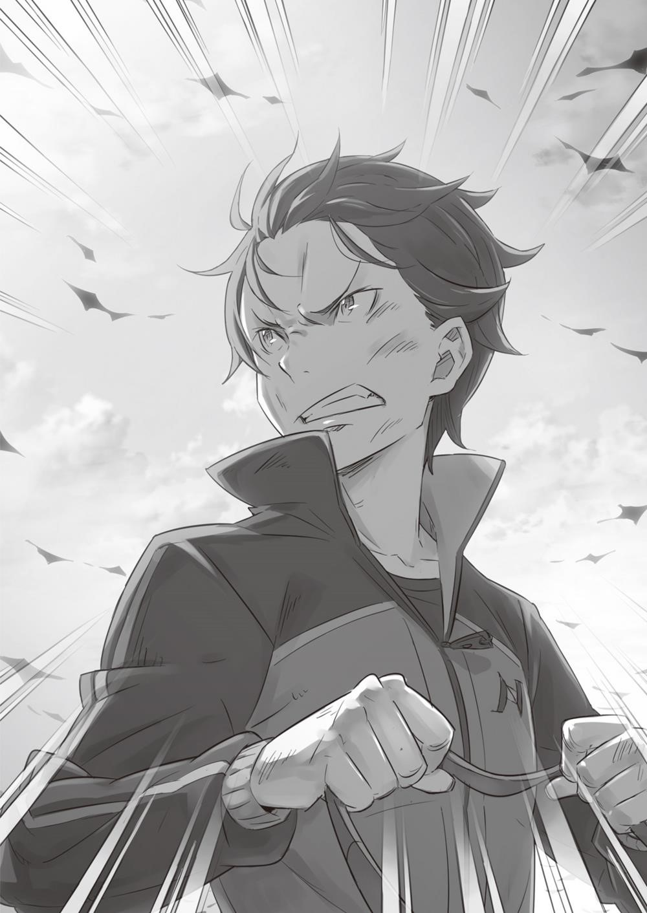
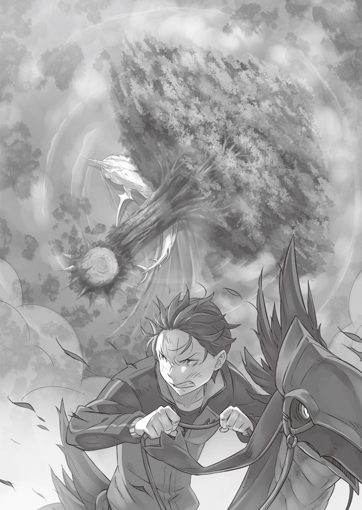
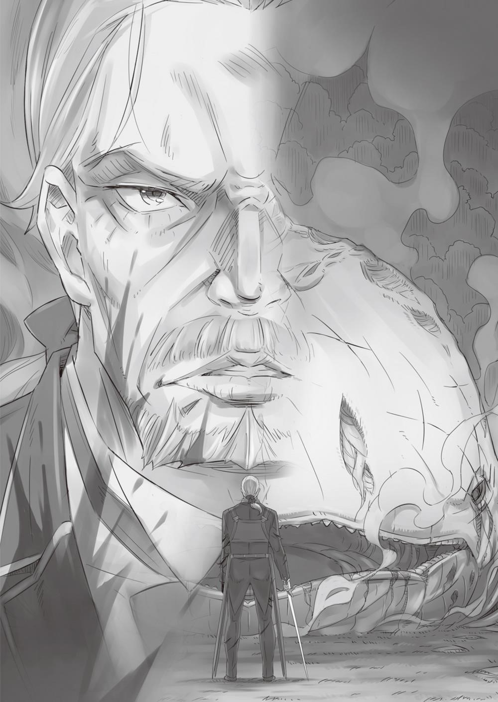

**1 **

Пронзительный визг оглашал равнину.

В Тумане, покачиваясь, парили три Кита — причудливые существа, тела которых были покрыты бесчисленными перекошенными ртами, издающими невыносимый вой, такой гадкий, словно миллион гвоздей царапали стекло. Злобные чудовища, сгубившие множество жизней. Даже один такой монстр мог любого повергнуть в отчаяние. Теперь же их было трое, и зверодемоны насмехались над людишками, что пытались им сопротивляться. Один из несчастных, глядя на парившего Кита, с тихим шорохом повалился на колени. За ним последовали другие, то и дело раздавался лязг падающего на землю оружия.

Один из рыцарей склонил голову, закрыл лицо руками и опустился на корточки. Плечи воина затряслись, к горлу подступили рыдания. Его товарищи тоже не находили в себе сил сказать друг другу хоть слово.

Изначально каждый взвод имел равное число бойцов и полный боекомплект. Они захватили инициативу и нанесли противнику мощный удар, однако, несмотря на прежние успехи, сейчас бойцы выглядели жалко. Половину состава вывело из строя «загрязнение души», но это лишь полбеды: в результате внезапной атаки были растерзаны сильнейшие из воинов!

От первоначальной военной мощи не осталось и половины, а число противников между тем увеличилось втрое. О победе нечего было и мечтать. Это сразу же стало очевидно для всех. Как показывал горький опыт, они здесь исполняли роль пушечного мяса.

Белые Киты наводили парализующий ужас. Они унесли жизни тех, с кем у членов отряда сложилась прочная и важная связь. Увы, воздать должное погибшим теперь было невозможно, единственное, что оставалось, — бессильно развести руками. И сейчас, когда связь, крепнувшая годами и служившая надёжной поддержкой, разрушилась, солдаты сломались. Но кто упрекнёт их за то, что в этот момент ими овладело отчаяние? Кто их осудит за то, что они сдались перед лицом абсурдной и безнадёжной реальности?

Внезапно тишину, царившую на равнине, нарушил отчаянный крик:

— Не дайте Киту проглотить их!

В воздух взмыла фигурка в платье служанки. В руке она сжимала жестокое орудие — шипастый железный шар. Просвистев в воздухе, снаряд угодил прямо в морду одного из Китов, без труда пробил твёрдую шкуру и вонзился в плоть. Зверодемон взревел, поднял голову и нацелился в небо, но в его хвост вонзилось выросшее из земли ледяное остриё, а моргенштерн, развернувшись, снова врезался в извивающееся туловище. Зверодемон качнулся, из его туши фонтаном забила кровь.

— Если ещё не проглотил, их можно спасти! — прокричал юноша, прижав руку к ноющему плечу; по лбу бежала струйка крови. Он сделал шаг вперёд. Его брала досада, что он не может участвовать в сражении. И всё же он рискнул.

Рядом с ним стоял дракон, которого юноша неспешно оседлал. Хотя верхом всадник смотрелся неуклюже, он крепко схватил поводья.

— Рано радуетесь! Это ещё далеко не конец!

На глазах у отчаявшихся рыцарей он вскинул голову, широко распахнул глаза и, глядя прямо на Белого Кита, закричал:

— Даже не надейся, что я опущу руки!!!

**2 **

Субару отдавал себе полный отчёт, что положение отряда катастрофическое. Один Кит висел над головой, второй — за спиной, а третий — прямо перед глазами. Три зверодемона — это не шутки! Представляют ли монстры, акая военная мощь понадобилась для того, чтобы ранить одного из них? Видимо, первый смекнул, что надо позвать в помощь, и привел двух приятелей, желая дать настоящий бой? Похоже на чью-то жестокую шутку…

«Когда же судьба-злодейка наиграется вдоволь и оставит меня в покое?!»

Субару всё ещё лежал на земле, крепко стиснув зубы. Он вылетел из седла, когда Рикардо толкнул их с Рем дракона и тем самым спас им жизнь. Зубы юноша стискивал для того, чтобы стоны и рыдания не вырвались наружу.

В глазах неожиданно потемнело. Рассудок отказывался верить в происходящее и находился на грани помутнения.

Неожиданно Субару осознал, что безнадёга, с которой он уже успел породниться, издевательски ухмыльнулась и бесцеремонно хлопнула его по плечу.

«Ну что, пора снова выбросить белый флаг?» — поинтересовалась она знакомым голосом.

Какая-то неясная тень с расплывчатыми очертаниями, бледно улыбаясь, предлагала ему сдаться.

И тут Субару со всей ясностью осознал тяжесть положения, в котором оказался отряд. Он увидел рыцарей: подобно ему самому, они примирились с судьбой и опустились на колени. Им тоже было ясно как день, что ничего не поделать. Огонь, что прежде горел в их глазах, потух, и воины, не в силах сопротивляться, не могли даже удержать в руках оружие. Это были существа со сломленным духом; глядя на них, Субару почувствовал, как отчаяние начинает овладевать им Самим. Рем тоже упала с дракона и теперь лежала рядом. Когда девушка приподнялась, её красивое личико было искажено болью, губы побледнели, веки дрожали. Субару ни с того ни с сего поймал себя на мысли, что у Рем длинные ресницы. И ещё он подумал, что улыбка идёт ей гораздо больше, поэтому…

— Твой черёд настанет ещё не скоро!

С этими словами Субару стряхнул с себя руку, панибратски обнимавшую его за плечи. Тень удивлённо скривила губы. Юноша повернулся и с улыбкой врезал ей с правой вложив в удар все имевшиеся силы. Чёрная тень рассыпалась на кусочки, и в тот же миг дрожь исчезла. Неудачник! Жалкий трус! Нет времени на колебания, нет ни одной свободной минуты на бездействие. Ведь китов стало на две особи больше!

Руки и ноги двигаются. Силы поднять голову имеются глаза видят. Голос есть. Его голос слышат. Рем здесь. Рем жива. Сейчас не место и не время отчаиваться!

Вставай!

Сколько раз Субару падал духом, и не сосчитать.

Вставай!

Терпеливо сносил издевательства несправедливой судьбы, которая в конце концов загнала его в тупик уныния.

Вставай!

Хотел всё бросить, махнуть на всё рукой и сбежать, но совесть не дала этого сделать.

Вставай!

Ради чего?

— Ради… настоящего момента!

Он стукнул кулаками по пыльной тверди. Приподнявшись, он застонал и рывком поднялся на ноги. Рем посмотрела на него с удивлением.

Субару протянул ей руку, затем с ненавистью бросил взгляд на парившего впереди Белого Кита.

— Ещё посмотрим, кто кого!

— Субару…

— Я сделаю это, Рем. Начинается самое интересное!

Девушка робко взялась за протянутую ладонь. Субару поднял Рем с земли и прижал к себе. Их лица сблизились.

— Опускать руки — последнее дело! Ни к чему это. Ни мне, ни тебе, никому! — сказал он, глядя в глаза Рем.

**3 **

С яростным криком Рем бросилась на Белого Кита, ударила правым кулаком по шкуре и вскарабкалась наверх. Моргенштерн, которым она размахивала, держа орудие левой рукой, с оглушительным хрустом пробил твердокаменную шкуру. Во все стороны брызнула кровь, Кит взревел от боли.

Это был именно тот Кит, который поглотил Вильгельма. Зверодемон двигал челюстями, словно пережёвывая добычу, но поверить, что его зубы-жернова измельчали Дьявольского Мечника, было непросто.

— Нужно размозжить ему голову, иначе Вильгельма не вытащить!

Субару с некоторой опаской взобрался на дракона. Теперь за поводья предстояло взяться не Рем, а ему самому, причём почти без тренировок. По дороге до Древа Флюгеля и после прибытия ему удалось немного поупражняться в верховой езде, но этого было явно мало.

В своём родном мире Субару ни разу не садился на лошадь, поэтому не стоило ожидать, что пары часов занятий хватит, чтобы научиться управлять драконом. Повернув зверя в нужном направлении, юноша мёртвой хваткой вцепился в поводья, опасаясь свалиться.

Однако дракон оказался достаточно сообразителен: он сразу же понял, кто хозяин, и в точности уловил намерения всадника. Угольно-чёрный зверь, сам избравший Субару в качестве наездника, старательно заботился о том, чтобы неопытный всадник не выпал из седла.

«Хороший дракон, — подумал Субару. — Быстрый, выносливый и чертовски умный. Я буду тебя звать Патраш. Для такого преданного друга, как ты, лучшего имени не придумаешь!»

— Вперёд, Патраш! Покружимся у этой твари под носом! — закричал он во всё горло, ударил поводьями по вороной спине, и Патраш бесстрашно ринулся к исполину,

Белый Кит извивался и дёргался в попытках скинуть вцепившуюся в него Рем, однако, почуяв приближение Субару, машинально повернулся к юноше. Улучив момент, Рем прыгнула на морду зверодемона и нанесла мощнейший, как из пушки, удар.

— Только мне позволено вдыхать запах Субару!

Гигантская морда дрогнула. За этим последовал прямой удар утыканного шипами ядра. Вращающийся шар размозжил челюсть Кита и выбил несколько зубов. Кровь вперемешку со слюной обагрила землю.

Зверодемон издал рёв, из раны полилась желтая жидкость. Наконец его туша рухнула. Кит стал биться о землю, словно выброшенная на берег рыба. Размахивая хвостом и расшвыривая повсюду комья земли, он всё ближе подползал к Субару — судя по всему, намеревался нанести внезапный удар. Но в последний момент…

— Та-да-ам! А вот и я!

За мгновение до удара откуда ни возьмись возникла Мими. Получеловек-полукотёнок взмахнул зажатой в руке палкой, и в воздухе материализовался защитный барьер. 3олотистый блеск отразил удар, образовалась брешь, в которую проскочили земляной дракон и лигр.

Субару перевёл дух, затем повернулся к Мими — малышке, которая только что спасла его от верной гибели:

— Вот спасибо! Если бы не ты, пришлось бы заканчивать контратаку, даже не объявив как полагается о её начале!

— Хи-хи-хи, тебе не ка-ажется, что я заслуживаю большей похвалы? — Мими гордо выпятила грудь. Но ла-адно ты сегодня и так здорово постара-ался, так что будем считать, что мы кви-иты! — добавила она с улыбкой

— Постарался?.. — уточнил Субару.

— Так все вон как струхнули — на ногах не стоят! — воскликнула девочка, теребя пальчиками оранжевую косичку. — А ты нашёл в себе силы подняться! Разве это не достойно похвалы? Ты саамый крутой! Ну, после меня, конечно!

— Да ничего особенного. Просто не вижу смысла опускать руки, только и всего, — ответил Субару на похвалу и закусил губу.

Именно так. Хвалить его было не за что. Знала бы Мими, сколько горя пришлось ему хлебнуть за последнее время… По сравнению с прошлым кругом, когда отчаяние лишило его всяких сил бороться, нынешний был далеко не самым безнадёжным. Как же он может теперь опустить руки?

Если есть силы поднять лапки кверху, уж лучше продолжить борьбу, харкая кровью и уповая на удачу. Ведь бороться гораздо, гораздо приятней, чем бездействовать!

Оттолкнувшись от земли, Патраш устремился вперед, как вдруг прямо перед его мордой возникла широко разинутая пасть. Вблизи глотка чудища выглядела как пародия на жуткую пещеру. Когда до неё оставались считаные сантиметры, Субару совершил молниеносный манёвр. Но Кит оказался на долю секунды быстрей и выпустил из пасти Туман…

— Закрой рот!

Резкий взмах невидимого клинка заставил зверодемона захлопнуть челюсти. Монстр стал извиваться от боли, Субару и Мими проскочили мимо. Юноша посмотрел туда, откуда в последнюю секунду подоспела помощь, и увидел Круш, Герцогиня приближалась с противоположного края поля битвы.

Поравнявшись с Субару, она бросила озлобленный взгляд на Белого Кита:

— Сдаётся мне, плохи наши дела. Что с Вильгельмом?

— Ты его помнишь, значит, Туман ещё не стёр старика… — проговорил Субару, опасливо косясь на поваленного Зверодемона, который избрал юношу своей целью. — Теперь все зависит от героизма Рем.

Круш посмотрела в сторону девушки, которая отчаянно размахивала моргенштерном. Каждый удар железного шара порождал алый фонтан. Белый Кит барахтался в луже собственной крови, и от каждой его конвульсии вздрагивала земля.

— Субару Нацуки, как ты на это смотришь?

— В каком смысле? Имеешь в виду, какие у нас шансы? Может, прозвучит самоуверенно, но многое зависит от того, останусь ли я в живых…

— Я о другом. Тебе не кажется это забавным?

Ещё один удар невидимого клинка пришёлся прямо по носу Кита, который подкрался сзади. Кит задергался, когда его планы были пресечены на корню.

— Забавным?! — переспросил Субару, отвернувшись от зверодемона.

— Белых Китов стало три. На первый взгляд, у нас нет выхода. Но если Белых Китов и впрямь целая стая, почему мы узнали об этом только сейчас?!

— Не совсем тебя понимаю…

— Это чей-то коварный трюк, — уверенно сказала Круш. Под гипнотизирующим взглядом герцогини Субару машинально подтянулся.

— И теперь мы должны выяснить чей?

— Ты уходи, а мы тебя прикроем. Постараемся выиграть время. В любом случае долго это продолжаться не может. Как-нибудь справимся. Отступать нам нельзя. С этими словами Круш направила своего дракона в сторону и стала удаляться от Субару. Герцогиня сделала большой крюк, обогнув Кита, на морде которого было написано явное неудовольствие. Круш объезжала взводы, рассредоточившиеся по равнине.

— Выше нос! Вставайте! Поднимите оружие! Вы зачем сюда пришли?!

Отчаявшиеся, понурые воины подняли головы. Герцогиня величественным жестом обнажила фамильный меч и направила остриём в небо.

— Посмотрите на того парня! У него нет ни оружия, ни сил, его можно перешибить плевком. И этот слабак тоже проигрывал, я видела своими глазами!

Она указала мечом на Субару, который мчался на драконе, и прокричала ещё громче:

— Этот парень слабее, чем кто бы то ни было!

Круш говорила правду. Субару был слаб. Слабее всех.

Участвовать в бою он не мог физически. Даже просто остаться в живых для него было непосильной задачей. Жизнь Субару состояла из проигрышей.

— Да, он слабее любого из вас, но именно он прокричал: «Это ещё не конец!»

Самый слабый во всём отряде, он стиснул зубы и, превозмогая боль, харкая кровью, поднялся, не обращая внимания на слёзы, чтобы бороться дальше!

Так почему же мы все поникли и опустили руки?! Да, я не знаю, хватит ли наших сил, чтобы сдавить зверодемону глотку. И всё же, раз слабейший продолжает сражаться, разве есть у нас право становиться перед врагом на колени?!

Воины переглянулись и поднялись, стараясь унять дрожь в ногах. Драконы, ожидавшие, когда их вновь оседлают, подошли к своим хозяевам.

Рыцари взялись за поводья и залезли в седла. Драконы взревели, а вслед за ними, обнажив мечи, взревели до хрипоты и рыцари.

Воинственные возгласы накрыли равнину. Они придавали бойцам храбрости и возвращали самоуважение. Там, впереди, скакал слабый мальчишка, негодный для битвы. Рыцари кричали — громко и яростно, стыдясь того, что ещё минуту назад сидели на земле, убитые отчаянием.

Этот стыд заставил их гордо поднять головы и помог ступить на поле брани, отринув отчаяние и страх.

— Отряд, в атаку!!!

— А-а-а-а-а!!!

Воспрянув духом, рыцари устремились вперёд. В воздух поднялись клубы пыли. Теперь в отряде не набралось бы и пятидесяти человек, и всё же воины во главе с Круш в яростном порыве набросились на двух белых Китов, которые были в пределах досягаемости. Возгласы предводительницы донеслись и до Субару. Поняв, что герцогиня успешно подняла боевой дух рыцарей, юноша не мог сдержать кривой усмешки.

— «Слабак», «можно перешибить плевком»… В выражениях не стесняется!..

Однако он и не думал отрицать услышанное, что только доказывало: его случай и правда запущенный.

Называйте меня как угодно, используйте как угодно. Действительно, Субару оказался здесь потому, что был слаба. ком, любителем падать духом и сдаваться. Он и в бой-то пошёл именно потому, что понимал это. Но если ты слабак, ещё не значит, что игра окончена. Если упал духом, еще не значит, что можно успокоиться. Пора разделаться с унынием, никто не давал тебе права быть слабым!

— Ну, Патраш, ещё разок! Подбежим к самому носу и тут же отойдём!

Дракон наклонился, взрыл лапами землю, сделал резкий разворот в сторону Белого Кита и вновь заревел. Зверодемон отчаянно пытался сбросить прицепившуюся Рем, в то время как взводы Круш пошли на штурм. Рыцарские мечи, высекая искры, рубили шкуру зверодемона; затем всадники, поравнявшись с тушей и немного отдалившись, стали бомбардировать монстра магическими снарядами.

Кит принялся извиваться и бить хвостом о землю — настолько яростно, что находившиеся рядом люди едва успели уклониться.

Но одного всадника всё же придавило вместе с драконом послышался хруст костей, брызнула кровь. Ещё одна жизнь погублена. Эта картина намертво врезалась в память Субару. По спине пробежал мороз. Юноша понял: всадника у не спасти. А всё потому, что он, Субару, заставил воина ввязаться в бой, Субару не мог отвести взгляда.

Беснующийся Белый Кит заметил приближение юноши и раскрыл рты, которыми было испещрено его тело. Субару похолодел от ужаса, но, доверившись дракону, взмыл в воздух. Они пролетели, едва не коснувшись клубов уничтожающего Тумана, который выходил из тысяч раззявленных ртов. Если бы юноша задел его, это был бы конец. Уничтожив Субару, Туман вдобавок стёр бы все воспоминания о нём из памяти людей…

Но тут раздались гневные возгласы:

— Эль Фула!

— Думаешь, мы позволим?!

— Куда уставился, тварь?!

Пелену прошила магия ветра, и по ртам, выпускавшим белые клубы, ударили клинок и молот. Благодаря поддержке рыцарей туманная завеса немного разошлась, но Киты продолжали выбрасывать всё новые и новые клубы. Уничтожающий Туман грозил вот-вот дотянуться до Субару, и нервы юноши были на пределе.

Доверившись в выборе маршрута дракону, он оперся на руки и рывком приподнялся, избежав таким образом встречи со сгустком Тумана, что приближался сзади. Бухнувшись в седло, Субару потерял равновесие и едва не свалился…

— Держи-и-ись!!!

Но вовремя ухватился за поводья. В родном мире, размахивая от нечего делать деревянным мечом, он натренировал недюжинную хватку, которая теперь помогла ему удержаться.

Касаясь носками кедов земли, Субару выскочил из туманной завесы. Видимость улучшилась, и дракон предусмотрительно замедлил бег, чтобы Субару мог разместиться в седле как надо. Ещё больше израсходовав и без того скудный запас сил, он устремился к другому Белому Киту, которого сейчас штурмовали Круш и рыцари.

— Хорошо сработал, ничего не скажешь… Тьфу, чёрт!.. Так и подохнуть недолго, надо же головой думать!

Тяжело дыша и снова бросаясь в битву в качестве приманки, Субару размышлял о трюке, который недавно упомянула Круш.

Субару даже не представлял, что за образ жизни ведёт Белый Кит. О том, какой именно вред успело нанести это существо и что представляла собой Великая Карательная Экспедиция, он тоже догадывался смутно. Но должно ведь быть то, что заметно лишь ему… то, чего не видят другие… Вильгельм преследовал Белого Кита уже четырнадцать лет, желая отомстить за смерть жены. Наконец его упорство принесло плоды и привело Дьявольского Мечника на это поле боя. Сложно представить, чтобы старик забыл, сколько существует Китов на самом деле. Разумеется, Вильгельм просто не знал про них. Но почему это было тайной? Нет, вопрос следует поставить иначе: каким образом Китам удавалось скрывать этот факт?

— Почему их вдруг стало больше?.. Не верится, что их было три с самого начала…

Субару почувствовал, что близок к разгадке. Но прежде чем он успел подумать об этом как следует, Патраш ворвался в пределы обоняния Кита.

Монстр обвёл взглядом округу и остановился на Субару. Пасть распахнулась, и вместе с ревом, сотрясшим окрестности, из неё вышел густой Туман.

Патраш сделал резкий поворот, избежав столкновения со смертельным сгустком, но, чтобы полностью избежать его действия, дракону не хватило полшага. Однако эти полшага компенсировали Мими и Хэтаро, взявшиеся невесть откуда:

— Предоставь это нам!

— Мы прикроем!

Близнецы-полукотята раскрыли рты и хором закричали.

Ва-а-а!

— Ха-а-а! От истошного вопля в воздухе начали расходиться круги. Накладываясь друг на друга, они создавали мощную разрушительную волну. Она захлестнула равнину и разогнала надвигавшийся спереди Туман.

— Ого! Круто! — совершенно искренне восхитился Субару.

— Знаю. знаю, знаю! — гордо вздёрнула подбородок Мими и расплылась в улыбке. — И это всё, что ты скажешь? Желаю слышать больше! Да-а-а!

— Сестричка! — Хэтаро, скакавший рядом, устало вздохнул.

Брат и сестра поравнялись с Субару, и юноша оказался между ними.

— Мы будем вас прикрывать. Без вас, господин Нацуки, победы нам не видать.

— А как же наш «ба-а-амс» и ещё «шарах», а потом «шандарах»? Бесполезны, что ли?

— Все эти «бам-шандарахи» тоже нужны, но без содействия господина Нацуки нам, сестричка, не обойтись.

— Ого!

Судя по всему, Мими не догадывалась, насколько опасным было их положение, поэтому Субару обратился к более рассудительному Хэтаро:

— Слушай, можешь ещё раз шарахнуть по Киту, как тогда, в самый разгар наступления?

— Ману приходится буквально выжимать, поэтому максимум ещё один раз. Мы с сестричкой будем вас охранять, пока командир не встанет на ноги.

— Так Рикардо жив?! — воскликнул Субару, обрадованный неожиданной новостью.

Хэтаро кивнул. Беспокойство в душе Субару немного утихло. Лигр, которого оседлал Рикардо, был растерзан на куски. Субару видел ударивший в небо фонтан крови и не мог поверить, что Рикардо спасся.

— Командир серьёзно ранен, господин Нацуки. Он просил кое-что вам передать.

— Мне?.. Что-нибудь вроде: «Ты мой должник, парень»?

— Полагаю, он скажет это при личной встрече… А передал Рикардо вот что, кхм: «Это было легко! И тот факт, что я до сих пор не откинул копыта, — тому подтверждение!» — конец цитаты. Хэтаро в точности повторил слова зверочеловека, даже сымитировал тембр голоса и диалект Карараги. Субару не стал комментировать, насколько хорошо вышло, вместо этого он задумался над сутью сообщения.

Эти слова Рикардо сказал, стоя на краю могилы. Какой же смысл он в них вложил?..

— Совсем непохоже ты его показал, — всё-таки заметил Субару.

— Угу! — простодушно согласилась Мими. — Фальшивка, да и только! Никакого таланта! Не выйдет из тебя пародиста!

— Да разве сейчас об том речь?! — едва не плача, возразил Хэтаро. Но Субару уже смотрел в небо.

Разделённый на две группы, отряд по-прежнему вел ожесточённый бой с двумя Белыми Китами. Третий же зверодемон, зависнув в небе, невозмутимо наблюдал за сражением сверху. Субару его поведение показалось несколько странным. Отряд потерял самых сильных бойцов, причём теперь ему приходилось сражаться на два фронта. Хотя Субару справлялся с ролью приманки вполне успешно, если бы Кит, висящий в небе, помог кому-нибудь из своих собратьев, исход войны был бы предрешён. Половина отряда оказалась бы просто сожрана, и всё бы кончилось.

Тем не менее третий Белый Кит оставался безучастен потому что…

— Послание Рикардо!..

Рикардо сказал «легко». Стоя на краю гибели, он сообщил, что именно поэтому всё ещё жив. Что же он имел в виду? Что именно было лёгким?..

— Что тут может быть лёгкого, когда вокруг безнадёга?..

Прижавшись к Патрашу всем телом, Субару снова мчался под самым носом зверодемона, которого со всех сторон облепили солдаты Круш. Желая уничтожить Субару, Кит разинул пасть, которая сразу же оказалась рассечена ударами невидимого меча герцогини и растерзана взрывами заброшенных магических снарядов.

Раздался радостный гул воинов. Отряд редел с каждой минутой, и только безграничный боевой дух заставлял рыцарей биться дальше. В том, кто твёрдо решил сражаться насмерть, просыпается нечеловеческая сила.

Даже когда все были живы, борьба с Китом давалась отряду нелегко; теперь же рыцари лишились командиров, а их состав изрядно сократился. Если это не сила воли, то…

— Как бы там ни было, на одну силу воли полагаться нельзя.

С этими словами Субару вернулся из мира мыслей в реальность. Он обернулся и злобно посмотрел на Кита, от которого удалялся с каждой секундой. И тут он сообразил, что вызывало беспокойство.

— Если я прав…

Субару скрежетнул зубами. Вероятность того, что догадка верна, была так высока, что по телу пробежала дрожь. Он резко развернул дракона и стремительным галопом направил его к другому Киту.

Рем дала своей демонической силе полную свободу. Сидя верхом на лигре, девушка что было мочи дырявила тушу Кита моргенштерном. Передник и платье были измазаны кровью зверодемона. Заметив, что Субару приближается, она бесстрашно улыбнулась окровавленной душераздирающей улыбкой.

И всё же Субару залюбовался, хотя момент для этого был не самый подходящий. Зная, что шансов на победу почти нет, Рем всё же доверилась сумасбродной решимости Субару. И оставить без ответа её доверие и любовь было никак нельзя.

Не сказав друг другу ни слова, Субару и Рем погнали своих зверей к противоположным концам китовой туши: дракон Субару помчался к голове, лигр Рем — к хвосту. Переговариваться и сдерживать животных не было нужды. Субару исполнял свою роль, а Рем — свою.

Стоило юноше броситься к голове Кита, зверодемон тут же почувствовал его приближение и повернул морду навстречу. Над его гигантским глазом возникло множество отверстий. Истекая слюной, Кит стал выпускать белый Туман.

Дада-а-ам! Баба-а-ах! Бумбараба-а-ах! — раздалось поблизости, и вокруг Патраша стал нарезать круги лигр с Мими в седле.

Сидя в эффектной позе на спине огромного пса, девочка выкрикивала заклинания. В руке она держала посох, который сверкал каждый раз, когда Мими произносила очередное междометие. С каждым таким выкриком в пространстве образовывался магический заслон, дававший Субару время, чтобы уйти от бомбардировки Туманом.

— Смотри, братишка, теперь ты мой должник!

— Когда всё закончится, я скажу тебе спасибо раз сто, не меньше!

— Замётано!

Воспользовавшись защитой Мими, Субару проскочил мимо Кита и ушёл вперёд. Затем он обернулся. Их с Китом взгляды встретились. Единственный глаз зверодемона налился кровью. Похоже, ему порядком надоели эти упрямые букашки, и он издал оглушительный рёв. Однако этот рёв лишь прибавил Субару уверенности.

Ни у этого Кита, ни у того, с которым сражались рыцари и Круш, не было левого глаза.

— Я так и думал! Один-единственный Кит разделился на трёх!

Тот, что завис в небе, — первый зверодемон — лишился левого глаза ещё в начале сражения. Потому и остальные Киты были одноглазыми. Зверодемон, зависший в небе, разделился, породив двух других!

— Стало легче биться с каждым в отдельности, потому что сила разделилась на три! Иначе мы бы не смогли сражаться, потеряв бо́льшую часть рыцарей! Вот в чём трюк!

Наконец всё встало на свои места. И то, что Кит, напав со спины, не смог убить Рикардо. И то, что отряд, несмотря на большие потери, всё ещё бился против трёх противников, «Вера в чудо», «сила воли» — такими идеалистическими категориями Субару уже не мыслил. Именно благодаря тому, что он засомневался в очевидных фактах, юноше удалось найти ответ к мучительной загадке. Эффективность уничтожающего Тумана была величиной абсолютной, и Белый Кит разделился на три туши в ущерб своей силе.

Если бы численный перевес противника окончательно запугал воинов, на этом битва бы и закончилась. Но чтобы прибегнуть к подобному психологическому приёму, зверодемон должен был разбираться в человеческих слабостях, а это казалось невероятным… Однако факт оставался фактом: растроение Белого Кита вполне могло привести к его победе.

Что, если бы Субару сдался? Если бы не заставил себя подняться на ноги? Ответить на этот вопрос было невозможно…

Но не успел Субару порассуждать на эту тему, как зверодемон, следовавший за юношей по пятам, стал как-то странно себя вести.

— Это ещё что такое?!

Плывущая по воздуху туша коснулась земли, и Белый Кит стал корчиться, словно внутри ему мешало некое инородное тело, и тут…

— Сестричка, давай! — прокричал Хэтаро, улучив благоприятный момент, и прыгнул.

— Неприятно, когда нельзя почесать там, где чешется! По себе знаю! — посочувствовала Мими Киту, неверно истолковав его движения, и последовала за братом.

Близнецы зависли в воздухе справа и слева от Кита и, синхронно раскрыв рты, издали оглушительный крик:

Ва-а-а!

— Ха-а-а!

Мощная звуковая волна изогнула тушу зверодемона, прошила его шкуру и добралась до внутренностей. Шкура лопнула, по телу поползли трещины, зафонтанировала кровь, и…

— Уа-а-а-а а!!!

Брюхо зверодемона, которым он цеплялся за землю, вздулось и разорвалось! Во все стороны полетели куски плоти, хлынул мутный багровый поток, вместе с которым на землю вывалился…

— Вильгельм?!

Проглоченный Белым Китом заживо, Дьявольский Мечник вернулся!

Пока рыцари обуздывали беснующегося Кита, Субару бросился к Вильгельму. Заляпанный кровью с ног до головы, Вильгельм подтянул к себе ногу, оперся на меч и приподнялся.

— Я так… неопытен… Я… потерял бдительность…

— Вам лучше не разговаривать! Чёрт, что же делать?.. Ну ничего, главное, что вы живы. Вам надо скорее к Феррису! Субару протянул руку и оторопел: вид у старика был гораздо хуже, чем он предполагал. Вильгельм ещё мог держать меч, однако левая рука была страшно изуродована. Старик находился буквально на грани жизни и смерти. Если немедленно не оказать ему помощь, жизнь мечника угаснет, как свеча на ветру.

Но Вильгельм решительным жестом отстранил руку Субару. Опершись на меч всем телом, старик стиснул зубы и попробовал подняться на ноги.

— У меня еще… много…

— О чём ты говоришь?! Да этот китяра тебя раздавит! И думать нечего! Я-то знаю о жизни и смерти побольше твоего!

— Я… не понимаю…

Накричав на израненного старика, Субару обхватил его за плечи и помог подняться. Тут к ним подбежали близнецы-полукотята.

— Дедушка снова с на-ами!

— Господин Вильгельм, как вы себя чувствуете?

Взглянув на тяжелейшие раны Вильгельма, Мими принялась оказывать мечнику первую помощь используя примитивную исцеляющую магию. Хэтаро поднял голову и посмотрел на Субару: — Стараниями моей сестры эти раны всё равно не излечить. Господин Нацуки, думаю, господина Вильгельма нужно доставить к господину Феррису.

— Естественно! Видишь же, старик совсем плох. Если не поспешить, он загнётся! Я бы, конечно, сам его отвёз, но…

Субару обернулся: позади оживал ненавистный Белый Кит. Из глубокой раны на его брюхе всё ещё струилась кровь, однако зверодемон продолжал выбрасывать Туман из отверстий на теле, будто заявляя, что его решимость сражаться, как и у Вильгельма, ничуть не угасла.

Субару не сомневался: сегодня он сделал многое, чтобы сбить противника с толку. Но если он сам возьмётся сопровождать Вильгельма, это может привести к страшным последствиям.

Если Белый Кит погонится за мной, я сам приведу его в лагерь раненых. Могу я вам доверить Вильгельма?

— Хорошо, мы отвезём его. Скажите, вы что-нибудь придумали?

Вильгельм был куда крупнее Хэтаро, и мальчику пришлось попотеть, чтобы затащить старика на спину лигра. Затем он поднял глаза на Субару:

— Мы можем рассчитывать на победу? Если нет, тогда нам с сестрой остаётся только бежать отсюда.

— Что?! Это почему?! Мы же ещё не уделали Кита!

— Сестричка, помолчи, — одёрнул её Хэтаро, и Мими недовольно надула губки.

И тут до Субару дошло.

— Вы же наёмники! — сказал он, кивнув. — Я, леди Круш и рыцари — у нас с Китом свои счёты. А вы работаете за деньги… и не обязаны рисковать жизнью.

— Мы не обязаны напрасно расставаться с жизнью, только и всего. Хотелось бы, чтобы вы правильно меня поняли, — твёрдо сказал Хэтаро, опустив глаза.

Субару вздохнул и, глядя сверху вниз на маленьких воинов, ответил:

— Прости, но у нас мало времени. Насчёт победы… думаю, мы можем на неё рассчитывать. Сперва отвезите Вильгельма к Феррису. А мне нужно переговорить с Рем и леди Круш.

Субару вскочил на Патраша и поднял глаза к небу. В вышине медленно плыла туша ненавистного Кита.

**4 **

— Кит разделился?..

— Да. Я уверен, ведь у новых китов такие же раны, как и у первого, и каждый из них обладает лишь третьей частью той силы, что была у Белого Кита в начале битвы. Вы же с ним дрались, наверняка и сами заметили.

— Во время схватки я ни о чём не думала, — неуверенно призналась Рем. — Но, вероятно, ты прав.

Присоединившись к близнецам, оседлавшим одного лигра (своему лигру Хэтаро доверил отвезти Вильгельма в лазарет), Субару добрался до Рем и Круш — главной боевой силы — и рассказал им о своей догадке. В это время рыцари и отряд «Железный клык» сдерживали двух китов. Пока силы не иссякли, требовалось разработать план.

— Я согласна с твоей догадкой. Но что она даёт? Киты по-прежнему сильнее, чем мы, несмотря на то, что раны здорово их ослабили. И вряд ли стоит надеяться, что лечение Ферриса вернёт наших бойцов в строй.

— Конечно, жаль, что с нами нет Вильгельма и Рикардо, но не думайте, что всё пропало! Мы должны победить и без них, другого пути нет!

— Убить трёх Китов? Сказать легко, но задача непосильная…

— Нам не нужно убивать трёх! Достаточно прикончить одного!

Брови Круш слегка дёрнулись, а глаза наполнились неподдельным интересом, на что Субару кивнул и показал на зверодемона в небе.

— Как вы думаете, что делает эта тварь, наблюдая сверху за битвой своих двойников?

— Зализывает раны?.. — неуверенно предположила Рем.

Субару помотал головой. Насколько он мог убедиться, биологически зверодемоны во многом походили на обычных животных. Во всяком случае, вряд ли Белый Кит обладал способностью к скоростному самовосстановлению. Из этого следовал вывод: Кит, зависший в небе, являлся…

— Главным из этих трёх?

Субару кивнул:

— Да. Я считаю именно так. Юноша был твёрдо уверен, что именно зверодемон, паривший в небе, породил двух других. Если его уничтожить, погибнут и остальные.

— Я думаю, он не спускается на землю и не помогает своим двойникам, поскольку боится, что мы его уделаем.

— Звучит логично. То есть…

— Если мы расправимся с теми двумя, которые внизу, главному это, скорей всего, никак не повредит. Даже если очень постараться и убить двойников, не исключено, что главный Кит создаст новых. И тогда сражению просто не будет конца. Рано или поздно «неубиваемый» Кит вынудит отряд сдаться.

— Значит, он не спускается, потому что боится погибнуть. Но как же нам поступить? Атаковать его на такой большой высоте мы не сможем.

Своим вопросом Хэтаро, который до сих пор слушал молча, словно попытался вернуть мечтателя Субару с небес на землю.

— Боюсь, даже мой незримый меч бессилен на таком расстоянии, — сказала Круш, вперив взгляд янтарных глаз в Белого Кита, который висел над головой. — Быть может, один раз и достанет, но сомневаюсь, что это повалит его на землю…

Кит находился практически на высоте облаков. Теперь, когда он парил ещё выше, чем во время первого появления, коварная сущность зверодемона стала очевидна. Попасть в него из пушек, стреляющих магическими кристаллами, будет совсем не просто.

— Рем, может, метнёшь в эту тварь какой-нибудь айсберг?..

— Прости, но чем дальше от меня находится мана, тем труднее ею управлять. Думаю, господин Розвааль смог бы это сделать, но я не столь искусна… — с сожалением призналась девушка, досадуя на свою слабость. Субару обречённо махнул рукой и запрокинул голову к небу. Кое-какой план у него имелся. План «Б», который он приготовил на случай, если ответы Круш, Хэтаро и Рем не позволят осуществить план «А».

— У меня есть идея, но очень многое будет зависеть от удачи. Рискнём? — Он подмигнул. Прежде чем раскрывать детали плана «Б», следовало убедиться, что все готовы слушать. Возможно, некоторые сочли бы такой вопрос глупым… Но Круш и другие бойцы были готовы ухватиться за любую возможность.

Люблю тебя Теперь Субару знал, какими болванами все они были…

**5 **

Белый Кит висел высоко в небе и спокойно наблюдал за сражением, развернувшимся на земле. Гигантское дерево, настолько высокое, что, казалось, оно пронзает небеса, возвышалось посреди поля боя. Маленькие человечки, облепив огромные туши зверодемонов, вонзали в них сталь и размахивали светящимися кристаллами. Всякий раз, когда вспыхивало пламя и снизу доносился истошный рёв монстров, паривший в небе Кит выбрасывал белёсые клубы.

Туман, окутывавший равнину, играл на руку двойникам монстра, и численность миниатюрной армии неуклонно падала. Время шло, фигурки отважных воинов исчезали одна за другой. Они тонули в Тумане, который начисто стирал память об их существовании. Приближался тот страшный час, когда Туман поглотит их всех и бессмысленное сражение завершится. Совсем скоро армия окажется беспомощной, и тогда настанет конец…

Если бы Белый Кит обладал интеллектом человека, он наверняка сделал бы именно такие выводы и уверовал в свою победу. Однако монстр был лишён аналитического мышления.

Зверодемон просто следовал инстинкту, делая всё, чтобы истребить противника и выжить самому.

Когда животное повинуется инстинктам, глупо спрашивать, зачем оно поступает так или иначе. Белый Кит хладнокровно и целеустремлённо убивает свою добычу, потому что так велит его природа.

Монстр продолжал выпускать Туман, накрывая землю белой пеленой. Затянуть Туманом весь мир было его миссией, его смыслом жизни. Некоторое время он не обращал внимания на то, что происходило внизу. Но внезапно единственный глаз дёрнулся и сфокусировался на земле. Зверь почуял, как огромное количество маны концентрируется в одной точке, а затем увидел детали.

— Аль Хьюма!

В центре чудовищного водоворота находилась голубоволосая девушка. Уже довольно долго она стояла на коленях, подготавливая ману для заклинания, и теперь придавала ей вектор. Прямо перед девушкой медленно вырастали огромные, не меньше десяти метров в длину, ледяные пики. Их сверкающие острия были направлены в тушу Белого Кита, и монстр заметил их прежде, чем те пришли в движение.

— Прошу!

В ответ на мольбу девушки пики устремились в небо, в самый центр китовой туши. Ледяная смерть приближалась к зверодемону с умопомрачительной скоростью, однако так и не достигла цели. Кит взмахнул хвостом и уклонился, пики пронеслись у самого бока зверодемона и пропали в вышине.

В тот самый миг, когда ледяные снаряды Рем пролетели мимо, до слуха Кита донёсся едва различимый звук, похожий на звон бьющегося стекла.

— Эй, ну и страшон же ты вблизи, приятель!

Кит почувствовал лёгкое прикосновение. Ощущение, словно нечто приземлилось прямо ему на голову, возникло ровно в тот миг, когда мимо пронеслись ледяные пики. Они бесследно исчезли в небесной выси, и Кита обдало волной маны. После зверодемон увидел источник нестерпимо ужасного запаха. Тот находился прямо у него на макушке!

— Давай за мной! Но предупреждаю сразу: я знатный зануда! — произнёс тот, кто источал запах, и его губы расплылись в ядовитой усмешке.

**6 **

Дерзкий план Субару заключался в следующем: он седлает ледяную пику, устремляется в небо, после чего разбивает антимагический кристалл и спрыгивает на Белого Кита. Само собой, Рем была против этой идеи, но, когда Субару несколько раз повторил, что доверяет ей, и убедил девушку, что это не безрассудство, она сдалась. Круш передала ему антимагический кристалл. Субару с самого начала предполагал, что Кит увернётся от удара, если Рем будет колдовать у него на виду. Юноша был уверен: зверодемон попадёт в его коварную ловушку. Однако, если бы Кит не увернулся, при столкновении от Субару, ухватившегося за основание ледяной пики, не осталось бы и следа. Так сильно в этой битве он ещё не рисковал.

— Хотя не сказал бы, что теперь я в безопасности… Чёрт, странно!

Субару мёртвой хваткой вцепился в морду зверодемона, в шероховатую шкуру и шерсть. Вонь от исполинского зверя исходила такая, что юноша скривился. Стоило Киту почуять запах Субару, вернее, запах Ведьмы, как зверодемон сразу же стал вести себя иначе. Ещё недавно он был хладнокровным наблюдателем, однако появление юноши привело его в явное возбуждение. Кит приветствовал незваного гостя, ревя всеми своими отверстиями и пуская из них Туман и слюну. Зверодемон, очевидно, не был рад встрече. Субару сделал глубокий вдох, чтобы успокоиться. Рассчитывать на то, что сейчас он возьмёт и обрушит Кита на землю, конечно, не стоило. Субару не был так наивен. Использование заклинания Шамак может кончиться тем, что он сам потеряет сознание и свалится на землю. Поэтому Субару держался за Кита с одной целью.

— Ну что, давай попробуем? Я уже готов!

Субару разжал руки, соскользнул по каменной шкуре Кита и полетел вниз. Монстр повернул голову к юноше, который, видимо, решился на эффектное самоубийство, и слегка дернулся, словно намереваясь пуститься за ним вслед. Однако что-то заставило его передумать, и он остановился.

Кит инстинктивно понял: если он не будет шевелиться, то сохранит преимущество в воздухе, и устоял перед искушением, которое таил запах Ведьмы.

Кит обладал поистине уникальным чутьём, поколебать его было очень нелегко, и Субару решил разыграть свой козырь.

— На такой высоте можно не волноваться, что меня услышат… По твоей милости погибла Рем, из-за чего я перенёс просто огромную психологическую травму! Понял?!

Как только Субару умолк, его тело перестало принадлежать этому миру. Все чувства пропали, сознание потеряло связь с реальностью и оказалось там, где отсутствует понятие времени. И вслед за этим…

«*Я* *люблю тебя*».

Кажется, чей-то шёпот. В следующий миг тело молнией пронзила адская боль. Ладонь вторглась в его тело со стороны спины, где он не мог её видеть. Она обхватила его сердце энергично, однако с осторожностью, словно проверяла, на месте ли этот драгоценный предмет, и стала безжалостно его сжимать.

Некто издевался над его сосудом жизни, но происходящее казалось Субару ирреальным. Звук ветра и собственный вопль дали ему понять, что миру, в котором невозможно даже закричать, настал конец.

А затем…

— Я вернулся-а-а!!!

Белый Кит широко раскрыл пасть и неистово нёсся прямо на Субару, падая отвесно с неба. После того как юноша произнес запретные слова, запах Ведьмы усилился, поэтому китовый инстинкт самосохранения был заглушён ослепляющей ненавистью. Монстр ревел как обезумевший. Казалось, он совершенно позабыл о развернувшемся внизу сражении и желал сейчас одного: стереть Субару с лица земли.

Расстояние до Белого Кита, который нёсся как ураган, стремительно сокращалось, и юноше стало страшно. Пребывая в состоянии свободного падения, он никак не мог уклониться от этой свирепой атаки. Если зверодемона ничто не остановит, то, прежде чем Субару долетит до земли, его схватит Кит и юноша встретит свой одиннадцатый по счёту плохой конец!..

Если ничто не остановит…

— Рем!

— Да, Субару!

Ветер грозил заглушить его голос, но всё-таки Рем отозвалась. В следующий же миг сбоку вылетела ледяная пика и врезалась чудовищу в морду. Пика влетела в открытую пасть и снесла несколько пожелтевших зубов. Удар приостановил натиск зверодемона. В этот момент Рем, находясь верхом на Патраше, поймала Субару с помощью моргенштерна.

Когда цепь обвилась вокруг туловища Субару, Рем резко притянула его к себе. Юноша вскрикнул и вспомнил, что уже испытывал точно такой же шок. Рем спасала его от падения уже во второй раз. А в первый раз это произошло по дороге в столицу, когда они ехали в повозке. На этот раз обошлось без обморока. Перебирая руками цепь, Рем притянула Субару, и он бухнулся на спину Патраша, прямо в объятия девушки. Уткнувшись головой в её грудь, Субару шумно выдохнул:

— Спасибо!

— На здоровье! — сказала Рем, обнимая Субару. На её щеках играл румянец.

— Что за странный ответ?!

Субару резко оторвал голову от груди Рем: совсем рядом пронеслась морда Кита — зверодемон на полной скорости врезался в земную твердь. Раздался оглушительный взрыв, в воздух поднялись клубы пыли, земля содрогнулась. На Субару налетел порыв ветра, юноша стеганул Патраша поводьями, и дракон понёсся прочь. Внезапно пылевую завесу, что осталась позади Субару, разорвал Белый Кит! Зверодемон при ударе о землю расквасил морду, однако не собирался сдаваться! Не помня себя, он дико ревел и гнался за Субару. О зверодемоне, безмятежно бороздившем небесные просторы, теперь мало что напоминало. Кита бросало из стороны в сторону, и если раньше он нёсся стремительней ветра, то сейчас летел не быстрее, чем Патраш бежал. Однако настойчивость монстра поражала воображение. Кипя яростью, он гнался за беглецами, то и дело цеплял брюхом землю и размахивал хвостом. Субару лёг животом на спину Патраша. Теперь жизнь юноши полностью зависела от дракона, верного зверя, который делал всё возможное ради своих наездников. И хотя с момента знакомства дракона и человека прошло не так много времени, Субару ни много ни мало доверил ему свою жизнь!

— Давай, Патраш! Ты же дракон! Покажи класс!

Патраш подал голос и ускорил бег. Ветер ударил Субару в лицо с ещё большей силой. По равнине прокатился рёв монстра, от которого едва не лопнули барабанные перепонки, и мир в глазах юноши стал каким-то расплывчатым.

«Вперёд, вперёд! Беги! Беги что есть мочи!»

Белый Кит подплывал всё ближе, он уже раскрыл свою пасть, готовый сожрать Субару целиком. Как вдруг…

— На!!! Получай!!!

Послышались выстрелы, вслед за ними раздались треск и скрип. Шум оказался такой силы, что на него невозможно было не обратить внимания. Треск приближался и становился всё интенсивнее, пока наконец на землю не упала громадная тень, а вслед за ней с ошеломляющим грохотом прямо на Белого Кита повалилось Древо Флюгеля!

Пушки, стреляющие магическими кристаллами, невидимый клинок, крик близнецов — сложившись в единую разрушительную силу, они разрубили ствол у самого основания, и Древо, посаженное мудрецом несколько столетий назад, обрушилось на тушу ненавистного всему миру зверодемона. Белый Кит был раздавлен гигантским деревом, мгновение назад подпиравшим собой небосвод. Сила, с которой оно придавило Кита, не шла ни в какое сравнение с натиском отряда. Твёрдая как камень, шкура зверодемона не помогла ему. Над трактом Лифаус прогремел оглушительный рев, и ударная волна разогнала Туман.

Придавленный Древом, Кит издавал мучительный вой, не в силах пошевелиться под его тяжестью. Однако, несмотря на колоссальную массу Древа, Кит и не думал сдаваться. Дёргаясь и извиваясь, он пытался выбраться, но тут у самой его морды…

— За смерть моей жены, Терезии ван Астрея!

Дьявольский Мечник занёс над головой фамильный меч, который он позаимствовал у Круш. Он ждал этого дня четырнадцать лет! Настала пора положить конец четырёхсотлетней истории противостояния Белого Кита и человека.

