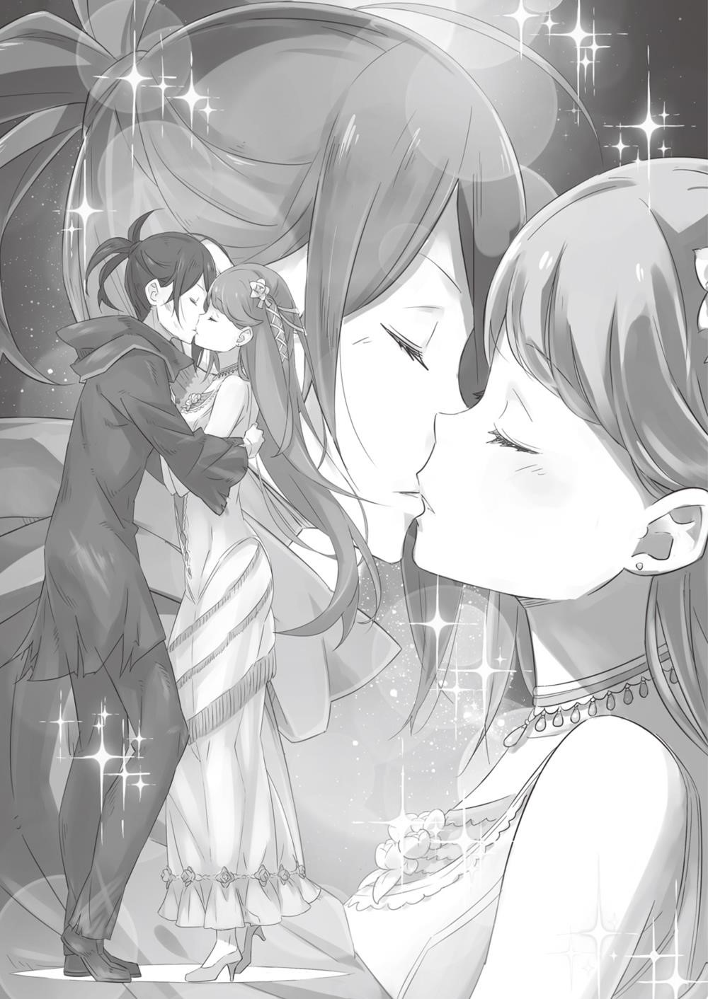
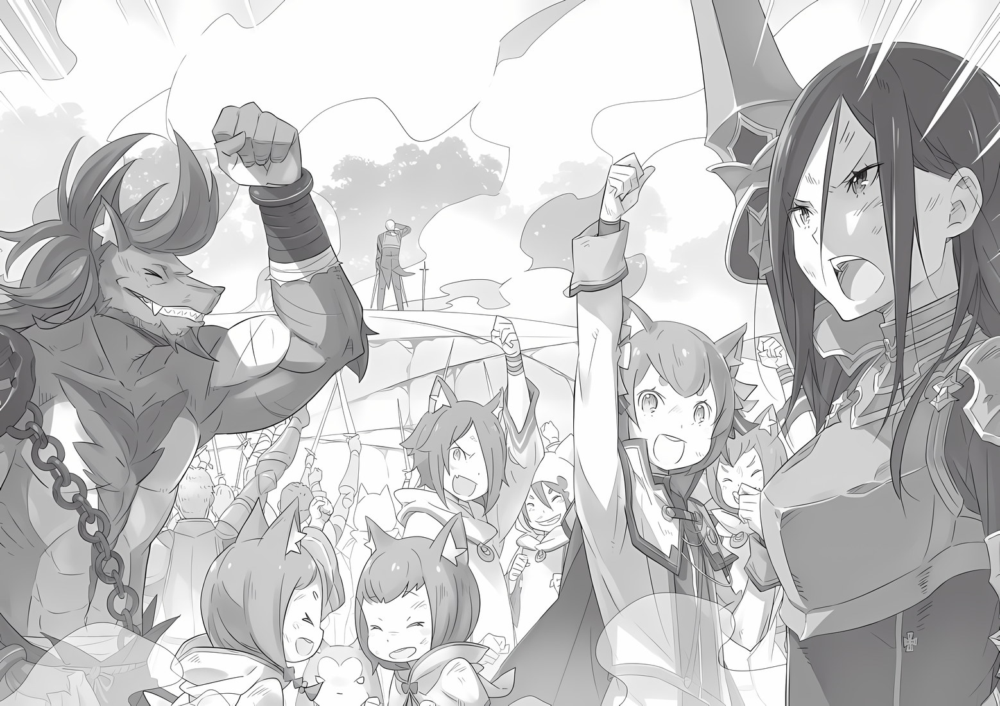

## 1

Вильгельм был третьим сыном в семействе Триас, которое принадлежало к древнему аристократическому роду и владело поместьем на самом севере Лугуники, на границе со Святым

Королевством Густеко. И хотя род славился военным прошлым, в то время, когда родился Вильгельм, его отец был мелким бароном со скромным земельным наделом и небольшим количеством вассалов.

Иначе говоря, Вильгельм происходил из аристократической семьи, переживающей не лучшие времена. Наличие старших братьев позволяло Вильгельму расти, не ощущая на себе бремени наследования. Также, в отличие от братьев, он не интересовался государственной службой. Когда пришло время определяться, с чем связать своё будущее, сыграло роль знакомство Вильгельма с холодным оружием.

Фамильный меч, украшавший главный зал особняка, напоминал о тех временах, когда военная слава дома Триас гремела по всему королевству. Теперь же клинок являлся не более чем обломком истории и служил исключительно декоративным целям.

Вильгельм и сам не мог сказать, с чего всё началось. Однако момент, когда он вытащил этот меч из ножен и оказался заворожён красотой стали, он помнил отчётливо. С тех пор Вильгельм стал ежедневно украдкой выносить меч на улицу и тренироваться с утра до ночи у подножия горы, что возвышалась недалеко от дома.

Впервые к мечу Вильгельм прикоснулся в восьмилетнем возрасте. А когда мальчику исполнилось четырнадцать лет и вес и габариты клинка стали ему привычны, он отточил своё мастерство и вскоре прослыл лучшим мечником в округе.

— Убегу в столицу, поступлю на службу в королевскую армию и стану рыцарем!

Каждому мальчишке в королевстве хотя бы раз в жизни приходила в голову такая сумасбродная мысль. И когда подобная идея посетила и Вильгельма, он не задумываясь сбежал из дома. На тот момент юноше не исполнилось и пятнадцати.

Поводом послужила ссора. Однажды ненастным вечером старший из братьев упрекнул Вильгельма за чрезмерное увлечение фехтованием, а также за то, что юноша завоевал славу хулигана, подружившись с местными сорванцами. Но Вильгельм чувствовал, что занятия фехтованием делают его сильнее, и это радовало его, как ничто другое. Упрёки брата задели за живое. Устав от бесконечной лекции, Вильгельм в сердцах выпалил эти слова. Братья вступили в перепалку, и в конце концов Вильгельм с обычной для таких случаев репликой: «Старшему брату никогда не понять младшего!» — выскочил из дома, имея при себе лишь меч и небольшую сумму денег. Хоть его путешествие и было незапланированным, Вильгельм благополучно добрался до столицы и сразу же направился к королевскому замку. Твёрдо решив пополнить ряды королевской армии и оставить след в истории, юноша постучал в ворота. Если бы дело происходило в наши дни, человека, который таким образом пытается проникнуть в замок, непременно сочли бы хулиганом и прогнали. Однако в то время на востоке страны шла гражданская война с союзом полулюдей и королевская армия остро нуждалась в добровольцах. Тут появился юноша и заявил, что неплохо владеет мечом. Конечно, его приняли с распростёртыми объятиями, Так Вильгельм без особых усилий стал профессиональным воином и вскоре принял участие в своей первой битве. Именно здесь, в настоящем бою, юноши впервые сталкиваются с преградой под названием «реальность». На родине в искусстве владения мечом им нет равных, но, оказываясь на поле брани, юнцы становятся жертвами собственного эго и безрассудства. Тем не менее через боевое крещение должен пройти всякий воин…

Однако на тот момент мастерство Вильгельма значительно превосходило знания не нюхавших пороха мальчишек.

— Я-то думал, будет действительно что-то особенное!.. — Юный воин вонзил меч в гору трупов полулюдей. У всякого стыла в жилах кровь, стоило представить, какое будущее ждёт этого юношу. Феноменальных результатов он добился ежедневными тренировками на родине. Вильгельм размахивал мечом днями напролёт, до полного изнеможения, — и так шесть лет подряд, с восьми до четырнадцати лет. Он не оставил тренировки и после вступления в королевскую армию и упражнялся, когда позволяло время.

Тяготы строевой жизни не сломили Вильгельма, тем не менее он оставался недоволен собой. Не зная, как справиться с унынием, юноша продолжал сражаться. Вильгельм рубил врагов и купался в их крови, доказывая себе, что он сильнее. Только в эти минуты он ощущал мрачную радость. Когда слава о парне из провинции, который даже не являлся рыцарем, разошлась по всей стране, и в королевской армии, и в стане полулюдей его стали называть Дьявольским Мечником, Дьявол Меча улыбался, только когда убивал врагов на поле боя. Это имя стало синонимом ненависти и трепета, Вильгельма обходили стороной и свои, и чужие.

Однако даже многочисленные военные подвиги не обеспечили Вильгельму почётное звание рыцаря. Он ни с кем не общался, стоически совершенствовал мастерство, неистово сражался, не обращая внимания на своих товарищей, врывался во вражеские лагеря, проливая реки крови. Увы, помпезное звание «рыцарь» никак не вязалось с таким поведением.

В стране, где исстари почитались традиции рыцарства, Вильгельм был словно чужак. Поэтому, несмотря на многочисленные заслуги воина, люди избегали его. Однако самого Вильгельма это вполне устраивало. Честолюбивые устремления рыцарей были ему чужды. Вильгельм не собирался щадить врагов ради собственного благородного имени. На поле боя люди должны умирать, а кровь — проливаться. Тому, кто находил удовольствие именно в этом, не подобало называться рыцарем. А если отказаться от таких удовольствий, зачем тогда вообще становиться рыцарем?.. Нездоровая страсть Вильгельма к войне долгое время червём разъедала юношеское сердце. Когда же ему исполнилось восемнадцать, то есть спустя три года после начала службы в армии, и прозвище Дьявольский Мечник было уже у всех на слуху, во взглядах Вильгельма произошла серьезная перемена.

## 2

У неё были красивые волосы, длинные и рыжие, да и сама девушка была прекрасна…

Это случилось во время отпуска, в который Вильгельма отправили вопреки его желанию — сам юноша не хотел покидать линию фронта, где царили запахи крови, пороха и смерти. Обладая избытком свободного времени, Вильгельм вернулся в столицу. Миновав ворота, он направился вглубь города.

Фамильный меч Триас, который он взял с собой, уходя из дома, за десяток лет изрядно потускнел и утратил былой вид, но Вильгельм привык к нему настолько, что воспринимал клинок как продолжение собственной руки. Он мог бы пользоваться другим оружием, но во время смертельной схватки его любимый меч был незаменим.

Вильгельм шагал по малолюдной улочке по направлении, к отдалённому кварталу с обветшалыми недостроенными домами. Планировалось, что этот район будет четвертым по счёту после элитного, торгового и того района, где жил простой люд. Однако строительство остановилось много лет назад. Будет ли оно продолжено, не знал никто, но поговаривали, что до тех пор, пока не закончится гражданская война, всё останется как есть.

Утром здесь не было ни души, а если кто и попадался, то лишь какая-нибудь шпана, избравшая это место для своих сходок. Трусливая мелочь, которая разбегается в стороны, словно пауки, стоит только припугнуть. Неудивительно, что хулиганы боялись Дьявольского Мечника и старались не попадаться ему на глаза, когда он появлялся в этом квартале во время увольнений.

— Что ж, тем лучше…

Вильгельм не любил размахивать мечом на плацу в королевском замке. На улицах города ему мешали голоса посторонних, и заброшенный район был идеальным местом, где мечник, без спешки и суеты, с головой погружался в мир, принадлежащий ему одному.

Для тренировок Вильгельм больше не нуждался в партнёре. Противника он рисовал в воображении и, обнажив стальной клинок, наносил удар.

Но главным врагом был…

— Ну и вид у тебя, приятель…

Глаза горят жаждой крови, на губах играет безумная ухмылка — эту картину мечник видел в зеркале каждое утро. Главным врагом для Вильгельма всегда оставался он сам. И не в метафорическом смысле, а буквально. На поле битвы он сходился с врагами в смертельной схватке и всегда выживал. Ни один мечник, каким бы сильным он ни был, не смог превзойти Вильгельма. Поэтому лучшим соперником для воина был он сам.

И Вильгельм, как только выпадал свободный день, уединялся, чтобы отдаться без остатка схватке с самим собой. Лишь в те минуты, кода он сжимал в руке меч, жизнь воина становилась осмысленной.

— Ой, извините!

В тот день чужаком, вторгшимся в мир Дьявольского Мечника, оказалась прекрасная девушка.

Вильгельм пришёл в заброшенный квартал, чтобы в очередной раз потренироваться, но, заметив чьё-то присутствие, мечник замер на месте.

Для занятий Вильгельм обычно использовал один из самых отдалённых уголков квартала. Там было большое, относительно ровное пространство — идеальное место для уединенных тренировок. Однако сейчас тут находился посторонний.

— Не думала, что встречу здесь кого-то в такой ранний час… — сказала девушка и улыбнулась Вильгельму.

Мечник не стал отвечать. Вместо этого он попытался прогнать непрошеную гостью, направив на неё поток агрессивной энергии. Незнакомка его раздражала, словно назойливое насекомое. Будь на её месте какой-нибудь хулиган, никогда не державший в руках оружия, он бы немедленно сбежал. Впрочем, опытный боец поступил бы так же, догадавшись о способностях Вильгельма.

Но девушка и не думала ретироваться.

— В чём дело? Зачем ты делаешь такое страшное лицо? — продолжила она как ни в чём не бывало. Вильгельм разозлился. Поток агрессии на противника не подействовал, значит, девчонка не думала нападать на него. Окажись на её месте человек, не чуждый грубой силы, он так или иначе отреагировал бы.

Однако миролюбивые люди воспринимали «поток агрессии» как банальное запугивание и даже могли улыбнуться в ответ. Человек, находящийся сейчас перед Вильгельмом, определённо принадлежал к такому типу людей.

— Какого черта женщина тут забыла, да еще ранним утром? — Вильгельм не стеснялся в выражениях.

Девушка не отрывала от него взгляда

— Хм… Я хотела спросить то же самое, но мне показалось, что это будет неучтиво. К тому же, если судить по лицу, чувство юмора не твой конёк.

В округе орудует масса бандитов. Не лучшее место для одиноких прогулок.

— Что я слышу? Ты беспокоишься обо мне?!

— Вдруг я один из них? — иронично заметил Вильгельм и щёлкнул по рукояти меча.

Но девушка не удостоила вниманием его жест. Вместо этого она махнула рукой куда-то за здание, на крыльце которого сидела. Оттуда, где находился Вильгельм, не было видно, на что именно она показывает. Лицо мечника приняло озадаченный вид, и тогда незнакомка поманила его.

— Не то чтобы я горел желанием…

— Не упрямься, подойди ближе, — сказала она ласково, словно обращалась к ребёнку.

Вильгельм нехотя приблизился и, вытянувшись, заглянул за дом.

И потерял дар речи!

Всё пространство за домом занимало обширное цветочное поле, освещаемое лучами утренней зари. — Это место давно заброшено. Я подумала, что сюда уже никто не придёт, и посеяла семена. А сейчас решила посмотреть на результат, — сообщила девушка заговорщическим шёпотом, как будто по секрету.

Вильгельм уже не раз приходил на это место, но не замечал жёлтого цветочного поля. А ведь для того, чтобы оно открылось взору, достаточно было слегка вытянуть шею.

— Тебе нравятся цветы? — спросила девушка.

Вильгельм повернулся и пристально посмотрел на её легкую улыбку. Затем скривил губы и тихо ответил:

— Нет, я их ненавижу!

## 3

С тех пор они часто встречались.

Когда у Вильгельма случался очередной выходной, ранним утром он шёл в заброшенный квартал. Она приходила на место раньше и в ожидании мечника сидела на крыльце, наслаждаясь утренним ветерком и любуясь цветами. Когда появлялся Вильгельм, девушка спрашивала:

— Тебе всё ещё не нравятся цветы?

Мечник мотал головой и, словно забыв о её существовании, приступал к тренировке. А когда заканчивал и утирал со лба пот, незнакомка сидела на прежнем месте.

— Я смотрю, у тебя избыток свободного времени, — иронически замечал мечник. Такой обмен репликами постепенно стал для них привычным.

Со временем разговоры стали длиннее. Если раньше они беседовали только по окончании тренировки. позднее стали разговаривать и до неё. Диалог после занятий тоже немного удлинился.

Постепенно Вильгельм стал приходить на место встречи даже раньше, чем его собеседница. Он ждал её, глядя на цветочное поле, а когда девушка появлялась и с досадой восклицала: «Ты сегодня так рано!» — на губах мечника возникала улыбка.

Прошло около трёх месяцев, прежде чем они познакомились. Терезия — так назвалась девушка — смущенно заметила: «Удивительно, что мы сделали это только сейчас». На что Вильгельм ответил: «До этого я мысленно окрестил тебя девушкой-цветком».

Вильгельму казалось, что теперь они узнали друг о друге чуть больше. Беседы, поначалу ничего не значащие, со временем стали более глубокими.

Однажды Терезия спросила Вильгельма, зачем ему меч, н юноша не задумываясь ответил, что клинок — единственное что у него есть…

## 4

Возвращаясь на службу, Вильгельм снова погружался в кровавые будни. Война против полулюдей становилась всё ожесточённей. Мечник прорывался сквозь магические заслоны в стан противника и вспарывал врагов от живота до подбородка. Всё это уже превратилось для него в рутину.

Как-то раз Вильгельм, подобно урагану, влетел во вражеский лагерь и обезглавил командира. Он вонзил меч в отрубленную голову и, держа клинок в руке, вернулся к соратникам. На него глазели с восхищением и ужасом. Внезапно Вильгельм заметил окровавленные цветы, которые качал ветер, и вдруг понял, что боится на них наступить…

— Ты полюбил цветы?

— Нет, я их ненавижу.

— Зачем тебе меч?

— Это единственное, что у меня есть…

Во время привычного диалога с Терезией о цветах Вильгельм мог даже улыбаться. Однако, когда речь заходила о мече, ему всякий раз становилось больно.

Зачем тебе меч?

Это единственное, что у меня есть.

Последние дни Вильгельм был зациклен на этой мысли. Размышляя о том, как ответить на вопрос Терезии, он мысленно возвращался в тот день, когда его рука впервые ощутила тяжесть стали. Тогда этот меч ещё не знал вкуса крови, и чистый, незапятнанный клинок отражал свет. О чём Вильгельм думал в такие минуты?

Однажды, погружённый в водоворот вопросов без ответов, он шагал к месту свидания. Ноги были тяжёлыми, а мысль о предстоящей встрече повергала в уныние. За всю жизнь ещё ни разу у Вильгельма не было так беспокойно на душе.

А может, меч всё решает за меня? Позволяет ни о чём не задумываться?

Как только эта простая идея пришла ему в голову, раздался голос:

— Вильгельм!

Девушка уже ждала его на прежнем месте и улыбалась. Вдруг в душе что-то шевельнулось. Он замер, не в силах сдержать нахлынувшее чувство. Это внезапное ощущение захватило Вильгельма и чуть не раздавило его физически.

Он продолжал тренировки, совершенно оторванный от реальности. Мечник полностью отдался этой мысли, и всё, о чём он давно перестал думать и задвинул в самый дальний угол сознания, ожило. Что всколыхнуло эту волну, он не знал. Плотина, не совладавшая с бурным потоком, прорвалась.

Зачем тебе меч?

Зачем ты это делаешь?

Вильгельма восхищал блеск клинка, его сила и достоинство. И всё же причина была в другом…

— Я должен был научиться тому, чего не умели мои братья. Фехтование и прочие боевые искусства были совершенно чужды старшим братьям Вильгельма. Тем не менее они по-своему защищали родной дом, и младшему не терпелось тоже стать защитником. А уже позже его очаровали блеск и сила меча.

— Ты полюбил цветы? — Я их… не ненавижу.

— Зачем тебе меч?

— Я не придумал другого способа… быть защитником.

Позже они перестали обмениваться этими привычными фразами. Вильгельм стал заговаривать на другие темы. Незаметно он осознал, что наведывается в заброшенный квартал не для того, чтобы помахать мечом, а ради встречи с Терезией. Со временем площадка для фехтования превратилась в место, где Вильгельм тренировал свой мозг в поисках новой темы для разговора.

Тогда же изменилось и поведение Дьявольского Мечника на полях сражений. Если раньше Вильгельм в одиночку врывался во вражеский стан и остервенело рубил направо и налево, то теперь его больше волновало другое: он пытался сократить число погибших среди соратников. Когда защита своих приобрела для Вильгельма первостепенную важность, окружающие стали смотреть на него иначе.

Старые боевые товарищи были рады произошедшим переменам. Вильгельм стал более общительным. Пошли разговоры, что мечнику могут присвоить звание рыцаря, и он даже начал задумываться над тем, чтобы принять его. В глубине души он надеялся, что почётное звание поможет ему стяжать доброе имя.

— Мне предложили звание рыцаря, и я согласился.

— Что ж, поздравляю. Теперь ты на шаг ближе к мечте.

— Мечте?

— Тебе ведь дан меч, чтобы защищать? А рыцарь — именно тот, кто защищает других.

Вильгельм подумал, что среди всего, что он хотел бы защитить, её улыбка занимает особое место…

## 5

Время шло. Сделавшись рыцарем, Вильгельм начал больше общаться с товарищами по оружию и, как следствие, стал больше узнавать.

Страна увязла в жестокой гражданской войне, как в болоте, на всех линиях фронта атаки чередовались с отступлениями. Вильгельм тоже несколько раз потерпел поражение, после чего горько досадовал. Сам он мог биться на пределе возможностей, но повлиять на обстановку в отдалённых частях был не в состоянии.

Весть о том, что война добралась и до его родной земли, стала для мечника неожиданностью. Об этом он случайно услышал от одного из своих новых товарищей. Рыцарь рассказал, что пламя, разгоревшееся в восточной части королевства, перекинулось и на север, туда, где находились земли семьи Триас.

Приказ не поступал.

Пока рыцарь помнит о присяге, он не будет действовать самовольно. Но в душе Вильгельма всколыхнулись чувства, похожие на те, которые он испытал, впервые взяв в руки меч. Запреты для него не значили ровным счётом ничего. Мечник примчался в родное поместье. Вражеские войска уже превратили его в море огня: привычные пейзажи, которые Вильгельм не видел больше пяти лет, гибли у него на глазах. И тогда он обнажил меч, закричал и бросился в кровавый туман.

Он рубил врагов, перешагивал через трупы, кричал до хрипоты, купался в фонтанах чужой крови. Вильгельм пошёл один против целой армии! Но без поддержки его возможности были невелики. На полях сражений он дрался плечом к плечу с братьями по оружию, а здесь мечник был одинок. Одна рана, другая… Он повалился на гору трупов, понимая, что смерть близка. Любимый меч, с которым Вильгельм никогда не расставался, упал, но сил его поднять уже не было. Мечник закрыл глаза и вспомнил последние годы своей жизни. Всё это время он только и делал, что размахивал мечом. Унылая, пустая жизнь…

Затем мимолётные картины сменились образами тех, кого он знал. Одно за другим перед глазами проплыли лица родителей, братьев, мальчишек, с которыми он хулиганил в детстве, рыцарей и военачальников королевской армии… И в самом конце — лицо Терезии на фоне цветов.

— Не хочу… умирать…

Прежде он мечтал жить и умереть на поле брани. Однако теперь, когда смерть маячила перед глазами, его охватило невыносимое одиночество. Но противник потерял слишком много товарищей, чтобы прислушиваться к хриплой мольбе мечника. Массивная, незаурядного роста фигура безжалостно обрушила на Вильгельма огромный меч…

Ему никогда не забыть, как красиво падал клинок…

Однако в тот миг, когда меч засвистел, рассекая воздух, тело получеловека распалось на конечности, голову и туловище. В стане врага заволновались, но, прежде чем смогли осознать, в чём же дело, сверкнул серебристый клинок и, не церемонясь, добавил в копилку Вильгельма ещё несколько трупов.

Перед глазами разворачивалась сцена из настоящего кошмара. Кровавая мясорубка перемалывала полулюдей одного за другим, не оставляя им даже секунды на агонию. Жестокость или милосердие? Этого уже никто не знал… Если что-то и было ясно, то лишь одно: ему никогда и ни за что на свете не достичь такого мастерства.

Вильгельм посвятил этому искусству половину своей недолгой жизни. Именно потому он и понимал, какой высокий уровень владения оружием демонстрирует его неожиданный союзник. К моменту, когда Вильгельм вступил в бой, его родное поместье превратилось в долину кровавого тумана. Теперь же на глазах мечника разливалось настоящее кровавое море. Сравнивать количество трупов просто не имело смысла… Серебро клинка мелькало в воздухе до тех пор, пока не вонзилось в последнего из полулюдей, вторгшихся во владения Триас.

Вильгельм наблюдал за кровавой бойней до последнего. Когда прибыли королевские войска, всё уже было кончено. Мечника подняли и взвалили на спину. Затем что-то кричали, обрабатывали раны, но он не отводил глаз от того, кто устроил это побоище.

Наконец мастер меча тряхнул длинным, тонким клинком и не спеша зашагал прочь. И тут Вильгельм заметил, что на таинственном воине не было ни капли вражеской крови. Его охватила дрожь. Вильгельм протянул руку, но незнакомец был уже далеко.

Слишком далеко…

О прозвище Великий Мечник, а также о настоящем имени его носителя Вильгельм услыхал, возвратившись в столицу. Тогда же слава Великого Мечника стала греметь на всю страну. Он был легендарным героем, зарубившим саму Ведьму, что принесла миру множество бед. Божественной Защитой Великого Мечника обладали мужчины одного рода. Защита передавалась из поколения в поколение, и каждый новорождённый мальчик этого рода обладал качествами Великого Мечника. Так было до сих пор.

Имена Великих Мечников держали в тайне. Но и этой традиции тоже было суждено прерваться…

## 6

Спустя несколько дней, когда раны зажили, Вильгельм отправился в заброшенный район. Сжимая в руке любимый клинок, он тихо ступал по улицам столицы. Мечник направлялся к цветочному полю. Вильгельм был уверен, что она там.

Терезия и вправду оказалась на месте.

Но прежде чем она успела обернуться, Вильгельм извлёк из ножен меч и бросился на девушку! Клинок описал полукруг, но не успел рассечь голову: за миг до этого Терезия остановила его, поймав лезвие между двумя пальцами.

У Вильгельма перехватило дыхание. Губы мечника расплылись в зловещей ухмылке:

— Какой позор.

— Да…

— Ты издеваешься надо мной?

Молчание.

— Отвечай, Терезия! То есть… Великий Мечник Терезия ван Астрея! С огромным усилием Вильгельм вырвал клинок из её цепких пальцев и снова замахнулся. Девушка молниеносно отскочила, взметнув рыжими волосами, чем на мгновение отвлекла внимание Вильгельма. Улучив момент, она сбила его с ног, и мечник рухнул на землю как подкошенный.

Даже безоружный, Великий Мечник был недосягаем. Между ними пролегала огромная, непреодолимая пропасть.

— Я больше не приду сюда.

Вильгельм несколько раз попытался атаковать её, но получал отпор за отпором и в конце концов был повержен, В мгновение ока его клинок оказался в девичьей руке. Получив по лицу рукоятью своего же меча, Вильгельм больше не мог сдвинуться ни на миллиметр, — Не женское это дело… орудовать мечом!..

— Но я Великий Мечник. И теперь я наконец поняла почему.

— О чём ты говоришь?..

— Быть мечником, чтобы защищать людей… Мне кажется, я тоже гожусь на эту роль!

Терезия любила цветы и не видела прока в занятиях фехтованием. Но Вильгельм показал ей, что в этом есть смысл. Ведь она была искуснее и сильнее, чем кто-либо.

— Погоди, Терезия… Я отберу у тебя меч. Отберу и Защиту, и звание, и всё остальное! Ты ни во что не ставишь красоту клинка, красоту стали! Меч для тебя — ничто. Слышишь меня, Великий Мечник?!

Последние слова были брошены в спину. Девушка не остановилась. Глупый, жалкий неудачник, упрекавший Великого Мечника в неподобающем отношении к мечу, остался в одиночестве.

Это была их последняя встреча на улице в заброшенном квартале.

## 7

Больше Дьявольского Мечника в рядах королевской рати никто не видел. Зато все рыцари твердили о Великом Мечнике

Неистовость, с которой Терезия бросалась на врага, обеспечила ей славу непобедимого воина и в мгновение ока изменила ход гражданской войны. Хотя девушка была одиночкой, её доблести хватило бы на сотню воинов, а гремящее на всю страну прозвище — Великий Мечник — внушало полулюдям, знавшим старые легенды, первобытный страх.

Война кончилась спустя два года после того, как Великий Мечник ступил на поле боя. Союз полулюдей распался, и, хотя обсуждение мирного договора отложили до официальной встречи глав обеих сторон, кровопролитные столкновения прекратились. В честь окончания затяжной войны в столице устроили скромный, но изысканный праздник.

Предполагалось, что на церемонии прекрасной, могучей воительнице вручат несколько наград. Чтобы взглянуть на рыжеволосую мечницу — героиню, чье горячее рвение положило конец жестокой войне, — в столицу съехались люди со всей страны. Именно в это время, словно ради того, чтобы охладить пыл Терезии, в столицу прибыл и Дьявольский Мечник.

От молодчика с обнажённым мечом в руке исходил настолько агрессивный дух, что стражники хотели было преградить ему путь, но именно цветок церемонии — Великий Мечник Терезия ван Астрея — остановила их. Оба, будто сговорившись, поднялись на сцену, и каждый направил свой меч на соперника.

Девушка стояла лицом к лицу с незваным гостем, ветер трепал её длинные рыжие волосы. Все присутствующие затаили дыхание. Будто став одним целым со своим клинком, она выглядела неописуемо изящно и красиво. От её противника же, напротив, исходила зловещая аура. К коричневой накидке, пропитанной дождевой водой, пристала грязь. Таким же грязным было и тело под ней. Видавший виды клинок не шёл ни в какое сравнение с церемониальным священным мечом, который сжимала Терезия. Клинок Вильгельма был погнут и усеян бурыми пятнами ржавчины.

Король, восседавший на троне в глубине площадки остановил рыцарей, которые бросились было Великому Мечнику на помощь. Терезия сделала шаг вперёд, по лезвию её меча скользнул блик. В зале воцарилась абсолютная тишина.

Когда же началась схватка, многим наверняка показалось, что фигуры соперников просто испарились. Два воина сошлись в головокружительном танце мечей, клинки оглушительно звонко ударялись друг о друга и со свистом рассекали воздух.

Зрелище было настолько впечатляющим, что люди, замерев, глядели во все глаза. В яростной схватке соперники поочерёдно нападали и защищались, внезапно оказываясь то на стенах, то в воздухе, то снова на твёрдом настиле площадки. Кто-то из наблюдавших даже прослезился. Звон скрещиваемых мечей опьянял публику и пробуждал в ней возвышенные чувства.

Мастерство мечников казалось нереальным, Красота поединка завораживала.

Наконец мечи схлестнулись, едва не соприкасаясь эфесами. Клинки сверкнули и несколько раз ударились друг о друга. А затем… меч, что был покрыт бурыми пятнами, переломился, и обломок клинка закружился в воздухе.

А меч, который держала в руке девушка…

— Я… победил…

Священный меч со звоном упал на пол. Гнутый конец сломанного клинка приблизился к горлу Терезии.

Время словно остановилось.

Великий Мечник проиграл!

— Ты слабее меня. Теперь у тебя нет причин носить меч!

— Если не я… то кто?..

— Передай эту обязанность мне. Я буду мечником ради тебя.

Вильгельм откинул грязный капюшон, открыв мрачное лицо — Ты злой. Ты лишаешь людей решимости.

— Всё, чего я лишаю других, переходит ко мне. Забудь о том, что была мечницей, живи спокойной, беззаботной жизнью. Ты можешь выращивать цветы и делать всё, что захочешь, но позволь мне быть твоей опорой.

— И под защитой твоего меча?

— Да.

— Ты будешь меня защищать?

— Да.

Терезия коснулась направленного на неё клинка и шагнула вперёд. Они стояли лицом к лицу, так близко, что ощущали дыхание друг друга. Девушка улыбнулась, по её щеке покатилась слеза.

— Ты любишь цветы?

— Я их больше не ненавижу.

— Зачем тебе меч?

— Чтобы защищать тебя.

Их губы стали сближаться, пока не слились в поцелуе. Затем Терезия отстранилась и, заливаясь краской, робко взглянула на Вильгельма:

— Ты… любишь меня?

— Ты же знаешь, — бросил он, отвернувшись.

В тот же миг зачарованная происходящим публика очнулась. Стражники всей толпой бросились к Терезии и Вильгельму. Увидев среди них знакомые лица, Вильгельм пожал плечами.

В ответ на его поведение Терезия надула щёки, совсем как в тот день, когда они стояли в заброшенном квартале и улыбались, любуясь цветущим полем…

— Иногда девушкам хочется это услышать.

— Гм…

Вильгельму стало неловко. Он почесал в затылке, обернулся и приблизил губы к уху Терезии.

— Как-нибудь в другой раз, когда настроение будет, — произнёс он, пытаясь скрыть смущение.

## 8

— О-о-о-о-о-о-о-о!!! — истошно кричал пожилой мечник. Он мчался как ветер, рассекая на ходу фамильным клинком каменную шкуру. Из туши били фонтаны крови, окрашивая небо в яркокрасный цвет.

На мечнике не было живого места. Раненный в левое плечо, Вильгельм с ног до головы был измазан как своей, так и чужой почерневшей кровью. Эффект от исцеляющей магии был совсем незначительный — старику остановили кровотечение и частично вернули физические силы. Но сказать, что Вильгельм находился при смерти, никак было нельзя. Сейчас, глядя на него, никто не рискнул бы высмеять мечника, ехидно заметив, что тот глупо прожил свою жизнь. Глаза Вильгельма блестели; оглашая округу воинственным криком, он ловко орудовал мечом. Стремительный и уверенный, он мчался по спине Белого Кита. Мечник кричал и вспарывал тушу врага, зверодемона били мучительные судороги.

Придавленный Древом, он был совершенно беспомощен. Дьявольский Мечник мчался по спине Кита, движения его клинка были тверды, как сама сталь. Вонзив меч в голову монстра, Вильгельм пробежал до хвоста, затем спрыгнул на землю и снова бросился к голове, вспарывая брюхо.

Когда он наконец остановился и извлёк серебристый клинок на свет, Белый Кит был разрезан надвое. Дьявольский Мечник подпрыгнул и снова оказался на морде замершего зверодемона. Мечник стряхнул с клинка кровь. Его взгляд встретился с гигантским глазом.

— Я не собираюсь ни в чём тебя обвинять. Зверю неведомы добро и зло. Просто я оказался сильнее, а сильный убивает слабого. Это закон природы. А теперь спи. Вечным сном…

Белый Кит издал последний стон и закрыл глаз. Его туша, лежащая посреди грязно-алого моря крови, обмякла. Немногочисленные выжившие воины стояли по щиколотку в крови и безмолвствовали. Тракт Лифаус погрузился в тишину, которую нарушил Вильгельм.

— Всё кончено, Терезия. Наконец-то…

Стоя на голове мертвого Кита, мечник воздел глаза к небу выпустил из ладони фамильный меч и закрыл ею лицо.

— Терезия, я… — Голос Дьявольского Мечника дрогнул.

Однако он договорил — хриплым, но таким же сильным, исполненным безграничной любви голосом:

— Я… люблю тебя!

## 9

Вильгельм так и не смог признаться Терезии в любви. Все годы, что они прожили вместе, он так ни разу и не сказал ей этих слов. А потом настал страшный день — его любимая погибла. Прошёл не один десяток лет, прежде чем он облёк свои чувства в слова. Те слова, которые должен был сказать давным-давно, когда Терезия просила об этом…

Стоя на трупе поверженного врага, Дьявольский Мечник оплакивал ушедшую жену.

## 10

— Белый Кит повержен.

В тихом голосе, нарушившем ночное безмолвие равнины, слышались достоинство и уверенность. Когда он прозвучал, все встрепенулись и увидели девушку на белом земляном драконе, который приближался неспешной поступью.

Израненная, лицо вымазано в крови, длинные зелёные волосы распущены — битва изрядно потрепала её. При этом лицо девушки сияло. Это видел каждый. И тут не было ничего удивительного, если считать, что ценность личности определяется светом её души. Рыцари глядели на Круш во все глаза. Герцогиня величественно подняла голову и сделала глубокий вдох. Так как фамильный меч она отдала Вильгельму, вместо оружия Круш подняла в небо крепко сжатый кулак и провозгласила:

— Туманный Зверодемон, державший мир в страхе четыреста лет подряд, убит Вильгельмом ван Астрея!!!

— А-а-а-а!!!

— Мы победили!!!

Выжившие в бою рыцари отозвались дружным ликованием.

Туман рассеялся, и на равнину снова опустилась ночь, одна лишь луна освещала воинов своим бледным сиянием…

Так, спустя несколько столетий, война против Белого Кита была закончена.

