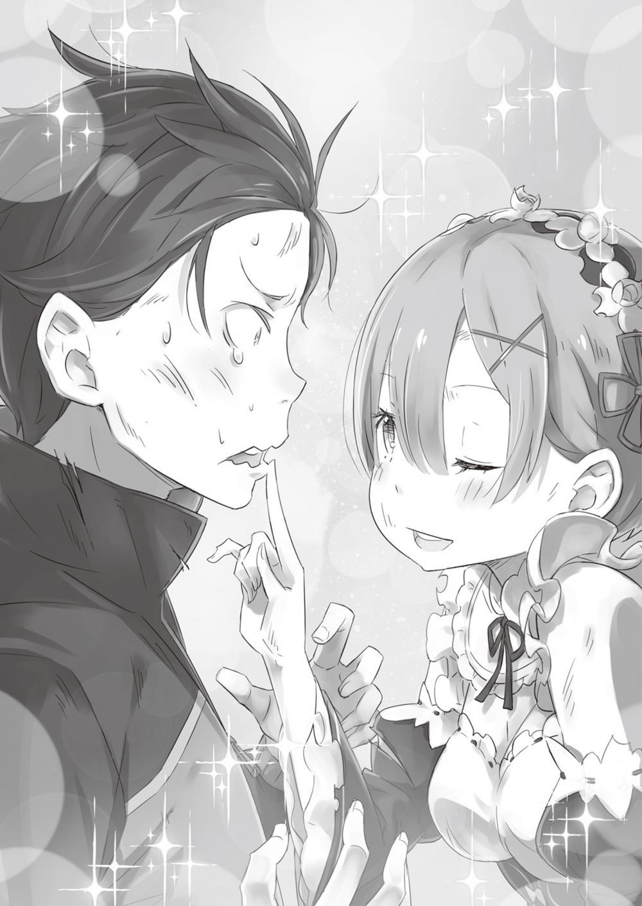

**1 **

На равнине царило ликование. Рыцарские мечи сверкали в лунном свете, и от этого картина становилась ещё великолепнее. Туша Белого Кита лежала под Древом Флюгеля в окружении торжествующего отряда. Все праздновали победу. Заветная мечта была исполнена, и на глаза воинов наворачивались слезы радости. Внезапно, заглушая все прочие звуки, над трактом Лифаус раздался ужасающий рёв. Его издавали двойники поверженного Кита. Теперь, когда главный Кит был мёртв, их полупрозрачные туши корчились в муках. Перестав получать ману, двойники больше не могли поддерживать своё существование в физическом мире.

— Как неизящно, — произнёс кто-то и взмахом незримого клинка положил конец безобразным страданиям одного из зверодемонов.

Шквал ветра с лёгкостью разрубил тушу пополам, и та буквально растаяла в воздухе. На другого Кита направили пушку, заряженную магическими кристаллами, и одним выстрелом обратили зверодемона в туман из маны, который рассеялся в воздухе. На этом операция по уничтожению Белого Кита завершилась в полном смысле слова.

Круш прижала руку к груди и почувствовала восторженный стук сердца. И всё же герцогиня мотнула головой.

— Хватит веселиться. Впереди много дел! — произнесла она, сохраняя самообладание.

Они объединили усилия и одолели ненавистного зверодемона. Но на счастливой ноте заканчиваются только сказки. В реальности же не всё так просто. Требовалось сделать ещё очень и очень многое: помочь раненым, похоронить погибших, отыскать пропавших без вести… Мысли о предстоящих хлопотах не позволяли Круш радоваться победе.

Внезапно совсем недалеко от трупа Белого Кита раздался отчаянный крик того, кто внёс огромный вклад в победу над монстром.

**2 **

— Рем! Открой глаза, Рем! — в отчаянии возопил Субару, прижав к себе обмякшее тело.

Лицо девушки было мертвенно-бледным. Один из драконов подошёл к Субару и потёрся о него своим чёрным носом. Но юноша был так взволнован, что не обратил внимания на драконью ласку. План Субару сработал блестяще. Своим запахом он заставил Кита пуститься в погоню, и в результате зверодемон оказался придавлен Древом. Субару боялся, что идею свалить многовековое древо встретят в штыки. Однако отряд наёмников-зверолюдей поддержал его план, и даже Круш, поразмыслив, согласилась. Герцогиня поистине была человеком широких взглядов.

В итоге Субару с огромным риском для жизни удалось осуществить задуманное, и сражение увенчалось долгожданной победой. Но вот цена за неё была слишком высокой…

— Нет, Рем… Пожалуйста… Ты… не можешь умереть…

Глаза Рем были по-прежнему закрыты. Казалось, она ничего не слышит. Руки и ноги девушки безвольно повисли. Голос Субару, полный слёз, не достигал её сознания, словно тот кричал в пустоту. Когда Белый Кит в ярости погнался за Субару, Древо стало заваливаться. Именно в этот миг Рем бросилась к Субару. Ствол колоссальной массой рухнул на Кита, и возникшая ударная волна смела всё, что было на её пути. Не обошла она стороной и Субару с Рем, мчавшихся верхом на драконе совсем рядом.

Всадников накрыла буря, и вдруг Субару почувствовал теплое прикосновение. В тот миг, когда он осознал, что находится под защитой, раздался ошеломляющий грохот, и юношу швырнуло на землю.

На какое-то время Субару впал в забытье, а когда очнулся и поднял голову, увидел, что находится в крепких объятиях девушки, — Рем не выпускала его из рук до самого конца.

— Суба… ру…

— Рем!

Веки девушки приоткрылись, и в затуманенных глазах отразился Субару. В этом отражении он показался себе слабым и беспомощным.

— Это я… Ты слышишь? Это я, Субару. Рем, ты…

У юноши перехватило дыхание. Слова застряли в горле.

— Субару… Ты жив… Я так рада… — прошептала Рем в ответ и с облегчением улыбнулась. На свои раны ей было плевать. Главное — Субару цел и невредим. — Что… с Китом?..

— Он рухнул! Мы его прикончили! Мы молодцы, у нас всё получилось! На мне ни одной царапины… Благодаря тебе…

— Хорошо… Надеюсь, господин Розвааль и госпожа Эмилия… тоже живы-здоровы…

— Всё будет хорошо, положись на меня! Рем, тебе сейчас лучше не разговаривать. Отдыхай…

только… не закрывай глаза… Ай, чёрт, что же делать?..

Рем следовало беречь силы, но молчание тревожило Субару. Юноша боялся, что жестокая судьба вырвет Рем у него из рук, и не знал, как лучше поступить. Поэтому он просто обнял её ещё крепче.

— Субару, больно…

— Прости. Но я боюсь, что ты куда-нибудь…

— Я никуда не денусь. Я буду… рядом…

Рем улыбнулась ему, словно мать, которая успокаивает плачущее навзрыд дитя. Затем её тело вдруг обмякло. Субару охватил леденящий ужас.

— Рем… Рем! Пожалуйста, Рем! Открой глаза!..

— Очень… хочется спать… Прости… Я посплю немножко…

— Спи, сколько хочешь, Рем! Тебе нужно отдыхать! Мне хватит того, что ты со мной… Только прошу тебя, Рем… — простонал Субару, чувствуя, что она отдаляется.

— Можно я… побуду эгоисткой?..

— Конечно! Всё что угодно, Рем! Чего тебе хочется? Только намекни!

— Я хочу, чтобы ты… сказал, что любишь меня, — еле слышно прошептала девушка, глядя ему в глаза.

Взгляд юноши затуманился от выступивших слёз. Он помотал головой. Затем приблизился к Рем.

— Я люблю тебя… Очень люблю. А как же!.. Если бы не ты, у нас ничего бы не получилось!

Субару нисколько не преувеличивал, он говорил искренне. Без Рем они бы проиграли, да и сам он не выжил бы.

— Я… счастлива…

Из-под прикрытых век Рем потекли слёзы, на щеках вспыхнул румянец. Каким-то шестым чувством Субару понял, что Рем покидает его.

— Не уходи…

— Я люблю тебя, Субару.

— Брось эти шутки! Я хочу, чтобы ты была со мной! Без тебя в моей жизни нет смысла!

Субару не представлял будущего без Рем. Он понял это уже давным-давно. Сейчас Рем была для него важнее всего на свете.

— Если тебя не станет… я возненавижу себя!

— Ты хочешь, чтобы в будущем Рем была с тобой?

— Само собой. Я тебя больше никуда не отпущу!

Субару закрыл глаза, смахнул слёзы и пристально взглянул на девушку.

Затем твердо сказал:

— Ты — моя! Никому тебя не отдам!

— Ловлю на слове…

— А? — Субару, поражённый метким ответом, открыл рот.

Затем Рем распахнула глаза и приподнялась у него на руках.

— Я забронировала место рядом с тобой! Теперь не отвертишься!

Девушка, которая только что находилась на грани жизни и смерти, весело подмигнула и коснулась пальчиком губ Субару. Плечи юноши бессильно опустились.

— Так ты… ты… Ну, знаешь ли…

— Да, это я, твоя Рем. Можешь не сомневаться.

Привычные слова сейчас прозвучали так дерзко, что Субару не нашёл в себе сил договорить. Но радость от того, что с Рем всё в порядке, перевесила минутную злость.

— Что-то ты слишком весёлая для того, кто только что лежал при смерти.

— Любовь сделала меня сильнее, Субару!

Юноша совсем растерялся, ведь Рем ничуть не скрывала своих чувств. Он покраснел от смущения и вздохнул:

— Если бы ты погибла, меня бы тоже, скорее всего, не стало.

— Если ты так думаешь, я настоящая счастливица!

— Я серьёзно!

Если бы Рем погибла, Субару начал бы всё сначала. И даже если очередная попытка провалилась бы, он бы не опустил руки. В этом Субару был уверен. Настолько важное место занимала сейчас Рем в его сердце.

— Тогда мне ни в коем случае нельзя умирать!

— Естественно! Я спасу тебя даже ценой собственной жизни.

Субару приблизился к Рем и, коснувшись её лба своим, пристально посмотрел ей в глаза. Взгляд девушки был так ласков, что ему стало не по себе. Розовые губы Рем притягивали взгляд, и сердце Субару забилось часто-часто…

— Молодые люди, может, хватит уже-ня?

Феррис, наблюдавший за ними издалека, удивлённо распахнул глаза. Беседа парочки была прервана на самом интересном месте. Похоже, он уже давно подглядывал за ними. Рыцарь, называется!..

**3 **

— Это было так мило, Субарунчик, как ты, выпучив глаза, звал Рем! «Если бы ты погибла, меня бы не стало!»

— Слушай, заткнись! На себя посмотри, любитель подглядывать!

— Вообще-то, если бы ты взял себя в руки и успокоился, то всё понял бы. Если я сразу не стал лечить Рем, значит, её раны не настолько серьёзны. У меня в ту минуту были пациенты потяжелее.

— Легко сказать «если бы успокоился»! Когда девчонка… которая сказала, что… любит меня…

теряет сознание… Да тут любой бы с ума сошёл!

— Вот они, чистые юношеские чувства. Такое не каждый день слышишь-ня!

Феррис держал руки над Рем, от его ладоней исходило голубое свечение. Кричать на рыцаря было бесполезно, так как он продолжал хихикать как ни в чём не бывало. Тем не менее, наблюдая, как лицо Рем понемногу розовеет, юноша не мог скрыть облегчения.

Многие высказывания Ферриса вызвали в Субару протест, однако он видел, что рыцарь действительно занялся лечением Рем лишь после того, как помог тяжело раненным. Хотя Рем сыграла важную роль в битве с Китом, девушка принадлежала к лагерю политического противника. Если бы Феррис первым делом бросился к Рем, его хозяйка определённо не оценила бы подобное рвение. Стоило Субару прийти к этому выводу, как появилась та самая хозяйка. Герцогиня Круш величаво ступала по траве.

— Ты в порядке, Субару Нацуки?

Герцогиня была измазана в крови и грязи, но оставалась по-прежнему грациозной и красивой. В эту минуту она была вылитой валькирией…

— Более-менее. Главное, что вы, леди Круш, в порядке, насколько я вижу.

— Я невредима. Но отряд понёс немалые потери. Белый Кит уничтожен, однако тех, кто исчез, не вернуть…

Глаза Круш были полны печали. Герцогиня бросила взгляд на труп Белого Кита, придавленного Древом. Вокруг него собрались уцелевшие члены отряда: воины пытались стащить Древо с туши.

— Что они делают?

— Мы должны убрать труп Кита. Древом Флюгеля, которым пришлось пожертвовать ради победы, тоже следует как-то распорядиться. Самое хлопотное время — после сражения.

— Как же вы собираетесь убирать Кита? Он же огромный!

Субару подумал, что ослышался, но взгляд Круш был серьёзен. Юноша снова оценил размеры монстра: в длину зверодемон был не меньше пятидесяти метров.

— Да это же нереально!

— Нет ничего невозможного. Он плавал по небу четыреста лет, внушая всем страх. Его труп послужит доказательством нашей победы, и люди по-настоящему обретут покой. В крайнем случае надо забрать хотя бы голову.

Слова Круш звучали напыщенно, однако в них прослеживалась логика. Уничтожение Белого Кита накануне королевских выборов оказалось весьма кстати. Разумеется, герцогиня не была настолько честолюбива, чтобы ставить свои личные интересы превыше всего, и в разгар битвы Субару успел убедиться в этом. Однако выдающимся успехом грех не похвалиться.

Народ поддерживал Круш, видя в ней сильнейшего претендента на трон. Если и торговцы перейдут на её сторону, положение герцогини будет прочным как никогда.

— Это что же получается?.. Я помог противнику?

Только сейчас Субару осознал, что поддержку, которую он оказал другому лагерю, уже не отменить. Всё, что он сделал, было ради Эмилии, но не перестарался ли он со своим альтруизмом? Субару уже начал сожалеть, но тут его размышления прервала Круш.

— Что-то ты слишком мрачен для героя, одолевшего Белого Кита.

— Когда встречусь с Эмилией, она первым делом назовёт меня предателем… А? Что вы сейчас сказали?

— Назвала тебя героем, одолевшим Белого Кита. Не стану же я приписывать себе твои заслуги.

Круш перевела строгий взгляд с бездыханной туши на Субару и прижала ладонь к груди:

— Я перед тобой в большом долгу. Без тебя мы бы не справились.

Круш низко поклонилась. Субару взяла оторопь: ни разу в жизни он не слышал искренних слов благодарности от столь высокопоставленной особы.

— Да бросьте вы… — начал мямлить Субару. — Ничего особенного…

Ты точно сообщил время появления Кита. Твоими стараниями в карательный отряд влились новые воины. Ты вернул рыцарям веру в себя, когда они пали духом. Ты предложил план и, рискуя жизнью, великолепно осуществил его и добыл нам победу!

— Каким же надо быть слабоумным, чтобы совершить всё это…

— Утверждать, что ты бесстрашно сражался, было бы неправильно. Но в этой битве ты, безусловно, сыграл главную роль. Клянусь своим добрым именем, я не допущу, чтобы кто-то посмел сказать иначе!

Круш говорила на полном серьёзе. В её похвале отсутствовали расчёт или фальшь. Сейчас герцогиня была сама искренность. Субару вспомнил, как она относилась к нему до начала битвы, и криво улыбнулся:

— Здорово же вы изменили своё мнение обо мне!

— Брось! Я признаю, что ещё несколько дней назад была о тебе не лучшего мнения, но я ошибалась. Ты счастливчик, и я достойно вознагражу тебя. Как насчёт того, чтобы присоединиться к моему лагерю? — Круш хитро прищурилась.

— Спасибо, но я пас, — отказался Субару не раздумывая. — Коней на переправе не меняют. Но вы мне нравитесь, и я правда считаю, что вы станете прекрасным правителем, если победите на выборах.

Субару действительно был уверен, что из Круш получится достойнейшая королева, — для этого она имела все данные. К тому же юноше было известно, что у герцогини имеется весомая причина стать хорошим монархом. Итак, у неё был мотив, была решимость и, конечно, была последняя воля отца. Всё это вкупе сделало её той, кем она являлась.

Для таких мелких людей, как Субару, женщины подобного склада являлись идеалом. Он бесконечно восхищался Круш.

— Я сделаю королевой Эмилию. Не ради кого-то. Просто я так хочу.

— Не сомневалась, что ты это скажешь.

Герцогиня улыбнулась одними уголками губ, затем расцепила сложенные на груди руки, сжала бледные пальцы в кулак и направила его на Субару.

— Что ж, хорошо. Я вознагражу тебя другим способом. Клянусь именем Круш Карстен, я исполню своё обещание!

Она разжала кулак и посмотрела на свою ладонь. Затем, понизив голос, добавила:

— Знаешь, я ещё ни разу так не радовалась, получив отказ. Я вовсе не расстроена, скорее, наоборот, твои слова подействовали на меня освежающе.

— Я считаю вас, леди Круш, необыкновенной девушкой. Если б я был свободен, непременно принял бы ваше предложение.

Действительно, если бы Субару не на кого было опереться, он не раздумывая ухватился бы за любую руку помощи и вверил себя спасителю. Но у юноши был друг, всегда готовый откликнуться на зов.

— Но я всё-таки рассчитываю на союз наших лагерей. Какими соперниками мы бы ни стали в будущем, давайте дружить, пока это возможно.

— Субару Нацуки, позволь мне кое-что разъяснить.

Улыбка исчезла с лица Круш. Герцогиня плотно сжала губы. В воздухе повисло напряжение.

Субару не сводил с неё настороженного взгляда.

Круш направила указательный палец в лицо юноше.

— Даже если бы нам выпал шанс помериться силами, я всё равно относилась бы к тебе благожелательно, — серьёзно сказала она. — Однажды мы распрощаемся навсегда, но я не забуду, что ты оказал мне неоценимую услугу. Пускай мы станем соперниками, но я продолжу уважать тебя как друга.

По спине Субару пробежал мороз. Не потому, что ему было неприятно. Просто в эту минуту он был поражён масштабом личности Круш.

Сейчас перед ним стояла самая настоящая Круш Карстен из герцогского рода Карстен.

— Если б моё сердце не было занято, я бы сейчас оказался в довольно щекотливой ситуации, — пошутил Субару, желая скрыть волнение.

— Ха! Я говорю с тобой не как женщина, — слегка улыбнулась Круш. — Не скажу, что ты нисколько не затронул струны моей души… Но свое сердце я отдала мечте. — Круш умолкла, затем шёпотом добавила: — И ничего не изменится, пока я не исполню ее.

Последние слова не достигли слуха Субару.

— Что ж, — продолжила герцогиня, — сейчас моя главная задача — перевезти в столицу раненых, а также труп Кита. А у тебя, по-видимому, здесь остались кое-какие незавершённые дела.

— Как человек с Божественной Защитой, вы, наверное, уже догадались…

— Достаточно взглянуть в твои юношеские глаза, чтобы понять. Божественная Защита тут не требуется, — сказала Круш и подмигнула. Затем оглядела его с ног до головы. — Ты тоже ранен… Не лучше ли отложить заботы на потом?

— Даже истекая кровью, я сделал бы это. В каком-то смысле для того я и устроил охоту на Кита. Извините, что приходится говорить такое…

— О! То есть охота на Кита была просто удобным поводом?

Слова Субару могли бы разозлить Круш, но герцогиня оставалась спокойной.

— Как интересно, — сказала она, видя, насколько Субару серьёзен. — Полагаю, союз со мной ты заключил по тем же причинам. Если это так, догадываюсь, в какой роли нужна я… Стало быть, тебе требуется моя помощь?

— Да, требуется… Признаться, я не думал, что твоим воинам будет нанесён такой урон… — с грустью сказал Субару, глядя на израненных членов отряда.

Теперь, после победы над Белым Китом, он должен был вернуться в поместье Мейзерса, где его ждала Эмилия, и сразиться с ненавистным Культом Ведьмы. Именно для этого ему и требовалась поддержка Круш.

— Наглеть я не буду, у вас и так вон сколько раненых… Я прекрасно понимаю: на вас висят обязанности главы герцогского дома и у вас есть своё мнение… Поэтому просить помощи как-то…

— Тогда, может, старая развалина сгодится?

Обладатель голоса, что внезапно вклинился в разговор, незаметно приблизился к Субару и Круш, отбрасывая длинную тень. Пожилой мечник весь был заляпан кровью зверодемона. В эту минуту Вильгельм выглядел ещё более зловеще, чем раньше. В правой руке он сжимал фамильный меч рода Карстен.

Госпожа Круш, — сказал Вильгельм, протягивая герцогине клинок, — возвращаю вам оружие, столь любезно вами одолженное, а также выражаю искреннюю благодарность за то, что помогли осуществить мою мечту! Благодарю вас!

— Просто наши интересы совпали. А меч не спеши возвращать — в ближайшее время он может тебе пригодиться. — Круш посмотрела на Субару.

— Слушаюсь. Ещё раз благодарю, — сказал Вильгельм и повернулся к юноше.

Старик источал одуряющий запах крови и мощный агрессивный дух, от которого становилось жутко. Настолько жутко, что душа уходила в пятки. Мечник посмотрел прямо на Субару, затем опустился на одно колено — как накануне, перед выездом к месту битвы.

— Мастер Субару Нацуки, мы уничтожили Белого Кита благодаря вам. И только благодаря вам я до сих пор жив. Спасибо вам. Спасибо!

Полжизни Вильгельм посвятил искусству владения мечом. Десять с лишним лет он ждал возможности отомстить. Искренняя благодарность старика была исполнена таких глубоких чувств, что Субару из страха ударить в грязь лицом не мог вымолвить ни слова.

— Боюсь, вы преувеличиваете мою роль в этой операции. Задумав убить Кита, вы его выслеживали, упорно тренировались, самоотверженно сражались…

После стольких неудач даже самый настойчивый человек опустил бы руки. Наверняка хоть раз Вильгельм испытывал искушение всё бросить и позабыть о безрассудном упорстве. Судьба редко баловала Субару, и поэтому он прекрасно понимал, каких душевных и физических сил стоило Вильгельму добиться цели.

— Вы бросили вызов Киту и победили потому, что сильно любили свою жену. И если я хоть немного поспособствовал исполнению вашей мечты, то я счастлив. Не знаю, уместно ли такое говорить… В общем, поздравляю. Вы здорово потрудились!

Вильгельм слушал Субару, широко распахнув голубые глаза. Юноша предположил, что мечник испытывает сейчас те же чувства, что и он сам. Описать их в нескольких словах было невозможно, а пространные речи казались неуместными.

— Благодарю, — промолвил Вильгельм дрожащим голосом.

Старик слегка потупился, помолчал несколько секунд и поднялся. Он бросил взгляд на Круш, та кивнула.

— С позволения госпожи Круш, — сказал Вильгельм, — я буду в вашем распоряжении столько, сколько понадобится, мастер Субару.

— Серьёзно?! Вот за это огромное спасибо!

Субару бросил вопросительный взгляд на герцогиню, и та снова кивнула. Затем он пристально оглядел Вильгельма. Несмотря на искалеченную руку, старик был готов ринуться в бой хоть сейчас. Субару одновременно почувствовал уверенность и страх.

Помощь Вильгельма — именно то, чего он желал, и сейчас, когда нужна была хоть какая-нибудь сторонняя поддержка, мастерство Дьявольского Мечника пришлось бы очень кстати. Однако даже несведущему человеку было ясно: Вильгельм тяжело ранен.

Видя, что Субару обеспокоен, Круш позвала своего рыцаря.

— Феррис!

— Я здесь, госпожа Круш!

Он вприпрыжку подошёл к хозяйке и повёл кошачьими ушками.

Чем я могу быть полезен? Должен сказать, работы у меня невпроворот, но ради вас я готов прервать любое, даже самое важное дело-ня!

— Поменьше болтай, Феррис!

В ответ на замечание он скроил кислую мину.

— Сколько людей в тяжёлом состоянии? — спросила Круш, остановив взгляд на отряде.

— Я начал с тяжело раненных, — сообщил Феррис, — так что на данный момент таких практически нет. Остальным тоже оказал первую помощь, поэтому можете меня похвалить! Правда я молодец-ня?

Глядя, как Феррис, приставив пальчик к щеке, подлизывается к герцогине, Субару вздохнул с облегчением. По крайней мере, жизни Рем ничто не угрожало. Хотя разговор, состоявшийся после битвы, и взволновал его, новость о том, что Рем в порядке, принесла Субару успокоение.

Круш погладила Ферриса по голове и кивнула:

— Уже можно увозить раненых? Если да, то заканчивай с лечением. Поедешь с Субару Нацуки, я поручаю тебе заключить союз с лагерем Эмилии.

— Что?! — удивлённо воскликнул Субару.

Герцогиня отправляла Ферриса вместе с ним. Выходит, политический союзник был для неё важнее, чем раненые бойцы. Это решение било по её собственному лагерю и, разумеется, должно было возмутить Ферриса, однако…

— Вас понял, отправляюсь вместе с Субарунчиком. А по дороге подлечу Вильгельма.

— Это будет непросто…

— Зато старина Вил даст мне помахать своим мечом. Разве оно того не стоит?

Рыцарь не возражал. Вильгельма приказ герцогини тоже нисколько не удивил. Субару же просто не мог скрыть растерянности.

Феррис бросил на него косой взгляд и сказал:

— Пол-отряда, то есть человек двадцать, чувствуют себя более-менее. Мы можем взять их для поддержки Субарунчика.

— Стоп, стоп! То есть вы… запросто даёте мне столько людей?! Уверены?

— А в чём, собственно, мы должны быть уверены-ня?

— Как «в чём»?.. Да во многом! Ты вот разве доверяешь мне?

Чем больше Субару думал об этом, тем больше убеждался: находясь в столице, Феррис специально бередил его душевные раны. Какой бы дружелюбной ни казалась улыбка Ферриса, каким бы очаровашкой он ни притворялся, рыцарь презирал Субару. Юноша даже не удивился бы, если бы тот воспротивился указанию Круш и отказался следовать за ним.

— Тебе, Субарунчик, я лично не доверяю, — сказал Феррис, надменно улыбаясь, — но в то же время я не сомневаюсь в госпоже Круш, а она решила, что ты заслуживаешь расположения.

— А… Ну спасибо, — еле выдавил из себя Субару, сгорая от стыда.

В ответ Феррис улыбнулся ещё шире и пробормотал:

— Это все равно что ненавидеть члена своей семьи…

— Что? Ты что-то сказал?

Да нет, забудь, — спохватился Феррис, затем нарочито хлопнул в ладоши. — Совсем забыл, Рем поедет с госпожой Круш в столицу присматривать за особня… то есть отдыхать. Ясно? — Феррис подмигнул.

— Это почему же?! — громко воскликнула Рем. Девушка находилась среди раненых и прислушивалась к разговору. Рем грозно посмотрела на Ферриса. — Со мной всё в порядке! Ведь Субару будет угрожать опасность! Как я моту…

— Послушай, но ты же еле двигаешься! Считай, в одиночку завалила одного из Китов, причём с помощью высшей магии! Ты полностью истощила свои ресурсы, твоя мана дырявая, словно решето. Я, как лекарь, предписываю тебе полный покой. Ясно излагаю?

— Но как же…

Рем не сдавалась. Дрожа, точно от озноба, она попыталась приподняться, опираясь на руку, но не смогла удержаться и едва не упала — вовремя подскочил Субару и подставил ей свое плечо.

— Ты что делаешь? Пожалуйста, послушай Ферриса, лежи спокойно!

— Но… я не могу! Мне тяжело! Я не выдержу!

В глазах Рем застыли крупные слёзы. Она боялась не того, что её бросят, девушку страшило другое. — Если Субару попадёт в беду, я хочу первой протянуть ему руку помощи. Если Субару заблудится, я хочу быть той, кто укажет ему верный путь. Если Субару бросит кому-нибудь вызов, я хочу быть рядом, чтобы унять его дрожь. Больше мне ничего не нужно! Ничего… Поэтому…

— Тогда тебе вовсе не о чем волноваться!

— А?..

Рем говорила так жалобно, что Субару стало неловко. Придерживая её за плечо, он погладил девушку по голове:

— Я всегда чувствую твою поддержку, и ты не раз направляла меня на верный путь. Когда меня бьёт дрожь, одна мысль о тебе придаёт столько сил, что всё становится нипочём. Ты всегда выручаешь меня!

— Ах…

— Всё хорошо, Рем. Всё обойдётся. Как-нибудь справлюсь. Ведь я твой герой. Поэтому тебе не о чем волноваться.

Рем подняла на Субару глаза, влажные от слёз; щеки девушки пылали румянцем. Губы Субару растянулись в кровожадной улыбке и обнажили зубы.

— Я даже расправился с Китом! Твой герой одержим каким-то нереальным демоном! — Суба…

Рем осеклась. Девушка пыталась подавить рыдания, но не смогла.

— Да… Мой герой — самый лучший на свете…

Рем улыбнулась сквозь слёзы.

**4 **

Круш отправилась в столицу, взяв с собой Рем и других раненых, а также голову Белого Кита. Половина карательного отряда последовала за герцогиней, остальным Круш поручила сопровождать Субару в поместье Мейзерса.

В качестве своих представителей она назначила Вильгельма и Ферриса. Та часть отряда, которая отправилась вместе с Субару, насчитывала двадцать четыре человека. Хотя отряд значительно поредел, боевой дух рыцарей был по-прежнему высок, и это придавало юноше уверенности. К тому же Субару сопровождали не только члены отряда Круш.

— Всё равно тебе достались самые лучшие, парень!

— Командир! И Мими! Мими ведь тоже молодчина! Супербольшая молодчина! Двое зверолюдей верхом на лиграх старались перекричать друг друга. Одним из них был Рикардо. Могучий воин уже оправился от ранений, которые получил, подставив себя под удар ради защиты Субару. Другим зверочеловеком была Мими — юная воительница, которая даже в разгар сражения не растеряла ребяческого задора.

Помимо них, Субару сопровождали около десяти наёмников из отряда «Железный клык». Хэтаро же поехал вместе с Круш в столицу.

— Слушай, а что ты сияешь, а? Братец твой вон еле на ногах стоял!

— Хэтаро не-е-еженка! Смотреть на него жалко! — посмеялась Мими над младшим братом, который не отличался крепким телосложением.

Однако Субару считал, что это, скорее, у Мими удаль бьёт через край. Не сказать, что девочка относилась к тому типу безумных воинов-берсерков, которые получают в бою наивысшее наслаждение. Просто Мими были свойственны позитивное мышление и способность находить удовольствие во всём. Таким чертам характера можно было только позавидовать.

— Во второй половине битвы я малость перестарался, — снова заговорил Рикардо, — но ты не волнуйся, братишка, сеньора Анастасия дала мне чёткие указания. Так что можешь рассчитывать на меня, как на лучшего бойца в твоём отряде!

— Могу рассчитывать… То есть вы в курсе, что я собираюсь делать?

Рикардо вдруг понизил голос:

— У тебя личные счёты с Культом Ведьмы?

Субару напрягся и сильнее сжал поводья. До слуха юноши донеслось негромкое фырканье — Патраш явно беспокоился о своём наезднике, Увидев, как у Субару побелели костяшки пальцев, Рикардо обнажил острые клыки в широкой улыбке:

— Не надо так удивляться! Торговцы всегда в курсе последних событий, а сеньора, как тебе известно, как раз из них. Мы много чего знаем, и не только о тебе. Не зря же у нас такие большие уши!

— Да! — вмешалась Мими. — Особенно у меня!

— Не о тебе речь, коротышка, — осклабился Рикардо.

Субару растерянно почесал в затылке. Такого от Анастасии он не ожидал. Впрочем, как ни крути, рано или поздно пришлось бы обо всём рассказать. Субару так и планировал сделать. А заодно проверить, работает ли страховка, о которой он позаботился перед выездом.

Так-так, похоже, скоро встретимся, — внезапно произнёс Рикардо, напряжённо вглядываясь вперёд.

— А? — Субару встрепенулся и вслед за собакоголовым воином вперился в непроницаемый мрак, но так и не понял, что же Рикардо там разглядел.

— Подожди, скоро сами покажутся. Расслабься.

— Вот только не надо задаваться!

— А никто и не задаётся! Скоро встретимся с нашими ребятами-наёмниками.

— Это как? — Субару нахмурился. Вторую половину «Железного клыка», то есть раненых, должны были отправить в столицу.

— Как сказал, так и есть! Мы с самого начала пошли на Кита не в полном составе. Половина «Железного клыка» занималась другим делом.

— Каким же?

— Нельзя же было допустить, чтобы в бойню оказались втянуты посторонние! Поэтому наши ребята перекрыли тракт. Они выехали прошлой ночью, поэтому ты не мог сними увидеться. Субару понимающе кивнул. Однако ему было обидно, что Анастасия не отправила всех своих солдат на битву с Белым Китом. И всё же лучшие воины — Рикардо и Мими — участвовали в операции. И это решение было верным. Анастасия учла возможность проигрыша. Торговка подстраховалась, чтобы не допустить полного уничтожения своего отряда.

Субару стало завидно. С его бедным набором карт оставалось только пойти ва-банк.

— Значит, нам навстречу движутся ваши ребята. Кто же тогда их ведёт?

— Мой младший брат Тиви! — гордо заявила Мими. — Мы с ним, как и с Хэтаро, тоже можем взрывать, если объединимся! Здо-орово!

Ответ Мими заставил Субару усомниться в надёжности второй половины отряда.

— И на кого же больше похож твой младший брат? На тебя или на Хэтаро? Или на вас обоих?

— Понимаю твоё беспокойство, но Тиви — самый сообразительный из троицы, — сказал Рикардо. — Он отвечает за финансы и проводит деловые переговоры. В общем, правая рука сеньоры. А ещё мастер в усмирении Мими, тут он даже Хэтаро за пояс заткнёт!

— Бедный Хэтаро…

И сестра, и командир были к Хэтаро так строги, что Субару переполнило чувство сострадания. В любом случае юноша обрадовался скорому пополнению отряда. Субару решил: как только две группы наёмников соединятся, он проведёт собрание, на котором они обсудят план действий. Скорее всего, и Вильгельм, и другие воины из лагеря Круш о многом уже догадались. Но как объяснить им задачу?.. Ведь Субару должен был умолчать о Посмертном возвращении… «Непросто же это будет…» — А?..

Юноша очнулся от раздумий, потому что впереди, поднимая клубы пыли, показалась стая лигров. Рикардо не ошибся, это были наёмники из «Железного клыка». Только вот кое-что смущало. Приглядевшись, Субару понял, что именно.

В стаю лигров затесалось иное существо. Расстояние до отряда сокращалось, и смутные очертания становились всё отчётливей. Наконец Субару разглядел земляного дракона: шкура его была голубого цвета, а верхом сидел…

— А ты что тут забыл?!

— Не слишком любезно ты встречаешь подмогу! Хотя чего ещё от тебя ожидать…

Всадник подъехал к Субару и остановился. Одетый в роскошную белую форму гвардейца красавец провёл ладонью по фиолетовым волосам и сдержанно, изысканно улыбнулся.

На Субару пристально смотрел рыцарь изящной наружности, сыгравший роковую роль в судьбе юноши. Это был Юлиус Юклиус.

**5 **

Патраш оскалился и стал сверлить голубого дракона грозным взглядом. Субару погладил зверя по затылку, чтобы успокоить. Их знакомство состоялось совсем недавно, однако между Субару и Патрашем уже образовалась крепкая связь, и Субару улавливал настроение зверя. Такая близость бывает лишь у тех, кто вместе побывали на краю гибели…

— Прошу прощения, но хватит соблазнять моего дракона. Твой зверь весьма хорош, и если мой дракон не устоит перед его очарованием, то может запросто пойти следом.

— То есть… Патраш! Ты что, флиртуешь?! Я-то думал, ты сердишься, а ты, оказывается, предатель! Кто же перед смертным боем романы крутит?! — Сынок, будь-ка поласковей со своим зверем. Он не заслуживает таких упрёков. К. тому же твой дракон — симпатичная самка, — пояснил Рикардо.

— Так ты девчонка?! — Субару искренне удивился.

Дракон стыдливо потупил взор, а Юлиус лишь пожал плечами. Всё это походило на дурацкую шутку. Субару уже собирался громко заявить, что об этом думает, но его опередил Феррис. — Юлиус! Надо же было нам встретиться именно здесь-ня! А ведь ещё два часа назад мы всем отрядом дрались не на жизнь, а на смерть! — заметил рыцарь с кошачьими ушками, не сводя глаз с Юлиуса.

— Мне нечего сказать в свою защиту. Но позволь поправить тебя, Феррис. Я не Юлиус. Называй меня… скажем, Юлий, — заявил Юлиус без тени смущения.

Все посмотрели на Юлиуса с упрёком, но он парировал холодной усмешкой.

— Когда человек, носящий звание рыцаря, присоединяется к группе наёмников, он ни в коем случае не должен запятнать своего доброго имени. Поэтому в состав «Железного клыка» войдёт не рыцарь Юлиус Юклиус, а простой человек по имени Юлий.

— Так вот в чём дело-ня! Нелегко приходится потомственным рыцарям. Как хорошо, что я происхожу из разорившихся аристократов.

— Проблема не в том, что я рыцарь. Банальная необходимость помочь приятелю вынуждает меня что-то придумывать. К слову, наказание Юлиуса Юклиуса истекло сегодня в полночь. Не знаю, стоит ли заявлять об этом во всеуслышание…

— Позаботился обо всём заранее, мерзавец… Только какой смысл брать псевдоним? — процедил сквозь зубы Субару.

Юлиус отвёл глаза и скривился. Затем вдруг пристально посмотрел на Субару и, не отрывая взгляда, приблизился к юноше вплотную:

— Выглядишь лучше, чем я думал. Как самочувствие?

В голове Субару что-то щёлкнуло. Рыцарь не иначе как потешался над ним. Для Юлиуса с момента драки прошло несколько дней, а для Субару — почти две недели. Но этих слов оказалось достаточно, чтобы напомнить о перенесённом позоре.

Более действенный способ парализовать волю трудно было и представить. Субару чудом удалось сдержать гнев. Он откашлялся, сделал глубокий вдох и демонстративным жестом смахнул со лба короткую чёлку.

— Пустяки, пара царапин. Поплевал, подорожник приложил — и всё зажило. Кстати, тебе не кажется, что ты слегка припозднился? Что? Писал рапорт после драки с новичком?

На лице Юлиуса появилось страдальческое выражение.

— Я не о том! Я имел в виду раны, полученные в сражении с Белым Китом… В любом случае я рад, что ты оправился. Впрочем, не так уж сильно я тебя и побил. У тебя здорово получается вызывать сострадание: помню, как ты катался по плацу, якобы корчась от боли.

— Ха-ха-ха!

— Хи-хи-хи!..

Соперники сухо рассмеялись друг другу в лицо. Обстановка накалялась, но окружающие не спешили вмешиваться. Феррис и Рикардо заняли позицию сторонних наблюдателей, а Мими отправилась навстречу отряду, чтобы поскорее встретиться с младшим братом. Разрядить напряжение попытался Вильгельм.

— Наверно, приятно вспомнить старые времена, но мне думается, сейчас не самый подходящий для этого момент, — заметил он с укоризной.

Дракон, верхом на котором сидел Вильгельм, вышел вперёд. В голубых глазах мечника отразился Юлиус.

— Мы очень признательны вам за помощь, — тихим голосом проговорил старик. — В битве с Белым Китом мы понесли значительные потери.

— Я вижу дружелюбное выражение на вашем лице, господин Вильгельм, — сказал Юлиус спокойно. Глядя мечнику в глаза и не находя в них дьявольского огонька, рыцарь

многозначительно кивнул и продолжил: — Совсем другой человек, не тот, что прежде!.. Райнхард, полагаю, тоже испытает облегчение.

— Да, наверное.

Вильгельм коснулся подбородка и опустил глаза. Какая же неистовая буря чувств поднялась в этот момент в душе воина?.. На лицах окружающих были написаны и сострадание, и спокойствие. Они-то знали, в чём дело. И только Субару был не в курсе… — Я понимал, что он поступает справедливо и не желает зла, и всё-таки не смог его простить… Когда-нибудь я отвечу за всё, — с горечью признался Вильгельм.

— Одних этих слов было бы достаточно, чтобы он успокоился, — заметил Юлиус. Затем обратил свой взгляд, спокойный, словно озёрная гладь, на Субару.

Юноша приготовился к продолжению словесной перепалки, но…

— Я должен поблагодарить тебя.

— А?

Юлиус спешился и, подойдя к Субару, который по-прежнему сидел на спине Патраш, согнулся в поклоне.

— Рыцари королевской гвардии давно мечтали уничтожить Белого Кита. Благодарю тебя за то, что победил зло, с которым все страны мирились долгие годы.

Субару растерялся. Вплоть до этого момента он не испытывал к Юлиусу ничего, кроме враждебности. Пока юноша подыскивал слова, вмешался Феррис:

— Подождите-ка! Боюсь, вы ошибаетесь-ня, ведь операцией по уничтожению Белого Кита руководила герцогиня Круш Карстен! А последний удар нанес старик Вил, что тоже немаловажно!

— Само собой, — ответил Юлиус. — Мне… то есть рыцарю Юлиусу довелось скрестить мечи с Субару. Действительно, он не так силён, чтобы в одиночку убить Кита.

Юлиус старательно придерживался выбранного сценария, изображая наёмника по имени Юлий.

— Но несомненно то, что Субару послужил мощным катализатором и способствовал началу операции против Белого Кита. Ты ведь признаёшь это, Феррис?

— Ну… да, твоя правда-ня… — печально проговорил Феррис и отступил.

Юлиус же снова обратил взгляд на Субару:

— Благодаря тебе люди могут позабыть те дни, когда Туман внушал им страх. Госпожа Анастасия наверняка тоже очень рада.

— Ничего не имею против первой части фразы, но вот вторая под сомнением… — И у нашего друга, который долгие годы испытывал сожаление… в его жизни настал поворотный момент, — негромко добавил Юлиус, закрыв глаза.

Субару догадывался, что тот говорит о красноволосом герое, но о чём мог сожалеть безупречный сверхчеловек, оставалось загадкой. Юноше казалось удивительным, что Райнхард вообще может о чём-то сожалеть. Субару решил: прежде всего следует радоваться тому, что мечта Вильгельма осуществилась. Тем более он внёс в победу свою лепту. И всё-таки благодарность Юлиуса вызвала в Субару противоречивые чувства.

Субару пытался храбриться, но страх и неуверенность, что он испытывал, находясь перед этим красавцем, не покидали его. К тому же в нём кипели мятежный дух и детская раздражительность. Субару был благодарен за поддержку, но тот факт, что на помощь пришёл именно Юлиус, злил его. Он очень обиделся на Анастасию за то, что она отдала такой приказ. Субару было тяжело скрывать это мрачное чувство. Он глубоко вздохнул и поинтересовался:

— Так что ты собираешься делать? Зачем приехал?

— И впрямь прекрасная работа, — пробормотал Юлиус вместо ответа на вопрос.

— Чего?..

Судя по голосу, Юлиус был впечатлён. Он мотнул головой и сказал:

— Я надеюсь, ты понимаешь, что «Железный клык», связанный с госпожой Анастасией договором, был предоставлен госпоже Круш… то есть был предоставлен тебе только на время операции по уничтожению Белого Кита.

— Что-о?! Разве?! Но ведь сеньора говорила…

— Сестрёнка, пожалуйста, помолчи.

Услышав слова Юлиуса, в разговор вмешалась Мими, но её остановил стоявший рядом полукотёнок, похожий на свою старшую сестру как две капли воды. Вероятно, это и был тот самый Тиви, который знал, как обращаться с сестрой.

— Что ты хочешь этим сказать? — спросил Субару, глядя на Юлиуса с недоверием.

— Всё просто: у нас нет причин помогать тебе после победы над Белым Китом. А теперь скажи: куда ты собираешься их повести?

— Ха-ха-ха-ха! — залилась смехом Мими. — Юлиус, даты будто с луны свалился! Перед отправлением сеньора ведь всё объяснила! Правда, я и сама не помню подробностей…

— Мими, помолчи, — одёрнул её брат.

И тут Субару понял, что имел в виду Юлиус.

— То есть ты предлагаешь мне сделать выбор прямо сейчас: оставить «Железный клык» или распустить наёмников по домам?

— У меня есть указание продать наши услуги как можно дороже. Или тебе не нужна поддержка?

Юлиус демонстративно повернулся к Субару спиной, показывая тем самым, что не намерен ждать. Однако юноша понимал, что поспешное решение, принятое под влиянием эмоций, не приведёт ни к чему хорошему. Дать волю гневу и прогнать Юлиуса — проще простого, но перед Субару стояла сложнейшая задача, и разбазаривать солдат в такой ситуации было бы крайне глупо.

И всё же Субару не мог безропотно принять «дорогую услугу», о которой заявил Юлиус. В конце концов, от его решения зависят жизни многих людей, в том числе Эмилии!

Субару погрузился в молчание. К нему были прикованы взоры Вильгельма и остальных. Согласиться на предложение Юлиуса — значит стать должником Анастасии. Он помог Круш убить Белого Кита. Теперь она, в свою очередь, помогает ему. Субару не хотелось нарушать этого равновесия.

Рикардо стоял в стороне, скрестив руки на груди, и хранил молчание. Мими, копируя командира, приняла ту же позу и нетерпеливо подёргивала ушками. Субару вспомнил, с каким энтузиазмом Рикардо только что говорил о битве с Культом Ведьмы, и тут кое-что понял.

Рикардо предвидел этот разговор с Юлиусом и потому был исполнен такого рвения.

— Подлецы! Какие же вы, жители Карараги, подлецы…

— Не слишком ли грубо бросать такое в лицо? — огрызнулся Рикардо. — Чтоб ты знал, я и сам не рад использовать чужую слабость. Просто я люблю деньги…

— Ваша жадность не знает границ! Да я и не особо-то на вас рассчитывал!

Хотя Рикардо был лишь номинальным боссом, Субару не собирался просить у него помощи, ведь, по сути, тот являлся врагом. Но в данных переговорах не оставалось ничего, кроме как сказать да, пусть ему это и претило.

С лагерем Круш Субару был в расчёте. Анастасия же сделала так, что юноша оказался перед ней в долгу. Принимать подобное решение было тяжело и горько, однако выбора не оставалось. Отказаться от военной помощи было бы опрометчиво. Если бы договор с «Железным клыком» мог каким-то волшебным способом заставить отряд биться с Культом Ведьмы…

— Волшебным… Волшебным?.. В Тумане… с Белым Китом… А потом договор на тракте…

Субару вдруг произнёс вслух то, что пришло на ум. На первый взгляд это был бессвязный набор слов, но они навели его на дельную мысль. Расплывчатый образ начал обретать форму, и в голове юноши возник ответ.

— А если я скажу… что операция по уничтожению Белого Кита ещё не завершена? — произнёс Субару, чувствуя себя загнанной в угол мышью.

— Очень интересно! — Юлиус прищурился.

Рыцари карательного отряда, не говоря уже о наёмниках из «Железного клыка», пришли в возбуждение. Среди них находился и Вильгельм. Он неотрывно смотрел на Субару такими глазами, что юношу начала мучить совесть. Но тут Субару вспомнил о проблеме, которую не мог оставить неразрешённой. И эта проблема никак не была связана с заветным желанием Вильгельма.

— Белый Кит мог быть орудием в руках Культа Ведьмы! Я знаком с одним адептом, который говорил подобное.

Кажется, это было в самом конце третьего, то есть прошлого круга. Тогда Субару наткнулся в лесу на Петельгейзе и проиграл Незримой Длани безумца. А потом на него навалилось непреодолимое бессилие, когда предводитель Культа пнул бездыханное тело Эмилии. Понося Субару последними словами, Петельгейзе проговорился: «Из-за Тумана по дороге сейчас не проехать, и никто не помешает мне нести любовь!»

Откуда он знал о Тумане? Почему говорил об этом так, словно имел к Туману отношение? И самое главное: слова, вымолвленные Зверем Апокалипсиса, который заморозил всё вокруг. — Кое-кто, судя по всему, знакомый с Белым Китом, назвал его Чревоугодие. Положим, что это и впрямь имеет отношение к Культу Ведьмы. Тогда появление зверодемона должно быть связано с тем местом, куда я направляюсь.

Если предположить, что именно Петельгейзе вызвал Белого Кита на тракт и заблокировал пути к поместью Мейзерса, выходит, таким образом он подготовился к нападению на особняк и, соответственно, на Эмилию.

— Мы заставим Культ Ведьмы заплатить за их злодеяния. За всё, что они совершали на протяжении четырёхсот лет. И только когда сделаем это, можно будет считать охоту на Белого Кита завершённой!.. Ваша работа — исполнять приказ хозяина за вознаграждение. Не бросайте начатое, господа наёмники. А если сбежите, вам выставят счёт за нарушение условий контракта, — уверенно заявил Субару и стал ждать, что скажет Юлиус.

В глубине души Субару трепетал, ведь его слова не имели под собой прочной основы. Однако на лице юноши в эту минуту появилась дерзкая улыбка.

Предположение о том, что Белый Кит связан с Культом Ведьмы, Субару сделал,

проанализировав обрывки сведений из разных кругов. У него уже был за плечами подобный опыт, но на этот раз гипотеза оказалась на редкость неправдоподобной. В конце концов, самое главное он услышал, находясь в полубессознательном состоянии, поэтому Субару сильно сомневался, что ему удастся убедить Юлиуса.

«По крайней мере, выиграю время», — подумал Субару.

— Хм, полагаю, тебе худо-бедно удалось заработать удовлетворительную оценку.

— А?..

— Твои слова не особо убедительны, но всё-таки ты отстоял право на помощь. И госпожа Анастасия сохранила своё лицо.

— Минутку! — вскричал Субару, когда проницательный Юлиус пояснил свои слова.

В чём дело? — Рыцарь холодно взглянул на него. — Можешь не беспокоиться, «Железный клык» продолжит помогать тебе. Что касается вознаграждения, оно уже уплачено госпожой Анастасией. Полагаю, вопросов больше нет?

— Почему ты так легко… то есть откуда тебе всё известно?! Ты… Субару не успел договорить, потому что внезапно обнаружил в себе кое-что весьма дурное. Юлиус пошёл ему навстречу и, выслушав наивную речь, пообещал поддержку. Но Субару не хотел замечать заботу Юлиуса. Он желал видеть в рыцаре неприятного парня, с которым невозможно найти общий язык. Это низкое чувство Субару в себе и обнаружил.

— Мы работаем не бесплатно. Бестолковый вор крадёт лишь один раз, а умный использует столько возможностей украсть, сколько ему подарит судьба.

— В тебе я и не сомневался. Когда Рикардо встрял в разговор, Субару воспринял это как повод уйти от неудобной темы.

Склонность искать пути полегче являлась ещё одним свойством, которое Субару ненавидел в себе. Ненависть юноши к собственной персоне смешалась с ненавистью к другим, отчего ситуация стала ещё опаснее. Но Субару всё было ясно. Он давно уже это понял.

— Я… неправ… Чёрт, был неправ. Тьфу ты, я вовсе не то хочу сказать… Даже я тогда… даже мне…

Субару прижал руку ко лбу в мучительной попытке дать вразумительный ответ. Но не мог подобрать слов, хотя умом понимал, что именно нужно сказать.

Следовало поблагодарить Юлиуса за то, что он привёл подмогу и выразил желание участвовать в борьбе. Теперь, когда Субару мог спокойно оглянуться назад, юноша отчётливо понимал: в той ссоре с Юлиусом был виноват он сам. А может быть, он понимал даже и то, почему Юлиус поступил именно так…

Юлиус молча ждал, когда Субару скажет хоть что-то вразумительное. Наверняка рыцарь даже знал, что именно Субару хочет сказать, и мог бы опередить его. Однако Юлиус бездействовал, и Субару ненавидел его за это. Юноша подумал, что было бы здорово продлить мгновения этой сладостной ненависти.

— Я был неправ… Прости, я… виноват… — пробормотал он еле слышно, выдавливая из себя каждое слово.

Рыцарь выслушал его извинения, закрыв глаза, а затем проговорил:

— Я прошу прощения за грубость. Всё, что я сказал тогда и сделал, уже не исправить. Однако я презирал тебя всем сердцем.

Рыцарь говорил абсолютно искренне, и Субару ощутил, как ненависть, укоренившаяся в его сердце, растворяется с необычайной лёгкостью. Тогда он слез с дракона, чтобы встать лицом к лицу с Юлиусом и посмотреть ему прямо в глаза.

— Я виноват. Но… — произнёс Субару, видя собственное отражение в желтых глазах Юлиуса, который, в свою очередь, отражался в чёрных глазах Субару.

— Да. — Но я ненавижу тебя! И хотя понимаю, что неправ, и благодарен за поддержку, всё-таки я ненавижу тебя! — произнёс Субару с чувством и добавил, делая акцент на каждом слове: — Я ненавижу тебя всеми фибрами души, всем своим существом!

Во взгляде рыцаря отразилось удивление, но вскоре лицо обрело прежнее выражение.

Что ж, прекрасно. У меня тоже нет никакого желания становиться твоим приятелем, — сказал Юлиус нарочито небрежным тоном, затем, дерзко улыбнувшись, поправил рукой шевелюру.

**6 **

— Честно говоря, я далеко не мастер в организации таких собраний, поэтому ваши серьёзные взоры меня немного смущают…

Субару стоял в центре круга из пятидесяти человек, не зная, куда деться от неловкости. Собрание проводилось на тракте Лифаус перед рассветом. К. оставшимся членам отряда присоединились наёмники из «Железного клыка» под руководством Юлиуса, и получилось довольно внушительное войско. Теперь Субару предстояло рассказать о цели похода и согласовать действия, но…

— Мог ли я подумать, что буду стоять среди таких людей…

Окружённый заслуженными воинами — Юлиусом, Феррисом, Рикардо, Вильгельмом и другими — Субару не мог не испытывать стеснения. Впрочем, неумение общаться с людьми доставляло ему неудобства и в прошлом. Он прекрасно отдавал себе отчёт, что публичные выступления, тем более такого высокого уровня, — не его конёк.

Однако собравшиеся смотрели на него с доверием, и юноше это льстило. Что, впрочем, только ухудшало его положение.

— Итак, мы с вами направляемся во владения Мейзерса… если точнее, в особняк Розвааля. Там, скорее всего… то есть наверняка объявится Культ Ведьмы.

— Культ Ведьмы?..

На лицах воинов отразились смешанные чувства. Ещё несколько минут назад многие были исполнены решимости, но, когда узнали, с кем придётся столкнуться, настроение их изменилось.

К тому же Субару не знал, как в этом мире относятся к Культу Ведьмы и как воины воспримут его слова.

— Если кратко, для меня Культ — воплощение зла на земле!

Судя по выражению лиц, остальные разделяли его мнение.

— Субару, как ты догадался, что Белый Кит имеет отношение к Культу Ведьмы? — спросил Юлиус, словно никакого конфликта и не было.

Отношение Юлиуса к Субару со времени стычки сильно изменилось, и было в этой перемене нечто тревожное…

— Не хочется рассказывать, но однажды я столкнулся с адептами Культа. Ничего, кроме плохих воспоминаний, после этой встречи у меня не осталось, но… один из них проговорился.

— Вот как… Значит, рыцари не ошиблись в своих догадках.

— Верно-ня! Данные, что собрал старик Вил, говорили о том же!

— Так он знал?! — удивился Субару, но Вильгельм слегка мотнул головой и пояснил:

— Это произошло случайно. Мне показалось, что появление Кита слишком часто совпадает с активностью Культа Ведьмы. Но доказательств у меня нет.

Старина Вил прежде всего жаждал уничтожить Кита, а Культ Ведьмы его интересовал постольку-поскольку. У меня тоже возникли сомнения, когда впервые услышал об этой взаимосвязи.

— И среди рыцарей ходили подобные разговоры. Впрочем, мы всегда считали такие истории выдумками, — пожал плечами Юлиус, на что Вильгельм вздохнул, как бы замечая: «Это неудивительно».

Слушая их разговор, Субару растерянно почёсывал в затылке.

— Я рад, что вы мне верите. В любом случае то, что сказал парень из Культа… в его словах можно усомниться, но между ними и Белым Китом имеется какая-то связь. В конце концов, зверодемонов ведь создала Ведьма?

— Так считается, — сказал Юлиус. — Происхождение зверодемонов окутано тайной. Некоторые размножаются как обычные животные, другие возникают, подобно Белому Киту, совершенно внезапно. Впрочем, таких зверодемонов, как Белый Кит, немного. Это Чёрный Змей и Великий Кролик.

— Звучит устрашающе, — произнёс Субару, — но я не закончил.

С позволения публики юноша, откашлявшись, продолжил:

— Цель Культа Ведьмы — Эмилия. Однако они собираются стереть с лица земли не только особняк, но и близлежащую деревню. Вот почему мы должны прогнать их.

— «Прогнать»! Субарунчик, ты такой добренький!..

Феррис кокетливо подмигнул, отчего у юноши по телу побежали мурашки. Ведь Феррис был мужчиной.

— В каком это смысле «добренький»?!

— Не вернее ли будет вырезать всех до единого? Если судить по их заслугам, так и следует поступить, согласен?

Феррис нисколько не колебался, предлагая убить адептов Культа. От удивления Субару разинул рот. Но причиной тому были не жестокие слова Ферриса. Юноша удивился самому себе — тому, насколько добреньким он оказался, как верно подметил рыцарь. Ещё недавно Субару только и думал о том, как убить приверженцев Культа, а теперь он почему-то употребил такое мягкое слово, как «прогнать». Это ли не удивительно? Быть может, дело в смене приоритетов?

— На данный момент достаточно просто защитить обитателей поместья и жителей деревни. Что делать с Культом? Прогнать, или пристрелить, или раздавить, или свернуть шеи, или растереть в порошок…

— Ясно, ясно. Всем уже предельно ясно, как сильно ты их ненавидишь!

— А!.. Чёрт! Нет, ты не так понял! Я решил драться сними не потому, что горю ненавистью. И если ты считаешь, что ради мести Культу я примазался к Эмилии, то заблуждаешься!

— Этого никто не утверждает-ня! — успокоил его Феррис, видя, как огонь гнева разгорается в Субару с новой силой. Только тогда юноша осознал, что у него нет никакой нужды оправдываться.

Если в прошлых кругах мотивы Субару ставили под сомнение, теперь ему верили безоговорочно. Юноша недоуменно пожал плечами, гадая, в чём же разница, но тут снова заговорил Феррис:

Разве можно в тебе усомниться после того, как ты, рискуя жизнью, повалил Кита на землю? Хорошего же ты о нас мнения, Субарунчик!

— Да нет, я о другом… Дело было в том, что Субару уже приходилось испытывать на себе недоверие Ферриса и Круш. Но теперь Феррис не прятал свои сомнения за трескучим смехом, а говорил серьёзно. Это обстоятельство, видимо, было связано с изменившимися намерениями и действиями Субару.

— Как бы там ни было, — заговорил Юлиус, безразличный к переживаниям юноши, — в том, что Культ Ведьмы пришёл в движение, нет никаких сомнений. Зная об их учении и прежних выходках, мы предвидели это, как только госпожа Эмилия объявила себя участником королевских выборов.

Возражать никто не стал. И тогда Субару наконец задал вопрос, который мог бы задать давно, но всё время упускал возможность:

— Скажите, а почему все опасались, что Культ даст о себе знать, как только Эмилия станет претенденткой на престол? Я просто удивляюсь, как уверенно вы об этом говорите… Ведь о Культе известно совсем немного, разве нет?

— Странно задавать такие вопросы, когда сам утверждаешь, что Культ Ведьмы активизировался-ня! — изумился Феррис, растерянно поглаживая кошачьи ушки.

Субару предвидел, что его невежество будет высмеяно, поэтому не обратил на рыцаря внимания.

— У нас не так много времени, поэтому давайте побыстрее. Кто-нибудь ответит на мой вопрос?

— Сам полный невежда, а ещё распоряжается!.. — возмутился Рикардо. — Короче, для Культа нет никого дороже, чем Ведьма Зависти Сателла. Ей они и поклоняются. Хоть это тебе известно?

— В общем, да. Правда, довольно поверхностно. Только то, что прочёл в книжке.

— Неудивительно, ведь из тех, кто видел её вживую, почти никого не осталось. Я и сам могу судить только по слухам. Значит, о том, что члены Культа поклоняются Сателле, ты знаешь. Уже неплохо. А то, что эта ведьма Сателла — полуэльф?

— Ну да.

В книге, которую читал Субару, этого не было написано. О том, что Ведьма Зависти является полуэльфом, юноша узнал из уст Беатрис. К тому же эта тема часто поднималась во время разговоров в столице, когда внешность и происхождение Эмилии сравнивали с Ведьмиными. Каждый раз такие разговоры приводили Субару в негодование.

— Ты клонишь к тому, что внешне Эмилия как две капли воды похожа на Ведьму? Но разве она виновата?! Ваша неприязнь к ней беспочвенна!

— Большинство придерживается другого мнения… Итак, возвращаясь к Культу Ведьмы… Короче, они просто хотят избавиться от полуэльфа.

— Что?! Изумлённый возглас вырвался из уст Субару машинально. Но остальные, судя по их спокойствию, восприняли объяснение Рикардо как само собой разумеющееся. Другими словами, новостью это ни для кого не явилось.

— Но как?! Если по логике… Конечно, я не знаю логики адептов, но какой смысл притеснять полуэльфа, точь-в-точь похожего на их любимую Ведьму?!

— Они поклоняются Ведьме и считают её высшим существом. Именно поэтому они стремятся уничтожить того, кто похож на Ведьму, то есть Эмилию.

Голос Рикардо был пронизан ледяной яростью, и по спине Субару пробежал мороз. Юноша в испуге уставился на грозного воина. Рикардо, в свою очередь, не сводил глаз с собеседника, будто стараясь проникнуть в самое его нутро. Субару отвел взгляд, но тут…

— Именно эту догадку я и хотел проверить. — Феррис скорчил непринуждённую рожицу, делая вид, что ничего не произошло.

Перемена в поведении рыцаря была столь разительной, что Субару не мог вымолвить ни слова, но Феррис, словно не замечая нервической дрожи юноши, наклонился вперёд.

— То, что у ребят из Культа не всё в порядке с головой, давно известно! Думаю, этого достаточно? Вопрос в том, кто будет руководить Культом Ведьмы, когда они нападут на Эмилию, — сменил тему Феррис.

— Греховный архиепископ, — обронил Рикардо.

Субару подскочил:

— Так ты о нём знаешь?!

Греховный архиепископ. Петельгейзе говорил, что занимает именно эту должность и отвечает за Лень.

— Этот архиепископ из Культа, он что, знаменит?

— Мы знаем лишь то, что они существуют, — сказал Рикардо. — Ещё болтают, что давнымдавно, задолго до проделок Ведьмы Зависти Сателлы, были и другие ведьмы.

— Гордыня, Гнев, Лень, Алчность, Чревоугодие, Похоть, — пояснил Юлиус. — Шесть ведьм, каждая из которых носила имя одного из смертных грехов. Легенда гласит, что Сателла, Ведьма Зависти, поглотила всех остальных ведьм.

Субару подумал, что где-то уже подобное слышал. Если в этом мире произносили «ведьма», то имели в виду Ведьму Зависти Сателлу, поскольку остальных шести ведьм уже нет на свете.

— Говорят, что командиры Культа Ведьмы, если их можно так назвать, взяли себе имена по названиям смертных грехов, что олицетворяли пропавшие ведьмы. Зависть является символом Сателлы, которой они поклоняются. Другими словами, всего существует шесть архиепископов.

— Шесть… — Выслушав объяснение Юлиуса, Субару нервно сглотнул. Как же всё-таки мало он знал о Культе.

Юноша предполагал, что, помимо Петельгейзе, есть и другие архиепископы. Эта мысль посетила его в тот момент, когда Петельгейзе назвался архиепископом Лени. Субару было знакомо выражение «семь смертных грехов» ещё по школе, однако печальный опыт общения с представителем Лени не позволил его сердцу радостно затрепетать от ностальгических переживаний.

Итак, получалось, что, кроме Петельгейзе, существует ещё пятеро.

— Но с Белым Китом, который, предположительно, был воплощением Чревоугодия, мы разделались. Другие греховные архиепископы должны появиться в поместье Мейзерса, куда мы скоро направимся. Это шанс взять их всех разом!

— О, какие мы самоуверенные-ня! Но я согласен с Субарунчиком. Неплохая возможность уничтожить загадочных адептов Культа. Они и так принесли немало проблем Лугунике! — Мир натерпелся от них не меньше, чем от Белого Кита. Рыцарям королевства тоже досталось, поэтому я здесь не одинок. Я счастлив, что у нас есть возможность расквитаться с Культом, — закончил Вильгельм и торжественно склонил голову.

Теперь Субару должен был составить план действий, да так, чтобы лучшим образом использовать военные силы и знания о будущем, которыми он располагал. Впрочем, план сам по себе был проще некуда, да и расположение камней на доске Субару продумал заранее.

— Я предполагал, что нас будет вдвое меньше. Но теперь, когда к нам присоединились Юлиус и его ребята, людей достаточно. Уверен, у нас всё получится!

— Позволь поправить тебя: меня зовут Юлий. Со старшим сыном семейства Юклиусов мы, конечно, близки, но я попросил бы не путать нас!

— Слушай, да какая разница?! Мы же не на церемонии! Только всех задерживаешь!

— Ежедневная забота о репутации позволит в ответственный момент не ударить в грязь лицом.

— В таком случае не надо было наряжаться в форму рыцаря-гвардейца! Никудышный из тебя конспиратор!

Излив злость на Юлиуса, Субару оглядел членов своего отряда. Когда дыхание восстановилось, юноша откашлялся и сообщил:

— Итак, сейчас я расскажу о плане охоты на Культ Ведьмы. Ничего сложного, даже обезьяна справится!

Губы юноши скривились в зловещей ухмылке. Лунный свет постепенно мерк, над равниной Лифаус разгоралась заря.

Так мирно начиналось утро последнего дня этого круга.
