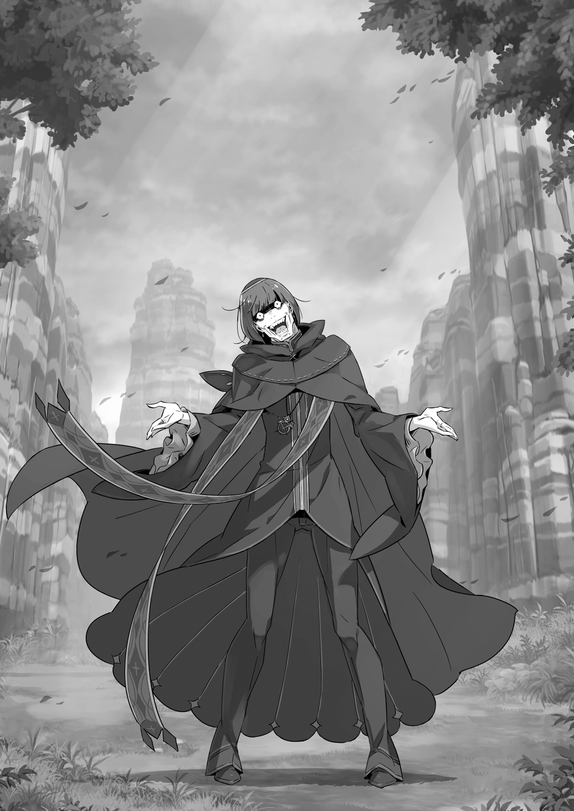
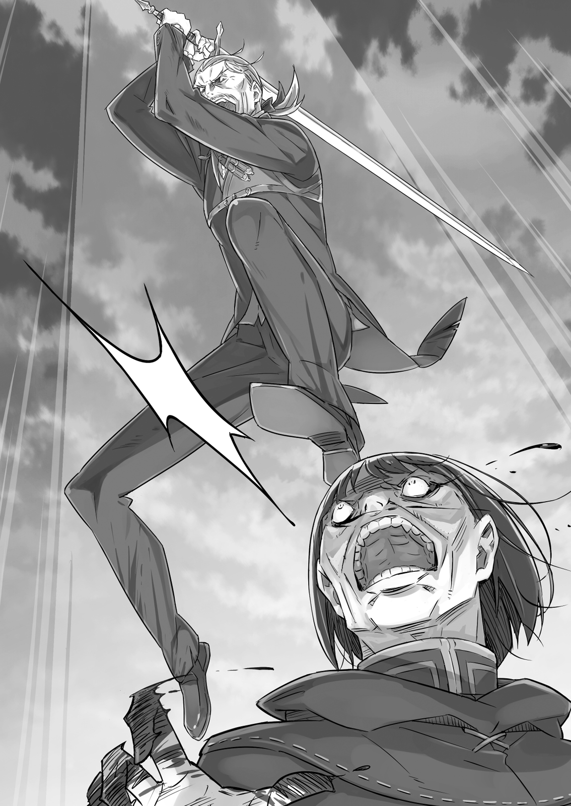

## 1
«Ничего сложного, даже обезьяна справится» — с такими мыслями Субару Нацуки начал военный совет, посвящённый охоте на Культ Ведьмы.

Место действия — равнина Лифаус, время — за час до рассвета, участники — отряд, состоящий примерно из пятидесяти рыцарей и наёмников. Взгляды присутствующих были устремлены на Субару, что приводило юношу в волнение.

Рыцари-ветераны, внушающие трепет зверолюди-наёмники — все они принадлежали к чужому миру. Однако судьбе было угодно свести их с Субару, и теперь юноша находился в центре внимания.

Воины уселись кругом и приготовились слушать. Чтобы оказаться на этом месте, Субару прошёл через многое. Теперь он горячо рвался в бой, однако в душе его завывал ветер тревоги и страха.

«Да уж, чего удивляться…»

Он помышлял об этом после каждого Посмертного возвращения, но мечта оказаться среди таких людей представлялась несбыточной. Осознав, что добился желаемого, Субару поклялся использовать шанс на все сто процентов.

Юноша стоял, прижав руки к груди, пока его не окликнули:

— Субару, в чём дело? Почему ты вдруг замолчал?

Это был Юлиус Юклиус — красавец в белой форме рыцаря-гвардейца.

— Не верю, что ты испугался, дело ведь срочное. Сам же говорил, что нельзя терять ни минуты, разве нет?

— Да знаю… Не надо постоянно подкалывать меня. В таких случаях важно начать с правильных слов, а мне трудно подобрать их…

— Об этом не беспокойся! Всем и так известно, что на глазах у публики ты ведёшь себя неадекватно. Расслабься и просто будь собой.

— По-мол-чи!

Ха-ха-ха-ха! Острый же ты на язык, Юлиус! Совсем сконфузил парня!

Субару побагровел от гнева, когда ему напомнили о бесславном эпизоде из прошлого. Но стоило Рикардо, командиру отряда зверолюдей «Железный клык», с улыбкой прокомментировать слова Юлиуса, как на лицах рыцарей карательного отряда появилось сочувственное выражение.

Похоже, о скандале, который Субару учинил в королевском замке, знало гораздо больше людей, чем полагал юноша.

— Как вспомню, хочется провалиться сквозь землю…

— Ну всё, всё, Субарунчик, хватит терзаться! Ты должен смыть свой позор, теперь это вроде как твой долг… Юлиус, мне понятно желание поддеть Субарунчика, однако всё же постарайся следить за тем, что говоришь.

— По-видимому, ты меня неверно понял, Феррис, —тут же отозвался Юлиус. — У меня и в мыслях такого не было! Разумеется, я буду только рад, если в конечном счёте это пойдёт на пользу его ораторским способностям.

— Хитрый приёмчик, ничего не скажешь… — вздохнул Феррис, совершенно раздосадованный.

Видя его реакцию, Субару наконец понял, чего добивался Юлиус, и это его огорчило не меньше, чем Ферриса.

— Дружеские беседы прекрасны. Но я всё-таки считаю, что в первую очередь нужно обсудить план борьбы с Культом Ведьмы. Полагаю, следует начать прямо сейчас.

Вильгельм, напомнивший о цели собрания, имел крайне серьёзный вид. Среди всех соратников именно на Дьявольского Мечника Субару возлагал самые большие надежды.

Не только как на опытного воина, но и как на человека, к которому питал симпатию. Следуя законам чести, Вильгельм теперь поддерживал Субару, ведь юноша помог ему расправиться с заклятым врагом — Белым Китом.

«Союз борцов с Ведьмой» насчитывал порядка пятидесяти воинов, в него входили уцелевшие бойцы из карательного отряда и подкрепление из «Железного клыка».

— Ну, следуя совету Вильгельма, не будем терять времени и перейдём к главному. Итак, охота на Ведьму под силу даже обезьянам… По сути, ничего сложного. Знаете, чем проще стратегия, тем лучше результат…

— Справедливо. И в чём заключается стратегия?

— Если коротко, надо нанести упреждающий удар, захватить главаря и таким образом вырвать победу. Вот…

Схема Субару повергла всех в замешательство. Предложение юноши звучало весьма дерзко, ведь главарём являлся не кто иной, как сам греховный архиепископ, руководящий Культом Ведьмы.

Рикардо прервал ропот, нараставший среди присутствующих:

— И впрямь всё просто! Если нам повезёт, мы нанесём Культу Ведьмы смертельный удар.

Могучий представитель расы полулюдей осклабился, выставив напоказ острые клыки.

— Но должен подчеркнуть, — продолжил он, коснувшись клыка пальцем, — лишь в том случае, если повезёт лам. Болтать и делить шкуру неубитого медведя все мастера!

Субару в ответ самоуверенно заявил:

— Разумеется, у меня есть план! Сами видели, я не настолько безбашенный, чтобы идти на Белого Кита, не имея соответствующего гарпуна!

— В этом мы убедились и хотим поскорей услышать детали! — проревел Рикардо, сверкая клыками. Остальные, по-видимому, были того же мнения. Взгляды воинов ясно свидетельствовали о том, что вся надежда на план Субару.

— Ладно, теперь по порядку. Во-первых, Культ Ведьмы скоро нападёт на поместье Мейзерса, где живёт Эмилия. Я установил это по различным косвенным сведениям. В этом никто не сомневается?

— Как раз об этом всё и говорит, — подтвердил Юлиус. — Тут я с тобой соглашусь. На самом деле, мы предполагали, что в поместье Мейзерса случится нечто, связанное с Культом Ведьмы. И появление Белого Кита лишь подтверждает нашу гипотезу.

— То есть Культ Ведьмы с помощью Белого Кита заблокировал тракт, чтобы атаковать поместье Мейзерса, р-мяу? —задумчиво проговорил Феррис. — Похоже, серьёзно взялись за дело. Хотя, судя по учению, которое они исповедуют, этого следовало ожидать-мяу…

Культ Ведьмы скрывала завеса тайны, однако подоплёка секретной деятельности фанатиков была известна: они люто ненавидели полуэльфов. Став претенденткой на престол, Эмилия открыла своё происхождение, и адепты решили напасть на поместье Мейзерса.

Итогом той бессмысленной жестокости стала гибель целой деревни. Субару искренне считал, что адепты Культа заслуживают одного — смерти!

— Эти гады хотят убить Эмилию, но не думайте, что других они пощадят. Они убивают всех без разбора — и женщин, и детей.

Не сомневаюсь, — кивнул Юлиус. — И это приводит меня в ярость!..

В глазах рыцаря зажёгся огонь праведного гнева. Похоже, в этом мире все считали Культ Ведьмы воплощением зла.

— Я хочу спасти Эмилию, обитателей особняка и, разумеется, жителей деревни. Прежде я думал, что мы вторгнемся во владения Мейзерса и затаимся в особняке…

— Культ Ведьмы может появиться в любой момент и так же внезапно исчезнуть. Выжидать в особняке — не лучшая стратегия.

— Поэтому я от неё и отказался.

Держать оборону в особняке с имеющимися силами —всё равно что выбрасывать на ветер единственный козырь. Если события пойдут по новому сценарию, то информация, полученная с помощью Посмертного возвращения, в мгновение ока потеряет ценность. Трудно сказать, что сделает Петельгейзе, когда вооружённый отряд всей оравой ворвётся в особняк. Вероятно, архиепископ изменит план атаки или отсрочит её. И для того чтобы использовать преимущество по максимуму…

— Мы затаимся в лесу и неожиданно нападём на Культ! Они готовят упреждающий удар, но мы опередим их и размажем ещё раньше!

— Звучит неплохо, но как мы отыщем адептов в лесу, р-мяу? Эти ребята четыреста лет подряд совершают злодеяния по всему свету, но их так и не удалось схватить. Тут нужна недюжинная хитрость.

— Ты прав… Мы применим ту же уловку, что и с Китом.

Что, р-мяу?.. — И без того немаленькие глаза Ферриса стали ещё больше.

— Чтобы приманить Кита, я воспользовался своим запахом, верно? Тот же фокус я могу проделать и с Культом Ведьмы!

Повисла тишина.

— Понимаю вас, физические особенности моего организма могут шокировать… Я и сам страдаю от этого, уж поверьте, ха-ха!.. Ха-ха-ха…

В гробовой тишине раздавались только сухие смешки Субару. Терпеть безмолвие, воцарившееся над равниной, было невыносимо. Юноша не знал, почему он притягивает зверодемонов и последователей Культа Ведьмы, и никак не мог объяснить происходящее. Особенность эта просто существовала, и Субару использовал её в своих интересах.

Когда-нибудь Субару выяснит природу этого явления, и, быть может, она покажется ему отвратительной… Но сейчас он воспользуется тем, что имеет, ведь выбора нет…

— Я прекрасно понимаю: моей истории не хватает убедительности.

Оглядев безмолвствующих рыцарей и зверолюдей, Субару сказал то, что пришло на ум:

— Вы можете заявить: он несёт чепуху, это вздор! И ваша реакция будет понятна. Но всё-таки…

— Мастер Субару…

— Я хочу, чтобы вы поверили мне! Да, раньше я вёл себя как последний кретин, но сейчас говорю на полном серьёзе! Я решил идти до конца и прошу, чтобы вы помогли мне!

Субару много раз протягивали руку помощи, но он с пренебрежением отвергал её, упорно настаивая на своём. А сейчас он впервые осознал, что находится в действительно тяжёлом положении.

Перед ним стояла задача, требующая решения, однако юноша был слишком слаб и неопытен. В одиночку он не мог сделать даже шага и остро нуждался в помощи.

— Я склоняю перед вами голову. Голова у меня одна, и больше мне склонить нечего. Но если одной головы достаточно, я готов кланяться сколько угодно, лишь бы вы помогли мне!

Субару отвесил глубокий поклон. Окружающие безмолвствовали, и только ветер шелестел травой, покрывающей равнину. Так продолжалось несколько секунд, пока вперёд не вышел второй командир «Железного клыка» — получеловек-полукотёнок по имени Тиви.

Поправив на симпатичной мордашке монокль, он пристально посмотрел на Субару:

— Твои доводы ясны, но нет никаких доказательств. Как мы можем поверить… Ай!

— Что тебя так смущает, а, Тиви?!

Не успел Тиви устроить суровый допрос, как стоявшая рядом Мими одним ударом прервала его речь. Хлопнув брата по спине и глядя, как тот согнулся, старшая сестра простодушно улыбнулась:

— Ведь он же того-о! Сделал о-очень много, чтобы прикончить огромную рыбину! Разве человек, который так помог, станет нас обманывать? Конечно же не-ет!

— Сестричка, лучше помолчи! Это серьёзный разговор…

— Вот ты всегда так! Хитря… Мм? Хитря? Хитрё? Хитрю?..

— Хитрюга?

— Да, и-именно! Будешь продолжать в том же духе —не вырастешь! — отчитала Мими младшего брата, глаза которого уже были на мокром месте.

Тиви понурился, а Мими продолжила:

— Просто ты, Тиви, не дрался с той огромной рыбиной. Раз уж не веришь Субару, поверь хотя бы своей сестре!

Тиви ничего не ответил.

— Если ты веришь мне, может, заодно поверишь и ему? В случае чего я не дам тебя в обиду! — Мими гордо выпятила грудь.

Ошарашенный обещанием сестры, Тиви тут же сник. Глядя на парочку, окружающие дружно рассмеялись.

Из-за неожиданного хохота Мими смутилась:

— Вы чего-о?

— Не бери в голову! Ты молодец, всё правильно сказала! —ответил сквозь смех Рикардо. Он погладил широченной ладонью Мими по голове, и хрупкая девочка едва устояла на ногах. — Многое меня смущает, но, раз уж мы все здесь, сомневаться в Субару неправильно. Это давно пройденный этап.

От удивления юноша разинул рот. Затем, будто желая подтвердить слова Рикардо, Вильгельм сделал шаг вперёд и сказал:

— Мастер Субару, мужчине не пристало склонять голову по любому случаю. Обращаясь к кому-то с просьбой, смотрите в глаза. Если бы вы держались прямо, наверняка заметили бы сами… — Сохраняя серьёзное выражение лица, Дьявольский Мечник указал подбородком на воинов.

Субару послушно оглядел присутствующих и увидел, что воины смотрят на него с той же надеждой, что и прежде. С начала этого собрания их лица ничуть не изменились.

— Послушай, р-мяу, из-за твоего молчания мы чувствуем себя не в своей тарелке. В конце концов, никто и не думал подвергать твои слова сомнению! — произнёс Феррис, со скучающим видом теребя свои локоны.

Возражений не последовало, а это значило, что все были согласны с Феррисом. Даже Юлиус, поймав взгляд Субару, изящно кивнул.

— К тому же именно стратегия Субарунчика помогла нам добить Белого Кита. Госпожа Круш сделала на неё ставку. Выходит, сомневаясь в Субарунчике, мы сомневаемся в госпоже Круш, а это не в моих правилах-мяу!

— Другого от Ферриса и ожидать не стоило, — сказал Вильгельм, — но важнее то, что мастер Субару завоевал доверие собственными действиями. И с этим согласится каждый, кто участвовал в сражении!

— Но… но… старик Вил! — Голос Ферриса сорвался на возмущённый фальцет.

— В том числе и я, разумеется.

Дьявольский Мечник энергично кивнул Субару, не обращая внимания на вспыхнувшего рыцаря.

Поняв, что его опасения беспочвенны, юноша покраснел от смущения:

— Какой я невежа… Когда же научусь читать между строк?

— Так ведь читать нужно строки, а не между ними!

— Замолчи! Знаю! Тебе самому не мешало бы научиться!

Вспылив в ответ на замечание Юлиуса, Субару сбросил напряжение.

Он снова опозорился, но получил за это неплохое вознаграждение.

— Мастер Субару, вы заслужили доверие своими делами.

Заслуг юноши оказалось достаточно, чтобы воины верили ему, даже не зная главного. Подобно Рем, преданной Субару несмотря ни на что, собравшиеся хоть и были несколько озадачены, но не сомневались в истинных мотивах юноши. Только надеясь на их безграничное расположение, он мог поведать о том, что узнал благодаря Посмертному возвращению.

## 2
— Да не плачу я! Просто подумалось: наконец-то судьба воздала мне за все тяготы и лишения, и вдруг из глаз потекла щелочная вода, содержащая белки. Только и всего! Не поймите неправильно!

Наконец Субару совладал с бурей чувств и перешёл к главной теме:

— Раз мне все верят, это значительно упрощает задачу. Итак, суть в том, что от меня исходит запах, привлекающий и зверодемонов, и Культ Ведьмы.

— Мы приманим адептов и порешим всю компанию одним махом? Прекрасный план, если только ты представляешь, как его реализовать. Какие, по-твоему, у нас шансы?

— Шансы?..

— Вероятность того, что они действительно почувствуют твоё присутствие, — впервые озвучил свои сомнения Юлиус. До сих пор рыцарь никак не возражал.

Участники операции против Белого Кита прекрасно знали, как работает приманка, роль которой исполнял Субару. Однако Юлиус и другие воины, присоединившиеся позже, не были свидетелями тех событий. Неудивительно, что они желали знать подробности, ведь вскоре им предстояло рискнуть собственными жизнями…

— Мы должны быть уверены, что запах сработает. Что скажешь?

— Вероятность, что Культ клюнет, сто процентов! Гарантирую!

— Весьма смелое заявление!

— И не говори! Но они не могут не клюнуть, даже не сомневайся.

Слова Субару трудно было назвать обоснованными, однако по части самоуверенности с ним вряд ли кто-либо мог тягаться. Юноша ни секунды не сомневался в знаниях, что получил, пройдя через Посмертное возвращение. И эта уверенность была единственным его преимуществом.

— Ты, кажется, уже встречался с Культом Ведьмы. Верно?

— Да. Худшая встреча в моей жизни. То, что они устроили… Больше я такого не допущу!

Строго говоря, эта встреча должна была произойти в будущем. И она обязательно случится, если только Субару не изменит само будущее, а вместе с ним и свою судьбу. И ради этого он здесь.

— Понятно. Хорошо, значит, мы привлечём их, используя тебя как приманку, — заключил Юлиус.

— Не ожидал, что так легко согласишься!

Если думаешь, что я собираюсь вставлять палки в колёса, то заблуждаешься. Я просто хотел понять, готов ли ты руководить такой опасной операцией. И если бы ты колебался, пришлось бы придумать что-то другое.

— Мечтай! — фыркнул Субару, гоня от себя чувство тревоги. — Мне уже поздно хвост поджимать!

Дать слабину означало подтвердить опасения Юлиуса. Помня об этом, Субару гордо поднял голову:

— Заявляю со всей решительностью: Культ Ведьмы обязательно клюнет! И греховный архиепископ тоже. Как только появятся, зададим им трёпку. Всё просто!

— Звучит и впрямь незамысловато… Смотрю, Субарунчик, тебя хлебом не корми — дай побыть приманкой. Что тогда, в сражении с Белым Китом, что сейчас.

— Ничего подобного! Просто так совпало, что мне два раза подряд выпало играть роль приманки. Но это не значит, будто я только…

Субару вспомнил, как на воровском складе спровоцировал Эльзу на бой, а потом в лесу со зверодемонами приманивал вольгармов. Разобравшись с тварями, он стал наживкой для Белого Кита. Та же роль была отведена ему и в битве с Культом Ведьмы.

— Ничего себе! Я что, и впрямь каждый раз являюсь приманкой?!

— Стало быть, у тебя богатый боевой опыт с реальными результатами. Надеемся, и в предстоящей схватке не подведёшь.

— Не подведу! Я не подведу, просто…

Субару вздохнул. Хотя Юлиус разозлил его, юноша понимал, что сам даёт громкие обещания.

— В общем, теперь, когда моя роль определена, нужно всё просчитать. Культ Ведьмы будет скрываться в окрестностях особняка и деревни. Это точно, ведь другого подходящего места нет.

— Потому что дальше всё покрыто Туманом…

— При помощи Тумана адепты изолировали поместье Мейзерса от остального мира. И единственное, что им остаётся, — затаиться на территории поместья. Так, отрезав пути отступления, они сами себе вырыли яму!

На этот раз Субару не требовалось что-то объяснять, поскольку Белого Кита видели все. Зверодемон появился потому, что этого пожелали адепты Культа. Однако цели они не добились: Белый Кит оказался убит…

— Мы уничтожили Кита вскоре после его появления и настигнем Культ прежде, чем адепты поймут, что произошло.

— Тогда мы должны действовать очень быстро, — заметил Вильгельм.

Если наши клинки настигнут врагов, что прячутся в лесу, победит сильнейший. Лично от меня не так уж много пользы, но, благодаря воинам карательного отряда, наёмникам «Железного клыка» и мастеру Юлиусу, у нас, полагаю, есть все шансы на победу.

— Вот именно! — согласился Субару, представив военную мощь своих союзников.

Разумеется, недооценивать Культ Ведьмы, возглавляемый Петельгейзе, было бы неразумно. Но войско Субару, одолевшее Белого Кита, состояло из храбрейших бойцов.

Да и Петельгейзе не обладал исключительной мощью, с которой невозможно справиться.

Если дело дойдёт до рукопашной, Субару сам ринется в бой. Ну а Вильгельму хватит одного взмаха меча, чтобы снести врагу голову. Иными словами, всё зависит от того, насколько выгодную позицию они займут. Это и определит исход решающей схватки.

— Если мы нападём из засады, на нашей стороне будет огромное преимущество!

Ведь Петельгейзе не ждёт удара исподтишка. Адепты всегда атаковали первыми. Культ Ведьмы являлся воплощением дикости, театром абсурда. Очевидно, греховному архиепископу и в голову не приходило, что кто-то способен ему угрожать.

«Мы собьём с тебя спесь», — предвкушал Субару.

Быть может, до сих пор вам и удавалось проворачивать тёмные делишки… Но теперь чёрта с два у вас получится!

Последние слова Субару произнёс так твёрдо и уверенно, что на лицах воинов заиграли желваки. Они осознали: предстоящая битва может стать возмездием злобной шайке под названием Культ Ведьмы.

— Я проникну во владения Мейзерса и выкурю адептов из леса. Но архиепископ очень коварен, подчинённых он разделит на десять групп.

— Откуда ты знаешь?

— Я уже сталкивался с этим представителем Лени. Своих людей он называет «пальцы». Например, правый средний палец, левый безымянный палец и так далее. По этим прозвищам он их и различает. Какие именно пальцы, на руках или на ногах, он не уточнял, но не думаю, что групп двадцать.

Субару не выяснял, сколько у безумца на самом деле пальцев, но, вероятно, их было десять, как у нормального человека. И похоже, количество групп, на которые он разделял подчинённых, также равнялось десяти.

Среди воинов пробежал взволнованный шёпот. Реакция удивила юношу, но, когда заговорил Юлиус, Субару понял, в чём дело.

— Субару, упоминая противника, с которым у тебя давние счёты, ты имел в виду греховного архиепископа? И ещё: Лень, о которой ты сказал, тоже имеет отношение к нашему плану нападения?

— Извини, я недостаточно подробно объяснил. Да, греховный архиепископ, которого мы собираемся атаковать, представляет Лень. Он и есть тот враг, с которым мне нужно поквитаться. Больше всего на свете я ненавижу его мерзкую рожу!

— Хм… А на втором месте, наверное, моё лицо? — пошутил Юлиус.

— Много на себя берёшь! Больно ты мне нужен! — возразил юноша с ироничной улыбкой.

В рейтинге мерзких физиономий, составленном Субару, второе место после Петельгейзе занимало его собственное лицо. К Юлиусу он тоже не испытывал симпатий, однако двойка лидеров оставалась, как правило, неизменной.

— Хлебнул я горя из-за этого подонка! Зато теперь точно знаю: во-первых, мой запах работает, во-вторых, архиепископ разделяет своих подчинённых на «пальцы».

— Теперь ясно, р-мяу, почему ты такой самоуверенный. Полагаю, о том, что произошло между вами, лучше не спрашивать?

— Да, буду признателен. Всё, что нужно, я расскажу сам.

— Ла-адно. Чувствую, даже если спрошу, не услышу ничего приятного.

Феррис видел, что в Субару закипает гнев, когда тот говорит о Культе Ведьмы, и в глубине души сочувствовал юноше. Вероятно, рыцарь полагал, что способность Субару источать запах, привлекающий нечисть, связана с жуткими событиями из его прошлого. Хотя это было не так, Субару не посмел внести ясность.

— Мой план атаки, конечно, не идеален, поэтому я подстраховался. Перед тем как отправиться на битву с Белым Китом, я обратился с просьбой к Анастасии и Расселу.

— Хочешь, чтобы сеньора тебя подстраховала? Задумали какой-то хитрый трюк? — осведомился Рикардо с самым что ни на есть подозрительным видом.

— Да обычное дело! — огрызнулся Субару. — Хорошего же ты мнения о своей хозяйке! В общем, я попросил Анастасию и Рассела сообщить кое-что жителям деревни, находящейся неподалёку от тракта. А именно, что граф Мейзерс хочет нанять странствующих торговцев, владеющих драконьими повозками. И что он приобретёт весь их груз за ту цену, которую они сами назначат.

— Хо-хо! Каков транжира! — заметил Рикардо.

— Определённо, такое решение ударит по карману, но он сделает это ради спасения своих людей. Тем более самого Розвааля в нужный момент, как назло, не будет рядом.

Если не скупиться, можно набрать необходимое количество извозчиков. Все расходы, конечно, лягут на плечи Розвааля, но, как не раз упоминал Субару, граф сам виноват, что не в состоянии защитить свои земли.

Во всяком случае, на этот раз Субару сделал всё возможное, чтобы Эмилия и жители деревни избежали расправы.

— Но есть одна сложность… Культ ни в коем случае не должен догадаться о наших планах, поэтому необходимо перехватить нанятых торговцев.

— Согласен, если хотим застать адептов врасплох, следует принять определённые меры предосторожности. Наверное, стоит послать навстречу торговцам наших людей, хорошо знакомых с ситуацией, чтобы те ввели их в курс дела. Тиви?

— Понял. Если сеньора тоже участвует в операции, полагаю, лучше отправить кого-нибудь из наших. На задание пойдут четверо, жду указаний.

— Прекрасно! Большое спасибо!

Когда Юлиус и Тиви договорились, Субару облегчённо вздохнул.

— И ещё: чтобы сообщить Эмилии о заключённом союзе и подкреплении, Круш отправила посланника в особняк Розвааля. Иначе поднялся бы переполох.

— А, личное письмо! Феррис хлопнул в ладоши. — Значит, ты его написал!

Хотя точнее было бы сказать «написали под твою диктовку». Письмо, в котором говорилось о заключённом союзе и о борьбе с Культом Ведьмы, помогла составить Рем. Субару не настолько овладел местной грамотой, чтобы писать о сложных вещах.

Если письмо дошло до особняка, в случае опасности Эмилия и другие его обитатели будут знать, что делать. И даже если придётся спасаться бегством, они подготовятся к этому заранее.

— Ну вот, кажется, всё рассказал. Как видите, план подразумевает много дополнительных действий, но, вероятно, вы уже поняли, какое значение имеет эта битва, — подытожил Субару.

— То есть мы располагаем великолепной возможностью застать Культ Ведьмы врасплох!

Сложив на груди мохнатые руки, Рикардо разразился диким хохотом. При этом все члены отряда почувствовали прилив боевого духа.

— Давненько мы не бросали такой вызов Культу!., — произнёс Вильгельм, опустив взгляд.

От Дьявольского Мечника исходила раскалённая волна агрессии. Культ Ведьмы, использовавший в своих грязных целях Белого Кита, был так же ненавистен ему, как и сам зверодемон. И в эту минуту больше всего на свете Вильгельм желал вступить в схватку с адептами. В том, что бой необходим, он не сомневался.

— Сначала вы помогли мне осуществить заветную мечту, а теперь даёте возможность сразиться с Культом. Мне уже не терпится!

— Я рассчитываю на вас, Вильгельм.

— Не подведу! коротко ответил тот.

Вильгельм снова был одним целым с мечом, что висел на поясе. Глядя на старика, Субару ощутил безграничное доверие к нему. Затем юноша обвёл взглядом войско в пятьдесят бойцов. Вместе с этой командой сражаться было не страшно. Стоило Субару так подумать, как слова пришли сами собой:

— За нашими плечами изнурительная битва с Белым Китом. Любой из нас мог погибнуть, а кто-то действительно погиб, другие же исчезли и больше никогда не вернутся домой…

Ожесточённое сражение с Белым Китом унесло жизни многих, и Туман навсегда стёр их имена из летописей этого мира.

Они были такими же, как я или вы, но судьба их не попылила.

Победа над Туманным Зверодемоном обошлась недёшево.

«Белый Кит подобен природному бедствию, которое крушит все подряд, не имея злого умысла. Следовательно, между павшими и выжившими нет существенной разницы», — думал Субару.

Сам того не желая, юноша превратился в оратора, напутствующего воинов перед боем. Все слушали его затаив дыхание, словно в ожидании обязательных наставлений. Таких же наставлений, какие давала им Круш перед походом на Белого Кита. Тогда она говорила, что в бою нет места милосердию, что смерть поджидает любого, независимо от статуса и звания, и что все должны биться не щадя живота своего…

Но Субару, как известно, нс понимал настроения окружающих.

— Наши жизни висели на волоске. Однако из того сражения мы вышли победителями, и вот мы здесь. Значит, сумеем и на этот раз! Давайте одержим победу без единой жертвы! Давайте выживем и вернёмся домой! Мы справились с настоящим чудовищем — с Белым Китом! Что нам стоит победить какой-то Культ Ведьмы?!

Но то были голубые мечты юнца, не знающего жизни. Увы, на поле боя не избежать жертв, сколь бы выгодной пи была твоя позиция. Субару и сам догадывался об этом, но воины познали горькую истину на собственном опыте. Бойцы не просто были готовы умереть — они воспринимали гибель как неизбежный атрибут сражения. Субару видел это, но такой подход ему претил.

— Я хочу, чтобы все вы остались живы! Нет ничего абсурднее, чем умереть от рук этих подонков!

Умирать страшно. Смерти всегда сопутствуют невыносимый страх и ощущение потери. Субару полагал, что подобное чувствует каждый. Иначе и быть не могло. Посмертное возвращение заставило его несколько раз перешагнуть через этот рубеж, и он никому не желал подобного. Поэтому всеми силами Субару отрицал смерть.

Последние слова его речи произвели эффект разорвавшейся бомбы. Субару обвёл взглядом недоуменные лица воинов. Ведь, как ему было сказано, если мужчина о чём-то просит, он должен смотреть собеседнику в глаза.

— Итак, я прошу об одном: позвольте положиться на вас! Вы — единственная моя надежда!

## 3
— Самых известных греховных архиепископов два: архиепископ Лени и архиепископ Алчности, — сказал Юлиус, когда его дракон поравнялся с драконом Субару.

Их звери бежали ноздря в ноздрю, поэтому разницу между всадниками было видно невооружённым глазом. Субару стоило немалых трудов удержаться верхом на вороной драконихе, которую он нарёк Патраш, а Юлиус восседал на своём звере легко и грациозно.

— Вот поэтому ты мне и не нравишься!..

— Сделаю вид, что я этого не слышал. Итак, продолжим. О греховных архиепископах наслышаны все, но те двое — самые знаменитые. В летописях чаще всего фигурирует Лень, но если оценивать масштаб нанесённого ущерба, то тут нет равных Алчности.

— То есть один давал о себе знать чаще других, а второй причинял больше вреда. Похоже, ничем хорошим эта парочка не прославилась…

— Верно, — угрюмо подтвердил Юлиус, словно разговор о Культе Ведьмы пробудил в нём горькие воспоминания. —Судя по сохранившимся записям, архиепископ Лени, с которым ты столкнулся, участвовал более чем в половине преступлений Культа Ведьмы. Если учесть масштаб деятельности Культа, такая прыть поистине удивительна.

— Так этот гад суёт свой нос по всему миру?

— Точнее и не скажешь. Для того, кто олицетворяет Лень, он весьма прилежен и трудолюбив. Его бы энергию — да в мирное русло… Но этому сумасшедшему уже ничто не поможет…

Перед мысленным взором Субару возникла физиономия безумца: глаза сверкали дьявольским блеском, щёки впали. Греховный архиепископ Лени, Петельгейзе Романе-Конти, горячо убеждал всех в своей прилежности и требовал от других такого же рвения. Олицетворяя Лень, сам Петельгейзе люто её ненавидел. И многочисленные его вылазки доказывали это.

— Горько признавать, но рыцарям почти ничего не удалось разузнать о Культе. Весьма трудно пролить свет на тех, кто ведёт тайный образ жизни. Мы можем говорить о причастности Культа лишь по факту нанесённого ущерба, и то после соответствующей проверки. Да и в этом случае нам остаётся наблюдать ужасную картину, напоминающую выжженное поле.

— Та же проблема, что и со стражами порядка, которые не могут расследовать преступление, пока оно не произошло. Понимаю тебя…

Юлиус был так раздосадован, что у Субару даже пропало желание злословить. Да и упрекать рыцарскую гвардию в неумении вести расследование тоже было некстати. Уж если кого и следовало винить, то, бесспорно, лишь Культ Ведьмы!

— На этот раз всё будет иначе.

В разговор вклинился Вильгельм, поравнявшийся с Субару с другой стороны. Дьявольский Мечник ехал верхом на своём любимом драконе, пристально вглядываясь вдаль.

Глаза старика по-прежнему горели желанием ринуться в бой. Он неторопливо опустил руку и коснулся висящего на поясе фамильного меча.

— На этот раз не уйдут, мы их прижмём! Заставим заплатить за все злодеяния, как заставили Белого Кита. Этого желает народ королевства, и это заветная мечта рыцарей.

— Всё будет так, как вы говорите! Негодяи до сих пор избегали кары, однако теперь они получат сполна. Уверен, возмездие не за горами, — согласился с Вильгельмом Юлиус.

Как ни странно, рыцарь не пытался скрыть гнев, и черты его лица стали жёстче.

Основания ненавидеть Культ Ведьмы были не только у Субару. Юлиус и другие подданные Лугуники долгие годы жили бок о бок с этими приспешниками дьявола.

— Кстати, почему мы всё о Лени? А что говорят о другом знаменитом архиепископе, Алчности?

— В отличие от архиепископа Лени, он оставил немного свидетельств о нанесённом вреде. Но, несмотря на малое количество упоминаний, ущерб он причинил огромный. Особо архиепископ Алчности прославился, пожалуй, происшествием в империи.

— «Особо прославился»? В смысле нанёс самый большой ущерб? — спросил Субару, скривившись.

Юлиус кивнул:

— В южной части материка, в империи Волакия, находится крупный город Гаркла, известный как самая надёжная крепость империи. Цитадель, окружённую стенами, защищает многотысячная регулярная армия. Однако Алчность захватил и её. Причём в одиночку!

— В одиночку? Целый город?!

Назвать такого захватчика богатырём — слишком слабо! Событие и впрямь было из ряда вон, так что у Субару отвисла челюсть.

— «Солдат должен быть крепок и духом, и телом», — процитировал Вильгельм. — Так говорят в империях, и даже рядовой в бою превращается в сущего дьявола! Подобные солдаты и защищали город-крепость, однако они пали под натиском одного-единственного греховного архиепископа Алчности. История гласит, что он убил даже Кургана по прозвищу Восьмирукий, героя Волакии.

Упоминание Кургана, павшего в битве с архиепископом Алчности, вызвало в старике смесь противоречивых чувств.

Субару заметил это по его взгляду. Вильгельм закрыл глаза и продолжил:

— Однажды нам с Курганом довелось скрестить мечи… Случилось это во время дуэли. Желая избежать кровопролитной войны, каждая страна избрала мечника, и мы сошлись и поединке. Он был прекрасным бойцом. Я отрубил ему шесть рук из восьми, но сам был ранен в живот. Мы находились па краю гибели, поэтому поединок закончился ничьей.

— Впечатляющая история!

Эпизод из боевого прошлого Дьявольского Мечника, будто описанный в ранобэ, взбудоражил воображение Субару. Юноше захотелось узнать подробности, но он не стал бередить старые раны Вильгельма. Хотя Субару и был нечувствителен к таким вещам, он прекрасно понимал: мечнику не доставит радости рассказывать о том, как его чуть не прикончил этот, без сомнения, достойный противник.

Как ни крути, архиепископ Алчности сам по себе был для Субару серьёзной головной болью.

— Лень, Алчность… А ещё есть Гордыня, Похоть, Гнев… Нелёгкие меня ждут времена. Даже с учётом отсутствия Чревоугодия!

— Уже смотрите в будущее?

— Должен сказать, оно меня совсем не вдохновляет. Но столкнуться с ними, вероятнее всего, придётся.

Субару представил скорую встречу с архиепископом Лени, и от этой картины у него заныло в груди. Поединка с Петельгейзе не избежать, а значит, будут битвы и с другими греховными архиепископами.

— Только подумаю об архиепископе Алчности — сразу живот болит. Спасите меня!..

— Не знаю, зачем ты изводишь душу мыслями о будущем. Оно туманно. Лучше сосредоточься на предстоящей битве. Не ради кого-то, но ради Эмилии.

— Да, знаю. Но когда на носу реальный бой, меня пробирает нервная дрожь.

Субару стал смотреть на дорогу прямо перед собой. Далеко на востоке небо начинало светлеть: солнце разгоняло ночную тьму.

Отряд уже ступил на землю Мейзерса. Всадники были исполнены боевого духа. Воины мчались по равнине, отважные и решительные. Судя по виду, безрассудная просьба Субару их нисколько не смущала, и от этого на душе у юноши становилось легче.

Субару решил во что бы то ни стало сохранить жизни членов отряда. В битве с Культом Ведьмы не должен пасть ни один воин! И ради этого он сделает всё возможное.

— Впереди такая важная схватка, но единственное, на что я гожусь, быть приманкой…

— Ты что-то сказал?

— Нет, ничего! Просто думаю, встретился ли уже наш летучий отряд с торговцами…

— Ясно. Не волнуйся, ребята своё дело знают. Даже лучше, чем ты думаешь.

Слова Юлиуса были неожиданно обнадёживающими, и Субару не нашёлся что ответить. Рыцарь выглядел абсолютно спокойным, поэтому Субару остро ощутил свою ничтожность. Однако, прежде чем юноша принял беззаботный вид, вдалеке наметилась некоторая перемена.

— А вот и он, — произнёс Юлиус, не сводя глаз с пейзажа, что был прямо по курсу.

Субару кивнул:

— Ага.

В предрассветных сумерках тракта показалась тусклая зелень деревьев. Это был большой лес, окружавший особняк Розвааля и деревню Эрлхэм. Выходит, совсем скоро Субару снова встретится с гадким безумцем, и эта встреча выльется в полномасштабную войну с Культом Ведьмы!

В груди Субару возникло давящее чувство, точно такое же, как перед битвой с Белым Китом. Ощущение было не из приятных, и юноша прижал к груди кулак.

Затем, чтобы придать себе душевных сил и прогнать страх, он улыбнулся, оскалив зубы, и вымолвил:

— Ну что, посмотрим, кто кого?! Меня не испугаешь, госпожа Судьба!

## 4
Субару осторожно ступал по скользкой тропе мрачного леса, чувствуя под ногами палые листья.

Идти приходилось по грязи, перешагивая через корни деревьев. Над головой в просветах крон виднелись синее небо и солнце, лицо обдувал тёплый, влажный ветерок, капли пота холодили лоб. Субару стёр пот тыльной стороной кисти и тяжело вздохнул.

Сейчас, в лесу, он был совершенно один, без чьей-либо поддержки.

Товарищи, с которыми Субару проделал долгий путь по тракту, предоставили его самому себе. Рядом с юношей не было даже ездовой драконихи Патраш. Субару шагал без оружия, с голыми руками и выглядел покинутым и беспомощным.

— Патраш я оставил. В этой битве ей не место, — вздохнул Субару, чуть улыбнувшись.

Дыхание становилось всё более сбивчивым. Он уже прошёл довольно приличное расстояние по недружелюбному лесу, огибая тонкие стволы деревьев и ступая по ломким веткам. Теперь Субару опасливо взбирался по склону, заросшему мхом. Это нельзя было назвать даже звериной тропой, настолько труднопроходимой оказалась местность.

Уже в третий раз Субару путешествовал по этому лесу. Прежде его руки были заняты ношей; выходит, сейчас, налегке, он должен продвигаться быстрее. Однако ногам было тяжелее, чем прежде, и он никак не понимал отчего.

— Может, дело в том, что я не перестаю поражаться своей глупости?.. Ведь делаю трижды одно и то же… Сегодня хотелось бы вернуться спокойно и без какой-либо ноши… —бормотал Субару, перескакивая через яркие грибы. Неожиданно в воздухе что-то изменилось.

Атмосфера стала напряжённей, но это было не то напряжение, что возникало при встрече с Эльзой или Белым Китом. Воздух принёс неприятное чувство липкости, и Субару вдруг живо ощутил, что пот, которого он прежде не замечал, покрывает всё тело.

— Как противно… Будто стоишь посреди комнаты и вдруг замечаешь в углу таракана.

Часто бывает, что натыкаешься на такого чёрного вредителя и между вами начинается таинственная психологическая дуэль. Кажется, тот, кто первым сдвинется с места, умрёт. Возникает невероятное ощущение: время тянется бесконечно и минута превращается в вечность. В такие мгновения тобою овладевает мучительный страх…

Подобный страх Субару испытывал сейчас. Он присмотрелся и обнаружил вокруг знакомый лесной пейзаж.

— Проходя множеством дорог, которые и дорогами-то не назвать, всякий раз оказываюсь тут. То ли это мой внутренний компас, то ли чутьё… Но, что бы это ни было, работает оно безупречно. Даже смешно…

А может, у Субару выработался нюх на зло? Словно у охотничьей собаки, натасканной на адептов Культа Ведьмы. Это сравнение было Субару по душе, хотя такого пса, как он, провалившего все задания, следовало бы назвать псом-неудачником… Но теперь юноша рассчитывал раз и навсегда избавиться от этого позорного звания.

Рад встрече, господа, — промолвил Субару, всматриваясь в полумрак.

Само собой, ни капли дружеских чувств он не испытывал.

Но тех, к кому он обратился, это не волновало, ведь они уже потеряли человеческий облик. Что же это за люди?..

— Даже если я спрошу, вряд ли получу ответ. Да, Ведьминские фанатики?

Субару был окружён несколькими тёмными силуэтами в чёрных одеяниях. В мгновение ока исчезли все звуки: шум ветра, стрекот насекомых. Это был характерный признак приближения адептов Культа. Поэтому встреча не испугала Субару своей неожиданностью. Наоборот, юноша испытал странное облегчение, поскольку сам этого желал.

— Как-то даже неловко, что вам пришлось идти сюда. Но я хочу поговорить с главарём. Так что не путайтесь под ногами!

Фигуры молчали.

— Признаться, я много чего не понимаю, и это не добавляет мне оптимизма, но всё-таки, похоже, я выше вас по рангу. Так что прочь с дороги!

С этими словами Субару сделал движение рукой, чтобы тени расступились. Неожиданно фигуры в чёрных балахонах почтительно склонили головы и удалились во мрак бесшумной, скользящей походкой. И снова всё произошло так, как он предполагал.

Эта сцена сбивала с толку: адепты не проявляли враждебности! Похоже, пока Субару не станет вести себя угрожающе или не поступят указания от Петельгейзе, они не нападут. Причина такого поведения была туманна, но Субару не горел желанием её выяснять.

— Эх… Если бы я мог приказать им собрать вещички и убраться в своё логово… Но разве они послушаются?

Субару горестно вздохнул. Нет, чудес не бывает… Юноша почти добрался до места назначения. Пейзаж был знакомым, а с разведывательным патрулём, которым и являлись фигуры в чёрных одеяниях, он уже встретился. Теперь, если ему не изменяла память, следовало просто идти вперёд.

До слуха Субару доносились лишь его собственное дыхание и звук шагов. Ему стало казаться, будто полутьме, сквозь которую он шёл, нет ни конца ни края. Но как только он подумал об этом, ощущение бесконечности исчезло.

— О…

Преграждавшие путь деревья расступились, и взору Субару открылся отвесный скалистый утёс, высоко вздымавшийся в небо. Лес кончился так неожиданно, будто его соскребли с поверхности земли гигантским когтем. Под скалой лежало несколько огромных валунов. Самый большой из них скрывал вход в пещеру, в которой прятался Культ Ведьмы.

Там, внутри, злобная шайка, вероятно, разрабатывала планы жестоких набегов.

Но, похоже, проникать в пещеру не было никакой необходимости, потому что…

— Я ждал тебя, ученик милости!

Раскинув руки и купаясь в волнах безумия и восторга, человек в рясе встречал Субару.

Ввалившиеся щёки, впалые глаза, тёмно-зелёные волосы, кожа нездорового, землистого цвета. Тонкие и хилые, похожие на сухие ветки конечности, торчащие из чёрной рясы…

Казалось, он был не старше тридцати пяти, но из-за болезненной внешности походил на старика.

Однако во взоре его плясал яркий огонёк, и этот взор, полный безумия, был обращён к Субару.

— Я — греховный архиепископ Лени, Петельгейзе Романе-Конти! — громко представился он, затем высунул язык, с которого капала слюна, и зашёлся скрежещущим смехом.

## 5
Петельгейзе отвесил глубокий поклон и снова залился оглушительным хохотом. Субару прижал руку к груди. Заклятый враг, Петельгейзе, стоял прямо перед ним, однако юноша был абсолютно спокоен.

— Удивительное дело…

Субару ненавидел Петельгейзе и желал ему смерти, поскольку считал архиепископа воплощением зла. Вероятно, за всю свою недолгую жизнь юноша ни к кому не испытывал такой сильной ненависти, как к этому человеку.

Сейчас в душе Субару непременно должны были гореть ярость и желание открутить Петельгейзе голову. Тем не менее, видя перед собой эту дьявольскую физиономию, он был совершенно спокоен.

— Приветствую тебя, баловень милости! Прекрасно… А-а, прекра-а-асно! Как же глубока любовь, в которую ты облачил себя! Как же высока любовь, в которую ты завернул себя! Как же горяча любовь, которую ты хранишь в себе! Благодарю! Безмерно благодарю тебя!

Петельгейзе был не в себе. Он тряс головой, рвал волосы; с тыльной стороны кистей капала кровь. Безумец находился в состоянии крайнего неистовства.

В первый раз Субару наблюдал его сумасшествие со страхом, во второй с глубокой неприязнью. Но теперь, в третий раз, юноша стоял перед безумцем, испытывая лишь гадливость.

Субару сосредоточился, сделал глубокий вдох и выдох, затем поднял руку в приветственном жесте и улыбнулся как можно дружелюбнее:

— Весьма признателен за тёплый приём! Честно сказать, пока я эту милость не особо ощутил…

— Ничего удивительного! Для многих это оказывается сюрпризом! Когда-нибудь наступит день, и каждый поймёт, что любйм! И, осознав это, уже не отпустит любовь! Да! Ведь именно любовь суть мироздание! — с радостью заявил Петельгейзе.

Он широко раскинул измазанные в крови руки и вновь принялся в своей сумасшедшей манере превозносить любовь — извращённо и прямолинейно:

— На любовь… данную нам любовь… я, нет, мы должны отвечать с прилежностью! Поэтому нам подарено испытание! Чтобы мир… чтобы время… Чтобы я отыскал смысл в ниспосланной Ведьмой милости! Ради любви! Любви, любви, любви, любви-и-и-и!

— Мы не должны лениться, верно? Чтобы искренне отблагодарить за любовь, мы должны быть прилежны.

— Совершенно… верно!

Субару сделал вид, что понимает, о чём идёт речь, и Петельгейзе залился восторженным хохотом.

Но ни понять это, ни тем более принять юноша никак не мог. Слушая бред архиепископа, он просто поддакивал, хотя в действительности ему не терпелось закончить этот разговор.

Однако Субару справился с бурлящей ненавистью и снова обратился к Петельгейзе. Требовалось выудить из безумца полезную информацию и для этого нужно было потянуть время.

— Так, собственно… Что я теперь должен делать? Это же хорошо… что мы встретились? Может, нужно соблюсти какие-то формальности или, например, бумаги подписать? Кстати, печати¹ у меня нет. Оттиск пальца сойдёт?

(¹ Речь идёт об именной печати, которую японцы используют для под­ тверждения личности. — Здесь и далее прим, перев. Речь идёт об именной печати, которую японцы используют для под­ тверждения личности. — Здесь и далее прим, перев.)

— Хм… Твоё намерение, твои взгляды, твои замыслы… превосходны!

Петельгейзе втянул носом воздух, проверяя, точно ли от юноши пахнет Ведьмой. Затем, скалясь восторженной улыбкой, он вытянул руки и показал Субару ещё целые и невредимые пальцы. Узловатые, похожие на сухие ветви, они трепетали.

— Ниспосланная тебе милость слишком глубока, чтобы ты прямо здесь присоединился к моим «пальцам»… Эта сладкая, насыщенная любовь Ведьмы! Насколько же она сильна? Если это Гнев, я просто завидую твоей милости… А может быть, ты Гордыня, а?

— Гордыня?..

— Сейчас не занято лишь одно место греховного архиепископа — Гордыни! Пока нет подходящей личности, у грехов недобор… Однако Гордыне из следующего поколения должны были достаться Ведьминские гены. Ты ведь получил Евангелие?

Петельгейзе сделал шаг к Субару и наклонил голову набок на девяносто градусов. Вопрос поставил юношу в тупик.

С одной стороны, он обрадовался вести о том, что место Гордыни вакантно. Но с другой — засомневался, его ли это место. Назваться Гордыней нетрудно, но стоит ли? Как в этом случае отреагирует Петельгейзе?

Опять же, оставалось загадкой, что собой представляет так называемое Евангелие. Секретное слово, употребляемое только в среде адептов? Или Петельгейзе решил его подловить? Если первое, то это не очень любезно по отношению к новенькому. А если второе, выходит, безумец затеял психологическую войну.

— В общем… ну… я…

Чтобы не ляпнуть какую-нибудь глупость, Субару молчал, наводя тем самым на себя подозрения. Нервы были на пределе. Субару изо всех сил зажмурился, и перед его мысленным взором возникли несколько лиц. Во что бы то ни стало он защитит их!

Решение пришло само собой.

— Евангелие оставим на потом, сейчас лучше о Гордыне… А скверный характер обязательное условие? Если нет, то я теряюсь в догадках. Вообще, я бы с удовольствием послушал подробности. Расскажите об архиепископах… и об испытании…

Испытание… Наверняка нападение, что запланировано на сегодня, оно и есть. Если удастся выведать подробности, появится шанс узнать, где скрываются «пальцы». На том поиск информации завершится. Разумеется, вместо ответа Петельгейзе может бешено расхохотаться, но рассуждать об этом уже поздно…

Несмотря на легкомысленный тон вопроса, Субару был готов даже к тому, что безумец набросится на него. Однако вместо этого архиепископ медленно положил большой палец правой руки себе в рот.

— Мой мозг… трепещет, — хрипло произнёс он и впился в палец зубами. Послышался глухой треск, изо рта Петельгейзе побежала алая струйка крови.

Как только архиепископ произнёс эти слова, и дрожь, и дикий восторг, которыми он только что был охвачен, исчезли без следа. Пустой взгляд безумца вселял в Субару страх. Пульс юноши участился. Сердце забилось так сильно, что его удары отдавались болью. Петельгейзе тем временем вынул палец изо рта.

— Об испытании… Ладно, я не против! — После паузы он продолжил: — Весть о том, что тракт заблокирован, разошлась по всей округе, однако им потребуется время. Так что мы успеем начать испытание — времени достаточно!

Жажду знаний юноши Петельгейзе удовлетворил, скорее, в дружелюбном тоне. Субару, чьё волнение было видно невооружённым глазом, с трудом натянул на лицо приветливую, естественную улыбку:

— Ого… Тракт, значит, заблокирован… Вы пошли на хитрость?

— Всё проще простого! Это Туман. Думаю, больше объяснять не надо.

— Да, ясно, — коротко ответил Субару.

Намёк на то, что блокировка тракта и Туман взаимосвязаны, подтверждал связь Белого Кита с Культом Ведьмы.

К тому же Петельгейзе недвусмысленно дал Субару понять: новость о том, что Белый Кит повержен, до архиепископа ещё не дошла. Адепты не знают, что Субару и его отряд планируют нападение.

— То есть вы заблокировали тракт, чтобы никто не помешал испытанию? Как хитроумно, господин Петельгейзе!

— Да, испытание священно и неприкосновенно! Мы должны стерпеть любые трудности, преодолеть любые препятствия и встретить испытание с поднятым забралом, иначе мы предадим любовь! Да, любовь! Любовь, которой нас одарили! Которую нам преподнесли! Мы должны воздать за любовь!

— О-о…

Петельгейзе горел желанием отплатить за любовь. Он выгнулся назад и, выпучив глаза и высунув язык, вперил взгляд в небо, словно в поиске чего-то невидимого. По его впалым щекам ручьями текли слёзы. У Субару это безумное представление вызвало оторопь, но Петельгейзе, не обращая на него внимания, продолжил:

— Положить на алтарь любви всё! Всё! Полудемон с серебристыми волосами, нечестивое существо, оно обязано дать ответ за свою греховную жизнь! Да, мы должны проверить! Достойно ли оно ответственность за прегрешения! Способно ли быть прилежным, неленивым! И я окажусь первым, кто проведёт испытание!

— Значит, ему предстоит ответить за грехи? И мы узнаем, сможет ли оно понести ответственность?

— Да, суть испытания в этом! Суть греха в этом! Следовательно, греховный архиепископ должен провести испытание! Должен провести… Внедрить Ведьминские гены и посмотреть, подходят ли они этому сосуду…

Охваченный безумием, Петельгейзе запустил руку под рясу, порылся там и вытащил небольшую книгу с чёрным корешком. Размерами книга напоминала словарик. Ловко раскрыв её, Петельгейзе принялся рыскать по страницам налитыми кровью глазами.

— В Евангелии говорится о долге, который я обязан исполнить. Это и явится свидетельством моей любви! Если ты — Гордыня, то понимаешь, почему это так важно! Ибо мы, падшие, каждый из которых носит имя греха, заняли свои места много веков назад!

— Постойте! Вы говорите о Гордыне и Ведьминских генах…

— Покажи мне Евангелие.

Субару осёкся. Буйство архиепископа прекратилось: внезапно наступил штиль и волны ярости утихли. Петельгейзе сделал шаг к юноше, Субару машинально отступил. Архиепископ наклонил голову под прямым углом и повторил, спокойно глядя на юношу:

— Покажи мне Евангелие. Доказательство милости…

С этими словами безумец протянул к Субару окровавленную руку. Он требовал подтверждения того, что Субару один из них. Другой, целой рукой архиепископ нежно поглаживал томик. И тут Субару понял: это и есть Евангелие!

Словно в подтверждение догадки, Петельгейзе сунул книгу Субару под нос:

— В моём Евангелии о тебе нет ни слова. Откуда ты взялся? Какую удачу принёс?

— A-а! Так эта книжка и есть Евангелие! Вот оно что! Теперь всё ясно, сразу бы и сказали!

Чувствуя, что близок к провалу, Субару театральным жестом провёл ладонью по груди и сунул руку за пазуху. Само собой, там не было не то что книжки даже клочка бумаги!

Глядя на эту пантомиму, Петельгейзе слегка прищурил налитые безумием глаза. Субару представил себе табло с обратным отсчётом. Цифры сменяли друг друга невероятно быстро, неумолимо приближая печальный финал.

— Ой… Вот незадача…

— Что такое?

— Да… моё Евангелие… того… Я использовал его как подставку для кастрюли… Испачкал, конечно, вот и пришлось выкинуть.

В этот момент время для Субару разделилось на до и после.

Решив, что продолжить разговор не удастся, юноша, недолго думая, поставил точку. Переварив услышанное, Петельгейзе недоуменно застыл. Но в следующий же миг его физиономию исказила зловещая гримаса. Для архиепископа слова Субару были сущим оскорблением.

— Свидетельство милости! Полномочия Лени! Незримая Дла-а-ань!!! — возопил он, напоминая при этом рептилию.

Тень, отбрасываемая безумцем, лопнула. Вернее, она разбухла и из неё, словно выброшенные взрывом, выскочили несколько чёрных рук и устремились в небо.

Это были невидимые обычным людям дьявольские длани, способные с лёгкостью разорвать человеческое тело. Чёрные тени взмыли высоко в небо и нацелились на Субару, точно змеи, готовые к броску. Затем они изогнулись и стремительно понеслись к земле. Ещё немного, и чёрные пальцы настигли бы Субару, но за миг до того юноша отскочил в сторону.

— Говорил же! Я вижу твои руки и могу увернуться!

— Что?!

Об этом Субару рассказывал в предыдущем круге, поэтому Петельгейзе оказался сбит с толку. Однако безумец пребывал не в том состоянии, чтобы шутить.

Семь чёрных как смоль рук ринулись к Субару, словно желая открутить ему конечности. Передвигаться по каменистой поверхности было тяжело, но юноша кое-как сумел уклониться от нападения. Субару сделал длинный прыжок назад: он хотел оказаться как можно дальше от Петельгейзе.

И не только ради того, чтобы избежать нового удара. Следовало освободить место для контратаки.

— Мои Незримые Длани… Ты… сказал… — зашипел Петельгейзе с пеной у рта, когда осознал, что его убийственное Полномочие не всесильно.

— Ты сейчас не на меня должен глазеть! — перебил Субару и показал пальцем за спину архиепископа — туда, откуда пришёл первый контрудар.

— Ва-а-а!

— Ха-а-а!

Сотрясая воздух, два зверя завыли в унисон, и по земле прокатилась разрушительная волна. Каменистая поверхность вспучилась, в воздух поднялись клубы пыли. Земля покрылась трещинами, словно паутиной. Трещины пронизали отвесный утёс, и тот начал обваливаться.

— Ка-а-ак?..

Петельгейзе обернулся и в оцепенении уставился на близнецов-зверолюдей, которые, заработав по одному вадза-ари², с гордостью приземлились на каменистую поверхность.

(²Вадза-ари — средняя оценка в дзюдо. Две оценки вадза-ари составляют высшую оценку — иппон.)

Крик принадлежал Мими и Тиви. Полы их белых плащей развевались. Близнецы встали позади Петельгейзе и, не обращая внимания на безумца, вновь оглушительно закричали. Мощная звуковая волна ударилась о скалистый утёс и разбила неприступную стену вдребезги. Каменные глыбы, словно снежная лавина, устремились вниз и завалили вход в пещеру, где тайно собирались адепты Культа Ведьмы.

Огромная куча камней вперемешку с комьями грязи в мгновение ока превратила пещеру в усыпальницу.

— Вас похоронили заживо, ребята! Это вам за всё, что натворили! — прокричал Субару, показывая груде камней средний палец. На его лице возник дикий оскал.

Мощнейший обвал сотряс землю и поднял в воздух тучу пыли. В том, что адепты встретили свой конец, сомневаться не приходилось. Осознав трагедию, Петельгейзе возвёл глаза к небу:

— Почему?! Почему это произошло?..

Голос безумца дрожал. Он обхватил голову костлявыми ладонями и принялся рвать на себе волосы, обливаясь кровавыми слезами. Истекая кровью, что струилась из разодранной макушки, Петельгейзе в ярости топал ногами.

— За что… мои «пальцы»… так жестоко, так безжалостно, так свирепо, так безыскусно, так бессмысленно убиты, уничтожены, истреблены… A-а… А-а-а!.. Мой мозг… трепещщщщщет!!!

— Фу! Ну и урод! — сказала Мими, сморщившись.

— Думаю, сестричка, таковы все последователи Культа Ведьмы, — отозвался Тиви.

Разумеется, внезапное появление близнецов не было случайностью или чудом. Мими и Тиви пришли на помощь Субару в соответствии с планом. Скрываясь в засаде, они ждали сигнала юноши и в нужный момент завалили вход в подполье Культа Ведьмы. Таким образом, остался один враг — Петельгейзе, что было на руку Субару и команде.

Однако архиепископ прекратил лить слёзы и тихо пробормотал:

— Ах… вот как… Хорошо…

Безумец по очереди медленно оглядел Субару, Мими и Тиви, а затем тихо усмехнулся:

— Хорошо. Хорошо. Прекрасно! A-а, хорошо! Хорошо! Хорошо-о-о-о!!!

— Угх, — содрогнулась Мими от фальцета всё больше распалявшегося Петельгейзе.

Безумие архиепископа не вызывало ничего, кроме холодного отвращения. Наконец Петельгейзе поднёс обе руки ко рту и разом сунул в него все десять пальцев. Затем он стал ио очереди разгрызать их.

— Хорошо! изрыгал он, истекая кровью. — Прекрасно!

— Что ж, давай! Сделаем это! Посоревнуемся, кто из нас, я или ты, достоин милости! Ради любви! Да, любви-и-и!

Петельгейзе взрывал ногами землю и, не обращая внимания на Мими и Тиви, призывал к схватке лично Субару.

Юноша с безразличным видом пожал плечами. Воевать с архиепископом ему совсем не хотелось.

— Я вижу, вы очень возбуждены, но вынужден вас огорчить.

— В чём дело?! Я… сейчас… со всей любовью! Собрался проводить это испытание… — завопил Петельгейзе, тыча в юношу кровоточащим пальцем.

— Возможность сразиться с тобой я предоставлю другому человеку, — ответил Субару.

Петельгейзе вылупил глазища, однако, прежде чем он успел произнести хоть слово…

— Дзя-а-а-а-а-а-а-а!

Над головой его раздался пронзительный крик. Архиепископ застыл и поднял глаза к небу.

Последним, что он увидел, был клинок Дьявольского Мечника. Меч обрушился на безумца и разрубил его туловище пополам.

