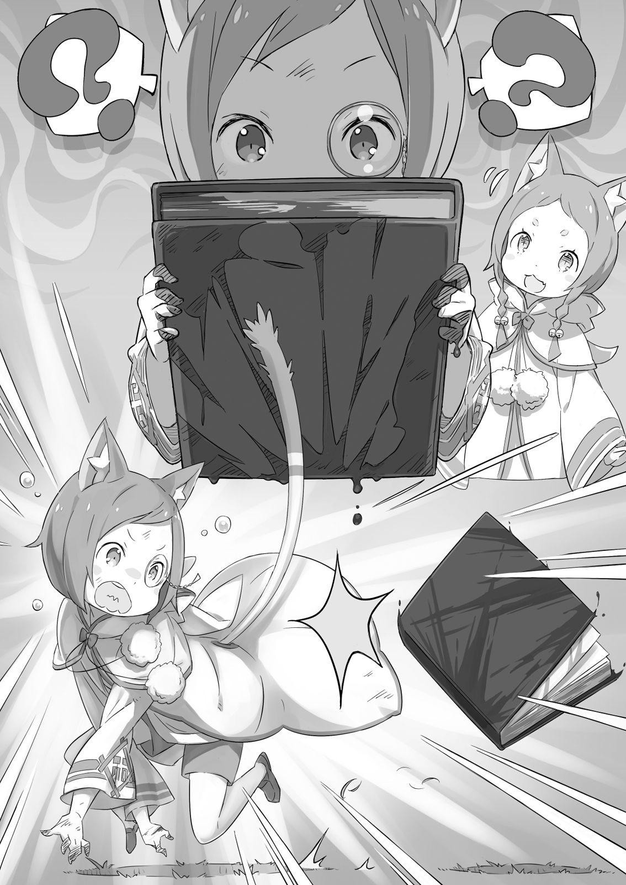
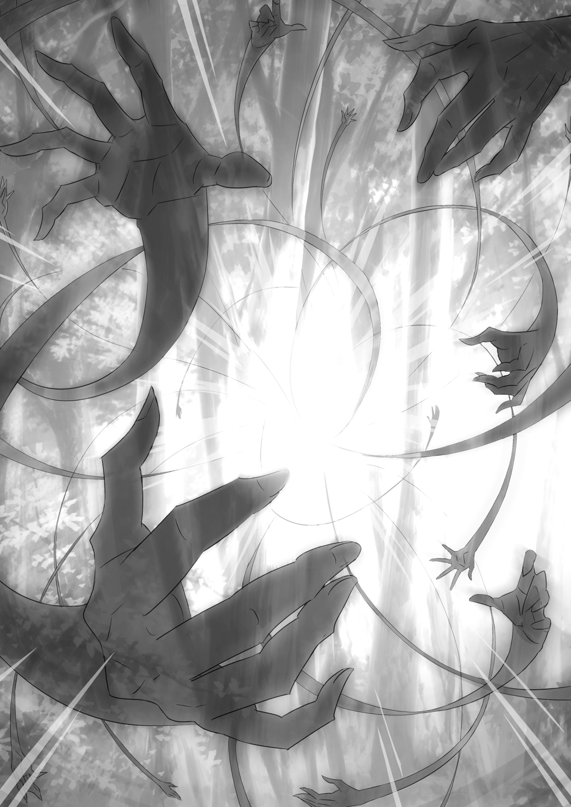

## 1
Вернёмся в то время, когда собрание, на котором обсуждался план борьбы с Культом Ведьмы, уже подходило к концу.

— Точно! Забыл самое главное! — хлопнул в ладоши Субару, после того как объявил отряду о своей просьбе и всполошил воинов. — Да, мой план охоты на Культ Ведьмы прост до невозможности, но наш главный враг, греховный архиепископ… В общем, нужно особо тщательно выбрать тех, кто будет иметь дело непосредственно с ним.

— Тщательно?

— Да, ведь успех всей операции зависит от того, справимся ли мы с архиепископом. Я хочу выбрать лучших. А именно: Вильгельма и нескольких воинов из «Железного клыка», способных передвигаться бесшумно. К тому же они должны быть уверены, что, встретившись с архиепископом лицом к лицу, не напугаются до смерти.

Услышав последнее условие, члены отряда дружно нахмурились. На лицах одних отразилась растерянность, на лицах других — замешательство, третьи были явно обеспокоены, а четвёртые просто насупились за компанию с окружающими. Однако общее настроение можно было описать одним словом — тревога.

Реакция была естественной, Субару поскрёб макушку, чувствуя, что публика ждёт объяснений.

— В общем, я уже говорил, что план сам по себе прост: мы ловим Культ, используя меня как приманку. То есть действуем так же, как во время охоты на Белого Кита. Хотя… адепты могут повести себя совсем иначе…

— Верно, — согласился Феррис. —- Белый Кит прямо таки ошалел от запаха Субарунчика. Сомневаюсь, что ребята из Культа тоже сдуреют!

— Если архиепископ от запаха лишится контроля, я буду очень удивлён… В идеале мы прикончим его внезапной атакой, как только он поймёт, что я был приманкой! Петельгейзе нужно прибить во что бы то ни стало, поэтому я и упомянул то условие.

Многие воины насупились: выдвинутое Субару условие им было не по душе. Среди прочих недовольную физиономию скривил и Рикардо.

— Стоп, стоп! — обнажил он клыки, вступая в центр круга. — Это что же получается? Только приготовились подраться на славу, а ты надумал избавиться от нас?! Нельзя так соратников обижать. Не пойдёт, даже слышать не хочу!

— Я объяснил всё заранее! К тому же это касается только уничтожения архиепископа, а мой план предполагает кучу арен для драк! Поверь, тебе будет где разгуляться, — попытался урезонить бурчащего наёмника Субару. — Не подумайте, что я недооцениваю остальных членов Культа… но архиепископ — это и впрямь отдельная тема.

— Иными словами, — встрял Юлиус, — ты хочешь всё предусмотреть. Одобряю твой подход, но какие критерии отбора? Конечно, не скажу, что я недоволен господином Вильгельмом…

Юлиус искоса глянул на Вильгельма. Старик безмолвствовал, прикрыв глаза. Рыцарь коснулся своего меча и добавил:

— Не могу принять тот факт, что ты априори отверг мою кандидатуру.

— Говоришь, что не против Вильгельма, а у самого на лице явное недовольство написано!

Предстояла решающая схватка с главным врагом — греховным архиепископом, и Юлиус не скрывал: его не устраивает перспектива ждать в сторонке.

— Слушай, Субарунчик, — Феррис хлопнул юношу по плечу, — если ты до сих пор точишь на Юлиуса зуб…

— Не выдумывай, ничего я не точу! Я сам виноват, надо было с самого начала объяснить всё как следует.

— Конечно, с моей стороны неприлично тебя подозревать… но подобная мысль закрадывалась в голову, — признался Юлиус. — Однако не думаю, что ты настолько зациклен на пустяках, чтобы превратно истолковывать мотивы.

Субару показалось, будто ему дали понять: «Не знаю, насколько ты искренен, но лучше попридержи глупые указания». Вспоминая те моменты, когда он был зациклен на пустяках и превратно истолковывал мотивы, Субару поднял указательный палец:

— Пара слов о магии архиепископа Лени… Хотя даже не знаю, магия ли это, ведь заклинаний он не произносит и на повелителя духов не похож… Но, как бы там ни было, этот парень обладает необычными способностями. Поэтому нагрянуть к нему всей толпой — плохая идея.

— Необычными способностями?! Вот так новость, р-мяу! И что же это?

« Он умеет выпускать несколько рук. Для большинства они невидимы, но, если схватят кого, запросто вырвут конечности. Достанут везде, куда только поглядит их хозяин!

— Ого!.. — воскликнул Феррис. Для него эта новость прозвучала как гром среди ясного неба. Юлиус нахмурился. Удивились даже воины отряда.

Незримые Длани Петельгейзе являлись серьёзной угрозой. Субару не мог забыть той сцены, словно из ночного кошмара, когда руки архиепископа разрывали на части тельце Рем… Если устроить масштабную потасовку, жестокие Незримые Длани покажут себя во всей красе.

— Поэтому чем меньше людей, тем лучше. Иначе жертв лишь прибавится.

— Судя по всему, ты знаешь, о чём говоришь, р-мяу… Хотя проверить это нельзя, ведь с нами нет госпожи Круш.

— Если бы леди Круш была здесь, я сказал бы то же самое.

Способность Петельгейзе может помешать нам схватить его.

Субару понимал, что это не единственная угроза, однако взял на себя смелость промолчать об остальных.

— Кстати, — Юлиус задумчиво опустил взгляд, — ты сказал, что для большинства они невидимы. А кто является исключением?

— Я, — коротко и ясно ответил Субару.

— Понятно. Всё предельно ясно.

Юлиус вновь погрузился в раздумья, но тут кто-то попросил слова:

— Я поняла-а!

Это была Мими. С непосредственной детской улыбкой она схватила за плечо стоявшего рядом Тиви и сильно его тряхнула.

— Тогда, Субару, возьми на-ас с Тиви! И дедушку! Вместе мы сила! Как тебе идея? Не против?

— Сестричка, опять ты лезешь…

Тиви, привыкший к выходкам старшей сестры, в этот раз даже не пытался утихомирить её. Предложение Мими звучало заманчиво, но Субару терзали сомнения, отвечает ли её кандидатура условиям.

— Не беспокойся, — вмешался Рикардо. — Если не считать меня, из всей нашей когорты Мими самая способная.

Не зря же её назначили вторым командиром!

— Думаешь, ей можно доверять? Да она всю операцию проспит!

— Не тебе, Субарунчик, судить других. Эх, делать нечего, придётся идти с вами. Надеюсь, я обрадовал тебя хоть немного? — поинтересовался Феррис.

— Шутишь?! Да это здорово! Но ты уверен? Опасно всётаки!..

— Уж кто бы говорил… — заметил Юлиус, удивлённо глядя на Субару.

Юноша уставился на него с непониманием, но рыцарь обратился к Феррису:

— Поручаю их тебе, дружище. Господина Вильгельма, Мими с Тиви… и его. — Юлиус кивнул на Субару.

— Ладно, ладно. Госпожа Круш доверила их мне с самого начала, так что не тревожься.

— И тем не менее…

— Хорошо, хорошо. Учту твоё беспокойство, Юлиус, —хихикнул Феррис.

Юлиус же сохранял абсолютную серьёзность. Рыцари были товарищами, доверяли друг другу и могли общаться без церемоний, что порождало в Субару зависть.

Поразмыслив, Юлиус, похоже, согласился с условиями Субару.

— Даже не будешь настаивать на своём?

— Не буду. Способностью видеть длани архиепископа обладаешь лишь ты. Если людей окажется слишком много, ты не сможешь отдавать им команды, чтобы уберечь от невидимых рук.

— Ну вот, ты сам всё понял…

Как военный человек, Юлиус сразу уловил суть. Субару мог не только уходить от атак Незримых Дланей, по и следить за движениями всех рук и давать соответствующие указания, чтобы остальные вовремя уклонялись. В этом заключалось его преимущество. И чем меньше людей будет задействовано в операции, тем успешней она пройдёт.

Субару хотел встретиться с Петельгейзе малым боевым составом потому, что архиепископу было выгодно сражаться с большой массой народа.

Возражений не последовало, и Субару боязливо взглянул на мечника, который до сих пор хранил молчание.

— Вот почему я хочу, чтобы в самый тяжёлый момент со мной рядом оказался Вильгельм…

Дьявольский Мечник поднял веки, и юноша отразился в ясных голубых глазах старика.

— Теперь я — ваш меч, мастер Субару! Я буду рубить ваших врагов, как только прикажете. Полагаю, моя решимость не вызывает сомнений.

Мечник помолчал, затем добавил:

— Я полностью в вашем распоряжении.

Вильгельм доверял Субару безгранично. Юноша лишь кивнул, чуть не ахнув от изумления.

Близнецы-полукотята как ни в чём не бывало валяли дурака. Феррис молча пожимал плечами. Позади стояли Юлиус, Рикардо и другие воины. Их взгляды, исполненные надежды, остановились на Субару и тех, кому предстояло участвовать в самой важной части операции.

Субару энергично кивнул. Теперь он ничего не боялся.

— Знайте, в этой битве победа снова будет за нами!

## 2
— Он готов?! — вырвалось у Субару. Юноша поспешно прикрыл рот рукой.

Дело происходило посреди каменистого пространства, на краю которого возвышался отвесный утёс. Приблизившись сзади, Вильгельм только что нанёс удар по худосочной фигуре Петельгейзе.

Меч рассёк архиепископа от плеча до пояса. Смертельно раненный, безумец покачнулся. Однако перед смертью он широко открыл глаза и уставился на Субару:

— Как ты…

Однако, что греховный архиепископ хотел сказать, навечно останется загадкой. Окровавленный клинок описал дугу и, рассекая воздух, пронёсся по горизонтальной траектории.

Один миг — и голова Петельгейзе, разбрызгивая кровь, полетела с плеч.

При виде закружившейся в воздухе человеческой головы Субару остолбенел. Однако обезглавленное туловище, по-прежнему движимое безумным упрямством, попыталось протянуть к юноше истончённые руки, напоминающие сухие ветви.

— Верх безобразия! Прими смерть с достоинством.

Бессмысленные порывы обезглавленного тела прервал безжалостный клинок Дьявольского Мечника. Двумя взмахами Вильгельм отсёк ему руки, а затем ударил в область пояса. Верхняя часть тела Петельгейзе распрощалась с нижней, и безумец, вывалив внутренности и превратившись в бесформенный кусок мяса, рухнул на землю.

Тут же ручьи крови сошли на нет, и судороги прекратились. Остался лишь резкий запах крови. Смерть Петельгейзе нельзя было назвать достойной.

С отвращением глядя на останки, Субару ощутил дурноту, но кое-как сдержал позывы рвоты.

— Всё… кончено?..

— Если не кончено, — подошёл сзади Феррис, — то я сам скоро поверю во всю эту чертовщину про Ведьминскую милость, р-мяу.

Остановившись рядом с юношей, который никак не мог прийти в себя, Феррис спокойно осмотрел труп.

— Как и следовало ожидать, он аб-со-лют-но мёртв. Слово лучшего столичного лекаря!

— Ясно…

Тело Петельгейзе казалось бутафорским, что лишь усиливало ощущение ирреальности происходящего. Но слова Ферриса успокоили Субару, и тошнота отступила. Юноша взглянул в сторону леса.

С главным врагом, греховным архиепископом, они разделались в полном соответствии с планом. Остались «пальцы», скрывающиеся в лесу.

— Надеюсь, с остальными ребятами всё хорошо… Как бы не наделали глупостей…

— Опасаетесь, что воины ослушаются и начнут действовать самостоятельно? Даже если им придётся вступить в схватку, с ними мастер Рикардо и мастер Юлиус. Поэтому волноваться не о чем, — заверил Вильгельм.

Старик отходил, чтобы взглянуть на отсечённую голову, а теперь, вернувшись, степенно стоял рядом. Слова Дьявольского Мечника вселяли уверенность, но избавиться от беспокойства было не так-то просто.

Субару волновали остальные члены отряда, взявшие на себя адептов. «Пальцы» явились на запах юноши ещё до того, как Вильгельм уничтожил Петельгейзе.

Вероятно, подчинённые архиепископа, рассредоточенные в лесу, были разбиты на десять групп. По дороге Субару столкнулся с двумя «пальцами» и приказал им возвращаться на базу. Предполагалось, что их выследят те члены отряда, которым не посчастливилось попасть в отобранную Субару команду. Юноша строго приказал, чтобы воины, обнаружив логово Культа, не торопились вступать в схватку, даже обладая численным преимуществом.

Однако, если враг их заметит, боя не избежать.

— Боюсь, как бы не случилось чего плохого. В стратегии есть очевидный недостаток… Мы не знаем, о чём думают адепты, и это пугает… К тому же их много и все они могут сражаться…

— Эй, не к лицу главному стратегу так волноваться! Заладил: «боюсь», «пугает»… Надоел уже, р-мяу!

Субару всегда что-то беспокоило: не одно, так другое. Недоуменно глядя на стратега, Феррис вздохнул:

— Я понимаю, тебе страшно, что дело дойдёт до схватки, но Юлиус и другие знают своё дело, р-мяу! Пожалуй, только старик Вил может составить Юлиусу конкуренцию.

— Вот как?.. Юлиус настолько силён?

Несмотря на заверения Ферриса, душа Субару была не на месте. С одной стороны, он очень радовался, что имеет такого сильного союзника, как Юлиус. Однако глубокая антипатия не позволяла Субару открыто это признать.

Физические раны, нанесённые рыцарем, уже зажили, но неизлечимая душевная боль мучила юношу до сих пор…

— Вижу, обида засела глубоко… Не знаю, осознанно ты делаешь это или нет, но понимаю, почему держишься от него подальше.

— И почему же? — смешался Субару.

— Неважно. Но если уж кто и должен тревожиться, так это Юлиус с ребятами! — Феррис устремил грозный взгляд на юношу. — Я и сейчас придерживаюсь мнения, что твой план — безрассудство-мяу!

Субару насупился.

— Понимаю, — бросил он, глядя на каменистую землю, ставшую ареной сражения. — Но ведь сработало же?

— Да, сработало… Но когда архиепископ почувствовал неладное, ты оказался на волосок от смерти! Мог погибнуть прямо на месте! Даже глядеть не хочу, как кто-то торопится в могилу!

— Ни в какую могилу я не тороплюсь! Хотя вряд ли получится тебя разубедить…

Взгляд Ферриса был так строг, что Субару тут же понял: оправдываться бессмысленно. Ведь именно Феррис являлся самым дотошным критиком его стратегии и чрезвычайно требовательно относился к деталям.

Рыцарь не был против, чтобы Субару играл роль наживки, однако к безопасности относился чрезвычайно щепетильно.

Так как успех стратегии зависел в основном от Субару, никто не был уверен, что дело выгорит. Юноша взял на себя основную работу: он должен был обнаружить Петельгейзе, то есть главную цель, и, задерживая архиепископа как можно дольше, собрать полезные сведения. Если бы хоть что-то пошло не так, Субару бы непременно погиб. И Феррису такой вариант был совсем не по душе.

Однако более эффективного решения ни у кого не оказалось, и Субару приступил к осуществлению плана…

— Как будто не понимаешь, Субарунчик, каково это —сидеть сложа руки и ждать результата!

Феррис прекрасно знал, о чём говорит. Субару вспомнил, как примерно полдня назад, в разгар сражения с Белым Китом, рыцарь рассказал о своей роли в битве.

И роли у них оказались схожими: увы, наносить решающие удары было не по их части. Но рыцарь-гвардеец гораздо больше страдал, осознавая своё бессилие, чем Субару. В слонах Ферриса даже звучали нотки щемящей грусти: он досадовал, что товарищ по несчастью его не понимает.

— Как-то удивительно это слышать. Я-то думал, ты меня не выносишь…

— Так и есть! Но я лечу пациентов независимо от своих предпочтений.

— Я надеялся, ты скажешь: «Почему же не выношу? Вовсе нет!»

Субару усмехнулся, на что Феррис недовольно нахмурился и прикоснулся к кинжалу, висящему на поясе, — единственному предмету своего снаряжения.

— Я возвращаю людям жизнь, невзирая на симпатии и антипатии, поэтому моя сила и получила такое признание.

— Феррис…

— Но в битве с Белым Китом погибло много народа. Одни исчезли в Тумане, другие были раздавлены… Я оказался бессилен им помочь,..

Голос Ферриса, обычно спокойный, дрогнул. Пальцы рыцаря поглаживали рельефную рукоять кинжала. На ней был изображён львиный герб, точно такой же, как на фамильном мече хозяйки Ферриса, герцогини Круш. Прикосновение к гербу придавало рыцарю решимости.

— Я тоже не хочу, чтобы в этом сражении кто-то погиб, —сказал он, глядя на Субару в упор. — Так что не думай, что ты один печёшься о людях.

— Ну это и так ясно!

Хотя по-настоящему Субару это понял, наверное, только сейчас.

Под пристальным взглядом Ферриса юноша мысленно признался, что был неправ, однако действовать по-другому он уже не мог. И мнение рыцаря никак не влияло на ход операции, ведь с самого начала Субару был готов рисковать жизнью, если потребуется.

Повисла пауза, которую тут же заполнили близнецы-зверята, вернувшиеся от заваленной пещеры.

— Мы обследовали пещеру: те, кто там были, погибли под обломками.

— Да! Всё прошло отлично! Полный порядок! Гро-ох —и ни одного не осталось!..

Субару поприветствовал парочку и снова приблизился к трупу Петельгейзе. Теперь беспокоиться было не о чем: опасность миновала. На душе стало легче.

— Понадобилась одна-единственная атака, чтобы справиться со всей твоей шайкой. Конечно, спортивным такое поведение не назовёшь, но не держи зла. Всё-таки сам ты намного, намного хуже меня.

Произносить победную речь, стоя у трупа врага, было не только излишне, но и низко. Они победили, напав исподтишка. Однако Субару не мог промолчать. Он наконец-то осознал, что добился того, ради чего умирал не один раз, —победы над Петельгейзе!

— Благодарю вас, господин Вильгельм. И прошу прощения. Мне не стоило этого говорить.

— Не стоило… говорить?

— Что может быть хуже, чем нанести удар в спину?

Вильгельм слегка нахмурился. Атака была не просто внезапной, а самой что ни на есть коварной, и мечник помог Субару её осуществить. Рыцарю Вильгельму было над чем задуматься…

Но мрачное выражение на лице старика тут же сменила улыбка.

— Рыцарский кодекс уже устарел. Вам не о чем волноваться, мастер Субару.

— Но ведь это я попросил вас принять участие во внезапной атаке…

Субару понимал: бороться с гнусным врагом честными методами бесполезно. И всё же за то, что он втянул в это подлое дело других, его мучила совесть.

— А мне всё равно, р-мяу. Вот Юлиусу это, наверное, не понравилось бы… Но он неглупый парень и не стал бы воротить нос.

— Поэтому я и не хотел с ним делиться. А твоё безразличие меня не удивляет.

— Как по мне, р-мяу, лучше спасти своего союзника, пусть и не вполне честным способом, чем погибнуть, слепо доверившись рыцарскому кодексу. Кто тут прав — ты, Субарунчик, или Юлиус, — зависит от точки зрения.

Взвешенный подход Ферриса успокоил Субару. Даже Мими удивлённо вылупила глазки, будто вопрошая: «А в чём проблема?» Одно слово — наёмница.

Но если уж говорить о наёмниках, особого упоминания услуживает и Тиви. Осмотрев окрестности, маленький солдат подошёл к трупу Петельгейзе и тут же принялся рыться н его рясе. Глядя, как Тиви без зазрения совести исследует карманы мертвеца, Субару испытал настоящий шок.

— Похоже, ничего ценного…

— Слушай, чибик³, ты так копаешься в чужих карманах, словно делаешь это каждый день…

(³От яп. «тиби» — коротышка. В русский язык вошёл термин «чиби» —стиль рисунка в аниме и манге, когда персонажи изображаются с миниатюрным телом и огромной головой.)

— Я не Чибик, меня зовут Тиви. Просто хочу посмотреть, что у него было с собой.

Тиви с таким видом искал трофеи в окровавленной рясе, словно это дело давным-давно вошло у него в привычку.

Мими последовала примеру брата. Несмотря на внешность, близнецы оказались крепкими орешками.

В рясе Петельгейзе на удивление было чем поживиться: Тиви только и успевал выкладывать предметы на землю. Однако ничего необыкновенного там не нашлось.

— Сухой паёк, кристалл лагмита, кошелёк…

— Надо же, пожитки обыкновенного горожанина… Выходит, у вас, наёмников, мародёрство в порядке вещей?

Тиви ответил, как подобает наёмному солдату:

— Мы имеем полное право забрать трофеи. Так… а это что такое?..

Последним, что Тиви извлёк из рясы Петельгейзе, была чёрная книга. При виде томика Субару ахнул:

— Да это же та книжка, которую Петельгейзе называл Евангелием!

— Фу! Это Евангелие?! Я до него дотронулся! — Тиви отбросил добычу и, словно испуганный котёнок, отскочил в сторону.

Субару усмехнулся и поднял чёрный томик.

— Хозяин её, конечно, мерзкий тип, но книга-то не виновата. Хотя, конечно, загадочная…

— Я полагаю, лучше не брать её в руки! Иначе тронетесь умом! Её нужно сжечь! — заявил Тиви.

— Значит, копаться в одежде мертвеца тебе не страшно… Боюсь, я тут ни слова не пойму.

Не обращая внимания на взбудораженного Тиви, Субару полистал страницы, но, к своему сожалению, не разобрал ни слова. Книга была написана загадочным языком, не имеющим ничего общего ни с символами ряда «и», ни с символами рядов «ро» или «ха». Буквы напоминали скорописную хирагану⁴ — настолько скорописную, что прочесть текст не представлялось возможным. Вдобавок в книге присутствовал явный брак: вторая половина тома состояла из пустых страниц.

(⁴Хирагана наряду с катаканой — виды слоговой письменности японского языка.)

— Ничего не понятно… Ладно, признаю, это было неосмотрительно с моей стороны, но беспокоиться не о чем, — сказал Субару, беспечно держа раскрытую книгу.

Длилось это всего мгновение, но юноша успел почувствовать, как пространство наполнилось духом неприязни и агрессии.

— Прошу прощения.

— Дурак ты, Субарунчик.

Вильгельм и Феррис, стоявшие в позах боевой готовности, расслабились.

— Вам эта книжка знакома, что ли? — осведомился Субару, демонстрируя им томик.

— Эй, эй! Не направляй её на нас! Субарунчик, глядеть в Евангелие — большая глупость! Не делай этого! Ты же ровным счётом ничего не знаешь!

Феррис, кипя гневом, отвернулся. Вильгельм, как ни странно, последовал его примеру и отвёл глаза.

— Тиви тоже испугался… Неужели она и впрямь так опасна?

На вид самая обычная книжка, размерами и зесом похожая на словарь. Переплёт не из человеческой кожи, хотя от Культа Ведьмы можно было ожидать и этого…

Невежество юноши вызвало у соратников кривые ухмылки.

— Эта книга, Евангелие, есть у каждого адепта, она подтверждает принадлежность к Культу. Для них это своеобразное священное писание, — объяснил Тиви.

— Священное писание?..

— Говорят, книги отправляют в те места, где есть люди, готовые, по мнению адептов, вступить в Культ. Книги находят адресатов, и — вуаля! — вот вам новые благочестивые адепты.

— Ка-а-ак?! — Объяснение Ферриса так ошеломило Субару, что он перешёл на фальцет.

Что творилось в головах у таинственных, жутких адептов, было абсолютно неясно. Обычные люди, получив книгу, менялись до неузнаваемости. Похоже, Евангелие промывало им мозги. Но если это так, выходит, большинство адептов Культа — простые люди с привитыми вредными идеями…

— Значит, те, кто оказались заживо погребёнными в пещере…

— Вы ошибаетесь, мастер Субару. К моменту получения Евангелия пути назад для них уже не было. Не стоит считать их ни в чём не повинными жертвами, которых подчинили, промыв мозги. Думаете, греховный архиепископ вменяемый?

— Нет, не думаю, но… Может, он исключение?..

Субару беспомощно умолк. Сумасшествие Петельгейзе являлось опасным примером умопомешательства, идеологическая обработка тут явно была ни при чём. Однако юноше не нравилось, что его собеседники считают состояние архиепископа веским аргументом в споре.

— Ты, без сомнений, совершил подвиг, сыграв роль приманки и для Белого Кита, и для Культа Ведьмы, р-мяу… И всё равно меня не отпускает мысль, будто тебе, Субарунчик, грозит опасность, поэтому будь осторожен! Как бы и тебе не прислали Евангелие!

— Я прошу вас о том же, мастер Субару. Не заставляйте меня поднимать на вас свой меч!

— Постараюсь, только поможет ли тут осторожность?..

Получит ли Субару книгу, будет зависеть от того, отправят её или нет. Если некто попытается переманить его на свою сторону, разве в том вина Субару?..

Юноша тяжело вздохнул, будто ему задали незаслуженную взбучку, и опустил взгляд на книгу, которая вдруг потяжелела в его руках.

— Наверно, я… пока оставлю её у себя. Авось пригодится, хотя прочесть всё равно не смогу…

Книга принадлежала греховному архиепископу. И если удастся расшифровать текст, возможно, это прольёт свет на природу Культа Ведьмы.

Субару сунул томик в карман. Феррис, Вильгельм и Тиви поглядели на юношу с сомнением. Так обычно смотрят на храбреца, совершающего безрассудный поступок.

— Больше ничего примечательного не нашлось? — поинтересовался Субару, взяв себя в руки. — Может, он совершенно случайно захватил какую-нибудь карту с пометками? Это бы нам здорово помогло в будущем.

— Ничего подобного не попалось, — отозвался Тиви, снова перебрав трофеи. — За исключением Евангелия, обычные вещи.

Лёгкая экипировка Петельгейзе наводила на тревожные мысли. Однако голова архиепископа была отрублена, и отвечать на вопросы Субару мертвец не желал.

— Послушайте, может, хватит, а-а? Сколько мы будем стоять здесь и болтать? Не лучше ли вернуться к остальным, а-а? — жалобно пропищала Мими. Её хвостик, торчащий из-под плаща, метался, забрасывая труп Петельгейзе землёй.

Мими показала пальчиком на практически погребённого мертвеца:

— Врага мы одолели! Давайте пойдём к товарищам и посмотрим, расправились они со своими противниками или нет! Ну, скорее!

— Голосок наивный, а слова страшные! Если ещё учесть, какая милая у тебя мордашка, контраст просто шокирующий!

— Хи-хи, ты меня смуща-аешь!

Похоже, смутило Мими лишь упоминание её милой мордашки, на что Субару криво ухмыльнулся. И всё-таки девочка была права: следовало воссоединиться с основной группой.

Субару обернулся и окинул взглядом место, ставшее для Петельгейзе могилой. Вокруг царила мёртвая тишина. Пещера была засыпана землёй. Лежащий рядом труп архиепископа останется здесь навеки…

Когда местонахождение Культа было вычислено, подчинённые Петельгейзе и пикнуть не успели, как были похоронены заживо. Архиепископу не дали шанса использовать козырь: прежде чем безумец успел что-либо предпринять, меч Вильгельма рассёк его на части. Должно быть, Петельгейзе так и не понял, что произошло.

И всё это свершилось благодаря необычной способности юноши предвидеть будущее, которую ему подарило Посмертное возвращение. Таким образом, Субару и его отряд одержали полную победу.

Петельгейзе был повержен, однако…

— Нет, постойте! Не может быть, чтобы всё прошло так гладко… Это же я, понимаете? Всегда, как бы ни лез из кожи нон, я оставался в дураках! А тут успех?.. Чую подвох…

— Что за страхи на тебя напали, р-мяу?! — Феррис поглядел на Субару с укором. — Пойдём быстрей! Нам ещё многое нужно сделать.

— Э-э, ну да., ты прав, — согласился юноша, и они отправились в путь, оставив скалистый утёс позади.

Победа! Да, он должен был победить. И это вовсе не случайность. Что тут плохого?

— А если он ждёт, когда мы отвернёмся, чтобы воскреснуть?!

— Да что ты будешь делать! Ты меня уже злишь-мяу! Ух!

— Больно, больно!

Обуреваемый страхами, Субару обернулся, но Феррис схватил его за волосы и потащил вперёд. Как и следовало ожидать, пещера всё так же была засыпана землёй и труп Петельгейзе лежал на прежнем месте.

Можно было спокойно уходить, но в качестве последнего удара…

— На всякий случай, чтобы Субару нам больше не надоедал!

Из посоха Мими вылетел сгусток магической энергии и взорвал труп Петельгейзе. Тело греховного архиепископа Культа Ведьмы, отвечавшего за Лень, разлетелось на куски.

## 3
— Похоже, вы возвратились с добрыми вестями?

Юлиус встретил победителей сдержанной улыбкой. Воины расположились на поле, в стороне от леса и тракта. В чаще скрывались адепты Культа, поэтому, чтобы не попасться им на глаза, многочисленный отряд держался подальше.

Хотя предводитель противника, Петельгейзе, был мёртв, оставались его «пальцы». Рано или поздно они заметят отсутствие главаря, и тогда нужно будет действовать осторожно и без промедления.

— Что с лагерями «пальцев», которые вы обнаружили по дороге?

— За одним наблюдает часть пашей группы. Если что-то случится, нам дадут знать. Что касается другого, мы столкнулись с разведчиками. Завязался бой.

— Реально?! И что? Вы им показали?

Субару не ожидал услышать такую волнующую новость и затрясся от нетерпения. Однако рыцарь усмехнулся, поправил слегка растрёпанные волосы и, коснувшись меча, сказал: — Не волнуйся. Среди противников были хорошие бойцы, но нам не составило труда одолеть их. Лагерь мы зачистили, так что теперь «пальцев» девять.

— Наши не ранены? Никто из адептов не сбежал?

— Для беспокойства нет причин. Всё в порядке.

Высокое происхождение Юлиуса не позволило бы ему умалчивать о своих промахах. Когда выяснилось, что раненых нет и всё прошло как по маслу, Субару вздохнул с облегчением. На губах рыцаря появилась натянутая улыбка.

— А как ваши успехи? Взяли архиепископа? Всё по плану? — спросил Юлиус.

— Вильгельм отрубил ему голову, а потом магическим ударом труп разнесли на куски. Так что он мёртв, сомнений быть не может… Ведь не может?.. — Беспокойство никак не отпускало Субару.

— Непонятно, почему ты сомневаешься, если видел всё своими глазами… — Юлиус недоверчиво нахмурился. Затем, не меняя выражения лица, перевёл взгляд на Ферриса, который стоял рядом с юношей. — И вот ещё что: я понимаю, осторожность не бывает лишней, но кромсать мёртвое тело — недостойно. А ты в этом участвовал, Феррис.

— Извини… — Феррис потупился. — Я пытался его остановить, но Субарунчик…

— Ну конечно, во всём виноват нелюдь Субару! Чего дурака валяешь?! Позволь кое-что уточнить: это была сестричка-полукотёнок из твоего рода-племени!

Опровергая ложные догадки, Субару ткнул пальцем в настоящего виновника — Мими, которую нёс на спине брат.

По дороге сюда Тиви и остальные члены отряда отчитали девочку за излишнее рвение, и она так обиделась, что отказалась идти самостоятельно.

— Вот оно что, — сказал Юлиус. — Значит, Мими? Ничего не поделаешь. Должно быть, у неё имелись на то причины.

— Похоже, и ты, и леди Анастасия слишком её балуете!

И братья тоже, — заметил Субару.

— И в мыслях не было. — Избегая пристального взгляда юноши, Юлиус повернулся к Вильгельму. — Кстати, господин Вильгельм, как вы одолели архиепископа?

Мечник расправил плечи и пояснил:

— Обезглавил. Ни одно известное мне существо не выживет после такого.

— Тогда я могу быть спокоен. Уж вам, господин Вильгельм, я верю. Выходит, мы обезвредили ведомых Ленью адептов, не дав им совершить новые злодеяния.

— А мне, значит, ты не поверил?! Вообще-то, я тоже не бил баклуши, а очень тщательно осматривал мертвеца! Два или три раза проверил!

— Заметь, я не спрашивал Ферриса. Считай это признаком моего доверия.

— Когда доверяют, вообще не переспрашивают! Или ты не знал? — накинулся на Юлиуса Субару, однако тот молча повернулся к другим рыцарям и наёмникам, ожидавшим новостей, и поднял руку.

Воины восприняли это как сигнал и умолкли. Когда всё внимание сосредоточилось на Юлиусе, он жестом пригласил Субару:

— Они тоже ждут новостей, и рассказать обо всём должен гы, верно?

— Верно, просто мне не нравится, что ты раскомандовался.

— Ужасно упрямые! Я сейчас со скуки помру… — Феррис с тоской глядел на Субару и Юлиуса, которые вздумали пререкаться в такой важный момент. — Какие же вы болваны, мальчишки! А Субарунчик — и вовсе дурачок.

— Со стороны мужское упрямство действительно может показаться чем-то унылым. Но ничего не припоминаешь, Феррис?

— Да, был один упрямец… — пробормотал Феррис и тяжело вздохнул, старательно избегая взгляда пожилого мечника.

Пока они беседовали за спиной Субару, юноша объявил присутствующим об успешном завершении операции.

— Итак, можно сказать, всё прошло по плану. Греховный архиепископ… В общем, мы вышибли ему мозги! — провозгласил Субару, размахивая руками и пританцовывая на месте.

— Ура!!! — радостно воскликнули воины, заждавшиеся новостей.

— Стоп, стоп! Прекратите орать! Нас ведь услышат!

Отряд притих. Ещё немного, и они раскрыли бы своё местонахождение. И всё-таки было ясно: новость очень обрадовала воинов.

— Дело за малым! Зададим порку уцелевшим «пальцам».

Надо разобраться с ними по-быстрому, не дожидаясь, пока наша молодая сеньора состарится! Шучу, шучу…

— Что-то не пойму, над чем тут смеяться. А, ладно, забудем.

Если не судить строго чувство юмора Рикардо, он был прав: следовало поторапливаться. Однако считать, что дело осталось за малым, как выразился воин, было бы ошибкой.

— Ликвидация Петельгейзе — ещё далеко не всё… —вздохнул Субару.

— Нельзя допустить, чтобы нас застали врасплох, пока мы почиваем на лаврах-мяу. Несмотря на смерть архиепископа, оставшиеся адепты, скорее всего, не отстанут.

— Это же Ведьминские фанатики! — продолжил Рикардо мысль Ферриса. — Не стоит надеяться, что им в головы придёт хоть какая-то разумная мысль.

Все остальные, видимо, были согласны. И, судя по напряжённым лицам воинов, никто не собирался расслабляться раньше времени. Субару тоже желал довести дело до конца.

В отношении оставшихся врагов следовало принимать твёрдые меры.

— Для начала уничтожим «пальцы», за которыми установлено наблюдение. Среди нас ведь нет радикалов, готовых прикончить адептов всех до последнего, верно? Некоторых, сколько получится, нужно взять живыми.

— Мне кажется, они в этом случае просто убьют себя… Раньше адепты именно так и поступали.

Феррис недовольно поджал губы. Но дело было не в том, что он не одобрял предложение Субару. Рыцарь ненавидел существ, готовых пойти на самоубийство ради сохранения тайны. Как лекарю, ему было непросто смириться с существованием гнусного Культа Ведьмы…

— Я понимаю опасения Ферриса, — сказал Юлиус. —Но если можно обойтись без жертв, так и следует поступить. Я тоже думаю, что оставшихся адептов лучше взять в плен. Но не забывайте, что собственная безопасность превыше всего! Напрасный риск неприемлем. И ещё: конечно, первым делом нужно заняться обнаруженными «пальцами», но совсем скоро нам предстоит встретить драконьи повозки, о предоставлении которых ты договорился. Об этом тоже забывать не стоит.

— Ах да, точно… — Субару хлопнул себя по лбу, вспомнив о группе, которая вскоре должна была присоединиться к отряду.

Драконьи повозки, принадлежащие странствующим торговцам, были нужны для эвакуации жителей особняка и деревни. Однако теперь, когда Петельгейзе и часть его приспешников были повержены, необходимость в полной эвакуации, похоже, отпала. И выходит, Субару напрасно затеял суматоху с повозками…

— Боюсь, будет непросто согласовать действия торговцев и нашего отряда, — сказал Юлиус. — Пускай остаются в лагере или отправляются в деревню и эвакуируют жителей согласно договорённости. В последнем случае нужно позаботиться, чтобы их прибытие не вызвало паники среди местного населения. Есть идеи?

— Идеи?.. По поводу чего?

— Полагаю, если в деревню и в особняк отправить человека, имеющего там хоть какой-нибудь вес, нам удастся избежать переполоха.

Смекнув, к чему клонит Юлиус, юноша закусил губу и постарался подавить эмоции. У него появился прекрасный предлог поехать в особняк. Кто-то должен был стать посланцем, и Субару прекрасно подходил на эту роль. Однако…

— Не вынуждайте меня смешивать общие дела и личные. Мне и здесь есть чем заняться.

— Никто не подумает, что ты смешиваешь личные дела и общие.

— Я вызвался быть наживкой для Культа Ведьмы. И это получается у меня лучше всего. Да и не имею я пока права возвращаться в особняк.

Отвергнув предложение Юлиуса, Субару посмотрел вдаль: там, за лесом, находился особняк Розвааля. Рыцарь в своей манере проявил заботу, и Субару даже по думал обвинять его в злом умысле. Однако юноше действительно было стыдно появляться на пороге особняка.

— До сих пор не можешь об этом забыть? Несмотря на всё? — удивлённо спросил Феррис, широко раскрыв глаза. Он прекрасно знал, что Субару удалось сделать за последние дни.

Он заключил союз с Круш, помог победить Белого Кита и даже уничтожить греховного архиепископа Лени! Более чем достаточно, чтобы рассчитывать на похвалу.

Однако, несмотря на все заслуги, сам Субару не мог простить себя за совершённые глупости.

— Что ни делай, прошлого не изменишь. Нельзя вернуться назад и исправить то, что натворил… Леди Анастасия как-то говорила об этом. Жестокие слова… по справедливые. Я правда совершил массу глупостей. И если остановлюсь на полпути, это будет непростительно!

Конечно, Анастасия читала ему нотацию в прошлом круге, но для Субару это не имело значения. Юноша прекрасно помнил тот день.

— Я вернусь лишь после того, как расправлюсь с остальными адептами, что прячутся в лесу.

— Тогда давай так и сделаем. К тому же твоё участие н правда совсем не помешает.

Юлиус отнёсся с уважением к решению Субару не возвращаться в особняк. Остальные тоже поддержали юношу.

Только Феррис по-прежнему выглядел недовольным.

— После всего, что ты совершил, о чём можно переживать?.. Зачем выдумываешь отговорки и противишься встрече с той, от кого без ума?! Если разонравилась, может, вообще бросить это дело?

— Давай без придирок! И никто мне не разонравился. Понятно?

— Да непонятно мне ничего! Лично я никогда не ссорился с госпожой Круш. Если упустишь возможность встретиться с тем, с кем хочется, будешь жалеть. Я тебя предупредил!

— Давай без придирок Феррис говорил так эмоционально, вероятно, потому, что, будучи врачом, знал: смерть может подкрасться в любую минуту. И слова его имели чрезвычайно глубокий смысл.

— Мастер Субару, не терзайтесь так! В молодые годы у людей переизбыток чувств, которые могут сбить их с верного пути. Однако из этого не следует, что ничего нельзя исправить.

— Хм, старик Вил, вы слишком снисходительны к Субарунчику.

— А ты к нему слишком строг. Хотя я знаю почему…

— Не надо делать вид, будто вам всё известно… — Феррис смутился и умолк.

Разговор рыцаря и мечника навёл Субару на мысль, что так могут беседовать только близкие товарищи. И хотя смысла сказанного юноша не понял, он поблагодарил мечника:

— Спасибо за поддержку, мне немного полегчало…

— Главное — чтобы душа была спокойна. Эх, если бы один-единственный стариковский совет мог уладить разногласия между мужчиной и женщиной, люди не мучились бы подобными вопросами, — сказал Вильгельм так, словно познал это на собственном опыте.

— Вас, Вильгельм, должно быть, тоже угнетали ссоры с супругой? — поинтересовался Субару — на этот раз уже из чистого любопытства.

Мечник закрыл глаза, словно вспоминая о давно ушедших днях.

— Разумеется. Когда я гневил свою жену, она становилась непобедимой. Не раз она укладывала меня на лопатки.

— Ну и ну, великие мечники всегда идут до конца!

— А затем я силой заключал её в объятия и держал, пока гнев не иссякал.

— Теперь я десять раз подумаю, прежде чем жениться!

Вильгельм увлёкся любовными воспоминаниями, лицо его просветлело. Думы о прошлом больше не тяготили мечника, и Субару завидовал ему. Юноша шлёпнул себя по щеке. Вильгельму было жалко его. И хотя забота мечника выглядела неуклюже, настоящему мужчине не пристало ею пренебрегать.

— По-моему, Субарунчик, ты слишком много думаешь.

— Вовсе нет! Не может быть, чтоб Вильгельм просто так, безо всякой цели заговорил о жене! Или?.. — Субару робко глянул на мечника.

Вильгельм сделал вид, что не слышит.

— Так, кажется, к отправлению всё готово, — произнёс он, глядя на отряд, который ожидал распоряжений.

Как и сказал Дьявольский Мечник, все были готовы к марш-броску. Лица воинов уже не выглядели столь напряжёнными, как прежде. Но, похоже, отряд проникся беспокойством Вильгельма. Иными словами, о Субару сейчас волновалась целая толпа взрослых мужчин.

— Хотите сказать… я сморозил очередную подростковую глупость?..

В глазах опытных воинов Субару выглядел излишне зацикленным на мелочах. Но такова уж была его природа.

— Тем не менее… я прошу вас помочь мне снова увидеться с Эмилией-тан и сделать так, чтобы наша встреча прошла приятно и легко.

— Не очень-то вдохновляющая цель, — заметил Юлиус.

В тот же миг губы воинов растянулись в улыбке На этой весёлой ноте разговор был окончен, и отряд тронулся в путь.

«Оставшиеся адепты будут уничтожены, и каждый из членов отряда встретит победу ликованием!»

В этот момент Субару не сомневался, что всё получится…

## 4
Охота на Культ Ведьмы продолжилась без промедления.

В первую очередь отряд направился к тому месту, где были обнаружены «пальцы». На их лесной лагерь — вражеский аванпост, который хорошо просматривался со всех сторон, —отряд наткнулся незадолго до встречи с архиепископом. И часть бойцов осталась вести наблюдение.

— Эй! Это я! Как настроение? — Субару беззаботно окликнул адептов, чем приковал к себе всеобщее внимание.

Члены Культа глядели на него с загадочным ощущением единства, во взорах не было вражды. Если бы Субару ничего не знал об их преступлениях, возможно, в нём даже проснулось бы чувство вины. Но он прекрасно помнил о злодеяниях последователей Культа и понимал, что гнусные мерзавцы не заслуживают сострадания.

— Сожалею, что мы обставили вас… Хотя нет, я соврал, мне нисколько не жаль! — бросил Субару адептам, стоящим навытяжку.

Слова юноши заставили их крепко задуматься, но, когда адепты осознали, что Субару настроен враждебно, было уже поздно. Одна за другой блеснули несколько серебристых вспышек. Адепты Культа не успели среагировать и попадали на землю.

— Я не ожидал, что будет так…

— Ха-ха-ха-ха! Ты только глянь на этих Ведьминских фанатиков! Слушай, малой, да тебе за такой подвиг медаль положена! — восхитился Рикардо.

Аванпост был взят за считаные секунды. Зарубив врагов, которые практически не сопротивлялись, Юлиус замер с широко раскрытыми глазами, а Рикардо с огромным тесаком за спиной широко улыбался, оскалив клыки.

База располагалась так, что в случае нападения её можно было немедленно покинуть. Ландшафт местности позволял броситься врассыпную и скрыться. И если бы сбежавшие адепты добрались до других баз, противнику стало бы известно об отряде. Но этому не суждено было сбыться…

Виной тому оказался Субару Нацуки — Убийца Культа, приковавший к себе всё внимание адептов.

— Не ожидал, что так быстро произведу эффект!

Ошеломляющий военный успех привёл Субару в небывалый трепет. Ни одного раненого среди воинов отряда, ни одного сбежавшего среди врагов! Абсолютная победа! И в том, что главную роль в ней сыграл Субару, уже никто не сомневался.

Однако единственное, на что юноша был способен, — внести сумятицу в стан врага. Этим его роль и ограничивалась.

— Чёрт возьми! Этот готов! И этот тоже! Да что такое?! —в сердцах воскликнул Феррис, распушив от злости хвост.

Несколько человек, облачённых в чёрные балахоны, неподвижно лежали ничком у его ног.

— Они убили себя?

Вильгельм прошёл мимо разъярённого Ферриса и откинул с головы одной из фигур чёрный капюшон. Под ним оказалось лицо ничем не примечательного мужчины средних лет. Из его глаз, носа и ушей шла кровь. Отстранённое выражение лица производило жуткое впечатление.

— Язык в порядке, никаких следов от холодного оружия.

— Скорее всего, в их тела вживили магические кристаллы. Когда кристаллы активируют, по организму расходится яд, и носитель умирает. Чтобы это предотвратить, нужно заранее разобраться, какой именно яд используется, и нейтрализовать его. Загвоздка заключается в том, что на адептов наложены индивидуальные заклятия, запускающие разные яды! Надо же было придумать такой изощрённый способ самоубийства!

Феррис осмотрел живот мертвеца и, обнаружив невзрачный магический кристалл, горько вздохнул. Покончили с собой семеро, но, вероятно, магические кристаллы были вживлены во всех адептов Культа, которые находились в лагере.

Изумлению Субару не было предела.

— Такие кристаллы, похоже, есть у всех «пальцев».. Подумать только, даже ты бессилен против этого яда!

— В голове не укладывается. Какое-то надругательство над Жизнью! О чём они вообще думали?!

Голос Ферриса дрогнул, от избытка чувств на глазах выступили слёзы. Феррис смахнул их тыльной стороной кисти, испачкав бледную щёку кровью, отчего вид рыцаря, пылающего праведным гневом, стал по-настоящему жутким и в то же время благородно прекрасным. Наверное, потому, что его облик был исполнен мужества, какое не увидишь на поле боя, где орудуют мечами и магией. Феррис являлся лекарем и как никто другой знал, сколь скоротечно чудо жизни…

Пока рыцарь негодовал, Субару не мог отвести глаз от лежащих в ряд трупов. Что-то настораживало его, и юноша не спешил провозглашать себя героем, благодаря которому отряд одержал победу, не пролив ни капли крови.

Субару смотрел на лица адептов; незадолго до смерти они были скрыты капюшонами. Заурядные мужчины и женщины… Не верилось, что эти люди посвятили свои жизни Культу Ведьмы.

— Мастер Субару, пожалуй, не стоит глядеть на них в упор. — Вильгельм встал напротив юноши, загораживая картинку, и помотал головой. — Вы не привыкли к подобным зрелищам, нет нужды заставлять себя. Если же вы чувствуете ответственность или вас гнетёт чувство вины, мой совет: бросьте, это пустое!

— Потому что наш противник такой, какой он есть?

— Именно, — ответил Вильгельм без колебаний.

Субару тяжело вздохнул:

— Нет, мне совсем их не жаль, и никакого чувства вины я не испытываю. Даже мне понятно, что этого делать не следует…

Субару не имел права скорбеть о почивших адептах. И даже если б имел, всё равно не стал бы. Однако именно он поднял карательный отряд на уничтожение Культа. И теперь Субару не мог прикинуться дурачком и сделать вид, что он ни при чём.

Глядя на трупы, юноша вдруг подумал, что он, привыкший к смерти, стал неприятен самому себе.

— Хотя к собственной смерти я вряд ли когда-нибудь привыкну…

Субару прошёл через гибель уже десяток раз, но привыкнуть к этому было совершенно невозможно. Всякий раз чувство потери, которое он испытывал, расставаясь с жизнью, было ясным и свежим, как и неослабевающий страх. Когда же умирал кто-то другой, сердце юноши замирало, будто парализованное, и это его пугало.

— Мне просто не по себе от вида мертвецов. Похожи на кукол…

— Они и вели себя как куклы — безропотно исполняли приказы, — заметил Дьявольский Мечник, превратно истолковав слова юноши.

Субару усмехнулся. Они смотрели на вещи совершенно по-разному, что было вполне естественно. Субару понимал жизнь и смерть исходя из представлений, характерных для современной Японии. Вильгельм же, являясь воином, бессчётное количество раз встречался со смертью лицом к лицу. И пропасть между ними была непреодолимой. Впрочем, Субару и не собирался её преодолевать.

Увидев на губах юноши усмешку, Вильгельм нахмурился, однако тот не стал менять тему.

— Эти приверженцы Культа…

Когда Субару глядел на трупы, помимо мыслей о смерти, в его голове возник вопрос.

— Чего они добиваются своими действиями? Почему так горячо поклоняются Ведьме? Ведь эту загадочную тварь ненавидит весь мир!..

Складка между бровями Вильгельма стала глубже. Лица окружающих тоже приняли озадаченное выражение. Молчание прервал мальчишеский голос.

— Возможно, они жаждут разрушения? — предположил Тиви, сжимая в руке посох. Не поднимая мордочки, котёнок слегка поправил свой монокль и продолжил: — Культ Ведьмы печально известен на весь мир, однако от желающих вступить в его ряды, как мы видим, нет отбоя. Я полагаю, это от слишком сытой жизни.

— Слишком сытой?

— Я думаю, они не знают, чем заняться, и потому доходят до саморазрушения. Впрочем, не стоит в это углубляться.

Так и не подняв головы, Тиви умолк. Миловидная мордочка ясно давала понять: полукотёнок не потерпит расспросов. Вероятно, Тиви вспомнил какой-то неприятный эпизод из прошлого.

— Мм? Ты чего-о? Братик, что-то случилось?

Однако Мими не понимала, о чём именно он задумался.

Реакция оказалась совсем не такой, какую можно ожидать от сестрёнки, росшей с братом бок о бок.

Слова Тиви оставляли простор для размышлений.

— Значит, разочаровались в жизни и жаждут разрушения… А что, такую логику можно понять.

Всякому, кто хоть раз впадал в отчаяние, знакомо подобное деструктивное желание. И Субару, склонному рвать на себе волосы, такой мотив был близок.

— Не стоит даже пытаться понять этих людей. Не заставляй меня повторять одно и то же! — потребовал Феррис, услыхав краем уха бормотание юноши, и бросил на Субару гневный взгляд.

Лекарь уже закончил осматривать трупы. С уставшим и в то же время озлобленным видом он пристально глядел на Субару.

— Что в головах у адептов — тайна, покрытая мраком. Попытаешься их понять — и мрак поглотит тебя самого. А для тебя, Субарунчик, это особенно опасно, так что будь осторожен!

Юноша примирительно поднял руки:

— Я и так осторожен, без твоих бесконечных напоминаний! Так что не надо скептически на меня смотреть. Я просто спросил…

Субару снова бросил взгляд на трупы мужчин и женщин разного возраста. Трудно было представить, что побудило их вступить в Культ. Вся эта жуть наводила на логичную мысль, что они и не люди вовсе, а какие-то чудовища из потустороннего мира.

Только вот Субару, послужившему спусковым механизмом их смерти, не давала покоя мысль: не избегает ли он ответственности за гибель адептов, приравнивая их к чудовищам из потустороннего мира?

— Субарунчик?

— Задумался… Кстати, ничего полезного для нас при них не было?

— Ничего, кроме оружия. Ни у кого не оказалось даже Евангелия. Как будто они изначально знали, что не вернутся обратно. Всё это так глупо…

Очередная победа не принесла ни ценных сведений, ни ощущения успеха. В словах Ферриса звучал едва сдерживаемый кипучий гнев.

«Пускай Феррис злится, — подумал Субару, — а я буду хладнокровен».

— Итак, пора браться за следующую группу.

Субару несколько раз согнул и разогнул колени, затем привёл в порядок мысли, снова настраиваясь на роль приманки для Культа. По сравнению с Петельгейзе и «пальцами», которых отряд застал в лагере, адепты, скрывающиеся в лесу, представляли большую опасность. Теперь в буквальном смысле начиналась охота.

Субару пошёл впереди отряда, чтобы найти новую рыбку, готовую заглотить крючок.

— Ну, давайте, идите сюда. Вы просчитались, не стоит недооценивать моих ребят!..

— Судя по тому, что бормочешь, твой настрой не назвать боевым.

Послышался скрежет зубов Рикардо. Однако, несмотря на неуверенное заявление Субару, наступление на Культ продолжалось.

## 5
— Субару, странствующие торговцы добрались до внешнего лагеря, — доложил Юлиус, когда отряд стёр с лица земли четвёртый «палец».

После лесного лагеря отряд разгромил ещё две базы адептов: одна располагалась на берегу реки, а другая — в болотистой местности. Это пролило свет на некоторые обстоятельства, касающиеся Культа Ведьмы. Во-первых, каждый лагерь состоял из десяти человек, а во-вторых, без своего архиепископа адепты стали неожиданно слабы.

Вознамерившись атаковать особняк и деревню, они даже не думали об альтернативном плане. Одурманенные запахом Ведьмы, который распространял Субару, адепты беспрекословно выполняли всё, что он им приказывал. Стратегия наживки была не просто эффективной — она попала в самое яблочко!

— О, значит, всё-таки приехали! — обрадовался новости Субару. Охота шла так гладко, что в глубине души юноша ликовал.

Хотя Субару сам позаботился о драконьих повозках для эвакуации, он не знал, сколько торговцев согласится с его условиями и прибудет. Услышав, что старания принесли плоды, Субару испытал облегчение.

— Я боялся, что мы зря переполошили людей. Но раз они смогли приехать, значит, равнина совершенно свободна.

— Похоже на то. Враг ещё не понял, что Туман обезврежен. Адепты думают, что тракт заблокирован, и поэтому так беспечны. Всё идёт по плану.

— Выходит, у него не было резона врать мне? Петельгейзе — последний, кому я хотел бы верить… Но всё-таки это хорошая новость.

Безумец не лгал. Когда это стало очевидно, Субару овладело сложное чувство… Но, как бы там ни было, юноша хотел встретиться с торговцами, которые откликнулись на его призыв. Следовало поговорить с ними и объяснить специфику обстоятельств, в которые те оказались втянуты.

— Так, вот мы и добрались до лагеря…

Прервав «охоту», Субару вышел на опушку леса и замер, удивлённо почёсывая в затылке. Дело было в странствующих торговцах. К счастью, опасения не подтвердились: приехало не меньше пятнадцати драконьих повозок. Судя по всему, слова «куплю груз по вашей цене» произвели должный эффект. По грубым подсчётам, в деревне проживало не более ста человек. Пятнадцати повозок будет вполне достаточно, чтобы вывезти всех.

— А что они так жмутся друг к дружке?

— Напуганы боевой атмосферой, которая здесь царит. Торговцам простительно.

Группа торговцев, подавленных видом рыцарей во всеоружии, ютилась на краю лагеря. Юноша задумался, как объяснить торговцам, для чего их позвали.

Субару был рад, что они собрались. Однако не следовало забывать: коммерческая хватка и отвага — совсем не одно и то же…

— Если их так пугает здешняя атмосфера, не дадут ли они дёру, когда узнают, что наш враг — Культ Ведьмы?

— Храбры далеко не все. Боюсь, твои опасения не беспочвенны, — согласился Юлиус.

Субару и рыцарь пожали плечами.

Изначально юноша хотел рассказать торговцам суть дела и попросить их о помощи. Но теперь, глядя на них, Субару засомневался, не струсят ли его помощники, узнав о причастности Культа.

— Если они разбегутся, нам придётся туго — лишимся повозок. Не хотелось бы, чтоб оставшиеся адепты преждевременно узнали об операции.

Наверное, оставить торговцев в блаженном неведении было лучшим решением…

— Тебе не нравится, что я сомневаюсь? — спросил Субару Юлиуса.

— Изящным такое поведение я бы не назвал. Но быть придирчивым в экстренной ситуации глупо. Главное — оказаться в нужное время в нужном месте. И в нашем случае, мне кажется, всё так и есть.

— Весьма уклончивый ответ, но будем считать, что ты не против.

Когда Юлиус пусть и обтекаемо, но согласился, Субару посмотрел в глаза другим членам отряда, надеясь найти в них понимание. К счастью, ни Вильгельм, ни Феррис не возражали, и юноша решил, что расскажет торговцам правду. Однако не всю правду…

— В конце концов, чтобы эвакуировать жителей деревни, мне придётся слукавить. Так что буду воспринимать это как репетицию…

Чтобы избежать паники, о причастности Культа Ведьмы следовало умолчать. Убедив себя в том, что это необходимая мера, Субару направился к охваченным тревогой торговцам.

— Э… Благодарю, что проделали долгий путь и собрались здесь. Пригласил вас именно я, поэтому позвольте пояснить, что к чему.

— Ты?.. — Торговцы удивлённо переглянулись.

Субару представил воинов из своего отряда и кисло усмехнулся. Реакцию торговцев можно было понять. Никто не ожидал, что вместо опытного Вильгельма или представительного Юлиуса к ним выйдет Субару. И без того неуверенного в себе юношу это расстроило ещё больше. Вдруг он заметил, что среди торговцев мелькнули знакомые лица. А человека, который находился в центре толпы, Субару определённо помнил.

— Постойте, а вас я… Увы, имени не скажу, но это вы свели меня с Отто! И ещё я заметил тех, кто помогал мне, когда мы в первый раз столкнулись с Белым Китом!

— В первый раз? С Белым Китом? О чём он говорит?! —смутились мужчины.

— Извините, это были мысли вслух, — улыбаясь, попытался оправдаться Субару. — Итак, для чего мы здесь собрались…

Он обвёл взглядом торговцев: уж не затесался ли среди них сам Отто? Но нет. Наверное, судьба больше никогда не поможет им встретиться — Субару и этому парню с целым возом масла… Юноше стало немного грустно.

— Для вас, торговцев, самое главное — заключить выгодную сделку, так? Раз вы откликнулись на призыв, значит, согласились с моим условием: «Я покупаю ваш груз по вашей цене». Верно?

— Да, верно. Здесь ведь нет подвоха?

— Разумеется. Но взамен я нанимаю ваши повозки. Об этом вам тоже должно быть известно. Вы должны вывезти людей из деревни, что находится неподалёку, пока мы будем зачищать местность.

— Зачищать местность?.. — раздался тревожный голос. На лицах торговцев мелькнула тень сомнения.

В данный момент действительно происходила зачистка местности от адептов. Однако голая правда напугала бы торговцев ещё больше, и потому Субару сказал:

— В этом лесу завелись зверодемоны. Как видите, мы сформировали довольно крупный карательный отряд. Пока мы будем охотиться на вольгармов, вы должны эвакуировать жителей деревни в безопасное место.

Субару врал самым наглым образом, ведь событие, о котором он рассказывал, произошло два месяца назад…

— Весьма правдоподобная выдумка. Да у тебя талант к сочинительству! Не хочешь стать писателем? — сказал Юлиус, дивясь тому, как ловко Субару обвёл вокруг пальца уёму торговцев.

— На похвалу не очень похоже! — огрызнулся юноша. На лбу его вздулась вена.

— Да брось, Субарунчик, это же Юлиус! Будто не знаешь его! И я тоже считаю, что выдумка классная, р-мяу.

— Так, вы оба! Начнём с того, что эта, как вы говорите, выдумка таковой не является! Это правдивая история двухмесячной давности, — подавленно простонал Субару.

Рыцари переглянулись.

— Хочешь сказать, в этом лесу обосновалась стая вольгармов? — переспросил Юлиус.

— Не то чтобы прямо стая… но, в общем, да, они здесь были. В лесу есть барьер, который разделяет владения людей и зверодемонов. Место, где мы находимся, — территория людей, и точка! — скороговоркой выпалил юноша, глядя на рыцарей, в чьих глазах читалась настороженность.

Юлиуса объяснение удовлетворило, и он облегчённо вздохнул, а Феррис недовольно надул губы.

— Субарунчик, ты точно не задумал укокошить меня и всех остальных, прикидываясь невинным дурачком? Тебе можно верить?

— За кого ты меня принимаешь?! Сам же говорил, что не сомневаешься во мне, потому что в меня поверила леди Круш! Забыл?!

— Когда факты открываются с таким опозданием, волейневолей засомневаешься… А что касается зверодемонов… надо спросить у графа Мейзерса, зачем он построил особняк рядом с их логовом, — ответил Феррис, пристально глядя в сторону поместья.

Находясь в доме Розвааля, Субару думал, что жить вблизи от зверодемонов для обитателей этого мира совершенно нормально.

— Просто необъяснимо, р-мяу!

— Все зверодемоны без исключения инстинктивно стремятся убивать, — объяснил Юлиус. — Эти опаснейшие твари не годятся ни в пищу, ни на роль домашних животных. Есть барьер или нет, строить жилище поблизости от их логова —немыслимо!

Только теперь Субару осознал, как же нелепо возводить особняк и деревню в такой местности. По-видимому, эксцентричность Розвааля не ограничивалась внешним видом и манерами.

— Значит, будет что сказать этому мерзавцу, которого нет на месте в нужный момент…

Кипя злостью, Субару решил, что не время поддаваться усталости. Является ли Розвааль безумцем — неважно. Главное, что благодаря той встрече с вольгармами удалось придумать убедительное объяснение. А рассуждения, был ли тот опыт необходим, юноша решил оставить на потом.

— Однако торговцы охотно откликнулись на зов Субару.

Но брать их с собой на зачистку мы не будем. Пусть ждут в лагере нашей команды. Их помощь может понадобиться в любую минуту.

— Если же эвакуация не состоится и ты отправишь их по домам без вознаграждения…

— Разве могу я так поступить?! Уговор дороже денег! И я сдержу слово, понял?

— Да понял… Чего ты на меня набросился-мяу?.. — отступил Феррис под гневным натиском Субару.

— И все-таки, — сказал Юлиус, приглаживая волосы и глядя на торговцев, — оставлять их здесь одних небезопасно. Придётся выделить людей для охраны.

— Да, думаю, половина отряда побудет тут. Мне кажется, для охоты у нас некоторый избыток военной силы. И если лагерь обнаружат «пальцы», хотелось бы, чтобы наши ребята сумели от них отбиться…

Последние слова Субару произнёс с некоторой неуверенностью. В ответ Юлиус закрыл глаза и помотал головой. Юноша было подумал, что рыцарь не согласен, однако тот неё же сказал:

— Хорошо. Я уважаю твоё мнение. Половины отряда достаточно. «Пальцы» группируются по десять человек, и, если наших ребят будет вдвое больше, мы точно дадим отпор.

По твоему виду не всегда поймёшь, согласен ты или нет, — растерянно заметил юноша, несмотря на то что рыцарь всё же одобрил идею.

— Я часто слышу подобное. Это моя изюминка, — парировал Юлиус.

— Ну, таинственности тебе не занимать. Но что ещё ждать от такого красавчика? — поддразнил Субару. — На зачистку пусть отправляется «Железный клык», это по их части. А рыцари останутся охранять торговцев.

Хотя мнение юноши не являлось для отряда авторитетным, вскоре воины разделились согласно указанию: двадцать рыцарей остались в лагере, чтобы охранять пятнадцать драконьих повозок. Впрочем, глаза торговцев всё равно были полны тревоги. Чтобы как-то подбодрить мужчин, Субару нарочито энергично помахал им рукой, а затем направился в лес.

В случае опасности без их помощи не обойтись. Но сейчас Субару желал, чтобы все подготовительные хлопоты оказались напрасными. И юноша был твёрдо уверен, что своими стараниями он воплотит это желание в жизнь.

## 6
— Пятый «палец» готов! — провозгласил Субару,

— Точно!

Вильгельм смахнул с меча капли крови и замер по стойке смирно.

Они находились в низине западной части леса, где обосновалась только что разгромленная группа адептов. Сокращение отряда не отразилось на его боеспособности. Первая же атака — и половины адептов Культа как не бывало.

Враги попадали замертво под стальным натиском Дьявольского Мечника и Безупречного Рыцаря, которые не дали им и опомниться.

— Феррис, ну как?

— Плохо. Опять опоздал.

Попытка спасти оставшихся адептов снова провалилась. Феррис уныло потупился, чувствуя себя беспомощным. Ни Субару, ни Юлиус не нашли слов утешения. Если уж Феррис оказался бессилен, задача поистине была невыполнимой. Только вот самого лекаря это вряд ли бы утешило…

— Не раскисай! Держи хвост пистолетом! Пойдём за следующими…

— Что-мяу?!

Рикардо потрепал рыцаря по шевелюре, и Феррис вскочил на ноги. На какой-то миг он оторопел от столь бесцеремонного подбадривания, но затем помотал головой и направился дальше. Рикардо довольно осклабился. Вожаком он и вправду был великолепным.

— Хм, с такими лёгкими победами тело совсе-ем ослабнет… Тиви, а ты как думаешь?

— Чем проще работа, тем лучше. И чем реже ты, Мими, будешь подвергать себя опасности, тем меньше будет шуметь наш братец Хэтаро.

— Да, хоть ты и парень, но тот ещё слабак!

Хотя взбалмошная сестра и рассудительный брат были совершенно разными, в бою их дуэт демонстрировал выдающиеся результаты. Мими и Тиви не оставляли врагу ни малейшего шанса.

Могучий командир наёмников Рикардо и два его помощника ни в чём не уступали Вильгельму и Феррису. Субару не сомневался: на них можно положиться. И чем больше он в этом убеждался, тем сильнее его тревожила одна мысль…

— Но… как только разделаемся с Культом, мы снова станем соперниками?

— Не слишком ли рано думать об этом?

Субару погрузился в тревожные размышления, когда к нему, стирая кровь с меча, подошёл Юлиус. Изящным жестом он отряхнул полы белого плаща. Невозможно было даже представить, что этот хладнокровный красавец только что сражался на поле брани.

Юлиус был прав. Субару поскрёб в затылке и отвёл взгляд.

— Виноват. Всё так хорошо идёт… Я, наверное, расслабился.

— Тебе не за что себя корить. Мы очень слаженно работаем, и действительно трудно поверить, что наш отряд был собран второпях. Я понимаю: жаль, что команда в конце концов распадётся.

— Вот уж не думал услышать такое от тебя!..

Субару ожидал от Юлиуса какой-нибудь колкости, но ответ рыцаря немало его удивил. Юлиус пожал плечами: — С тех пор как начались королевские выборы, мы находимся по разные стороны баррикад. Однако это не помешало нам объединиться ради общей цели. Нам повезло, что мы сделали это вскоре после начала выборов, согласен?

— Мы собрались потому, что Культ Ведьмы охотится на Эмилию. Не думаю, что это можно назвать везением.

— Тут ты прав, извини.

Юлиус поправил волосы и тяжело вздохнул. Он был столь галантен, что Субару невольно ощутил себя узколобым грубияном. Но в глубине души он и сам думал так же, как Юлиус.

Разумеется, нельзя игнорировать опасность, нависшую над Эмилией и деревней. Язык не повернётся назвать удачей трагедию, свидетелем которой Субару стал в прошлых кругах. И всё же он был рад тому, что собрал вокруг себя соратников и сумел установить с ними неплохие отношения. И было горько осознавать, что, разобравшись с Культом Ведьмы, он и нынешние товарищи станут врагами.

— Сейчас и правда не лучший момент для подобных терзаний. Ну и дурак же я…

Хотя отряду сопутствовала удача, решена была только половина задач. Не то чтобы Субару радовался раньше времени, однако воображать себя победителем, даже не поставив шах, было наивно. Существует незыблемое правило: самый опасный момент наступает тогда, когда меньше всего его ждёшь.

— Прошу прощения, совсем голова не работает. Пора продолжать «рыбалку». Я рассчитываю на вас. — Субару до боли прижал кулак к щеке и снова включился в работу.

«Рыбалкой» юноша называл охоту на Культ, а он сам играл роль наживки. Субару в одиночку приманивал адептов, которых влекло к нему, словно мотыльков на свет. Он прочёсывал лес в поисках «пальцев», а отряд незаметно следовал за ним на некотором расстоянии.

И следующий этап охоты не стал исключением.

— О!

Закончив исследовать западную часть леса, Субару направился в другое место. Именно тогда это и произошло: внезапно повеяло холодом и в тот же миг откуда ни возьмись возникли тени.

Фигур было четверо. За время «рыбалки» отряд разгромил уже три гнезда, но так много адептов за раз Субару ещё не встречал. От неожиданности сердце юноши застучало быстрее.

В отряде заранее договорились об условных сигналах на случай непредвиденной ситуации. Но если «рыбалка» закончится неудачей, остальные «пальцы» почуют неладное и полномасштабного столкновения с Культом Ведьмы не избежать. Поэтому…

— Привет! Не возражаете, если я тут осмотрюсь немного? — Субару изобразил улыбку. Сердце юноши стремилось уйти в пятки, но усилием воли он удержал его на месте.

Улыбка Субару, которую в нормальных обстоятельствах мало кто назвал бы искренней, адептам Культа пришлась но душе. Они продолжали безмолвствовать и не проявляли враждебности, хотя значительно превосходили его но силам.

— Вижу, ребята вы исполнительные и ходите толпой, молодцы! Но в округе спокойно, так что возвращайтесь лучше на свою базу, здесь делать нечего.

Адепты не проронили ни слова.

— Разве я не выше по рангу? По-моему, вам следует подчиниться, или я обижусь.

Снова молчание. Игнорирование приказов отнюдь не полезно для сердца. Тревога Субару достигла таких масштабов, что оно забилось, словно птица в клетке, а спина покрылась каплями холодного пота. Однако это жуткое состояние длилось не так долго, как могло показаться. Прошло едва ли больше десяти секунд, как адепты учтиво раскланялись и подчинились.

— Фух…

Напряжение, сковавшее даже лёгкие, отпустило, и Субару смахнул пот со лба. Затем он подал отряду сигнал «чисто» и быстро последовал за удаляющимися фигурами адептов.

Как правило, «пальцы» бродили поблизости от своего лагеря. Похоже, те четверо не были патрулём, их просто привлёк запах Субару. И когда он приказал возвращаться в логово, они безропотно подчинились.

В таком случае слежка не займёт и пяти минут. Общее число адептов в лагере, скорее всего, будет прежним…

— Разделились?!

Субару застыл с разинутым ртом. Ожидания не оправдались: группа из четверых адептов повела себя неожиданным образом. Одна фигура отделилась от остальных и твёрдым шагом направилась в сторону.

Субару на мгновение задумался. Риск упустить отделившегося адепта был высок, и юноша поднял руку, подавая сигнал отряду. Через несколько секунд подоспело четверо наёмников из «Железного клыка».

— Один отделился, — сообщил Субару. — Я пойду за ним, а за остальными тремя…

— Понял! Будет сделано! — отозвался молодой человек с лисьей головой, и все четверо бросились туда, где исчезли адепты.

— Ни в коем случае не нападайте! — крикнул Субару, прежде чем соратники скрылись из виду. — Если обнаружите лагерь, сразу идите к нашим!

— Есть!

Человек-лис повёл тонкими усами, и наёмники растворились в чаще. Проводив их взглядом, Субару не мешкая направился по следу адепта-одиночки.

К счастью, юноша быстро нагнал его. Фигура в чёрном балахоне неспешно пробиралась сквозь дебри. Субару, пригибаясь, осторожно следовал за ней, поминутно стирая со лба пот, который так и норовил попасть в глаза.

Но скрываться смысла не было: Субару не умел вести слежку, да и характерный запах говорил сам за себя.

Адепт наверняка учуял его, однако не возражал, слепо исполняя указание того, кто был выше по рангу. Наверное, решил, что странное поведение Субару принесёт Культу Ведьмы некую выгоду.

Юноша не умел читать мысли, и ему оставалось только строить гипотезы. Но почему четвёрка разделилась, было неясно.

Хотя этот факт и не радовал Субару, он имел право приказывать адептам, и те слушались его, как архиепископа. Почему же один из них нарушил приказ и отделился? А вдруг Субару просчитался и допустил фатальную ошибку? Пульс юноши участился.

Субару прищурился, стараясь не упустить из виду силуэт, что двигался впереди. Может, поэтому юноша и ощутил неладное в окружающем пейзаже. Вроде бы лес как лес… однако присутствовало в нём нечто знакомое… Субару показалось, что он здесь уже бывал…

— А вдруг действительно?..

Юноша шёл по едва различимой звериной тропе. Ступал, словно по лестнице, по причудливым переплетениям корней, перешагивал через канавы и яркие грибы. И чем дальше он продвигался, тем отчётливее ощущал: предчувствие не обманывает.

— Не может быть!

В голове на предельной громкости зазвучал набат. Субару стиснул зубы и бросился вперёд. Спотыкаясь, но делая всё, чтобы не упасть, он на одном дыхании домчался до опушки леса, а затем…

— Какого чёрта вы делаете?!

Зелень расступилась, и взору предстал пепельно-серый пейзаж: обвалившийся утёс и безымянная могила… Несколько часов назад тут случилось убийство, и теперь адепты пытались отыскать труп безумца.

Это было место, где встретил смерть Петельгейзе Романе-Конти.

Субару невольно вскрикнул от удивления, и фигуры обратили на него стеклянные взгляды. Адептов, что рылись в могиле, было десять. Одним из них оказался тот, за кем следовал Субару. Смерть вождя открылась, и подчинённых следовало уничтожить.

Как только Субару пришёл к этому выводу, фигуры разом шевельнулись и протянули к юноше руки. Желая то ли убить, то ли сделать новым греховным архиепископом…

Но стремительная серебристая вспышка навсегда оставила вопрос без ответа.

Брызнули капли крови, и адепт, находившийся перед самым носом Субару, оказался разрублен пополам. Извергая багровый фонтан, фигура в чёрном повалилась. Её молчаливая агония возвестила о начале битвы.

— Мастер Субару, назад!

Вильгельм, открывший счёт, легонько толкнул Субару, и юноша едва устоял на ногах. Мимо него пронеслись могучий наёмник Рикардо и стройный рыцарь Юлиус. Оба бросились в бой.

Это была игра в одни ворота. Не прошло и минуты, как землю усеяли трупы адептов и битва завершилась.

— Что они здесь делали? — вскричал Субару.

Ответа не последовало. Адепты Культа Ведьмы молчали; последний из них, совершив самоубийство, скончался на руках Ферриса, несмотря на все усилия лекаря. Очередная вражеская группа была уничтожена, но никто не испытывал радости.

— Кажется, они что-то искали… там, в земле…

— Они раскапывали могилу греховного архиепископа.

Хотя это даже не могила… Мими просто засыпала его землёй, а потом ещё и взорвала…

Останки сумасшедшего архиепископа, извлечённые из могилы, лежали на поверхности. Труп Петельгейзе, изначально представлявший собой обезглавленное туловище, теперь являлся кучей кусков изуродованной плоти. Можно было лишь догадываться, чего хотели адепты от этого месива…

— У меня нехорошее предчувствие…

Приспешники архиепископа извлекли его останки из могилы не просто так. Определённо, была какая-то цель, ведь они даже ослушались приказа Субару. Всего оставалось четыре «пальца»…

— Давайте объединимся с ребятами, которые отправились по следу тех трёх фигур. Поторопимся!

В сердце Субару засела смутная тревога. Юноша прижал к груди кулак и, стараясь игнорировать пульсирующую боль, поспешил в лес, на то место, где расстался с командой наёмников во главе с человеком-лисом.

В надежде, что беспокойство исчезнет, как только они встретятся…

## 7
В пространстве витал жестокий запах крови.

Лесной воздух был тепловатым, в нос била вонь разбросанных внутренностей. Повсюду валялись останки, расчленённые вместе с экипировкой и белой формой.

Всё было изуродовано до неузнаваемости, разорвано в клочья с неимоверной силой. Субару остолбенел, не в силах выговорить ни слова.

— В живых… никого не осталось.

Рикардо шмыгнул носом. Среди рас зверолюдей собакоголовые славились острым нюхом, поэтому Рикардо раньше всех почуял неладное и бросился сюда. Его слова, обращённые к Субару, исчерпывающе описывали трагедию.

— Надо вылечить… раненых… — вымолвил юноша дрожащим голосом. — Если мы не вылечим…

— Сказано же: никого не осталось в живых… Нет здесь раненых… — непривычно тихо повторил Рикардо и покачал головой.

Но повторять не требовалось, картина была ясна с первого взгляда: воины убиты, все до единого.

— Кое-что не даёт мне покоя: бой был односторонним, и это очень странно.

— Разумное замечание. Трудно представить, чтобы бойцы «Железного клыка», имеющие за плечами такую подготовку, оказались совершенно беспомощными.

Субару остолбенел, не в силах поверить в происходящее, и в диалоге не участвовал. Говорили Юлиус и Вильгельм. Рыцарь беспокойно оглядывал округу.

Они положили ладони на рукояти мечей, на лицах читалась мучительная тревога. Внутренне мужчины были готовы к встрече с врагом.

— Что значит «односторонний»?..

— То и значит. Мы видим только трупы Раджана и его ребят. Как ни крути, объяснений этому нет. Никогда не поверю, что они позволили адептам убить себя и даже не сопротивлялись! Отборные бойцы «Железного клыка» не уложили ни одного противника?! Тут есть над чем задуматься…

Хотя Юлиус и пояснил свои слова, отвечать у юноши не было сил. В конце концов, его тревожило другое обстоятельство, совсем не то, что Юлиуса. Из-за шока Субару не мог даже двинуться с места.

— Почему вы… ведёте себя так, будто это в порядке вещей?!

— Субару?

— Наши товарищи мертвы! А для вас это словно обыденное дело!..

— Того, что уже произошло, не изменить.

Субару осёкся. Юлиус отвёл взгляд и подошёл к Феррису. Лекарь за всё это время не проронил ни слова, однако не стоял на месте, а ходил от одного трупа зверочеловека к другому, осматривая раны.

Если соединить валявшиеся повсюду останки, должно получиться пять человек. Вероятно, Раджаном Юлиус называл юношу с лисьей головой: его Субару отправил за адептами.

Юноша вспомнил беззаботное лицо бойца и молодцеватый говор жителя Карараги. Пятеро зверолюдей, включая его, были разорваны в клочья настолько жестоким образом, что стали неузнаваемы.

— Феррис, что-нибудь выяснил?

— Пока лишь то, что выживших нет, — рассеянно проговорил он. — Судя по ранам, их нанесло какое-то существо, холодное оружие не применялось. Но это, конечно, и не магия. Неведомая сила разорвала их на части.

— Кто-то говорил, что в округе водятся твари с замашками зверодемонов… Но здесь я пас. — Рикардо скрежетнул зубами. Этот звук вывел Субару из оцепенения.

— Неведомая сила разорвала на части… — машинально повторил он. — Неужели зверодемон?

— Думаю, нет, поскольку раны не похожи на укусы. Полагаю, убийца обладал чудовищной силой. Смерть наступила мгновенно, так что, скорее всего, они не мучились.

— Зачем… ты это уточнил?..

— Хотел, Субарунчик, хоть немножко тебя успокоить.

К сожалению, забота Ферриса не подействовала. Смерть остаётся смертью, мучились жертвы или нет. Они погибли, и это свершившийся факт.

— Я… я должен был…

— Мастер Субару, понимаю вашу досаду… — Вильгельм сжал плечо юноши и помотал головой. — Но сейчас не время.

— Вильгельм…

— Боюсь, лагерь адептов где-то поблизости. Не исключено, что они воспользовались преимуществом своей позиции, чтобы напасть на наших бойцов. Нужно наведаться к ним.

Слова Дьявольского Мечника звучали жестоко, однако Вильгельм был прав: глупо стоять и оплакивать соратников, подвергая опасности остальных бойцов. Для сожалений, как и для паники, не время.

«Палец», находящийся поблизости, объявил им войну. И здесь Субару уже был бессилен. Как и в случае с «пальцем» около утёса, юноша являлся помехой.

— Уходим. Навестим подонков и отомстим за смерть ребят! — сказал Рикардо.

Никто не возражал — ни Юлиус, ни Вильгельм, ни Мими, утешающая Тиви, глаза которого блестели от слёз.

— Давайте хоть возьмём какие-нибудь их вещи… — В голосе Субару звучало глубокое сожаление.

— Уже взяли. Кольца и пряди волос… — тихо ответил Феррис, легонько похлопав себя по груди ладонью. Лекарь всё сделал, пока Субару стоял в оцепенении.

Находиться там дольше не было смысла. Субару, словно не желая расставаться с этим местом, в последний раз обернулся и посмотрел на изуродованные останки бойцов-наёмников, с которыми он общался каких-то пятнадцать минут назад…

При взгляде на страшную картину в душе его раздался тягостный крик. Сводящий с ума крик… Субару и сам не знал, почему он звучит.

— Субарунчик, пора!

— Иду…

Так и не найдя слов, чтобы попрощаться с погибшими, юноша поплёлся в хвосте отряда.

И тут он заметил: в просвет между деревьями бесшумно скользнули и стали приближаться чёрные как смоль руки.

— Ложись!!! — истошно закричал Субару.

Вильгельм и другие опытные бойцы среагировали молниеносно. Они тут же пригнулись, уйдя из зоны досягаемости рук.

А те, кто замешкались, попали в дьявольские лапы, которые продемонстрировали зверскую силу.

— А-а! — раздалась череда криков, вернее, не криков, а предсмертных воплей.

Чёрные дьявольские длани приблизились к нерасторопным воинам и смертоносным движением вонзились им в шеи. Сделали они это с такой лёгкостью, словно вошли в воду, а не в человеческую плоть.

Ударили фонтаны крови. Несколько жизней были прерваны самым жестоким образом. Произошедшее ошеломило Субару, но тут же раздался крик, который вывел его из оцепенения.

— Что это?! Что произошло?!

— Не знаю! У них вдруг хлынула кровь!..

Выходит, никто, кроме Субару, не видел, что именно убило солдат. И данное обстоятельство как нельзя лучше доказывало: это те самые руки, о которых знал юноша. Поэтому, отбросив сомнения, он прокричал:

— Незримые Длани!!!

Несомненно, это были те самые Незримые Длани Петельгейзе!

Но разве такое возможно?! Субару сам убедился, что их безумный хозяин мёртв! Голова его была отрублена, а тело расчленено. И Феррис подтвердил, что архиепископу настал конец.

— Но кто же тогда управляет этими чёртовыми дланями?!

Танцующие в воздухе чёрные руки отреагировали на хриплый возглас. Они повернулись к Субару и угрожающе зашевелили пальцами, напоминая змей. Юноша насчитал тридцать рук — немногим больше, чем было у Петельгейзе.

— Мастер Субару! Говорите, где сейчас находятся руки! —прокричал Вильгельм с мечом наизготове. Услыхав требование Дьявольского Мечника, воины, уклонившиеся от первой атаки, устремили взгляды на Субару. Их боевой дух не был сломлен, но всю надежду бойцы возлагали на одного человека.

Уяснив свою функцию, Субару сосредоточился на дьявольских дланях. Он не мог допустить новых жертв, но руки, будто насмехаясь над ним…

— Стали исчезать?..

Представлявшие собой сгустки чёрного тумана длани медленно, начиная с кончиков пальцев, рассыпались в прах! И через несколько мгновений тридцать рук растворились в воздухе. Остолбенев, Субару наблюдал это зрелище, не в силах понять, что задумал враг. Юноша посмотрел направо, затем налево, но было не похоже, что руки объявятся вновь.

— Они что, передумали?! — взревел Рикардо. — Куда подевались?!

— Пропали! Отступили, твари! Но неясно почему! — прокричал в ответ Субару, отчаянно озираясь.

Незримые Длани произвели бесшумную атаку, заметить которую мог только Субару, и от его действий напрямую зависели жизни соратников. Юноша понимал это и старался изо всех сил защитить их. Потому он совершенно позабыл о себе…

— Угх!..

Странное ощущение в затылке заставило Субару вскрикнуть. Затем нечто схватило его за шею. Позвонки хрустнули, а ступни оторвались от земли. Субару завис в воздухе, беспомощно болтая руками и ногами. Однако попытки высвободиться ни к чему не привели — его потащило во мрак, что был за спиной.

— Чёрт! Субару!..

Юлиус протянул руку, но его остановил леденящий душу голос Ферриса:

— Стой, Юлиус! Враги!

Последнее, что увидел Субару, были чёрные фигуры: адепты Культа Ведьмы выскочили из чащи и атаковали отряд с фланга.

— Вот чёрт! Пусти! Пусти меня, тварь!

По лесу разнёсся звон оружия, но Субару был уже далеко от места битвы. Юноша размахивал руками и ногами, царапая их о ветви, но сейчас его волновало совсем другое.

Рука, в цепких пальцах которой он оказался, обладала невиданной, нечеловеческой силой! Хотя юноша не мог обернуться и посмотреть, что это, сомнений не оставалось: его похитила Незримая Длань. А значит, рукою управлял…

— Ух!..

От удара мысль оборвалась. Принудительный полёт закончился, и Субару стукнулся спиной о высокое дерево. Прижатый к стволу, он по-прежнему висел в воздухе, не чувствуя почвы под ногами. И тут враг показал своё лицо.

— Кха!.. — Субару закашлялся, затем принялся водить глазами по сторонам. — Чёрт! Да кто ты такой?..

— A-а!.. Мой мозг… трепещет!

От этих слов сердце юноши ушло в пятки. Издевательский бред звучал слишком зловеще, чтобы его игнорировать.

Из тьмы не спеша вышла тощая человеческая фигура.

Насколько Субару знал, все адепты носили чёрные балахоны, и этот не был исключением. Однако он не боялся показать своё лицо и откинул капюшон.

На мгновение Субару показалось, что это двойник Петельгейзе. Однако юноша тут же отверг такую мысль. Фигура была похожа на безумца, но всё же не являлась им. Перед Субару предстала ещё молодая и довольно эффектная женщина с красными волосами и веснушчатым лицом.

— Кто ты… такая?.. Кто ты? Кто?..

По-прежнему придавленный к дереву, Субару, корчась и извиваясь, глядел на незнакомку сверху вниз.

В том, что в Культ Ведьмы принимали всех подряд, независимо от пола и возраста, Субару убедился во время усмирения одного из «пальцев». Удивляться тут было нечему, но справиться со страхом оказалось нелегко. И пол врага не играл роли…

Женщина отличалась от Петельгейзе, однако ненависть и ужас, которые испытывал Субару, были прежними. Тень, извивавшаяся у её ног, без сомнения, принадлежала тому, что крепко держало юношу за руки и за ноги.

Стоящая перед ним женщина определённо была связана с Петельгейзе, но как-то особенно…

— Ты имеешь отношение… к Петельгейзе?.. Отпусти меня!.. — выдавил Субару, поборов трепет.

— Я — «палец», — хрипло ответила она.

— Что?..

Тут женщина, словно шарнирная кукла, резко запрокинула голову. Затем подняла правую руку, засунула в рот палец и с глухим хрустом разгрызла его. Закапала алая кровь. Она повела себя точь-в-точь как тот безумец — надругалась над собственной плотью.

— Я есть «палец»! Я та, кто воздаёт за милость! Я — верный и прилежный апостол, что проходит испытание и следует дорогой любви! A-а! A-а… Ты — Лень?!

Будто повинуясь некоему безумному инстинкту, женщина, назвавшаяся «палец», кричала и размахивала руками, разбрызгивая кровь. Субару извивался и дёргался, позабыв даже об удушающей хватке.

Женщина не только владела тем же Полномочием, что и Петельгейзе, она рвала и метала, повторяя бред архиепископа. Однако нельзя было игнорировать тот факт, что сходство проявлялось и в эксцентричных жестах.

Но кто же она такая? В голове Субару крутилось множество версий: если не близкий друг Петельгейзе, не его последователь, не греховный архиепископ, тогда, возможно, греховный священник? Но всё не то…

— Точная копия личности Петельгейзе?..

Юноша не мог отделаться от мысли, что женщина не просто похожа на Петельгейзе, но и есть сам Петельгейзе. Быть может говоря о себя «палец», она это и подразумевала? Являлась пальцем Петельгейзе в буквальном смысле?..

Если так, мои дела и впрямь плохи!..

— Я рада, что удалось быстро забрать тебя оттуда! Ты —бремя, ты — опасность! Хуже тебя никого нет! Ты же видишь Незримые Длани?

— Без… комментариев…

— Молчать бесполезно! Ты завладел нашей милостью, ты спас отребье, которое должно было стать жертвой! Это не случайность! И ты сделал это дважды! Это неизбежность!

Такое ревностное старание суть прилежание!

Точь-в-точь как «оригинал», она совсем не слушала, что ей говорят. Глаза безумной женщины, казалось, вот-вот вылезут из орбит, с длинного языка капала слюна…

— Итак, итак-итак-итак! Очень жаль, что с тобой так вышло, но я должна кое в чём убедиться. Что ты такое? Что ты замышляешь?

— Что я?.. — с нескрываемым отвращением повторил Субару.

Психопатка воздела руки к небу:

— Именно! Это я и хочу выяснить! Простого адепта не может окружать такая милость! Твоя милость достойна архиепископа! Должно быть, ты тот, кто носит теперь имя Гордыни, а? И ты пришёл сюда, чтобы провести испытание вместо Лени?

— Я уж понадеялся, что ты оставишь меня в живых, а тут такие вопросы… И не слишком ли грубо ты обращаешься с потенциальным родственником?..

— Греховные архиепископы не навязывают друг другу стиль обращения, это неписаный закон! Но если между нами вспыхнет вражда, я буду ещё прилежней! Только тот, кто вопреки всем трудностям стремится к любви, сумеет продолжить путь!

С этими словами сумасшедшая расхохоталась издевательским смехом. В конкуренции нет ничего плохого, но сейчас женщина с гордостью обнажила предельный эгоизм, царящий в компании архиепископов. Иными словами, будь даже Субару архиепископом Гордыни, это не помешало бы ей считать юношу врагом.

— Если ты — Гордыня, значит, все грехи наконец-то в сборе! После того как завершится испытание, мы позовём остальные грехи и покажем Ведьме нашу любовь! Ну а чтобы… чтобы ты не терял времени на сожаления, мы начнём испытание как можно скорее. Завтра? О нет! Оно начнётся с минуты на минуту! И я хочу, чтобы ты непременно стал его зрителем! — радостно потребовала женщина.

То, о чём она объявила, было ужасно: сумасшедшая планировала форсировать испытание, то есть как можно быстрее осуществить атаку. Безумная женщина громко извещала Субару, что совершит ужасные убийства.

Разумеется, такого нельзя допустить! Тянуть время, удерживая её здесь, нет смысла. Если худшие опасения небезосновательны, эта женщина, копия Петельгейзе, не единственная, кто использует Полномочие. Субару следовало скорее сообщить эту новость товарищам…

— Но, чёрт!.. Всё равно я ничего не могу поделать!

Субару всё ещё находился в тисках Незримых Дланей. Он пытался достать до руки, державшей его за шиворот, но пальцы просто проваливались сквозь туман. Безумная женщина довольно кивнула:

— Как я и думала, ты можешь видеть Незримые Длани. Это очень неприятно, скверно, неудобно, абсурдно и нелогично, но именно это доказывает, что ты — Гордыня!

— Не заставляй меня повторять! А, я же ещё не сказал! Никакая я не Гордыня! Более того, у меня даже нет книжки — пропуска в вашу компанию!..

— Какой ты строптивый!

Субару вновь принялся рваться из тисков, и зловещий пик женщины исказился в довольной ухмылке. Она запустила тощую руку за пазуху и порылась там.

— Ничего… Сейчас ты у меня как миленький…

Вдруг она умолкла, и ухмылка исчезла с её лица.

— Точно… — обронила она, вытащив пустую руку из-за пазухи. Женщина поднесла палец к своей щеке, и ноготь ни идея в плоть.

— Евангелие!!!

По лесу разнёсся душераздирающий крик, и Субару невольно сжался от внезапного эмоционального взрыва.

На щеке женщины образовалась не просто царапина, а настоящая рваная рана. Сверля юношу свирепым взглядом, она направила на него ноготь, под которым застрял кусок мяса.

— О ничтожная тварь! Сколько слов говорила! Сколько раз жизнью рисковала! Сколько людской скорби принесла в жертву! Но этого мало! Такой глупой, незрелой твари, как я, нужен проводник, чтобы воздать за милость надлежащим образом! Мне нужно Евангелие! Но рука моя пуста!

— Угх…

— Если потеряла, то где?! A-а, точно! Моё Евангелие, мой проводник любви! Это ты! Ты-ты-ты! Ты похитил его!

От неистового потока ненависти, который сумасшедшая направила на Субару, по спине юноши пробежал мороз. Казалось, в эту женщину вселился дух Петельгейзе…

Она приблизила к Субару злобную окровавленную физиономию.

— Не… смей…

Юноша ощутил уже подзабытое дыхание Смерти. Она явилась в лице этой женщины, чтобы подвести итоговую черту в жизни Субару Нацуки.

«Нельзя, чтобы она приблизилась! Я не могу умереть, я не хочу умирать! Прямо здесь…»

— Даже не пытайся высвободиться, бесполезно! Твоя участь… — насмешливо произнесла безумная, и рука, что держала юношу за шею, сжала её до хруста в позвонках. Его сознание уже было готово провалиться в фатальную пустоту, как вдруг..

— Что такое?!

— Ах!

Хватка ослабла, и Субару наконец смог вдохнуть полной грудью. Он распахнул глаза, чтобы увидеть, что же случилось.

Прямо перед его носом находился дрожащий сгусток красного света.

— Что…

— Дух!!!

Прежде чем Субару успел осознать происходящее, безумная издала полный ненависти вопль. Свет на это отреагировал ясно и выразительно: сгусток как будто прорвался и из него хлынул белый, выжигающий глаза поток.

## 8
Вспышка была столь же неожиданной, сколь сильной. Субару, не успев даже вскрикнуть, отвернулся. В сетчатку словно вонзили иглу, от боли на глаза навернулись слёзы, и он закрыл лицо руками. В следующий же миг хватка исчезла, Субару полетел на землю.

— Уо!..

Как только Субару осознал, что его отпустили, он сгруппировался. Приземлившись у дерева, юноша закувыркался, однако ушибы оказались минимальными. Благодаря тренировкам с Дьявольским Мечником, падать Субару умел мастерски. Юноша потёр глаза и поднял голову.

— Чуть коньки не отбросил!

Наверху, ломая ветви, из стороны в сторону метались чёрные длани. Казалось, они легко снесли бы юноше голову, если бы задели её. При мысли об этом Субару задрожал.

Он обратил полный ненависти взгляд на злодейку, желая узнать, что с ней происходит. Закрыв лицо руками, женщина размахивала бесчисленными чёрными дланями.

— Дух! Ду-у-уххх!!!

Видимо, сумасшедшую взбесило, что её обвели вокруг пальца, и она выплёскивала ненависть на духа. Однако бледный огонёк исчез. Гнев безумной вредил лишь кронам деревьев, не нанося никакого ущерба главному обидчику “ духу.

О пленнике она совершенно забыла. Удачный момент для атаки. Или для побега. Выбор был за Субару.

«Бежать!»

Нечего было и думать, чтобы подобраться к врагу и зарядить удар по уязвимому месту. Субару без колебаний выбрал побег. Сейчас ему следовало не атаковать противника, а звать на помощь подкрепление.

— Её нельзя оставлять в живых. Но без Вильгельма я не справлюсь! Там, впереди…

— Это приказ, мастер Субару? — донёсся голос, который юноша так хотел услышать.

Субару обернулся: мелькая меж стволов, к нему стремительно приближался седовласый Дьявольский Мечник.

— Вильгельм!

— У меня сердце едва в пятки не ушло. Прошу прощения, что не появился раньше.

В руке Вильгельм сжимал драгоценный фамильный меч. Старик убедился, что Субару невредим, и облегчённо вздохнул. Обрадовавшись неожиданному подкреплению, юноша вдруг широко открыл глаза: над головой мечника парил красный огонёк.

Огонёк, вне всяких сомнений, принадлежал тому самому духу, который помог Субару высвободиться из тисков, — Дух… Так это были вы? Вильгельм, вы использовали духа?!

— Увы, меч — единственный мой конёк. У этого духа есть хозяин, а я всего лишь позаимствовал его. Однако, думаю, моё единственное умение сейчас может пригодиться.

С этими словами Вильгельм шагнул навстречу Субару. От Дьявольского Мечника веяло чудовищной силой, и эта сила не осталась незамеченной! Безумная женщина, едва не ослеплённая светом, повернулась к Вильгельму:

— A-а, вот вы где… Не дам, не дам вам сбежать!

На этот раз сумасшедшая, кровавая агрессия была направлена на Вильгельма и его спутника — духа.

— Она такая же, как греховный архиепископ! Вы видели, как опасны Незримые Длани! Даже у вас, Вильгельм, нет шансов справиться с…

— Я знаю, как укрощать невидимого врага, — уверенно сказал Вильгельм и бесстрашно двинулся вперёд.

На искажённом злобой женском лице мелькнуло сомнение.

— В чём дело? Хочешь отдать мне свою голову, свою жизнь? Чрезвычайно мудрое решение! Я отвечу тебе с должным почтением!

— Невидимые руки, говоришь? Весьма любопытное представление. Хотел бы я взглянуть на одну из них.

— Ты сказал «представление»?! — Безумная ухмылка вмиг исчезла.

Вильгельм опустил меч и поманил женщину свободной рукой, приглашая начать первой.

— Твой глупый поступок говорит о нежелании думать! Нежелание думать суть ле-е-ень!

— Виль…

Вне себя от ярости, безумная выставила руки. В тот же миг из тени за её спиной выскочили чёрные длани и бросились к Вильгельму!

Предупредить об этом мечника Субару не успел. Чёрные дьявольские длани схватили Вильгельма за руки и ноги. Ещё мгновение — и они разорвали бы старика на куски… Но в воздухе сверкнул серебром клинок. Из затылка женщины брызнула кровь.

— Если перед тобой противник, желающий провести невидимую атаку, есть способ распознать её. Глаза выдают вектор атаки, враждебный дух — момент, а по дыханию можно догадаться, во что враг целится.

Субару обомлел. Чтобы отбить атаку Незримых Дланей, Дьявольскому Мечнику даже не нужно было их видеть! Манёвр отличался ювелирной точностью! Говоря, что догадывается о намерениях противника по его дыханию, мечник нисколько не преувеличивал. Вильгельм справился с Незримыми Дланями, применив технику, достойную искреннего восхищения.

— Что за… что за… что это за…

Однако сумасшедшая была изумлена ещё сильнее, чем Субару. Она приложила руку к правой стороне шеи, куда пришёлся удар по касательной. Кровь, что окрасила ладонь, рассказала ей о филигранном мастерстве, с которым манёвр был исполнен. Но то, как она избежала удара, чудом сохранив себе жизнь, было не менее удивительным.

— Эта тварь отбросила себя в сторону при помощи Дланей!..

Как только мечник замахнулся, женщина стремительно отскочила назад. Рука, скрывавшаяся в тени, схватила её и убрала с траектории удара за мгновение до рокового исхода. Однако мощной хваткой длань повредила хозяйке левое плечо. Действовать следовало быстро и рассчитывать силу хватки было некогда.

— Какое прилежание! — похвалила она Вильгельма, поглаживая повреждённое плечо и пристально глядя на мечника полными слёз глазами. Её щёки вспыхнули. — Какое прилежание в технике, какое прилежание во всём!

Похвала, которую она считала комплиментом, заставила Вильгельма поморщиться. Но женщине было плевать.

— Ещё никто! Никто не пытался завоевать мою любовь подобным способом! Подобной уловкой! Подобным кокетством! Ты великолепен! Какое прилежание! А-ах, восхитительно!

— Что может быть бесполезнее, чем беседовать с такими, как ты?!

— Не будь бессердечным! Покажи мне ещё раз! Очаруй меня ещё раз! Своим клинком! Своим талантом! Собой!

Женщина протянула к Вильгельму окровавленные руки, словно влюблённая, которая требует ответных чувств от объекта страсти. Дьявольский Мечник поднял клинок над головой и с нескрываемым отвращением снова бросился в атаку.

— Тогда, тогда, тогда-а-а! Как тебе такая идея?! — заорала женщина.

Из-под земли тут же возник целый лес Незримых Дланей, которые загородили хозяйку чёрной стеной. Невидимой Вильгельму стеной. Она поглотит мечника навеки, если тот не остановится.

— Впереди стена из рук! Обходи! — крикнул Субару.

— Понял!

За миг до столкновения Вильгельм совершил прыжок в сторону. Приземлившись, он вонзил меч в землю, а затем рванул его вверх. Клинок взрыл почву, и на голову безумной обрушился дождь из комьев. Разумеется, обычная земля не нанесла противнице никакого ущерба.

— Зачем он это сделал?! — удивился Субару.

— Надеюсь, ты не разочаруешь меня! — раздался голос женщины. — Итак! Итак-итак! Прилежный старик! Драгоценное дитя, познавшее наивысший почёт и наивысшее уважение! Покажи мне, как ты прилежен!

Ничего не ответив, мечник пустился бежать, снова и снова окатывая противницу дождём из земляных комьев. Безумная принялась отряхиваться. Она глядела на Дьявольского Мечпика глазами влюблённой девушки, не переставая с завидным упорством хлестать смертоносными дланями по земле.

— Неужели это конец?! Ты меня разочаровываешь! Я в унынии! Моё сердце разбито вдребезги! А-а! А-а! Неужели я вижу в тебе… Лень?!

— Ничего себе!., — выдохнул Субару, когда тень женщины извергла дьявольские длани, тут же устремившиеся к Вильгельму.

На этот раз их было гораздо больше тридцати: лес оказался буквально заполнен чёрными дланями. При виде устрашающей картины Субару почувствовал дурноту. Уследить за всеми дланями было просто нереально: юноша мог предупредить Вильгельма максимум об одной-двух.

— Вильгельм, дело дрянь! — закричал он, хотя от этого не было никакой пользы. Длани тут же обрушились на Дьявольского Мечника. Зло, разрушающее всё на своём пути, грозило стереть Вильгельма с лица земли. Мечник, не замедляя бега, бросил взгляд в небо.

— Я же говорил, — произнёс он спокойно, сощурил голубые глаза и с необычайной лёгкостью уклонился от атаки невидимых рук.

— А?..

Кому принадлежал этот возглас изумления, Субару или безумной женщине, не поняли даже они сами. Тем временем длани продолжали атаковать со всех сторон, пытаясь схватить Вильгельма и оторвать ему конечности. Но мечник, исполняя сверхчеловеческие манёвры, проворно уходил, оставляя длани ни с чем.

Уклонившись от последней свирепой руки, Вильгельм остановил взгляд на женщине. 1убы его изогнулись в дикой улыбке.

— Я говорил, что знаю, как укротить невидимого врага!

Мечник доказал: он не лукавил. Однако это было настолько удивительным, что Субару онемел от изумления. Не мог же Вильгельм, каким бы мастером он ни являлся, угадать шестым чувством траекторию огромного числа рук!

— Вздор! Вздор! Вздор-вздор-вздор-вздор-вздо-о-ор!..

Женщина была вне себя от ярости. Ещё бы! Её главный трюк оказался совершенно бесполезен. Следуя примеру Петельгейзе, она, трясясь от негодования, принялась разгрызать оставшиеся пальцы, но это не усмирило её гнев.

Не обращая внимания на кровь, шедшую из носа, безумная ткнула в Вильгельма обагрённой рукой:

— Невозможно! Невозможно! Невозможно! Ты видишь мои Незримые Длани?!

— Разумеется, вижу. Как только я раскрыл секрет, обманывать их стало проще простого, — устало пояснил старик и снова принялся вонзать клинок в землю, создавая дождь из комьев грязи.

Женщина непонимающе глядела на это представление, её лицо стало пунцовым. Однако Субару наконец догадался, зачем Вильгельм проделывал этот трюк.

Хитрость мечника поразила его. Вильгельм снова и снова поднимал в воздух грязь и пыль. Для того чтобы сделать Незримые Длани зримыми!

Сами дьявольские руки были невидимыми, но, прикасаясь к какому-нибудь объекту, разрушали его. Иными словами, в тумане из пыли и грязи длани оставляли след, который их и выдавал.

Но уклониться от свирепых атак более чем тридцати дланей, пускай даже видимых, далеко не просто! Вильгельм проявил поистине сверхчеловеческую способность. Никто не посмел бы сказать, что это раз плюнуть!

— Пожалуй, довольно раскрывать собственные секреты. — Вильгельм направил на женщину остриё меча и грозно добавил: — Теперь я должен отомстить за своего друга.

При виде этой сцены Субару похолодел, хотя остриё целилось совсем не на него. Но страх, который испытывала женщина, был, естественно, куда сильнее.

Тем не менее она раскинула окровавленные руки, будто горячо приветствуя намерение Вильгельма, и расхохоталась:

— А-ах! А-ах, восхитительно! Ты просто само прилежание! Могла ли я представить, что меня так прижмёт, придавит, припечатает! Меня, преданного ученика! Того, кто так усердно трудился, чтобы воздать за любовь и милость! Ученика, прилежнее которого не было на свете! Но ты… ты…

— Довольно с меня бесконечного абсурда про лень и прилежание, — прервал её Вильгельм. Жажда убийства в его взоре сменилась жаждой схватки. — «Меня полюбят, если я сделаю это, меня полюбят, если я сделаю то»! Противно слушать, как ты жонглируешь этим словом. То, о чём ты говоришь, не любовь. Это пустое самодовольство.

— Да что ты знаешь о любви?! — завизжала женщина. —Любовь для меня — всё!!!

Ничего не ответив, Вильгельм пулей устремился на врага. Взрывая ногами почву, мечник поднимал в воздух и обрушивал на безумную град комьев. А она, в попытке прикончить Вильгельма, пыталась выжать из дьявольских дланей всё возможное: стегала ими, словно прутьями; стреляла, словно стрелами; рубила, словно топорами… Однако мечник замечал каждое её движение и приблизился к противнице достаточно близко.

А потом…

— Тебе конец, еретичка, — отрезал старик и по самую рукоять вонзил фамильный меч ей в живот.

Мечник провернул клинок, а затем извлёк его. Хлынула кровь, стали вываливаться внутренности. Вильгельм отступил, чтобы дать женщине упасть на колени. Она прижала руку к ране.

— А-а… Как же…

Но остановить поток крови было невозможно. Вильгельм молча глядел сверху вниз на врага, тщетно силившегося прикрыть ладонью рану. Дьявольский Мечник, на счету которого была не одна жизнь, понимал, что женщина находится на пороге смерти.

— Я могу прекратить твои мучения, — сказал он.

— Прекратить?.. Не… нуждаюсь. Жизнь покидает меня…

Крови всё меньше… Пульс, что прилежно поддерживал моё существование… прекращается… исчезает…

Отказавшись от милости Дьявольского Мечника, безумная женщина упала на бок. На губах её появилась улыбка. А глаза, блеск которых всё угасал, остановились на Субару. Юноша стоял как вкопанный, не в силах вымолвить ни слова.

— А-ах… Мой мозг… трепе… — прохрипела женщина напоследок и, не отрывая взгляда от юноши, скончалась.

Второй архиепископ Лени, повелитель Незримых Дланей, был мёртв.

Субару выдохнул. Битва, за которой он следил затаив дыхание, кончилась. Организм юноши, словно вспомнив о своих жизненных функциях, вновь пришёл в движение.

— Всё… кончено?.. — Субару робко поглядывал на труп.

— Она определённо мертва. По крайней мере, её видимое тело, — ответил Вильгельм, стирая кровь с меча.

Субару закусил губу. Кажется, мечник подтвердил его опасения. Юноша тряхнул головой. Сейчас не время предаваться размышлениям.

— Ладно, чёрт с ней, пора возвращаться! Я волнуюсь, как там остальные! Надо найти их!

— Нет, мастер Субару. Я только что получил сообщение: они уже закончили свою часть дела.

— Сообщение?..

Вильгельм протянул юноше руку. На ладони мечника засветился тусклый огонёк. Дух переливался бледно-розовым, покачиваясь из стороны в сторону.

— Это же дух… Точнее, низший дух, о котором вы тогда говорили! Выходит, это ты рассказал, что остальные ребята в порядке? — спросил Субару в надежде получить ответ от существа, мерцающего на ладони Вильгельма.

Не издав ни звука, дух завис в воздухе, а затем, словно показывая дорогу, направился вглубь леса.

— Он хочет, чтобы мы следовали за ним?

— Пойдёмте, мастер Субару, — сказал Вильгельм, и они отправились за духом.

Враг, сравнимый по силе с греховным архиепископом, был повержен. Пора было возвращаться к своим. И хотя всё складывалось удачно, лица путников омрачала глубокая тень тревоги…

— Чёрт… — прошептал Субару.

Как там дела у ребят?.. Это единственное, что его сейчас волновало.

## 9
— Кто идёт? — окликнул суровый голос.

— Подождите! Это мы! Не пугайтесь! — Субару поднял руки и шагнул из зарослей.

Увидев пришедших, рыцари тут же опустили мечи и облегчённо вздохнули. Однако, помимо облегчения, на их лицах отчётливо виднелась печаль. И это наводило на мысль, что сражение в лесу проиграно.

Пока Субару и Вильгельм стояли, глядя по сторонам, к ним подбежал Юлиус.

— Вы вернулись!

— Юлиус…

Убедившись, что они не ранены, рыцарь встал по стойке смирно:

— Прежде всего, рад видеть вас живыми и невредимыми. Доложить о потерях?

— Да… давай… — кивнул Субару.

Юлиус указал рукой на рощу, где развернулась битва. Повсюду виднелись следы сражения — поваленные деревья, кровь…

— Первая атака была невидимой и погубила пятерых бойцов. Ещё двое пали в схватке с адептами. Общее число погибших — семеро.

— Семеро…

Субару предполагал, что без потерь не обойтись, но озвученная Юлиусом цифра вонзилась в его сердце острым колом. Первый удар нанесли Незримые Длани. В ходе их внезапной атаки погибло пять человек. Жертва оказалась слишком велика…

— Что с нападавшими адептами?

— Их было девять, все мертвы. Двоих мы взяли живыми, но они совершили самоубийство тем же способом, что их соратники прежде. Феррис сделал всё возможное…

— Противник полностью уничтожен… — заговорил Вильгельм. — Выходит, наши потери с учётом пятерых дозорных составляют двенадцать человек…

— Нельзя сказать, что мы поступили опрометчиво, разделившись на группы, — продолжил Юлиус. — Иначе потери были бы страшнее. Хотя не исключаю, что противник не стал бы атаковать, встретив большой отряд…

Юлиус и Вильгельм были раздосадованы, но сохраняли совершенное самообладание. Субару же успел искусать губы в кровь.

— Доклад окончен, — сообщил Юлиус. — Что у тебя?

— Угх… А ты больше ничего не хочешь мне рассказать?

— Сперва нужно сделать доклады. Об остальном я расскажу после того, как услышу твоё сообщение…

В отличие от Субару, в душе которого закружился вихрь эмоций, Юлиус вёл себя сдержанно. При этом волосы его были слегка всклокочены, а на форме рыцаря-гвардейца виднелись кровавые пятна. Очевидно, ему самому не удалось избежать вражеского клинка.

Субару взял себя в руки.

— Могу сказать, что представителя Лени, который недавно напал на нас, мы победили.

— Представителя Лени, который на вас напал?! Не очень-то обнадёживающий доклад…

Юлиус сразу уловил главное. Теперь и Субару осознал истинную сущность той безумной женщины, чьи Незримые Длани похитили его с поля боя, когда на отряд напали адепты. Агрессивное существо, сравнимое своей злобой с убитым греховным архиепископом, по праву могло называться представителем Лени.

Услышав о второй Лени, Юлиус нахмурился:

— Мы же убили архиепископа Лени ещё в первой схватке!.. И ты, как никто другой, был уверен в этом. А теперь говоришь, что вашим недавним противником была… Лень?!

— Да, именно. Нам снова пришлось драться с представителем Лени. Вторым по счёту.

Субару не шутил. Сопоставив его слова с недавними событиями, рыцарь не стал спорить.

— Значит, эта новая Лень была уже другим человеком, я верно понял?

— Рожу этого ублюдка я не забуду даже после смерти! К тому же второй Ленью оказалась женщина. Я не мог обознаться. И всё-таки…

Сначала, только столкнувшись с безумной женщиной, Субару спутал её с Петельгейзе. Потому что почувствовал: между ними определённо есть нечто общее, не связанное с внешностью. Словно безумие обоих происходило из одного источника…

— Они использовали одно и то же Полномочие, говорили и вели себя как под копирку. У меня чертовски дурное предчувствие, — поделился Субару.

— Что, если первая Лень была подставным, а вторая —уже настоящим греховным архиепископом?.. Но это никак не проверить… А главная проблема…

— Не в том, чтобы выяснить, кто из них настоящий, —подхватил Субару мысль Юлиуса.

На лбу юноши выступил пот. Лицо рыцаря тоже напряглось. Их догадка была ужасна, однако в контексте обстоятельств она выглядела вполне логично. Вывод напрашивался сам собой: если первым был Петельгейзе, а второй — безумная женщина, могли существовать и другие!

— Вероятно, их много. Похоже, греховный архиепископ Лени — это группа из нескольких человек. Они обладают одинаковыми сверхспособностями и действуют во имя одной цели.

— Я знал только одну Лень — того больного ублюдка, с которым столкнулся вначале. Но теперь, после встречи с тёткой, я уже нив чём не уверен…

Она называла себя и «пальцем», и архиепископом Лени. Всё логично: архиепископ Лени — имя, принадлежащее каждому члену группы.

— Стало быть, «пальцы» — и впрямь части греховного архиепископа. Кстати, если греховный архиепископ Лени является группой людей, тогда понятно, как им удавалось держать в страхе весь мир.

— Выходит, Лень — отряд, который воплощает на практике учение Культа Ведьмы… Ох, не нравится мне это…

Субару и не снилось, что в составе религиозной группы существует некий исполнительный отряд. В глубине души эта идея казалась ему комичной, но на деле не удавалось выдавить даже скупую улыбку. Сама мысль, что Петельгейзе Романе-Конти не единственный архиепископ Лени, напоминала фарс. Но озвученная догадка была поистине ужасной…

— В конце концов, это лишь предположения и мне бы не хотелось внушать команде беспочвенный страх… — сказал Юлиус, бросив взгляд на кучкующийся отряд. — Нужно разгромить ещё три «пальца», а паши потери уже составляют двенадцать человек… Слишком большой процент, закрывать на это глаза нельзя.

— Не двенадцать, а одиннадцать!

Субару и Юлиус повернулись на голос и увидели Ферриса, шагающего к ним. Его белый плащ был вымазан в крови, а на лбу выступили капли пота. Феррис утёр лоб и показал рукой за плечо:

— Одного тяжелораненого удалось спасти. Ещё чутьчуть, и я бы опоздал.

— Отличная новость! — Впервые после возвращения Субару Юлиус улыбнулся. — Вытащить бойца с того света —на это способен только ты, Феррис.

— Я всегда говорю-мяу: верну к жизни любого пациента, кроме мёртвого, — усмехнулся он, но тут же снова стал серьёзным. Рыцарь бросил взгляд в сторону, туда, где под лёгкими покрывалами лежали тела погибших. — Всех спасли не удалось… Теперь я как никогда ясно понимаю слова командира…

— Всё равно ты молодец, тут никто бы не справился…

— Да, спасибо, — вымолвил Феррис, однако слова Юлиуса были слабым утешением.

Феррис, потупившись, облизал губы, затем, немного поколебавшись, взглянул на Субару.

— По поводу второй Лени… — сменил тему рыцарь. — Где находится её труп?

— Там, в чаще. А что? — Субару нахмурился. Видимо, до ушей Ферриса донёсся его разговор с Юлиусом.

Феррис посмотрел, куда указал Субару, и сощурил жёлтые глаза:

— Кто знает, возможно, я пойму разницу, если осмотрю её.

— «Разницу»? Какую разницу?

— Разницу между «пальцами», которые так тебя тревожат, Субарунчик, и остальными адептами.

От неожиданности у Субару перехватило дыхание. Феррис подмигнул ему, взял с собой несколько бойцов и со слонами «я скоро» пошёл исследовать труп.

Возможно, изучив тело безумной женщины, Феррис выяснит, как бороться с отвратительными греховными архиепископами. Субару хотелось надеяться на это.

Проводив взглядом Ферриса, он направился к отряду и остановился около погибших. Трупы были сложены в шеренгу и накрыты лёгкими покрывалами. Это единственное, что бойцы могли сделать для товарищей, которые уже никогда не проснутся…

Первых пяти жертв, изувеченных до неузнаваемости, никак не удалось бы избежать, но эти бойцы могли остаться в живых. У Субару были шансы их спасти.

— Как я сразу не понял… лишь услышал, что тех пятерых разорвало на части… Ведь только я знаю, на что способно Полномочие. Мне следовало обратить внимание. Субару был единственным, кто видел Незримые Длани, убившие несчастных. Но смерть товарищей очень напугала его, и он растерялся. В итоге жертв стало ещё больше. А потом его похитил противник, и Вильгельму пришлось покинуть отряд, чтобы выручить Субару. Что, если бы мечник остался с бойцами? Может, ребята бы выжили?

— Да, они атаковали внезапно, но их было вдвое меньше, — сказал Юлиус, услыхав бормотание Субару. — Если бы не Полномочие греховного архиепископа, мы бы определённо взяли верх. Именно поэтому мы отправили Вильгельма тебе на выручку.

Субару ничего не сказал в ответ. Тогда рыцарь, пригладив растрёпанные волосы, добавил:

— Меня действительно беспокоят Незримые Длани. Ты выполнил свою задачу — помог нам избежать их. С остальным рыцари… то есть мы, должны были справиться сами.

Юлиус пытался утешить юношу, и Субару был достаточно сообразителен, чтобы это понять. Но слова сочувствия не могли унять сердечной боли. Смерть есть смерть, чьей бы она ни была… Но гибель этих бойцов отчего-то оказалась для Субару особенно горька.

— Я сам втянул их…

Только теперь Субару осознал: он несёт ответственность за жизни тех, кто борется с адептами. Воины, бросившие вызов Белому Киту, пошли на это по своей воле. Но битва с Культом Ведьмы — иное. Субару бросил клич, и они поддержали юношу в стремлении спасти Эмилию и жителей деревни…

— Как тяжко…

Благодаря Посмертному возвращению Субару помог Круш уничтожить Белого Кита. Однако битва не состоялась бы, если бы юноша не имел знаний о будущем. Иными словами, по его вине бойцы угодили в лапы смерти, а многие из них и вовсе исчезли из памяти людей.

До сих пор он не осознавал ту колоссальную ответственность, что взвалил на себя. Но не только потому, что бессознательно игнорировал её. Более весомой причиной была Круш, покорившая Субару своей доблестью.

Бравая воительница, руководившая операцией по уничтожению Белого Кита и нёсшая всю ответственность…

Она вела себя столь отважно и самоотверженно, что Субару не задумывался о личной причастности. Посмертное возвращение было всего лишь одним из факторов, влияющих на судьбы людей. И Субару упорно не замечал, что, делая выбор, желая чего-то, двигаясь к определённой цели, он влияет на чужие жизни…

Вместе с запоздалым пониманием пришла и лютая злость.

Субару злился на себя, такого трусливого и недалёкого.

Нельзя быть столь беспечным! Большие успехи должны настораживать. Призвав бойцов вернуться домой целыми и невредимыми, Субару ради этого палец о палец не ударил.

Отсюда и результат: одиннадцать загубленных жизней! Драгоценных жизней, принадлежащих тем, кто пришёл на помощь…

Горькие мысли заполнили его голову. В груди клокотало от досады, а душа горела от гнева. Хотелось провалиться сквозь землю…

— Мастер Субару.

Юноша настолько был поглощён гневом, что перед глазами пошли красные пятна, однако голос привёл его в чувство.

Вильгельм пристально смотрел Субару в глаза. На мгновение юноше почудилось, что взгляд мечника полон горького упрёка, и сердце Субару дрогнуло. Но в следующий же миг Вильгельм дал понять, что ни в чём его не винит. Старик глядел в зрачки Субару, и взор его был безмятежен, как озёрная гладь.

— Должно быть, сейчас в вашей голове роятся самые разные мысли, от которых непросто отмахнуться… Боюсь, то, что я скажу, прозвучит бестактно, но всё же…

Сам того не заметив, Субару вытянулся в струну. Что же мечник собирается сказать? Что бы это ни было, нельзя упустить ни слова! Юноша приготовился слушать.

— Сражайся, — тихо проговорил Вильгельм, но от его голоса задрожал воздух.

Это слово ударило Субару стальным клинком. По телу, по сердцу, по самой душе. Вокруг Вильгельма воцарилась гнетущая атмосфера. Субару ощущал её не только физически, но и ментально. Дух агрессии вихрем пронёсся по округе, и рыцари невольно обратили взгляды на мечника и юношу.

Под прицелом десятков глаз Вильгельм продолжил:

— Как бы сильно ни сожалел, ты должен сражаться. Бейся изо всех сил, стань самой борьбой, самим сопротивлением. Не смей опускать руки ни на секунду, ни на мгновение! Иди к победе любой ценой. Если ещё можешь держаться на ногах, если в силах пошевелить хоть пальцем, если твои клыки не сломаны, вставай, вставай, вставай! Вставай и сражайся! Сражайся!

Однажды Вильгельм уже наставлял Субару очень похожим образом. В саду у дома Круш, сбив юношу с ног деревянным мечом во время тренировки, старик говорил примерно то же. Тогда Субару увидел частичку истинной сущности Дьявольского Мечника.

В тот раз Вильгельм заключил, что Субару не желает стать сильней. Но юноша воспринял его слова недостаточно серьёзно. Субару был обессилен и даже не понял, что подразумевал Дьявольский Мечник.

Но теперь всё оказалось иначе. Да и посыл, как почувствовал Субару, тоже был другим.

— Вы хотите сказать «попытайся стать сильнее»?

— Нет, я говорю «будь сильным»!

Слова мечника были очень жёсткими и пафосными. Субару всегда хотел стать таким, как Вильгельм, уподобиться самой стали. Но теперь, когда его сердце было раздавлено досадой и сожалениями, он не посмел дать соответствующий ответ.

— Да я сам хочу, но это ведь так трудно! Я вовсе не желал, чтобы кто-то погиб такой, смертью… Всё из-за моей глупости!..

Стоило удаче слегка ему улыбнуться, как Субару тут же впал в эйфорию. И эта ошибка привела к гибели людей. Кто знает, сколько бойцов он погубит в следующий раз, когда ошибётся вновь? Юноша в отчаянии пытался придумать, как избежать промахов. Но тщетно: в голову ничего не шло.

— Если б я всё это не затеял… винил себя Субару.

— Хочешь сказать, мы понесли потери, потому что ты втянул нас в это? Ошибаешься! — Вильгельм широко развёл руки. — Никто из присутствующих не думает, что ты втравил его в мясорубку. Ты предоставил нам право выбора, и мы выбрали войну. Каждый пришёл сюда по своей доброй воле!

Вильгельм помолчал, а затем продолжил:

— Не стоит взваливать на себя всю ответственность. Павшие не хотели бы этого. Просто сохрани в своём сердце память о том, что они сделали. Больше ничего не нужно.

— О том, что они сделали?.. О том, что умерли?..

Вильгельм помотал головой:

— О том, что взяли на себя часть твоего бремени.

Эти слова молнией прошили мозг. Вильгельм кивнул и коснулся меча на поясе.

— Помощь — это не только военная поддержка. Помогать значит преодолевать общие преграды, разделяя с союзником боль ранений и тяжесть его бремени. Меня научил этому опыт.

Вильгельм повёл подбородком в сторону отряда. Субару повернул голову и увидел: взгляды воинов, всех до единого, были направлены на него. В глазах бойцов горел тот же огонь, что и во взоре Вильгельма. Они словно говорили: «Не вздумай драться в одиночку! Враг страшен, но даже в безнадёжной ситуации мы не оставим тебя!» Воины не упрекали его, хоть юноша вовлёк их в борьбу с таким опасным противником.

— Должен же здесь быть хоть один мудрый человек… —вздохнул Субару.

В ту же секунду тёмные тучи, царившие в его голове, рассеялись. Это не было полным освобождением от душевных мук, но всё-таки Субару ощутил, что наконец выбрался из тупика, в который загнал себя.

— Чёрт!

Он в сердцах взъерошил свои волосы и, скрежетнув зубами, топнул ногой. Затем повернулся к отряду и склонил голову.

— Это всё, что я могу сделать, — склонить перед вами голову. Хотя в ней и нет ничего особо ценного…

Субару обращался к своим товарищам, в чьих глазах йо-прежнему горел огонь. Они словно говорили: «Мы будем сражаться!»

Субару даже не успел сообразить, куда подевалось завладевшее им отчаяние.

— Многое… очень многое изменилось… Представители Лени оказались действительно страшным врагом. Скажу честно: мы ничего о них не знаем. Теперь я понимаю, почему во всём мире их боятся, как чумы. Меня бросает в дрожь, когда я думаю, какими потерями может обернуться эта борьба. Да, меня бросает в дрожь, но…

Субару боялся, потому что ошибочно полагал, что должен делать всё в одиночку: думать, искать способ борьбы, сражаться… Но теперь, благодаря соратникам, он больше не испытывал трепета перед врагом.

Юноша твёрдо решил биться до конца.

— Я пока не знаю, как лучше это сделать. Но понял, что именно мы должны совершить. Мы должны победить их! Мы просто обязаны уничтожить Лень. Здесь и сейчас!

Противник был таинственным и непостижимым, но именно Субару и его отряд начали эту войну. И путь у них только один: во что бы то ни стало довести её до победного конца!

Субару обернулся и посмотрел на павших товарищей. Ещё несколько минут назад трупы вызывали у него лишь муки совести. Это его вина, и от неё никуда не деться. За их смерть, какими бы красивыми словами её ни называли, отвечает он, Субару. И снимать с себя эту ответственность преступно! Кто сказал, что, приняв чью-то помощь, можно не думать о последствиях?

Теперь он возьмёт на себя ответственность, не считая её тяжким бременем. Однако, насколько тяжёлым окажется этот груз, юноша мог только догадываться…

— Я сделаю это, чтобы спасти Эмилию и остальных. Чтобы раздавить Культ Ведьмы. Чтобы довести начатое до конца!

— Сделаем то, что должны! Если это твоё желание, мы готовы!

Вильгельм и бойцы дружно кивнули. Предстояло решить множество задач и преодолеть массу преград. Но теперь Субару осознал: не обязательно действовать в одиночку.

«А ведь не так уж и плохо быть слабаком…» — подумал он в этот миг. Окажись Субару достаточно сильным, чтобы выстоять в одиночку, он до сих пор находился бы в тупике своих сожалений…

— Пора в путь, — сказал Вильгельм.

— Да, вперёд! Я рассчитываю на ваши силу и ум.

Смерть друзей всегда будет серьёзным, тяжёлым испытанием, но сражаться нужно с высоко поднятой головой.

Субару Нацуки снова двинулся в путь.

Битва продолжалась.
