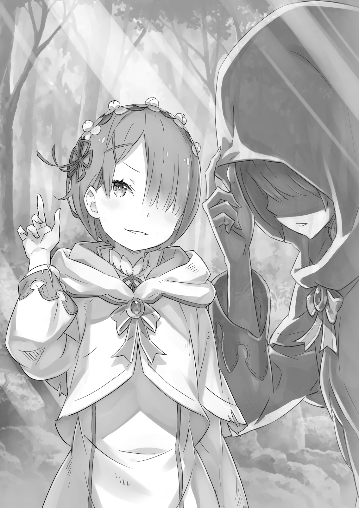
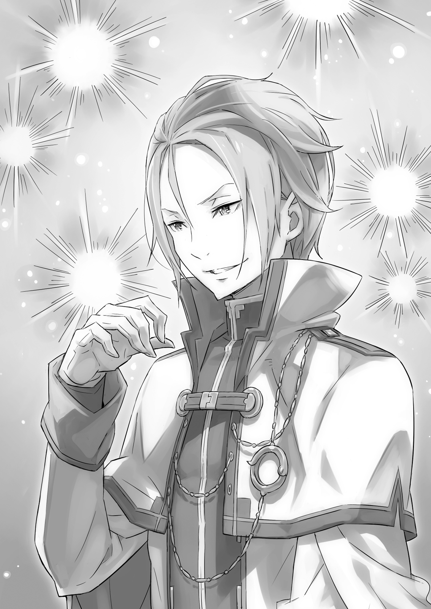

**1**

Когда отряд Субару вернулся с телами погибших, встретившие их рыцари оказались потрясены.

По счастью, в лагере обошлось без происшествий. Узнав о схватке в лесу и понесённых потерях, воины помрачнели.

Каждый горько жалел, что пропустил сражение, и поклялся помогать Субару всеми силами.

Затем стали обсуждать, как действовать дальше. Однако возникшие вопросы нельзя было решить с наскока. В первую очередь это касалось греховных архиепископов Лени, которые встали серьёзной преградой на пути отряда.

Феррис поднял руку:

— Я осмотрел труп второго архиепископа Лени. Как и думал, он отличается от тел других адептов. Я обнаружил следы странного заклятия.

Субару нахмурился:

— Хочешь сказать, вместо кристалла, который адепты используют для самоубийства, нашлось нечто иное?

— Именно! Разглядеть это заклятие было не так-то просто, но я постарался, и всё стало ясно как день. Наверняка оно наложено и на прочих архиепископов Лени.

— Думаешь, это некий механизм, запускающий Полномочие?

— Не могу знать точно, р-мяу. Однако теперь мы понимаем, что с некоторыми адептами Петельгейзе в особых отношениях. Значит, это может быть как-то связано с той жуткой способностью, которой владеет греховный архиепископ.

Что архиепископов Лени много, для членов отряда уже не было тайной. И слова Ферриса лишь служили тому подтверждением.

— Выходит, сейчас важно понять, сколько архиепископов Лени осталось.

— Пока на нашем счету двое, но полагать, что дело сделано, чрезвычайно опасно! — предостерёг Юлиус. — Считаю, нужно исходить из худшего, а именно: в каждой из групп, именуемых «пальцами», все члены могут быть Ленью.

— Ну, это ты хватил лишку! — возразил Субару. —Если бы они обладали Полномочием, использовали бы его против нас, но никто этого не сделал.

— Не сделали, потому что «пальцы» — это не группы адептов под предводительством греховного архиепископа.

Ответ Юлиуса показался Субару бессмыслицей, но Феррис и Рикардо, судя по лицам, прекрасно поняли, о чём речь.

— Ясно! — заговорил Рикардо. — Хочешь сказать, «пальцы» — это как бы правая и левая рука греховного архиепископа, так?

— Стойте! — запаниковал Субару. — Правая рука, левая — это же части тела!

— Речь идёт о ближайших помощниках, — объяснил Феррис. — Субарунчик, ты же сам высказывал такие предположения, когда мы пытались понять, что такое «пальцы»!

— А!..

Только теперь юноша понял, к чему они клонят. Субару вспомнил несколько случаев, когда Петельгейзе называл своих подопечных «пальцами», но, что он конкретно имел в виду, приходилось лишь догадываться. Субару полагал, что «пальцами» Петельгейзе называл группы подчинённых.

Но вдруг «пальцы» — это особые адепты, каждый из которых обладает тем же Полномочием, что сам Петельгейзе?!

— Раз число архиепископов Лени равно числу пальцев… стало быть, Петельгейзе лишь один из десяти?

— Если предположить, что в каждом лагере есть свой архиепископ Лени, выходит, нам крупно повезло, что успели по-быстрому с ними расправиться, — заметил Юлиус.

— Осталось три лагеря… Значит, и «пальцев» ещё как минимум три-мяу.

Всегда нужно учитывать наихудший сценарий. Не стоит недооценивать противника, иначе заплатишь высокую цену. Субару усвоил этот урок на собственном опыте.

А самое плохое, что может сейчас случиться…

— Надо эвакуировать особняк и деревню, — произнёс Субару упавшим голосом. — И чем скорей, тем лучше.

— Честно говоря, я и сам хотел это предложить, — сказал Юлиус и подмигнул. — Теперь, когда известно, что главная угроза в лице архиепископа Лени не устранена, прежде всего мы должны помешать адептам. Нельзя допустить, чтобы они осуществили задуманное — причинили вред госпоже Эмилии и жителям деревни.

— Этих чертей осталось меньше половины, — заметил Рикардо. — Думаю, адепты уже в курсе, что на них идёт охота. Боюсь, как бы не пустились во все тяжкие…

Рикардо был того же мнения, что и Юлиус. Озабоченно нахмурившись, Субару кивнул. Культу Ведьмы, несомненно, известно об отряде. И внезапная атака это доказывает.

— Вторая Лень нас поджидала, значит, в какой-то момент мы выдали своё присутствие, — предположил Субару. —Но это не страшно. Главное — чтобы враг не догадался про нашу главную цель, иначе пиши пропало.

Лишаться военного преимущества было обидно, однако волновало Субару совсем другое. Нужно во что бы то ни стало скрыть истинные мотивы пребывания в землях Мейзерса! И юноша горячо надеялся, что адепты ни о чём не догадываются.

Если же члены Культа узнают правду, битвы в деревне не избежать…

— Адепты ещё не заметили, что по равнине можно передвигаться совершенно свободно, так что эвакуация должна пройти гладко.

— Если удастся увезти госпожу Эмилию и остальных в безопасное место, мы сможем продолжить охоту на Культ, — сказал Феррис. — Перед сражением нужно прикрыть все слабые места, иначе придётся туго. В особенности нам с тобой, Субарунчик.

— Стыдно признаться, но… так и есть… — вздохнул юноша.

Затем он обратился к отряду, чтобы узнать, нет ли возражений. Время поджимало, но все, к счастью, были согласны.

— Отлично. Тогда берём торговцев и все вместе направляемся в деревню. Идёт?

— Мы не знаем, где и когда нас атакуют оставшиеся архиепископы Лени. Твои глаза нам необходимы как воздух! —подтвердил Юлиус.

Таким образом, план был принят единогласно.

— О, наконец-то и мы при деле! — оживились странствующие торговцы. Судя по всему, они не любили засиживаться на одном месте. Однако о причастности Культа Ведьмы им до сих пор ничего не сообщили… Если торговцы узнают правду, это может расстроить все планы.

— Ты тоже заждалась, Патраш. Ладно, не злись!

Дракониха сердилась на Субару за то, что юноша оставил её в лагере, а сам отправился в лес. Когда он заговорил, угольно-чёрная Патраш недовольно отвернула морду.

— Слушай, это же дебри! А если б ты споткнулась и сломала ногу?!

— Ваш земляной дракон принадлежит к самому лучшему виду — «диана». Одни животные пригодны для перемещений по пустыням, другие — по территориям, где царит вечный холод. Но драконы вида «диана» приспособлены к любой местности, — объяснил Вильгельм.

— Ого! — Глаза Субару округлились. — Прямо-таки к любой? И к лесу?

— И к лесу, и к пустыне, и к берегу. Да хоть к айсбергу!

Субару выбрал дракона, полагаясь исключительно на интуицию, но тот неожиданно оказался едва ли не лучшим в своём роде. С самого начала их дружбы Патраш показала себя весьма сообразительной и ловкой, и теперь выяснилось почему.

— И стоит она как целый особняк, — заметил Феррис.

— Ни слова больше! Молчи! Я и сам понимаю!.. — Теперь Субару было боязно даже сидеть верхом на своём звере.

В ответ на отчаянную просьбу Феррис улыбнулся.

Но на этот раз улыбка рыцаря показалась юноше мрачноватой. Субару догадывался, в чём причина. Продолжая ехать рядом с Феррисом, он понизил голос:

— Извини. У тебя со мной столько хлопот…

— Чего это ты вдруг? Съел что-то не то? Могу подлечить.

— Не прикидывайся. Сам же говорил: я не единственный, кто хочет, чтобы все остались живы…

Феррис смутился и умолк. Похоже, Субару угодил в самое яблочко. Не только он винил себя за смерть товарищей. Лекарь, видимо, мучился ещё сильней, поскольку обладал техникой спасения. Однако Феррис был достаточно сильным, чтобы не показывать виду и держать всё в себе.

— Возможно, мои слова для тебя ничего не значат, но… я очень рад, что ты с нами. Серьёзно!

— Да ладно-мяу. Толку от меня ноль, и я знаю это лучше, чем кто бы то ни было. Позволил умереть одиннадцати бойцам, не смог предотвратить самоубийство противника!.. Только болтаю, а делать ничего не делаю…

— Но одного ты всё-таки спас! Он жив лишь благодаря тебе!

Субару говорил о раненом, что ехал в драконьей повозке позади. Измождённый боец так и не пришёл в сознание. Однако его жизни уже ничто не угрожало. И всё благодаря Феррису.

Юноша знал не понаслышке, как это тяжело — спасать чьи-то жизни…

— Ты намного важнее для нас, чем думаешь. Нет, правда!

Слышать такое от Субару лекарю было непривычно.

— Ты чего это? Вдруг воспылал ко мне и решил подкатить? Потянуло на мальчиков? — ужалил в ответ Феррис.

— Ничего не потянуло, и ни к кому я не подкатывал! Я серьёзно говорил!

Губы Ферриса растянулись в улыбке, и рыцарь издал протяжный вздох:

— Если серьёзно, тогда я тоже буду с тобой серьёзен. Не беспокойся, я не ломаю голову над смыслом жизни. Эту стадию я давным-давно миновал.

— Вот как?..

— Но ты меня немножко утешил. Ну так, самую малость.

Бросив лукавый взгляд на Субару, Феррис сблизил большой и указательный пальцы, показывая масштаб утешения.

Видя, что Феррис и правда повеселел, юноша вздохнул с облегчением.

— Да, вот ещё что: Субарунчик, тебе нужно наладить отношения с Юлиусом, и как можно скорее. Серьёзно.

Феррис так резко поменял тему, что у Субару снова округлились глаза.

— В каком смысле «скорее»? Ты же видишь, мы и не вспоминаем о той ссоре…

— Вижу, но ты продолжаешь подсознательно точить на него зуб. Поэтому, когда приходится выбирать, всякий раз вычёркиваешь Юлиуса из списка. Поверь, на него можно положиться! Хотя не спорю, Юлиус неуживчив и порой его трудно понять…

Феррис помахал рукой, показывая, что разговор закончен, и углубился в размышления о природе магических кристаллов Культа Ведьмы. Субару же никак не мог выбросить из головы их разговор.

— Подсознательно точу зуб на Юлиуса?..

В чём-то Феррис действительно оказался прав. Глубоко внутри Субару всё ещё обижался на Юлиуса и видел в нём соперника. Принимая решения, Субару, разумеется, оставался беспристрастным, но подавлял ли он при этом подспудные мотивы?.. Юноша не был уверен.

Субару хмуро глядел вперёд, как вдруг почувствовал сладкий аромат. На обочине покачивались очаровательные небольшие цветы с голубыми лепестками. Растения показались Субару знакомыми, он вспомнил живописное поле, па котором они с Эмилией когда-то проводили время.

— Как бы хотелось поскорее расквитаться с врагами и вернуться триумфатором…

Субару не терпелось завершить начатое, но также был соблазн пойти па попятную. Скоро они прибудут в деревню Эрлхэм и начнут эвакуировать людей. Обитателей особняка, само собой, тоже. А значит, Субару встретится с ней!

— Лучше б эта встреча произошла, когда всё будет сделано!..

А пока на счету Субару были сплошные недоделки. Охоту на Культ Ведьмы бросил на полпути, в столице недолечился. Он желал встречи, но не был к ней готов, ведь все его выходки ещё предстояло искупить. В таких обстоятельствах явиться к Эмилии с гордо поднятой головой! он просто не мог. Осознавать это было ужасно больно. Однако безопасность Эмилии и других людей стоила того, чтобы стерпеть эту боль…

«Кажется, за мной было три прегрешения…»

Об этом он узнал на пороге смерти, когда мир накрыла белая нелепа. Приговор глупцу и убийце, что нарушил обещание и растоптал чувства. В третьем круге Пак наслал на юношу проклятье, а затем убил его.

— Эй, стоп, стоп! Какого чёрта я себя гружу?! Когда едешь кого-то спасать, нужно быть принцем на белом коне! Принц, конечно, из меня никакой, да и дракон чёрный… Но попытаюсь как-то приободриться… «Сражайся!» — разве не так говорил Вильгельм? И речь не только о поле боя. Что бы ни произошло, важно сохранять присутствие духа и не опускать руки! Верно, Вильгельм?

Мечник ушел немного вперёд, но, услыхав своё имя, обернулся.

— Гм?.. Да, — кивнул он после секундной паузы. — Именно так.

Юлиус, наблюдавший за ними со стороны, тяжко вздохнул.

— Не стоит лишний раз тревожить господина Вильгельма. Понимаю, тебе есть над чем поразмыслить, но держи себя в руках и не докучай окружающим.

— То, о чём я размышляю, тебя тоже касается.

— Если не ошибаюсь, ты признал свою ошибку и мы помирились.

— Логика — это одно, а эмоции, знаешь ли, совсем другое!.. Чёрт, точно! Вот оно и проявилось!

Юлиус недоуменно уставился на Субару.

То, о чём говорил Феррис! Юноша осознал, что и впрямь точит зуб на Юлиуса. Субару понимал: делить им нечего, но чувство обиды оказалось сильнее доводов разума. Феррис был прав.

— Э-э… В общем… Я тут подумал… — сбивчиво и очень осторожно начал Субару, стараясь не глядеть на Юлиуса. —Я должен кое-что сказать… — Он мучительно подбирал слова, желая поскорее избавиться от семян раздора, которые только что обнаружил в себе.

Узкая лента лесной дороги уходила далеко вперёд. Вдали уже должна была показаться деревня Эрлхэм, но горизонт упрямо скрывал её от глаз путников, словно давая им время завершить беседу.

— Там, на тракте… мы решили, что забудем о неприятном происшествии. Прости, похоже, у меня не получилось. Не то чтобы я тебе не доверял, нет… Но мне кажется, с тобой трудно иметь дело. Поэтому иногда я поступал… не очень справедливо… Так считает Феррис.

Юлиус молчал.

— Нет, я говорю не под влиянием Ферриса. Я сам считаю, что не доверять кому-то из своей же команды — очень плохо. Поэтому…

Субару никак не переходил к сути. Молчание Юлиуса становилось нестерпимым. Вставил бы хоть слово! Разве это справедливо, когда один собеседник отдувается за обоих?!

— Ты вообще слушаешь? Я всё бубню что-то, а ты…

Заливаясь краской и сердито глядя перед собой, юноша сплюнул и повернулся к Юлиусу. Субару хотел уже сказать красавчику всё, что о нём думает, но забыл главное: этот разговор он начал лишь затем, чтобы наладить с Юлиусом дружеские отношения…

Однако не успел Субару и рта раскрыть, как в лицо ударил ветер. Юноша машинально закрылся руками. В неожиданно сильном порыве ощущался цветочный аромат. В первое мгновение Субару испугался: не случилось ли чего? Оторвав руки от лица, он увидел…

Длинная вереница земляных драконов исчезла! Субару остался один.

**2**

— Какого?..

Субару сразу смекнул: случилось невероятное, но что именно — пока не понимал.

По-прежнему сжимая поводья, он ошарашенно огляделся. Пейзаж был всё тот же: к дороге с обеих сторон подбирались лесные заросли. Только вот боевые товарищи как сквозь землю провалились, оставив Субару в одиночестве…

— Нет, всё-таки я не один…

Юноша по-прежнему сидел верхом на Патраш. Дракониха была невредима. Наверное, опа не исчезла потому, что находилась с Субару в физическом контакте.

— Что же это такое?! Дыра в пространстве? Телепортация?..

Отряд исчез в один миг, поэтому другие версии в голову не приходили. Место, похоже, оставалось прежним. Значит, телепортировались все, кроме самого Субару.

Оставить его в одиночестве было выгодно только одной силе — Культу Ведьмы.

— Чёрт! — спохватился Субару. — Не время стоять разинув рот! Вперёд, Патраш!

Он ударил поводьями по спине драконихи, та взревела и пустилась во весь опор. Следовало как можно быстрее преодолеть пустынный тракт и оказаться среди людей. Субару внимательно глядел по сторонам, ожидая нападения. Не исключено, что из зарослей выскочат Незримые Длани какойнибудь новой Лени.

Однако длани и не думали выскакивать. Субару начали терзать сомнения. В ту же секунду движения Патраш стали какими-то неуверенными. Сомнения всадника и робость драконихи возникли по одной и той же причине: они мчались уже с полминуты, но пейзаж нисколько не изменился!

Объяснить это телепортацией не получалось. Субару вспомнил, что нечто похожее с ним уже происходило.

— Вроде бесконечного коридора Беатрис… Но здесь же нет дверей!

Однажды Субару столкнулся с подобным явлением: он угодил в магический зацикленный коридор Беатрис, девочки из поместья Розвааля. В тот раз выбраться из ловушки ему помогло чутьё — Субару просто открыл нужную дверь.

Однако теперь всё было сложней. Он находился на лесной дороге, и ни одной двери — ни правильной, ни ложной —поблизости не было. Чутьё здесь бессильно…

— Чёрт! Только я решил не париться над проблемами в одиночку, как тут же влип!

Ещё несколько минут назад его поддерживал целый отряд, готовый преодолеть любые трудности. Но не успел Субару этому порадоваться, как снова оказался один. Впору было взвыть от тоски. Юноша со злостью оглядел неизменный пейзаж и в отчаянии завопил:

— Эй! Кто-нибудь! Отзовитесь! Кто-ни-бу-у-удь!..

Если на крик явятся адепты, плевать. Пускай внимание хоть одного из них переключится на Субару, это гораздо лучше, чем ничего.

Однако попытка не увенчалась успехом: ни свои, ни чужие не откликались.

Чудеса, да и только! Неужели его одного забросило в какое-то другое измерение? Субару не знал, как именно работает магия этого мира, и потому не исключал такой возможности.

— Стой, Патраш. Надо успокоиться, взять себя в руки и хорошенько подумать.

Дракониха замедлила ход и в конце концов остановилась. Поначалу Субару опасался, что противник этого и ждёт, однако нападения не последовало. В лесу воцарилась тишина, от которой по телу пробежали мурашки. Лишь голоса насекомых да ветер. Теперь, когда исчез шум дыхания десятков людей, мир погрузился в безмолвие. Прямо как тогда, при появлении адептов…

— Да нет же! Сейчас всё по-другому!

Как только Субару подумал об этом, странное чувство заставило его резко поднять голову. Он огляделся: та же картина. Однако, кроме стука собственного сердца и дыхания Патраш, юноша различил звуки, напоминающие пение сверчков. А перед появлением адептов должна воцариться полная тишина.

— На дыру в пространстве не похоже… Но что тогда со мной случилось?

На территорию, где хозяйничал Культ Ведьмы, он не перенёсся. Может быть, кто-то создал участок тракта с подобным пейзажем?.. Исключено! Даже сверхсильный маг вряд ли способен на такое. Причина скрывалась в чём-то другом…

Субару попытался вспомнить, что же произошло в самом начале. Что случилось в тот момент, когда он оказался в одиночестве. Сперва подул сильный ветер, а это уже странно.

— Должна была сработать Божественная Защита от ветра Патраш. Защита сводит к нулю и ветер, и тряску. Откуда же прилетел этот чёртов порыв?! Похоже, что-то случилось в тот миг, когда подул ветер. Нет, думаю, даже ещё раньше… Надо вспомнить что-то примечательное… Цветочный запах?

Аромат цветов. Да, сладкий аромат цветов. Насыщенное благоухание, от которого становилось дурно. Смешиваясь с ветром, оно через ноздри проникало в самый мозг. Запах всё ещё витал в воздухе.

— A-а?.. Какого чёрта?

Аромат, на который Субару до сих пор не обращал внимания, бил в нос с дьявольской силой. Судя по всему, в нём и таилась опасность. Юноша сразу же задержал дыхание.

«Как же я раньше не замечал?!»

Осознав, что некая необъяснимая сила, возможно, уже хозяйничает в его голове, Субару содрогнулся от ужаса. Шестое чувство подсказывало: именно этот аромат виновен в нынешней передряге.

А раз так, то источник аромата…

— Цветок на обочине!

Субару слез с Патраш и подошёл к одиноко растущему цветку, что покачивался от прикосновений нежного ветерка. Растение было похоже на анютины глазки. Убедившись, что это и есть главный преступник, Субару присел на корточки рядом с цветком и тут же застыл в растерянности. Как поступить? Вырвать злодея с корнем или растоптать? Не в силах определиться, Субару решил сперва оторвать чашечку цветка со стебля, как вдруг..,

— Ай!

Стоило юноше прикоснуться к цветку, корень растения оголился. Извиваясь, точно лоза, он обвил шею Субару и стал сжимать её со страшной силой. Юноша издал мучительный хрип:

— Арх!..

Субару плюхнулся на землю и принялся бороться с разбойником — тот уже норовил заползти в горло. Корень оказался невероятно цепким, отодрать его от шеи оказалось не так-то просто. Цветок вёл себя словно живое существо, желающее удушить обидчика. Субару протянул руку назад, к Патраш, прося её о помощи. Но чёрная дракониха не сдвинулась с места, невозмутимо наблюдая за схваткой. В душе Субару разлилось отчаяние.

Дракониха бездействовала, что было весьма странно. Всегда готовая принести себя в жертву ради Субару, она спокойно смотрела, как убивают хозяина. Но почему?! Неужели Патраш решила бросить его на произвол судьбы? Или она не замечает происходящего?

Первую версию Субару отмёл сразу же. Патраш просто не видит его! Цветочный аромат, галлюцинации…

— Этого цветка… нет! Его нет!

Цветка, который пытается его убить, просто нет. Этого опасного растения не существует! Прямо сейчас Субару Нацуки видит то, чего на самом деле нет. Это мираж!

Глаза застили слёзы. Нет, не слёзы, а что-то иное. Патраш вдруг стала нечёткой и через пару мгновений совсем растаяла. В зыбком, изменчивом мире не осталось никого, кроме Субару.

«Это мираж!!!»

— Ах! Гха!.. Кхе-кхе… Кха!

Наконец он сбросил с себя проклятый корень и, жадно вдохнув воздух, яростно закашлялся.

Сквозь слёзы юноша увидел, как цветок, напугавший его до полусмерти, объяло пламя. Огонь пожирал лепестки, стебель и корень, превращал их в чёрные угли. А прямо над сгоревшим цветком, переливаясь красными огоньками, парил низший дух.

— Опять… ты… — произнёс Субару, тяжело дыша.

Тот самый низший дух, выручивший юношу, когда он оказался в плену у безумной женщины. Дух-спаситель приблизился к носу, Субару протянул руку, и тёплый огонёк опустился в ладонь.

В тот же миг чёрные угольки цветка обратились в пепел. Вместо сладкого аромата в нос ударил запах гари, и мир вокруг преобразился.

Дорога, казавшаяся бесконечной, стала размытой, а зелень леса смешалась с небесной голубизной. Картинка сделалась неясной, расплывчатой, словно кто-то плеснул воды в акварель, но через мгновение всё вернулось на свои места. Пейзаж приобрёл былую чёткость… Точнее, это Субару вернулся из мира галлюцинаций в реальность.

— Субару! — послышался суровый голос.

Юноша повернулся и увидел, что рядом с ним стоит Юлиус. На плече рыцаря покоился красный огонёк духа.

**3**

— А, это ты…

Вернувшись в реальный мир, Субару предпочёл бы увидеть что-нибудь более приятное, чем физиономия Юлиуса.

— Какое радушие! Значит, я не ошибся. Сомневаюсь, что моё подсознание способно так точно воссоздать старину Субару! — с удовольствием парировал Юлиус. Протянув руку, рыцарь помог ему подняться, а затем мотнул подбородком в сторону.

Субару поглядел в этом направлении и обомлел: отряд в полном составе — и бойцы, и животные — застыл на месте, словно каменный!

— На нас кто-то напал, — сказал Юлиус. — Похоже на колдовские чары. Я сам отключился на несколько секунд.

Сейчас в сознании лишь мы с тобой. Ты как очнулся?

— Секунд? Я пробыл там несколько минут! Или показалось?..

— Никогда бы не подумал, что ты способен справиться с такой магией. Как же тебе удалось очнуться?

— Получается, они до сих пор там?! Надо что-то делать! Пока рассуждаем, наш отряд перебьют!..

— Я спрашиваю, как тебе удалось очнуться! — разозлился Юлиус. Разговор грозил вылиться в перебранку.

Субару удивлённо уставился па рыцаря. Затем, решив, что сейчас не самое подходящее время для ссор, объяснил:

— Я сжёг цветок, из-за которого начались галлюцинации. Ну, точнее, не я сам… Но виною всему цветок. Я уничтожил его.

— Цветок… Цветок? Значит, колдовские чары распространял аромат цветов…

Юлиус умолк и вновь оглядел заколдованный отряд.

Субару наблюдал за рыцарем широко раскрытыми глазами и гадал, что он задумал. Тем временем Юлиус медленно поднял руку, и па пей появились шесть разноцветных огоньков. Они расположились на руке рыцаря, как на насесте. Был в их числе и красный — спаситель Субару.

— Так это же…

— Это мои малышки так сияют. Сейчас я сообщу отряду, как выйти из мира галлюцинаций. Ин! Нэс!

С этими словами Юлиус раскрыл ладонь. Пара огоньков — белый и чёрный — заскользили по руке и остановились па копчиках пальцев. Затем огоньки слились, сияние стало ярче, и прямо на глазах у изумлённого Субару свет озарил пространство.

— Что за…

Не успел юноша договорить, как в его голове зазвучал голос:

«Мм? Никого не-ет! Где я-а-а?»

— Чего?!

Это был голос девочки. Кажется, она растерялась и не понимала, что происходит. Точнее, не совсем голос… Субару будто бы слышал чужие мысли и чувства, возникающие прямо в его голове. И таких «голосов» было несколько.

«Сбился с пути?.. Нет, кто-то специально разлучил меня с отрядом. Плохи дела…»

«Что за чертовщина?! Сколько рублю этот лес, он ничуть не меняется!»

«Хитрая уловка! Как не вовремя!.. Госпожа Круш…»

«Сестричка, сестричка! Где же ты?!»

«Тиви, наверно, уже изрыдался!..»

Поток чужих мыслей не прекращался. Они без спроса вторгались в череп и проникали прямо в мозг. Их оказалось столько, что одну мысль уже нельзя было отличить от другой, — возникла беспорядочная масса. Чужие мысли скакали в голове, словно мячи, утыканные шипами, и причиняли острую боль.

Возможно, это была даже не боль, а ощущение неподъёмного груза…

— Наверное, я настроил слишком высокий уровень связи, извини. Дыши глубже, сейчас пройдёт.

— Ну ты и… сволочь… — выругался Субару, узнав, что красавец-рыцарь и есть его мучитель.

— Нет времени настраивать передачу лично под тебя. Сейчас главное — вернуть наших.

Юлиус закрыл глаза и замер, видимо сосредоточившись на своей технике. Субару сделал несколько глубоких вдохов и выдохов, но легче не стало ни на йоту. Мозг по-прежнему заполняла каша из чужих мыслей. Ещё немного — и серое вещество потечёт из ушей! Чтобы мутный поток окончательно не забил его собственное «я», Субару принялся размышлять.

Сумбур и путаница в голове — дело рук Юлиуса. Он применил некую магию, чтобы сообщить членам отряда, как вырваться из колдовских чар. Думай! Соратники тоже видят голубой цветок, но в чьих-то галлюцинациях цветок сгорает.

Несколько человек сбрасывают оковы и выходят из водоворота мыслей. Однако пленённых ещё много. Волны морока то отступают, то набегают снова. Но с каждым разом их всё меньше, одна за другой волны сходят на нет. Товарищи возвращаются из дьявольских лап галлюцинаций в действительность.

— Поскорей бы Юлиус освободил их…

Мысленный шторм заглушал все остальные звуки. Субару обливался потом, но терпел. Смахнув со лба липкие капли, он возвёл глаза к небу, В это мгновение прямо над головой раздалось тихое дыхание. Между кронами показалось солнце, но тут же скрылось за фигурой в белом. Она спустилась на землю совсем рядом с Субару.

Пришелец не обратил ни малейшего внимания на Юлиуса, вызволявшего товарищей из иллюзорного мира, и потянул Субару за руку.

— О… Ах!..

Субару едва не упал, а Юлиус, поглощённый работой, даже не шевельнулся.

Тело пришельца с головы до пят укутывал белый плащ, лица видно не было. Очевидно, он собирался без лишних слов похитить Субару. Нюх подсказывал, что именно это существо и наслало на отряд видения. Адепт, не иначе. Если он утащит Субару, с Незримыми Дланями отряду не совладать.

Юноша решил бороться до последнего.

— Чёрт! Секундочку! Думаешь, я позволю тебе…

Не успев договорить, Субару кубарем покатился по земле. Незнакомец был прекрасно развит физически.

Фигура в белом схватила поверженного пленника за руку и потащила прочь, но тут…

— Дза-а-а-а! — раздался пронзительный крик, сверкнула сталь, и похищение было пресечено.

Вильгельм! Дьявольский Мечник быстрее прочих освободился от галлюцинаций и с гневным криком бросился на врага, который посмел опутать его чарами. Меч описал дугу и со страшной скоростью обрушился на стройное существо в белом, однако…

— Уа-а-а!

Пришелец бросил Субару в заросли и с невероятной ловкостью ушёл от клинка: лезвие едва коснулось белых одежд.

Уверенный, что удар будет смертельным, Вильгельм в изумлении распахнул глаза.

— Фура!

Будто желая привести старика в чувство, пришелец выставил вперёд посох и произвёл магический выстрел мечнику под ноги. Удар взрыл землю, образовалась неглубокая круглая воронка, и Дьявольский Мечник прервал свой бег.

Тут враг прыгнул на Вильгельма и ударил ногой в живот.

— Ух!

Каменные мышцы Вильгельма загудели. Кто бы мог подумать, что такой щуплый противник способен отправить Вильгельма в полёт?! Фигура в белом нацелила посох на Дьявольского Мечника, по воздуху пошла рябь. Засвистела воздушная струя, грозившая разрезать старика на части, но, прежде чем струя достигла цели, её полёт был остановлен стальным клинком. Последовал взрыв маны.

Расстояние между Вильгельмом и фигурой в белом позволяло последней использовать магию, зато у мечника был численный перевес.

— Рра-а-а!

Прямо за спиной врага показался огромный тесак. Ревел Рикардо. Силы, которую он вложил в удар, хватило бы, чтоб разрубить каменную шкуру Белого Кита. Достигни удар цели, от противника не осталось бы мокрого места, но…

— Что за чёрт?! — изумлённо прорычал Рикардо.

Фигура в белом обладала поистине фантастической сноровкой. Она с ужасающей быстротой взвилась в воздух и мастерски уклонилась от удара.

— Превосходная техника… — восхитился Дьявольский Мечник.

— Тебе это так просто не сойдёт с рук! Ну, давай! — зарычал собакоголовый воин.

Тем временем противник перевернул посох и приготовился к схватке.

Началась буйная пляска тесака и серебристого клинка. Фигура в белом играючи уходила от атак, а секундные паузы использовала для очередного магического выстрела. Мастерство противника поражало воображение, ведь далеко не всякий выстоял бы против двух сильнейших воинов отряда!

Однако схватку сверхспособных бойцов прекратил третий клинок.

— Пускай ты враг, меня восхищает твоя техника! Но всётаки пора закругляться!

Лезвие рыцарского меча Юлиуса приблизилось к шее замершей фигуры в белом.

В разгар поединка весь отряд вернулся из мира галлюцинаций. Шанс выиграть время и сбежать оказался упущен, и противник сдался. Ему угрожал не только Юлиус, но и Вильгельм с Рикардо: они заняли сдерживающие позиции справа и слева от врага. Бежать было некуда, и фигура в белом это признала.

— Наша взяла!

— Убейте меня. Лучше смерть, чем унижение.

Тонкий голос был спокоен и холоден. Вдобавок в глаза бросались узкие плечи. Хотя то, что они сражаются с девчонкой, воины поняли ещё раньше, когда она выкрикивала заклинание.

Вильгельм смотрел на бесстрашную героиню широко открытыми глазами. Юлиус и Рикардо переглянулись. Среди очнувшихся воинов, которые только начинали соображать, что происходит, пробежала волна тревоги.

— Стойте! Да подождите же! Не спешите!

Размахивая руками, из зарослей выбежал Субару, весь облепленный листьями и травой. Когда фигура в белом швырнула его в лес, юноше оставалось лишь беспомощно наблюдать за схваткой. Однако, услыхав женский голос, Субару невольно встрепенулся.

И не потому, что противником оказалась девушка. Голос этот был ему знаком. Увидев, что к ней несётся Субару, девушка промолвила:

— Барусу…

— Как же я соскучился по этому прозвищу! Но… почему ты здесь?!

Обескураженный открывшейся правдой, Субару протяжно вздохнул. В ответ фигура в белом плаще откинула капюшон. Под ним оказалась девушка с розовыми волосами, глазами малинового цвета и очаровательными, но строгими чертами лица.

— Рам…

Это была служанка из особняка Розвааля. Рам собственной персоной.

**4**

— Надеюсь, Барусу, ты объяснишь мне, с какой целью явился?

Рам — та, из-за кого отряд столкнулся с невиданной опасностью, хрупкая девушка, вступившая в бой с Вильгельмом и Рикардо, — стряхнула с плаща пыль и вонзила в Субару крайне неприязненный взгляд.

— Это я должен спросить, зачем явилась…

Сжимаясь под суровым взором, юноша переключил внимание на невесёлое зрелище. Повсюду — в лесу и на дороге —виднелись следы схватки. Бойцы отряда, освобождённые от заклятия, переводили дух. К счастью, воины отделались небольшой головной болью. Раненых не было, Рам тоже осталась невредима. Однако отсутствие потерь не означало, что инцидент исчерпан.

В чём же дело? Сдерживая тяжкий вздох, Субару посмотрел на Рам:

— Ты ударила первая и получила отпор. Что может быть более гнусным, чем бить по своим?.. Вильгельм, вы не ранены?

— Царапнуло Магией Ветра, только и всего. Обращусь потом к Феррису. Главное, что я не успел нанести удар по девушке. Это было бы непоправимо.

Вильгельм поднял руку и, горько улыбнувшись, показал прореху в рукаве. Старик был так великодушен, что у Субару словно гора с плеч свалилась.

Рам недовольно слушала, сложив руки на груди, но, когда прозвучало имя пожилого мечника, пробормотала:

— Вильгельм… Вильгельм ван Астрея?

Услыхав своё полное имя, Дьявольский Мечник повернулся к Рам, и девушка кивнула:

— Никогда бы не подумала, что придётся драться с Дьявольским Мечником, Теперь ясно, почему я проиграла.

— Так меня называли в золотые годы. С каждым днём я всё слабее. Как ни старайся, годы берут своё. Моя сноровка стала в два раза хуже, чем была раньше…

— Похоже, вы ехидничаете или кокетничаете! Ведь, несмотря на то что сноровка стала «в два раза хуже», вы с лёгкостью взяли верх! — отрезала Рам в ответ на скромное замечание Вильгельма.

Однако мечник, в отличие от Субару, всё равно был настроен дружелюбно. Юноша приблизился к Рам и одёрнул её:

— Как ты смеешь так разговаривать с Вильгельмом?!

Со мной ты никогда не церемонилась, я уже привык, но с другими будь-ка повежливей!

— Хочешь, чтобы я обращалась с вами как с гостями? — Рам щёлкнула Субару по носу. — Да, пожалуй, ты прав. Ах, прошу простить меня за неучтивый приём, дорогие гости!

С этими словами Рам отвесила поклон. Изображая идеальную служанку, девушка натянула на своё очаровательное кукольное личико ледяную улыбку:

— Снова прошу прощения, но впереди находится поместье графа Розвааля L. Мейзерса. В настоящее время по приказу хозяина посторонним вход на его земли запрещён, поэтому возвращайтесь, пожалуйста, туда, откуда явились.

— Кажется, в конце ты слегка забылась… В каком смысле «запрещён»?!

— В самом прямом! Поручено обеспечить строжайшую охрану поместья. О допуске посторонних не может быть и речи. Впрочем, такому неблагодарному типу, как ты, Барусу, без толку объяснять…

— Неблагодарному?.. — Субару помрачнел. Столь нелестную оценку он не мог пропустить мимо ушей.

Рам кивнула:

— А разве нет? Господин Розвааль был так добр к тебе, но, как только ты перестал в нём нуждаться, тут же завилял хвостом перед новым хозяином. А может, ты с самого начала разыгрывал спектакль, чтобы втереться в доверие? Если так, тебе удалось обвести нас вокруг пальца.

— Да погоди! Ты всё неправильно истолковала! Ты совсем не понимаешь, что происходит!

— Кусаешь руку, которая тебя кормит. Что тут понимать…

— Да послушай!

Рам всегда отличалась язвительностью, но сейчас она вела себя откровенно враждебно. Холодный взгляд пробирал до дрожи. Здесь явно что-то не то…

Почему она стала такой упрямой? Надо срочно объяснить ей всё, но каким образом?..

— Точно, письмо! — Субару хлопнул себя по лбу. — Вам должны были доставить письмо! Получили его?

— Письмо… — повторила Рам и хитро сощурилась. Судя по всему, она поняла, о чём идёт речь.

— Рам,что случилось?

— Да, мы получили послание из столицы. Но у меня язык не повернётся назвать его письмом.

Голос девушки звучал монотонно, однако в нём ощущалась неудержимая злость. В чём причина этой злости, Субару не догадывался. Рам хмыкнула, словно ответ лежал на поверхности.

— «Письмо», которое нам торжественно вручил посланец, оказалось чистым листом бумаги. Очень забавно. Что ты хотел этим сказать, Барусу?

— Чистым листом бумаги?!

Неожиданная новость поразила Субару, и глаза юноши растерянно забегали. Рам не сводила с него гневного взгляда.

— На восковой печати, скрепляющей конверт, красовался фамильный герб дома Карстен — лев, обнаживший клыки. То есть наш политический оппонент, герцогиня Круш Карстен, объявила войну. Вот что мы получили.

— Но это же чушь! — в замешательстве выпалил Субару. — Зачем делать поспешные…

— Пустое послание, — перебил Вильгельм, — метафора, означающая, что диалога не будет. Тут всё ясно.

Нахмурившись, мечник задумчиво покачал головой:

— Мне не остаётся ничего, кроме как ответить тем же, то есть объявить вас врагами.

— А что, если пустое письмо было послано по ошибке?! Из-за какого-то ротозея вспыхнет война?!

— В таком случае тебе придётся признать ротозеем своего хозяина, — сказала Рам. — Но дело не только в письме, есть и другая проблема.

— Другая проблема?.. Неужели стряслось что-то ещё?!

— С позавчерашнего дня в окрестностях особняка неестественно тихо. Выяснить причину не удалось даже мне. А потом появился вооружённый отряд Карстен, объявившей нам войну через пустое письмо. Моё хрупкое сердце еле выдержало, ты это понимаешь?

— Ух…

Рам бросила на Субару такой взгляд, что на этот раз под угрозой оказалось уже его сердце.

Вильгельм встревожился, но Субару поднял руку, показывая, что всё нормально. В то же время он мысленно проклинал судьбу за бесконечный кошмар, выпавший на его долю.

Положение хуже некуда! Получалось, Рам по ошибке связала пустое письмо, появление Культа Ведьмы и передвижение отряда! Она расценила эти события как происки лагеря соперника. Теперь Рам считает Субару последним негодяем, предавшим Эмилию и перебежавшим на сторону Круш.

— Как тебе такое в голову могло прийти! Думаешь, я настолько коварен?!

— Ты кусаешь руку, которая тебя кормит. Вот что я думаю.

— Уже говорила!

— Но ты, видимо, так и не понял. Впрочем, достаточно. Картина в целом ясна.

Рам никогда не лезла за словом в карман. Но, судя по всему, теперь она более-менее представляла, что произошло на самом деле. Возможно, девушка почувствовала, что такой простак, как Субару, не способен на интриги.

— Значит, пустое письмо послали по ошибке и Барусу до сих пор является верным псом госпожи Эмилии… Я верно понимаю?

— Верно, хотя звучит не очень приятно. Правда, собака вроде как член семьи… Ладно, быть псом Эмилии не так уж и плохо.

— Не слишком ли низко вы метите? — поинтересовался Вильгельм.

Но из страха, что Рам прекратит разговор, Субару помотал головой. Теперь, когда с недопониманием было покончено, следовало переходить к делу.

— Вильгельм и все эти люди пришли на помощь, они мои друзья. Мы собрались, чтобы уничтожить свору негодяев!

Рам нахмурилась. Злосчастное недоразумение могло разрушить союз между лагерями, достигнутый с таким трудом.

Мысль об этом приводила в трепет, однако Субару гордо поднял голову и заявил:

— В столице у меня оставалось одно дело. Так вот, я его завершил. Теперь между Эмилией и леди Круш заключён союз на равных. И люди, что пришли со мной, тому доказательство!

**5**

Вскоре отряд Субару и Рам направились в деревню Эрлхэм.

Времени было в обрез, да и на схватку с Рам ушло немало драгоценных минут. По дороге Субару потрудился объяснить девушке, как именно обстоят дела.

С товарищами по оружию тоже было о чём поговорить. Субару поблагодарил воинов за заботу и сердечно попросил прощения за недавнее происшествие. Рам тоже извинилась. Поскольку обошлось без жертв, посчитали, что недоразумение исчерпано.

— Заставила же ты Вильгельма попотеть!.. — заметил Субару, держа поводья. — А он даже и не обиделся.

— Этот господин достоин восхищения, — ответила Рам, придерживаясь одной рукой за талию Субару. — Слухи о нём оказались правдой.

— Ещё бы! Конечно! Ты сомневалась?

— Чему ты так радуешься, Барусу? Глядеть тошно!

На похвалу в адрес Вильгельма Субару отозвался с преувеличенным восторгом. Рам сморщилась, причём довольно искренне, и пальцем свободной руки ткнула Субару в бок.

В эту минуту они ехали верхом на драконихе Патраш. Рам сидела, свесив ноги на одну сторону. Искоса взглянув на неё, Субару вспомнил о недавней схватке.

— Хотел спросить… А как ты сумела наслать галлюцинации? Я-то думал, ты владеешь только Магией Ветра…

— Одновременно задействовала Магию Ветра и галлюциногенное снадобье. На самом деле, я хотела похитить одного командира, пока остальные стоят как вкопанные… Сроду бы не подумала, что ты, Барусу, сумеешь освободиться! — Рам на секунду задумалась, затем добавила: —Скорее всего, ты стал невосприимчив к моему снадобью. Я ведь приготовила его из чайных листьев, которые обычно заваривала для тебя.

— То есть постоянно поила меня ядом?!

— Шутка.

Не похоже это было на шутку, однако Субару не стал приставать с расспросами. И не потому, что боялся узнать правду. В руке, которой Рам придерживалась, чтобы не упасть, юноша почувствовал дрожь.

Тем не менее Субару немного расслабился и сказал о том, что не давало ему покоя:

— Извини, мы напрасно потревожили тебя. Вижу, ты серьёзно настроена.

— Да, я готова умереть, лишь бы не упустить врага. Я действительно могу доверять джентльменам, что едут позади?

— Думаешь, они воспользуются моментом и пойдут штурмовать особняк? На него и так готовят нападение весьма неприятные ребята. Даже леди Круш не очень-то горела желанием с ними связываться.

— Значит, в лесу скрываются преступники, которые охотятся на госпожу Эмилию… — вымолвила Рам, намекая на адептов.

— Вообще-то, я рассказал об этом в письме… — вздохнул Субару, сетуя на досадное недоразумение.

Он так надеялся, что послание сработает, но всё пошло наперекосяк. К тому же пустое письмо, доставленное в поместье, свидетельствовало о новой проблеме. Кто-то, желая рассорить Эмилию и Круш, подменил конверт.

— Как вы поступили с посланцем, принёсшим письмо?

— В особняке ему оказывают должный приём. Его можно использовать при обмене заложниками.

— При обмене заложниками?..

Единственными кандидатами в заложники были Субару и Рем. Юноша вспомнил: во время нападения Рам первым делом попыталась освободить его самого. Видимо, полагала, что Субару находится в плену у врага.

Выяснять это бесполезно, ведь Рам ни за что не признается. Но, как бы то ни было, гонец задержан, и если он окажется шпионом, то будет допрошен, вот и всё.

— По поводу тех, кто скрывается в лесу. Можешь расслабиться, мы уничтожили семьдесят процентов их сил, — сообщил Субару, чтобы сменить тему разговора. — А тех, что остались, обязательно выловим, и я знаю как.

— Уничтожили семьдесят процентов?.. — удивлённо переспросила Рам. — Считай, вы истребили их, Барусу.

— Адептов следует убить всех до последнего. Но чем меньше их становится, тем больше времени уходит на поиски. И если они рассвирепеют, придётся туго.

— Поэтому ты подготовил повозки для эвакуации… Поджидать врага, сидя в особняке, по-твоему, глупо?

— Этим ублюдкам ничего не стойт спалить особняк. Обидно, конечно, ведь у нас столько воспоминаний с ним связано… Думаю, теперь понятно, что лучше всего сбежать.

Для этого Субару и привёл с собой подкрепление и целую группу странствующих торговцев с драконьими повозками. Когда юноша закончил свой рассказ, Рам задумчиво прикрыла глаза. Субару большей частью действовал так, как сам считал нужным. Неудивительно, что многие подробности плана её смущали. Однако…

— Извини, что самовольничаю, но я так решил. Право принимать решения… Кстати, Розвааль ведь отсутствует?

— Да, господин Розвааль отправился к Гарф… в Святилище и приказал мне исполнять распоряжения госпожи Эмилии.

— Так это распоряжение Эмилии — насылать галлюцинации на всех, кто приблизится к деревне, и убивать людей?

— Нет, это я сама решила.

— Так и думал!

Эмилия не прибегла бы к подобной жестокости даже под давлением. Субару вздохнул с облегчением.

— Ты такой простак, Барусу, если тебя это успокаивает…

— А? — переспросил юноша, не расслышав бормотание Рам.

— А вот и деревня. — Рам указала пальцем вперёд. Субару перевёл взгляд на дорогу: вдали виднелась околица Эрлхэма. Тракт, который в мире галлюцинаций был непреодолимым, кончился.

— Неужели я наконец вернулся?..

Два раза он заставал Эрлхэм в руинах. А ещё раньше, прежде чем адепты устроили там бойню, Субару попал в деревню, повредившись рассудком. Значит, данное возвращение можно было считать первым. Сейчас он достиг этого места, что стало таким родным, не теряя самого себя, в здравом уме и твёрдой памяти.

— Вот только… не похоже, что нам тут рады…

Отряд остановился на площади посреди деревни. Эффектное появление чужаков вызвало неподдельный интерес: из близлежащих домов стали выглядывать сельчане. Однако на их лицах была отнюдь не радость, а вполне объяснимые тревога и смятение. Не каждый день тут объявляются вооружённые незнакомцы.

— Рам, насколько люди осведомлены?

— Им объяснили, что лучше не покидать дома без особой надобности и не ходить в лес. Без подробностей.

— Отлично! Мудрое решение.

Стоило только упомянуть Культ Ведьмы, и в деревне мог начаться переполох. Так что заблуждение Рам, считавшей врагом Круш, сослужило им добрую службу.

— Эй, так это же… господин Субару и госпожа Рам!

— И правда! Господин Субару вернулся?

Сельчане узнали Субару и Рам, сидящих верхом на драконе. Двигаясь во главе отряда, они привлекали всеобщее внимание. Посчитав, что сейчас самое время, юноша спешился. По логике, объясняться с жителями деревни должен был он сам.

— Барусу…

Субару жестом остановил Рам.

— Постой здесь. Вильгельм, Юлиус, Рикардо! — подозвал он трёх главных воинов отряда.

Сделал он это, чтобы добавить себе веса в глазах сельчан, ведь троица выглядела солидно и располагающе. Вчетвером они вышли на середину площади.

— Субару, сдаётся мне, они все на взводе. Держи ухо востро! — шепнул Юлиус.

Юноша кивнул, сделал глубокий вдох и громко хлопнул в ладоши. Местные жители, все до единого, уставились на него. Убедившись, что вызвал достаточно интереса, Субару начал речь, призванную успокоить народ:

— Итак, внимание! Попрошу внимания! Вот мы спустя столько дней и встретились. Как поживаете?

Сельчане безмолвствовали. Субару повысил голос: — Извините за внезапное вторжение, но сегодня я пришёл, чтобы кое о чём вас попросить.

После краткого приветствия Субару сразу же приступил к делу. Сельчане, издалека следившие за оратором, переглянулись. Все они знали Субару, и юноша помнил каждого. Поскольку тревога и смятение людей были ему понятны, Субару старался говорить как можно мягче, при этом быстро и без пауз. Эвакуацию нельзя было откладывать, потому требовалось вкратце описать, как обстоят дела, и объявить сборы, пока жители не успели опомниться.

— Беда в том, что в окрестном лесу опять расшалились зверодемоны. Чтобы истребить их, я привёл этих людей. А пока они будут делать своё дело, я увезу вас подальше от деревни. Повозок хватит на всех. Правда, комфортную поездку не обещаю…

Субару тщательно подбирал слова, опасаясь вызвать лишние волнения. Люди, наверное, ещё не забыли переполох, связанный со зверодемонами, что случился два месяца назад. Зверодемоны действительно обитали по ту сторону заградительного барьера, и слова Субару должны были прозвучать правдоподобно.

За спиной стоял отряд воинов внушительной наружности, а также множество драконьих повозок. Хотя просьба и напоминала приказ, Субару надеялся, что ему всё же удастся скрыть правду о нападении Культа Ведьмы.

— Через день, в крайнем случае через два, вы вернётесь домой. Конечно, вам не хочется уезжать, но поймите, это для вашей же безопасности…

— Зачем вы нам врёте?

— А?.. — Субару так и застыл с открытым ртом.

Речь прервал коротко стриженный молодой человек. Субару узнал его, поскольку часто общался с местной молодёжью. Слова были сказаны будто бы невзначай, однако, когда их взгляды встретились, молодой человек, чуть поколебавшись, шагнул вперёд:

— Вы привели сюда такую толпу, чтобы охотиться на зверодемонов?! Просто смешно!

— Послушай, вообще-то, зверодемоны — опасные твари! Ты же помнишь, что они устроили в прошлый раз? И чтобы этого не повторилось, я…

— Не вешайте нам лапшу на уши!

Молодой человек и слышать ничего не хотел. Его простодушное лицо исказила гримаса. Он сжал дрожащие руки в кулаки и буравил Субару пристальным взглядом, в котором читались и подавляемый гнев, и отчаяние, и непреодолимый страх.

— Сэр Субару, вы, наверное, хотите нас успокоить, оттого и лжёте.. Но в итоге вы лишь нагоняете ещё больше страха! Всё из-за Культа Ведьмы, так? Мы давно поняли: они что-то задумали!

— Ух…

Слова застряли у Субару в горле. Деревенский юноша набросился на него с криком, и голос смельчака разнёсся по всей деревне, приведя в трепет не только односельчан, что вполне естественно, но и странствующих торговцев. Отряд же сохранял спокойствие, но, когда речь зашла о Культе, лица воинов посуровели.

— Ну вот, видите? Вы даже не отрицаете… — заметил парень упавшим голосом.

Среди жителей деревни вдруг поднялся шум — все разом выплеснули скопившуюся тревогу.

— А ведь люди из особняка и правда говорили вчера о Культе Ведьмы… И что им понадобилось в нашем захолустье?!

— Да чему тут удивляться? Сам же знаешь, что учудил хозяин поместья!

— И зачем ему понадобилось помогать полуэльфу?..

Слушая шумную разноголосицу, Субару с горечью осознал: попытка скрыть правду обернулась против него самого. Сельчане уже давным-давно всё поняли. И то, что вокруг их деревни неспокойно, и то, что это связано с Эмилией, которая живёт в поместье. И такая проницательность грозила плану провалом.

— Погодите! Я виноват! И я прошу прощения! Просто…

И тут Субару увидел: кто-то из сельчан причитал, кто-то в ярости скрежетал зубами, кто-то злобно смотрел исподлобья. Однако причиной тому был не страх перед Культом Ведьмы. Люди боялись загадочного полуэльфа.

— Да что с вами такое?! Полуэльф… Эмилия, она же ни при чём!

— Ещё как при чём! Когда дело касается полудемонов, Культ Ведьмы приходит в ярость! Это каждый ребёнок знает! А хозяин не только покрывает полудемона, но и прочит его в правители! Шутка ли?!

Негодующий крик деревенского паренька вонзился в Субару острым клинком. Видя, как юноша оторопел, мальчишка растерянно заводил туда-сюда глазами, а потом и вовсе сник. Однако отказываться от своих слов он и не думал. Субару посмотрел вокруг: во взглядах людей сквозили похожие чувства.

— Вы с ним согласны? Думаете, во всём виноват полуэльф?

Ответа не последовало, но молчание сельчан было красноречивее любых слов.

Субару считал этих людей друзьями. За несколько месяцев произошло столько разных событий, что юноша не сомневался: дружба между ними только окрепла. Именно поэтому он так отчаянно пытался их спасти и верил, что сельчане примут его помощь без колебаний.

— Неужели я снова веду себя как эгоист?..

Субару недооценил, насколько сильно обитатели этого мира боятся Культа Ведьмы. И даже те, кто не сомневались в добрых намерениях юноши, не могли пренебречь уроками истории…

Субару бессильно повесил голову. Но кто-то подошёл к нему вплотную и, хлопнув по плечу, подбодрил:

— Выше нос! Будь здесь госпожа Круш, она непременно сказала бы: «Оторви взгляд от земли и смотри прямо перед собой!»

— Ты…

— Винишь себя в том, что наделал глупостей? Если нет, тогда не время вешать нос! — уверенно заявил Феррис, чем немало удивил Субару, ведь он никак не надеялся на поддержку рыцаря. Но ещё удивительнее было то, что слова Ферриса показались Субару знакомыми.

Потому что именно это говорила Круш в одном из прошлых кругов.

— Или ты считаешь, что посмотреть людям в глаза гораздо сложнее, чем закатить истерику во дворце?! — вызывающе осведомился Феррис.

— Ну ты… — Субару вконец раскис, хоть это было совсем некстати.

Сколько же можно над ним подтрунивать, вспоминая постыдный случай?..

— Ты прав. В сравнении с тем разом это плёвое дело…

Хоть его снова не желали слушать, Субару ничуть не сомневался, что всё делает правильно. Страх сельчан перед полуэльфами был понятен и, разумеется, тяготил. Реальность не переписать по щелчку пальцев. Изменить её могла только Эмилия, положившись на Субару.

— Мало хотеть чего-либо — нужно действовать!

Если люди относятся к Эмилии несправедливо, нужно доказать им, что они неправы. И Субару вместе с соратниками сделают всё, чтобы у неё появилось на это время, которого сейчас в обрез…

Субару Нацуки хотелось верить, что именно для того он сюда и вернулся.

— Я прекрасно понимаю ваши чувства, ваши обиды. Их не забыть за минуту. Конечно, у вас есть право на своё мнение. Да, мне тяжело принять его, но деваться некуда…

— Сэр Субару…

— Но я прошу, чтобы и вы меня поняли. Я знаю, на душе скопилось немало и вы хотите высказаться. Но сделать это вы сумеете, лишь доверившись нам. Сейчас находиться в деревне опасно. Очень опасно.

Глаза Субару излучали искренность. Сельчане погрузились в молчание. Тишина, повисшая над деревней, становилась гнетущей. Драгоценное время уходило впустую.

— То, что говорит вам слуга господина Розвааля, является не чем иным, как приказом самого господина Розвааля, владельца поместья. Вы — всего лишь вассалы, обязанные подчиняться хозяину. Поторопитесь-ка сделать то, что велят.

Безмолвие нарушил грозный голос Рам. Служанка покинула строй и встала рядом с Субару лицом к сельчанам. Её суровый взгляд и властная речь привели деревенских в трепет. Поднялся гомон.

— Подожди! Я понимаю, почему ты так резко с ними говоришь, но всё-таки, может, стоит быть помягче? У каждого своя жизнь, и понятно, все растеряны…

— Так ты, Барусу, и сам не осознаёшь, что действуешь от лица хозяина? — Рам удивлённо поглядела на юношу. —Если во время эвакуации пострадает ваше имущество или случится что-то ещё, господин Розвааль возместит ущерб! Ну, кто-то сомневается? Пусть назовётся! Так решил господин Розвааль.

Рам говорила жёстко, не оставляя людям права выбора, но материальные гарантии должны были как-то унять их тревогу.

Субару и сельчане удивлённо уставились на служанку. Похоже, все без исключения уяснили: Рам поддерживает юношу и заставит их подчиниться, используя влияние Розвааля.

— Гм… Простите Рам её жёсткость, но, честно говоря, я с ней согласен. Вы должны покинуть деревню. Да, мы прекрасно понимаем, что это очень неожиданно и вы не готовы… Что касается компенсации, я лично поговорю об этом с Розваалем. Доверьтесь нам и сделайте то, о чём вас просят. Пожалуйста! — взмолился Субару, взывая уже не к сердцам людей, а к разуму.

Сельчане ещё немного помолчали, а затем смиренно закивали головами. Согласиться им было совсем не просто, но всё-таки они это сделали. Можно было приступать к эвакуации.

Субару выдохнул. Одну задачу решили. Товарищи, стоявшие позади, тоже вздохнули с облегчением. Все волновались, но преграда была преодолена.

— И всё-таки… — Субару посмотрел на Рам.

— Что? — Лицо девушки выражало озадаченность. Несомненно, именно её слова помогли убедить местных жителей.

Субару подумал, что Рам снова проявила свойственную ей суровую доброту, которую нелегко распознать…

— Так странно было слышать, как ты приказывала людям слушаться меня. Выходит, ты на моей стороне?

В ответ Рам только шмыгнула носом, и юноша слегка успокоился.

**6**

Пообещав, что через один-два дня жители вернутся домой, Субару распорядился начать эвакуацию. Из вещей было разрешено взять только самое необходимое. Хоть и с недовольством, сельчане согласились.

— Повозок всего пятнадцать. Если в каждую сядет по семь человек, вывезем всех без проблем.

Субару попросил деревенских ребят провести перекличку, чтобы никого не забыть. Молодые люди послушно исполняли указания, правда, при общении с воинами отряда вели себя скованно.

Осталось решить ещё кое-какой вопрос…

— Как мы объясним всё госпоже Эмилии и госпоже Беатрис?

Рам, уперев руки в бока, глядела на дорогу, соединяющую деревню с особняком. Сельчане после долгих уговоров согласились покинуть жилища. Оставалось понять, как быть с обитателями особняка. А это самое важное…

— Мне показалось, в деревне было довольно шумно, когда мы въехали… Интересно, чем сейчас занята Эмилия?

Стояло утро, но не слишком раннее. Большинство людей в это время ещё в постели, но из-за суматохи последних дней вряд ли Эмилия спит глубоким сном.

Очевидно, она не имела никакого отношения к нападению Рам, как уже призналась сама служанка. Но именно потому Субару не давала покоя одна мысль: почему Эмилия как будто не замечает переполоха в деревне и в лесу?

— У госпожи Эмилии дел было невпроворот до самого утра, — сообщила Рам понурившись, — поэтому сейчас она должна ещё спать. Несколько дней назад она вернулась из столицы и выглядела ужасно разочарованной. С тех пор у госпожи Эмилии не было ни минуты покоя, похоже, она очень устала.

Субару судорожно сглотнул:

— Госпожа Эмилия выглядела так, словно в столице некий мужчина доставил ей много неприятностей.

— Обойдусь без твоих догадок!.. Хотя отрицать не стану…

Рам со стороны было виднее. Субару мгновенно охватило чувство вины. Сцена в королевском дворце определённо причинила Эмилии острую боль. Рам глядела на Субару с презрением, но другого юноша и не заслуживал.

— В отсутствие господина Розвааля за безопасность особняка и деревни отвечает госпожа Эмилия. Но как люди к ней относятся, ты, думаю, понял на примере сельчан.

— Представить могу, но говорить об этом не очень хочется… Её отвергают?

— Отвергают? Какое незатейливое воображение! — язвительно усмехнулась Рам. — Её знать не хотят! Если тебя отвергли, ты можешь протянуть руку снова. Даже если её оттолкнут, некий контакт всё равно случится. А когда тебя знать не хотят?.. Как приблизиться к другим, если все тебя сторонятся?

Ответа у Субару не было. Впрочем, Рам его и не ждала.

— Скверные вещи я говорю, — вздохнула девушка. — Когда госпожа Эмилия заметила, что в лесу происходит нечто странное, она распорядилась перевезти сельчан в особняк. А те сказали «нет». Ты же знаешь, Барусу, госпожа Эмилия не настолько сообразительна, чтобы сразу отстать от них…

— Но я также знаю, что она не из тех, кого не ранит чёрствость!

Эмилия пыталась справиться с угрозой Культа Ведьмы по-своему — так, как считала нужным. Только это не смягчило жестоких сельчан, ведь они были настроены против полуэльфов.

Похоже, бурное негодование деревенских оказалось итогом их беседы с Эмилией…

— И что потом?

— Госпожа Эмилия несколько раз пыталась уговорить их, но без толку. Сидеть сложа руки ей было невмочь, и она стала восстанавливать лесной барьер — из опасения, что странности в лесу связаны со зверодемонами. Ведь госпожа Эмилия не могла знать наверняка, что здесь замешан Культ Ведьмы.

— Ну, это не самое плохое решение…

— А прошлым вечером пришло пустое письмо — объявление войны. Должно быть, госпожа Эмилия не находила себе места до самого утра. — Рам словно поддразнивала Субару.

— Опять это проклятое письмо!.. — простонал юноша.

Проблем от него хоть отбавляй! Мало того что Рам из-за него решила напасть на отряд, так ещё Эмилии оно доставило столько мучений! Слишком много боли для такой незатейливой уловки.

— В любом случае госпожа Эмилия вряд ли будет против тщательно подготовленной эвакуации. Если сообщить в особняк, думаю, она сразу же одобрит наш план… Барусу? — Рам нахмурилась.

— Да, я понял. Просто в груди кольнуло. — Субару мотнул головой, сердце юноши забилось чаще. При мысли о скорой встрече с Эмилией его душа трепетала, как никогда раньше.

Рам права: Эмилия ни за что не откажется от помощи стольких людей. Так что беспокойство Субару связано не с эвакуацией, а с его личными душевными переживаниями. И юноша решился:

— Юлиус, я иду в особняк, чтобы объяснить всё Эмилии и лольке. Давай со мной.

— Я? — удивился Юлиус неожиданному приглашению.

Субару кивнул:

— Да. С тобой я буду смотреться убедительней, И ещё это докажет, что я сожалею о происшествии в замке. Пожалуйста, пойдём!

— Понял. Что ж, если это поможет вашему разговору, я к твоим услугам. — Красавец изящно поклонился. При виде этого Субару сморщился, а Рам, искоса наблюдая за их диалогом, вздохнула.

— Трюк в стиле Барусу. Мелко.

— Ничего не мелко! Просто я стараюсь учесть все нюансы. Да, кстати, Юлиус!

— Что ещё?

— Это же ты прицепил ко мне духа? Объясни-ка, что это за дух.

Субару поднял тему между прочим, что, конечно, не могло не удручить Юлиуса.

— Знаешь, — продолжил юноша, ощущая неловкость и стараясь не смотреть Юлиусу в глаза, — ты меня уже два раза выручил таким образом, когда моя жизнь висела на волоске. Тут уж волей-неволей сообразишь, что ты повелитель духов Я прав?

— Зови меня Рыцарь Заклинатель Духов, так будет точнее. Да, я повелеваю духами, но ещё ни дня я не отлынивал от занятий фехтованием, — сказал Юлиус, пристально глядя в глаза Субару. — Не ожидал, что ты воспримешь это так спокойно. Я полагал, тебе будет неприятно.

— Даже такой безголовый парень, как я, может учитывать обстоятельства и личность союзника, — возразил Субару, по-прежнему смотря в сторону. — Хотя были времена, когда меня не заботили такие вопросы.

Юлиус усмехнулся и вытянул вперёд правую руку. Вокруг неё завертелось несколько низших духов — тех самых, которых рыцарь использовал во время нападения Рам. Подрагивающих огоньков было шесть, и каждый нежно льнул к Юлиусу, Вопреки изящному и хрупкому виду, эти симпатичные существа скрывали в себе невероятную силу.

— Ты прав, это духи, точнее, квазидухи, с которыми у меня контракт. Малышки пока не стали полноценными духами. Но когда-нибудь они расцветут во всей красе, и я поклялся, что буду достойным их рыцарем. Таково условие контракта, по которому я заимствую их силу.

— То есть эта красная малышка неусыпно меня караулила?

Низший дух, расположившийся на тыльной стороне кисти Юлиуса, был тем духом, что вылетел из волос Субару, когда он странствовал в мире иллюзий. Юноша вспомнил ещё один случай: низший дух красного цвета явился спасать его из плена безумной женщины. Всё это произошло благодаря Юлиусу: два раза он выручил Субару из беды.

— Ну почему же сразу «караулила»? Просто ты находился под их покровительством, сам того не зная.

— Кстати, когда ты освобождал отряд от галлюцинаций, что это было?

Избавляя воинов от галлюцинаций, Юлиус использовал немую магию. В итоге мозг Субару заполнило множество чужих мыслей — далеко не самый приятный опыт.

— В тот раз я взял силу Ин и Нэс и соединил магию Тьмы и Света. Это один из видов высшей магии — Нэкт. Она соединяет врата людей и позволяет им обмениваться мыслями. Кажется, ты ощутил эффект особенно остро…

— Ага, думал, всё, я уже не я.

— На самом деле это довольно сложная в обращении магия. Если кратко, она размывает границу между твоим сознанием и сознанием другого человека. Слишком глубокое проникновение смешивает не только мысли, но даже чувства и ощущения. Теперь ты познал на своём опыте, как это страшно, когда в тебя вторгается чужая личность.

— Будто прошёлся по канату над пропастью! — Субару содрогнулся, узнав, как опасен был опыт чтения чужих мыслей. По коже забегали мурашки.

— Хотя странно, что малышки ошиблись с настройкой. —Юлиус посмотрел на юношу с любопытством. — Такое редко случается. Возможно, у тебя высокая степень родства с духами. Не замечал за собой подобного?

— К сожалению, я был дружен только с одним духом —серым котом.

Правда, теперь Субару сомневался, что сможет входить с ним в контакт, как раньше.

— При случае пусть госпожа Эмилия научит тебя основам управления духами. Если же сама идея брать уроки у женщины тебе претит, обращайся ко мне, я охотно дам тебе пару советов.

— Не знаю, с чего ты стал так любезен… Сдаётся мне, обучение — дело длительное, так что пока обойдусь.

Предложение заманчивое, но Субару отклонил его. Юлиус не настаивал, хотя и сожалел. И тут юноша вспомнил. Должно быть, именно об этом и говорил Феррис: в Субару до сих пор жила неприязнь к Юлиусу. И вот она снова проявила себя…

Когда Субару хотел объясниться с Юлиусом в первый раз, помешала Рам. Может, пришло время окончательно разобраться со старыми обидами?

— Что-то случилось?

В ожидании ответа Юлиус настороженно глядел на собеседника. Субару же, прикрыв веки, мучительно подбирал слова. Но…

— Я понимаю, тебе не хотелось бы раскрывать свои планы, но сейчас надо пойти на уступки. Если мы не узнаем, на что способен каждый из нас, то не сможем работать как одна команда.

В конце концов Субару, превозмогая спазм в горле, ограничился вежливыми фразами.

— Да, согласен. В таком случае я снова приставлю к тебе Иа. Надеюсь, ты не против.

Над головой Субару, ничуть не считаясь с его душевными муками, кружился красный низший дух, которого Юлиус назвал Иа. Наконец огонёк приземлился на макушку юноши, напоминая о себе слабым теплом.

— Эй, я от него не облысею? А то у меня в жизни две цели: не облысеть и не потолстеть.

— До этого момента ты даже не замечал её, хотя она была рядом. Это потому, что ты обладаешь высокой степенью родства с духами. Иа моментально привыкнет к твоим вратам и не будет беспокоить, — пояснил Юлиус.

И правда, тепло в области макушки больше не ощущалось. Вероятно, дух нырнул в тело Субару, хотя, как именно он это проделал, осталось загадкой. Было лишь едва уловимое чувство тепла внутри.

— А как мне позвать её?

— Она откликается на имя Иа. Но не всё так просто… Она не откликнется па команду, выполнить которую ей не по силам. С ней нужно быть таким же внимательным, как с женщиной.

Короче говоря, посыл Юлиуса заключался в следующем: читай между строк. А в этом деле Субару не слишком преуспел.

— Барусу, ты преодолел свою мальчишескую робость? —вмешалась в их беседу Рам. Девушке уже порядком надоело ждать. Она подошла к изгороди и мотнула головой в сторону дорожки, которая вела к особняку. — Или отправишь меня по горной тропинке в одиночестве? Меня, истратившую весь запас маны и обессилевшую?!

— Устроила бомбардировку по своим, а теперь жалуешься на пустой бак! Честное слово, тебе уже ничто не поможет…

Рам оказалась настолько умелым бойцом, что смогла противостоять даже Вильгельму, пускай и недолго, но это не могло не удивлять. Однако бессмысленность её атаки несколько портила впечатление.

— Если бы господин Вильгельм пребывал в расцвете сил, я не продержалась бы и десяти секунд. Вспоминая свои лучшие дни, могу сказать: и моя сноровка стала в два… нет, даже в четыре раза хуже.

— Почему именно в четыре, а не в два, как у Вильгельма? Из упрямства?

— Из гордости.

Показательный во всех смыслах ответ служанки, похоже, был чистой правдой. Невозможно даже представить, какой блистательной личностью была Рам до потери рога.

— Похоже, именно это и печалило всё время Рем…

— Ты что-то сказал, Барусу?

— Нет, ничего, сестрица. Промолчу, чтобы не нажить себе ещё одного страшного врага.

На лице Рам мелькнуло недоумение, но Субару решил оставить эту тему. То, о чём он молчал, было не чем иным, как переполнявшим юношу чувством к Рем. Именно благодаря самоотверженности Рем Субару преодолел несчастья в столице и оказался тут.

Теперь Рем значила для него не меньше, чем Эмилия. Однако сейчас был не лучший момент, чтобы делиться этими чувствами с её родной сестрой. Сначала следовало решить главные задачи, а уж потом ломать голову над остальными вопросами.

— Нужно ещё рассказать о заключённом союзе… Возьмём с собой в особняк Ферриса…

Чтобы уладить недоразумение с письмом, требовался кто нибудь из лагеря Круш. Субару решил, что большую часть отряда оставит охранять деревню, а его сопроводят несколько самых сильных бойцов.

— Так, а где Феррис?.. — Субару поискал глазами рыцаря с кошачьими ушками и обнаружил того на углу площади, где рядами стояли драконьи повозки странствующих торговцев. — Что он там делает?!

Хозяева повозок окружили Ферриса и о чём-то с ним спорили.

— Наверно, недовольны, что мы скрыли причастность Культа Ведьмы, — предположил Юлиус. — А Феррис за нас отдувается.

Субару нахмурился:

— Ух… Похоже на то. Извини, надо пойти разобраться.

Рам проводила его озадаченным взглядом. Когда Субару втиснулся в толпу торговцев, Феррис явно испытал облегчение.

— Ты, Субарунчик…

— А ну, прекратите! Объяснит мне кто-нибудь, в чём дело?

— Они говорят, что не подписывались на это! Уже замучился объяснять, что я здесь ни при чём! — Щёки Ферриса раздувались от негодования.

— Вот именно, парень! С тобой-то мы и хотели поговорить!

На сей раз гневный возглас был адресован Субару, а не Феррису. Человек по имени Кэти, что возглавлял группу торговцев, тяжело сопя, ткнул пальцем в юношу.

— Поговорить?.. Так вы об этом…

— О чём же ещё?! Ты попросил нас вывезти людей, пока будут истреблять зверодемонов, верно? Да, именно так ты и сказал. А что же оказалось на деле?! — Кэти побагровел от гнева и толкнул Субару в грудь. — А на деле ты втянул нас в заварушку с Культом Ведьмы! Это называется жульничеством, приятель! Что ты вообще задумал? Зачем нагло врёшь?!

Субару был ошеломлён напором торговца, хотя того несложно было понять. Юноша не на шутку растерялся: может, извиниться перед торговцами, пока его не порвали в клочья?..

Но тут из-за спины Субару раздался голос Ферриса:

— Что, если в качестве извинений мы увеличим вознаграждение?

— Какой ты, оказывается, сообразительный! — Кэти расплылся в улыбке. Предложение Ферриса было столь очевидным, что у Субару словно камень с души упал. Если торговцы обозлятся, придётся начинать всё сначала. А от Розвааля не убудет.

— Была договорённость, что вы купите товар по нашей цене. Можем ли мы повысить прежнюю цену в два раза?

— От вас, жадин, другого я и не ожидал, р-мяу. Опись имеется? Сейчас мы с Субарунчиком посмотрим, — Переговоры Ферриса с торговцами пошли как по маслу.

— Эй! А нужно ли? — Субару изумлённо уставился на рыцаря. — В первую очередь мы должны думать о тех делах, где на кону стоит человеческая жизнь!

Кэти передал Феррису опись и, неодобрительно глядя на Субару, сказал:

— Сейчас на кону стоят и наши жизни тоже. Неизвестно, что мы будем есть завтра. Не хочешь — не смотри.

— Если только мельком… — сдался Субару и нехотя полез в повозку Кэти.

Судя по описи, товар, который перевозил торговец, состоял из ювелирных украшений и прочих безделушек. Предметы были разложены на удивление аккуратно, каждый находился на своём месте.

— Хозяин на вид бандит бандитом, а внутри такой порядок, р-мяу!

— Согласен. Слушай, зачем ты пошёл со мной? Я сам справлюсь.

— Вдвоём-то мы быстрее! К тому же он совсем не против.

Пока Субару ходил по крытой повозке, сверяя товар с описью, Феррис неотступно следовал за ним. Назойливость рыцаря становилась невыносимой, но тут Феррис спросил, прищурившись:

— Как у тебя дела с Юлиусом? Помирились?

— Что касается того случая, я всё хорошенько обдумал и извлёк из него урок.

— Так я и знал-мяу, струсил! В этом весь ты, Субарунчик!

Зато какую славную речь толкнул перед деревенскими, а?!

Феррис хихикал, прикрывая рот рукой, и всё бросал па Субару шаловливые взгляды. Досадно было слушать, как Феррис ёрничает над его враждебностью к Юлиусу, но Субару продолжал проверку груза.

— Нет, ну речь-то действительно неплохая получилась, р-мяу! А теперь пойди и так же страстно извинись перед Юлиусом!

— Достал! — разозлился Субару, но тут с явным недовольством вмешался Кэти.

— Эй, эй! — прикрикнул торговец. — Чужая драконья повозка не место для любовных ссор. Работайте, ребята, работайте!

Высокий торговец грузным шагом приближался к Субару и Феррису, лицо его снова скривилось в недовольной гримасе.

— Предупреждаю: нам ничего не стоит задрать цену ещё выше! Так что поторапливайтесь, если не хотите разориться!

— Да, конечно… Мы всё сделаем как надо…

— Пфф, Субарунчика обругали! Не могу на это глядетьмяу…

Феррис наконец отлип от юноши и направился вприпрыжку к торговцу. Шутовство рыцаря грозило довести до белого каления даже Субару. Но прежде чем тот успел разразиться ругательствами…

— Да, мы проявили небрежность, — тихо пробормотал Феррис, сощурив жёлтые глаза, и коснулся обнажённой руки Кэти.

— У-у! — В тот же миг здоровяк издал вопль, закатил глаза и грохнулся прямо на месте.

А-а?.. — От неожиданности Субару окаменел.

— Субарунчик, чего рот разинул? Погляди-ка, не заметил ли кто снаружи, — уже совершенно серьёзно распорядился Феррис. Но юноша продолжал стоять как вкопанный, не понимая, что произошло.

Феррис вздохнул:

— Этот тип — адепт Культа Ведьмы! Когда толпа торговцев обступила меня, я дотронулся до него и раскусил. На нём лежит то же странное заклятие, что и на «пальцах» греховного архиепископа.

— Он из Культа Ведьмы?! — Субару выпучил глаза. — Хочешь сказать, он тоже был Ленью?!

— Скорее всего. Поэтому я решил ослабить его внимание и забрался в повозку. — Феррис обыскивал лежащего на полу Кэти, пока наконец кое-что не обнаружил. Рыцарь поднял руку, сжимая в ней крестообразный кинжал, какими пользуются адепты Культа Ведьмы.

— Но это оружие… То есть он действительно затесался в ряды торговцев?!

— Он жив. Своим прикосновением я устроил внутри его тела водяную бурю, потому он и грохнулся в обморок. Если я однажды взаимодействовал с чьим-либо телом напрямую, то могу воздействовать и на расстоянии.

— И на меня тоже? Безрадостная новость!

Субару содрогнулся от ужаса, но всё-таки исполнил указание Ферриса и украдкой выглянул из-под полога. К счастью, снаружи никто не заметил того, что произошло в повозке, и не стремился проникнуть внутрь.

— И всё-таки, раз один из торговцев оказался адептом, это здорово меняет дело. — Субару был раздосадован, ведь его планы грозили сорваться.

— Возможно, это не единственный адепт среди торговцев.

Сейчас проверю, — заявил Феррис, словно переживать было не о чем. Он похлопал по щеке недвижимого Кэти и приложил к его лицу ладонь, от которой исходило бледно-голубое свечение. — Ну-ка, выкладывай, что вы задумали! В мире нет ничего более ласкового, чем руки Ферри, но… больно они тоже умеют делать!

Субару вспомнилась расхожая фраза: «Кто знает, как вылечить, знает, как убить». В ответ на требование торговец приподнял веки; в его помутневших глазах отразился Феррис. Губы Кэти дрогнули, когда он попытался сделать вдох, но сила Ферриса была непреодолима: торговец не мог даже пальцем шевельнуть.

— Феррис, будь осторожней. Ты его обездвижил, но если перед нами архиепископ Лени…

— Он задействует Полномочие? А за этим ты проследи, Субарунчик.

Кэти не мог пошевелить ни рукой, ни ногой, однако оставались Незримые Длани. Субару послушался Ферриса и стал внимательно наблюдать за поведением торговца. Тот испустил обречённый вздох, а затем прохрипел что-то невнятное.

— Чего? — переспросил Феррис, сощурившись. Субару тоже не расслышал, и тогда Кэти снова открыл рот.

— Трепещет…

Феррис тут же вскочил на ноги.

— Иа! Защити его! — прокричал он стоящему у выхода из повозки Субару, вернее, квазидуху, который защищал юношу.

Феррис был не на шутку встревожен. От удивления Субару широко распахнул глаза.

— А?..

Перед юношей возник квазидух. Он вспыхнул и в мгновение ока выстроил вокруг Субару барьер бордового цвета…

Юноша замер как истукан, и тут у него над ухом раздался пронзительный крик:

— Итак, объявляю начало конца!

Повозку поглотило пламя взрыва, и Субару закружился в сумасшедшем хаосе.
