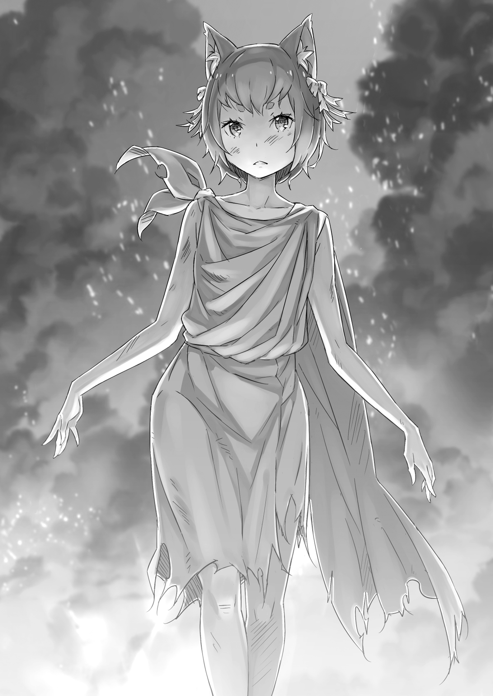
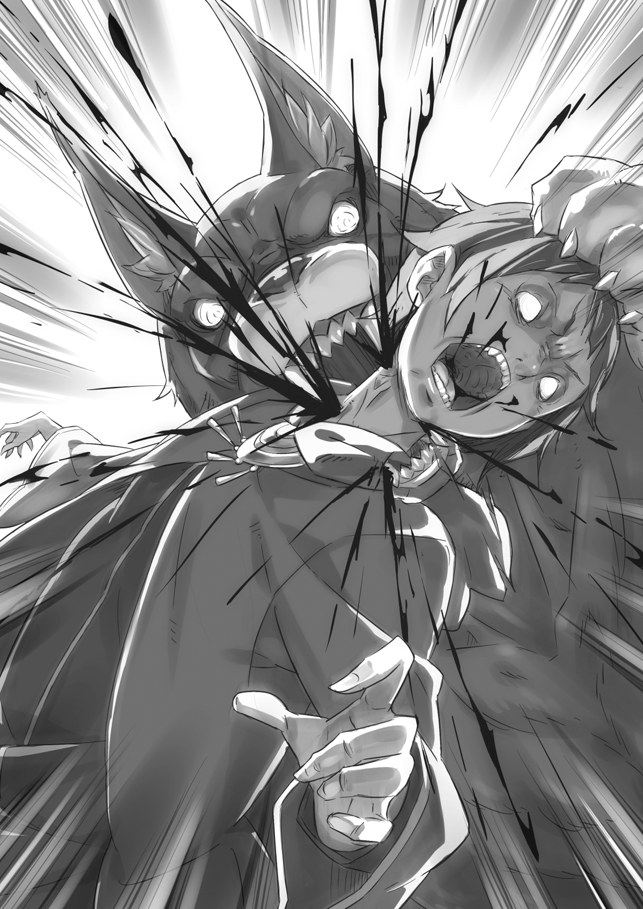
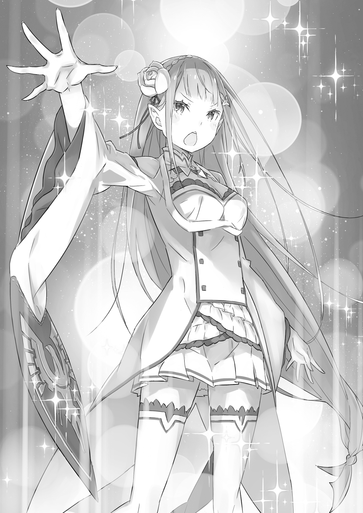

## 1
Очнувшись, Субару ощутил сильнейший запах гари. Отвратительный до тошноты, он напоминал запах жжёного мяса в шашлычной или обуглившихся овощей на решётке гриль —будто что-то передержали на огне и оно превратилось в золу.

Субару открыл рот и попытался издать звук, однако ничего не услышал. Но не потому, что звук не достиг ушей: грохот, ударивший по его по барабанным перепонкам, оказался слишком сильным. Он до сих пор гулким эхом отдавался в черепной коробке и был сильнее обычного шума в ушах. Надеяться на возвращение слуха в ближайшее время явно не стоило.

Продолжая, как ему казалось, напрягать голосовые связки, Субару обратился к остальным чувствам. Открыл глаза, но взгляд провалился в черноту. Тоже без толку. Обоняние захватил запах гари, а во рту царил настойчивый привкус железа. Лежал он, скорее всего, на земле, навзничь, широко раскинув руки и ноги.

— Ух…

Пока Субару проверял, может ли шевелить руками и ногами, сквозь пелену шума он разобрал собственный голос. Постепенно шум рассеялся, и Субару стал слышать себя. Вслед за этим в жилах зашумела кровь, и мрак мало-помалу рассеялся.

Все пять чувств снова работали. Вернулись слух и зрение, а вместе с ними — и восприятие окружающего мира. А затем… раздался чей-то душераздирающий крик. По телу побежали мурашки. Детский плач. Вопль. Запах гари, доносящийся от особняка.

Внезапно в голове сверкнуло: -«Что за?..»

Когда чувства ожили и мысли прояснились, Субару резко приподнялся и огляделся вокруг. Тело кричало от ожогов и ссадин, однако пейзаж заставил забыть о боли. Перед глазами предстали объятые пламенем остовы повозок и множество драконьих трупов, разбросанных повсюду.

— Взрыв!..

Ужасная сцена воскресила недавние воспоминания, которые помогли истолковать случившееся. Взрыв! Это был именно взрыв! Только он мог повлечь колоссальные разрушения.

Стройные ряды повозок разнесло в пух и прах, а место, где они находились, изменилось до неузнаваемости. Стоявшие вокруг деревенской площади жилища были охвачены пламенем, которое перекидывалось с одного дома на другой.

Повсюду валялись обугленные фрагменты повозок и останки драконов. Уже нельзя было разобрать, что есть что, настолько их обезобразило. Не оставляла сомнений лишь ужасная вонь жжёного мяса, нещадно бившая в нос: горели трупы земляных драконов.

Содрогаясь от ужасной картины, Субару стиснул зубы.

— Иа! Появись, Иа! Ты же здесь! — в отчаянии позвал он красного квазидуха, ударяя себя в грудь. И тот откликнулся: бесшумный красный огонёк вновь с готовностью возник перед глазами.

Субару помнил, что Иа защитила его особым барьером, который создала за мгновение до взрыва. Если бы не это, юноша, скорее всего, разделил бы участь погибших земляных драконов. Однако в повозке Субару находился не один. Оставаться в живых одному не было смысла.

— Иа, где Феррис?! — встрепенулся он, стоя на коленях. — Где Феррис?! Он был со мной!

— Да здесь я, — донёсся еле слышный голос.

Сомнений нет, это Феррис! Субару ползком направился к руинам деревенского дома, откуда раздался голос.

— Феррис! Ты невредим? Фе…

— Не то чтобы прямо невредим…

Когда Субару подполз к развалинам, из клубов чёрного дыма показался его потерявшийся друг Феррис.

Увидев рыцаря, Субару, уже готовый к худшему, испытал огромное облегчение. Однако тут же заметил кое-что странное. Юноша обрадовался, что Феррис цел, но… тот был даже как-то слишком цел!..

— Ты ведь не успел спрятаться за барьер Иа… Применил какую-то сверхмощную магическую защиту?

— Да нет, использовал одну из девяти жизней, только и всего, — сказал Феррис и подмигнул.

На нём не было ни царапинки, а с головы не упал ни один волосок! И это несмотря на то, что Феррис, в отличие от Субару, не находился под защитой квазидуха. Однако вместо формы рыцаря-гвардейца на голом теле Ферриса теперь было какое-то рубище. Похоже, он наскоро обернулся куском полога драконьей повозки.

— Зачем это…

— А что было делать? — перебил Феррис, пожав плечами. — Форму магией исцеления не восстановишь! Но сейчас меня заботит другое…

Рыцарь бросил вдаль тревожный взгляд. Субару посмотрел в ту же сторону и ахнул при виде невообразимой картины. Деревня Эрлхэм в мгновение ока превратилась в поле битвы, над которым то и дело взвивались языки пламени и со свистом рассекали воздух клинки.

— Не отступать! Тесните их! Расчищайте путь! Главное —спасти жителей! — кричал на противоположной стороне площади один из рыцарей.

На площади толпилось множество людей. Воины отряда замкнули кольцо вокруг жителей деревни и странствующих торговцев и бились с врагом — одетыми в чёрные балахоны адептами Культа Ведьмы. В руках адепты сжимали крестообразные кинжалы.

— Но как адепты попали в деревню?..

— Ясное дело, залезли в повозки и притворились грузом!

— Чёрт!

Страховка Субару обернулась против него! Проклятая невезуха! И тут до Субару дошёл истинный смысл жуткой фразы: «Адепты Культа Ведьмы повсюду». Но страшнее всего, если один из адептов окажется греховным архиепископом Лени!..

— Субарунчик, сейчас не время впадать в…

— Знаю! В любом случае надо отправить деревенских в особняк…

Не оставалось ничего, кроме как занять оборону в особняке, хотя поначалу Субару считал подобную тактику неудачной. Но не успел юноша сообщить о своём решении, как враги, непрерывно выкрикивая заклинания, прорвали оцепление рыцарей и сломили оборону. Занеся над головами крестообразные кинжалы, адепты устремились на беззащитных сельчан…

Отблески пожара на клинках раз и навсегда врезались в память Субару.

— Вот мерзавцы!.. — вскричал он, едва не сорвав голос.

Но воплем кинжалы не остановить. Рыцари не успели опомниться, а острия уже почти достигли целей: матери, защищающей ребёнка; мужа, укрывающего собою жену; молодых сельчан, за спинами которых были старики…

— Аль Клаузелия!

За мгновение до трагедии, казалось бы неизбежной, прогремело заклинание, и Субару увидел свет. В центре небосвода закружился световой вихрь, он заполнил небо, а затем упал на землю радужным сиянием и окрасил собой всех без разбора — рыцарей, деревенских жителей, адептов. Однако сияние подействовало двойственным образом. Рыцарей и деревенских радуга мягко окутала, превратившись в защитный барьер. Адептов же, которые вонзили в неё свои кинжалы, отбросило назад невообразимо резким толчком.

Враг оказался бессилен против всепоглощающего радужного света. А спас всех облачённый в белое красавец, появившийся на площади словно из-под земли.

— Никто не в силах заслонить собой вечную истину —великолепное сияние радуги! — высокопарно провозгласил хозяин полярного сияния, подняв меч над головой. Это был рыцарь по прозвищу Безупречный.

Вокруг острия кружились пять огоньков квазидухов — все, кроме Иа, которой рыцарь поручил присматривать за Субару. Очистив площадь от адептов Культа, Юлиус спас жителей деревни от неизбежной смерти и этим полностью оправдал своё прозвище.

— Обалдеть! Молодец, отличная работа! Вот сейчас я совершенно искренне рад тебя видеть!

— От такой похвалы мне как-то не по себе, но благодарю. Я тоже рад, что вы с Феррисом живы-здоровы, с облегчением произнёс Юлиус, когда Субару и Феррис подбежали к нему.

Однако времени на тёплые слова, к сожалению, не оставалось.

— Должен извиниться за то, что позволил адептам затесаться среди торговцев. Это моя вина, — потупился Феррис.

— Противник перехитрил нас. Твоей вины здесь нет. Когда повозка, в которую вы с Субару забрались, взорвалась, адепты Культа высыпали на площадь и начали бесчинствовать. Взрыв и внезапная атака наделали немало бед, но всех раненых мы отправили в особняк вместе с Тиви и мисс Рам.

— Но адептов тут тьма! Вряд ли эвакуация прошла гладко…

Юлиус говорил уклончиво, однако причина численного превосходства врага заключалась, без сомнений, в Полномочии Лени. Это Полномочие в одиночку могло изменить ход военных действий. Полагаться оставалось лишь на зрение Субару. Но если он не справится, их всех ждёт гибель!

— Мы в любом случае должны уничтожить оставшихся архиепископов Лени! Я буду следить! Юлиус, поможешь мне? — Субару сжал кулаки.

— Само собой, — кивнул Юлиус. — Феррис, отправляйся к раненым и займись лечением. Ты наш спасательный круг!

— Позор мне, если хоть один боец умрёт, не дождавшись помощи, — сказал Феррис и принялся поторапливать крестьян и рыцарей, сбившихся в кучу.

За спиной Субару раздался командирский голос лекаря:

— Вставайте-ка! Мы отправляемся в особняк, чтобы держать там оборону! Бегом, бегом!

Сам Субару тем временем сосредоточился на звоне оружия, который слышался отовсюду. По сравнению с прошлыми битвами, это сражение было куда ожесточённее: адепты оказались настроены весьма серьёзно.

— Сколько врагов вошло в деревню?

— Точно неизвестно. В разгар атаки к адептам присоединилось немало своих. Скорей всего, здесь собрались все «пальцы». Похоже, они намерены драться до последнего.

В живых оставались три «пальца». Если каждый из них входит в группу из десяти адептов, то выходит, что противников не меньше тридцати. Положение не из лучших, ведь отряду нужно было ещё защищать сельчан и торговцев. Но если противник сосредоточил все силы здесь, в деревне, надежда на победу оставалась.

— Прикончим разом трёх оставшихся архиепископов Лени, и тогда победа будет за… Что?!

Не успел Субару договорить, как небо впереди заполнила чернота. Над деревней, охваченной пожаром, поднимались бесчисленные длани, застилая всё небо. Картина напоминала ночной кошмар.

— Незримые Длани!!! — завопил Субару.

Юлиус сразу стал пристально всматриваться вдаль. Однако рыцарь никакого кошмара не заметил. Ему, можно сказать, повезло. Иначе при виде такого огромного числа рук, несущих смерть и разрушение, его сердце могло бы сжаться от ужаса.

Субару был обречён встретиться с Ленью лицом к лицу. Но кто-то принял удар на себя. Сомневаться в этом не приходилось. Чёрные длани с неимоверной скоростью обрушивались на деревья, дома, землю и разносили их в пух и прах. Они крушили, громили — безостановочно, словно одержимые яростью. Да, это определённо была ярость, гнев оттого, что им не удалось разбить противника.

— Быстрей! Вильгельм уже сражается!

Без помощи Субару с Ленью мог биться только один человек.

## 2
Вильгельм противостоял невидимому граду атак, совершая манёвры за пределами своих возможностей.

Мечник вилял из стороны в сторону. Он то ускорялся, то замедлял движения, совершал гигантские прыжки, словно издеваясь над противником и подпуская его всё ближе и ближе. Казалось, длани вот-вот коснутся Вильгельма!

Даже если бы Полномочие под названием Незримые Длани стало вдруг видимым, уворачиваться от него было бы весьма трудно. Угол и дальность атаки менялись с калейдоскопической быстротой, а сила натиска была настолько разрушительной, что каждый удар мог привести к смерти. В битве такая техника обеспечивала фантастическое преимущество и не оставляла врагу шанса.

В эту минуту Вильгельм держался только благодаря огромному боевому опыту.

— Я пригвозжу тебя к земле здесь и сейчас, гнусный адепт Ведьмы!

— Как же так, как же так, как же так, как же та-а-ак?! Как ты сумел до сих пор выстоять?!

На другой стороне дороги находился противник Вильгельма — рослый мужчина. Уродливо согнутые шея и туловище уподобляли его ведомой марионетке.

Безумец и правда не был властен над своим телом, вверенным Полномочию, но для Дьявольского Мечника это не имело никакого значения. Важным было одно: перед ним находился враг — третья Лень. Человек, собравший команду торговцев, даже не пытался скрывать свою истинную сущность.

Вильгельм презирал его гнусную идею смешаться с торговцами, которых Субару позвал на помощь. И в то же время он беспокоился о судьбе юноши и Ферриса, которые должны были попасть в самый эпицентр взрыва. Однако Дьявольский Мечник тут же подавил тревогу, что родилась в разгар схватки, и целиком сосредоточился на битве.

Но повод для беспокойства у него всё же имелся. Вильгельм не посмел бы явиться на порог хозяйки, герцогини Круш, без Ферриса. Однако сердце подсказывало, что волноваться не о чем. И Субару, и Феррис выберутся из этой передряги. Вильгельм доверял им даже больше, чем следовало.

— Ррррра-а-а-а!!!

Он взмахнул мечом и, взрыв им землю, поднял в воздух комья почвы, благодаря которым мог оценить траекторию невидимой атаки. Совершив неимоверно сложный манёвр, Дьявольский Мечник прорвался сквозь стену из кровожадных дланей, отделявшую его от противника, и ринулся вперёд.

О Субару и Феррисе не стоило волноваться. В конце концов, сам Вильгельм мог делать лишь то, чего от него ждали. И делал он это с тех самых пор, как впервые взял в руки меч…

— Моей милости стало на порядок больше! Но ты всё равно не отступаешь! Твоё упорство, твои убеждения! Как апостол прилежания, не могу не уважать! А-ах! А-ах! Какая любовь! Мой мозг трепещщщет!!!

Другое лицо, другой голос… но была у всех архиепископов одна общая черта — дикая одержимость Ведьмой. Вильгельм специально увёл безумца подальше от деревни, чтобы сразиться с ним один на один.

В эту минуту только Вильгельм мог противостоять безумцу. Только он мог прикончить подонка так, чтобы другие пострадали как можно меньше.

Вильгельм, не отрывая взгляда от полоумного противника, ускорил бег.

Архиепископ не обращал ни малейшего внимания на земляной дождь и продолжал наносить удар за ударом, словно ничего другого не умел. С прочими архиепископами его объединяло не только сумасшествие, но и однообразие боевых приёмов. Неудивительно, если и конец он встретит такой же…

Безумец что-то кричал во всю глотку. Но вопли его не достигали Вильгельма, который мчался вперёд что было сил. Мечник освободился от всего лишнего и стал чистым, несущимся, словно ветер, клинком, цель которого — сокрушить зло своей сталью.

Чем ближе он подходил к врагу, тем больше появлялось преград. Кожа Вильгельма горела от новых царапин. Мечник покрепче сжал рукоять меча, блеснул клинок.

По земле прошла трещина, безумец качнулся. Вильгельм направил остриё противнику в грудь и пронзил того насквозь.

— Есть!

Клинок вошёл в тело, как нож в масло. На счету Дьявольского Мечника была не одна жизнь, и в эту минуту он не сомневался, что пополнил список.

Фамильный меч угодил в самое сердце безумца. Даже Феррису было бы не под силу залечить смертельную рану, которую хладнокровно нанёс Вильгельм.

— Ты… — проговорил безумец с кровавой пеной у рта.

Клинок прошёл насквозь, но врага не постигла мгновенная кончина. Вильгельм решил, что слышит предсмертный бред, и молча извлёк меч. И тогда безумец снова заговорил:

— Пристально наблюдая за движениями невидимых рук, перестаёшь замечать видимое… Что это, если не лень?

В мыслях Вильгельма возник некий диссонанс. Он попытался понять смысл сказанного, и в этот миг его дух воина дал сбой. Безумец упал на Вильгельма, поднял руку с кинжалом и без колебаний вонзил остриё себе в левый глаз.

Лезвие прошило глаз, вошло в череп и проникло в самый мозг.

— Что…

Мечник, как заворожённый, не сводил глаз с орудия самоубийства, и тут сверкнула вспышка…

## 3
Субару обогнул разрушенный дом и бросился на разбитую улицу. Земля содрогнулась.

Вслед за толчком и дрожью воздуха стало покалывать всё тело. Дышать было трудно. Субару мчался со всех ног, но навстречу уже неслись запоздалая взрывная волна и стена огня.

— Уо-о!..

— Не двигайся! Аро! Ику!

Субару замер на месте. Впереди стоял Юлиус. Рыцарь поднял руку, в пространстве заблестели зелёный и жёлтый духи. Они породили Лезвие Ветра и защитную стену из земли и камней. Первое рассекло на части приближавшийся вал огня, а крепкая стена приняла на себя натиск ударной волны.

— Что это было?!

— Не знаю. Мне показалось, за секунду до взрыва на улице мелькнул какой-то человек…

Не успели отголоски взрыва затихнуть, как Субару и Юлиус, перемахнув через полуразрушенную земляную стену, бросились к центру событий. Деревня представляла собой ужасное зрелище. От кирпичных домов остались одни фундаменты, а на месте взрыва от мощного удара образовался огромный кратер.

В самой воронке Субару обнаружил лежащее ничком тело.

— Вильгельм?!

Юноша бросился к нему. Это действительно был седовласый мечник. Израненный и скрюченный, старик лежал на земле: взрыв случился совсем рядом с ним, и удивительно, что его не разорвало на части.

Почерневшее лицо было измазано кровью и грязью и до неузнаваемости изуродовано ожогами. Однако старик дышал. У Субару точно гора с плеч свалилась.

— Нельзя бросать его тут! — Субару склонился над Вильгельмом, намереваясь взвалить того на плечи. — Скорее к Феррису!..

— Похоже, это будет не так-то просто… — заметил Юлиус.

Его голос звучал встревоженно. Юноша поднял на Юлиуса глаза. Рыцарь извлёк меч из ножен и водил им, словно в ожидании атаки. И не зря! Враг приближался не с одной стороны!

Адепты Культа Ведьмы, держа в руках крестообразные кинжалы, надвигались по одному с четырёх сторон. Но главной угрозой были не они, а человек, который их привёл.

Он откинул с головы капюшон, и Субару увидел… невысокую женщину с короткими тёмными волосами.

Абсолютно безоружная и, казалось, беззащитная женщина! Но именно эта женщина представляла наибольшую опасность, о чём говорили налитые кровью глаза и то, что она грызла собственный палец.

Петельгейзе, безумная женщина, Кэти… И вот четвёртый греховный архиепископ Лени.

Вывернув правую руку, женщина грызла большой палец. Она раздробила зубами ноготь и, орошая землю кровью, впивалась в мясо. Субару сморщился от омерзения.

— Не успели от одного избавиться, теперь ты… Да сколько ж вас, тварей,всего?!

— Почему, почему, почему, почему, почему… ты ещё жив? После такого приёма что мы устроили… Почему?! Тебя никак не берёт моё прилежание?!

— Могу спросить тебя о том же! Довольно, кончайте! Сколько можно?! Что мы вам сделали?!

Кроме слов взаимной ненависти, им нечего было сказать друг другу. Тем временем Вильгельм дёрнулся на руках у юноши. Быть может, на Дьявольского Мечника подействовало что-то извне, и он, не приходя в себя, зашевелил губами. В тяжёлом дыхании сквозила ненависть к врагу. При виде этой картины Субару стало жутко. Не приходя в себя, мечник, казалось, пытался что-то передать…

— Вильгельм?

Шёпот старика был слабым, едва уловимым. Но ждать, что адепты проявят сострадание и позволят Вильгельму договорить, не приходилось. Субару по-прежнему стоял на коленях и держал мечника на руках, когда женщина направила на них обезображенный палец.

— Ты! —- заорала она, брызжа слюной. — Сумей я сломить тебя ленивого, тебя прилежного, всё бы уладилось! Всё бы устроилось! Всё встало бы на свои места! Проваливайте! Или пожалеете!

Женщина сунула руку под рясу, однако не нашла того, что искала. Тогда она вытащила руку и громко заскрежетала зубами. Её злобный взгляд и движения навели Субару на мысль. Его озарила идея. Теперь он знал, что должен делать.

Со всех сторон его окружали адепты, на руках лежал тяжело раненный Вильгельм, рядом стоял измождённый Юлиус, Казалось, Субару Нацуки годится лишь на роль приманки, но кое-что он всё-таки мог…

— Юлиус, сумеешь взять на себя адептов, кроме Лени, и одновременно прикрывать Вильгельма?

— Субару? — Юлиус скосил взгляд на Субару и слегка нахмурился. Но объяснять подробности не было времени. Юноша повторил вопрос, пристально глядя в его жёлтые глаза: — Так сумеешь? Если да… тогда я тоже постараюсь.

Юлиус молчал.

— Больше мне не на кого положиться. Если ты доверишься мне… я доверюсь тебе.

— Доверишься… в чём?..

Ответ был очевиден. Субару ткнул пальцем в Лень:

— Этой идиотке я сам преподам урок. Доверь свою жизнь мне, пока я буду сражаться. А я доверю свою жизнь тебе, пока ты будешь сражаться. Ну так что, попробуем?

Греховного архиепископа Лени Субару собирался взять на себя, о чём и заявил Юлиусу — единственному союзнику. В ответ рыцарь обнажил меч. Нерешительное молчание длилось не дольше секунды. Юлиус закрыл глаза, затем распахнул их и встал на изготовку.

— Если откажусь, грош цена такому рыцарю!

— Вот это по-нашему!

Субару прекрасно знал, что его положение шаткое, а план безрассудный. Но юноша не первый раз пускался в авантюру. И теперь надо было пробежать с завязанными глазами по канату, натянутому над пропастью, сколь отчаянным это ни казалось бы.

Субару аккуратно положил Вильгельма на землю и сунул руку в карман. Адепты мало-помалу сжимали кольцо, а Лень стояла на месте. Но не стоило недооценивать врага: такого понятия, как дальность удара, для Лени просто не существовало.

Вот только Субару Нацуки был сделан из другого теста.

— Что ж, пора закругляться! Ради высочайшей любви! Ради почтеннейшей любви!..

— Эй, женский вариант Петельгейзе! Смотри, что у меня есть!

Субару выдохнул и достал из кармана книгу в чёрном переплёте. Евангелие, которое он забрал у мёртвого Петельгейзе Романе-Конти.

— Ты не это случайно потеряла? Подарок от обожаемой Ведьмы?

— Ах ты воришка! Так значит, она была у тебя?! — заверещала Лень, вытаращив глаза на томик в руках юноши.

Когда женщина полезла за пазуху, Субару кое-что вспомнил. Точно так же делала и вторая Лень. Она запускала руку под рясу и что-то там искала, а потом, ничего не найдя, приходила в ярость. Во всех случаях они искали одно и то же — книгу.

— Вы и Петельгейзе из земли выкопали, чтобы забрать Евангелие. Неужто такие любители чтения, что готовы пойти на мародёрство?

— Заткнись! Довольно твоего бреда! Отдай мне сию же сек…

— Не ори! Когда на меня так орут, у меня это… мозг трепещет!

— Умри!!!

Что касается провокаций, здесь Субару не было равных. Терпение Лени лопнуло, у её ног стала расти тень. Поднявшись над головой Лени, тень распалась на стаю бесчисленных угольно-чёрных дланей, заслонивших небо. Длани как по команде нацелились на Субару.

Но не на того напали!

— Моя милость! Манифест моей любви! Преклонись пред ними, безнравственный мальчишка! — заорала Лень, и чёрные длани со скоростью лавины устремились к цели.

Воплощая собой само понятие разрушения, длани приближались, точно цунами. Но никто, кроме Субару, не мог оценить их мощи. Он же видел длани ясно и отчётливо.

— Рра-а-а!

Стая дьявольских дланей оказалась слишком медлительна. У Субару был богатый опыт наблюдения за схватками сверхлюдей, поэтому чёрные длани напомнили ему застывших в воздухе мух. Хотя нет, не совсем так. Мухи постоянно находятся в движении. Но они не настолько стремительны, чтобы от них нельзя было уклониться.

Стреляя из пушки по воробьям, легко промазать. Субару уклонился от атаки стаи Незримых Дланей, сделав большой полукруг. Дьявольский Мечник на его месте проскользнул бы между ними, но для юноши такие трюки были за гранью возможного.

— Ты скрылся от моего Полномочия!.. В таком случае воспользуюсь руками своих учеников!

— К сожалению, мне поручено лишить тебя этой возможности.

Осознав ошибку, женщина рассвирепела, но отдавать приказы подчинённым было уже поздно. Мастерский приём Юлиуса помешал врагам преследовать Субару. Вдобавок одного из адептов, который находился рядом с ним, накрыла волна дьявольских дланей и стёрла с лица земли.

— Только поглядите! Бьёшь по своим? Какой же отпетой негодяйкой надо быть, чтоб творить такое?!

— Ах ты!.. Как ты посмел, ты посмел, ты посме-е-ел?! Ученика любви-и-и!..

— Я тут ни при чём, так что потише! В следующий раз включай свои куриные мозги! Или тебе лень? — передразнил Субару, показал средний палец и кинулся наутёк.

План сработал: женщина пришла в ярость и бросилась за ним.

— Юлиус! Разберись как-нибудь у себя! А я постараюсь тут!

— Очень туманное указание, но я тебя понял!

Над головой рыцаря в свете солнца блеснул меч.

Отныне каждому из них предстояло драться на своём поле боя. На поле Юлиуса был раненый Вильгельм и трое адептов. У Субару же — только бесноватая Лень. Каждый был на своём месте и потому мог сражаться. С адептами Субару было не справиться, а вот с греховным архиепископом имелись все шансы на победу.

— Увидимся?

— Удачи!

Субару оставил Юлиуса и помчался через поле битвы. Бушующая волна дьявольских дланей ударялась о землю, но юноша, перескакивая через них и отталкиваясь от дланей, как от трамплина, уходил от атак.

— Куда же ты, куда ж ты, куда ж ты, куда ж ты, куда ж ты-ы! Гнусный, бестолковый поганец!

Зазвенел меч Юлиуса, взявшего на себя троих, а Субару тем временем уводил сумасшедшую всё дальше. Он прижимал руку к груди, где бешено колотилось сердце, и бежал что было сил. Субару невольно подражал Вильгельму — уводил Лень туда, где не было других людей, которые могли пострадать.

Субару знал, куда бежит. Место, куда он стремился, не гарантировало победы. Однако он мог выиграть время и увеличить шансы на победу. Поэтому надо бежать, бежать что есть сил!..

— Не попадёшь! Никудышный из тебя снайпер!

Маньячка неслась позади, однако безнадёжно отставала. Бессчётные Незримые Длани были выпущены, но нападала она от случая к случаю, что позволяло Субару уклоняться от ударов даже на бегу. Способности безумной женщины оставляли желать лучшего.

Всего рук было штук шестьдесят, а то и семьдесят. Очевидно, эта Лень — самая богатая на Незримые Длани. Однако пользовалась она оружием хуже всех. В этом смысле наиболее умелым оказался Петельгейзе — первый архиепископ.

— Петельгейзе точно главный… Хотя какая разница!

Об этом можно порассуждать позже. Если Субару уничтожит их всех, вопрос, кто из Леней главный, отпадёт сам собой. Сейчас не время распылять силы. Если враг не в лучшей форме, это лишь на руку!

Субару повернул за угол, пробежал по улице, обогнул ещё один дом и…

— Добрался! Но…

Юноша добежал до нужного места и огляделся: то тут, то там в глаза бросались следы битвы, землю устилало множество тел. То были не только адепты, но и несколько рыцарей и зверолюдей. Они безмолвно упрекали Субару в бессилии.

Юноша закрыл глаза и подавил чувство вины. Затем резко прыгнул и откатился в сторону, уходя от атаки длани.

Та ударилась о землю и подняла клубы пыли. Позади, задыхаясь от ненависти, стояла Лень. Теперь за её спиной было значительно меньше рук — порядка двадцати.

— Неужели дошло, что не можешь с ними управиться?

— Благодарю, что обратил на это моё внимание! Но дальше бежать некуда. Или будешь сопротивляться ещё как-нибудь?!

— Сопротивляться… — повторил Субару и вдруг кому-то подмигнул. Кому-то, кто был за спиной безумной женщины…

Загадочное выражение на лице Субару сменилось вызывающей улыбкой.

— С помощью любви и мужества, наверное…

Субару облизал тубы. Вид он имел совершенно беззаботный, в то время как маньячка, широко раскинув руки, горела жаждой убийства. В ответ Лень выпучила глазища и принялась хохотать противным, сдавленным голосом.

— Прекрасно! Ну, давай! Попробуй сразиться с моей милостью с помощью своей любви!!!

— Я сказал «любви и мужества»!

Субару сделал вдох. Он мгновенно вскочил с колен и стремглав побежал вперёд. В эту минуту он ощущал себя пулей, которая метит в самое сердце маньячки. Безумная, вероятно, посчитала такой манёвр наивным, и в следующий миг она, не отрывая от Субару широко распахнутых глаз, вдруг разразилась тирадой:

— И это любовь?! Это всё, на что способна твоя любовь?! Просто нестись сломя голову?! Какое безрассудство! Слабость! Бессилие! То есть ле-е-ень!

— А-а-а-а-а!!!

Боевой клич из самого нутра заглушал вопли спятившей. Крик раздирал глотку, но это был крик Любви, призывающей Мужество.

— Тогда ты заплатишь за лень своей жиз…

— Патраш, давай!

— Что…

Удивлённый голос оборвался на полуслове, когда ликующую Лень сбил с ног земляной дракон. Туша весом в несколько сотен килограммов смела беззащитную фигуру, словно пушинку

Жертва закувыркалась по площади и врезалась в полуразрушенный дом. Зазвенело разбитое стекло, и дом, не выдержав удара, развалился окончательно. В воздух поднялись густые клубы пыли.

Манёвр дракона превзошёл все ожидания. Субару подлетел к угольно-черной Патраш и ласково потрепал её по голове.

— Вовремя ты, Патраш! Молодец! Я в тебе не сомневался! — принялся он хвалить дракониху, на что та громко взревела, подняв голову.

Субару специально завлёк женщину на старое место — площадь, где он оставил Патраш на случай побега. Однако, вернувшись и не обнаружив верного друга, Субару побелел от испуга.

— Здорово ты её сзади, Патраш. В тебя будто бес вселился!

В тот миг, когда позади Лени показался земляной дракон, сердце Субару чуть не выпрыгнуло из груди. Дракониха сработала безупречно, будто заранее знала, что нужно делать. Просто Субару возложил всю надежду на любовь и мужество… правда, любовь в данном случае означала блеф, а мужество — подмогу.

— Здорово, если на этом всё закончится…

Субару взобрался на спину Патраш и бросил взгляд на обломки дома, в который врезалась Лень. Если она погибла под завалами, тем лучше.

Но жизнь устроена иначе…

— Кажется, я была слишком самоуверенна…

Из-под кучи обломков разом вырвалось множество теней. А затем в комке извивающихся, как щупальца, угольно-чёрных рук показалась окровавленная невысокая фигура. Безумная женщина была едва жива.

Из раны на голове обильно текла кровь, на месте левого глаза торчал осколок стекла. Правая половина тела, на которую пришёлся удар, была измазана кровью, тощие рука и нога изуродованы. И всё же в выражении её лица и в уцелевшем глазу читались небывалые сила и безумие.

— Ты… Да ты поистине прилежен! О да, прилежный! С таким противником следует держать ухо востро! Я была слишком неосторожна! Небрежна! Невнимательна! Нерадива! Слишком самоуверенна! А-ах, я была ленива!

Она извергала всё тот же бред сумасшедшего. Верхом на Патраш ускользнуть от преследования гораздо проще, чем пешком. И тогда Субару сможет нанести решающий удар и расправиться с Ленью, нужно только выждать удобный момент. Теперь, когда силы примерно равны, победу одержит тот, кто первым нащупает способ поставить жирную точку.

Но только Субару решился действовать, женщина жутко захохотала:

— Ты видишь мою милость. Следовало с самого начала принять это как данность. Но я упорствовала в своей единственной любви и, как следствие, погрязла в лени. Как недостойно!.. Поэтому вернее всего…

— Чёрт! — выругался Субару.

Пока безумная бормотала, её дьявольские длани зашевелились. Сердце Субару сжалось от страха, но он изо всех сил пытался преодолеть слабость. Каждая из многочисленных дланей держала обломок разрушенного дома.

— Тварь! Очень умно! — досадливо бросил Субару.

И тут в него и Патраш полетел смертоносный град обломков.

## 4
Действуя против Субару, Лень избрала лучшую тактику — отказалась доставать его Незримыми Дланями напрямую. Они были не такими быстрыми, как обычные руки, что позволяло уклоняться, хоть дланей насчитывалось несколько десятков.

Однако метнуть камень они могли с приличной скоростью. Поскольку чисто физически длани были гораздо сильнее человеческих рук, по части метания они легко обошли бы сильнейших игроков высшей лиги. И поскольку самый маленький из камней был с человеческую голову, прямое попадание таким снарядом означало верную смерть.

Субару обхватил руками шею Патраш и закричал:

— Патраш! Давай в лес, без укрытия погибнем!

Но дракон уже набирал скорость. Патраш не стала дожидаться приказа и помчалась к лесу.

В угольно-чёрных руках сотни обломков кирпичного дома превратились в смертоносное оружие. К счастью, враг оказался не особо метким. Тем не менее обломки сыпались градом, словно картечь из стреляющего наобум ружья.

Обломки проносились в считаных сантиметрах от Субару и Патраш. Они с грохотом валили деревья и врезались в землю, едва не задевая хвост драконихи. Не успели беглецы ворваться в лес, как град кирпичной картечи в мгновение ока пропахал лесную опушку, разорив её до основания.

— Ух! О-о-о!..

Субару пригнул голову, вцепившись в шею Патраш, — это единственное, что он мог сейчас сделать. Булыжники царапали чёрную шкуру дракона и сдирали жёсткую чешую, из-под которой сочилась кровь. Но Патраш не сбавляла хода и не ревела от боли.

В полном соответствии с рассказами о ней, дракониха неслась по бездорожью со скоростью пули. Патраш спасала Субару, превосходя его ожидания. Но взваливать весь груз ответственности на животное было бы неправильно.

Субару обернулся. Маньячка не отставала. Продолжать бой или искать новую тактику было бесполезно, поскольку никто не знал, что она ещё выкинет. Оставалось надеяться, что умалишённая, по крайней мере, не догонит Патраш…

— На тебя вся надежда, Патраш!

— Да, да, да, да, да, да, да-а-а-а-а! — раздалось сверху. Источник зловещего голоса находился над деревьями. Согнувшись и обняв колени руками, маньячка схватила себя одной из Незримых Дланей и оказалась высоко в небе. Преследуя Субару, она, словно мячик, переходила от одной руки к другой.

Как бы нелепо это ни выглядело, скорость безумной возросла в разы. Патраш, несмотря на густой лес, мчалась со скоростью не меньше шестидесяти километров в час. Но Лень развила скорость за сотню, будто ею выстрелили из пушки. Слишком быстро, чтобы дракон мог с ней тягаться. Теперь, когда Лень видела их сверху, юноша и Патраш были прекрасной мишенью. При этом, находясь высоко в небе, безумная становилась недосягаемой.

— Возвращаться в деревню нельзя. Если приведём её за собой, сделаем только хуже!

К тому же встреча с адептами не обернётся ничем хорошим. Никто, кроме Субару, не мог соперничать с Ленью, хотя она и пыталась прижать его к стенке.

— Но если ничего не предпринять, рано или поздно она попадёт…

Не успел он договорить, как это «рано или поздно» настало. Один из обломков, слепленный из нескольких кирпичей, угодил Патраш в голову и снёс драконий кожаный шлем. Патраш заметно качнулась, из головы пошла кровь. Субару вцепился в дракониху, чуть не завопив от испуга, а затем изо всех сил натянул едва не выпавшие из рук поводья.

— Патраш!!!

Вряд ли окрик придал драконихе сил, но ей каким-то чудом удалось не упасть. Это выглядело очень впечатляюще, и впору было подумать, что возглас и впрямь подействовал. Стальная выдержка Патраш определённо заслуживала похвалы. Но град камней продолжался. Кровь струилась. А шансов победить по-прежнему не было…

— Ты всё-таки выдержала, молодец! Но если так и бежать в чащу леса…

Война на измор рано или поздно должна была закончиться полным истощением сил дракона, и всё же требовалось потянуть время и найти способ дать отпор. Однако ранения Патраш заметно сокращали её силы. Не стоило даже надеяться, что она сможет бежать так же быстро, как раньше. Надо было срочно что-то придумать…

Опыт подсказывал: чудес в жизни Субару не случалось и вряд ли они произойдут в будущем… От злости на несправедливость мира он закусил губу, но тут обратил внимание на некую странность лесного пейзажа.

— Что это?..

В голове отыскались нужные воспоминания, и юноша тут же потянул поводья.

Если всё так, как запомнилось, нельзя упускать шанс, ведь он может привести к победе!

— Патраш, налево!

Истекающая кровью дракониха на миг покосилась на Субару жёлтым глазом, будто хотела удостовериться, что не ослышалась. Она как бы спрашивала: «Ты уверен?»

Сомнение Патраш было понятно. Но если здравый смысл не приближает тебя к победе, почему бы не повиноваться безрассудству?..

В ответ на безмолвный вопрос зверя юноша сильно натянул поводья и повторил:

— Ты не ослышалась! Следуй за тем огоньком в лесу!

Патраш снова глядела вперёд, в глазах и поступи не было колебаний. Она всегда уважала решения Субару, и её жизнь целиком принадлежала хозяину.

Мчась сквозь лес и взрывая лапами почву, земляной дракон резко затормозил и повернул налево. Божественная Защита от ветра уже давно не работала, поэтому Субару едва не вылетел из седла, но, стиснув зубы, всё-таки удержался. Дракон стал сбегать по крутому склону, набирая скорость.

— Как ни старайся, от меня не скрыться!

Манёвр Патраш, которая с оглушительным топотом спускалась по склону, не остался не замеченным безумной преследовательницей. Булыжники летели в другую сторону, и опустошение леса продолжилось в новом направлении. Лень валила деревья, затем хватала упавшие стволы и метала их вслед, сея хаос и разрушение. За спинами беглецов маячила смерть.

Неукротимый поток безумия наступал на пятки, но Субару, давая Патраш указания, всё мчался к мерцающей точке —последнему лучику надежды, за которым он всё время следил краем глаза. Дракон выписывал зигзаги, уворачиваясь от ударов. Делать это, сбегая по склону на высокой скорости, израненной Патраш, похоже, было совсем не легко. Поэтому Субару испытывал огромную благодарность к драконихе.

— Умей проигрывать достойно! К чему эти догонялки?! Что там такое, куда ты всё бежишь, бежишь, бежишь?! Своим поведением ты просто оттягиваешь неизбежное… Нет! Не выйдет!

Лень следила сверху за хаотичными попытками Субару скрыться от преследования. Внезапно умолкнув, она, будто себе в наказание, воткнула в пустую глазницу палец и принялась ковыряться в собственной плоти, истекая кровью.

А затем то ли жалобно, то ли восторженно возопила:

— Больше никакого разгильдяйства и гордыни! Только добившись необратимого итога, то есть смерти, я попрощаюсь и с сомнениями, и с судьбой, и с иллюзиями!

Очевидно, Лень лечила себя от разгильдяйства при помощи увечий. Тем не менее атака не ослабевала: безумная продолжала метать снаряды. Булыжники рассекали воздух, земля шла трещинами. Один из камней так задел плечо Субару, что затрещали кости. Юноша повалился назад. От жестокой боли хотелось кричать, но Субару лишь тихонько взвыл. Кричать при Патраш было стыдно.

Однако вскоре их отчаянный бег прекратился…

— Ах!..

Земля вздрогнула от удара и ушла из-под ног. В следующий миг туша дракона взмыла ввысь.

Не успел Субару опомниться, как, не выпуская из рук поводья, стремительно закрутился в воздухе. Затем его тряхнуло и с силой бросило вниз. Он глухо шмякнулся на землю.

— Ай! У-у!..

Субару катился по склону, пока наконец не остановился внизу. Каждый сантиметр тела ныл от боли, но каким-то чудом удалось избежать смертельных повреждений. Руки и ноги не оторвало, голова тоже на месте. Можно сказать, повезло, но, если разлёживаться на земле, вслед за удачей последует неминуемая смерть…

— Ну вот, похоже, пришёл твой конец!

В поле зрения возникла Лень, она спускалась с неба. Приземлившись, Лень разжала длань» благодаря которой держалась в воздухе, и подошла к юноше. Субару застыл, не смея пошевелиться. Физиономия безумной была залита кровью. Она довольно захохотала, затем протянула изуродованную руку:

— А теперь ты вернёшь мне Евангелие. Оно тебе не нужно.

— Еван… гелие… — хрипло повторил Субару и, повинуясь требованию, сунул руку в карман и нащупал там переплёт. То, что книга не выпала во время погони, можно было считать большой удачей. — Если нужна… возьми…

Субару вытащил томик и швырнул его в заросли. Бросок выглядел жестом отчаяния. Протянутая рука женщины так и осталась пустой. Маньячка вздохнула и несколько раз сжала и разжала кулак.

— Похоже, ты так и не научился бережно обращаться с чужими вещами, — заметила она, с сожалением качая головой.

Субару закашлялся. Меньше всего он ожидал получить урок этикета от сумасшедшей.

Женщина повернулась к зарослям, чтобы поднять брошенную книгу. В этот миг Субару завращал головой, пытаясь отыскать глазами Патраш. Вот она — лежит и тяжело дышит. Как раз там, где нужно.

— А-а! Мой проводник любви, свидетельство милости!.. Наконец ты со мной… Чувства захлёстывают!

Не обращая внимания на Субару, женщина, рыдая, прижимала к груди вновь обретённое Евангелие — воплощение любви в её безумном понимании. Затем Лень обернулась к Субару, и её лицо расплылось в улыбке.

— Твоя доблесть, твоя смелость! Я в восхищении! Ты и твой дракон сопротивлялись мужественно и прилежно! Вы достойны высочайшей похвалы, поэтому я дарую вам пощаду!

— Пощаду?!

— Именно! Пощаду! Если желаешь что-то сказать, я выслушаю с превеликим вниманием и не забуду сказанное тобою вовек! Итак, говори, что хочешь!

То, что эта безумная способна проявить милосердие к храброму противнику, стало для Субару большим сюрпризом. Конечно, её великодушие объяснялось тем, что, заполучив книгу, Лень практически одержала победу, и всё-таки это было неожиданно. В ответ на предложение маньячки, которую вдруг посетило сострадание, Субару поднял руку. В кулаке он сжимал некий предмет.

— Знаешь, что это?

Лень, не готовая к подобному повороту, озадачилась. Тем не менее женщина поглядела на ладонь: там лежал небольшой магический кристалл, испускающий белое сияние. Нет, кристалл не был смертоносным оружием, способным послужить козырем в борьбе. Сам по себе он никак не повлиял бы на исход схватки. В конце концов, в лесу были и другие точно такие же кристаллы.

— Что это?..

— Кристаллы для защитного барьера. Они воткнуты в деревья по всему лесу. Никогда не замечала?

Женщина промолчала. То ли не слышала, то ли не понимала, о чём речь. Но Субару не интересовала причина.

— О чём ты вообще… — Женщина с сомнением протянула руку. Но прежде чем её пальцы коснулись кристалла, Лень почувствовала нечто странное, дёрнулась и хотела обернуться…

Но было уже поздно.

Ломая деревья, из чащи выскочил зверодемон и вонзил клыки ей в шею.

## 5
Субару давно, ещё во время марш-броска, посещали подобные мысли. Однако окончательно он утвердился в догадках во время разговора с Юлиусом и Феррисом, когда рыцари, к своему удивлению, узнали, что неподалёку от особняка и деревни обитают зверодемоны.

Всякое живое существо испытывало к зверодемонам отвращение. Пройдя через битву с Белым Китом, Субару на собственной шкуре познал весь ужас, который внушали эти твари. Но в то же время он думал вот о чём: и Белый Кит, и лесные зверодемоны не выносили физической особенности Субару. Юноша был для них заклятым врагом. А что, если адепты, симпатизирующие Субару, вызывают у зверодемонов такую же ненависть?

И эта догадка получила наглядное подтверждение.

— А-а-а-а-а!!!

Сумасшедшая вопила, не понимая, что происходит и откуда взялась дикая боль. Женщина была слишком слаба, чтобы отбиться от собаки-демона, вонзившей свои клыки ей в шею. Покрытая чёрной шерстью тварь была в несколько раз больше человека.

Зажав в челюстях добычу, зверь мотал ею вверх-вниз, то и дело ударяя жертву о землю. Наконец он прижал измождённую женщину к земле, разжал челюсти и приготовился нанести финальный удар.

Зверодемон разинул пасть. Похоже, он хотел вцепиться жертве в глотку. То ли из кровожадности, то ли из чувства голода. Однако женщина и не думала сдаваться.

— Чёртова тварь!.. Незримые Длани-и-и!!! — заорала она, пригвождённая к земле. Через мгновение извивающиеся тени превратились в дьявольские длани и обрушились на зверя.

От удара невидимых рук он отлетел в сторону, громко скуля, как щенок, но тут же поднялся и снова принял боевую стойку, горя жаждой мести…

Но наступление зверя прервал Субару.

— Хватит! Остановись! — закричал он, держа в руке барьерный кристалл.

Готовый к прыжку зверь зарычал, глядя со злостью на белый кристалл. Должно быть, в этом предмете была скрыта неведомая сила, потому что зверодемон начал пятиться.

Он никак не желал расставаться с Субару и маньячкой. И всё же пёс не мог наброситься на них. Он лязгал клыками, рычал, исходил слюной, но продолжал отступать, пока наконец не скрылся в зарослях. Звук его лап становился всё тише.

Но вряд ли зверодемон отказался от добычи. Скорее всего, решил подождать, когда Субару выпустит кристалл из рук.

Убедившись, что зверодемон отступил, Субару глубоко вздохнул, обернулся и посмотрел на распростёртую женщину. Вольгарм не стал убивать её, но не из чувства жалости. Сама маньячка, наверное, тоже понимала, что в этом нет нужды: из её вспоротого живота вывалились все внутренности.

— Это… конец… Не думала, что какой-то зверодемон…

— Ты плохо изучила местность. Здесь обитают зверодемоны. От человека их отделяет лишь барьер…

На женщине не было живого места, несчастная не могла даже пошевелиться. Потускневшие глаза смотрели в никуда — возможно, они уже ничего не видели.

Но назвать итог тактическим успехом язык не поворачивался. Субару вырвал победу лишь благодаря внезапной идее и череде случайностей. Трудно было представить, что вольгармы, сыгравшие в судьбе юноши не последнюю роль, окажут ему услугу.

— А говорил, что их полностью истребили… Розвааль, сучий потрох! — выругался Субару.

Слишком много загадок таила в себе личность покровителя этих земель…

Субару опустился на колени рядом с истекающей кровью женщиной. Противница находилась одной ногой в могиле. Юноша взял валявшееся подле неё Евангелие и сунул в карман. Даже если ему не придётся играть роль приманки, книга всё равно может сгодиться. Схватка с женщиной показала, на что способно Евангелие.

— Не знаю, что случилось с Кэти, но «пальцев» осталось максимум два… Рано или поздно я размажу их об стенку!

— Бе… бес…

— Думаешь, бесполезно? — спросил Субару, глядя на женщину сверху вниз. — Ты хоть знаешь, сколько я уже прикончил таких, как ты? Если нет, могу рассказать. Хотя какой теперь смысл что-то рассказывать…

Уголки губ женщины поползли вверх. Истекая кровью, которая безостановочно шла изо рта, она бесстрашно улыбалась в лицо смерти. При виде этой жуткой картины Субару содрогнулся.

Улыбка не предвещала никакой опасности. Просто зрелище было настолько мерзким, что юноша инстинктивно съёжился, а по телу побежали мурашки.

— Пока… пусть оно… будет у тебя… Когда-нибудь… непременно… я верну себе… любовь… Да…

Слова были произнесены ясно и отчётливо. Улыбка на лице женщины исказилась, и жизнь покинула её. Маньячка определённо была мертва.

Третья, а может, даже четвёртая Лень погибла на глазах Субару.

— Чёрт! Что она пыталась мне сказать?

Глядя на мертвенно-бледное лицо женщины, Субару взъерошил свои волосы. Во рту вдруг пересохло, а пульс как-то странно участился, но тревога и напряжение были ни при чём.

Субару впервые убил человека в бою. При мысли об этом его затрясло. Он стиснул зубы и тяжело вздохнул: — С очередной покончено, но остаются другие Лени. Нечего рассиживаться!

Субару сбросил с себя оцепенение, отвернулся от трупа и направился к Патраш. Из-за падения земляной дракон сильно пострадал: шкура была изранена. И всё же при виде хозяина стойкая дракониха, лишённая защитного шлема, поднялась на лапы.

— Извини, Патраш, я бы с радостью дал тебе передышку, но сам не справлюсь.

В ответ дракониха молча подставила спину. Думая о том, что Патраш уже в который раз за эти несколько часов выручает его, Субару забрался в седло, натянул поводья и направил Патраш в деревню. Барьерный кристалл в руке испускал тепло, извещая тем самым о близком присутствии зверодемона. Судя по всему, пёс до сих пор наблюдал за ними, притаившись в зарослях. Но гадать об этом было некогда. Патраш пустилась бегом.

— Остался, наверное, всего один «палец»… Значит, и одна Лень!

В разгар сражения в деревне Субару и Юлиус направились туда, откуда росли Незримые Длани. Затем прогремел взрыв, и вскоре они обнаружили Вильгельма. Мечник лежал на месте эпицентра взрыва. Вероятнее всего, до того как рвануло, старик бился с Ленью. Субару не сомневался: Дьявольский Мечник одержал победу.

Юноша предположил, что и взрыв, и крушение драконьей повозки были вызваны чем-то, что находилось среди груза Кэти. Вероятно, Кэти подорвал себя, желая забрать на тот свет Дьявольского Мечника. В таком случае оставался лишь один «палец», а значит, и один архиепископ Лени.

— Прикончу последнего мерзавца, разберусь с рядовыми адептами — и победа в кармане!

Успех уже маячил перед глазами, но душа всё равно была не на месте. Уходя от преследования безумной женщины, он довольно сильно углубился в чащу. До деревни, где наверняка ещё шла битва, было далеко, а подъём по склону тянулся невыносимо долго.

— Чёрт! Вылезли всё-таки, гады! — в сердцах вскрикнул юноша. Субару и сам не ожидал, что картина в небе вызовет у него такую злость.

На другой стороне леса, над деревней, снова извивались чёрные руки. Но люди, которых они избрали своей целью, были слишком далеко, чтобы услышать его крик. Одно движение чёрной длани — и снова кто-то погибнет! Или рыцарь, или зверочеловек, или сельчанин…

С губ сорвался бесполезный крик. Больше всего на свете Субару сейчас желал, чтобы чёрные дьявольские длани исчезли. Будто в ответ на его стоны, израненная Патраш ускорила бег. Стремительно взобравшись по склону, она ураганом пронеслась по лесу и оказалась в деревне, от которой уже не осталось камня на камне.

— Ле-е-ень!!! — закричал Субару во всю глотку, влетев в деревню.

Повсюду валялись трупы, в небо поднимались языки пламени. То тут, то там раздавался плач, воздух был наполнен звоном оружия.

Субару сразу приметил безумца. Пятый по счёту, уже немолодой, но ещё и не старый, он был тощим и лысым, на окровавленной физиономии застыла дикая улыбка.

Чутьё подсказывало: этот противник — последний. Будто бы почувствовав на себе уверенный взгляд Субару, безумец обернулся. Их взоры встретились, и каждый понял, что перед ним враг. Однако безумец оказался проворнее и сделал первый ход.

— А-а-а! Мой мозг трепещщщщщет!!! — раздался дикий вопль, и заполнявшие небо бесчисленные длани смертоносным градом обрушились на пепелище деревни.

Субару закричал что было мочи, но голосу было не под силу остановить варварство. Однако за миг до неизбежного конца…

— Остановитесь, злодеи! — раздался голос.

Все разом замерли в оцепенении, подняли глаза к небу и застыли в изумлении.

Потому что…

— Я не потерплю произвола, что вы учинили! Довольно!

Небо над извивающимися бесчисленными дланями было залито мертвенно-ледяным, как космический холод, сиянием.

