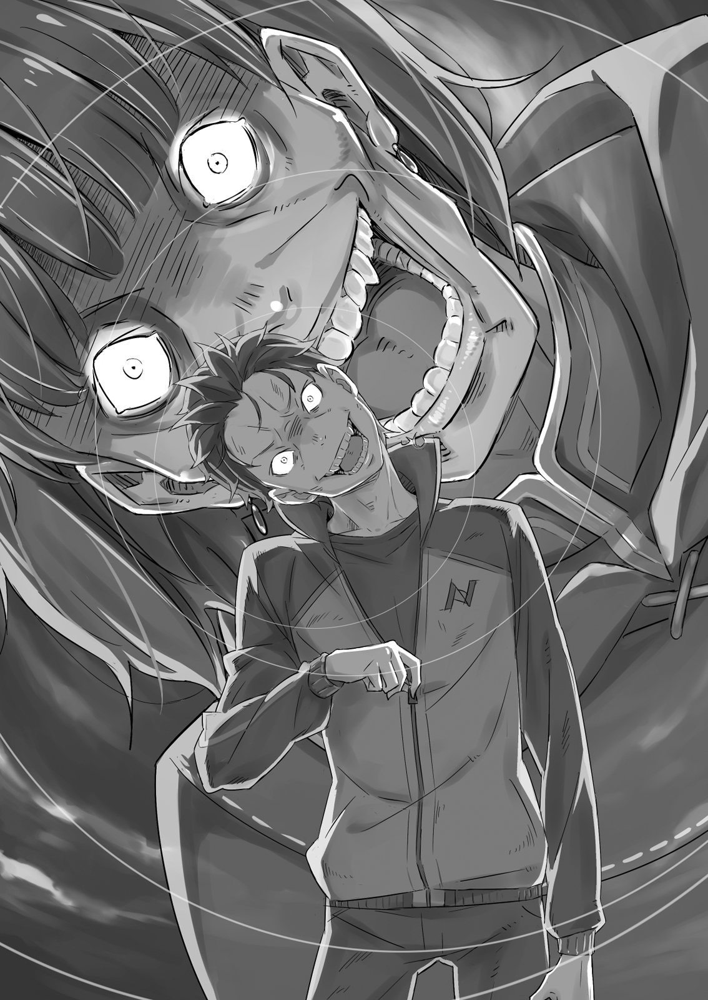

**1**

Сияющие потоки бледного света кружили в неистовом вихре и падали на окрашенную в кровавые и золотистоогненные цвета деревню Эрлхэм.

В студёном воздухе возникли ледяные иглы. Они отражали и рассеивали свет, создавая фантастическую картину —явление под названием «алмазная пыль». Оно было столь великолепно, что притупляло ощущение ужасной реальности.

— Я не потерплю произвола, что вы учинили! Довольно!

Звонкий и строгий, сладкозвучный голос вторгся в фантастическое световое представление. Этот голос, похожий на звон серебряного колокольчика, заполнил всю округу. Каждый, кто был на поле боя, не мог оторвать глаз от появившейся словно из ниоткуда девушки.

А любоваться было чем: серебристые волосы развевал слабый ветер, в фиалковых глазах светилась непокорная воля… Девушка была столь прекрасна, что хватило бы одного взгляда, чтобы навеки запечатлеть её образ в памяти.

Однако в эту минуту люди не могли оторвать от неё глаз совсем по другой причине: девушка создавала невероятно мощное ощущение своего присутствия в каждом сантиметре пространства.

Звон скрещивающихся клинков, вскрики и вопли, даже гул пламени горящих домов — всё затихло, словно кто-то нажал на паузу. И в центре этого безмолвия находилась сереброволосая девушка — Эмилия, взгляд которой был намертво прикован к противнику.

— Эмилия…

Едва Субару произнёс её имя, как тут же его захватил вихрь сложных чувств, поднявшийся из глубин души.

Ничего удивительного. Этого и следовало ожидать.

Эмилия не могла сидеть сложа руки, ведь поблизости разгорелась битва и в особняк одна за другой прибывали повозки с беженцами из деревни. Эмилия была не в состоянии бездействовать, когда кто-то храбро сражался, чтобы защитить её и других обитателей поместья.

Взгляд девушки переполняли печаль и ненависть к Культу Ведьмы, устроившему кровавую бойню.

— Уходи отсюда, злодей! Я не прощу… того, что ты натворил! — Эмилия грозно повысила голос, распознав в безумце врага.

Однако тот ничуть не испугался. Он даже расхохотался, изобразив на физиономии смесь изумления и восторга.

— А-ах…

Архиепископ изогнулся, простёр к Эмилии руки и всё с той же ухмылкой завопил:

— А-ах! Какой чудесный день! Какой замечательный день! Какой подарок судьбы! Чтобы сосуд достиг такого совершенства!.. Как две капли воды! Вылитая она, только в бренной оболочке! После всех испытаний никогда больше не выпадет мне шанс повстречать столь совершенный сосуд!..

— Что ты… несёшь?

От избытка чувств у пятой Лени текли ручьями слёзы. Глядя на эти странные рыдания, Эмилия в замешательстве нахмурилась.

— О! О Ведьма! Проводник моей любви… — возбуждённо проговорил безумец и заковылял к Эмилии.

Девушка выставила вперёд ладонь:

— Ни с места! Повторять не буду!

Но безумец был глух к предостережению. Он сделал шаг, затем ещё один. Расстояние между ним и Эмилией сокращалось…

— В следующий раз! Я тебя… я тебя непременно…

Я говорила, чтобы ты не двигался! — произнесла Эмилия ледяным топом. Её слова уже не были предупреждением — девушка применила силу.

В пространстве, где продолжал кружиться световой вихрь, возникла трещина. Из нес хлынула мана и обратила влагу, которая была в воздухе, в лёд. Возникли четыре ледяных копья с острыми наконечниками. Спустя мгновение они устремились к противнику.

Безжалостный лёд нёс неминуемую смерть. Копьё пронзило бы врага насквозь и обратило его плоть и душу в ледяную статую. Однако…

— Ни колебаний, пи сострадания, пи жалости… Воистину, воистину, воистину-у-у! Ты поступаешь прилежно! — Безумец разразился безудержным хохотом, когда адепты, самоотверженно бросившиеся на защиту хозяина, превратились в лёд.

— Разве они… не твои союзники? — Эмилия непонимающе нахмурилась.

В ответ безумец согнул шею под углом девяносто градусов и, выбросив дьявольские длани к оледеневшим подчинённым, разбил их вдребезги.

— Ученики! И мои «пальцы»! Но теперь, когда ты, этот прекрасный сосуд, здесь, во всём пет никакого смысла! То же касается и меня! Теперь, теперь, теперь-теперь-теперь-тепсрь-тспе-е-е-еррррь!

Эмилия слушала речь безумца, не зная, что ответить.

— Моя воля, мои желания, смысл моего существования! — продолжал он, выпучив глаза и направив сломанный окровавленный палец па Эмилию. Точнее, на её левое плечо. — Всё заключено в тебе!.. В тебе, в тебе, в тебе… И всё же это недопустимо.

На хрупком плече девушки, прильнув к серебристым волосам, сидел дух-кот. Именно из-за него Лень вскипела ненавистью.

— Дух, дух, ду-у-ух! Мелкая тварь, не ведающая ни великих принципов, ни любви! Ты прижимаешься к сосуду, но догадываешься ли, как это грешно?! Незнание суть грех!

Произвол!!! — Лень изливала на Пака свою неистовую ярость.

Пак же в ответ сверлил свирепствующего безумца враждебным взглядом. Это было так непохоже на мягкого и беззаботного Пака… Впрочем, Субару был знаком этот взгляд, до краёв наполненный жаждой убийства. Юноша узнал на собственном опыте, какая могущественная сила таится в кошачьем тельце.

— Не хочу огорчать, но я живу ради того, чтобы ей помогать. И я не собираюсь просить у кого бы то ни было разрешения находиться с ней рядом. Тем более у такого мерзкого типа, как ты!

Пак и безумец горячо ненавидели друг друга. Безумец неистово сыпал упрёками, а Пак лишь смотрел на него с презрением и отвращением. Взрывоопасное столкновение двух могущественных противников набирало обороты.

— Постойте, не…

— Это ты, Субарунчик, постой и не лезь.

Не успел Субару вмешаться, как кто-то с силой потянул его за рукав. Юноша испуганно умолк, однако это был всего лишь неизвестно откуда взявшийся Феррис. Рыцарь, одетый в рубище и завёрнутый в плащ, поглаживал израненную Патраш.

— Субарунчик, — вздохнул Феррис, — тебе и твоей малышке здорово досталось. Вам нужен полный покой. Никаких возражений, р-мяу! Позвать леди Эмилию решили я и Рам. Доверься ей хоть немного!

Удерживаемый Феррисом, Субару недовольно поджал губы. Он растерянно глядел на рыцаря и не мог взять в толк, к чему тот клонит.

Феррис лукаво прищурил один глаз и сказал:

— Пойми, человек, которого ты намерен защищать, —не из тех, кто будет молча прятаться за твоей спиной.

**2**

Битва началась так тихо, словно и не было никакого жёсткого разговора.

Созданный Эмилией защитный барьер из ледяного тумана разлетелся вдребезги, и девушка резко отпрыгнула назад.

В следующий миг земля, где она только что стояла, взорвалась. Эмилия, онемев от удивления, смотрела на взметнувшиеся в воздух комья земли.

— Они и вправду невидимые…

— Будь начеку! — прошептал сидящий на плече Пак.

Эмилия взяла себя в руки и легонько стукнула носком по земле. Феррис предупреждал, что безумец орудует незримыми руками. Глаза девушки оказались неспособны увидеть удар Лени. Но Эмилия знала, как от него защититься.

Девушка окружила себя ледяным туманом, благодаря которому различила движения невидимых рук, и уклонилась от атаки. Этот способ предложил Пак, а Эмилия без труда воплотила его в жизнь.

— Я должна подобраться поближе, — пробормотала Эмилия, и в том месте, где она топнула ногой, земля стала покрываться белой коркой. Спустя считаные мгновения образовался ледяной круг радиусом метров двадцать.

Как давно Эмилия не ощущала под ногами этот холод… Родившаяся и выросшая в лесу, на льду она чувствовала себя как рыба в воде.

— Какой наглый трюк! Какой дерзкий приём! Но пред лицом моей любви такая попытка спастись обречена на провал! — заорал мужчина вслед Эмилии, которая, едва оттолкнувшись, стремительно заскользила прочь.

В следующую секунду накатила невидимая волна и развеяла ледяной туман. Но когда длани проникли за барьер, Эмилии там уже не было. Девушка скользила по льду вокруг безумца, а тот выбивался из сил, чтобы схватить её. И что бы он ни делал, гнался за Эмилией или пытался перехватить её, всё без толку. Девушка замораживала один участок земли за другим, создавая бесконечное пространство для отступления.

И прежде чем невидимые длани достигли цели, защитник Эмилии взял противника в кольцо.

— Понимаю, ты очарован моей тщеславной доченькой, но в женихи явно не годишься, — несколько устало заметил Пак.

— Ух!

Словно из-под земли выросла толстая ледяная стена. Она окружила безумца и отрезала пути к отступлению. Беззащитный мужчина ошеломленно захлопал глазами.

В следующий миг раздался громкий треск: в степу вонзился ледяной кол. Смертоносный удар, без предупреждения и безо всякой надежды на спасение.

Кол пронзит жертву, и та обратится в лёд до последней капли крови и рассыплется па множество осколков.

Этот удар ясно показывал, что миловидная внешность Пака обманчива.

Внезапно за стеной заверещали:

— Какая наивность!!! Наивность, наивность, наи-и-и-ивность!!!

И ледяной барьер рассыпался на тысячи блестящих осколков. Мужчина перемахнул через груду битого льда — живой и невредимый.

В тот миг, когда ледяной кол пробил стену, безумец создал барьер из невидимой силы. Не выдержав давления, ледяная стена рассыпалась в прах.

— Как это забавно — надеяться, что одолеешь меня таким способом! Испытание намного сложнее, чем…

— Эйя!

— Уа-а!!!

Не успел мужчина насладиться триумфом, как Эмилия, бесшумно скользя по льду на максимальной скорости, сбила его.

Удар ногой пришёлся безумцу под ложечку, и он отлетел как пушинка.

— Что?.. Неужели опять?!

Эмилия бросилась к тому месту, куда должен был упасть враг, в надежде встретить его новой порцией магии. Однако то, что предстало перед её глазами, можно было принять за мираж…

Безумец взлетел и начал описывать параболу, но затем исполнил удивительный манёвр: он вдруг застыл в воздухе и устремился в другом направлении. Словно что-то схватило его на лету и отбросило.

— Он снова использует…

— А-ах! Нежелание включить мозги суть лень! Применяю но назначению! И не по назначению!

Мужчина простёр к Эмилии руки, но девушка тут же создала ледяную иглу, похожую на сосульку, и метнула её в противника. Игла наткнулась на невидимое препятствие и не достигла цели, разлетевшись па осколки.

Чувствуя незримый неослабевающий натиск, Эмилия, скользя по льду, схэздала ледяной трамплин и взмыла в воздух.

Оказавшись друг против друга, Эмилия и адепт встретились глазами. Один был полон безумия, другая — праведного гнева. Эмилия нанесла удар первой. На этот раз она создала множество ледяных дисков, которые, со свистом рассекая воздух, помчались по непредсказуемым траекториям на противника.

Диски окружили его со всех сторон, не давая ни одного шанса уйти от удара.

— Да, да, да, да, да-а-а!

Однако мужчина сумел увернуться, совершив неестественный, нелепый манёвр. Безумец закувыркался и заметался в воздухе самым странным образом, по всё же вырвался из окружения, после чего захохотал в неистовом восторге.

— Что это?.. Я не… — охнула Эмилия при виде безобразных движений.

— Любовь! — ответил мужчина, хотя назвать это ответом было сложно.

Противник горел такой лютой яростью, что бледная кожа Эмилии покрылась мурашками. Мужчина громко хлопнул в ладоши,

— В знак моей любви! Крещение милостью! Испытание! Пройди же его!

Тут у Эмилии возникло стойкое ощущение, что ледяной туман не поможет. Впервые за схватку ей стало не по себе. Девушка кожей чувствовала присутствие жестокой незримой силы, которая взяла сё в кольцо, отрезав пути к отступлению. Находясь в воздухе, Эмилия не могла свободно маневрировать, чтобы уйти от удара…

Наконец незримая и жестокая сила вонзилась Эмилии в самое сердце и пробила девушку насквозь. В груди образовалась широкая дыра. Мужчина широко распахнул глаза и провозгласил:

— Вот он — результат милости! Плод моей любви! Доказательство того, что Ведьма ответила на мою любовь! Нет причины скорбеть! Пусть содержимое потеряно, зато сосуд…

— Эйя!!!

— Уа-а!

Триумфальную речь прервал неожиданный удар ногой сзади, отправивший безумца в полёт. Он в изумлении уставился на Эмилию, на плече которой сидел Пак и беззвучно постукивал лапками друг о друга.

В тот же миг ледяная статуя Эмилии с пробитой грудью разлетелась на осколки. Фальшивую Эмилию было не отличить от настоящей.

— Кто ж глазеет по сторонам во время сражения?! Так тебя обставят в два счёта!

Пока безумец кувыркался в воздухе и скакал по небу, у него не было возможности следить за тем, что происходит вокруг. Поэтому Паку ничего не стоило обвести врага вокруг пальца, создав фальшивую Эмилию.

Так Пак сделал всё возможное, чтобы настоящая Эмилия не промахнулась.

— На этот раз не уйдёшь!

Пока безумец пикировал, на его руках и ногах защёлкнулись ледяные кандалы. Обездвиженный противник был лишён всякой возможности сопротивляться. На этом Эмилия завершила свою атаку.

Безумец упал, и обледенелые конечности пригвоздили его к земле. Витая в воздухе, Эмилия нацелилась на врага и устремилась вниз. Расстояние между ними всё сокращалось, но внезапно безумец широко распахнул глаза и усмехнулся:

— А-ах, ты и впрямь… прилежна!

— Спасибо. А теперь умри достойно!

С этими словами несущаяся вниз Эмилия нанесла удар основанием ладони прямо по туловищу ухмыляющегося безумца. Удар вышел настолько мощным, что у противника хрустнули кости. Он издал вопль, затрясся в конвульсиях и спустя секунду затих.

В следующее мгновение место, куда пришёлся удар, обледенело, а затем всё тело безумца окрасилось белым и превратилось в ледышку.

Мужчина даже не смог издать предсмертный вздох. Обратившись в истукана, сплошь покрытого ледяными узорами, он скончался.

На этом его бой с Эмилией завершился.

**3**

Субару в оцепенении наблюдал за схваткой.

Слово «впечатляющий» — слишком слабое, чтобы описать разыгравшийся бой. Эмилия прекрасно знала, что делает, поэтому ей удалось блестяще справиться с последней Ленью.

— Ну? Что я говорил?

От изумления Субару не мог вымолвить ни слова, и Феррис поспешил выразить своё восхищение победой Эмилии. Рыцарь уже излечил раны дракона и теперь протянул свою целительную руку к Субару.

Прикосновение тонких пальцев рыцаря напомнило юноше о ранах, и Субару снова ощутил боль. Всё тело было в ссадинах и ушибах, особенно болел правый бок. Именно на эту сторону пришёлся удар, когда они вместе с Патраш шмякнулись в лесу.

— Ну как, Субарунчик? Когда я коснулся, боль не ушла?

— Перестань, лучше дай плацебо! Убеди, что мне совсем не больно.

— Да разве так можно, р-мяу? Так и помереть недолго…

Феррис шутливо ткнул Субару в бок. Юноша отстранил его руку, а затем, вздыхая, вновь перевёл взгляд на Эмилию.

Девушка стояла посреди деревенской площади, на которой развернулась битва, и смотрела на последнюю Лень, превращённую в лёд. Неизвестно, какие чувства она испытывала, убив безумца. Однако Субару заметил па белой щеке Эмилии блестящую дорожку от прокатившейся слезы.

Неужели девушку так взволновало то, что она лишила кого-то жизни? Если так, то в случившемся виноват Субару Нацуки, ведь это он, ища поддержки, свёл Эмилию и Культ Ведьмы.

Заметив на своей щеке слезу, Эмилия удивилась и поспешно смахнула её. Сидящий па плече Пак что-то сказал, и девушка озадаченно нахмурилась. Опа и сама не знала, отчего появилась слеза. Именно так рассудил Субару.

Вдруг он, не сводя глаз с Эмилии, заметил, как в груди зарождается загадочное и глубокое чувство, не такое, как прежде. Субару изо всех сил пытался разобраться в непостижимом ощущении, однако…

— Ну и ну, какие все торопливые! — криво улыбнулся Феррис, когда то тут, то там начали раздаваться громкие возгласы.

Главный противник, последняя Лень, был побеждён, и наступила финальная стадия сражения. Большая часть войска адептов, принимавших бой в разных уголках деревни, была разбита, и воздух сотрясало эхо победного клича.

Самыми крикливыми оказались, пожалуй, бойцы «Железного клыка». Но победу праздновало не только племя зверолюдей. Оставшиеся в живых рыцари тоже ликовали, подняв мечи.

— Ни забот у них, ни хлопот, а вот моя работа ещё вся впереди, р-мяу!

Лекарю Феррису предстояло начать настоящую битву, ведь от его мастерства зависело, сколько раненых удастся поставить па ноги. Разумеется, встревать в толпу торжествующих воинов сейчас было не время…

— Феррис!

— Да, да, Феррис к вашим услугам… — весело откликнулся Феррис, но, когда увидел, кто к нему обращается, едва не раскрыл рот от удивления. — Старик Вил?!

Позади стоял Вильгельм. Он едва держался на ногах и тяжело дышал. Покрытый страшными ожогами и бесчисленными ранами, он, как никто другой, соответствовал определению «полумёртвый».

— Да разве можно с такими ранами двигаться?! Тебе срочно нужна помощь!..

— Не сейчас, сначала я должен сказать кое-что важное.

— Но ты того гляди помрёшь! Что может быть важнее жизни?!

— И всё-таки разговор крайне важный… Мастер Субару?

Несмотря на тяжёлые ранения, энергия в голосе Вильгельма била ключом. Крепкий дух поддерживал измождённое тело, готовое рухнуть на месте. Изумлённый Феррис снова повернулся к Субару:

— Субарунчик тут, рядом…

Должно быть, стоит столбом, растерянно думая, что бы сказать Эмилии.

Однако…

— Субарунчик?

Субару Нацуки нигде не было.

**4**

Обхватив руками голову, он перемахнул через заросли и устремился в лес, в самую чащу.

Нужно убежать как можно дальше, бежать, пока есть силы, пока он в состоянии. Прочь от деревни, от площади, от боевых товарищей… Прочь от Эмилии.

— Ха… ха…

Задыхаясь, Субару в отчаянии мчался сквозь лес по ухабам и кочкам. Пот заливал глаза, сердце выскакивало. Но юноше было не до того.

Перед глазами стояла сереброволосая девушка, повернувшаяся к нему спиной. Рано или поздно она развернулась бы, взгляды встретились, и они поприветствовали бы друг друга после долгой разлуки… Нет! Сейчас об этом страшно даже подумать!

Не оттого, что Субару стыдился или боялся. Причина в ином. Более неприятная, более страшная причина…

— Субару, ты куда?!

— А?!

Его взяла оторопь. Откуда этот голос? Ведь он в безлюдной чаще! Субару остановился и, обернувшись, увидел стройную фигуру.

Это был элегантный красавчик со светло-лиловыми волосами — Юлиус Юклиус. Рыцарь отряхнул полы испачканной в крови формы и, опершись о ствол огромного дерева, пристально посмотрел на Субару.

— Я рад, что ты невредим… Что произошло? Из деревни доносятся победные возгласы. Похоже, Лень повержена. Но мне непонятно, что ты здесь делаешь.

Субару молчал, стиснув зубы.

— Если тебя что-то тревожит, расскажи, — терпеливо продолжил Юлиус, поправив растрёпанные волосы. — Теперь у нас одна судьба.

Юлиус был прав: ещё доносились возгласы воинов, а значит, деревня всё ещё близко. Нужно бежать дальше!

В конце концов, если он не окажется как можно дальше…

— Субару? — Юлиус нахмурился.

Почему Субару молчит? Не отводя беспокойного взгляда, рыцарь сделал шаг вперёд. Он глядел на Субару так, как смотрят на раненых или больных. Но юноша был невредим благодаря простому лечению Ферриса. Так что тело прекрасно справится с уготованной ему ролью.

— Суба…

— Юлиус, отойди от… хотя всё равно поздно-о-о!

Но Юлиус всё-таки успел отпрыгнуть и остаться целым.

Промахнувшись, Субару недовольно склонил голову. Вбок на девяносто градусов.

— Неплохая реакция! Прекрасный манёвр! Ты воистину, воистину, воистину… прилежен! Тем прискорбнее…

— Я сразу подумал, что дело неладно, когда Иа выскочила из его тела… — досадливо пробормотал Юлиус, упав на колено и обнажив меч. Его глаза выражали причудливую смесь злости, сожаления, растерянности и вместе с тем неистощимого боевого настроя.

«Субару» удовлетворённо кивнул.

— Ты подаёшь всё больше надежд! То, как ты себя ведёшь, как думаешь, как дрожат твои ресницы, — всё это свидетельство твоего прилежания! Лишь одно вызывает отвращение — твоя грязная, низкая душонка!

— Если кто-то сейчас и вызывает отвращение, так это ты, ублюдок…

Юлиус и «Субару» сверлили друг друга взглядами, полными ненависти, гнева и безумия. Но тут…

— Юлиус! Субарунчик!

Раздался громкий топот. Поднимая клубы пыли и перескакивая через упавшие деревья, в лес ворвался иссиня-чёрный земляной дракон. Верхом на драконе сидели Феррис и Вильгельм.

Феррис, испуганно выпучив глаза, смотрел на Юлиуса и «Субару», стоявших друг напротив друга. Вильгельм соскочил с дракона и встал рядом с Юлиусом. Затем обратил грозный взгляд на «Субару»:

— Мастер Юлиус, что с мастером Субару?..

— Господин Вильгельм, это не Субару.

Вильгельм стиснул зубы до хруста, в этот момент в нём проснулся дух меча.

Напряжение нарастало. На лице Ферриса отразилось беспокойство, Юлиус горел праведным гневом, а в глазах Вильгельма плескалась ярость. И только «Субару» довольно осклабился безумной улыбкой. Он хлопнул в ладоши и…

— Теперь, когда все в сборе, я снова, с вашего позволения, представлюсь! Греховный архиепископ, отвечающий за Лень!

Согнув шею под прямым углом и распахнув спортивную куртку, безумец «Субару» громогласно захохотал и назвал своё имя.

— Петельгейзе Романе-Конти И!

**5**

Он ошибся. Просчитался. В самом важном Субару проиграл противнику. Не сумел распознать истинное зло Петельгейзе Романе-Конти.

Греховный архиепископ Лени — это не множество созданий, не десять «пальцев».

Это одна-единственная сущность по имени Петельгейзе, которая вселяется в людей.

— Великолепное! Восхитительное тело! — Петельгейзе отклонился назад и закрыл лицо ладонями. — Сколько лет у меня не было такого удобного носителя! Лучшей замены для моих погибших «пальцев» не придумать!

— Да как ты смеешь… — взорвался Вильгельм. — Немедленно убирайся из тела мастера Субару, дьявольское отродье!

— Какое ты имеешь право мне это говорить?! — заверещал Петельгейзе голосом Субару и с остервенением принялся раздирать себе горло. — Ведь я поселился в этом теле только потому, что вы отняли мои драгоценные «пальцы»!

Смотреть, как он, истекая кровью, ковыряется в плоти, было невыносимо. Юлиус и остальные едва сдерживали злость.

— Ты… — Петельгейзе показал пальцем на Ферриса. —Мне нравится твоё тело, однако оно под завязку набито магическими заклинаниями. В «пальцы» не годишься… А теперь ты, прилежный старик! Твоё тело тоже не подходит на роль моего «пальца»! Ты силён духом, и я это уважаю, но твой сосуд не годится для милости… А-ах, какая трагедия!

Петельгейзе сокрушённо покачал головой. Никто не понимал, что конкретно он имел в виду. Ясно было одно: безумец замышлял нечто дурное, но ни один из воинов не отвечал его требованиям.

— А вот ты, повелитель духов, совсем пропащий! Но, избавившись от своей грязи, ты стал бы хорошей заменой одному из моих «пальцев». Каков твой ответ?

— Не хочу тебя огорчать, но, даже если малышки бросят меня, я от них не отвернусь. Тебе, сумасшедшему подонку, этого не понять, — со злостью парировал Юлиус.

В ответ Петельгейзе выпучил глаза и, ударив себя по коленям, разразился сдавленным хохотом.

— Сумасшедшему! Точнейшее определение! Да, любовь свела меня с ума! Любовь! Благоговейная, милосердная, добродетельная, жаждущая, милостивая, почтенная, благосклонная, высшая, личная, чистая, горячая, чувственная, страстная, верная, глубокая, щедрая, сексуальная, драгоценная, жаркая, гадкая, преданная, бедная, пристрастная, безрассудная, дружеская, сострадательная… Любовь, любовь, любовь, любо-о-о-о-овь!!!

— Помешанный ублюдок! — с ненавистью отрезал Юлиус, а затем попытался достучаться до разума Субару: — Субару! Проснись! Ты одержим этим безумцем!

— Бесполезно! Его плоть подчинена мне! Любые попытки освободиться бессмысленны! Он уже превратился в мой «палец»!

— С тобой, мерзавец, никто не разговаривает! Субару, очнись! Вспомни, зачем ты вернулся, ради чего сражался!

Окружённый шестью разноцветными духами, Юлиус поднял свой рыцарский меч. Вспыхнула радуга и разогнала лесной мрак. В глазах у присутствующих на миг потемнело, а в захваченном Петельгейзе сознании промелькнул свет. И там…

— Что… это?! Не что, а кто! Урод, слышишь меня?! , Безумец в изумлении распахнул глаза. В словах, которые он обронил, звучала воля хозяина тела.

Выражение лица «Субару» постепенно менялось: жуткая гримаса удивления Петельгейзе уступала место страдальческому выражению юноши. При виде этого Юлиус и остальные закричали с надеждой:

— Субару!

— Субарунчик!

— Мастер Субару!

— Я Петельгейзе… Романе-Конти… Заткнись, я Субару… Нацуки!.. Умолкни!.. Думаешь, тебе, бессильному, удастся меня победить?..

Он должен показать, что полон сил, что способен вернуть свою душу! А иначе им тотчас же овладеет страсть к саморазрушению и больше уже не отпустит. Может быть, ему захочется сровнять с землёй всё вокруг при помощи смертоносных дланей, растущих из его тени…

Значит, вот какой мрак царит в душе Петельгейзе…

В таком случае его сумасшедшее поведение вызывает некое сочувствие…

Когда тобой овладевает безумие, будешь пытаться сохранить рассудок, даже причиняя себе вред. Когда разум во мраке, потерять душевное равновесие проще простого.

Так вот какой он, мир, который видит Петельгейзе?..

Вдруг сквозь выставленный Субару заслон прорвались слова безумца:

— Мне не нужно… понимание.

Дух, только что источавший безумие, дикий восторг и ярость, произнёс эти слова безразличным, вялым голосом.

В нём сквозил такой мрак, перед которым меркли все страхи Субару.

И тут юноша понял: ни в коем случае нельзя выпускать этот мрак наружу.

— Юлиус, давай…

Пока Петельгейзе сопротивляется слабо, нужно воспользоваться шансом и поставить точку.

Субару избрал наилучший способ: рыцарский меч имел серьёзные шансы одолеть Петельгейзе.

Услыхав своё имя, Юлиус замер в оцепенении. Губы его задрожали.

— О чём ты?

— Прости… но нет времени. Чтобы победить, ты должен остановить меня… Действуй…

— Никогда! Подумай, Субару! Я — Рыцарь Заклинатель Духов! И я заключил контракт, чтобы помочь тебе! Я никогда не откажусь от своих слов!

— Контракт со мной… чтобы спасти Эмилию… — сдавленно произнёс Субару. — Это, конечно, не по-джентльменски, но…

На лице Юлиуса возникла страдальческая гримаса. Рыцарь всегда был сдержан и никогда не терял присутствия духа. Поэтому Субару несколько удивило выражение его лица. Неужели Юлиус колеблется?

— Ты ведь хотел позднее кое о чём поговорить, помнишь?

— Извини, но… теперь в этом нет смысла.

Юлиус вспомнил, как они в разгар схватки с Ленью пообещали друг другу храбро сражаться. Они с Субару так и не успели примириться по-настоящему.

— Вильгельм, вам нужно лечение…

— Я не мог оставаться безучастным. И сделаю всё, чтобы не допустить такого финала…

Истерзанный, Вильгельм примчался сюда, отложив обработку ран на потом. Сила духа Дьявольского Мечника вызывала восхищение, но его меч был не в силах разогнать мрак.

Субару устало улыбнулся. Оставался последний человек, которому можно было довериться.

— Феррис, пожалуйста… — Субару кивнул рыцарю, ибо тот относился к жизни и смерти серьёзнее всех.

— Мне очень жаль… — произнёс Феррис.

В глазах рыцаря стояли слёзы. Он направил палец на Субару, и юношу будто охватил огонь. Всё тело пронзила жгучая боль, точно в жилах закипела кровь.

— А-а-а-а-а!!!

Как больно! Больно! Больно! Больно! Больно!..

Горит горло. Горят глаза. Горит тело. Гори г язык. Горит пос.

Горят руки. Горят уши. Горят ноги. Горит кровь. Горит мозг.

Горят кости. Горит душа. Горит жизнь. Горит, горит, горит…

Кровь буквально бурлила, внутренности точно ошпарили кипятком, а мозг испарялся. Жар затуманил взор.

«А-а-а-а-а-а!!!»

Где-то в другом месте, не в его ушах, раздался чей-то предсмертный крик. В одном теле пребывали две души. Разумеется, душа безумца, с которым Субару разделял свою плоть, тоже испытывала невыносимые муки.

Субару не даст ему уйти. Заберёт его душу па тот свет вместе с сосудом, в котором она заперлась.

Юноша бился в страшных конвульсиях, пока наконец не затих.

Больше никакой бессмысленной борьбы. Петельгейзе найдёт свою смерть в теле Субару.

Феррис! Почему…

— Кто же ещё, если не я? Так пожелал Субарунчик.

— Это не повод доставлять мастеру Субару такие страдания…

— Думаешь, мне самому приятно?! Никогда не думал, что применю свою силу таким образом!..

Где-то вдалеке раздавался стон обиды, а его заглушал горестный крик. В глубине души Субару сожалел, что заставил Ферриса выполнить эту грязную работу. Следовало бы склонить перед рыцарем голову, по па это уже не было сил.

Кроме рыцаря, Субару больше не к кому было обратиться.

Феррис прибегнул к тому же способу, каким нокаутировал Кэти в повозке. Он не раз прикасался к Субару во время лечения, поэтому теперь мог управлять его маной на расстоянии. Но кто бы подумал, что Феррис доставит такие адские муки! И всё-таки сожалел Субару не столько о перенесённых муках, сколько о том, что вынудил рыцаря пойти на это.

Феррис, должно быть, не просто гордился собственной силой. Лекарь видел в исцелении свою миссию и потому испытывал что-то гораздо более масштабное, чем просто гордость.

А Субару заставил Ферриса злоупотребить этой силой…

Если бы юноша мог извиниться перед ним…

Субару лежал ничком, не в силах шевельнуться. Вдруг что-то твёрдое и шероховатое прижалось к щеке. Его взор был по-прежнему замутнён, однако прикосновение показалось знакомым.

Тот, кто прикоснулся, был близок Субару, но им не мог быть ни Юлиус, ни Феррис, ни Вильгельм.

Дракониха! Патраш прижималась к Субару мордой, словно оплакивая жизнь хозяина, угасавшую, точно пламя на ветру. Хорошо, что Эмилия и Рем не видят этой печальной картины.

— Субару… — послышался чистый, прозрачный голос.

Кажется, рядом с Патраш кто-то стоял. И сразу стало ясно кто. Твёрдый, решительный голос мог принадлежать только человеку по прозвищу Безупречный Рыцарь.

Здесь и сейчас присутствовал только один рыцарь, заслуживающий подобное звание.

— Я виноват, что вынуждаю тебя и Ферриса пойти на неприятную меру. Когда-нибудь я поплачусь за это…

Меньше всего Субару хотелось ответить: «Ерунда, не бери в голову!»

«Нет уж! Помучайся как следует! И никогда не забывай об этом. Мне самому никогда не забыть… ту боль и ощущение полнейшего бессилия…»

Повисла тишина. Однако безмолвие не сломило решимости рыцаря.

Холодная сталь коснулась шеи. Субару вздохнул, осознав, что истекают последние секунды его жизни.

— Мастер, мне очень жаль.

— Госпожа Лия точно огорчится…

Голоса прозвучали где-то далеко, вокруг всё плыло, становилось неразличимым.

Он поклялся помнить. Поклялся вернуть. Поклялся во что бы то ни стало возвратиться.

«Это конец?! Вздор! После того как я… нашёл идеальный сосуд! Перед самым завершением испытания! Мой „палец”! Будь у меня новый сосуд, я никогда бы не исче…»

«Заткнись и сдохни, тварь!..»

**6**

Субару падал всё глубже и глубже в неведомую бездну…

Неужели он снова умирает? Опять исчезает?

Оказавшись на дне ада, он потеряет всё, что имел. Его снова постигнет неудача, за которой придёт жестокая смерть.

Вспомни этот круг.

Вспомни ошибки.

И не забывай, никогда не забывай…

Горестный стон Ферриса, дрожащий от досады голос Вильгельма, скорбный скрежет зубов Юлиуса, покорившегося судьбе. Храни эти воспоминания. Вцепись в них и не отпускай!

Очередная жизнь подошла к концу.

И всё же… это ещё не конец Субару Нацуки.

Что бы ни было впереди, куда бы он ни возвратился, какие тяготы и невзгоды ни ждали бы.

Он не остановится. Он сможет начать сначала, потому что поклялся.

Щелчок. И всё погружается во мрак.

А затем…

«Я люблю тебя».

Слышится ласковый, мимолётный, сладкий и в то же время жестокий вздох…

Субару Нацуки умирает. И жизнь в своём бесконечном течении начинает новый круг.
