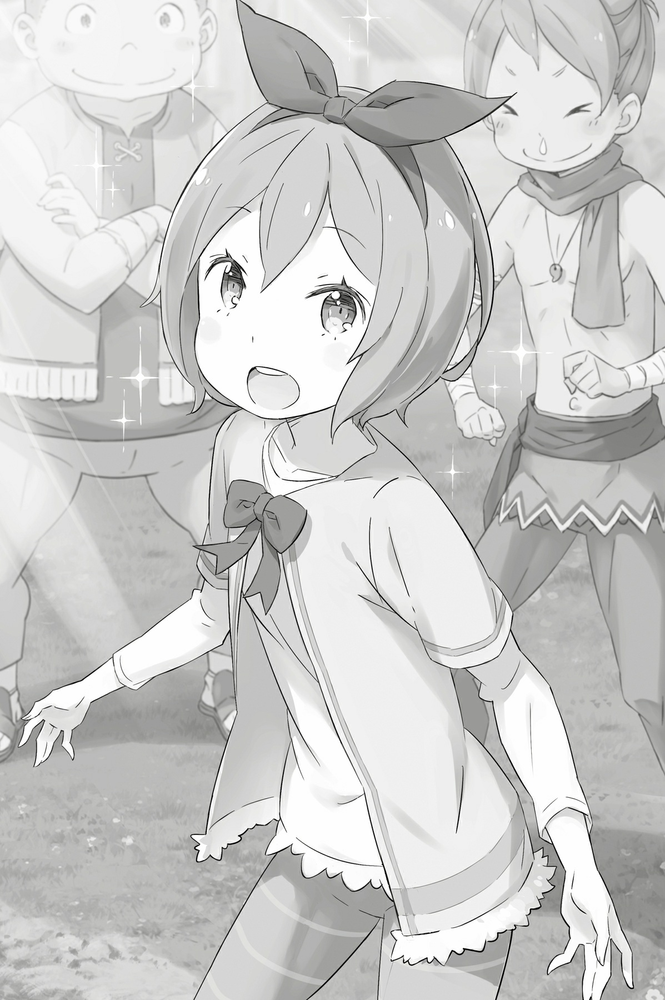

## 1

— Субару!

— A?

Вдруг кто-то позвал его по имени и тряхнул за плечо — Субару очнулся.

Картинка, передававшаяся в мозг, изменилась в мгновение ока, будто включилась другая камера. Но мозг оказался перегружен внезапным потоком новой информации, и голова пошла кругом.

Субару поморгал, пытаясь сфокусироваться. И тут каждый миллиметр его тела покрылся мурашками. Он все понял.

— Неу… жели…

Субару поднес руку ко лбу. Удары сердца и шум циркулирующей крови были оглушительны. Минутный вакуум сознания говорил о том, что он снова пережил смерть. Субару Нацуки исчез… и возродился вновь.

*Смерть… Опять смерть!..*

Старуха с косой встретила его в разгар сражения с гнусной Ленью. И, преодолев столько трудностей, Субару отдал ей жизнь. Сначала битва с Белым Китом, затем война с Культом Ведьмы. Наконец, возвращение в деревню Эрлхэм. После тяжелых сражений Субару могли ждать и радости, и печали, и злость… Но все пошло прахом!..

От досады он закрыл лицо руками и вдруг ощутил рядом чье-то теплое дыхание, а затем… прикосновение к мочке уха.

— Ам!

— Уа-а-а!

От неожиданности Субару шлепнулся на землю и в недоумении воззрился на игривого шутника. Сверху вниз на него смотрела пара шаловливых желтых глаз. Их обладатель, кокетливо улыбаясь, прижал палец к губам:

— Я думал, ты заснул, поэтому решил поиграть. Ты так забавно отреагировал! Похоже, подобные розыгрыши войдут у меня в привычку!

Шутник повел кошачьими ушками льняного цвета. Субару глядел на него с раскрытым от изумления ртом. Затем сглотнул слюну и наконец выговорил её… то есть его имя:

— Феррис?!

— Кто ж ещё?! Выходит, ты не только любитель дрыхнуть средь бела дня, но ещё и страдаешь галлюцинациями? Наверно, китового Тумана наглотался… Хочешь, осмотрю тебя? — спросил Феррис с озабоченным видом.

Субару мотнул головой:

— Нет-нет, все в порядке. Я уже услышал то, что хотел.

Юноша глубоко вздохнул и осмотрелся. Рядом стоял Феррис, вокруг него — все остальные. Вернеё, не вокруг Ферриса: бойцы окружили Субару. Вокруг простиралось поросшее травой поле, небо над головой только начинало светлеть. Взгляды присутствующих были сосредоточены на Субару. Слева от себя юноша ощутил свирепый звериный дух.

— Это ты сначала со мною заговорил?

— С тобой все нормально, парниш? Застыл как истукан! Не делай так больше!

Это был Рикардо. На морде могучего зверочеловека с собачьей головой возникла гримаса сомнений. Субару задумчиво поскреб пальцем щеку. Может, Рикардо испугался его вида в момент Посмертного возвращения? Юноша снова оглядел Воинов и кивнул:

— Чуть с сердцем плохо не стало! Подумал, опять стою перед фруктовой лавкой.

Субару облегчённо вздохнул, провел ладонью по прохладной земле, поросшей травой. Нет, это определенно не земля столицы.

Это был тракт Лифаус, то самое место, где Субару проводил собрание сразу после битвы с Белым Китом. Иными словами…

— Меня перенесло в новую точку сохранения!

Пройти через девять смертей — опыт не из приятных, но Субару снова был жив, и это дарило надежду.

## 2

Результат, достигнутый в упорной борьбе, оказался ужасен. И всё-таки могло быть и хуже. Одержать победу в череде сражений и погибнуть в самом конце — вне сомнений, прискорбно. Однако, если бы точка рестарта осталась прежней и Субару перенесся в момент до битвы с Белым Китом, это было бы намного хуже. По крайней мере, в данной точке сражение со зверодемоном позади и заветное желание Дьявольского Мечника уже исполнено.

— Мастер Субару, вам нехорошо? Вы плохо выглядите, — обеспокоенно произнес Дьявольский Мечник Вильгельм, заглядывая Субару в лицо.

Юноша резко мотнул головой, собираясь с мыслями. Шок от Посмертного возвращения не оправдание. Тем более сейчас, когда он с отрядом должен строить план разгрома Культа Ведьмы.

— Что ж, раз беспокоиться не о чем, давайте обсудим наше положение, — заговорил красавец

Юлиус. В его раскосых глазах читались благоразумная настороженность и справедливое негодование.

— Сейчас мы направимся в поместье Мейзера, чтобы сразиться с мерзким Культом Ведьмы. В идеале мы должны истребить всех его последователей вместе с греховным архиепископом, который ими руководит. Но самое главное — безопасность мирного населения. Нельзя втягивать людей в эту войну. И потому…

— Да, — перебил Субару, — по моей просьбе леди Анастасия предоставила экипажи странствующих торговцев. Мы используем эти повозки для эвакуации людей. Что касается нашего союза с леди Круш, специальный посланец должен доставить в особняк письмо. Извините… Я уже в порядке.

Вернувшись к главной теме собрания, Юлиус напомнил Субару, на чем остановилось обсуждение. А именно: Субару уже поведал в общих чертах свой план охоты на Культ, «с которым даже обезьяна справится», и рассказал о «подстраховке» на случай эвакуации.

Вот только «подстраховка» в прошлом круге обернулась против него самого. Вместо письма посланец доставил чистый лист бумаги, а среди нанятых торговцев оказался адепт Культа. Нужно было срочно что-то придумать и не допустить подобного в этом круге…

— Судя по выражению лица, тебя что-то серьезно беспокоит… — заметил Юлиус.

— Только не надо вольно интерпретировать выражение моего лица! Ты что, доктор?

— Может, ты хочешь, чтобы настоящий доктор провел тщательное обследование? Я не против! — подхватил Феррис.

Субару в мыслях уже скрежетал зубами. Да, ему было о чем беспокоиться. Но как поведать о своих тревогах, он не знал. Как рассказать о том, что греховный архиепископ обладает весьма опасной способностью, и о многих других проблемах? Причем так, чтобы ему поверили?..

— Нет, не то… — проговорил Субару, зажмурившись и прижав руку к груди. — Не то я делаю. Опять кое о чём забыл.

— М-м-м? — вопросительно поглядел на него Феррис.

Юлиус молча нахмурился.

«Какой же я глупец! — думал Субару. — Разве продвинусь я хоть на шаг, если буду совершать одни и те же ошибки?!»

Он открыл глаза и вновь оглядел отряд — пятьдесят воинов, сидящих вокруг. Они смотрели на умолкнувшего Субару с некоторым напряжением и надеждой. В их взорах не читалось ни сомнений, ни страха, ни отчаяния. То были воины, что не раз говорили: «Мы верим в тебя, ты можешь рассчитывать на нашу помощь». А ещё была Рем… В конце концов, если бы не она, Субару здесь просто не оказалось бы!

— Решил предаться сентиментальным мыслям? — спросил шутливо Юлиус, уловив перемену в лице и настроении Субару.

Рыцарь попал в точку, но в эту минуту Субару желал искренне поблагодарить его. Юноше хотелось сказать, что он верит в Юлиуса так же, как верит в остальных воинов.

— Я сейчас странно себя вел, за что прошу прощения. На самом деле я хочу рассказать ещё кое-что о Культе Ведьмы. Есть обстоятельства, на которые я обратил внимание только теперь. И я надеюсь обсудить их с вами.

Не было нужды ломать голову, придумывая лучшее объяснение. Пустая трата времени. В благодарность за доверие следовало рассказать всю правду, прямо и без утайки. Субару не мог поведать о Посмертном возвращении, но мог поделиться тем, что он узнал благодаря нему. Иного способа предупредить отряд не существовало. Наверное, рассказанное им бойцы сочтут фантастикой или нелепицей. Но ему поверят. Ведь именно понимание и доверие товарищей — сильнейшее оружие Субару Нацуки.

## 3

В прошлом круге, во время столкновения с Петельгейзе, выяснилось несколько новых фактов. Во-первых, письмо, доставленное в особняк Розвааля, оказалось пустым. Во-вторых, среди нанятых для эвакуации торговцев затесался адепт Культа Ведьмы. И в-третьих, стало известно о наиопаснейшей способности Петельгейзе Романе-Конти: он может вселяться в чужое тело, из-за чего жертва становится одержимой.

— Кто-нибудь в курсе, существует ли способность, позволяющая накладывать своё сознание поверх сознания другого человека и тем самым завладевать его разумом? Может, какая-то специальная магия?

В этом мире было множество видов магии, и Субару слабо понимал принцип их работы. Начиная с магии четырех атрибутов, продолжая Блуждающей дверью Беатрис, магией левитации Розвааля, Божественной защитой драконов и заканчивая таким подвидом магии, как колдовство. Значит, нельзя исключать, что существует и магия захвата. Рассуждая подобным образом, Субару и задал вопрос, однако…

— Свое сознание поверх сознания другого? Что за вздор, р-мяу?!

— Ты лишаешь меня сильнейшего оружия…

— О чем это ты, р-мяу?

Только Субару расхрабрился для откровенной беседы, как его слова подняли на смех. Фундамент, на котором зиждилось доверие, дал глубокую трещину. Юноша, недовольно скривив губы, с упреком посмотрел на недоумевающего Ферриса.

— Давай порассуждаем… — задумчиво предложил Юлиус. — То есть ты полагаешь, что архиепископ обладает такой необычной способностью? Я прав?

— Да, именно так! Я называю её магией Захвата и почти уверен: архиепископ на это способен! Петельгейзе переселяется в других людей и так продлевает свою жизнь. Возможно, этим и объясняются его многочисленные вылазки по всему миру.

Юлиус умолк, видимо переваривая услышанное. А услышал он чистую правду, как бы неправдоподобно она ни звучала. И Субару прекрасно это знал, ведь именно в него вселялся безумец в прошлом круге. Завладев телом юноши, архиепископ попытался лишить Субару воли. Вне всяких сомнений, Петельгейзе Романе-Конти был истинным злом в обличье духа, паразитирующего в чужих телах.

— Однажды мне довелось изучать древние документы, в них говорилось о похожем явлении, — произнес Юлиус, прикоснувшись рукой к подбородку, — Впрочем, тогда я счел это полнейшей чепухой…

— Правда? — живо заинтересовался Субару.

Красавец-рыцарь принялся копаться в памяти:

— Кажется, в тех документах говорилось о попытке отыскать утерянную магию. Около четырехсот лет назад, когда случилось Великое Бедствие, мир потерял очень многое. В том числе секреты некоторых видов магии. Среди них и тот вид, о котором ты говоришь.

— Ну же, не томи! Что ты подразумеваешь под «тот вид»?

— Техника переноса души.

То, о чем толковал Юлиус, показалось Субару ужасно далеким от понятия «магия». Юноша заметил, что во время рассказа на лице рыцаря промелькнула тень отвращения. Закрыв глаза, словно ему было неприятно вспоминать об этом, Юлиус продолжил:

— Техника, на первый взгляд, весьма проста. Маг берет все то, что составляет его душу: знания, память, опыт, судьбу и сводит компоненты воедино. А затем накладывает это на чужую душу.

— И получается человек с переписанными сознанием и памятью, так?

Эта техника напомнила Субару копирование и вставку компьютерных файлов. Маг обращался с человеческой душой как с файлом: копировал свою душу и сохранял её на чужом «диске».

— Но на практике это неосуществимо. Секрет магии утрачен. Какие применялись заклинания, можно только догадываться. Чтобы воссоздать её сейчас, нужны недюжинный талант и упорство. В жизни не поверю, что греховный архиепископ обладает такими качествами!

— Твоё неверие не доказывает, что магия захвата невозможна! — разозлился Субару. — Ведь речь о Культе Ведьмы!

Феррис умерил пыл юноши:

— Субарунчик, остынь. Юлиус ещё не закончил.

Субару смущенно умолк, и Феррис жестом попросил Юлиуса продолжить.

— Извините, я долго добираюсь до сути. Видимо, дурная привычка. Итак, помимо утраты заклинаний, есть и другие сложности. Маг весьма ограничен в выборе жертвы. Данная техника не позволяет взять первого встречного, стереть его душу и наложить свою.

— Ну само собой! — подтвердил Феррис. — Стирание памяти и все такое, конечно, не по моей части, но вот чтобы переписать врата, нужно очень постараться! Боюсь, жертва должна быть кровным родственником мага.

— Кровное родство весьма желательное условие. Как справедливо заметил Феррис, если новая душа не имеет связи с вратами жертвы, тело может не принять такую душу. К тому же тело, даже после подселения новой души, продолжает испытывать влияние старой. Поэтому сохраняется вероятность, что старая душа вернет своё тело.

— Смотрю, у этой магии куча недостатков…

Выслушав Юлиуса и Ферриса, Субару был вынужден признать: техника переноса души и впрямь очень сложна. С одной стороны, Петельгейзе вполне мог оказаться магом, виртуозно владеющим забытым знанием. Не было никаких оснований утверждать обратное. С другой же — вряд ли жертвы архиепископа являлись его кровными родственниками. Уж Субару-то определенно таковым не был!

— И всё-таки эту магию рано сбрасывать со счетов, — протянул Юлиус.

— Определись уже!

— Твоя вспыльчивость огорчает меня. Я же сказал, что знаю похожую магию. Но, даже если конкретно эта техника ни при чем, есть много других обстоятельств, которые следует учитывать.

— Например?

— Полагаю, условия для захвата не менее жесткие, чем для переноса души, — пояснил Юлиус.

Субару слегка нахмурился, суть он уловил мгновенно: наличие родственной связи важное условие захвата.

— Выходит, Захват применим лишь к некоторым членам Культа?

— Может, это и есть те самые «пальцы»? — предположил Феррис.

— Вроде запасных тел… — кивнул Юлиус. — Мерзость! Впрочем, чего ещё ожидать от такого подонка…

Субару слушал их с открытым ртом. Рыцари мгновенно раскусили механизм Захвата. Субару знал, что Юлиус и Феррис разбираются в магии лучше, чем другие члены отряда, но не предполагал, что их знания столь обширны.

— Выходит, самый верный способ одолеть архиепископа Лени, — уверенно продолжил Юлиус, — это лишить его оставшихся жизней! То есть уничтожить все «пальцы», и тогда…

— Тогда его душонке некуда будет переселиться и архиепископу придет конец! — закончил Субару в восхищении.

Положение казалось безвыходным, но, благодаря Юлиусу и Феррису, юноша увидел луч надежды. Решение проблемы, предложенное Юлиусом, было бесспорным и не противоречило задачам отряда.

— Вывод такой: первым делом надо прикончить пальцы», что скрываются в лесу, а затем сразиться с Ленью, — подытожил Юлиус.

На лицах воинов отразилась твердая решимость. Цель поставлена, и теперь они готовы сражаться так же отважно, как в битве с Белым Китом. В порыве энтузиазма воины повскакивали, но Субару снова привлек их внимание:

— Послушайте! Я должен сказать вам ещё кое-что.

На него уставились десятки строгих, решительных глаз. Пытаясь справиться с навалившимся чувством вины, Субару сообщил отряду то, что должен был:

— Беда в том, что греховный архиепископ способен вселиться не только в свои пальцы», но и в меня… Как вы думаете, что с этим делать?

Оставалось преодолеть последнюю трудность — трудность, которая в прошлом круге спровоцировала Посмертное возвращение. Субару поделился безрадостной правдой с отрядом и надеялся теперь, что вместе они отыщут решение.

## 4

Вскоре настал час выдвигаться в путь, но окончательные выводы сделаны не были. Впрочем, на обсуждения времени не оставалось — отряд мог опоздать. Чтобы избежать этого, Субару подкинул Юлиусу идею:

— Слушай, ты же владеешь магией духов, верно? И с её помощью проникаешь в сознание людей, что поблизости. Ты мог бы приспособить её таким образом, чтобы мы продолжили обсуждение во время марш-броска?

Идея эта показалась Субару гениальной. Магию Нэкт он испытал на собственной шкуре, когда Рам сгоряча погрузила весь отряд в галлюцинации. Чтобы вернуть бойцов в альность, Юлиус при помощи магии Нэкт телепатически связался с каждым из них. Раз ему удалось сделать это тогда, почему бы не попробовать сейчас?

Выслушав Субару, Юлиус слегка удивился и перевёл взгляд на Ферриса.

— Я здесь ни при чем! — замахал руками рыцарь с кошачьими ушками и поспешно отвернулся.

— Что он имеет в виду? — поинтересовался Субару.

— Неважно. Значит, тебе известно, что я заклинатель духов. Интересно, откуда ты узнал?

— Ах вот оно что! То есть мы ещё не говорили о твоих способностях заклинателя?

Юлиус назвал себя заклинателем духов ближе к концу предыдущего круга. То есть сейчас Субару должен был знать Юлиуса лишь как первоклассного рыцаря, но не более того. И все же юноша решил не упускать редкий шанс подловить Юлиуса.

— Слава о тебе гремит громче, чем ты думаешь, торжественно пояснил Субару. — А ещё я узнал, что ты тайком приставил ко мне одного из своих квазидухов. Правда, это с твоей популярностью уже никак не связано.

— Ничего от тебя не скроешь… — Похоже, Юлиус встревожился.

Субару усмехнулся, но заметив боль в глазах рыцаря, сразу же стал серьезным.

— Ты прав, я действительно приставил к тебе одну из своих малышек. Иа, покажись!

Эта искра тут же спряталась за маской спокойствия. Рыцарь поманил рукой, и из волос Субару вылетел неяркий красный огонек — один из шести квазидухов Юлиуса.

— Это Иа, квазидух огня. Я попросил её присматривать за тобой.

— В общем-то, я не против, но всё-таки надо предупреждать! — проворчал Субару. — А если бы она выскочила и напугала меня до смерти?!

— Не стоит волноваться. Лучше моих малышек никого нет! Подобное, полагаю, никогда бы не случилось, — заверил Юлиус.

— Спасибо, успокоил. В таком случае…

Слушая Юлиуса, Субару кое-что заметил. В прошлом круге Юлиус так же приставил к Субару квазидуха Иа. Юноша отлично помнил: Иа спасла ему жизнь во время взрыва драконьей повозки. Но была одна странность…

— Юлиус, что должно случиться, чтобы Иа перестала за мной присматривать?

— Не понял вопрос…

— Это очень важно! Вероятно, ответ на него поможет нам победить греховного архиепископа.

Видя, что Субару настроен серьезно, Юлиус тут же ответил:

— Иа охраняет тебя как заклинателя духов, заключившего с ней временный контракт. Принудительное расторжение контракта возможно, если дух тебе больше не нужен, либо…

— Либо?..

— Либо в том случае, когда на смену временному контракту приходит новый, полноценный контракт.

Такого ответа Субару и ждал. Пока Юлиус рассказывал о контракте, в его желтоватых глазах на мгновение вспыхнул огонек будто рыцарь о чем-то догадался. Но он тут же мотнул головой, словно отгоняя нелепую мысль.

— Нужно действовать методом исключений. Отбросим все явно невозможное и таким образом найдем истину. Какой бы невероятной она ни была… Так говорил один знаменитый сыщик, — сообщил Субару.

— Он был прав. Но… как мы поступим?

— Эта операция будет последним фрагментом в нашем пазле. Остальное проверим по дороге. Мы выясним, кто на что способен…

— Ясно. Так и поступим, — кивнул Юлиус и, оставив Иа вместе с Субару, направился к своему дракону.

Ощущая макушкой тепло квазидуха, Субару взобрался на спину угольно-черной Патраш.

— В этом круге мы потратили чуть больше времени. Ну, Патраш, не подведи!

Дракониха внимала просьбе Субару с таким видом, будто хотела сказать: «И не собиралась никого подводить!»

Так отряд продолжил свой путь по тракту Лифаус к землям Мейзерса.

— Нэкт…

Во время марш-броска Юлиус применил магию Нэкт, позволяющую обмениваться мыслями. Магия духов подействовала на весь отряд. Как и рассчитывал Субару, она оказалась эффективной.

Вот только…

— Чёрт! Совсем забыл!

*«Извини. Не думал, что Иа и Нэс ошибутся с настройкой. Похоже Иа привязалась к тебе. Вероятно, у тебя высокая степень родства с духами».*

— Ладно, об этом поговорим потом. Когда уладим все дела.

Приняв от Юлиуса мысленное сообщение, Субару сдавил пальцами виски. В ушах шумело. Как только заработала магия Нэкт, волна чужих мыслей хлынула вновь и накрыла юношу с головой. Субару совершенно забыл об этом побочном эффекте. Через некоторое время настройка завершилась. Теперь можно было обсуждать насущные вопросы — прямо во время марш-броска.

*«Так каким же образом мы будем бороться с греховным архиепископом?»*

При мысленном общении невозможно узнать собеседника по голосу, как при обычном. Однако каждая реплика окрашена в уникальный цвет, присущий её автору. Вопрос, только что прозвучавший в голове Субару, был темно-синего цвета, но в глубине его таились пылкие малиновые чувства — мысль принадлежала Вильгельму.

Дьявольский Мечник двигался рядом на своем драконе. Суровое лицо мужчины выражало ненависть к безумцу, с которым предстояло встретиться.

*«Если мастер Субару и мастер Юлиус правы, тогда мы должны тщательно обдумать план нападения. Враг выпускает невидимые длани и переселяется в чужие тела. Как ни крути, будет весьма непросто с ним справиться».*

— Да, это так…

В схватке с греховным архиепископом Лени отряд наверняка столкнется и с Незримыми Дланями, и с Захватом. Но теперь было более-менее ясно, как с ними бороться. Главное — чтобы враг не применил оба вида оружия одновременно.

— С одной стороны, Незримые Длани Петельгейзе видны только мне, но, с другой, он может в меня вселиться… И если это произойдет, мы точно его упустим.

*«Мастер Субару, у меня есть идея*, — решительно заявил Вильгельм, выслушав мысли юноши. —*Разрешите поделиться?»*

Слова Вильгельма зародили надежду во всем отряде. Субару мысленно кивнул.

*«Я знаю простой способ сделать незримое зримым. Нужно обсыпать длани песком или землей».*

*«По-моему, это вряд ли поможет делу»*, — вмешался Феррис, но Вильгельм не обратил на него внимания и объяснил идею более подробно.

Субару однажды уже видел, как мечник, подняв в воздух тучу пыли и комьев земли, разоблачил Полномочие Петельгейзе. В прошлом круге тактика сработала, а значит, ею можно воспользоваться вновь. Проблема заключалась лишь в том, что никто, кроме самого Вильгельма, не был способен применить эту нестандартную технику на практике. Предложение мечника отряд встретил настороженно. Даже Юлиус и Рикардо мысленно покрутили пальцем у виска.

*«Я полагаю, это под силу любому, нужно лишь усердно тренироваться…»*— вяло запротестовал Вильгельм.

*«Ага, тренироваться лет пятьдесят, р-мяу! Откуда нам взять столько времени? В общем, все поняли, что старик Вил — сверхчеловек с другой планеты. Ну а делать-то что будем?»*

Субару стало жаль Вильгельма, но Феррис был прав.

— Что ж, — произнес юноша, — будем придерживаться изначального плана. Так лучше всего.

Реакция отряда была неоднозначной. Субару почувствовал волну самых разных эмоций: кто-то был солидарен, кто-то испытывал тревогу, от других исходило доверие. Но в целом бойцы отнеслись к его решению с уважением — они приняли исходную стратегию.

Только вот самого Субару одолевали сомнения.

*«Я хочу уточнить: ты уверен, что план хорош? Не пожалеешь?»*— спросил Юлиус.

Такая прямота хоть слегка и подрывала боевой настрой, но все же помогла отбросить последние колебания. Юлиус возложил на себя эту миссию, и это был истинно рыцарский поступок.

— Давай не будем! Да, это моя идея и план тоже мой, но не думай, что я развернусь на полпути!.. Хотя Эмилия наверняка разозлится…

Субару закрыл глаза и нарисовал в воображении девушку с серебристыми волосами, по которой так тосковал. Он встретился с ней в прошлом круге, из которого был вышвырнут несколько часов назад. В тот раз он не мог оторвать взгляда. Тонкие черты лица, благородная осанка и сладкий голос жили в воспоминаниях. Именно это и помогло юноше принять решение.

— Я рад, что вас это заботит, но не давайте мне ни шанса пойти на попятную! Вам может показаться, что я выжимаю из себя остатки смелости… Но знайте: всю свою смелость я позаимствовал у вас!

Решимость Субару во многом влияла на успех операции, но Юлиус из раза в раз проверял его стойкость отнюдь не по-тому. Это было бы слишком жестоко.

— К тому же я уверен: все закончится благополучно! Да, нам кажется, что путь будет нелегким, но мы справимся. Я бы даже сказал, справимся играючи!

*«Играючи, говоришь? Не слишком ли ты оптимистично настроен, Субарунчик?»*

— Не болтай ерунды! Я прекрасно знаю, что будет непросто. И мне позарез нужна ваша помощь, чтобы в финале я мог слиться с Эмилией-тан в горячих объятиях! Представьте себя купидонами и просто помогите мне! — пошутил Субару, пытаясь развеять гнетущую атмосферу.

*«Не совсем ясно, кем мы должны себя представить… Впрочем, твоя решимость очевидна»*, — мысленно сказал Юлиус, и все с ним согласились.

На этом обсуждение завершилось. Субару больше не нужно было вслушиваться в чужие мысли, поэтому он стал смотреть на дорогу, уходящую за горизонт. Далеко впереди заканчивалась степь и начинался лес, за которым располагались владения Мейзерса. При мысли об этом сердце болезненно трепетало и сжималось, но юноша продолжал глядеть вдаль.

Патраш, не сбавляя хода, повернула к наезднику морду.

— Ты чего это? Беспокоишься обо мне? Ты моя хорошая!..

Субару погладил дракониху по голове и тяжко вздохнул. Затем протянул руку к поклаже, привязанной сзади к седлу, и нащупал один предмет. Этому предмету, по расчетам Субару, предстояло сыграть ключевую роль в предстоящей операции. Вспомнив, при каких обстоятельствах предмет попал к нему в руки, Субару ощутил острую боль в груди. Но именно боль заставила его подавить страх и придала сил идти вперёд.

— На этот раз все будет так, как я задумал!

— Конечно. Мы твердо на это надеемся. Все будет в порядке. Наш план безупречен. Даже мысли о поражении не допускай. Мы готовы к бою на сто процентов. А когда все закончится, отпразднуем победу! — произнес ободряющую речь Юлиус.

Судя по всему, понятие флага смерти было ему незнакомо.

— Хватит уже сыпать штампами! — не выдержал Субару.

Возглас его разнесся далеко-далеко и, наверное, был слышен во владениях Мейзерса.

## 5

В припухшие от недосыпа веки ударили солнечные лучи. Эмилия почувствовала легкую боль и проснулась.

— Уже утро…

Девушка приподнялась на кровати и несколько раз моргнула. Убрав со лба серебристые волосы, она некоторое время ещё плавала между сном и явью. Пробудившись окончательно, Эмилия еле слышно вздохнула.

Уже несколько дней кряду ей не удавалось выспаться. Вот и вчера она добралась до кровати далеко за полночь и спала лишь пару часов. Почти всю ночь Эмилия провела восстанавливая магический барьер, который защищал от зверодемонов.

Голова была тяжелой, работала медленно, и мысли вязли словно в болоте. Впрочем, ей всегда было трудно проснуться. Более того, многочисленные заботы, что навалились на неё за последние несколько дней, лишили девушку последних сил.

Неделю назад в королевском замке она выступала с речью перед Советом Мудрецов и другими кандидатками на престол. В особняк Эмилия вернулась через два дня уже полноправным лидером своего лагеря. Но хлопоты последних пяти дней совершенно выбили её из колеи.

— Я думала, понимаю, во что ввязываюсь… Но ничего я на самом деле не понимала… —

Сетуя на свою наивность, Эмилия сжала в кулаке край простыни.

События последней недели пронеслись в памяти девушки. Сначала её пригласили в столицу, там она встретилась с другими кандидатками, после произнесла публичную речь, а затем…

— Субару…

Прошептав имя человека, оставшегося в столице, Эмилия закрыла глаза, точно сдерживая боль.

Интересно, чем он сейчас занимается? Этот ранимый и упрямый весельчак, который так отчаянно бросается на помощь другим?..

В памяти всплыла отчетливая картинка: хмурый, будто брошенный ребенок, Субару после их суровой перебранки в королевском замке. Всякий раз, когда Эмилия вспоминала его лицо, девушку обжигало чувство вины. Эмилия понимала, что сделала Субару больно, вынудила его выпалить те слова, а затем и сама наговорила всякого…

— Но даже хорошо, что так случилось…

В пылу ссоры они высказали друг другу все, что накипело, и это привело к разлуке. Но Эмилия посчитала, что избегать взрыва чувств не стоило. Наоборот, разбежавшись в разные стороны, они поступили правильно, ведь им не быть вместе. Эмилия — полуэльф, а народ ненавидит полуэльфов. И ненавидит любого, кто окажется с ней рядом. Даже добросердечного юношу. Если задуматься, Субару уже пострадал из-за Эмилии. Находясь с ней, он схлестнулся с Юлиусом и в итоге пострадал как телом, так и духом.

«Я не хочу, чтобы он страдал! Теперь, после нашей ссоры, Субару, скорее всего, выбросит меня из сердца…»

Эмилия сожалела лишь о словах, брошенных сгоряча. Она надеялась, что Субару увидит в ней не существо под названием «полуэльф», а простую, обычную девушку. Надежда эта была слабой, призрачной, пустой и эгоистичной…

— Субару смотрел на меня как на особенную. По-другому не мог. Так он сказал.

Эмилия ранила Субару лишь для того, чтобы тот оставил её в покое, но при этом просила его о помощи. Размышляя о своем эгоизме, Эмилия впала в отчаяние. Такой поступок заслуживает презрения. И неважно, полуэльф ты или нет.

Эмилия сидела на кровати, обхватив колени, когда внезапно послышался голос:

— Лия, у тебя меж бровей уже складочка образовалась. Всю свою красоту так испортишь!

Девушка подняла голову и увидела духа-котика с дымчатой шерсткой.

— Привет, Пак, — сказала она, слегка улыбнувшись. Ты сегодня рано.

— Привет, Лия. Ага…

— Что-то случилось?

— Ну, входить в нормальный режим, рано засыпать и рано вставать я, конечно, не планировал, — признался Пак спросонок. — На самом деле я о тебе беспокоюсь: ты последнее время как белка в колесе. Особенно вчера.

Эмилия потупилась. Именно недавние события лишили её сна и душевного покоя. В памяти воскресли горькие воспоминания о том, как жители близлежащей деревни отвергли предложенную помощь и даже слушать Эмилию не стали. Люди не боялись её и не поносили последними словами, однако смотрели на девушку так, будто втыкали нож в её сердце.

— Я догадывалась…

— Одно дело — догадываться, что упадешь, и совсем другое — действительно упасть и разбить коленку. Совсем разные вещи!

Пак безжалостно пресек попытку Эмилии казаться сильной и непоколебимой. Дух сделал это не из злого умысла. Он искренне беспокоился об Эмилии и потому не скрывал чувств.

— Пак…

— A?

— Что мне делать? Вернеё… не только мне, а всем нам… Что предпринять, чтобы стало лучше? И чтобы они…

— Делай то, что велит сердце. Я в любом случае на твоей стороне. А всех, кто встанет у тебя на пути, я буду считать своими врагами.

Но в эту минуту даже Пак, самый сильный и надежный друг, не мог утешить Эмилию. Его реакция была предсказуемой, ведь дух был преданным союзником Эмилии и её благополучие ставил превыше всего, но ответить на мучившие девушку вопросы он был не в силах. Это Эмилии предстояло сделать самой.

— В любом случае жителей деревни ты не бросишь, верно? Сегодня утром служанка с розовыми волосами опять туда пошла. Может, подождем от неё вестей?

— Рам отправилась в деревню? Бедная, тоже ни минуты покоя…

— В отличие от тебя, Лия, она своего не упустит. Поверь, она отдыхает каждую свободную от работы минуту. Уж о собственном здоровье Рам точно позаботится.

Сообразив, что Пак намекает на отсутствие самодисциплины у Эмилии, девушка сжалась в комок. На самом деле Эмилия возлагала на Рам большие надежды. Последние несколько дней Эмилия частично исполняла обязанности отсутствующего Розвааля: на девушке лежала ответственность за особняк и деревню эрлхэм. Розвааль покинул поместье ради переговоров с одним важным лицом, живущим в окрестностях. Уезжая, граф сообщил Эмилии, что вернется через несколько дней. Возложенная на неё ответственность тревожила девушку, но… Если она не в состоянии управлять поместьем в течение нескольких дней, что и говорить о грузе, который несет правитель страны?

Размышляя об этом, Эмилия приступила к делам со всей серьезностью, на которую только была способна. Она пыталась заглушить чувство вины за то, что оставила Субару в столице… Но два дня назад случилось нечто из ряда вон.

— Подозрительная активность в лесу?..

— Да, там рыщет какая-то шайка. Не могу разглядеть, кто именно, — сообщила Рам обычным сухим тоном, однако нахмуренные брови говорили о том, что у девушки мрачное предчувствие.

Рам обладала даром ясновидения — она умела смотреть чужими глазами. В основном Рам использовала свой дар для изучения местности и разведки. Но определить, что за незваные гости бродят по лесу, оказалось не под силу даже ей.

— Но это… не зверодемоны? — спросила Эмилия.

— Барьер восстановлен. Думаю, это не зверодемоны. Что будем делать? — поинтересовалась Рам.

— Что делать, и так ясно. Сидеть сложа руки нельзя. По крайней мере, нужно как-то защитить жителей деревни.

— Безопасность людей превыше всего… Прикажете эвакуировать жителей?

— Думаю, это лучшее из возможного. В особняке поместятся все, — заключила Эмилия.

Рам не стала возражать, и Эмилия почувствовала себя немного уверенней. Её идея не была глупой, иначе Рам непременно указала бы на это.

Итак, Рам направилась в Эрлхэм, чтобы уговорить жителей деревни перебраться на время в особняк, пока в округе не станет безопасно. Однако староста деревни — решительная старуха — ответила Эмилии отказом:

— Мы знаем о королевских выборах. И знаем, что ты — полуэльф. Поэтому слушать тебя не станем. Это общее решение.

Слова старосты больно ранили Эмилию, и девушка удивилась сама себе. Атмосфера неприятия окружала её постоянно. Сталкиваться с предвзятым отношением ей приходилось не раз. Но в последнее время Эмилия всё-таки надеялась на перемены. Эмилия думала, что теперь, когда она вступила в большую гонку под названием «королевские выборы» и стала менять себя, отношение к ней тоже изменится. Её надежды подкреплялись и тем, что последние два месяца она тесно общалась с деревенскими. Правда, Эмилия использовала специальную магию, чтобы скрыть своё происхождение от жителей Эрлхэма. Поверят ли ей теперь?..

Эмилия ошибочно считала, будто у неё наладились хорошие отношения с деревенскими: люди улыбались не ей. Их доброта предназначалась юноше, который за руку приводил её в деревню. Сама Эмилия не добилась ничего. Откуда же у неё взялись эти иллюзии?

— А сама-то я что сделала?..

Эмилия предложила помощь, но её отвергли. Взывала к разуму, но не была услышана. Просила и умоляла, но получила твердый отказ. Эмилия уже потеряла всякую надежду завоевать доверие селян, и на следующий день случилась новая неприятность…

— Послание от герцогини Круш Карстен! — сообщил гонец и протянул запечатанный пакет с оттиском фамильного герба семейства Карстен в виде льва.

Эмилия приняла пакет, гадая, что же хочет сообщить Круш — одна из претенденток на престол, принявшая у себя Субару. Неужели с ним что-то стряслось?! Эмилия немедля разорвала пакет и…

— Чистый лист! — констатировал Пак. — Если это объявление войны, тогда понятно, почему наша розоволосая служанка так разозлилась.

Пак не ошибся: письмо оказалось пустым. На обеих сторонах листа не было ни слова. Это означало, что отправитель не видит смысла в переговорах. Однако в то, что подобное могла отправить Круш, верилось с трудом. Какой ей смысл объявлять войну Эмилии? Расспросы гонца, к сожалению, не дали результатов. Тот упрямо твердил, что ему приказали доставить пакет как можно быстрее, а больше он ничего не знает.

— Гонца запрем в особняке. В случае чего используем его как заложника, — отрезала Рам.

Эмилия посчитала, что не стоит действовать так жёстко, однако гонец сам любезно согласился задержаться.

Из-за неспокойной обстановки в лесу и пустого послания тревога Эмилии только нарастала. Так и не сумев заснуть прошлой ночью, она отправилась в лес, чтобы посмотреть, нет ли в магическом барьере трещин. Эмилия восстановила поврежденные участки, чтобы барьер, как и прежде, служил надежной защитой от зверодемонов. К рассвету она вернулась в особняк и забылась коротким, беспокойным сном.

Неужели Рам оставила спящую Эмилию в особняке и пошла в деревню, чтобы переубедить жителей? Конечно, статус Эмилии требовал, чтобы она выступила в роли лидера, и тем не менее…

— Наверное, без меня Рам будет проще…

Чувство долга твердило Эмилии, что она поступает безответственно, целиком полагаясь на Рам. Но в то же время девушку терзала мысль, что её снова не станут слушать. Вероятно, если бы Эмилия пошла вместе с Рам, деревенские испугались бы и снова отвергли её предложение. Увы, такова была реальность. Снова и снова перед Эмилией вырастала стена непонимания.

«Но ведь я для того и покинула лес! Чтобы бороться с этим непониманием!..»

— Лия, — позвал Пак, — кажется, кто-то вернулся. Эмилия тут же прервала свои размышления.

— Наверное, Рам! Надо разузнать у неё, как прошла беседа в деревне, — сказала она, быстро переоделась и вышла.

Пак, чрезвычайно щепетильный в вопросах внешнего вида Эмилии последнее время не сильно досаждал ей указаниями. Это тревожило её и заставляло себя ненавидеть.

— Пожалуй, пойду повидаюсь с Бетти, — сказал Пак, когде они оказались в коридоре. — В случае чего зови.

— Да… Хорошо. Передавай Беатрис привет.

Хотя малышка Бетти жила с ними под одной крышей, носа из своей библиотеки она не высовывала. Эмилия вдруг подумала, что с момента возвращения домой она так и не видела Беатрис.

— Похоже, сердится за то, что я оставила Субару в столице.

Субару и Беатрис прекрасно ладили, поэтому, вероятно, поступок Эмилии огорчил Бетти.

Печальным мыслям не было конца. Эмилия вздохнула и поспешила в вестибюль. О Беатрис она подумает после, а сейчас нужно многое обсудить с Рам.

— Госпожа Эмилия!

В тот момент, когда Эмилия оказалась в вестибюле, дверь приоткрылась, и в проеме возникла Рам. Эмилия выдохнула.

— Рам, прости, что взвалила все на тебя, — с ходу начала Эмилия. — Обещаю, что больше…

— Ничего страшного, госпожа Эмилия, — перебила Рам, качая головой. — Должна кое-что вам сообщить: у нас гость.

Стоя у двери, рам попятилась. Эмилия удивленно умолкла. В следующий миг внутрь шагнул человек.

— Прошу прощения за неожиданный визит, госпожа Эмилия, — произнес высокий пожилой мужчина крепкого телосложения и поклонился.

Пристально вглядываясь в знакомое лицо гостя, Эмилия тут же вспомнила, где его видела.

— Вы… тот самый возница, который был с Феррисом, верно?

— Верно. моё имя Вильгельм Триас. Я, верный вассал герцогского дома Карстен, явился сюда по поручению моей госпожи, — с достоинством произнес старик Вильгельм, опустился на колени и поклонился в пол.

Смутившись до глубины души, Эмилия впопыхах сбежала по лестнице и попыталась поднять Вильгельма. Но тут она заметила нечто странное: одежда мужчины была измазана кровью и грязью, словно он прибыл не из особняка Карстен, а с поля боя.

— Что с вами случилось?!

— Прошу прощения за неподобающий вид. Направляясь в поместье графа Мейзерса, я столкнулся с одной мелкой тварью, что и привело к таким последствиям. Мне весьма неловко…

— Ничего страшного. Просто… ваши раны… кажется, они уже залечены?

— Об этом не беспокойтесь. Главное, что я здесь и могу передать сообщение моей госпожи.

Эмилия кивнула. И сразу вспомнила о письме, доставленном накануне.

— По правде сказать, мы уже получили послание от леди Круш… Однако в пакете оказался пустой клочок бумаги… Я испугалась и подумала, что это какая-то ошибка…

— Ясно. Пустой?.. — Вильгельм сощурил голубые глаза. Значит, это правда…

— Что вы хотите сказать? — беспокойно уточнила Эмилия. Реакция Вильгельма вселила в неё странную тревогу.

Старик тут же мотнул головой и продолжил:

— Я вынужден просить прощения за этот конфуз. Моя госпожа хотела передать вам совсем другое сообщение. Я прекрасно осведомлен о её планах, поэтому спешу заверить: для беспокойства нет причин.

— Выходит, это всё-таки ошибка? Я рада! Значит, никакого злого умысла… — с облегчением проговорила Эмилия.

Гонец доставил письмо вскоре после провальных переговоров с жителями деревни. Конечно, такие поступки были не в правилах герцогини, но все же Эмилия беспокоилась: уж не перешло ли презрение к полуэльфам в открытую агрессию?

Когда на сердце тревожно, в голову лезут всякие дурные мысли, а тело слабеет. Вот как сейчас у Эмилии.

— Приношу самые глубокие извинения за то, что смутили вас. Моя хозяйка, госпожа Круш, никогда бы не совершила столь опрометчивого поступка. У неё нет никаких оснований относиться к вам свысока. А я, как вассал своей госпожи, не посмел бы поднять пред вами голову, если бы моя хозяйка повела себя недостойным образом.

— Благодарю вас. Так… о чем же на самом деле было письмо?

Заверения Вильгельма звучали так обнадеживающе, что Эмилия, несмотря на удивление, обрадовалась. Настроение её немного поднялось.

Все не поднимаясь с колен, Вильгельм сообщил:

— Госпожа Эмилия, леди Рам! Госпожа Круш намерена эвакуировать вас, а также всех жителей особняка и деревни.

Улыбка Эмилии застыла на губах.

## 6

Когда Эмилия пришла в себя, Вильгельм пояснил:

— Нам известно, что на территории поместья Мейзерса скрывается широко известная в королевстве преступная шайка. Для её ликвидации был послан специальный отряд, который я представляю.

— Вы хотите сказать, что в окрестном лесу прячутся люди из вашего отряда? — удивилась Эмилия. Наконец она узнала, кто стал причиной беспокойства и сумел скрыться от дара ясновидения Рам.

Вильгельм торжественно кивнул. Стоявшая рядом розоволосая служанка тоже энергично закивала. Затем она провела рукой по волосам и сообщила:

— Отряд, с которым прибыл господин посланник, уже расположился в деревне и приготовился к бою. Но противник — небезызвестный король бандитов, поэтому в случае схватки могут пострадать мирные люди.

— Король бандитов!.. Поэтому мы должны эвакуироваться? И вы даже подогнали Драконьи повозки?..

По словам Вильгельма, повозки уже были готовы, и Рам подтвердила это.

— Как только все эвакуируются, отряд незамедлительно приступит к уничтожению шайки. Главное — устранить опасность, и тогда вы сможете вернуться к спокойной жизни. Мы это обещаем, — заверил Вильгельм.

Слова мечника впечатлили Эмилию, однако соглашаться она не спешила. Просьба покинуть поместье выглядела вполне резонной и не вызывала сомнений. Но у Эмилии оставался один вопрос:

— И всё-таки почему леди Круш тратит столько сил ради нашего поместья?

Эмилия и Круш боролись за трон и были политическими противницами. Вряд ли помощь Круш была бескорыстной. Эмилия рассудила, что такое просто невозможно.

Вильгельм ответил, слегка понизив голос:

— Пусть это останется между нами… В общем, упомянутый главарь шайки… У меня с ним личные счеты… Я должен пресечь его бесчинства!

— Личные счеты?..

— И не только у меня. Один молодой человек тоже горит желанием вернуть ему должок. К тому же…

На губах Вильгельма появилась и тут же исчезла едва заметная улыбка, и мечник продолжил:

— Господин граф предложил моей хозяйке заключить союз на время королевских выборов. Одно из условий: разрешение на добычу магических камней в лесу Элиор… Понимаете, что это значит?

Эмилия вздрогнула, а затем кивнула:

— Вот как… Разрешение на добычу… Теперь ясно.

Пока Эмилия терзалась тягостными мыслями, Розвааль, похоже, все устроил. Хотя девушка и не считала, что граф обязан перед ней отчитываться, новость потрясла Эмилию. Ведь дело касалось леса Элиор — её родины!

— Легко сказать «эвакуироваться»! Куда же нам бежать?

— Вопрос уже решен. Мы предлагаем поехать в столицу. Там госпожа Круш желает провести переговоры касательно союза.

— Что ж, хорошо. Но удастся ли эвакуировать в столицу всех?

На драконьей повозке путь до столицы занимает около двенадцати часов. Жителям деревни, среди которых есть старики и дети, будет нелегко перенести такую дорогу. Сколько времени займет зачистка местности, тоже неизвестно. И удастся ли разместить всех беженцев в столице? Поэтому, если уж и оставлять особняк, то…

— Я помогу вам прогнать короля бандитов! Вместе мы справимся намного быстрее, — заверила Эмилия.

— Весьма благодарен за ваше предложение, однако…

— Пусть по мне и не видно, но я уверена в своих способностях! А ещё мне помогает о-очень сильный дух. Мы не будем обузой!

Рам слушала Эмилию, закрыв глаза. Вильгельм погрузился в раздумья. Казалось бы, отказываться от помощи — глупо, но предложение Эмилии не обрадовало мечника.

— Что-то не так?..

— Дело в том, что… согласно строгому приказу господина графа, вам следует как можно скорее встретиться с госпожой Круш и провести переговоры. Если я не смогу вас уговорить, то потеряю работу…

— Это Розвааль так сказал?!

Слова Вильгельма, произнесенные сдавленным голосом, ошеломили Эмилию. Она вопросительно посмотрела на Рам. Красные глаза служанки какое-то время пристально глядели на Вильгельма. Затем Рам произнесла:

— Да. Так приказал господин Розвааль…

— Что ты задумал, Розвааль?! — вскричала Эмилия.

Рам поклялась служить Розваалю верой и правдой, поэтому лгать она не будет. Граф знал, что Эмилия также подчинится приказу. Похоже, он подошел к делу весьма серьезно и предупредил самовольные действия Эмилии. Без сомнений, эвакуация и союз тоже были частью его плана.

Эмилия зло сжала кулаки. Старик вздохнул и, не поднимая глаз, продолжил:

— Как вы только что совершенно справедливо заметили, перевезти всех жителей деревни в столицу непросто. На данный момент мы можем отправить только половину.

— А как же остальные?

— Другую половину Рам сопроводит в Святилище. Господин Розвааль уже направился туда. В Святилище люди будут в безопасности и комфорте.

— Ясно… Все предусмотрели…

Розвааль предвосхитил все хлопоты Эмилии. Сомнения были развеяны одно за другим, и девушке нечего было возразить. Казалось бы, самое время успокоиться, но душа Эмилии разрывалась от бессилия.

Все приготовления были завершены, и на любой вопрос имелся готовый ответ…

— Послушайте, не кажется ли вам это странным? Уж слишком хорошо все складывается…

— Прошу прощения? — удивился Вильгельм.

Но не успела Эмилия объяснить, как дверь с грохотом распахнулась, и на глазах у испуганной девушки в вестибюль ввалился юноша в белом плаще с капюшоном. Подскочив к Вильгельму, он резким движением отдал честь и, преувеличенно жестикулируя, сообщил:

— В лесу замечены подозрительные вражеские маневры! Надо действовать незамедлительно! Если этих кровожадных тварей не остановить, всю округу зальет адское море крови!

— Хм, вот как… Перешли в наступление быстрее, чем мы предполагали. Рано или поздно нас всё равно заметили бы. Войско в деревню вошло немалое…

— Что будем делать, командир?.. Вернеё, мастер Вильгельм Дьявольский Мечник!

— Госпожа Эмилия… — Вильгельм смотрел на Эмилию немигающим взором.

Суровый взгляд старика давал ясно понять: медлить нельзя. Дело принимало серьезный оборот. И хотя Эмилия прояснила для себя далеко не все вопросы, тратить драгоценные секунды на разговоры было недопустимо!

И всё-таки кое-что не вызывало сомнений: Рам действительно заметила подозрительное движение в лесу. Да и не верить рассказу Вильгельма о недоразумении с письмом не было никаких оснований. Теперь, в отсутствие Розвааля, Эмилия несла ответственность за безопасность особняка и деревни — от её решения зависели жизни многих людей. И сейчас она должна была сделать выбор.

— Хорошо. Я благодарна вам за помощь и принимаю её. Но прежде необходимо объяснить ситуацию жителям деревни…

— Об этом мы позаботились, госпожа Эмилия, с готовностью заявила Рам.

Узнав, что столь серьезная проблема уже решена, Эмилия остолбенела. Она обернулась и посмотрела куда-то вглубь особняка. Наверное, Эмилию волновала судьба последней обитательницы, оставшейся в особняке,

— Беатрис. Её тоже следовало взять с собой…

— Бетти сказала, что остается. И ещё просила напомнить, что запретная библиотека защищена Блуждающей дверью, так что мы можем спокойно эвакуироваться.

— Пак?!

Беатрис уже все решила. Именно это следовало из слов возникшего будто из ниоткуда Пака, который передал волю своей обожательницы и приземлился на плечо Эмилии. Девушка уставилась на духа и, не веря своим ушам, мотнула головой:

— Почему ты позволил ей? Оставаться здесь опасно…

В запретной библиотеке Бетти будет в полной безопасности, — сказал кот, потирая лапкой мордочку. К тому же контрактом ей предписано не покидать особняк. Понимаешь?

— Прикрываться контрактом о-очень нечестно! — сердито ответила Эмилия.

Контракт был чрезвычайно важен и для Эмилии, и для Пака, и для Беатрис. Эмилия не нашлась что возразить.

— Поэтому здесь останется моя милая сводная сестренка. А вам лучше ничего не предпринимать для защиты особняка. Бетти нежное и капризное дитя, но… пощады не знает, — сказал Пак.

— Мы примем это к сведению, господин Великий Дух. — Вильгельм глубоко поклонился.

Удовлетворенный Пак скрылся в волосах Эмилии.

— Ты делай так, как считаешь нужным, прошептал он Эмилии на ухо. — Знай, я полностью на твоей стороне.

— Мы… эвакуируем людей. Не хочу подвергать их опасности, — решительно ответила Эмилия, расценив слова духа как напутствие.

Рам приподняла подол платья и поклонилась. Вильгельм энергично кивнул. Гонец повернулся к Эмилии спиной и пробормотал:

— В этом вся ты…

Но Эмилия не расслышала его.

## 7

Когда Эмилия и другие добрались до деревни, подготовка к эвакуации шла полным ходом. Люди охотно выполняли указания отряда, никто не проявлял недовольства или волнения. Посадка в драконьи повозки проходила без проблем.

— Как вам это удалось, Вильгельм? — удивленно воскликнула Эмилия. Ещё недавно она безуспешно пыталась договориться с сельчанами, отряд же завоевал их доверие с первой встречи. Но ещё больше девушка удивилась, когда её проводили к повозке.

— Сестричка, сюда, пожалуйста! — Девочка с рыже-каштановыми волосами торопливо поклонилась, чем застала Эмилию врасплох.

Бывая в деревне, Эмилия не раз видела эту девочку. Кажется, её звали Петра. Из сельских детишек она сильнее всех привязалась к Субару.

Дети окружили Эмилию, их лица были ей знакомы. Оказалось, ребята поедут в повозке Эмилии.

— Странно… Здесь точно нет ошибки? — обеспокоенно поинтересовалась девушка.

— Нет, это результат тщательных размышлений, — твердо сказала Рам. — Количество повозок ограничено, поэтому дети поедут с вами, госпожа Эмилия. Это вынужденная мера.

Такого ответа Эмилия не ждала и потому ещё больше разволновалась. Ей предстояло несколько часов провести с детьми в тесной повозке. Эмилии казалось, что это слишком жестоко по отношению к малышам и их семьям. Она боялась, что детям будет неприятно находиться рядом полу эльфом.

— А нельзя ли пересадить их в другую повозку? Им будет только…

— Полагаете, никто не будет рад такому соседству?

Вопрос прозвучал почти как оскорбление, однако именно об этом Эмилия и думала. Она застыла с открытым ртом. Рядом стоял юноша в плаще, приехавший с Эмилией из особняка и сопровождавший её до повозки. Он приблизился к Эмилии вплотную.

— А вы у детей-то спросили? — осведомился он слегка взволнованным голосом. — Или просто вбили себе в голову, что вас презирают?

— Это… и так ясно. Я же говорю, так всем будет лучше…

— Детей шестеро, а повозка одна. Даже если вы находитесь во власти стереотипов, как вы собираетесь осуществить задуманное? — сердито возразил юноша.

— Как ты… — возразила было Эмилия.

Но юноша отвернулся от неё, присел перед Петрой и тихо спросил, глядя девочке в глаза:

— Скажи, Петра, тебе будет неприятно ехать в одной повозке с этой леди?

Эмилии было нелегко это слышать, и она напряглась. Ответ и так был ясен, и вопрос причинял только боль. Раз за разом эта боль доставляла Эмилии горькие муки. Пак был прав: новые раны, какую форму они бы ни принимали, приносят лишь новые страдания. Зачем же этот юноша…

— Конечно же нет! Я совсем не против поехать вместе с леди!

— А?.. — Эмилия воскликнула от изумления. Уж не ослышалась ли она?!

Между тем Петра подошла к застывшей от удивления девушке и взяла её за руку. Эмилия почувствовала тепло детской ладошки. Глядя на полуэльфийку, Петра робко улыбнулась:

— Вы же та самая леди с печатью из картошки? Это вы приходили вместе с Субару на утреннюю радиозарядку, да?

— Как… ты…

— Вы скрывали лицо, но даже мне было ясно, что вы очень рады. Я видела, с каким чувством Субару разговаривал с вами. Он вас очень… Так что я совсем не боюсь вас!

— Ах… — вырвалось у Эмилии. В носу и глазах защипало, горло свело, а щеки и уши девушки вдруг запылали.

— Поедем вместе? Я слышала, что никто не хочет с вами водиться. А я хочу с вами дружить!

— Да… Да…

— Вы больше не будете одинокой!

— Да…

Невинные и простодушные глаза девочки принесли Эмилии спасительное облегчение. В голосе Петры, в её взгляде и тепле ладошек не было ни отчуждения, ни гнета, ни попрания, с которыми Эмилия сталкивалась постоянно. Грудь девушки сдавило.

— Я тоже хочу с тобою дружить!

— Ура! Я поеду вместе с леди!

— Поедем скорее! — загалдели остальные дети, обступив Эмилию со всех сторон.

Но тут Рам принялась сажать ребятню в повозку. При виде этого Петра прыснула со смеху:

— Ну что, поедем? Правда будет шумно…

Эмилия мотнула головой и сказала с улыбкой:

— Ничего, последние два месяца я нахожусь в гуще событий, поэтому уже привыкла.

Петра потянула её в повозку. Эмилия ощутила, как со всех сторон её облепили теплые детские ладони.

— Рам, ты повезешь людей в Святилище. Позаботься о них хорошенько.

— Слушаюсь. Берегите себя, госпожа Эмилия!

Рам приподняла подол платья и поклонилась. Эмилия кивнула в ответ, слегка улыбнувшись.

— Тебя я тоже должна поблагодарить… А?.. — Эмилия поискала глазами юношу в белом плаще, который уговорил её поехать с детьми, но того нигде не было. — Куда же он подевался?

Но Рам лишь удивленно пожала плечами.

## 8

На полусогнутых ногах он осторожно ступал по траве, раздвигая ветви. Густые зеленые заросли надежно скрывали фигуру от посторонних глаз. Он двигался, затаив дыхание и сливаясь с окружающей тьмой.

Между тем в небольшом поселении, примерно в ста метрах от лесной опушки, проводилась эвакуация местных жителей. Делалось это для того, чтобы уйти от испытания.

Непростительная дерзость! Нечто вопиющее происходило прямо у него на глазах. Хотя он вел себя предельно осторожно и пристально следил за передвижениями негодяев. Едва не прекратив безобразие, он продолжал скрываться в тени леса.

Вскоре к нему с негромким шуршанием подошли трое. Мало для атаки, но достаточно, чтобы вставить палки в колеса. План не предполагал столь скорых действий, но высокие устремления заставляли…

Он порылся за пазухой и вынул зеркальце. Но было оно не просто дамской безделушкой. Это зеркало было связано с другим и позволяло общаться на расстоянии.

Диалоговое Зеркало. В отличие от прочих митий, которые редко встретишь в свободной продаже, данный инструмент был популярен и сравнительно доступен. Однако им обладали далеко не все адепты Культа. Такой чести удостаивались только самые приверженные Культу — «пальцы» архиепископа.

В полной тишине он направил поток магической энергии в Диалоговое Зеркало, чтобы активировать его. За последние несколько часов он проделывал это уже не раз. Таким образом он передавал подробную информацию о потенциальных жертвах испытания. Положение было чрезвычайным: будущие жертвы вели себя совсем не так, как предполагалось, и об этом следовало немедленно сообщить.

Негодяи заметили маневры его собратьев, и теперь, как бы недостойно это ни выглядело, оставалось только бежать…

Внезапно один из собратьев присел на корточки и, заглянув в зеркало, заявил:

— Вот оно что! А я все гадал, каким образом вы друг с другом связываетесь! Все-таки удобная вещь эта мития. Но не лучше ли общаться, глядя собеседнику в лицо?

Он резко обернулся, и тут же его охватило весьма неприятное чувство. Говоривший находился совсем рядом, но черты лица были неуловимы. Мозг будто отказывался распознавать их! Странный собрат был в белом плаще.

Тот вдруг поднялся и с презрением в голосе проговорил:

— Вы же различаете друг друга не по лицам, а по запаху! Но мы будто подружки, обрызгавшиеся на девичнике одними духами. Просто отвратительно! Слышал, засранец?!

С этими словами человек в белом плаще откинул капюшон. Перед ошеломленным адептом Культа по имени Кэти предстал юноша с необычной для этого мира черной шевелюрой и суровым, пронзительным взглядом.

— Из-за вас наша с Эмилией радостная встреча все откладывается. Но вы, подонки, за это ответите!

Вторая реплика была ещё нелепее первой. Губы черноволосого юноши растянулись в дерзкой, вызывающей ухмылке. В следующий миг загадочное заклятие, что окутывало пришельца, развеялось, и Кэти наконец разглядел незваного гостя. Предатель, руководивший карательным отрядом, заклятый враг, готовый объявить Культу войну!

Кэти стремительно вскочил на ноги. Подавать знак собратьям не было нужды: чёрные фигуры в едином порыве бросились на отступника, но тут…

— Поздно! — прошептал чей-то голос, когда они выхватили из-за пояса крестообразные кинжалы.

В следующую секунду во мраке блеснула сталь. Оба адепта рухнули, истекая кровью, клинок смертельно ранил их в шеи. В том, что оба мертвы, не было сомнений. Что же касается Кэти…

— Сопротивляться не советую. Не хотелось бы причинять тебе лишние страдания.

Кэти почувствовал затылком острие клинка. Адепт Культа был вынужден подчиниться.

Позади стоял высокий, худощавый рыцарь. Собратьев же зарубил пожилой мечник. А за мечником находился получеловек с кошачьими ушами. Всю эту компанию привел за собой черноволосый вероотступник.

— Субару Нацуки! — Кэти бросил на Субару взгляд, полный ярости.

В тот же миг юноша повалил Кэти на землю и заломил ему руки:

— О, адепты культа умеют разговаривать! Хотя неудивительно… Что ж, хорошо! — Лоб Субару покрылся испариной. — Главное, что все прошло по плану. Спасибо за помощь! — сказал юноша, обращаясь к трем соратникам.

— Не могу отрицать, меня терзали сомнения, — ответил рыцарь, — но… признаю, расчеты оказались верны. Если адепты и дальше будут плясать под твою дудку, лучшего и желать нельзя.

— Бьюсь об заклад, что будут, р-мяу! — заявил получеловек. — Посмотрите: как только началась внеплановая эвакуация, он в панике попытался связаться со своими!

От нахлынувшей злости и непонимания в голове Кэти царил хаос. Смысл разговора был неясен. Похоже, чужакам известно всё до мельчайших деталей!

— Судя по морде, ты ни черта не понимаешь! Смирись, на этот раз я обошёл тебя. И спасибо, что дезинформировал своих коллег. Ты, наверное, так и не понял, что играл роль двойного агента!

Не говоря ни слова, Кэти ошалело уставился на Субару.

— Короче, мы уже давно вычислили, что ты шпион. Каким образом — секрет фирмы. И лишь узнав об этом, мы сделали всё, чтобы загнать тебя в ловушку. — Субару подмигнул Кэти и продолжил: — Два часа. Ты сообщил приятелям о нашем плане, но ошибся на два часа. — Юноша помахал указательным и средним пальцами перед носом ошарашенного Кэти. — За это время мы эвакуировали Эмилию и других обитателей особняка. За это время мы раскрыли местонахождение «пальцев» и размозжили им черепа. За это время мы успели подготовиться к тому, чтобы размозжить череп вашему архиепископу!

Произнеся последние слова, юноша победоносно улыбнулся и заявил:

— Страшно ощущать себя неудачниками, которых обскакали по всем пунктам и уничтожили. Теперь вы в полной мере познаете, каково это!

Так Субару Нацуки объявил войну.
