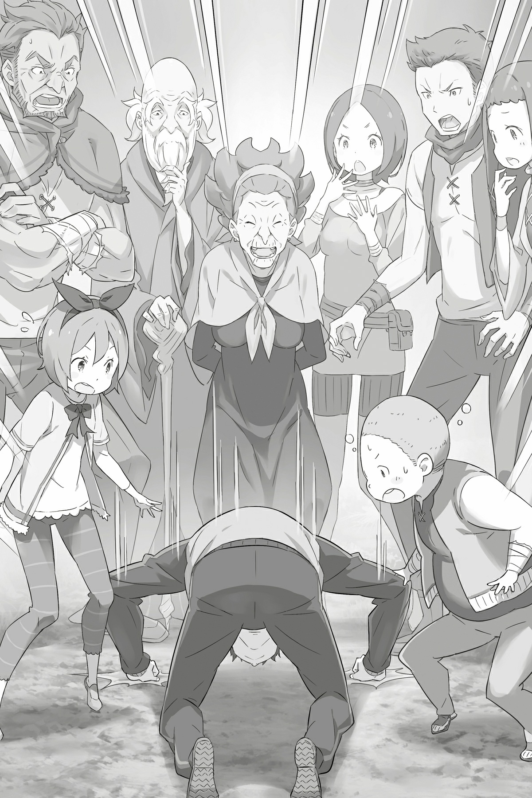

## 1

А теперь перенесемся в тот час, когда отряд, используя магию Накт, совещался на полном ходу.

— В наши ряды затесался шпион, — заключил Субару, поведав отряду все, что знал сам. — Может, пойти на хитрость и дать ему ложную информацию? Тогда мы выиграем время и спокойно вывезем Эмилию и остальных. Как вам идея?

Среди членов отряда, которые при помощи магии вели Мысленный разговор, разгорелась жаркая дискуссия. Субару прислушался к мысленным волнам, затем поднял руку и снова попросил внимания:

— Послушайте! Мы выяснили, что должны стереть с лица земли пальцы. Лишь так мы победим греховного архиепископа. Однако прикончить «пальцы» не настолько легко, как может показаться на первый взгляд. Но у меня есть кое-какая идея…

*«Исходящий от тебя запах? Привлечем с его помощью «пальцы» и зададим им хорошую трепку?»*

— Абсолютно верно! — подтвердил Субару мысль Юлиуса. — Но шпион в любом случае будет сливать информацию о наших перемещениях. Можно, конечно, схватить шпиона, но тогда он не выйдет с «пальцами» на связь, и это вызовет подозрения. Нужен нестандартный подход: позволим ему слить информацию. Ложную информацию!

Субару вспомнил нападение деревню, которое случилось в самом конце прошлого круга. Тогда все «пальцы», что оставались в лесу, устроили массовую атаку. Количество нападавших только подтверждало догадку юноши. Похоже, Петельгейзе вселился в одного из своих «пальцев» — в адепта, скрывавшегося среди торговцев. А именно, в торговца по имени Кэти. Он и сливал данные «пальцам». В отличие от адептов, сопровождавших Петельгейзе, он, вероятно, собирал информацию.

— Мы должны его перехитрить. Если удастся одурачить шпиона, одурачим весь Культ!

*«Так вот почему ты велел Раджану сообщить торговцам, что мы прибудем в поместье позже!»*— догадался Рикардо.

Так же как и в прошлом круге, на перехват торговцам были направлены несколько членов «Железного клыка». Но на этот раз Субару пошел на хитрость. До встречи со шпионом из Культа нужно было решить кучу проблем, поэтому действовать следовало быстро.

Субару посоветовал включить в состав летучего отряда человека-лиса, погибшего в прошлом круге, — юноша надеялся таким образом его спасти.

*«Сам уже всё решил, а теперь как бы советуется! Ты, Субарунчик, тот ещё прохвост!»*

*«Ведешь себя как наша барышня… Смотри, братец, плохо кончишь!»*

— Феррису ещё простительно, но Рикардо… Интересно, как твоя хозяйка отреагировала бы на такие слова?

Хотя Рикардо был у Анастасии в услужении, его комментарий оказался вызывающим.

Внезапно в голове у Субару раздался мысленный хохот — наемник просто шутил. Тем временем операция по запутыванию шпиона началась.

*«Использовать лазутчика неплохая идея. Но как ты узнал о нем?»*

— Благодаря нюху на адептов Культа. Такое объяснение устроит?..

*«Звучит не очень убедительно… Но будем считать, что дело в нюхе, и извлечём из него пользу. Таков мой ответ.»*

Субару не мог дать внятного объяснения, и по ответу Юлиуса было непонятно, что рыцарь чувствует на самом деле. Его Мысленная волна, в отличие от других волн, отчего-то не передавала всей гаммы эмоций. Может, оттого, что Юлиус был источником магии Нект?

Тем не менее Субару не сомневался в искренности намерений рыцаря и не придавал странной неопределенности большого значения.

Тут в мысленную беседу вклинились полукотята из «Железного клыка»

*«Так, ну а что делать с посланием? Пустое письмо может обернуться проблемой!»*

*«Отчего же? Ведь на чистом листочке можно написать что хочешь! По мне, так даже удобней! Ай!»*

*«Сестричка, помолчи, пожалуйста».*

На самом деле беззаботные комментарии Мими раздавались на протяжении всего телепатического совещания, но отряд благодушно их игнорировал.

А вот младший брат Мими, Тиви, наоборот, относился к делу со всей серьезностью. Диалог брата с сестрой привлек внимание Субару, и юноша задумался, как поступить с пустым посланием. Ведь именно это письмо побудило Рам атаковать отряд, из-за чего были потеряны драгоценные минуты.

Субару предстояло вступить в схватку со временем, и он не хотел упустить ни секунды.

*«Так что будем делать?»*

Беспокойная мысль Тиви, окрашенная в серый цвет, ясно давала понять: нужно что-то придумать. Все члены отряда сосредоточенно ждали ответа Субару. Тот ясно ощутил, что находится в центре внимания, и, сложив руки на груди, сказал, как поступить с пустым посланием. А именно…

## 2

Ранним утром, когда мир только начинал пробуждаться, Рам покинула особняк и направилась в деревню Эрлхэм. После неудачных попыток Эмилии уговорить людей эвакуироваться, служанка решила взяться за дело сама.

Шагая по тропинке, Рам вдруг уловила загадочный сигнал. Девушка прислушалась к тихому шелесту леса и, нахмурив красивые брови, на мгновение задумалась.

Рам была демоном потерявшим рог. Вообще, демоны обладали чрезвычайной чувствительностью ко всему необычному, что случается в горах или в лесу. Именно это шестое чувство и сообщило Рам: за трактом происходит неладное.

Поводив носом и убедившись, что поблизости нет никакой опасности, Рам опустилась на одно колено и сосредоточила все внимание в лобной доле мозга. Девушка активировала свою сверхспособность — ясновидение.Загадочное искусство демонов позволяло смотреть глазами других существ. Далеко не все демоны могли им грамотно воспользоваться. В настоящее время Рам, вероятно, была единственным демоном, способным правильно распорядиться этим даром.

Применять ясновидение следовало с особой осторожностью, так как во время его активации демон перестает замечать то, что происходит вокруг. Хозяин, высоко ценивший преданность Рам, имел много врагов. И потому, несмотря на ограничение, в разведке ясновидение было просто незаменимо.

Но Рам отстранилась от этих тревожных размышлений и, сосредоточившись, стала настраиваться на чужое зрение. Объектом её вторжения могло быть любое живое существо, способное видеть. Правда не все существа обладали подходящей длиной волны, поэтому последние несколько дней Рам практически не видела нужный участок леса. Однако на этот раз все было иначе. Где-то далеко за деревней, со стороны тракта, обнаружилось несколько сигналов с нужной длиной волны. Рам настроилась на один из них и стала наблюдать то, что видели глаза источника.

Перед её взором предстал огромный ездовой зверь — лигр. На спине животного восседал тот, чьими глазами смотрела Рам. Невысокий наездник лихорадочно вертел головой, оглядывая окрестности. Он был в смятении. Слишком суетливый объект. ещё немного — и у Рам закружится голова. Служанка быстро переключилась на другой объект — он двигался по соседству с первым — и вновь оценила обстановку. К счастью, новый вел себя спокойно и смотрел на дорогу. Глаза его находились примерно на том же уровне, что у первого, и он тоже ехал на огромном звере.

«Интересно, — подумала Рам, — почему же их поведение так отличается? И сколько их всего?»

Однако вскоре в поле зрения всадника попали другие воины, и Рам смогла оценить их количество: сорок или пятьдесят. Каждый был вооружен. Двигались они по тракту в направлении деревни, до которой оставалось минут десять ходу. Также Рам обратила внимание, что многие мужчины были в латах с гравировкой в виде свирепого льва. Это был герб герцогского дома Карстен — того самого, что объявил войну Эмилии, прислав прошлым вечером пустое письмо. Иными словами, лагерь политического противника действительно затеял военный поход!

— Воспользовались отсутствием господина Розвааля!

Рам тут же сообразила: положение чрезвычайное. Обстоятельства требовали немедленных действий. Если враг намерен навредить лагерю Эмилии, то деревня наверняка будет захвачена. И пока не поздно, нужно это предотвратить. Её долг — сделать все возможное!

Рам со злостью сжала зубы. Но прежде чем она оборвала телепатическую связь и бросилась в деревню…

— А?! — из горла по-прежнему погруженной в сеанс ясновидения девушки вырвался возглас изумления, а лицо исказила жуткая гримаса.

То, что она увидела, не поддавалось никакому объяснению!

— Барусу?!

Во главе отряда, восседая на земляном драконе, ехал черноволосый юноша. В руках у него была табличка, которую он поворачивал во все стороны, чтобы наблюдатель, где бы тот ни находился, смог прочесть крупную надпись: «Письмо послали по ошибке! Это я виноват!»

## 3

Так, держа над головой, словно белый флаг, табличку, Субару с отрядом въехал в деревню. Навстречу им вышла Рам, она была мрачнеё тучи. Юноше стало не по себе. Ежась под убийственным взглядом, он приблизился и стал напротив.

— Xa! хмыкнула Рам. He успели мы получить послание в виде пустого клочка бумаги, а нас уже удостоил визитом вооруженный отряд! Похоже, вы не понимаете, на чьей земле находитесь.

— Но ты не стала нападать на нас. Значит, мы можем спокойно поговорить, да?

— Сообщение на этой табличке, судя по всему, предназначалось мне. Иначе зачем вертеть ею из стороны в сторону? — озадаченно произнесла Рам, глядя на деревянную дощечку под мышкой Субару.

Извинение было написано белой краской крупными буквами ряда «и». Слова казались очень искренними, хоть и были частью хитроумного плана. Уже по ходу марш-броска Субару придумал, как исправить недоразумение с пустым письмом.

— С трудом разобрала твою писанину. Я была готова отходить вас как следует!

— Твоя школа! Должна бы уже привыкнуть к моему почерку!

— К сожалению, такое быстро забывается. Так же быстро, как всякие неблагодарные люди забывают о добре, которое им сделали.

— Уфф!..

Рам, как всегда, была остра на язык. Субару не нашелся что ответить

— Ну? — продолжила служанка, скрестив руки на груди. — Говорят, ты здорово испортил настроение госпоже Эмилии и она бросила тебя в столице. Не стыдно заявляться сюда после такого?

— Ты безжалостна! Ясно дело, возвращаться было стыдно, но я всё равно вернулся! И не один! — Субару указал на шеренги воинов за своей спиной, демонстрируя, что в столице зря времени не терял.

Рам, прищурившись, оглядела отряд:

— Похвально. Однако жители деревни напуганы, ведь никто не знает, с какой целью вы явились. Я тоже обеспокоена, моё хрупкое сердце готово разлететься на осколки!

— В смысле «на осколки»? Оно у тебя изо льда, что ли? Тогда ты и воспринимать должна все спокойно!

— Ещё одна глупость, и я отрежу тебе нос!

— Не виделись несколько дней, а ты… ты сказала «нос»?!

Когда до юноши дошел смысл варварской угрозы, он закрыл лицо ладонями и отступил. Затем Субару перевёл взгляд на деревенских за спиной Рам.

Девушка была права. Заметив незваных гостей, люди вышли из домов и теперь с опаской поглядывали на войско, занимавшее площадь. Но вдруг…

— Эй! Там, впереди всех, не сэр Субару ли?

— Он самый! Беседует с леди Рам. Выходит, вернулся? Да-а! Субару! Он снова с нами!

Заприметив юношу, который возглавлял отряд, люди немного успокоились. По крайней мере, теперь они видели, что отрядом командует знакомый им человек.

— Как бы теперь объяснить, что мы пришли помочь и на нас можно положиться?.. — проговорил Субару.

— Это будет непросто. Ты даже меня ещё не убедил. Не думай, будто я тут же поверила, что письмо, которое вы даже запечатали сургучом, всего лишь ошибка, — парировала Рам

— Все это происки врагов — Субару понизил голос. — Ты ведь наверняка заметила шайку, что прячется в лесу?

Служанка кротко потупилась. Конечно же, адепты, таившиеся в лесу, успели привлечь внимание Рам. Это было очевидно ещё с прошлого круга. Хотя Субару поступал не совсем честно, используя опасения Рам в своих целях.

— Феррис, Вильгельм, подойдите! Рам, тебе ведь знакомы эти джентльмены?

Лекарь и мечник приблизились. Рам оглядела их и, подбоченясь, отрезала с каменным лицом:

— Да.

Верные вассалы дома Карстен отвесили ей поклоны.

— Я прибыл сюда в качестве уполномоченного госпожи Круш, моё имя Вильгельм Триас.

— А я рыцарь госпожи Круш, меня зовут Феррис. Старик Вил — командир этого войска, а я тут… как ягодка на огуречной грядке!

В отличие от Вильгельма, настроенного весьма серьезно, Феррис пребывал в легкомысленном расположении духа. В ответ на полярные по форме приветствия Рам приподняла подол платья и почтительно поклонилась:

— Благодарю вас за обходительность. моё имя Рам, я старшая управляющая в особняке графа Розвааля L. Мейзерса.

Субару был поражен: какую же надо иметь наглость, чтобы представиться старшей управляющей! Но он удержался от комментариев. Рам действительно заведовала всем особняком в отсутствие Рем. Но лучше бы служанка представилась если уж не временным управляющим, то хотя бы заместителем управляющего на недельный срок…

— В общем, присутствие этих двоих и отряда за моей спиной доказывает, что леди Круш готова помочь вам. Розвааль, кстати, сам того хотел. Возражений нет?

— Если это намерение господина Розвааля, я только за. Будем считать, Барусу, ты достиг цели, ради которой остался в столице. Если честно, когда мы получили пустое письмо, я гадала, пришлют ли вслед за ним твою голову…

— Слушай, оставь страшилки при себе! И с чего ты такая кровожадная?!

Жестокие слова Рам напомнили Субару о нравах в период средневековых междоусобиц, когда японские провинции воевали друг с другом.

Служанка проигнорировала его недовольство и обратилась к членам отряда:

— Примите мои глубочайшие соболезнования! Увы, вам пришлось иметь дело с нашим прислужником-стажером…

— Да, мастер Субару бывает порой эксцентричен и эмоционален, но я нахожу его >многообещающим юношей. Я уже далеко не молод, но даже мне было чему у него поучиться.

— Ну, я не настолько сдержан, как старик Вил, поэтому охотно приму твои соболезнования. Правда, должен заметить, Субарунчик слегка изменился в лучшую сторону, р-мяу.

Выслушав Вильгельма и Ферриса, Рам разочарованно вздохнула. От их разговора у Субару по коже забегали мурашки, но он только поскреб щеку, притворившись, что все в порядке. Затем хлопнул в ладоши и вновь подробно объяснил Рам ситуацию:

— В общем, я хочу, чтобы право уничтожить врага ты уступила отряду. А от тебя мне нужна помощь другого рода. Не откажешь?

— Смотря о чем попросишь. Боюсь, поспешно согласившись, я позволю похотливому бесстыднику Барусу вонзить в меня своё ядовитое жало.

— Да я хоть один похотливый взгляд на тебя бросил?! Ни разу же!

— Так уж ни разу? А ты точно мужчина, р-мяу?

С гневом посмотрев на обидчиков, Субару смущенно откашлялся. Пришло время поделиться своим планом и рассказать о нюансах дела.

— Мне нужно, чтобы ты придумала, куда вывезти людей, и сопроводила их до убежища. Я не хочу, чтобы они пострадали, пока мы будем драться в лесу с врагом.

— Понимаю, но вывозить же не на чем.

— Об этом мы уже позаботились: совсем скоро в деревню прибудут созванные со всех окрестностей торговцы на драконьих повозках. Они и вывезут людей.

— Созванные со всех окрестностей? Как вы их уговорили?

— За деньги. Об источнике средств догадайся сама.

«Подстраховка стоила больших денег, и юноша рассчитывал на финансовую помощь Розвааля, хоть никаких распоряжений от самого графа не получал. Рам догадалась, на кого Субару намекает, и тяжко вздохнула:

— Хорошо, замолвлю за тебя словечко. Все-таки дело особой важности.

— Серьезно?! Вот спасибо! А я уж собирался клясться, что отдам долг, когда стану успешным и разбогатею!

— Подобные обещания вправе давать лишь тот, у кого действительно есть шанс на успех и богатство. Впрочем, не думай, что моего согласия достаточно, чтобы считать дело улаженным.

Рам перевела мрачный взгляд — даже более мрачный, чем безнадежное будущее Субару, — куда-то в сторону. Субару даже не пришлось следить за его направлением. И без того было ясно, что служанка хочет сказать.

За спиной Рам находились охваченные тревогой жители деревни. Труднеё всего будет добиться их согласия на эвакуацию. В прошлом круге Субару уже преодолевал этот барьер, но последствия оставили мучительные воспоминания. В душе всплывало чувство, подобное страху. Ведь, преодолевая тот барьер, Субару зацепил лишь верхушку айсберга ненависти и вражды к Эмилии.

Время шло. Драгоценное время, которое Субару выиграл, дезориентировав Культ Ведьмы ложными данными. Но он все никак не мог подобрать правильных слов.

— Может, я попробую, если у Субарунчика нет идей?..

— Феррис! — одернул Вильгельм и бросил на рыцаря такой взгляд, что тому сразу расхотелось исполнять роль посредника.

Затем Дьявольский Мечник повернулся к Субару.

— Мастер Субару должен поговорить с людьми сам. Вы же понимаете? — добавил он, понизив голос.

Субару прикрыл на миг глаза и энергично кивнул. Бросив в сторону Ферриса благодарный взгляд, юноша миновал Рам, вышел в центр площади и оказался лицом к лицу с обеспокоенными сельчанами. Субару чувствовал, как в отряде, что расположился за его спиной, растет напряжение. Главное — начать речь с правильного слова. Но что это за слово, он понятия не имел. Его выступление должно унять тревогу и развеять страх…

— Уважа…

— Сэр Субару, давайте начистоту. Мы сами все понимаем… Не успел юноша начать, причем самым безыскусным образом, как один из деревенских тут же сбил его с толку.

Это был сухонький седовласый старик, откликавшийся на прозвище Староста, хотя никаким старостой на самом деле он не являлся. Как правило, вел он себя словно слабоумный, но сейчас и голос его, и взгляд были абсолютно ясными.

Блеск старческих глаз ошеломил Субару. Меж тем старик, поглаживая бороду, продолжил:

— Не зря же вы привели такое внушительное войско. Леди Рам уже сообщала о странностях, которые творятся в лесу.

— Нет, послушайте…

— Не притворяйтесь! Даже нам все ясно! Взволнованный крик принадлежал одному из деревенских юношей. Именно он в прошлом круге пробудил в сельчанах тревогу и страх. И теперь история повторялась.

— Так значит, в нашем лесу и впрямь…

— Как господин граф допустил такое?! Он должен был догадаться, что это плохо кончится!

— И зачем только господин граф взял под своё крыло эту полуэльфийку-полудемоницу?! — зашумели сельчане.

Именно этого Субару опасался и надеялся избежать. Можно бесконечно умирать и возрождаться, рвать жилы в упорной борьбе, но однажды всё равно упрешься в эту проклятую стену…

Разом избавить людей от застарелых предрассудков, увы, невозможно. Поэтому лучше смириться и пойти на компромисс. Культ Ведьмы уже близко, значит, самое верное решение — отложить на время этот вопрос. Сперва нужно убедить людей в необходимости эвакуации…

Однако заговорил Субару совершенно о другом:

— Я знаю, она упряма, своевольна и самоуверенна, но при этом бесконечно одинока и вечно страдает оттого, что все от неё отворачиваются…

Сельчане уставились на юношу в немом изумлении. Воины отряда отреагировали похожим образом. Но удивление на их лицах тут же сменилось вниманием. Отряд сосредоточился и стал слушать.

— Она из тех, кто помогает другим в ущерб себе. Очень ранима, и решения, которые она принимает, постоянно приносят ей боль. Она добра и отзывчива, но в мелочах щепетильна до крайности… Не может есть перец, потому что слезятся глаза… А какая славная у неё улыбка…

— О ком это он?.. — прервал человек из толпы.

И Субару тихо ответил:

— Об Эмилии, полуэльфийке из особняка!

Сельчане обомлели. А когда юноша улыбнулся, их удивлению не было предела. Субару, казалось, пропустил мимо ушей их разгоряченные слова!

— Я понимаю вашу тревогу. И понимаю недовольство, ведь хозяин поместья, Роз… господин Розвааль, поддерживает полуэльфийку на королевских выборах.

Сельчане молчали.

— Eë зовут Эмилия. И все вы прекрасно её знаете. Эмилия находилась с вами бок о бок не один месяц.

Люди переглянулись. Субару предвидел их реакцию. Сельчане вспомнят, что юноша приходил в деревню не один — с ним была девушка. Она провела в деревне немало времени, но была вынуждена скрывать своё истинное лицо.

— Да, вам неуютно. И я понимаю, хочется скорее избавиться от всего пугающего… Взять то, что подвернется под руку, и выпустить гнев — таков инстинкт. Он позволяет сохранять душевный покой.

Субару не мог в этом упрекать селян. Уж кто-кто, только не он… И всё же на душе скребли кошки. Да, он сам был таким: он так же преодолевал боль, как преодолевали теперь жители деревни.

— Но поймите, переложив на кого-то ответственность за свои тревоги, покоя вы не обретете! Та девушка, Эмилия, может разделить ваши радости! И она хочет этого! Прямо так и сказала! Пожалуйста, подумайте об этом и перестаньте её терзать!

Субару не был уверен, что его голос звучит твердо и без театрального надрыва. Было впору залепить самому себе пощечину: да как он посмел явиться сюда с такими просьбами?! Если кто и ранил Эмилию, если кто и позволил себе лишнее, не щадя её чувств, так это он сам.

Сожаление о содеянном до сих пор грызло его душу. Быть может, потому Субару и был здесь, потому что испытать подобное не желал никому.

— Прошу вас! Пожалуйста… — умолял Субару, склонив голову.

Умолял совсем не о том, ради чего явился, и тратил впустую драгоценное время. Субару вс` говорил об Эмилии, и это лишь доказывало, что недавно он обошелся с ней, как закоренелый негодяй.

Сельчане стояли с растерянным видом, не зная, как реагировать. Слова Субару не укладывались у них в головах. Вдруг послышался топот детских ножек.

— Петра? — удивился Субару, когда из толпы вышла девочка с рыжевато-каштановыми волосами.

Деревенская девочка, с которой дружил Субару, приблизившись, кивнула в ответ, встала рядом и развернулась лицом к сельчанам, словно показывая, что она теперь на сто роне Субару.

А когда Петра заговорила, это стало очевидным:

— Почему вы не верите Субару?!

Её слова звучали предельно искренне и потому проникали в самое сердце.

— Разве не видите, как ему тяжело? Он чуть не плачет! А вы всё равно не хотите помочь!

— Постой…

— Когда я… когда все мы оказались в беде, Субару очень старался, чтобы помочь нам! Вот и сейчас он хочет сделать как лучше! Почему вы не верите ему?

Петра пошла на штурм, вооружившись тем, что было недоступно взрослым, детской невинностью. Глядя печальными глазами на молчаливых сельчан, Петра взяла Субару за руку:

— Леди, живущая в особняке, — это та самая леди, что все время ходит в белом? Та, что принесла нам печать, когда мы делали радиозарядку?

— Да, это она. Та самая леди с печатью. Ей хотелось присоединиться ко всем, но она не посмела попросить об этом. Такая уж она… — с улыбкой ответил Субару, вспомнив безмятежные времена.

Каждый день они с Эмилией ходили в деревню, там Субару проводил для сельчан радиозарядку, а потом развлекал детей, ставя оттиски самодельной картофельной печатью. И Эмилия всегда была неподалеку. Иными словами, она влилась в повседневную жизнь деревни.

По лицам взрослых стало понятно, что они колеблются. А вот у детей сомнений не осталось: из толпы выбились несколько ребятишек и тут же бросились к Субару.

— Я тоже не имею ничего против леди!

— Раз Петра за неё, то и я!

— Я хочу быть героем, как Субару!

— Субару чуть не плачет! Давайте поможем ему!

— Да!

Гул детских голосов полностью изменил обстановку на площади. Под пристальными взорами детей сельчане обеспокоенно переглянулись. Нужен был последний толчок. Видя, что они все ещё сомневаются, Субару неловко шагнул вперёд — пришлось тащить за собой детей, которые повисли у него на руках.

— Понимаю, трудно согласиться сию же минуту. Но я прошу: дайте шанс. Не ставьте на ней крест! Подарите шанс!

— Шанс…

— Да, шанс подружиться с вами и доказать: она совсем не такая, как вы думаете, — запинаясь произнес Субару. Затем высвободил руки из детских ладошек и опустился на колени.

Над площадью пронесся шум. Даже Рам выпучила глаза от удивления. Только ожидавшие позади Вильгельм, Феррис и Остальные члены отряда по-прежнему безмолвно наблюдали за происходящим.

Субару сделал все, что мог, и стыдиться тут было нечего, ведь он поступил правильно.

— Наверное, вы хотите высказаться, но прошу: пожалуйста, дайте ей шанс! И позвольте помочь вам! Времени почти не осталось! Пожалуйста! Только ради этого я и вернулся!..

Сельчане притихли, что неудивительно: Субару, сделавший им столько добра, валялся у них в ногах, уткнувшись лбом в землю, и слезно умолял позволить помочь. Все перевернулось с ног на голову.

— Сэр Субару, вы неисправимы! Ну что с вами делать… — откликнулся вдруг деревенский юноша, ероша свою шевелюру. Тот самый юноша, который ещё недавно был вне себя от беспокойства.

С виноватым видом он приблизился к Субару и протянул руку. Субару в изумлении уставился на неё. Тогда юноша раздраженно схватил его за плечи и заставил подняться. Затем вымолвил:

— Раз уж вы так отчаянно пытаетесь нам помочь… как тут противиться…

И вновь слова деревенского юноши послужили спусковым крючком для сельчан. В толпе заворчали:

— Ненавижу старость… Чем больше мне лет, тем проще довести меня до слез…

— И что нам с ним делать?! Ишь ты, пугать вздумал!

Люди ворчали, но голоса их были мягкими и наполненными теплом. Чувствуя это, Субару разинул от удивления рот. Ко лбу его пристала грязь, на что не преминула обратить внимание Петра:

— Субару, у тебя лицо черное!

По деревенской площади покатился дружный смех. Падать ниц, пожалуй, было слишком. Но Субару не оставил сельчанам выбора: они услышали мольбу и подались. Глядя на людей, смеющихся как в прежние, безоблачные дни, Субару вздохнул:

— Спасибо вам всем!

— Это мы должны сказать тебе спасибо, сэр Субару! — ответил Староста.

И тут на глаза Субару навернулись слёзы.

## 4

На этом трогательном моменте разговор с сельчанами, казалось бы, подошел к концу, но…

— Я ошибаюсь, или ты действительно не затронул главную тему? — осведомилась Рам, когда Субару, утерев слёзы, вернулся к отряду.

— Э-э…

Субару прокрутил в голове диалог с жителями деревни и понял, что Рам не ошибается. Он всё время говорил об Эмилии, совершенно позабыв про эвакуацию.

— Чёрт! О чем я только думал!..

— Только я понадеялась, что ты будешь полезен, но нет… Барусу есть Барусу!

В глазах Рам читалось разочарование. Субару с виноватым видом тут же развернулся, намереваясь закончить миссию, но служанка мотнула головой:

— Я сама сообщу им об эвакуации и компенсации возможного ущерба. А ты, Барусу, возвращайся к своему коварному плану.

— Что, можно? То есть… ты серьезно?

— Это ты, Барусу, у нас не серьезен. Не смог настроиться на правильный лад и поговорить с людьми о насущном вопросе. Конечно, такой ловкости ума от тебя не дождешься.

— Ты права! Сгораю от стыда! Вся надежда на сестрицу! — с этими льстивыми словами Субару отвесил Рам поклон.

Служанка посмотрела на юношу с сомнением и направилась к сельчанам. Всё-таки Рам была необыкновенно проницательна.

«Пожалуй, ей можно довериться», — заключил Субару. Теперь нужно было приступать к следующему этапу…

— Субару, обговорим, что делать дальше. — Не успели мысли юноши направиться в другое русло, как его окликнул Юлиус.

Субару кивнул рыцарю и двинулся к шеренге воинов. Нужно было переходить к следующей фазе операции.

Когда юноша приблизился, Феррис всплеснул руками и засмеялся:

— Субарунчик! Какую славную речь ты толкнул! Я даже прослезился!

— Не вороши прошлое! И не ври! Повторю: не вороши прошлое! Мне стыдно!..

— Нечего тут стыдиться! Ты был самим собой, потому и растопил лед в их сердцах…

— Не вороши прошлое! Немедленно закопай обратно! Давайте лучше обсудим дальнейшие действия.

Накричав на Ферриса — воплощение ехидства — и Юлиуса, в котором ехидство вроде бы отсутствовало, Субару вернулся к главному. План операции они обсудили ещё во время марш-броска.

Поговорив с деревенскими, они должны были дождаться летучего отряда, посланного к торговцам, и начать эвакуацию. Главные задачи: сбить с толку Культ Ведьмы и…

— Заморочить голову госпоже Эмилии и выдворить её с остальными подальше от поместья… Так?

— Ну и формулировочки! Услышит кто, бог знает что подумает и не поверит, что это всё во благо!

— Но твой план и впрямь вызывает вопросы, р-мяу! Не понимаю, зачем вывозить госпожу Эмилию? Кому, как не ей, участвовать в сражении?! Или я не прав?

Феррис и Субару расходились во мнениях лишь в одном: роль Эмилии в предстоящей операции. Субару не хотел втягивать девушку в войну, но Феррис думал иначе.

В прошлом круге именно с подачи Ферриса Эмилия стала участницей последнего боя в деревне. Не без помощи Рам Рыцарь верно определил истинные боевые способности Эмилии. Феррис понял, что кандидатка на трон в состоянии дать отпор даже Петельгейзе…

— И всё равно я не хочу втягивать Эмилию в битву с Культом!

— Да тебя в ступе не утолчешь!.. — Феррис изумленно пожал плечами.

Субару чувствовал, что виноват перед ним, но был непреклонен. И все из-за недоброго предчувствия, затаившегося в душе… Оно возникло в конце прошлого круга, в тот самый момент, когда Субару увидел лицо Эмилии, — она склонилась над поверженным Петельгейзе. Сама не понимая почему, девушка оплакивала смерть безумца…

— Феррис, у мастера Субару имеется свой резон так поступать, — в диалог вмешался Вильгельм, до сих пор молча наблюдавший за беседой. — Как у тебя есть определенные ожидания относительно госпожи Круш, так и у него есть свои желания относительно госпожи Эмилии…

— Старик Вил…

— У каждого из нас своё видение, и это нужно уважать.

В ответ Феррис надулся и неосознанно коснулся кинжала на поясе.

— Мастер Субару хочет, чтобы госпожа Эмилия была здорова и невредима, как ты сам желаешь того же госпоже Круш. Любой мужчина хочет, чтобы дорогая ему женщина находилась в безопасности.

— Вы так прямо об этом говорите, что мне и неловко, и печально одновременно…

Субару поскреб щеку, виновато глядя на своего защитника. Но мечник был прав. Феррис хотя и надулся, однако спор прекратил. Даже окружавшие Субару воины смотрели на него с симпатией.

— В общем, дальше действуем по плану, — сказал Субару. — Сценарий беседы с Эмилией у нас готов. Феррис, Вильгельм, рассчитываю на вас. Надеюсь, вам удастся убедить её.

— Хорошо, — кивнул Вильгельм.

— Ла-адно, — протянул Феррис.

Субару перевёл дух. Если Рам сумеет уговорить сельчан, дело останется за малым.

— Так, Юлиус, — обратился он к рыцарю, — о моей просьбе…

— Насчет меня? Я весь внимание! — раздался новый голос, и все замерли.

Кому принадлежит этот голос, догадался лишь Субару. Юноша машинально поднял глаза и…

— Привет, Пак! Давно не виделись. Как поживаешь? — Субару улыбнулся котику, зависшему в воздухе и размахивающему длинным хвостом.

Внезапное появление духа повергло отряд в крайнеё изумление. Воины напряглись.

Поглядывая на них краем глаза, Пак пригладил свои усы и сообщил:

— Поживаю отлично, сил хоть отбавляй! Запросто раздавлю любых вредных жуков, которые пристанут к моей доченьке!

— Извини моё любопытство, но о каких вредных жуках речь?..

— Не догадываешься?

Маленькие глаза-пуговки плохо сочетались с демонической аурой, которую распространял вокруг себя дух. Угрозу почувствовал и Субару, и все бойцы отряда. Воины схватились за рукояти мечей — естественная реакция рыцарей, ощущающих опасность.

Пака такая настороженность нисколько не смутила. Все ещё источая гнетущую ауру, дух спросил:

— Субару, ничего не хочешь мне рассказать?

— Я нарушил обещание, данное Эмилии, и пренебрег её просьбой — покинул столицу. Нет мне прощения!

Мордочка Пака слегка дернулась. Причиной тому был полученный ответ. Однажды Субару уже разозлил Пака, и теперь история повторялась. В тот раз юноше нечего было возразить. А что он мог сказать? Поступив как последний эгоист и ранив этим Эмилию, Субару позволил ей умереть…

— Твой гнев вполне объясним. Если считаешь, что я заслуживаю наказания, я смиренно приму его. Но… не сейчас.

Нарушил обещание, наплевал на просьбу… Совершив те же самые проступки, Субару вернулся в поместье. Теперь он поклялся, что не допустит самой главной, роковой ошибки — смерти Эмилии. Ради этого он и вернулся, оставив за собой шлейф прегрешений.

— Эмилия находится в опасности! Судьба уготовила ей новые муки, но я помешаю злому року! Благодаря мне печальная доля минует Эмилию! Поможешь?

— Звучит многообещающе, — заметил Пак, понизив голос.

— Ну да. Я известный любитель раздавать обещания, не знал? — Субару хитро подмигнул.

Котик сложил на груди лапки и, тихо вздохнув, сказал:

— С одной стороны, ты изменился, а с другой, все тот же…

— Ну, человеческая натура так быстро не меняется.

— Это верно. Методы у тебя, конечно, сомнительные, однако Эмилия, судя по всему, по-прежнему занимает особое место в твоём сердце, — сказал Пак, и невыносимое напряжение рассеялось.

Гнетущее чувство, сковавшее тело, исчезло, и Субару громко выдохнул. Все остальные последовали его примеру. В частности, Феррис вздохнул преувеличенно шумно, а затем робко поинтересовался:

— Ты… больше не злишься? И убивать не будешь, р-мяу?

— Успокойся. Ты же мой кошачий собрат. Неужели я в твоих глазах настолько страшен? — шутливо парировал Пак и надул щеки.

Но никто не засмеялся, ведь ещё минуту назад этот дух нагнал страха на весь отряд. Как бы то ни было, Пак и впрямь успокоился.

— Да я и не был особо зол. Просто украдкой подслушал разговор с сельчанами.

— Так ты давно здесь тусуешься и знаешь о моей цели?!

— Ага, славный получился разговор. Я даже прослезился.

— Не вороши прошлое! Давай лучше к делу, которое мы затеяли ради Эмилии!

Субару был рад пообщаться с духом, как в былые времена, но щекотливую тему поспешил замять. Юноша обратился к Юлиусу.

— Мог бы и сообщить, что сумел позвать Пака, — сказал он с упреком. — Все испугались до чёртиков!

— Но мы не собирались никого пугать. Господин Великий дух явился одновременно с моими малышками… У меня от сердца отлегло, когда я понял, что малюткам удалось убедить его.

— Да, и у меня… — Субару с облегчением вздохнул. Субару сам поручил Юлиусу привести Пака в деревню. Для этого в особняк были посланы квазидухи, которые втайне от Эмилии передали Паку просьбу. Юноша хотел, чтобы дух уговорил Эмилию эвакуироваться.

— Если в придачу к Рам и сельчанам ты будешь на нашей стороне, Пак…

— Тогда Лия просто не сможет отвертеться, да? Должен признать, ты тщательно подготовился, — усмехнулся Пак.

Но Субару мотнул головой:

— Наш враг Культ Ведьмы. С таким противником, сколько ни готовься, всего не предусмотришь.

— Культ Ведьмы… — повторил Пак, глядя куда-то вдаль.

Дух произнес эти слова с некоторой неприязнью. В прошлом круге Пак люто ненавидел адептов. Казалось, причина кроется в чем-то более серьезном, чем вред, нанесенный Эмилии.

— Итак, ты собираешься обманом вывезти Лию из особняка. Можно подробнее?

— Следи за формулировками, а то я совсем скисну!..

Однако, прежде чем Субару успел осведомиться, что это за причина, Пак уже вернулся в обычное настроение и сменил тему.

Впрочем, раскрыть подробности и впрямь было самое время. Все вопросы потом, первым делом нужно обсудить эвакуацию Эмилии и остальных.

— Ну раз уж ты подслушивал, план тебе известен. Разве только… о секретном оружии не знаешь.

— О секретном оружии? — удивился Пак, и Субару с важным видом раскрыл духу свой козырь.

Козырем оказался белый плащ, припрятанный среди личных вещей. Субару шустро облачился в свой тайный наряд. Прежнему владельцу плащ был великоват, а Субару оказался впору.

— А легкий сладкий аромат в разы увеличит мою мотивацию!

— Не думаю, что секретный эффект заключается именно в этом… Похоже, на твой плащ наложено некое заклятие.

— Можешь не сомневаться, у него есть и другие функции, кроме восполнения дефицита эмилиазы в моем организме!

На самом деле прежним владельцем плаща был не кто иной, как Эмилия. Кстати, Субару сам выдумал «эмилиазу» — фермент, который есть только у Эмилии. Усваивается во время общения с ней, от прикосновений и вдыхания её аромата. При недостатке фермента возникает эмоциональная нестабильность.

Конечно, насчет эмилиазы Субару пошутил, но сам плащ был и впрямь непростой.

— Это ручная работа Розвааля. Как я понял, на плащ наложено заклятие, препятствующее узнаванию. Раньше он принадлежал Эмилии… Не подумай, что я украл!

Вспоминать обстоятельства, при которых он получил плащ, Субару было неприятно. Это случилось в королевском замке, когда Субару поссорился с Эмилией. Она в сердцах кинула в юношу этот плащ. С тех пор с плащом Субару не расставался — тот лежал среди личных вещей. И вот настало время использовать его по назначению.

— Когда-нибудь я устрою тебе допрос на этот счет, — говорил Юлиус. — Так что ты собираешься с ним… А, вот оно как!..

— Тошнит, когда ты воображаешь, будто видишь меня насквозь! Я сам все хотел объяснить…

— Такой уж у меня характер. Кстати, твой нрав я бы тоже не назвал ангельским.

Субару нарочито громко фыркнул, всем своим видом демонстрируя недовольство.

Он снова обратился к Паку:

— В общем, я хочу разыграть перед Эмилией спектакль и надеюсь на твою помощь. А потом, когда все уладится, поможешь мне объясниться с ней? Прикроешь?

— Разыграть спектакль — ещё ладно, но объясняться будешь сам. Это твой личный долг, Субару.

— Ну вот… — обиженно простонал юноша, услышав отказ.

Ожидать помощи от духа не имело смысла. «Налаживай отношения сам» — таков был посыл.

Тогда Субару решил, что попросит Пака о другом:

— Но у меня есть к тебе ещё одна просьба.

— Хм… и какая же?

— Ясное дело какая! В особняке заперлась одна домоседка. Её тоже надо бы выкурить из поместья, — ответил Субару и подмигнул Паку.

## 5

— Вот уж не думала, что когда-нибудь снова увижу твою бестолковую морду! — раздался ехидный голосок хозяйки библиотеки, не успел Субару войти в комнату.

Услышав язвительное приветствие, юноша невольно улыбнулся.

Субару находился в фантастическом пространстве. Трудно было поверить, что в этом мире существует такая большая библиотека! Она была заставлена бесчисленными стеллажами, битком набитыми самыми разными книгами. Запретная библиотека Розвааля, охраняемая Беатрис!

Магией перемещения, которую Беатрис именовала Блуждающей дверью, библиотека соединялась со случайными дверями в особняке. Субару это знал, но кое-что его удивило…

— Неужели возможно соединить библиотеку с деревней?! Не знал, что ты такая крутая волшебница!

— Если это единственное, что ты желаешь обсудить, я зря откликнулась на зов Пакки.

— Я просто хотел привлечь твоё внимание, а уж потом перейти к делу. Нетерпеливая девчонка!

Субару немного удивился, что ему ответили жестче обычного. Девочка в роскошном платье устало вздохнула. Она сидела на деревянной стремянке, недовольно посматривая на юношу. Светлые волосы были завиты в крупные букли.

Беатрис служила хранительницей Запретной библиотеки. Разумеется, жизнь под одной крышей с такой неординарной личностью никого не могла оставить равнодушным. Субару настолько сблизился с Беатрис, что не допускал мысли бросить её в особняке. Так, благодаря Паку, Запретная библиотека и дверь одного из деревенских домов оказались связаны. Вернеё, Пак только попросил Беатрис, а остальное девочка сделала сама, применив магию Блуждающей двери.

«По крайней мере, она согласилась выслушать меня», — облегчённо подумал Субару и продолжил:

— Тебе известно, что происходит снаружи? Слышала что-нибудь об этом?

— Ни от кого я ничего не слышала! И вообще, праздных разговоров с обитателями особняка я не веду. Но в целом понимаю, в чем дело.

— И в чем же? — осторожно поинтересовался Субару.

— В Культе Ведьмы, мнится мне! — произнесла Беатрис с неприкрытым отвращением. — Мне известно, что банда этих мерзких злодеев рыщет в окрестностях особняка. А ещё я знаю, что вы с Пакки замышляете что-то втайне от дурочки.

— Вот как! Раз ты так много знаешь, мне будет гораздо проще.

Неожиданная осведомленность Беатрис удивила Субару, крайне обрадовался возможности сократить рассказ. Очень уж не хотелось объяснять, что поместью угрожает Культ Ведьмы. Ибо Культ был подобен стихийному бедствию и являлся олицетворением зла…

— В общем, ты не ошиблась. И то, что мы действуем в тайне от Эмилии, тоже правда. Рам и Пак уже в курсе, осталась только ты…

— Я никуда не поеду!

— Что?!

Не успел Субару сказать, чтобы Беатрис скорее паковала чемоданы, как услышал резкий отказ. Юноша уставился на неё с открытым ртом, а Беатрис заявила, глядя на Субару непроницаемым взглядом с прищуром:

— Я сказала, что никуда не поеду. Я не собираюсь покидать Запретную библиотеку и уж тем более уезжать из особняка. Запомни это и поспеши очистить помещение!

— Но почему?! Ты же видишь, что творится! Объяснить ещё раз?

— Ничего не надо объяснять. Я остаюсь. И спорить с тобой не собираюсь! — отрезала Беатрис и опустила глаза в книгу, лежавшую на коленях.

Субару эта картина была знакома. Девочка так сосредоточенно водила глазами по странице огромного фолианта, будто и впрямь не собиралась эвакуироваться.

— Думаешь, я сдамся? Вообще-то, наш разговор не окончен!

— Для меня окончен. Если желаешь продолжить, продолжай, но моё мнение останется неизменным. Ты ведь не хочешь тратить время впустую, мнится мне?

— Уф… Но если тебе все известно, помоги нам! Для этого ты должна пойти со мной!

— Не могу. Я обязана охранять Запретную библиотеку от любых непрошеных гостей. Да, от любых! — заявила Беатрис, по-прежнему глядя в книгу.

Субару ощутил, как от неё повеяло демоническим холодком. По спине юноши побежали мурашки. Субару предположил, что испытал воздействие магической энергии, переполнявшей девочку.

Беатрис была сильным магом. Её арсенал не исчерпывался одной лишь Блуждающей Дверью. Вероятно, в девочке таилась огромная сила, способная бросить вызов Культу Ведьмы. Исходившая от Беатрис энергетическая волна лишь подтверждала это.

— Всё равно я заберу тебя отсюда!

— Когда же ты…

— Мне плевать, сильная ты или нет! — взорвался Субару и топнул ногой, хотя магический натиск становился все сильней. — Ты маленькая девчонка, и этого достаточно! Я не брошу тебя в опасности!

Беатрис подняла голову и ошеломленно уставилась на разбушевавшегося гостя. Затем она зажмурилась, точно пытаясь стерпеть боль, и произнесла:

— Я с тобой никуда не пойду. И довольно сбивать меня с толку!

— Я прав, а вот ты ошибаешься. Больше я тебе ничего не скажу.

— Упрямец! Терпеть не могу таких упертых, — тихонько пробурчала Беатрис.

Субару приблизился к ней вплотную и взял за руку. Рука была тонкая и на вид слабая.

«Сколько же на самом деле силы в этих ручонках? — подумалось ему. — Я не оставлю Беатрис одну. Я должен её забрать»

Субару потянул девочку за руку — Беатрис молча соскочила со стремянки.

«Осталось только чуть-чуть пройти через дверь библиотеки! И мы окажемся в деревне.

Эта злюка даже заворчать не успеет!»

— Каким бы важным ни было это место, не стоит отдавать за него жизнь!

Они оказались у самой двери, но Беатрис внезапно замерла.

— Беатрис?

Субару в недоумении обернулся и тут же осёкся: девочка была напугана. Переводя взгляд с двери на Субару и обратно, Беатрис промолвила:

— Нет, нельзя, мнится мне…

— Но почему?

— У меня контракт. Я хранительница Запретной библиотеки. Я не могу уйти…

— Опять контракт!

В очередной раз Субару наткнулся на преграду под названием «контракт». Контрактом были связаны и Эмилия, и Беатрис, что постоянно мешало юноше осуществлять задуманное.

— Хватит, надоело! Есть же форс-мажорные ситуации! Что ты прицепилась к этому контракту?!

— Тебе не понять, как важен контракт, мнится мне! Что он значит для меня, для Пакки… Людишкам, как ты, это недоступно!

— Людишки, людишки… Эй, Беатрис, постой!

Со слезами на глазах Беатрис вырвала руку и направила на Субару другую, левую. Этим жестом она прогоняла надоедливого Субару из комнаты. Если сейчас она собиралась сделать то же самое, то Субару в миг вылетит за дверь. Но…

— Уф!..

Воспользовавшись секундным замешательством, Субару попытался схватить её за руку.

— Попалась!..

— Ax!

Их взгляды встретились: глаза Беатрис были полны страха и напряжения. Но пальцы юноши схватили пустоту, едва коснувшись рукава, и спустя секунду Субару изумлении обнаружил, его ноги оторвались от пола.

— Беа…

— Прощай.

— Не успел Субару произнести имя, как перед глазами все поплыло. Искаженное до неузнаваемости пространство поглотило его телесную оболочку, осталось лишь сознание. Прошло сквозь, казалось бы, исчезнувшую дверь, и по чьей-то жестокой воле внепространственная связь с запретной библиотекой оборвалась.

Субару попытался кричать, но не услышал своего голоса. Вокруг все тонуло в ярком свете и ничего нельзя было разобрать. Ни двери Запретной библиотеки, ни угрюмого лица Беатрис, ничего…

— Ma…

Дверь затворилась и скрыла Субару из виду. Девочка прижала к телу дрожащую руку и пробормотала:

— Мамочка…

Лишь это слово еле слышным и жалостливым голосом.

Слезы уже высохли, но лицо девочки было по-прежнему печально.

— Сколько… сколько мне ещё…

Едва сдерживая слёзы, Беатрис дошла до середины комнаты нетвердой походкой и повалилась на стремянку. Затем протянула руку к ступеньке, на которой лежала толстая книга в чёрном переплете. Беатрис взяла эту книгу и прижала к груди.

— Мама… Мамочка, мамочка!.. — без остановки звала она плачущим голосом, словно потерявшийся в толпе ребенок.

Но книга ничего не отвечала…

## 6

В глазах помутнело, затем последовал удар. Он шлёпнулся на что-то твердое, горло сдавил спазм.

— X-а-а-а…

Субару выдохнул и обнаружил себя распростертым на земле. Взгляд устремился в голубое небо. Вдруг в поле зрения появилась чья-то фигура.

— Я привык удивляться твоим выходкам, но на этот раз ты превзошел сам себя!

— Правда? А меня тошнит, когда ты строишь из себя неизвестно кого! Так что мы стоим друг друга, — огрызнулся Субару в ответ Юлиусу.

Юноша снова находился в деревне Эрлхэм. Похоже, Беатрис выкинула его вон через Блуждающую Дверь.

Субару напружинился и вскочил на ноги. Тряхнув головой, он пробурчал:

— И это я упрямец?! Бестолковая лолька! Что мешает ей поехать с нами?! Чёрт! Придётся силком тащить…

— Мне кажется, не надо…

Перед глазами Субару все ещё стояло искаженное болью лицо Беатрис. Таким оно было за миг до того, как Субару оказался выдворен. Охладить же пыл юноши попытался Пак, неожиданно возникший из-за спины Юлиуса.

Котик-дух оглядел Субару, к одежде которого пристала земля и опавшие листья, и, поглаживая усы, заметил:

— Весь в грязи! Похоже, ты здорово её достал.

— Оставался один шажок, — с досадой проговорил Субару. — Но результат был предсказуем. Если б ты мне помог…

— Исключено. Я не имел права убеждать Бетти. Разве я не говорил, что связан контрактом? — удивился Пак без задней мысли.

— Этот довод я желал бы услышать меньше всего! — ответил Субару с гримасой отвращения.

Из-за контракта Беатрис отказалась покидать библиотеку. Пак не мог её отговорить тоже из-за контракта. И поводом для ссоры Субару с Эмилией послужил контракт… Контракт, контракт, контракт!

— Тебя Беатрис послушалась бы. Разве нет?

— Нет. И я с самого начала, отправляя тебя в запретную библиотеку, об этом заявил. Мне не спасти Бетти. — Пак слегка потупился.

Субару не нашелся что ответить. Он надеялся, что Пак убедит Беатрис оставить библиотеку.

Учитывая их отношения, Субару был уверен, что лучше духа с этим заданием не справится никто. Но Пак отказался и отправил в библиотеку Субару. Как и следовало ожидать, юноша провалил миссию. И тем не менее Пак не изменил своего мнения:

— Если это не вышло у тебя, Субару, не выйдет ни у кого. Таково решение Бетти.

— Никак не возьму в толк, что ты хочешь сказать…

Субару не мог разглядеть, что за чувство теплится в кошачьих глазках-бусинках. В ответ дух всё с тем же загадочным взглядом пожал своими маленькими плечами:

— В конце концов, не так уж это и страшно, что Бетти осталась в запретной библиотеке. Не думаю, что кто-нибудь случайно отворит Блуждающую дверь. К тому же, находясь в особняке, она сможет дать отпор. Даже не сомневайся!

— Получается, моё желание забрать её с собой — каприз чистой воды?!

— Только взрослая, состоявшаяся личность может превратить каприз в четкую цель. А ты, Субару, считаешь себя состоявшейся личностью?

Пак был безжалостен, и на лице Субару вздулись желваки. Не в силах оставаться безучастным, в разговор вмешался Юлиус:

— Господин Великий Дух…

Пак обернул вокруг туловища длинный хвост и сказал:

— Извини, не хотел обидеть. Я вижу, ты готов помочь Лии и Бетти, и я благодарен за это. Честное слово!

— Ваши слова, господин Великий Дух, жестоки, но вы правы. Что же делать?

Субару отвел глаза от Пака и, взглянув на Юлиуса, нахмурился:

— В смысле «что делать»?

— Скоро Раджан с ребятами приведут торговцев в деревню. Если твои предположения верны, среди них будет шпион Культа Ведьмы. Боюсь, времени у нас почти не осталось.

По плану, чтобы спокойно провести эвакуацию, нужно было дезориентировать Культ, вбросив ложную информацию. Когда в деревне появится шпион, права на ошибку уже не будет.

«Как жаль, что с Беатрис так вышло, — досадовался юноша. — Но теперь уже поздно…»

— Дурочка ты, малышка Беа. Если б не стала упрямиться… — посетовал Субару вслух.

— Сожаления оставь на потом. Ты не добился желаемого, боролся, пока позволяло время. Однако оно уже вышло, — напомнил Юлиус.

Субару закусил губу, схватился за голову и топнул ногой. А потом…

— Эх… — издал хриплый вздох и повернулся к Юлиусу и Паку. — Пора действовать! Когда приедут торговцы, начнем эвакуацию людей. Беседу с Эмилией проведем по плану. Пак, вся надежда на тебя!

— Все нормально?

— Не нормально. Совсем не нормально. Но… делать нечего.

Скрипя зубами от досады, Субару вспомнил особняк и девчонку, которая там заперлась. Твердолобую, бестолковую и своевольную девчонку. Девчонку, которая однажды спасла его душу…

— Эмилию и остальных мы вывезем. Но особняк адепты и пальцем не тронут. А когда с ними будет покончено, я потаскаю упрямую лольку за её космы и выскажу всё, что думаю!

Единственное, что Субару мог теперь сделать, — это отомстить Беатрис, когда все будут спасены. Поклявшись про себя, что так и поступит, Субару решительно поднял взгляд на Пака.

— Пак! Эмилия ведь ещё не заметила, что тут творится без малого час?

— Все в порядке, она спит без… ну не то чтобы без задних ног, но довольно крепко. Лия здорово переволновалась, поэтому, чтобы спала крепче, я забрал у неё чуть больше маны, чем обычно. Понимаешь, если бы, узнав, что ты нарушил обещание, я обратил тебя в ледышку, Лия бы очень расстроилась, а допустить такое никак нельзя. Согласен?

— Хватит рассказывать страшилки! — возмутился Субару. Шутит дух или говорит всерьез, было неясно.

Затем Субару повернулся к Юлиусу. Красавец рыцарь увидел, что тот полон решимости, и безукоризненное лицо Юлиуса сделалось строже.

— Господин Вильгельм и Феррис готовы, сельчане тоже. Все ждут твоего приказа. Естественно, я не исключение, — сказал Юлиус и кивнул.

Субару бросил взгляд на площадь. Там уже возились убежденные Рам сельчане. Они готовились к отъезду, а воины отряда помогали. Неподалеку Феррис, Вильгельм и Рам дожидались Субару. Каждому была отведена особая роль. Теперь они вместе с Субару должны направиться в особняк, чтобы обхитрить Эмилию…

— Сказать «это все ради тебя» я не смогу… Как ни крути, смахивает на каприз… пробормотал Субару.

— Я же говорил: если стремишься воплотить каприз в жизнь, это уже не каприз, а цель! — заметил Пак, мягко приземлившись на плечо юноши, и ткнул его лапкой в щеку.

Прикосновение было приятным, и Субару улыбнулся. Ему предстояло пройти тяжелое испытание — обмануть любимую девушку, но Субару смотрел в будущее с оптимизмом.

— Что ж, начнем! Воплотим в жизнь мой коварный замысел! Отправим Эмилию в безопасное

место, а затем радушно встретим Культ Ведьмы!
