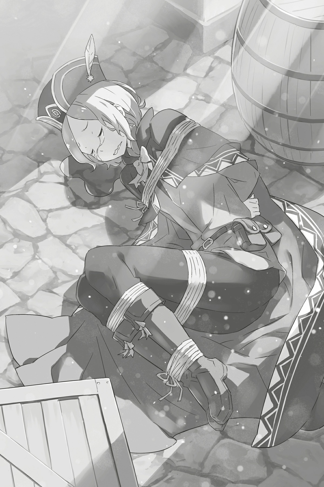

## 1

Да пребудет с вами покровительство духов! — пожелала Эмилия на прощанье отряду и села в драконью повозку.

Для Субару эти напутственные слова были равнозначны великому благословению, которое придавало не меньше сил чем Божественная защита.

Разыграв большое представление, он сумел обмануть Эмилию и отправить её вместе с сельчанами подальше от деревни. «Палец» по имени Кэти, адепт Культа, скрывавшийся среди торговцев, был схвачен. Преимущество, подаренное Посмертным возвращением, удалось использовать на сто процентов.

Провожая взглядом удаляющихся драконов, Субару задержал внимание на рыцарях, что примкнули к колонне, — для защиты драконьего каравана отобрали дюжину бойцов. Хотя вероятность того, что адепты Культа обнаружат колонну, была невелика, юноша решил не рисковать.

Часть людей планировалось вывезти в столицу, а часть в Святилище. О последнем Субару не знал ничего, кроме названия. Рам заверила его, что в Святилище люди будут защищены. В любом случае, отныне сельчане находились в большей безопасности, чем сам Субару и воины, оставшиеся в деревне. Ведь для защиты Эмилии и сельчан лучшие бойцы отряда сразятся в решающей битве с Культом Ведьмы…

— Удачи вам в бою, мастер Субару, — пожелал Вильгельм, сидя верхом на драконе. Мечник находился в самом конце колонны.

— И вам удачи, Вильгельм!

Отпустить Вильгельма означало рискнуть. Решиться на этот шаг было нелегко, особенно после боя с Петельгейзе. Но Субару все же попросил Вильгельма сопровождать эвакуированных, и мечник охотно согласился.

К счастью, Петра и остальные дети убедили Эмилию, что не боятся её. Ребята с радостью согласились ехать с ней, как того и хотел Субару. Когда они потащили девушку за руки в повозку, Эмилия испытала большое облегчение: дети не отвергли её! Вспоминая эту сцену, Субару ощутил, как грудь переполняет тепло, и в то же время — чувство вины.

— Ну… Ох, и негодяй же я! Играю людьми, как марионетками. А мне ещё говорили, что я не понимаю чужих чувств. Брехня все это!..

Субару взъерошил волосы и горько усмехнулся. Он мог бы оправдаться тем, что действовал ради блага Эмилии, но это было нелегко. Юноша воспользовался её спокойствием и собственной решимостью. К тому же отправка детей с Эмилией преследовала особую цель.

— Если правда вскроется, кто-то должен удержать Эмилию на месте…

Добросердечная девушка ни за что не бросит тех, о ком переживает. Потому Субару и отправил её вместе с детьми.

— Она станет презирать меня, если узнает про обман. Лучше бы секрет никогда не обнаружился… — продолжал рассуждать вслух Субару.

Пак был согласен с ним. Дух, ставший сообщником Субару, тоже должен был находиться рядом с Эмилией. Так она была защищена как никогда. По край мере, в это хотелось верить…

— Ну вот, твоя барышня-полудемоница и уехала вместе с деревенскими. Все прошло как по маслу, — резанул по ушам Рикардо, обернувшись к Субару с тесаком за спиной.

— Не смей обзывать мою ненаглядную Эмилию-тан полудемоницей! Ты, полупёс!

— Эй, а это довольно обидно прозвучало! Урок усвоен, — великодушно ответил Рикардо и расхохотался.

Злость тут же отступила, и Субару лишь вяло ухмыльнулся. Но тут же снова стал серьезным.

Поравнявшись с Рикардо, он бросил взгляд в сторону леса.

— Ну, как прошло? Выполнили задание?

— Обнаружили и атаковали, да так внезапно, что шайка даже опомниться не успела! — Рикардо показал заляпанный кровью тесак. — Если б мы оплошали, я бы тут же ушёл на пенсию. Но всё прошло лучше некуда! Карта здорово помогла.

С этими словами Рикардо постучал ладонью по свитку, заткнутому за пояс.

— То есть метки на карте в самом деле означали базы адептов?

— Ребята поплатились за свою скрупулезность в составлении планов! Поздравляю, дружок! — Рикардо осклабился.

Карта, о которой шла речь, изначально принадлежала адепту культа Кэти. На плане подробным образом была изображена территория поместья Мейзерса. Всего на карту нанесли десять меток. Предполагая, что метки — это опорные пункты адептов, Субару отправил к ближайшему из них Рикардо с бойцами. Гипотеза оказалась верной.

Словно в подтверждение слов Рикардо, из леса один за другим верхом на лиграх повыскакивали наемники «Железного клыка». Судя по тому, как резво бойцы закружили по деревенской площади, раненых среди них не было.

— Хух-ха-а! Всех прикончили!

— Сестричка, не болтай чепухи! Что о нас подумают?! Пленные тоже есть.

Забавный диалог брата и сестры всё же звучал зловеще. Субару перевёл дух. Победа победой, но вести о том, что обошлось без потерь, всегда кстати. Как бы высоки ни были шансы на победу, отправлять людей в бой — тревожно. Но на этот раз добытая карта немного снизила тревогу.

— Слушай, дружок, а нам везет!

— В смысле? — не понял Субару.

— Ты выбрал удачную метку! Там оказалась вот эта штуковина.

Рикардо вынул что-то из-за пояса и бросил Субару. Юноша поймал его и чуть не ахнул от удивления: находкой оказалось ручное зеркальце — точь-в-точь как то, что он видел всего несколько минут назад.

— Диалоговое Зеркало… Похоже, именно то зеркало, с которым Кэти устанавливал связь!

— Схваченный адепт передавал через него информацию о наших перемещениях. А ребята, с которыми мы разобрались, принимали её и тут же отправляли дальше… Значит, мы разорвали цепь в самый подходящий момент. Ничья удача не длится вечно!

Рикардо расхохотался, широко разинув пасть.

— Выходит, отряд получил ещё большее преимущество!

Но Субару снова испытал непонятное волнение. Так было и в прошлом круге, когда дела шли слишком хорошо…

— Ты чего это, дружок, нос повесил? Кому-нибудь удалось сбежать с разрушенной базы?

Если мы упустили хоть одного, все полетит к чертям…

— Обижаешь! Забыл, что природа наградила нас отличным нюхом?! Но… разве что… — Рикардо вдруг замялся. — Упустить-то не упустили, но есть кое-какая проблема, не связанная с зеркалом…

Субару сделался мертвенно-бледным и запричитал:

— Так я и знал! И что? Что это за проблема? Мы погибли?.. Все наши планы рухнули?! Чёрт! Ведь знал, что этим кончится! Слишком уж гладко все шло!

— Что ещё за паранойя?! Командиры так себя не ведут! Кончай паниковать! — зарычал Рикардо, пытаясь сообразить, что так напугало Субару.

Затем человекопес зажал голову юноши в ладонях и, стараясь развеять его опасения, вкрадчиво произнес:

— Никакой катастрофы не случилось, понял? Пока мы громили адептов, все шло нормально, но потом… Да что я тебе объясняю, когда ты сам можешь увидеть!.. Эй, приведите сюда того парня! — приказал он подчиненным.

Лицо Субару, зажатое в лапах Рикардо, скривилось. Но, когда он увидел, с кем вернулись наемники, сначала его обуяла тревога, а затем охватили сомнения.

На спине лигра лежал человек: руки, ноги и даже туловище были обвязаны веревками. Заметив Субару и Рикардо, он издал невнятный стон. То ли выражал недовольство жёстким обращением, то ли молил о пощаде…

— Нашли его в глубине логова адептов. Похитили, видать, беднягу… Эй, ты чего? — Рикардо вдруг прервал рассказ и озабоченно посмотрел на Субару.

Тот глядел на связанного по рукам и ногам пленника во все глаза, чего и следовало ожидать. Ибо этим человеком оказался…

— Пфу! — прыснул Субару, не удержавшись. А затем залился смехом, показывая пальцем на мужчину.

— Я уж думал, мы больше не встретимся, Отто!

Невезучий странствующий торговец вновь появился на сцене.

## 2

Нахохотавшись вдоволь, Субару развязал Отто.

— Почему-то благодарить вас совсем не хочется…

— Эй, как ты разговариваешь со своими спасителями?! Не боишься, что о тебе пойдут дурные слухи? — припугнул Субару, прекрасно зная обстоятельства дела.

— Какие вы всё-таки негодяи! Ладно, черт с вами! Большое спасибо! Вы спасли мне жизнь, черт возьми! А то я от страха чуть было не помер! — в отчаянии сказал Отто.

Войско Рикардо обнаружило торговца на базе адептов, глубоко в пещере среди гор. Привязанный к кресту, Отто был едва живой, однако помощь подоспела вовремя.

— Мы связали его из опасения, что это адепт, — пояснил Рикардо.

— Понимаю твою осторожность, но сам посмотри: какой из него адепт? Может, его собирались принести в жертву?

— Отзываться так о малознакомом человеке! Разве я сделал вам что-то плохое?! — обиженно отозвался Отто, растирая затекшие от веревок конечности. Смелое предположение Субару явно задело его.

— Лучше вот что скажи, как тебя угораздило попасть в плен?

— Видите ли, на то есть личные причины, о которых я не желаю распространяться.

— Не хочешь — не говори. К слову, о другом: известно ли тебе, что почти все торговцы из этой округи направляются сейчас к особняку графа Мейзерса, чтобы неплохо подзаработать?

— Вот так другая тема! Мне ли не знать! Ведь я тот болван, что вскочил в седло, едва услыхав про шанс заработать. Надеясь всех опередить, я решил срезать по бездорожью, и волею судьбы меня схватили. Ну, что же вы не хохочете?

Бравада Отто вызвала у Субару жалость:

— Вот оно как… Хорошо, что живой остался. Чёрт, я сейчас расплачусь…

— Грош цена вашим слезам! — яростно огрызнулся торговец. — Приберегите их для другого дурака!

Субару глядел на Отто с теплотой. Привычка действовать безрассудно в погоне за прибылью, по-видимому, была у того в крови. С их прошлой встречи торговец ничуть не изменился, и это радовало.

Обиженный Отто издал откровенно печальный вздох:

— Не могу поверить!.. Я просто хотел поблагодарить своего спасителя, а он…

— Чего? Да, я спас тебе жизнь, но, может, хватит уже? Заладил одно и то же. В конце концов, за тобой должок! — Субару поднял указательный палец.

— Кажется, этот долг настолько велик, что мне, честно говоря, становится дурно! — Лицо Отто исказилось в горестной гримасе: похоже, торговец принял слова Субару чрезвычайно серьезно.

Субару глядел на Отто с улыбкой, в то же время пытаясь обнаружить в его поведении какие-нибудь странности. Рикардо, наблюдавший за их диалогом, тоже был начеку. Отто нашли в логове врага, и одно это было подозрительным. С него нельзя было спускать глаз, ведь в одном из прошлых кругов Кэти был не только изменником, но и близким приятелем Отто!

И если сейчас Субару опрометчиво доверится предателю, все усилия обратятся в прах…

— Как же я ожесточился… — пробормотал Субару.

— Что? — переспросил Отто.

— Говорю, здорово, что ты живой и невредимый! Правда же здорово, Мими?

— М-м? А-а, ты о нем! Он та-ак рыдал, когда мы его спасали! Очень здорово, что он в порядке!

— Ты же обещала, что никто не узнает о моих слезах!

Вот так простодушная Мими раскрыла правду о спасении Отто. Девочка удивленно склонила голову набок, словно говоря: «Разве?» — отчего Отто помрачнел пуще прежнего.

— Подумаешь, рыдал! С кем не бывает… — попытался утешить его Субару. — Не волнуйся, мы никому не скажем. Это будет наш секрет. Твой и мой. Ну… ещё Мими… и Рикардо… и бойцов «Железного клыка»…

— Это уже по секрету всему свету!

— В любом случае, пока что не стоит беспокоиться о том, что Культ Ведьм нападет на деревню, так что сиди и жди указаний. А насчет эпизода с рыданиями — сочувствую. И жаль, что ты не смог подзаработать.

— Хотите сказать, я опоздал?! О нет!

Лицо Отто сделалось таким, словно наступил конец света. Торговец в ужасе обвел взглядом деревню.

— То есть всех жителей уже…

— Тебя вырвали из лап Культа, а значит, ты везунчик! Хотя, будь ты везунчиком, то не попался бы вовсе… Ну что ж, Отто, будь сильным!

— Раз уж взялись утешать, так будьте последовательны! — чуть не плача от горя, промычал тот.

Субару похлопал его по плечу и подмигнул Рикардо. Собакоголовый боец в ответ лишь поморщился. Похоже, бывалый воин считал Отто жалкой пешкой, не представляющей для отряда особой ценности.

«Нет худа без добра» — решил про себя Субару.

— Итак, ты находишься на линии фронта в войне с Культом Ведьмы, — сказал Субару, обращаясь к Отто. — Дел у нас много, но… чем бы тебя занять?.. Может, проверишь по списку оставленный товар?

— А мне заплатите? — Лицо Отто просветлело.

— Не думал, что клюнешь так быстро. Заплачу, заплачу. Кто-нибудь, покажите Отто, что надо делать.

Дав торговцу задание, Субару направился к Юлиусу. Рыцарь закончил построение отряда и, заметив приближение Субару, поинтересовался:

— Встретил друга? Вспоминали старые добрые времена?

Субару скорчил недовольную гримасу и поглядел через плечо на Отто, перебиравшего оставленный торговцами груз.

— Пока мы потешались и болтали о всякой чепухе, я внимательно следил за ним и пытался понять, не замышляет ли он чего. Сам себе удивляюсь: каким подлецом я стал…

— Благодаря твоей, как ты выразился, «подлости» мы обошлись без жертв. Так что можешь ею гордиться. Только не слишком распространяйся об этом качестве.

— Ты сам тот ещё подлец! Могу поручиться.

— Эй, господа подлецы, не уделите мне минутку? — вмешался в разговор Феррис, поглядывая на Субару и Юлиуса с озорной улыбкой.

Субару недовольно скривил губы:

— Чего тебе, подлец с кошачьими ушами?

— Что это ещё за оскорбления, р-мяу? Я тут вкалываю, себя не жалея, а он…

— Ты всегда был нашим спасением, Феррис, — сказал Юлиус. — Ну как, выяснил что-нибудь?

— Угу. Благодаря пленному адепту Культа я кое-что понял о «пальцах», — доложил Феррис уже без улыбки и указал на хижину, где находился Кэти. Видимо, лекарь уже закончил обследование пленника.

В прошлом круге после неудачных попыток предотвратить самоубийства адептов он не находил себе места. Поэтому Субару с волнением ждал, что же покажет обследование Кэти.

— Итак, похоже, в тела адептов вживлены волшебные камни со смертоносным ядом для самоубийства. Но с «пальцами» дело обстоит несколько иначе. Вместо яда я обнаружил взрывное заклятие, оно позволяет прихватить на тот свет окружающих.

— «Палец» убивает себя, — подхватил Субару, — скорее не для того, чтобы предотвратить утечку данных, а чтобы помочь греховному архиепископу переселиться в другое тело. Старое тело, видимо, должно для этого умереть. А вдруг «палец» потеряет сознание или его схватят и свяжут? Вот он и взрывается, чтобы этого не произошло.

— Значит, заклятие для самоубийства… — задумчиво промолвил Юлиус. — А что, если существует способ активировать взрывное заклятие извне?

— Как раз этого я и опасался, потому снял заклятие с нашего пленника, — сказал Феррис, словно для него это было проще простого. — Теперь он абсолютно безопасен.

Судя по тому, как вытаращился Юлиус, снять подобное заклятие было не так уж легко.

Меж тем Феррис продолжил:

— Что касается особенности «пальцев». На неё и Субарунчик обратил внимание. Во вратах «пальца» я обнаружил странный комок, этакий сгусток маны. Вероятно, он и отличает «пальца» от рядового адепта. Полагаю, греховный архиепископ может вселяться лишь в тех учеников, в которых есть такой сгусток.

— Это как разница между премиум-участниками сообщества и обычными участниками, — подметил Субару. — То есть условие для Захвата. И что ты сделал с этим комком?

— Растопил, перемешал, а затем извлек. Так что отныне нашего пленника «пальцем» уже не назвать, р-мяу.

— Выходит, ты полностью его обезвредил? Молодец, Феррис! — Субару схватил руку лекаря и принялся яростно её трясти. Можно было лишь восхищаться мастерством лекаря, сделавшего так много полезного за очень короткое время.

— Р-мяу-мяу! А ты ожидал от меня чего-то другого? Впрочем, тебя, Субарунчик, тоже стоит похвалить, ведь именно ты догадался, что «пальцы» убивают себя не как другие адепты.

— Это все благодаря тебе! Как же ты расстраивался, когда не получалось спасти их…

— Ты о чем? Чтобы я расстраивался из-за таких людей? Ещё чего! — Феррис показал язык и высвободил руку, удерживаемую Субару.

Юноша лишь усмехнулся. Феррис не знал, что сегодня он взял реванш за свои неудачи в прошлом круге, на что Субару и намекнул, правда без каких-либо пояснений. К тому же благодаря самоотверженным усилиям Ферриса догадка Субару практически подтвердилась.

— Значит, благодаря тому, что ты обезвредил заклятие, пленник остался жив, — сказал Субару.

— Его нужно отвезти в столицу и использовать как источник ценных сведений. Бедняга натерпелся, пока я извлекал заклятие, и сейчас находится в отключке, — игриво подмигнул Феррис.

Главное, что пленник остался жив-здоров. Страшно представить, какую боль он испытал, когда Феррис вытягивал заклятие…

— Одного нам удалось взять без происшествий, но больше мы не можем так рисковать. Смекаешь?

— Думаешь, теперь, когда на кону жизни дорогих мне людей, я стану жалеть его дружков?! — решительно бросил Субару в лицо Феррису, дерзнувшему испытать его боеготовность.

Чтобы одолеть греховного архиепископа Лени, они должны были истребить всех адептов Культа, включая «пальцы». Война шла в буквальном смысле на полное уничтожение. И развязал её не кто иной, как Субару Нацуки.

Юноша сжал кулаки.

— Хм, а Субарунчик изменился, теперь он не такой пропащий, р-мяу, — пробормотал Феррис, поглядывая на юношу с прищуром.

В ответ Субару усмехнулся и философски пожал плечами:

— Не такой пропащий, говоришь… Не очень похоже на похвалу.

— А я тебя и не хвалю, р-мяу! Ты был дурным, а стал нормальным. Так что не зазнавайся.

Феррис мило улыбался, но его слова задели Субару. Из всех, кого юноша повстречал в столице, именно Феррис был самым строгим судьей. Разумеется, потому, что видел в Субару товарища по несчастью: им обоим не хватало сил, чтобы участвовать в сражениях.

Как правило, строже всего люди судят тех, в ком замечают похожие слабости. Феррис оценивал недостатки Субару строго и справедливо, но терпеть их не мог.

— Я тебя на дух не переваривал, но теперь ты нормальный. Понял?

— Что ж тут непонятного? Нормальный так нормальный. Лучше, чем дурной.

— Не переваривал, потому что ты заставлял людей идти против собственных принципов и желаний. Но настало время отбросить сомнения, Субарунчик. Твоя решимость должна быть непоколебимой! — уверенно заявил Феррис, пропустив мимо ушей легкомысленный ответ Субару.

Юноша слегка расслабился, и слова рыцаря вонзились в него острой иглой. Феррис не шутил. Но для Субару сейчас это было само собой разумеющимся: чтобы идти вперёд, нужно отчетливо представлять цель путешествия.

— Субару, все в полной готовности. Можем выступать хоть сейчас, — сообщил Юлиус, надеясь таким образом поторопить его.

И Юлиус, и выстроившийся в шеренги отряд ждали только приказа Субару. Перед схваткой боевой дух воинов возрос настолько, что юноша ощущал его кожей.

Совсем скоро на деревенской площади развернется кровавая битва…

Субару взглянул на небо. Успокоиться полностью было невозможно. Но всё-таки Эмилию он вывез, и теперь она под надежной защитой Вильгельма. Благодаря Феррису они многое узнали о «пальцах», а Юлиус ждёт его приказаний.

Субару сделал все, что было в его силах, и теперь оставалось только уповать на небеса.

— Ну что, ребята, вперёд! Действуем по плану, — решительно заявил Субару, оторвав взгляд от неба и посмотрев на бойцов.

Не говоря ни слова, воины оседлали своих зверей.

— О, молодец, Патраш! — Иссиня-чёрная дракониха уже стояла подле хозяина, ожидая приказа.

Субару погладил Патраш по шершавой шкуре и взобрался ей на спину. Звери Юлиуса и Рикардо поравнялись с Патраш. На земле остался стоять один лишь Феррис. Рыцарь-лекарь смотрел на Субару суровым взглядом. Тот кивнул ему, встал во главе отряда и объявил:

— Пора положить конец бесчинствам! Покажем Лени и госпоже Судьбе, кто здесь главный!

## 3

Касательно Захвата Петельгейзе Субару сделал несколько выводов.

Первый: Захват — это способность вселяться в чужие тела. Второй: объектами для переселения служат особо приближенные адепты, то есть «пальцы». Чтобы победить архиепископа, следует уничтожить все «пальцы». Третий: в случае потери всех «пальцев» Петельгейзе вселяется в кого-нибудь ещё. И самая подходящая для этого кандидатура — Субару.

Дух Петельгейзе, паразитирующий на чужих телах, очень силен. Бороться с ним своими силами практически невозможно. С наскока точно не справиться. Вдобавок у этого чудовища ещё и Незримые Длани имеются. С таким врагом шутки плохи…

Теперь Субару понял: если не знаешь об этих двух Полномочиях архиепископа, убивай его хоть сто раз, всё равно проиграешь.

Но теперь, после многочисленных смертей, возрождений и поисков истины, Субару наконец-то нащупал путь к победе. Неудивительно, что Культ Ведьмы держал весь мир в страхе целых четыреста лет. Ведь безумец по имени Петельгейзе Романе-Конти неуязвим, если не знать его секретов…

— Потому я сюда и пришел!

Для человека, познавшего секреты Петельгейзе, архиепископ переставал быть неуязвимым. И теперь главным врагом Петельгейзе Романе-Конти стал не кто иной, как Субару Нацуки, переживший несколько Посмертных возвращений.

Уже в который раз Субару пробирался сквозь густые заросли в направлении скалы. Со всех сторон его окружала густая зелень, напрочь лишающая чувства ориентации в пространстве. Но на этот раз Субару был тверд. Он полагался на интуицию, собственные ноги, которые вели его вперёд, и приобретенный опыт.

— Начинаем! — пробормотал он и ухмыльнулся тому, как быстро заколотилось сердце.

Субару пару раз легонько стукнул себя по груди и всмотрелся в очертания за деревьями. Ещё ни разу он не направлялся сюда с твердым намерением сражаться. В прошлом круге он исполнял роль приманки, благодаря которой отряд выиграл время. А до того пробирался сквозь чащу, не помня себя от жажды крови и страстного желания умереть…

Но на этот раз все было иначе. Субару явился, чтобы драться. Чтобы собственноручно поставить точку в войне, которая длилась не один круг…

Лес расступился.

— Как славно, что ты явился, ученик милости! — вдруг раздался дрожащий от радости голос.

Взору открылся уходящий ввысь отвесный утес, а перед ним — тощий человек, распростерший руки. При виде Субару его глаза радостно заблестели.

Кажется, это было уже четвертое их свидание. Однако того ощущения, какое бывает при встрече со старым знакомым, у юноши не возникло. Оно могло появиться при виде кого угодно, но только не Петельгейзе…

— Я — греховный архиепископ Лени… — привычно начал безумец, протянув кровоточащую руку к Субару, и вдруг выгнулся назад, высунул язык и выпучил глаза. — Петельгейзе Романе-Конти! — проверещал он, шурша черной рясой и хлопая в ладоши, и довольно загоготал, топая ногами и пританцовывая. — Чудесный день, замечательный день! Не думал, не гадал, что сегодня, в день испытания, повстречаю нового баловня любви! моё сердце едва не выскакивает из груди от чувств и возбуждения! — воскликнул безумец, брызгая слюной и обхватывая своё костлявое тело руками.

Сцена вызывала у Субару отвращение, но он уже привык не показывать виду. У него имелся план, который требовалось выполнить, не мешкая.

— Рад видеть вас, господин греховный архиепископ! — с этими словами Субару подбежал к Петельгейзе и, прижав левую руку к груди, в правой совершил приветственный жест, кланяясь головой.

— Мне так неловко, что наша встреча состоялась за считанные минуты до испытания! Но я примчался сюда с нижайшей просьбой. Господин архиепископ, молю, включите меня в ряды «пальцев»! Пускай на самую мелкую должность!

Речь была произнесена с предельным, хотя и напускным, почтением. Субару умолк и стал ждать реакции безумца. Однако Петельгейзе не сразу ответил. Он погрузился в молчание. Тишина становилась невыносимой. Субару нервно сглотнул и напрягся, готовый к любому повороту событий.

Безмолвие длилось секунд десять, а затем Петельгейзе внезапно провозгласил:

— О-о! О-о-о! Какая чистая, какая пылкая вера! — затрясся Петельгейзе от избытка чувств, и на глаза навернулись слёзы. Он распростер руки и вперился в небо: — С каким чистым, незамутненным взглядом этот верующий говорит о любви! Никогда ещё мою лень не настигало такое проклятие! Прости, прости мою лень! Прости, что я не замечал такого благочестивого баловня любви! Прости моё неразумие!

Петельгейзе вдруг повалился на четвереньки и принялся яростно стучать головой о твердую землю. Изо лба безумца заструилась кровь, но заниматься членовредительством для него было не в новинку.

Теперь, когда Субару знал, что Петельгейзе использует чужое тело, поведение сумасшедшего вызывало ещё большее отвращение, чем прежде. Но он забеспокоился: что, если самоистязание зайдет слишком далеко? Не хотелось бы по неосторожности снова оказаться прибежищем для его духа. Тогда все зря…

— Господин архиепископ, пожалуйста, прекратите! Культ Ведьмы не одобрит такое поведение! — в попытке остановить Петельгейзе, бьющегося головой о землю, Субару говорил все, что в голову взбредет.

Это возымело успех. Петельгейзе вдруг замер и вытаращил на Субару бельма. Глядя безумцу в глаза, Субару энергично закивал, впрочем, не вкладывая в это особого смысла.

Внезапно Петельгейзе отпустило, словно вселившийся в него бес покинул тело, и по лицу архиепископа потекли ручьи слез.

— Ты прав, все так и есть, — произнес он на удивление спокойно, а затем обнял Субару и крепко прижал к себе.

Того чуть не вырвало, но безумец был безразличен к его эмоциям. Слезы продолжали катиться по щекам архиепископа, из истерзанного лба сочилась кровь. Внезапно Петельгейзе закатился леденящим душу хохотом.

— А-а! Как же я ошибался! Как же я был неправ! Да! Испытание! От меня сейчас требуется не самоистязание, не самобичевание, не самоумерщвление, а испытание! Что за лень — позабыть об испытании, пребывая в экстазе самокалечения! Твои слова открыли мне глаза! Благодарю! Благодарю-ю-ю!

Схватив Субару в охапку, Петельгейзе мотал им из стороны в сторону, продолжая осыпать благодарностями. Затем безумец поднял глаза к небу, вытер кровь со лба и, хотя только что признал членовредительство глупым, принялся по очереди разгрызать собственные пальцы, начиная с большого.

— Когда я ленив, грош мне цена! В мире почитают прилежность, лень же считается отвратительнейшим из пороков! Раз так, я стану прилежным, я скажу «прощай» своей лени, которая стала моей кармой! А-а! А-а! Я воздам за любовь!

Слова Петельгейзе совершенно не вязались с его действиями. Логика не то что была нарушена, а отсутствовала напрочь. Ругая себя за членовредительство, он грыз собственные пальцы, устыдившись своих безрассудных поступков, он тут же взрывался гоготом.

Чувствуя, что ещё немного — и его точно стошнит, Субару сунул руку в карман.

Рано. Требовалось потянуть время.

Юноша сделал глубокий вдох, стараясь не показывать волнения.

— Господин архиепископ, расскажите мне об испытании, — попросил он Петельгейзе, чтобы нарушить пугающее молчание.

В прошлом круге Субару не сумел как следует расспросить Петельгейзе об испытании, и потому юноша до сих пор толком не понимал, о чём речь. Судя по названию, Культу Ведьмы нужно было что-то проверить. Адепты, следуя своему учению, задумали устроить Эмилии некий экзамен.

Но что же? И каким образом Эмилия связана с Культом Ведьмы?..

— Теперь, когда мы встретились, господин архиепископ, мне бы очень хотелось услышать, в чем заключается испытание.

— Испытание… — проронил Петельгейзе.

Внезапно он изменился в лице. Следы безумия бесследно исчезли, и теперь архиепископ пялился на Субару совершенно пустыми глазами. Петельгейзе поднес к губам окровавленную руку и сунул в рот ещё не изувеченные безымянный палец и мизинец. Послышался хруст костей. А затем безумец пронзительно завопил:

— Испытание! Да! Испытание! Мы должны провести его, мы должны проверить! Получится ли из полудемона сосуд! Годится ли он, чтобы призвать Ведьму! Мы должны проверить!

Субару обдало зловонным дыханием. Он скорчил гримасу. Любоваться мерзкой физиономией было уже невозможно, но он взял себя в руки.

— Сосуд… чтобы вместить Ведьму?

— Испытание покажет! Годится ли сосуд для Ведьмы! Способен ли вместить любовь Ведьмы! — провозгласил помешанный, воздев руки к небу.

Тут Субару осенило, и он вздрогнул от ужаса. Сосуд, Ведьма, призвать… Если безумец использовал эти слова в прямом смысле…

— То есть, если полудемон подойдет на роль сосуда, вы призовете в его тело Ведьму?..

— В конце концов настанет судьбоносный день, и ведьма возродится в этом мире! Мы с «пальцами» сделаем все, чтобы узреть сие событие своими глазами! Это и есть… моя любовь!

Петельгейзе обливался слезами счастья. Ликование безумца вызвало у Субару крайнеё отвращение.

Ужасные зверства, жестокие убийства — все то, что причиняло Субару невыразимую душевную боль, совершалось, потому что…

— Эмилия сама по себе ничего для вас не значит!..

Адепты видели в девушке не более чем ящик, в который собирались засунуть душу Ведьмы. Их совершенно не интересовало, что у этого сосуда большое и доброе сердце, а помыслы благородны и чисты. Для адептов не существовало помех на пути к великой цели. Таким отношением они оскорбляли достоинство Эмилии и унижали честь Субару Нацуки.

— Уроды! — вырвалось у Субару, но Петельгейзе не расслышал.

Чтобы достичь своей чудовищной цели, адепты были готовы стереть с лица земли целую деревню! И плевать они хотели на мечты, надежды и планы погибших людей. Именно поэтому Петельгейзе и весь Культ Ведьмы были для Субару проклятыми врагами.

— Благодарю вас, господин архиепископ, что поделились со мной. Идеи Культа Ведьмы и ваши решительные устремления превзошли мои ожидания! Они заслуживают наивысших похвал! Мы непременно проведем испытание!

— О-о! Ты мне нравишься! О да! Совсем скоро мы объединимся в беззаветном желании воплотить мечту в реальность! А-а, Сателла! Со дня обретения милости я, грязь у твоих ног, только и делаю, что воздаю за любовь! Я твой раб!

Притворное одобрение Субару не вызвало у Петельгейзе и малейших подозрений. Напротив, архиепископ принял его с огромным воодушевлением.

— Ты воистину идеальный ученик, ты заслуживаешь уважения! Ах, этот аромат милости! Достаточно одного твоего слова, и я немедленно поделюсь с тобой генами…

— Тогда сделайте меня своим пальцем прямо сейчас!

— Твоё желание доставляет мне необыкновенную радость! Только вот… — Петельгейзе пересчитал пальцы на своих окровавленных руках. — Моих «пальцев» уже десять — полный набор. Но у меня есть для тебя кое-что получше… Да!

Будто вспомнив о чем-то, он полез под рясу и достал книгу в черном переплете — Евангелие. Ласково погладив обложку, он принялся, задыхаясь, рыскать глазами по страницам.

— Написанное в Евангелии… все эти слова о любви ведут меня в будущее! Здесь есть всё… всё то, что указывает мне путь!

Петельгейзе захохотал с пеной у рта, продолжая перелистывать страницы.

Однажды Субару завладел Евангелием, но не сумел прочесть там ни строчки. А вот Петельгейзе, хозяин книги, ориентировался в ней без проблем. Более того, он действовал согласно тексту.

Выходит, истинным врагом являлся автор Евангелия…

— Покажи мне своё Евангелие, — вдруг вымолвил Петельгейзе, громко захлопнув книгу.

Безумец наклонил голову под прямым углом, скривив шею в ту же сторону, и уставился на Субару пустыми, ничего не выражающими глазами.

Этой фразы юноша опасался больше всего. Судя по прошлым кругам, именно этот вопрос сводил на нет налаженный с великим трудом контакт. У каждого члена Культа Ведьмы имелось Евангелие. Субару понятия не имел, где его достать, но именно эта чёрная книжка служила свидетельством статуса. Потому Петельгейзе и требовал у Субару доказательств. И всякий раз ответ на это требование решал судьбу встречи…

Субару хранил молчание.

— В чем дело? — осведомился Петельгейзе, а затем, не меняя позы, высунул длинный язык.

Он всего лишь хотел увидеть Евангелие. Не получив доказательств, Петельгейзе занервничал.

Субару почувствовал, как по спине пробежал холодок. Он медленно запустил руку в карман, извлек некий предмет и сунул его безумцу под нос.

— Что… это?

— Это мития, как вы сами можете убедиться, господин архиепископ.

Замерев, Петельгейзе таращился на Диалоговое Зеркало. Безумец определенно знал этот предмет. Архиепископ снабдил им одного из своих «пальцев». Петельгейзе был в замешательстве: он не понимал, как зеркальце попало в руки Субару. Однако это был не единственный повод для изумления. На глазах у архиепископа зеркальная поверхность занялась бледным светом, а затем…

— Появилось, появилось! Ого! Да он страшнее, чем я думал! — послышался мелодичный, совершенно не соответствующий обстановке голос.

Субару не видел поверхности зеркала, но Петельгейзе наверняка лицезрел хозяина голоса — рыцаря с кошачьими ушами.

Это было похоже на розыгрыш… Но на самом деле зеркало являлось сигналом.

— Что ты… Нет, что вы вообще… — взорвался сбитый с толку Петельгейзе, но внезапно зазвучавший из зеркала голос Ферриса перебил его:

— Итак… Кхм! Тора-тора-тора![^1]

Безумец ошалело глядел в стекляшку.

— Наша неожиданная атака удалась! — пояснил Субару, а затем, показывая пальцем на зеркало, которое держал в другой руке, улыбнулся Петельгейзе в лицо. Не той деланой улыбкой, а настоящей, шаловливой улыбкой Субару Нацуки.

— А-а?.. — Петельгейзе затрясло.

— Судя по роже, ты ни черта не понимаешь. Ничего, не переживай, — сказал Субару, скалясь во весь рот, и поднял руку над головой. Затем добавил: — Я тоже ни черта не понял из твоего монолога!

— Что?!

Сделав смелое заявление, Субару громко щелкнул пальцами поднятой руки. Петельгейзе отреагировал на враждебный выпад немедленно — принял защитную позу. Но было поздно. Сбоку на архиепископа уже неслась сокрушительная тень. Безо всяких колебаний тень на полном ходу врезалась в тощую фигуру безумца.

— Гха-а-а!..

С диким криком архиепископ полетел кубарем по каменистой земле. Наблюдая за его полетом, иссиня-чёрная дракониха издала довольный рёв, словно ставя точку в бесполезной беседе.

Рев драконихи эхом разнесся по лесу.

## 4

От Диалогового зеркала, которое Субару снова засунул во внутренний карман, исходило тепло. Юноша перешел ко второму этапу плана.

Настроившись на продолжение, Субару повернулся к ошарашенному безумцу и показал ему средний палец.

— Что касается того, о чем мы недавно говорили, я отвечаю «нет».

— Но… но… поче…

— Раз не понимаешь, я объясню. Итак, я изучил вашу компанию самым тщательным образом. Боюсь, ваша корпоративная культура мне не подходит. Прошу извинить, что исхожу из личных потребностей, но вынужден отказаться от лестного предложения. Желаю всяческих успехов и процветания. Так ясней?

Несмотря на вежливый и обстоятельный ответ, архиепископ мало что понял. Между тем Субару лихо запрыгнул на спину стоявшей тут же Патраш, взялся за поводья и поглядел сверху вниз на безумца.

Петельгейзе таращил ошалелые бельма, а когда до него наконец дошло, взорвался:

— Ты хоть понимаешь, что натворил?! Я — греховный архиепископ! Я пользуюсь благоволением Ведьмы! Той же милостью она одарила и тебя…

— Извини, но меня уже воротит от этой чепухи. Пошел ты вместе со своей Ведьмой, Петельгейзе!

— Почему?! Но почему?! Почему ты отвергаешь любовь?! Любовь Ведьмы! Отвергаешь благоволение! Я не могу взять в толк! Решительно, совершенно, абсолютно не могу!.. — сокрушался Петельгейзе, рвал на себе волосы и брызгал от гнева слюной.

Неужели его отчаянные призывы имели целью образумить Субару? Если так, то в этом не было ни грамма смысла.

— Знаешь, мне тебя даже жалко. Но одно могу сказать точно…

Субару проигнорировал бредовые крики безумца. Он вспомнил о хаосе, который творился в его собственной душе, когда казалось, что все вокруг неправы. Когда он вел себя словно капризное дитя: терял терпение и поднимал крик по любому поводу.

— И впрямь невыносимое зрелище! Наглядный пример того, каким быть не надо.

— На сей раз безумец — ты. А я прав. Так что кончай, Петельгейзе, хватит!

Говорить «прощай» было бы нелепо. Между Субару и Петельгейзе с самого начала не существовало никакой связи. Перед безумцем разыграли спектакль. И когда тот все осознал, решил действовать беспощадно…

— Ты заплатишь! Заплатишь! Я вырву тебе руки и ноги! Отдам твою душу Ведьме!

В следующий миг тень Петельгейзе вспучилась, словно в ней прогремел взрыв, и превратилась в огромный черный сгусток, распавшийся на множество рук. Плотная туча дланей, подобно водопаду, устремилась к Субару, чтобы исполнить приказ Петельгейзе: вырвать конечности, открутить голову и надругаться над душой. Но…

— Как?!

Субару неловким движением потянул за поводья, но Патраш и этого оказалось достаточно. Смышленая дракониха мигом сообразила, в какую сторону двигаться, и увернулась от рук. При виде блестящего маневра у Петельгейзе отвисла челюсть.

— Я здесь! Поймай меня, если сможешь! Именно такой трюк я проделал со зверодемонами пару месяцев назад!

Безумец вытаращил глаза, а затем, разинув рот так, что едва не вывихнул челюсть, заорал:

— Что?! Ты увернулся?! От моей милости?! Нет! Не может быть! Почему ты видишь моё Полномочие?!

— Спроси Ведьму, которая наградила меня своим запахом. Ты же, в отличие от меня, можешь назначить ей свидание? Или тебе никто не давал на это разрешения?

— Как ты смеешь так фамильярничать, говоря о Ведьме, Сателле?! Какое неуважение!

— Да мы с ней сердечные друзья! Буквально. Она ж меня прямо за сердце хватала, — усмехнулся Субару и подмигнул, надеясь разозлить Петельгейзе ещё сильнее.

Терпение безумца лопнуло. Покрывшись красными пятнами, Петельгейзе стал грызть пальцы, целиком засунув их в рот. По округе разнесся глухой хруст ногтей и костей. В ответ на новую вспышку ярости извивавшиеся вокруг безумца тени уплотнились. Теперь незримых дланей было слишком много даже для Субару, который мог их видеть.

Однако больше, чем кто-либо, новых дланей испугался сам Петельгейзе.

— Гены, что я передал своим «пальцам», вернулись?!.. Почему?! Что с моими пальцами?!

— Ну, господин архиепископ, шевели мозгами! Какой же ты ленивый! Когда ведьминские гены, которыми ты поделился с «пальцами», возвращаются, число дланей возрастает. Смекаешь?

Петельгейзе охватили смятение и ярость, Субару же продолжал его поддразнивать. В искусстве игры на нервах Субару Нацуки не было равных. А при том, что Петельгейзе обладал нулевой сопротивляемостью к издевкам, он полностью находился в руках Субару.

Замысел удался: побагровев от бешенства, Петельгейзе нацелил смертоносные длани на противника. В неистовой ярости он запустил их в Субару, желая раздавить обидчика в лепешку.

— Патраш!

Дракониха угадывала мысли Субару каким-то чутьём и уворачивалась от падавших, словно бомбы, Незримых дланей с невероятной точностью. Надежнее соратника не сыскать! У Субару даже мелькнула мысль, что ему никогда за это не расплатиться.

Так, выдержав натиск первой атаки, Субару решился:

— Третий этап плана! Поехали!

— Ещё не наигрался?! Ничто не устоит перед моей прилежностью!.. О!

Петельгейзе приготовился уже нанести очередной удар, но то, что сделал Субару, повергло его в шок.

— Спиной повернулся?! Сколько можно надо мной издеваться?!

— Извини, но у тебя из пасти так воняет, что сил нет! Аж глаза режет! — С этими словами Субару приказал Патраш бежать в чащу, подальше от утёса.

Дракониха с гулким топотом помчалась во всю прыть, унося Субару все дальше и дальше.

— Сбежать?! От меня?! Даже не думай! — завопил Петельгейзе, однако не сделал ни шага.

Вместо того чтобы броситься в погоню, он присел на корточки и обнял руками колени. В следующую секунду одна из дланей схватила архиепископа и подкинула, словно мячик Петельгейзе воспарил над верхушками деревьев. Там его подцепила другая длань и метнула к следующей. Так, путешествуя от длани к длани, архиепископ стал нагонять беглецов. Но в погоне, напоминающей ночной кошмар, участвовал не только безумец.

— Давайте, давайте, выходите! Схватите порочного мерзавца, насмехающегося над досточтимой Ведьмой. Мерзавца, поправшего испытание и милость! Схватите, порвите на части и бросьте к ногам Ведьмы!

Повинуясь приказу Петельгейзе, из пещеры у подножия утёса показались адепты Культа. Хотя в разговоре Субару и архиепископа они не участвовали, кто именно их враг, адепты прекрасно знали.

Скользящей поступью они бросились за Субару и Патраш.

В вышине, над лесом, летел Петельгейзе, а по земле неумолимо приближались адепты Культа…

— Они близко, близко, близко, близко, близко!.. Патраш, давай!

Дракониха неслась сквозь чащу, двигаясь зигзагами между деревьями, ступая по корням, перепрыгивая через рытвины и ломая ветви, по кратчайшему пути до места назначения.

— Не выйдет! Зря стараетесь! Догоним! Твои потуги бесполезны, прилежный дракон! Они меркнут в сравнении с моим прилежанием! — сыпались безумные крики, и низвергались каскадами свирепые длани.

Целясь в несущуюся как ветер Патраш, они падали бомбами. Сметали одно за другим огромные деревья, взрывали землю, поднимали клубы пыли.

Но беглецы прорывались сквозь взрывы и завесы пыли, невзирая на льющуюся с неба ненависть, и продолжали свой сумасшедший путь.

Патраш задело, она издала громогласный рёв, но не сбавила хода. Дракониха понимала Субару по малейшим движениям его неумелых рук и мастерски уклонялась от атак.

— Патраш, я твой вечный должник! Ты лучшая! — лил Субару похвалу драконихе, но голос юноши был заглушен хохотом Петельгейзе.

— И всё же, всё же, всё же, всё же, всё-ё-ё-ё же! Всё! Довольно!

Безумец указал пальцем куда-то вниз, и стало ясно: теперь он полагается не на длани, а на отряд чёрных балахонов, приближающийся сзади!

Сжимая в руках крестообразные кинжалы, адепты нагоняли дракона с нечеловеческой скоростью. Выглядели они куда опаснее, чем Петельгейзе с его однообразными атаками. Смертоносные клинки уже были готовы вонзиться в шкуру дракона, но тут…

— Ва-а-а!

— Ха-а-а!

Раздались пронзительные крики, и лес сотрясла ударная волна. Деревья и огромные валуны, оказавшиеся на линии «ревущей волны», вздрогнули. Волна с гулом прошила воздух и ударила по толпе адептов. Зафонтанировала кровь, и ряд чёрных балахонов был разбит вдребезги.

Во всем мире существовало только три бойца, способных на такое. Прозвучал громкий смех, и с Субару поравнялись Мими и Тиви, сидящие на спине огромного пса.

— Ого! Субару, они чуть не догна-а-али тебя! Но теперь негодяи мертвы!

— Мы должны были встретиться в другом месте. Чуть не опоздали! Спасибо интуиции сестрички.

Спасенный «ревущей волной» брата и сестры, Субару поднял кулак в небо и сказал:

— Вы сейчас заодно и меня чуть не угробили! Но всё равно спасибо! Я уж думал, конец!..

— Ой, спасибо! Не за что! Йе-е-е!

— Понимаю вашу буйную радость… — взволнованно произнес Тиви, глядя в небо через монокль. Вдруг глаз полукотенка сощурился — Тиви заметил развевающуюся в вышине рясу безумца.

— Это и есть греховный архиепископ?

— Ух ты! Ничего-о себе! Дядя свернулся калачиком и летает! Обалде-еть!

— Никогда не видел, чтобы вот так летали! Становится не по себе…

— О, так вы думаете, что он и впрямь летает? — догадался Субару.

В отличие от Субару, Мими и Тиви не видели Незримые Длани, поэтому картина происходящего в их глазах выглядела иначе. Брату с сестрой казалось, что Петельгейзе летает сам по себе. Субару же наблюдал за перемещениями безумца от одной извивающейся, будто щупальца, длани к другой и содрогался, словно в ночном кошмаре. Как ни посмотри, зрелище было на редкость жуткое.

— В любом случае он мой! — сказал Субару. — А вы, как и договаривались, прикройте меня.

— Вас понял. Сестричка, пойдем!

— Иду, иду! Ой! Субару, Субару! — Мими вдруг развернулась на девяносто градусов и подняла кулачок.

— Если побе-е-е-дишь, будет кру-у-уто!

— Ага! Я не подведу!

Субару поднял большой палец. Пожелав друг другу удачной битвы, юноша и полукотята разбежались в разные стороны.

Отброшенные назад «ревущей волной», чёрные балахоны с кинжалами наизготове подходили всё ближе. Завидев Мими и Тиви, адепты встали, но тут выскочили Раджан и другие бойцы «Железного клыка» и окружили противника. Начался настоящий бой.

Между тем Субару, слыша за спиной звон клинков, показал на Петельгейзе пальцем и принялся снова будить в безумце ярость:

— Давай, господин архиепископ, спускайся! А то заглядишься на котят и меня упустишь! Стыд тебе и позор!

— Ты… ты… Сколько?.. Что?.. Зачем?..

Ни одно из орудий Петельгейзе так и не достигло цели. Физиономия архиепископа окаменела. Только теперь ослепший от ярости безумец осознал абсурд ситуации. Прятавшиеся по всему лесу «пальцы» были уничтожены один за другим. Незримые Длани, в которых он даже не сомневался, оказались бесполезны. Верные адепты, разделенные на группы, притаились в засаде. Петельгейзе остался один. Похоже, Субару полностью завладел положением.

— Невозможно! В Евангелии! В проводнике моей судьбы ничего не сказано! В таком случае кто ты?! Ведьма даровала тебе милость, но ты её ни во что не ставишь! Ты не даешь мне провести испытание, рушишь мои планы, но тебе и этого мало! — вопил Петельгейзе сверху, размахивая Евангелием.

В глазах архиепископа происходящее выглядело верхом абсурда. Его лишили «пальцев». Полномочие не сработало. Злодеяние, которое он называл испытанием, провалилось, не успев начаться. А Эмилия была уже далеко отсюда, хотя сам архиепископ об этом ещё не знал. Такое Петельгейзе не снилось даже в самом жутком кошмаре.

— Ты… ты… кто же ты?… — шипел он с пеной у рта.

— Я делаю это уже в четвертый раз и сыт по горло твоим безумием, — тихо ответил Субару.

Но смятение и стоны Петельгейзе были чем-то новым. Наконец кошмар завершился, и теперь на глазах у Субару занималась заря будущего, к которому он так стремился…

— Я знаю, знаю-знаю-знаю-знаю-знаю-ю-ю! — не унимался Петельгейзе, скрежеща от злости зубами. Ты Гордыня…

— Меня зовут Субару Нацуки, — резко оборвал Субару. — И я — рыцарь Эмилии, полуэльфийки с серебристыми волосами. Гордыня или нет — черт его знает. Я — рыцарь Эмилии, и другого звания мне не нужно!

В следующий миг лес расступился, и взору открылся отвесный утес. Но не тот утес, где Субару недавно встретился с Петельгейзе. Правда, ему уже доводилось бывать тут. Однажды Субару расстался здесь с жизнью!..

Достигнув места назначения, он приказал Патраш сбавить ход.

— Где мы?! — насторожился безумец, продолжавший возмущенную погоню.

— Как-то раз я встретил тут смерть. Настала твоя очередь!

Жуткая физиономия Петельгейзе исказилась в недоумевающей гримасе. Длань, удерживавшая архиепископа в небе, опустила его на землю, а затем испарилась. Петельгейзе медленно поднял голову и оказался лицом к лицу с Субару, стоявшим перед утесом.

— Так вот куда ты меня заманил… Что же ты приготовил? — безумец понизил голос.

— Встречу с естественным врагом, что же ещё? Нашим с тобой общим врагом, — ответил Субару, спешившись.

Лицо Петельгейзе скривилось в вопросительной гримасе, но тут…

— Не жестоко ли снова называть меня естественным врагом? — раздался посторонний голос.

Петельгейзе подскочил на месте и принялся озираться. Он уже осознал, что находится в ловушке. Греховный архиепископ опасался внезапного нападения и с ужасом вертел головой, сжав зубами собственный палец. Но в его суетливом ожидании не было никакого смысла.

— Вот уж не думал, что доведется услышать это снова! — продолжил голос.

В следующую секунду с вершины утёса спрыгнул человек. Грациозно приземлившись, красавчик провел рукой по растрёпанным волосам. Судя по всему, о внезапной атаке он не размышлял.

Петельгейзе пялился на красавца в немом изумлении. Не удостоив архиепископа даже взглядом, тот приблизился к Субару. Его невозмутимый вид раздосадовал юношу.

— Не понравилось, как я тебя обозвал?

— Нет, просто подумал, ты вспомнил кое-что и устыдился… Но, похоже, твоя наглость не знает границ. Да как ты смеешь говорить подобное мне в лицо?!

— Могу и повторить, если хочешь. Прошептать на ушко?

— Пожалуй, не стоит. Одного раза достаточно. Иначе эти слова врежутся мне в память и я уже никогда не выкину их из головы, — парировал мужчина колкость Субару, а затем извлек из ножен меч с тонким лезвием.

Глядя на своего визави — мужчину со светло-лиловыми волосами и в плаще рыцаря-гвардейца, Субару даже забыл, как сильно злился на него. Но возлагать надежды на этого ненавистного типа всё-таки было обидно.

— Рыцарь королевской гвардии Юлиус Юклиус, — представился Юлиус, затем поднял обнаженный меч и направил его острие на безумца.

Внезапно вокруг Юлиуса закружились шесть разноцветных огоньков. Петельгейзе смотрел на это действо, вытаращив глаза. Теперь он знал, на что способен рыцарь.

— Этим королевским мечом я порежу тебя на лоскуты!

— Так ты повелитель духов… И впрямь серьезно подготовились! — заскрежетал зубами Петельгейзе.

Архиепископа разозлил, скорее, не сам Юлиус, а снующие вокруг него квазидухи. Безумец бросил на Субару взгляд, полный ненависти:

— Твоя идея? ещё никогда я не был так опозорен!..

— Что ж, насладись моментом сполна. Считай это расплатой за все, что ты натворил, — сказал Субару.

Затем он повернулся к Патраш, погладил дракониху по голове и приказал покинуть место поединка:

— Ты здорово меня выручила. Дальше мы справимся сами.

Дракониха ткнулась носом в щеку Субару, словно хотела сказать, что беспокоится о нём, а потом неспешно двинулась в лес. Юноша проводил её взглядом и сделал глубокий вдох:

— Давай, Юлиус.

— Точно?

Субару кивнул. Его глаза горели непоколебимой решимостью.

— Я не отступлю, не прогнусь, не сдамся! Никого больше не хочу терять!

— Тогда тебе здорово от меня досталось. Но могу поклясться: у меня были свои причины! Впрочем, ты всё равно считаешь, что дело в моём самодовольстве…

Неожиданная речь Юлиуса всколыхнула в юноше неприятные воспоминания. Внутри стало жечь от стыда и боли.

Рыцарь продолжил:

— Я не собираюсь копаться в прошлом и требовать, чтобы ты смыл пятно позора. Ты настроен серьёзно и оказался здесь благодаря своим решениям и поступкам. Поэтому я хочу спросить: готов ли ты сейчас, в эту самую минуту, осуществить заветную мечту? Готов ли довериться и шагать со мною плечом к плечу безо всяких сомнений?

В такой ситуации пространные вопросы Юлиуса были явно лишними и звучали наивно. Но именно эти вопросы заставили Субару осознать: в самой глубине его существа засел колючий шип, с которым, хочешь не хочешь, придётся иметь дело.

На церемонии, посвященной началу королевских выборов, Субару опростоволосился, но, вместо того, чтобы смыть позор, осрамился окончательно. Явившись на рыцарский плац, Субару был жестоко избит Юлиусом. Юноша смог подняться благодаря самоотверженности одной девушки, которая поддерживала его в трудные минуты. Но теперь он стоит тут в полный рост и смело смотрит вперёд, потому что есть другая девушка. Та, кого должен поддержать он.

Субару долго сражался с Судьбой, и вот теперь он здесь. И все благодаря этим двум огонькам.

Что если вспомнить и попытаться нарисовать в воображении старые чувства? Ярость и страсть, пылавшие в нем тогда. Каким цветом засияют они в душе? Какое тепло принесут?..

— Я тебя ненавижу.

— Не сомневаюсь.

— Бесит эта утонченность, да и манера речи не внушает доверия. И ещё ты всегда смотришь на меня свысока, я это прекрасно вижу! Кстати, во время первой встречи ты приложился к руке Эмилии-тан. И теперь, когда я захочу исцеловать её с ног до головы, мне будет казаться, что я косвенно целую тебя, сволочь ты этакая!

Субару возненавидел Юлиуса с самого начала. А Эмилия подлила масло в огонь, когда немилосердно прогнала Субару. С той минуты в юноше пылало чувство соперничества. Зародившись в королевском замке, оно взорвалось на рыцарском плацу, но угольки продолжали тлеть. Теперь же оно разгорелось с новой силой и стало невыносимо жгучим.

— Руки-ноги мне сломал, голову раскроил, даже зубы выбил! Да, меня уже вылечили, но психологическая травма останется на всю жизнь! Ты вообще умеешь сдерживаться, болван?

— Вообще-то, я действовал далеко не в полную силу.

— А, ты всё-таки сдерживался?! Так и знал! Ну ты реальный псих!

Назвавшись рыцарем, Субару показал себя бездарным, дерзким невеждой, в результате чего оскандалился. Юлиус же поколотил зазнайку, проявив силу и умение. Таким образом он защитил рыцарскую честь. Конечно, избитый Субару чувствовал себя глубоко несчастным. Однако, если отбросить личное, он видел в Юлиусе идеал рыцаря, к которому стремился сам…

— Да, я ненавижу тебя, Безупречный Рыцарь. Но… я тебе доверяю. В тот позорный для себя день я понял: ты — самый крутой из всех рыцарей!

Субару, как никто другой, знал, чего стоит клинок Юлиуса. И потому был готов вверить ему собственную судьбу.

Субару повернулся к Юлиусу и посмотрел тому в глаза.

— Давай, Юлиус. Полагаюсь на тебя целиком и полностью.

Рыцарь прикрыл на несколько секунд свои желтые глаза, а затем взглянул на Субару и решительно кивнул.

— В таком случае я сделаю все, чтобы не разочаровать тебя!

Когда Юлиус направил острие клинка в небо, вокруг лезвия заплясали разноцветные огоньки. Квазидухи благословляли намерение рыцаря. Среди шести огоньков выделялись белый и черный. Они делались всё ярче и ярче. В конце концов на них стало больно смотреть. Когда же свет померк, вновь открывая взору поляну у подножия утёса, безумец пошевелился.

— Закончили клоунаду? — осведомился Петельгейзе, до сих пор молча наблюдавший за диалогом Субару и Юлиуса налитыми кровью глазами.

Он ткнул окровавленными пальцами в противников. Из тени архиепископа снова выползли бесчисленные чёрные длани.

— Думаешь, повелитель духов тебе поможет? Какая дерзкая самонадеянность — считать, что какие-то духи преградят мне путь! Помешать моей любви, моей прилежности! — орал Петельгейзе, срывая голос. — Я раздавлю вас! И порву на кусочки остальных! Испытание возобновится! Ибо моё прилежание не знает ни ленивого поражения, ни смерти! А-а-а-а! Лень, лень, лень, лень, лень, лень, лень, лень, ле-е-ень!

Провозгласив свой манифест смерти, архиепископ выстрелил в Субару и Юлиуса всеми Незримыми Дланями разом.

Длани приближались, словно цунами, их было не меньше сотни. ещё секунда — и они смоют Субару и Юлиуса, как щепки. Раздавят всмятку, разорвут на клочки…

— Ал Клариста!

Блеснула радужная вспышка, и неумолимый поток Незримых Дланей был прерван. Клинок прочертил в воздухе яркий след, отразившийся в небе полярным сиянием. Вспышка озарила чёрную массу безумия и рассеяла её, словно дым. Предотвратила жестокую бойню, что должна была развернуться на поляне у подножия утёса.

— А? — только и вымолвил ошеломленный Петельгейзе.

— Чему ты удивлен? — невозмутимо поинтересовался Юлиус. Его меч был окрашен в радужные цвета. — Если ты можешь войти в контакт со мной, значит, и я могу войти в контакт с тобой. А при обоюдном контакте луч из собранных шести элементов рассечет что угодно.

Квазидухи, связанные с Юлиусом контрактом и отвечавшие за разные элементы, прятались в рыцарском мече, который испускал радужное свечение. Иными словами, клинок Юлиуса был волшебным и таил страшную силу, несмотря на сияющую красоту.

Однако внимание Петельгейзе привлек не меч. Безумец в смятении замотал головой, по щекам покатились кровавые слёзы. Он ткнул в Юлиуса пальцем и прошипел:

— Ты… Ты не можешь видеть их! Не можешь! Проблема не в том, что ты рассек Незримые Длани… Проблема в тебе! Я не потерплю! Не потерплю, чтобы кроме меня их видели ещё двое!

Незримые Длани оказались бессильны не только против Субару, но и против Юлиуса. Из-за этого Петельгейзе охватил даже не гнев, а нечто большее. Безумца обуял страх — страх такой силы, что архиепископ застучал зубами! Это был страх потерять свою самую надежную опору, ужас утраты внутреннего стержня, основы убеждений и веры.

Глядя на Петельгейзе, Субару впервые по-человечески пожалел его. Но чувство удовлетворения оказалось сильнее. Так ему и надо! Наконец-то Субару удалось обставить безумца по-настоящему.

— Презренный обыватель, не познавший любви Ведьмы, не может видеть мою милость!.. — вопил Петельгейзе с кровавой пеной у рта, не веря своим глазам.

Чтобы развеять его сомнения, Субару объяснил, что произошло на самом деле:

— Их увидел я, Петельгейзе.

— Что?!

— Твои Незримые Длани вижу я. А Юлиус всего лишь воспользовался моими глазами. Честно сказать, не думал, что ощущение будет настолько противным…

В этом и заключалась суть магии смешанного сознания — Нэкт. Магия соединяла сознания людей, находящихся в пределах её действия, и позволяла вести мысленные беседы. Однако, будучи магией высшего уровня, Нэкт требовала особой осторожности. Опасность, по словам Юлиуса, заключалась в том, что при высоком уровне контакта граница между сознаниями начинала стираться, и чувственные ощущения смешивались. Если довести эффект смешения или, другими словами, гармонизации чувств до предела, то…

— …можно делиться с партнером своими ощущениями! Когда ты подкинул эту идею, я засомневался в твоём рассудке. Но ведь сработало же?! Храбрецам все по плечу!

С помощью магии Нэкт Субару и Юлиус полностью сонастроили свои чувства на глубинном уровне. Юлиус получал от Субару критические сигналы — картинку с бессчётным числом извивающихся Незримых Дланей, которые заполонили пространство. Субару, в свою очередь, ощутил и стремительный поток маны, переполнявшей организм рыцаря, и тепло квазидухов.

Новые эмоции вливались в тело волнами. Ощущения, изначально передаваемые пятью чувствами, стали в два раза сильней. Словно чувств было не пять, а десять! Субару получил чудовищно странный и необычный опыт.

— Боюсь тебя обидеть, но мне совсем не хочется растягивать это удовольствие! — признался Субару, скривившись.

— Абсолютно согласен. Вряд ли повторю такое, даже если очень попросят! — иронично ответил Юлиус и встал наизготовку.

Рыцарь поднял объятый полярным сиянием меч и направил острие на безумца. Лишившись главного козыря — Незримых Дланей, поверженный Петельгейзе выглядел жалко и беспомощно, однако не вызывал при этом ни капли сочувствия.

— Ублюдок… Ублюдок, ублюдок, ублюдок-ублюдок-ублюдок-ублюдок-людок-людок-людок-док-док-док-до-о-о-о-ок! — Вопя что есть мочи, Петельгейзе вновь выбросил в разные стороны убийственные щупальца.

Бессчетные длани принялись крушить все без разбору, словно хозяин забыл навести оружие на цель. Они взрывали землю, крошили утес, ломали деревья…

Наблюдать за этим приступом остервенелой злобы было невыносимо. Но Субару сжал кулаки и не отвел взгляда. Пока битва не закончена, надо смотреть в оба. Ведь Субару должен увидеть всё — от начала и до самого конца и передать информацию напарнику…

— Ладно, мне уже порядком надоело быть связанным с тобой одной веревочкой. Давай поскорее закончим.

— Согласен.

Один взмах клинка — и падающие с неба чёрные длани разрублены на части. Обратный взмах — и длани, наступающие сбоку, уничтожены. Вспышки света обращали поверженные щупальца в черный прах. Наблюдая, как прах рассеивается по ветру, Юлиус улыбнулся:

— Ты смотришь, я рублю! Мой друг Субару Нацуки…

[^1]: Условный сигнал, переданный японцами в момент атаки на Перл-Харбор. Означает, что удалось напасть внезапно.
