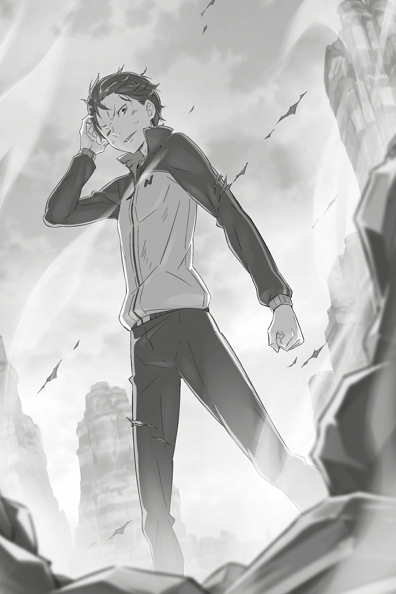

## 1

Радужный меч продолжал свою дикую пляску, сдерживая свирепый натиск чёрных щупалец. Клинок вспыхивал и рассекал одну за другой извивающиеся дьявольские длани: на его счету уже был не один десяток.

Испускающий радужный свет меч Юлиуса представлял собой смертельный волшебный клинок, объединивший силу шести элементов. Его лезвию были подвластны даже Незримые Длани Петельгейзе. Поверженные щупальца обращались в прах и пропадали навеки.

Судя по всему, восстанавливать утраченные длани Петельгейзе не успевал: с каждым взмахом клинка плотность щупалец уменьшалась, а ярость архиепископа, наоборот, возрастала.

— Это не смешно! Совсем не смешно! Это просто абсурдно! — кричал Петельгейзе. — Чтобы дешёвой уловкой, грошовым трюком, детским приемчиком превратить в ничто мою любовь! Мою преданность!..

— Так ты никого на свою сторону не привлечешь, — холодно ответил Юлиус. — И с культурой общения у тебя, похоже, большие проблемы.

Петельгейзе брызгал слюной и продолжал выбрасывать вперёд чёрные щупальца. Одни встречал радужный клинок Юлиуса, от других рыцарь просто уворачивался. Юлиус превратил поле боя в танцевальную площадку, на которой исполнял номер с мечом. И эта площадка была полностью под его контролем.

Но дьявольские длани, прибывавшие нескончаемым потоком, всегда атаковали по десять штук и более. Одним взмахом меча невозможно было ликвидировать такое количество щупалец. Неудивительно, что вскоре на теле Юлиуса появилось несколько ран.

— Ах!.. — Субару наблюдал за боем, и тут его несколько раз пронзила острая боль.

Когда чёрные пальцы скользнули по бедру, юноша едва не взвыл. Чтобы не закричать, Субару стиснул зубы. Затем, ощутив саднящую боль в плече, сжал кулаки. Благодаря магии, чувства Субару и Юлиуса были идентичны. Зрение юноши помогало рыцарю видеть Незримые Длани, а надежная тяжесть волшебного меча в руках Юлиуса внушала Субару уверенность.

Несмотря на положительные стороны наспех налаженного взаимодействия, оно было крайне неустойчивым. Общее зрение раздваивало картинку в глазах каждого: как если бы правый глаз видел одно, а левый — другое. Общие чувства передавали Субару не только эмоциональный подъём Юлиуса, но и острую боль, которую испытывал рыцарь.

Ветер на коже, земля под ногами, кровь и слюна во рту, звон в ушах, запах смерти, понимание, что любая секунда может стать последней… Каждое ощущение стало в два раза интенсивнеё, и это жутко изматывало. Так бывает, когда зудит в том месте, до которого невозможно дотянуться. Или, если выразиться точнее, когда чувствуешь, как чешется чужой затылок…

Тело Субару изнывало от этой пытки. Он облизнул пересохшие губы и пробормотал:

— Слушай, когда я говорю, что хочу скорее с этим покончить, я не шучу…

Наверняка Юлиус тоже чувствовал его жажду. Ещё не хватало чужих позывов справить нужду!..

Хотя идея принадлежала Субару, юноше было по-настоящему отвратительно. Исчезновение границ собственного тела вносило хаос в саму природу человеческого существа. Но Субару не смел жаловаться, он запретил себе ныть.

— Тело постепенно привыкает, — сообщил Юлиус. — Субару, ты не против, если я ускорюсь? — спросил Юлиус, одним взмахом меча срезав целый сноп щупалец.

— Будь спокоен, я с тобой! — прокричал Субару, но Юлиус, не дожидаясь ответа, бросился наперерез туче чёрных щупалец.

Сильно пригнувшись, едва не касаясь подбородком земли, рыцарь проскочил под стеной дланей. Сверкнула радуга, и Юлиус, ловким взмахом клинка рассек их на части, а затем стряхнул с меча приставшую плоть.

Хотя рыцарь контролировал ход битвы, его движениям не хватало былой изящности. И не удивительно, ведь, по сути, он дрался с закрытыми глазами. Чтобы картинка не раздваивалась, Юлиус полностью положился на зрение Субару. Рыцарь сам так решил, и Субару с ним согласился. Однако, осознав последствия выбора, юноша пришел в негодование:

— Идиот! Дубина! Ты что творишь?! Чокнутый!

Отключив собственное зрение и всецело положившись на глаза напарника, Юлиус доказывал, рискуя жизнью, что верит в Субару.

Следует добавить, что полная концентрация на зрительных ощущениях Субару требовала от Юлиуса огромных усилий. Глаза Субару принадлежали только ему самому. Юлиус не мог их заимствовать. Другими словами, рыцарь дрался, глядя на себя со стороны. Как в шутере от третьего лица.

— Сумасшедший! Это не игрушка! Один раз схватят — и конец! Только ненормальные выбирают такой способ драки! Ненормальные, как ты и я…

— Тебе так скучно, что развлекаешься болтовней? — спросил Юлиус, оттолкнувшись ногами от утёса и вновь оказавшись рядом.

Рыцарь взмахнул клинком и всадил его в дьявольскую длань, которая шальной пулей неслась к Субару. Юноша, боясь шевельнуться, беспомощно наблюдал за этой сценой, пораженный мастерством рыцаря.

Юлиус, глаза которого были по-прежнему закрыты, слегка улыбнулся:

— За тобой глаз да глаз! Понимаю, ты смертельно устал, но лучше не зевай. С таким противником расслабляться нельзя!

— Могу сказать то же самое! Мне на тебя глядеть страшно! Не кажется, что господин рыцарь, которого ты видишь этими самыми глазами, играет с огнем?!

— Я вижу печального красавца с закрытыми глазами, и в его облике угадывается хорошее воспитание.

— А я, если честно, вижу совершенно другое!

Обменявшись остротами, напарники отпрыгнули в разные стороны, уклоняясь от чёрных рук. Приземление у Субару вышло неловкое: он шлепнулся на землю, тогда как Юлиус, распоров мечом надвигавшуюся волну щупалец, проскочил сквозь брешь и снова устремился к безумцу.

— Во дает!.. — вырвалось у Субару, когда он, подпрыгнув, увидел трюк Юлиуса.

Больше всего Субару пугало то, как быстро Юлиус приспособился к ощущениям чужого тела и как метко он разил мечом длани. Одной лишь высокой чувствительности для таких результатов недостаточно. Юлиус имел за плечами опыт долгих, изнурительных тренировок. Он закалял себя в бою, оттачивал мастерство в реальных поединках. Рыцарь был уверен в себе и потому бросался в бой без страха и сомнений.

Субару, сжав кулаки, неотрывно наблюдал за схваткой. Юношу съедала досада, ведь по сравнению с Юлиусом он был никем. Субару глубоко раскаивался в беспечно прожитых днях. При мысли об упущенном времени его взяли досада и злость. Субару сгорал от нестерпимого стыда, поэтому не мог отвести взгляда от Юлиуса.

— Иду в наступление!

— Ага, давай!

Субару не расслышал шепот, но всё равно ответил.

Воля отступала, ладони были в крови, раны на спине, ногах и теле ныли. Но Субару стиснул зубы до ломоты в челюстях, не отводя взгляда от боя.

Пробежка, прыжок, скольжение, разворот, выпад, отскок, шаг вперёд, бросок, прыжок в сторону, разворот, удар ногой, снова прыжок… Движения Юлиуса были отточены и грациозны.

— Это абсурд…

Юлиус рубил, рассекал, вонзал, сбивал, распарывал, крушил. Его меч сверкал, поднимался и опускался, резал, крошил, впивался и обращал Незримые Длани в пыль.

— Абсурд, абсурд, абсурд, абсурд, абсурд!

Небо заволокла зловещая тьма, а рыцарь все продолжал свою дикую пляску с мечом, объятым радужным сиянием, и танец его был идеален и прекрасен.

Глядя на эту фантастическую картину, зритель забывал, что перед ним разыгрывается смертельный бой. Вероятно, виной этому были квазидухи, которые через Юлиуса передавали Субару собственные понятия и представления. Квазидухи любили Юлиуса, а его сумасшедшего противника ненавидели. Для них преступления безумца были непростительны. Квазидухи не могли принять сородича, погрязшего во зле.

— Этого не может быть! — в ярости вопил Петельгейзе. — Это просто… невероятно! Почему?! Ну почему?! моё Полномочие!.. Ведь я был любим! Я должен быть любим! Я любим! Я люблю! Но это… так… я…

— Я сыт по горло твоими бессвязными речами! — перебил его Юлиус. — Твоё так называемое Полномочие я урезал подобающим образом. Но главное: я уже приноровился вести поединок, используя зрение Субару. — С этими словами Юлиус, по-прежнему не открывая глаз, направил рыцарский меч на Петельгейзе. — Ещё немного — и я тебя прикончу! Лень — одна из угроз, долгое время нависавших над страной… нет, над всем миром, встретит смерть на этом самом месте!

— Думаешь, тебе удастся?! Думаешь, я позволю?! — завопил Петельгейзе, обнажая окровавленные зубы. — Меня! Принявшего милость Ведьмы! Того, кто четыреста лет прилежно трудился ради воплощения её замыслов! Чтобы меня — ты?! Глупец, притащивший с собой таких же никчемных духов!..

Однако именно эти гневные вопли убедили Субару в том, что победа над Ленью близка. Дело было в ненависти, которую Петельгейзе питал к ним столь же сильно, сколь сильно обожал Ведьму.

— Юлиус!

— Понял! Архиепископ, готовься! — прокричал рыцарь и стрелой бросился вперёд.

Петельгейзе открыл рот и, надрывно вопя, выпустил Незримые Длани. Руки расползлись во все стороны: по небу, по земле, по деревьям. Они окружили Юлиуса и уже были готовы вонзиться…

— Ал Клаузелия! — провозгласил рыцарь, и в тот же миг вокруг него закружился радужный вихрь, свет которого затмил чёрные длани.

Вспышка озарила мир лишь на мгновение. Этого мгновения оказалось достаточно: сеть, развернутая Петельгейзе, исчезла. Между Юлиусом и архиепископом не было ни единой преграды.

— Бха-а! — Ударная волна от радужной вспышки сбила Петельгейзе с ног.

Скребя изувеченными пальцами по земле, безумец встал на ноги. Подняв окровавленный подбородок, он увидел, что прямо на него с мечом наперевес несётся Юлиус. Петельгейзе раскинул руки, словно готовясь принять удар, и прокричал заклинание:

— Ни за что! Уль Дона-а-а!

В следующий миг почва вспучилась и окружила безумца земляным кольцом. Меч отскочил от преграды. Губы Петельгейзе растянулись в безумной ухмылке. Он выбросил через стену Незримые Длани, готовые нанести Юлиусу роковой удар исподтишка.

Отразить атаку рук означало дать Петельгейзе шанс ускользнуть. Но если не обезвредить длани, Юлиус окажется под ударом Полномочия. В любом случае меч не спасет…

Но Юлиус не был одинок на этом поле боя.

— Да воспылает мой боевой дух! Лети, мяч дьявола! И не смей упасть ближе, чем за сто двадцать километров!

Повернувшись и приподняв ногу, Субару сделал большой замах от плеча и отправил в полет красный магический камень — со скоростью, правда, несколько меньшей, чем при прямой подаче.

Субару отнюдь не болел бейсболом. Одно время он посещал секцию, где тренировал удары битой, но, как правило, все заканчивалось страйк-аутами. С контролем мяча дела обстояли получше.

Учитывая, что в критической ситуации человек хорошо концентрируется, попасть камнем в стену для Субару оказалось проще простого.

— Что?!

Красный магический камень, начиненный разрушительной энергией, обогнал Юлиуса, врезался в баррикаду и взорвался. Яркая малиновая вспышка на миг ослепила Петельгейзе. Архиепископ оцепенел от изумления:

— Неужели он с самого начала…

Из-за стены огня послышался голос Юлиуса:

— Ты проиграешь потому, что считал его слабаком!

В следующий миг рыцарь прорвал стену пламени, подскочил к безумцу и всадил в него меч.

— А…

Клинок пронзил грудь архиепископа, опаляя радужным светом внутренности, и пригвоздил его к утесу. Насаженный на меч, Петельгейзе задрыгал руками и ногами, извергая кровавую пену и слёзы. На лице безумца возник звериный оскал.

— Абсурдно! Это абсурдно, абсурдно, абсурдно-о-о! Я…

— Свет радуги разорвет тебя на куски вместе с твоей душонкой! — провозгласил Юлиус. — Это тело, чье бы оно ни было, таит в себе зло, но я не дам ему уйти! Да испепелит тебя радуга!

Сияние рыцарского меча сделалось ярче, оно не давало Петельгейзе снова выпустить Незримые Длани. Архиепископу оставалось только извиваться и дергаться, словно насекомое, насаженное на булавку. Но глаза Петельгейзе горели прежним безумием — он и не думал сдаваться.

— Нет! Это ещё не конец! Далеко не конец! Я служил с подобающим прилежанием!

Непозволительно! Даже помыслить о том, чтобы поддаться лени и смириться с концом! Поэтому… во что бы то ни стало…

Петельгейзе всё дергался, пытаясь соскочить с клинка, но лишь расширял рану. Оставалось только удивляться его феноменальному упрямству. Юлиус напрягся и провернул меч так, чтобы клинок прошел сквозь сердце.

Это должно было добить безумца, но до того Петельгейзе взял слово:

— Мои пальцы уничтожены, а без них смерти не избежать… И всё-таки! Всё-таки! У меня! Остался… сосуд!

На данный момент «пальцы» Петельгейзе, скрывавшиеся по всему лесу, уже были убиты. Все заранее подготовленные им запасные тела… А значит, оставалось подыскать замену прямо здесь и сейчас.

Налитые кровью глаза забегали и остановились на Субару. Юношу продрал мороз, а безумец расплылся в довольной ухмылке.

— О-о… Мой мозг трепещет! — прошептал он.

Вдруг тело Петельгейзе, насаженное Юлиусом на меч, обмякло, словно марионетка с перерезанными нитями. Глаза потухли, конечности безжизненно повисли, как сломанные ветви. Петельгейзе должен был вселиться в новое тело с минуты на минуту.

— Юлиус! Вырубай! — крикнул Субару, сунув руку в карман.

— Понял! — откликнулся тот и прекратил действие магии Нект.

Груз удвоенных чувств и ощущений моментально исчез, но не успел Субару и вздохнуть, как навалился другой. Взамен чувств Юлиуса в Субару, не спрашивая разрешения, вторглась новая сущность. Ввинчиваясь в самое сердце, невидимый паразит захватил управление телом. В голове раздался его трескучий хохот.

Субару согнулся, выкатил глаза и принялся хлопать в ладоши.

— Так я и знал! Это тело оказалось прекрасным сосудом! Как ты теперь мне помешаешь?! А-а, это Лень!

Субару ощущал присутствие безумца: казалось, Петельгейзе устроился где-то рядом с мозгом. Таково было последнее пристанище архиепископа: за неимением «пальцев» он захватил тело Субару. Сопротивляться вторжению было невозможно. Безумец захватил сознание и волю.

— Теперь я внутри твоего приятеля! Как тебе такое? Сумеет ли благородный рыцарь его прикончить?

Безумец в обличье Субару облизнулся. Юлиус бросился было к нему, но остановился и сказал:

— Разумеется, я не ударю его мечом.

— И это значит?..

— Вот что это значит, — тихо произнес Юлиус и вытянул вперёд левую руку.

В руке Юлиус держал Диалоговое Зеркало, испускавшее сияние. Субару вытащил его из кармана и кинул рыцарю в тот момент, когда Петельгейзе вселился в новое тело. На поверхности зеркала отображалась мордашка рыцаря с кошачьими ушками. Он с самого начала наблюдал за битвой.

— Феррис, твой выход!

— Субарунчик, какой же ты тупица, что заставляешь меня делать это! — Голос Ферриса дрожал от негодования. — Когда всё закончится, я тебя порву на лоскуты!

Петельгейзе, вселившийся в тело Субару, уловил в голосе юноши гнев и выкатил глаза. Предчувствуя недоброе, он решил действовать. Однако, как ни пытайся опередить того, кто пережил Посмертное возвращение, всё равно окажешься медленнее.

— Незримые… Гха-а-а-а!!!

Задействовав Полномочие, Петельгейзе-Субару вдруг душераздирающе завопил. Причиной его крика стал взрыв внутри тела, за которым последовал не поддающийся пониманию вихрь жара и боли. Тело Субару мгновенно обмякло и, трясясь, словно в дикой лихорадке, повалилось на землю.

Мозг будто ошпарили кипятком, раскаленное добела сознание то меркло, то вспыхивало. Петельгейзе, занявший чужое тело, испытывал те же муки.

— Ах!.. Гха… хха… Что… за… что… это?! — в панике задышал безумец.

Чтобы ответить поселившейся в его голове мерзкой душонке, Субару собрал последние силы и выговорил:

— Что, неудобно тебе… в моем теле?.. Обессилел?..

*«Только не говори… не говори, не говори, не говори-вори-вори-вори-ри-ри-ри-и-и! Будто знал заранее, что я вселюсь в тебя, и потому устроил такое!»*— прозвучал в голове вопль.

— А ты как думал, придурок?! — с трудом выдавил Субару.

Два сознания пребывали в одном теле. Это порождало странное ощущение разговора с самим собой. В глубине души Субару винил себя за то, что заставил Ферриса выполнять эту неприятную работу. Ведь именно магия Ферриса лишила Петельгейзе свободы внутри тела-сосуда. Используя магию воды, Феррис мог взбаламутить ману Субару, потому что уже внедрялся в его врата, когда занимался лечением. Именно Феррис нанес одержимому Субару фатальные повреждения в конце прошлого круга.

Феррис славился своей исцеляющей силой, но эта же сила могла быть использована и во вред. И он не отказал Субару, когда тот попросил его использовать её именно так. Таким образом, был поставлен финальный капкан для Петельгейзе.

— Итак, последний сосуд, на который ты так надеялся, оказался ловушкой?.. Может пора сдаваться?

*«Сдаваться? Сдаваться? Я захватил эту плоть, а ты предлагаешь, что… чтобы я? Мне? Мной!? Чтобы я-я-я?…»*— Петельгейзе впал в небывалое исступление. Теперь он был загнан в угол в полном смысле этого слова. Его обошли по всем фронтам, и это вызвало у архиепископа ещё большее остервенение.

Субару мысленно издалека наблюдал за происходящим. Бегущий по венам кровавый кипяток по-прежнему доставлял ему страшные муки, но он решился довести дело до конца.

— Моя смерть станет для Ферриса тяжелым ударом… Но я сам не любитель умирать, так что воспользуюсь своими методами.

— Что ты собираешься… Что тебе ещё… от меня? — почувствовав неладное, Петельгейзе струхнул.

Юноша понял, что безумец, несмотря на всю свою наглость, начал бояться. Потому что Субару не сомневался в серьезности своих намерений.

— Испугался? Страшно после всего, что натворил?!

*«Это ради любви! Ради воздаяния за жестокость! Чем я перед тобой провинился??! Ты только и делаешь, что мешаешь мне! Что ты вообще такое?!»*

Петельгейзе обуял ужас. Он никак не мог взять в толк, за что Субару его возненавидел. Ведь их линии жизни никогда не пересекались. По крайней мере, так думал архиепископ.

*«Твои поступки, твоя неприязнь ничем не оправданы! Всё это чудовищное недоразумение!»*

— Мне больше не о чем с тобой говорить. Есть люди, которые никогда тебя не поймут, как ни откровенничай. А если собеседник и не человек вовсе… — Голос Субару был полон разочарования и смирения.

Петельгейзе ошеломленно умолк. То была истина, которая отправила безумца в нокаут. И его реакция доказывала это.

*«Что ты… знаешь обо мне? Говори!»*

— Когда я заманил тебя на это место, ты мог бы смекнуть, в чем уловка. Один — полноправный заклинатель духов. Второй, пусть это и прозвучит нескромно, — имеет все задатки стать таковым. Кроме нас, здесь никого не было.

Во время общения с Юлиусом Субару выяснил последнее условие, необходимое для захвата.

— Ты силой навязываешь контракт человеку, который имеет задатки заклинателя духов, и овладеваешь его телом. Вот в чём твой секрет, греховный архиепископ.

*«Да как ты смеешь!»*— в ярости завопил сидящий в Субару Петельгейзе, позабыв о страхе.

Субару выяснил истинную природу Петельгейзе, когда размышлял о событиях прошлого круга и условиях Захвата. Ему не давала покоя Иа. В прошлый раз Петельгейзе вытеснил квазидуха Иа, проникнув в тело Субару. Из этого юноша заключил, что архиепископ ненавидел духов и заклинателей духов, потому что… сам был духом!

Злой дух Петельгейзе овладевал телами, навязывая незаконные контракты. А заклинатели, заключившие с духами контракты по всем правилам, были для него естественными врагами. Временный контракт Петельгейзе мог разорвать, но против полноценного контракта был бессилен. Потому Субару и выбрал Юлиуса напарником в решающей схватке.

— Только вывел тебя на чистую воду, как ты сразу в крик! Наверное, я на тебя плохо влияю.

*«Заткнись! Не смей! Ставить меня в один ряд с этими недостойными существами! Я есть покоритель духов! Я есть избранный, что подчинил духов, развеял туман и ниспосланной милостью достиг цели! Да что ты обо мне знаешь?!»*

Петельгейзе взорвался, совершенно позабыв о том, что похитил чужую плоть, — так его распирало от ярости и негодования.

Но речь архиепископа только подтверждала догадку Субару, и чем больше он отрицал свою принадлежность к духам, тем глубже рыл себе могилу.

*«Меня изменила любовь! Любовь дала мне волю и смысл существования! И всё это милостью Ведьмы! Значит! Значит! Это тело, эта душа, всё должно быть принесено в жертву Ведьме!»*

— Премного благодарен за содержательный рассказ, господин архиепископ. Специально для вас я устрою долгожданную встречу!

— С кем?! О чем ты говоришь?!

— С госпожой Ведьмой.

Стоило Субару произнести эти слова, как от неистовства Петельгейзе не осталось и следа. Впервые он растерялся и демонстрировал тупое удивление. Мысли безумца растворились в белой вспышке. Субару стряхнул их, словно наваждение, и вымолвил то, что должно было приблизить встречу:

— Я возвращаюсь после смерти!..

Как только запретные слова были произнесены, мир стал черно-белым, и все замерло.

А затем она пришла за Субару.

## 2

Она привела его в мир беспросветного мрака. Абсолютный вакуум, пустое, всеми покинутое пространство, в котором не существовало даже его собственного тела.

Но какая разница, есть ли плоть, душа, мир? Все это неважно. Он ощущал лишь утрату и тоску. Но если он способен чувствовать, значит, он существует. Пускай вокруг пустота.

Вдруг во тьме что-то сдвинулось, и пространство словно изменилось. Это была абсолютно чёрная тень, настолько чёрная, что даже тьма вокруг казалась светлее. Женская фигура, больше ничего не разобрать. Лицо, руки и ноги — все было неясным, расплывчатым, неопределенным. Но в сердце что-то щелкнуло.

Какая неожиданная встреча. Хотя нет… Их встреча не была неожиданной. Они воссоединились.

Их встреча была благословением, милостью, доброй вестью, истинной любовью. Ибо все дни вплоть до этого момента были прожиты только ради воссоединения с ней.

Как жаль, что у него нет пальцев! Иначе он бросился бы к ней и взял за руку.

Как жаль, что у него нет рта! Иначе он излил бы душу.

Как жаль, что у него нет тела! Иначе, стоило ей только пожелать, он отдал бы и кровь, и плоть.

Как жаль, что у него нет ничего, кроме души! Ибо это всё, что он может отдать…

Она по-прежнему сохраняла молчание, но внимание определенно было направлено на него.

Но этого достаточно. Стоило лишь подумать о том, и он оказывался на седьмом небе от счастья. Скоро они обменяются вожделенной любовью, и его душа будет вечно принадлежать…

*«Нет.»*

Голос был исполнен разочарования.

Он жаждал впитать любое её слово, будто высшее блаженство. Но теперь всё его существо пронизала тревога. Откуда взялось это чувство? Здесь, в том самом месте, где он должен был получитьдолгожданную любовь…

*«Ты не тот человек.»*

Отчаяние, потухшая страсть, разочарование обратились в новое чувство — гнев.

*«Если ты не тот человек, что ты здесь делаешь?!»*

Голос возмущённо дрогнул. Слова, полные гнева и неприязни, звучали как проклятие. Она отвергала его, разбив душу на мелкие осколки.

*Но почему? Этого просто не может быть!..*

Он стал в отчаянии подыскивать слова, чтобы выразить свою печаль и хоть как-то смягчить её сердце. Но у него не было рта, чтобы произнести их. И не было тела, чтобы реализовать свои намерения. Одна лишь душа бесприютно висела в пустоте. Отвергнутая и непризнанная.

*«Исчезни!»*

Она не чувствует его растерянности, смятения, печали. Все бесполезно. В её глазах он ничего не стоит. Он пустое место.

Его душу раздирают на части. Изгоняют сознание из рамок подвешенного пространства. Та, с кем он грезил воссоединиться, уже далеко-далеко. Она погружается во мрак, и снова между ними сгущается непроницаемая мгла.

Её больше нет. Столь желанная, она исчезает вдали. Стенания ей глубоко безразличны. Она лишь молча всматривается во мрак и…

*«Люблю тебя. Люблю тебя. Люблю тебя. Люблю тебя. Люблю тебя. Люблю тебя. Люблю тебя. Люблю тебя. Люблю тебя. Люблю тебя. Люблю тебя. Люблю тебя. Люблю тебя. Люблю тебя. Люблю тебя. Люблю тебя. Люблю тебя. Люблю тебя. Люблю тебя. Люблю тебя. Люблю тебя. Люблю тебя. Люблю тебя. Люблю тебя. Люблю тебя. Люблю тебя. Люблю тебя. Люблю тебя. Люблю тебя. Люблю тебя. Люблю тебя. Люблю тебя. Люблю тебя. Люблю тебя. Люблю тебя. Люблю тебя. Люблю тебя. Люблю тебя. Люблю тебя. Люблю тебя. Люблю тебя. Люблю тебя. Люблю тебя. Люблю тебя. Люблю тебя. Люблю тебя. Люблю тебя. Люблю тебя. Люблю…»*

…отрешенно шепчет слова любви. Не тому, кто находится там, во тьме. Кому-то другому…

## 3

— А-а-а! Я вернулся!

Мучительная боль, казавшаяся вечной, отпустила, и Субару вновь очутился в реальности.

Длинная чёрная тень в виде руки сдавливала его сердце в наказание за то, что юноша произнес запретные слова. Эта рука весьма напоминала Полномочие Петельгейзе, и, скорее всего, между Субару, Ведьмой Зависти и Посмертным возвращением определенно имелась некая связь. Быть может, раскрыв эту тайну, юноша сумеет разгадать и другую загадку: цель его призыва в альтернативный мир.

— Когда-нибудь я обязательно всё узнаю! Но сейчас…

Субару прогнал никчемные мысли и приподнялся, еле шевеля конечностями, которые свела судорога. Затем он стер с лица слюну, вцепился в поверхность утёса и встал на ноги.

Только тут Субару осознал: вселившаяся в него инородная сущность исчезла! Он бросил взгляд вдоль подножия утёса и увидел Петельгейзе: тот ползал в луже крови.

— Нет… это… абсурд… — всхлипывал архиепископ, вернувшийся в прежнеё, почти мертвое тело.

Он разорвал принудительный контракт с Субару. Находясь в чужой оболочке, Петельгейзе испытывал те же муки, что выпали на долю хозяина за слова о Посмертном возвращении. Получив чужое тело, архиепископ получил в придачу чужую боль. Субару предвидел такой эффект, на что и опирался его план.

— Я был готов пытать тебя снова и снова, пока не сбежишь… Но ты сразу же сдался, жалкое ничтожество!

Субару задыхался, но произнести победную речь считал делом чести. Тут ноги юноши подкосились, и он едва не брякнулся на землю, но сзади его кто-то подхватил. Увидев того, кто ему помог, Субару хмыкнул.

Юлиус усмехнулся в ответ, взмахнул мечом и направил острие на Петельгейзе.

— Пора кончать спектакль!

Блеснул клинок, заляпанный кровью. Вокруг лезвия снова закружили квазидухи и окутали его радужным сиянием. Сжимая в руке рукоять меча, который мог разрубить все на свете, Юлиус смотрел на Петельгейзе жёстким, немигающим взглядом.

— Любовь ради любви… любви… — бредил архиепископ, не в силах пошевелиться. Он будто не замечал Юлиуса. Но если бы и заметил, это ничего бы не изменило. Из раны в груди безумца по-прежнему била кровь. Лицо архиепископа приобрело землистый цвет, как у человека на грани смерти.

Наконец он прислонился спиной к скале и ошалело посмотрел на Юлиуса. Переведя взгляд на Субару, который стоял рядом, Петельгейзе взорвался:

— За что, за что?! За что?!

Из распахнутых глаз хлынули слёзы. Крупные, горячие капли стекали по щекам и падали на землю. В отличие от слёз восторга, которые Субару не раз наблюдал во время столкновений с Петельгейзе, эти слёзы были исполнены раскаяния и боли разбитых надежд.

Петельгейзе поднял глаза к небу и, обращаясь к кому-то невидимому, закричал:

— Ведьма! Ведьма! Ведьма-а-а! Сколько жертв я принёс в твою честь! Сколько сил я отдал служению тебе! Всё, что ни приходило в голову, я использовал, дабы восславить тебя! За что?! Почему?! Почему покинула меня? Почему?! Ведьма! Зачем тогда ниспослала свою любовь… свою милость…

— Не любовь ты приносил в жертву, не веру и тем более не самого себя, — оборвал Субару. — А жизни случайных людей, что попадались тебе на пути.

Слушать безумца не было смысла. Его самонадеянный бред являлся проявлением болезненной страсти. Как говорил Вильгельм, называть такое любовью — верх наглости.

Подскочив к Петельгейзе, Юлиус приставил клинок к его груди. Архиепископ лишь посмотрел на оружие затуманенным слезами взглядом. Радужный клинок снова вошел в грудь, и из раны брызнул фонтан света.

Истинная сущность Петельгейзе — сгусток маны, злой дух, паразитировавший на чужой плоти и жаждавший поглотить её, — была объята многоцветным сиянием. Ещё немного, и она превратится в горстку пепла!

Петельгейзе безразлично посмотрел на рыцарский меч, воткнутый в его грудь, и на поток тёплой крови. Затем он поднял глаза к небу, простер руки ввысь и пробормотал:

— Мой… мозг… трепещет…

Черная рука взметнулась в небо. Она летела и летела, словно пыталась добраться до ослепительного солнца. Однако вскоре чёрная длань ударила в отвесную стену и процарапала её поверхность, оставив глубокую трещину. Вряд ли Петельгейзе хотел сделать именно это. То был последний, бессмысленный всплеск его безумия. Удар черной длани отколол от утёса огромные куски, которые полетели вниз, прямо на Петельгейзе.

— Мне даровали любовь…

Раздался громкий хруст плоти — валуны раздавили его в лепешку. Земля вздрогнула, в воздух поднялось облако пыли. Петельгейзе сам погреб себя под каменными обломками.

Юлиус, вовремя отскочивший в сторону, подошел к груде камней, ставших могилой. Взгляд рыцаря упал на лужу крови. Юлиус некоторое время глядел, как она расплывается из-под самого большого валуна, затем мотнул головой, вложил меч в ножны и обернулся к Субару.

Тот, не говоря ни слова, подошел. Остановившись перед могилой архиепископа, Субару издал тихий вздох.

Это не был вздох удовольствия или удовлетворения. Чувство, распиравшее грудь, оказалось сильным, но в то же время пустым, лишенным определенной окраски. Субару не стал глумиться над поверженным врагом. Это было бы низко.

Юношей овладела апатия, и на ум пришло лишь одно:

— Петельгейзе Романе-Конти…

Этими словами Субару поставил точку в войне. Войне, которую вели Безупречный Рыцарь Юлиус Юклиус и самопровозглашенный рыцарь Субару Нацуки против Петельгейзе Романе-Конти, греховного архиепископа Лени Культа Ведьмы.

Стоя у могильного холма из каменных глыб, Субару тихо вздохнул и проговорил:

— Ты всё-таки оказался ленивым парнем.

