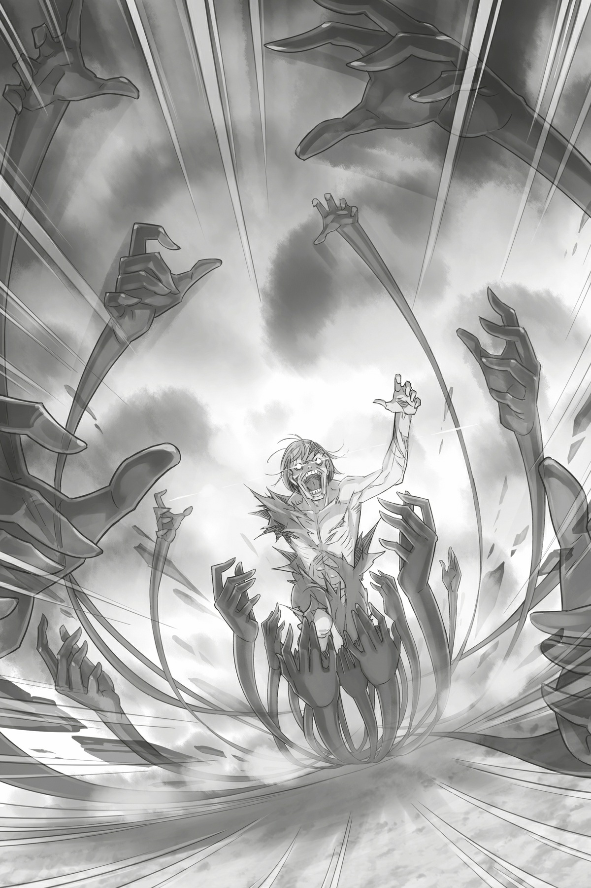
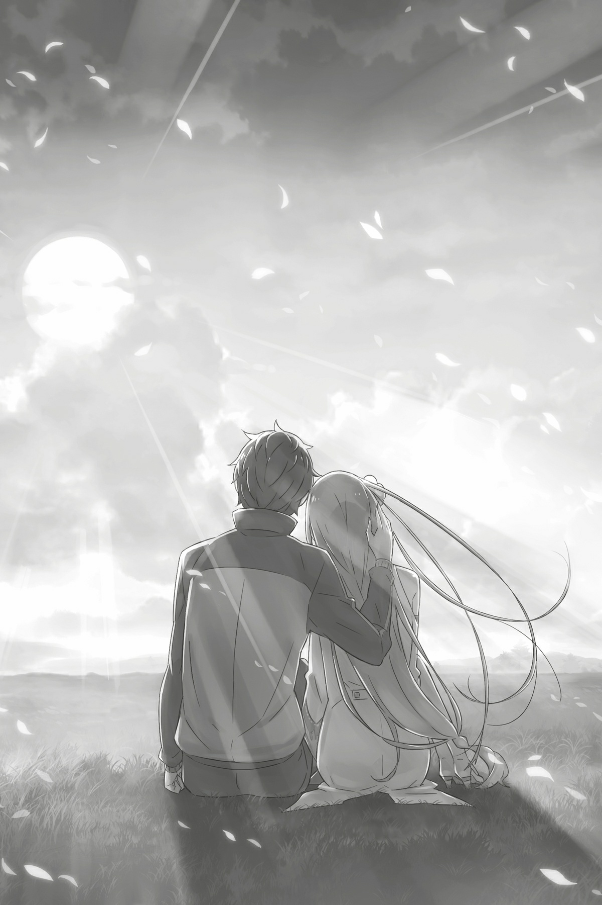

## 1

Бросив последние слова, Субару отвернулся от могилы безумца и встал лицом к Юлиусу. Один глаз рыцаря был закрыт. Рядом стоял невозмутимый человек, зверь и человек — оба были изранены, но обладали достаточной крепостью духа, чтобы не подавать виду. Впрочем, любой бы заметил, что оба, истратив физические и душевные силы, изнемогают от усталости.

— Но кто я такой, чтобы судить о них? Этот тип побывал в моем теле, пусть и недолго…

Побочные эффекты от магии Захвата были неизвестны. Субару горячо надеялся, что однажды им не овладеет бессознательное желание изувечить себя…

Размышляя о том о сём, он вдруг погрузился в странное безразличие. Петельгейзе был самым страшным его врагом с момента призыва в альтернативный мир. И вот, когда он наконец оказался повержен, Субару охватила не радость, а холодное равнодушие.

— Скажите ещё, что я эмоционально выгорел. Вот уж не думал, что, победив Петельгейзе, стану предаваться глубокомысленным рассуждениям. Глупость какая…

Он ударил себя по лицу, надеясь, что боль вернет его мысли в нужное русло.

Петельгейзе был убит. Но миссия Субару на этом не заканчивалась. Он ещё не выполнил самую главную задачу — не помирился с Эмилией.

После той ссоры в столице и последовавшей разлуки он успел заключить союз с лагерем Круш, одолеть Белого Кита, повоевать с Культом Ведьмы и набрать очков у Эмилии, чтобы вывезти её из особняка. Осталось лишь объясниться с Эмилией — и он наконец выберется из этого круга.

Физические и душевные силы Субару были на исходе.

— Но никто не ранен, все живы-здоровы. А это большое облегчение! Лишь утратив тихий, размеренный уклад жизни, начинаешь его ценить. Хотя я с самого начала ценил…

Тем не менее суета наконец улеглась. Субару повертел головой: его взгляд упал на книгу, лежавшую среди кровавых следов, оставленных Петельгейзе.

— Евангелие?..

Книга была перепачкана кровью и грязью. Вероятно, архиепископ обронил её незадолго до смерти. Субару поднял Евангелие и пробежался по страницам. Как и в прошлом круге, первая половина была испещрена непонятными иероглифами, а вторая содержала пустые листы. Теперь, когда Петельгейзе не стало, спросить, о чём эта книга, было не у кого.

— Возьму-ка я книжку с собой, а потом посоветуюсь с Круш или Розваалем, как с ней поступить.

Приоритет был отдан Круш — герцогиня нравилась Субару гораздо больше, чем Розвааль. Хоть граф и был союзником, юноша не очень-то ему доверял, и отсутствие Розваля в критический момент ещё больше подрывало его репутацию. Впрочем, Субару надеялся, что в будущем граф реабилитируется.

— Субару, — позвал Юлиус.

Погрузившись в размышления, Субару не заметил, как рыцарь подошел к нему. Юноша поднял голову и, увидев, что Юлиус чем-то озадачен, нахмурился. Мелькнуло тревожное предчувствие.

— Возникла проблема. Нам нужно скорее возвращаться в деревню.

— Значит, интуиция меня не обманула. Что стряслось?

— Сообщение от Ферриса. — Юлиус показал светящееся Диалоговое Зеркало и бросил тревожный взгляд на гладкую поверхность, на которой виднелось лицо лекаря. — С грузом, который везли торговцы, что-то не так. Госпожа Эмилия в опасности!

Новость была подобна грому среди ясного неба и грозила свести на нет все достижения…

## 2

В деревне Субару и Юлиуса уже поджидал боевой отряд. Узнав, что Петельгейзе повержен, бойцы окружили победителей и принялись наперебой чествовать их. Однако, несмотря на атмосферу праздника, в воздухе висело напряжение.

— Сейчас не время праздновать и устраивать банкет. Быстрей говорите, что случилось! — потребовал Субару.

— Конечно, конечно, — сказал Феррис. — Но сперва я осмотрю ваши раны.

Феррис улыбался, но на лбу его выступили крупные капли пота, а форма рыцаря-гвардейца была перемазана кровью. Вид лекаря испугал Субару, но Феррис небрежно махнул рукой и пояснил:

— Это не моя кровь, не волнуйся. Испачкался, исцеляя бойцов. К тому же раны солдат не такие уж тяжелые, как могло показаться, р-мяу. Раненые есть, но обошлось без жертв.

— Это радует… Меня осмотришь позже, сначала Юлиуса!

— С твоими ранами я справлюсь между делом. А вот над Юлиусом, судя по всему, придётся серьезно потрудиться.

Феррис занес ладони над Субару и активировал исцеляющую магию. Юноше стало щекотно. Секунд через десять боль утихла — Субару снова был цел и невредим. Не зря Феррис слыл мастером своего дела!

— Всё, Субарунчик, готово. Теперь Юлиус… Ох, как тебя измочалило! Давай раздевайся.

— Постарайся действовать помягче, — бесстрастно отозвался Юлиус, хотя его раны были весьма глубоки.

Осмотрев рыцаря, Феррис скорчил мучительную гримасу — очевидно, на лечение требовалось немало времени.

— Ты свою работу сделал, теперь спокойно отдыхай, — сказал Субару, поглядывая на Юлиуса, над которым уже начал колдовать Феррис. — Итак, Феррис, вернемся к главному. Что там с грузом?

Субару не терпелось прояснить этот вопрос. Феррис, не прерывая процесс лечения, кивнул и сказал:

— Об этом лучше всего спросить того, кто заметил странность. Эй, Отто!

Субару очень удивился: он никак не ожидал услышать это имя. Толпа бойцов расступилась, и вперёд, спотыкаясь, выскочил молодой человек с пепельно-русыми волосами.

— Отто?

— Сэр Нацуки! Я ждал вас!

Отто подбежал, тяжело дыша. Затем взволнованно оглядел Субару и Юлиуса и вздохнул:

— Как славно, что вы в порядке! Честно говоря, я думал, что ввязываться в борьбу с греховным архиепископом равносильно самоубийству… Да что ж это я! У меня же к вам разговор!

— Успокойся и объясни, в чем дело. Только коротко, самое главное!

— Это будет непросто! В общем, дело в грузе. — Отто понизил голос. — Я проверил по списку и обнаружил кое-что странное…

— Имеешь в виду перечень товаров, оставленный торговцами? И что в нем странного?

Отто пролистал список, который до того прижимал к груди, остановился на одной странице и прочитал:

— Вот, торговец Кэти Муттарт. Имя вам, наверное, незнакомо. Я слышал, он оказался шпионом Культа Ведьмы, и его поймали.

— Я знаю его. Вы, кажется, были приятелями.

В прошлых кругах Субару видел пару раз Отто и Кэти вместе. Наверное, Отто был шокирован предательством товарища.

Но, похоже, Отто это обстоятельство не волновало. Он придвинулся к Субару чуть ли не вплотную и сказал:

— Конечно, я удивился, что Кэти адепт Культа, уж об этом… Дело в другом. Это на его повозке эвакуируют сельчан, верно?

— Ну да. Дракон же не виноват, что его хозяин злодей. У нас и выбора-то не было, пришлось использовать всех драконов.

— И товар, выгруженный из его повозки, значится в этом списке, так?

— Должен быть… — кивнул Субару, не понимая, к чему клонит Отто. Судя по выражению лица, торговец остался доволен ответом.

— Я сверил груз с перечнем, — сообщил он напряженным тоном, — и обнаружил, что кое-чего не хватает.

— Не хватает?

— Большого количества огненных магических камней, которые привез Кэти. Этих камней хватит, чтобы разнести в щепки семь-восемь драконьих повозок. Не верится, что они просто испарились!..

## 3

Дракон Кэти был направлен не в Святилище, а в столицу, как и дракон, перевозивший Эмилию. Субару понял это, когда Отто рассказал о распределении повозок. Всего среди торговцев скрывались трое адептов культа. Их повозками управляли люди из отряда. Пассажиркой одной из этих трех повозок была Эмилия.

— А магические камни точно были в повозке? Я бы не слишком доверял списку, составленному адептом Культа Ведьмы…

— Адепты тем и страшны, что умеют быть незаметными. Они наносят удар в самый неожиданный момент. И до сих пор негодяи умело маскировались. Субару, ты просто закрываешь глаза на то, что не желаешь видеть! — заметил Юлиус.

— И снова ты прав… Ладно, признаю свою ошибку, — согласился Субару.

— Мы поняли, что груз не соответствует списку, — сказал Феррис, глядя на торговца. — Но ты хотел что-то добавить, верно?

— Да. Остальной товар в полном порядке. На самом деле, я видел эти камни.

— Ты видел магические камни прямо в повозке? Когда?

Отто, объявивший себя свидетелем, поднял указательный палец и ответил:

— Когда нам сообщили о сборе повозок для эвакуации. Я был с Кэти и другими торговцами. Желая приехать первым, я заторопился, но перед отправлением украдкой заглянул в чужие повозки.

— Ловко!.. Правда, результат всё равно так себе.

— А вот об этом можно и не упоминать! В общем, поверьте, видел своими глазами. О качестве камней могу лишь догадываться, но мощность не вызывает сомнений…

Когда Отто закончил свой рассказ, Субару скорчил Юлиусу и Феррису жуткую гримасу. Но рыцари были серьезны. Судя по лицу Юлиуса, он злился на самого себя. И Субару понимал почему.

— Чёрт, попал я впросак! Пожадничал с повозками, а оно боком вышло!

— В отсутствии заклятий я удостоверился, — сказал Юлиус. — А вот проверить, нет ли чего-то опасного в самих повозках, не догадался. Так что это моя вина.

— Ни в чем ты не виноват! Проверить должен был я.

Юлиус уделил особое внимание поиску магических ловушек, а Субару следовало проверить ловушки физические. Обиднеё всего было осознавать, что в прошлом круге Субару сам пережил взрыв повозки. Когда Кэти, одержимый Петельгейзе, раскрыл свою сущность, Субару с Феррисом оказались в эпицентре взрыва. Выяснилось, что на «пальцы» наложено взрывное заклятие, цель которого — их самоуничтожение. Юноша не сомневался, что взрыв был спровоцирован именно заклятием…

— В повозке было взрывное устройство! А мы задействовали её в эвакуации.

В случае разоблачения адептов магические камни могли нанести большой ущерб отряду. Также взрыв сообщил бы другим членам Культа о форс-мажоре. Злостный характер Культа Ведьмы делал подобный сценарий вполне возможным.

— Феррис, мы сможем догнать группу драконов, которая направилась в столицу?

— Вероятно, но это будет непросто. Госпожа Эмилия отбыла полтора часа назад… Они, конечно, не гонят на всех парах, чтобы не привлекать внимания Культа, но и черепашьим шагом тоже не ползут.

По плану, повозки, отправленные в столицу, должны были строго контролировать скорость, проезжая по тракту Лифаус. И теперь, когда они покинули земли Мейзерса и выехали на тракт, догнать их с каждой минутой становилось все сложнеё.

— Но если ничего не предпринять, Эмилия и дети погибнут! Неужели этого недостаточно?! Того, что я уже сделал…

Судьба дорогого человека оказалась под угрозой, но Субару не мог ничего изменить. Он прилагал все усилия, но раз за разом попадал в сети злого рока. Будто кто-то специально усеял его путь колючками и шипами.

Казалось, выхода нет, но тут поднял руку Отто.

— Сэр Нацуки, уделите мне минутку? — прервал он тревожные размышления Субару с самым серьезным выражением лица.

Отто был преисполнен решимости: даже не сравнить с тем робким и испуганным человеком, каким он выглядел всего несколько минут назад. Однажды Субару уже наблюдал разительную перемену в торговце. Это произошло в их самую первую встречу, когда юноша предложил пьяному Отто деловой разговор, и тот преобразился на глазах.

— Хочешь предложить мне сделку, Отто?

— Вы догадливый. Да, было бы неплохо. Сэр Нацуки, в настоящий момент я в крайне затруднительном положении. Я упустил возможность продать свой товар по выгодной цене, и сейчас он почти ничего не стоит. Шанс хорошенько заработать ускользнул, для меня это настоящая катастрофа! Иные говорят: чудо, что остался жив! Но, честно сказать, меня это не очень-то утешает!

История, в которую влип Отто, вызывала, скорее, улыбку, чем слёзы, но Субару сейчас было не до шуток. Юноша кивнул и попросил торговца продолжить. Тот на секунду закрыл глаза и сказал:

— Я предлагаю вам сделку. Если вы примете мои условия, я сделаю все возможное, чтобы догнать ту повозку.

— Правда догонишь? Каким же образом?!

— Прежде чем я скажу, пообещайте мне кое-что, — уклончиво произнес Отто. — Пообещайте, что примете моё условие. Я слишком дорожу этим козырем, чтобы выкладывать его просто так. А запугивать меня… бесполезно.

Субару схватил его за плечи:

— Согласен на любое условие! Сделаю все, что в моих силах!

Круг повторялся уже в четвертый раз. Белый Кит был повержен, Культ Ведьмы разбит. Важнейшие задачи выполнены. И меньше всего Субару хотелось, чтобы его труды пропали даром. Нужно собраться с силами, сделать последний рывок — и цель будет достигнута!

— Люблю решительных людей, — сказал Отто с улыбкой, хотя сам покрылся холодным потом. Торговец прекрасно понимал: от этих коротких переговоров зависит его жизнь.

Скорое решение Субару удивило Отто, но торговец не стал заострять на этом внимание. Отбросив сомнения, он заявил с хитрым прищуром:

— Я хочу, чтобы вы устроили мне встречу с графом Мейзерсом. И ещё, в качестве вознаграждения, вы купите все масло, что находится в повозке, по моей цене. Идет?

Отто воспользовался классической схемой: сначала выдвигай максимальные требования, а уж потом торгуйся. Как истинный торговец, он не упустил шанса извлечь выгоду из экстренных обстоятельств. По законам торговли между Субару и Отто должен был завязаться спор, однако…

— По рукам! Куплю у тебя что угодно! И с клоуном-извращенцем встречу устрою, если хочешь!

— Ой, вы меня пугаете!..

Начались переговоры точно так же, как в прошлый раз, да и завершились с аналогичным результатом: условия Отто были полностью приняты.

Спор закончился техническим поражением Субару. Но вот польстила ли торговцу такая победа, неизвестно…

## 4

— С тобой будет Иа. С ней проще отыскать магические камни, — сказал Юлиус, снова доверяя Субару своего постоянного спутника — красного квазидуха.

Как и прежде, квазидух, испускающий бледный свет, настроился на врата юноши, а затем исчез.

— Спасибо, конечно… А малышка не разозлится, что ею распоряжаются как вещью?..

— Она очень чуткая, и ты ей нравишься. К тому же у тебя не хватает знаний. Если я отпущу тебя одного, то пожалею. Я бы и сам не прочь поехать, но…

Тут Юлиус умолк, и его благородное лицо омрачилось. Феррис, продолжавший лечение рыцаря, возмущённо надул щеки и заявил:

— Куда это ты собрался ехать?! Ещё чего! У самого маны ни плошки ни ложки! На что ты годен в таком состоянии?!

— Я заимствовал силы у моих малышек, потому и дошел до такого… Ненавижу свою бездарность!

— Ты слишком строг к себе. В общем, спасибо за духа. И ещё… — Субару ткнул в Юлиуса пальцем и добавил: — Когда всё закончится, я устрою вечеринку в честь победы над Белым Китом и Культом Ведьмы! Ты в числе приглашенных, так что не смей умирать!

— Тут все очевидно! — парировал Юлиус. — Если меня кто и погубит, то определенно один из вас!

Феррис посмотрел на шутников исподлобья, а потом указал на околицу и сказал:

— Скорее догоняй госпожу Эмилию!

В ответ Субару выставил вверх большой палец.

— Рассчитываю на тебя! — И припустился бежать.

— Береги себя как только сможешь! — прокричал вслед Феррис. — Будешь жив — вылечу, а помрешь — тут уж всё!

Субару махнул рукой в ответ.

У околицы его поджидал Отто. Торговец уже подготовил повозку и Патраш. Таким образом, экипаж, на котором они надеялись догнать Эмилию, состоял из крытой повозки средних размеров и пары драконов.

— Ничего не забыли? У нас мало времени, надо отправляться немедленно!

— Всё на месте! Надеюсь, ты знаешь дорогу. Полагаюсь на тебя, Отто!

Путники залезли на козлы. И тут Субару заметил разницу между впряженными драконами. Юноша забеспокоился: сможет ли его стройная и грациозная Патраш тянуть повозку?

— У земляных драконов есть Божественная защита от ветра, так что небольшая разница в телосложении на скорость не повлияет. К тому же это самки. Моя сообщила, что они поладят, — объяснил Отто, держа в руках поводья. Видимо, торговец понял по лицу Субару, что тот сомневается.

— Угу, — промычал в ответ Субару, несколько смущенный словами «моя сообщила».

— Что-то не так?

— Да нет. Божественная защита, конечно, классная штука. Я всегда смотрел на неё как на своеобразный дар. Но обладать способностями доктора Дулиттла[^2] — вообще потрясающе! — восхитился Субару.

— Этот господин, видимо, ветеринар? Ой, что вы, с такими способностями хлопот не оберешься, — криво усмехнулся Отто. — Моя Божественная защита — Душа Слов. В детстве я едва с нею справлялся…

Благодаря своей Божественной защите — Душе Слов — Отто понимал язык животных. Свой дар он и собирался использовать в погоне за Эмилией. Вот о каком козыре говорил Отто.

— Сначала я не понял, при чем тут твоя защита…

— Слушая птиц и насекомых, я узнаю кратчайший путь. Правда, моей земляной драконихе Фульфу приходится несладко. Ведь я гоню даже не по звериным тропам, а через обрывы да болота.

Мчась по бездорожью, Отто опередил других торговцев и первым ступил на земли Мейзерса. Но ему не повезло угодить в лапы адептов Культа.

*И всё-таки, воспользовавшись защитой Отто…*

— Мы вмиг догоним Эмилию! Раз плюнуть! — воодушевился Субару.

— Я бы не стал бросаться громкими заявлениями… Скажем так: у нас есть шансы её догнать. Справедливости ради, наш договор вообще этого не предусматривает…

— Мы вмиг догоним Эмилию! Раз плюнуть!

— Вы так уверенно и задорно об этом заявляете, что ставите меня в неловкое положение! — закричал Отто, не выдержав груза ответственности. Но дать слабину в их положении означало проиграть.

Улыбка исчезла с лица Субару. Он с самым серьезным видом склонил перед Отто голову и робко произнес:

— Прошу тебя, Отто. Ты моя единственная надежда.

— Чёрт, и как после этих слов вас подвести?! — с досадой сказал Отто и смиренно вздохнул. Затем он повернулся к драконам, покрепче сжал поводья и как следует хлестнул зверей.

Повозка устремилась вперёд.

— Я сделаю это, черт возьми! Вы со мной вовек не рассчитаетесь, три шкуры сдеру! — кричал Отто как очумелый, а драконы неслись все быстрее, развивая головокружительную скорость.

Скорость придавала Субару уверенности. Казалось, на горизонте уже появились очертания повозок, в одной из которых ехала Эмилия с детьми. Но то было видение…

— Э-эй! — вскрикнул Субару, потому что драконы внезапно покинули дорогу и понесли сквозь лес по едва различимой звериной тропе.

Повозка катилась так стремительно, что Божественная защита от ветра и тряски едвасправлялась со своей задачей. Дорога, по которой они начали движение, была уже далеко позади. Драконы мчались напрямик.

Пока повозка неслась по бездорожью, Субару успел несколько раз попрощаться с жизнью. С тех пор как его призвали в этот мир, юноша погибал уже больше десятка раз, поэтому прекрасно понимал: во время безумной поездки с Отто он близок к смерти как никогда.

Словно отчаявшиеся самоубийцы, они на бешеной скорости спустились по практически отвесному склону обрыва, пронеслись по ветхому, готовому обрушиться в любой миг подвесному мосту (который всё-таки оборвался, как только они ступили на землю), еле удрали от своры свирепых диких животных, пересекая логово зверодемонов… Не перечесть всех смертельных опасностей, что повстречались им на пути.

— Мы погибли… Нам точно крышка… Второго шанса не будет… — лепетал побледневший Субару, вцепившись в козлы.

— Надо же, какой сильный ветер! Честно говоря, я и сам не подозревал, что мы разовьем такую скорость! Вот она — скрытая сила обреченного человека!

Отто был в экстазе. Его слова совсем не добавили Субару спокойствия, но юноша промолчал из страха, что болтовня отвлечет торговца от управления повозкой.

— Вы не смотрите, что дорога плохая! Зато мы здорово выигрываем время!

Повозка пересекла лес и наконец выкатилась на более-менее ровную дорогу. Где-то сбоку промелькнула табличка, обозначавшая границы владений Мейзерса. Обычно этот путь занимал вдвое больше времени. Мучения Субару были не напрасны! Вот только повторить такой подвиг юноша не согласился бы ни за что на свете…

— Вам не кажется, что, свернув налево, в рощицу, мы выиграем ещё больше времени? Так гораздо короче! — спросил Отто.

— Какая рощица?! Там же густющий лес! Ни одной тропинки! Ты уверен, что проедем?!

Отто молчал.

— Ну, отвечай же!

Пропустив крик Субару мимо ушей, торговец решительно направил драконов в лес. Субару сложил ладони и принялся молиться всем богам, чтобы те уберегли от крушения.

Повозка снова неслась по бездорожью, подпрыгивая на корнях. Субару стиснул зубы. Кругом были массивные стволы деревьев. Один неверный поворот — и столкновение неизбежно. Субару был бледнее смерти, а Отто, наоборот, торжествовал, вынуждая спутника изменить свой взгляд на странствующих торговцев.

— Неужели ваша профессия так опасна?! Не думал, что быть торговцем настолько…

— Сэр Нацуки!

Внезапный и напряженный крик Отто заставил Субару вздрогнуть. Вдруг Отто прижал к ушам ладони, лицо его окаменело.

— Лес… затих! — сказал он, озираясь. — Только что всюду пели птицы и стрекотали насекомые, а теперь тишина! И Фульфу вон тоже встревожилась… Что-то будет! Ох, что-то будет!

Субару, затаив дыхание, тоже стал оглядываться по сторонам. Но драконы неслись по лесу очень быстро, и заметить на ходу что-то странное было невозможно…

— Эх, жаль терять время, но надо обезопасить себя. Сэр Нацуки, вы смотрите, что там сзади, а я…

— Поздно… — ответил Субару чертовски спокойным тоном.

Повернувшись назад, юноша глядел в лесную чащу. Туда, где нечто словно сжирало исчезающий из виду лес. Сломанные стволы взлетали в воздух. Взрывая землю, по которой только что проехала повозка, и поднимая клубы пыли, оно неслось напролом в дикой погоне за Субару и Отто.

— Гони, Отто! Оно не должно нас настигнуть!

— Сэр Нацуки!

Субару не дал Отто обернуться и посмотреть, что происходит. Юноша переместился с козел на грузовую платформу. Затем встал, принял боевую позу и, оскалившись, прокричал:

— И долго ты собираешься за нами гнаться, ублюдок?!

Массивная темная фигура извивалась. Из трупа торчали в разные стороны чёрные длани. Потерявший человеческий облик, он был воплощением ночного кошмара.

За повозкой, пожирая лес, гнался труп Петельгейзе Романе-Конти.

## 5

Это было жуткое, мерзкое, отвратительное зрелище! Похороненное под каменными глыбами тело было трудно узнать: не хватало половины торса и правой руки, голый череп со снятым скальпом поблескивал красным, а ноги Петельгейзе, лишенные ступней, волочились по земле. Конечности безжизненно свисали. Иными словами, это был живой труп. И этот труп с безрассудным упорством продолжал погоню за Субару!

— Тело-о-о! Моя-я-я-я! Пло-о-о-о-оть! — вопил полумертвый Петельгейзе.

— Вот привязался! Уже забыл, как хлебнул горя, вселившись в меня? — Субару едва сдерживался, чтобы не застучать зубами от ужаса.

Одержимое Петельгейзе тело уже погибло, и смерть самого архиепископа была близка. Но, несмотря ни на что, безумец продолжал ловко орудовать Незримыми Дланями. Они двигались энергично и быстро. Ещё немного — и Петельгейзе уничтожит себя сам, рассыпавшись по земле…

— Но мы не можем ждать, пока этот урод развалится на части!

Стиснув зубы, Субару смотрел на сумасшедшую погоню архиепископа за повозкой. Драконы неслись на дикой скорости, но Петельгейзе был быстрее. Его лютое безумие походило на прощальный всполох догорающей свечи.

— И это дух?! — возмутился Субару. — Да где ж?! Духи — существа возвышенные!

— Сэр Нацуки, кто за нами гонится?! — закричал Отто.

Сидя на козлах, торговец, к своему счастью, не видел, какой кошмар творится позади.

— Да… какой-то дикий зверь увязался. Большой и с черной шерстью. Наверное, мы случайно наехали ему на хвост. Рычит грозно, морда страшная. Так что смотреть не рекомендую!

— Так мне и поглядеть нельзя? В вашем описании полно интригующих деталей!

— Следи за дорогой! Если эта тварь меня укусит, достанется и тебе!

— Ого! Не пугайте! — Отто крепче сжал поводья и сосредоточился на дороге.

К сожалению, даже у драконов существует предел возможностей: бежать быстрее они уже не могли. Одно столкновение с деревом — и вся компания окажется в лапах Петельгейзе!

— Выходит, я сам должен тебя остановить. Наступает кульминационный момент! Уже в который раз… Тебе самому не надоело?! Где же твоя лень? Проклятый трудоголик!

— Ведьма-а! Сателла-а-а! Ме… меня-я-я… лю-ю-ю-би-и-ит! — кричал Петельгейзе, выпучив глаза.

— Не любит она ни меня, ни тебя! Ты смотрел хоть одну романтическую комедию, где героиня раздавливает сердце возлюбленного?! В гробу я видал таких героинь!

Полумертвый и обманутый, Петельгейзе всё равно продолжал кричать о любви к Ведьме. Впервые за всё время Субару стало по-настоящему его жаль. За этим сумасбродным упорством, больным желанием получить чужую плоть и любовь Ведьмы скрывалась невыносимая жажда телесного контакта и сочувствия, которых так не хватало духу, лишенному физического тела.

Бесконечно мучимый неутолимой жаждой, дух Петельгейзе впал в безумие. Впрочем, это нисколько не оправдывало его поступков.

— Я никакой не суперволшебник и даже драться не умею. Но именно я встану у тебя на пути! Я не позволю нагнать повозки, что едут впереди!

— Сэр Нацуки, — подал голос Отто, не понимая, то ли Субару дурачится, то ли серьезен, — вы меня так не…

— Помолчи, Отто! Я пытаюсь запугать его! — перебил Субару и снова повернулся к Петельгейзе.

Из-за того что меч Юлиуса уничтожил часть Незримых Дланей, а какое-то количество архиепископ использовал для передвижения, в распоряжении безумца осталось всего семь атакующих рук — столько же, сколько было в самом начале.

Яростно взрывая землю, Петельгейзе приближался к повозке. Он размахивал дланями, сшибая ветви с деревьев, хлестал ими по земле и оставлял глубокие рытвины. Чёрные пальцы царапнули по задку, и на нем остались вмятины.

«Если удар такой же силы придётся на середину повозки, нам конец!» — рассудил Субару.

— Сэр Нацуки, лес кончается! — сообщил Отто, и буйная зелень тут же расступилась.

Промчавшись стрелой сквозь чащу, повозка выскочила на поросший травой откос и покатилась вниз. Петельгейзе, вспахивая землю, все приближался. Перемахнув через упавшие стволы и валуны, это воплощение зла наконец вцепилось в повозку.

Лес кончился, начался тракт. Совсем скоро они догонят Эмилию. Нельзя допустить, чтобы Петельгейзе добрался до неё! И ради этого Субару Нацуки был готов пожертвовать всем. Даже своей жизнью…

— Лес позади. Ну теперь берегись!

— Ради любви-и-и! Любо-о-овь! Все есть любовь и только любо-о-овь!

Петельгейзе лил кровавые слёзы и широко открывал беззубый рот в безумной улыбке.

Слыша пронзительные вопли архиепископа, Субару пробрался вглубь повозки, развязал груз и извлек тяжелый кувшин, наполненный до краев жидкостью с резким запахом. Обхватив сосуд двумя руками, он приподнял его и, повернувшись к преследователю, прокричал прямо в окровавленную физиономию:

— Сгори дотла, Петельгейзе!

В тот же миг с неба обрушился разрушительный каскад Незримых Дланей…

Но Субару оказался проворнеё: кровожадно улыбаясь, юноша метнул в безумца кувшин с маслом. При столкновении глиняный сосуд разбился и окатил безумца с головы до ног. Полдела сделано!

Чёрные дьявольские длани, готовые стереть в порошок и Субару, и повозку, неотвратимо приближались. Невзирая на это, юноша вытянул вперёд правую руку и сложил пальцы в форме пистолета. На кончике указательного пальца мерцал красный огонек. То был красный квазидух Юлиуса.

— Прошу у тебя силы, Юлиус Юклиус.

— Я-я-я тебя-я-я-я…

— Рентал Гоа-а-а! — Корявое заклинание, произнесенное желторотым заклинателем квазидуха, с которым у Субару даже не было контракта. Несмотря на ущербность, заклинание вобрало в себя всю волю Субару и потому сработало!

Хватило бы и одной искорки — такой результат вполне бы устроил юношу.

Остатки маны соединились с энергией духа, вспыхнула крошечная искра и приблизилась к Петельгейзе. Архиепископ, весь в крови и масле, широко раскрыл рот.

— А-а-а-а-а-а-а!

В тот же миг перед Субару возникло яркое алое пламя. Масло, которым был облит Петельгейзе, полыхнуло и объяло его жаром. Воздух сотрясся от истошного крика.

Сильнейший удар, который Субару мог нанести Петельгейзе! Кувшин с маслом был взят из груза Отто, а последнюю надежду юноша возложил на квазидуха Иа. Иными словами, Субару провел типичную для себя атаку, скроенную из того, что удалось позаимствовать у других.

— А теперь… — Не успел Субару порадоваться успеху, как заметил над головой чёрную дьявольскую длань.

Она сделала движение, напоминающее замах косы смерти, и понеслась к повозке по совершенно безумной траектории, словно ей было безразлично, куда бить. Но ударила рука прямо по грузовой платформе, успев задеть отскочившего Субару. Повозка высоко подпрыгнула. Грузовая платформа треснула.

На Субару посыпался град щепок, юноша кувырком перекатился к середине платформы. На ноге кровоточила ссадина. Субару стиснул зубы. Боль была такая, что казалось, ногу охватило пламя.

— Ах черт! Как больно! Чтоб тебя! — простонал Субару, прижимая руку к ране.

Но ни проклинать неудачу, ни залечивать повреждения времени не было — чёрные пальцы уже ползли по задку повозки…

— Верни-и-и… Отда-а-ай…

Мерзкий горящий безумец пытался проникнуть в качающуюся повозку. В нем уже не было ничего человеческого. От нижней части тела остались одни ошметки, правая сторона была сильно повреждена, но эти недостатки с лихвой компенсировали извивающиеся чёрные длани. О прошлом физическом облике Петельгейзе напоминала лишь обугленная голова. Чудом уцелевшая ряса теперь тоже полыхала и ещё сильней подчеркивала безобразную наружность чудовища, облачившегося в человеческую плоть.

— Ну и видок у тебя, приятель! Хотя кто я такой, чтобы судить других?

Лицо Субару исказила гримаса боли. Привыкший держаться до последнего, юноша поднялся. Из ноги по-прежнему сочилась кровь, однако, по сравнению с противником, Субару был в полном порядке.

Петельгейзе был на последнем издыхании: его обгоревшее тело рассыпалось на части. Он и сам не желал затягивать войну. Противостоянию остались считаные мгновения. Карт на руках у Субару имелось не много: единственным оружием юноши была смекалка.

— Пло-о-оть не умира-ае-е-ет… Не может умере-е-еть… — все не унимался мерзкий преследователь.

— Сам же знаешь! Стоит в меня вселиться, и тебе ой как не поздоровится! И что тебе эта Ведьма? Ей плевать на нас! — кричал Субару, пытаясь сломить веру Петельгейзе.

Но архиепископ отреагировал весьма неожиданно.

— Ведьма… Сателла… — пробормотал он отчетливым, ясным голосом, подняв взгляд в небо.

В глазах Петельгейзе, полумертвого, с обгоревшими скулами, вдруг замерцал разум. Сначала его подрагивавшие зрачки смотрели словно в пустоту, затем он сфокусировался на Субару и заморгал как очумелый:

— Ты… опасен! Опасен, опасен, опасен-опасен-опасен-опасен-опасен!

— А-а?!

— Тебя одарили… милостью… милостью, милостью, а ты отвергаешь любовь! Вдобавок ты… меня, меня-меня меня завел сюда, чтобы убить-убить-убить-убить-уби-и-ить!

Петельгейзе вновь принялся исторгать бред, дергаясь и раскачивая головой. А вот длани вели себя куда осмысленней: они уверенно наступали, захватывая пространство повозки и лишая Субару опоры. Бежать было некуда, шансы на победу стремительно таяли.

Теперь, когда к Петельгейзе вернулся рассудок, он прижимал Субару к стенке намеренно, а не повинуясь безумному инстинкту. Юноша стал пятиться, и тут в голову пришла идея.

— Ведьма… Ведьме, Сателле!.. Сателла-а-а! Любовь… ради любви-и! Она люби-ит! Сателла, ты, ты! Меня! Ни на миг я не… не забывал! Даже если ты забыла, я… не забыл!..

Петельгейзе лил слёзы. То были не кровавые слёзы, а самые настоящие. Впервые Субару наблюдал, как Петельгейзе кричал о любви в полном рассудке! Любовь и страсть вернули архиепископа в реальность из бездны сумасшествия. Мутные прежде глаза горели твердой решимостью и буравили Субару пристальным взором.

— Ты опасен! Когда-нибудь ты будешь угрожать Культу Ведьмы! Но прежде! Прежде чем ты успеешь дотянуться до Сателлы! Здесь! И сейчас! Своими руками! Моими прилежными руками! Я убью тебя! Пришла пора проститься с Ленью! Чтобы воздать за любовь… Ты умрешь! — вопил Петельгейзе, а его тело, не выдерживая энергии вырывавшихся на свободу дланей, рассыпáлось.

Петельгейзе больше не была нужна плоть Субару. Он хотел убить юношу, чтобы обезопасить Культ и защитить Ведьму, которой поклонялся. Архиепископ действовал уверенно и был в сознании…

Субару вытащил руку из кармана. Увидев, что в ней, Петельгейзе едва не потерял нижнюю челюсть. Сердце юноши на миг сжалось. Стиснув зубы, он подавил в себе жалость и поднял руку над головой.

В руке он держал книгу в черном переплете — Евангелие. Не говоря ни слова, он замахнулся и швырнул её в воздух.

— Ах! Сателла… — Петельгейзе произнес это тихим, мягким голосом, будто обращался к необыкновенно дорогому и любимому человеку.

Архиепископ протянул к небу единственную ладонь. Повинуясь его желанию, дьявольские длани бросились к Евангелию. Чёрные пальцы схватили летящую книжку.

А в следующую секунду случилось это.

Когда Субару выбросил Евангелие из повозки, книга оказалась вне зоны действия Божественной защиты, и её тут же подхватил вихрь. Петельгейзе был накрыт мощным порывом ветра, и, сильно отклонившись назад, безумец едва не вывалился за борт.

Божественная защита больше не действовала на Петельгейзе: он оказался во власти ветра и тряски. Однажды, дурачась по дороге в столицу, Субару угодил в похожую передрягу. Когда повозка несётся на полной скорости, подпрыгивая и качаясь, удержаться на ногах просто невозможно. Поэтому Петельгейзе потерял равновесие и начал вываливаться из повозки.

Субару издал боевой клич:

— О-о-о-о-о-о!!!

Он даже позабыл про боль в раненой ноге. Субару пружинисто подскочил и кинулся вперёд.

Никакого приема, гарантировавшего победу, он не знал. Именно поэтому нельзя было упустить шанс.

Петельгейзе что-то кричал, но Субару ничего не слышал. Он пригнулся и бросился головой

вперёд на Петельгейзе.

Архиепископ выстрелил Незримыми Дланями. Полет оказался неспешным. В состоянии

предельной концентрации даже можно было подумать, что длани остановились.

— От Вильгельма я узнал две вещи!

Черная ладонь раскаленным железом чиркнула по лицу, задев ухо. Вспышка боли пронзила

тело, а из горла едва не вырвался крик, но Субару подавил его, сжав зубы.

Увернулся. Сделал вдох. ещё не конец!

— Во-первых, я совершенно бездарный мечник!

С одной стороны — обжигающая боль. С другой — безмятежная расслабленность.

Погруженный в эти два состояния, Субару смотрел прямо перед собой.

За рукой, от удара которой он только что уклонился, возникла другая, и она приближалась к

лицу…

— А во-вторых, когда тебя бьют, нельзя закрывать глаза!

Субару стремительно увернулся. Длань пролетела в миллиметре от шеи, задев лишь пушок, росший на ней сзади. Окаменевшая физиономия Петельгейзе оказалась прямо перед носом, и Субару

недолго думая зарядил архиепископу в ухо.

Удар наотмашь пробил щеку, и Петельгейзе сильно отклонился. Его тело покачнулось, безумец вывалился, однако…

— О-о-о-о-о-о!

Ряса зацепилась за край повозки, и Петельгейзе, повиснув вниз головой, стал волочиться по земле, оставляя кровавый след. Плоть архиепископа рвалась и трещала, и даже Незримые длани, которыми он пытался исправить ситуацию, отставали и падали. Существо по имени Петельгейзе окончательно разваливалось на части. И все же архиепископ нашел в себе силы поднять истерзанную голову и бросить пристальный, полный кипящей злобы взгляд на Субару.

— Это не… не финал… ещё не все… кончено!.. — не сдавался Петельгейзе.

— Нет уж, хватит! — сказал Субару и показал безумцу Евангелие, которое держал в руке.

Получив удар по лицу, Петельгейзе обронил книгу и теперь с ужасом взирал на свою последнюю опору.

Субару пролистал том, дошел до пустых страниц и ткнул в них пальцем. Палец был испачкан кровью — недавно Субару дотронулся до своей раны. Страницы Евангелия окрасились в алый цвет…

— Тебе пришел конец!

На развороте крупными символами ряда «и» было выведено слово «конец».

Увиденное так шокировало Петельгейзе, что губы его задрожали, словно безумец пытался сдержать слёзы. Взгляд архиепископа исполнился сильным и сложным чувством, которое Субару уже не смог прочесть. И не успел Петельгейзе выразить это чувство словами, как действительно пришел его конец.

Повозка высоко подпрыгнула, подол рясы оторвался от борта и тут же стал наматываться на быстро вращающееся колесо. Искалеченное и обескровленное туловище Петельгейзе потянуло под телегу. Архиепископ прибыл на конечный пункт. Звук рвущейся ткани смешался с хрустом костей. Петельгейзе в последний раз поднял глаза на Субару и проорал:

— Субару Нацуки-и-и-и-и-и!!!

Крик прокатился эхом. Это было последнее, что Субару услышал от Петельгейзе. Вопящего архиепископа затянуло под колесо, ошметки плоти полетели в разные стороны. Физическое тело Петельгейзе прекратило существование. Вместе с ним рассеялся в пространстве и злой дух.

В агонии архиепископ протянул к лицу Субару одну незримую длань, но, прежде чем та успела схватить юношу за голову, пальцы длани стали исчезать, рассыпаясь в пыль, пока не испарилась вся рука.

Петельгейзе Романе-Конти был полностью уничтожен!

— Все. Спи вечным сном, Петельгейзе.

Конец! Субару устало повалился на дно повозки. Тотчас же на него обрушился не замечаемый прежде поток боли. Юноша застонал и стал кататься по полу.

— Чёрт, как больно!.. Мне крышка, точно помру… Зараза, как больного…

Острая боль не отступала. Глаза наполнились слезами. Кровоточащую рану дергало и жгло. Всё тело горело, словно в него воткнули тысячи иголок. На этом фоне боль в груди казалась чем-то незначительным.

Жалеть было не о чем. Безумец Петельгейзе, греховный архиепископ Лени, не заслуживал ни капли сочувствия. Поверив в собственную правоту, мерзавец наделал много бед, за что и поплатился. Безрассудные вопли о любви и необузданный эгоизм привели его к бесславной кончине. Никто не пожалеет Петельгейзе. Никто, кроме единственного человека — Субару, не станет печалиться о его судьбе.

— Никто за тебя не заступится. Ты заслужил смерть. Сдох — и поделом. Никто, никто не простит тебя! Потому-то мне тебя и жаль. Вот и все…

Никто не поймет одинокого монстра, не любимого той, от кого он требовал чувства.

Петельгейзе Романе-Конти уничтожен. И ни в одном сердце, ни в одной душе не пробудится жалость к нему…

Лишь в сердце Субару словно вбит клин сострадания. На этот раз самого искреннего сострадания…

## 6

— Сэр Нацуки, вы как, нормально? На вас живого места нет…

— Совсем не нормально! Реву с тех самых пор, как перестал действовать обезболивающий укол, сделанный стоматологом, — пробурчал Субару.

Юноша перебрался из полуразрушенной повозки на козлы и обработал рану лечебным средством. Повязку и лекарство он достал из аптечки, которая, по-видимому, была обязательным предметом в драконьих повозках.

Закончив обработку раны, Субару утер слёзы, передал лечебное средство Отто и махнул в сторону грузовой платформы:

— Насчет ремонта замолвлю за тебя словечко перед Розваалем. На сколько мы опаздываем?

— Мы не опаздываем. Драконы неслись как вихрь, так что волноваться не стоит. Скажите, кто же нас преследовал на самом деле?

— Ленивец. Знаешь такого? Зверь с длинными лапами и орет как бешеный.

Отто вздохнул и прекратил расспросы. Субару пожал плечами и в надежде увидеть силуэты повозок стал вглядываться в горизонт тракта Лифаус…

— Мы обязательно вас догоним! На этот раз я тебя спасу!

— Думаете, успеем? — поинтересовался Отто. Не потому, что он беспокоился, скорее, проверял решимость Субару.

— Должны успеть! — твердо ответил юноша и обнажил зубы в улыбке. — Да и Рем уже заждалась хороших вестей. Если не оправдаю её надежд, я не достоин зваться мужчиной.

— Рем — имя вашей возлюбленной?

— Это имя девчонки, которая в меня влюблена! — с гордостью заявил Субару.

Поначалу ответ удивил торговца, но уже через мгновение Отто расплылся в улыбке.

— Ну тогда мы просто обязаны произвести впечатление! — воскликнул Отто.

Торговец махнул поводьями, послышался сухой, хлесткий удар, и повозка покатилась быстрее.

Драконы летели по тракту как ветер. Душа Субару рвалась вперёд. Вперед! За той, кто важнее всех на свете.

## 7

Драконья повозка ускорилась, и под пологом засвистел ветер.

— А-а-а! — вскрикнули дети, прижавшись друг к другу, сопротивляясь жуткой тряске.

— Все хорошо! Держитесь крепче. Бояться нечего! — попыталась успокоить их Эмилия, ободряюще улыбнувшись.

Испуганные дети закивали в ответ.

«Какие они сильные!» — восхитилась про себя Эмилия. Малышам было очень тревожно, но они не жаловались, стиснув зубы, боролись с испугом. Дети так вдохновили Эмилию, что она решила ни в коем случае не поддаваться страху.

Повозка, в которой ехала Эмилия, была лишена божественной защиты от ветра. Защита могла перестать действовать в двух случаях: остановка драконов или выход объекта за пределы магического поля.

На этот раз сработал первый фактор. Драконы сделали остановку, после которой требовалось время для повторной активации защиты. А терять время не хотелось.

Бешеная тряска продолжалась. Эмилия прижимала детей к себе, крепко стискивая их маленькие ладошки. Девушка закрыла глаза и прислушалась к стихающим звукам: вдалеке звенел ожесточенный бой.

Около двух часов назад Эмилию и ребят вывезли из деревни. Нужно было спасаться от преступной шайки, орудующей в окрестностях, — так сказали девушке. Повозки, направлявшиеся в Святилище под руководством Рам, уже отделились, а Эмилия с детьми продолжили путь в столицу.

Долгое время всё было спокойно, но внезапно обстоятельства изменились.

— Госпожа Эмилия, мне нужно кое-что вам сказать, — обратился к ней охранявший её пожилой мечник во время небольшой остановки.

Человек, назвавшийся Вильгельмом Триасом, являлся вассалом Круш. Эмилия знала, что, несмотря на спокойный и уравновешенный характер, Вильгельм был выдающимся мечником. В его голосе чувствовалось желание обнажить меч. Потому девушка, беспокойно сдвинув брови, спросила:

— Что-то случилось?

— Кое-что меня тревожит. Поэтому я хочу взять с собой несколько человек и поехать устранить причину беспокойства. Вынужден просить прощения за то, что покидаю вас.

— Вы… уверены?

— Да. Прогоним бродячих псов и сразу же вернемся, — сказал Вильгельм и учтиво поклонился.

Эмилии стало не по себе. Она сразу же сообразила: Вильгельм уходит от прямого ответа, чтобы не пугать детей. Если учесть отведенную мечнику роль, нетрудно догадаться, кого он называет бродячими псами.

— Я вам… точно не нужна?

Эмилия понимала, что задавать такие вопросы невежливо, но и промолчать не могла.

Вильгельм прищурился.

«Недоволен», — подумала Эмилия. Однако старик неожиданно растянул рот в улыбке.

— Поезжайте дальше, госпожа Эмилия, и позаботьтесь о детях.

В его улыбке не чувствовалось ни отчаяния, ни презрения. Она, скорее, выражала чистую, светлую тоску по кому-то… Улыбка Вильгельма смутила Эмилию, но мечник спокойно повернулся к девушке спиной и произнес:

— После остановки защита исчезнет и начнется ужасная тряска. Прошу вас, не выпускайте детей из рук.

— Вильгельм, я…

— Вы и правда идеальная пара — госпожа и рыцарь. И тот же взгляд…

Тихие слова Вильгельма потрясли Эмилию. Меж тем мечник, а за ним и другие рыцари отделились от колонны.

Повозки продолжили путь. В отсутствие божественной защиты началась такая тряска, что размышления о случившемся девушка оставила на потом.

Эмилия сидела под пологом повозки на шерстяных одеялах, сложенных в несколько слоев, и прижимала к себе детей. Девушка напряженно вслушивалась в доносящийся издалека звон холодного оружия. В случае чего она была готова броситься на помощь. О том, что происходит снаружи, Эмилии сообщал разведчик…

*«Там, позади, кто-то схлестнулся со стариком и рыцарями. Завязался бой»*, — раздался в голове Эмилии беззаботный голос. Это был Пак. Он украдкой наблюдал за боевой обстановкой и докладывал обо всем хозяйке.

*«Тебе видно, сколько противников?»*

*«Похоже, наших раза в два больше… Да, полный порядок! Старик просто виртуоз своего дела! Так что, Лия, наше вмешательство не требуется. О, ещё одного зарубил!»*

Эмилия кивнула, стараясь не показывать внутреннего напряжения и желания броситься в бой. Пак, будучи духом, мог узнать, что происходит снаружи, даже не прибегая к материализации. Слушая доклад, Эмилия изо всех сил пыталась вообразить картину боя.

*«Сейчас мне лучше не тратить силы на материализацию, иначе в момент опасности будет не до смеха. К тому же, стоит показаться — ребятня затискает.»*

*«А мне кажется, было бы здорово немного отвлечь детишек…»*

*«Не пугай, дочь моя! В общем, я описал, что происходит снаружи.»*

Эмилия мысленно поблагодарила Пака за информацию. Лицо её омрачилось: девушке до боли было обидно, что она не в силах помочь. Пак заверил, что Вильгельм справляется, но ведь Эмилия тоже может сражаться! Мечник отказался от помощи, потому что хотел уберечь претендентку на трон от неприятностей. Эмилия понимала это, но сидеть сложа руки для неё было наказанием.

Статус Эмилии не приносил должного: с ней никто не считался. Никто не воспринимал её кандидатуру всерьез — ни в Лугунике, ни за пределами страны. И никто, даже в шутку, не сказал бы, что Эмилия обладает качествами будущего правителя.

Однако статус претендентки на престол заключил её в кандалы и повис на шее тяжелым ярмом. Все волевые решения девушки пресекались. Так ради чего терпеть все это?..

— Субару… — прошептала она имя черноволосого юноши и тут же взяла себя в руки.

Эмилия не имеет права звать его по имени, будто ей нужна помощь. Теперь, если она решит позвать Субару, это будет лишь для того, чтобы…

— Ребята, не бойтесь! Я вас защищу!

Лишь для того, чтобы почерпнуть мужество из его имени! Так же как Субару вдохновляется именем Эмилии.

Услышав девушку, сжавшиеся в комочки дети подняли заплаканные лица. Переглянувшись, они заголосили наперебой:

— А мы и не боимся!

— И ты не бойся, леди!

— Все хорошо! Ведь мы обещали!

— Мы будем держаться за руки, пока не доедем!

Эмилия понимала: они храбрятся. Дети вцепились ей в руки и ноги, обняли Эмилию за плечи и талию. Ощущая тепло чужих тел, девушка напряглась. Но не потому, что ей стало неприятно.

Эмилию вдруг обеспокоило одно обстоятельство.

— Вы сказали о каком-то обещании? Что же вы пообещали и кому?

Ответы посыпались один за другим:

— Что не бросим тебя.

— Нам сказали, что без нас ты наделаешь глупостей.

— Переживают, что с тобой никто не водится.

Эмилия удивилась. Ситуация отдавала чрезмерной опекой: с ней обращались как с маленькой. И в то же время в словах детей ощущалось необыкновенно сильное сочувствие… Так мог сказать только один человек, и когда Эмилия догадалась, кто это, сердце её будто оказалось в тисках. Боль дала о себе знать, и девушка не могла её игнорировать. Эмилия в замешательстве уставилась в пустоту. Догадка все глубже проникала в её сознание и царапала сердце.

— А кто вам сказал, что переживает обо мне? — спросила Эмилия, ведомая пульсирующей в сердце болью.

— Нет, нам нельзя… — вдруг спохватилась Петра, изменившись в лице. Щёки девочки налились румянцем, но было уже поздно.

— Субару-у!

— Это Субару!

— Говорил, что беспокоится о несчастной Эмилии! — снова загалдели ребятишки.

— Но ведь Субару… то есть… Нам же запретили об этом говорить! — вставила наконец Петра и в отчаянии схватилась за голову.

Но Эмилия, растерянно захлопавшая глазами, уже не обращала на детей никакого внимания.

— Субару?..

У неё было предчувствие, и по высказываниям детей девушка сразу поняла, что это Субару. Но Эмилия не верила своим ушам. Ведь она наговорила Субару столько плохого, а затем бросила его в далекой столице!

Больше всего на свете Субару хотел протянуть руку помощи, но Эмилия отвергла её. Ужасное предательство! Почему же сейчас, нуждаясь в помощи, Эмилия произнесла его имя?

Такого просто не могло случиться! Не должно было случиться…

Жизнь Эмилии и надежды на что-то хорошее — вещи несовместимые. Девушка привыкла к тому, что её предавали, отвергали, чуждались. Дружба, поддержка, понимание казались ей чем-то несбыточным. Вот почему Эмилия не приняла помощь Субару, который вел себя дружелюбно и был настолько добр, что бросил ради неё всё. И случилось это не потому, что Эмилия не верила в искренность юноши. Она считала, что недостойна такой заботы.

Эмилия могла верить в счастливое будущее, но крушение надежд она не пережила бы. Когда-нибудь Субару обязательно отверг бы её, поэтому Эмилия решила его опередить. Не дожидаясь, пока рухнет мир, который они построят вместе.

И все же почему?..

— Субару… был в деревне? Он вернулся? — пораженно пробормотала Эмилия в неловкой тишине.

Повозка подскакивала и ходила ходуном. Рыцари по-прежнему сражались. А на Эмилию была возложена миссия по защите детей. И сейчас это было самым главным.

Но сердце девушки трепетало вовсе не из-за дорожной тряски. Субару возвратился в деревню! И это объясняло многие странности, произошедшие в последнее время.

И то, что Рам так благосклонно отнеслась к объединению с карательным отрядом. И то, что сельчане охотно повиновались приказу покинуть деревню. Наконец, это объясняло, почему бойцы отряда прекрасно ориентировались в поместье, хоть оказались там впервые.

Всем странностям было одно объяснение — Субару Нацуки!

Теперь понятно, почему Рам не стала препятствовать отряду: в его рядах находился Субару. А сельчане были обязаны ему спасением деревни. И отвергать предложение, разумеется, не стали.

Первым делом Субару вывез местных жителей и Эмилию, а сам остался в ожидании врага вместе с отрядом.

Как же это похоже на Субару! Слишком похоже… Эмилия знала: так мог поступить только он…

— Почему?..

В её голосе слышалось непонимание и глубокая печаль.

Если все это дело рук Субару, значит, он совершенно не изменился! Он остался тем же Субару. Несмотря на боль, причиненную Эмилией.

— Я была так жестока, так сильно его огорчила… Почему же Субару пытается помочь мне?!

Этот же вопрос Эмилия задала ему в столице. Тогда Субару был ужасно изранен. Душевно — на церемонии в королевском замке, а физически — на рыцарском плацу.

Вопрос Эмилии остался без ответа, и она до сих пор пребывала в неведении. Казалось, девушка уже смирилась с тем, что правды ей не узнать…

— Почему?.. — прошептала Эмилия плачущим голосом.

— Всё совсем… — начала было Петра, и на её лице запылал румянец.

Выглядело это так, словно Петра знала ответ. Эмилия пытливо взглянула на неё. Но прежде чем обе успели раскрыть рты, дракон резко вильнул, и Эмилию с детьми откинуло к другому борту.

Повозка стала раскачиваться, точно на волнах во время шторма. Эмилия ухватилась одной рукой за борт и, вытянув другую насколько возможно, прижала к себе детей.

Но бешеные скачки и не думали прекращаться. Повозка двигалась так, словно пыталась оторваться от некоего преследователя.

В голове Эмилии раздался предупреждающий голос Пака:

*«Лия, за нами кто-то гонится со страшной скоростью!»*

Эмилия бросила взгляд на задок повозки: за колышущимся пологом мелькало нечто. Оно неотступно неслось за повозкой и заставляло её вилять из стороны в сторону.

— Я должна помешать!

Эмилия хотела было вскочить, но не смогла и пошевелиться — дети вцепились в её одежду и руки. Отпускать девушку, судя по всему, они не собирались.

— Не пущу!

— Тебе нельзя уходить!

— Ты обещала защищать нас!

Конечно, Эмилия могла бы высвободиться из этого плена, но не стала так делать.

— Ты что, хочешь обидеть Субару?! — чуть не плача, закричала Петра, глядя в растерянное лицо Эмилии.

Вслед за её криком началась жуткая качка. Но тряслась не только повозка: с новой силой затрепетало и сердце Эмилии.

Драконья повозка резко затормозила, и пассажиры полетели вперёд. К счастью, все попадали на одеяло, и никто не пострадал.

Эмилия приподнялась и мотнула головой:

— Что это было?..

— Лия, он совсем близко! — сообщил Пак, материализовавшись рядом с Эмилией, и показал лапкой назад.

Девушка резко вскочила на ноги и заслонила собой детей. В тот же миг активировалась магия: пространство повозки заполнил холод.

Пак был прав: к ним кто-то приблизился! Затем этот кто-то откинул полог.

Эмилия обомлела:

— Но… как?!

В повозку забрался юноша. Он тяжело дышал, плечи ходили вверх-вниз. Фиалковые глаза Эмилии наполнились слезами. Губы девушки задрожали, и она, позабыв обо всем на свете, произнесла тонким, еле слышным голосом:

— Субару…

## 8

«А впервые мы встретились при скверных обстоятельствах…» — вспомнил Субару.

На тот момент он не пробыл в этом мире и часа, но уже оказался совершенно сбит с толку. Юноша случайно забрел в переулок, где, в полном соответствии с шаблоном, столкнулся с уличной шпаной и был избит до полусмерти. Путешествие в альтернативный мир могло закончиться, не успев толком начаться! Тогда-то, в момент, когда, казалось, следовало попрощаться с жизнью, Субару и увидел её. Юноша помнил все без исключения: её слова, то, как она себя вела, и с каким достоинством держалась. Никогда-никогда ему этого не забыть!

С тех пор прошел не один месяц, но Субару твердо стоял на земле этого мира и продолжал бороться!

— Сэр Нацуки, смотрите! — Отто показал вдаль, где на горизонте широкой равнины виднелись очертания фигур.

Субару пригляделся и закричал:

— Отто, давай за ними! Гони изо всех сил!

— Меня уговаривать не надо, сам знаю!

Отто резко взмахнул поводьями, и драконы ускорились. Патраш не отрывала взгляда от точек на горизонте. Субару знал: она вылезет из кожи вон, но исполнит желание хозяина!

После спасения в первую их встречу Субару увязался за ней. Тогда-то он и понял, какая Эмилия на самом деле. Принципиальная, упрямая, добрая…

Субару помнил, как смущался и как трепетало сердце, когда он глядел на неё, хотя юноша никогда не считал себя стеснительным. Помнил и о том, как сгубил это сладкое чувство своей неисправимой глупостью… Тогда Субару твердо поклялся, что исправит все. Ради исполнения клятвы он и хлопотал.

Субару прошел через множество смертей, победил в схватке с судьбой, преодолел страдания, боль и наконец воссоединился с ней, создал новые узы и наслаждался её улыбкой.

Вовек Субару не забыть, какой вихрь чувств кружил в тот момент в его груди!..

— Вильгельм!

— Мастер Субару?!

Когда Отто и Субару приблизились к силуэтам на горизонте, перед ними раскинулось поле битвы, на котором схлестнулись рыцари и фигуры в чёрных балахонах.

На земле уже лежало несколько трупов. На зов Субару откликнулся величественный воин, несущийся по равнине. Вильгельм ошеломленно глядел на юношу, мчащегося на всех парах. В руке Дьявольский Мечник держал окровавленный меч, в глазах же его застыл немой вопрос: откуда здесь взялся Субару?..

— Где Эмилия?! — прокричал Субару.

Стоило мечнику услышать голос и увидеть глаза Субару, как Вильгельм всё понял. Он указал острием направление, в котором умчалась повозка:

— Туда! Держите прямо! К древу!

Субару посмотрел вдаль: оказывается, половина тракта Лифаус осталась позади. Ещё немного — и они доберутся до древа Флюгеля, у которого развернулось сражение с Белым Китом.

Не задавая больше никаких вопросов и не сбавляя скорости, Субару и Отто помчали дальше. Тормозить, чтобы поинтересоваться, как идут дела, было глупо. Вильгельм и его соратники сочли бы такое поведение оскорбительным. Всё, что следовало сказать, было сказано при расставании.

Субару поручил Вильгельму позаботиться об Эмилии и детях. А Вильгельм ответил согласием. Потому какие-либо вопросы были излишни.

Мгновенный обмен взглядами — и Вильгельм остался позади. Но адепты Культа не могли спокойно наблюдать, как волк исчезает вдали. Один из них бросился в погоню, а другие продолжали сдерживать рыцарей.

— Я вам враг! — провозгласил мечник.

Адепт Культа неосмотрительно повернулся к Вильгельму спиной и был рассечен надвое. В лицо мечнику ударил фонтан кровавых брызг. Вильгельм стряхнул с фамильного меча кровь и, удовлетворенный, посмотрел вслед удаляющейся повозке.

— Замечательный шанс воздать должное! И какое счастье, что мастер Субару понял всё без слов. Это огромная честь для меня.

Держа в правой руке фамильный меч хозяйки, левой Вильгельм поймал рыцарский меч, брошенный ему одним из подчиненных. Он скрестил мечи над головой и бросил на адептов Культа пронзительный взгляд:

— Неужели думаете сами помешать встрече рыцаря с дамой сердца? И я, и вы слишком сильно пропахли кровью, чтобы присутствовать при их воссоединении! Так что навечно оставайтесь здесь, мерзкие ублюдки!

Услышав смертный приговор, адепты затряслись, хотя принадлежность к Культу Ведьмы должна была лишить их всяческих эмоций. Над полем повисло напряжение. С улыбкой, застывшей на губах, Дьявольский Мечник бросился в атаку.

Злой дух, жаждущий вражеской крови, или старик, вспоминающий ошибки молодости, — кто скрывался за этой непростой улыбкой, было не разобрать…

— Сэр Нацуки, вон они! Повозки для эвакуации! — закричал Отто, тыча пальцем вдаль, когда поле битвы осталось далеко позади.

Сидящий рядом с Отто Субару тоже заметил группу повозок. Сердце заколотилось сильнее. От нетерпения он крепко сжал кулаки.

Расстояние стремительно сокращалось. Наконец в караване заметили погоню и пришли в смятение. Повозки принялись вилять из стороны в сторону, и Субару закричал что было сил:

— Остановитесь! Это я! Мы не враги! Стойте!

— Сэр Нацуки?!

— Стойте! Срочное дело! Я должен осмотреть повозки!

Субару поравнялся с первой повозкой, и рыцарь, управлявший ею, остановил дракона. Зверь взревел. Поводья за другой замедлили ход.

— Иа, выходи! — позвал Субару.

Не желая ждать, пока его повозка остановится, Субару спрыгнул. Приземление вышло неудачным: он кубарем покатился по земле, но тут же вскочил на ноги. Прямо перед носом завис красный квазидух Иа.

— Иа, можешь определить, какая из повозок заминирована?

Квазидух ничего не ответил, однако огонек стал ярче. Он подлетел к колонне и закружил над

повозкой, накрытой пологом.

Субару без тени сомнений вскочил на подножку, отодвинул полог и вгляделся в затемненное пространство.

— Субару…

Когда юноша услышал этот голос, похожий на звон серебряного колокольчика, он пережил такое сильное потрясение, что едва не рухнул на месте. Из глубины повозки на него ошеломленно смотрели фиалковые глаза прекрасной девушки с серебристыми волосами! Девушки, встречи с которой он так страстно желал. Девушки, в погоне за которой столько раз терпел неудачи. Девушки, ради которой не сдавался, несмотря ни на что…

Сердце Субару переполнили чувства, они хлынули неудержимой волной страсти. Но юноша стиснул зубы и отбросил все сантименты:

— Иа! Где именно?

Вслед за Субару в повозку проник квазидух. Он принялся нарезать под пологом причудливые зигзаги и рассыпать красным светом. Если приглядеться, одна из половиц в этом углу отличается от остальных по цвету.

— Пак! Можешь отодрать эту доску? Только осторожно, пожалуйста, без взрывов.

— Не успел подумать, какая неожиданная встреча, а ты ни с того ни с сего… — Пак распахнул глаза, удивляясь прыткости Субару. Затем, заметив странность в полу, добавил: — Хм… Отодрать доску говоришь?

Дух активировал свою силу. Сфокусированный поток магии приподнял доску, и Субару разломал её ногой. Просунув руку в образовавшуюся дыру, он нащупал искомый предмет.

— Ха!

Это был узорчатый мешок из необычного материала. Материал напоминал шкуру животного, но прикосновение к нему вызывало инстинктивное отвращение.

— Бурдюк из шкуры зверодемона, — пояснил Пак.

Тем временем Субару развязал мешок, тот оказался набит светящимися магическими камнями. Отто был прав.

Внезапно камни начали нагреваться, словно собираясь взорваться.

— Как вовремя! Пак, ты можешь остановить это?

Пак мотнул головой:

— Остановить — вряд ли, а вот отсрочить — пожалуй.

Дух посмотрел на Эмилию, словно намекая на существо проблемы. Субару предположил, что для выполнения этой простой задачи Паку придётся принять истинный облик. Хоть это и непросто, предотвратить ущерб Паку по силам…

— Ни в коем случае! — запротестовал Субару.

Такой способ, конечно, сохранит всем жизни. Но, если Пак перевоплотится в Великого Духа, его колоссальная сила перепугает сельчан, и они ещё больше отдалятся от Эмилии.

А ведь контакт между Эмилией и сельчанами только начал налаживаться. Субару и сам не мог сдержать дрожь при мысли о том, в какого монстра однажды превратился Пак. Её собственная сила, которую девушка продемонстрировала на церемонии открытия королевских выборов, стала серьезным препятствием на пути сближения с жителями деревни. Поэтому прибегать к помощи Пака можно только в крайнем случае, когда иных способов действительно нет.

Взрывная сила магических камней могла превзойти все ожидания. Взрыв превратит окрестности в выжженную пустыню.

Времени почти не оставалось. Забросить камни куда-нибудь подальше было невозможно. Если же дело дойдет до Пака, это запятнает репутацию Эмилии как претендентки на трон. Надо было как следует напрячь мозги и что-нибудь придумать. Что он может сделать ради Эмилии в этот момент?

— Думай, думай, думай… — пробормотал Субару.

В голове возникла идея, правда, реализовать её было уже непросто. Субару могли поднять на смех, но ничего лучше он так и не придумал.

Утвердившись в своем замысле, он, не теряя ни секунды, схватил тяжелый мешок. Раскаленные камни обжигали руки и грудь, но Субару не обращал внимания на боль. Он уже собирался выскочить из повозки, но за спиной раздался дрожащий голос Эмилии:

— Постой!

Медлить не следовало, но его ноги остановились сами собой. Оборачиваться нельзя было, однако Субару сделал это и посмотрел прямо в глаза Эмилии. На разговоры не оставалось ни секунды, но желание обменяться парой слов взяло верх.

— Субару, почему?..

Это «почему» было исчерпывающим. Оно включало все возможные «почему». Почему Субару оказался в повозке, почему вообще заварил эту кашу. А если пойти ещё дальше, на ум непременно придет их разговор в дворцовых покоях. Тогда Эмилия задала Субару тот же вопрос.

Как и в тот раз, Субару испытал множество хаотичных эмоций. Сказать, что каждая отдельно взятая эмоция была иррациональной, нельзя. Но и логичными их не назовешь. Упустив единственный шанс, Субару отложил их свидание в долгий ящик. Но теперь они снова встретились и могли поговорить. Субару не хватило бы и дня, чтобы высказать все, что хотел. Не хватило бы целой жизни. Никогда ему не высказать Эмилии своих чувств, сколько б ни говорил.

В голове кружили слова, они подступали к горлу и исчезали. Всем своим существом Субару пытался приблизить этот момент. Но теперь, когда момент настал, растерялся.

Что говорить и как вести себя с Эмилией?

— Почему?..

Снова этот вопрос.

Субару сделал неглубокий вдох и произнес всего лишь три слова:

— Я люблю тебя, Эмилия!

Лишь поэтому Субару находил в себе силы жить дальше, несмотря на все муки.

## 9

Сказав это на одном дыхании, Субару вынырнул из-под полога. В глаза ударил свет, но в тот же миг массивная чёрная туша заслонила солнце. Это была Патраш. Не дожидаясь приказа, дракониха сама подставила спину. Субару взобрался верхом. Он зажал горячий мешок между седлом и своим животом, взял поводья, и дракон помчался в направлении солнца.

Отто застыл, разинув рот. Рыцари на козлах тоже были в растерянности. Дети с Эмилией выскочили из повозки и принялись что-то кричать.

Субару слышал своё имя, но обернуться уже не мог — время поджимало. Все мысли и чувства он вложил в три слова. Задерживаться у повозок не было смысла: его ждало важное дело.

Патраш неслась словно ветер. Не успел он опомниться, как караван повозок остался далеко позади. Божественная защита не работала, и ветер безжалостно ударял Субару в лицо, а тряска выбивала из седла. Однако Патраш двигалась настолько ловко, насколько могла, помогая наезднику удержаться верхом, и Субару полностью доверился драконихе.

Магические камни жгли тело через кожаный мешок. Постепенно они становились все горячее. Ещё немного — и прогремит взрыв. Субару ощущал это своим животом, а Патраш — спиной, и оба, как зачарованные, всматривались в горизонт.

От боли кружилась голова. Наконец вдали показалась заветная цель. То было сломанное у самых корней и поваленное древо — тень легендарного прошлого. А под ним — обезглавленный труп зверодемона.

Чтобы унести одну только голову этой огромной туши, потребовались, вероятно, недюжинные силы! Желая предотвратить гниение, туловище зверодемона заморозили, и в округе стоял холод.

Субару направил Патраш к трупу. Взгляд остановился в середине туши Белого Кита, в том месте, куда Дьявольский Мечник нанес смертельный удар. Подъехав как можно ближе к трупу, Субару спрыгнул с Патраш, взял мешок и без колебаний засунул его в рану. Хоть труп и был заморожен, сделать это оказалось несложно.

Разделавшись с мешком, Субару немедля бросился обратно, вскочил на Патраш, схватил поводья, развернулся и, обскакав труп, нырнул в тень поваленного древа. Субару прижался к Патраш всем телом, и дракониха рванула вперёд. Но не успела она сделать и трех шагов, как камни раскалились до предела, и пространство озарилось светом.

Субару не ощущал ничего, кроме тряски и порывов ветра. Болтаясь на спине драконихи, не разбирая, где верх, где низ, он почувствовал удар, словно натолкнулся на что-то. Удар сообщил, что они на месте. Субару изо всех сил прижался к стволу дерева, а Патраш заслонила его своим массивным телом.

Это случилось в следующий миг. Над трактом прогремел взрыв такой силы, что едва не лопнули барабанные перепонки. Прокатившись над Белым Китом и древом, волна жара обожгла кожу Субару и шкуру Патраш. Слепящий свет проникал даже сквозь сомкнутые веки, и глазам стало больно. Но Субару крепко вцепился в нависшую над ним тушу и, стиснув зубы, стерпел пытку. Взрывная волна сотрясла не только равнину, но и все внутренности юноши. Она едва не унесла древо, раскинувшее по земле исполинские корни. Но вскоре разрушительный ураган начал стихать.

Внезапно Субару заметил, что больше ничего не чувствует. Он попытался что-то сказать, но не услышал себя из-за стоявшего в ушах шума. Открыл глаза, но не смог ничего разглядеть за дымовой завесой. Он протянул руку и нащупал шкуру дракона. Теплая она или нет, Субару не понял, но тут Патраш шевельнулась, сообщив хозяину, что жива. Он облегчённо выдохнул. Вслед за тем он почувствовал, как его лица коснулось что-то мокрое — один раз, второй, третий… Уж не Патраш ли облизывает его? Субару усмехнулся, представив, как дракониха, словно ласковый пес, мусолит его щеку. Язык был шершавый, как напильник.

Но Субару так и не смог ни пошевелить рукой, ни прикрикнуть, чтобы остановить зверя. Ничего удивительного — силы его иссякли. Он был совершенно изможден и сейчас не сделал бы, наверное, и шага. Он решил: если немного отдохнет, никто его за это не осудит.

Субару ощутил легкое дуновение и машинально поднял голову. Ничего не было видно — но ему вдруг стало хорошо. Стояла абсолютная тишина…

— Субару!

«О, что это? Какой-то звук…» — подумал он.

Эта мысль была последней: юноша погрузился в глубокий-глубокий сон…

## 10

Он снова блуждал во мраке. Лишенный тела, Субару Нацуки был лишь сознанием, парящим в безбрежной пустоте. В этом мире не существовало земной тверди, а пространству не было конца. Только бесконечная тьма, которая рассеется и забудется, стоит только проснуться.

*«Люблю тебя».*

Но только здесь, в пустом, вымершем мире, Субару мог встретиться с кем-то, кого любил. Это приносило ему сладкую, вызывающую онемение боль и радость предвкушения горьких объятий.

*«Люблю тебя».*

Из мрака вышла тень. Кто-то очень дорогой и милый сердцу появился рядом и прошептал ему слова. Лица видно не было. Но шепот был печальным.

Субару был заворожен. Ему хотелось протянуть руку, коснуться. Ответить, воздать должное… Иначе как он посмотрит кому-то в лицо, если не ответит на любовь и тепло тем же? Но тут…

— Субару!

Это был другой голос, но тоже родной и близкий. Он звал по имени. Голос прозвучал в сознании. Он доносился из другого, яркого мира и не имел ничего общего с мрачной призрачной тенью. И в тот миг, когда Субару это осознал, вдали, где царил мрак, вспыхнул свет.

*«Люблю тебя».*

— Субару!

Голоса прозвучали одновременно. Субару раздирало желание ответить на любовь, исходящую от тени. Но и проигнорировать любовь, исходящую от света, он не мог.

Первый голос слышался из мрака, а второй, женский, из света. Субару сам не заметил, как его потянуло на свет.

Первый голос стал затихать, и сердце заныло. Некто протянул к Субару сотканные из тени руки, однако не смог достать несуществующее тело. Дрожащий голос продолжал тоскливо взывать к Субару.

*«Люблю тебя, люблю тебя, люблю, люблю, люблю, люблю, люблю…»*

— Субару, пожалуйста!

С одной стороны звучал непрестанный любовный шепот, с другой — имя и настойчивая просьба.

Он вспомнил, кто он есть на самом деле.

Он вспомнил, что должен сделать нечто важное.

Он вспомнил, где должен быть и что должен сказать.

Значит, здесь ему не место. Значит…

— Мы обязательно увидимся в следующий раз, — мысленно попрощался Субару.

*Некто* оказался слегка удивлен таким ответом.

Свет рассеял тьму, и Субару медленно в нем растворился.

*«Я жду»*, — прозвучало напоследок.

Субару Нацуки покинул мир сна.

## 11

Пробуждение было подобно подъему из морской пучины. Субару открыл глаза и спросонья почувствовал ядовитое жжение от слез. Сквозь туман он увидел подрагивающие, расплывчатые очертания прекрасных фиалковых глаз и розовых губ. Губы были совсем рядом, и Субару чувствовал срывавшееся с них дыхание.

Юноша здорово всполошился:

— Так близко?!

— Ой! Ах… Субару, ты очнулся! Я так рада!

Когда Субару наконец осознал, что перед ним Эмилия, сон как рукой сняло. Девушка же, очевидно, не замечая его паники, с облегчением вздохнула. И тут юноша понял, что смотрит на неё под странным углом.

— Я лежу на спине, а надо мной на суперблизком расстоянии Эмилия-тан. Значит, блаженство под моей головой…

— Мог бы обойтись без этих странных рассуждений. Под твоей головой мои колени. Надеюсь, удобно?

— Ни одна самая роскошная подушка не подарит мне такого наслаждения! Если это награда за мои старания, то я ещё и должником останусь! — заверил Субару и рассмеялся.

Эмилия слегка улыбнулась, но тут же губы её сжались. Она молча посмотрела на радостного Субару…

Теперь, когда каждый удостоверился, что другой цел и невредим, настала пора объясниться.

— Э-э… Позволь спросить, что с остальными? Ну… Патраш, к примеру? Она в порядке? Помню только ощущение, будто дракониха лизала моё лицо, а потом я упал в обморок…

— Это я должна спросить, что с остальными! Дракониха лизала тебя и после того, как ты потерял сознание. Я попыталась оттащить её, но она как зарычит! Если бы Отто не увел её, она до сих пор стояла бы рядом с тобой.

— Ого! Патраш преданная! Умница!

За два дня они прошли вместе огонь, воду и медные трубы. Юноша решил: если уж просить у Круш награду за победу над Белым Китом, то непременно Патраш.

— Дракониха сильно обгорела, но угрозы для жизни нет. Я оказала ей первую помощь, а сейчас она с Вильгельмом и остальными. Её осматривает Феррис.

— Что? И Феррис тут? — Субару выдохнул, но в то же время обрадовался. Весть о том, что лучший лекарь королевства снова с ними, не могла не радовать. Но присутствие Ферриса говорило о многом…

— Неслабо я поспал! Сколько же прошло времени?

— Часа два-три. Я связалась с Феррисом через Диалоговое Зеркало, поэтому раненым теперь ничто не угрожает. Не беспокойся.

Эмилия улыбнулась. В руке её было Диалоговое Зеркало, некогда принадлежавшее Культу Ведьмы. То самое зеркальце, которое Субару забрал себе, чтобы поддерживать связь с отрядом, оставшимся в деревне.

— Значит, и остальные где-то поблизости?

— Феррис занят лечением, Юлиус… тоже. Знаешь, я так удивилась! Даже представить не могла, что вы с Юлиусом будете сражаться плечом к плечу!..

— На то есть причина. И весьма серьезная. Если рассказывать с самого начала, история получится очень долгой и не лишенной субъективных выводов.

Объяснить Эмилии характер их взаимоотношений с Юлиусом было очень непросто. Субару понятия не имел, как это сделать. Он испытывал к рыцарю дикую смесь самых разных противоречивых чувств. Но, если сказать коротко…

— Я всегда… буду… ненавидеть его…

— И тебе нечего добавить?!

— Чувства к нему сложно выразить словами. И я сделал все, что мог. — Субару не хотелось развивать эту тему, и он спросил о другом: — И где же все?

В ответ Эмилия усмехнулась:

— Пока Феррис лечит раненых, отряд отдыхает. Но скоро закончит, и мы отправимся в столицу. Нужно многое обсудить с леди Круш. Все благодаря твоим стараниям, Субару.

— О да, ещё каким стараниям! Находясь в глубоком тылу врага, я блефанул на всю катушку и провернул изящную операцию! Как только вспомню, живот крутить начинает!

— Ага. Я очень… благодарна тебе.

Искренняя благодарность Эмилии смутила Субару настолько, что он, не сумев скрыть смятение, залился румянцем. Но подвиг есть подвиг. И стесняться своих достижений не было никакой нужды.

— О… Значит, я всё-таки вернулся…

Оглядевшись, Субару понял, что находится в крытой повозке с Эмилией наедине. В тишине был слышен шелест травы на ветру — словно они остались вдвоем на всём белом свете. Удивительно, но ситуация повторялась. Весь израненный, он вернулся из беспамятства и оказался рядом с Эмилией.

— Такое чувство, будто мне приснился длинный прерывистый сон…

Действительно, события, произошедшие после расставания и до этого момента, напоминали фантастический сон. Сплошной экстрим! Иначе как кошмаром и не назвать…

— Кошмарный сон… Хотя нет.

— Это был… хороший сон? — спросила Эмилия, склонив голову набок.

Субару закрыл глаза и вспомнил тот ужас, что преследовал его последние круги. Всё это хотелось вычеркнуть из памяти…

Безрассудная суета, эгоизм, высокомерие, жестокое разочарование, отчаяние, упадок духа, безумие, полнейшее безразличие ко всему… И в самом конце — спасение.

Но все это должно было произойти. Иначе Субару не лежал бы сейчас на коленях Эмилии. То был самый настоящий кошмар — дни, полные страданий. И всё-таки…

— Хороший. И реалистичный.

Бесконечный кошмар остался лишь в воспоминаниях, но считать его наваждением было непозволительно.

Субару признавал, что беды случились по его вине. Потому он сам должен нести это бремя, прорубая дорогу в будущее при помощи сверхспособности — Посмертного возвращения, пленником которого стал.

— Тебе всё рассказали? — спросил Субару.

— Почти все. Юлиус считает, что я должна услышать и твою версию.

«Вот сукин сын! Сует нос не в своё дело!» — мысленно выругался Субару. Неужели красавчик Юлиус таким образом проявлял заботу?

Юноша тяжко вздохнул. Он медленно убрал голову с коленей Эмилии, приподнялся и посмотрел ей в глаза. Субару решил, что пришло время договорить то, что не успел сказать в прошлый раз.

— В тот день ты спросила: «Почему?» Почему я спас тебя и зачем стараюсь ради тебя…

— Да, спросила. А ты ответил: «Потому что спасла меня». Но… я этого не делала. Честное слово! А вот ты, наоборот, постоянно меня выручаешь! И я ничем не могу отплатить. Но ты терпишь столько мук ради меня…

— Да нет, тогда я был…

Субару хотел сказать «сам не свой», но понял, что это правда лишь отчасти.

В тот день человек по имени Субару Нацуки — слабый, глупый, думающий только о себе — искренне верил, что поступает правильно. И что Эмилия непременно поймет его — навязчивого, самоуверенного — и признает.

Субару помнил, какой конец встретил тот юноша, кричащий в безумном угаре о любви. Cубару сам отправил его на тот свет… Дьявольский Мечник же доказал свою любовь делом. Субару на всю жизнь запомнил тот роковой момент…

— Признаю, тогда я думал только о себе. Да, говорил, что это ради тебя, но, по сути, восторгался образом рыцаря, готового на все ради прекрасной дамы. Меня накрыл героический угар, и я самонадеянно верил, что смогу завоевать твоё расположение…

— Субару…

— Прости. Я наслаждался эйфорией, используя тебя. Все, что я сказал тогда, было правдой. Ошибка таилась во мне самом. Но… в одном я был прав.

Признавая себя конченым эгоистом, кое-чем Субару всё-таки не мог поступиться:

— Я действительно хотел тебя спасти. Мечтал быть твоей опорой. Честно-честно!

— Да, я знаю… — кивнула Эмилия.

На её фиалковых глазах выступили слёзы. Эмилия взмахнула ресницами и пристально посмотрела на Субару:

— Почему ты меня спасаешь?

Вопрос, прозвучавший во дворце. Снова прозвучавший несколько часов назад. Вопрос, требующий ответа. Но ответ у Субару был один.

— Я хочу стать твоей опорой, потому что ты мне нравишься, — твердо заявил он, пристально глядя Эмилии в глаза.

В конце концов, именно эти простые слова объясняли его поступки. Субару желал стать опорой Эмилии, быть рядом, спасать, любоваться её улыбкой, мечтать вместе с ней о будущем… Потому что всем сердцем, всем своим существом любил Эмилию. Благодаря этому он сумел пройти через ад. Пережил множество смертей и ран, был ненавидим, страдал… И все же выстоял, вцепился в жизнь мертвой хваткой и вернулся за Эмилией!

Ответ был прост, но какими же далекими, окольными путями Субару к нему шел! Он был ошеломлен масштабом собственной глупости.

Выслушав его, Эмилия плотно сжала губы. Повисла тишина.

Но молчание оказалось недолгим. Черты лица девушки вдруг исказились. Она закусила губу, а в уголках широко распахнутых фиалковых глаз заблестели слёзы. Эмилия была похожа на ребенка, который вот-вот расплачется.

— Я… полуэльф, — произнесла она дрожащим голосом.

— Знаю! — немедленно отозвался Субару.

Эмилия изо всех сил замотала головой:

— У меня серебристые волосы, я полуэльф… Все говорят, что я похожа на Ведьму… Поэтому меня ненавидят и презирают! Меня действительно очень сильно ненавидят!

— Видел. Знаю… Но все они просто слепцы!

Как это глупо — судить о ком-то по внешности! И ненавидеть лишь потому, что несчастный похож на известного преступника прошлых лет. Эмилию невзлюбили, отказываясь узнать, какая она на самом деле.

— Я мало общалась с людьми, и у меня совсем нет друзей. Из-за недостатка жизненного опыта я говорю порой странные вещи… А ещё едва ли не каждый день у меня новая прическа — это предусмотрено контрактом с Паком. И причина, по которой я хочу стать королевой… очень, очень эгоистичная!..

Упомянутая вскользь, не относящаяся к делу подробность сдавала слабость Эмилии. Девушка не верила в себя, но этот недостаток показался Субару очень милым. Он снисходительно покачал головой:

— Кто бы что ни говорил о тебе, Эмилия, и что бы ты сама ни думала, ты всё равно нравишься мне. Очень нравишься. Сума сойти как нравишься! И я хочу всегда быть рядом с тобой и держать тебя за руку!

— Ах…

Эмилия попыталась отстраниться, но Субару не пустил её, глядя прямо в глаза, добавил:

— Ты найдешь десять причин ненавидеть себя, а я найду две тысячи причин любить тебя!

Эмилия приоткрыла рот, в глазах застыли слёзы. Она хлопнула ресницами, и крупные капли покатились по белым щекам, оставляя прозрачные дорожки.

— Я буду относиться к тебе по-особенному, — сказал Субару.

— Никогда в жизни особенное отношение не приносило мне радости…

Субару протянул к Эмилии руку и осторожно смахнул её слёзы. Девушка сжала его ладонь, и оба ощутили жар.

— А почему две тысячи?

— Даже если их будет в сто раз больше, этого не хватит, чтобы выразить мои чувства! — Субару весело оскалился.

Эмилия сквозь слёзы улыбнулась в ответ. Улыбка её была ослепительна, и даже слезинки на щеках напоминали драгоценные камни.

Субару усмехнулся: как мало ему нужно для счастья! Одна-единственная улыбка…

Продолжая улыбаться, Эмилия прижалась щекой к его ладони:

— Я счастлива. Я так счастлива! И подумать не могла, что наступит день, и кто-то скажет, что я нравлюсь ему!

Для Эмилии выражение «относиться по-особенному» всегда звучало негативно. Потому девушка ужасно боялась, что её будут как-то выделять. Субару знал, что Эмилии от этого не по себе, но он всё равно относился к ней по-особенному. Так, как мог относиться один лишь человек в этом мире.

— Достойна ли я… твоих слов… счастья… Ты меня балуешь!

— А разве это плохо? Давай баловать друг друга! Счастья много не бывает! — сказал Субару и добавил: — Прошу, не торопись. Твоей любви я готов ждать сколько угодно. Но я буду стараться изо всех сил, чтобы ты в меня втрескалась!

Из горла Эмилии вырвался тихий звук. Щёки девушки зарделись, и она опустила взгляд. Затем прижала свою руку к груди и медленно подняла глаза на Субару, который смотрел на неё и улыбался. Эмилия улыбнулась в ответ и сказала:

— Спасибо, Субару. За то, что спас меня.

Вспомнив, что когда-то Эмилия уже произносила эти слова, Субару рассмеялся. Девушка тоже вспомнила и рассмеялась вслед за ним. Она смеялась и смеялась, пока из глаз вдруг не закапали слёзы. Субару протянул руку и нежно провел пальцами по прекрасным серебристым волосам. Как долго он ждал встречи с этой доброй и ставшей такой родной девушкой…

Чужак и сереброволосый полудемон сидели под вечереющим небом, прижавшись друг к другу и обмениваясь теплом. Чтобы дожить до этого дня, Субару прошёл через многие круги ада… Вся его история — ради одного этого дня. История ошибок, сомнений, скитаний… Одинокий и неуверенный в себе юноша делился теплом с одинокой и неуверенной в себе девушкой.

Только ради этого он страдал, и об этом одном вся его история…

[^2]: Доктор Дули'ттл (англ. Doctor Dolittle) — главный герой серии детских книг Хью Лофтинга.
